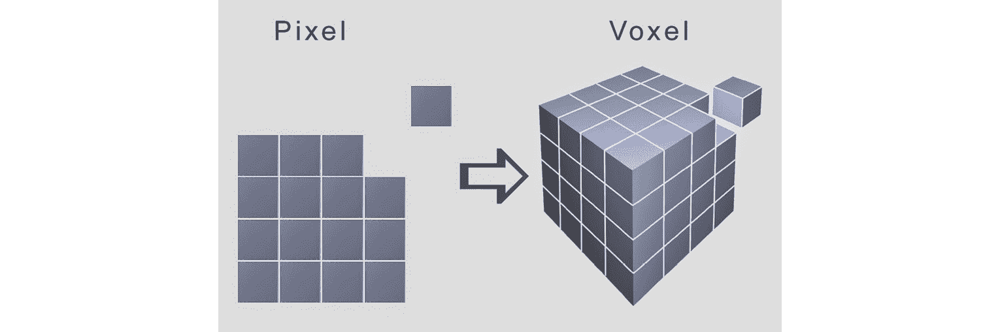
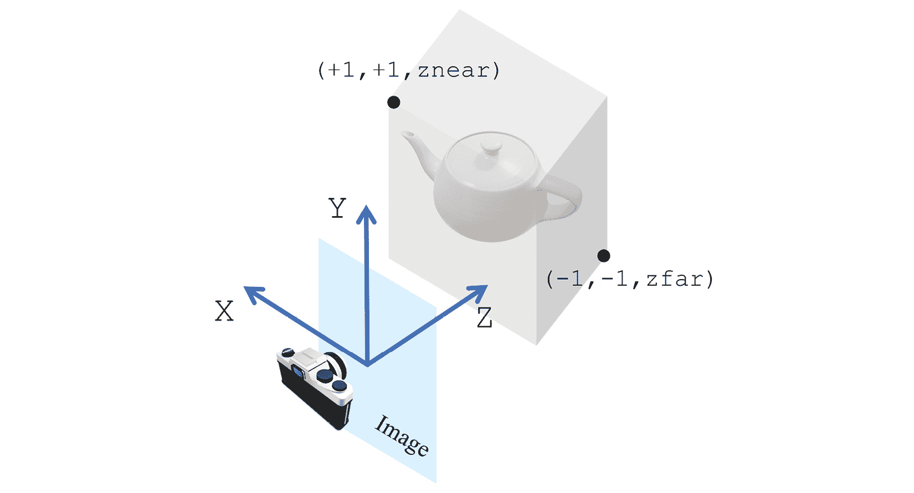
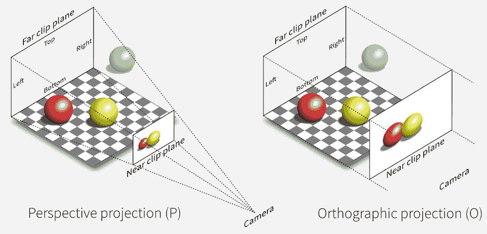

# 第二章：引入 3D 数据处理

在本章中，我们将讨论一些对于 3D 深度学习非常基础的概念，并且这些概念将在后续章节中频繁使用。我们将从学习最常用的 3D 数据格式开始，了解我们如何操作它们并将它们转换为不同的格式。我们将首先设置我们的开发环境并安装所有必要的软件包，包括 Anaconda、Python、PyTorch 和 PyTorch3D。接着，我们将讨论最常用的 3D 数据表示方式——例如，点云、网格和体素。然后我们将介绍 3D 数据文件格式，如 PLY 和 OBJ 文件。接下来，我们将讨论 3D 坐标系统。最后，我们将讨论相机模型，这主要与 3D 数据如何映射到 2D 图像相关。

在阅读完本章后，您将能够通过检查输出数据文件轻松调试 3D 深度学习算法。通过对坐标系统和相机模型的深入理解，您将能够在此基础上进一步学习更高级的 3D 深度学习主题。

在本章中，我们将涵盖以下主要主题：

+   设置开发环境并安装 Anaconda、PyTorch 和 PyTorch3D

+   3D 数据表示

+   3D 数据格式——PLY 和 OBJ 文件

+   3D 坐标系统及其之间的转换

+   相机模型——透视相机和正交相机

# 技术要求

为了运行本书中的示例代码，您需要一台理想情况下配备 GPU 的计算机。然而，仅使用 CPU 也可以运行这些代码片段。

推荐的计算机配置包括以下内容：

+   至少配备 8GB 内存的 GPU，如 GTX 系列或 RTX 系列

+   Python 3

+   PyTorch 库和 PyTorch3D 库

本章的代码片段可以在 [`github.com/PacktPublishing/3D-Deep-Learning-with-Python`](https://github.com/PacktPublishing/3D-Deep-Learning-with-Python) 上找到。

# 设置开发环境

首先，让我们为本书中的所有编码练习设置一个开发环境。我们建议使用 Linux 机器来运行本书中的所有 Python 代码示例：

1.  我们将首先设置 Anaconda。Anaconda 是一个广泛使用的 Python 发行版，捆绑了强大的 CPython 实现。使用 Anaconda 的一个优势是它的包管理系统，使用户能够轻松创建虚拟环境。Anaconda 的个人版对于个人使用者、学生和研究人员是免费的。要安装 Anaconda，我们建议访问 [anaconda.com](http://anaconda.com) 网站获取详细的安装说明。通常，安装 Anaconda 最简单的方法是运行从其网站下载的脚本。设置好 Anaconda 后，运行以下命令创建一个 Python 3.7 的虚拟环境：

    ```py
    $ conda create -n python3d python=3.7
    ```

这个命令将创建一个 Python 3.7 版本的虚拟环境。为了使用这个虚拟环境，我们需要先激活它，方法是运行以下命令：

1.  使用以下命令激活新创建的虚拟环境：

    ```py
    $ source activate python3d
    ```

1.  安装 PyTorch。有关安装 PyTorch 的详细说明，可以在其网页 [www.pytorch.org/get-started/locally/](http://www.pytorch.org/get-started/locally/) 上找到。例如，我将在我的 Ubuntu 桌面上安装 PyTorch 1.9.1，CUDA 版本为 11.1，命令如下：

    ```py
    $ conda install pytorch torchvision torchaudio cudatoolkit-11.1 -c pytorch -c nvidia
    ```

1.  安装 PyTorch3D。PyTorch3D 是 Facebook AI Research 最近发布的一个开源 Python 库，用于 3D 计算机视觉。PyTorch3D 提供了许多实用功能，可以轻松操作 3D 数据。它的设计考虑了深度学习，几乎所有的 3D 数据都可以通过小批量处理，例如相机、点云和网格。PyTorch3D 的另一个关键特点是实现了一种非常重要的 3D 深度学习技术，称为 *可微渲染*。然而，PyTorch3D 作为 3D 深度学习库的最大优势是它与 PyTorch 的紧密结合。

PyTorch3D 可能需要一些依赖库，如何安装这些依赖库的详细说明可以在 PyTorch3D GitHub 首页找到，网址是 [github.com/facebookresearch/pytorch3d](http://github.com/facebookresearch/pytorch3d)。在按照网站上的说明安装了所有依赖项后，安装 PyTorch3D 可以通过运行以下命令轻松完成：

```py
$ conda install pytorch3d -c pytorch3d
```

现在我们已经设置好了开发环境，让我们开始学习数据表示。

# 3D 数据表示

在本节中，我们将学习最常用的 3D 数据表示方法。选择数据表示是许多 3D 深度学习系统中的一个特别重要的设计决策。例如，点云没有类似网格的结构，因此通常不能直接对其进行卷积操作。体素表示有类似网格的结构；然而，它们往往消耗大量计算机内存。在本节中，我们将更详细地讨论这些 3D 表示的优缺点。广泛使用的 3D 数据表示通常包括点云、网格和体素。

## 理解点云表示

3D 点云是 3D 物体的一种非常直观的表示方式，其中每个点云只是由多个 3D 点组成，每个 3D 点由一个三维元组（`x`、`y` 或 `z`）表示。许多深度摄像头的原始测量数据通常是 3D 点云。

从深度学习的角度来看，3D 点云是无序且不规则的数据类型。与常规图像不同，我们可以为每个像素定义邻近像素，而在点云中，每个点的邻近点没有清晰且规则的定义——也就是说，卷积通常不能应用于点云。因此，需要使用特殊类型的深度学习模型来处理点云，比如 PointNet：[`arxiv.org/abs/1612.00593`](https://arxiv.org/abs/1612.00593)。

对于点云作为 3D 深度学习训练数据的另一个问题是异构数据问题——即，对于一个训练数据集，不同的点云可能包含不同数量的 3D 点。解决这种异构数据问题的一种方法是强制所有点云具有相同数量的点。然而，这并不总是可行的——例如，深度相机返回的点数可能会随着帧的变化而不同。

异构数据可能会给小批量梯度下降训练深度学习模型带来一些困难。大多数深度学习框架假设每个小批量包含相同大小和维度的训练样本。这样的同质数据是首选，因为它可以通过现代并行处理硬件（如 GPU）最有效地处理。高效处理异构小批量数据需要额外的工作。幸运的是，PyTorch3D 提供了许多高效处理异构小批量数据的方法，这对于 3D 深度学习至关重要。

## 理解网格表示法

网格是另一种广泛使用的 3D 数据表示形式。就像点云中的点一样，每个网格包含一组称为顶点的 3D 点。此外，每个网格还包含一组称为面片的多边形，这些面片是在顶点上定义的。

在大多数数据驱动的应用中，网格是深度相机原始测量结果的后处理结果。通常，它们是在 3D 资产设计过程中手动创建的。与点云相比，网格包含额外的几何信息，编码拓扑，并且具有表面法线信息。这些额外的信息在训练学习模型时尤其有用。例如，图卷积神经网络通常将网格视为图形，并使用顶点邻域信息定义卷积操作。

就像点云一样，网格也有类似的异构数据问题。同样，PyTorch3D 提供了处理网格数据异构小批量的高效方法，这使得 3D 深度学习变得高效。

## 理解体素表示法

另一种重要的 3D 数据表示法是体素表示法。体素是 3D 计算机视觉中像素的对应物。像素是通过将 2D 矩形划分为更小的矩形来定义的，每个小矩形就是一个像素。类似地，体素是通过将 3D 立方体划分为更小的立方体来定义的，每个立方体称为一个体素。这个过程如下图所示：



图 1.1 – 体素表示法是 2D 像素表示法的 3D 对应物，其中一个立方体空间被划分成小的体积元素

体素表示法通常使用**截断有符号距离函数**（**TSDFs**）来表示 3D 表面。**有符号距离函数**（**SDF**）可以在每个体素上定义为体素中心到表面最近点的（有符号）距离。SDF 中的正号表示体素中心在物体外部。TSDF 和 SDF 之间的唯一区别在于 TSDF 的值是截断的，因此 TSDF 的值始终范围在-1 到+1 之间。

与点云和网格不同，体素表示法是有序且规则的。这个特性类似于图像中的像素，使得在深度学习模型中可以使用卷积滤波器。体素表示法的一个潜在缺点是它通常需要更多的计算机内存，但通过使用诸如哈希等技术可以减少内存需求。尽管如此，体素表示法仍然是一个重要的 3D 数据表示法。

除了这里提到的 3D 数据表示方式，还有其他的 3D 数据表示方式。例如，多视角表示法使用从不同视点拍摄的多张图像来表示一个 3D 场景。RGB-D 表示法使用一个额外的深度通道来表示一个 3D 场景。然而，在本书中，我们不会深入探讨这些 3D 表示法。现在我们已经了解了 3D 数据表示的基础知识，接下来我们将深入了解几种常用的点云和网格文件格式。

# 3D 数据文件格式 – Ply 文件

PLY 文件格式是由斯坦福大学的一组研究人员在 1990 年代中期开发的。此后，它已发展成为最广泛使用的 3D 数据文件格式之一。该文件格式有 ASCII 版本和二进制版本。在需要文件大小和处理效率的情况下，二进制版本更受偏好。ASCII 版本则使得调试变得相对容易。接下来，我们将讨论 PLY 文件的基本格式，以及如何使用 Open3D 和 PyTorch3D 加载并可视化 PLY 文件中的 3D 数据。

在本节中，我们将讨论两种最常用的数据文件格式来表示点云和网格，即 PLY 文件格式和 OBJ 文件格式。我们将讨论这些格式以及如何使用 PyTorch3D 加载和保存这些文件格式。PyTorch3D 提供了优秀的实用函数，因此使用这些实用函数可以高效且轻松地加载和保存这些文件格式。

一个示例，`cube.ply`文件，在以下代码片段中显示：

```py
ply
```

```py
format ascii 1.0
```

```py
comment created for the book 3D Deep Learning with Python
```

```py
element vertex 8
```

```py
property float32 x
```

```py
property float32 y
```

```py
property float32 z
```

```py
element face 12
```

```py
property list uint8 int32 vertex_indices
```

```py
end_header
```

```py
-1 -1 -1
```

```py
1 -1 -1
```

```py
1 1 -1
```

```py
-1 1 -1
```

```py
-1 -1 1
```

```py
1 -1 1
```

```py
1 1 1
```

```py
-1 1 1
```

```py
3 0 1 2
```

```py
3 5 4 7
```

```py
3 6 2 1
```

```py
3 3 7 4
```

```py
3 7 3 2
```

```py
3 5 1 0
```

```py
3 0 2 3
```

```py
3 5 7 6
```

```py
3 6 1 5
```

```py
3 3 4 0
```

```py
3 7 2 6
```

```py
3 5 0 4
```

正如所见，每个 PLY 文件包含一个头部和一个数据部分。每个 ASCII PLY 文件的第一行始终为`ply`，表示这是一个 PLY 文件。第二行`format ascii 1.0`表示文件是 ASCII 类型，并带有版本号 1.0。以`comment`开头的任何行将被视为注释行，因此加载 PLY 文件时计算机会忽略`comment`后的内容。`element vertex 8`行表示 PLY 文件中第一种数据类型是顶点，我们有八个顶点。`property float32 x`表示每个顶点具有名为`x`的`float32`类型属性。同样，每个顶点还具有`y`和`z`属性。在这里，每个顶点都是一个 3D 点。`element face 12 line`行表示该 PLY 文件的第二种数据类型是`face`，我们有 12 个面。`property list unit8 int32 vertex_indices`显示每个面将是一个顶点索引列表。PLY 文件的头部部分总是以`end_header`行结束。

PLY 文件数据部分的第一部分由八行组成，每行记录一个顶点。每行中的三个数字表示顶点的三个`x`、`y`和`z`属性。例如，三个数字-1, -1, -1 指定该顶点具有`x`坐标为`-1`，`y`坐标为`-1`和`z`坐标为`-1`。

PLY 文件的数据部分的第二部分由 12 行组成，每行记录一个面的数据。序列中的第一个数字表示面有多少个顶点，接下来的数字是顶点的索引。顶点的索引由 PLY 文件中声明顶点的顺序确定。

我们可以使用 Open3D 和 PyTorch3D 打开前述文件。Open3D 是一个非常方便用于可视化 3D 数据的 Python 包，而 PyTorch3D 则适用于将这些数据用于深度学习模型。以下是一个代码片段，`ply_example1.py`，用于可视化`cube.ply`文件中的网格，并将顶点和网格加载为 PyTorch 张量：

```py
import open3d
```

```py
from pytorch3d.io import load_ply
```

```py
mesh_file = "cube.ply"
```

```py
print('visualizing the mesh using open3D')
```

```py
mesh = open3d.io.read_triangle_mesh(mesh_file)
```

```py
open3d.visualization.draw_geometries([mesh],
```

```py
       mesh_show_wireframe = True,
```

```py
       mesh_show_back_face = True)
```

```py
print("Loading the same file with PyTorch3D")
```

```py
vertices, faces = load_ply(mesh_file)
```

```py
print('Type of vertices = ', type(vertices))
```

```py
print("type of faces = ", type(faces))
```

```py
print('vertices = ', vertices)
```

```py
print('faces = ', faces)
```

在前面的 Python 代码片段中，`cube.ply`网格文件首先通过`open3d`库使用`read_triangle_mesh`函数打开，并将所有 3D 数据读取到网格变量中。然后，可以使用 Open3D 库的`draw_geometries`函数来可视化该网格。当你运行这个函数时，Open3D 库将弹出一个窗口进行交互式可视化——也就是说，你可以使用鼠标进行旋转、缩放和拉近/远离网格。正如你猜到的，`cube.ply`文件定义了一个具有八个顶点和六个面的立方体网格，每个面由两个三角形组成。

我们还可以使用`PyTorch3D`库来加载相同的网格。不过，这一次，我们将获得几个 PyTorch 张量——例如，一个张量表示顶点，一个张量表示面。这些张量可以直接输入到任何 PyTorch 深度学习模型中。在这个示例中，`load_ply`函数返回一个元组，其中包含顶点和面的信息，这些信息通常采用 PyTorch 张量的格式。当你运行这个`ply_example1.py`代码片段时，返回的顶点应该是一个形状为`[8, 3]`的 PyTorch 张量——也就是说，有八个顶点，每个顶点有三个坐标。同样，返回的面应该是一个形状为`[12, 3]`的 PyTorch 张量——即有 12 个面，每个面有 3 个顶点索引。

在下面的代码片段中，我们展示了另一个`parallel_plane_mono.ply`文件的示例，该文件也可以从我们的 GitHub 仓库下载。这个示例中的网格与`cube_is.ply`文件中的网格的唯一区别在于面数的不同。在这里，我们有四个面，它们组成了两个平行平面，而不是六个立方体的面：

```py
ply
```

```py
format ascii 1.0
```

```py
comment created for the book 3D Deep Learning with Python
```

```py
element vertex 8
```

```py
property float32 x
```

```py
property float32 y
```

```py
property float32 z
```

```py
element face 4
```

```py
property list uint8 int32 vertex_indices
```

```py
end_header
```

```py
-1 -1 -1
```

```py
1 -1 -1
```

```py
1 1 -1
```

```py
-1 1 -1
```

```py
-1 -1 1
```

```py
1 -1 1
```

```py
1 1 1
```

```py
-1 1 1
```

```py
3 0 1 2
```

```py
3 0 2 3
```

```py
3 5 4 7
```

```py
3 5 7 6
```

该网格可以通过以下`ply_example2.py`进行交互式可视化：

1.  首先，我们导入所有需要的 Python 库：

    ```py
    import open3d
    from pytorch3d.io import load_ply
    ```

1.  我们使用`open3d`来加载网格：

    ```py
    mesh_file = "parallel_plane_mono.ply"
    print('visualizing the mesh using open3D')
    mesh = open3d.io.read_triangle_mesh(mesh_file)
    ```

1.  我们使用`draw_geometries`来打开一个窗口，以便与网格进行交互式可视化：

    ```py
    open3d.visualization.draw_geometries([mesh],
                      mesh_show_wireframe = True,
                      mesh_show_back_face = True)
    ```

1.  我们使用`pytorch3d`来打开相同的网格：

    ```py
    print("Loading the same file with PyTorch3D")
    vertices, faces = load_ply(mesh_file)
    ```

1.  我们可以打印出加载的顶点和面的信息。实际上，它们只是普通的 PyTorch3D 张量：

    ```py
    print('Type of vertices = ', type(vertices), ", type of faces = ", type(faces))
    print('vertices = ', vertices)
    print('faces = ', faces)
    ```

对于每个顶点，我们还可以定义除`x`、`y`和`z`坐标之外的属性。例如，我们还可以为每个顶点定义颜色。下面是`parallel_plane_color.ply`的示例：

```py
ply
```

```py
format ascii 1.0
```

```py
comment created for the book 3D Deep Learning with Python
```

```py
element vertex 8
```

```py
property float32 x
```

```py
property float32 y
```

```py
property float32 z
```

```py
property uchar red
```

```py
property uchar green
```

```py
property uchar blue
```

```py
element face 4
```

```py
property list uint8 int32 vertex_indices
```

```py
end_header
```

```py
-1 -1 -1 255 0 0
```

```py
1 -1 -1 255 0 0
```

```py
1 1 -1 255 0 0
```

```py
-1 1 -1 255 0 0
```

```py
-1 -1 1 0 0 255
```

```py
1 -1 1 0 0 255
```

```py
1 1 1 0 0 255
```

```py
-1 1 1 0 0 255
```

```py
3 0 1 2
```

```py
3 0 2 3
```

```py
3 5 4 7
```

```py
3 5 7 6
```

请注意，在前面的示例中，除了`x`、`y`和`z`外，我们还为每个顶点定义了一些额外的属性——即红色、绿色和蓝色属性，所有这些属性的类型都是`uchar`数据类型。现在，每个顶点的记录就是一行六个数字。前三个是`x`、`y`和`z`坐标，接下来的三个数字是 RGB 值。

可以通过使用`ply_example3.py`来可视化网格，如下所示：

```py
import open3d
```

```py
from pytorch3d.io import load_ply
```

```py
mesh_file = "parallel_plane_color.ply"
```

```py
print('visualizing the mesh using open3D')
```

```py
mesh = open3d.io.read_triangle_mesh(mesh_file)
```

```py
open3d.visualization.draw_geometries([mesh],
```

```py
                     mesh_show_wireframe = True,
```

```py
                     mesh_show_back_face = True)
```

```py
print("Loading the same file with PyTorch3D")
```

```py
vertices, faces = load_ply(mesh_file)
```

```py
print('Type of vertices = ', type(vertices), ", type of faces = ", type(faces))
```

```py
print('vertices = ', vertices)
```

```py
print('faces = ', faces)
```

我们还提供了`cow.ply`，这是一个真实世界的 3D 网格示例。读者可以使用`ply_example4.py`来可视化该网格。

到现在为止，我们已经讨论了 PLY 文件格式的基本元素，例如顶点和面。接下来，我们将讨论 OBJ 3D 数据格式。

# 3D 数据文件格式 - OBJ 文件

本节我们将讨论另一种广泛使用的 3D 数据文件格式——OBJ 文件格式。OBJ 文件格式最初由 Wavefront Technologies Inc. 开发。与 PLY 文件格式类似，OBJ 格式也有 ASCII 版本和二进制版本。二进制版本是专有且未公开文档的。因此，本节我们将讨论 ASCII 版本。

像前一节一样，我们将通过查看示例来学习文件格式。第一个示例 `cube.obj` 如下所示。如你所料，OBJ 文件定义了一个立方体的网格。

第一行 `mtlib ./cube.mtl` 声明了配套的 **材质模板库** (**MTL**) 文件。**MTL** 文件描述了表面阴影属性，这将在下一个代码片段中进行解释。

对于 `o cube` 行，起始字母 `o` 表明此行定义了一个物体，物体的名称是 `cube`。任何以 `#` 开头的行都是注释行——即计算机会忽略该行的其余部分。每一行以 `v` 开头，表示该行定义了一个顶点。例如，`v -0.5 -0.5 0.5` 定义了一个顶点，其 `x` 坐标为 0.5，`y` 坐标为 0.5，`z` 坐标为 0.5。每一行以 `f` 开头时，`f` 表示该行包含一个面的定义。例如，`f 1 2 3` 行定义了一个面，其三个顶点为索引为 1、2 和 3 的顶点。

`usemtl Door` 行声明了在此行之后声明的表面应使用在 MTL 文件中定义的材质属性进行阴影渲染，材质名称为 `Door`：

```py
mtllib ./cube.mtl
```

```py
o cube
```

```py
# Vertex list
```

```py
v -0.5 -0.5 0.5
```

```py
v -0.5 -0.5 -0.5
```

```py
v -0.5 0.5 -0.5
```

```py
v -0.5 0.5 0.5
```

```py
v 0.5 -0.5 0.5
```

```py
v 0.5 -0.5 -0.5
```

```py
v 0.5 0.5 -0.5
```

```py
v 0.5 0.5 0.5
```

```py
# Point/Line/Face list
```

```py
usemtl Door
```

```py
f 1 2 3
```

```py
f 6 5 8
```

```py
f 7 3 2
```

```py
f 4 8 5
```

```py
f 8 4 3
```

```py
f 6 2 1
```

```py
f 1 3 4
```

```py
f 6 8 7
```

```py
f 7 2 6
```

```py
f 4 5 1
```

```py
f 8 3 7
```

```py
f 6 1 5
```

配套的 `cube.mtl` MTL 文件如下所示。该文件定义了一个名为 `Door` 的材质属性：

```py
newmtl Door
```

```py
Ka  0.8 0.6 0.4
```

```py
Kd  0.8 0.6 0.4
```

```py
Ks  0.9 0.9 0.9
```

```py
d  1.0
```

```py
Ns  0.0
```

```py
illum 2
```

除了 `map_Kd` 以外，我们不会详细讨论这些材质属性。如果你感兴趣，可以参考标准的计算机图形学教材，如 *Computer Graphics: Principles and Practice*。我们将以下列出这些属性的一些简要描述，仅供完整性参考：

+   `Ka`：指定环境光颜色

+   `Kd`：指定漫反射颜色

+   `Ks`：指定镜面反射颜色

+   `Ns`：定义镜面高光的聚焦程度

+   `Ni`：定义光学密度（即折射率）

+   `d`：指定溶解因子

+   `illum`：指定光照模型

+   `map_Kd`：指定应用于材质漫反射反射率的颜色纹理文件

`cube.obj` 文件可以通过 Open3D 和 PyTorch3D 打开。以下代码片段 `obj_example1.py` 可以从我们的 GitHub 仓库中下载：

```py
import open3d
```

```py
from pytorch3d.io import load_obj
```

```py
mesh_file = "cube.obj"
```

```py
print('visualizing the mesh using open3D')
```

```py
mesh = open3d.io.read_triangle_mesh(mesh_file)
```

```py
open3d.visualization.draw_geometries([mesh],
```

```py
                 mesh_show_wireframe = True,
```

```py
                 mesh_show_back_face = True)
```

```py
print("Loading the same file with PyTorch3D")
```

```py
vertices, faces, aux = load_obj(mesh_file)
```

```py
print('Type of vertices = ', type(vertices))
```

```py
print("Type of faces = ", type(faces))
```

```py
print("Type of aux = ", type(aux))
```

```py
print('vertices = ', vertices)
```

```py
print('faces = ', faces)
```

```py
print('aux = ', aux)
```

在上面的代码片段中，定义的立方体网格可以通过使用 Open3D 的`draw_geometries`函数进行交互式可视化。网格将在一个窗口中显示，您可以使用鼠标旋转、缩放以及放大或缩小网格。网格也可以通过 PyTorch3D 的`load_obj`函数加载。`load_obj`函数将返回`vertices`、`faces`和`aux`变量，格式可以是 PyTorch 张量或 PyTorch 张量元组。

`obj_example1.py`代码片段的一个示例输出如下所示：

```py
visualizing the mesh using open3D
```

```py
Loading the same file with PyTorch3D
```

```py
Type of vertices =  <class 'torch.Tensor'>
```

```py
Type of faces =  <class 'pytorch3d.io.obj_io.Faces'>
```

```py
Type of aux =  <class 'pytorch3d.io.obj_io.Properties'>
```

```py
vertices =  tensor([[-0.5000, -0.5000,  0.5000],
```

```py
        [-0.5000, -0.5000, -0.5000],
```

```py
        [-0.5000,  0.5000, -0.5000],
```

```py
        [-0.5000,  0.5000,  0.5000],
```

```py
        [ 0.5000, -0.5000,  0.5000],
```

```py
        [ 0.5000, -0.5000, -0.5000],
```

```py
        [ 0.5000,  0.5000, -0.5000],
```

```py
        [ 0.5000,  0.5000,  0.5000]])
```

```py
faces =  Faces(verts_idx=tensor([[0, 1, 2],
```

```py
        [5, 4, 7],
```

```py
        [6, 2, 1],
```

```py
        ...
```

```py
        [3, 4, 0],
```

```py
        [7, 2, 6],
```

```py
        [5, 0, 4]]), normals_idx=tensor([[-1, -1, -1],
```

```py
        [-1, -1, -1],
```

```py
        [-1, -1, -1],
```

```py
        [-1, -1, -1],
```

```py
        ...
```

```py
        [-1, -1, -1],
```

```py
        [-1, -1, -1]]), textures_idx=tensor([[-1, -1, -1],
```

```py
        [-1, -1, -1],
```

```py
        [-1, -1, -1],
```

```py
        ...
```

```py
        [-1, -1, -1],
```

```py
        [-1, -1, -1]]), materials_idx=tensor([0, 0, 0, 0, 0, 0, 0, 0, 0, 0, 0, 0]))
```

```py
aux =  Properties(normals=None, verts_uvs=None, material_colors={'Door': {'ambient_color': tensor([0.8000, 0.6000, 0.4000]), 'diffuse_color': tensor([0.8000, 0.6000, 0.4000]), 'specular_color': tensor([0.9000, 0.9000, 0.9000]), 'shininess': tensor([0.])}}, texture_images={}, texture_atlas=None)
```

从这里输出的代码片段中，我们知道返回的顶点变量是一个形状为 8 x 3 的 PyTorch 张量，其中每一行是一个顶点，包含`x`、`y`和`z`坐标。返回的变量`faces`是一个包含三个 PyTorch 张量的命名元组，分别是`verts_idx`、`normals_idx`和`textures_idx`。在之前的示例中，所有`normals_idx`和`textures_idx`张量都是无效的，因为`cube.obj`没有包括法线和纹理的定义。在下一个示例中，我们将看到如何在 OBJ 文件格式中定义法线和纹理。`verts_idx`是每个面的顶点索引。请注意，这里的顶点索引是从 0 开始的，在 PyTorch3D 中，索引从 0 开始。然而，OBJ 文件中的顶点索引是从 1 开始的，索引从 1 开始。PyTorch3D 已经为我们完成了两者之间的转换。

返回变量`aux`包含一些额外的网格信息。请注意，`aux`变量的`texture_image`字段为空。纹理图像在 MTL 文件中用于定义顶点和面上的颜色。我们将在下一个示例中展示如何使用这个功能。

在第二个示例中，我们将使用一个示例`cube_texture.obj`文件来突出更多 OBJ 文件的特性。该文件如下所示。

`cube_texture.obj`文件与`cube.obj`文件类似，不同之处如下：

+   有一些以`vt`开头的附加行。每一行都声明一个具有`x`和`y`坐标的纹理顶点。每个纹理顶点定义一个颜色。该颜色是所谓纹理图像中的像素颜色，其中像素位置是纹理顶点的`x`坐标与纹理的宽度以及`y`坐标与纹理的高度。纹理图像将在`cube_texture.mtl`伴随文件中定义。

+   有一些以`vn`开头的附加行。每一行都声明一个法线向量——例如，`vn 0.000000 -1.000000 0.000000`这一行声明了一个指向负`z`轴的法线向量。

+   每个面定义行现在包含关于每个顶点的更多信息。例如，`f 2/1/1 3/2/1 4/3/1` 行包含三个顶点的定义。第一个三元组 `2/1/1` 定义了第一个顶点，第二个三元组 `3/2/1` 定义了第二个顶点，第三个三元组 `4/3/1` 定义了第三个顶点。每个这样的三元组表示顶点索引、纹理顶点索引和法向量索引。例如，`2/1/1` 定义了一个顶点，其中顶点的几何位置在第二行以 `v` 开头的定义中，颜色在第一行以 `vt` 开头的定义中，而法向量在第一行以 `vn` 开头的定义中：

```py
mtllib cube_texture.mtl
```

```py
v 1.000000 -1.000000 -1.000000
```

```py
v 1.000000 -1.000000 1.000000
```

```py
v -1.000000 -1.000000 1.000000
```

```py
v -1.000000 -1.000000 -1.000000
```

```py
v 1.000000 1.000000 -0.999999
```

```py
v 0.999999 1.000000 1.000001
```

```py
v -1.000000 1.000000 1.000000
```

```py
v -1.000000 1.000000 -1.000000
```

```py
vt 1.000000 0.333333
```

```py
vt 1.000000 0.666667
```

```py
vt 0.666667 0.666667
```

```py
vt 0.666667 0.333333
```

```py
vt 0.666667 0.000000
```

```py
vt 0.000000 0.333333
```

```py
vt 0.000000 0.000000
```

```py
vt 0.333333 0.000000
```

```py
vt 0.333333 1.000000
```

```py
vt 0.000000 1.000000
```

```py
vt 0.000000 0.666667
```

```py
vt 0.333333 0.333333
```

```py
vt 0.333333 0.666667
```

```py
vt 1.000000 0.000000
```

```py
vn 0.000000 -1.000000 0.000000
```

```py
vn 0.000000 1.000000 0.000000
```

```py
vn 1.000000 0.000000 0.000000
```

```py
vn -0.000000 0.000000 1.000000
```

```py
vn -1.000000 -0.000000 -0.000000
```

```py
vn 0.000000 0.000000 -1.000000
```

```py
g main
```

```py
usemtl Skin
```

```py
s 1
```

```py
f 2/1/1 3/2/1 4/3/1
```

```py
f 8/1/2 7/4/2 6/5/2
```

```py
f 5/6/3 6/7/3 2/8/3
```

```py
f 6/8/4 7/5/4 3/4/4
```

```py
f 3/9/5 7/10/5 8/11/5
```

```py
f 1/12/6 4/13/6 8/11/6
```

```py
f 1/4/1 2/1/1 4/3/1
```

```py
f 5/14/2 8/1/2 6/5/2
```

```py
f 1/12/3 5/6/3 2/8/3
```

```py
f 2/12/4 6/8/4 3/4/4
```

```py
f 4/13/5 3/9/5 8/11/5
```

```py
f 5/6/6 1/12/6 8/11/6
```

`cube_texture.mtl` 的伴随文件如下，其中以 `map_Kd` 开头的行声明了纹理图像。在这里，`wal67ar_small.jpg` 是一个 250 x 250 的 RGB 图像文件，和 MTL 文件在同一文件夹中：

```py
newmtl Skin
```

```py
Ka 0.200000 0.200000 0.200000
```

```py
Kd 0.827451 0.792157 0.772549
```

```py
Ks 0.000000 0.000000 0.000000
```

```py
Ns 0.000000
```

```py
map_Kd ./wal67ar_small.jpg
```

我们可以使用 Open3D 和 PyTorch3D 来加载 `cube_texture.obj` 文件中的网格，例如，通过使用以下 `obj_example2.py` 文件：

```py
import open3d
```

```py
from pytorch3d.io import load_obj
```

```py
import torch
```

```py
mesh_file = "cube_texture.obj"
```

```py
print('visualizing the mesh using open3D')
```

```py
mesh = open3d.io.read_triangle_mesh(mesh_file)
```

```py
open3d.visualization.draw_geometries([mesh],
```

```py
                  mesh_show_wireframe = True,
```

```py
                  mesh_show_back_face = True)
```

```py
print("Loading the same file with PyTorch3D")
```

```py
vertices, faces, aux = load_obj(mesh_file)
```

```py
print('Type of vertices = ', type(vertices))
```

```py
print("Type of faces = ", type(faces))
```

```py
print("Type of aux = ", type(aux))
```

```py
print('vertices = ', vertices)
```

```py
print('faces = ', faces)
```

```py
print('aux = ', aux)
```

```py
texture_images = getattr(aux, 'texture_images')
```

```py
print('texture_images type = ', type(texture_images))
```

```py
print(texture_images['Skin'].shape)
```

`obj_example2.py` 代码片段的输出应如下所示：

```py
visualizing the mesh using open3D
```

```py
Loading the same file with PyTorch3D
```

```py
Type of vertices =  <class 'torch.Tensor'>
```

```py
Type of faces =  <class 'pytorch3d.io.obj_io.Faces'>
```

```py
Type of aux =  <class 'pytorch3d.io.obj_io.Properties'>
```

```py
vertices =  tensor([[ 1.0000, -1.0000, -1.0000],
```

```py
        [ 1.0000, -1.0000,  1.0000],
```

```py
        [-1.0000, -1.0000,  1.0000],
```

```py
        [-1.0000, -1.0000, -1.0000],
```

```py
        [ 1.0000,  1.0000, -1.0000],
```

```py
        [ 1.0000,  1.0000,  1.0000],
```

```py
        [-1.0000,  1.0000,  1.0000],
```

```py
        [-1.0000,  1.0000, -1.0000]])
```

```py
faces =  Faces(verts_idx=tensor([[1, 2, 3],
```

```py
        [7, 6, 5],
```

```py
        [4, 5, 1],
```

```py
        [5, 6, 2],
```

```py
        [2, 6, 7],
```

```py
        [0, 3, 7],
```

```py
        [0, 1, 3],
```

```py
        ...
```

```py
        [3, 3, 3],
```

```py
        [4, 4, 4],
```

```py
        [5, 5, 5]]), textures_idx=tensor([[ 0,  1,  2],
```

```py
        [ 0,  3,  4],
```

```py
        [ 5,  6,  7],
```

```py
        [ 7,  4,  3],
```

```py
        [ 8,  9, 10],
```

```py
        [11, 12, 10],
```

```py
        ...
```

```py
        [12,  8, 10],
```

```py
        [ 5, 11, 10]]), materials_idx=tensor([0, 0, 0, 0, 0, 0, 0, 0, 0, 0, 0, 0]))
```

```py
aux =  Properties(normals=tensor([[ 0., -1.,  0.],
```

```py
        [ 0.,  1.,  0.],
```

```py
        [ 1.,  0.,  0.],
```

```py
        [-0.,  0.,  1.],
```

```py
        [-1., -0., -0.],
```

```py
        [ 0.,  0., -1.]]), verts_uvs=tensor([[1.0000, 0.3333],
```

```py
        ...
```

```py
        [0.3333, 0.6667],
```

```py
        [1.0000, 0.0000]]), material_colors={'Skin': {'ambient_color': tensor([0.2000, 0.2000, 0.2000]), 'diffuse_color': tensor([0.8275, 0.7922, 0.7725]), 'specular_color': tensor([0., 0., 0.]), 'shininess': tensor([0.])}}, texture_images={'Skin': tensor([[[0.2078, 0.1765, 0.1020],
```

```py
         [0.2039, 0.1725, 0.0980],
```

```py
         [0.1961, 0.1647, 0.0902],
```

```py
         ...,
```

```py
          [0.2235, 0.1882, 0.1294]]])}, texture_atlas=None)
```

```py
texture_images type =  <class 'dict'>
```

```py
Skin
```

```py
torch.Size([250, 250, 3])
```

注意

这不是完整的输出；请在运行代码时检查这个。

与 `obj_example1.py` 代码片段的输出相比，前面的输出有以下不同：

+   `faces` 变量的 `normals_idx` 和 `textures_idx` 字段现在都包含有效的索引，而不是取 `-1` 的值。

+   `aux` 变量的 `normals` 字段现在是一个 PyTorch 张量，而不是 `None`。

+   `aux` 变量的 `verts_uvs` 字段现在是一个 PyTorch 张量，而不是 `None`。

+   `aux` 变量的 `texture_images` 字段不再是一个空字典。`texture_images` 字典包含一个条目，其中键为 `Skin`，值为一个形状为 (250, 250, 3) 的 PyTorch 张量。这个张量与 `mtl_texture.mtl` 文件中定义的 `wal67ar_small.jpg` 文件中的图像完全相同。

我们已经学会了如何使用基本的 3D 数据文件格式，以及 PLY 和 OBJ 文件。在下一节中，我们将学习 3D 坐标系的基本概念。

# 理解 3D 坐标系

在本节中，我们将学习 PyTorch3D 中常用的坐标系。本节内容改编自 PyTorch 的摄像机坐标系文档：[`pytorch3d.org/docs/cameras`](https://pytorch3d.org/docs/cameras)。为了理解和使用 PyTorch3D 渲染系统，我们通常需要了解这些坐标系及其使用方法。如前所述，3D 数据可以通过点、面和体素来表示。每个点的位置可以通过一组 `x`、`y` 和 `z` 坐标来表示，相对于某个特定的坐标系。我们通常需要定义并使用多个坐标系，具体取决于哪一个最方便。


图 1.2 – 世界坐标系统，其中原点和轴是独立于相机位置定义的

我们经常使用的第一个坐标系统被称为**世界坐标系统**。这个坐标系统是相对于所有 3D 对象选择的 3D 坐标系统，以便可以轻松确定 3D 对象的位置。通常，世界坐标系统的轴与物体的朝向或相机的朝向不一致。因此，世界坐标系统的原点与物体和相机的朝向之间存在一些非零的旋转和平移。以下是一个展示世界坐标系统的图示：


图 1.3 – 相机视图坐标系统，其中原点位于相机投影中心，三个轴根据成像平面定义

由于世界坐标系统的轴通常与相机的朝向不一致，因此在许多情况下，定义并使用相机视图坐标系统会更为方便。在 PyTorch3D 中，相机视图坐标系统被定义为原点位于相机的投影点，`x` 轴指向左侧，`y` 轴指向上方，`z` 轴指向前方。



图 1.4 – NDC 坐标系统，其中体积被限制在相机可以渲染的范围内

**标准化设备坐标** (**NDC**) 限制了相机可以渲染的体积。NDC 空间中的 `x` 坐标值范围从 -1 到 +1，`y` 坐标值也是如此。`z` 坐标值的范围从 znear 到 zfar，其中 znear 是最近的深度，zfar 是最远的深度。任何超出这个 znear 到 zfar 范围的物体都不会被相机渲染。

最后，屏幕坐标系统是根据渲染图像在我们屏幕上显示的方式定义的。该坐标系统包含 `x` 坐标作为像素的列，`y` 坐标作为像素的行，`z` 坐标对应物体的深度。

为了在我们的 2D 屏幕上正确渲染 3D 物体，我们需要在这些坐标系统之间进行切换。幸运的是，这些转换可以通过使用 PyTorch3D 相机模型轻松完成。在我们讨论相机模型后，将更详细地讨论坐标转换。

# 理解相机模型

在本节中，我们将学习相机模型。在 3D 深度学习中，通常我们需要使用 2D 图像进行 3D 检测。要么是从 2D 图像中单独检测 3D 信息，要么是将 2D 图像与深度信息融合以获得更高的准确性。尽管如此，相机模型在建立 2D 空间与 3D 世界之间的对应关系时至关重要。

在 PyTorch3D 中，有两种主要的相机模型，分别是由`OrthographicCameras`类定义的正交相机和由`PerspectiveCameras`类定义的透视相机模型。下图展示了这两种相机模型之间的区别。



图 1.5 – PyTorch3D 中实现的两种主要相机模型，透视和正交

正交相机使用正交投影将 3D 世界中的物体映射到 2D 图像，而透视相机使用透视投影将 3D 世界中的物体映射到 2D 图像。正交投影将物体映射到 2D 图像时不考虑物体的深度。例如，如图所示，两个在不同深度但几何大小相同的物体将被映射到相同大小的 2D 图像上。而在透视投影中，如果物体远离相机，它将在 2D 图像上被映射为更小的大小。

现在我们已经了解了相机模型的基本概念，接下来让我们通过一些编码示例来看一下如何创建和使用这些相机模型。

# 相机模型和坐标系的编码

在本节中，我们将利用所学的所有知识，构建一个具体的相机模型，并在不同坐标系之间进行转换，使用一个用 Python 和 PyTorch3D 编写的具体代码示例：

1.  首先，我们将使用由`cube.obj`文件定义的以下网格。基本上，这个网格是一个立方体：

    ```py
    mtllib ./cube.mtl
    o cube
    # Vertex list
    v -50 -50 20
    v -50 -50 10
    v -50 50 10
    v -50 50 20
    v 50 -50 20
    v 50 -50 10
    v 50 50 10
    v 50 50 20
    # Point/Line/Face list
    usemtl Door
    f 1 2 3
    f 6 5 8
    f 7 3 2
    f 4 8 5
    f 8 4 3
    f 6 2 1
    f 1 3 4
    f 6 8 7
    f 7 2 6
    f 4 5 1
    f 8 3 7
    f 6 1 5
    # End of file
    ```

示例代码片段是`camera.py`，可以从本书的 GitHub 仓库中下载。

1.  让我们导入所有需要的模块：

    ```py
    import open3d
    import torch
    import pytorch3d
    from pytorch3d.io import load_obj
    from scipy.spatial.transform import Rotation as Rotation
    from pytorch3d.renderer.cameras import PerspectiveCameras
    ```

1.  我们可以通过使用 Open3D 的`draw_geometrics`函数加载并可视化网格：

    ```py
    #Load meshes and visualize it with Open3D
    mesh_file = "cube.obj"
    print('visualizing the mesh using open3D')
    mesh = open3d.io.read_triangle_mesh(mesh_file)
    open3d.visualization.draw_geometries([mesh],
                     mesh_show_wireframe = True,
                     mesh_show_back_face = True)
    ```

1.  我们定义了一个`camera`变量，作为一个 PyTorch3D 的`PerspectiveCamera`对象。这里的相机实际上是 mini-batched 的。例如，旋转矩阵 R 是一个形状为[8, 3, 3]的 PyTorch 张量，它实际上定义了八个相机，每个相机都有一个旋转矩阵。其他所有相机参数，如图像大小、焦距和主点，也是同样的情况：

    ```py
    #Define a mini-batch of 8 cameras
    image_size = torch.ones(8, 2)
    image_size[:,0] = image_size[:,0] * 1024
    image_size[:,1] = image_size[:,1] * 512
    image_size = image_size.cuda()
    focal_length = torch.ones(8, 2)
    focal_length[:,0] = focal_length[:,0] * 1200
    focal_length[:,1] = focal_length[:,1] * 300
    focal_length = focal_length.cuda()
    principal_point = torch.ones(8, 2)
    principal_point[:,0] = principal_point[:,0] * 512
    principal_point[:,1] = principal_point[:,1] * 256
    principal_point = principal_point.cuda()
    R = Rotation.from_euler('zyx', [
        [n*5, n, n]  for n in range(-4, 4, 1)], degrees=True).as_matrix()
    R = torch.from_numpy(R).cuda()
    T = [ [n, 0, 0] for n in range(-4, 4, 1)]
    T = torch.FloatTensor(T).cuda()
    camera = PerspectiveCameras(focal_length = focal_length,
                                principal_point = principal_point,
                                in_ndc = False,
                                image_size = image_size,
                                R = R,
                                T = T,
                                device = 'cuda')
    ```

1.  一旦我们定义了相机变量，就可以调用 `get_world_to_view_transform` 类成员方法来获取一个 `Transform3d` 对象，即 `world_to_view_transform`。然后，我们可以使用 `transform_points` 成员方法将世界坐标转换为相机视图坐标。同样地，我们还可以使用 `get_full_projection_transform` 成员方法来获取一个 `Transform3d` 对象，该对象用于将世界坐标转换为屏幕坐标：

    ```py
    world_to_view_transform = camera.get_world_to_view_transform()
    world_to_screen_transform = camera.get_full_projection_transform()
    #Load meshes using PyTorch3D
    vertices, faces, aux = load_obj(mesh_file)
    vertices = vertices.cuda()
    world_to_view_vertices = world_to_view_transform.transform_points(vertices)
    world_to_screen_vertices = world_to_screen_transform.transform_points(vertices)
    print('world_to_view_vertices = ', world_to_view_vertices)
    print('world_to_screen_vertices = ', world_to_screen_vertices
    ```

代码示例展示了如何使用 PyTorch3D 相机的基本方法，以及如何使用 PyTorch3D 在不同坐标系之间切换的简便性。

# 总结

在本章中，我们首先学习了如何设置开发环境。接着，我们讨论了最广泛使用的 3D 数据表示方法。然后，我们通过学习 3D 数据文件格式，如 PLY 格式和 OBJ 格式，来探讨了 3D 数据表示的具体实例。之后，我们了解了 3D 坐标系统和相机模型的基本概念。在本章的最后部分，我们通过实际编程示例学习了如何构建相机模型并在不同坐标系统之间进行转换。

在下一章，我们将讨论更多重要的 3D 深度学习概念，如渲染将 3D 模型转换为 2D 图像、异构小批量处理以及几种表示旋转的方法。
