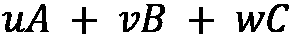
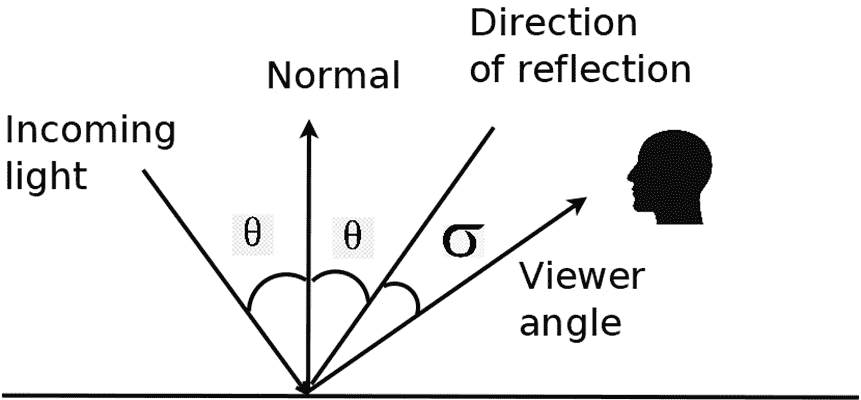

# 第三章：介绍 3D 计算机视觉与几何学

在本章中，我们将学习一些 3D 计算机视觉和几何的基本概念，这些概念将特别有助于本书后续章节的内容。我们将从讨论渲染、光栅化和着色开始。我们将讲解不同的光照模型和着色模型，如点光源、方向光源、环境光、漫反射、高光和光泽度。我们将通过一个示例代码，展示如何使用不同的光照模型和参数来渲染网格模型。

然后，我们将学习如何使用 PyTorch 来解决优化问题。特别是，我们将学习如何使用 PyTorch3D 进行异构小批量的随机梯度下降。我们还将学习 PyTorch3D 中小批量的不同格式，包括列表格式、填充格式和打包格式，并学习如何在这些格式之间转换。

在本章的最后部分，我们将讨论一些常用的旋转表示方法，以及如何在这些表示之间进行转换。

在本章中，我们将涵盖以下主题：

+   探索渲染、光栅化和着色的基本概念

+   了解 Lambertian 着色模型和 Phong 着色模型

+   如何定义 PyTorch 张量，并使用优化器优化张量

+   如何定义小批量、异构小批量以及打包和填充张量

+   旋转及描述旋转的不同方法

+   在 SE(3)空间中的指数映射和对数映射

# 技术要求

要运行本书中的示例代码片段，读者需要拥有一台计算机，最好配备 GPU。然而，仅使用 CPU 运行代码片段也是可能的。

推荐的计算机配置包括以下内容：

+   一台现代 GPU——例如，具有至少 8GB 内存的 Nvidia GTX 系列或 RTX 系列

+   Python 3

+   PyTorch 库和 PyTorch3D 库

本章中的代码片段可以在[`github.com/PacktPublishing/3D-Deep-Learning-with-Python.`](https://github.com/PacktPublishing/3D-Deep-Learning-with-Python)找到

# 探索渲染、光栅化和着色的基本概念

**渲染**是一个过程，它将周围世界的 3D 数据模型作为输入，并输出图像。这是对现实世界中相机形成图像的物理过程的近似。通常，3D 数据模型是网格。在这种情况下，渲染通常通过光线追踪完成：


图 2.1：光线追踪渲染（光线从相机原点发射，并通过图像像素查找相关网格面）

光线追踪处理的示例如 *图 2.1* 所示。在该示例中，世界模型包含一个 3D 球体，该球体由一个网格模型表示。为了形成 3D 球体的图像，对于每个图像像素，我们生成一条射线，从相机原点出发并穿过图像像素。如果一条射线与一个网格面相交，那么我们知道该网格面可以将其颜色投射到图像像素上。我们还需要追踪每次相交的深度，因为具有较小深度的面会遮挡具有较大深度的面。

因此，渲染过程通常可以分为两个阶段——光栅化和着色。光线追踪过程是典型的光栅化过程——即为每个图像像素找到相关几何对象的过程。着色是根据光栅化的输出计算每个图像像素的像素值的过程。

PyTorch3D 中的 `pytorch3d.renderer.mesh.rasterize_meshes.rasterize_meshes` 函数通常为每个图像像素计算以下四个内容：

+   `pix_to_face` 是一个包含射线可能与之相交的面索引的列表。

+   `zbuf` 是一个包含这些面深度值的列表。

+   `bary_coords` 是一个包含每个面与射线交点的重心坐标的列表。

+   `pix_dists` 是一个包含像素（*x* 和 *y*）与所有相交面的最近点之间符号距离的列表。由于它包含符号距离，因此该列表的值可以为负值。

请注意，通常具有最小深度的一个面会遮挡所有深度更大的网格面。因此，如果我们只需要渲染图像，那么这个列表中只需要包含最小深度的面。然而，在更高级的可微渲染设置下（我们将在本书后面的章节中讨论），像素颜色通常是从多个网格面融合而来的。

## 理解重心坐标

对于与网格面共面的每个点，该点的坐标总可以表示为网格面三个顶点坐标的线性组合。例如，如下图所示，点 p 可以表示为 ，其中 *A*、*B* 和 *C* 是网格面三个顶点的坐标。因此，我们可以用系数 u、v 和 w 来表示每个这样的点。这个表示方法称为该点的重心坐标。如果点位于网格面三角形内，`u + v + w = 1`，且所有 u、v、w 均为正数。由于重心坐标将面内的任何点定义为面顶点的函数，我们可以使用相同的系数根据在面顶点处定义的属性在整个面上插值其他属性。例如，我们可以将其用于着色，如 *图 2.2* 所示：


图 2.2：重心坐标系的定义

一旦我们有了`pix_to_face`、`zbuf`、`bary_coords`和`dists`值的列表，着色过程就会模拟现实世界中图像形成的物理过程。因此，我们将讨论几种颜色形成的物理模型。

## 光源模型

现实世界中的光传播可能是一个复杂的过程。为了减少计算成本，着色中通常会使用几种光源的近似模型：

+   第一个假设是环境光照，我们假设在足够反射后会有一些背景光辐射，这些光通常从各个方向发出，且所有图像像素的振幅几乎相同。

+   我们通常使用的另一个假设是，某些光源可以被视为点光源。点光源从一个单一的点发出光线，所有方向的辐射具有相同的颜色和振幅。

+   我们通常使用的第三个假设是，某些光源可以被建模为定向光源。在这种情况下，光源发出的光线在所有三维空间位置上的方向是相同的。定向光照是当光源远离渲染物体时的良好近似模型——例如，阳光。

## 了解 Lambertian 着色模型

我们将讨论的第一个物理模型是 Lambert 的余弦定律。Lambertian 表面是指那些完全不光亮的物体类型，如纸张、未加工的木材和未抛光的石头：


图 2.3：光在 Lambertian 表面上的扩散

*图 2.3* 显示了光如何在 Lambertian 表面上扩散的示例。Lambertian 余弦定律的一个基本思想是，对于 Lambertian 表面，反射光的振幅不依赖于观察者的角度，而仅仅依赖于表面法线与入射光方向之间的角度 。更准确地说，反射光的强度  如下：


在这里，`c[r]`是材料的反射系数，`c[l]`是入射光的振幅。如果我们进一步考虑环境光，反射光的振幅如下：


在这里，`c[a]`是环境光的振幅。

## 了解 Phong 光照模型

对于光滑的表面，如抛光瓷砖地板和光泽涂料，反射光也包含一个高光成分。Phong 光照模型是处理这些光泽成分的常用模型：



图 2.4：Phong 光照模型

Phong 光照模型的示例如*图 2**.4*所示。Phong 光照模型的一个基本原理是，光泽光成分应该在入射光反射方向上最强。随着反射方向和观察角度之间的角度  变大，光泽成分会变弱。

更准确地说，光泽光组件的振幅  等于以下公式：


在这里，指数  是模型的一个参数，用于控制光泽成分在观察角度偏离反射方向时衰减的速度。

最后，如果我们考虑所有三大主要成分——环境光、漫反射和高光——那么光的最终振幅方程如下：


请注意，前述方程适用于每个颜色成分。换句话说，我们会为每个颜色通道（红色、绿色和蓝色）分别有一个这样的方程，并且有一组独特的  值：

现在，我们已经了解了渲染、光栅化和渲染的基本概念。我们还学习了不同的光源模型和着色模型。我们已经准备好进行一些编码练习，利用这些光源和着色模型。

# 3D 渲染的编码练习

在本节中，我们将通过使用 PyTorch3D 渲染网格模型来进行一个具体的编码练习。我们将学习如何定义摄像机模型以及如何在 PyTorch3D 中定义光源。我们还将学习如何更改输入的光成分和材质属性，以便通过控制三种光成分（环境光、漫反射和高光）渲染出更逼真的图像：

1.  首先，我们需要导入所有需要的 Python 模块：

    ```py
    import open3d
    import os
    import sys
    import torch
    import matplotlib.pyplot as plt
    from pytorch3d.io import load_objs_as_meshes
    from pytorch3d.renderer import (
        look_at_view_transform,
        PerspectiveCameras,
        PerspectiveCameras,
        PointLights,
        Materials,
        RasterizationSettings,
        MeshRenderer,
        MeshRasterizer
    )
    from pytorch3d.renderer.mesh.shader import HardPhongShader
    sys.path.append(os.path.abspath(''))
    ```

1.  然后，我们需要加载将要使用的网格。`cow.obj` 文件包含一个玩具牛对象的网格模型：

    ```py
    DATA_DIR = "./data"
    obj_filename = os.path.join(DATA_DIR, "cow_mesh/cow.obj")
    device = torch.device('cuda')
    mesh = load_objs_as_meshes([obj_filename], device=device)
    ```

1.  接下来，我们将定义摄像机和光源。我们使用 `look_at_view_transform` 函数来映射易于理解的参数，如摄像机与物体的距离、俯仰角度和方位角度，从而得到旋转（R）和位移（T）矩阵。`R` 和 `T` 变量定义了我们将如何放置摄像机。`lights` 变量是一个放置在 `[0.0, 0.0, -3.0]` 位置的点光源：

    ```py
    R, T = look_at_view_transform(2.7, 0, 180)
    cameras = PerspectiveCameras(device=device, R=R, T=T)
    lights = PointLights(device=device, location=[[0.0, 0.0, -3.0]])
    ```

1.  我们将定义一个`renderer`变量，它是`MeshRenderer`类型的。`renderer`变量是一个可调用对象，可以接受网格作为输入并输出渲染图像。注意，渲染器的初始化需要两个输入——一个光栅化器和一个着色器。PyTorch3D 已经定义了几种不同类型的光栅化器和着色器。在这里，我们将使用`MeshRasterizer`和`HardPhongShader`。值得注意的是，我们还可以指定光栅化器的设置。`image_size`设置为`512`，这意味着渲染的图像将是 512 x 512 像素。`blur_radius`设置为`0`，`faces_per_pixel`设置为`1`。`blur_radius`和`faces_per_pixel`的设置对于可微分渲染非常有用，其中`blur_radius`应该大于`0`，而`faces_per_pixel`应该大于`1`：

    ```py
    raster_settings = RasterizationSettings(
        image_size=512,
        blur_radius=0.0,
        faces_per_pixel=1,
    )
    renderer = MeshRenderer(
        rasterizer=MeshRasterizer(
            cameras=cameras,
            raster_settings=raster_settings
        ),
        shader = HardPhongShader(
            device = device,
            cameras = cameras,
            lights = lights
        )
    )
    ```

1.  因此，我们已经准备好通过调用渲染器并传递网格模型来运行第一次渲染结果。渲染图像如*图 2.5*所示：

    ```py
    images = renderer(mesh)
    plt.figure(figsize=(10, 10))
    plt.imshow(images[0, ..., :3].cpu().numpy())
    plt.axis("off")
    plt.savefig('light_at_front.png')
    plt.show()
    ```


图 2.5：光源放置在前方时的渲染图像

1.  接下来，我们将把光源的位置改变到网格的后面，看看会发生什么。渲染图像如*图 2.6*所示。在这种情况下，点光源发出的光无法与任何朝向我们的网格面相交。因此，我们能观察到的所有颜色都是由于环境光造成的：

    ```py
    lights.location = torch.tensor([0.0, 0.0, +1.0], device=device)[None]
    images = renderer(mesh, lights=lights, )
    plt.figure(figsize=(10, 10))
    plt.imshow(images[0, ..., :3].cpu().numpy())
    plt.axis("off")
    plt.savefig('light_at_back.png')
    plt.show()
    ```


图 2.6：光源放置在玩具牛后方时的渲染图像

1.  在接下来的实验中，我们将定义一个`materials`数据结构。在这里，我们更改配置，使得环境光成分接近 0（实际上为`0.01`）。由于点光源位于物体后面，且环境光也被关闭，渲染的物体现在不再反射任何光。渲染图像如*图 2.7*所示：

    ```py
    materials = Materials(
        device=device,
        specular_color=[[0.0, 1.0, 0.0]],
        shininess=10.0,
        ambient_color=((0.01, 0.01, 0.01),),
    )
    images = renderer(mesh, lights=lights, materials = materials)
    plt.figure(figsize=(10, 10))
    plt.imshow(images[0, ..., :3].cpu().numpy())
    plt.axis("off")
    plt.savefig('dark.png')
    plt.show()
    ```


图 2.7：没有环境光且点光源位于玩具牛后方的渲染图像

1.  在接下来的实验中，我们将再次旋转相机，并重新定义光源位置，使光线能够照射到牛的面部。请注意，在定义材质时，我们将`shininess`设置为`10.0`。这个`shininess`参数正是 Phong 光照模型中的`p`参数。`specular_color`是`[0.0, 1.0, 0.0]`，这意味着表面在绿色成分上光泽最强。渲染结果如*图 2.8*所示：

    ```py
    R, T = look_at_view_transform(dist=2.7, elev=10, azim=-150)
    cameras = PerspectiveCameras(device=device, R=R, T=T)
    lights.location = torch.tensor([[2.0, 2.0, -2.0]], device=device)
    materials = Materials(
        device=device,
        specular_color=[[0.0, 1.0, 0.0]],
        shininess=10.0
    )
    images = renderer(mesh, lights=lights, materials=materials, cameras=cameras)
    plt.figure(figsize=(10, 10))
    plt.imshow(images[0, ..., :3].cpu().numpy())
    plt.axis("off")
    plt.savefig('green.png')
    plt.show()
    ```


图 2.8：带有镜面光照成分的渲染图像

1.  在下一个实验中，我们将把`specular_color`改为`red`并增加`shininess`值。结果见*图 2.9*：

    ```py
    materials = Materials(
        device=device,
        specular_color=[[1.0, 0.0, 0.0]],
        shininess=20.0
    )
    images = renderer(mesh, lights=lights, materials=materials, cameras=cameras)
    plt.figure(figsize=(10, 10))
    plt.imshow(images[0, ..., :3].cpu().numpy())
    plt.savefig('red.png')
    plt.axis("off")
    plt.show()
    ```


图 2.9：带有红色高光颜色的渲染图像

1.  最后，我们关闭了高光效果，结果见*图 2.10*：

    ```py
    materials = Materials(
        device=device,
        specular_color=[[0.0, 0.0, 0.0]],
        shininess=0.0
    )
    images = renderer(mesh, lights=lights, materials=materials, cameras=cameras)
    plt.figure(figsize=(10, 10))
    plt.imshow(images[0, ..., :3].cpu().numpy())
    plt.savefig('blue.png')
    plt.axis("off")
    plt.show()
    ```


图 2.10：没有高光成分的渲染图像

在本章的第一部分，我们主要讨论了渲染和阴影，它们对 3D 计算机视觉至关重要。接下来，我们将讨论另一个对 3D 深度学习非常重要的话题——优化中的异构批次问题。

# 使用 PyTorch3D 异构批次和 PyTorch 优化器

本节中，我们将学习如何在 PyTorch3D 异构小批次上使用 PyTorch 优化器。在深度学习中，我们通常会获得一个数据示例列表，如下所示– `{(x[1], y[1]), (x[2], y[2]), ..., (x[n], y[n])}}`.. 这里，`x[i]`是观察值，`y[i]`是预测值。例如，`x[i]`可能是一些图像，而`y[i]`是实际的分类结果——例如，“猫”或“狗”。然后，训练一个深度神经网络，使得神经网络的输出尽可能接近`y[i]`。通常，定义一个神经网络输出与`y[i]`之间的损失函数，使得损失函数值随着神经网络输出接近`y[i]`而减小。

因此，训练深度学习网络通常是通过最小化在所有训练数据示例上评估的损失函数来完成的，`x[i]`和`y[i]`。许多优化算法中常用的一种直接方法是首先计算梯度，如下方程所示，然后沿负梯度方向修改神经网络的参数。在方程中，*f*代表神经网络，它以`x[i]`为输入，参数为Ɵ；loss 是神经网络输出与真实预测`y[i]`之间的损失函数：


然而，计算这个梯度是昂贵的，因为计算成本与训练数据集的大小成正比。实际上，**随机梯度下降**（**SGD**）算法取代了原始的梯度下降算法。在 SGD 算法中，下降方向按照以下方程计算：


在这个方程中，所谓的小批量 D 是所有训练数据示例的一个小子集。小批量 D 在每次迭代中从整个训练数据示例中随机抽样。SGD 算法的计算成本远低于梯度下降算法。根据大数法则，SGD 中计算出的下降方向大致接近梯度下降的方向。普遍认为，SGD 引入了某种隐式正则化，这可能有助于深度学习模型的良好泛化性能。选择小批量大小的方法是一个需要认真考虑的重要超参数。尽管如此，SGD 算法及其变种仍然是训练深度学习模型的首选方法。

对于许多数据类型，例如图像，数据可以很容易地变得同质化。我们可以形成一个小批量的图像，所有图像具有相同的宽度、高度和通道。例如，一个包含三通道（红色、绿色和蓝色）、高度为 256、宽度为 256 的八张图像的小批量，可以构成一个 PyTorch 张量，维度为 8 x 3 x 256 x 256。通常，张量的第一维表示小批量中的数据样本索引。通常，对这种同质数据的计算可以高效地使用 GPU 完成。

另一方面，3D 数据通常是异构的。例如，一个小批量中的网格可能包含不同数量的顶点和面。高效地在 GPU 上处理这种异构数据并不是一件简单的事。异构小批量处理的编程也可能非常繁琐。幸运的是，PyTorch3D 具备非常高效地处理异构小批量的能力。我们将在下一节中讨论涉及这些 PyTorch3D 能力的编程练习。

## 一个关于异构小批量的编程练习

在本节中，我们将通过一个玩具示例来学习如何使用 PyTorch 优化器和 PyTorch3D 的异构小批量功能。在这个示例中，我们将考虑一个问题：一个深度摄像头被放置在一个未知位置，我们希望利用摄像头的感知结果估计这个未知位置。为了简化问题，我们假设摄像头的方向已知，唯一未知的是 3D 位移。

更具体地说，我们假设摄像头观察到场景中的三个物体，并且我们知道这三个物体的真实网格模型。让我们看一下使用 PyTorch 和 PyTorch3D 解决该问题的代码，如下所示：

1.  在第一步中，我们将导入所有我们将要使用的包：

    ```py
    import open3d
    import os
    import torch
    from pytorch3d.io import load_objs_as_meshes
    from pytorch3d.structures.meshes import join_meshes_as_batch
    from pytorch3d.ops import sample_points_from_meshes
    from pytorch3d.loss import chamfer_distance
    import numpy as np
    ```

1.  在下一步中，我们将使用 CPU 或 CUDA 定义一个`torch`设备：

    ```py
    if torch.cuda.is_available():
        device = torch.device("cuda:0")
    else:
        device = torch.device("cpu")
        print("WARNING: CPU only, this will be slow!")
    ```

1.  你将在这个示例中使用的网格模型已包含在代码库中，并位于`data`子文件夹下。我们将使用包含在`cube.obj`、`diamond.obj`和`dodecahedron.obj`文件中的三个网格模型。在以下代码片段中，我们使用`Open3D`库加载这些网格模型并进行可视化：

    ```py
    mesh_names = ['cube.obj', 'diamond.obj', 'dodecahedron.obj']
    data_path = './data'
    for mesh_name in mesh_names:
        mesh = open3d.io.read_triangle_mesh(os.path.join(data_path, mesh_name))
        open3d.visualization.draw_geometries([mesh],
                                      mesh_show_wireframe = True,
                                      mesh_show_back_face = True,
                                         )
    ```

1.  接下来，我们将使用 PyTorch3D 加载相同的网格并构建一个网格列表，即`mesh_list`变量：

    ```py
    mesh_list = list()
    device = torch.device('cuda')
    for mesh_name in mesh_names:
        mesh = load_objs_as_meshes([os.path.join(data_path, mesh_name)], device=device)
        mesh_list.append(mesh)
    ```

1.  最后，我们可以通过使用`join_meshes_as_batch` PyTorch3D 函数创建一个 PyTorch3D 迷你批次的网格。该函数接受一个网格列表并返回一个迷你批次的网格：

    ```py
    mesh_batch = join_meshes_as_batch(mesh_list, include_textures = False)
    ```

在每个 PyTorch3D 迷你批次中，有三种方式来表示顶点和面：

+   **列表格式**：顶点由一个张量列表表示，每个张量表示一个迷你批次中一个网格的顶点或面。

+   **填充格式**：所有顶点由一个张量表示，小的网格数据通过零填充，使得所有网格现在具有相同数量的顶点和面。

+   **打包格式**：所有顶点或面都打包到一个张量中。对于每个顶点或面，内部会跟踪它属于哪个网格。

这三种表示方法各有优缺点。然而，可以通过使用 PyTorch3D API 高效地在它们之间进行转换。

1.  下一个代码片段展示了如何从迷你批次中返回列表格式的顶点和面：

    ```py
    vertex_list = mesh_batch.verts_list()
    print('vertex_list = ', vertex_list)
    face_list = mesh_batch.faces_list()
    print('face_list = ', face_list)
    ```

1.  要返回填充格式的顶点和面，我们可以使用以下 PyTorch3D API：

    ```py
    vertex_padded = mesh_batch.verts_padded()
    print('vertex_padded = ', vertex_padded)
    face_padded = mesh_batch.faces_padded()
    print('face_padded = ', face_padded)
    ```

1.  要以打包格式获取顶点和面，我们可以使用以下代码片段：

    ```py
    vertex_packed = mesh_batch.verts_packed()
    print('vertex_packed = ', vertex_packed)
    face_packed = mesh_batch.faces_packed()
    print('face_packed = ', face_packed)
    num_vertices = vertex_packed.shape[0]
    print('num_vertices = ', num_vertices)
    ```

1.  在这个编码示例中，我们将`mesh_batch`变量视为三个物体的真实网格模型。接下来，我们将模拟这三个网格的一个有噪声并发生位移的版本。在第一步，我们要克隆真实网格模型：

    ```py
    mesh_batch_noisy = mesh_batch.clone()
    ```

1.  然后我们定义一个`motion_gt`变量来表示相机位置与原点之间的位移：

    ```py
    motion_gt = np.array([3, 4, 5])
    motion_gt = torch.as_tensor(motion_gt)
    print('motion ground truth = ', motion_gt)
    motion_gt = motion_gt[None, :]
    motion_gt = motion_gt.to(device)
    ```

1.  为了模拟有噪声的深度相机观测，我们生成一些均值为`motion_gt`的随机高斯噪声。这些噪声通过`offset_verts` PyTorch3D 函数被加到`mesh_batch_noisy`中：

    ```py
    noise = (0.1**0.5)*torch.randn(mesh_batch_noisy.verts_packed().shape).to(device)
    motion_gt = np.array([3, 4, 5])
    motion_gt = torch.as_tensor(motion_gt)
    noise = noise + motion_gt
    mesh_batch_noisy = mesh_batch_noisy.offset_verts(noise).detach()
    ```

1.  为了估计相机与原点之间的未知位移，我们将构建一个优化问题。首先，我们将定义`motion_estimate`优化变量。`torch.zeros`函数将创建一个全零的 PyTorch 张量。请注意，我们将`requires_grad`设置为`true`。这意味着当我们从`loss`函数运行梯度反向传播时，我们希望 PyTorch 自动为此变量计算梯度：

    ```py
    motion_estimate = torch.zeros(motion_gt.shape, device = device, requires_grad=True)
    ```

1.  接下来，我们将定义一个学习率为`0.1`的 PyTorch 优化器。通过将变量列表传递给优化器，我们指定了该优化问题的优化变量。在这里，优化变量是`motion_estimate`变量：

    ```py
    optimizer = torch.optim.SGD([motion_estimate], lr=0.1, momentum=0.9)
    ```

1.  主要的优化过程如下所示。基本上，我们运行随机梯度下降 200 次迭代。经过 200 次迭代后，得到的`motion_estimate`应该非常接近地面真值。

每次优化迭代可以分为以下四个步骤：

1.  在第一步，`optimizer.zero_grad()`将所有梯度值从上一次迭代计算的值重置为零。

1.  在第二步，我们计算`loss`函数。请注意，PyTorch 保留了动态计算图。换句话说，所有计算`loss`函数的步骤都会被记录下来，并在反向传播中使用。

1.  在第三步，`loss.backward()`计算从`loss`函数到 PyTorch 优化器中的优化变量的所有梯度。

1.  在第四个也是最后一步，`optimizer.step`将所有优化变量朝着减小`loss`函数的方向移动一步。

在计算`loss`函数的过程中，我们从两个网格中随机抽取 5,000 个点并计算它们的 Chamfer 距离。Chamfer 距离是两组点之间的距离。我们将在后续章节中更详细地讨论这个距离函数：

```py
for i in range(0, 200):
```

```py
    optimizer.zero_grad()
```

```py
    current_mesh_batch = mesh_batch.offset_verts(motion_estimate.repeat(num_vertices,1))
```

```py
    sample_trg = sample_points_from_meshes(current_mesh_batch, 5000)
```

```py
    sample_src = sample_points_from_meshes(mesh_batch_noisy, 5000)
```

```py
    loss, _ = chamfer_distance(sample_trg, sample_src)
```

```py
    loss.backward()
```

```py
    optimizer.step()
```

```py
    print('i = ', i, ', motion_estimation = ', motion_estimate)
```

我们可以检查优化过程是否会非常快速地收敛到`[3,4,5]`的地面真值位置。

在这个编程练习中，我们学习了如何在 PyTorch3D 中使用异构小批量。接下来，我们将讨论 3D 计算机视觉中的另一个重要概念。

# 理解变换和旋转

在 3D 深度学习和计算机视觉中，我们通常需要处理 3D 变换，例如旋转和 3D 刚性运动。PyTorch3D 在其`pytorch3d.transforms.Transform3d`类中对这些变换提供了高层封装。`Transform3d`类的一个优点是它是基于小批量处理的。因此，像 3D 深度学习中常见的那样，可以仅用几行代码就对一批网格应用小批量变换。`Transform3d`的另一个优点是梯度反向传播可以直接通过`Transform3d`进行。

PyTorch3D 还提供了许多用于 Lie 群 SO(3)和 SE(3)计算的低级 API。这里，SO(3)表示 3D 中的特殊正交群，而 SE(3)表示 3D 中的特殊欧几里得群。通俗地说，SO(3)表示所有旋转变换的集合，SE(3)表示 3D 中所有刚性变换的集合。PyTorch3D 提供了许多关于 SE(3)和 SO(3)的低级 API。

在 3D 计算机视觉中，旋转有多种表示方法。一种表示方法是旋转矩阵！[](img/29.png)。

在这个方程中，*x*是一个 3D 向量，*R*是一个 3x3 矩阵。要成为旋转矩阵，*R*需要是一个正交矩阵，且行列式为+1。因此，并非所有的 3x3 矩阵都可以是旋转矩阵。旋转矩阵的自由度是 3。

3D 旋转也可以由一个 3D 向量 *v* 来表示，其中 *v* 的方向是旋转轴。也就是说，旋转会保持 *v* 固定，并围绕 *v* 旋转其他所有物体。通常，*v* 的幅度用来表示旋转角度。

旋转的两种表示之间有各种数学联系。如果我们考虑围绕轴 *v* 以恒定速度旋转，那么旋转矩阵将成为时间 *t* 的矩阵值函数 *R(t)*。在这种情况下，*R(t)* 的梯度始终是一个斜对称矩阵，形式如下所示：


这里适用以下内容：


从这两个方程中我们可以看到，梯度的斜对称矩阵是由向量 *v* 唯一确定的，反之亦然。这个从向量 *v* 到其斜对称矩阵形式的映射通常称为帽子运算符。

从斜对称矩阵梯度到旋转矩阵的闭式公式如下。该映射被称为指数映射，用于 ：


当然，指数映射的逆映射也是存在的：


该映射被称为对数映射，用于 。

所有的帽子运算符、逆帽子运算符、指数运算和对数运算都已在 PyTorch3D 中实现。PyTorch3D 还实现了许多其他常用的 3D 操作，例如四元数操作和欧拉角。

## 转换和旋转的编码练习

在本节中，我们将通过一个编码练习来介绍如何使用 PyTorch3D 的一些低级 API：

1.  我们首先导入必要的包：

    ```py
    import torch
    from pytorch3d.transforms.so3 import so3_exp_map, so3_log_map, hat_inv, hat
    ```

1.  然后，我们使用 CPU 或 CUDA 来定义一个 PyTorch 设备：

    ```py
    if torch.cuda.is_available():
        device = torch.device("cuda:0")
    else:
        device = torch.device("cpu")
        print("WARNING: CPU only, this will be slow!")
    ```

1.  接下来，我们将定义一个包含四个旋转的小批次。在这里，每个旋转由一个 3D 向量表示。向量的方向表示旋转轴，向量的幅度表示旋转角度：

    ```py
    log_rot = torch.zeros([4, 3], device = device)
    log_rot[0, 0] = 0.001
    log_rot[0, 1] = 0.0001
    log_rot[0, 2] = 0.0002
    log_rot[1, 0] = 0.0001
    log_rot[1, 1] = 0.001
    log_rot[1, 2] = 0.0002
    log_rot[2, 0] = 0.0001
    log_rot[2, 1] = 0.0002
    log_rot[2, 2] = 0.001
    log_rot[3, 0] = 0.001
    log_rot[3, 1] = 0.002
    log_rot[3, 2] = 0.003
    ```

1.  `log_rot` 的形状是 `[4, 3]`，其中 `4` 是批大小，每个旋转由一个 3D 向量表示。我们可以使用 PyTorch3D 中的帽子运算符将它们转换为 3 x 3 斜对称矩阵表示，代码如下：

    ```py
    log_rot_hat = hat(log_rot)
    print('log_rot_hat shape = ', log_rot_hat.shape)
    print('log_rot_hat = ', log_rot_hat)
    ```

1.  从斜对称矩阵形式到 3D 向量形式的反向转换也可以使用 `hat_inv` 运算符完成：

    ```py
    log_rot_copy = hat_inv(log_rot_hat)
    print('log_rot_copy shape = ', log_rot_copy.shape)
    print('log_rot_copy = ', log_rot_copy)
    ```

1.  从梯度矩阵，我们可以通过使用 PyTorch3D 的 `so3_exp_map` 函数计算旋转矩阵：

    ```py
    rotation_matrices = so3_exp_map(log_rot)
    print('rotation_matrices = ', rotation_matrices)
    ```

1.  反向转换是 `so3_log_map`，它将旋转矩阵映射回梯度矩阵：

    ```py
    log_rot_again = so3_log_map(rotation_matrices)
    print('log_rot_again = ', log_rot_again)
    ```

这些编码练习展示了 PyTorch3D 在变换和旋转方面最常用的 API。这些 API 对于现实世界中的 3D 计算机视觉项目非常有用。

# 总结

在本章中，我们学习了渲染、光栅化和着色的基本概念，包括光源模型、兰伯特着色模型和冯氏光照模型。我们学习了如何使用 PyTorch3D 实现渲染、光栅化和着色。我们还学习了如何更改渲染过程中诸如环境光、光泽度和镜面反射颜色等参数，并探讨了这些参数如何影响渲染结果。

接下来，我们学习了如何使用 PyTorch 优化器。我们通过一个代码示例，展示了如何在 PyTorch3D 的小批量数据上使用 PyTorch 优化器。在本章的最后，我们学习了如何使用 PyTorch3D 的 API 进行不同表示、旋转和变换之间的转换。

在下一章中，我们将学习一些更高级的技巧，使用可变形网格模型来拟合真实世界的 3D 数据。

# 第二部分：使用 PyTorch3D 进行 3D 深度学习

本部分将介绍一些使用 PyTorch3D 进行基本 3D 计算机视觉处理的方法。通过使用 PyTorch3D，实施这些 3D 计算机视觉算法可能会变得更加容易。读者将获得大量与网格、点云和图像拟合相关的实践经验。

本部分包括以下章节：

+   *第三章*，*将可变形网格模型拟合到原始点云*

+   *第四章*，*通过可微分渲染进行物体姿态检测与跟踪*

+   *第五章*，*理解可微分体积渲染*

+   *第六章*，*探索神经辐射场（NeRF）*
