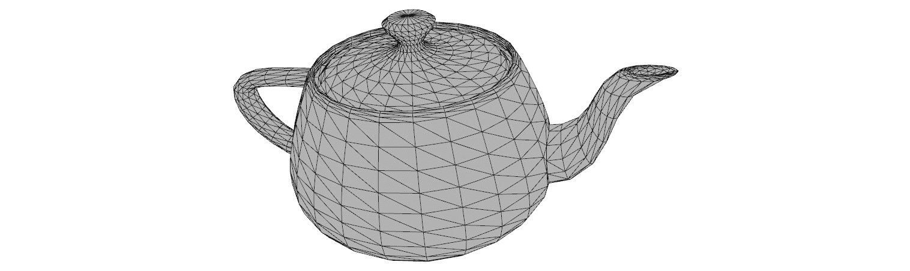

# 第五章：通过可微分渲染学习物体姿势检测与跟踪

在本章中，我们将探讨通过使用可微分渲染来进行物体姿势检测与跟踪的项目。在物体姿势检测中，我们关注的是检测某个物体的方向和位置。例如，我们可能会得到相机模型和物体网格模型，并需要根据物体的图像估计物体的方向和位置。在本章的方法中，我们将把这种姿势估计问题表述为一个优化问题，其中物体的姿势与图像观测值进行拟合。

与上述相同的方法也可以用于物体姿势跟踪，其中我们已经在第 1、2，……直到 t-1 时刻估计了物体的姿势，并希望基于物体在*t*时刻的图像观测值估计物体的姿势。

本章中我们将使用的一个重要技术叫做可微分渲染，这是当前深度学习中一个非常激动人心的主题。例如，CVPR 2021 最佳论文奖得主*GIRAFFE: 通过生成神经特征场表示场景*就将可微分渲染作为其管道中的一个重要组成部分。

渲染是将三维物理模型（例如物体的网格模型或相机模型）投影到二维图像中的过程。它是对图像形成物理过程的模拟。许多三维计算机视觉任务可以视为渲染过程的逆过程——也就是说，在许多计算机视觉问题中，我们希望从二维图像开始，估计三维物理模型（网格、点云分割、物体姿势或相机位置）。

因此，计算机视觉领域已经讨论了数十年的一个非常自然的思路是，我们可以将许多三维计算机视觉问题表述为优化问题，其中优化变量是三维模型（网格或点云体素），而目标函数则是渲染图像与观测图像之间的某种相似度度量。

为了高效地解决上述优化问题，渲染过程需要是可微分的。例如，如果渲染是可微分的，我们可以使用端到端的方法训练深度学习模型来解决该问题。然而，正如后续章节将详细讨论的那样，传统的渲染过程是不可微分的。因此，我们需要修改传统的方法使其变得可微分。我们将在接下来的章节中详细讨论如何做到这一点。

因此，在本章中，我们将首先探讨 *为什么需要可微分渲染* 问题，然后讨论 *如何解决可微分渲染问题*。接着，我们将讨论哪些 3D 计算机视觉问题通常可以通过使用可微分渲染来解决。我们将为此章节安排大量篇幅，具体介绍如何使用可微分渲染来解决物体姿态估计问题。在过程中，我们会展示代码示例。

在本章中，我们将涵盖以下主要主题：

+   为什么需要可微分渲染

+   如何使渲染可微分

+   可微分渲染能解决哪些问题

+   物体姿态估计问题

# 技术要求

为了运行本书中的示例代码，你需要一台理想情况下配备 GPU 的计算机。然而，仅使用 CPU 运行代码片段也是可行的。

推荐的计算机配置包括以下内容：

+   至少配备 8 GB 内存的 GPU，例如 GTX 系列或 RTX 系列

+   Python 3

+   PyTorch 和 PyTorch3D 库

本章的代码片段可以在 [`github.com/PacktPublishing/3D-Deep-Learning-with-Python`](https://github.com/PacktPublishing/3D-Deep-Learning-with-Python) 找到。

# 为什么我们希望使用可微分渲染

图像形成的物理过程是从 3D 模型到 2D 图像的映射。如 *图 4**.1* 所示，取决于红色和蓝色球体在 3D 空间中的位置（左侧展示了两种可能的配置），我们可能会得到不同的 2D 图像（右侧展示了对应两种配置的图像）。


图 4.1：图像形成过程是从 3D 模型到 2D 图像的映射

许多 3D 计算机视觉问题是图像形成的反向过程。在这些问题中，我们通常会获得 2D 图像，并需要从 2D 图像中估计出 3D 模型。例如，在 *图 4**.2* 中，我们给出了右侧的 2D 图像，问题是，*哪一个 3D 模型对应于* *观察到的图像？*


图 4.2：许多 3D 计算机视觉问题是基于给定的 2D 图像来估计 3D 模型

根据几十年前计算机视觉领域首次讨论的一些思想，我们可以将问题表述为优化问题。在这种情况下，这里的优化变量是两个三维球体的位置。我们希望优化这两个中心，使得渲染出的图像与前面的二维观察图像相似。为了精确衡量相似性，我们需要使用成本函数——例如，我们可以使用逐像素的均方误差。然后，我们需要计算从成本函数到两个球体中心的梯度，以便通过朝着梯度下降方向迭代地最小化成本函数。

然而，我们只能在优化变量到成本函数的映射是可微分的条件下，从成本函数计算梯度到优化变量，这意味着渲染过程也是可微分的。

# 如何使渲染过程可微分

在本节中，我们将讨论为什么传统的渲染算法不可微分。我们将讨论 PyTorch3D 中的做法，它使得渲染过程变得可微分。

渲染是图像形成物理过程的模拟。图像形成的物理过程在许多情况下本身是可微分的。假设表面法线和物体的材料属性都是平滑的。那么，在这个例子中，像素颜色是球体位置的可微分函数。

然而，在某些情况下，像素颜色不是位置的平滑函数。例如，在遮挡边界处就可能发生这种情况。这在*图 4.3*中有所展示，其中蓝色球体位于一个位置，如果蓝色球体稍微向上移动一点，就会遮挡红色球体。此时该视图中的像素位置因此不是球体中心位置的可微分函数。


图 4.3：在遮挡边界处，图像生成不是平滑的函数

当我们使用传统的渲染算法时，由于离散化，局部梯度信息会丢失。正如我们在前几章中讨论的那样，光栅化是渲染的一个步骤，其中对于成像平面上的每个像素，我们找到最相关的网格面（或者决定找不到相关的网格面）。

在传统的光栅化中，对于每个像素，我们从相机中心生成一条射线穿过成像平面上的像素。我们将找到所有与这条射线相交的网格面。在传统方法中，光栅化器只会返回距离相机最近的网格面。然后将返回的网格面传递给着色器，这是渲染管线的下一步。着色器将应用于其中一种着色算法（如兰伯特模型或冯氏模型）来确定像素颜色。选择要渲染的网格的这一步骤是一个非可微过程，因为它在数学上被建模为一个阶跃函数。

在计算机视觉社区中已经有大量文献讨论如何使渲染可微化。PyTorch3D 库中实现的可微渲染主要使用了 Liu, Li, Chen 和 Li 的《Soft Rasterizer》中的方法（arXiv:1904.01786）。

不同可微渲染的主要思想在*图 4**.4*中进行了说明。在光栅化步骤中，我们不再仅返回一个相关的网格面，而是找到所有与射线距离在一定阈值内的网格面。在 PyTorch3D 中，可以通过设置`RasterizationSettings.blur_radius`来设定此阈值。我们还可以通过设置`RasterizationSettings.faces_per_pixel`来控制返回的网格面的最大数量。


图 4.4: 加权平均所有相关网格面的可微渲染

接下来，渲染器需要计算每个网格面的概率图，如下所示，其中`dist`表示网格面与射线之间的距离，sigma 是一个超参数。在 PyTorch3D 中，可以通过设置`BlendParams.sigma`来设定`sigma`参数。简单来说，这个概率图表示了这个网格面覆盖该图像像素的概率。如果射线与网格面相交，距离可能为负。


接下来，像素颜色由光栅器返回的所有网格面的着色结果的加权平均确定。每个网格面的权重取决于其反深度值*z*和概率图*D*，如下方程所示。因为这个*z*值是反深度，任何离相机近的网格面比远离相机的网格面有更大的*z*值。wb 是背景颜色的小权重。这里的参数 gamma 是一个超参数。在 PyTorch3D 中，可以将此参数设置为`BlendParams.gamma`：


因此，最终像素颜色可以通过以下方程确定：


PyTorch3D 实现的微分渲染也会为每个图像像素计算一个 alpha 值。这个 alpha 值表示该图像像素位于前景的可能性，射线至少与一个网格面相交，如*图 4**.4*所示。我们希望计算这个 alpha 值并使其可微分。在软光栅化器中，alpha 值是通过概率图计算的，具体如下。


现在我们已经学会了如何使渲染可微分，接下来我们将展示如何将其用于各种目的。

## 使用微分渲染可以解决哪些问题

如前所述，微分渲染在计算机视觉领域已被讨论数十年。在过去，微分渲染被用于单视角网格重建、基于图像的形状拟合等。在本章的以下部分，我们将展示一个使用微分渲染进行刚性物体姿态估计和跟踪的具体示例。

微分渲染是一种技术，我们可以将 3D 计算机视觉中的估计问题转化为优化问题。它可以应用于广泛的问题。更有趣的是，最近的一个令人兴奋的趋势是将微分渲染与深度学习结合。通常，微分渲染作为深度学习模型的生成部分。整个流程可以端到端地进行训练。

# 物体姿态估计问题

本节我们将展示一个具体示例，说明如何使用微分渲染解决 3D 计算机视觉问题。问题是从一张单一观察图像中估计物体的姿态。此外，我们假设我们已经拥有该物体的 3D 网格模型。

例如，假设我们有一只玩具牛和茶壶的 3D 网格模型，如*图 4**.5*和*图 4**.7*所示。现在，假设我们拍摄了玩具牛和茶壶的一张图像。因此，我们有一张玩具牛的 RGB 图像，如*图 4**.6*所示，以及一张茶壶的轮廓图像，如*图 4**.8*所示。问题则是估计玩具牛和茶壶在拍摄这些图像时的方向和位置。

由于旋转和移动网格较为繁琐，我们选择固定网格的方向和位置，优化相机的方向和位置。假设相机的方向始终指向网格，我们可以进一步简化问题，从而只需优化相机的位置。

因此，我们提出了优化问题，优化变量将是相机的位置。通过使用可微分渲染，我们可以为这两个网格渲染 RGB 图像和轮廓图像。渲染的图像与观察图像进行比较，从而可以计算渲染图像和观察图像之间的损失函数。在这里，我们使用均方误差作为损失函数。因为一切都是可微的，所以我们可以计算损失函数到优化变量的梯度。然后可以使用梯度下降算法找到最佳的相机位置，使得渲染的图像与观察图像匹配。


图 4.5：玩具牛的网格模型

下图显示了牛的 RGB 输出：


图 4.6：玩具牛的观察 RGB 图像

下图显示了茶壶的网格：



图 4.7：茶壶的网格模型

下图显示了茶壶的轮廓：


图 4.8：茶壶的观察轮廓

现在我们知道了问题以及如何解决它，让我们在下一部分开始编码吧。

# 它是如何编码的

代码存储在`chap4`文件夹中的`diff_render.py`文件中。茶壶的网格模型存储在`data`子文件夹中的`teapot.obj`文件中。我们将按以下步骤运行代码：

1.  `diff_render.py`中的代码首先导入所需的包：

    ```py
    import os
    import torch
    import numpy as np
    import torch.nn as nn
    import matplotlib.pyplot as plt
    from skimage import img_as_ubyte
    from pytorch3d.io import load_obj
    from pytorch3d.structures import Meshes
    from pytorch3d.renderer import (
    FoVPerspectiveCameras, look_at_view_transform, look_at_rotation,
    RasterizationSettings, MeshRenderer, MeshRasterizer, BlendParams,
    SoftSilhouetteShader, HardPhongShader, PointLights, TexturesVertex,
    )
    ```

1.  在下一步中，我们声明一个 PyTorch 设备。如果你有 GPU，那么设备将被创建以使用 GPU。如果没有 GPU，设备则会使用 CPU：

    ```py
    if torch.cuda.is_available():
        device = torch.device("cuda:0")
    else:
        device = torch.device("cpu")
        print("WARNING: CPU only, this will be slow!")
    ```

1.  然后，我们在下一行定义`output_dir`。当我们运行`diff_render.py`中的代码时，代码将为每次优化迭代生成一些渲染图像，这样我们可以逐步查看优化是如何进行的。所有由代码生成的渲染图像将放在这个`output_dir`文件夹中。

    ```py
    output_dir = './result_teapot'
    ```

1.  然后，我们从`./data/teapot.obj`文件加载网格模型。由于这个网格模型没有附带纹理（材质颜色），我们创建一个全为 1 的张量，并将其作为网格模型的纹理。最终，我们获得了一个带有纹理的网格模型，并将其存储为`teapot_mesh`变量：

    ```py
    verts, faces_idx, _ = load_obj("./data/teapot.obj")
    faces = faces_idx.verts_idx
    verts_rgb = torch.ones_like(verts)[None]  # (1, V, 3)
    textures = TexturesVertex(verts_features=verts_rgb.to(device))
    teapot_mesh = Meshes(
        verts=[verts.to(device)],
        faces=[faces.to(device)],
        textures=textures
    )
    ```

1.  接下来，我们在下一行定义相机模型。

    ```py
    cameras = FoVPerspectiveCameras(device=device)
    ```

1.  在下一步中，我们将定义一个可微分渲染器，称为`silhouette_renderer`。每个渲染器主要有两个组件，例如一个光栅化器用于查找每个图像像素的相关网格面，一个着色器用于确定图像像素的颜色等。在这个例子中，我们实际上使用的是一个软轮廓着色器，它输出每个图像像素的 alpha 值。alpha 值是一个实数，范围从 0 到 1，表示该图像像素是前景还是背景的一部分。请注意，着色器的超参数在`blend_params`变量中定义，`sigma`参数用于计算概率图，gamma 用于计算网格面的权重。

在这里，我们使用`MeshRasterizer`进行光栅化。请注意，参数`blur_radius`是用于查找相关网格面的阈值，`faces_per_pixel`是每个图像像素返回的最大网格面数：

```py
blend_params = BlendParams(sigma=1e-4, gamma=1e-4)
raster_settings = RasterizationSettings(
    image_size=256,
    blur_radius=np.log(1\. / 1e-4 - 1.) * blend_params.sigma,
    faces_per_pixel=100,
)
silhouette_renderer = MeshRenderer(
    rasterizer=MeshRasterizer(
        cameras=cameras,
        raster_settings=raster_settings
    ),
    shader=SoftSilhouetteShader(blend_params=blend_params)
)
```

1.  然后，我们按如下方式定义`phong_renderer`。这个`phong_renderer`主要用于可视化优化过程。基本上，在每次优化迭代中，我们都会根据该迭代中的相机位置渲染一张 RGB 图像。请注意，这个渲染器仅用于可视化目的，因此它不是一个可微分的渲染器。你可以通过注意以下几点来判断`phong_renderer`不是一个可微分渲染器：

    +   它使用`HardPhoneShader`，每个图像像素仅接受一个网格面作为输入。

    +   它使用`MeshRenderer`，`blur_radius`值为 0.0，`faces_per_pixel`设置为 1。

1.  然后，我们定义一个光源`lights`，其位置为 2.0，2.0，-2.0：

    ```py
    raster_settings = RasterizationSettings(
        image_size=256,
        blur_radius=0.0,
        faces_per_pixel=1,
    )
    lights = PointLights(device=device, location=((2.0, 2.0, -2.0),))
    phong_renderer = MeshRenderer(
        rasterizer=MeshRasterizer(
            cameras=cameras,
            raster_settings=raster_settings
        ),
        shader=HardPhongShader(device=device, cameras=cameras, lights=lights)
    )
    ```

1.  接下来，我们定义一个相机位置，并计算相应的旋转`R`和位移`T`。这个旋转和位移就是目标相机位置——也就是说，我们将从这个相机位置生成一张图像，并将其作为我们问题中的观察图像：

    ```py
    distance = 3
    elevation = 50.0
    azimuth = 0.0
    R, T = look_at_view_transform(distance, elevation, azimuth, device=device)
    ```

1.  现在，我们从这个相机位置生成一张图像`image_ref`。`image_ref`函数有四个通道，`image_ref`函数还会保存为`target_rgb.png`，以便我们后续检查：

    ```py
    silhouette = silhouette_renderer(meshes_world=teapot_mesh, R=R, T=T)
    image_ref = phong_renderer(meshes_world=teapot_mesh, R=R, T=T)
    silhouette = silhouette.cpu().numpy()
    image_ref = image_ref.cpu().numpy()
    plt.figure(figsize=(10, 10))
    plt.imshow(silhouette.squeeze()[..., 3])  # only plot the alpha channel of the RGBA image
    plt.grid(False)
    plt.savefig(os.path.join(output_dir, 'target_silhouette.png'))
    plt.close()
    plt.figure(figsize=(10, 10))
    plt.imshow(image_ref.squeeze())
    plt.grid(False)
    plt.savefig(os.path.join(output_dir, 'target_rgb.png'))
    plt.close()
    ```

1.  在下一步中，我们将定义一个`Model`类。这个`Model`类继承自`torch.nn.Module`；因此，与许多其他 PyTorch 模型一样，可以为`Model`启用自动梯度计算。

`Model`类有一个初始化函数`__init__`，该函数接受`meshes`作为网格模型输入，`renderer`作为渲染器，`image_ref`作为`Model`实例要拟合的目标图像。`__init__`函数通过使用`torch.nn.Module.register_buffer`函数创建一个`image_ref`缓冲区。对于那些不太熟悉这部分 PyTorch 的读者提醒一下——缓冲区是一种可以作为`state_dict`的一部分保存并在`cuda()`和`cpu()`设备间移动的东西，与模型的其他参数一起。然而，缓冲区不会被优化器更新。

`__init__`函数还创建了一个模型参数`camera_position`。作为一个模型参数，`camera_position`变量可以被优化器更新。请注意，优化变量现在成为了模型参数。

`Model`类还有一个`forward`成员函数，它可以进行前向计算和反向梯度传播。前向函数根据当前相机位置渲染一个轮廓图像，并计算渲染图像与`image_ref`（观察图像）之间的损失函数：

```py
class Model(nn.Module):
    def __init__(self, meshes, renderer, image_ref):
        super().__init__()
        self.meshes = meshes
        self.device = meshes.device
        self.renderer = renderer
        image_ref = torch.from_numpy((image_ref[..., :3].max(-1) != 1).astype(np.float32))
        self.register_buffer('image_ref', image_ref)
        self.camera_position = nn.Parameter(
            torch.from_numpy(np.array([3.0, 6.9, +2.5], dtype=np.float32)).to(meshes.device))
    def forward(self):
        R = look_at_rotation(self.camera_position[None, :], device=self.device)  # (1, 3, 3)
        T = -torch.bmm(R.transpose(1, 2), self.camera_position[None, :, None])[:, :, 0]  # (1, 3)
        image = self.renderer(meshes_world=self.meshes.clone(), R=R, T=T)
        loss = torch.sum((image[..., 3] - self.image_ref) ** 2)
        return loss, image
```

1.  现在，我们已经定义了`Model`类。接下来，我们可以创建类的实例并定义优化器。在运行任何优化之前，我们希望渲染一张图像，展示起始的相机位置。这张起始相机位置的轮廓图像将被保存为`starting_silhouette.png`：

    ```py
    model = Model(meshes=teapot_mesh, renderer=silhouette_renderer, image_ref=image_ref).to(device)
    optimizer = torch.optim.Adam(model.parameters(), lr=0.05)
    _, image_init = model()
    plt.figure(figsize=(10, 10))
    plt.imshow(image_init.detach().squeeze().cpu().numpy()[..., 3])
    plt.grid(False)
    plt.title("Starting Silhouette")
    plt.savefig(os.path.join(output_dir, 'starting_silhouette.png'))
    plt.close()
    ```

1.  最后，我们可以进行优化迭代。在每次优化迭代中，我们将从相机位置渲染图像并保存到`output_dir`文件夹中的一个文件：

    ```py
    for i in range(0, 200):
        if i%10 == 0:
            print('i = ', i)
        optimizer.zero_grad()
        loss, _ = model()
        loss.backward()
        optimizer.step()
        if loss.item() < 500:
            break
        R = look_at_rotation(model.camera_position[None, :], device=model.device)
        T = -torch.bmm(R.transpose(1, 2), model.camera_position[None, :, None])[:, :, 0]  # (1, 3)
        image = phong_renderer(meshes_world=model.meshes.clone(), R=R, T=T)
        image = image[0, ..., :3].detach().squeeze().cpu().numpy()
        image = img_as_ubyte(image)
        plt.figure()
        plt.imshow(image[..., :3])
        plt.title("iter: %d, loss: %0.2f" % (i, loss.data))
        plt.axis("off")
        plt.savefig(os.path.join(output_dir, 'fitting_' + str(i) + '.png'))
        plt.close()
    ```

*图 4.9*展示了物体的观察轮廓（在这个例子中是茶壶）：


图 4.9：茶壶的轮廓

我们将拟合问题公式化为一个优化问题。初始茶壶位置如*图 4.10*所示。


图 4.10：茶壶的初始位置

最终优化后的茶壶位置如*图 4.11*所示。


图 4.11：茶壶的最终位置

## 一个使用轮廓拟合和纹理拟合的物体姿态估计示例

在之前的示例中，我们通过轮廓拟合估计了物体姿态。在本节中，我们将展示另一个使用轮廓拟合和纹理拟合相结合的物体姿态估计示例。在 3D 计算机视觉中，我们通常使用纹理来表示颜色。因此，在这个示例中，我们将使用可微分渲染根据相机位置渲染 RGB 图像并优化相机位置。代码在`diff_render_texture.py`中：

1.  在第一步中，我们将导入所有必需的包：

    ```py
    import os
    import torch
    import numpy as np
    import torch.nn as nn
    import matplotlib.pyplot as plt
    from skimage import img_as_ubyte
    from pytorch3d.io import load_objs_as_meshes
    from pytorch3d.renderer import (
    FoVPerspectiveCameras, look_at_view_transform, look_at_rotation,
    RasterizationSettings, MeshRenderer, MeshRasterizer, BlendParams,
    SoftSilhouetteShader, HardPhongShader, PointLights,
    SoftPhongShader
    )
    ```

1.  接下来，我们使用 GPU 或 CPU 创建 PyTorch 设备：

    ```py
    if torch.cuda.is_available():
        device = torch.device("cuda:0")
        torch.cuda.set_device(device)
    else:
        device = torch.device("cpu")
    ```

1.  我们将`output_dir`设置为`result_cow`。这是保存拟合结果的文件夹：

    ```py
    output_dir = './result_cow'
    ```

1.  我们从`cow.obj`文件中加载一个玩具牛的网格模型：

    ```py
    obj_filename = "./data/cow_mesh/cow.obj"
    cow_mesh = load_objs_as_meshes([obj_filename], device=device)
    ```

1.  我们按如下方式定义相机和光源：

    ```py
    cameras = FoVPerspectiveCameras(device=device)
    lights = PointLights(device=device, location=((2.0, 2.0, -2.0),))
    ```

1.  接下来，我们创建一个`renderer_silhouette`渲染器。这是用于渲染轮廓图像的可微渲染器。注意`blur_radius`和`faces_per_pixel`的数值。这个渲染器主要用于轮廓拟合：

    ```py
    blend_params = BlendParams(sigma=1e-4, gamma=1e-4)
    raster_settings = RasterizationSettings(
        image_size=256,
        blur_radius=np.log(1\. / 1e-4 - 1.) * blend_params.sigma,
        faces_per_pixel=100,
    )
    renderer_silhouette = MeshRenderer(
        rasterizer=MeshRasterizer(
            cameras=cameras,
            raster_settings=raster_settings
        ),
        shader=SoftSilhouetteShader(blend_params=blend_params)
    )
    ```

1.  接下来，我们创建一个`renderer_textured`渲染器。该渲染器是另一个可微渲染器，主要用于渲染 RGB 图像：

    ```py
    sigma = 1e-4
    raster_settings_soft = RasterizationSettings(
        image_size=256,
        blur_radius=np.log(1\. / 1e-4 - 1.)*sigma,
        faces_per_pixel=50,
    )
    renderer_textured = MeshRenderer(
        rasterizer=MeshRasterizer(
            cameras=cameras,
            raster_settings=raster_settings_soft
        ),
        shader=SoftPhongShader(device=device,
            cameras=cameras,
            lights=lights)
    )
    ```

1.  接下来，我们创建一个`phong_renderer`渲染器。该渲染器主要用于可视化。前面提到的可微渲染器倾向于生成模糊的图像。因此，拥有一个能够生成清晰图像的渲染器对我们来说非常重要：

    ```py
    raster_settings = RasterizationSettings(
        image_size=256,
        blur_radius=0.0,
        faces_per_pixel=1,
    )
    phong_renderer = MeshRenderer(
        rasterizer=MeshRasterizer(
            cameras=cameras,
            raster_settings=raster_settings
        ),
        shader=HardPhongShader(device=device, cameras=cameras, lights=lights)
    )
    ```

1.  接下来，我们将定义一个相机位置及其对应的相机旋转和位置。这将是拍摄观察图像的相机位置。与之前的示例一样，我们优化的是相机的朝向和位置，而不是物体的朝向和位置。此外，我们假设相机始终指向物体。因此，我们只需要优化相机的位置：

    ```py
    distance = 3
    elevation = 50.0
    azimuth = 0.0
    R, T = look_at_view_transform(distance, elevation, azimuth, device=device)
    ```

1.  接下来，我们创建观察图像并将其保存到`target_silhouette.png`和`target_rgb.png`。这些图像也会存储在`silhouette`和`image_ref`变量中：

    ```py
    silhouette = renderer_silhouette(meshes_world=cow_mesh, R=R, T=T)
    image_ref = phong_renderer(meshes_world=cow_mesh, R=R, T=T)
    silhouette = silhouette.cpu().numpy()
    image_ref = image_ref.cpu().numpy()
    plt.figure(figsize=(10, 10))
    plt.imshow(silhouette.squeeze()[..., 3])
    plt.grid(False)
    plt.savefig(os.path.join(output_dir, 'target_silhouette.png'))
    plt.close()
    plt.figure(figsize=(10, 10))
    plt.imshow(image_ref.squeeze())
    plt.grid(False)
    plt.savefig(os.path.join(output_dir, 'target_rgb.png'))
    plt.close()
    ```

1.  我们按照以下方式修改`Model`类的定义。与之前示例的主要区别在于，现在我们将同时渲染 alpha 通道图像和 RGB 图像，并将它们与观察到的图像进行比较。alpha 通道和 RGB 通道的均方误差损失值会加权以得到最终的损失值：

    ```py
    class Model(nn.Module):
        def __init__(self, meshes, renderer_silhouette, renderer_textured, image_ref, weight_silhouette, weight_texture):
            super().__init__()
            self.meshes = meshes
            self.device = meshes.device
            self.renderer_silhouette = renderer_silhouette
            self.renderer_textured = renderer_textured
            self.weight_silhouette = weight_silhouette
            self.weight_texture = weight_texture
            image_ref_silhouette = torch.from_numpy((image_ref[..., :3].max(-1) != 1).astype(np.float32))
            self.register_buffer('image_ref_silhouette', image_ref_silhouette)
            image_ref_textured = torch.from_numpy((image_ref[..., :3]).astype(np.float32))
            self.register_buffer('image_ref_textured', image_ref_textured)
            self.camera_position = nn.Parameter(
                torch.from_numpy(np.array([3.0, 6.9, +2.5], dtype=np.float32)).to(meshes.device))
        def forward(self):
            # Render the image using the updated camera position. Based on the new position of the
            # camera we calculate the rotation and translation matrices
            R = look_at_rotation(self.camera_position[None, :], device=self.device)  # (1, 3, 3)
            T = -torch.bmm(R.transpose(1, 2), self.camera_position[None, :, None])[:, :, 0]  # (1, 3)
            image_silhouette = self.renderer_silhouette(meshes_world=self.meshes.clone(), R=R, T=T)
            image_textured = self.renderer_textured(meshes_world=self.meshes.clone(), R=R, T=T)
            loss_silhouette = torch.sum((image_silhouette[..., 3] - self.image_ref_silhouette) ** 2)
            loss_texture = torch.sum((image_textured[..., :3] - self.image_ref_textured) ** 2)
            loss = self.weight_silhouette * loss_silhouette + self.weight_texture * loss_texture
            return loss, image_silhouette, image_textured
    ```

1.  接下来，我们创建`Model`类的实例并创建一个优化器：

    ```py
    model = Model(meshes=cow_mesh, renderer_silhouette=renderer_silhouette, renderer_textured = renderer_textured,
                  image_ref=image_ref, weight_silhouette=1.0, weight_texture=0.1).to(device)
    optimizer = torch.optim.Adam(model.parameters(), lr=0.05)
    ```

1.  最后，我们进行 200 次优化迭代。每次迭代的渲染图像都会被保存：

    ```py
    for i in range(0, 200):
        if i%10 == 0:
            print('i = ', i)
        optimizer.zero_grad()
        loss, image_silhouette, image_textured = model()
        loss.backward()
        optimizer.step()
        plt.figure()
        plt.imshow(image_silhouette[..., 3].detach().squeeze().cpu().numpy())
        plt.title("iter: %d, loss: %0.2f" % (i, loss.data))
        plt.axis("off")
        plt.savefig(os.path.join(output_dir, 'soft_silhouette_' + str(i) + '.png'))
        plt.close()
        plt.figure()
        plt.imshow(image_textured.detach().squeeze().cpu().numpy())
        plt.title("iter: %d, loss: %0.2f" % (i, loss.data))
        plt.axis("off")
        plt.savefig(os.path.join(output_dir, 'soft_texture_' + str(i) + '.png'))
        plt.close()
        R = look_at_rotation(model.camera_position[None, :], device=model.device)
        T = -torch.bmm(R.transpose(1, 2), model.camera_position[None, :, None])[:, :, 0]  # (1, 3)
        image = phong_renderer(meshes_world=model.meshes.clone(), R=R, T=T)
        plt.figure()
        plt.imshow(image[..., 3].detach().squeeze().cpu().numpy())
        plt.title("iter: %d, loss: %0.2f" % (i, loss.data))
        plt.axis("off")
        plt.savefig(os.path.join(output_dir, 'hard_silhouette_' + str(i) + '.png'))
        plt.close()
        image = image[0, ..., :3].detach().squeeze().cpu().numpy()
        image = img_as_ubyte(image)
        plt.figure()
        plt.imshow(image[..., :3])
        plt.title("iter: %d, loss: %0.2f" % (i, loss.data))
        plt.axis("off")
        plt.savefig(os.path.join(output_dir, 'hard_texture_' + str(i) + '.png'))
        plt.close()
        if loss.item() < 800:
            break
    ```

观察到的轮廓图像显示在*图 4.12*中：


图 4.12：观察到的轮廓图像

RGB 图像显示在*图 4.13*中：


图 4.13：观察到的 RGB 图像

与初始相机位置和最终拟合相机位置对应的渲染 RGB 图像分别显示在*图 4.14*和*图 4.15*中。


图 4.14：与初始相机位置对应的图像

与最终位置对应的图像如下：


图 4.15：与拟合相机位置对应的图像

# 总结

在本章中，我们从为什么需要可微渲染的问题开始。这个问题的答案在于渲染可以被看作是从 3D 场景（网格或点云）到 2D 图像的映射。如果渲染是可微的，那么我们就可以直接优化 3D 模型，通过在渲染图像和观察图像之间选择适当的代价函数。

然后我们讨论了一种使渲染可微的方法，这种方法在 PyTorch3D 库中得到了实现。接着，我们讨论了两个具体的示例，物体姿态估计被形式化为优化问题，在该问题中，物体姿态被直接优化，以最小化渲染图像和观察图像之间的均方误差。

我们还浏览了代码示例，其中 PyTorch3D 用于解决优化问题。在下一章，我们将探讨更多可微渲染的变体，以及我们可以在哪里使用它。
