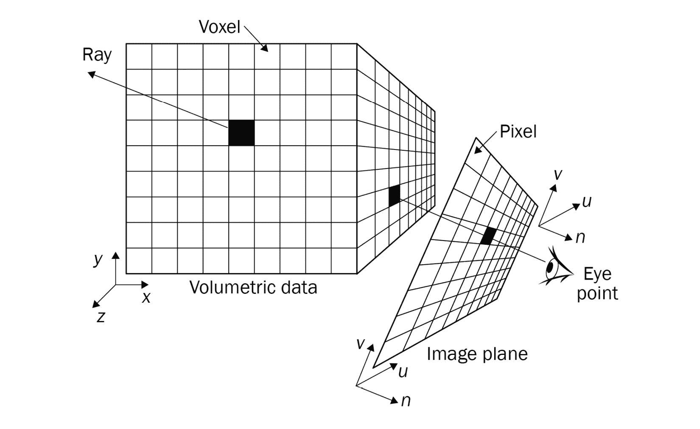
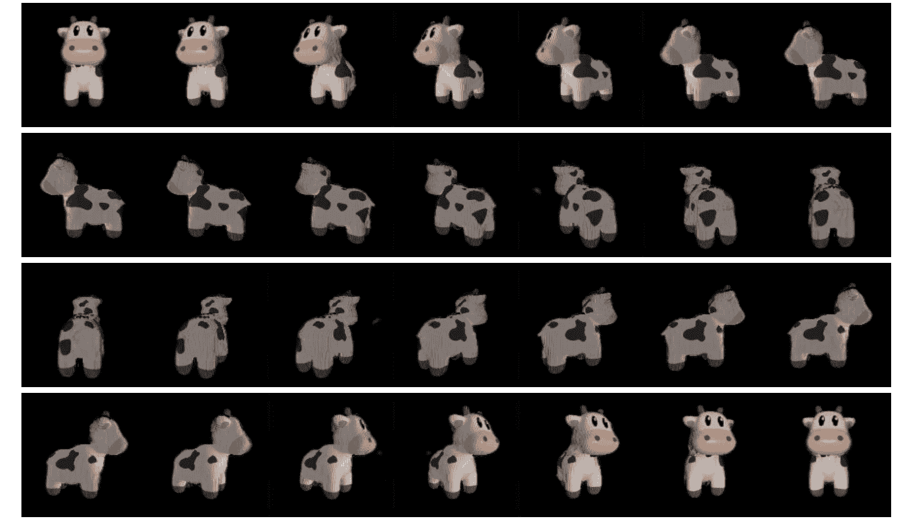

# 第六章：理解可微体积渲染

本章我们将讨论一种新的可微渲染方式。我们将使用体素 3D 数据表示方式，不同于上一章使用的网格 3D 数据表示。与网格模型相比，体素 3D 数据表示具有某些优势。例如，它更灵活，结构更清晰。

要理解体积渲染，我们需要了解一些重要的概念，如光线采样、体积、体积采样和光线行进。所有这些概念都有对应的 PyTorch3D 实现。我们将通过解释和编码练习讨论这些概念。

在我们理解了前面提到的体积渲染基本概念后，我们可以轻松地看到，所有提到的操作已经是可微的。体积渲染天生就是可微的。因此，到那时，我们将准备好使用可微的体积渲染进行一些实际应用。我们将通过一个编码示例，展示如何利用可微的体积渲染从多张图像中重建 3D 体素模型。

我们将首先高层次地理解体积渲染。然后我们将深入探讨一些基本概念，如光线采样、体积、体积采样和光线行进。接下来，我们将展示一个通过从不同视角拍摄的图像集合重建 3D 物体形状的编码示例。

本章将涵盖以下主要主题：

+   体积渲染的高层次描述

+   理解光线采样

+   使用体积采样

+   理解光线行进

+   从多视角图像重建 3D 物体和颜色

# 技术要求

为了运行本书中的示例代码片段，您需要一台计算机，最好配备 GPU。然而，仅使用 CPU 运行代码片段也是可以的。

推荐的计算机配置包括以下内容：

+   一张 GPU，例如，NVIDIA GTX 系列或 RTX 系列，至少具有 8GB 内存

+   Python 3

+   PyTorch 库和 PyTorch3D 库

本章的代码片段可以在[`github.com/PacktPublishing/3D-Deep-Learning-with-Python.`](https://github.com/PacktPublishing/3D-Deep-Learning-with-Python)找到。

# 体积渲染概述

体积渲染是一种用于生成离散三维数据二维视图的技术集合。这些三维离散数据可以是图像集合、体素表示，或任何其他离散的数据表示。体积渲染的主要目标是呈现三维数据的二维投影，因为这正是我们的眼睛在平面屏幕上能够感知到的。这种方法生成这样的投影，而无需显式地转换为几何表示（如网格）。体积渲染通常在生成表面困难或可能导致错误时使用。当体积的内容（而不仅仅是几何形状和表面）很重要时，也可以使用这种方法。它通常用于数据可视化。例如，在脑部扫描中，通常非常重要的是对大脑内部内容的可视化。

在本节中，我们将探讨体积的体积渲染。我们将对体积渲染进行高层次的概述，如*图 5.1*所示：

1.  首先，我们通过使用**体积**来表示三维空间和其中的物体，体积是一个规则间隔的三维网格。每个节点有两个属性：密度和颜色特征。密度通常在 0 到 1 之间。密度也可以理解为占用的概率。也就是说，我们对某个节点是否被某个物体占据的确信程度。在某些情况下，概率也可以是透明度。

1.  我们需要定义一个或多个相机。渲染是确定相机从其视角所能观察到的内容的过程。

1.  为了确定前述相机中每个像素的 RGB 值，首先从投影中心生成一条射线，通过相机的每个图像像素。我们需要检查沿射线的占用概率或不透明度和颜色，以确定该像素的 RGB 值。请注意，每条射线上有无数个点。因此，我们需要有一种采样方案来选择沿射线的若干个点。这一采样操作称为**射线采样**。

1.  请注意，我们在体积的节点上定义了密度和颜色，但在射线上的点上没有定义。因此，我们需要一种方法将体积的密度和颜色转换为射线上的点。这一操作称为**体积采样**。

1.  最后，根据射线的密度和颜色，我们需要确定每个像素的 RGB 值。在这个过程中，我们需要计算沿射线每个点上能够到达的入射光线数量，以及反射到图像像素的光线数量。我们将这个过程称为**射线行进**。



图 5.1：体积渲染

在理解了体积渲染的基本过程后，让我们更深入地探讨第一个概念：射线采样。

# 理解射线采样

光线采样是从相机发射光线，穿过图像像素并沿着这些光线采样点的过程。光线采样方案取决于具体应用。例如，有时我们可能希望随机采样穿过一些图像像素的光线。通常在训练时，我们只需要从完整数据中提取一个代表性样本，这时可以使用 Pytorch3D 中的 `MonteCarloRaysampler`。在其他情况下，我们希望获取图像中每个像素的像素值并保持空间顺序，这对于渲染和可视化非常有用。对于这种应用，PyTorch3D 提供了 `NDCMultiNomialRaysampler`。

在接下来的示例中，我们将演示如何使用 PyTorch3D 中的一个光线采样器 `NDCGridRaysampler`。它类似于 `NDCMultiNomialRaysampler`，即沿着网格采样像素。相关代码可以在 GitHub 仓库 `understand_ray_sampling.py` 中找到：

1.  首先，我们需要导入所有的 Python 模块，包括 `NDCGridRaysampler` 的定义：

    ```py
    import torch
    import math
    import numpy as np
    from pytorch3d.renderer import (
        FoVPerspectiveCameras,
        PointLights,
        look_at_view_transform,
        NDCGridRaysampler,
    )
    ```

1.  设置设备以供后续步骤使用。如果我们有 GPU，那么我们将使用第一块 GPU；否则，我们将使用 CPU：

    ```py
    if torch.cuda.is_available():
        device = torch.device("cuda:0")
        torch.cuda.set_device(device)
    else:
        device = torch.device("cpu")
    ```

1.  我们定义了一批 10 个相机。这里，`num_views` 表示视图的数量，在本例中为 10。`elev` 变量表示仰角，`azim` 表示方位角。旋转矩阵 `R` 和平移矩阵 `T` 可以通过 PyTorch3D 的 `look_at_view_transform` 函数来确定。然后，通过旋转和平移定义 10 个相机，这 10 个相机都指向位于世界坐标系中心的物体：

    ```py
    num_views: int = 10
    azimuth_range: float = 180
    elev = torch.linspace(0, 0, num_views)
    azim = torch.linspace(-azimuth_range, azimuth_range, num_views) + 180.0
    lights = PointLights(device=device, location=[[0.0, 0.0, -3.0]])
    R, T = look_at_view_transform(dist=2.7, elev=elev, azim=azim)
    cameras = FoVPerspectiveCameras(device=device, R=R, T=T)
    ```

1.  最后，我们可以定义光线采样器，也就是 `raysampler` 变量。我们需要指定相机的图像大小，还需要指定光线采样的最小深度和最大深度。`n_pts_per_ray` 输入参数表示每条光线上的点数：

    ```py
    image_size = 64
    volume_extent_world = 3.0
    raysampler = NDCGridRaysampler(
        image_width=image_size,
        image_height=image_size,
        n_pts_per_ray=50,
        min_depth=0.1,
        max_depth=volume_extent_world,
    )
    ```

1.  在前面的步骤中，我们已经定义了一个光线采样器。为了让光线采样器能够采样光线和点供后续使用，我们需要告知光线采样器我们的相机位置以及它们的指向方向。这可以通过将第 3 步中定义的相机传递给 `raysampler` 来轻松实现。然后我们得到一个 `ray_bundle` 变量：

    ```py
    ray_bundle = raysampler(cameras)
    ```

1.  `ray_bundle` 变量包含一组不同的 PyTorch 张量，指定了采样的光线和点。我们可以打印这些成员变量来检查它们的形状并验证它们的内容：

    ```py
    print('ray_bundle origins tensor shape = ', ray_bundle.origins.shape)
    print('ray_bundle directions shape = ', ray_bundle.directions.shape)
    print('ray_bundle lengths = ', ray_bundle.lengths.shape)
    print('ray_bundle xys shape = ', ray_bundle.xys.shape)
    ```

1.  这些代码应该运行并打印以下信息：

    +   我们可以看到 `ray_bundle.origins` 是一个张量，包含了光线的起点，批量大小为 10。由于图像大小为 64×64，第二维和第三维的大小都是 64。对于每个起点，我们需要三个数字来指定其三维位置。

    +   `ray_bundle.directions` 是一个关于射线方向的张量。这里批次大小为 10，图像大小为 64x64。这解释了张量前面三个维度的大小。我们需要三个数字来指定 3D 空间中的一个方向。

    +   `ray_bundle.lengths` 是一个关于射线每个点深度的张量。共有 10x64x64 条射线，每条射线有 50 个点。

    +   `ray_bundle.xys` 是一个关于图像平面上每条射线的 x 和 y 位置的张量。共有 10x64x64 条射线。我们需要一个数字表示 x 位置，一个数字表示 y 位置：

        ```py
        ray_bundle origins tensor shape =  torch.Size([10, 64, 64, 3])
        ray_bundle directions shape =  torch.Size([10, 64, 64, 3])
        ray_bundle lengths =  torch.Size([10, 64, 64, 50])
        ray_bundle xys shape =  torch.Size([10, 64, 64, 2])
        ```

1.  最后，我们将 `ray_bundle` 保存到 `ray_sampling.pt` 文件中。这些射线对我们接下来的编码练习很有用：

    ```py
    torch.save({
        'ray_bundle': ray_bundle
    }, 'ray_sampling.pt')
    ```

到目前为止，我们已经了解了射线采样器的作用。射线采样器给我们提供了一批射线和射线上的离散点。然而，我们仍然没有在这些点和射线上定义密度和颜色。接下来，我们将学习如何从体积中获取这些密度和颜色。

# 使用体积采样

体积采样是通过射线样本提供的点获取颜色和占用信息的过程。我们处理的体积表示是离散的。因此，在射线采样步骤中定义的点可能并不完全落在某个节点上。体积网格的节点和射线上的点通常具有不同的空间位置。我们需要使用插值方案来从体积的密度和颜色推算射线上的密度和颜色。我们可以使用 PyTorch3D 中实现的 `VolumeSampler` 来做到这一点。以下代码可以在 GitHub 仓库中的 `understand_volume_sampler.py` 文件中找到：

1.  导入我们需要的 Python 模块：

    ```py
    import torch
    from pytorch3d.structures import Volumes
    from pytorch3d.renderer.implicit.renderer import VolumeSampler
    ```

1.  设置设备：

    ```py
    if torch.cuda.is_available():
        device = torch.device("cuda:0")
        torch.cuda.set_device(device)
    else:
        device = torch.device("cpu")
    ```

1.  加载在上一节中计算的 `ray_bundle`：

    ```py
    checkpoint = torch.load('ray_sampling.pt')
    ray_bundle = checkpoint.get('ray_bundle')
    ```

1.  接下来，我们定义一个体积。密度张量的形状是 [10, 1, 64, 64, 50]，这里有 10 个体积批次，每个体积是一个 64x64x50 的节点网格。每个节点有一个数字表示该节点的密度。另一方面，颜色张量的形状是 [10, 3, 64, 64, 50]，因为每种颜色需要三个数字来表示 RGB 值：

    ```py
    batch_size = 10
    densities = torch.zeros([batch_size, 1, 64, 64, 64]).to(device)
    colors = torch.zeros(batch_size, 3, 64, 64, 64).to(device)
    voxel_size = 0.1
    volumes = Volumes(
        densities=densities,
        features=colors,
        voxel_size=voxel_size
    )
    ```

1.  我们需要根据体积定义 `volume_sampler`。在这里，我们使用双线性插值进行体积采样。然后，可以通过将 `ray_bundle` 传递给 `volume_sampler` 来轻松获取射线上的点的密度和颜色：

    ```py
    volume_sampler = VolumeSampler(volumes = volumes, sample_mode = "bilinear")
    rays_densities, rays_features = volume_sampler(ray_bundle)
    ```

1.  我们可以打印出密度和颜色的形状：

    ```py
    print('rays_densities shape = ', rays_densities.shape)
    print('rays_features shape = ', rays_features.shape)
    ```

1.  输出如下。注意，我们有 10 个相机的批次大小，这解释了张量第一维的大小。每个图像像素对应一条射线，我们的相机图像分辨率是 64x64。每条射线上的点数为 50，这解释了张量第四维的大小。每个密度可以用一个数字表示，每种颜色需要三个数字来表示 RGB 值：

    ```py
    rays_densities shape =  torch.Size([10, 64, 64, 50, 1])
    rays_features shape =  torch.Size([10, 64, 64, 50, 3])
    ```

1.  最后，让我们保存密度和颜色，因为我们需要在下一部分使用它们：

    ```py
    torch.save({
        'rays_densities': rays_densities,
        'rays_features': rays_features
    }, 'volume_sampling.pt')
    ```

现在我们已经概览了体积采样。我们知道它是什么以及为什么它有用。在接下来的部分，我们将学习如何使用这些密度和颜色来生成批量相机的 RGB 图像值。

# 探索射线行进器

现在，我们已经获得了所有通过射线采样器采样的点的颜色和密度值，我们需要弄清楚如何利用它来最终在投影图像上渲染像素值。在这一部分，我们将讨论如何将射线点上的密度和颜色转换为图像上的 RGB 值的过程。这个过程模拟了图像形成的物理过程。

在这一部分，我们讨论一个非常简单的模型，其中每个图像像素的 RGB 值是相应射线上的点的颜色的加权和。如果我们将密度视为占据或不透明的概率，那么射线上每个点的入射光强度 a = (1 - p_i)的乘积，其中 p_i 是密度。假设该点被某个物体占据的概率为 p_i，那么从该点反射的期望光强度为 w_i = a p_i。我们将 w_i 作为加权和的颜色的权重。通常，我们通过应用 softmax 操作来对权重进行归一化，使得所有权重的总和为 1。

PyTorch3D 包含多种射线行进器的实现。以下代码可以在 GitHub 仓库中的`understand_ray_marcher.py`找到：

1.  在第一步中，我们将导入所有所需的包：

    ```py
    import torch
    from pytorch3d.renderer.implicit.raymarching import EmissionAbsorptionRaymarcher
    ```

1.  接下来，我们加载上一部分中射线上的密度和颜色：

    ```py
    checkpoint = torch.load('volume_sampling.pt')
    rays_densities = checkpoint.get('rays_densities')
    rays_features = checkpoint.get('rays_features')
    ```

1.  我们定义了`ray_marcher`并将射线上的密度和颜色传递给`ray_marcher`。这将给我们`image_features`，即渲染后的 RGB 值：

    ```py
    ray_marcher = EmissionAbsorptionRaymarcher()
    image_features = ray_marcher(rays_densities = rays_densities, rays_features = rays_features)
    ```

1.  我们可以打印图像特征的形状：

    ```py
    print('image_features shape = ', image_features.shape)
    ```

1.  正如我们所预期的，形状是[10, 64, 64, 4]，其中 10 是批量大小，64 是图像的宽度和高度。输出有四个通道，前三个是 RGB，最后一个通道是 alpha 通道，表示像素是前景还是背景：

    ```py
    image_features shape =  torch.Size([10, 64, 64, 4])
    ```

我们现在已经了解了一些体积渲染的主要组成部分。注意，从体积密度和颜色到图像像素 RGB 值的计算过程已经是可微分的。因此，体积渲染自然是可微分的。考虑到前面的所有变量都是 PyTorch 张量，我们可以对这些变量计算梯度。

在下一部分，我们将学习可微分的体积渲染，并查看一个使用体积渲染从多视角图像重建 3D 模型的示例。

# 可微分体积渲染

虽然标准的体积渲染用于渲染 3D 数据的 2D 投影，但可微分体积渲染则用于做相反的事情：从 2D 图像构建 3D 数据。它的工作原理是：我们将物体的形状和纹理表示为一个参数化的函数。这个函数可以用来生成 2D 投影。然而，给定 2D 投影（通常是多视角的 3D 场景图像），我们可以优化这些隐式形状和纹理函数的参数，使其投影是多视角的 2D 图像。由于渲染过程是完全可微分的，且所使用的隐式函数也可微分，因此这种优化是可行的。

## 从多视角图像重建 3D 模型

在这一部分，我们将展示一个使用可微分体积渲染从多视角图像中重建 3D 模型的示例。重建 3D 模型是一个常见的难题。通常，直接测量 3D 世界的方法既困难又昂贵，例如，LiDAR 和雷达通常很昂贵。另一方面，2D 相机的成本要低得多，这使得从 2D 图像重建 3D 世界变得极具吸引力。当然，为了重建 3D 世界，我们需要来自多个视角的多张图像。

以下的 `volume_renderer.py` 代码可以在 GitHub 仓库中找到，并且它是从 PyTorch3D 的教程中修改而来。我们将使用这个代码示例展示体积渲染在实际应用中的运作方式：

1.  首先，我们需要导入所有的 Python 模块：

    ```py
    import os
    import sys
    import time
    import json
    import glob
    import torch
    import math
    import matplotlib.pyplot as plt
    import numpy as np
    from PIL import Image
    from pytorch3d.structures import Volumes
    from pytorch3d.renderer import (
        FoVPerspectiveCameras,
        VolumeRenderer,
        NDCGridRaysampler,
        EmissionAbsorptionRaymarcher
    )
    from pytorch3d.transforms import so3_exp_map
    from plot_image_grid import image_grid
    from generate_cow_renders import generate_cow_renders
    ```

1.  接下来，我们需要设置设备：

    ```py
    if torch.cuda.is_available():
        device = torch.device("cuda:0")
        torch.cuda.set_device(device)
    else:
        device = torch.device("cpu")
    ```

1.  使用 PyTorch3D 教程提供的函数，我们生成 40 个不同角度的相机、图像和轮廓图像。我们将这些图像视为给定的真实图像，并拟合一个 3D 体积模型到这些观察到的真实图像：

    ```py
    target_cameras, target_images, target_silhouettes = generate_cow_renders(num_views=40)
    ```

1.  接下来，我们定义一个光线采样器。正如我们在前面几节中讨论的，光线采样器用于为我们采样光线及每条光线的采样点：

    ```py
    render_size = 128
    volume_extent_world = 3.0
    raysampler = NDCGridRaysampler(
        image_width=render_size,
        image_height=render_size,
        n_pts_per_ray=150,
        min_depth=0.1,
        max_depth=volume_extent_world,
    )
    ```

1.  接下来，我们像之前一样创建光线行进器。注意，这次我们定义了一个 `VolumeRenderer` 类型的变量渲染器。`VolumeRenderer` 只是一个很好的接口，光线采样器和光线行进器在背后做所有繁重的工作：

    ```py
    raymarcher = EmissionAbsorptionRaymarcher()
    renderer = VolumeRenderer(
        raysampler=raysampler, raymarcher=raymarcher,
    )
    ```

1.  接下来，我们定义一个 `VolumeModel` 类。这个类的作用仅仅是封装一个体积，以便在前向函数中计算梯度，并且通过优化器更新体积密度和颜色：

    ```py
    class VolumeModel(torch.nn.Module):
        def __init__(self, renderer, volume_size=[64] * 3, voxel_size=0.1):
            super().__init__()
            self.log_densities = torch.nn.Parameter(-4.0 * torch.ones(1, *volume_size))
            self.log_colors = torch.nn.Parameter(torch.zeros(3, *volume_size))
            self._voxel_size = voxel_size
            self._renderer = renderer
        def forward(self, cameras):
            batch_size = cameras.R.shape[0]
            densities = torch.sigmoid(self.log_densities)
            colors = torch.sigmoid(self.log_colors)
            volumes = Volumes(
                densities=densities[None].expand(
                    batch_size, *self.log_densities.shape),
                features=colors[None].expand(
                    batch_size, *self.log_colors.shape),
                voxel_size=self._voxel_size,
            )
            return self._renderer(cameras=cameras, volumes=volumes)[0]
    ```

1.  定义一个 Huber 损失函数。Huber 损失函数是一种鲁棒的损失函数，用于防止少数异常值使优化偏离真实的最优解。最小化这个损失函数将使 x 更接近 y：

    ```py
    def huber(x, y, scaling=0.1):
        diff_sq = (x - y) ** 2
        loss = ((1 + diff_sq / (scaling ** 2)).clamp(1e-4).sqrt() - 1) * float(scaling)
        return loss
    ```

1.  将所有内容移动到正确的设备上：

    ```py
    target_cameras = target_cameras.to(device)
    target_images = target_images.to(device)
    target_silhouettes = target_silhouettes.to(device)
    ```

1.  定义一个 `VolumeModel` 的实例：

    ```py
    volume_size = 128
    volume_model = VolumeModel(
        renderer,
        volume_size=[volume_size] * 3,
        voxel_size=volume_extent_world / volume_size,
    ).to(device)
    ```

1.  现在我们来设置优化器。学习率 `lr` 设置为 0.1。我们使用 Adam 优化器，优化迭代次数为 300 次：

    ```py
    lr = 0.1
    optimizer = torch.optim.Adam(volume_model.parameters(), lr=lr)
    batch_size = 10
    n_iter = 300
    ```

1.  接下来，我们进行主要的优化循环。体积的密度和颜色被渲染出来，得到的颜色和轮廓与观察到的多视图图像进行比较。通过最小化渲染图像和观察到的真实图像之间的 Huber 损失：

    ```py
    for iteration in range(n_iter):
        if iteration == round(n_iter * 0.75):
            print('Decreasing LR 10-fold ...')
            optimizer = torch.optim.Adam(
                volume_model.parameters(), lr=lr * 0.1
            )
        optimizer.zero_grad()
        batch_idx = torch.randperm(len(target_cameras))[:batch_size]
        # Sample the minibatch of cameras.
        batch_cameras = FoVPerspectiveCameras(
            R=target_cameras.R[batch_idx],
            T=target_cameras.T[batch_idx],
            znear=target_cameras.znear[batch_idx],
            zfar=target_cameras.zfar[batch_idx],
            aspect_ratio=target_cameras.aspect_ratio[batch_idx],
            fov=target_cameras.fov[batch_idx],
            device=device,
        )
        rendered_images, rendered_silhouettes = volume_model(
            batch_cameras
        ).split([3, 1], dim=-1)
        sil_err = huber(
            rendered_silhouettes[..., 0], target_silhouettes[batch_idx],
        ).abs().mean()
        color_err = huber(
            rendered_images, target_images[batch_idx],
        ).abs().mean()
        loss = color_err + sil_err
        loss.backward()
        optimizer.step()
    ```

1.  在优化完成后，我们将最终得到的体积模型从新的角度渲染图像：

    ```py
    with torch.no_grad():
     rotating_volume_frames = ge erate_rotating_volume(volume_model, n_frames=7 * 4)
    image_grid(rotating_volume_frames.clamp(0., 1\. .cpu().numpy(), rows=4, cols=7, rgb=True, fill=True)
    plt.savefig('rotating_volume.png')
    plt.show()
    ```

1.  最后，渲染出来的新图像显示在图 5.2 中：



图 5.2：来自拟合 3D 模型的渲染图像

到目前为止，我们已经概述了可微分体积渲染中的一些主要概念。我们还学习了一个具体的例子，展示了如何利用可微分体积渲染从多视图图像中重建 3D 模型。你应该已经掌握了这些技巧，并能够将其应用于自己的问题。

# 总结

在这一章中，我们首先对可微分体积渲染进行了高层次的描述。接着，我们深入探讨了可微分体积渲染中的几个重要概念，包括射线采样、体积采样和射线步进器，但仅通过解释和编码示例来进行讲解。我们还走过了一个使用可微分体积渲染从多视图图像中重建 3D 模型的编码示例。

使用体积数据进行 3D 深度学习近年来已经成为一个有趣的方向。随着这一方向上涌现出许多创新思想，许多突破也在不断出现。其中一个突破被称为**神经辐射场**（**NeRF**），它将成为我们下一章的主题。
