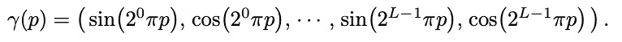
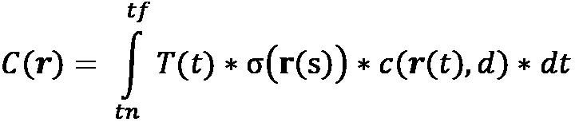

# 第七章：探索神经辐射场（NeRF）

在上一章中，你了解了可微分体积渲染技术，其中你通过多个视图图像重建了 3D 体积。使用这种技术，你建模了由 N x N x N 体素组成的体积。存储该体积所需的空间规模将是 O(N3)。这是不理想的，特别是当我们希望通过网络传输这些信息时。其他方法可以克服如此大的磁盘空间需求，但它们容易平滑几何形状和纹理。因此，我们不能依赖它们来可靠地建模非常复杂或有纹理的场景。

在本章中，我们将讨论一种突破性的 3D 场景表示新方法，称为 **神经辐射场**（**NeRF**）。这是首批能够建模 3D 场景的技术之一，它比传统方法需要更少的常驻磁盘空间，同时捕捉复杂场景的精细几何和纹理。

在本章中，你将学习以下内容：

+   理解 NeRF

+   训练 NeRF 模型

+   理解 NeRF 模型架构

+   理解使用辐射场的体积渲染

# 技术要求

为了运行本书中的示例代码片段，你需要一台电脑，理想情况下配备约 8 GB GPU 内存的显卡。仅使用 CPU 运行代码片段并非不可能，但将非常慢。推荐的计算机配置如下：

+   一台 GPU 设备——例如，至少具有 8 GB 内存的 Nvidia GTX 系列或 RTX 系列

+   Python 3.7+

+   PyTorch 和 PyTorch3D 库

本章的代码片段可以在 [`github.com/PacktPublishing/3D-Deep-Learning-with-Python`](https://github.com/PacktPublishing/3D-Deep-Learning-with-Python) 找到。

# 理解 NeRF

视图合成是 3D 计算机视觉中的一个长期存在的问题。挑战在于使用少量可用的 2D 场景快照来合成 3D 场景的新视图。这尤其具有挑战性，因为复杂场景的视角可能依赖于许多因素，如物体伪影、光源、反射、不透明度、物体表面纹理和遮挡。任何好的表示方法都应该隐式或显式地捕捉这些信息。此外，许多物体具有复杂的结构，从某个视点并不能完全看到。这项挑战在于如何在给定不完全和噪声信息的情况下构建关于世界的完整信息。

顾名思义，NeRF 使用神经网络来建模世界。正如我们在本章稍后将学习到的，NeRF 以非常不同寻常的方式使用神经网络。这个概念最初是由来自 UC Berkeley、Google Research 和 UC San Diego 的研究团队开发的。由于它不寻常的神经网络使用方式以及所学模型的质量，它在视图合成、深度感知和 3D 重建等领域催生了多项新发明。因此，理解这个概念对你继续阅读本章及本书至关重要。

本节中，我们首先将探讨辐射场的含义，以及如何使用神经网络来表示这些辐射场。

## 什么是辐射场？

在我们讨论 NeRF 之前，让我们首先了解辐射场是什么。当光从某个物体反射并被你的感官系统处理时，你就能看到该物体。物体的光可以由物体本身产生，也可以是反射自物体的光。

辐射是衡量通过或从特定固体角度内的区域发出的光量的标准度量。就我们而言，辐射可以视为在特定方向上观察时，空间中某一点的光强度。当以 RGB 方式捕捉这一信息时，辐射将具有三个分量，分别对应红色、绿色和蓝色。空间中某一点的辐射可能取决于许多因素，包括以下内容：

+   照亮该点的光源

+   该点处是否存在可以反射光线的表面（或体积密度）

+   表面的纹理属性

以下图示展示了在特定角度观察时，3D 场景中某一点的辐射值。辐射场就是这些辐射值在 3D 场景中的所有点和观察角度上的集合：


图 6.1：在特定观察角度（θ，∅）下，点（x，y，z）处的辐射（r，g，b）

如果我们知道场景中所有点在所有方向上的辐射，我们就拥有了关于该场景的所有视觉信息。这个辐射值的场景就是辐射场。我们可以将辐射场信息存储为 3D 体素网格数据结构中的一个体积。我们在前一章讨论体积渲染时见过这一点。

## 使用神经网络表示辐射场

本节中，我们将探讨一种使用神经网络的新方式。在典型的计算机视觉任务中，我们使用神经网络将输入的像素空间映射到输出。对于判别模型，输出是一个类别标签；对于生成模型，输出也在像素空间中。而 NeRF 模型既不是前者，也不是后者。

NeRF 使用神经网络来表示一个体积场景函数。这个神经网络接受一个 5 维输入，分别是三个空间位置（x, y, z）和两个视角（θ, ∅）。它的输出是在（x, y, z）处的体积密度 σ 和从视角（θ, ∅）观察到的点（x, y, z）的发射颜色（r, g, b）。发射的颜色是用来估算该点辐射强度的代理。在实际应用中，NeRF 不直接使用（θ, ∅）来表示视角，而是使用 3D 笛卡尔坐标系中的单位方向向量 d。这两种表示方式是等效的视角表示。

因此，该模型将 3D 场景中的任何点和一个视角映射到该点的体积密度和辐射强度。然后，你可以使用这个模型通过查询相机射线上的 5D 坐标，利用你在前一章中学习的体积渲染技术将输出颜色和体积密度投影到图像中，从而合成视图。

在下图中，我们将展示如何使用神经网络预测某一点（x, y, z）在沿某个方向（θ, ∅）视角下的密度和辐射强度：


图 6.2：输入（x, y, z, θ 和 ∅）首先用于为空间位置和视角创建单独的谐波嵌入，然后形成神经网络的输入，神经网络输出预测的密度和辐射强度

注意，这是一种全连接网络——通常我们称之为**多层感知器**（**MLP**）。更重要的是，这不是卷积神经网络。我们将这种模型称为 NeRF 模型。单个 NeRF 模型是在单一场景的一组图像上进行优化的。因此，每个模型只了解它所优化的场景。这与我们通常需要模型对未见过的图像进行泛化的标准神经网络使用方式不同。在 NeRF 的情况下，我们需要网络能够很好地对未见过的视角进行泛化。

现在你已经了解了什么是 NeRF，接下来我们来看看如何使用它渲染新的视图。

# 训练一个 NeRF 模型

在本节中，我们将训练一个简单的 NeRF 模型，使用从合成牛模型生成的图像。我们只会实例化 NeRF 模型，而不关心它是如何实现的。实现细节将在下一节中介绍。一个单一的神经网络（NeRF 模型）被训练来表示单一的 3D 场景。以下代码可以在`train_nerf.py`中找到，该文件位于本章的 GitHub 仓库中。它是从 PyTorch3D 教程修改而来的。让我们通过这段代码，在合成牛场景上训练一个 NeRF 模型：

1.  首先，让我们导入标准模块：

    ```py
    import torch
    import matplotlib.pyplot as plt
    ```

1.  接下来，让我们导入用于渲染的函数和类。这些是`pytorch3d`数据结构：

    ```py
    from pytorch3d.renderer import (
    FoVPerspectiveCameras,
    NDCMultinomialRaysampler,
    MonteCarloRaysampler,
    EmissionAbsorptionRaymarcher,
    ImplicitRenderer,
    )
    from utils.helper_functions import (generate_rotating_nerf,
    huber,
    sample_images_at_mc_locs)
    from nerf_model import NeuralRadianceField
    ```

1.  接下来，我们需要设置设备：

    ```py
    if torch.cuda.is_available():
        device = torch.device("cuda:0")
        torch.cuda.set_device(device)
    else:
        device = torch.device("cpu")
    ```

1.  接下来，让我们导入一些实用函数，用于生成合成训练数据并可视化图像：

    ```py
    from utils.plot_image_grid import image_grid
    from utils.generate_cow_renders import generate_cow_renders
    ```

1.  我们现在可以使用这些实用函数从多个不同角度生成合成牛的相机角度、图像和轮廓。这将打印生成的图像、轮廓和相机角度的数量：

    ```py
    target_cameras, target_images, target_silhouettes = generate_cow_renders(num_views=40, azimuth_range=180)
    print(f'Generated {len(target_images)} images/silhouettes/cameras.')
    ```

1.  就像我们在上一章做的那样，让我们定义一个光线采样器。我们将使用`MonteCarloRaysampler`。它从图像平面上的随机子集像素生成光线。我们在这里需要一个随机采样器，因为我们想使用小批量梯度下降算法来优化模型。这是一种标准的神经网络优化技术。系统地采样光线可能会在每一步优化时导致优化偏差，从而导致更差的模型，并增加模型训练时间。光线采样器沿着光线均匀采样点：

    ```py
    render_size = target_images.shape[1] * 2
    volume_extent_world = 3.0
    raysampler_mc = MonteCarloRaysampler(
        min_x = -1.0,
        max_x = 1.0,
        min_y = -1.0,
        max_y = 1.0,
        n_rays_per_image=750,
        n_pts_per_ray=128,
        min_depth=0.1,
        max_depth=volume_extent_world,
    )
    ```

1.  接下来，我们将定义光线行进器。它使用沿光线采样的点的体积密度和颜色，并渲染该光线的像素值。对于光线行进器，我们使用`EmissionAbsorptionRaymarcher`。它实现了经典的发射-吸收光线行进算法：

    ```py
    raymarcher = EmissionAbsorptionRaymarcher()
    ```

1.  我们现在将实例化`ImplicitRenderer`。它将光线采样器和光线行进器组合成一个单一的数据结构：

    ```py
    renderer_mc = ImplicitRenderer(raysampler=raysampler_mc, raymarcher=raymarcher)
    ```

1.  让我们来看一下 Huber 损失函数。它在`utils.helper_functions.huber`中定义，是均方误差函数的稳健替代，且对异常值不那么敏感：

    ```py
    def huber(x, y, scaling=0.1):
        diff_sq = (x - y) ** 2
        loss = ((1 + diff_sq / (scaling**2)).clamp(1e-4).sqrt() - 1) * float(scaling)
        return loss
    ```

1.  我们现在来看一个定义在`utils.helper_functions.sample_images_at_mc_loss`中的辅助函数，它用于从目标图像中提取地面真实像素值。`MonteCarloRaysampler`会采样经过图像中某些`x`和`y`位置的光线。这些位置在`torch.nn.functional.grid_sample`函数中。该函数使用插值技术在后台提供准确的像素值。这比仅仅将 NDC 坐标映射到像素坐标并采样与 NDC 坐标值对应的单个像素要好。在 NDC 坐标系中，`x`和`y`的范围都是`[-1, 1]`。例如，(x, y) = (-1, -1)对应图像的左上角：

    ```py
    def sample_images_at_mc_locs(target_images, sampled_rays_xy):
        ba = target_images.shape[0]
        dim = target_images.shape[-1]
        spatial_size = sampled_rays_xy.shape[1:-1]
        images_sampled = torch.nn.functional.grid_sample(
            target_images.permute(0, 3, 1, 2), 
            -sampled_rays_xy.view(ba, -1, 1, 2),  # note the sign inversion
            align_corners=True
        )
        return images_sampled.permute(0, 2, 3, 1).view(
            ba, *spatial_size, dim
        )
    ```

1.  在训练模型时，查看模型输出总是很有用的。除了其他许多用途外，这将帮助我们进行调整，如果我们发现模型输出随着时间的推移没有变化。到目前为止，我们使用了`MonteCarloRaysampler`，它在训练模型时非常有用，但当我们想要渲染完整图像时，它就不再有用了，因为它是随机采样光线。为了查看完整的图像，我们需要系统地采样对应输出帧中所有像素的光线。为此，我们将使用`NDCMultinomialRaysampler`：

    ```py
    render_size = target_images.shape[1] * 2
    volume_extent_world = 3.0
    raysampler_grid = NDCMultinomialRaysampler(
        image_height=render_size,
        image_width=render_size,
        n_pts_per_ray=128,
        min_depth=0.1,
        max_depth=volume_extent_world,
    )
    ```

1.  我们现在将实例化隐式渲染器：

    ```py
    renderer_grid = ImplicitRenderer(
        raysampler=raysampler_grid, raymarcher=raymarcher,
    )
    ```

1.  为了可视化中间训练结果，我们定义了一个辅助函数，该函数以模型和相机参数为输入，并将其与目标图像及相应的轮廓进行比较。如果渲染图像非常大，可能无法一次性将所有光线装入 GPU 内存。因此，我们需要将它们分成批次，并在模型上运行多次前向传播以获取输出。我们需要将渲染的输出合并成一个连贯的图像。为了简化，我们将在这里导入该函数，但完整代码已提供在本书的 GitHub 仓库中：

    ```py
    from utils.helper_function import show_full_render
    ```

1.  现在我们将实例化 NeRF 模型。为了简化起见，我们在这里不展示模型的类定义。你可以在本章的 GitHub 仓库中找到它。由于模型结构非常重要，我们将在单独的章节中详细讨论它：

    ```py
    from nerf_model import NeuralRadianceField
    neural_radiance_field = NeuralRadianceField()
    ```

1.  现在我们准备开始训练模型。为了重现训练过程，我们应将 `torch` 中使用的随机种子设置为固定值。然后，我们需要将所有变量发送到用于处理的设备上。由于这是一个资源密集型的计算问题，理想情况下我们应在支持 GPU 的机器上运行它。在 CPU 上运行会非常耗时，不推荐使用：

    ```py
    torch.manual_seed(1)
    renderer_grid = renderer_grid.to(device)
    renderer_mc = renderer_mc.to(device)
    target_cameras = target_cameras.to(device)
    target_images = target_images.to(device)
    target_silhouettes = target_silhouettes.to(device)
    neural_radiance_field = neural_radiance_field.to(device)
    ```

1.  现在我们将定义用于训练模型的超参数。`lr` 表示学习率，`n_iter` 表示训练迭代次数（或步骤），`batch_size` 表示在每个小批量中使用的随机相机数。这里的批量大小根据你的 GPU 内存来选择。如果你发现 GPU 内存不足，请选择一个较小的批量大小值：

    ```py
    lr = 1e-3
    optimizer = torch.optim.Adam(neural_radiance_field.parameters(), lr=lr)
    batch_size = 6
    n_iter = 3000
    ```

1.  现在我们准备训练模型了。在每次迭代中，我们应该随机采样一个小批量的相机：

    ```py
    loss_history_color, loss_history_sil = [], []
    for iteration in range(n_iter):
        if iteration == round(n_iter * 0.75):
            print('Decreasing LR 10-fold ...')
            optimizer = torch.optim.Adam(
                neural_radiance_field.parameters(), lr=lr * 0.1
            )
        optimizer.zero_grad()
        batch_idx = torch.randperm(len(target_cameras))[:batch_size]
        batch_cameras = FoVPerspectiveCameras(
            R = target_cameras.R[batch_idx], 
            T = target_cameras.T[batch_idx], 
            znear = target_cameras.znear[batch_idx],
            zfar = target_cameras.zfar[batch_idx],
            aspect_ratio = target_cameras.aspect_ratio[batch_idx],
            fov = target_cameras.fov[batch_idx],
            device = device,
        )
    ```

1.  在每次迭代中，首先，我们需要使用 NeRF 模型在随机采样的相机上获取渲染的像素值和渲染的轮廓。这些是预测值。这是前向传播步骤。我们想要将这些预测与真实值进行比较，以找出训练损失。我们的损失是两个损失函数的混合：A，基于预测轮廓和真实轮廓的 Huber 损失，以及 B，基于预测颜色和真实颜色的 Huber 损失。一旦我们得到损失值，我们可以通过 NeRF 模型进行反向传播，并使用优化器进行步进：

    ```py
        rendered_images_silhouettes, sampled_rays = renderer_mc(
            cameras=batch_cameras, 
            volumetric_function=neural_radiance_field
        )
        rendered_images, rendered_silhouettes = (
            rendered_images_silhouettes.split([3, 1], dim=-1)
        )

        silhouettes_at_rays = sample_images_at_mc_locs(
            target_silhouettes[batch_idx, ..., None], 
            sampled_rays.xys
        )
        sil_err = huber(
            rendered_silhouettes, 
            silhouettes_at_rays,
        ).abs().mean()
        colors_at_rays = sample_images_at_mc_locs(
            target_images[batch_idx], 
            sampled_rays.xys
        )
        color_err = huber(
            rendered_images, 
            colors_at_rays,
        ).abs().mean()

        loss = color_err + sil_err
        loss_history_color.append(float(color_err))
        loss_history_sil.append(float(sil_err))

        loss.backward()
        optimizer.step()
    ```

1.  让我们在每 100 次迭代后可视化模型的表现。这将帮助我们跟踪模型进展，并在发生意外情况时终止训练。这会在运行代码的相同文件夹中生成图像：

    ```py
        if iteration % 100 == 0:
            show_idx = torch.randperm(len(target_cameras))[:1]
            fig = show_full_render(
            neural_radiance_field,
            FoVPerspectiveCameras(
                R = target_cameras.R[show_idx], 
                T = target_cameras.T[show_idx], 
                znear = target_cameras.znear[show_idx],
                zfar = target_cameras.zfar[show_idx],
                aspect_ratio = target_cameras.aspect_ratio[show_idx],
                fov = target_cameras.fov[show_idx],
                device = device), 
            target_images[show_idx][0],
            target_silhouettes[show_idx][0],
            renderer_grid,
            loss_history_color,
            loss_history_sil)
        fig.savefig(f'intermediate_{iteration}')
    ```


图 6.3：用于跟踪模型训练的中间可视化

1.  优化完成后，我们将使用最终的体积模型并从新角度渲染图像：

    ```py
    from utils import generate_rotating_nerf
    with torch.no_grad():
        rotating_nerf_frames = generate_rotating_nerf(neural_radiance_field, n_frames=3*5)
    image_grid(rotating_nerf_frames.clamp(0., 1.).cpu().numpy(), rows=3, cols=5, rgb=True, fill=True)
    plt.show()
    ```

最终，新的渲染图像显示在这里的图中：


图 6.4：我们 NeRF 模型学习到的合成牛场景的渲染图像

我们在这一部分训练了一个 NeRF 模型，使用的是合成牛场景。接下来的部分，我们将通过更详细地分析代码来深入了解 NeRF 模型的实现。

# 理解 NeRF 模型架构

到目前为止，我们在没有完全了解 NeRF 模型的情况下使用了该模型类。在本节中，我们将首先可视化神经网络的外观，然后详细分析代码并理解它是如何实现的。

神经网络以空间位置 (x, y, z) 的谐波嵌入和 (θ, ∅) 的谐波嵌入作为输入，并输出预测的密度 σ 和预测的颜色 (r, g, b)。下图展示了我们将在本节中实现的网络架构：


图 6.5：NeRF 模型的简化模型架构

注意

我们要实现的模型架构与原始的 NeRF 模型架构不同。在这个实现中，我们正在实现其简化版本。这个简化架构使得训练更快、更容易。

让我们开始定义 `NeuralRadianceField` 类。我们将详细介绍该类定义的不同部分。有关该类的完整定义，请参考 GitHub 仓库中的代码：

1.  每个输入点是一个 5 维向量。研究发现，直接在这个输入上训练模型在表示颜色和几何形状的高频变化时表现不佳。这是因为神经网络已知偏向于学习低频函数。解决此问题的一个好方法是将输入空间映射到更高维空间并利用该空间进行训练。这个映射函数是一组具有固定但唯一频率的正弦函数：



1.  该函数应用于输入向量的每个组件：

    ```py
    class NeuralRadianceField(torch.nn.Module):
        def __init__(self, n_harmonic_functions=60, n_hidden_neurons=256):
            super().__init__()        
            self.harmonic_embedding = HarmonicEmbedding(n_harmonic_functions)
    ```

1.  神经网络由 MLP 主干组成。它接受位置 (x, y, z) 的嵌入作为输入。这是一个全连接网络，使用的激活函数是 `softplus`。`softplus` 函数是 ReLU 激活函数的平滑版本。主干的输出是一个大小为 `n_hidden_neurons` 的向量：

    ```py
            embedding_dim = n_harmonic_functions * 2 * 3
            self.mlp = torch.nn.Sequential(
                torch.nn.Linear(embedding_dim, n_hidden_neurons),
                torch.nn.Softplus(beta=10.0),
                torch.nn.Linear(n_hidden_neurons, n_hidden_neurons),
                torch.nn.Softplus(beta=10.0),
            )        
    ```

1.  我们定义了一个颜色层，它接受 MLP 主干的输出嵌入与射线方向输入嵌入，并输出输入的 RGB 颜色。我们将这些输入结合起来，因为颜色输出强烈依赖于点的位置和观察方向，因此提供更短的路径以充分利用这个神经网络非常重要：

    ```py
            self.color_layer = torch.nn.Sequential(
                torch.nn.Linear(n_hidden_neurons + embedding_dim, n_hidden_neurons),
                torch.nn.Softplus(beta=10.0),
                torch.nn.Linear(n_hidden_neurons, 3),
                torch.nn.Sigmoid(),
            )
    ```

1.  接下来，我们定义 `density` 层。一个点的密度仅是其位置的函数：

    ```py
            self.density_layer = torch.nn.Sequential(
                torch.nn.Linear(n_hidden_neurons, 1),
                torch.nn.Softplus(beta=10.0),
            self.density_layer[0].bias.data[0] = -1.5        
    ```

1.  现在，我们需要一个函数来获取 `density_layer` 的输出，并预测原始密度：

    ```py
        def _get_densities(self, features):
            raw_densities = self.density_layer(features)
            return 1 - (-raw_densities).exp()
    ```

1.  我们对给定光线方向的某一点颜色的获取也做了相同的处理。我们需要先对光线方向输入应用位置编码函数。然后，我们应将其与 MLP 主干的输出进行拼接：

    ```py
        def _get_colors(self, features, rays_directions):
            spatial_size = features.shape[:-1]        
            rays_directions_normed = torch.nn.functional.normalize(
                rays_directions, dim=-1
            )
            rays_embedding = self.harmonic_embedding(
                rays_directions_normed
            )
            rays_embedding_expand = rays_embedding[..., None, :].expand(
                *spatial_size, rays_embedding.shape[-1]
            )        
            color_layer_input = torch.cat(
                (features, rays_embedding_expand),
                dim=-1
            )
            return self.color_layer(color_layer_input)

    ```

1.  我们定义了前向传播的函数。首先，我们获得嵌入（embeddings）。然后，我们通过 MLP 主干传递它们，以获得一组特征。接着，我们利用这些特征来获得密度。我们使用特征和光线方向来获得颜色。最终，我们返回密度和颜色：

    ```py
        def forward(
            self, 
            ray_bundle: RayBundle,
            **kwargs,
        ):
            rays_points_world = ray_bundle_to_ray_points(ray_bundle)        
            embeds = self.harmonic_embedding(
                rays_points_world
            )
            features = self.mlp(embeds)        
            rays_densities = self._get_densities(features)
            # rays_densities.shape = [minibatch x ... x 1]
            rays_colors = self._get_colors(features, ray_bundle.directions)        
            return rays_densities, rays_colors
    ```

1.  该函数用于实现输入光线的内存高效处理。首先，输入的光线被分成 `n_batches` 块，并通过 `self.forward` 函数逐一传递，在 `for` 循环中执行。结合禁用 PyTorch 梯度缓存（`torch.no_grad()`），这使我们能够渲染大批量的光线，即使这些光线无法完全适应 GPU 内存，也能通过单次前向传播来处理。在我们的案例中，`batched_forward` 用于导出辐射场的完整渲染图，以便进行可视化：

    ```py
        def batched_forward(
            self, 
            ray_bundle: RayBundle,
            n_batches: int = 16,
            **kwargs,        
        ):
            n_pts_per_ray = ray_bundle.lengths.shape[-1]  
            spatial_size = [*ray_bundle.origins.shape[:-1], n_pts_per_ray]
            # Split the rays to `n_batches` batches.
            tot_samples = ray_bundle.origins.shape[:-1].numel()
            batches = torch.chunk(torch.arange(tot_samples), n_batches)
    ```

1.  对于每一批次，我们需要先进行一次前向传播，然后分别提取 `ray_densities` 和 `ray_colors`，作为输出返回：

    ```py
            batch_outputs = [
                self.forward(
                    RayBundle(
                        origins=ray_bundle.origins.view(-1, 3)[batch_idx],
                     directions=ray_bundle.directions.view(-1, 3)[batch_idx],
                        lengths=ray_bundle.lengths.view(-1, n_pts_per_ray)[batch_idx],
                        xys=None,
                    )
                ) for batch_idx in batches
            ]
            rays_densities, rays_colors = [
                torch.cat(
                    [batch_output[output_i] for batch_output in batch_outputs], dim=0
                ).view(*spatial_size, -1) for output_i in (0, 1)]
            return rays_densities, rays_colors
    ```

在本节中，我们介绍了 NeRF 模型的实现。为了全面理解 NeRF，我们还需要探索其在体积渲染中的理论概念。在接下来的部分中，我们将更详细地探讨这一点。

# 理解使用辐射场的体积渲染

卷积渲染允许你创建 3D 图像或场景的 2D 投影。在本节中，我们将学习如何从不同的视角渲染 3D 场景。为了本节的目的，假设 NeRF 模型已经完全训练，并且能够准确地将输入坐标（x, y, z, dx, dy, dz）映射到输出（r, g, b, σ）。以下是这些输入和输出坐标的定义：

+   **(x, y, z)**：世界坐标系中 3D 场景中的一点

+   **(dx, dy, dz)**：这是一个单位向量，表示我们观察点（x, y, z）时的视线方向

+   **(r, g, b)**：这是点（x, y, z）处的辐射值（或发射颜色）

+   **σ**：点（x, y, z）处的体积密度

在上一章中，你了解了体积渲染的基本概念。你使用射线采样技术从体积中获取体积密度和颜色。我们称这种操作为体积采样。在本章中，我们将对辐射场使用射线采样技术，获取体积密度和颜色。然后，我们可以执行射线行进（ray marching）来获得该点的颜色强度。上一章中使用的射线行进技术与本章中使用的在概念上是类似的。区别在于，3D 体素是 3D 空间的离散表示，而辐射场是其连续表示（因为我们使用神经网络来编码该表示）。这稍微改变了我们沿射线积累颜色强度的方式。

## 将射线投射到场景中

想象一下将一个相机放置在一个视点，并将其指向感兴趣的 3D 场景。这就是 NeRF 模型训练的场景。为了合成该场景的 2D 投影，我们首先从视点发射一条射线进入 3D 场景。

射线可以按如下方式参数化：


这里，r 是从原点 o 开始并沿方向 d 传播的射线。它由 t 参数化，可以通过改变 t 的值来移动到射线上的不同点。注意，r 是一个 3D 向量，表示空间中的一个点。

## 积累射线的颜色

我们可以使用一些知名的经典颜色渲染技术来渲染射线的颜色。在我们这样做之前，让我们先对一些标准定义有所了解：

+   假设我们想要积累位于 tn（近边界）和 tf（远边界）之间的射线颜色。我们不关心射线在这些边界之外的部分。

+   我们可以将体积密度σ(r(t))看作是射线在 r(t)附近的一个无限小点处终止的概率。

+   我们可以将  看作是沿 d 方向观察射线在点 r(t)处的颜色。

+    将测量 tn 与某一点 t 之间的累计体积密度。

+    将为我们提供从 tn 到某一点 t 沿射线的累计透射率的概念。体积密度越高，累计透射率到达点 t 时就越低。

+   射线的期望颜色现在可以定义如下：



重要说明

体积密度σ(r(t))是点 r(t)的一个函数。最重要的是，这不依赖于方向向量 d。这是因为体积密度是一个依赖于物理位置的函数，而不是方向。颜色  是点 r(t)和射线方向 d 的函数。这是因为同一点在不同方向观察时可能呈现不同的颜色。

我们的 NeRF 模型是一个连续函数，表示场景的辐射场。我们可以使用它来获取不同射线上的 c(r(t), d) 和 σ(r(t))。有许多技术可以用来数值估算积分 C(r)。在训练和可视化 NeRF 模型的输出时，我们使用了标准的 `EmissionAbsorptionRaymarcher` 方法来沿射线积累辐射。

# 总结

在本章中，我们了解了如何使用神经网络来建模和表示 3D 场景。这个神经网络被称为 NeRF 模型。我们随后在一个合成的 3D 场景上训练了一个简单的 NeRF 模型。接着，我们深入探讨了 NeRF 模型的架构及其在代码中的实现。我们还了解了模型的主要组成部分。然后，我们理解了使用 NeRF 模型渲染体积的原理。NeRF 模型用于捕捉单一场景。一旦我们建立了这个模型，就可以用它从不同的角度渲染这个 3D 场景。自然地，我们会想知道，是否有一种方法可以用一个模型捕捉多个场景，并且是否可以在场景中可预测地操控某些物体和属性。这是我们在下一章探索的话题，我们将在其中探讨 GIRAFFE 模型。

# 第三部分：使用 PyTorch3D 的最先进 3D 深度学习

本书的这一部分将全程介绍如何使用 PyTorch3D 来实现最先进的 3D 深度学习模型和算法。近年来，3D 计算机视觉技术正在快速进步，我们将学习如何以最佳方式实现和使用这些最先进的 3D 深度学习模型。

本部分包括以下章节：

+   *第七章*，*探索可控神经特征场*

+   *第八章**，3D 人体建模*

+   *第九章**，使用 SynSin 进行端到端视图合成*

+   *第十章**，Mesh R-CNN*
