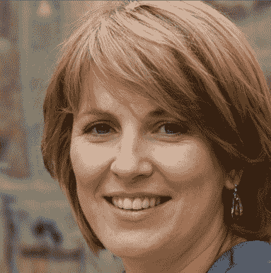
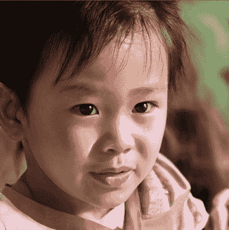

# 第八章：探索可控神经特征字段

在上一章中，你学习了如何使用**神经辐射场**（**NeRF**）表示 3D 场景。我们在一个 3D 场景的多视角图像上训练了一个单一的神经网络，来学习其隐式表示。然后，我们使用 NeRF 模型从不同的视点和视角渲染 3D 场景。在这个模型中，我们假设物体和背景是固定不变的。

但值得怀疑的是，是否可以生成 3D 场景的变化。我们能控制物体的数量、姿态和场景背景吗？我们能在没有摆姿势图像和不了解相机参数的情况下，学习事物的 3D 特性吗？

到本章结束时，你将了解到，确实可以做所有这些事情。具体来说，你应该能更好地理解 GIRAFFE，这是一种非常新颖的可控 3D 图像合成方法。它结合了图像合成和使用类似 NeRF 模型的隐式 3D 表示学习领域的思想。随着我们讨论以下主题，这一点将变得清晰：

+   理解基于 GAN 的图像合成

+   引入组合式 3D 感知图像合成

+   生成特征字段

+   将特征字段映射到图像

+   探索可控场景生成

+   训练 GIRAFFE 模型

# 技术要求

为了运行本书中的示例代码片段，理想情况下，你需要一台配备大约 8GB GPU 内存的计算机。仅使用 CPU 运行代码片段虽然不是不可能，但会非常慢。推荐的计算机配置如下：

+   一台 GPU 设备——例如，Nvidia GTX 系列或 RTX 系列，至少 8GB 内存

+   Python 3.7+

+   Anaconda3

本章的代码片段可以在[`github.com/PacktPublishing/3D-Deep-Learning-with-Python`](https://github.com/PacktPublishing/3D-Deep-Learning-with-Python)找到。

# 理解基于 GAN 的图像合成

深度生成模型已被证明在训练特定领域的数据分布时，可以生成照片级逼真的 2D 图像。**生成对抗网络**（**GANs**）是最广泛使用的框架之一。它们可以以 1,024 x 1,024 及更高的分辨率合成高质量的逼真图像。例如，它们已经被用来生成逼真的人脸：



图 7.1：使用 StyleGAN2 随机生成的高质量 2D 图像的面孔

GANs 可以通过训练生成任何数据分布的相似图像。同样的 StyleGAN2 模型，当在汽车数据集上训练时，可以生成高分辨率的汽车图像：


图 7.2：使用 StyleGAN2 随机生成的汽车作为 2D 图像

GAN（生成对抗网络）基于博弈论场景，其中生成器神经网络生成图像。然而，为了成功，生成器必须欺骗判别器，使其将图像分类为真实的图像。生成器和判别器之间的这种博弈可以促使生成器生成逼真的图像。生成器通过在多维潜在空间上创建概率分布来实现这一点，使得该分布上的点是来自训练图像领域的真实图像。为了生成新的图像，我们只需要从潜在空间中采样一个点，让生成器从中创建图像：


图 7.3：经典 GAN

合成高分辨率的逼真图像固然重要，但这并不是生成模型唯一期望的特性。如果生成过程是可解耦且能够简单、可预测地进行控制，更多的现实应用就会打开。更重要的是，我们需要像物体形状、大小和姿势等属性尽可能解耦，这样我们就可以在不改变图像中其他属性的情况下改变这些属性。

现有基于 GAN 的图像生成方法生成的是 2D 图像，并没有真正理解图像背后的 3D 特性。因此，缺少对物体位置、形状、大小和姿势等属性的明确控制。这导致了 GAN 模型生成的图像属性之间的纠缠。例如，考虑一个生成逼真面部图像的 GAN 模型，在这个模型中，改变头部姿势也会改变生成面部的性别。这种情况发生的原因是性别和头部姿势属性变得纠缠在一起。这对于大多数实际应用场景来说是不可取的。我们需要能够在不影响其他属性的情况下改变某个属性。

在接下来的章节中，我们将概览一个可以生成 2D 图像，并隐含理解底层场景 3D 特性的模型。

# 引入组合式的 3D 感知图像合成

我们的目标是可控的图像合成。我们需要对图像中的物体数量、位置、形状、大小和姿势进行控制。GIRAFFE 模型是首批实现这些理想特性之一，同时还能生成高分辨率的逼真图像。为了对这些属性进行控制，模型必须对场景的 3D 特性有一定的认知。

现在，让我们来看一下 GIRAFFE 模型是如何在其他已知理念的基础上构建的。它利用了以下几个高级概念：

+   **学习 3D 表示**：一种类似 NeRF 的模型，用于学习隐式 3D 表示和特征场。与标准的 NeRF 模型不同，该模型输出的是特征场而不是颜色强度。这个类似 NeRF 的模型用于在生成的图像中强制执行 3D 一致性。

+   **组合运算符**：一个无参数的组合运算符，用于将多个物体的特征场组合成一个单一的特征场。这有助于生成包含所需物体数量的图像。

+   **神经渲染模型**：该模型使用组合的特征场来创建图像。这是一个 2D **卷积神经网络**（**CNN**），它将特征场上采样以生成更高维度的输出图像。

+   **生成对抗网络（GAN）**：GIRAFFE 模型使用 GAN 架构来生成新场景。前面提到的三个组件组成了生成器。该模型还包括一个判别神经网络，用于区分假图像和真实图像。由于包含了 NeRF 模型以及组合运算符，这个模型使得图像生成过程既具组合性又具有 3D 感知能力。

生成图像是一个两步过程：

1.  基于相机视角和你想渲染的物体的一些信息来进行体积渲染。这个物体信息是一些抽象向量，你将在后续章节中了解。

1.  使用神经渲染模型将特征场映射到高分辨率图像。

这种两步法被发现比直接从 NeRF 模型输出生成 RGB 值更适合生成高分辨率图像。从前一章我们知道，NeRF 模型是通过同一场景的图像进行训练的。训练好的模型只能生成来自同一场景的图像。这是 NeRF 模型的一个大限制。

相比之下，GIRAFFE 模型是在来自不同场景的无姿态图像上进行训练的。一个训练好的模型可以生成与其训练数据分布相同的图像。通常，该模型是在相同类型的数据上进行训练的。也就是说，训练数据分布来自单一领域。例如，如果我们在*汽车*数据集上训练模型，我们可以预期该模型生成的图像将是某种形式的汽车。它不能生成完全未见过的分布的图像，例如人脸。虽然这是该模型的一个局限性，但与标准的 NeRF 模型相比，它的限制要小得多。

到目前为止，我们讨论过的 GIRAFFE 模型中实现的基本概念总结如下图所示：


图 7.4：GIRAFFE 模型

生成器模型使用选择的相机姿势和*N*（物体的数量，包括背景），以及相应数量的形状和外观编码与仿射变换，首先合成特征场。然后，将对应单个物体的各个特征场合成在一起，形成一个汇总特征场。接着，它使用体积渲染的标准原理沿光线对特征场进行体积渲染。随后，一个神经渲染网络将该特征场转换为图像空间中的像素值。

在这一部分中，我们对 GIRAFFE 模型有了一个非常广泛的了解。现在让我们深入探讨它的各个组成部分，进一步理解它。

# 生成特征场

场景生成过程的第一步是生成特征场。这类似于在 NeRF 模型中生成 RGB 图像。在 NeRF 模型中，模型的输出是一个特征场，恰好是由 RGB 值构成的图像。然而，特征场可以是图像的任何抽象概念。它是图像矩阵的一个推广。这里的区别在于，GIRAFFE 模型不是生成一个三通道的 RGB 图像，而是生成一个更抽象的图像，我们称之为特征场，其维度为 HV、WV 和 Mf，其中 HV 是特征场的高度，WV 是其宽度，Mf 是特征场中的通道数。

对于这一部分，假设我们已经有一个训练好的 GIRAFFE 模型。它已经在某个预定义的数据集上进行了训练，当前我们不需要考虑这个数据集。要生成新图像，我们需要完成以下三件事：

1.  指定相机姿势：这定义了相机的视角。作为预处理步骤，我们使用该相机姿势向场景投射一条光线，并生成一个方向向量(dj)以及采样点(xij)。我们将向场景投射许多这样的光线。

1.  采样 2N 个潜在编码：我们为每个希望在渲染输出图像中看到的物体采样两个潜在编码。一个潜在编码对应物体的形状，另一个潜在编码对应其外观。这些编码是从标准正态分布中采样的。

1.  指定*N*仿射变换：这对应于物体在场景中的姿势。

模型的生成部分执行以下操作：

+   对于场景中每个预期的物体，使用形状编码、外观编码、物体的姿势信息（即仿射变换）、视角方向向量和场景中的一个点(xij)来生成该点的特征场（一个向量）和体积密度。这就是 NeRF 模型的工作原理。

+   使用组合运算符将这些特征场和密度合成一个单一的特征场和密度值。这时，组合运算符执行以下操作：


点处的体积密度可以简单地求和。特征场通过将重要性分配给该点上物体的体积密度来进行平均。这样简单的算子有一个重要的优点，那就是它是可微的。因此，它可以被引入到神经网络中，因为在模型训练阶段，梯度可以通过这个算子进行传播。

+   我们使用体积渲染来渲染每条射线的特征场，这些射线是通过聚合沿射线方向的特征场值生成的，输入相机视角也会影响射线的生成。我们为多条射线执行此操作，生成一个维度为 HV x WV 的完整特征场。在这里，V 通常是一个较小的值。所以，我们实际上是在创建一个低分辨率的特征场。

特征场

特征场是图像的抽象概念。它们不是 RGB 值，通常具有较低的空间维度（例如 16 x 16 或 64 x 64），但通道维度较高。我们需要一张空间维度较高的图像（例如 512 x 512），但通道数为三（RGB）。让我们看看如何使用神经网络实现这一点。

# 将特征场映射到图像

当我们生成维度为 HV x WV x Mf 的特征场后，我们需要将其映射到维度为 H x W x 3 的图像。通常情况下，HV < H，WV < W，且 Mf > 3。GIRAFFE 模型使用两阶段方法，因为消融分析表明，这比直接使用单阶段方法生成图像更好。

映射操作是一个可以通过数据学习的参数化函数，使用 2D 卷积神经网络（CNN）最适合完成此任务，因为它是图像域中的一个函数。你可以将这个函数视为一个上采样神经网络，类似于自编码器中的解码器。这个神经网络的输出是我们可以看到、理解和评估的渲染图像。从数学上讲，可以定义如下：


该神经网络由一系列上采样层组成，通过*n*个最近邻上采样块完成，之后是 3 x 3 卷积和泄漏 ReLU。这样就创建了一系列*n*个不同空间分辨率的特征场。然而，在每个空间分辨率中，特征场会通过 3 x 3 卷积映射到一个三通道图像，该图像具有相同的空间分辨率。同时，来自前一空间分辨率的图像会使用一个非参数的双线性上采样算子进行上采样，并添加到新空间分辨率的图像中。这一过程会一直重复，直到达到所需的空间分辨率 H x W。

从特征场到相似维度图像的跳跃连接有助于在每个空间分辨率中为特征场提供强的梯度流。直观地说，这确保了神经渲染模型在每个空间分辨率上都对图像有很强的理解。此外，跳跃连接确保生成的最终图像是各个分辨率下图像理解的组合。

这个概念通过以下神经渲染模型的图示变得非常清晰：


图 7.5：神经渲染模型；这是一个 2D CNN，具有一系列最近邻上采样操作符，并与 RGB 图像域进行并行映射

神经渲染模型接收来自前一阶段的特征场输出，并生成高分辨率的 RGB 图像。由于特征场是使用基于 NeRF 的生成器生成的，它应该能够理解场景的三维特性、场景中的物体及其位置、姿势、形状和外观。并且由于我们使用了组合操作符，特征场还编码了场景中物体的数量。

在接下来的章节中，您将了解我们如何控制场景生成过程，以及我们为实现这一目标所拥有的控制机制。

# 探索可控场景生成

要真正理解和学习计算机视觉模型生成的内容，我们需要可视化训练模型的输出。由于我们处理的是生成式方法，可以通过简单地可视化模型生成的图像来做到这一点。在本节中，我们将探索预训练的 GIRAFFE 模型，并查看它们生成可控场景的能力。我们将使用 GIRAFFE 模型创建者提供的预训练检查点。本节提供的指令基于开源的 GitHub 代码库，[`github.com/autonomousvision/giraffe`](https://github.com/autonomousvision/giraffe)。

使用以下命令创建名为`giraffe`的 Anaconda 环境：

```py
$ cd chap7/giraffe
$ conda env create -f environment.yml
$ conda activate giraffe
```

一旦`conda`环境被激活，您就可以使用相应的预训练检查点开始为各种数据集渲染图像。GIRAFFE 模型的创建者已共享来自五个不同数据集的预训练模型：

+   **汽车数据集**：该数据集包含 136,726 张 196 种车型的图片。

+   **CelebA-HQ 数据集**：该数据集包含从原始*CelebA*数据集中选择的 30,000 张高分辨率面部图像。

+   **LSUN 教堂数据集**：该数据集包含约 126,227 张教堂的图片。

+   **CLEVR 数据集**：这是一个主要用于视觉问答研究的数据集，包含 54,336 张不同大小、形状和位置的物体图片。

+   **Flickr-Faces-HQ 数据集**：该数据集包含从 Flickr 获取的 70,000 张高质量的面部图片。

我们将探索在两个不同数据集上的模型输出，以便更好地理解它们。

## 探索可控的汽车生成

在本小节中，我们将探索一个在*Cars*数据集上训练的模型。提供给模型的外观和形状代码将生成汽车，因为该模型是基于汽车数据集进行训练的。您可以运行以下命令来生成图像样本：

```py
$ python render.py configs/256res/cars_256_pretrained.yaml
```

这里，`config` 文件指定了存储生成图像的输出文件夹路径。`render.py` 脚本将自动下载 GIRAFFE 模型的检查点并用它们渲染图像。输出图像存储在 `out/cars256_pretrained/rendering` 中。此文件夹将包含以下子文件夹：

```py
- out
  - cars256_pretrained
    - rendering
      - interpolate_app
      - interpolate_shape
      - translation_object_depth
      - interpolate_bg_app
      - rotation_object
      - translation_object_horizontal
```

这些文件夹中的每个文件夹包含了当我们改变 GIRAFFE 模型的特定输入时所获得的图像。例如，看看以下内容：

+   `interpolate_app`：这是一组图像，用于展示当我们慢慢改变物体外观代码时会发生什么。

+   `interpolate_bg_app`：此示例展示了当我们改变背景外观代码时会发生什么。

+   `interpolate_shape`：此示例展示了当我们改变物体的形状代码时会发生什么。

+   `translation_object_depth`：此示例展示了当我们改变物体的深度时会发生什么。这是仿射变换矩阵代码的一部分，作为输入的一部分。

+   `translation_object_horizontal`：此示例展示了当我们希望将物体在图像中横向移动时会发生什么。这是仿射变换矩阵代码的一部分，作为输入的一部分。

+   `rotation_object`：此示例展示了当我们希望改变物体的姿态时会发生什么。这是仿射变换矩阵代码的一部分，作为输入的一部分。

让我们看一下 `rotation_object` 文件夹中的图像并进行分析：


图 7.6：物体旋转模型图像

每一行的图像都是通过首先选择一个外观和形状代码，并改变仿射变换矩阵仅旋转物体来获得的。仿射变换代码中的横向和平移部分保持固定。物体的背景代码、外观和形状代码也保持不变。不同的行是通过使用不同的外观和形状代码获得的。以下是一些观察结果：

+   所有图像的背景在同一物体的不同图像中保持不变。这表明我们已成功将背景从图像的其他部分中分离出来。

+   颜色、反射与阴影：随着物体的旋转，图像的颜色和反射保持一致，符合物理物体旋转的预期。这是典型的，因为使用了类似 NeRF 的模型架构。

+   左右一致性：汽车的左右视角一致。

+   由于高频变化在图像中未能很好地被 GIRAFFE 模型捕捉到，因此出现了一些不自然的伪影，如模糊的物体边缘和涂抹的背景。

你现在可以探索其他文件夹，以了解当对象平移或背景变化时，模型生成的图像的一致性和质量。

## 探索可控面部生成

在这一小节中，我们将探索一个基于*CelebA-HQ*数据集训练的模型。提供给模型的外观和形状代码将生成面部，因为该模型是根据这些数据训练的。你可以运行以下命令生成图像样本：

```py
$ python render.py configs/256res/celebahq_256_pretrained.yaml
```

`config`文件指定了生成图像存储的输出文件夹路径。生成的图像存储在`out/celebahq_256_pretrained/rendering`中。该文件夹将包含以下子文件夹：

```py
- out
  - celebahq_256_pretrained
    - rendering
      - interpolate_app
      - interpolate_shape
      - rotation_object
```

让我们看看`interpolate_app`文件夹中的图像并分析它们：


图 7.7：插值应用图像

每一行的图像是通过首先选择一个形状代码，并改变外观代码仅改变面部外观来获得的。仿射变换矩阵代码也保持固定。不同的行是通过使用不同的形状代码获得的。以下是一些观察结果：

+   生成面部的形状在同一行的面部中基本保持不变。这表明形状代码对外观代码的变化具有鲁棒性。

+   面部的外观（如肤色、肤光、发色、眉毛颜色、眼睛颜色、嘴唇表情和鼻子形状）会随着外观代码的变化而变化。这表明外观代码编码了面部外观特征。

+   形状代码编码了面部的感知性别。这是有道理的，因为在训练数据集中，男性和女性面部图像之间的面部形状差异较大。

让我们看看`interpolate_shape`文件夹中的图像并分析它们：


图 7.8：插值形状图像

每一行的图像是通过首先选择一个外观代码，并改变形状代码仅改变面部形状来获得的。仿射变换矩阵代码也保持固定。不同的行是通过使用不同的外观代码获得的。以下是一些观察结果：

+   面部的外观（如肤色、肤光、发色、眉毛颜色、眼睛颜色、嘴唇表情和鼻子形状）在形状代码改变时基本保持不变。这表明外观代码对面部形状特征的变化具有鲁棒性。

+   生成的面部形状会随着形状编码的变化而变化。这表明形状编码正确地编码了面部的形状特征。

+   形状编码表示面部的感知性别。这在很大程度上是合理的，因为在训练数据集中，男性和女性面部图像的形状差异较大。

在这一部分，我们探讨了如何使用 GIRAFFE 模型进行可控的 3D 场景生成。我们使用在*Cars*数据集上训练的模型生成了汽车。此外，我们还使用在*CelebA-HQ*数据集上训练的模型生成了面部图像。在这些案例中，我们看到模型的输入参数非常清晰地被解耦。我们使用了 GIRAFFE 模型创建者提供的预训练模型。在下一部分，我们将学习如何在新数据集上训练这样的模型。

# 训练 GIRAFFE 模型

到目前为止，在本章中，我们已经理解了训练好的 GIRAFFE 模型是如何工作的。我们已经理解了构成模型生成器部分的不同组件。

但是，为了训练模型，还有另一个部分是我们到目前为止没有涉及的，即判别器。和其他任何 GAN 模型一样，模型的判别器部分在图像合成时不会使用，但它是训练模型的重要组成部分。在本章中，我们将更详细地研究它，并了解使用的损失函数。我们将使用 GIRAFFE 的作者提供的训练模块从零开始训练一个新模型。

生成器输入的是与物体旋转、背景旋转、相机高度、水平和平移、物体大小相对应的各种潜在编码。这些信息首先用于生成特征场，然后通过神经渲染模块将其映射到 RGB 像素上。这就是生成器。判别器输入两张图像：一张是来自训练数据集的真实图像，另一张是生成器生成的图像。判别器的目标是将真实图像分类为真实，将生成图像分类为假。这就是 GAN 目标。

重要提示

训练数据集没有标签。图像中没有关于物体姿态参数、深度或位置的注释。然而，对于每个数据集，我们大致知道一些参数，如物体旋转率、背景旋转范围、相机高度范围、水平平移、深度平移范围以及物体尺度范围。在训练过程中，输入数据会从这些范围内随机抽取，假设在该范围内均匀分布。

判别器是一个二维卷积神经网络（CNN），它输入一张图像并输出关于真实图像和假图像的置信度分数。

## Frechet Inception Distance

为了评估生成图像的质量，我们使用**Frechet Inception Distance**（**FID**）。这是一种衡量从真实图像和生成图像中提取的特征之间距离的方法。这不是对单个图像的度量，而是对整个图像集群的统计量。这是我们计算 FID 分数的方法：

1.  首先，我们利用 InceptionV3 模型（一种在许多实际应用中使用的流行的深度学习骨干）从图像中提取特征向量。通常，这是分类层之前模型的最后一层。这个特征向量将图像汇总在一个低维空间中。

1.  我们提取了整个实际图像和生成图像集的特征向量。

1.  我们分别计算实际图像和生成图像集的特征向量的均值和协方差。

1.  均值和协方差统计数据在距离公式中用于推导距离度量。

## 训练模型

让我们看看如何在*Cars*数据集上启动模型训练：

```py
python train.py .yaml configs/256res/celebahq_256.yaml
```

可以通过查看配置文件`configs/256res/celebahq_256.yaml`来理解训练参数：

+   **数据**：配置文件的此部分指定要使用的训练数据集的路径：

    ```py
    data:
      path: data/comprehensive_cars/images/*.jpg
      fid_file: data/comprehensive_cars/fid_files/comprehensiveCars_256.npz
      random_crop: True
      img_size: 256
    ```

+   **模型**：这指定了建模参数：

    ```py
    model:
      background_generator_kwargs:
        rgb_out_dim: 256
      bounding_box_generator_kwargs:
        scale_range_min: [0.2, 0.16, 0.16]
        scale_range_max: [0.25, 0.2, 0.2]
        translation_range_min: [-0.22, -0.12, 0.]
        translation_range_max: [0.22, 0.12, 0.]
      generator_kwargs:
        range_v: [0.41667, 0.5]
        fov: 10
      neural_renderer_kwargs:
        input_dim: 256
        n_feat: 256
      decoder_kwargs:
        rgb_out_dim: 256
    ```

+   `d`

+   目录路径和学习率等：

    ```py
    training:
      out_dir:  out/cars256
      learning_rate: 0.00025
    ```

重要说明

训练该模型是一项计算密集型任务。在单个 GPU 上完全训练该模型可能需要 1 到 4 天不等，具体取决于使用的 GPU 设备。

# 摘要

在这一章中，您将使用 GIRAFFE 模型探索可控的 3D 感知图像合成。该模型借鉴了 NeRF、GAN 和 2D CNN 的概念，以创建可控的 3D 场景。首先，我们回顾了 GANs。然后，我们深入探讨了 GIRAFFE 模型，生成特征场的生成方式，以及这些特征场如何转换为 RGB 图像。然后，我们探索了该模型的输出，并了解了其属性和局限性。最后，我们简要介绍了如何训练这个模型。

在下一章中，我们将探讨一种用于生成三维逼真人体的相对新技术，称为 SMPL 模型。值得注意的是，SMPL 模型是少数几个不使用深度神经网络的模型之一。相反，它使用更经典的统计技术，如主成分分析，来实现其目标。您将了解到在构建使用经典技术的模型时，良好的数学问题表述的重要性。
