# 第九章：3D 建模人体

在前几章中，我们探索了 3D 场景及其物体的建模方法。我们建模的大多数物体都是静态且不变的，但现实生活中，计算机视觉的许多应用都集中在人类及其自然环境中。我们希望建模人类与其他人和物体的互动。

这一技术有多个应用。例如，Snapchat 滤镜、FaceRig、虚拟试衣和好莱坞的动作捕捉技术都受益于精确的 3D 人体建模。例如，考虑一下自动结账技术。在这里，零售店配备了多个深度感应摄像头。它们可能希望检测到顾客拿起物品时，并相应地修改他们的结账篮。这类应用和更多的应用都需要我们精确建模人体。

人体姿势估计是人体建模的一个核心问题。这样的模型可以预测关节的位置，例如肩膀、臀部和肘部，从而创建图像中人的骨架。然后，这些数据可用于多个下游应用，如动作识别和人机交互。然而，将人体建模为一组关节也有其局限性：

+   人体关节是不可见的，且永远不会与物理世界互动。因此，我们不能仅依靠它们来准确建模人机交互。

+   关节并不能建模人体的拓扑结构、体积和表面。对于某些应用，如模拟衣物如何贴合，单纯的关节建模是无用的。

我们可以达成共识：人体姿势模型对某些应用是有效的，但绝对不够真实。我们如何才能更真实地建模人体？这是否能解决这些局限性？这将开启哪些新的应用？我们将在本章回答这些问题。具体来说，我们将涵盖以下主题：

+   制定 3D 建模问题

+   理解线性混合蒙皮（Linear Blend Skinning）技术

+   理解 SMPL 模型

+   使用 SMPL 模型

+   使用 SMPLify 估计 3D 人体姿势与形状

+   探索 SMPLify

# 技术要求

本章代码的计算需求相对较低。然而，建议在 Linux 环境中运行，因为它对某些库有更好的支持。但在其他环境中运行也是可行的。在代码部分，我们将详细描述如何设置环境，以便成功运行代码。本章需要以下技术要求：

+   Python 2.7

+   库：如 opendr、matplotlib、opencv 和 numpy。

本章的代码片段可以在[`github.com/PacktPublishing/3D-Deep-Learning-with-Python`](https://github.com/PacktPublishing/3D-Deep-Learning-with-Python)找到。

# 制定 3D 建模问题

*“所有模型都是错误的，但有些模型是有用的”* 这句名言在统计学中非常流行。它表明，通常很难精确地数学化问题中的所有细节。一个模型始终是对现实的近似，但有些模型比其他模型更准确，因此也更有用。

在机器学习领域，建模一个问题通常包括以下两个组件：

+   数学化问题表述

+   在该表述的约束和边界下，构建解决问题的算法

在处理不够明确的问题时，即使使用优秀的算法，通常也会得到次优的模型。然而，将较弱的算法应用于一个合理表述的模型，有时却能产生很好的解决方案。这一见解对于构建 3D 人体模型尤其适用。

这个建模问题的目标是创建逼真的动画人体。更重要的是，这些模型应该能够真实地表现人体形状，并且必须根据人体姿势变化自然变形，同时捕捉软组织的运动。3D 人体建模是一个艰巨的挑战。人体由大量的骨骼、器官、皮肤、肌肉和水分组成，它们之间以复杂的方式相互作用。为了精确地建模人体，我们需要建模所有这些个体组件的行为及它们之间的相互作用。这是一个艰难的挑战，对于一些实际应用来说，这种精确度并非必须。在本章中，我们将以建模人体表面和形状的方式，作为建模整个人体的代理。我们不需要模型完全精确；我们只需要它具有逼真的外观。这使得问题变得更加可处理。

## 定义一个好的表示

目标是用低维表示准确地描述人体。关节模型是低维表示（通常在 3D 空间中包含 17 到 25 个点），但它们并不包含很多关于人体形状和纹理的信息。另一方面，我们可以考虑体素网格表示。它可以建模 3D 人体的形状和纹理，但其维度极高，并且由于姿势变化，它并不自然适用于建模人体动态。

因此，我们需要一种能够联合表示身体关节和表面的表示方法，包含有关身体体积的信息。有几种候选表示方法可以用于表示表面；其中一种表示方法是顶点网格。**Skinned Multi-Person Linear**（**SMPL**）模型就是使用这种表示方法。一旦指定，这个顶点网格就能描述人体的 3D 形状。

由于这个问题已有很多历史背景，我们会发现许多角色动画领域的艺术家都曾致力于构建良好的人体网格。SMPL 模型运用了这些专家的见解来构建人体网格的良好初始模板。这是一个重要的第一步，因为人体的某些部分存在高频变化（例如面部和手部）。这些高频变化需要更多密集的点来描述，而频率较低的部位（如大腿）则只需要较少的点来准确描述。这样的手工制作初始网格有助于降低问题的维度，同时保持准确建模所需的信息。SMPL 模型中的这个网格是性别中立的，但你可以为男性和女性分别构建不同的变体。

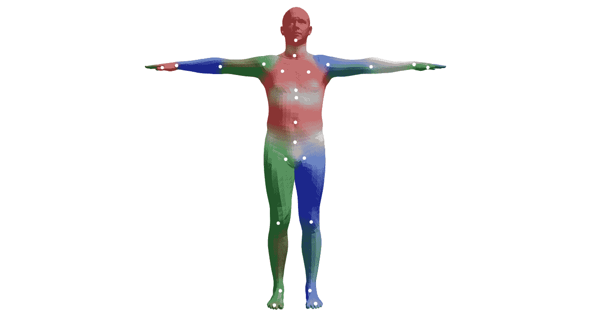

图 8.1 – SMPL 模型静止姿势下的模板网格

更具体来说，初始模板网格由 6,890 个三维空间中的点组成，用于表示人体表面。当该网格进行矢量化时，模板网格的矢量长度为 6,890 x 3 = 20,670。任何人体都可以通过扭曲这个模板网格矢量来适应人体表面。

这个概念看起来在纸面上非常简单，但一个 20,670 维矢量的配置数量是极其庞大的。表示一个真实人体的配置集是所有可能性中的一个极其微小的子集。问题在于如何定义一种方法，以获得一个合理的配置来表示一个真实的人体。

在我们了解 SMPL 模型的设计之前，我们需要了解蒙皮模型。在接下来的部分，我们将探讨最简单的蒙皮技术之一：线性混合蒙皮技术。这一点很重要，因为 SMPL 模型就是在这种技术基础上构建的。

# 理解线性混合蒙皮技术

一旦我们拥有了良好的三维人体表示，我们就希望模拟它在不同姿势下的表现。这对于角色动画尤其重要。**蒙皮**的概念是将一个基础骨架用一层皮肤（表面）包裹起来，这个皮肤展现了被动画化物体的外观。这是动画行业中的一个术语。通常，这种表示形式采用顶点的方式，然后利用这些顶点定义连接的多边形来形成表面。

线性混合蒙皮模型（Linear Blend Skinning）用于将处于静止姿势的皮肤转换成任意姿势下的皮肤，使用的是一个简单的线性模型。由于其渲染效率高，许多游戏引擎支持这种技术，它也被用于实时渲染游戏角色。

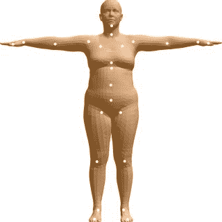

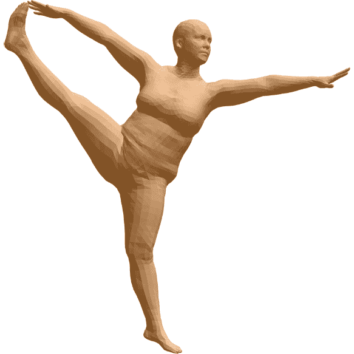

图 8.2 – 初始混合形状（左）和使用混合蒙皮生成的变形网格（右）

现在我们来理解一下这个技术涉及的内容。该技术是一个使用以下参数的模型：

+   一个模板网格，`T`，具有`N`个顶点。在这个例子中，N = 6,890。

+   我们有`K`个关节位置，由向量`J`表示。这些关节对应人体中的关节（如肩膀、手腕和脚踝）。共有 23 个这样的关节（K = 23）。

+   混合权重，`W`。这通常是一个`N` x `K`大小的矩阵，捕捉`N`个表面顶点与`K`个身体关节之间的关系。

+   姿势参数，Ɵ。这些是每个 K 个关节的旋转参数。总共有 3K 个这样的参数。在这个例子中，我们有 72 个参数。69 个参数对应 23 个关节，3 个参数对应整个身体的旋转。

蒙皮函数将静止姿势网格、关节位置、混合权重和姿势参数作为输入，并生成输出顶点：


在线性混合蒙皮中，函数以简单的线性形式表示变换后的模板顶点，如下式所示：

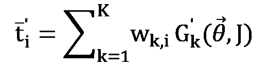

这些术语的含义如下：

+   *t_i*表示处于静止姿势下原始网格中的顶点。

+   `G`(Ɵ, J)是将关节 k 从静止姿势变换到目标姿势的矩阵。

+   *w_k, i*是混合权重`W`的元素。它们表示关节 k 对顶点 i 的影响程度。

虽然这是一个易于使用的线性模型，并且在动画行业中得到了广泛应用，但它并没有明确保留体积。因此，变换可能看起来不自然。

为了解决这个问题，艺术家调整模板网格，以便在应用蒙皮模型时，最终效果看起来自然且逼真。通过对模板网格应用线性变形以获得逼真外观的变形网格，这些被称为混合形状。这些混合形状是艺术家根据动画角色可以有的不同姿势设计的。这是一个非常耗时的过程。

正如我们稍后将看到的，SMPL 模型在应用蒙皮模型之前，会自动计算混合形状。在下一部分中，你将了解 SMPL 模型是如何创建这些依赖姿势的混合形状，以及数据是如何用来引导它的。

# 了解 SMPL 模型

**正如 SMPL 的缩写**所暗示的那样，这是一个基于成千上万人的数据训练得到的线性学习模型。该模型建立在线性混合蒙皮模型的概念之上。它是一个无监督生成模型，通过提供的输入参数生成一个 20,670 维的向量，而这些参数是我们可以控制的。该模型计算所需的混合形状，以产生正确的变形，适应不同的输入参数。我们需要这些输入参数具备以下重要特性：

+   它应该对应人体的真实可感知属性。

+   特征必须本质上是低维的。这将使我们能够轻松地控制生成过程。

+   特征必须是可解耦的，并以可预测的方式进行控制。也就是说，改变一个参数不应改变与其他参数相关的输出特征。

考虑到这些要求，SMPL 模型的创建者提出了两个最重要的输入属性：身体身份的某种概念和身体姿势。SMPL 模型将最终的 3D 身体网格分解为基于身份的形状和基于姿势的形状（基于身份的形状也称为基于形状的形状，因为身体形状与一个人的身份紧密相关）。这使得该模型具有所需的特征解耦性质。还有一些其他重要因素，如呼吸和软组织动态（当身体处于运动状态时），我们在本章中不做详细解释，但它们是 SMPL 模型的一部分。

最重要的是，SMPL 模型是一个加性变形模型。也就是说，所需的输出体形向量是通过将变形添加到原始模板体形向量中得到的。这种加性特性使得该模型非常直观，易于理解和优化。

## 定义 SMPL 模型

SMPL 模型是在标准蒙皮模型的基础上构建的。它对其做出了以下改动：

+   它不使用标准的静止姿势模板，而是使用一个依赖于身体形状和姿势的模板网格

+   关节位置是身体形状的函数

SMPL 模型指定的函数具有以下形式：

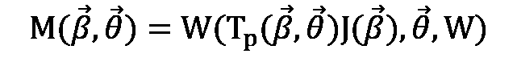

以下是前述定义中各术语的含义：

+   β 是表示身份（也叫形状）向量。稍后我们将进一步了解它所表示的含义。

+   Ɵ 是对应于目标姿势的姿势参数。

+   W 是来自线性混合蒙皮模型的混合权重。

这个函数看起来与线性混合蒙皮（Linear Blend Skinning）模型非常相似。在这个函数中，模板网格是形状和姿势参数的函数，关节位置是形状参数的函数。而在线性混合蒙皮模型中并非如此。

### 依赖形状和姿势的模板网格

重新定义的模板网格是标准模板网格的加性线性变形：

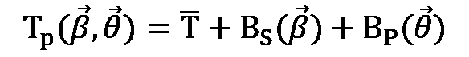

在这里，我们看到以下内容：

+   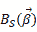 是来自身体形状参数 β 的加性形变。它是一个学习到的形变，建模为形状位移的前几个主成分。这些主成分是从训练数据中获得的，涉及到不同的人在相同静态姿势下的数据。

+   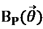 是一个加性姿势形变项。它由 Ɵ 参数化。这也是从一个包含不同姿势下人物的多姿势数据集中学习得到的线性函数。

### 形状依赖的关节

由于关节位置依赖于身体形状，因此它们被重新定义为身体形状的函数。SMPL 模型将其定义如下：

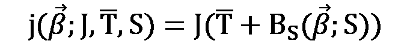

这里，`B[s](→β)` 是来自身体形状参数 `β` 的加性形变，`J` 是一个矩阵，用于将静态模板顶点转换为静态模板姿势。`J` 的参数也是从数据中学习得出的。

# 使用 SMPL 模型

现在你对 SMPL 模型有了大致了解，我们将看看如何使用它来创建人类的 3D 模型。在这一部分中，我们将从几个基本函数开始，这将帮助你探索 SMPL 模型。我们将加载 SMPL 模型，并编辑形状和姿势参数以创建一个新的 3D 身体。然后，我们将其保存为对象文件并进行可视化。

这段代码最初是由 SMPL 的作者为 `python2` 创建的。因此，我们需要创建一个独立的 `python2` 环境。以下是创建环境的说明：

```py
cd chap8
```

```py
conda create -n python2 python=2.7 anaconda
```

```py
source activate python2
```

```py
pip install –r requirements.txt
```

这会创建并激活 Python 2.7 的 conda 环境，并安装所需的模块。由于 Python 2.7 已经被废弃，因此你在使用时可能会看到警告信息。为了创建一个具有随机形状和姿势参数的 3D 人体，运行以下命令。

```py
$ python render_smpl.py
```

这将弹出一个窗口，显示 3D 渲染的人体。我们的输出可能会有所不同，因为 `render_smpl.py` 会创建一个具有随机姿势和形状参数的人体。

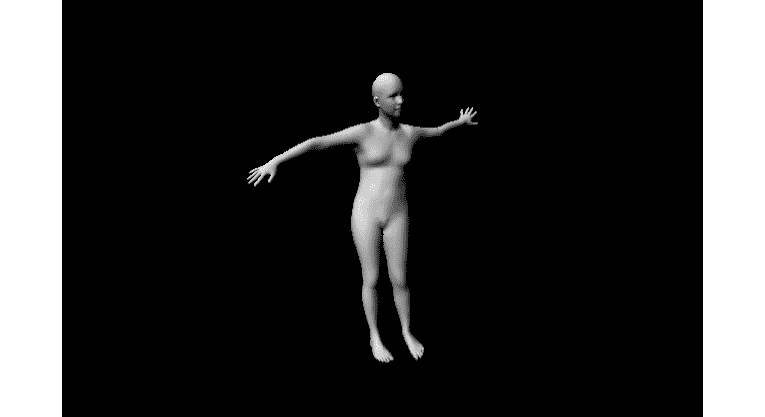

图 8.3 – 由 explore_smpl.py 创建的 hello_smpl.obj 渲染示例

现在我们已经运行了代码并获得了可视化输出，让我们来看看 `render_smpl.py` 文件中的具体内容：

1.  导入所有必需的模块：

    ```py
    import cv2
    import numpy as np
    from opendr.renderer import ColoredRenderer
    from opendr.lighting import LambertianPointLight
    from opendr.camera import ProjectPoints
    from smpl.serialization import load_model
    ```

1.  加载基础 SMPL 模型的模型权重。这里，我们加载了神经网络人体模型：

    ```py
    m = load_model('../smplify/code/models/basicModel_neutral_lbs_10_207_0_v1.0.0.pkl')
    ```

1.  接下来，我们分配随机的姿势和形状参数。以下的姿势和形状参数决定了最终 3D 身体网格的外观：

    ```py
    m.pose[:] = np.random.rand(m.pose.size) * .2
    m.betas[:] = np.random.rand(m.betas.size) * .03
    m.pose[0] = np.pi
    ```

1.  我们现在创建一个渲染器并为其分配属性，同时构建光源。默认情况下，我们使用 OpenDR 渲染器，但你可以切换为 PyTorch3D 渲染器和光源。在这样做之前，请确保解决任何 Python 不兼容性问题。

    ```py
    rn = ColoredRenderer()
    w, h = (640, 480)
    rn.camera = ProjectPoints(v=m, rt=np.zeros(3), t=np.array([0, 0, 2.]), f=np.array([w,w])/2., c=np.array([w,h])/2., k=np.zeros(5))
    rn.frustum = {'near': 1., 'far': 10., 'width': w, 'height': h}
    rn.set(v=m, f=m.f, bgcolor=np.zeros(3))
    rn.vc = LambertianPointLight(f=m.f, v=rn.v, num_verts=len(m), light_pos=np.array([-1000,-1000,-2000]), vc=np.ones_like(m)*.9, light_color=np.array([1., 1., 1.]))
    ```

1.  现在我们可以渲染网格并在 OpenCV 窗口中显示它：

    ```py
    cv2.imshow('render_SMPL', rn.r)
    cv2.waitKey(0)
    cv2.destroyAllWindows()
    ```

我们现在已经使用 SMPL 模型生成了一个随机的 3D 人体。实际上，我们可能更感兴趣的是生成更加可控的 3D 形状。我们将在下一节中讨论如何做到这一点。

# 使用 SMPLify 估计 3D 人体姿态和形状

在上一节中，你探索了 SMPL 模型，并用它生成了一个形状和姿势随机的 3D 人体。自然地，我们会想知道是否可以利用 SMPL 模型将 3D 人体拟合到二维图像中的一个人身上。这有多个实际应用，比如理解人体动作或从二维视频创建动画。事实上，这是可行的，在本章中，我们将更详细地探讨这一思路。

假设你得到了一张单独的 RGB 图像，图中有一个人，但没有任何关于身体姿态、相机参数或形状参数的信息。我们的目标是仅从这张图像推测出 3D 形状和姿态。从二维图像估计 3D 形状并非总是没有误差的。这是一个具有挑战性的问题，因为人体的复杂性、关节运动、遮挡、服装、光照，以及从二维推测三维本身存在固有的模糊性（因为多个 3D 姿态在投影时可能具有相同的 2D 姿态）。我们还需要一种自动估计方法，尽量减少人工干预。它还需要在自然图像中，面对各种背景、光照条件和相机参数时，也能有效工作。

这种方法是由来自马普智能系统研究所（SMPL 模型的发明地）、微软、马里兰大学和图宾根大学的研究人员发明的。这个方法被称为 SMPLify。让我们更详细地探讨这个方法。

SMPLify 方法包括以下两个阶段：

1.  使用现有的姿态检测模型（如 OpenPose 或 DeepCut）自动检测二维关节。只要它们预测的是相同的关节，任何二维关节检测器都可以替代使用。

1.  使用 SMPL 模型生成 3D 形状。直接优化 SMPL 模型的参数，使得 SMPL 模型的关节在二维上与前一阶段预测的关节相匹配。

我们知道 SMPL 仅通过关节捕捉形状。因此，通过 SMPL 模型，我们可以仅通过关节获取关于人体形状的信息。在 SMPL 模型中，身体形状参数由β表示。它们是 PCA 形状模型中主成分的系数。姿态通过运动学树中 23 个关节的相对旋转和θ来参数化。我们需要拟合这些参数β和θ，以使目标函数最小化。

## 定义优化目标函数

任何目标函数必须捕捉我们最小化某种误差的意图。误差计算越准确，优化步骤的输出结果就会越准确。我们将首先查看整个目标函数，然后逐一分析该函数的各个组成部分，并解释它们为何必要：

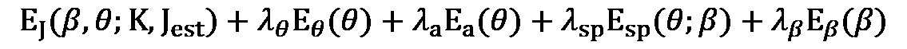

+   我们希望通过优化参数*β*和Ɵ来最小化这个目标函数。它包含四个项和相应的系数，*λ*Ɵ、*λ*a、*λ*sp 和*λ*β，它们是优化过程中的超参数。以下是每个单独项的含义：

    +   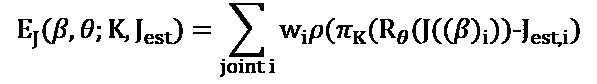是一个基于关节的项，用于惩罚 SMPL 模型的 2D 投影关节与 2D 关节检测器（如 DeepCut 或 OpenPose）预测的关节位置之间的距离。*w_i*是由 2D 关节检测模型提供的每个关节的置信度分数。当一个关节被遮挡时，该关节的置信度分数会很低。自然地，我们不应过于重视这些被遮挡的关节。

    +   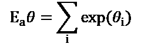是一个惩罚关节之间大角度的姿势项。例如，它确保肘部和膝盖不会不自然地弯曲。

    +   是一个拟合自然姿势的高斯混合模型，这些姿势是从一个非常大的数据集中获取的。这个数据集被称为 CMU 图形实验室动作捕捉数据库，包含近一百万个数据点。这个数据驱动项确保优化函数中的姿势参数接近我们在现实中观察到的姿势。

1.  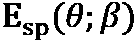是自相交误差。当作者在优化目标函数时没有这个误差项时，他们看到了不自然的自相交现象，比如肘部和手部扭曲并穿透腹部。这在物理上是不可能的。然而，添加了这个误差项后，他们发现得到了自然的定性结果。这个误差项由身体部位组成，这些部位被近似为一组球体。他们定义了不兼容的球体，并惩罚这些不兼容球体的交集。

1.  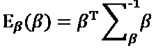是从 SMPL 模型中获得的形状。这里需要注意的是，主成分矩阵是 SMPL 模型的一部分，它是通过在 SMPL 训练数据集上进行训练获得的。

总结来说，目标函数由五个组成部分构成，它们共同确保该目标函数的解是一组姿势和形状参数（theta 和 beta），既保证了 2D 关节投影距离的最小化，同时又确保没有大角度的关节、没有不自然的自相交，并且姿势和形状参数遵循我们在由自然体态和形状组成的大型数据集中观察到的先验分布。

# 探索 SMPLify

现在我们已经对如何估计一个人 2D RGB 图像中的 3D 身体形状有了大致的了解，接下来让我们通过代码来实际操作。具体来说，我们将拟合 3D 身体形状到 **Leeds Sports Pose** (**LSP**) 数据集中的两张 2D 图像。这些图像来自 Flickr，包含了 2,000 张带有姿势注释的运动员图像。我们将首先运行代码并生成这些拟合的身体形状，然后再深入探讨代码的细节。本节中使用的所有代码都来自论文 *Keep it SMPL: Automatic Estimation of 3D Human Pose and Shape from a Single Image* 的实现。我们仅对其进行了调整，以便帮助你这个学习者快速运行代码并自己可视化输出结果。

这段代码最初是由 SMPLify 的作者为 `python2` 创建的。因此，我们需要使用与探索 SMPL 模型时相同的 `python2` 环境。在运行任何代码之前，让我们快速了解代码的结构：

```py
chap8
  -- smplify
    -- code
      -- fit3d_utils.py
      -- run_fit3d.py
      -- render_model.py
      -- lib
      -- models
    -- images
    -- results
```

## 运行代码

你将直接与之交互的主要文件是 `run_fir3d.py`。名为 `images` 的文件夹中包含一些来自 LSP 数据集的示例图像。然而，在我们运行代码之前，请确保正确设置了 `PYTHONPATH`。它应该指向 `chap8` 文件夹的位置。你可以运行以下代码来设置：

```py
export PYTHONPATH=$PYTHONPATH:<user-specific-path>/3D-Deep-Learning-with-Python/chap8/
```

现在，进入正确的文件夹：

```py
cd smplify/code
```

你现在可以运行以下命令，将 3D 身体拟合到 `images` 文件夹中的图像上：

```py
python run_fit3d.py --base_dir ../ --out_dir .
```

这次运行不会使用任何穿透误差，因为它会更快地进行优化迭代。最后，我们将拟合一个身体中立形状。你将能够可视化拟合到图像中的 3D 身体姿态。一旦优化完成，你将看到以下两张图像：

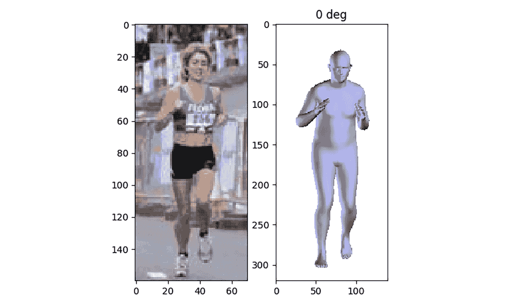

图 8.4 – LSP 数据集中一个正在跑步的人物图像（左）和与该图像相匹配的 3D 身体形状（右）

另一个输出如下：

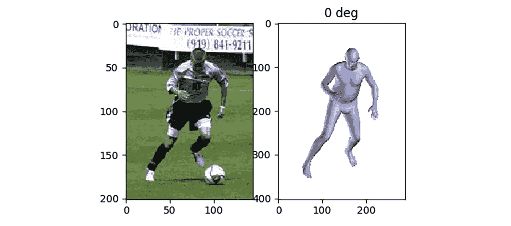

图 8.5 – LSP 数据集中一个正在踢足球的运动员图像（左）和与该图像相匹配的 3D 身体形状（右）

## 探索代码

现在你已经运行了代码来拟合 2D 图像中的人物，让我们更详细地查看代码，以理解实现这一目标所需的一些主要组件。你会在 `run_fit3d.py` 文件中找到所有这些组件。你需要执行以下步骤：

1.  让我们首先导入我们需要的所有模块：

    ```py
    from os.path import join, exists, abspath, dirname
    from os import makedirs
    import cPickle as pickle
    from glob import glob
    import cv2
    import numpy as np
    import matplotlib.pyplot as plt
    import argparse
    from smpl.serialization import load_model
    from smplify.code.fit3d_utils import run_single_fit
    ```

1.  现在让我们定义 SMPL 模型的位置。通过以下方法来完成：

    ```py
    MODEL_DIR = join(abspath(dirname(__file__)), 'models')
    MODEL_NEUTRAL_PATH = join(
    MODEL_DIR, 'basicModel_neutral_lbs_10_207_0_v1.0.0.pkl')
    ```

1.  让我们设置一些优化方法所需的参数，并定义图像和结果所在的目录。结果文件夹将包含数据集中所有图像的关节估计。`viz`被设置为`True`，以启用可视化。我们使用具有 10 个参数的 SMPL 模型（即，它使用 10 个主成分来建模身体形状）。`flength`是相机的焦距；在优化过程中保持固定。`pix_thsh`是阈值（以像素为单位）。如果 2D 肩部关节之间的距离低于`pix_thsh`，则身体朝向是模糊的。这种情况可能发生在一个人站在与相机垂直的位置时。因此，很难判断他们是面朝左侧还是右侧。于是，系统会对估计的关节和它的翻转版本都进行拟合：

    ```py
    viz = True
    n_betas = 10
    flength = 5000.0
    pix_thsh = 25.0
    img_dir = join(abspath(base_dir), 'images/lsp')
    data_dir = join(abspath(base_dir), 'results/lsp')
    if not exists(out_dir):
        makedirs(out_dir)
    ```

1.  然后，我们应该将这个性别中立的 SMPL 模型加载到内存中：

    ```py
    model = load_model(MODEL_NEUTRAL_PATH)
    ```

1.  接下来，我们需要加载 LSP 数据集中图像的关节估计。LSP 数据集本身包含所有图像的关节估计和相应的关节置信度分数。我们将直接使用它。你也可以提供自己的关节估计，或者使用好的关节估计器，如 OpenPose 或 DeepCut，来获取关节估计：

    ```py
    est = np.load(join(data_dir, 'est_joints.npz'))['est_joints']
    ```

1.  接下来，我们需要加载数据集中的图像，并获取相应的关节估计和置信度分数：

    ```py
    img_paths = sorted(glob(join(img_dir, '*[0-9].jpg')))
    for ind, img_path in enumerate(img_paths):
        img = cv2.imread(img_path)
        joints = est[:2, :, ind].T
        conf = est[2, :, ind]
    ```

1.  对于数据集中的每一张图像，使用`run_single_fit`函数来拟合参数 beta 和 theta。以下函数会在类似于我们前一节讨论的 SMPLify 目标函数上运行优化，并返回这些参数：

    ```py
    params, vis = run_single_fit(img, joints, conf, model, regs=sph_regs, n_betas=n_betas, flength=flength, pix_thsh=pix_thsh, scale_factor=2, viz=viz, do_degrees=do_degrees)
    ```

在优化目标函数的过程中，函数会创建一个`matplotlib`窗口，其中绿色圆圈是来自 2D 关节检测模型的 2D 关节估计（这些是由你提供的）。红色圆圈是正在拟合到 2D 图像上的 SMPL 3D 模型的投影关节：

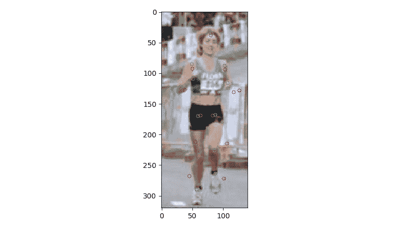

图 8.6 – 可视化提供的 2D 关节（绿色）和正在拟合到 2D 图像上的 SMPL 模型的投影关节（红色）

1.  接下来，我们想要将拟合好的 3D 人体与 2D RGB 图像一起进行可视化。我们使用 matplotlib 来完成此任务。以下代码将打开一个交互窗口，你可以在其中将图像保存到磁盘：

    ```py
    if viz:
        import matplotlib.pyplot as plt
        plt.ion()
        plt.show()
        plt.subplot(121)
        plt.imshow(img[:, :, ::-1])
        for di, deg in enumerate(do_degrees):
            plt.subplot(122)
            plt.cla()
            plt.imshow(vis[di])
            plt.draw()
            plt.title('%d deg' % deg)
            plt.pause(1)
            raw_input('Press any key to continue...')
    ```

1.  然后，我们想要使用以下代码将这些参数和可视化结果保存到磁盘：

    ```py
        with open(out_path, 'w') as outf:
            pickle.dump(params, outf)
        if do_degrees is not None:
            cv2.imwrite(out_path.replace('.pkl', '.png'), vis[0])
    ```

在上述代码中，最重要的函数是`run_single_fit`。你可以在`smplify.code.fit3d_utils.py`中更详细地查看这个函数。

需要注意的是，拟合的 3D 身体的精度取决于 2D 关节的精度。由于 2D 关节是通过关节检测模型（例如 OpenPose 或 DeepCut）预测的，因此这些关节预测模型的准确性对这个问题非常重要。估计 2D 关节在以下场景中尤其容易出错：

+   不完全可见的关节很难预测。这可能由于多种原因导致，包括自遮挡、被其他物体遮挡、不寻常的衣物等。

+   很容易混淆左右关节（例如，左手腕和右手腕）。当人面对镜头侧面时，这一点尤其明显。

+   如果模型没有针对这些姿势进行训练，检测不寻常姿势中的关节是很困难的。这取决于用于训练关节检测器的数据集的多样性。

更广泛地说，一个由多个机器学习模型依次相互作用的系统（即，一个模型的输出成为另一个模型的输入）将会遭遇级联错误。在一个组件中出现的小错误将导致下游组件输出的大错误。通常通过端到端训练系统来解决这个问题。然而，由于目前研究界没有直接将 2D 输入图像映射到 3D 模型的真实数据，因此此策略暂时无法使用。

# 总结

在本章中，我们概览了 3D 人体建模的数学公式。我们理解了良好表示的强大功能，并通过简单的方法，如在强大表示上使用线性混合蒙皮（Linear Blend Skinning），获得了真实的输出。接着，我们对 SMPL 模型进行了高层次概述，并利用它创建了一个随机的 3D 人体。之后，我们回顾了生成它所用的代码。接下来，我们探讨了如何使用 SMPLify 将 3D 人体形状拟合到 2D RGB 图像中的人物身上。我们了解了它如何在后台使用 SMPL 模型。此外，我们还将人体形状拟合到 LSP 数据集中的两张图像，并理解了我们用于此目的的代码。通过这些，我们对 3D 人体建模有了高层次的概述。

在下一章，我们将探讨 SynSin 模型，通常用于 3D 重建。下一章的目标是理解如何仅凭一张图像重建来自不同视角的图像。
