# 第十章：使用 SynSin 进行端到端视图合成

本章专注于名为 SynSin 的最新视图合成模型。视图合成是 3D 深度学习的主要方向之一，可以在多个不同领域（如 AR、VR、游戏等）中使用。其目标是为给定的图像作为输入，从另一个视角重建一个新的图像。

本章首先探讨视图合成及其现有的解决方法。我们将讨论这些技术的所有优缺点。

其次，我们将深入探讨 SynSin 模型的架构。这是一个端到端模型，由三个主要模块组成。我们将讨论每个模块，并了解这些模块如何帮助解决视图合成而无需任何 3D 数据。

在理解模型的整体结构之后，我们将进入实际操作阶段，设置和操作模型以更好地理解整个视图合成过程。我们将训练和测试模型，并使用预训练模型进行推断。

本章将涵盖以下主要主题：

+   视图合成概述

+   SynSin 网络架构

+   模型训练和测试实践

# 技术要求

要运行本书中的示例代码片段，理想情况下读者需要一台配备 GPU 的计算机。然而，仅使用 CPU 运行代码片段并非不可能。

推荐的计算机配置包括以下内容：

+   例如，具有至少 8GB 内存的 Nvidia GTX 系列或 RTX 系列 GPU

+   Python 3

+   PyTorch 和 PyTorch3D 库

本章的代码片段可以在[https:github.com/PacktPublishing/3D-Deep-Learning-with-Python](https://github.com/PacktPublishing/3D-Deep-Learning-with-Python)找到。

# 视图合成概述

在 3D 计算机视觉中最流行的研究方向之一是视图合成。在这个研究方向中，给定数据和视点，其核心思想是生成一个新的图像，从另一个视角渲染对象。

视图合成面临两个挑战。模型应该理解图像的 3D 结构和语义信息。所谓 3D 结构，是指当视角发生变化时，我们会靠近一些物体而远离其他物体。一个好的模型应该通过渲染图像来处理这种变化，其中一些物体变得更大，另一些则变得更小。所谓语义信息，是指模型应区分图像中的物体，并理解图像中展示的物体。这一点非常重要，因为某些物体可能只部分出现在图像中；因此，在重建过程中，模型应理解物体的语义，以便知道如何重建该物体的延续部分。例如，给定一张车子的一侧图像，我们只能看到两个车轮，我们知道车子的另一侧还有两个轮子。模型在重建时必须包含这些语义信息：

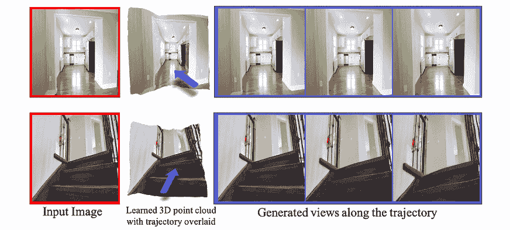

图 9.1：红框的照片展示了原始图像，蓝框的照片展示了新生成的图像；这是使用 SynSin 方法进行视图合成的一个示例。

许多挑战需要解决。对于模型来说，从一张图像中理解 3D 场景是很困难的。视图合成有几种方法：

+   **多幅图像的视图合成**：深度神经网络可以用来学习多幅图像的深度，然后从另一个视角重建新图像。然而，如前所述，这意味着我们有来自稍微不同视角的多幅图像，有时很难获得这种数据。

+   **使用真实深度进行视图合成**：这涉及一组技术，其中使用真实深度掩码与图像一同表示图像的深度和语义。尽管在某些情况下，这些类型的模型可以取得不错的结果，但收集大规模数据是困难且昂贵的，尤其是在户外场景中。此外，对这类数据进行大规模标注也既昂贵又耗时。

+   **单幅图像的视图合成**：当我们只有一张图像并且旨在从新视角重建图像时，这是一种更为现实的设置。仅使用一张图像很难获得更准确的结果。SynSin 属于一类能够实现最先进视图合成方法的技术。

所以，我们已经简要概述了视图合成的内容。接下来，我们将深入探讨 SynSin，研究其网络架构，并检查模型的训练和测试过程。

# SynSin 网络架构

SynSin 的核心思想是通过一个端到端模型来解决视图合成问题，并且在测试时只需使用一张图像。这个模型不需要 3D 数据注释，并且与基准模型相比，能实现非常好的准确度：

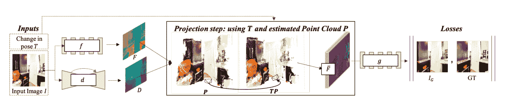

图 9.2：端到端 SynSin 方法的结构

该模型是端到端训练的，包含三个不同的模块：

+   空间特征和深度网络

+   神经点云渲染器

+   精炼模块和判别器

让我们深入了解每个网络，以便更好地理解架构。

## 空间特征和深度网络

如果我们放大看一下*图 9.2*的第一部分，我们可以看到两种不同的网络，它们都输入相同的图像。这些分别是空间特征网络（`f`）和深度网络（`d`）（*图 9.3*）：

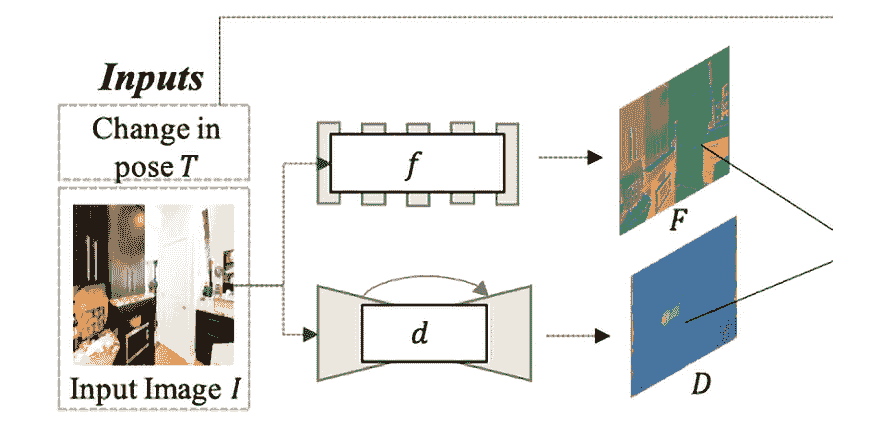

图 9.3：空间特征和深度网络的输入与输出

给定一张参考图像和期望的姿态变化（`T`），我们希望生成一张图像，好像该姿态变化已经应用到参考图像中。对于第一部分，我们只使用参考图像，并将其输入到两个网络中。空间特征网络的目标是学习特征图，这些特征图是图像的高分辨率表示。模型的这一部分负责学习图像的语义信息。该模型由八个 ResNet 块组成，并为图像的每个像素输出 64 维特征图。输出的分辨率与原始图像相同。

接下来，深度网络的目标是学习图像的 3D 结构。由于我们没有使用精确的 3D 注释，它不会是一个准确的 3D 结构。但该模型会进一步改善这一点。此网络使用了带有八个下采样和上采样层的 UNet，并跟随一个 sigmoid 层。同样，输出具有与原始图像相同的分辨率。

正如你可能注意到的，两个模型都保持了输出通道的高分辨率。这将进一步帮助重建更准确、更高质量的图像。

## 神经点云渲染器

下一步是创建一个 3D 点云，然后可以使用视图变换点从新的视角渲染出新图像。为此，我们使用空间特征和深度网络的组合输出。

下一步应该是从另一个视角渲染图像。在大多数情况下，会使用一个简单的渲染器。该渲染器将 3D 点投影到新视图中的一个像素或小区域。简单渲染器使用 z-buffer 来保存从点到相机的所有距离。简单渲染器的问题在于它不可微分，这意味着我们无法使用梯度来更新我们的深度和空间特征网络。此外，我们希望渲染的是特征，而不是 RGB 图像。这意味着简单渲染器不适用于这一技术：

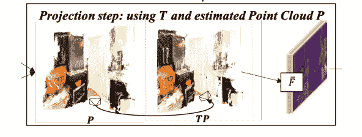

图 9.4：神经点云渲染器中的姿态变换

为什么不直接对朴素渲染器进行微分？在这里，我们面临两个问题：

+   **小邻域**：如前所述，每个点仅出现在渲染图像的一个或几个像素上。因此，每个点只有少量的梯度。这是局部梯度的一个缺点，降低了依赖梯度更新的网络性能。

+   **硬 z 缓冲区**：z 缓冲区只保留最近的点用于渲染图像。如果新的点出现得更近，输出将会突然发生剧烈变化。

为了解决这里提出的问题，该模型试图软化硬决策。这项技术被称为 **神经点云渲染器**。为此，渲染器不是为每个点分配一个像素，而是使用不同的影响力进行撒布。这样可以解决小邻域问题。对于硬 z 缓冲区问题，我们则通过积累最近点的影响，而不仅仅是最近的点：

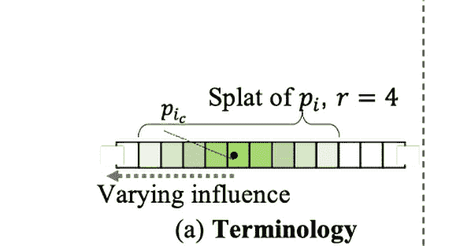

图 9.5：使用撒布技术投影点

一个 3D 点通过半径 `r`（*图 9.5*）进行投影并进行点撒布。然后，测量该 3D 点对该像素的影响，方法是计算撒布点的中心到该像素的欧几里得距离：

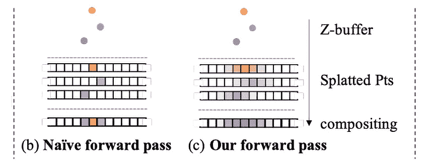

图 9.6：神经点云渲染器在朴素渲染（b）和 SynSin 渲染（c）示例上的前向和反向传播效果

如前面的图所示，每个点都会进行撒布，这有助于我们不会丢失太多信息，并有助于解决棘手的问题。

这种方法的优势在于，它允许为一个 3D 点收集更多梯度，从而改善网络对空间特征和深度网络的学习过程：

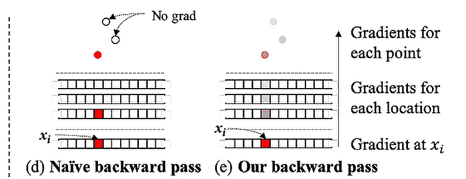

图 9.7：朴素渲染器和神经点云渲染器的反向传播

最后，我们需要在 z 缓冲区中收集并积累点。首先，我们根据与新相机的距离对点进行排序，然后使用 K 近邻算法和 alpha 合成技术来积累点：

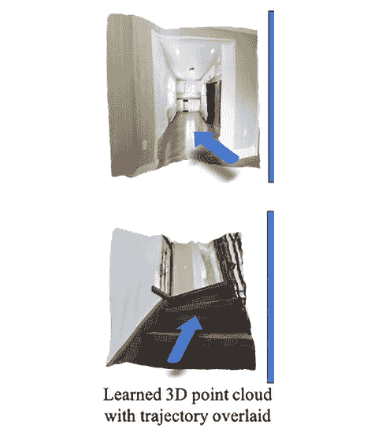

图 9.8：3D 点云输出

如*图 9.8*所示，3D 点云输出的是一个未经精细化的新视图。该输出应该作为精细化模块的输入。

## 精细化模块和判别器

最后但同样重要的是，该模型包括一个精炼模块。该模块有两个任务：首先是提高投影特征的准确性，其次是从新视角填充图像中不可见的部分。它应该输出语义上有意义且几何上准确的图像。例如，如果图像中只显示了桌子的某一部分，在新视角下，图像应该包含桌子的一部分，该模块应该从语义上理解这是桌子，并在重建过程中保持新部分的几何线条正确（例如，直线应该保持直线）。该模型从真实世界图像的数据集中学习这些特性：

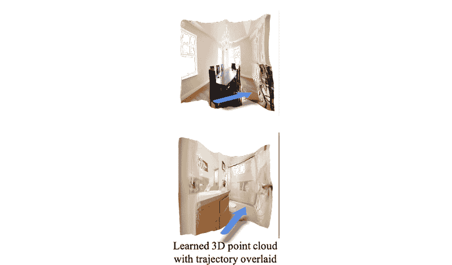

图 9.9：精炼模块

精炼模块（`g`）从神经点云渲染器获取输入，然后输出最终重建的图像。之后，它被用于损失目标中，以改善训练过程。

该任务通过生成模型解决。使用了包含八个块的 ResNet，为了保持图像的良好分辨率，还使用了下采样和上采样模块。我们使用了具有两个多层判别器和特征匹配损失的 GAN。

模型的最终损失由 L1 损失、内容损失和生成图像与目标图像之间的判别器损失组成：

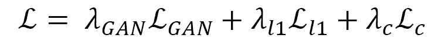

然后使用损失函数进行模型优化，如往常一样。

这就是 SynSin 如何结合各种模块，创建一个从单一图像合成视图的端到端过程。接下来，我们将探索模型的实际实现。

# 实践中的模型训练与测试

Facebook Research 发布了 SynSin 模型的 GitHub 仓库，使我们能够训练模型并使用已经预训练的模型进行推理。在这一部分，我们将讨论训练过程和使用预训练模型进行推理：

1.  但首先，我们需要设置模型。我们需要克隆 GitHub 仓库，创建环境，并安装所有要求：

    ```py
    git clone https://github.com/facebookresearch/synsin.git
    cd synsin/
    conda create –-name synsin_env –-file requirements.txt
    conda activate synsin_env
    ```

如果无法通过前面的命令安装要求，始终可以手动安装。手动安装时，请按照`synsin/INSTALL.md`文件中的说明操作。

1.  该模型在三个不同的数据集上进行训练：

    1.  `RealEstate10K`

    1.  `MP3D`

    1.  `KITTI`

对于训练，数据可以从数据集网站下载。对于本书，我们将使用`KITTI`数据集；但也可以尝试其他数据集。

如何下载 KITTI 数据集的说明可以在 SynSin 仓库的[`github.com/facebookresearch/synsin/blob/main/KITTI.md`](https://github.com/facebookresearch/synsin/blob/main/KITTI.md)找到。

首先，我们需要从网站下载数据集，并将文件存储在`${KITTI_HOME}/dataset_kitti`，其中`KITTI_HOME`是数据集所在的路径。

1.  接下来，我们需要更新 `./options/options.py` 文件，在其中添加本地计算机上 KITTI 数据集的路径：

    ```py
    elif opt.dataset == 'kitti':
       opt.min_z = 1.0
       opt.max_z = 50.0
       opt.train_data_path = (
           './DATA/dataset_kitti/'
       )
       from data.kitti import KITTIDataLoader
       return KITTIDataLoader
    ```

如果你打算使用其他数据集，应该找到其他数据集的 `DataLoader` 并添加该数据集的路径。

1.  在训练之前，我们必须通过运行以下命令下载预训练模型：

    ```py
    bash ./download_models.sh
    ```

如果我们打开文件并查看内部内容，会看到它包含了所有三个数据集的预训练模型。因此，在运行命令时，它会为每个数据集创建三个不同的文件夹，并下载该数据集的所有预训练模型。我们可以将它们用于训练和推理。如果你不想下载所有模型，可以通过运行以下命令手动下载：

```py
wget https://dl.fbaipublicfiles.com/synsin/checkpoints/realestate/synsin.pth
```

该命令将运行 SynSin 预训练模型，用于房地产数据集。如需了解更多关于预训练模型的信息，可以下载 `readme.txt` 文件：

```py
wget https://dl.fbaipublicfiles.com/synsin/checkpoints/readme.txt
```

1.  对于训练，你需要运行 `train.py` 文件。你可以通过 `./train.sh` 从命令行运行它。如果我们打开 `train.sh` 文件，可以找到针对三个不同数据集的命令。KITTI 的默认示例如下：

    ```py
    python train.py --batch-size 32 \
          --folder 'temp' --num_workers 4  \
          --resume --dataset 'kitti' --use_inv_z \
          --use_inverse_depth \
          --accumulation 'alphacomposite' \
          --model_type 'zbuffer_pts' \
          --refine_model_type 'resnet_256W8UpDown64'  \
          --norm_G 'sync:spectral_batch' \
          --gpu_ids 0,1 --render_ids 1 \
          --suffix '' --normalize_image --lr 0.0001
    ```

你可以调整参数和数据集，尝试模拟原始模型的结果。当训练过程完成后，你可以使用新的模型进行评估。

1.  对于评估，首先，我们需要生成的真实图像。为了得到这个，我们需要运行以下代码：

    ```py
    export KITTI=${KITTI_HOME}/dataset_kitti/images
    python evaluation/eval_kitti.py --old_model ${OLD_MODEL} --result_folder ${TEST_FOLDER}
    ```

我们需要设置保存结果的路径，而不是 `TEST_FOLDER`。

第一行导出一个名为 `KITTI` 的新变量，包含数据集图像的路径。接下来的脚本为每张图像创建生成的图像和真实图像配对：

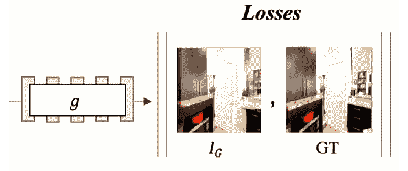

图 9.10：eval_kitti.py 输出示例

第一张图是输入图像，第二张是地面真相。第三张是网络输出。如你所见，相机略微向前移动，对于这种特定情况，模型输出似乎生成得非常好。

1.  然而，我们需要一些数值表示来理解网络的表现。因此，我们需要运行 `evaluation/evaluate_perceptualsim.py` 文件，它将计算准确度：

    ```py
    python evaluation/evaluate_perceptualsim.py \
         --folder ${TEST_FOLDER} \
         --pred_image im_B.png \
         --target_image im_res.png \
         --output_file kitti_results
    ```

上述命令将帮助评估模型，给定测试图像的路径，其中一张是预测图像，另一张是目标图像。

我的测试输出如下：

```py
Perceptual similarity for ./DATA/dataset_kitti/test_folder/:  2.0548
PSNR for /DATA/dataset_kitti/test_folder/:  16.7344
SSIM for /DATA/dataset_kitti/test_folder/:  0.5232
```

用于评估的指标之一是感知相似度，它衡量 VGG 特征空间中的距离。越接近零，图像之间的相似度越高。PSNR 是另一个衡量图像重建的指标。它计算最大信号功率与失真噪声功率之间的比率，在我们这种情况下，失真噪声就是重建图像。最后，**结构相似性指数**（**SSIM**）是一个量化图像质量退化的指标。

1.  接下来，我们可以使用预训练模型进行推理。我们需要一张输入图像用于推理：

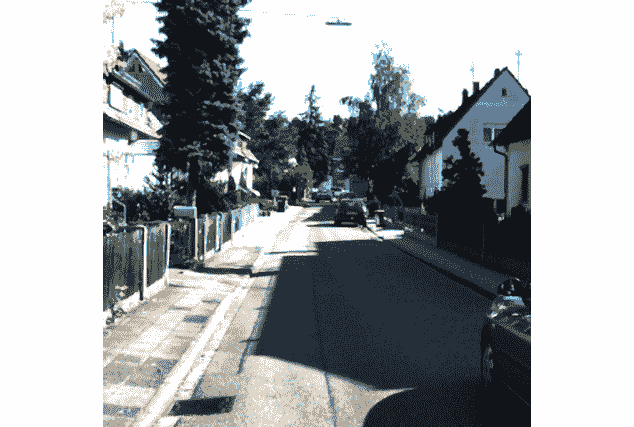

图 9.11：推理的输入图像

1.  接下来，我们将使用`realestate`模型生成一张新图像。首先，我们需要设置模型。

设置模型的代码可以在 GitHub 仓库中的`set_up_model_for_inference.py`文件中找到。

为了设置模型，首先，我们需要导入所有必要的包：

```py
import torch
import torch.nn as nn
import sys
sys.path.insert(0, './synsin')
import os
os.environ['DEBUG'] = '0'
from synsin.models.networks.sync_batchnorm import convert_model
from synsin.models.base_model import BaseModel
from synsin.options.options import get_model
```

1.  接下来，我们将创建一个函数，它以模型路径为输入并输出准备好的推理模型。为了更好地理解代码，我们将把整个函数分解成更小的部分。然而，完整的函数可以在 GitHub 上找到：

    ```py
          torch.backends.cudnn.enabled = True
          opts = torch.load(model_path)['opts']
          opts.render_ids = [1]
           torch_devices = [int(gpu_id.strip()) for gpu_id in opts.gpu_ids.split(",")]
           device = 'cuda:' + str(torch_devices[0])
    ```

在这里，我们启用`cudnn`包并定义模型将要运行的设备。此外，第二行导入模型，使其可以访问为训练设置的所有选项，如果需要可以进行修改。请注意，`render_ids`指的是 GPU ID，在某些情况下，可能由于用户硬件配置不同而有所不同。

1.  接下来，我们定义模型：

    ```py
    model = get_model(opts)
    if 'sync' in opts.norm_G:
    model = convert_model(model)
    model = nn.DataParallel(model,       torch_devices[0:1]).cuda()
    else:
        model = nn.DataParallel(model, torch_devices[0:1]).cuda()
    ```

`get_model`函数从`options.py`文件导入，它加载权重并返回最终模型。然后，从`options`中，我们检查是否有同步模型，这意味着我们在不同的机器上运行该模型。如果有，我们运行`convert_model`函数，它会将模型中的所有`BatchNorm`模块替换为`SynchronizedBatchNorm`模块。

1.  最后，我们加载模型：

    ```py
    #  Load the original model to be tested
    model_to_test = BaseModel(model, opts)
    model_to_test.load_state_dict(torch.load(MODEL_PATH)['state_dict'])
    model_to_test.eval()
    print("Loaded model")
    ```

`BaseModel`函数设置了最终的模式。根据训练模式或测试模式，它可以设置优化器并初始化权重。在我们的例子中，它将为测试模式设置模型。

所有这些代码被总结在一个名为`synsin_model`的函数中，我们将导入该函数用于推理。

以下代码来自`inference_unseen_image.py`文件。我们将编写一个函数，它接收模型路径、测试图像和新的视图转换参数，并输出来自新视图的图像。如果我们指定了`save_path`参数，它将自动保存输出图像。

1.  同样，我们将首先导入所有需要用于推理的模块：

    ```py
    import matplotlib.pyplot as plt
    import quaternion
    import torch
    import torch.nn as nn
    import torchvision.transforms as transforms
    from PIL import Image
    from set_up_model_for_inference import synsin_model
    ```

1.  接下来，我们设置模型并创建用于预处理的数据转换：

    ```py
     model_to_test = synsin_model(path_to_model)
        # Load the image
        transform = transforms.Compose([
            transforms.Resize((256,256)),
            transforms.ToTensor(),
            transforms.Normalize((0.5, 0.5, 0.5), (0.5, 0.5, 0.5))])
        if isinstance(test_image, str):
            im = Image.open(test_image)
        else:
            im = test_image
        im = transform(im)
    ```

1.  现在我们需要指定视图转换参数：

    ```py
        # Parameters for the transformation
        theta = -0.15
        phi = -0.1
        tx = 0
        ty = 0
        tz = 0.1
    RT = torch.eye(4).unsqueeze(0)
    # Set up rotation
    RT[0,0:3,0:3] = torch.Tensor(quaternion.as_rotation_matrix(quaternion.from_rotation_vector([phi, theta, 0])))
    # Set up translation
    RT[0,0:3,3] = torch.Tensor([tx, ty, tz])
    ```

在这里，我们需要指定旋转和平移的参数。注意，`theta`和`phi`负责旋转，而`tx`、`ty`和`tz`用于平移。

1.  接下来，我们将使用上传的图像和新的变换来获取网络的输出：

    ```py
    batch = {
        'images' : [im.unsqueeze(0)],
        'cameras' : [{
            'K' : torch.eye(4).unsqueeze(0),
            'Kinv' : torch.eye(4).unsqueeze(0)
        }]
    }
    # Generate a new view of the new transformation
    with torch.no_grad():
        pred_imgs = model_to_test.model.module.forward_angle(batch, [RT])
        depth = nn.Sigmoid()(model_to_test.model.module.pts_regressor(batch['images'][0].cuda()))
    ```

在这里，`pred_imgs`是模型输出的新图像，depth 是模型预测的 3D 深度。

1.  最后，我们将使用网络的输出可视化原始图像、新预测图像和输出图像：

    ```py
        fig, axis = plt.subplots(1,3, figsize=(10,20))
        axis[0].axis('off')
        axis[1].axis('off')
        axis[2].axis('off')
        axis[0].imshow(im.permute(1,2,0) * 0.5 + 0.5)
        axis[0].set_title('Input Image')
        axis[1].imshow(pred_imgs[0].squeeze().cpu().permute(1,2,0).numpy() * 0.5 + 0.5)
        axis[1].set_title('Generated Image')
        axis[2].imshow(depth.squeeze().cpu().clamp(max=0.04))
        axis[2].set_title('Predicted Depth')
    ```

我们使用`matplotlib`来可视化输出。以下是以下代码的结果：

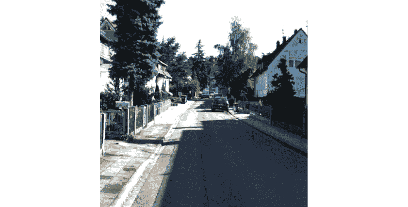

图 9.12: 推理结果

正如我们所见，我们获得了一个新的视角，模型很好地重建了新角度。现在我们可以调整变换参数，从另一个视角生成图像。

1.  如果我们稍微改变`theta`和`phi`，就会得到另一个视角的变换。现在我们将重建图像的右侧部分：

    ```py
      # Parameters for the transformation
        theta = 0.15
        phi = 0.1
        tx = 0
        ty = 0
        tz = 0.1
    ```

输出结果如下所示：

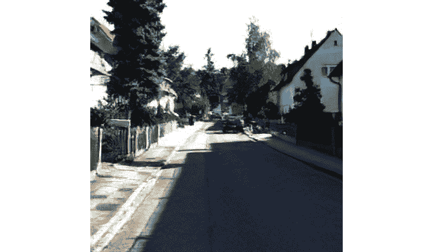

图 9.13: 推理结果

一次性大幅度改变变换参数或步长较大可能会导致较差的精度。

1.  现在我们知道如何从新视角创建图像。接下来，我们将编写一些简短的代码，顺序地创建图像并制作一个小视频：

    ```py
    from inference_unseen_image import inference
    from PIL import Image
    import numpy as np
    import imageio
    def create_gif(model_path, image_path, save_path, theta = -0.15, phi = -0.1, tx = 0,
                  ty = 0, tz = 0.1, num_of_frames = 5):
        im = inference(model_path, test_image=image_path, theta=theta,
                       phi=phi, tx=tx, ty=ty, tz=tz)
        frames = []
        for i in range(num_of_frames):
            im = Image.fromarray((im * 255).astype(np.uint8))
            frames.append(im)
            im = inference(model_path, im, theta=theta,
                       phi=phi, tx=tx, ty=ty, tz=tz)
        imageio.mimsave(save_path, frames,  duration=1)
    ```

这段代码将图像作为输入，并为给定数量的帧生成顺序图像。所谓顺序，是指模型的每个输出成为下一次图像生成的输入：

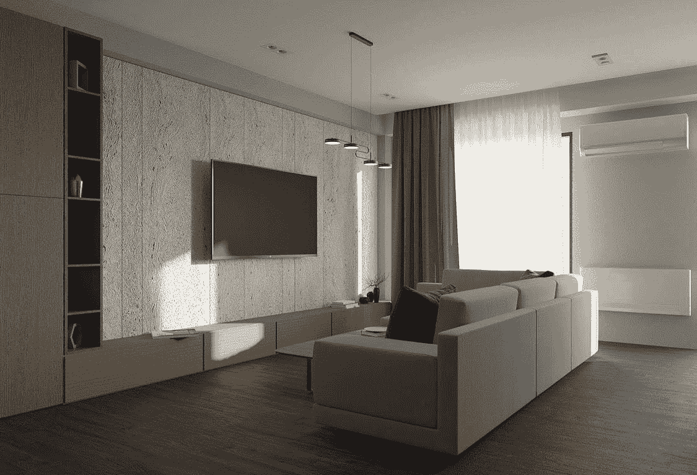

图 9.14: 顺序视图合成

在前面的图中，有四个连续的帧。正如你所看到的，当我们尝试较大步长时，模型生成的图像越来越差。此时正是开始调整模型超参数、不同相机设置和步长大小的好时机，以查看它如何改善或减少模型输出的精度。

# 摘要

在本章开始时，我们看到了 SynSin 模型的结构，并深入了解了该模型的端到端过程。如前所述，模型创建过程中的一个有趣方法是使用可微渲染器作为训练的一部分。此外，我们还看到该模型有助于解决没有大量标注数据集，或者在测试时没有多张图像的问题。这就是为什么这是一个最先进的模型，它更容易在实际场景中使用。我们查看了该模型的优缺点，也看了如何初始化模型、训练、测试并使用新图像进行推理。

在下一章，我们将探讨 Mesh R-CNN 模型，它将两种不同的任务（目标检测和 3D 模型构建）结合成一个模型。我们将深入了解该模型的架构，并在一张随机图像上测试模型性能。
