# 第十一章：Mesh R-CNN

本章致力于介绍一个最先进的模型，称为 Mesh R-CNN，旨在将两项不同但重要的任务结合为一个端到端的模型。它结合了著名的图像分割模型 Mask R-CNN 和一个新的 3D 结构预测模型。这两项任务以前是单独研究的。

Mask R-CNN 是一种目标检测和实例分割算法，在基准数据集上获得了最高的精度分数。它属于 R-CNN 家族，是一个两阶段的端到端目标检测模型。

Mesh R-CNN 超越了 2D 目标检测问题，同时输出被检测物体的 3D 网格。如果我们认为世界是三维的，人类看到的物体也是三维的。那么，为什么不让一个检测模型同时输出三维物体呢？

在本章中，我们将理解 Mesh R-CNN 的工作原理。此外，我们将深入理解模型中使用的不同元素和技术，如体素、网格、图卷积网络以及 Cubify 运算符。

接下来，我们将探索 Mesh R-CNN 论文作者提供的 GitHub 仓库。我们将在自己的图像上尝试演示，并可视化预测结果。

最后，我们将讨论如何重现 Mesh R-CNN 的训练和测试过程，并理解模型精度的基准。

本章我们将涵盖以下主要内容：

+   理解网格和体素结构

+   理解模型的结构

+   理解什么是图卷积

+   尝试 Mesh R-CNN 的演示

+   理解模型的训练和测试过程

# 技术要求

为了运行本书中的示例代码，理想情况下，你需要一台配备 GPU 的计算机。然而，仅使用 CPU 运行代码片段也是可能的。

以下是推荐的计算机配置：

+   一个来自 NVIDIA GTX 系列或 RTX 系列的 GPU，至少需要 8 GB 的内存

+   Python 3

+   PyTorch 库和 PyTorch3D 库

+   Detectron2

+   Mesh R-CNN 仓库，可以在 [`github.com/facebookresearch/meshrcnn`](https://github.com/facebookresearch/meshrcnn) 找到

本章的代码片段可以在 [`github.com/PacktPublishing/3D-Deep-Learning-with-Python`](https://github.com/PacktPublishing/3D-Deep-Learning-with-Python) 找到。

# 网格和体素概述

正如本书前面提到的，网格和体素是两种不同的 3D 数据表示方式。Mesh R-CNN 使用这两种表示方式来获得更高质量的 3D 结构预测。

网格是 3D 模型的表面，以多边形形式表示，每个多边形可以表示为三角形。网格由通过边连接的顶点组成。边和顶点的连接创建了通常呈三角形的面。这种表示方式有助于更快速的变换和渲染：

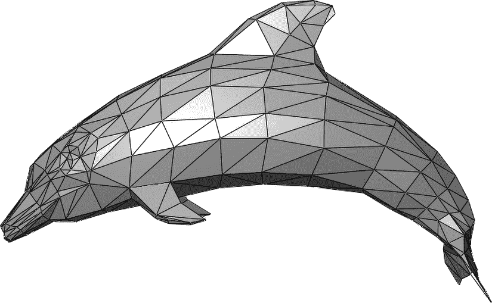

图 10.1：多边形网格示例

体素是 3D 版本的 2D 像素。每个图像由 2D 像素组成，因此采用相同的思想来表示 3D 数据是合乎逻辑的。每个体素都是一个立方体，而每个物体则由一组体素组成，其中一些是外部可见部分，另一些则位于物体内部。使用体素更容易可视化 3D 物体，但这并不是唯一的使用场景。在深度学习问题中，体素可以作为 3D 卷积神经网络的输入。

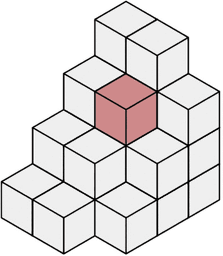

图 10.2：体素示例

Mesh R-CNN 使用两种类型的 3D 数据表示。实验表明，先预测体素，然后将其转换为网格，接着再精细化网格，帮助网络更好地学习。

接下来，我们将查看 Mesh R-CNN 架构，了解上述 3D 数据表示是如何从图像输入中创建的。

# Mesh R-CNN 架构

3D 形状检测吸引了许多研究人员的兴趣。虽然已经开发出了许多模型，取得了不错的精度，但它们大多集中于合成基准和孤立物体的检测：

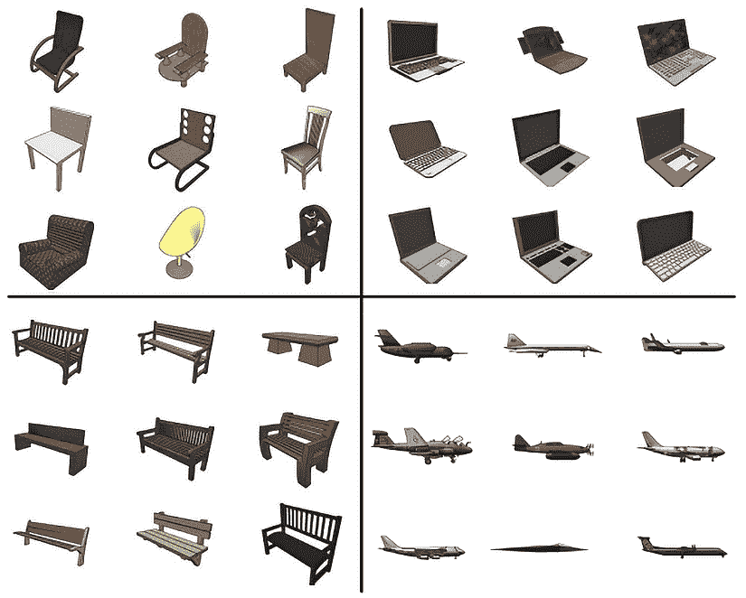

图 10.3：ShapeNet 数据集中的 3D 物体示例

与此同时，2D 目标检测和图像分割问题也取得了快速进展。许多模型和架构以高精度和高速解决了这一问题。已经有方法可以定位物体并检测边界框和掩码。其中一种被称为 Mask R-CNN，是一种用于目标检测和实例分割的模型。该模型处于最前沿，并具有许多现实生活中的应用。

然而，我们看到的是一个 3D 的世界。Mesh R-CNN 论文的作者决定将这两种方法结合成一个单一的解决方案：一个能够检测真实图像中的物体，并输出 3D 网格而非掩码的模型。这个新模型采用最先进的目标检测模型，输入为 RGB 图像，输出物体的类别标签、分割掩码和 3D 网格。作者在 Mask R-CNN 中添加了一个新分支，用于预测高分辨率的三角形网格：

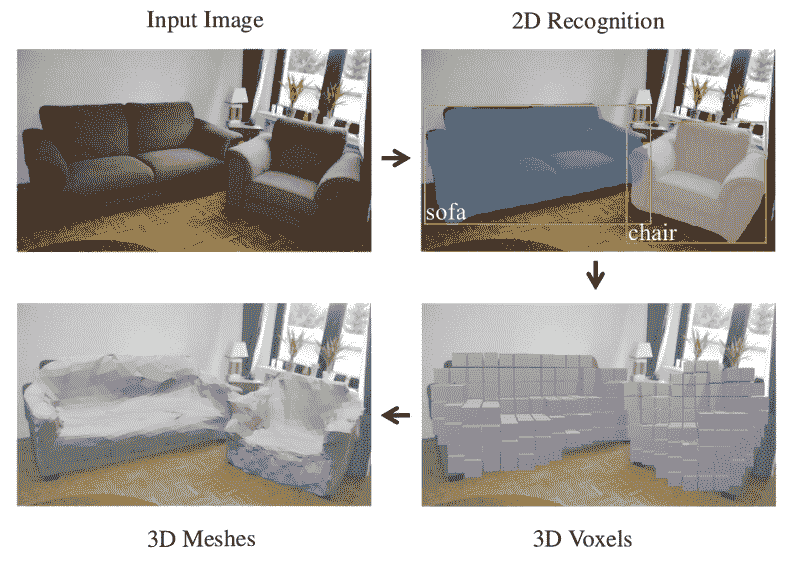

图 10.5：Mesh R-CNN 一般结构

作者的目标是创建一个可以端到端训练的模型。因此，他们采用了最先进的 Mask R-CNN 模型，并为网格预测添加了一个新分支。在深入研究网格预测部分之前，让我们快速回顾一下 Mask R-CNN：

）](img/B18217_10_005Redraw.jpg)

图 10.6：Mask R-CNN 结构（参考文献：[`arxiv.org/abs/1703.06870`](https://arxiv.org/abs/1703.06870)）

Mask R-CNN 以 RGB 图像作为输入，并输出边界框、类别标签和实例分割掩码。首先，图像通过主干网络，该网络通常基于 ResNet —— 例如 ResNet-50-FPN。主干网络输出特征图，作为下一个网络的输入：**区域建议网络**（**RPN**）。该网络输出建议。随后，目标分类和掩码预测分支处理这些建议，并分别输出类别和掩码。

Mask R-CNN 的这个结构在 Mesh R-CNN 中也是相同的。然而，最终增加了一个网格预测器。网格预测器是一个由两个分支组成的新模块：体素分支和网格精细化分支。

体素分支将提议和对齐后的特征作为输入，并输出粗略的体素预测。然后，这些预测作为输入提供给网格精细化分支，后者输出最终的网格。体素分支和网格精细化分支的损失与框和掩码的损失相加，模型进行端到端的训练：

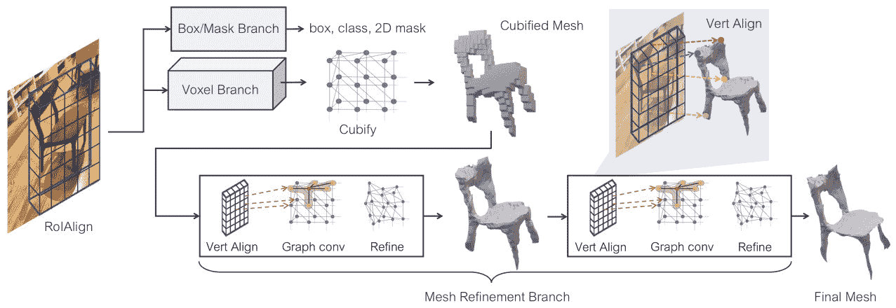

图 10.7：Mesh R-CNN 架构

## 图卷积

在我们研究网格预测器的结构之前，先了解什么是图卷积以及它是如何工作的。

神经网络的早期变体被应用于结构化的欧几里得数据。然而，在现实世界中，大多数数据是非欧几里得的，并具有图结构。近年来，许多神经网络变体已开始适应图数据，其中之一就是卷积网络，称为**图卷积网络**（**GCN**）。

网格具有这种图结构，这也是 GCN 可应用于 3D 结构预测问题的原因。CNN 的基本操作是卷积，卷积是通过滤波器进行的。我们使用滑动窗口技术进行卷积，滤波器包括模型应学习的权重。GCN 使用类似的卷积技术，主要区别在于节点数量可以变化，而且节点是无序的：

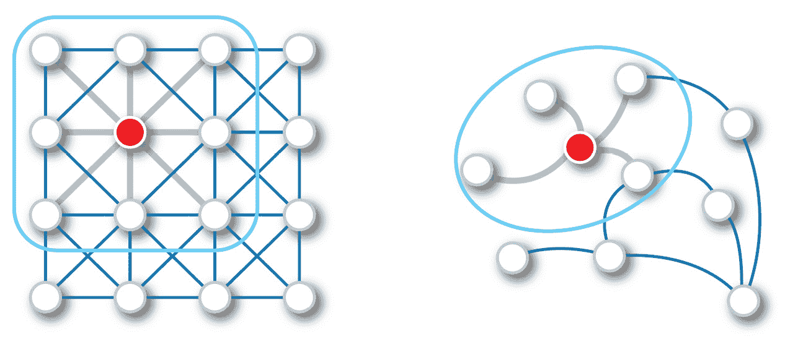

图 10.8：欧几里得数据和图数据中的卷积操作示例（来源：https://arxiv.org/pdf/1901.00596.pdf）

*图 10.9* 显示了一个卷积层的示例。网络的输入是图和邻接矩阵，表示正向传播中节点之间的边。卷积层通过聚合其邻域的信息来封装每个节点的信息。之后，应用非线性变换。随后，该网络的输出可用于不同任务，如分类：

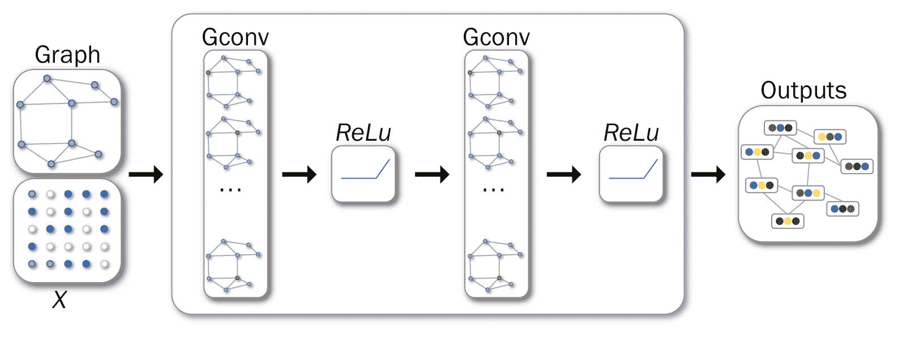

图 10.9：卷积神经网络示例（来源：https://arxiv.org/pdf/1901.00596.pdf）

## 网格预测器

网格预测器模块旨在检测物体的 3D 结构。它是`RoIAlign`模块的逻辑延续，负责预测并输出最终的网格。

由于我们从现实生活中的图像中获得 3D 网格，因此无法使用固定网格模板和固定网格拓扑。这就是为什么网格预测器由两个分支组成。体素分支和网格细化分支的结合有助于减少固定拓扑问题。

体素分支类似于 Mask R-CNN 中的掩膜分支。它从 `ROIAlign` 获取对齐特征，并输出一个 G x G x G 的体素占据概率网格。接下来，使用 Cubify 操作。它使用一个阈值来二值化体素占据。每个被占据的体素都被替换为一个有 8 个顶点、18 条边和 12 个面的立方体三角形网格。

体素损失是二元交叉熵，最小化体素占据预测概率与真实占据之间的差异。

网格细化分支是三个不同操作的序列：顶点对齐、图卷积和顶点细化。顶点对齐类似于 ROI 对齐；对于每个网格顶点，它生成一个图像对齐的特征。

图卷积采用图像对齐的特征，并沿网格边缘传播信息。顶点细化更新顶点位置。它的目的是在保持拓扑固定的情况下更新顶点几何：

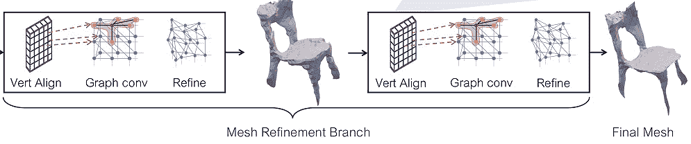

图 10.10：网格细化分支

如*图 10.10*所示，我们可以进行多阶段的细化。每个阶段包括顶点对齐、图卷积和顶点细化操作。最终，我们得到一个更精确的 3D 网格。

模型的最终重要部分是网格损失函数。对于这个分支，使用了 Chamfer 和法向损失。然而，这些技术需要从预测和真实网格中采样点。

使用以下网格采样方法：给定顶点和面，从网格表面的概率分布中均匀采样点。每个面的概率与其面积成正比。

使用这些采样技术，从真实的点云 *Q* 和预测的点云 *P* 中进行采样。接下来，我们计算 *Λ*PQ，这是成对（*p*，*q*）的集合，其中 *q* 是 *P* 中 *p* 的最近邻。

计算 *P* 和 *Q* 之间的 Chamfer 距离：

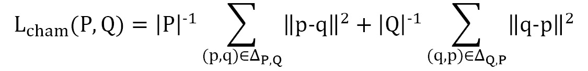

接下来，计算绝对法向距离：

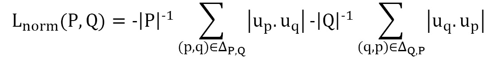

这里，*u*p 和 *u*q 分别是指向 *p* 和 *q* 点的单位法向量。

然而，只有这两种损失退化了网格。这就是为什么在高质量网格生成中，加入了一个形状正则化器，这被称为边缘损失：

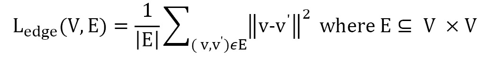

最终的网格损失是三种损失的加权平均：Chamfer 损失、法线损失和边缘损失。

在训练方面，进行了两种类型的实验。第一个实验是检查网格预测分支。在这里，使用了 ShapeNet 数据集，该数据集包含 55 种常见的类别。这在 3D 形状预测的基准测试中被广泛使用；然而，它包含了 CAD 模型，这些模型有独立的背景。由于这一点，网格预测器模型达到了最先进的状态。此外，它还解决了以前的模型无法很好检测到的有孔物体的问题：

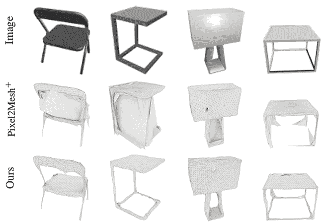

图 10.11：ShapeNet 数据集上的 Mesh 预测器

第三行表示网格预测器的输出。我们可以看到它预测了 3D 形状，并且很好地处理了物体的拓扑和几何结构：

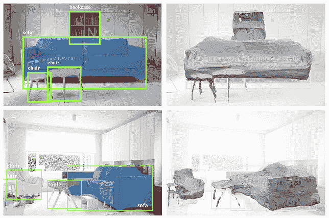

图 10.12：端到端 Mesh R-CNN 模型的输出

下一步是对实际图像进行实验。为此，我们使用了 Pix3D 数据集，该数据集包含 395 个独特的 3D 模型，分布在 10,069 张真实图像中。在这种情况下，基准结果不可用，因为作者是首批尝试此技术的人。然而，我们可以查看*图 10.11*中的训练输出结果。

到此为止，我们已经讨论了 Mesh R-CNN 的架构。接下来，我们可以动手实践，使用 Mesh R-CNN 在测试图像中找到物体。

# PyTorch 实现的 Mesh R-CNN 演示

在本节中，我们将使用 Mesh R-CNN 的代码库来运行演示。我们将尝试将模型应用到我们的图像上，并渲染输出的`.obj`文件，看看模型是如何预测 3D 形状的。此外，我们还将讨论模型的训练过程。

安装 Mesh R-CNN 非常简单。你需要先安装 Detectron2 和 PyTorch3D，然后构建 Mesh R-CNN。`Detectron2`是 Facebook Research 推出的一个库，提供最先进的检测和分割模型。它还包括 Mask R-CNN 模型，Mesh R-CNN 正是基于这个模型构建的。你可以通过运行以下命令来安装`detectron2`：

```py
python -m pip install 'git+https://github.com/facebookresearch/detectron2.git'
```

如果这个方法对你不起作用，可以查看官网了解其他安装方式。接下来，你需要按照本书前面的内容安装 PyTorch3D。当这两个要求都准备好后，你只需构建 Mesh R-CNN：

```py
git clone https://github.com/facebookresearch/meshrcnn.git
cd meshrcnn && pip install -e .
```

## 演示

该代码库包括一个`demo.py`文件，用于演示 Mesh R-CNN 的端到端过程。该文件位于`meshrcnn/demo/demo.py`。我们来看一下代码，了解演示是如何进行的。该文件包括`VisualizationDemo`类，包含两个主要方法：`run_on_image`和`visualize_prediction`。方法名本身就说明了它们的功能：第一个方法以图像作为输入，并输出模型的预测结果，而第二个方法则可视化遮罩的检测，然后保存最终的网格以及带有预测和置信度的图像：

```py
python demo/demo.py \
--config-file configs/pix3d/meshrcnn_R50_FPN.yaml \
--input /path/to/image \
--output output_demo \
--onlyhighest MODEL.WEIGHTS meshrcnn://meshrcnn_R50.pth
```

对于演示，您只需要从终端运行前面的命令。该命令有以下参数：

+   `--config-file`指定配置文件的路径，可以在`configs`目录中找到该文件。

+   `--input`指定输入图像的路径

+   `--output`指定保存预测结果的目录路径

+   `--onlyhighest`，如果为`True`，则仅输出具有最高置信度的一个网格和遮罩。

现在，让我们运行并检查输出。

对于演示，我们将使用上一章中使用的公寓图像：

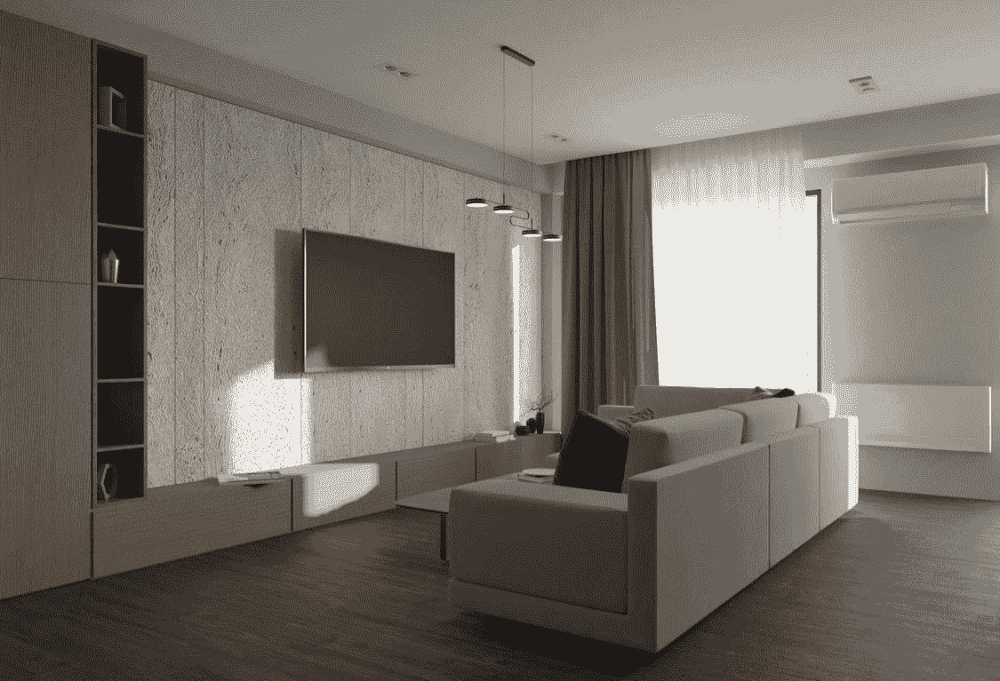

图 10.13：网络的输入图像

我们将此图像的路径传递给`demo.py`。预测完成后，我们得到该图像的遮罩可视化和网格。由于我们使用了`--onlyhighest`参数，我们只得到了一个遮罩，这是沙发物体的预测，置信度为 88.7%。遮罩预测是正确的——它几乎覆盖了整个沙发：

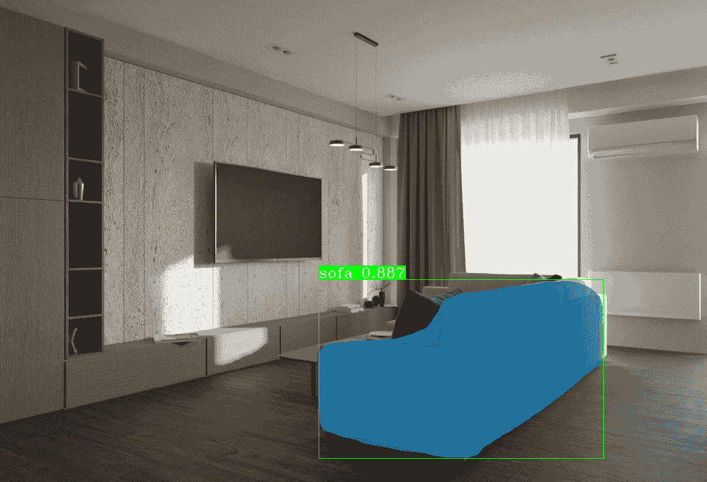

图 10.14：demo.py 文件的输出

除了遮罩外，我们还在同一目录中得到了网格，它是一个`.obj`文件。现在，我们需要从 3D 对象渲染图像。

以下代码来自`chapt10/viz_demo_results.py`文件：

1.  首先，让我们导入代码中使用的所有库：

    ```py
    import torch
    import numpy as np
    import matplotlib.pyplot as plt
    from pytorch3d.io import load_obj
    from pytorch3d.structures import Meshes
    from pytorch3d.renderer import (
       FoVPerspectiveCameras, look_at_view_transform, look_at_rotation,
       RasterizationSettings, MeshRenderer, MeshRasterizer, BlendParams,
       SoftSilhouetteShader, HardPhongShader, PointLights, TexturesVertex,
    )
    import argparse
    ```

1.  接下来，我们将定义运行代码所需的参数：

    ```py
    parser = argparse.ArgumentParser()
    parser.add_argument('--path_to_mesh', default="./demo_results/0_mesh_sofa_0.887.obj")
    parser.add_argument('--save_path', default='./demo_results/sofa_render.png')
    parser.add_argument('--distance', default=1, help = 'distance from camera to the object')
    parser.add_argument('--elevation', default=150.0,  help = 'angle of elevation in degrees')
    parser.add_argument('--azimuth', default=-10.0, help = 'rotation of the camera')
    args = parser.parse_args()
    ```

我们需要为`path_to_mesh`提供输入——即`demo.py`的输出`.obj`文件。我们还需要指定渲染输出应保存的路径，然后指定相机的距离、俯仰角度和旋转。

1.  接下来，我们需要加载并初始化网格对象。首先，我们需要使用`pytorch3d`中的`load_obj`函数加载`.obj`文件。然后，我们需要将顶点设置为白色。我们将使用`pytorch3d`中的`Meshes`结构来创建网格对象：

    ```py
    # Load the obj and ignore the textures and materials.
    verts, faces_idx, _ = load_obj(args.path_to_mesh)
    faces = faces_idx.verts_idx
    # Initialize each vertex to be white in color.
    verts_rgb = torch.ones_like(verts)[None]  # (1, V, 3)
    textures = TexturesVertex(verts_features=verts_rgb.to(device))
    # Create a Meshes object for the sofa. Here we have only one mesh in the batch.
    sofa_mesh = Meshes(
       verts=[verts.to(device)],
       faces=[faces.to(device)],
       textures=textures
    )
    ```

1.  下一步是初始化透视相机。然后，我们需要设置混合参数，用于混合面。`sigma`控制不透明度，而`gamma`控制边缘的锐利度：

    ```py
    cameras = FoVPerspectiveCameras(device=device)
    blend_params = BlendParams(sigma=1e-4, gamma=1e-4)
    ```

1.  接下来，我们需要定义光栅化和着色的设置。我们将把输出图像的大小设置为 256*256，并将`faces_per_pixel`设置为 100，这将把 100 个面混合成一个像素。然后，我们将使用光栅化设置来创建轮廓网格渲染器，方法是组合光栅化器和着色器：

    ```py
    raster_settings = RasterizationSettings(
       image_size=256,
       blur_radius=np.log(1\. / 1e-4 - 1.) * blend_params.sigma,
       faces_per_pixel=100,
    )
    silhouette_renderer = MeshRenderer(
       rasterizer=MeshRasterizer(
           cameras=cameras,
           raster_settings=raster_settings
       ),
       shader=SoftSilhouetteShader(blend_params=blend_params)
    )
    ```

1.  我们需要创建另一个`RasterizationSettings`对象，因为我们还将使用 Phong 渲染器。它只需要每个像素混合一个面。再次强调，图像输出将是 256。然后，我们需要在物体前面添加一个点光源。最后，我们需要初始化 Phong 渲染器：

    ```py
    raster_settings = RasterizationSettings(
       image_size=256,
       blur_radius=0.0,
       faces_per_pixel=1,
    )
    lights = PointLights(device=device, location=((2.0, 2.0, -2.0),))
    phong_renderer = MeshRenderer(
       rasterizer=MeshRasterizer(
           cameras=cameras,
           raster_settings=raster_settings
       ),
       shader=HardPhongShader(device=device, cameras=cameras, lights=lights)
    )
    ```

1.  现在，我们必须根据球面角度创建摄像机的位置。我们将使用`look_at_view_transform`函数，并添加之前提到的`distance`、`elevation`和`azimuth`参数。最后，我们必须通过给轮廓和 Phong 渲染器提供网格和摄像机位置作为输入，来获取渲染输出：

    ```py
    R, T = look_at_view_transform(distance, elevation, azimuth, device=device)
    # Render the sofa providing the values of R and T.
    silhouette = silhouette_renderer(meshes_world=sofa_mesh, R=R, T=T)
    image_ref = phong_renderer(meshes_world=sofa_mesh, R=R, T=T)
    ```

1.  最后一步是可视化结果。我们将使用`matplotlib`来绘制两个渲染图像：

    ```py
    plt.figure(figsize=(10, 10))
    plt.subplot(1, 2, 1)
    plt.imshow(silhouette.squeeze()[..., 3])
    plt.grid(False)
    plt.subplot(1, 2, 2)
    plt.imshow(image_ref.squeeze())
    plt.grid(False)
    plt.savefig(args.save_path)
    ```

前面的代码输出将是一个`.png`图像，保存在给定的`save_path`文件夹中。对于此参数和此处呈现的图像，渲染的网格将是这样的：

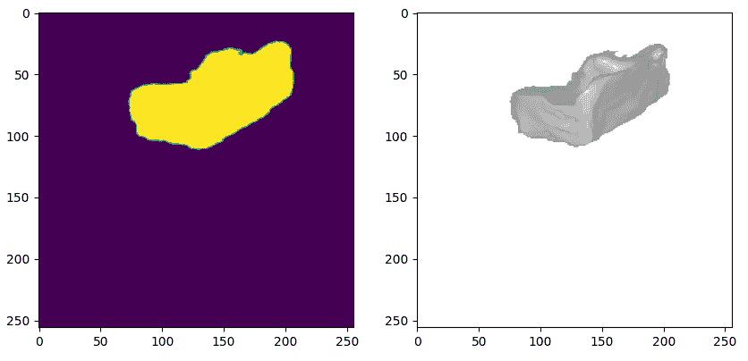

图 10.16：模型的渲染 3D 输出

从这个角度来看，网格与沙发非常相似，忽略不可见部分的某些缺陷。您可以调整摄像机位置和光照，以从另一个角度渲染该物体的图像。

该代码库还提供了运行并重现 Mesh R-CNN 论文中描述的实验的机会。它允许您运行 Pix3D 实验和 ShapeNet 实验。

如前所述，Pix3D 数据集包含不同 IKEA 家具的真实生活图像。该数据用于对整个 Mesh R-NN 进行端到端的评估。

要下载这些数据，您需要运行以下命令：

```py
datasets/pix3d/download_pix3d.sh
```

数据包含两个分割，分别是 S1 和 S2，且代码库为这两个分割提供了权重。下载数据后，您可以通过运行以下命令来重现训练过程：

```py
python tools/train_net.py \
--config-file configs/pix3d/meshrcnn_R50_FPN.yaml \
--eval-only MODEL.WEIGHTS /path/to/checkpoint_file
```

您只需要小心配置文件。原始模型是在 8 GB GPU 上分发并训练的。如果您的 GPU 容量不足，可能无法达到相同的准确度，因此您需要调整超参数以获得更好的准确度。

您可以使用自己训练的权重，或者可以简单地对作者提供的预训练模型进行评估：

```py
python tools/train_net.py \
--config-file configs/pix3d/meshrcnn_R50_FPN.yaml \
--eval-only MODEL.WEIGHTS /path/to/checkpoint_file
```

前面的命令将评估指定检查点文件的模型。您可以通过访问模型的 GitHub 仓库找到检查点。

接下来，如果您想在 ShapeNet 上运行实验，您需要下载数据，可以通过运行以下命令来完成：

```py
datasets/shapenet/download_shapenet.sh
```

这将下载训练集、验证集和测试集。作者还提供了 ShapeNet 数据集的预处理代码。预处理将减少加载时间。以下命令将输出压缩数据，便于在集群中进行训练：

```py
python tools/preprocess_shapenet.py \
--shapenet_dir /path/to/ShapeNetCore.v1 \
--shapenet_binvox_dir /path/to/ShapeNetCore.v1.binvox \
--output_dir ./datasets/shapenet/ShapeNetV1processed \
--zip_output
```

接下来，要重现实验，你只需要运行带有相应配置的 `train_net_shapenet.py` 文件。再次提醒，在调整训练过程时，要小心硬件的能力：

```py
python tools/train_net_shapenet.py --num-gpus 8 \
--config-file configs/shapenet/voxmesh_R50.yaml
```

最后，你可以通过运行以下命令来评估你的模型，或者作者提供的检查点：

```py
python tools/train_net_shapenet.py --num-gpus 8 \
--config-file configs/shapenet/voxmesh_R50.yaml
```

你可以将你的结果与论文中提供的结果进行比较。下图展示了作者得到的尺度归一化协议训练结果：

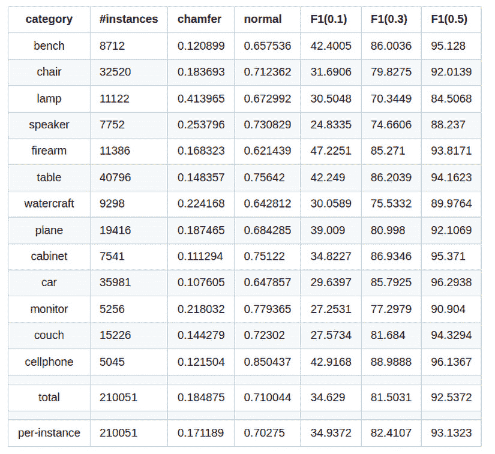

图 10.17：在 ShapeNet 数据集上评估的结果

该图包括了类别名称、每个类别的实例数量、Chamfer 距离、法线损失和 F1 分数。

# 总结

在本章中，我们提出了一种全新的物体检测任务视角。3D 世界需要相应的解决方案，而这是朝着这一目标迈出的首个尝试之一。通过理解架构和模型结构，我们了解了 Mesh R-CNN 是如何工作的。我们深入探讨了该模型中使用的一些有趣操作和技术，如图卷积网络、Cubify 操作、网格预测器结构等。最后，我们了解了该模型如何在实践中用于检测网络从未见过的图像中的物体。我们通过渲染 3D 物体来评估结果。

本书贯穿了从基础到更高级的 3D 深度学习概念。首先，我们学习了各种 3D 数据类型和结构。然后，我们深入探讨了不同类型的模型，这些模型解决了不同类型的问题，如网格检测、视图合成等。此外，我们还将 PyTorch 3D 添加到了计算机视觉工具箱中。通过完成本书的学习，你应该能够应对与 3D 计算机视觉相关的现实世界问题，甚至更多。
