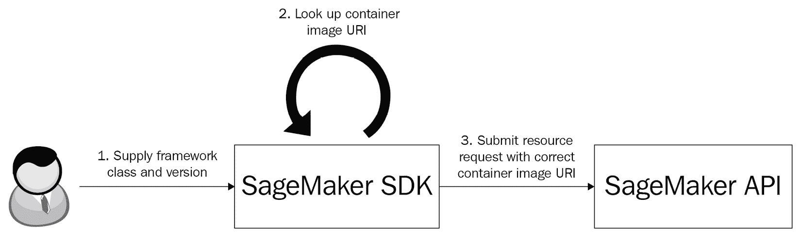

# 第二章：SageMaker 上的深度学习框架和容器

Amazon SageMaker 支持许多流行的机器学习（ML）和深度学习（DL）框架。SageMaker 中的框架支持通过使用预构建的 Docker 容器来实现推理和训练任务。预构建的 SageMaker 容器提供了大量的功能，并允许你在最少的编码工作下实现广泛的用例。也有一些实际场景，需要为训练和/或推理任务提供定制的运行时环境。为了解决这些情况，SageMaker 提供了灵活的**自带容器**（**BYO**）功能。

在本章中，我们将回顾支持的主要深度学习框架及其对应的容器镜像。然后，我们将重点关注两个最流行的深度学习框架——TensorFlow 和 PyTorch，并学习如何在 Amazon SageMaker 中使用它们。此外，我们还将回顾一个更高层次的、用于自然语言处理任务的最先进框架 Hugging Face，以及它在 Amazon SageMaker 上的实现。

接着，我们将理解如何根据你的用例需求使用和扩展预构建的 SageMaker 容器，以及了解 SageMaker SDK 和工具包，这些工具简化了编写与 Amazon SageMaker 兼容的训练和推理脚本的过程。

在后续章节中，我们将深入探讨如何决定是使用预构建的 SageMaker 容器还是 BYO 容器。接着，我们将开发一个与 SageMaker 兼容的 BYO 容器。

以下部分将涵盖这些主题：

+   探索 SageMaker 上的深度学习框架

+   使用 SageMaker DL 容器

+   开发 BYO 容器

到本章结束时，你将能够根据具体问题要求和选定的深度学习框架，决定选择哪种容器策略。此外，你将理解与 Amazon SageMaker 兼容的训练和推理脚本开发的关键方面。

# 技术要求

在*使用 SageMaker DL 容器*和*开发 BYO 容器*部分，我们将提供操作代码示例，以帮助你培养实践技能。完整的代码示例可以在 [`github.com/PacktPublishing/Accelerate-Deep-Learning-Workloads-with-Amazon-SageMaker/blob/main/chapter2/`](https://github.com/PacktPublishing/Accelerate-Deep-Learning-Workloads-with-Amazon-SageMaker/blob/main/chapter2/) 查看。

为了跟随这段代码，你需要以下内容：

+   一个 AWS 账户和具有管理 Amazon SageMaker 资源权限的 IAM 用户。

+   在你的开发机器上安装 Python 3 和 SageMaker SDK ([`pypi.org/project/sagemaker/`](https://pypi.org/project/sagemaker/))。

+   在你的开发机器上安装 Docker。

+   若要使用 SageMaker P2 实例进行训练，你可能需要请求 AWS 账户的服务限制增加。有关更多详情，请查看 [`docs.aws.amazon.com/general/latest/gr/aws_service_limits.xhtml`](https://docs.aws.amazon.com/general/latest/gr/aws_service_limits.xhtml)。

# 探索 SageMaker 上的深度学习框架

在撰写本书时，Amazon SageMaker 支持以下框架，其中以星号标记的为深度学习框架：

+   scikit-learn

+   SparkML 服务

+   Chainer*

+   Apache MXNet*

+   Hugging Face*

+   PyTorch*

+   TensorFlow*

+   强化学习容器 – 包括支持 TensorFlow 和 PyTorch 的容器

+   XGBoost

上述支持的框架列表可能会在未来发生变化。请务必查看官方 SageMaker 文档：[`docs.aws.amazon.com/sagemaker/latest/dg/frameworks.xhtml`](https://docs.aws.amazon.com/sagemaker/latest/dg/frameworks.xhtml)。

本书将主要聚焦于两种最受欢迎的选择：**TensorFlow** 和 **PyTorch**。这两者都是开源框架，拥有庞大且充满活力的社区。根据具体的使用场景或模型架构，某一个框架可能会略有优势。然而，可以认为这两个框架在功能和性能上是相当的。在许多实际场景中，选择 TensorFlow 或 PyTorch 通常是基于历史惯例或个人偏好。

本书中我们还将讨论另一个框架：**Hugging Face**。这是一个高层次框架，提供了用于 NLP 任务（如文本分类、翻译等）的 SOTA 模型、训练和推理设施。Hugging Face 是一组旨在简化构建 SOTA NLP 模型的多个库（transformers、datasets、tokenizers 和 accelerate）。在底层，Hugging Face 库使用 TensorFlow 和 PyTorch 的基础组件（统称为“后端”）来执行计算。用户可以根据特定的运行时需求选择使用哪一个后端。鉴于其流行性，Amazon SageMaker 最近为 Hugging Face 库提供了支持，提供了分别用于训练和推理任务的预构建容器。

容器源

SageMaker 深度学习容器的源代码可以在 [`github.com/aws/deep-learning-containers`](https://github.com/aws/deep-learning-containers) 的公开 GitHub 仓库中找到。在某些情况下，查看相关的 Dockerfile 可以帮助你了解预构建容器的运行时配置。容器镜像可以在 AWS 公开注册表中找到，地址是 [`github.com/aws/deep-learning-containers/blob/master/available_images.md`](https://github.com/aws/deep-learning-containers/blob/master/available_images.md)。

对于每个支持的框架，SageMaker 提供了分别用于训练和推理的容器。我们为这两个任务提供了不同的容器，考虑因素如下：

+   训练和推理任务可能有不同的运行时要求。例如，您可能会选择在不同的计算平台上运行训练和推理任务。根据您的具体任务，这将导致容器中使用不同的加速器和性能优化调整。

+   训练和推理任务需要不同的辅助脚本；例如，在推理任务中启动模型服务器。如果不将训练和推理容器分开，可能会导致容器体积过大和 API 变得复杂。

因此，我们总是根据具体任务明确标识所使用的容器。

针对 DL 容器，AWS 还定义了独立的基于 GPU 和基于 CPU 的容器。基于 GPU 的容器需要安装额外的加速器，以便能够在 GPU 设备上运行计算（如 CUDA 工具包）。

模型要求

在选择 SageMaker DL 容器时，始终考虑模型对计算资源的要求。对于大多数 SOTA（最先进的）模型，建议使用基于 GPU 的计算实例，以实现可接受的性能。根据这一点选择适合的 DL 容器。

## TensorFlow 容器

TensorFlow 容器有两个主要版本：1.x（维护模式）和 2.x（最新版本）。Amazon SageMaker 支持这两个版本，并提供推理和训练容器。本书中的所有代码示例和一般评论都假设使用 TensorFlow v2.x。

AWS 会频繁更新支持的小版本 TensorFlow。最新支持的主版本是 2.10.0。

## PyTorch 容器

Amazon SageMaker 提供了用于 PyTorch 的推理和训练容器。最新版本是 1.12.1。

## Hugging Face 容器

AWS 提供了两种版本的 Hugging Face 容器：PyTorch 和 TensorFlow 后端。每个后端都有独立的训练和推理容器。

## 使用 SageMaker Python SDK

AWS 提供了一个方便的 Python SDK，它通过 Estimator、Model 和 Predictor 类简化了与支持的 DL 框架的交互。每个支持的框架都有一个单独的模块，包含各自类的实现。例如，下面是如何为 PyTorch 框架导入 Predict、Estimator 和 Model 类：

```py
from sagemaker.pytorch.estimator import PyTorch
from sagemaker.pytorch.model import PyTorchModel, PyTorchPredictor
```

以下图表展示了 SageMaker Python SDK 的工作流程：



图 2.1 – SageMaker Python SDK 如何与镜像 URI 配合使用

为了更好地理解，让我们做一个简单的示例，展示如何使用 SageMaker Python SDK 使用特定版本的 PyTorch 容器运行训练作业。有关视觉概述，请参见 *图 2.1*：

1.  首先，我们决定使用哪个框架，并导入相应的 `Pytorch` `estimator` 类：

    ```py
    from sagemaker.pytorch.estimator import PyTorch
    ```

在实例化 PyTorch `estimator` 对象时，我们需要提供更多参数，包括框架版本和 Python 版本：

```py
estimator = PyTorch(
    entry_point="training_script.py",
    framework_version="1.8",
    py_version="py3",
    role=role,
    instance_count=1,
    instance_type="ml.p2.xlarge"
)
```

1.  执行此代码时，SageMaker Python SDK 会自动验证用户输入，包括框架版本和 Python 版本。如果请求的容器存在，SageMaker Python SDK 将检索相应的容器镜像 URI。如果没有符合请求参数的容器，SageMaker Python SDK 会抛出异常。

1.  在 `fit()` 调用过程中，正确的容器镜像 URI 会被提供给 SageMaker API，因此训练作业将运行在安装了 PyTorch v1.8 和 Python v3.7 的 SageMaker 容器中。由于我们请求的是基于 GPU 的实例，将使用安装了 CUDA 工具包的训练容器：

    ```py
    estimator.fit()
    ```

使用自定义镜像

请注意，如果由于某些原因您更倾向于提供容器镜像的直接 URI，您可以通过 `image_uri` 参数来实现，该参数在 `model` 和 `estimator` 类中受支持。

现在，让我们深入了解 SageMaker DL 容器，从可用的 TensorFlow、PyTorch 和 Hugging Face 框架的预构建容器开始。

# 使用 SageMaker DL 容器

Amazon SageMaker 支持多种容器使用模式。此外，它为您提供了训练和推理工具包，以简化使用预构建容器和开发 BYO 容器的过程。

在本节中，我们将学习如何选择最有效的容器使用模式来满足您的用例需求，并如何使用可用的 SageMaker 工具包来实现它。

## 容器使用模式

Amazon SageMaker 提供了灵活性，允许您选择是否使用预构建容器的“原样”（称为 **脚本模式**）、**BYO 容器**，或修改预构建容器。

通常，方法的选择取决于特定的模型运行时需求、可用资源以及工程专业知识。在接下来的几个子章节中，我们将讨论何时选择一种方法而不是另一种方法。

### 脚本模式

在脚本模式下，您需要定义要使用的预构建容器，然后提供一个或多个脚本来实现您的训练或推理逻辑。此外，您还可以提供任何其他依赖项（无论是专有的还是公共的），这些依赖项将被导出到容器中。

脚本模式下的训练和推理容器都预装了工具包，提供了常见功能，如将数据下载到容器和模型工件、启动作业等。我们将在本章稍后详细介绍 SageMaker **推理工具包**和 **训练工具包**。

脚本模式适用于以下场景：

+   预构建容器满足您的运行时需求，或者您可以安装任何依赖项，而无需重建容器

+   您希望最小化开发和测试容器所花费的时间，或者您没有所需的专业知识来进行此操作

在接下来的章节中，我们将回顾如何准备您的第一个训练和推理脚本，并以脚本模式在 SageMaker 上运行它们。

### 修改预构建容器

使用 SageMaker 预构建容器的另一种方式是对其进行修改。在这种情况下，您将使用其中一个预构建容器作为自定义容器的基础镜像。

在以下场景中，修改预构建容器可能会带来好处：

+   你需要添加额外的依赖项（例如，必须从源代码编译的依赖项）或重新配置运行时环境

+   你希望最小化容器的开发和测试工作，并在大部分情况下依赖 AWS 测试过的基础容器的功能

请注意，当你扩展预构建容器时，你需要负责以下几个方面：

+   创建包含运行时环境实现的 Dockerfile

+   在容器注册中心（例如**Amazon Elastic Container Registry**（**ECR**）或私有 Docker 注册中心）中构建并存储容器

在本章稍后的部分，我们将看到如何扩展一个预构建的 PyTorch 容器来执行训练任务的示例。

### 自带容器（BYO containers）

你可能需要创建自定义容器的许多场景，包括以下几种：

+   你有独特的运行时需求，这些需求无法通过扩展预构建容器来解决

+   你希望为特定的硬件平台编译框架和库

+   你使用的深度学习框架是 SageMaker 本地不支持的（例如，JAX）

构建一个与 SageMaker 推理和训练资源兼容的自定义容器需要开发工作、对 Docker 容器的理解以及特定的 SageMaker 要求。因此，通常建议首先考虑脚本模式或扩展一个预构建容器，只有在前两者无法满足你的具体用例时，才选择使用自带容器（BYO）。

## SageMaker 工具包

为了简化与 Amazon SageMaker 兼容的自定义脚本和容器的开发，AWS 创建了用于训练和推理任务的 Python 工具包。

工具包提供以下好处：

+   建立一致的运行时环境和存储代码资产的目录位置

+   `ENTRYPOINT` 脚本，用于容器启动时执行任务

理解这些工具包有助于简化并加速与 SageMaker 兼容容器的开发，因此让我们详细回顾一下它们。

### 训练工具包

SageMaker 训练工具包有几个关键功能：

+   它建立了一个一致的运行时环境，设置了环境变量和一个目录结构来存储模型训练的输入和输出结果：


图 2.2 – SageMaker 兼容容器中的目录结构

训练工具包会在训练容器中设置以下目录：

+   `/opt/ml/input/config` 目录，存放模型超参数和用于分布式训练的网络布局（以 JSON 文件形式）。

+   使用 S3 作为数据存储时，`/opt/ml/input/data` 目录存放输入数据。

+   `/opt/ml/code/` 目录，包含用于运行训练任务的代码资产。

+   `/opt/ml/model/` 目录，包含生成的模型；SageMaker 在训练完成后会自动将其复制到 Amazon S3。

+   它执行入口脚本并处理成功和失败状态。如果训练任务失败，输出将存储在`/opt/ml/output/failure`。对于成功的执行，工具包会将输出写入`/opt/ml/success`目录。

默认情况下，所有预构建的训练容器都已安装训练工具包。如果你希望使用它，你需要通过运行以下命令将其安装到容器中：

```py
RUN pip install sagemaker-training
```

此外，你需要将所有代码依赖项复制到容器中，并在主训练脚本中定义一个特殊的环境变量，如下所示：

```py
COPY train_scipt.py /opt/ml/code/train_script.py
ENV SAGEMAKER_PROGRAM train_scipt.py
```

训练工具包可在 PyPI（[pypi.org](http://pypi.org)）包和 SageMaker 的 GitHub 仓库（[`github.com/aws/sagemaker-training-toolkit`](https://github.com/aws/sagemaker-training-toolkit)）中找到。

### 推理工具包

**推理工具包**实现了一个与 SageMaker 推理服务兼容的模型服务堆栈。它与开源的**多模型服务器**（**MMS**）一起，用于服务模型。它具有以下关键功能：

+   用于建立运行时环境，例如存储推理输入和输出工件的目录和环境变量。目录结构遵循训练容器的布局。

+   实现一个处理程序服务，该服务由模型服务器调用，将模型加载到内存中，并处理模型输入和输出。

+   实现默认的序列化器和反序列化器来处理推理请求。

推理工具包可在 PyPi（[pypi.org](http://pypi.org)）包和 GitHub 仓库（[`github.com/aws/sagemaker-inference-toolkit`](https://github.com/aws/sagemaker-inference-toolkit)）中找到。

## 开发脚本模式

现在我们对 SageMaker 的容器生态系统有了理解，接下来让我们实现几个学习项目来培养实际技能。在这个第一个示例中，我们将使用 SageMaker 脚本模式来训练我们的自定义 NLP 模型并部署它进行推理。

### 问题概述

在这个示例中，我们将学习如何使用 Hugging Face 框架开发训练和推理脚本。我们将利用 SageMaker 为 Hugging Face（具有 PyTorch 后端）预构建的容器。

我们选择了解决一个典型的 NLP 任务：文本分类。我们将使用`20 Newsgroups`数据集，它汇集了约 20,000 篇新闻组文档，涵盖 20 个不同的新闻组（类别）。有多种模型架构可以解决这个任务。通常，当前的 SOTA 模型基于 Transformer 架构。像**BERT**及其各种衍生模型这样的自回归模型适合这个任务。我们将使用一种被称为**迁移学习**的概念，其中一个为某个任务预训练的模型可以通过最小修改用于新任务。

作为基准模型，我们将使用被称为**DistilBERT**的模型架构，它在多种任务中提供了高准确度，并且比其他模型（例如原始的 BERT 模型）要小得多。为了将该模型适应分类任务，我们需要添加一个分类层，在我们的训练过程中，该层将被训练以识别文章：


图 2.3 – 文本分类任务的模型架构

Hugging Face Transformers 库通过以下方式简化了模型选择和修改，以便进行微调：

+   它提供了丰富的模型库，包含许多预训练模型和分词器

+   它提供了一个简单的模型 API，用于修改基准模型，以便对特定任务进行微调

+   它实现了推理管道，将数据预处理和实际推理结合在一起

本学习项目的完整源代码可以在[`github.com/PacktPublishing/Accelerate-Deep-Learning-Workloads-with-Amazon-SageMaker/blob/main/chapter2/1_Using_SageMaker_Script_Mode.ipynb`](https://github.com/PacktPublishing/Accelerate-Deep-Learning-Workloads-with-Amazon-SageMaker/blob/main/chapter2/1_Using_SageMaker_Script_Mode.ipynb)找到。

### 开发训练脚本

在运行 SageMaker 训练任务时，我们需要提供一个训练脚本。此外，我们还可以提供任何其他依赖项。我们还可以通过`requirements.txt`文件在预构建的容器上安装或修改已安装的 Python 包。

在这个例子中，我们将使用 Hugging Face 框架的一个新特性，通过 Hugging Face Trainer API 对多类别分类器进行微调。让我们确保训练容器中已安装较新的 Hugging Face Transformer 库。为此，我们创建`requirements.txt`文件并指定最小兼容版本。稍后，我们将把这个文件提供给我们的 SageMaker 训练任务：

```py
transformers >= 4.10
```

接下来，我们需要开发训练脚本。让我们回顾一下其中的一些关键组件。

在训练时，SageMaker 通过调用`user_training_script --arg1 value1 --arg2 value2 ...`来启动训练。在这里，`arg1..N`是训练超参数和用户提供的其他杂项参数，这些参数作为训练任务配置的一部分提供。为了在我们的脚本中正确启动训练过程，我们需要在脚本中包含`main guard`：

1.  为了正确捕获参数，训练脚本需要能够解析命令行参数。我们使用 Python 的`argparse`库来实现这一点：

    ```py
    if __name__ == "__main__":
         parser = argparse.ArgumentParser()
         parser.add_argument("--epochs", type=int, default=1)
         parser.add_argument("--per-device-train-batch-size", type=int, default=16)
         parser.add_argument("--per-device-eval-batch-size", type=int, default=64)
         parser.add_argument("--warmup-steps", type=int, default=100)
         parser.add_argument("--logging-steps", type=float, default=100)
         parser.add_argument("--weight-decay", type=float, default=0.01)
         args, _ = parser.parse_known_args()
         train(args)
    ```

1.  `train()`方法负责执行端到端的训练任务。它包含以下组件：

    +   调用`_get_tokenized_dataset`，使用来自 Hugging Face 库的预训练 DistilBERT 分词器加载并分词数据集。

    +   从 Hugging Face 模型库加载并配置 DistilBERT 模型。请注意，我们更新了分类任务的默认配置，以调整我们选择的类别数量。

    +   配置 Hugging Face Trainer 并开始训练过程。

    +   训练完成后，我们保存训练好的模型：

        ```py
        def train(args):
            train_enc_dataset, test_enc_dataset = _get_tokenized_data()
            training_args = TrainingArguments(
                output_dir=os.getenv(
                    "SM_OUTPUT_DIR", "./"
                ),  # output directory, if runtime is not
                num_train_epochs=args.epochs,
                per_device_train_batch_size=args.per_device_train_batch_size,
                per_device_eval_batch_size=args.per_device_eval_batch_size,
                warmup_steps=args.warmup_steps,
                weight_decay=args.weight_decay,
                logging_steps=args.logging_steps,
            )
            config = DistilBertConfig()
            config.num_labels = NUM_LABELS
            model = DistilBertForSequenceClassification.from_pretrained(
                MODEL_NAME, config=config
            )
            trainer = Trainer(
                model=model,  # model to be trained
                args=training_args,  # training arguments, defined above
                train_dataset=train_enc_dataset,  # training dataset
                eval_dataset=test_enc_dataset,  # evaluation dataset
            )
            trainer.train()
            model.save_pretrained(os.environ["SM_MODEL_DIR"])
        ```

到目前为止，我们的脚本已经涵盖了几个关键方面：处理配置设置和模型超参数、加载预训练模型，并使用 Hugging Face Trainer API 启动训练。

### 启动训练作业

一旦我们准备好了训练脚本和依赖项，就可以开始训练并通过 SageMaker Python SDK 调度训练作业。我们从导入 Hugging Face Estimator 对象并获取训练作业的 IAM 执行角色开始：

```py
from sagemaker.huggingface.estimator import HuggingFace
from sagemaker import get_execution_role
role=get_execution_role()
```

接下来，我们需要定义模型和训练过程的超参数。这些变量将在训练时传递给我们的脚本：

```py
hyperparameters = {
    "epochs":1,
    "per-device-train-batch-size":16, 
    "per-device-eval-batch-size":64,
    "warmup-steps":100,
    "logging-steps":100,
    "weight-decay":0.01    
}
estimator = HuggingFace(
    py_version="py36",
    entry_point="train.py",
    source_dir="1_sources",
    pytorch_version="1.7.1",
    transformers_version="4.6.1",
    hyperparameters=hyperparameters,
    instance_type="ml.p2.xlarge",
    instance_count=1,
    role=role
)
estimator.fit({
    "train":train_dataset_uri,
    "test":test_dataset_uri
})
```

之后，训练作业将被调度并执行。完成训练需要大约 10 到 15 分钟，训练后的模型和其他输出成果将被添加到 Amazon S3。

## 为脚本模式开发推理脚本

现在我们已经有了训练好的模型，接下来将其部署为 SageMaker 实时端点。我们将使用预构建的 SageMaker Hugging Face 容器，并只提供推理脚本。推理请求将由 **AWS MMS** 处理，并暴露 HTTP 端点。

使用预构建推理容器时，SageMaker 会自动识别我们的推理脚本。根据 SageMaker 的约定，推理脚本必须包含以下方法：

+   `model_fn(model_dir)` 在容器启动时执行，用于将模型加载到内存中。该方法以模型目录作为输入参数。你可以使用 `model_fn()` 来初始化推理管道中的其他组件，比如在我们的例子中是分词器。需要注意的是，Hugging Face Transformers 提供了一个方便的 Pipeline API，允许我们将数据预处理（在我们这里是文本分词）和实际推理结合成一个对象。因此，我们返回的是一个推理管道，而不是加载的模型：

    ```py
    MODEL_NAME = "distilbert-base-uncased"
    NUM_LABELS = 6 # number of categories
    MAX_LENGTH = 512 # max number of tokens model can handle
    def model_fn(model_dir):
        device_id = 0 if torch.cuda.is_available() else -1
        tokenizer = DistilBertTokenizerFast.from_pretrained(MODEL_NAME)
        config = DistilBertConfig()
        config.num_labels = NUM_LABELS
        model = DistilBertForSequenceClassification.from_pretrained(
            model_dir, config=config
        )
        inference_pipeline = pipeline(
            model=model,
            task="text-classification",
            tokenizer=tokenizer,
            framework="pt",
            device=device_id,
            max_length=MAX_LENGTH,
            truncation=True
        )
        return inference_pipeline
    ```

+   `transform_fn(inference_pipeline, data, content_type, accept_type)` 负责执行实际的推理操作。由于我们通过 HTTP 与最终客户端进行通信，因此我们还需要进行负载反序列化和响应序列化。在我们的示例中，我们预期使用 JSON 负载并返回 JSON 负载；然而，依据需求，这可以扩展为其他格式（例如 CSV 和 Protobuf）。

    ```py
    def transform_fn(inference_pipeline, data, content_type, accept_type):
        # Deserialize payload
        if "json" in content_type:
            deser_data = json.loads(data)
        else:
            raise NotImplemented("Only 'application/json' content type is implemented.")

        # Run inference
        predictions = inference_pipeline(deser_data)

        # Serialize response
        if "json" in accept_type:
            return json.dumps(predictions)
        else:
            raise NotImplemented("Only 'application/json' accept type is implemented.")
    ```

有时候，将反序列化、推理和序列化结合到一个方法中可能会不方便。作为替代，SageMaker 支持更细粒度的 API：

+   `input_fn(request_body, request_content_type)` 执行反序列化操作。

+   `predict_fn(deser_input, model)` 执行预测操作

+   `output_fn(prediction, response_content_type)` 执行预测结果的序列化

请注意，`transform_fn()`方法与`input_fn()`、`predict_fn()`和`output_fn()`方法是互斥的。

### 部署文本分类终端节点

现在我们准备好部署并测试我们的 Newsgroup 分类终端节点了。我们可以使用`estimator.create_model()`方法来配置我们的模型部署参数，特别是以下内容：

1.  定义推理脚本和其他依赖项，这些内容将由 SageMaker 上传至终端节点。

1.  确定推理容器。如果提供`transformers_version`、`pytorch_version`和`py_version`参数，SageMaker 会自动找到一个适当的预构建推理容器（如果存在）。另外，您可以提供`image_uri`来直接指定希望使用的容器镜像：

    ```py
    from sagemaker.huggingface.estimator import HuggingFaceModel
    model = estimator.create_model(role=role, 
                                   entry_point="inference.py", 
                                   source_dir="1_sources",
                                   py_version="py36",
                                   transformers_version="4.6.1",
                                   pytorch_version="1.7.1"
                                  )
    ```

1.  接下来，我们定义终端节点的参数，例如其背后的实例数量和类型。`model.deploy()`方法启动推理部署（通常需要几分钟时间），并返回一个`Predictor`对象以运行推理请求：

    ```py
    predictor = model.deploy(
        initial_instance_count=1,
        instance_type="ml.m5.xlarge"
    )
    ```

接下来，让我们探讨如何扩展预构建的深度学习容器。

## 扩展预构建容器

我们将重用脚本模式示例中的代码资产。然而，与之前的容器不同，我们将修改我们的运行时环境，并从 GitHub 主分支安装最新稳定版的 Hugging Face Transformer。此修改将在我们的自定义容器镜像中实现。

首先，我们需要确定将使用哪个基础镜像。AWS 已在[`github.com/aws/deep-learning-containers/blob/master/available_images.md`](https://github.com/aws/deep-learning-containers/blob/master/available_images.md)发布了所有可用的深度学习容器。

由于我们计划重新从头安装 HuggingFace Transformer 库，因此可以选择 PyTorch 基础镜像。在撰写时，最新的 PyTorch SageMaker 容器是`763104351884.dkr.ecr.us-east-1.amazonaws.com/pytorch-training:1.9.0-gpu-py38-cu111-ubuntu20.04`。请注意，此容器 URI 适用于 AWS East-1 区域，其他 AWS 区域会有所不同。请查阅前述参考的 AWS 文章以了解适用于您区域的正确 URI。

要构建一个新的容器，我们需要执行以下步骤：

+   创建一个包含运行时指令的 Dockerfile。

+   在本地构建容器镜像。

+   将新的容器镜像推送到**容器注册表**。在本示例中，我们将使用 ECR 作为容器注册表：AWS 提供的托管服务，它与 SageMaker 生态系统深度集成。

首先，让我们为我们的扩展容器创建一个 Dockerfile。

### 为我们的扩展容器开发 Dockerfile。

为了扩展预构建的 SageMaker 容器，我们至少需要以下组件：

+   一个用于作为基础的 SageMaker PyTorch 镜像。

+   安装所需的依赖项，如最新版本的 PyTorch 和来自最新 Git 主分支的 Hugging Face Transformers。

+   将我们之前示例中的训练脚本复制到容器中。

+   定义 `SAGEMAKER_SUBMIT_DIRECTORY` 和 `SAGEMAKER_PROGRAM` 环境变量，以便 SageMaker 知道容器启动时应该执行哪个训练脚本：

    ```py
    FROM 763104351884.dkr.ecr.us-east-1.amazonaws.com/pytorch-training:1.9.0-gpu-py38-cu111-ubuntu20.04
    RUN pip3 install git+https://github.com/huggingface/transformers 
    ENV SAGEMAKER_SUBMIT_DIRECTORY /opt/ml/code 
    ENV SAGEMAKER_PROGRAM train.py 
    COPY 1_sources/train.py $SAGEMAKER_SUBMIT_DIRECTORY/$SAGEMAKER_PROGRAM
    ```

现在我们准备好构建并将此容器镜像推送到 ECR。你可以在本章的代码库中找到执行此操作的 `bash` 脚本。

### 安排训练作业

一旦我们在 ECR 中拥有扩展的 PyTorch 容器，就可以执行一个 SageMaker 训练作业了。训练作业配置将与脚本模式示例类似，唯一的不同点是：我们将使用一个通用的 SageMaker `Estimator` 对象，而不是 `HuggingFaceEstimator` 对象，后者可以让我们使用自定义镜像。请注意，您需要更新 `image_uri` 参数，指向您 ECR 实例中的镜像 URI。你可以通过访问 AWS 控制台中的 ECR 服务来找到它，并在那找到扩展容器：

```py
from sagemaker.estimator import Estimator
estimator = Estimator(
    image_uri="<UPDATE WITH YOUR IMAGE URI FROM ECR>",
    hyperparameters=hyperparameters,
    instance_type="ml.p2.xlarge",
    instance_count=1,
    role=role
)
estimator.fit({
    "train":train_dataset_uri,
    "test":test_dataset_uri
})
```

完成训练作业后，我们应当期望与脚本模式示例中展示的训练结果类似。

# 开发一个用于推理的 BYO 容器

在本节中，我们将学习如何使用官方 TensorFlow 镜像构建一个与 SageMaker 兼容的推理容器，准备推理脚本和模型服务器，并将其部署到 SageMaker Hosting 上进行推理。

## 问题概述

我们将开发一个与 SageMaker 兼容的推理容器。我们将使用最新的官方 TensorFlow 容器作为基础镜像，并使用 AWS MMS 作为模型服务器。请注意，MMS 是许多机器学习模型服务选项之一，SageMaker 对模型服务器没有其他限制，唯一要求是它应该在端口`8080`上提供模型服务。

## 开发服务容器

当将服务容器部署到端点时，SageMaker 会运行以下命令：

```py
docker run <YOUR BYO IMAGE> serve
```

为了遵守这一要求，建议在 Dockerfile 中使用 `ENTRYPOINT` 指令的执行格式。

让我们回顾一下我们的 BYO Dockerfile：

+   我们使用最新的 TensorFlow 容器作为基础

+   我们安装通用和 SageMaker 特定的依赖项

+   我们将模型服务脚本复制到容器中

+   我们指定 `ENTRYPOINT` 和 CMD 指令，以遵守 SageMaker 的要求

现在，让我们开始行动：

1.  使用最新的官方 TensorFlow 容器：

    ```py
    FROM tensorflow/tensorflow:latest
    ```

1.  安装 Java，因为 MMS 和其他常见依赖项都需要它。

1.  将入口脚本复制到镜像中：

    ```py
    COPY 3_sources/src/dockerd_entrypoint.py /usr/local/bin/dockerd-entrypoint.py
    RUN chmod +x /usr/local/bin/dockerd-entrypoint.py
    ```

1.  将默认的自定义服务文件复制到容器中，以处理传入的数据和推理请求：

    ```py
    COPY 3_sources/src/model_handler.py /opt/ml/model/model_handler.py
    COPY 3_sources/src/keras_model_loader.py /opt/ml/model/keras_model_loader.py
    ```

1.  定义入口脚本及其默认参数：

    ```py
    ENTRYPOINT ["python3", "/usr/local/bin/dockerd-entrypoint.py"]
    CMD ["serve"]
    ```

在这个例子中，我们并不打算详细介绍 MMS 以及推理脚本的开发。然而，值得强调一些关键的脚本方面：

+   `dockerd_entrypoint.py` 是一个可执行文件，当传递 `serve` 参数时，它会启动 MMS 服务器。

+   `model_handler.py` 实现了模型加载和服务逻辑。请注意，`handle()` 方法检查模型是否已经加载到内存中。如果没有，它会先加载模型到内存，然后继续处理服务请求，包括以下内容：

    +   反序列化请求负载

    +   运行预测

    +   序列化预测

### 部署 SageMaker 端点

要安排推理端点的部署，我们使用来自 SageMaker Python SDK 的通用 `Model` 类。请注意，由于我们从公共模型库下载了模型，因此无需提供 `model_data` 参数（因此其值为 `None`）：

```py
from sagemaker import Model
mms_model = Model(
    image_uri=image_uri,
    model_data=None,
    role=role,
    name=model_name,
    sagemaker_session=session
)
mms_model.deploy(
    initial_instance_count=1,
    instance_type="ml.m5.xlarge", 
    endpoint_name=endpoint_name
)
```

完全部署端点并启动模型服务器可能需要几分钟。一旦准备就绪，我们可以使用 `boto3.sagemaker-runtime` 客户端调用端点，该客户端允许你构建 HTTP 请求并将推理负载（或者在我们的案例中是图像）发送到特定的 SageMaker 端点：

```py
import boto3
client = boto3.client('sagemaker-runtime')
accept_type = "application/json"
content_type = 'image/jpeg'
headers = {'content-type': content_type}
payload = open(test_image, 'rb')
response = client.invoke_endpoint(
    EndpointName=endpoint_name,
    Body=payload,
    ContentType=content_type,
    Accept = accept_type
)
most_likely_label = response['Body'].read()
print(most_likely_label)
```

这段代码很可能会根据模型预测返回图像中的对象。

# 总结

在本章中，我们回顾了 SageMaker 如何使用 Docker 容器支持机器学习和深度学习框架。阅读完本章后，你现在应该知道如何根据特定的使用案例需求选择最合适的深度学习容器使用模式。我们了解了 SageMaker 工具包，这简化了开发与 SageMaker 兼容的容器。在后续部分，你将获得如何为 Amazon SageMaker 开发自定义容器和脚本进行训练和推理任务的实用知识。

在下一章中，我们将学习 SageMaker 开发环境，以及如何高效地开发和排查你的深度学习代码。此外，我们还将了解 SageMaker 开发环境提供的深度学习特定工具和接口，这些工具可以简化深度学习模型的构建、部署和监控。
