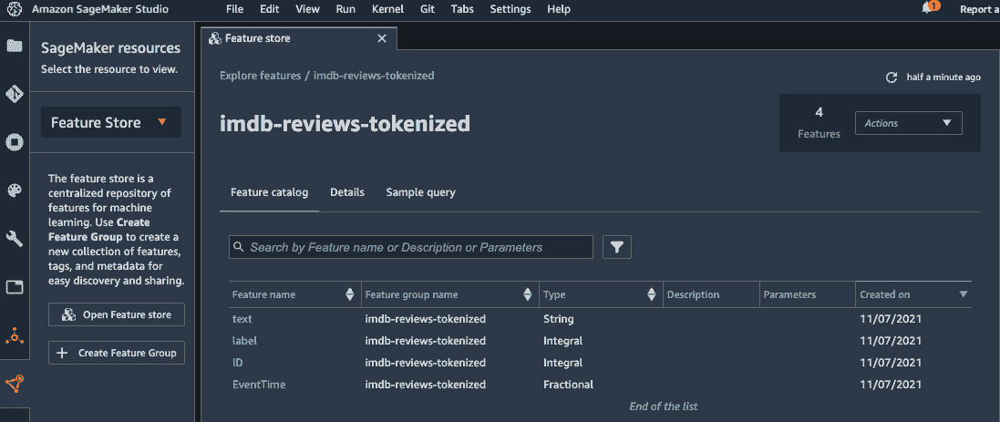
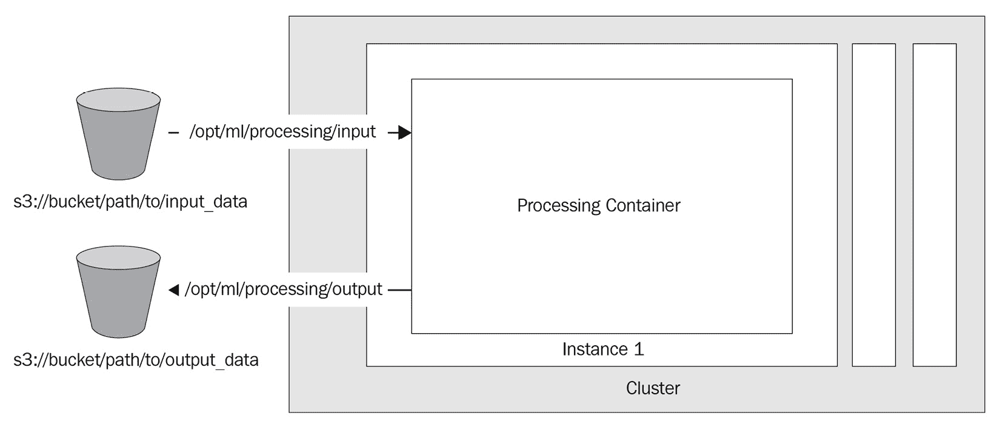

# 第四章：管理深度学习数据集

**深度学习**模型通常需要大量的训练数据来学习有用的模式。在许多现实应用中，新数据会持续收集、处理，并添加到训练数据集中，以便您的模型可以定期进行重新训练，从而适应不断变化的现实环境。在本章中，我们将探讨 SageMaker 的能力以及其他 AWS 服务，帮助您管理训练数据。

SageMaker 提供了广泛的集成功能，您可以使用 AWS 通用数据存储服务，如 Amazon S3、Amazon EFS 和 Amazon FSx for Lustre。此外，SageMaker 还有专为**机器学习**（**ML**）设计的存储解决方案——SageMaker Feature Store。我们将讨论根据数据类型、消费和摄取模式选择存储解决方案的时机。

在许多情况下，在使用训练数据之前，您需要对其进行预处理。例如，数据需要转换成特定格式，或数据集需要通过修改后的样本版本进行增强。本章将回顾 SageMaker Processing，以及如何使用它来处理大规模的机器学习（ML）数据集。

本章最后，我们将探讨一些先进的技术，如何利用 AWS 数据流工具优化 TensorFlow 和 PyTorch 模型的数据检索过程。

本章将涵盖以下主题：

+   为 ML 数据集选择存储解决方案

+   大规模处理数据

+   优化数据存储和检索

阅读完本章后，您将知道如何组织您的深度学习（DL）数据集的生命周期，以便在 SageMaker 上进行训练和推理。我们还将通过一些动手示例来帮助您获得数据处理和数据检索方面的实际技能。

# 技术要求

在本章中，我们将提供代码示例，以便您可以开发实际技能。完整的代码示例可以在[`github.com/PacktPublishing/Accelerate-Deep-Learning-Workloads-with-Amazon-SageMaker/blob/main/chapter4/`](https://github.com/PacktPublishing/Accelerate-Deep-Learning-Workloads-with-Amazon-SageMaker/blob/main/chapter4/)查看。

要跟随这段代码，您需要以下内容：

+   AWS 账户和具有管理 Amazon SageMaker 资源权限的 IAM 用户

+   已建立的 SageMaker 笔记本、SageMaker Studio 笔记本或本地兼容 SageMaker 环境

# 为 ML 数据集选择存储解决方案

AWS Cloud 提供了一系列可以用来存储推理和训练数据的存储解决方案。在选择最佳存储解决方案时，您可以考虑以下因素：

+   数据量和速度

+   数据类型及相关元数据

+   消费模式

+   备份和保留要求

+   安全性和审计要求

+   集成能力

+   存储、写入和读取数据的价格

仔细分析你的具体需求可能会为你的用例建议正确的解决方案。通常，在数据生命周期的不同阶段会组合使用几种存储解决方案。例如，你可以将用于推理的低延迟需求数据存储在更快但更昂贵的存储中；然后，将数据移动到更便宜、更慢的存储解决方案中用于训练和长期保存。

存在几种常见的存储类型，它们具有不同的特性：文件系统、对象存储和块存储解决方案。Amazon 为每种存储类型提供托管服务。我们将在以下小节中回顾它们的特性以及如何在 SageMaker 工作负载中使用它们。接下来，我们将重点介绍 Amazon SageMaker 特征库，因为它为 ML 工作负载和数据集提供了几个独特的功能。

## Amazon EBS – 高性能块存储

块存储解决方案旨在快速检索和操作数据。数据在物理设备上被分割成块，以便高效利用。块存储使你能够将数据从运行时环境中抽象和解耦。在数据检索时，存储解决方案将这些块重新组合并返回给用户。

Amazon EBS 是一种完全托管的块存储解决方案，支持多种用例，适用于不同的读写模式、吞吐量和延迟要求。Amazon EBS 的一个主要用例是作为附加到 Amazon EC2 计算节点的数据卷。

Amazon SageMaker 提供与 EBS 的无缝集成。在以下示例中，我们正在为四个节点配置一个训练任务；每个节点将附加一个 100 GB 的 EBS 卷。训练数据将由 SageMaker 下载并存储在 EBS 卷上：

```py
from sagemaker.pytorch import PyTorch
pytorch_estimator = PyTorch(
                        session=session,
                        entry_point=f'path/to/train.py',
                        role=role,
                        instance_type="ml.m4.xlarge",
  volume_size=100,
                        instance_count=4,
                        framework_version="1.9.0",
                        )
```

请注意，你无法自定义使用的 EBS 卷类型。仅支持**通用 SSD** 卷。一旦训练任务完成，所有实例和附加的 EBS 卷将被清除。

## Amazon S3 – 行业标准对象存储

对象存储实现了一个平面结构，每个文件对象都有一个唯一标识符（以路径形式表示）和关联的数据对象。平面结构允许你线性扩展对象存储解决方案，并在保持低成本的同时，支撑高吞吐量的数据读写。

对象存储可以处理不同类型和大小的对象。对象存储还允许你存储与每个对象相关的元数据。数据读写通常通过 HTTP API 进行，这使得集成变得更加容易。但需要注意的是，对象存储解决方案通常比文件系统或块存储解决方案慢。

亚马逊 S3 是首个 PB 级别的云对象存储服务。它提供持久性、可用性、性能、安全性和几乎无限的可扩展性，同时成本非常低廉。许多对象存储解决方案都遵循亚马逊 S3 的 API。亚马逊 S3 用于存储客户数据，但它也用于许多 AWS 内部功能和服务，其中数据需要持久化。

SageMaker 提供了与 Amazon S3 的无缝集成，用于存储输入和输出对象，如数据集、日志流、作业输出和模型工件。让我们看一个训练作业示例，以及如何定义我们将存储输入和输出的位置：

+   `model_uri` 参数指定了模型工件的 S3 位置，例如预训练权重、分词器等。SageMaker 会自动将这些工件下载到每个训练节点。

+   `checkpoint_s3_uri` 定义了训练过程中上传训练检查点的 S3 位置。请注意，实现检查点功能由开发者在训练脚本中负责。

+   `output_path` 指定了 SageMaker 在训练作业完成后，从训练节点上传的所有输出工件的 S3 目标位置。

+   `tensorboard_output_config` 定义了在 S3 上存储 TensorBoard 日志的位置。请注意，SageMaker 会在训练作业执行期间持续上传这些日志，因此你可以在 TensorBoard 中实时监控训练进度：

    ```py
    from sagemaker.huggingface.estimator import HuggingFace
    from sagemaker.debugger import TensorBoardOutputConfig
    from sagemaker import get_execution_role
    role=get_execution_role()
    estimator = HuggingFace(
        py_version="py36",
        entry_point="train.py",
        pytorch_version="1.7.1",
        transformers_version="4.6.1",
        instance_type="ml.p2.xlarge",
        instance_count=2,
        role=role,
        model_uri="s3://unique/path/models/pretrained-bert/",
        checkpoint_s3_uri="s3://unique/path/training/checkpoints",
        output_path="s3://unique/path/training/output",
        tensorboard_output_config = TensorBoardOutputConfig(
            s3_output_path='s3://unique/path/tensorboard/ ',
            container_local_output_path='/local/path/'
            ),
    )
    ```

我们还使用 S3 来存储我们的训练数据集。请看以下 `estimator.fit()` 方法，它定义了我们训练数据的位置：

```py
estimator.fit({
    "train":"s3://unique/path/train_files/",
    "test":"s3://unique/path/test_files"}
    )
```

在这里，`"train"` 和 `"test"` 参数被称为 `/opm/ml/input/data/{channel_name}` 目录。此外，训练工具包将创建 `SM_CHANNEL_{channel_name}` 环境变量，您可以在训练脚本中使用这些变量来本地访问模型工件。

如上面代码块所示，Amazon S3 可用于存储 SageMaker 训练作业的输入和输出工件。

### 文件、快速文件和管道模式

S3 存储是一个常用的训练数据集存储位置。默认情况下，当使用存储在 S3 上的数据时，所有与路径匹配的对象将被下载到每个计算节点，并存储在其 EBS 卷中。这被称为 **文件**模式。

然而，在许多场景中，训练数据集可能有数百 GB 或更大。即使在训练开始之前，下载如此大的文件也需要相当长的时间。为了减少启动训练作业所需的时间，SageMaker 支持 **管道**模式，允许你从 S3 位置流式传输数据，而无需完全下载。这使你能够立即启动训练作业，并在训练过程中根据需要获取数据批次。

Pipe 模式的一个缺点是需要使用框架特定的实现来流式传输数据。最近引入的**FastFile**模式解决了这一问题。FastFile 模式允许您直接从 S3 流式传输数据，而无需实现任何特定的数据加载器。在您的训练或处理脚本中，您可以将**FastFile**视为存储在磁盘上的常规文件；Amazon SageMaker 会为您处理读写操作。

我们将在*优化数据存储与检索*部分中，学习如何使用**FastFile**和**Pipe**模式组织 S3 流式传输的训练代码。

### FullyReplicated 和 ShardedByKey

在许多训练和数据处理任务中，我们希望将作业并行化到多个计算节点上。在有大量数据对象的场景中，我们可以通过将完整的对象集拆分成唯一的子集来拆分任务。

为了实现这种场景，SageMaker 支持**ShardedByKey**模式，该模式尝试均匀地拆分所有匹配对象，并将每个节点分配一个独特的对象子集。例如，如果您的数据集中有 `n` 个对象，而作业中有 `k` 个计算节点，那么每个计算节点将获得一个独特的 *n/k* 个对象的子集。

除非另有说明，默认模式**FullyReplicated**会在 SageMaker 下载所有匹配对象到所有节点时使用。

我们将在*分布式数据处理*部分中学习如何分配数据处理任务的实际技能。

## Amazon EFS – 通用共享文件系统

Amazon EFS 是一种托管的文件存储服务，易于设置并自动扩展到 PB 级别。它提供文件系统接口和文件语义，如文件锁定和强一致性。与 Amazon EBS 不同，EBS 允许您将存储附加到单个计算节点，而 EFS 可以同时被数百或数千个计算节点使用。这使您能够组织高效的数据共享，而无需重复和分发数据。

Amazon SageMaker 允许您使用 EFS 存储训练数据集。以下代码展示了如何在训练作业配置中使用 Amazon EFS，通过 `FileSystemInput` 类进行配置。请注意，在此情况下，我们已配置为数据的只读访问（`file_system_access_mode` 参数的 `ro` 标志），这通常是训练作业的情况。不过，您也可以通过将 `file_system_access_mode` 设置为 `rw` 来指定读写权限。

```py
from sagemaker.tensorflow.estimator import TensorFlow
from sagemaker.inputs import FileSystemInput
from sagemaker import get_execution_role
role=get_execution_role()
estimator = TensorFlow(entry_point='train.py',
                       role=role,
                       image_uri="image/uri",
                       instance_count=4,
                       instance_type='ml.c4.xlarge')
file_system_input = FileSystemInput(file_system_id='fs-1',
                                    file_system_type='EFS',
                                    directory_path='/tensorflow',
                                    file_system_access_mode='ro')
estimator.fit(file_system_input)
```

在这里，您可以控制其他 EFS 资源。根据数据读写的延迟要求，您可以从几种模式中选择，这些模式定义了文件系统的延迟和并发特性。在本书编写时，EFS 可以支持每秒 10+ GB 的吞吐量，并可扩展到数千个连接的计算节点。

## Amazon FSx for Lustre – 高性能文件系统

Amazon FSx for Lustre 是一种针对机器学习和**高性能计算**（**HPC**）工作负载优化的文件存储服务。它设计用于子毫秒延迟的读写操作，并且能够提供数百 GB/s 的吞吐量。你还可以选择将数据存储在 S3 中，并与 Amazon FSx for Lustre 文件系统进行同步。在这种情况下，FSx 系统会将 S3 对象呈现为文件，并允许你将数据更新回 S3 原点。

亚马逊 SageMaker 支持将训练数据存储在 FSx for Lustre 文件系统中。训练作业配置与使用 EFS 文件系统类似；唯一的区别是 `file_system_type` 参数设置为 `FSxLustre`。以下代码展示了一个示例训练作业：

```py
from sagemaker.inputs import FileSystemInput
from sagemaker import get_execution_role
role=get_execution_role()
estimator = TensorFlow(entry_point='train.py',
                       role=role,
                       image_uri="image/uri",
                       instance_count=4,
                       instance_type='ml.c4.xlarge')
file_system_input = FileSystemInput(
                       file_system_id='fs-XYZ', 
                       file_system_type='FSxLustre',
                       directory_path='/tensorflow',
                       file_system_access_mode='ro')
estimator.fit(file_system_input)
```

请注意，在配置你的 Lustre 文件系统时，你可以选择 SSD 或 HDD 存储。对于对延迟敏感的工作负载，应该选择 SSD；而对于具有高吞吐量需求的工作负载，HDD 更为适合。

## SageMaker 特征存储——专为机器学习设计的存储

到目前为止，我们讨论了可以用于存储数据的通用文件和对象存储服务，这些服务可以应用于你的 SageMaker 工作负载。然而，现实中的机器学习工作流在特征工程和数据管理方面可能会遇到一些挑战，如下所示：

+   管理数据摄取管道，以保持数据的最新状态

+   在组织内不同团队之间组织数据使用，并消除重复工作

+   在推理和训练工作负载之间共享数据（在需要时）

+   管理数据集一致性、元数据和版本控制

+   数据的临时分析

为了解决这些挑战，SageMaker 提供了一种专门为机器学习设计的数据存储解决方案，称为**特征存储**。它通过减少重复步骤并提供一组 API 来获取、转换和使用数据进行推理和模型训练，从而加速数据处理和整理。

它的核心概念是**特征**——数据记录的单一属性。每个数据记录由一个或多个特征组成。此外，数据记录还包含元数据，如记录更新时间、唯一记录 ID 和状态（是否已删除）。特征可以是字符串、整数或小数类型。数据记录及其相关特征可以组织成逻辑单元，称为**特征组**。

现在，让我们回顾一下 SageMaker 特征存储的关键功能。

### 在线存储和离线存储

特征存储支持多种存储选项，以适应不同的使用场景：

+   **离线存储**旨在存储数据，其场景中数据检索延迟不关键，例如存储训练或批量推理的数据。你的数据集存储在 S3 中，可以使用 Amazon Athena SQL 引擎进行查询。

+   **在线存储**允许你以毫秒级延迟检索单个或一批记录，适用于实时推理场景。

+   **离线和在线存储**允许你将相同的数据存储在两种形式的存储中，并在推理和训练场景中使用。

导入接口

有几种方法可以将数据导入 Feature Store。其中一种方法是使用 Feature Store 的 `PutRecord` API，它允许您写入单条或批量记录。这将把记录写入离线存储和在线存储。

另一种选择是使用 Spark 连接器。如果您已经有基于 Spark 的数据处理管道，这是一种方便的数据导入方式。

### 分析查询

当数据存储在离线存储中时，可以使用 Athena SQL 通过 SQL 语法查询数据集。这对于拥有不同编码技能水平的多元化团队非常有帮助。由于 Feature Store 包含有用的元数据字段，如**事件时间**和**状态**，您可以使用这些时间进行*时间旅行*查询，例如，获取数据集在某一时刻的历史快照。

### 特征发现

一旦数据被导入 Feature Store，您可以通过 SageMaker Studio 使用直观的 UI 组件查看和分析数据集，而无需编写任何代码：



图 4.1 – 通过 SageMaker Studio UI 发现 Feature Store 数据集

现在我们了解了 Feature Store 相比于更通用的存储解决方案的价值主张，接下来让我们看看它如何在典型的深度学习场景中使用，当我们希望将分词文本与原始文本并排存放时。

### 使用 Feature Store 进行推理和训练

在这个实际示例中，我们将学习如何使用 SageMaker Feature Store 导入、处理和消费包含 IMDb 评论的数据集。我们将采用包含评论的原始数据集，并运行自定义 BERT 分词器将非结构化文本转换为一组整数令牌。然后，我们将把包含分词文本特征的数据集导入 Feature Store，这样下次使用时就无需再进行分词了。之后，我们将训练模型以分类正面和负面评论。

我们将使用 SageMaker Feature Store SDK 与 Feature Store APIs 进行交互。我们将使用 HuggingFace Datasets（[`huggingface.co/docs/datasets/`](https://huggingface.co/docs/datasets/)）和 Transformers（[`huggingface.co/docs/transformers/index`](https://huggingface.co/docs/transformers/index)）库来对文本进行分词，并进行训练和推理。请确保已安装这些库。

#### 准备数据

按照以下步骤准备数据：

1.  第一步是获取包含 IMDb 评论的初始数据集：

    ```py
    from datasets import load_dataset
    dataset = load_dataset("imdb")
    ```

1.  然后，我们必须将数据集转换为与`EventTime`和`ID`兼容的 pandas DataFrame。这两个字段是 Feature Store 所必需的，以支持快速检索和特征版本控制：

    ```py
    import pandas as pd
    import time
    dataset_df = dataset['train'].to_pandas()
    current_time_sec = int(round(time.time()))
    dataset_df["EventTime"] = pd.Series([current_time_sec]*len(dataset_df), dtype="float64")
    dataset_df["ID"] = dataset_df.index
    dataset_df["text"] = dataset_df["text"].astype('string')
    dataset_df["text"] = dataset_df["text"].str.encode("utf8")
    dataset_df["text"] = dataset_df["text"].astype('string')
    ```

1.  现在，让我们运行下载的 `Distilbert` 模型预训练的分词器，并向数据集添加一个新属性 `tokenized-text`。请注意，我们将 `tokenized-text` 转换为字符串，因为 SageMaker Feature Store 不支持集合数据类型，如数组或映射：

    ```py
    from transformers import DistilBertTokenizerFast
    tokenizer = DistilBertTokenizerFast.from_pretrained('distilbert-base-uncased')
    dataset_df["tokenized-text"] = tokenizer(dataset_df["text"].tolist(), truncation=True, padding=True)["input_ids"]
    dataset_df["tokenized-text"] = dataset_df["tokenized-text"].astype('string')
    ```

结果，我们得到了一个 pandas DataFrame 对象，里面包含了我们希望摄取到 Feature Store 中的特征。

#### 数据摄取

下一步是为 Feature Store 配置资源并准备摄取。请按照以下步骤操作：

1.  我们将从配置特征组并准备特征定义开始。请注意，由于我们将数据集存储在 pandas DataFrame 中，Feature Store 可以使用该 DataFrame 推断特征类型：

    ```py
    from sagemaker.feature_store.feature_group import FeatureGroup
    imdb_feature_group_name = "imdb-reviews-tokenized"
    imdb_feature_group = FeatureGroup(name=imdb_feature_group_name, sagemaker_session=sagemaker_session)
    imdb_feature_group.load_feature_definitions(data_frame=dataset_df)
    ```

1.  现在我们已经准备好了特征组配置，接下来可以创建它。这个过程可能需要几分钟，所以我们来加一个 `Waiter`。由于我们打算同时使用在线存储和离线存储，我们将 `enable_online_store` 标志设置为 `True`：

    ```py
    imdb_feature_group.create(    
    s3_uri=f"s3://{s3_bucket_name}/{imdb_feature_group_name}",
        record_identifier_name="ID",
        event_time_feature_name="EventTime",
        role_arn=role,
        enable_online_store=True
    )
    # Waiter for FeatureGroup creation
    def wait_for_feature_group_creation_complete(feature_group):
        status = feature_group.describe().get('FeatureGroupStatus')
        print(f'Initial status: {status}')
        while status == 'Creating':
            print(f'Waiting for feature group: {feature_group.name} to be created ...')
            time.sleep(5)
            status = feature_group.describe().get('FeatureGroupStatus')
        if status != 'Created':
            raise SystemExit(f'Failed to create feature group {feature_group.name}: {status}')
        print(f'FeatureGroup {feature_group.name} was successfully created.')
    wait_for_feature_group_creation_complete(imdb_feature_group)
    ```

1.  一旦组可用，我们就可以准备摄取数据。由于我们有完整的数据集，我们将使用批量摄取 API，如下所示：

    ```py
    imdb_feature_group.ingest(data_frame=dataset_df, max_processes=16, wait=True)
    ```

1.  数据被摄取后，我们可以运行一些分析查询。例如，我们可以检查数据集是平衡的还是不平衡的。如前所述，Feature Store 支持使用 Amazon Athena SQL 引擎查询数据：

    ```py
    athena_query = imdb_feature_group.athena_query()
    imdb_table_name = athena_query.table_name
    result = athena_query.run(f'SELECT "label", COUNT("label") as "Count" FROM "sagemaker_featurestore"."{imdb_table_name}" group by "label";', output_location=f"s3://{s3_bucket_name}/athena_output")
    athena_query.wait()
    print(f"Counting labels in dataset: \n {athena_query.as_dataframe()}")
    ```

运行这个过程需要一些时间，但最终你应该能得到我们数据集中标签的数量。

### 使用 Feature Store 进行训练

现在我们有了可用的数据，接下来让我们训练二分类模型。由于 Feature Store 中的数据以 Parquet 格式存储在指定的 S3 位置（[`parquet.apache.org/`](https://parquet.apache.org/)），我们可以直接使用 Parquet 文件进行训练。

为了处理 Parquet 文件，我们需要确保数据读取器能够识别这种格式。为此，我们可以使用 pandas 的 `.read_parquet()` 方法。然后，我们可以将 pandas DataFrame 对象转换为 HuggingFace 数据集，并选择我们关心的属性——`tokenized-text` 和 `label`：

```py
    df = pd.read_parquet(args.training_dir)
    df["input_ids"] = df["tokenized-text"].astype("string")
    train_dataset = Dataset.from_pandas(df[["input_ids", "label"]])
```

现在，我们需要将 `tokenized-text` 从字符串转换为整数列表：

```py
    def string_to_list(example):
        list_of_str = example["input_ids"].strip("][").split(", ")
        example["input_ids"] = [int(el) for el in list_of_str]
        return example
    train_dataset = train_dataset.map(string_to_list)
```

其余的训练脚本是相同的。你可以在 [`github.com/PacktPublishing/Accelerate-Deep-Learning-Workloads-with-Amazon-SageMaker/blob/main/chapter4/1_sources/train.py`](https://github.com/PacktPublishing/Accelerate-Deep-Learning-Workloads-with-Amazon-SageMaker/blob/main/chapter4/1_sources/train.py) 找到完整代码。

现在我们已经修改了训练脚本，准备好运行训练任务了：

1.  首先，我们必须获取数据集的位置：

    ```py
    train_dataset_uri = imdb_feature_group.describe()['OfflineStoreConfig']["S3StorageConfig"]["ResolvedOutputS3Uri"]
    ```

1.  现在，我们必须将它传递给我们的 `Estimator` 对象：

    ```py
    from sagemaker.huggingface.estimator import HuggingFace
    estimator = HuggingFace(
        py_version="py36",
        entry_point="train.py",
        source_dir="1_sources",
        pytorch_version="1.7.1",
        transformers_version="4.6.1",
        hyperparameters={
            "model_name":"distilbert-base-uncased",
            "train_batch_size": 16,
            "epochs": 3
            # "max_steps": 100 # to shorten training cycle, remove in real scenario
        },
        instance_type="ml.p2.xlarge",
        debugger_hook_config=False,
        disable_profiler=True,
        instance_count=1,
        role=role
    )
    estimator.fit(train_dataset_uri)
    ```

经过一段时间（取决于你使用的 epoch 或步骤数），模型应该已经训练好，可以根据输入的文本对评论进行分类。

### 使用 Feature Store 进行推理

对于推理，我们可以使用 Boto3 库中的 Feature Store 运行时客户端来获取单个记录或批量记录：

```py
import boto3
client = boto3.client('sagemaker-featurestore-runtime')
```

请注意，你需要知道记录的唯一 ID 才能检索它们：

```py
response = client.batch_get_record(
    Identifiers=[
        {
            'FeatureGroupName':imdb_feature_group.name,
            'RecordIdentifiersValueAsString': ["0", "1", "2"], # picking several records to run inference.
            'FeatureNames': [
                'tokenized-text', "label", 'text'
            ]
        },
    ]
)
# preparing the inference payload
labels = []
input_ids = []
texts = []
for record in response["Records"]:
    for feature in record["Record"]:
        if feature["FeatureName"]=="label":
            labels.append(feature["ValueAsString"])
        if feature["FeatureName"]=="tokenized-text":
            list_of_str = feature["ValueAsString"].strip("][").split(", ")
            input_ids.append([int(el) for el in list_of_str])
        if feature["FeatureName"]=="text":
            texts.append(feature["ValueAsString"])    
```

现在，你可以将这个推理请求发送到你已部署的模型。请参考以下笔记本，查看完整的端到端示例：[`github.com/PacktPublishing/Accelerate-Deep-Learning-Workloads-with-Amazon-SageMaker/blob/main/chapter4/1_Managing_data_in_FeatureStore.ipynb`](https://github.com/PacktPublishing/Accelerate-Deep-Learning-Workloads-with-Amazon-SageMaker/blob/main/chapter4/1_Managing_data_in_FeatureStore.ipynb)。

在本节中，我们回顾了可以用于存储 ML 数据以供推理和训练的选项。但数据“原样”使用的情况很少见。在许多场景中，在将数据用于 ML 工作负载之前，你需要在大规模上持续处理数据。SageMaker Processing 提供了一个可扩展且灵活的机制，用于大规模处理数据。我们来看看。

# 大规模处理数据

SageMaker Processing 允许你在云中运行容器化代码。这对于数据的预处理和后处理、特征工程以及模型评估等场景非常有用。SageMaker Processing 对于临时工作负载以及周期性任务都很有用。

与训练任务一样，Amazon SageMaker 提供了一个托管的底层计算和数据基础设施体验。你需要提供一个处理任务配置、代码和要使用的容器，但 SageMaker 将负责配置实例、部署容器化代码，并运行和监控任务及其进度。一旦任务达到终止状态（成功或失败），SageMaker 将把结果工件上传到 S3 存储并撤销集群。

SageMaker Processing 提供了两个预构建容器：

+   一个具有运行 Spark 计算依赖关系的 PySpark 容器

+   一个 scikit-learn 容器

在选择内置处理容器时，请注意，PySpark 容器支持分布式 Spark 任务。它允许你在 Spark 集群中协调分布式数据处理，维护数据集中的全局状态，并通过 Spark UI 可视化处理任务。同时，scikit-learn 容器不支持共享全局状态，因此每个处理节点独立运行。可以通过将数据集分割成子数据集并独立处理每个子数据集，进行有限的任务协调。

你还可以提供一个**自带容器**（**BYO**）处理容器，几乎可以使用任何运行时配置来运行 SageMaker Processing。这个灵活性使你能够轻松地将现有的处理代码迁移到 SageMaker Processing 上，几乎无需任何额外努力：



图 4.2 – SageMaker Processing 节点

让我们尝试构建一个处理容器，并运行一个多节点处理任务，以增强图像数据集以便进一步训练。

## 使用 SageMaker Processing 增强图像数据

在这个示例中，我们将从 Kaggle 下载 325 种鸟类数据集([`www.kaggle.com/gpiosenka/100-bird-species/`](https://www.kaggle.com/gpiosenka/100-bird-species/))。然后，我们将通过修改图像（旋转、裁剪、调整大小）来增强这个数据集，以提高后续图像分类任务的性能。为了进行图像转换，我们将使用 Keras 库。接下来，我们将在多个节点上运行处理作业，以加速任务的执行。请按照以下步骤操作：

1.  我们将从构建自定义处理容器开始。请注意，SageMaker 使用 `docker run image_uri` 命令运行处理容器，因此我们需要在 Dockerfile 中指定入口点。我们使用官方的 Python 3.7 容器，并配备基本的 Debian 版本：

    ```py
    FROM python:3.7-slim-buster
    ########### Installing packages ##########
    RUN pip3 install pandas numpy tensorflow numpy scipy
    RUN pip install Pillow
    ENV PYTHONUNBUFFERED=TRUE
    ########### Configure processing scripts ##########
    ARG code_dir=/opt/ml/code
    RUN mkdir -p $code_dir
    COPY 2_sources $code_dir
    WORKDIR $code_dir
    ENTRYPOINT ["python3","processing.py"]
    ```

我们将从构建自定义处理容器开始。

1.  现在，我们需要提供我们的处理代码。我们将使用 `keras.utils` 将原始数据集加载到内存中，并指定必要的转换：

    ```py
        dataset = keras.utils.image_dataset_from_directory(
            args.data_location,
            labels="inferred",
            label_mode="int",
            class_names=None,
            color_mode="rgb",
            batch_size=args.batch_size,
            image_size=(WIDTH, HEIGHT),
            shuffle=True,
            seed=None,
            validation_split=None,
            subset=None,
            interpolation="bilinear",
            follow_links=False,
            crop_to_aspect_ratio=False,
        )
        datagen = ImageDataGenerator(
            rotation_range=40,
            width_shift_range=0.2,
            height_shift_range=0.2,
            shear_range=0.2,
            zoom_range=0.2,
            horizontal_flip=True,
            fill_mode="nearest",
        )
    ```

1.  由于 Keras 生成器在内存中操作，我们需要将生成的图像保存到磁盘：

    ```py
        for batch_data, batch_labels in dataset.as_numpy_iterator():
            print(f"Processing batch with index {i} out from {len(dataset)}")
            for image, label in zip(batch_data, batch_labels):
                label_name = class_lookup.iloc[label]["class"]
                image_save_dir = os.path.join(augmented_root_dir, label_name)
                os.makedirs(image_save_dir, exist_ok=True)
                j = 0
                image = np.expand_dims(image, axis=0)
                # generate 5 new augmented images
                for batch in datagen.flow(
                    image,
                    batch_size=1,
                    save_to_dir=image_save_dir,
                    save_prefix="augmented",
                    save_format="jpeg",
                ):
                    j += 1
                    if j > max_augmentations:
                        break
            i += 1
            if args.max_samples is not None:
                if i > args.max_samples:
                    break
    ```

我们将增强后的图像保存在类似的目录结构中，其中标签由目录名称定义。

1.  一旦我们拥有了 BYO 容器和处理代码，就可以准备调度处理作业。首先，我们需要用基本的作业配置实例化 `Processor` 对象，例如实例的数量和类型以及容器镜像：

    ```py
    from sagemaker.processing import Processor, ProcessingInput, ProcessingOutput
    lookup_location = "/opt/ml/processing/lookup"
    data_location = "/opt/ml/processing/input"
    output_location = '/opt/ml/processing/output'
    sklearn_processor = Processor(
                          image_uri=image_uri,
                          role=role,
                          instance_count=2,
                          base_job_name="augmentation",
                          sagemaker_session=sess, 
                          instance_type="ml.m5.xlarge")
    ```

要启动作业，我们必须执行 `.run()` 方法。此方法允许我们提供额外的配置参数。例如，为了均匀分配任务，我们需要将数据集拆分为多个块。使用 `ShardedByKey` 分发类型可以轻松实现这一点。在这种情况下，SageMaker 将尝试在我们的处理节点之间均匀分配对象。SageMaker Processing 允许你通过 `arguments` 集合传递自定义脚本配置。你需要确保处理脚本能够正确解析这些命令行参数：

```py
sklearn_processor.run(
    inputs=[
      ProcessingInput(
          source=dataset_uri,
          destination=data_location,
          s3_data_distribution_type="ShardedByS3Key"),
      ProcessingInput(
          source=class_dict_uri,
          destination=lookup_location),],
    outputs=[
      ProcessingOutput(
          source=output_location)],
          arguments = [
               "--data_location", data_location, 
               "--lookup_location", lookup_location,
               "--output_location", output_location,
               "--batch_size", "32",
               "--max_samples", "10",
               "--max_augmentations", "5"
               ])                     
```

有关完整的处理代码，请参考[`github.com/PacktPublishing/Accelerate-Deep-Learning-Workloads-with-Amazon-SageMaker/blob/main/chapter4/2_sources/processing.py`](https://github.com/PacktPublishing/Accelerate-Deep-Learning-Workloads-with-Amazon-SageMaker/blob/main/chapter4/2_sources/processing.py)。

这个示例应能帮助你直观了解 SageMaker Processing 如何用于数据处理需求。同时，SageMaker Processing 足够灵活，可以运行任何任意任务，比如批量推断、数据聚合与分析等。

在下一部分，我们将讨论如何优化大型深度学习数据集的数据存储和检索。

# 优化数据存储和检索

在训练**SOTA DL**模型时，通常需要一个大型数据集来进行训练。存储和检索这样的大型数据集可能会很昂贵。例如，流行的计算机视觉数据集**COCO2017**大约有 30 GB，而用于 NLP 任务的**Common Crawl**数据集则有数百 TB。处理如此庞大的数据集需要仔细考虑存储数据集的位置以及如何在推理或训练时检索它。在本节中，我们将讨论一些优化策略，帮助您在选择存储和检索策略时做出决策。

## 选择存储解决方案

在选择最优存储方案时，您可以考虑以下因素，除此之外还有其他因素：

+   存储和数据检索的费用

+   数据检索的延迟和吞吐量要求

+   数据分区

+   数据刷新频率

让我们来看一下各种存储解决方案的优缺点：

+   **Amazon S3** 提供了在考虑的存储方案中最便宜的选择。然而，您应该意识到，Amazon S3 还会对数据传输和数据请求收取费用。在您的数据集包含大量小文件的情况下，您可能会因为**PUT**和**GET**操作记录而产生相当可观的费用。您可以考虑将小对象批量合并成大对象以减少这部分费用。请注意，从另一个 AWS 区域检索数据时会产生额外的费用。将工作负载和数据放在同一 AWS 区域可能是避免这些费用的合理选择。S3 通常也是最慢的存储解决方案。默认情况下，Amazon SageMaker 会在训练开始之前从 S3 下载所有对象。这个初始下载时间可能需要几分钟，并会增加整体训练时间。例如，在**COCO2017**数据集的情况下，从 S3 下载到训练节点大约需要 20 分钟。亚马逊提供了几种机制，可以直接从 S3 流式传输数据，避免下载时间。我们将在本节中讨论这些机制。

+   **Amazon EFS**存储通常比 Amazon S3 更昂贵。然而，与 Amazon S3 不同，Amazon EFS 不会对读写操作收取任何费用。由于 EFS 提供了文件系统接口，计算节点可以直接挂载到包含数据集的 EFS 目录，并立即使用它，无需下载数据集。Amazon EFS 提供了一个便捷的机制，让不同的工作负载或团队之间共享可重用的数据集。

+   **Amazon FSx for Lustre** 提供了最低的延迟，但也具有最高的存储成本。像 Amazon EFS 一样，它不需要任何下载时间。常见的使用场景之一是将数据存储在 S3 中。当你需要运行实验集时，可以通过从 S3 同步来配置 FSx for Lustre，这样可以无缝地将数据从 S3 复制到你的文件系统中。之后，你可以运行实验，并将 FSx for Lustre 作为数据源，利用最低的延迟进行数据检索。实验完成后，可以解除配置 Lustre 文件系统，以避免任何额外的成本，同时将原始数据保留在 S3 中。

+   **SageMaker 特征存储**具有最全面的机器学习特定功能；但是，它也有其缺点和强假设。由于其离线存储由 S3 支持，因此它具有类似的成本结构和延迟考虑。在线存储会增加额外的存储、读取和写入成本。SageMaker 特征存储适合在需要重用相同数据集进行推理和训练工作负载的场景中。特征存储的另一个常见用例是当你需要进行审计要求或对数据集进行分析查询时。请注意，由于特征存储仅支持有限的数据类型（例如，它不支持任何集合类型），因此在从特征存储消费数据时，可能需要进行类型转换。

AWS 提供了广泛的存储解决方案，有时选择哪种解决方案可能不太明显。像往常一样，重要的是从理解你的使用案例需求和成功标准开始（例如，最低的延迟、最高的吞吐量或最具成本效益的解决方案）。

## 流式数据集

Amazon S3 是一个流行的大型机器学习数据集存储解决方案，因其低成本、高耐用性、便捷的 API 以及与其他服务（如 SageMaker）的集成。在前面讨论的部分中，我们提到使用 S3 存储训练数据集的一个缺点是，训练开始之前需要将数据集下载到训练节点。

你可以选择使用 **ShardedByKey** 分发策略，这将减少每个训练节点下载的数据量。然而，这种方法仅减少了需要下载到训练节点的数据量。对于大型数据集（100 GB 以上），它仅部分解决了问题。你还需要确保训练节点有足够的 EBS 卷容量来存储数据。

减少训练时间的另一种方法是直接从 Amazon S3 流式传输数据，而不是事先下载数据。Amazon SageMaker 提供了几种 S3 数据流式传输的实现方式：

+   针对特定框架的流式传输实现，例如 TensorFlow 的 `PipeModeDataset` 和 PyTorch 的 Amazon S3 插件

+   框架无关的 FastFile 模式

让我们回顾一下这些方法的优点。

### TensorFlow 的 PipeModeDataset

使用`PipeModeDataset`时，你的训练程序可以直接从 S3 读取数据，而无需管理对 S3 对象的访问。在使用`PipeModeDataset`时，需确保你使用的是与之匹配的 TensorFlow 版本。

在配置 SageMaker 训练作业时启用 SageMaker Pipe 模式。如果你将多个数据集存储在同一个 S3 路径下，可以将它们映射到单个管道。请注意，SageMaker 最多支持 20 个管道。如果需要超过 20 个管道，你可以考虑使用增强的清单文件，它允许你显式列出一组 S3 对象进行流式传输。在训练过程中，SageMaker 将从清单文件中读取对象并将它们流式传输到管道中。

`PipeModeDataset`支持以下数据集格式：文本行、RecordIO 和 TFRecord。如果你有其他格式的数据集（例如单独的图像文件），则需要将数据集转换为支持的格式。请注意，`PipeModeDataset`的性能受到文件数量和大小的影响。通常建议将文件大小保持在 100 到 200 MB 之间，以获得最佳性能。

注意

由于`PipeModeDataset`实现了 TensorFlow Dataset API，你可以使用熟悉的方法来操作数据集，例如`.apply()`、`.map()`。`PipeModeDataset`也可以直接传递给 TensorFlow Estimator。

`PipeModeDataset`与 TensorFlow Dataset 之间有几个不同之处，你需要考虑以下几点：

+   `PipeModeDataset`按顺序从文件中读取数据。SageMaker 支持`ShuffleConfig`（[`docs.aws.amazon.com/sagemaker/latest/APIReference/API_ShuffleConfig.xhtml`](https://docs.aws.amazon.com/sagemaker/latest/APIReference/API_ShuffleConfig.xhtml)）参数，用于打乱读取文件的顺序。你还可以调用`.shuffle()`方法进一步打乱记录顺序。

+   `PipeModeDataset`仅支持三种数据类型，所有数据都需要转换为支持的格式之一。

+   `PipeModeDataset`在训练时操作数据的控制功能有限。例如，如果你需要增强分类数据集中低频类别的样本，你将需要使用单独的管道来流式传输低频类别的样本，并在训练脚本中处理增强过程。

+   `PipeModeDataset`不支持 SageMaker 本地模式，因此调试训练程序可能会比较困难。在使用 SageMaker Pipe 模式时，你无法访问 SageMaker 如何将数据对象流式传输到管道中的内部实现。

让我们看一下如何使用`PipeModeDataset`。在这个例子中，为了训练目的，我们将 CIFAR-100 数据集转换为 TFRecords，然后在训练时通过`PipeModeDataset`流式传输此数据集。为了简洁起见，我们将提供一个编辑版，而不是列出整个例子。完整源代码可以在[`github.com/PacktPublishing/Accelerate-Deep-Learning-Workloads-with-Amazon-SageMaker/blob/main/chapter4/3_Streaming_S3_Data.ipynb`](https://github.com/PacktPublishing/Accelerate-Deep-Learning-Workloads-with-Amazon-SageMaker/blob/main/chapter4/3_Streaming_S3_Data.ipynb)查看。请按照以下步骤操作：

1.  让我们首先将数据集转换为 TFRecord 格式。在以下代码块中，包含一个方法，该方法遍历一批文件，将一对图像和标签转换为 TensorFlow 的`Example`类，并将一批`Example`对象写入一个单独的`TFRecord`文件中：

    ```py
    def convert_to_tfrecord(input_files, output_file):
        """Converts a file to TFRecords."""
        print("Generating %s" % output_file)
        with tf.io.TFRecordWriter(output_file) as record_writer:
            for input_file in input_files:
                data_dict = read_pickle_from_file(input_file)
                data = data_dict[b"data"]
                labels = data_dict[b"fine_labels"]
                num_entries_in_batch = len(labels)
                for i in range(num_entries_in_batch):
                    example = tf.train.Example(
                        features=tf.train.Features(
                            feature={
                                "image": _bytes_feature(data[i].tobytes()),
                                "label": _int64_feature(labels[i]),
                            }
                        )
                    )
                    record_writer.write(example.SerializeToString())
    ```

1.  一旦数据集被转换为 TFRecord 格式，我们需要创建训练脚本。它将主要遵循一个典型的 TensorFlow 训练脚本，唯一的区别是我们将使用`PipeModeDataset`而不是`TFRecordDataset`。你可以使用以下代码来配置`PipeModeDataset`：

    ```py
    def _input(epochs, batch_size, channel, channel_name):
        mode = args.data_config[channel_name]["TrainingInputMode"]
        dataset = PipeModeDataset(channel=channel_name, record_format="TFRecord")
        dataset = dataset.repeat()
        dataset = dataset.prefetch(10)
        dataset = dataset.map(_dataset_parser, num_parallel_calls=10)
        if channel_name == "train":
            buffer_size = int(NUM_EXAMPLES_PER_EPOCH_FOR_TRAIN * 0.4) + 3 * batch_size
            dataset = dataset.shuffle(buffer_size=buffer_size)
        dataset = dataset.batch(batch_size, drop_remainder=True)
        iterator = tf.compat.v1.data.make_one_shot_iterator(dataset)
        image_batch, label_batch = iterator.get_next()
        return {INPUT_TENSOR_NAME: image_batch}, label_batch
    ```

1.  配置 SageMaker 训练作业时，我们需要明确指定要使用 Pipe 模式：

    ```py
    from sagemaker.tensorflow import TensorFlow
    hyperparameters = {"epochs": 10, "batch-size": 256}
    estimator = TensorFlow(
        entry_point="train.py",
        source_dir="3_sources",
        metric_definitions=metric_definitions,
        hyperparameters=hyperparameters,
        role=role,
        framework_version="1.15.2",
        py_version="py3",
        train_instance_count=1,
        input_mode="Pipe",
        train_instance_type="ml.p2.xlarge",
        base_job_name="cifar100-tf",
    )
    ```

请注意，由于 CIFAR100 数据集相对较小，你可能无法看到训练开始时间的明显减少。然而，像 COCO2017 这样的较大数据集，训练时间至少会减少几分钟。

### Amazon S3 插件为 PyTorch 提供了支持

Amazon S3 插件为 PyTorch 提供了一个功能，允许你通过最少的更改直接从 S3 对象流式传输数据到现有的 PyTorch 训练脚本中。在底层，S3 插件使用 AWS SDK for C++中的`TransferManager`从 S3 获取文件，并利用 S3 的分段下载功能来优化数据吞吐量和可靠性。

S3 插件提供了两种 PyTorch 数据集 API 的实现：Map 风格的`S3Dataset`和 Iterable 风格的`S3IterableDataset`。在接下来的部分中，我们将讨论何时使用其中之一。

#### Map 风格的 S3Dataset

`S3Dataset`表示索引和数据记录的映射，并实现了`__getitem__()`方法。它允许你根据索引随机访问数据记录。当每个文件包含一个数据记录时，Map 风格的数据集效果最佳。你可以使用 PyTorch 的分布式采样器进一步将数据集在训练节点之间进行划分。

这是使用`S3Dataset`访问存储在 S3 上的图像的一个例子：

1.  首先，我们将定义一个继承自父类`S3Dataset`的数据集类。然后，我们将使用 PyTorch 函数定义数据处理管道：

    ```py
    from awsio.python.lib.io.s3.s3dataset import S3Dataset
    from torch.utils.data import DataLoader
    from torchvision import transforms
    from PIL import Image
    import io
    class S3ImageSet(S3Dataset):
        def __init__(self, urls, transform=None):
            super().__init__(urls)
            self.transform = transform
        def __getitem__(self, idx):
            img_name, img = super(S3ImageSet, self).__getitem__(idx)
            # Convert bytes object to image
            img = Image.open(io.BytesIO(img)).convert('RGB')

            # Apply preprocessing functions on data
            if self.transform is not None:
                img = self.transform(img)
            return img
    batch_size = 32
    preproc = transforms.Compose([
        transforms.ToTensor(),
        transforms.Normalize((0.485, 0.456, 0.406), (0.229, 0.224, 0.225)),
        transforms.Resize((100, 100))
    ])
    ```

1.  接下来，我们将创建一个 PyTorch 原生的`Dataloader`对象，可以将其传递给任何训练脚本：

    ```py
    # urls can be S3 prefix containing images or list of all individual S3 images
    urls = 's3://path/to/s3_prefix/'
    dataset = S3ImageSet(urls, transform=preproc)
    dataloader = DataLoader(dataset,
            batch_size=batch_size,
            num_workers=64)
    ```

#### Iterable 风格的 S3IterableDataset

`S3IterableDataset`表示可迭代对象，并实现了 Python 的`__iter__()`方法。通常，当随机读取（例如在映射风格数据集中的读取）代价高昂或不可能时，你会使用可迭代风格的数据集。当你有一批数据记录存储在单个文件对象中时，应该使用可迭代风格的数据集。

在使用`S3IterableDataset`时，重要的是要控制文件的大小。如果你的数据集由大量文件表示，访问每个文件都会带来开销。在这种情况下，建议将数据记录合并成更大的文件对象。

`S3IterableDataset`不限制可以使用的文件类型。返回的是文件对象的完整二进制数据块，你需要提供解析逻辑。你可以通过将`shuffle_urls`标志设置为 true 来打乱文件对象的 URL。注意，如果你需要在同一数据对象内打乱记录，可以使用`ShuffleDataset`，它会跨多个文件对象汇总数据记录，并从中返回一个随机样本。

`S3IterableDataset`会在进行分布式训练时处理数据的分片问题。你可以将`S3IterableDataset`与 PyTorch 的`DataLoader`结合使用，以实现并行数据加载和预处理。

让我们来看一个例子，如何从存储在 S3 上的多个 TAR 档案构建一个可迭代风格的数据集并应用数据转换：

1.  我们将从使用 PyTorch 的原生`IterableDataset`定义一个自定义数据集类开始。在类定义的过程中，我们使用`S3IterableDataset`从 S3 获取数据，并应用到单个数据记录的转换：

    ```py
    from torch.utils.data import IterableDataset
    from awsio.python.lib.io.s3.s3dataset import S3IterableDataset
    from PIL import Image
    import io
    import numpy as np
    from torchvision import transforms
    class ImageS3(IterableDataset):
        def __init__(self, urls, shuffle_urls=False, transform=None):
            self.s3_iter_dataset = S3IterableDataset(urls,
                                       shuffle_urls)
            self.transform = transform
        def data_generator(self):
            try:
                while True:
                    label_fname, label_fobj =       next(self.s3_iter_dataset_iterator)
                    image_fname, image_fobj = next(self.s3_iter_dataset_iterator)
                    label = int(label_fobj)
                    image_np = Image.open(io.BytesIO(image_fobj)).convert('RGB')                
                    # Apply torch vision transforms if provided
                    if self.transform is not None:
                        image_np = self.transform(image_np)
                    yield image_np, label
            except StopIteration:
                return
        def __iter__(self):
            self.s3_iter_dataset_iterator = iter(self.s3_iter_dataset)
            return self.data_generator()        
        def set_epoch(self, epoch):
            self.s3_iter_dataset.set_epoch(epoch)
    ```

1.  接下来，我们定义一个转换操作来对图像进行归一化，然后实例化一个数据集实例，具备从 S3 流式传输图像的能力：

    ```py
    # urls can be a S3 prefix containing all the shards or a list of S3 paths for all the shards 
     urls = ["s3://path/to/file1.tar", "s3://path/to/file2.tar"]
    # Example Torchvision transforms to apply on data    
    preproc = transforms.Compose([
        transforms.ToTensor(),
        transforms.Normalize((0.485, 0.456, 0.406), (0.229, 0.224, 0.225)),
        transforms.Resize((100, 100))
    ])
    dataset = ImageS3(urls, transform=preproc)
    ```

现在，让我们来看看 FastFile 模式。

### FastFile 模式

2021 年底，亚马逊宣布了一种新的从 S3 直接流式传输数据的方法，称为 FastFile 模式。它结合了从 S3 流式传输数据的优势以及操作本地文件的便利性。在**FastFile**模式下，每个文件会作为 POSIX 文件系统挂载出现在你的训练程序中。因此，它与任何其他本地文件（例如存储在挂载的 EBS 卷上的文件）没有区别。

在 FastFile 模式下读取文件对象时，如果文件格式支持分块，SageMaker 将检索文件的部分内容；否则，将检索完整的文件。如果数据按顺序读取，FastFile 模式的性能最佳。请注意，检索每个文件对象会有额外的开销。因此，文件数量较少通常会导致训练作业的启动时间较短。

与之前讨论的特定于框架的流式插件相比，FastFile 模式有几个优势：

+   避免了任何特定于框架的数据流式传输实现。你可以使用 PyTorch 或 TensorFlow 的原生数据工具，并在框架间共享数据集。

+   因此，你可以通过使用框架实用工具对数据输入进行更精细的控制，执行诸如打乱、动态增强和实时数据处理等操作。

+   文件格式没有限制。

+   调试你的训练程序会更容易，因为你可以使用 SageMaker 本地模式先在本地测试和调试程序。

要使用 FastFile 模式，在配置 SageMaker 的`Estimator`对象时，你需要提供一个合适的`input_mode`值。以下代码展示了一个 TensorFlow 训练作业的例子：

```py
from sagemaker.tensorflow import TensorFlow
estimator = TensorFlow(
    entry_point="train.py",
    source_dir="3_sources",
    metric_definitions=metric_definitions,
    hyperparameters=hyperparameters,
    role=role,
    framework_version="1.15.2",
    py_version="py3",
    train_instance_count=1,
    input_mode="FastFile",
    train_instance_type="ml.p2.xlarge",
)
```

由于 FastFile 模式易于使用且具有多功能性，因此可以作为一个很好的起点。如果出于某种原因，你对它的性能不满意，你始终可以考虑调整数据集的配置（如文件格式、文件大小、数据处理管道、并行度等）或重新实现框架特定的实现方式。你也可以比较 FastFile 模式与其他方法（如 Pipe 模式和 PyTorch 的 S3 插件）从 S3 流式传输数据的性能。

# 总结

本章中，我们回顾了可用于存储和管理深度学习数据集的存储解决方案，并详细讨论了它们的优缺点及使用场景。我们通过多个示例展示了如何将 SageMaker 训练脚本与不同的存储服务集成。随后，我们了解了存储数据的各种优化策略，并讨论了优化训练任务数据检索的高级机制。我们还探讨了 SageMaker 处理服务，以及如何有效地扩展数据处理。

本章结束了本书的第一部分，该部分介绍了如何在 SageMaker 上使用深度学习模型。现在，我们将进入高级主题。在下一章中，我们将讨论 SageMaker 提供的高级训练功能。

# 第二部分：构建和训练深度学习模型

在这一部分，我们将学习如何使用 SageMaker 管理的功能训练深度学习模型，概述了可用的软件框架，以便在多个节点之间分布训练过程，优化硬件使用，并监控你的训练作业。

本节包含以下章节：

+   *第五章*，*考虑硬件在深度学习训练中的作用*

+   *第六章*，*分布式训练的工程化*

+   *第七章*，*深度学习训练的操作化*
