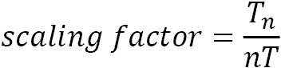
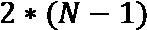
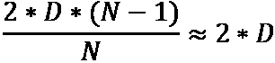
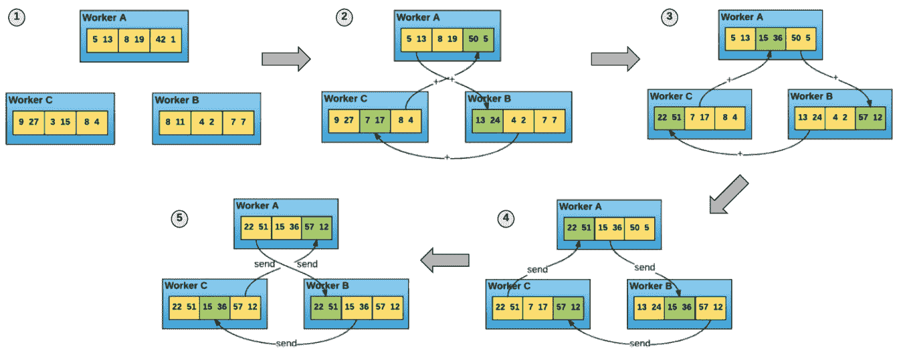

# 第五章：考虑深度学习训练的硬件配置

训练一个大型的 **深度学习**（**DL**）模型通常是一个漫长且资源消耗巨大的过程。以极端案例 GPT-3 NLP 模型为例，使用 1,024 个 NVIDIA A100 GPU 从零开始训练它大约花费了 34 天。虽然你不太可能需要从零开始训练如此庞大的模型，但即使是在自定义数据上微调大型深度学习模型，也可能需要数天甚至数周的时间。

为你的特定模型选择计算实例类型是一个至关重要的步骤，它将影响训练的成本和时间。AWS 提供了多种计算实例，适用于不同的工作负载需求。在本章中，我们将考虑最适合深度学习模型的实例的性价比特性，以及在不同场景下如何选择最合适的实例以获得最佳性能。

训练大型模型还需要将训练任务跨多个 GPU 设备和计算实例进行扩展，这一过程称为分布式训练。从高层次来看，分布式训练过程分为两个阶段：计算阶段和通信阶段。在通信阶段，单个设备和节点交换各自的更新并计算平均权重更新。交换的数据量由模型大小乘以其特性（如精度）决定。对于大型模型，训练过程中的瓶颈通常是网络吞吐量，而非单个设备的计算。因此，作为硬件考虑的一部分，我们将讨论网络吞吐量的要求以及可用的选项，如 AWS **弹性网络适配器**（**EFA**），以解决训练任务通信阶段可能出现的瓶颈。

使你的训练过程更高效的另一种方法是为特定硬件平台优化你的模型。在使用 TensorFlow 和 PyTorch 等框架训练深度学习模型时，我们依赖这些框架将模型的 Python 代码转换为要在加速器上运行的指令。然而，这些计算指令是通用的，并没有利用你的训练循环和模型架构的特定细节。SageMaker 训练编译器提供了一组功能，帮助你为特定的加速器设备优化模型，从而提高训练速度并减少内存占用。

本章将涵盖以下主题：

+   选择最佳的计算实例

+   使用 EFA 提升网络吞吐量

+   使用训练编译器为 GPU 设备编译模型

阅读本章后，你将能够为你的训练任务选择高效的硬件配置，具备最佳的性价比，并进行进一步的优化。

# 技术要求

要跟随本章中的代码，你需要以下内容：

+   一个 AWS 账户和具有管理 Amazon SageMaker 资源权限的 IAM 用户

+   已建立一个 SageMaker Notebook、SageMaker Studio Notebook 或本地兼容的 SageMaker 环境

# 选择最佳计算实例

Amazon SageMaker 为开发者提供了多种计算实例，按**实例系列**组织。每个实例系列都有一组称为*实例类型*的实例配置。

以下列表列出了在 SageMaker 上可用的实例系列：

+   **ML.M** 是一系列标准实例，提供平衡的 CPU 和内存资源配置。CPU 核心越多，内存也就越多。该实例系列不配备 GPU 设备。

+   **ML.C** 是一系列针对计算密集型应用（如数据处理或某些**机器学习**（**ML**）算法，举例来说，支持向量机）设计的计算优化实例。该系列也可用于机器学习推理。它不配备 GPU 设备。

+   **ML.G** 是一系列基于 NVIDIA GPU 设备的实例，主要用于深度学习推理工作负载。它也可用于较小的训练任务和其他计算密集型工作负载。

+   **ML.P** 是一系列配备 NVIDIA GPU 设备的实例，专为重型深度学习训练任务设计。

到目前为止，我们只讨论了原则上可以运行任何计算操作的一般用途实例系列。除此之外，还有专门为深度学习工作负载设计的计算实例（业界称为**应用特定集成电路**或**ASIC**）。在撰写本文时，有几种类型的 ASIC 实例系列可在 SageMaker 或作为 EC2 实例使用：

+   **Inferentia** 实例。

+   **Tranium** 实例，目前仅在 EC2 上可用。

+   **DL1** 实例，目前仅在 EC2 上可用。但已经宣布支持 SageMaker。

虽然基于 CPU 的实例可以用于运行一些机器学习训练，但它通常不是深度学习模型训练的理想选择。现在，让我们详细回顾一下可用的 GPU 和 ASIC 实例。

## 回顾专业的深度学习硬件

本章将重点讨论两种用于高强度深度学习训练工作负载的硬件——GPU 和 ASIC——并讨论它们为何适合深度学习训练、它们的特点以及它们的使用案例。

如果我们观察机器学习和深度学习的整体趋势，可以看到行业正从更通用的计算转向更专用的设备。

初始的机器学习和深度学习模型使用 CPU 设备进行训练，因为 CPU 允许执行几乎任何类型的计算操作。CPU 在执行单个小计算操作时也是一个优化延迟的设备。然而，大多数深度学习模型需要并行执行大量的计算操作（例如，矩阵乘法）。因此，CPU 需要花费大量时间逐一执行原子操作。

GPU 设备旨在解决不同类型的问题——并行运行大量操作。你可以说 GPU 是一种通过并行运行许多操作来优化吞吐量的设备。由于深度学习（DL）模型包括大量可以高效并行化的矩阵运算，GPU 比 CPU 更具效率。

GPU 的进步使得全新的深度学习模型架构成为可能。例如，突破性的 AlexNet 模型在 2012 年使用 GPU 设备在 ImageNet 数据集上进行了训练。研究团队将卷积和矩阵操作专门实现为在 GPU 上运行，从而在训练时实现了显著的加速。

为了简化 GPU 设备在机器学习工作负载中的使用，硬件供应商提供了用于 GPU 开发的专门库。例如，NVIDIA 创建了 CUDA 平台——一组库以及一个运行时，用于在 GPU 设备上执行通用计算。CuBLAS 库（CUDA 的一部分）提供了多种计算操作（如矩阵操作）。你还可以使用 CUTLASS 组件开发自己的操作。这对于新模型架构尤其有用。在 CUDA 上优化计算操作也能提升训练性能。

最近，一种新的深度学习硬件设计方法变得流行起来：ASIC。这是一种旨在执行有限集操作的设备，但能极其高效地完成这些操作。谷歌的**张量处理单元**（**TPU**）就是一种为深度学习工作负载设计的 ASIC 示例。AWS 也在积极开发用于深度学习工作负载的专用硬件设备。目前，AWS 已推出 Inferentia（2018 年）用于推理，Tranium（2021 年）和 DL1 实例（2022 年）基于 Gaudi 加速器用于训练。请注意，在撰写本文时，Tranium 和 DL1 加速器仅作为 EC2 实例提供。我们预计它们未来将在 SageMaker 上可用。

由于 ASIC 的高度专业化，确认特定的深度学习框架或模型架构是否支持某个 ASIC 设备始终是个好主意。通常，你需要将模型代码转换为 ASIC 的指令。这通常由提供的编译器自动完成。对于 AWS 的 ASIC，你需要使用开源的 Neuron SDK 编译你的模型（[`aws.amazon.com/machine-learning/neuron/`](https://aws.amazon.com/machine-learning/neuron/)）。

在编译你的模型时，Neuron SDK 提供了多种优化方法，例如将操作进行批处理。它使用提前编译，因此输入数据批次的维度应该在模型配置时提前定义，尽管需要注意的是，Neuron SDK 还支持一套已定义的操作符。如果你的模型有不受支持的操作符（例如自定义控制流操作），你将无法编译你的模型。Neuron SDK 支持 TensorFlow、PyTorch 和 MXNet 框架。

在许多情况下，选择最佳的 ASIC 或 GPU 设备取决于你的特定模型和训练超参数。你可以使用业界标准基准测试 MLPerf（[`mlcommons.org/en/training-normal-11/`](https://mlcommons.org/en/training-normal-11/)）作为参考。领先的 GPU 和 ASIC 厂商在八个流行的深度学习模型上训练后，提交了其硬件加速器的性能详情。截至 2021 年 12 月，NVIDIA A100 GPU 在所有模型上表现优于市面上所有可用的硬件加速器。Google 的 TPUv4 ASIC 加速器在六个模型上提高了基准测试成绩，但在提交时，TPUv4 尚未上市。

## 选择最佳实例类型

你选择的实例系列和具体实例类型始终由你的使用案例需求驱动。重要的是，你可以在同一使用案例中使用多个实例类型和系列。例如，你可能想先从单 GPU 训练开始，同时调整超参数并进行整体模型调试。然后，你可以逐步将训练扩展到更多节点，或将训练任务迁移到具有更高性能加速器的实例类型上。

在选择最佳实例类型时，你必须考虑以下一些标准：

+   **模型架构及其大小**：这决定了在 GPU 加速器上存储模型的内存需求。

+   **所需训练模式**：在这里，你需要选择是否希望在单个 GPU、多个 GPU 或多个 GPU 多节点上进行训练。

+   **业务优先级**：在这里，你需要选择是想尽可能快地训练模型，还是尽可能便宜，或者找到一个可接受的性价比平衡点。

在选择适合自己特定情况的实例时，牢记以下实例类型的特点是很重要的：

+   **加速器架构**：这会影响计算性能。例如，最新的 NVIDIA A100 芯片比上一代 V100 芯片提升了约 2.5 倍的性能。

+   **可用 vCPU 核心**：这些将用于数据加载和处理等操作。

+   **GPU 内部和节点间的网络吞吐量**：这定义了在进行多 GPU 和/或多节点训练任务时，数据（梯度）在训练设备之间交换的速度。

+   选择的实例类型的价格。

在以下小节中，我们将概述几个典型的使用案例，从最小且最具成本效益的模型到最大且最具性能的模型按顺序排列。

### G5 系列——为小型和中型模型提供高效的训练

在实验中训练小型或中型深度学习模型时，你可以考虑使用 G5 实例，因为它们具有成本效益且性能强大。它们配备最多八个**NVIDIA A10G**加速器，最高 100 Gbps 网络带宽，以及最多 192 个 vCPU。下表展示了 G5 系列的规格：

| 实例规格 | GPU | GPU 内存（GiB） | vCPUs | 内存（GiB） | 网络带宽（Gbps） |
| --- | --- | --- | --- | --- | --- |
| 单 GPU 虚拟机 | g5.xlarge | 1 | 24 | 4 | 16 | 高达 10 |
| g5.2xlarge | 1 | 24 | 8 | 32 | 高达 10 |
| g5.4xlarge | 1 | 24 | 16 | 64 | 高达 25 |
| g5.8xlarge | 1 | 24 | 32 | 128 | 25 |
| g5.16xlarge | 1 | 24 | 64 | 256 | 25 |
| 多 GPU 虚拟机 | g5.12xlarge | 4 | 96 | 48 | 192 | 40 |
| g5.24xlarge | 4 | 96 | 96 | 384 | 50 |
| g5.48xlarge | 8 | 192 | 192 | 768 | 100 |

图 5.1 – G5 系列规格

如果你希望在单个 GPU 设备上运行模型，你应该根据其他系统需求（网络、RAM、vCPUs 等）选择单 GPU 虚拟机。如果你希望同时运行多个实验（每个使用不同的 GPU 设备），你应该选择多 GPU 虚拟机。需要注意的是，在多 GPU 虚拟机的情况下，单个 GPU 设备之间并未通过高速的**NVLink 互联**连接。因此，如果你打算进行多 GPU 分布式训练，带有 NVLink 的 P3 系列会更加合适。

另外，你也可以考虑上一代的 G4 实例，它的小时价格较低（某些实例的价格最高可比 G5 便宜 50%）。然而，根据 AWS 内部基准测试，G5 在性价比方面比 G4 高出多达 40%。

### P3 系列 – 高性能与高性价比的训练

P3 系列提供高性能和高性价比，适用于大规模模型。它最多配备八个**NVIDIA V100**加速器，并且与 G5 系列不同，它支持高效的 NVLink GPU 互联：

| 实例规格 | GPU – Tesla V100 | GPU 点对点 | GPU 内存（GB） | vCPUs | 内存（GB） | 网络带宽 |
| --- | --- | --- | --- | --- | --- | --- |
| p3.2xlarge | 1 | 无 | 16 | 8 | 61 | 高达 10 Gbps |
| p3.8xlarge | 4 | NVLink | 64 | 32 | 244 | 10 Gbps |
| p3.16xlarge | 8 | NVLink | 128 | 64 | 488 | 25 Gbps |
| p3dn.24xlarge | 8 | NVLink | 256 | 96 | 768 | 100 Gbps |

图 5.2 – P3 系列规格

`p3.2xlarge`实例是运行复杂 DL 模型单 GPU 训练的不错选择（假设模型可以装入内存）。如果你的模型无法适应单个 GPU 设备，你可以选择`p3.8xlarge`或`p3.16xlarge`，它们是多节点实例。在这种情况下，你将把模型的部分存储在多个 GPU 中。NVLink 互联在前向和反向传播过程中提供 GPU 之间的高速数据交换。

`p3.8xlarge`和`p3.16xlarge`的另一个应用领域是运行多 GPU 数据并行训练任务。在这种使用场景中，你将深度学习模型的副本加载到每个 GPU 设备中，但使用不同的数据批次进行训练。NVLink 互联确保在每次训练迭代结束时，GPU 节点之间进行高速的梯度交换和计算。

最强大的实例`p3dn.24xlarge`配备了 EFA 网络设备，提供低延迟和一致的节点间通信。这使得`p3dn.24xlarge`实例成为大规模多 GPU 多模式训练任务的优秀选择，尤其是当你的训练任务受限于网络时。

### P4 系列 – 训练的最高性能

P4 系列基于 NVIDIA A100 GPU 加速器，截至 2021 年 12 月，超越了任何市售加速器在 MLPerf 基准测试中的表现。P4 系列有一个单一实例，`p4d.24xlarge`，配备了八个 A100 GPU 设备、96 个 vCPU 和 1,152 GB 的 RAM。

这些特性使得`p4d.24xlarge`实例成为使用分布式训练方法训练大型 SOTA 深度学习模型的理想选择。然而，在训练大型模型时，训练集群中设备之间需要交换的数据量可能会超过 GPU 之间和节点之间的网络带宽，这可能导致整体训练速度变慢，并且浪费昂贵的 GPU 资源。AWS 为`p4d.24xlarge`实例提供了几种网络功能来缓解此问题：

+   通过 NVLink，在同一节点内的 GPU 之间实现高达 600 GB/s 的双向带宽

+   通过 EFA 使用**GPUDirect RDMA**，在不同节点之间实现高达 400 GB/s 的带宽

此外，`p4d.24xlarge`支持广泛的精度点类型：FP64、FP32、FP16、INT8、BF16 和 TF32。如果你的框架和模型支持混合精度，你可能能够在不大幅牺牲模型精度的情况下实现更好的性能。

自然地，`p4d.24xlarge`的价格高于其他实例。然而，第二昂贵的实例`p3dn.24xlarge`与之相比的价格差距只有约 5%。根据其卓越的性能，P4 可以为训练提供高达 60%的成本节约，并且根据 AWS 内部基准测试，深度学习性能提高超过 2.5 倍。这使得`p4d.24xlarge`不仅是深度学习训练中性能最强的实例，也是训练大型 SOTA 深度学习模型中性价比最高的选择。你可以在以下文章中找到有关 P4d 实例系列的详细性能基准： [`aws.amazon.com/blogs/compute/amazon-ec2-p4d-instances-deep-dive/`](https://aws.amazon.com/blogs/compute/amazon-ec2-p4d-instances-deep-dive/)。

# 通过 EFA 提高网络吞吐量

在训练大型深度学习模型时，你需要将大型训练任务分解成更小的任务，并分布到多个计算设备上。分布式训练包括以下关键步骤：

1.  训练集群中的每个设备执行以下操作：

    1.  从全局数据批次中读取一个独特的 mini-batch

    1.  通过模型运行一个 mini-batch 并计算损失

    1.  计算梯度以最小化损失

1.  每个设备将梯度传递给其同伴。计算平均梯度。

1.  每个设备根据平均梯度更新模型。

为了衡量分布式训练的效率，我们可以使用扩展因子，定义如下：



这里，*T* 是单个设备的吞吐量，*n* 是训练集群中的设备数量，*nT* 是你的训练集群所实现的整体吞吐量。虽然理想的扩展性通常难以实现（即增加资源并不总是能成比例地减少训练时间），但在许多最近的基准测试中，已经证明通过精心应用、硬件和网络优化，可以实现高达 90% 的扩展效率。

为了对你的训练任务进行性能瓶颈分析，测量每个步骤的性能非常重要。研究表明，在许多情况下，通信阶段（*步骤 2*）是训练过程中的全球性瓶颈（例如，可以参考 *网络是分布式训练瓶颈吗？* 见 [`arxiv.org/pdf/2006.10103.pdf`](https://arxiv.org/pdf/2006.10103.pdf)）。在本节中，我们将重点理解如何优化通信阶段。

有几个因素决定了每个节点发送和接收的数据量：

+   首先是通信算法，它定义了训练设备之间如何交换梯度更新。在撰写时，最流行的方法被称为 Ring-AllReduce。这个算法使你能够高效地在每个训练设备之间传输梯度更新。每个 *N* 节点与其两个同行进行通信  次。每个训练设备在单次迭代中发送的总体信息量是 ，对于大 *N* 来说，其中 *D* 是梯度更新的大小。以下图所示：



图 5.3 – Ring-AllReduce 通信算法

+   其次是模型的大小及其精度（在前面的公式中为 *D*）。

例如，如果我们使用 Ring-AllReduce 算法来训练 BERT 模型（该模型包含大约 3.4 亿个参数）并采用半精度，每个训练设备在单次迭代中将发送和接收大约 650 MB 的数据。通信需要快速进行。单个设备的性能下降将导致整体训练过程的放缓。

## 引入 EFA

Amazon EFA 是一种网络设备，提供比传统 TCP 传输更低且更稳定的延迟。EFA 专门为高性能和机器学习应用场景设计，其中实例间通信对分布式任务至关重要。

EFA 提供了以下优势：

+   操作系统绕过功能，允许深度学习应用直接与网络接口硬件通信，从而提供低延迟和可靠的传输功能。

+   支持高性能消息协议，如**MPI**和**NCCL**。对于深度学习用例，我们特别关注 NVIDIA 的 NCCL 库，它为 GPU 设备提供高性能的通信例程。

使用 EFA 可以显著提高训练任务的性能。根据 AWS 基准测试，使用 EFA 可以使 BERT 在 `ml.p4dl.24xlarge` 的 32 个实例上训练速度比默认的 **弹性网络适配器** (**ENA**) 快 130%。

在 SageMaker 上使用 EFA 不会产生额外费用。EFA 可用于 `ml.p3dn.24xlarge`、`ml.p4d.24xlarge` 和 `ml.c5n.18xlarge` SageMaker 实例。

## 在自定义训练容器中使用 EFA

SageMaker 提供与 EFA 设备的无缝集成。如果您使用 TensorFlow 或 PyTorch 深度学习容器与支持的训练实例，EFA 将自动启用。

如果您选择使用自定义容器，您需要在该容器中安装必要的 EFA 包以及 MPI 和 NCCL 库。以下步骤展示了如何在 Dockerfile 中执行这些操作：

1.  首先，您需要定义您将使用的 MPI、NCCL、EFA 和 OFI 库的版本，如下所示：

    ```py
    ARG OPEN_MPI_PATH=/opt/amazon/openmpi/
    ENV NCCL_VERSION=2.7.8
    ENV EFA_VERSION=1.11.2
    ENV BRANCH_OFI=1.1.1
    ```

1.  然后，您必须下载并执行 EFA 驱动程序安装程序：

    ```py
    RUN cd $HOME \
      && curl -O https://s3-us-west-2.amazonaws.com/aws-efa-installer/aws-efa-installer-${EFA_VERSION}.tar.gz \
      && tar -xf aws-efa-installer-${EFA_VERSION}.tar.gz \
      && cd aws-efa-installer \
      && ./efa_installer.sh -y --skip-kmod -g \
    ENV PATH="$OPEN_MPI_PATH/bin:$PATH"
    ENV LD_LIBRARY_PATH="$OPEN_MPI_PATH/lib/:$LD_LIBRARY_PATH"
    ```

1.  现在，您必须从公共的 NVIDIA 仓库克隆并构建 NCCL 库：

    ```py
    RUN cd $HOME \
      && git clone https://github.com/NVIDIA/nccl.git -b v${NCCL_VERSION}-1 \
      && cd nccl \
      && make -j64 src.build BUILDDIR=/usr/local
    ```

1.  接下来，您必须安装 AWS OFI NCCL 插件，它允许您将 EFA 网络模块与 NCCL 应用程序一起使用：

    ```py
    RUN apt-get update && apt-get install -y autoconf
    RUN cd $HOME \
      && git clone https://github.com/aws/aws-ofi-nccl.git -b v${BRANCH_OFI} \
      && cd aws-ofi-nccl \
      && ./autogen.sh \
      && ./configure --with-libfabric=/opt/amazon/efa \
           --with-mpi=/opt/amazon/openmpi \
           --with-cuda=/usr/local/cuda \
           --with-nccl=/usr/local --prefix=/usr/local \
      && make && make install
    ```

1.  最后，您必须安装 NCCL 测试并执行它们，以检查 NCCL 操作的正确性和性能：

    ```py
    RUN cd $HOME \
      && git clone https://github.com/NVIDIA/nccl-tests \
      && cd nccl-tests \
      && make MPI=1 MPI_HOME=/opt/amazon/openmpi CUDA_HOME=/usr/local/cuda NCCL_HOME=/usr/local
    ```

在本节中，我们讨论了分布式训练中设备之间的网络以及它对整体训练效率的影响。由于网络经常成为训练的全球瓶颈，我们分享了如何根据集群配置和模型参数来估算网络带宽。然后，我们回顾了 AWS 的 EFA 网络设备，它提高了网络带宽和效率。由于 EFA 对用户没有额外费用或任何缺点，因此建议在可能的情况下使用它。

# 使用训练编译器为 GPU 设备编译模型

SageMaker 训练编译器是一项能力，允许您自动优化 NLP 深度学习模型，以便在 GPU 实例上运行。对于支持的模型架构和框架，您的训练脚本无需进行代码更改。您只需在 SageMaker 训练任务配置中启用训练编译器即可。训练编译器不仅可以减少训练时间和内存需求，而且不会影响模型的准确性。例如，根据 AWS 基准测试，使用训练编译器时，基于 RoBERTa 的模型训练时间和成本降低了 30%。

让我们回顾一下 SageMaker 训练编译器的工作原理，以及如何在训练任务中使用它。

## 引入 XLA 优化库

**加速线性代数**（**XLA**）是一种特定领域的编译器，它通过几乎不修改模型代码的方式加速模型训练和执行。到目前为止，XLA 已经支持 TensorFlow 和 PyTorch 框架。SageMaker 训练编译器抽象化了与 XLA 库的交互，并利用它们来优化在 SageMaker 上运行的训练任务。SageMaker 训练编译器支持单 GPU 和分布式训练任务。

当你在没有 XLA 的情况下训练模型时，所有操作都会单独执行。假设你的模型有两个顺序操作：矩阵乘法和矩阵加法。没有 XLA 时，你的框架执行引擎会将这两个操作（称为 *kernels*）一个接一个地发送到 GPU 设备。当使用 XLA 时，它会通过将加法和乘法操作融合，将这两个操作编译成一个单独的内核启动。融合的操作必须完全在 GPU 寄存器上执行，只有最终的结果会被流式传输给用户。去除冗余的内存操作是 XLA 编译器的关键优化特性之一。

XLA 编译器与其他编译器的另一个显著区别是，不像常规的 CUDA 操作会立即执行（称为 *eager* 执行），XLA 张量操作是“惰性”的。首先，XLA 编译器构建融合操作的图，并将张量作为占位符保留在这个执行图中。只有在操作结果需要时，计算操作才会被执行。通过延迟执行，XLA 能够在模型的计算图中找到融合操作的机会。

## 使用 SageMaker 训练编译器

SageMaker 训练编译器已在广泛的 NLP 模型上进行了测试，并且也支持流行的计算机视觉模型，如用于图像分类和目标检测的 PyTorch 和 TensorFlow 实现。随着我们预计这个列表会随着时间增长，请查阅以下页面以了解最新的支持模型：[`docs.aws.amazon.com/sagemaker/latest/dg/training-compiler-support.xhtml`](https://docs.aws.amazon.com/sagemaker/latest/dg/training-compiler-support.xhtml)。此页面还提供了建议的训练和模型配置，如实例类型、精度（是否混合）和批大小。

SageMaker 训练编译器也可以用于尚未正式测试的模型。在使用训练编译器处理未测试的模型时，请注意以下事项：

+   你可能需要修改你的训练脚本，例如设置合适的 XLA 设备，使用兼容 XLA 的优化器、数据加载器和 XLA 训练循环语义。

+   你可能需要进行超参数搜索（特别是批大小和学习率），以找到适合你训练任务的最优配置。这是因为 SageMaker 训练编译器会改变你模型的内存占用。

+   训练编译器仅适用于部分 SageMaker 深度学习容器。请参阅以下页面以获取最新支持训练编译器的容器：[`github.com/aws/deep-learning-containers/blob/master/available_images.md`](https://github.com/aws/deep-learning-containers/blob/master/available_images.md)。

在基准测试您的自定义模型时，比较启用和未启用训练编译器的结果，请记住，SageMaker 编译您的模型需要一些时间，这会增加整体训练时间。因此，可能不适合在短时间训练作业（例如在小数据集上微调任务）中使用训练编译器。此外，正确设置批处理大小也很重要。通常，您可以期待训练编译器减少模型的内存占用，从而增加最大批处理大小。随着批处理大小的增加，您需要按比例调整学习率。请注意，给定模型的内存需求可能并不总是会减少。在这种情况下，您将无法增加批处理大小。对于未经测试的模型，使用训练编译器需要通过实验来获得最佳结果。

## 使用训练编译器

若要在已测试的模型中使用训练编译器，您需要显式地在训练作业配置中启用它。请按照以下步骤操作：

1.  首先导入 `TrainingCompilerConfig` 对象。请注意，它适用于 PythonSDK > 2.7.x：

    ```py
    from sagemaker.huggingface import HuggingFace, TrainingCompilerConfig
    ```

`TrainingCompilerConfig` 对象支持以下参数：

+   `enabled` （`bool`）：可选项。此项是一个开关，用于启用 SageMaker 训练编译器。默认值为 `True`。

+   `debug` （`bool`）：可选项。此项指定是否输出调试的详细日志，这可能会导致性能下降。默认值为 `False`。

1.  接下来，您需要为 SageMaker 训练编译器配置必要的超参数：

    ```py
    hyperparameters = {
        "epochs": 5,
        "train_batch_size": 24,
        "model_name": "bert-base-cased",
    }
    # Scale the learning rate by batch size, as original LR was using batch size of 32
    hyperparameters["learning_rate"] = float("5e-5") / 32 * hyperparameters["train_batch_size"]
    ```

1.  接下来，您必须像之前一样配置 `HuggingFace` 训练作业，唯一的区别是您必须显式传递 `TrainingCompilerObject`，并将其设置为训练配置中的默认 `enabled` 状态：

    ```py
    sm_training_compiler_estimator = HuggingFace(
        entry_point="train.py",
        instance_type="ml.p3.2xlarge",
        instance_count=1,
        role=role,
        py_version="py38",
        transformers_version="4.11.0",
        pytorch_version="1.9.0",
        compiler_config=TrainingCompilerConfig(),
        hyperparameters=hyperparameters,
        disable_profiler=True,
        debugger_hook_config=False,
    )
    ```

注意

为了获得训练编译器的最佳性能，建议禁用 SageMaker 配置文件和 SageMaker 调试器功能。请注意在我们的训练作业中设置适当的配置。

一旦训练作业启动，您必须确保模型已被编译。为此，您应期望在训练作业日志中看到以下消息，这表示训练编译器按预期工作：

```py
Found configuration for Training Compiler
Configuring SM Training Compiler...
```

现在，让我们总结一下本章内容。

# 总结

在本章中，我们重点讨论了工程化深度学习分布式训练的硬件方面。我们回顾了可用的 SageMaker 计算实例，并聚焦于带有 GPU 设备的实例系列。接着，我们讨论了不同的深度学习用例，以及如何为它们选择最优的计算实例。然后，我们回顾了分布式训练的网络需求，并学习了 Amazon EFA 如何帮助你避免在运行大规模训练任务时遇到网络瓶颈。我们还回顾了如何使用 SageMaker 训练编译器优化模型，使其能够在 GPU 设备上运行，并通过实践体验了这一功能。

在下一章，*第六章*，*分布式训练工程化*，我们将继续讨论分布式训练。我们将重点讨论如何为你的用例、深度学习框架和模型架构选择最合适的分布式训练类型，并在这些领域积累实践经验。
