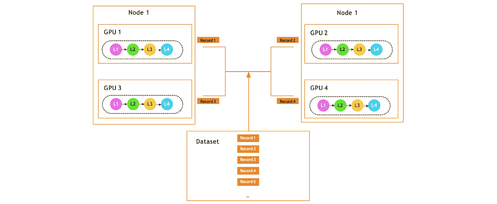
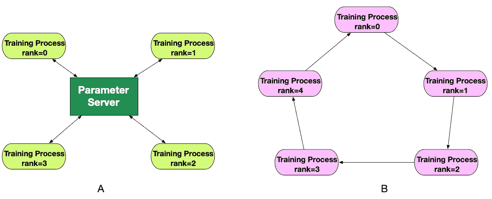
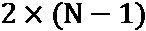
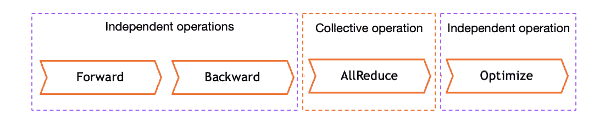
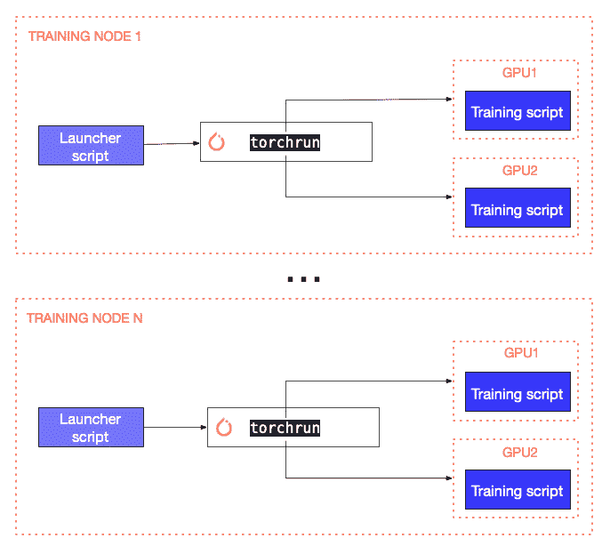
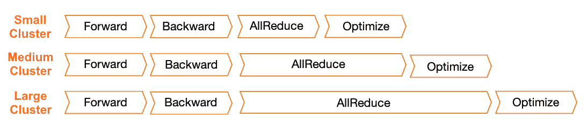
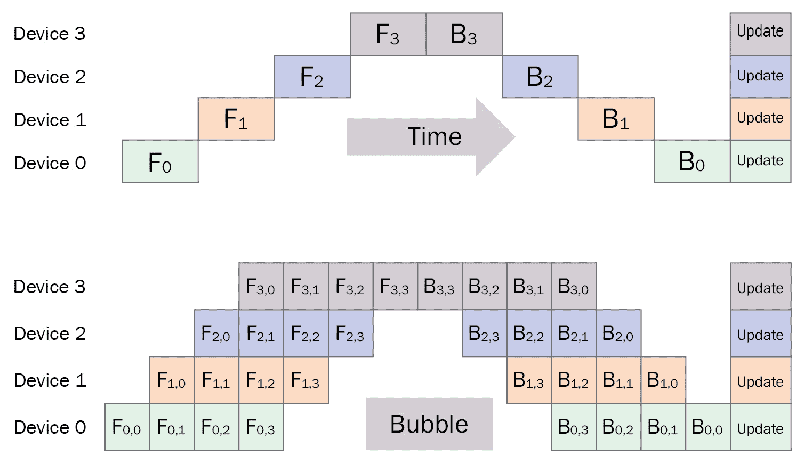
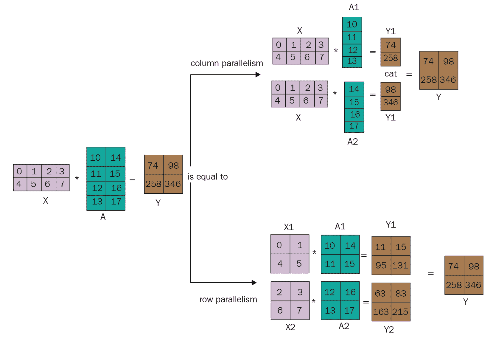
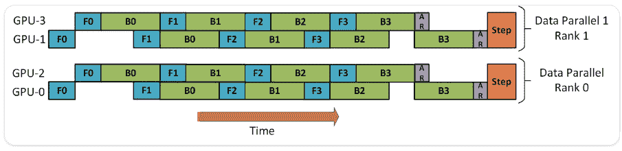
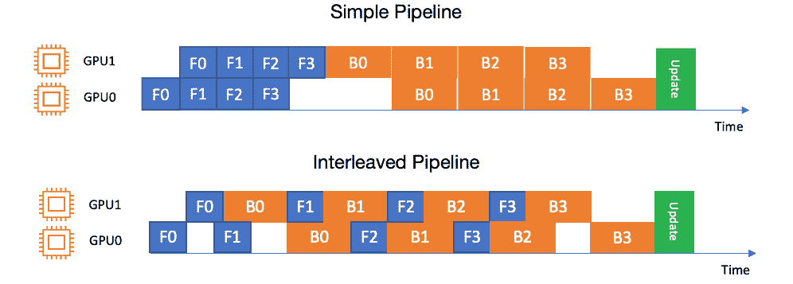

# 第六章：分布式训练工程

在上一章中，我们讨论了如何为**深度** **学习**（**DL**）训练任务选择最优硬件，并针对目标硬件平台优化你的模型。在本章中，我们将深入探讨如何根据你的特定用例和模型架构，在亚马逊 SageMaker 上设计高效的分布式训练。

分布式训练旨在解决两个具体问题。第一个问题是如何通过将训练任务分配到多个计算设备上来减少大型模型的训练时间。另一个问题是在需要训练无法完全加载到单个 GPU 设备内存中的大型模型时出现的。这一问题在自然语言处理（NLP）任务中尤为重要，因为研究表明，超大模型具有更强的表达能力，因此在广泛的 NLP 任务中表现更好。例如，最新的开源 SOTA 语言模型 BLOOM，在一个包含 384 个 GPU 加速器（NVIDIA A100）的计算集群上训练了大约 3.5 个月。仅模型权重就有约 329 GB，而包含模型权重和优化器状态的检查点则为 2.3 TB。更多详情，请参阅 [`huggingface.co/bigscience/bloom`](https://huggingface.co/bigscience/bloom)。

为解决这些问题，已经出现了两种方法；第一种是**数据并行**分布式训练，通过同时分配任务来加速训练时间。第二种是**模型并行**分布式训练，将大型模型分布到多个 GPU 之间，从而使你能够使用无法完全加载到单个 GPU 设备内存中的模型。

正如你可能已经猜到的那样，无法适配单个 GPU 设备的大型模型也需要相当长的训练时间。因此，必然需要将模型并行与数据并行结合起来，以使训练时间变得可接受。数据并行和模型并行的结合被称为**混合并行**。在本章中，我们将讨论这三种并行方式。

虽然理解分布式训练方法至关重要，但你还需要了解适用于你的 DL 框架和模型架构的实现方式。SageMaker 提供了用于分布式训练的专有库：**SageMaker 分布式数据并行**（**SDDP**）和**SageMaker 分布式模型并行**（**SDMP**）。在本章中，我们将回顾它们的优点，并实际体验如何使用它们。此外，我们还将讨论针对 TensorFlow 和 PyTorch 框架的其他流行开源分布式训练替代方案，以及如何在 SageMaker 平台上使用它们。

本章将涵盖以下主题：

+   数据并行训练工程

+   模型并行与混合并行训练工程

+   优化分布式训练任务

到本章结束时，您将对分布式训练有一个清晰的理解，并且获得在 Amazon SageMaker 上实现各种类型分布式训练的实际经验。

# 技术要求

在本章节中，我们将提供代码示例，帮助您培养实际技能。完整的代码示例可以在[`github.com/PacktPublishing/Accelerate-Deep-Learning-Workloads-with-Amazon-SageMaker/blob/main/chapter6/`](https://github.com/PacktPublishing/Accelerate-Deep-Learning-Workloads-with-Amazon-SageMaker/blob/main/chapter6/)查看。

要跟随本代码示例，您需要具备以下条件：

+   一个 AWS 账户和具有管理 Amazon SageMaker 资源权限的 IAM 用户。

+   建立一个 SageMaker 笔记本，SageMaker Studio 笔记本，或本地兼容 SageMaker 的环境。

+   在您的 AWS 账户中访问 GPU 训练实例。本章节中的每个示例将提供推荐的实例类型。可能需要增加您的计算配额，以便启用 GPU 实例用于*SageMaker 训练作业*。在这种情况下，请按照[`docs.aws.amazon.com/sagemaker/latest/dg/regions-quotas.xhtml`](https://docs.aws.amazon.com/sagemaker/latest/dg/regions-quotas.xhtml)中的说明操作。

# 工程数据并行训练

首先，让我们概述一下在本章中将使用的一些重要术语：

+   **训练进程**、**训练器**或**工作节点** – 这些术语交替使用，指的是计算集群中的独立训练进程。例如，分布式深度学习训练进程通常在单个 GPU 设备上运行。

+   **训练节点**、**服务器**或**主机** – 这些术语定义了训练集群中的服务器。该服务器可以有一个或多个 GPU 设备，这意味着一个或多个训练进程可以在同一台服务器上运行。

+   **世界大小** – 这是在训练集群中运行的独立训练进程的数量。通常，世界大小等于训练集群中可用的 GPU 设备数量。

+   **排名（也称全局排名）** – 这是在训练集群中运行的训练进程的唯一零基 ID。例如，如果您有 4 个训练进程，它们的排名分别为 0、1、2 和 3。

+   **本地排名** – 这是在单个节点内运行的训练进程的唯一零基 ID。例如，如果您有两个训练节点，每个节点有两个 GPU 设备，那么本地排名将是 0 和 1，全局排名将是 0、1、2 和 3。

+   **通信后端**或**集体通信** – 这些术语定义了训练进程之间进行通信和协调计算的机制与协议。一些常见的后端有**NVIDIA NCCL**、**Gloo**和**消息传递接口**（**MPI**）。

+   `allreduce` 操作用于聚合和平均张量或**广播**，将张量从一个训练进程发送到集群中的其他进程。通常，通信后端提供集体操作的实现。

现在我们了解了分布式训练的基本术语，让我们深入回顾一下数据并行。

数据并行分布式训练在你想要减少在多个训练设备上训练模型的时间时非常有用。每个训练进程都有一个全局模型的副本，但它在与其他进程并行的过程中，在独特的数据切片上进行训练（因此称为*数据并行性*）。在训练步骤结束时，每个训练进程与其他进程交换学习到的梯度更新。然后，梯度更新被平均并分发回所有训练进程，以便它们可以更新各自的模型副本。*图 6.1*展示了数据批次在一个数据并行的双节点双 GPU 集群中的分布情况：



图 6.1 – 数据并行概览

在设计数据并行训练任务时，你需要注意几个关键设计选择，以便调试和优化你的训练任务，诸如以下几点：

+   各个进程之间如何进行协调

+   各个计算进程如何相互通信

+   计算进程如何在训练集群中分布

在接下来的章节中，我们将讨论这些设计选项。

## 协调模式 – 参数服务器与 Allreduce

在分布式集群中协调计算进程有两种方式：使用**专用的集中式协调器**，以及使用**对等协调**，其中每个节点直接与集群中的一个或多个对等节点通信。在数据并行训练的背景下，集中式协调模式被称为**参数服务器**，其中参数服务器进程协调梯度更新的分发并维护全局模型副本。而对等模式被称为**Allreduce**，它是一种通过对等算法在训练进程之间分发梯度更新的方式。在*图 6.2*中，你可以看到这两种协调模式的区别：



图 6.2 – 参数服务器 (A) 和 Allreduce (B) 协调模式

参数服务器负责协调集群中的训练过程，具体包括以下内容：

+   为每个训练过程分配一组独特的数据记录

+   从每个训练进程接收梯度

+   聚合梯度并相应地更新模型权重

+   将更新后的模型发送回训练进程

参数服务器存储模型权重的主副本。对于较大的深度学习模型，可能无法将完整的模型存储在参数服务器上。此外，参数服务器可能会成为网络和计算瓶颈。在这种情况下，你可能需要引入多个参数服务器，它们将存储模型参数的子集，从而减少网络和内存的需求。多个参数服务器允许你扩展分布式训练以处理大型模型；然而，当在训练进程和参数服务器之间协调模型更新时，它会引入额外的复杂性，并可能导致网络拥塞。找到训练进程与参数服务器之间的最佳配置可能是一个艰巨的任务，需要经过相当多的反复试验才能找到最优配置。

**Allreduce** 算法采用点对点通信，每个训练进程仅与两个邻居交换梯度更新。一个秩为 `i` 的训练进程为独特的数据微批次计算梯度，从进程 *i-1* 接收梯度，并将接收到的梯度与自己计算的梯度汇总，然后将聚合后的梯度发送给节点 *i+1*。总的来说，每个进程将与它的同伴进行  次通信：



图 6.3 – Allreduce 算法中的计算操作顺序

Allreduce 算法被认为是带宽高效的，具有恒定的通信成本，并避免了像参数服务器那样的通信瓶颈。此外，与参数服务器方法相比，它的操作复杂性较低（特别是在多个参数服务器实例的情况下）。因此，许多近期的研究论文和实现都基于 Allreduce 算法及其修改版。Allreduce 算法的最流行实现包括 Horovod、TensorFlow Mirror Strategy 和 PyTorch **分布式数据并行**（**DDP**）。AWS 也在 SDDP 库中使用了修改后的 Allreduce 算法。稍后在本章中，我们将使用前面提到的 Allreduce 实现，在 SageMaker 上开发一个分布式训练任务。

### 通信类型 – 同步与异步

分布式训练任务中有两种通信类型：**同步**（**sync**）和**异步**（**async**）。

**同步通信**意味着每个训练进程将与集群中的其他进程同步进行计算。例如，在同步 Allreduce 算法的情况下，每个训练进程将在其他进程完成其反向和正向传递后，等待交换其梯度。这会导致集群在每个训练步骤上的性能由最慢的训练进程决定，并可能导致其他训练进程的等待时间（浪费）。然而，同步通信的好处包括更稳定的训练收敛。Allreduce 算法的不同实现也提供了优化，以减少等待时间。

在**异步通信**中，每个节点独立工作。它将梯度更新发送给其他进程或集中式参数服务器，并在不等待同伴结果的情况下继续进行下一个训练迭代。这种方法可以最小化等待时间，并最大化每个训练进程的吞吐量。该方法的缺点是，由于增加了随机性，训练过程可能会变得收敛较慢且不稳定。

实际上，平衡系统吞吐量和训练收敛是非常重要的。为此，大多数分布式训练实现都使用同步通信，并通过多种优化来提高训练吞吐量。

### 集群中的训练进程布局

根据你的模型大小/架构和训练需求（例如所需的训练时长），有几种方法可以在训练集群中组织训练进程：

+   `p4d.24xlarge`实例仅有 8 个 GPU 设备，这限制了在单节点上扩展训练任务的能力。

+   **多个节点单个 GPU** - 这意味着所有进程之间的协调都通过网络通信完成，这通常会成为全球训练瓶颈。因此，这种布局对于大多数训练场景来说是次优的。

+   **多个节点多个 GPU** - 这允许你将训练任务扩展到数十个甚至数百个独立的训练进程。在选择此布局时，你需要关注训练节点之间的网络吞吐量，因为它可能成为全球瓶颈。SageMaker 实例如*p4d*和*p3dn*提供了改进的网络能力来解决这个问题。

现在我们已经对数据并行性有了初步的直觉，接下来让我们积累一些实践经验，并为 TensorFlow 和 PyTorch 框架构建数据并行分布式训练任务。我们将使用本地数据并行实现和深度学习框架，以及流行的与框架无关的 Horovod 库。然后，我们将学习如何使用 AWS 的专有 SageMaker 数据并行库，并与开源数据并行实现进行对比，了解其优势。

## 工程化 TensorFlow 数据并行训练

在为 TensorFlow 框架设计分布式训练作业时，你可以使用几种数据并行实现：

+   原生数据并行实现（称为“策略”）

+   TensorFlow 的 Horovod 实现

让我们回顾一下这些实现的优缺点。

### 使用原生 TensorFlow 策略

与 TensorFlow 1 相比，TensorFlow 2 大幅扩展了分布式策略的数量。请注意，由于 TensorFlow 2 提供了多个训练 API，部分 API 对分布式策略的支持有限。请参见*图 6.4*中的支持矩阵：

| **训练 API** | **镜像策略** | **TPU 策略** | **多工作节点镜像策略（MWMS）** | **中央存储策略** | **参数服务器策略** |
| --- | --- | --- | --- | --- | --- |
| Keras Model.fit | 支持 | 支持 | 支持 | 实验性支持 | 实验性支持 |
| 自定义训练循环 | 支持 | 支持 | 支持 | 实验性支持 | 实验性支持 |
| Estimator API | 支持有限 | 不支持 | 支持有限 | 支持有限 | 支持有限 |

图 6.4 – TensorFlow 2 分布式策略

**参数服务器策略**和**中央存储策略**被标记为**实验性支持**，这意味着它们目前正在积极开发中。通常建议在生产工作负载中不要使用实验性功能。因此，我们不会在本书的范围内考虑它们。

注意

虽然 Amazon SageMaker 文档声明它支持 TensorFlow 参数服务器，但这一说法具有误导性。SageMaker 支持的是 TensorFlow 1 参数服务器，它已经过时，不应在新开发中使用。SageMaker 并不直接支持 TensorFlow 2 的原生策略，尽管通过一些代码更改可以支持它们，接下来会展示这一过程。

**TPU 策略**旨在与 Google TPU 设备配合使用，因此不受 Amazon SageMaker 支持。因此，在本节中，我们将重点关注 **镜像策略** 和 MWMS。

这两种策略都实现了针对 GPU 设备的同步 Allreduce 算法。顾名思义，多工作节点策略支持将训练任务分布到多个训练节点上。对于*节点内部通信*，你可以选择使用*NCCL 后端*或*原生 RING 通信*后端。在这两种策略中，完整的模型副本（称为*镜像变量*）存储在每个训练进程中，并在每次训练步骤后同步更新。让我们回顾一个在 SageMaker 平台上实现 **MWMS** 的示例。

作为测试任务，我们将选择大家最喜爱的 MNIST 数据集，并训练一个小型计算机视觉模型来解决分类任务。我们将使用方便的**Keras API**来构建并训练模型，并评估结果。更多细节的示例笔记本可以在[`github.com/PacktPublishing/Accelerate-Deep-Learning-Workloads-with-Amazon-SageMaker/blob/main/chapter6/1_distributed_training_TF.ipynb`](https://github.com/PacktPublishing/Accelerate-Deep-Learning-Workloads-with-Amazon-SageMaker/blob/main/chapter6/1_distributed_training_TF.ipynb)中找到。

我们将首先回顾启用 MWMS 所需的修改。

#### 集群配置和设置

MWMS 在 Amazon SageMaker 中并未原生支持，因此我们需要在 SageMaker 中正确配置 MWMS 环境。TensorFlow2 使用一个名为`tf_config`的环境变量来表示集群配置。此配置随后用于启动训练过程。您可以在[`www.tensorflow.org/guide/distributed_training#TF_CONFIG`](https://www.tensorflow.org/guide/distributed_training#TF_CONFIG)了解如何构建`'TF_CONFIG'`变量。在以下代码块中，我们使用`'_build_tf_config()'`方法来设置此变量。请注意，我们在此过程中使用了`'SM_HOSTS'`和`'SM_CURRENT_HOST'`的 SageMaker 环境变量：

```py
Def _build_tf_config():
    hosts = json.loads(os.getenv("SM_HOSTS"))
    current_host = os.getenv("SM_CURRENT_HOST")
    workers = hosts
    def host_addresses(hosts, port=7777):
        return ["{}:{}".format(host, port) for host in hosts]
    tf_config = {"cluster": {}, "task": {}}
    tf_config["cluster"]["worker"] = host_addresses(workers)
    tf_config["task"] = {"index": workers.index(current_host), "type": "worker"}
    os.environ["TF_CONFIG"] = json.dumps(tf_config)
```

在此示例中，默认情况下，我们使用两个`p2.xlarge`实例，训练过程的世界大小仅为两个。因此，`_build_tf_config()`将在 rank=`0`节点中生成以下`'TF_CONFIG'`变量：

```py
{
    "cluster": 
    {
        "worker": ["algo-1:7777", "algo-2:7777"]},
        "task": {"index": 0, "type": "worker"
    }
}
```

一旦`TF`配置正确设置，TF2 应该能够在所有节点上启动训练过程，并利用所有可用的 GPU 设备。 这是默认设置，但您也可以提供要使用的特定 GPU 设备列表。

要完成集群设置，我们还需要确保已经配置了 NCCL 后端（请参见`_set_nccl_environment()`方法），并确保集群中的所有节点可以相互通信（请参见`_dns_lookup()`方法）。请注意，这些方法是必需的，因为 TensorFlow 2 策略并未得到 SageMaker 的官方支持。对于受支持的数据并行实现，SageMaker 提供了这些工具，并作为训练集群初始化的一部分进行运行。

#### 使用 MWMS

为了使用 MWMS，我们将首先启动一个策略对象，如下所示。请注意，在这里，我们显式设置通信后端为`AUTO`，这意味着 TF2 将自动识别使用哪个后端。您也可以手动定义特定的后端。`NCCL`和自定义的`RING`后端可用于 GPU 设备：

```py
strategy = tf.distribute.MultiWorkerMirroredStrategy(
    communication_options=tf.distribute.experimental.CommunicationOptions(
        implementation=tf.distribute.experimental.CollectiveCommunication.AUTO
    )
)
```

一旦策略被正确初始化，您可以通过检查`strategy.num_replicas_in_sync`来确认集群配置，它将返回您的世界大小。它应该与每个节点的 GPU 数量乘以节点数量匹配。

在这个示例中，我们使用的是 Keras API，它完全支持 MWMS，因此简化了我们的训练脚本。例如，要在所有工作节点上创建模型副本，你只需要在`strategy.scope`内初始化你的 Keras 模型，如下代码块所示：

```py
    with strategy.scope():
        multi_worker_model = build_and_compile_cnn_model()
```

此外，MWMS 会自动根据世界大小分片你的数据集。你只需要设置一个合适的全局批处理大小，如下代码块所示。请注意，如果需要某些自定义分片逻辑，可以开启自动分片功能：

```py
global_batch_size = args.batch_size_per_device * _get_world_size()
multi_worker_dataset = mnist_dataset(global_batch_size)
```

剩余的训练脚本与单进程 Keras 训练脚本类似。正如你所见，使用 MWMS 是相当直接的，TF2 在抽象化复杂性方面做得很好，同时，如果需要，也为你提供了调整默认设置的灵活性。

#### 运行 SageMaker 任务

到目前为止，我们已经讨论了如何更新训练脚本以进行数据并行训练。在源目录中，你还将看到 `mnist_setup.py` 脚本，用于下载并配置 MNIST 数据集。现在我们已经准备好在 SageMaker 上运行数据并行训练。

在以下代码块中，我们定义了 TensorFlow 版本（2.8），Python 版本（3.9），实例类型以及实例的数量。此外，我们还传递了若干训练超参数。由于 MNIST 数据集已经作为训练脚本的一部分从互联网下载，因此无需将数据传递给 `estimator_ms.fit()` 方法：

```py
from sagemaker.tensorflow import TensorFlow
ps_instance_type = 'ml.p2.xlarge'
ps_instance_count = 2
hyperparameters = {'epochs': 4, 'batch-size-per-device' : 16, 'steps-per-epoch': 100}
estimator_ms = TensorFlow(
                       source_dir='1_sources',
                       entry_point='train_ms.py', 
                       role=role,
                       framework_version='2.8',
                       py_version='py39',
                       disable_profiler=True,
                       debugger_hook_config=False,
                       hyperparameters=hyperparameters,
                       instance_count=ps_instance_count, 
                       instance_type=ps_instance_type,
                       )
estimator_ms.fit()
```

使用默认设置，训练任务应该在 10 到 12 分钟内完成。你可以随意尝试集群中的节点数量和实例类型，并观察 `'TF_CONFIG'`、训练速度和收敛性的变化。

在接下来的部分中，我们将学习一种数据并行的开源替代方案——Horovod 框架。

### 使用 Horovod 框架

Horovod 框架为最流行的深度学习框架提供了同步数据并行的实现，如 TensorFlow 1 和 TensorFlow 2（包括 Keras）、PyTorch 和 Apache MXNet。Horovod 的一个优点是，它只需要最少的修改即可分配训练任务，这兼容各种集群布局。Horovod 支持几种通信后端：Gloo 和 Open MPI 用于基于 CPU 的训练，NCCL 用于运行在 NVIDIA GPU 设备上的训练。

Horovod 配备了一些功能，旨在解决我们之前讨论的 Allreduce 算法的概念限制。为了减少 `allreduce` 计算过程中的等待时间，并提高训练设备的利用率，Horovod 引入了一个名为 `allreduce` 和 `allgather` 的概念，并将其组织成层次结构，从而实现更好的整体性能。此外，Horovod 还提供了一个 **Autotune** 工具，可以通过调整训练参数来调优训练作业的性能。请注意，运行 Autotune 作业并不适合用于生产环境。

现在，让我们回顾一下如何在 SageMaker 上使用 Horovod 进行 TensorFlow 2 的训练。请注意，Horovod 原生支持 TensorFlow 和 PyTorch 框架。在本章中，我们将只回顾 TensorFlow 2 的 Horovod 实现，因为 PyTorch 的实现将非常相似。我们将解决之前提到的 MNIST 分类问题。

#### 配置 Horovod 集群

与 MWMS 不同，我们不需要在训练脚本中配置和设置训练集群，因为 Horovod 已被 SageMaker 支持。Horovod 集群配置是在 TensorFlow Estimator API 级别通过`distribution`对象完成的，如以下代码块所示：

```py
distribution = {"mpi": {"enabled": True, "custom_mpi_options": "-verbose --NCCL_DEBUG=INFO", "processes_per_host": 1}}
```

注意`processes_per_host`参数，它应该与所选实例类型中的 GPU 数量相匹配。此外，你可以根据需要设置`custom_mpi_options`，这些选项会传递给**mpirun**运行工具。你可以在[`www.open-mpi.org/doc/v4.0/man1/mpirun.1.php`](https://www.open-mpi.org/doc/v4.0/man1/mpirun.1.php)查看支持的 MPI 选项列表。

#### 开发训练脚本

你可以在[`github.com/PacktPublishing/Accelerate-Deep-Learning-Workloads-with-Amazon-SageMaker/blob/main/chapter6/1_sources/train_hvd.py`](https://github.com/PacktPublishing/Accelerate-Deep-Learning-Workloads-with-Amazon-SageMaker/blob/main/chapter6/1_sources/train_hvd.py)找到完整的训练脚本。让我们执行以下步骤：

1.  我们通过`_initiate_hvd()`方法在训练脚本中启动 Horovod。我们还需要将 Horovod 训练进程与可用的 GPU 设备关联起来（每个进程一个设备）：

    ```py
    def _initiate_hvd():
        hvd.init()
        gpus = tf.config.experimental.list_physical_devices("GPU")
        for gpu in gpus:
            tf.config.experimental.set_memory_growth(gpu, True)
        if gpus:
    tf.config.experimental.set_visible_devices(gpus[hvd.local_rank()], "GPU")
    ```

1.  接下来，我们需要根据世界大小对数据集进行切片，以便每个进程可以根据其全局排名获取数据切片。为此，我们使用 TensorFlow 数据集实例的`shard`方法。请注意，我们正在通过 Horovod 的`size()`和`rank()`属性获取给定训练进程的本地和全局排名：

    ```py
    train_dataset = train_dataset.shard(hvd.size(), hvd.rank())
    ```

1.  然后，我们使用`DistributedOptimizer` Horovod 包装器来启用分布式梯度更新。请注意，我们包装的是本地 TF2 优化器的一个实例：

    ```py
    optimizer = tf.keras.optimizers.SGD(learning_rate=0.001 * hvd.size())
    optimizer = hvd.DistributedOptimizer(optimizer)
    ```

1.  最后，我们使用特殊的 Horovod 回调函数，Keras 将在训练循环中使用这些回调函数：

    +   使用`hvd.callbacks.BroadcastGlobalVariablesCallback(0)`将来自`rank=0`进程的初始变量分发到集群中的其他训练进程。

    +   使用`hvd.callbacks.MetricAverageCallback()`来计算所有训练进程的全局平均指标。

1.  这些回调函数随后将传递给`model.fit()`方法，如下所示：

    ```py
        hvd_model.fit(
            shareded_by_rank_dataset,
            epochs=args.epochs,
            steps_per_epoch=args.steps_per_epoch // hvd.size(),
            callbacks=callbacks,
        )
    ```

这些是你训练脚本中最少的改动，它们可以让你使用 Horovod。

#### 运行 SageMaker 作业

SageMaker 训练作业配置与 MWMS 示例类似，但我们将添加`distribution`参数，允许我们设置 MPI 参数并定义每个主机启动多少个进程：

```py
from sagemaker.tensorflow import TensorFlow
ps_instance_type = 'ml.p2.xlarge'
ps_instance_count = 2
distribution = {"mpi": {"enabled": True, "custom_mpi_options": "-verbose --NCCL_DEBUG=INFO", "processes_per_host": 1}}
hyperparameters = {'epochs': 4, 'batch-size-per-device' : 16, 'steps-per-epoch': 100}
estimator_hvd = TensorFlow(
                       source_dir='1_sources',
                       entry_point='train_hvd.py', 
                       role=role,
                       framework_version='2.8',
                       py_version='py39',
                       disable_profiler=True,
                       debugger_hook_config=False,
                       hyperparameters=hyperparameters,
                       instance_count=ps_instance_count, 
                       instance_type=ps_instance_type,
                       distribution=distribution
                       )
estimator_hvd.fit()
```

在这里，我们实现了使用 TensorFlow 2 MWMS 和 TensorFlow 2 Horovod 的数据并行训练任务的最小可行示例。现在，你应该已经具备了开发基准训练任务的一些实践经验。两种 Allreduce 实现中都有更多的调节选项和功能，我们鼓励你在实际使用案例中探索和尝试。选择具体的实现方式（MWMS 或 Horovod）在许多情况下是基于使用场景的，没有明确的优劣之分。Horovod 的优势在于它支持多个深度学习框架，并且其成熟性（特别是在故障排除和优化工具方面）。另一方面，TensorFlow 2 策略与各种 TensorFlow API 和不同的方法原生集成，其中许多目前处于实验模式。

在接下来的章节中，我们将转向 PyTorch 框架，并回顾其原生数据并行实现。

## 工程化 PyTorch 数据并行训练

PyTorch 提供了一个原生实现的数据并行工具 `torch.distributed.run`，用于简化和协调进程启动。与 Horovod 类似，PyTorch DDP 支持 NCCL、Gloo 和 MPI 通信后端。此外，PyTorch DDP 原生支持 **混合精度** 和 **自动混合精度** (**AMP**)，这允许你以半精度训练模型，并对模型精度和训练收敛性的影响最小化。AMP 的好处包括加速计算并减少内存占用。

尽管 SageMaker 本身不原生支持 PyTorch DDP，但仍然可以在 SageMaker 上运行 DDP 训练任务。让我们回顾一下实现示例。

我们采用预训练的 CV Resnet18 模型，并对其进行微调，以便对蚂蚁和蜜蜂进行分类。我们使用数据并行来将任务分配到两台 `p2.xlarge` 实例中，每个实例有一个 GPU 设备。可以随意更改或修改训练集群中实例的数量和类型，并观察这如何改变训练速度。

请注意，这只是小规模训练，不能代表实际任务中训练效率的表现。

接下来，我们将重点介绍关键代码构建块。一个笔记本和其他代码资源可以在 [`github.com/PacktPublishing/Accelerate-Deep-Learning-Workloads-with-Amazon-SageMaker/blob/main/chapter6/2_distributed_training_PyTorch.ipynb`](https://github.com/PacktPublishing/Accelerate-Deep-Learning-Workloads-with-Amazon-SageMaker/blob/main/chapter6/2_distributed_training_PyTorch.ipynb) 获取。

### 启动训练进程

Amazon SageMaker 原生不支持 PyTorch DDP 训练。具体来说，它不知道如何在训练集群中启动分布式 DDP 进程。因此，我们需要开发一个启动工具来执行此功能。这个工具非常简单，并且可以在任何其他基于 DDP 的训练任务中复用。

在启动脚本中，我们将使用 DDP 模块 `torch.distributed.run`，它简化了在集群中生成训练进程的过程。作为启动脚本的一部分，我们需要收集训练世界的信息，特别是集群中的节点数量和 GPU 设备数量，并确定哪个节点将作为主协调者。然后，`torch.distributed.run` 会生成多个训练进程。请参考*图 6.5*以获得可视化说明：



图 6.5 – 在 N 个节点上启动 PyTorch DDP 训练，使用两个 GPU

让我们突出几个启动脚本中的关键部分：

1.  首先，我们需要收集有关 SageMaker 训练集群的信息。为此，我们使用 SageMaker 自动设置的环境变量：

    ```py
        nodes = json.loads(os.getenv("SM_HOSTS"))
        nnodes = len(nodes)
        node_rank = nodes.index(os.getenv("SM_CURRENT_HOST"))
        nproc_per_node = os.getenv("SM_NUM_GPUS", 1)
    ```

1.  接下来，我们需要构建命令行以启动 `torch.distributed.run`：

    ```py
        cmd = [
            sys.executable,
            "-m",
            "torch.distributed.run",
            f"--nproc_per_node={nproc_per_node}",
            f"--nnodes={str(nnodes)}",
            f"--node_rank={node_rank}",
            f"--rdzv_id={os.getenv('SAGEMAKER_JOB_NAME')}",
            "--rdzv_backend=c10d",
            f"--rdzv_endpoint={nodes[0]}:{RDZV_PORT}",
            distr_args.train_script,
        ]
        # Adding training hyperparameters which will then be passed in training script
        cmd.extend(training_hyperparameters)
    ```

请注意，我们在命令行末尾添加了“原样”的 `training hyperparameters`。这些参数不是由启动器处理的，而是由训练脚本来配置训练。

1.  最后，我们使用 Python 的 `subprocess.Popen` 启动 `torch.distributed.run` 工具作为模块：

    ```py
        process = subprocess.Popen(cmd, env=os.environ)
        process.wait()
        if process.returncode != 0:
            raise subprocess.CalledProcessError(returncode=process.returncode, cmd=cmd)
    ```

请注意，我们将环境变量复制到子进程，以保留所有 SageMaker 变量。如果生成的进程返回非零代码（表示错误），我们将引发异常，将错误代码传播到 SageMaker 控制平面。

总结来说，我们的启动工具负责收集训练集群配置，然后在每个节点上启动 `torch.distributed.run`。该工具随后负责在每个节点启动多个训练进程。

### 为 DDP 采用训练脚本

要使用 DDP，我们需要对训练脚本进行最小的修改：

1.  首先，我们初始化训练进程并将其添加到 DDP 进程组：

    ```py
    dist.init_process_group(
        backend="nccl",
        rank=int(os.getenv("RANK", 0)),
        world_size=int(os.getenv("WORLD_SIZE", 1)),
    )
    ```

由于我们使用基于 GPU 的实例，我们使用 `NCCL` 通信后端。此外，我们利用 `torch.distributed.run` 模块设置的环境变量：世界大小和全局排名。

1.  接下来，我们需要确定哪个 GPU 设备将存储模型并进行计算。我们使用 `torch.distributed.run` 在进程生成时设置的 `LOCAL_RANK` 变量：

    ```py
    torch.cuda.set_device(os.getenv("LOCAL_RANK"))
    device = torch.device("cuda")
    model = model.to(device)
    ```

1.  然后，我们将常规的 PyTorch 模型包装成一个特殊的 DDP 实现。这个实现允许我们像处理常规本地存储的模型一样使用 PyTorch 模型。在背后，DDP 模块实现了在进程组中各训练进程之间的梯度同步。同时，请注意，我们正在根据世界大小缩小用户提供的全局批量大小：

    ```py
    model = DDP(model)
    args.batch_size //= dist.get_world_size()
    args.batch_size = max(args.batch_size, 1)
    ```

1.  我们需要做的最后一步是修改训练数据加载器，以确保每个训练进程在训练步骤中获取唯一的数据切片。为此，我们使用 `DistributedSampler`，它根据进程总数采样数据记录，并处理全局排名：

    ```py
        train_sampler = torch.utils.data.distributed.DistributedSampler(
            image_datasets["train"], num_replicas=args.world_size, rank=args.rank
        )
        train_loader = torch.utils.data.DataLoader(
            image_datasets["train"],
            batch_size=args.batch_size,
            shuffle=False,
            num_workers=0,
            pin_memory=True,
            sampler=train_sampler,
        ) 
    ```

训练脚本的其余部分与*非分布式训练*类似。如你所见，为使训练脚本兼容 PyTorch DDP 所做的修改非常少。

### 运行 SageMaker 训练任务

一旦启动器和训练脚本准备好，我们就可以开始 SageMaker 训练任务。请注意，我们将启动器脚本指定为`entry_point`参数。训练脚本的引用与训练超参数一起提供，放在`hyperparameter`对象中：

```py
from sagemaker.pytorch import PyTorch
ps_instance_type = 'ml.p3.2xlarge'
ps_instance_count = 2
hyperparameters = {
  'train-script': 'train_ddp.py',
  'epochs': 25,
  }
estimator_ms = PyTorch(
                       source_dir='2_sources',
                       entry_point='launcher.py', 
                       role=role,
                       framework_version='1.9',
                       py_version='py38',
                       disable_profiler=True,
                       debugger_hook_config=False,
                       hyperparameters=hyperparameters,
                       instance_count=ps_instance_count, 
                       instance_type=ps_instance_type,
                       )
estimator_ms.fit(inputs={"train":f"{data_url}/train", "val":f"{data_url}/val"})
```

训练任务应在 8 到 9 分钟内完成。你可以随时查看训练任务日志中的调试信息。此外，你还可以尝试其他参数，例如实例类型和大小、训练轮次、批量大小等。

在本节中，我们学习了如何在 PyTorch 框架中使用原生的数据并行实现。在下一节中，我们将介绍 SageMaker 的专有数据并行实现。

## 工程化 SageMaker 的 DDP 任务

SDDP 库提供了一个专有的数据并行实现，并与其他 SageMaker 功能原生集成。SDDP 被打包在 SageMaker DL 容器中，并支持 TensorFlow 2 和 PyTorch 框架。

SDDP 利用 MPI（类似于 Horovod）来管理训练集群中的进程。在背后，SDDP 使用`ml.p3.16xlarge`、`ml.p3dn.24xlarge`和`ml.p4d.24xlarge`。SDDP 提供了一个与 Horovod 和 PyTorch DDP 非常相似的 API，这使得从开源实现切换到它变得非常容易。

SDDP 实现了一个修改版的 Allreduce 算法，并进行了多项优化，以提高整体训练性能，特别是在`allreduce`操作中的等待时间。如前所述，在同步 Allreduce 算法中，通常分布式的`allreduce`操作是瓶颈，并且随着训练集群规模的扩大，它变得更加低效。请查看*图 6.6*：



图 6.6 – 集群增加时的 Allreduce 时间

为了提高训练效率，特别是在大规模集群中，SDDP 引入了几项新的优化：

+   SDDP 在训练过程中利用 GPU 和 CPU 设备，因此 GPU 设备执行前向和反向传播，CPU 设备则在`allreduce`阶段执行梯度平均和与其他训练进程的通信。这种方法使得计算操作和`allreduce`能够并行运行，从而最大化资源利用率。

+   SDDP 支持`allreduce`（例如 Horovod 的张量融合功能）。

因此，AWS 声称 SDDP 随着训练集群规模的增加，训练吞吐量几乎实现线性扩展。AWS 发布了以下基准测试，展示了 SDDP 与原生 PyTorch DDP 相比的优化收益：对于 8 节点的`p3dn.24xl`集群，在训练 BERT 模型时，SDDP 比 PyTorch DDP 快 41%，在训练 MaskRCNN 模型时快 13%。更多细节请参考此文献：[`docs.aws.amazon.com/sagemaker/latest/dg/data-parallel-intro.xhtml`](https://docs.aws.amazon.com/sagemaker/latest/dg/data-parallel-intro.xhtml)。

在构建 SDDP 训练任务时，请牢记以下几个方面：

+   SDDP 依赖于 CPU 设备来执行`allreduce`操作。大多数框架的数据加载器也使用 CPU。因此，请确保控制你的 CPU 使用，以避免过度利用。在*第七章*《深度学习训练的操作化》中，我们将讨论可以用来控制资源利用的工具，例如 SageMaker 调试器。或者，你可以将数据加载操作转移到 GPU 上。然而，在这种情况下，你将有较少的 GPU 内存来加载模型并执行其前向和反向传递。

+   在小型集群或单个节点上使用 SDDP 可能没有显著的效果或任何好处，因为它的设计目标是专门解决大规模训练集群的瓶颈。

让我们回顾一下基于 SDDP 的训练任务示例。为此，我们将重用之前的 PyTorch DDP，并做最小的修改，从 PyTorch DDP 切换到 SDDP 库。

作为一个训练任务，我们使用与 PyTorch DDP 示例中相同的二分类 CV。由于 SDDP 本身得到了 SageMaker 的原生支持，我们无需开发任何自定义启动工具。SDDP 使用`mpirun`工具在集群中启动训练进程。你可以使用`distribution`参数启用数据并行执行，并提供任何`mpi`选项，如下所示：

```py
distribution = { 
    "smdistributed": { 
        "dataparallel": {
            "enabled": True, 
            "custom_mpi_options": "-verbose -x NCCL_DEBUG=VERSION"
        }
    }
}
```

现在，让我们开始采用训练脚本。

### 采用训练脚本

SDDP 的起始版本 1.4.0 是一个集成的 PyTorch DDP 包，我们在前面的示例中将其作为特定的后端选项使用。这样可以显著减少使用 SDDP 所需的更改。事实上，如果你已经有一个启用了 DDP 的训练脚本，你只需要添加`torch_sddp`包的导入，并在初始化进程组时使用`smddp`通信后端，如下所示：

```py
import smdistributed.dataparallel.torch.torch_smddp
import torch.distributed as dist
dist.init_process_group(backend='smddp')
```

请注意，SDDP v1.4 仅在最新的 PyTorch v10 DL 容器中可用。对于早期版本，SDDP API 略有不同。更多细节请参考官方 API 文档：[`sagemaker.readthedocs.io/en/stable/api/training/distributed.xhtml#the-sagemaker-distributed-data-parallel-library`](https://sagemaker.readthedocs.io/en/stable/api/training/distributed.xhtml#the-sagemaker-distributed-data-parallel-library)。

### 运行 SDDP SageMaker 训练任务

启动 SDDP 任务时，需要提供一个特殊的`distribution`对象，并配置数据并行性。另一个需要注意的事项是，SDDP 仅适用于有限的多 GPU 实例类型：`ml.p3.16xlarge`、`ml.p3dn.24xlarge`和`ml.p4d.24xlarge`。请参考以下内容：

```py
from sagemaker.pytorch import PyTorch
instance_type = 'ml.p3.16xlarge'
instance_count = 2
distribution = { 
    "smdistributed": { 
        "dataparallel": {
            "enabled": True, 
            "custom_mpi_options": "-verbose -x NCCL_DEBUG=VERSION"
        }
    }
}
sm_dp_estimator = PyTorch(
          entry_point="train_sm_dp.py",
          source_dir='3_sources',
          role=role,
          instance_type=instance_type,
          sagemaker_session=sagemaker_session,
          framework_version='1.10',
          py_version='py38',
          instance_count=2,
          hyperparameters={
              "batch-size":64,
              "epochs":25,
          },
          disable_profiler=True,
          debugger_hook_config=False,
          distribution=distribution,
          base_job_name="SM-DP",
      )
```

请注意，由于我们使用的是一个小型数据集，这个训练样本无法体现与开源数据并行框架相比，SDDP 的任何性能优势。

### 数据并行性的总结

到目前为止，我们讨论了如何加速训练那些能够适配单一设备内存的深度学习模型。我们在讨论和开发训练脚本时，使用了深度学习框架的本地实现、开源解决方案以及专有的跨框架 Allreduce 实现（分别是 Horovod 和 SageMaker SDDP）。然而，我们并未对给定实现的训练效率进行基准测试。虽然每个使用场景都是独特的，但通常的建议是，当涉及大规模且时间较长的训练过程，尤其是需要大规模集群时，应优先考虑使用 SDDP。如果你有中型或小型的训练任务，仍然可以考虑使用框架本地的数据并行实现。在这种情况下，SDDP 的性能优势可能微乎其微。

在接下来的章节中，我们将讨论如何使用模型并行优化训练那些无法完全适配单个 GPU 内存的模型。

# 工程化模型并行训练任务

在模型并行中，模型的单一副本会被分布到两个或更多的训练设备上，以避免单个 GPU 设备的内存限制。模型并行的简单方法是将模型的各层显式地分配到不同的设备上。在这种情况下，前向计算将在存储第一组层的 GPU 设备上进行。然后，结果将被传输到存储下一组层的 GPU 设备上，依此类推。在反向传递过程中，层之间的交接会按相反顺序发生。这种类型的模型并行被称为**简单模型并行**或**垂直模型并行**，因为我们将模型在设备之间进行垂直切分。然而，这种模型并行方式效率较低，因为每个 GPU 设备都需要等待其他设备完成计算，导致显著的时间浪费。更高效的模型并行方式叫做**流水线并行**。这种方法将单一的数据批次分成多个微批次，并通过重叠不同**微批次**的梯度计算，尽量减少等待时间。请参见*图 6.7*，对比简单模型并行和流水线模型并行：



图 6.7 – 简单模型并行和流水线模型并行

图表来源

[`ai.googleblog.com/2019/03/introducing-gpipe-open-source-library.xhtml`](https://ai.googleblog.com/2019/03/introducing-gpipe-open-source-library.xhtml%0D)

实现流水线并行面临一些挑战，因为你可能需要重新实现训练脚本，将模型的各个部分分配到不同的设备上，并在训练循环中反映新的计算流程。此外，你还需要决定如何在同一节点内和跨节点之间优化地放置模型层。还有，流水线并行不支持条件流，并要求每一层接受一个张量作为输入并产生一个张量作为输出。你还需要为每种新的模型架构重新实现流水线并行。接下来在本节中，我们将看到 SMDP 库如何解决这些挑战。

垂直拆分模型是一种最小化内存占用的方法。另一种并行化方法是称为**张量并行**。每个张量（数据输入和层输出）会被拆分到多个设备上并行处理。然后，将单独的结果进行聚合。张量并行是可行的，因为许多计算操作可以表示为矩阵运算，而矩阵运算可以沿着`X`轴或`Y`轴进行拆分。请参见*图 6.8*，它提供了张量如何拆分的可视化表示。张量并行也被称为**水平并行**：



图 6.8 – 行式和列式张量并行

图像来源

[`github.com/huggingface/transformers/blob/main/docs/source/en/perf_train_gpu_many.mdx`](https://github.com/huggingface/transformers/blob/main/docs/source/en/perf_train_gpu_many.mdx)

流水线并行和张量模型并行可以结合使用。此外，还可以加入数据并行，以实现更高的并行化和更好的训练速度。数据并行与模型并行的结合被称为**混合并行**。这种方法被用来训练当前大多数最先进的 SOTA NLP 模型，如 T5 或 GPT3。请参见*图 6.9*，它展示了流水线并行和数据并行的结合：



图 6.9 – 结合流水线并行和数据并行

现在我们已经刷新了对关键模型并行方法的理解，接下来让我们回顾一下 SDMP 库——SageMaker 专有的模型并行实现。

## 使用 SDMP 进行工程训练

SDMP 是一个功能丰富的库，能够实现各种类型的模型并行性和混合并行性，并针对 SageMaker 基础设施进行了优化。它支持 TensorFlow 和 PyTorch 框架，并允许你在最少的代码更改下，自动将模型划分到不同的设备。像 SDDP 一样，SDMP 使用 MPI 在训练集群中协调任务，在 GPU 设备上进行前向和反向计算，在 CPU 设备上进行通信任务。

SDMP 具有一些显著特点，可以简化模型并行训练作业的开发，并优化训练时硬件的利用率：

+   SDMP 支持任意的模型架构，并且对训练脚本的修改最小，不会产生任何精度上的惩罚。

+   **自动化模型拆分**将在训练集群中将模型划分到不同设备之间。你可以选择优化速度和内存利用率。此外，SDMP 还支持手动模型拆分（然而，在实践中，这种方法通常不是一个好的选择）。

+   **交错管道**是对简单模型管道的改进，允许你通过优先执行反向操作来最小化处理微批次的时间：



图 6.10 - 简单和交错管道的比较

图的来源

[`docs.aws.amazon.com/sagemaker/latest/dg/model-parallel-core-features.xhtml`](https://docs.aws.amazon.com/sagemaker/latest/dg/model-parallel-core-features.xhtml%0D)

虽然 SDMP 官方支持 TensorFlow 2 和 PyTorch，但某些优化功能仅对 PyTorch 可用。针对 PyTorch 的扩展支持包括以下内容：

+   **优化器状态分片**允许你不仅将模型分割，还可以在数据并行组的训练设备之间分割优化器状态。这进一步减少了每个设备在训练过程中的内存占用。请注意，优化器状态分片会增加一个聚合步骤（当全局优化器状态从各个分片重新构建时），这会导致额外的延迟。

+   除了管道和数据并行性之外，**张量并行性**也非常重要。张量并行性对于那些无法完全适配到单一 GPU 设备的大层次（如嵌入层）尤为有效。

+   **激活检查点**和**激活卸载**是另外两种技术，它们通过增加一些计算时间来重建训练状态，从而进一步减少训练内存占用。

由于使用这些高级优化功能需要在内存和计算之间进行权衡，通常建议仅在大型模型（即数十亿参数）上使用它们。

现在，让我们使用 SDMP 库开发一个混合并行作业。我们将重用之前的 PyTorch 示例和 CV 模型。

注意

这个例子仅具有教学目的。通常，CV 模型（如 Resnet18）可以适应单个 GPU，在这种情况下，不需要模型并行。然而，对于演示目的，较小的模型更易于管理并且训练速度较快。

### 配置模型和混合并行性

首先，让我们了解一下我们的训练将如何执行以及如何配置并行性。为此，我们将使用 SageMaker 训练作业的分发对象。它有两个关键组件：`model parallel` 和 `mpi`。

SageMaker 依赖 `mpi` 工具来运行分布式计算。在以下代码片段中，我们设置它运行 `8` 个训练进程。这里，`processes_per_host` 定义了每个主机将运行多少个训练进程，这些进程包括运行模型并行、数据并行或张量并行的进程。在大多数情况下，进程数量应与节点中可用的 GPU 数量相匹配。

`Modelparallel` 对象定义了 SDMP 库的配置。然后，在代码片段中，我们设置了 2 路模型并行（`partitions` 参数设置为 `2`）。同时，我们通过将 `ddp` 参数设置为 `True` 来启用数据并行。当启用数据并行时，SDMP 将根据训练进程数和模型并行大小自动推断数据并行大小。另一个重要的参数是 `auto_partition`，因此 SDMP 会自动在 GPU 设备之间划分模型。

在以下代码块中，我们配置了我们的训练作业，使其在 2 个实例上运行，总共有 16 个 GPU。我们的 `distribution` 对象定义了 2 路模型并行。由于总训练进程数为 16，SDMP 将自动推断出 8 路数据并行。换句话说，我们将模型划分为 2 个 GPU 设备，并且总共有 8 个模型副本：

```py
smd_mp_estimator = PyTorch(
# ... other job parameters are reducted for brevity
instance_count=2,
instance_type= 'ml.p3.16xlarge',          
distribution={
                  "modelparallel": {
                      "enabled":True,
                      "parameters": {
                          "microbatches": 8, 
                          "placement_strategy": "cluster", 
                          "pipeline": "interleaved",
                          "optimize": "speed", 
                          "partitions": 2,
                          "auto_partition": True,
                          "ddp": True,
                      }
                  }
              },
            "mpi": {
                    "enabled": True,
                    "processes_per_host": 8,
                    "custom_mpi_options": mpioptions 
              }
```

请注意，您需要将混合并行的配置与集群布局（节点数和 GPU 设备数）对齐。SageMaker Python SDK 提供了混合并行配置的预验证；然而，这并不能保证在训练过程中将使用所有 GPU 设备。最好在训练脚本中添加调试信息，以确保所有 GPU 设备都得到正确利用。

### 采用训练脚本

SDMP 的一个好处是它对训练脚本的改动最小。这是通过使用 Python 装饰器来定义需要以模型并行或混合方式运行的计算实现的。此外，SDMP 提供了类似 Horovod 或 PyTorch DDP 等其他分布式库的 API。在以下代码块中，我们仅突出显示了关键部分。完整的源代码可以在[`github.com/PacktPublishing/Accelerate-Deep-Learning-Workloads-with-Amazon-SageMaker/tree/main/chapter6/4_sources`](https://github.com/PacktPublishing/Accelerate-Deep-Learning-Workloads-with-Amazon-SageMaker/tree/main/chapter6/4_sources)找到：

1.  我们从导入和初始化 SDMP 库开始：

    ```py
    import smdistributed.modelparallel.torch as smp
    smp.init()
    ```

1.  一旦库初始化完成，我们可以使用 SDMP API 来检查我们的混合并行是否已正确配置。为此，您可以在训练脚本中运行以下`debug`语句：

    ```py
    logger.debug(
    f"Hello from global rank {smp.rank()}. "
          f"Local rank {smp.local_rank()} and local size {smp.local_size()}. "
          f"List of ranks where current model is stored {smp.get_mp_group()}. "
          f"List of ranks with different replicas of the same model {smp.get_dp_group()}. "
          f"Current MP rank {smp.mp_rank()} and MP size is {smp.mp_size()}. "
            f"Current DP rank {smp.dp_rank()} and DP size is {smp.dp_size()}."
        )
    ```

1.  输出将在每个训练过程中生成。让我们查看来自全局排名`0`的输出。在这里，方括号中的消息前缀由 MPP 工具提供，标记了唯一的 MPI 进程，`algo-1`是主机名的引用。从调试信息中，您可以确认我们已经配置了 2 路并行和 8 路数据并行。此外，我们还可以观察到数据并行和模型并行组的 GPU 分配情况：

    ```py
    [1,mpirank:0,algo-1]:INFO:__main__:Hello from global rank 0\. Local rank 0 and local size 8\. List of ranks where current model is stored [0, 1]. List of ranks with different replicas of the same model [0, 2, 4, 6, 8, 10, 12, 14]. Current MP rank 0 and MP size is 2\. Current DP rank 0 and DP size is 8.
    ```

1.  SDMP 管理模型分区到 GPU 设备的分配，您不需要显式地将模型移动到特定设备（在常规的 PyTorch 脚本中，您需要通过调用`model.to(device)`方法显式移动模型）。在每个训练脚本中，您需要根据 SMDP 本地排名选择一个 GPU 设备：

    ```py
    torch.cuda.set_device(smp.local_rank())
    device = torch.device("cuda")
    ```

1.  接下来，我们需要将 PyTorch 模型和优化器包装在 SDMP 实现中。这是为了在模型并行和数据并行组之间建立通信。

1.  一旦包装完成，您将需要在训练脚本中使用 SDMP 包装的模型和优化器版本。请注意，您仍然需要使用 PyTorch 的`input_tensor.to(device)`方法将输入张量（例如，数据记录和标签）移动到此设备：

    ```py
    model = smp.DistributedModel(model)
    optimizer = smp.DistributedOptimizer(optimizer)
    ```

1.  之后，我们需要配置我们的数据加载器。SDMP 对数据加载器没有特定要求，除了确保批次大小一致。建议您使用`drop_last=True`标志来强制执行这一点。因为在内部，SDMP 将批量数据分解为一组微批次来实现流水线处理。因此，我们需要确保批次大小始终能被微批次大小整除。请注意，在下面的代码块中，我们使用 SDMP API 配置了一个用于数据并行的分布式采样器：

    ```py
        dataloaders_dict = {}
        train_sampler = torch.utils.data.distributed.DistributedSampler(
            image_datasets["train"], num_replicas=sdmp_args.dp_size, rank=sdmp_args.dp_rank)
        dataloaders_dict["train"] = torch.utils.data.DataLoader(
            image_datasets["train"],
            batch_size=args.batch_size,
            shuffle=False,
            num_workers=0,
            pin_memory=True,
            sampler=train_sampler,
            drop_last=True,
        )
        dataloaders_dict["val"] = torch.utils.data.DataLoader(
            image_datasets["val"],
            batch_size=args.batch_size,
            shuffle=False,
            drop_last=True,
        )
    ```

1.  一旦我们配置了模型、优化器和数据加载器，就可以编写训练和验证循环了。为了实现模型并行，SDMP 提供了一个`@smp.step`装饰器。任何使用`@smp.step`装饰的函数都会以流水线方式执行内部计算。换句话说，它将批量数据拆分为一组微批次，并协调在 GPU 设备之间的模型分区的计算。在这里，训练和测试计算都使用了`@smp.step`装饰器。请注意，训练步骤包含了前向和反向传播，因此 SDMP 可以在所有分区上计算梯度。在测试步骤中只有前向传播：

    ```py
    @smp.step
    def train_step(model, data, target, criterion):
        output = model(data)
        loss = criterion(output, target)
        model.backward(loss)  #  instead of PyTorch loss.backward()
        return output, loss
    @smp.step
    def test_step(model, data, target, criterion):
        output = model(data)
        loss = criterion(output, target)
        return output, loss
    ```

注意另一个区别：在计算损失时，我们使用了`model.backward(loss)`的 SDMP 方法。因此，SDMP 可以正确计算跨模型分区的梯度值。

1.  我们在外部训练循环中使用了装饰过的训练和测试步骤，如下所示。训练循环的构造类似于典型的 PyTorch 训练循环，唯一的区别是，由于 SDMP 对微批次实现了流水线操作，损失值也会对微批次进行计算（即`loss_mb`变量）。因此，为了计算整个批次的平均损失，我们调用`reduce_mean()`方法。注意，所有由`@smp.step`装饰的函数返回的变量都是提供便捷 API 的类实例，可以跨小批次进行操作（例如`.reduce_mean()`或`.concat()`方法）：

    ```py
    for epoch in range(num_epochs):
            for phase in ["train", "val"]:
                if phase == "train":
                    model.train()  # Set model to training mode
                else:
                    model.eval()  # Set model to evaluate mode
                for inputs, labels in dataloaders[phase]:
                    inputs = inputs.to(device)
                    labels = labels.to(device)
                    optimizer.zero_grad()
                    with torch.set_grad_enabled(phase == "train"):
                        if phase == "train":
                            outputs, loss_mb = train_step(model, inputs, labels, criterion)
                            loss = loss_mb.reduce_mean()
                            optimizer.step()
                        else:
                            outputs, loss_mb = test_step(model, inputs, labels, criterion)
                            loss = loss_mb.reduce_mean()
    ```

1.  训练完成后，我们需要保存分布式模型。为此，SMDP 提供了`smp.save()`方法，支持以 pickle 格式保存模型和优化器的状态。你可以通过使用`partial`标志来选择是否持久化模型分区。如果启用了部分保存，则模型分区将与其模型并行排名一起单独保存。在以下代码块中，我们保存了一个单一的模型检查点。请注意，我们基于排名过滤器在单个进程中保存模型，以避免冲突：

    ```py
        if smp.dp_rank() == 0:
            model_file_path = os.path.join(
                os.environ["SM_MODEL_DIR"], f"finetuned-{args.model_name}-checkpoint.pt"
            )
            model_dict = model.state_dict()  # save the full model
            opt_dict = optimizer.state_dict()  # save the full optimizer state
            smp.save(
                {"model_state_dict": model_dict, "optimizer_state_dict": opt_dict},
                model_file_path,
                partial=False,
            )
    ```

1.  一旦我们的测试完成，SageMaker 将把模型和优化器的检查点上传到 S3 位置。你可以按如下方式使用此模型进行推理：

    ```py
    model_state = torch.load('finetuned-resnet-checkpoint.pt')['model_state_dict']
    model_ft = models.resnet18(pretrained=False)
    num_ftrs = model_ft.fc.in_features
    model_ft.fc = nn.Linear(num_ftrs, num_classes)
    model_ft.load_state_dict(model_state)
    outputs = model_ft(inputs)
    ```

这些是训练脚本中所需的最小更改，以使其与 SDMP 库兼容，从而实现模型并行或混合并行。我们鼓励你尝试各种 SDMP 配置参数（请参考前一部分中的`distribution`对象），以便培养良好的直觉，具体包括以下内容：

+   改变模型的*分区*数量。我们的实现有 2 个分区；你可以尝试设置 1 或 4 个分区，看看这如何改变数据并行和模型并行的分组。

+   改变*微批次*和*批次大小*的数量，看看它如何影响训练速度。在生产场景中，你可能需要探索批次大小和微批次的上限，以提高训练效率。

+   查看*管道实现*的类型——交错式或简单式——如何影响训练速度。

### 额外的考虑事项

我们使用了相对简单和小型的模型，如 Resnet，来演示如何实现混合并行。然而，像 GPT-n 这样的更复杂模型的实现将需要额外的考虑。以下部分将详细说明这些内容。

#### 张量并行

张量并行仅在 SDMP 库的 PyTorch 版本中可用。张量并行适用于那些参数层消耗大量 GPU 内存的场景（例如嵌入表）。使用张量并行时，您需要确保 SDMP 支持您的模型的模块。SDMP 提供了常见模块的分布式实现，如 `nn.Linear`、`nn.Embedding` 等。如果某个特定模块不被支持，首先，您需要实现一个张量并行版本。有关详细信息，请参考 SDMP API 文档：[`sagemaker.readthedocs.io/en/stable/api/training/smp_versions/latest/smd_model_parallel_pytorch_tensor_parallel.xhtml`](https://sagemaker.readthedocs.io/en/stable/api/training/smp_versions/latest/smd_model_parallel_pytorch_tensor_parallel.xhtml)。

#### 参考实现

AWS 提供了一些示例脚本，用于使用 SDMP 库训练流行的大型模型，如 GPT2、GPT-J 和 BERT。请查看官方 GitHub 仓库：[`github.com/aws/amazon-sagemaker-examples/tree/main/training/distributed_training/pytorch/model_parallel`](https://github.com/aws/amazon-sagemaker-examples/tree/main/training/distributed_training/pytorch/model_parallel)。

您还可以在 [`docs.aws.amazon.com/sagemaker/latest/dg/model-parallel-best-practices.xhtml`](https://docs.aws.amazon.com/sagemaker/latest/dg/model-parallel-best-practices.xhtml) 找到 SDMP 的参考配置。

到目前为止，我们已经涵盖了分配训练作业的不同方式，并查看了示例实现。在接下来的部分，我们将介绍一些可以提高分布式训练作业效率的参数。

# 优化分布式训练作业

在许多情况下，优化大规模分布式训练作业需要大量的试验和错误，并且非常依赖于运行时环境、硬件栈、模型架构以及其他参数。但有一些关键的调整项可以帮助优化您的训练速度和整体效率。

## 集群布局与计算亲和性

在运行分布式训练作业时，特别是模型并行或混合并行时，理解不同类型的计算如何与您的集群布局对齐始终是一个好主意。

假设我们需要在一个包含两个节点、每个节点有两个 GPU 设备的集群中运行模型并行训练。总共的训练进程数为 4，全球排名从 0 到 3，局部排名为 0 和 1。我们假设模型副本和梯度可以适配到两个设备中。在这种情况下，我们需要确保每个模型会被存储在每个节点内：一个模型副本会放置在排名 0 和 1（局部排名 0 和 1）上，另一个放置在排名 2 和 3（局部排名 0 和 1）上。这将确保模型各层之间的通信通过更快的 GPU 互联连接进行，并且通常不会穿越较慢的节点内网络。

为了解决这个问题，SDMP 提供了一个特殊的参数 `placement_strategy`，允许你控制训练过程与硬件的亲和性。

### 通信后端

在本章中，我们介绍了一些最流行的通信后端，例如 NCCL、Gloo 和 MPI。以下列表是根据具体情况选择后端时的一个经验法则：

+   **消息传递接口**（**MPI**）是分布式计算中的一种通信标准，具有多个后端实现，例如 Open-MPI、MVAPICH2 等。MPI 后端还支持在 CUDA 张量上进行 GPU 之间的操作。然而，如果你有其他选择，MPI 通常不是训练任务的最佳选择。

+   **Gloo** 后端广泛支持 CPU 设备之间的点对点和集体计算，以及 GPU 设备之间的集体计算。Gloo 是在 CPU 设备上进行初步调试的不错选择。然而，通常在使用 GPU 设备进行训练时，你应优先选择 NCCL。

+   **NCCL** 后端由 NVIDIA 提供，最适合在 NVIDIA GPU 上进行训练任务。

+   **自定义** 后端可以作为深度学习框架的一部分提供。例如，TensorFlow 2 提供了一个自定义的 **RING** 后端。

注意

在使用较新的 SOTA 模型时，确保你选择的通信后端支持模型架构所需的集体操作和点对点操作。

#### 训练超参数

有许多训练超参数会影响训练效率。虽然我们不会涵盖所有的超参数，但我们列出了一些你可以在优化过程中调整的超参数：

+   使用 **AMP** 来减少内存需求，并在对准确性和训练收敛性影响最小的情况下加速训练。AMP 是一种流行的技术，它在前向、反向和更新步骤中结合了单精度（FP32）和半精度（FP16）张量。请注意，为了在使用 AMP 时获得显著的改进，通常需要使用较大的批量大小。

+   使用 **硬件优化的数据类型**（如 TF32、BF32 和 BF16）来加速训练。这些数据类型针对特定的深度学习计算进行了优化，相较于常见的 FP32 和 FP16 类型提供了加速效果。请注意，要使用这些类型，需确保你的框架、模型架构和硬件都支持它们。

+   优化你的**全局批次大小**以加速训练。随着训练集群的扩展，确保相应地更新全局批次大小。通常，局部批次大小的上限由可用的 GPU 内存定义（如果局部批次大小无法适应内存，你可能会看到*CUDA OOM*错误）。请记住，将批次大小增加到某个阈值以上，可能不会提高全局训练吞吐量。你可以在*NVIDIA*指南中找到一些额外的资料和基准测试：[`docs.nvidia.com/deeplearning/performance/dl-performance-fully-connected/index.xhtml#batch-size`](https://docs.nvidia.com/deeplearning/performance/dl-performance-fully-connected/index.xhtml#batch-size)。另一个需要记住的事项是，你可能需要随着批次大小的增加而按比例增加学习率。

+   使用**融合优化器**（如 FusedAdam 优化器）通过操作融合加速权重更新——将多个操作合并为一个。确保确认你的深度学习框架和硬件支持融合优化器。

这些是几种可能提高训练任务效率的常见参数。请注意，在许多实际应用场景中，你可能需要根据模型或任务的特定调优参数。

# 总结

在本章中，我们重点介绍了如何设计大规模数据并行、模型并行和混合分布式训练任务。我们讨论了如何根据具体的使用场景和模型架构选择并行类型。然后，我们回顾了几种常见的分布式训练组织方法——如参数服务器和 Allreduce 算法——以及调优分布式训练任务的各种性能考虑因素。现在，你将能够选择正确的分布式训练类型、技术栈和调试及调优训练任务性能的方法。接着，我们回顾了在 Amazon SageMaker 中使用流行的开源和专有库 SDDP 和 SMDP 进行分布式训练任务的几个示例。

运行大规模训练任务不仅需要初步的工程工作，还需要对训练任务进行良好的运营管理。在许多情况下，训练任务可能会持续数天甚至数周，或者你可能需要定期在新数据上重新训练模型。由于每个长期运行的深度学习训练任务都需要大量的计算资源和相应的时间及成本资源，因此我们希望确保训练过程高效。例如，我们需要实时控制模型在训练过程中是否正在收敛。否则，我们可能需要更早地停止训练，避免浪费计算资源和时间。在下一章中，我们将重点介绍如何为你的深度学习训练任务搭建一个运营栈。
