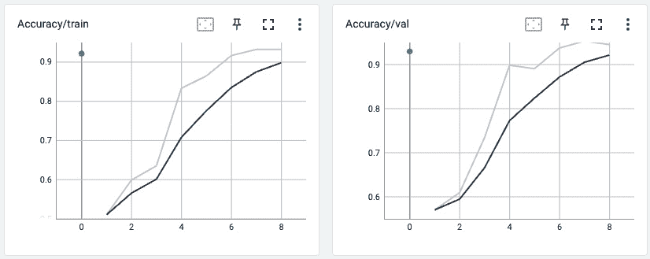
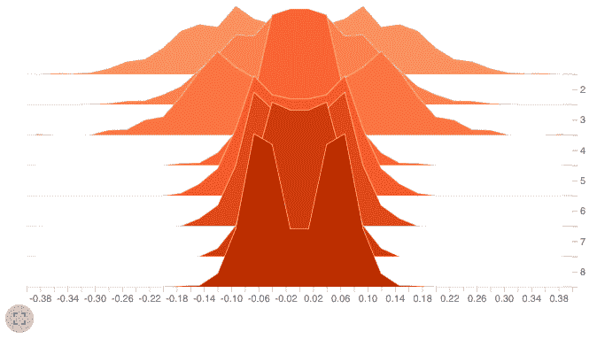
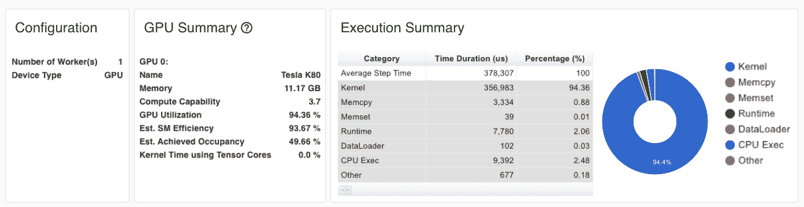
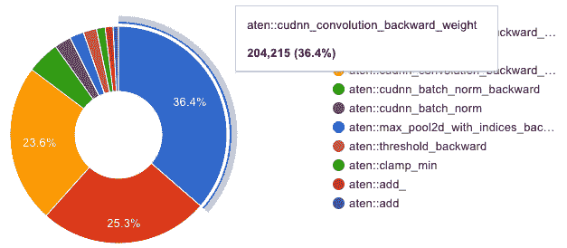
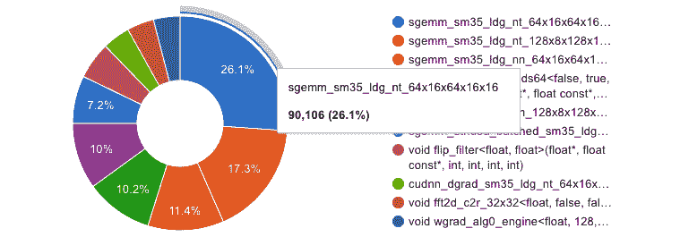
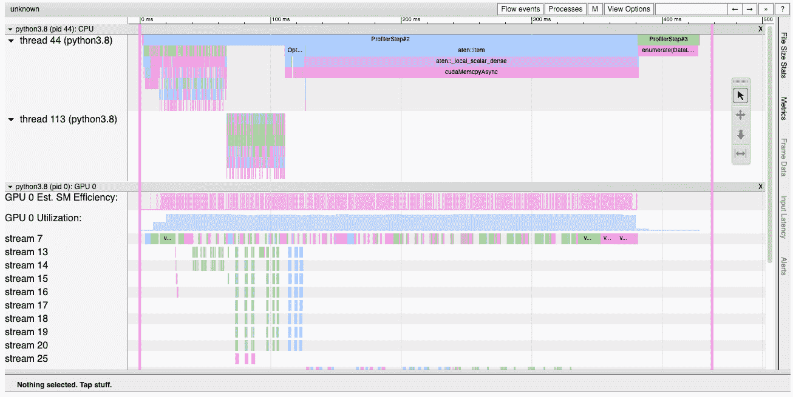
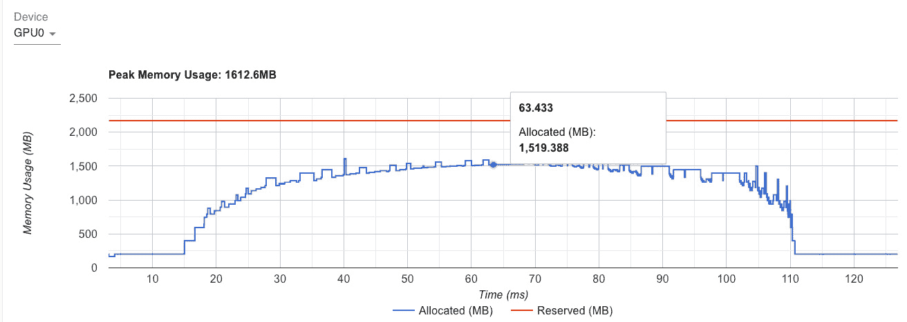
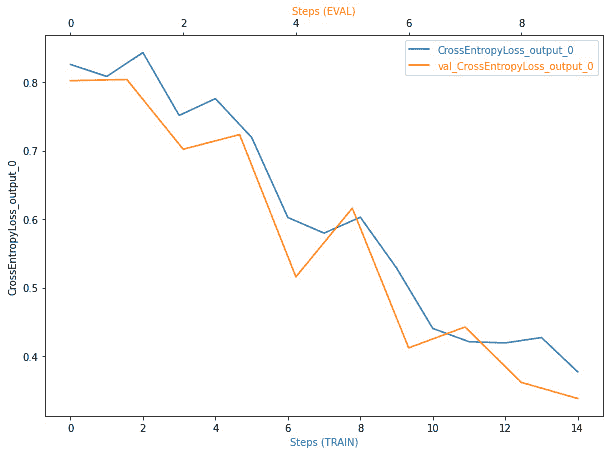
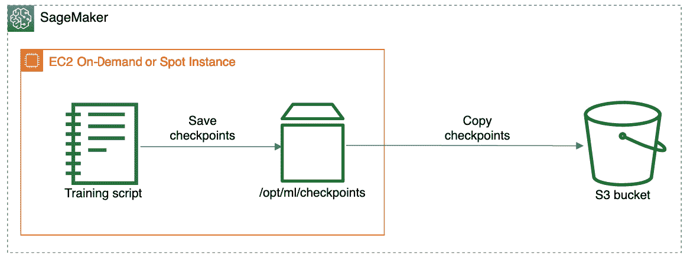
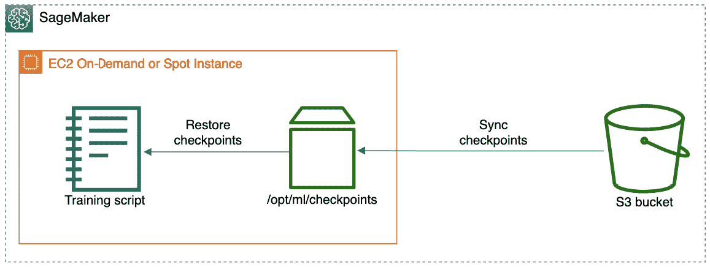

# 第七章：深度学习训练的运营化

在*第一章*《使用 Amazon SageMaker 介绍深度学习》中，我们讨论了 SageMaker 如何与 CloudWatch Logs 和 Metrics 集成，通过收集训练日志和指标来提供对训练过程的可视化。然而，**深度学习**（**DL**）训练作业容易遇到与模型架构和训练配置相关的多种特定问题。需要专门的工具来监控、检测和应对这些问题。由于许多训练作业需要在大量计算实例上运行数小时甚至数天，因此错误的成本非常高。

在运行深度学习训练作业时，你需要意识到两种类型的问题：

+   模型和训练配置的问题，阻碍了模型在训练过程中的高效学习。例如，梯度消失和爆炸、过拟合和欠拟合、损失未下降等问题。找出这些错误的过程被称为**调试**。

+   次优的模型和训练配置，未能充分利用可用的硬件资源。例如，假设批量大小小于最佳值，GPU 资源未得到充分利用，这导致训练速度比可能的速度慢。我们称这种找出问题的过程为**分析**。

在本章中，我们将回顾用于训练、调试和分析的开源工具和 SageMaker 功能。我们将从流行的开源训练监控和调试工具**TensorBoard**开始，回顾它如何与 SageMaker 的训练基础设施集成。然后，我们将其与专有的**SageMaker 调试器**进行对比，后者提供了先进的功能，帮助你自动检测各种问题，并相应地管理训练作业。你将获得使用这两种工具的实际经验。

在运营化深度学习模型时，你通常需要解决的另一类问题是建立一种高效的方法来寻找最佳的模型超参数组合。这个过程被称为**超参数调优**。它在模型开发和采用的初期阶段尤为重要，因为此时你需要建立一个可以投入生产的模型基线。SageMaker 提供了一种自动化的方式，通过**自动模型调优**功能来调节你的模型。

最后，我们将讨论如何通过使用**EC2 Spot 实例**来降低训练作业和模型调优作业的成本。

在本章中，我们将涵盖以下主题：

+   调试训练作业

+   分析你的深度学习训练

+   超参数优化

+   使用 EC2 Spot 实例

阅读本章后，你将能够为大规模深度学习训练建立分析和调试程序，从而最小化不必要的成本和训练时间。你还将学会如何组织超参数调优，并利用 Spot 实例优化成本。

# 技术要求

在本章中，我们将提供代码示例，以便你能够培养实际技能。完整的代码示例可以在这里找到：[`github.com/PacktPublishing/Accelerate-Deep-Learning-Workloads-with-Amazon-SageMaker/blob/main/chapter7/`](https://github.com/PacktPublishing/Accelerate-Deep-Learning-Workloads-with-Amazon-SageMaker/blob/main/chapter7/)。

要跟随本代码进行操作，你将需要以下内容：

+   一个具有管理 Amazon SageMaker 资源权限的 AWS 账户和 IAM 用户。

+   配置一个 SageMaker 笔记本、SageMaker Studio 笔记本，或建立一个本地的 SageMaker 兼容环境。

+   你需要访问 AWS 账户中的 GPU 训练实例。本章中的每个示例都会提供推荐的实例类型。你可能需要增加 **SageMaker 训练作业** 的计算配额，以启用 GPU 实例。在这种情况下，请按照[`docs.aws.amazon.com/sagemaker/latest/dg/regions-quotas.xhtml`](https://docs.aws.amazon.com/sagemaker/latest/dg/regions-quotas.xhtml)中的说明操作。

+   你必须通过运行`pip install -r requirements.txt`来安装所需的 Python 库。包含所需库的文件位于 `chapter7` 目录的根目录下。

# 调试训练任务

为了有效地监控和调试深度学习训练任务，我们需要访问以下信息：

+   标量值，如准确率和损失，用于衡量训练过程的质量

+   张量值，如权重、偏差和梯度，代表模型及其优化器的内部状态

TensorBoard 和 SageMaker Debugger 都允许你收集张量和标量，因此两者都可以用于调试模型和训练过程。然而，不同于主要用于训练可视化的 TensorBoard，SageMaker Debugger 提供了几乎实时响应模型状态变化的功能。例如，如果训练损失在一段时间内没有下降，它可以让我们提前停止训练任务。

在本节中，我们将深入探讨如何使用 TensorBoard 和 SageMaker Debugger。我们将详细回顾这两种解决方案的功能，然后开发使用这两种解决方案调试训练脚本的实际经验。

请注意，我们将在调试和性能分析任务中使用相同的示例。

## 在 SageMaker 中使用 TensorBoard

TensorBoard 是一个最初为 TensorFlow 框架开发的开源工具，但现在也支持其他深度学习框架，包括 PyTorch。TensorBoard 支持以下功能，用于可视化和检查训练过程：

+   随时间追踪标量值（损失、准确率等）。

+   捕获张量，如权重、偏差和梯度，以及它们随时间变化的情况。这对于可视化权重和偏差并验证它们是否按预期变化非常有用。

+   通过超参数仪表板进行实验追踪。

+   将高维嵌入投影到低维空间。

+   捕获图像、音频和文本数据。

此外，TensorBoard 还提供了针对 TensorFlow 程序的本地性能分析功能。通过附加组件，PyTorch 也支持性能分析。

### 调试 PyTorch 训练

让我们回顾一下 TensorBoard 如何帮助你深入了解训练过程，并通过实际示例调试它。我们将使用来自 PyTorch 模型库的预训练 ResNet 模型，并训练它识别两种类别：蜜蜂和蚂蚁。

我们在本节中提供了代码亮点。完整的训练代码可以在这里查看：[`github.com/PacktPublishing/Accelerate-Deep-Learning-Workloads-with-Amazon-SageMaker/blob/main/chapter7/1_TensorBoard_PyTorch.ipynb`](https://github.com/PacktPublishing/Accelerate-Deep-Learning-Workloads-with-Amazon-SageMaker/blob/main/chapter7/1_TensorBoard_PyTorch.ipynb)。

#### 修改训练脚本

要使用 TensorBoard，我们只需对训练脚本做最小的修改。请按照以下步骤操作：

1.  首先，我们必须导入并初始化 TensorBoard 的 `SummaryWriter` 对象。在这里，我们使用 S3 位置来写入 TensorBoard 汇总：

    ```py
    from torch.utils.tensorboard import SummaryWriter
    tb_writer = SummaryWriter(args.tb_s3_url)
    ```

1.  接下来，我们必须捕获一些在训练过程中不会改变的训练文物——在我们这个案例中是模型图。请注意，我们需要在样本数据上执行模型的前向传播才能做到这一点：

    ```py
    sample_inputs, _ = next(iter(dataloaders_dict["val"]))
    tb_writer.add_graph(model, sample_inputs, verbose=False, use_strict_trace=False)
    ```

1.  在我们的训练循环中，我们捕获了我们希望检查的标量和张量。我们使用 epoch 编号作为时间维度。假设在我们这个案例中，我们希望捕获以下数据：

    +   每个 epoch 对于训练集和验证集的准确率和损失变化

    +   在训练阶段，第一个卷积层和最后一个全连接层的梯度和权重分布

    +   训练超参数以及它们对性能的影响

为了捕获这些参数，我们必须在训练循环中添加以下代码：

```py
tb_writer.add_histogram("conv1.weight", model.conv1.weight, epoch)
tb_writer.add_histogram("conv1.weight_grad", model.conv1.weight.grad, epoch)
tb_writer.add_histogram("fc.weight", model.fc.weight, epoch)
tb_writer.add_histogram("fc.weight_grad", model.fc.weight.grad, epoch)
tb_writer.add_scalar(f"Loss/{phase}", epoch_loss, epoch)
tb_writer.add_scalar(f"Accuracy/{phase}", epoch_accuracy, epoch)
tb_writer.add_hparams(hparam_dict=vars(args), metric_dict={
                    f"hparam/loss_{phase}": epoch_loss,
                    f"hparam/accuracy_{phase}": epoch_accuracy})
```

现在，让我们回顾一下启用了调试的训练任务配置。

#### 监控训练过程

要启动 SageMaker 训练任务，我们需要提供 TensorBoard 汇总文件将写入的 S3 位置。我们可以通过设置 `tb-s3-url` 超参数来实现，如下所示：

```py
instance_type = 'ml.p2.xlarge'
instance_count = 1
job_name = "pytorch-tb-profiling-12"
tb_debug_path = f"s3://{bucket}/tensorboard/{job_name}"
estimator = PyTorch(
          entry_point="train_resnet_tb.py",
          source_dir='1_sources',
          role=role,
          instance_type=instance_type,
          sagemaker_session=sagemaker_session,
          image_uri="763104351884.dkr.ecr.us-east-1.amazonaws.com/pytorch-training:1.10.2-gpu-py38-cu113-ubuntu20.04-sagemaker",
          instance_count=instance_count,
          hyperparameters={
              "batch-size":64,
              "num-epochs":10,
              "input-size" : 224,
              "feature-extract":False,
              "tb-s3-url": tb_debug_path,
              "num-data-workers": 4
          },
          disable_profiler=True,
          debugger_hook_config=False,
          base_job_name=job_name,
      )
```

训练任务开始后，你可以通过在终端中运行以下命令，启动本地的 TensorBoard：

```py
tensorboard --logdir ${tb_debug_path} 
```

在云开发环境中使用 TensorBoard 时，请注意以下事项：

+   如果你使用的是 SageMaker Notebook 实例，则可以通过以下地址访问 TensorBoard：`https://YOUR_NOTEBOOK_DOMAIN/proxy/6006/`

+   如果你使用的是 SageMaker Studio，则可以通过以下地址访问 TensorBoard：`https://<YOUR_STUDIO_DOMAIN>/jupyter/default/proxy/6006/`

随着训练任务的进展，TensorBoard 数据将实时更新。让我们在 TensorBoard 中回顾我们的训练过程：

+   在**标量（Scalar）**和**时间序列（Time Series）**标签页中，您可以看到标量值随时间变化的情况。我们使用 epoch 索引作为时间的指示器。*图 7.1* 显示了每个 epoch 的训练和验证准确率：



图 7.1 – TensorBoard 中随时间变化的准确率

+   在**图形（Graph）**标签页中，您可以看到模型的可视化表示，以及数据从输入到输出的流动方式。

+   `0`，表示我们的模型正在学习，因此绝对梯度值在下降：



图 7.2 – TensorBoard 中模型权重的直方图

+   **HParam** 标签页使我们能够并排捕捉和比较超参数。这对于在超参数搜索过程中跟踪实验，识别最优的模型和训练任务配置非常有用。

现在我们已经理解了如何使用 TensorBoard 可视化训练过程，让我们来看看如何使用 TensorBoard 对训练任务进行性能分析。

### 性能分析 PyTorch 训练

TensorBoard 为 TensorFlow 程序（包括 Keras）提供了开箱即用的性能分析功能。要在 TensorBoard 中对 PyTorch 程序进行性能分析，您可以使用开源的**torch_tb_profiler**插件。

在进行训练过程的性能分析时，我们通常关心以下几个方面：

+   我们如何高效地利用资源（GPU 和 CPU）随时间变化的情况

+   哪些操作（深度学习运算符、数据加载、内存传输等）使用了哪些资源

+   在分布式训练的情况下，节点与各个训练设备之间的通信效率如何

+   如何提高整体资源利用率并提高训练效率

TensorFlow 和 PyTorch 插件都为 TensorBoard 提供了性能分析的功能。让我们回顾一下性能分析是如何与调试任务一起工作的。

#### 修改训练脚本

要使用 `torch_tb_profiler` 对应用程序进行性能分析，我们需要对训练代码进行最小的修改。具体来说，我们需要用插件上下文管理器包裹训练循环，如下代码块所示：

```py
with torch.profiler.profile(
    schedule=torch.profiler.schedule(wait=1, warmup=1, active=3, repeat=5),
    on_trace_ready=torch.profiler.tensorboard_trace_handler(
        os.path.join(os.environ["SM_OUTPUT_DATA_DIR"], "tb_profiler")
    ),
    record_shapes=True,
    profile_memory=True,
    with_stack=True,
) as prof:
    for _, (inputs, labels) in enumerate(dataloaders[phase]):
      # The rest of training loop without changes
```

初始化时传递给上下文管理器的参数定义了必须收集哪些性能分析数据以及在什么时间间隔收集。在写这本书时，`torch_db_profiler` 插件不支持写入 S3 位置。因此，我们必须将性能分析数据写入存储在 `"SM_OUTPUT_DATA_DIR"` 环境变量中的本地输出目录。训练完成后，SageMaker 会自动将该目录的内容归档并存储到 S3 位置。

#### 使用 TensorBoard Profiler

为了查看 TensorBoard Profiler 的输出，我们需要将数据下载到本地环境中：

1.  我们将从获取性能分析数据的路径开始。为此，我们可以使用训练任务估算器实例：

    ```py
    tb_profiler_path = f"{estimator.latest_training_job.describe()['OutputDataConfig']['S3OutputPath']}{estimator.latest_training_job.describe()['TrainingJobName']}/output/output.tar.gz"
    ```

1.  然后，在你的笔记本或终端窗口中，你可以运行以下命令来解压分析器数据并启动 TensorBoard：

    ```py
    aws s3 cp ${ tb_profiler_path} .
    mkdir profiler_output
    tar -xf output.tar.gz -C profiler_output
    tensorboard --logdir ./profiler_output
    ```

启动 TensorBoard 后，你应该会自动跳转到分析器摘要页面。在这里，你可以访问几个包含分析信息的视图：

+   **Overview** 标签页提供了用于训练的设备（设备）的概览，展示了它们的时间利用率和操作的拆解。例如，在我们的案例中，大部分时间都花费在执行包括前向和反向模型传递的内核上。这通常是我们在训练模型时充分利用 GPU 资源的一个良好指标：



图 7.3 – TensorBoard Profiler 的 Overview 标签页

+   **Operators** 标签页让你了解特定操作符（如卷积或批量归一化）消耗了多少时间。在下图中，我们可以看到，例如，卷积层的反向传递占用了大部分 GPU 时间：



图 7.4 – TensorBoard Profiler 的 Operators 标签页

+   **Kernel** 标签页显示了在特定 GPU 核心上执行的时间。比如在下图中，你可以看到各种 **单精度通用矩阵乘法**（**SGEMM**）内核占用了大部分时间：



图 7.5 – TensorBoard Profiler 的 Kernel 标签页

+   **Trace** 标签页显示了分析的操作符和 GPU 内核的时间线，以及 CPU 和 GPU 设备之间的交接（例如，将数据输入从 CPU 转移到 GPU）：



图 7.6 – TensorBoard Profiler 的 Trace 标签页

+   **Memory** 标签页提供了给定设备的内存利用情况。在下图中，你可以看到分配的内存（即用于存储张量的内存）和总保留内存：



图 7.7 – TensorBoard Profiler 的 Memory 标签页

如你所见，TensorBoard 是一个非常适合用于监控、调试和分析训练脚本的工具。当与插件一起使用时，TensorBoard 支持 TensorFlow 和 PyTorch 框架。然而，TensorBoard 的一个缺点是，它没有提供任何方式来响应不理想的情况，比如 GPU 设备未充分利用，或模型在训练过程中出现收敛缓慢或无收敛的情况。为了在这种情况下提前停止训练作业，你需要通过回调和自定义逻辑进一步对代码进行工具化。

SageMaker Debugger 通过提供一种通用机制来检测常见的训练问题并采取缓解措施，解决了这些局限性。

## 使用 SageMaker Debugger 监控训练

SageMaker Debugger 是一个全面的 SageMaker 功能，允许你自动监控、调试和分析运行在 SageMaker 上的深度学习训练任务。SageMaker Debugger 通过捕捉训练循环的内部状态和实例指标，提供近实时的深度学习训练洞察。Debugger 还可以帮助你自动检测训练过程中常见问题，并在发现问题时采取适当的行动。这使得你能够在复杂的深度学习训练任务中更早地发现问题，并作出相应反应。此外，SageMaker Debugger 还支持编写自定义规则，以应对内置规则未涵盖的场景。

SageMaker 具有几个关键组件：

+   开源的`smedebug`库（https://github.com/awslabs/sagemaker-debugger），它与深度学习框架和 Linux 实例集成，将调试和分析数据持久化到 Amazon S3，并在训练任务启动后检索和分析数据

+   SageMaker Python SDK，允许你在训练脚本中通过最小的代码变更来配置`smedebug`库

+   自动化配置处理任务，以验证输出张量和分析数据是否符合规则

SageMaker Debugger 支持 TensorFlow、PyTorch 和 MXNet 深度学习框架。`smedebug`库默认安装在 SageMaker 深度学习容器中，因此你可以在不修改训练脚本的情况下开始使用 SageMaker Debugger。你还可以在自定义 Docker 容器中安装`smdebug`库，并使用 SageMaker Debugger 的所有功能。

注意

请注意，不同深度学习框架的`smedebug`API 可能会有细微的差异。

`smedebug`库提供了丰富的 API，用于配置、保存和分析捕获的张量。它通过在训练过程中注入`hook`对象来捕获张量和标量。`hook`允许你将张量和标量分组到逻辑张量`Trial`对象中，从而可以查询给定训练任务的存储张量进行进一步分析。你可以实时运行张量查询，而无需等待训练任务完全完成。SageMaker Debugger 还支持生成兼容 TensorBoard 的摘要日志，方便可视化输出张量和标量。

### 使用 SageMaker Debugger

让我们将这些概念应用于一个实际任务。我们将对 ResNet 模型进行工具化，并针对二分类任务进行微调。完整代码请查看此处：[`github.com/PacktPublishing/Accelerate-Deep-Learning-Workloads-with-Amazon-SageMaker/blob/main/chapter7/2_SMDebugger_PyTorch.ipynb`](https://github.com/PacktPublishing/Accelerate-Deep-Learning-Workloads-with-Amazon-SageMaker/blob/main/chapter7/2_SMDebugger_PyTorch.ipynb)。

### 代码工具化

`smedebug`库只需要最少的修改即可捕获张量和标量。首先，你需要在训练循环外部初始化`hook`对象，以及在模型和优化器初始化之后：

```py
...
model = initialize_resnet_model(
    NUM_CLASSES, feature_extract=False, use_pretrained=True
)
model.to(torch.device("cuda"))
optimizer = optim.SGD(params_to_update, lr=0.001, momentum=0.9)
criterion = nn.CrossEntropyLoss()
exp_lr_scheduler = lr_scheduler.StepLR(optimizer, step_size=7, gamma=0.1)
hook = smd.Hook.create_from_json_file()
hook.register_hook(model)
hook.register_loss(criterion)
...
```

请注意，我们正在使用 `.create_from_json_file()` 方法来创建我们的 `hook` 对象。此方法基于您在 SageMaker 训练对象中提供的 hook 配置实例化 `hook`。由于我们将 `model` 和 `criterion` 对象都添加到 `hook` 中，因此我们应该期望看到模型参数（权重、偏置等），以及损失标量。

在我们的训练循环中，我们唯一需要修改的地方是通过在 `smedebug.modes.Train` 和 `smedebug.modes.Eval` 之间切换来区分训练阶段和验证阶段。这将使得 `smedebug` 能够区分在训练和评估阶段捕获的张量：

```py
  for epoch in range(1, args.num_epochs + 1):
        for phase in ["train", "val"]:
            if phase == "train":
                model.train()  # Set model to training mode
                if hook:
                    hook.set_mode(modes.TRAIN)
            else:
                model.eval()  # Set model to evaluate mode
                if hook:
                    hook.set_mode(modes.EVAL)
            running_corrects = 0
            running_loss = 0.0
            step_counter = 0
            epoch_start = time.time()
            for _, (inputs, labels) in enumerate(
            dataloaders[phase]):
            # inside training loop
...
```

现在，让我们回顾一下在运行 SageMaker 训练任务时，如何配置 `hook`、规则、操作和张量集合。

#### 训练任务配置

作为 SageMaker Python SDK 的一部分，AWS 提供了 `sagemaker.debugger` 库用于 Debugger 配置。让我们来看看：

1.  我们将首先导入一些 Debugger 实体：

    ```py
    from sagemaker.debugger import (
        Rule,
        DebuggerHookConfig,
        TensorBoardOutputConfig,
        CollectionConfig,
        rule_configs,
        ProfilerRule
    )
    ```

1.  然后，我们必须定义自动化操作和一组规则。在这里，我们使用 Debugger 内置的规则来检测一些常见的深度学习训练问题。请注意，我们可以为不同的规则分配不同的操作。在我们的例子中，我们希望在触发规则时立即停止训练任务：

    ```py
    actions = rule_configs.ActionList(
        rule_configs.StopTraining())
    rules = [
        Rule.sagemaker(rule_configs.vanishing_gradient(), actions=actions),
        Rule.sagemaker(rule_configs.overfit(), actions=actions),
        Rule.sagemaker(rule_configs.overtraining(), actions=actions),
        Rule.sagemaker(rule_configs.poor_weight_initialization(), actions=actions),
    ]
    ```

1.  接下来，我们必须配置张量的收集以及它们的持久化方式。在这里，我们将定义要持久化权重和损失的集合。对于权重，我们还将保存一个可以在 TensorBoard 中进一步可视化的直方图。我们还将为训练和评估阶段设置保存间隔：

    ```py
    collection_configs=[
            CollectionConfig(
                name="weights",
                parameters={
                    "save_histogram": "True"
                    }
                ),
            CollectionConfig(name="losses"),
        ]
    hook_config = DebuggerHookConfig(
        hook_parameters={"train.save_interval": "1", "eval.save_interval": "1"},
        collection_configs=collection_configs
    )
    ```

1.  现在，我们准备将这些对象传递给 SageMaker 的 `Estimator` 对象：

    ```py
    tb_debug_path = f"s3://{bucket}/tensorboard/{job_name}"
    tensorboard_output_config = TensorBoardOutputConfig(
        s3_output_path=tb_debug_path
    )
    debug_estimator = PyTorch(
              entry_point="train_resnet_sm.py",
              source_dir='2_sources',
              role=role,
              instance_type=instance_type,
              sagemaker_session=sagemaker_session,
              image_uri=image_uri,
              instance_count=instance_count,
              disable_profiler=True,
              rules=rules,
              debugger_hook_config=hook_config,
              tensorboard_output_config=tensorboard_output_config,
              base_job_name=job_name,
          )
    ```

现在，我们准备使用 `fit()` 方法开始训练任务。在下一节中，我们将学习如何检索和分析 SageMaker Debugger 输出。

#### 审查 Debugger 结果

SageMaker Debugger 提供了一个功能，可以从训练任务中检索和分析收集的张量，作为 `smedebug` 库的一部分。在接下来的步骤中，我们将介绍一些关键的 API：

1.  在下面的代码块中，我们使用保存张量的 S3 路径来创建一个新的 trial 对象：

    ```py
    import smdebug.pytorch as smd
    tensors_path = debug_estimator.latest_job_debugger_artifacts_path()
    trial = smd.create_trial(tensors_path)
    ```

1.  现在，让我们通过运行以下命令输出所有可用的张量：

    ```py
    print(f"Persisted tensors: {trial.tensor_names()}")
    ```

1.  您应该能够看到多个集合，其中包含许多张量，包括偏置、权重、损失和梯度。让我们访问具体的数值。运行以下命令将返回一组相关的标量值：

    ```py
    print(f"Loss values {trial.tensor('CrossEntropyLoss_output_0').values()}")
    ```

1.  使用一个简单的绘图函数（有关其实现，请参考源代码），我们可以可视化训练和评估阶段的损失。运行以下命令将生成一个 2D 损失图表。类似地，您可以访问和处理张量：

    ```py
    plot_tensor(trial, "CrossEntropyLoss_output_0")
    ```

下图可视化了训练和验证损失：



图 7.8 – 训练和验证损失

1.  现在，让我们回顾一下在训练过程中是否触发了任何规则：

    ```py
    for s in debug_estimator.latest_training_job.rule_job_summary():
        print(f"Rule: {s['RuleConfigurationName']}",
              f"status: {s['RuleEvaluationStatus']}")
    ```

这将输出所有已配置的规则；它们的状态如下：

```py
Rule: VanishingGradient, status: NoIssuesFound
Rule: Overfit, status: NoIssuesFound 
Rule: Overtraining, status: NoIssuesFound 
Rule: PoorWeightInitialization, status: NoIssuesFound
```

如我们所见，在我们的案例中，没有触发任何规则，工作已经完成。你可以尝试不同的规则设置。例如，你可以重置模型层中的某一层权重，这将触发`PoorWeightInitiailization`规则，进而导致训练过程被停止。

1.  最后，让我们使用 TensorBoard 对保存的张量进行可视化检查。为此，我们只需使用之前提供给`Estimator`对象的 S3 路径启动 TensorBoard：

    ```py
    ! tensorboard --logdir  {tb_debug_path}
    ```

你可以随意探索 TensorBoard。你应该会看到权重的直方图。

在本节中，我们回顾了 SageMaker Debugger 的关键功能，并学习了如何使用它们。你可能已经注意到 SageMaker Debugger 相比于 TensorBoard 的一些优势：

+   在为 SageMaker Debugger 进行代码仪器化时几乎无需任何额外工作

+   提供强大的 API 来处理和分析输出张量

+   大量内置规则和操作，支持创建自定义规则和操作

+   TensorBoard 功能开箱即用

通过这些功能，SageMaker Debugger 允许你提高训练工作的质量，加速实验，并减少不必要的成本。

此外，SageMaker Debugger 还提供了性能分析功能。我们接下来将回顾它们。

# 对你的深度学习训练进行性能分析

SageMaker Debugger 允许你从训练实例中收集各种类型的高级指标。一旦这些指标被收集，SageMaker 将生成详细的指标可视化，检测资源瓶颈，并提供如何提高实例利用率的建议。

SageMaker Debugger 收集两种类型的指标：

+   **系统指标**：这些是训练实例的资源利用率指标，如 CPU、GPU、网络和 I/O。

+   **框架指标**：这些指标是在深度学习框架级别收集的，包括原生框架分析器（如 PyTorch Profiler 或 TensorFlow Profiler）收集的指标、数据加载器指标和 Python 性能分析指标。

与调试相似，你可以定义一些规则，自动评估收集的指标。如果触发了某个规则，你可以定义一个或多个将采取的操作。例如，如果训练任务的 GPU 利用率低于某个阈值，你可以发送一封电子邮件。

现在是时候使用 SageMaker Debugger 对我们的训练代码进行性能分析了。你可以在 https://github.com/PacktPublishing/Accelerate-Deep-Learning-Workloads-with-Amazon-SageMaker/blob/main/chapter7/2_SMDebugger_PyTorch.ipynb 中的*Profiling DL Training*部分找到完整的代码。

### 配置训练任务以进行性能分析

我们将首先定义要收集的系统和框架指标。例如，我们可以为框架、数据加载器和 Python 提供自定义配置。请注意，系统性能分析默认是启用的：

```py
from sagemaker.debugger import (ProfilerConfig, 
                                FrameworkProfile, 
                                DetailedProfilingConfig, 
                                DataloaderProfilingConfig, 
                                PythonProfilingConfig,
                                PythonProfiler, cProfileTimer)
profiler_config=ProfilerConfig(
    system_monitor_interval_millis=500,
    framework_profile_params=FrameworkProfile(
        detailed_profiling_config=DetailedProfilingConfig(
            start_step=2, 
            num_steps=1),
        dataloader_profiling_config=DataloaderProfilingConfig(
            start_step=2, 
            num_steps=1),
        python_profiling_config=PythonProfilingConfig(
            start_step=2, 
            num_steps=1, 
            python_profiler=PythonProfiler.CPROFILE, 
            cprofile_timer=cProfileTimer.TOTAL_TIME)))
```

然后，我们必须将分析配置提供给 SageMaker 训练作业配置：

```py
profiler_estimator = PyTorch(
          entry_point="train_resnet_sm.py",
          source_dir='2_sources',
          role=role,
          instance_type='ml.p2.xlarge',
          sagemaker_session=sagemaker_session,
          image_uri=image_uri,
          instance_count=instance_count,
          hyperparameters={
              "num-data-workers":8,
          },
          disable_profiler=False,
          profiler_config=profiler_config,
          rules=rules,
        #  debugger_hook_config=hook_config,
        #  tensorboard_output_config=tensorboard_output_config,
          base_job_name=job_name,
      )
```

请注意，我们将 `num-data-workers` 设置为 `8`，而 `ml.p2.xlarge` 只有 4 个 CPU 核心。通常建议数据工作者的数量与 CPU 数量相等。让我们看看 SageMaker Debugger 是否能够检测到这个次优配置。

#### 审查分析结果

您可以开始实时监控分析结果。我们将使用 `semdebug.profiler` API 处理分析输出：

```py
training_job_name = profiler_estimator.latest_training_job.job_name
region = "us-east-1"
tj = TrainingJob(training_job_name, region)
tj.wait_for_sys_profiling_data_to_be_available()
```

一旦数据可用，我们可以提取并可视化它。运行以下代码将绘制来自系统指标的 CPU、GPU 和 GPU 内存利用率图：

```py
from smdebug.profiler.analysis.notebook_utils.timeline_charts import TimelineCharts
system_metrics_reader = tj.get_systems_metrics_reader()
system_metrics_reader.refresh_event_file_list()
view_timeline_charts = TimelineCharts(
    system_metrics_reader,
    framework_metrics_reader=None,
    select_dimensions=["CPU", "GPU"],
    select_events=["total"],
)
```

同样，您也可以可视化其他收集的指标。SageMaker Debugger 还会生成一份详细的分析报告，将所有可视化内容、见解和建议集中在一个地方。一旦您的训练作业完成，您可以通过在终端运行以下命令下载分析报告和所有收集的数据：

```py
aws s3 cp s3://<JOB_BUCKET>/<JOB_NAME>/rule-output ./ --recursive
```

一旦所有资产都已下载，请在浏览器中打开 `profiler-report.xhtml` 文件，并查看生成的信息。或者，您也可以打开 `profiler-report.ipynb`，它以可执行的 Jupyter notebook 形式提供相同的见解。

报告涵盖以下方面：

+   系统使用统计信息

+   框架指标总结

+   规则及其状态总结

+   训练循环分析和优化建议

请注意，在 *数据加载分析* 部分，您应该看到根据我们的预期减少数据工作者数量的建议。

如您所见，SageMaker Debugger 提供了广泛的分析功能，包括建议改善和自动化规则验证，且开发工作量最小。与其他 Debugger 功能类似，只要使用内置规则，分析是免费的。

# 超参数优化

SageMaker 自动模型调优作业允许您并行运行多个训练作业，每个作业使用唯一的超参数组合。换句话说，一个调优作业会创建多个 SageMaker 训练作业。超参数调优通过并行尝试多个超参数组合并迭代地朝着更优的组合前进，可以加速模型开发和优化。然而，它并不保证您的模型性能总是会提高。例如，如果所选的模型架构不适合当前任务，或者您的数据集对于所选模型来说太小，那么在进行超参数优化时，您不太可能看到任何改进。

在设计调优作业时，您需要考虑几个关键参数，如下所示：

+   **搜索算法**（或 **策略**）：这定义了 SageMaker 如何选择下一个超参数组合。

+   **具有范围的超参数**：SageMaker 搜索算法将在用户定义的范围内选择超参数值。

+   **目标指标**：这将用于比较一组超参数并定义最佳候选值。SageMaker 不限制你选择任何任意的目标指标。

SageMaker 支持两种搜索策略：**贝叶斯**和**随机**。随机搜索在定义的范围内随机选择下一组超参数。尽管这是一种简单的策略，但被认为是相对高效的。因为下一组超参数的选择不依赖于之前尝试过的或当前运行的组合，所以你可以同时运行大量的训练作业。贝叶斯搜索则是基于之前训练作业的结果来选择下一组超参数。在后台，SageMaker 为此训练了一个回归模型，该模型将之前作业的结果作为输入（超参数及其对应的目标指标），并输出候选的超参数组合。需要注意的是，贝叶斯模型可能不会收敛。在这种情况下，回顾已确定的超参数范围是有意义的。

选择超参数及其范围对调优作业的性能有显著影响。SageMaker 支持几种类型的超参数——分类的、连续的和整数型的。你可以组合不同类型的超参数。例如，以下代码将模型架构定义为分类超参数，学习率调度步长定义为整数型参数，而学习率定义为连续型参数（换句话说，浮动类型）：

```py
hyperparameter_ranges = {
"model_type" : sagemaker.tuner.CategoricalParameter(["resnet", "vgg16", "densenet"]}]),
"learning_rate" : sagemaker.tuner.ContinuousParameter(0.0001,0.1, scaling_type="Logarithmic"),
"lr_scheduler_step_size" : sagemaker.tuner.IntegerParameter(10,100, scaling_type="Linear"),
}
```

请注意，对于数值型超参数，我们还为学习率参数定义了“对数”缩放类型，因为它的范围跨越了多个数量级。对于调度步长，我们选择了“线性”缩放类型，因为它的范围较窄。

你还需要为超参数调优作业定义目标指标。目标指标的定义类似于其他指标，通过正则表达式模式定义。请注意，你需要确保训练脚本将目标指标输出到 `stdout/stderr` 流中。请按以下步骤操作：

1.  在以下代码中，我们定义了四个指标，这些指标将由 SageMaker 捕获，然后选择 `val_accuracy` 作为我们要优化的目标指标：

    ```py
    metric_definitions = [
        {"Name": "train_loss",
         "Regex": "Train Loss = (.*?);"},
        {"Name": "val_loss",
         "Regex": "Val Loss=(.*?);"},
        {"Name": "train_accuracy",
         "Regex": "Train Accuracy = (.*?);"},
        {"Name": "val_accuracy",
         "Regex": "Val Accuracy = (.*?);"},]
    objective_metric_name = "val_accuracy"
    ```

1.  接下来，我们需要定义训练作业的参数。请注意，作为训练作业配置一部分提供的超参数将是静态的，并且在调优作业中不会发生变化：

    ```py
    estimator = PyTorch(
              entry_point="train_script.py",
              role=role,
              instance_type=instance_type,
              sagemaker_session=sagemaker_session,
              image_uri=image_uri,
              instance_count=instance_count,
              hyperparameters={
                  "batch-size":64,
                  "num-epochs":5,
              })
    ```

1.  然后，我们必须在 `HyperParameterTuner` 对象中结合我们的目标指标、指标定义和超参数范围，该对象将协调创建子训练作业并跟踪调优的整体状态。此外，我们还必须提供训练作业的最大总数和并发训练作业的数量。这些参数将影响调优作业的运行速度和总成本：

    ```py
    tuner = sagemaker.tuner.HyperparameterTuner(
         estimator,
         objective_metric_name,
         hyperparameter_ranges,
         metric_definitions,
         objective_type="Maximize",
         max_jobs=200,
         max_parallel_jobs=10)
    ```

此外，注意 `objective_type` 参数，它定义了调优作业是要最大化还是最小化目标指标。由于我们选择了 `accuracy` 作为目标指标，因此我们希望最大化它。

1.  一旦调优对象被实例化，您可以使用 `.fit()` 方法开始训练：

    ```py
    tuner.fit({"train":train_data_location, "val":val_data_location})
    ```

1.  作业完成后，您可以分析调优作业的结果。为此，您可以导航到 AWS 控制台并进行可视化检查。或者，您可以将调优作业结果和统计数据导出为 pandas DataFrame 以进行进一步分析，如下所示：

    ```py
    tuner = sagemaker.HyperparameterTuningJobAnalytics(tuning_job_name)
    tuner_results = tuner.dataframe()
    ```

使用此方法，您可以执行更高级的分析，例如定义各种超参数与目标指标之间的相关性。例如，这种类型的分析可能揭示出需要修改超参数范围的情况，从而进一步提升目标指标。

# 使用 EC2 Spot 实例

运行大规模的训练和模型调优作业可能非常昂贵。最小化成本的一种方法是使用来自选定 AWS 区域的未使用计算资源池中的 EC2 Spot 实例。因此，Spot 实例比常规按需实例便宜得多（最高可达 90%）。然而，如果所选实例类型在给定 AWS 区域的 Spot 容量耗尽，Spot 实例可能会被随时停止。

SageMaker 简化了为训练作业提供 Spot 实例的过程，并在 Spot 容量再次可用时完全处理中断和训练作业重启。当训练作业被中断并重新启动时，我们希望继续训练过程，而不是从头开始。为了支持这一点，您的训练脚本需要进行修改，以便能够保存并重新启动训练作业。

为了支持 Spot 训练，您的训练脚本需要以下修改：

+   当首次加载模型时，检查 `/opt/ml/checkpoints` 路径中是否已有模型副本。如果检查点模型已存在，说明我们之前训练过此模型。要继续训练，我们需要加载检查点模型并继续训练。如果检查点模型不存在，则继续常规的模型加载：



图 7.9 – 将检查点工件上传到 S3 存储

+   在你的训练脚本中，你需要指定检查点处理程序（请参考深度学习框架的文档），并将模型检查点存储在指定的目录中——即 `/opt/ml/checkpoints`。如果 Spot 实例被中断，SageMaker 将自动将该目录的内容复制到 S3。Spot 实例恢复可用后，SageMaker 会从 S3 将检查点复制回 `/opt/ml/checkpoints` 目录：



图 7.10 – 从 S3 存储恢复检查点文件

在使用 Spot 实例时，请注意，使用 Spot 训练可能会导致训练时间变长且不可预测。每次 Spot 实例中断都会导致重启时额外的启动时间。可用的 Spot 容量取决于实例类型和 AWS 区域。在某些 AWS 区域，基于 GPU 的实例类型可能具有非常有限的 Spot 容量。请注意，Spot 容量会不断波动。你可以使用**Amazon Spot 实例顾问**功能，来确定不同 EC2 实例的可用 Spot 容量、中断的可能性以及与常规按需实例相比的成本节省。

# 总结

本章总结了本书的*第二部分*。在本章及前两章中，我们讨论了如何构建和优化大规模训练作业。首先，我们回顾了可用于深度学习训练的专业硬件，并介绍了如何选择最优的实例类型。接着，我们讨论了如何使用开源解决方案和 Amazon 专有解决方案来进行分布式训练。在本章中，我们讨论了如何高效地将模型训练操作化。我们回顾了训练过程中可能遇到的不同问题，以及如何检测和缓解这些问题。我们还讨论了如何管理和优化超参数调优。

在*第三部分*，*提供深度学习模型服务*中，我们将深入探讨在 Amazon SageMaker 上进行深度学习推理的过程。我们将讨论可用于推理的硬件，以及如何设计你的推理服务器。然后，我们将回顾模型服务的操作方面。在下一章，*第八章*，*考虑推理硬件*中，我们将回顾适用于推理工作负载的硬件加速器，讨论选择标准，并解释如何使用模型编译器和 SageMaker Neo 对你的模型进行优化，以便在特定硬件加速器上进行推理。

# 第三部分：提供深度学习模型服务

在本章中，我们将重点讨论如何在 Amazon SageMaker 上托管训练好的模型。我们将回顾可用的软件和硬件选项，并提供选择建议以及何时使用它们的指导。

本节包含以下章节：

+   *第八章*，*考虑推理硬件*

+   *第九章*，*实现模型服务器*

+   *第十章*，*操作化推理工作负载*
