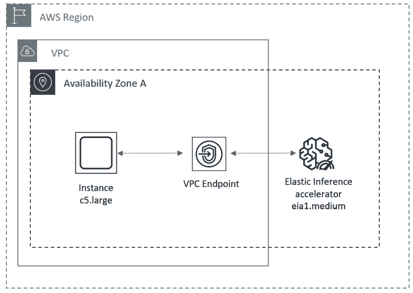
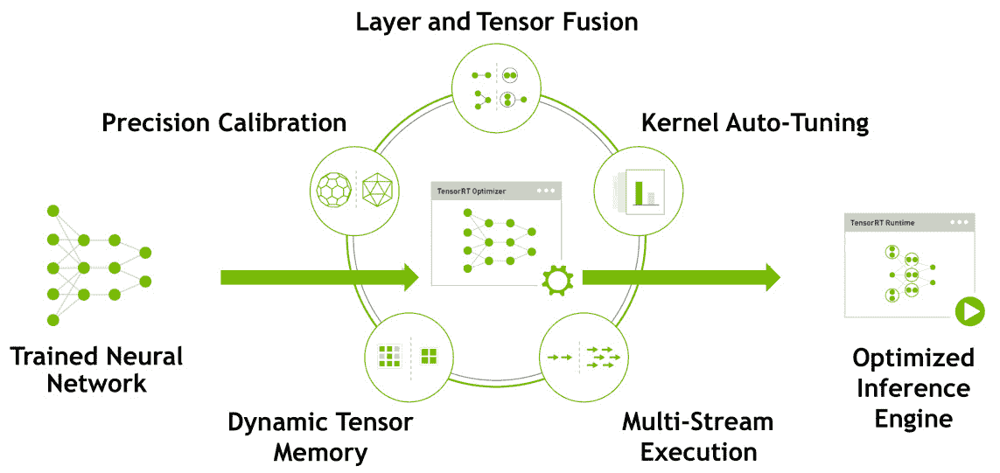
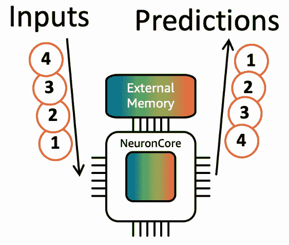
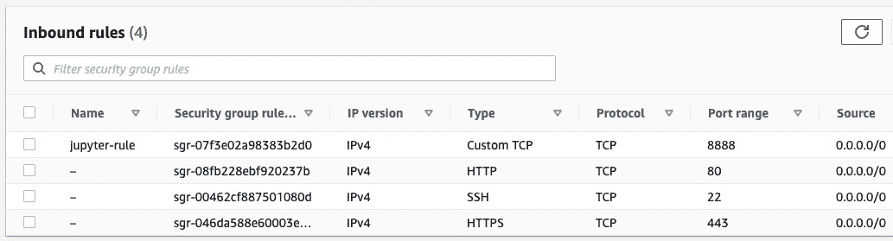
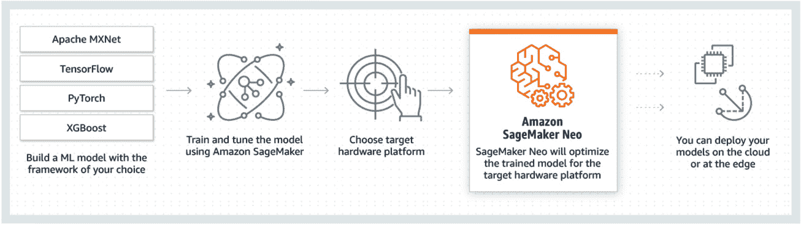

# 第八章：考虑用于推理的硬件

在本书的*第三部分，深度学习模型的服务*中，我们将重点讨论如何开发、优化和将推理工作负载实现生产化，适用于**深度学习**（**DL**）模型。与训练类似，DL 推理是计算密集型的，且需要理解特定类型的硬件，这些硬件专为推理设计，此外还需要掌握模型优化技术，以及专门的软件服务器来管理模型部署并处理推理流量。Amazon SageMaker 提供了广泛的功能来解决这些方面的问题。

在本章中，我们将讨论模型服务的硬件选项和模型优化。我们将回顾适用于 DL 推理的可用硬件加速器，并讨论如何选择其中之一。Amazon SageMaker 提供了多种 NVIDIA GPU 加速器和专为 DL 推理设计的专有芯片——**AWS Inferentia**。SageMaker 还允许您使用其 **Elastic Inference** 功能访问加速器容量。由于每个推理用例都是独特的，并且有其特定的业务需求，我们将提出一套选择标准，供您在评估最适合推理的硬件加速器时参考。

在构建 DL 推理工作负载时，另一个重要的方面是理解如何针对目标硬件加速器优化特定的模型架构。这一过程被称为模型编译。我们将回顾流行的优化器和运行时环境——NVIDIA **TensorRT**，它为在 NVIDIA GPU 加速器上运行的模型提供最佳的延迟和吞吐量。接着，我们将讨论 **Neuron SDK**，它优化模型以便在 AWS Inferentia 芯片上运行。我们还将讨论 **SageMaker Neo**——一种托管的模型编译服务，允许您为各种数据中心和边缘硬件加速器编译模型。请注意，本书不涉及任何边缘或嵌入式平台。

在本章中，我们将讨论以下主题：

+   在 AWS 云中选择硬件加速器

+   为推理编译模型

阅读完本章后，您将能够为您的推理工作负载选择一种高效的硬件配置，具有最佳的价格/性能特性，并进行进一步的优化。

# 技术要求

在本章中，我们将提供代码示例，帮助您培养实际技能。完整的代码示例可以在此处查看：[`github.com/PacktPublishing/Accelerate-Deep-Learning-Workloads-with-Amazon-SageMaker/blob/main/chapter8/`](https://github.com/PacktPublishing/Accelerate-Deep-Learning-Workloads-with-Amazon-SageMaker/blob/main/chapter8/)。

要跟随此代码，您需要以下内容：

+   一个 AWS 账户和具有管理 Amazon SageMaker 资源权限的 IAM 用户。

+   已建立 SageMaker 笔记本、SageMaker Studio 笔记本或本地兼容 SageMaker 的环境。

+   访问 AWS 账户中的 GPU 训练实例。本章中的每个示例将提供推荐的实例类型。你可能需要增加**SageMaker 训练作业**的计算配额，以启用 GPU 实例。在这种情况下，请按照[`docs.aws.amazon.com/sagemaker/latest/dg/regions-quotas.xhtml`](https://docs.aws.amazon.com/sagemaker/latest/dg/regions-quotas.xhtml)中的说明进行操作。

+   你必须通过运行`pip install -r requirements.txt`来安装所需的 Python 库。包含所需库的文件可以在`chapter8`目录中找到。

+   在本章中，我们将提供编译模型以进行推理的示例，这需要访问特定的加速器类型。如果你打算跟随这些代码示例，请准备好具有目标加速器的 SageMaker 笔记本实例或 SageMaker Studio 笔记本。

# 在 AWS Cloud 中选择硬件加速器

AWS Cloud 和 Amazon SageMaker 提供一系列适用于推理工作负载的硬件加速器。选择硬件平台通常需要通过多次实验，使用不同的加速器和服务参数进行测试。我们来看一些在评估过程中可能有用的关键选择标准。

## 延迟-吞吐量权衡

推理延迟定义了你的模型能多快地返回推理结果给最终用户，我们希望最小化延迟以改善用户体验。推理吞吐量定义了可以同时处理多少个推理请求，我们希望最大化吞吐量，以确保尽可能多的推理请求能够被处理。在软件工程中，通常会讨论延迟和吞吐量之间的权衡，因为通常很难同时最小化延迟并最大化吞吐量，因此你需要在这两个特性之间找到平衡。

在具体的使用案例中，通常会将目标延迟和吞吐量 SLA 作为业务需求的一部分。找到可接受的延迟和吞吐量的权衡需要通过与不同加速器以及模型/服务器参数进行基准测试，以符合目标 SLA。

例如，在运行实时推理端点时，通常关注的是延迟 SLA，因为它会直接影响到最终用户。你可以先找到延迟在目标 SLA 范围内的硬件和模型配置，然后再扩展以达到期望的吞吐量。在批量推理的情况下，整体系统吞吐量通常比延迟更为重要。我们希望最大化吞吐量，以确保我们的硬件资源得到有效利用。

## 成本

运行推理工作负载的成本是另一个重要参数，它会影响你使用的硬件以及延迟和吞吐量服务水平协议（SLA）。虽然 AWS 和 SageMaker 提供了市场上最强大的 GPU 加速器之一，但它们的成本对于你的特定用例可能过于高昂。因此，通常情况下，你可能需要调整延迟和吞吐量 SLA，以使你的深度学习推理应用在经济上可行。

## 支持的框架和操作符

运行推理工作负载需要大量的计算资源，因为它需要对单个或一批输入执行模型的前向传递。每次前向传递由一系列独立的计算任务组成。计算任务的一种类型被称为操作符。常见的深度学习操作符的例子包括矩阵乘法、卷积和平均池化。

深度学习框架支持的操作符始终可以在 CPU 设备上运行。然而，正如我们在 *第五章* 中讨论的，*考虑用于训练的硬件*，CPU 并不是最有效的深度学习加速器。因此，使用 CPU 运行推理会导致比使用 GPU 和 ASIC 芯片等专用加速器更高的延迟。

NVIDIA GPU 加速器通过 CUDA 工具包支持广泛的操作符。在某些情况下，你可能需要为你的特定模型架构实现新的操作符。CUDA 工具包为此类自定义操作符开发提供了编程 API。

AWS Inferentia 等 ASIC 加速器支持有限的操作符和框架列表。在某些操作符不受支持的情况下，该操作符将由 CPU 设备执行。这使得你可以在专用加速器上运行许多模型架构，但另一方面，它很可能会导致推理延迟增加，因为 CPU 执行的整体缓慢性以及在模型前向传递过程中 ASIC 和 CPU 加速器之间的必要数据传递。

因此，在选择目标硬件加速器时，你需要了解支持哪些深度学习框架和操作符。

在 *第五章* 中，*考虑用于深度学习训练的硬件*，我们概述了 Amazon SageMaker 平台上可用的深度学习硬件加速器。在接下来的部分，我们将重点介绍一些推荐用于推理工作负载的加速器和计算实例。

## G4 实例系列 – 具有最佳价格和性能比的推理选项

G4 实例配备了 NVIDIA T4 Tensor Core GPU，拥有 16 GB 的内存。这款加速器是 NVIDIA 为云计算和数据中心的推理任务设计的。它支持 FP32、FP16、INT8 和 INT4 精度类型。由于 G4 综合了与推理工作负载相关的性能特征，并且与更强大的 P3 系列相比成本更低，因此应该被视为运行深度学习推理工作负载的默认选项。

为了进一步优化性能，你可以使用 NVIDIA TensorRT 优化器编译你的模型。我们将在下一节详细讨论 TensorRT 优化器。

## P3 实例系列——适用于推理的高性能但昂贵

配备 NVIDIA V100 加速器的 P3 实例主要是为大规模训练设计的。与 G4 相比，P3 系列最多可提供 32 GB 的 GPU 内存和更大的网络带宽（包括 GPU 间和节点间的带宽）。P3 还支持 F64、FP32、FP16 和 INT8 精度类型。

P3 的许多特性非常适合大规模分布式训练，但对于推理则不太相关。例如，你很少需要使用双精度类型；相反，你希望在推理过程中降低精度，以减少延迟。更高的网络带宽（特别是节点间带宽）对于推理工作负载也不太相关，因为在推理时通常不需要将模型分布到不同节点上。

因此，虽然 P3 系列的性能优于 G4，但其成本更高，对于推理工作负载的好处很少。你可能想要选择 P3 而非 G4 的一种情况是，当你正在运行大模型的推理时。在这种情况下，`P3dn.24xlarge` 实例可以为你提供 8 个每个有 32 GB 内存的 V100 GPU。

重要提示

请注意，这里我们只考虑了作为 SageMaker 一部分提供的加速器。一些实例系列（如 G5 和 P4 系列）仅作为 Amazon EC2 服务的一部分提供。我们预计这些实例将在未来被 Amazon SageMaker 支持。

## AWS Inferentia

AWS Inferentia 是一个专门为深度学习推理工作负载设计的 ASIC 加速器。根据 AWS 的说法，它提供了云中最低的推理成本。每个 Inferentia 芯片由四个 NeuronCore 组成，它们是高性能的矩阵乘法引擎。NeuronCore 优化了小批量操作，以确保最低的推理延迟。Inferentia 支持 FP16、BF16 和 INT8 精度类型。`g4dn.xlarge` 替代方案的运行成本则低 70%。

要在 Inferentia 实例上运行推理，你需要使用 AWS Neuron SDK 编译模型（[`github.com/aws/aws-neuron-sdk/`](https://github.com/aws/aws-neuron-sdk/)）。Neuron SDK 支持 TensorFlow、PyTorch 和 MXNet 深度学习框架。我们将在下一节讨论使用 Neuron SDK 进行模型编译和优化。

AWS Inferentia 提供了一种高性能且具有成本效益的推理加速器。此外，你还可以使用 Neuron SDK 进一步优化模型。请注意，你需要考虑给定模型架构及其操作符是否被 Neuron SDK 支持。对于不受支持的操作符，它们将由 CPU 设备执行，这将导致额外的延迟。根据目标 SLA，可能可以接受，也可能无法接受。

## 亚马逊弹性推理

**弹性推理** (**EI**) 是一种功能，允许你将用户定义的加速器能力附加到常规的 CPU 实例上。EI 专为推理用例设计。加速器能力通过附加的网络接口提供。EI 支持 TensorFlow、MXNet 和 PyTorch 框架以及 ONNX 模型格式。要使用 EI，你需要将模型加载到专门为 EI 启用的深度学习框架版本中。这些修改后的深度学习框架会自动检测到 EI 加速器的存在，并通过网络接口执行操作。下图展示了这一点：



图 8.1 – 通过网络接口访问 EI GPU 能力

EI 提供多种加速器类型。你可以根据所需的加速器内存或预期的吞吐量（以 TFLOPS 为单位）选择合适的类型。EI 在实例配置方面提供了低成本和高灵活性。与配置受限的专用 GPU 实例不同，你可以将 CPU 实例和 EI 混合使用，以实现可接受的推理延迟和吞吐量，同时保持整体成本较低：

| 加速器类型 | FP32 吞吐量（TFLOPS） | FP16 吞吐量（TFLOPS） | 内存（GB） |
| --- | --- | --- | --- |
| eia2.medium | 1 | 8 | 2 |
| eia2.large | 2 | 16 | 4 |
| eia2.xlarge | 4 | 32 | 8 |

图 8.2 – EI 性能特性

在选择 EI 时，你需要牢记几个注意事项：

+   由于设计原因，EI 加速器通常会由于网络传输引入额外的延迟。对于具有复杂控制流的模型，EI 加速器可能表现不佳。

+   EI 启用的深度学习框架远远落后于最新的开源版本。此外，在 EI 上运行最新的模型架构时，你可能会遇到兼容性问题。

+   EI 提供的 GPU 内存相对较低（与最新一代 GPU 实例相比），这可能限制你在其上运行的模型类型。

与 GPU 实例和 Inferentia 一样，EI 支持模型编译和优化。你可以使用 SageMaker Neo 优化器任务来优化 TensorFlow 模型，该任务使用 **TF-TRT** 库进行 TensorRT 优化。优化后的模型通常具有更好的延迟-吞吐量特性，但在推理时可能会占用大量 GPU 内存，这可能会导致 **内存溢出** (**OOM**) 问题。

当选择深度学习加速器时，EI 是一个有用的选项，特别是当你在寻找一个高度灵活且具有成本效益的解决方案，并且运行较为紧凑且需求较低的模型架构时。然而，如果你正在寻找高性能的推理处理，尤其是对高要求模型的推理，应该优先考虑 Inferentia 和 G4 实例。

# 为推理编译模型

为了在给定的加速器硬件上实现最佳推理性能，你通常需要为该加速器编译模型。编译过程包括各种计算优化，例如层和张量融合、精度校准，以及丢弃未使用的参数。

在本节中，我们将回顾为之前讨论的推理加速器执行编译的优化器：NVIDIA TensorRT（用于 NVIDIA GPU 加速器）和 Neuron SDK 编译器（用于 AWS Inferentia）。之后，我们将回顾一种名为 SageMaker Neo 的托管编译服务，它支持多种云和边缘硬件加速器。

我们将从查看用于 NVIDIA GPU 加速器的 TensorRT 编译器开始。

## 使用 TensorRT

NVIDIA TensorRT 是为 CUDA 生态系统构建的编译器和推理运行时。根据 NVIDIA 的基准测试，相比于未编译的模型版本，它能够在相同的硬件加速器上将模型性能提高最多六倍。TensorRT 支持 TensorFlow 和 PyTorch 框架，以及跨框架的 ONNX 模型格式。TensorRT 集成了 NVIDIA Triton 模型服务器，用于管理模型部署并提供推理请求服务。TensorRT 提供了 C++ 和 Python 运行时环境。C++ 运行时在边缘设备和嵌入式设备上尤其有用，这些设备可能没有配置 Python 运行时：



图 8.3 – 通过网络接口访问 EI GPU 容量

TensorRT 在编译模型时提供了几种关键的优化机制（参见*图 8.3*）：

+   **精度校准**将权重和激活值转换为 INT8 精度类型，而不会影响准确性，从而最大化模型吞吐量。

+   **层和张量融合**将多个层和张量运算合并为单一计算，以优化内存利用率和延迟。

+   **内核自动调优**为给定的硬件加速器选择最佳的数据层和算法。

+   **动态张量内存**允许你高效地重用为张量分配的内存。

+   **多流执行**允许你并行处理多个输入。

这些优化大多数都会在没有用户输入的情况下自动发生。在编译时，你需要设置以下参数：

+   **精度模式**定义了模型参数将转换成的精度类型。TensorRT 允许你在几乎不影响准确性的情况下降低精度。较低的精度可以减少内存占用，从而加速内存绑定的操作。

+   **输入批量大小**设置单次推理请求中预期的样本输入数量。增大批量大小通常会提高整体系统吞吐量。然而，较大的批量大小需要更多的可用内存，并且可能增加推理请求的延迟。

+   **最大内存大小**定义了在推理时可用于模型的 GPU 内存量。

建议根据可用资源和延迟吞吐量服务水平协议（SLA），尝试各种这些参数的组合，以获得最佳性能。

根据 DL 框架模型，编译到 TensorRT 格式的路径不同。对于 TensorFlow，你可以使用 **TensorFlow-TensorRT**（**TRT**）集成库（[`github.com/tensorflow/tensorrt`](https://github.com/tensorflow/tensorrt)）。对于 PyTorch，你需要使用 PyTorch JIT 编译器将模型转换为 TorchScript 格式。然后，你可以使用 Torch-TensorRT 集成库（[`github.com/pytorch/TensorRT`](https://github.com/pytorch/TensorRT)）将模型编译为 TensorRT 格式。然后，编译后的模型可以使用你选择的模型服务器进行服务。在 *第九章*，*实现模型服务器*中，我们将使用 NVIDIA Triton 模型服务器开发用于 TensorRT 编译模型的推理应用程序。

让我们回顾一下如何使用 TensorRT 编译 PyTorch ResNet50 模型的示例，并将其与未编译的模型进行基准测试。要使用 TensorRT 编译模型，你需要访问包含目标 NVIDIA GPU 的环境。以 Amazon SageMaker 为例，你可以使用具有 NVIDIA GPU 加速器的 SageMaker 笔记本实例。建议使用官方的 NVIDIA PyTorch 容器，其中预配置了所有依赖项。

重要提示

请注意，Amazon SageMaker Studio 笔记本不允许运行 Docker 容器。因此，在本示例中，我们将使用 SageMaker 笔记本实例。选择一个具有与目标推理集群相同 GPU 加速器的笔记本实例。

按照以下步骤为 TensorRT 运行时编译 PyTorch 模型：

1.  启动一个带有 NVIDIA GPU 加速器的 SageMaker 笔记本实例。例如，你可以使用 `ml.p3.2xlarge` 笔记本实例。

1.  一旦你的笔记本完全配置好，请通过 AWS 控制台中的相应链接打开 JupyterLab 服务。

1.  在你的 JupyterLab 环境中，打开一个**终端**会话并运行以下命令以复制模型编译的源代码：

    ```py
    cd ~/SageMaker
    git clone https://github.com/PacktPublishing/Accelerate-Deep-Learning-Workloads-with-Amazon-SageMaker
    ```

1.  在同一终端会话中，运行以下命令以下载配置了 TensorRT 的 NVIDIA PyTorch 容器：

    ```py
    docker pull nvcr.io/nvidia/pytorch:22.06-py3
    docker run --gpus all --ipc=host --ulimit memlock=-1 --ulimit stack=67108864 -it --rm -v ~/SageMaker/Accelerate-Deep-Learning-Workloads-with-Amazon-SageMaker/chapter8/1_src:/workspace/tensorrt_benchmark nvcr.io/nvidia/pytorch:22.06-py3
    ```

1.  一个新的终端会话将在 PyTorch 容器中打开。运行以下命令以下载测试图像并开始基准测试：

    ```py
    cd tensorrt_benchmark/
    bash data_download.sh
    python benchmarking_resnet50.py
    ```

基准测试脚本需要几分钟才能完成。你将能够获得未编译的 ResNet50 模型与编译后的模型（分别使用 FP32 精度和 FP16 精度）的推理结果。正如以下总结所示，与相同精度的未编译模型相比，FP16 模型的延迟提高了五倍以上：

+   *未编译的 ResNet50 模型*：平均批处理时间：102.17 毫秒

+   *编译后的 ResNet50 模型（使用 FP32 精度）*：平均批处理时间：70.79 毫秒

+   *ResNet50 模型（FP16 精度）*：平均批处理时间：17.26 毫秒

让我们回顾一下基准测试脚本中的编译和推理部分，熟悉 PyTorch TensorRT API：

1.  首先，我们将从 PyTorch Hub 加载常规的、未编译的 ResNet50 模型：

    ```py
    import torch
    resnet50_model = torch.hub.load("pytorch/vision:v0.10.0", "resnet50", pretrained=True)
    resnet50_model.eval()
    ```

1.  要编译模型，我们可以使用`torch_tensorrt`集成 API。在以下示例中，我们将模型编译成一个 TorchScript 模块，以便针对 TensorRT 引擎进行优化：

    ```py
    import torch_tensorrt
    trt_model_fp32 = torch_tensorrt.compile(model, inputs = [torch_tensorrt.Input((128, 3, 224, 224), dtype=torch.float32)],
        enabled_precisions = torch.float32,
        workspace_size = 1 << 22
    )
    ```

1.  现在，您可以像普通 TorchScript 程序一样保存并加载编译后的模型：

    ```py
    trt_model_fp32.save('resnet50_fp32.pt')
    loaded = torch.jit.load('resnet50_fp32.pt')
    ```

在本节中，您了解了如何使用 TensorRT 手动编译 PyTorch 模型以适配 NVIDIA GPU 加速器，并且回顾了编译后模型的延迟改进。

如果您有兴趣编译 TensorFlow 模型，您可以使用类似的方法。请注意，您需要使用官方的 NVIDIA TensorFlow 容器。关于此的代码示例，您可以参考官方的 TensorFlow 教程：[`blog.tensorflow.org/2021/01/leveraging-tensorflow-tensorrt-integration.xhtml`](https://blog.tensorflow.org/2021/01/leveraging-tensorflow-tensorrt-integration.xhtml)。

正如您所看到的，整个编译过程是手动的。本章后面我们将介绍 SageMaker Neo，它可以让我们以最少的手动操作编译 TensorFlow 和 PyTorch 模型以适配 NVIDIA GPU 加速器。

## 使用 Neuron SDK

AWS Neuron SDK 允许您将 DL 模型编译为 AWS Inferentia 实例。它提供了多个参数，帮助您根据可用的 Inferentia 芯片以及您的延迟和吞吐量 SLA 来优化推理程序。Neuron SDK 支持 TensorFlow、PyTorch 和 MXNet 框架。Neuron SDK 是一个提前编译的工具，因此您必须在编译时显式提供批量大小。它还包括一个运行时环境，我们在其中加载模型并在推理时获取预测。请注意，Neuron SDK 编译的模型只能在 AWS Inferentia 芯片上使用。

Neuron SDK 支持一组广泛但有限的操作符。AWS 在以下流行的模型架构上测试了 Neuron SDK：

+   *来自 HuggingFace Transformer 库的 NLP 模型*：**BERT**，**distilBERT**，**XLM-BERT**，**Robert**，**BioBERT**，**MarianMT**，**Pegasus**，**和 Bart**

+   *计算机视觉模型*：**Resnet**，**Renext**，**VGG**，**Yolo v3/v4/v5**，**SSD**

Neuron SDK 还支持通用模型层，如全连接层或嵌入查找。如果您的模型架构使用了支持的操作符，您将能够充分利用 Neuron SDK 的优化。您可以参考 Neuron SDK 官方文档中的支持操作符列表，查看具体的 DL 框架：[`awsdocs-neuron.readthedocs-hosted.com/en/latest/index.xhtml`](https://awsdocs-neuron.readthedocs-hosted.com/en/latest/index.xhtml)。

在使用 Neuron SDK 编译模型时，请牢记以下几点注意事项：

+   如果某个特定操作符不被支持，则该操作的执行将转移到 CPU 加速器上，这会导致性能变慢。

+   您模型中的控制流可能无法完全得到支持。

+   如果您期望变量批量大小，您需要实现**动态批处理**。

+   如果您期望输入大小可变（例如，输入图像的大小不固定），您应该考虑实现填充或分桶。

现在，让我们讨论可用的 Neuron SDK 优化。

### FP32 自动类型转换

每当可能时，Neuron SDK 将您的模型转换为 BF16 精度类型，以减少内存占用并改善延迟-吞吐特性。

### 批量推理输入

批处理是指将多个推理输入合并为一个批次。在这方面，它与模型训练中的批处理相同。对于推理工作负载，批处理会影响您的吞吐量。像 TensorRT 一样，Neuron SDK 要求您在编译时定义目标批量大小。Inferentia 加速器特别优化了对较小批量大小的推理运行。这是通过将延迟敏感的操作（如从内存中读取权重）组合到整个推理批次中，从而比对每个推理输入执行相同操作时获得更好的延迟-吞吐特性。下图说明了这一概念：



图 8.4 – 使用单一内存检索的批量推理

动态批处理是 Neuron SDK 的一项功能，它允许您切分输入张量，使其匹配编译时使用的批量大小。请注意，动态批处理适用于若干合适的模型架构。

### NeuronCore 流水线

每个 Inferentia 加速器由四个**NeuronCores**组成。流水线技术允许您将模型分片到多个 NeuronCore 上，将模型参数缓存到片上内存中。这使得您可以使用本地缓存的数据更快地处理网络运算符，并避免访问外部内存。根据 AWS 的说法，内部基准流水线通常使我们在没有批处理的情况下实现最高的硬件利用率。下图展示了流水线的示例：


图 8.5 – 将模型流水线化到三个 NeuronCores 中

在以下示例中，我们将在 AWS Inferentia 实例上编译并基准测试 ResNet50 模型。撰写本文时，Amazon SageMaker 不支持托管的笔记本实例。因此，我们使用了 Amazon EC2 `inf1.xlarge`实例，配置为`8888`。为此，您需要像这样设置实例的安全组：



图 8.6 – 配置安全组以允许 Jupyter 流量

在开始编译 Neuron SDK 之前，我们需要在 EC2 实例上安装 Neuron SDK 及其依赖项。按照以下步骤进行操作：

1.  首先，你需要使用以下命令 SSH 连接到你的实例：

    ```py
    chmod 400 <your_ssh_key>
    ssh -i <your_ssh_key>ubuntu@<your_instance_public_DNS>
    ```

登录到 EC2 实例后，请按照 [`awsdocs-neuron.readthedocs-hosted.com/en/latest/neuron-intro/pytorch-setup/pytorch-install.xhtml`](https://awsdocs-neuron.readthedocs-hosted.com/en/latest/neuron-intro/pytorch-setup/pytorch-install.xhtml) 上的说明，在你的 Ubuntu 操作系统上安装 Neuron PyTorch。请注意，安装过程可能需要大约 5 分钟完成。

1.  安装完成后，克隆源代码并启动 Jupyter 服务器应用程序：

    ```py
    git clone https://github.com/PacktPublishing/Accelerate-Deep-Learning-Workloads-with-Amazon-SageMaker
    cd Accelerate-Deep-Learning-Workloads-with-Amazon-SageMaker/chapter8/
    jupyter notebook --ip=0.0.0.0
    ```

1.  之后，你可以打开 `<your_instance_public_DNS>:8888/tree` 以访问此示例的 Jupyter notebook。请注意，第一次进行此操作时，你需要复制之前由 `jupyter notebook...` 返回的安全令牌。

设置完成后，我们可以在 AWS Inferentia 加速器上编译并基准测试模型。完整代码可在此查看：[`github.com/PacktPublishing/Accelerate-Deep-Learning-Workloads-with-Amazon-SageMaker/blob/main/chapter8/2_Neuron_SDK_compilation.ipynb`](https://github.com/PacktPublishing/Accelerate-Deep-Learning-Workloads-with-Amazon-SageMaker/blob/main/chapter8/2_Neuron_SDK_compilation.ipynb)。按照以下步骤操作：

1.  在打开的 Jupyter notebook 中，将内核更改为我们之前配置的**Python (Neuron PyTorch)**。

1.  接下来，我们必须导入所需的库，包括 `torch_neuron`，并下载 ResNet50 模型：

    ```py
    import torch
    from torchvision import models, transforms, datasets
    import torch_neuron
    image = torch.zeros([1, 3, 224, 224], dtype=torch.float32)
    model = models.resnet50(pretrained=True)
    model.eval()
    ```

1.  然后，我们必须分析模型操作符，确定是否有任何操作符不被 Inferentia/Neuron SDK 支持。由于 ResNet50 模型已被支持，此命令的输出应确认所有模型操作符均受支持：

    ```py
    torch.neuron.analyze_model(model, example_inputs=[image])
    ```

1.  现在，我们已准备好通过运行以下命令来进行编译。你将看到编译统计信息和状态输出：

    ```py
    model_neuron = torch.neuron.trace(model, example_inputs=[image])
    ```

1.  由于 Neuron SDK 编译成了一个 TorchScript 程序，保存和加载模型的方式类似于你在常规 PyTorch 中的操作：

    ```py
    model_neuron.save("resnet50_neuron.pt")
    model_neuron = torch.jit.load('resnet50_neuron.pt')
    ```

1.  现在，让我们通过批处理或流水线对已编译的模型进行基准测试。为此，我们将准备预处理和基准测试方法，形成推理批处理，并**测量延迟**（**ms**）和**吞吐量**（**samples/s**）：

    ```py
    model_neuron_parallel = torch.neuron.DataParallel(model_neuron)
    num_neuron_cores = 4
    image = preprocess(batch_size=batch_size, num_neuron_cores=num_neuron_cores)
    benchmark(model_neuron_parallel, image)
    ```

基准测试结果应类似于以下内容：

```py
Input image shape is [4, 3, 224, 224]
Avg. Throughput: 551, Max Throughput: 562
Latency P50: 7
Latency P90: 7
Latency P95: 7
Latency P99: 7
```

1.  接下来，我们将重新编译模型，并启用批处理功能（通过将 `batch_size` 设置为每个 NeuronCore `5` 个样本）：

    ```py
    batch_size = 5
    image = torch.zeros([batch_size, 3, 224, 224], dtype=torch.float32)
    model_neuron = torch.neuron.trace(model, example_inputs=[image])
    model_neuron.save("resnet50_neuron_b{}.pt".format(batch_size))
    ```

1.  在重新运行基准测试后，请注意，尽管延迟有所减少，但整体吞吐量已增加，如下所示：

    ```py
    Batch_size = 5
    model_neuron = torch.jit.load("resnet50_neuron_b{}.pt".format(batch_size))
    model_neuron_parallel = torch.neuron.DataParallel(model_neuron)
    image = preprocess(batch_size=batch_size, num_neuron_cores=num_neuron_cores)
    benchmark(model_neuron_parallel, image)
    ```

基准测试的输出应如下所示：

```py
Input image shape is [20, 3, 224, 224]
Avg. Throughput: 979, Max Throughput: 998
Latency P50: 20
Latency P90: 21
Latency P95: 21
Latency P99: 24
```

1.  最后，让我们在启用流水线的情况下编译并基准测试模型。我们将首先通过 `neuroncore-pipeline-cores` 参数追踪原始模型：

    ```py
    neuron_pipeline_model = torch.neuron.trace(model,
                                               example_inputs=[image],
                                               verbose=1,
                                               compiler_args = ['--neuroncore-pipeline-cores', str(num_neuron_cores)])
    ```

1.  然后，我们将在这个新模型上重新运行基准测试：

    ```py
    image = preprocess(batch_size=batch_size, num_neuron_cores=num_neuron_cores)
    benchmark(neuron_pipeline_model, image)
    ```

此基准测试的输出将如下所示：

```py
Input image shape is [20, 3, 224, 224]
Avg. Throughput: 271, Max Throughput: 274
Latency P50: 73
Latency P90: 74
Latency P95: 74
Latency P99: 79
```

请注意，管道模型的最终延迟和吞吐量低于无批处理和有批处理的模型。出现这种情况的一个原因是，在我们的基准测试中，推理请求是按顺序运行的。为了更好地利用管道模型，我们需要创建多个并行推理请求。

## 使用 SageMaker Neo

SageMaker Neo 允许你编译和优化深度学习模型，以适配各种硬件平台。它支持 PyTorch、TensorFlow、MXNet 和 ONNX 模型，适用于 Ambarella、ARM、Intel、NVIDIA、NXP、Qualcomm、Texas Instruments 和 Xilinx 等硬件平台。SageMaker Neo 还支持云实例部署以及边缘设备部署。

在底层，SageMaker Neo 将训练好的模型从框架特定的表示转换为中间的框架无关表示。接着，它会应用自动优化，并生成优化操作的二进制代码。模型编译完成后，你可以通过 SageMaker 推理服务将其部署到目标实例类型。Neo 还为每个目标平台提供运行时，加载并执行编译后的模型。下图展示了 SageMaker Neo 的概览：



图 8.7 – SageMaker Neo 概览

SageMaker Neo 能够显著减少额外的开发或设置工作。然而，它也有一些限制，这些限制可能适合或不适合你的具体使用案例。

+   SageMaker Neo 主要支持计算机视觉模型，如**图像分类**、**目标检测**和**语义分割**。它不支持 NLP 模型架构等其他类型的模型。

+   SageMaker Neo 支持多个深度学习框架，但它们通常落后几个主要版本。因此，如果你希望使用最新的模型架构和/或框架版本特性，你需要考虑其他编译选项（例如，使用 TensorRT 手动编译）。有关 SageMaker Neo 支持的最新详情，请参考 [`docs.aws.amazon.com/sagemaker/latest/dg/neo-supported-cloud.xhtml`](https://docs.aws.amazon.com/sagemaker/latest/dg/neo-supported-cloud.xhtml)。

+   SageMaker Neo 支持一系列云实例。截至目前，它支持 `ml.c5`、`ml.c4`、`ml.m5`、`ml.m4`、`ml.p3`、`ml.p2` 和 `ml.inf1` 实例的编译。

+   SageMaker Neo 对推理请求格式有特定要求（特别是在输入形状方面）。

在考虑使用 SageMaker Neo 时，需牢记以下关键限制。在很多情况下，如果你的模型架构、框架版本和目标硬件加速器受到支持，SageMaker Neo 可以是一个方便高效的编译方式。

让我们回顾一下如何使用 SageMaker Neo 编译 TensorFlow 模型。在这个例子中，我们将训练 ResNet50 模型，针对多个硬件平台进行编译，并部署优化后的模型推理端点。我们将重点介绍关键部分。完整的源代码请参见这里：[`github.com/PacktPublishing/Accelerate-Deep-Learning-Workloads-with-Amazon-SageMaker/blob/main/chapter8/3_SageMaker_Neo_TF.ipynb`](https://github.com/PacktPublishing/Accelerate-Deep-Learning-Workloads-with-Amazon-SageMaker/blob/main/chapter8/3_SageMaker_Neo_TF.ipynb)。

### 开发训练和推理脚本

在前面的章节中，我们提到过，SageMaker 必须实现特定的方法才能在 SageMaker 上训练模型和运行推理。根据深度学习框架和目标硬件平台的不同，所需的 API 会略有不同。详细信息请参见官方文档：[`docs.aws.amazon.com/sagemaker/latest/dg/neo-deployment-hosting-services-prerequisites.xhtml`](https://docs.aws.amazon.com/sagemaker/latest/dg/neo-deployment-hosting-services-prerequisites.xhtml)。

为了服务 TensorFlow 模型，我们实现了简单的`serving_input_fn()`方法，该方法将输入传递给模型并返回预测结果：

```py
def serving_input_fn():
    inputs = {"x": tf.placeholder(tf.float32, [None, 784])}
    return tf.estimator.export.ServingInputReceiver(inputs, inputs)
```

接下来，我们安排编译作业。

### 运行编译作业和部署

要开始编译作业，我们必须使用 SageMaker Python SDK 中的`sagemaker.tensorflow`来训练模型，然后导入 TensorFlow：

```py
mnist_estimator = TensorFlow(entry_point='mnist.py',
                             source_dir="3_src",
                             role=role,
                             instance_count=1,
                             instance_type='ml.p3.2xlarge',
                             framework_version='1.15.0',
                             py_version='py3',
                             )
mnist_estimator.fit(training_data_uri)
```

一旦模型训练完成，我们可以测试在两种不同硬件加速器上编译的效果：一个是配备 NVIDIA GPU 设备的`p2`实例，另一个是没有任何专用硬件的`c5`实例。请按照以下步骤操作：

1.  为此，首先，我们必须为 NVIDIA GPU 编译模型，并使用相同的硬件类型部署端点。请注意`input_shape`参数，它告诉 SageMaker 在编译过程中使用何种输入形状。你需要在推理时将推理样本转换为相同的输入形状：

    ```py
    p2_estimator = mnist_estimator.compile_model(target_instance_family='ml_p2', 
                                  input_shape={'data':[1, 784]},
                                  output_path=output_path)
    p2_predictor = p2_estimator.deploy(initial_instance _count = 1,
                                                     instance_type = 'ml.inf1.xlarge')
    ```

1.  若要访问编译作业的日志，你可以在 AWS 控制台中导航到**SageMaker** | **推理** | **编译作业**。在这些日志中，你可以找到例如 SageMaker Neo 使用的编译框架（Apache TVM），并查看模型操作符的编译状态。

1.  对于 c5 实例，运行编译作业非常相似。请注意，我们使用的是与编译 p2 实例时相同的`estimator`对象。如前所述，你只需要训练一次模型；然后，你可以为多个目标平台进行编译：

    ```py
    c5_estimator = mnist_estimator.compile_model(target_instance_family='ml_c5', 
                                  input_shape={'data':[1, 784]},  
                                  output_path=output_path)
    c5_predictor = c5_estimator.deploy(initial_instance_count = 1,
                                                     instance _type = 'ml.c5.xlarge')
    ```

1.  成功编译后，生成的模型工件将保存在调用`c5_estimator.model_data`属性时可访问的 S3 位置。

1.  调用已编译模型的端点与调用未编译模型的端点相同。以下是`p2`推理端点的示例：

    ```py
    data = inference_data[i].reshape(1,784)
    predict_response= p2_predictor.predict(data)
    ```

请注意，我们重新调整了输入数据，以便与编译过程中使用的输入数据匹配。

这个简短的例子演示了如何使用 SageMaker Neo 编译单个模型。建议在将模型部署到生产环境之前，对 SageMaker 编译的模型进行基准测试，以确认延迟吞吐量的改进。请注意，未编译和已编译的模型可能具有不同的内存需求。

# 概要

在本章中，我们回顾了适用于运行 DL 推断程序的可用硬件加速器。我们还讨论了如何使用 TensorRT 编译器优化您的模型，以适配 NVIDIA GPU 加速器和 Neuron SDK 适配 AWS Inferentia 加速器。然后，我们回顾了 SageMaker Neo 服务，该服务允许您为广泛的硬件平台编译支持的模型，减少开发工作，并突出了该服务的几个限制。阅读完本章后，您应该能够根据您特定的使用案例需求（如延迟、吞吐量和成本）来做出关于使用哪种硬件加速器以及如何优化它们的决策。

一旦选择了您的硬件加速器和模型优化策略，您将需要决定使用哪种模型服务器以及如何在服务时间进一步调整您的推理工作负载。在下一章中，我们将讨论流行的模型服务器解决方案，并获得在 SageMaker 推理服务上开发和部署它们的实际经验。
