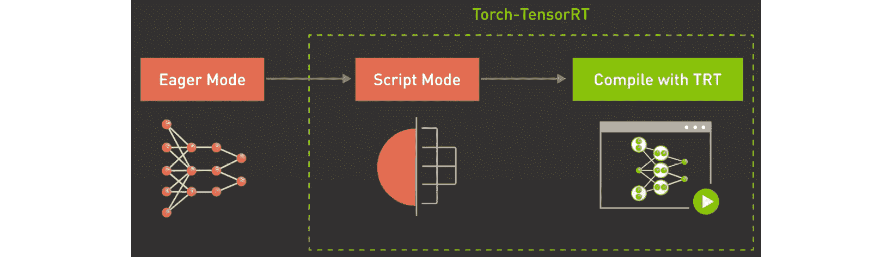

# 第九章：实现模型服务器

在 *第八章*，《*考虑推理硬件*》中，我们讨论了为服务深度学习（DL）模型提供的硬件选项和优化，这些选项作为 Amazon SageMaker 平台的一部分供您使用。在本章中，我们将关注工程推理工作负载的另一个重要方面——选择和配置模型服务器。

模型服务器类似于常规应用程序的应用服务器，为您的 DL 模型提供运行时环境。作为开发者，您将训练好的模型部署到模型服务器，后者将已部署的模型暴露为 REST 或 gRPC 端点。DL 模型的最终用户随后会向这些已建立的端点发送推理请求，并收到包含预测结果的响应。模型服务器可以同时为多个最终用户提供服务。它还提供可配置的机制，以优化推理延迟和吞吐量，满足特定的服务水平协议（SLA）。

在 *第一章*，《*介绍 Amazon SageMaker 深度学习*》中，我们讨论了 Amazon SageMaker 托管服务的几种模型部署机制：实时推理端点、批量转换作业和异步推理。在所有这些情况下，您都需要选择一个模型服务器来管理推理运行时和模型部署。然而，这些使用案例的模型服务器配置可能会有所不同，因为它们具有不同的推理流量特征和延迟/吞吐量要求。

Amazon SageMaker 提供了多种模型服务器解决方案，作为其深度学习推理容器的一部分。在本章中，我们将重点介绍三种流行的模型服务器，这些服务器旨在将深度学习推理工作负载投入生产：**TensorFlow Serving** (**TFS**)、**PyTorch TorchServe** (**PTS**) 和 **NVIDIA Triton**。

在本章中，我们将讨论以下主题：

+   使用 TFS

+   使用 PTS

+   使用 NVIDIA Triton

阅读完本章后，您将了解如何部署您的 TensorFlow 和 PyTorch 模型，并根据您的推理需求配置模型服务器。我们还将讨论将模型服务器作为 SageMaker 托管服务一部分时的功能限制。

# 技术要求

在本章中，我们将提供代码示例，帮助您培养实践技能。完整的代码示例可在此处查看：[`github.com/PacktPublishing/Accelerate-Deep-Learning-Workloads-with-Amazon-SageMaker/blob/main/chapter9/`](https://github.com/PacktPublishing/Accelerate-Deep-Learning-Workloads-with-Amazon-SageMaker/blob/main/chapter9/)。

为了跟随本章的代码，您需要具备以下内容：

+   拥有一个 AWS 账户和具有管理 Amazon SageMaker 资源权限的 IAM 用户。

+   已建立 SageMaker Notebook、SageMaker Studio Notebook 或本地兼容 SageMaker 的环境。

+   访问你 AWS 账户中的 GPU 训练实例。本章中的每个示例将提供推荐的实例类型供你使用。你可能需要增加 *SageMaker 训练任务* 的计算配额，以启用 GPU 实例。在这种情况下，请按照 [`docs.aws.amazon.com/sagemaker/latest/dg/regions-quotas.xhtml`](https://docs.aws.amazon.com/sagemaker/latest/dg/regions-quotas.xhtml) 上的说明操作。

+   你必须通过运行 `pip install -r requirements.txt` 来安装所需的 Python 库。包含所需库的文件可以在 `chapter9` 目录中找到。

+   在本章中，我们将提供编译模型进行推理的示例，这需要访问特定的加速器类型。请在模型服务器示例中查看实例推荐。

# 使用 TFS

**TFS** 是一个原生的模型服务器，支持 TensorFlow 1、TensorFlow 2 和 Keras 模型。它旨在提供一个灵活且高性能的运行时环境，配备了广泛的管理 API 和操作功能（例如日志记录和度量）。AWS 提供了 TFS 作为 TensorFlow 推理容器的一部分 ([`github.com/aws/deep-learning-containers/tree/master/tensorflow/inference/docker`](https://github.com/aws/deep-learning-containers/tree/master/tensorflow/inference/docker))。

## 回顾 TFS 概念

TFS 有一个叫做 **servable** 的概念，它封装了推理所需的所有模型和代码资产。为了将 servable 准备好供 TFS 服务使用，你需要将训练好的模型打包成 **SavedModel** 格式。SavedModel 包含了一个完整的 TensorFlow 程序，包括训练过的参数和计算逻辑。它不需要原始的模型构建代码就能运行，这使得它在 TFS 生态系统中共享或部署变得十分方便（例如，使用 TFLite、TensorFlow.js 或 TFS）。你也可以在一个 servable 中打包多个模型以及特定的模型查找或嵌入。

TFS 通过 REST 或 gRPC 端点加载并暴露你的 servable。服务器 API 定义了一系列端点，用于执行分类和回归推理。此外，每个 servable 都有一个关联的 **signature**，它定义了模型的输入和输出张量，以及模型类型（回归或分类）。许多常见模型都有标准的 signature，这些 signature 取决于任务类型（例如，图像分类、物体检测、文本分类等）。TFS 还允许你拥有自定义的 signature。

## 将 TFS 与 SageMaker 集成

Amazon SageMaker 提供了一个托管的环境，在这个环境中，无论底层的模型服务器如何，你都可以通过统一的管理和调用 API 来管理推理端点。这种方法对原生模型服务器功能设定了一些限制。在本节中，我们将回顾 SageMaker 如何与 TFS 集成以及你应了解的限制。

当在 SageMaker 上部署 TFS 时，您将无法访问 TFS 的本地管理 API 来管理您的可服务对象生命周期（加载和卸载模型、推动模型版本等）。此外，您也无法直接访问 TFS 服务 API。相反，您需要使用标准的 SageMaker 调用接口来调用您的 SageMaker 端点。然后，SageMaker HTTP 服务器（DL TFS 容器的一部分）将您的请求转换为 TFS 格式，并将其传递给 TFS 服务 API。请注意，您可以在推理脚本中提供自定义的预处理、预测和后处理逻辑。SageMaker 支持 REST 和 gRPC 服务 API。下图展示了这种 TFS 集成：


图 9.1 – TFS 与 SageMaker 托管集成

在 SageMaker 上使用 TFS 时，有几件事需要注意：

+   如前所述，SageMaker 不允许您访问 TFS 管理 API。然而，它允许您通过环境变量提供 TFS 的配置。

+   SageMaker 支持使用 TFS 托管多个模型。为此，您需要为每个模型准备单独的可服务对象，然后创建一个多模型归档。

+   您可以使用 REST 头部和请求体来指定 TFS 应使用哪些模型来处理特定请求。例如，以下请求告诉 TFS 使用 `model2` 来处理此请求：

    ```py
    aws sagemaker-runtime invoke-endpoint \
        --endpoint-name my-endpoint \
        --content-type 'application/json' \
        --body '{"instances": [1.0, 2.0, 5.0]}' \
        --custom-attributes 'tfs-model-name=other_model
    ```

SageMaker 支持默认的 TFS 输入和输出格式来处理您的推理请求。此外，SageMaker 还支持 application/JSON、text/CSV 和 application/JSON Lines 格式。

请注意，一旦您使用 TFS 模型服务器部署端点后，您将无法直接更改 TFS 配置或服务的模型。为此，您需要使用 SageMaker 管理 API 来创建一个新端点或端点变体，并使用所需的配置。我们将在*第十章*，*推理工作负载的操作化*中讨论如何在生产中管理 SageMaker 推理资源。

## 优化 TFS

TFS 提供了一系列机制，以根据您的需求、运行时环境和可用硬件资源优化模型服务。这意味着 TFS 调优是特定用例的，通常需要测试和基准测试才能实现预期的性能。在本节中，我们将回顾几种可以用来调优 TFS 性能的机制。

### 使用 TFS 批处理

TFS 支持自动批处理，您可以将多个推理请求放在一个批次中。这可以提高您的服务器吞吐量，尤其是在使用 GPU 实例时（请记住，GPU 非常适合并行计算）。如何配置批处理会根据硬件设备的类型有所不同。TFS 为不同的可服务对象支持不同的批处理调度。

要在 SageMaker 上配置 TFS 批处理，您可以使用以下环境变量：

+   `SAGEMAKER_TFS_ENABLE_BATCHING` 用于启用 TFS 批处理功能。默认值为 `false`，意味着批处理未启用。

+   `SAGEMAKER_TFS_MAX_BATCH_SIZE` 定义了批次的最大大小。默认值为 `8`。

+   `SAGEMAKER_TFS_BATCH_TIMEOUT_MICROS` 定义了在微秒内等待以积累完整批次的时间。默认值为 `1000`。

+   `SAGEMAKER_TFS_NUM_BATCH_THREADS` 设置了同时处理多少个批次。默认值为实例 CPU 的数量。

+   `SAGEMAKER_TFS_MAX_ENQUEUED_BATCHES` 定义了同一时间可以排队的批次数量。

你可以在这里查看 TFS 批处理功能的详细文档：[`github.com/tensorflow/serving/blob/master/tensorflow_serving/batching/README.md`](https://github.com/tensorflow/serving/blob/master/tensorflow_serving/batching/README.md)。

### 使用 gRPC 服务 API

如前所述，TFS 支持两种类型的 API：REST 和 gRPC。虽然这两种 API 功能相同，但由于使用了 HTTP/2 网络协议和通过 ProtoBuf 格式进行更高效的负载表示，gRPC API 通常具有更好的性能。

虽然 SageMaker 调用 API 仅支持 REST API，但你仍然可以使用 gRPC 进行 SageMaker HTTP 前端服务器与 TFS 之间的容器间通信（有关此内容的示意图，请参见 *图 9.1*）。请注意，在这种情况下，你需要提供一些代码将 SageMaker 负载转换为 gRPC 格式并将其发送到 TFS。然而，即便如此，AWS 报告称，在图像分类任务中，整体延迟至少降低了 75%。详情请参考本文：[`aws.amazon.com/blogs/machine-learning/reduce-compuer-vision-inference-latency-using-grpc-with-tensorflow-serving-on-amazon-sagemaker/`](https://aws.amazon.com/blogs/machine-learning/reduce-compuer-vision-inference-latency-using-grpc-with-tensorflow-serving-on-amazon-sagemaker/)。性能提升会根据模型和负载大小有所不同。

### 使用 TFS 配置资源利用率

TFS 提供以下参数来配置硬件资源分配：

+   `SAGEMAKER_TFS_INSTANCE_COUNT` 定义了将生成多少个 TFS 服务进程实例。改变此参数可能会增加 CPU 和 GPU 利用率，并最终改善延迟/吞吐量特性。

+   `SAGEMAKER_TFS_FRACTIONAL_GPU_MEM_MARGIN` 定义了可用于初始化 CUDA/cuDNN 库的 GPU 内存的比例。剩余内存将平均分配给 TFS 进程。

+   `SAGEMAKER_TFS_INTER_OP_PARALLELISM` 决定在运行模型图中的独立非阻塞计算操作时使用多少线程。

+   `SAGEMAKER_TFS_INTRA_OP_PARALLELISM` 决定在运行可以内部并行化的操作时使用多少线程。

现在，让我们通过一个实际例子来回顾如何在 SageMaker 上使用 TFS。

## 实现 TFS 服务

在本示例中，我们将从 TensorFlow Hub 获取一个预训练的模型，将其转换为 **SavedModel** 格式，然后与自定义推理一起打包，部署到 SageMaker 上。我们将回顾如何使用 REST 和 gRPC API，以及如何在部署到 SageMaker 管理型托管时定义 TFS 配置。为了完成这项任务，我们将使用流行的 EfficientNetV2 模型架构来进行图像分类。

完整代码可以在这里找到：[`github.com/PacktPublishing/Accelerate-Deep-Learning-Workloads-with-Amazon-SageMaker/blob/main/chapter9/1_TensorFlow_Serving.ipynb`](https://github.com/PacktPublishing/Accelerate-Deep-Learning-Workloads-with-Amazon-SageMaker/blob/main/chapter9/1_TensorFlow_Serving.ipynb)。

### 准备训练模型

我们将从 TensorFlow Hub 加载模型工件。您可以在其模型页面阅读有关 EfficientNetV2 模型的信息，地址是：[`tfhub.dev/google/imagenet/efficientnet_v2_imagenet1k_s/classification/2`](https://tfhub.dev/google/imagenet/efficientnet_v2_imagenet1k_s/classification/2)。为了下载模型，我们可以使用 TensorFlow Hub API，如下所示的代码块所示：

```py
import tensorflow as tf
import tensorflow_hub as hub
model_handle = "https://tfhub.dev/google/imagenet/efficientnet_v2_imagenet1k_s/classification/2"
classifier = hub.load(model_handle)
```

该模型期望一个密集的 4D 张量，数据类型为 `float32`，形状为 `[batch, height, weight, color]`，其中 `height` 和 `weight` 的固定长度为 `384`，`color` 的长度为 `3`。`batch` 可以是可变的。

为了在本地测试模型，您需要将图像（或一批图像）转换为期望的 4D 张量，将其通过模型运行，并应用 `softmax` 函数以获取标签概率，如下所示：

```py
probabilities = tf.nn.softmax(classifier(image)).numpy()
```

现在我们已经对模型进行了基本的烟雾测试，接下来需要将其打包为 SageMaker/TFS 兼容的格式。

### 打包模型工件

如前所述，TFS 期望您的模型被转换为 SavedModel 格式。此外，SageMaker 期望模型工件被打包成一个 `tar.gz` 压缩包，并具有以下结构：

```py
    model1
        |--[model_version_number]
            |--variables
            |--saved_model.pb
    model2
        |--[model_version_number]
            |--assets
            |--variables
            |--saved_model.pb
    code
        |--inference.py
        |--requirements.txt
```

以下代码创建了适当的目录结构并将训练好的模型导出为 SavedModel 格式：

```py
model_name = "efficientnetv2-s"
model_dir = f"./{model_name}/1"
code_dir = f"./{model_name}/code"
os.makedirs(model_dir, exist_ok=False)
os.makedirs(code_dir, exist_ok=False)
tf.saved_model.save(classifier, model_dir)
```

请注意，在我们的示例中，我们将只使用单个版本的单个模型。接下来，我们需要为预处理、运行预测和后处理准备一个推理脚本，用于在 SageMaker HTTP 前端与 TFS 服务器之间进行交互。

### 开发推理代码

SageMaker 期望您的处理代码被命名为 `inference.py` 并放置在模型归档中的 `/code` 目录下。我们的推理代码需要实现 `input_handler()` 和 `output_handler()` 函数，或一个单一的 `handler()` 函数。在我们的例子中，我们选择实现一个单一的 `handler()` 方法来处理传入的请求并将其发送到适当的 TFS API：

```py
def handler(data, context):
    if context.request_content_type == "application/json":
        instance = json.loads(data.read().decode("utf-8"))
    else:
        raise ValueError(
            415,
            'Unsupported content type "{}"'.format(
                context.request_content_type or "Unknown"
            ),
        )
    if USE_GRPC:
        prediction = _predict_using_grpc(context, instance)
    else:
        inst_json = json.dumps({"instances": instance})
        response = requests.post(context.rest_uri, data=inst_json)
        if response.status_code != 200:
            raise Exception(response.content.decode("utf-8"))
        prediction = response.content
    response_content_type = context.accept_header
    return prediction, response_content_type
```

如你所见，依据我们选择使用 gRPC API 还是 REST API，处理和预测代码会略有不同。请注意，`context` `namedtuple` 对象提供了有关 TFS 配置的必要细节，例如端点路径和端口、模型名称和版本等。

如果选择使用 TFS REST API，我们需要将传入的请求转换为预期的 TFS 格式，将其序列化为 JSON，然后生成一个 POST 请求。

若要使用 gRPC API，我们需要将传入的 REST 负载转换为`protobuf`对象。为此，我们将使用以下辅助函数：

```py
from tensorflow_serving.apis import predict_pb2
from tensorflow_serving.apis import prediction_service_pb2_grpc
def _predict_using_grpc(context, instance):
    grpc_request = predict_pb2.PredictRequest()
    grpc_request.model_spec.name = "model"
    grpc_request.model_spec.signature_name = "serving_default"
    options = [
        ("grpc.max_send_message_length", MAX_GRPC_MESSAGE_LENGTH),
        ("grpc.max_receive_message_length", MAX_GRPC_MESSAGE_LENGTH),
    ]
    channel = grpc.insecure_channel(f"0.0.0.0:{context.grpc_port}", options=options)
    stub = prediction_service_pb2_grpc.PredictionServiceStub(channel)
grpc_request.inputs["input_1"].CopyFrom(tf.make_tensor_proto(instance))
    result = stub.Predict(grpc_request, 10)
    output_shape = [dim.size for dim in result.outputs["output_1"].tensor_shape.dim]
    np_result = np.array(result.outputs["output_1"].float_val).reshape(output_shape)
    return json.dumps({"predictions": np_result.tolist()})
```

在这里，我们使用`prediction_service_pb2()`和`predict_pb2()` TFS 方法与 gRPC API 进行通信。`stub`对象在 RPC 过程中转换参数。`grpc_request`对象定义了要调用的 TFS API 以及传递的参数。

为了选择要调用的 TFS API，我们实现了一个简单的机制，允许你通过 SageMaker 模型对象提供`USE_GRPC`环境变量：

```py
USE_GRPC = True if os.getenv("USE_GRPC").lower() == "true" else False 
```

一旦我们的`inference.py`代码准备好后，我们可以将其添加到模型包中，并创建一个`tar.gz`模型归档。可以通过在 Jupyter notebook 中运行以下 Bash 代码来完成此操作：

```py
! cp 1_src/inference.py $code_dir
! cp 1_src/requirements.txt $code_dir
! tar -C "$PWD" -czf model.tar.gz  efficientnetv2-s/
```

现在，我们的模型已经按照 TFS 和 SageMaker 的要求打包完毕，准备进行部署。

### 部署 TFS 模型

部署 TFS 模型，请按照以下步骤操作：

1.  我们将首先把模型归档上传到 Amazon S3，以便 SageMaker 在部署时将其下载到服务容器中。我们可以使用 SageMaker 的`Session()`对象来执行此操作：

    ```py
    import sagemaker
    from sagemaker import get_execution_role
    sagemaker_session = sagemaker.Session()
    role = get_execution_role() 
    bucket = sagemaker_session.default_bucket()
    prefix = 'tf-serving'
    s3_path = 's3://{}/{}'.format(bucket, prefix)
    model_data = sagemaker_session.upload_data('model.tar.gz',
                                               bucket,
                                               os.path.join(prefix, 'model'))
    ```

1.  然后，我们可以使用 SageMaker SDK 的 TensorFlowModel 对象来配置 TFS 环境。请注意，我们通过`env`字典提供 TFS 配置：

    ```py
    from sagemaker.tensorflow import TensorFlowModel
    env = {
           "SAGEMAKER_TFS_ENABLE_BATCHING":"true",
           "SAGEMAKER_TFS_MAX_BATCH_SIZE":"4",
           "SAGEMAKER_TFS_BATCH_TIMEOUT_MICROS":"100000",
           "SAGEMAKER_TFS_NUM_BATCH_THREADS":"6",
           "SAGEMAKER_TFS_MAX_ENQUEUED_BATCHES":"6",
           "USE_GRPC":"true" # to switch between TFS REST and gRCP API
           }
    tensorflow_serving_model = TensorFlowModel(model_data=model_data,
                                     name="efficientnetv2-1",
                                     role=role,
                                     framework_version='2.8',
                                     env=env,
    sagemaker_session=sagemaker_session)
    ```

配置好模型后，我们可以准备部署端点。在这里，我们将使用一个 GPU 实例，但你也可以尝试使用 CPU 实例。

在我们能够运行预测之前，我们需要将图像（或多个图像）转换为 4D TFS 张量，并将其转换为 NumPy `ndarray`，这样`.predict()`方法才能将其序列化为 application/JSON 内容类型。样本笔记本中提供了一个将图像处理为 TFS 格式的方法示例。

在以下代码中，我们正在运行预测，并将结果的 softmax 分数映射到标签：

```py
response_remote = predictor.predict(image.numpy())
probabilities = np.array(response_remote['predictions'])
top_5 = tf.argsort(probabilities, axis=-1, direction="DESCENDING")[0][:5].numpy()
np_classes = np.array(classes)
# Some models include an additional 'background' class in the predictions, so
# we must account for this when reading the class labels.
includes_background_class = probabilities.shape[1] == 1001
for i, item in enumerate(top_5):
  class_index = item if includes_background_class else item + 1
  line = f'({i+1}) {class_index:4} - {classes[class_index]}: {probabilities[0][top_5][i]}'
  print(line)
```

运行此代码后，你应该得到包含标签及其归一化概率的输出。

在本节中，我们回顾了如何在 Amazon SageMaker 上使用 TFS 模型服务器。 TFS 是一个高度可配置的生产级模型服务器，当涉及到托管 TensorFlow 模型时，它应该被视为一个很好的选择。 我们还讨论了一些 Sagemaker / TFS 集成的实现细节，这些细节在设计您的模型服务器时应予以考虑。 一旦您在 SageMaker 上运行您的 TensorFlow 模型，建议进行基准测试，并根据您特定的用例需求调整 TFS 配置。

在接下来的部分中，我们将审查用于 PyTorch 模型的本地模型服务器 - TorchServe。

# 使用 PTS

**PTS**是 PyTorch 模型的本地模型服务器。 PTS 是 Meta 和 AWS 合作开发的，旨在为 PyTorch 生态系统提供一个生产就绪的模型服务器。 它允许您通过 REST 或 gRPC 端点提供服务和管理多个模型。 PTS 支持为了更好的推断性能提供 TorchScripted 模型。 它还配备了收集日志和指标以及优化调整的实用程序。 SageMaker 将 PTS 作为 PyTorch 推断容器的一部分支持（[`github.com/aws/deep-learning-containers/tree/master/pytorch/inference/docker`](https://github.com/aws/deep-learning-containers/tree/master/pytorch/inference/docker)）。

## 与 SageMaker 集成

PTS 是 Amazon SageMaker 上 PyTorch 模型的默认模型服务器。 与 TFS 类似，SageMaker 不向最终用户公开原生 PTS API 以进行模型管理和推断。 下图显示了如何集成 SageMaker 和 PTS：


图 9.2 - SageMaker 上的 PTS 架构

让我们突出这些集成细节：

+   SageMaker 原生支持有限数量的 PTS 配置。 如果您需要对 PTS 配置更具灵活性，可能需要扩展 SageMaker PyTorch 推断容器。 或者，您可以将 PTS 配置作为模型包的一部分打包，并通过`TS_CONFIG_FILE`环境变量提供路径。 但是，通过后一种方法，您将无法操纵所有设置（例如，JVM 配置）。

+   PTS 要求您将模型工件和处理程序代码打包到 MAR 存档中。 SageMaker 对于模型存档有略有不同的要求，我们将在以下代码示例中讨论。

+   SageMaker 支持同时托管多个模型。 为此，您需要将`ENABLE_MULTI_MODEL`环境变量设置为`true`，并将您的模型打包到单个存档中。

SageMaker 通过端点环境变量提供配置 PTS 的机制。 让我们回顾一下可用的配置参数。

## 在 SageMaker 上优化 PTS

PTS 支持两种主要的性能优化机制：服务器端批处理和生成多个模型线程。 可以通过以下环境变量配置这些设置：

+   `SAGEMAKER_TS_BATCH_SIZE` 设置服务器端批次的最大大小。

+   `SAGEMAKER_TS_MAX_BATCH_DELAY` 设置服务器等待完成批次的最大延迟（以微秒为单位）。

+   `SAGEMAKER_TS_RESPONSE_TIMEOUT` 设置推理响应不可用时的超时时间延迟（以秒为单位）。

+   `SAGEMAKER_TS_MIN_WORKERS` 和 `SAGEMAKER_TS_MAX_WORKERS` 分别配置 CPU 或 GPU 设备上模型工作线程的最小和最大数量。你可以在 PyTorch 文档中阅读有关如何设置这些参数的注意事项，链接如下：[`github.com/pytorch/serve/blob/master/docs/performance_guide.md`](https://github.com/pytorch/serve/blob/master/docs/performance_guide.md)。

此外，PTS 支持使用 PyTorch TensorBoard 插件进行推理分析，这在*第七章*中讨论过，*深度学习训练的生产化*。该插件可以让你分析 PyTorch 推理代码，找出潜在的瓶颈。

## 使用 PTS 提供模型服务

让我们回顾一下如何使用 PTS 在 SageMaker 上部署 PyTorch 模型。我们将使用 HuggingFace 模型库中已在问答 NLP 任务上训练的 Distilbert 模型。示例代码可以在这里找到：[`github.com/PacktPublishing/Accelerate-Deep-Learning-Workloads-with-Amazon-SageMaker/blob/main/chapter9/2_PyTorch_Torchserve.ipynb`](https://github.com/PacktPublishing/Accelerate-Deep-Learning-Workloads-with-Amazon-SageMaker/blob/main/chapter9/2_PyTorch_Torchserve.ipynb)。

### 在 SageMaker 上为 PTS 打包模型

在 SageMaker 上使用 PTS 模型服务器时，你可以选择以下两种选项之一：

+   使用 Python SageMaker SDK 中的 `PyTorchModel` 类部署你的模型。在这种情况下，你的模型归档只需要提供必要的模型工件（例如模型权重、查找表、分词器等）。作为 `PyTorchModel` 对象配置的一部分，你将提供推理代码和其他依赖项，SageMaker 会自动为 PTS 打包它。

+   你也可以将模型与推理代码一起打包在一个归档文件中。虽然这种方法需要额外的工作，但它允许你创建模型包并部署模型，而无需使用 SageMaker SDK。在这种情况下，SageMaker 期望以下目录结构：

    ```py
    model.tar.gz/
    |- model_weights.pth
    |- other_model_artifacts
    |- code/
      |- inference.py
      |- requirements.txt  # optional
    ```

在这个示例中，我们将使用第一个选项：

1.  以下 Bash 脚本将下载所需的 HuggingFace 模型工件，并将它们打包成一个 `tar.gz 归档` 文件：

    ```py
    mkdir distilbert-base-uncased-distilled-squad
    wget https://huggingface.co/distilbert-base-uncased-distilled-squad/resolve/main/pytorch_model.bin -P distilbert-base-uncased-distilled-squad
    wget https://huggingface.co/distilbert-base-uncased-distilled-squad/resolve/main/tokenizer.json -P distilbert-base-uncased-distilled-squad
    wget https://huggingface.co/distilbert-base-uncased-distilled-squad/resolve/main/tokenizer_config.json -P distilbert-base-uncased-distilled-squad
    wget https://huggingface.co/distilbert-base-uncased-distilled-squad/resolve/main/vocab.txt -P distilbert-base-uncased-distilled-squada
    wget https://huggingface.co/distilbert-base-uncased-distilled-squad/resolve/main/config.json -P distilbert-base-uncased-distilled-squad
    tar -C "$PWD" -czf distilbert-base-uncased-distilled-squad.tar.gz  distilbert-base-uncased-distilled-squad/
    ```

1.  然后，我们需要使用以下代码将模型归档上传到 Amazon S3：

    ```py
    import sagemaker
    from sagemaker import get_execution_role
    sagemaker_session = sagemaker.Session()
    role = get_execution_role()
    bucket = sagemaker_session.default_bucket()
    prefix = 'torchserve'
    s3_path = 's3://{}/{}'.format(bucket, prefix)
    model_data = sagemaker_session.upload_data('distilbert-base-uncased-distilled-squad.tar.gz',bucket,os.path.join(prefix, 'model-artifacts'))
    ```

接下来，我们需要准备一些代码，从上传的模型工件中加载模型并执行推理和数据处理。这段代码在 PTS 术语中被称为 **推理处理程序**。

### 准备推理处理程序

SageMaker 要求您提供一些代码以加载模型并运行预测，以便您可以预处理传入的推理请求并后处理响应。为了执行这些操作，您需要实现 `model_fn()`、`predict_fn()`、`input_fn()` 和 `output_fn()` 方法。您可以在此找到使用 HuggingFace Pipeline API 的推理处理器实现：[`github.com/PacktPublishing/Accelerate-Deep-Learning-Workloads-with-Amazon-SageMaker/blob/main/chapter9/2_src/pipeline_predictor.py`](https://github.com/PacktPublishing/Accelerate-Deep-Learning-Workloads-with-Amazon-SageMaker/blob/main/chapter9/2_src/pipeline_predictor.py)。

### 将模型部署到 SageMaker 端点

使用 SageMaker SDK 在 PTS 上部署模型非常简单。为了配置 PTS，我们可以使用 `"env"` 字典在服务容器中设置适当的环境变量。请注意，在这里，我们通过 `"entry_point"` 参数显式引用推理代码。按照以下步骤操作：

1.  作为前提条件，您可以将任何其他依赖项（例如自定义库或 `requirements.txt`）添加到 `"source_dir"` 位置。SageMaker SDK 将自动将这些资产与模型数据合并到 PTS 所需的 MAR 存档中：

    ```py
    from sagemaker.pytorch import PyTorchModel
    env = {
        "SAGEMAKER_TS_BATCH_SIZE": "2",
        "SAGEMAKER_TS_MAX_BATCH_DELAY": "1000",
        "SAGEMAKER_TS_RESPONSE_TIMEOUT" : "120",
        "SAGEMAKER_TS_MIN_WORKERS" : "1",
        "SAGEMAKER_TS_MAX_WORKERS" : "2"
        }
    model = PyTorchModel(model_data=model_data,
                       role=role, 
                       entry_point='pipeline_predictor.py',
                       source_dir='2_src',
                       framework_version='1.9.0',
                       py_version='py38',
                       env=env,
                       sagemaker_session=sagemaker_session)
    ```

1.  现在，我们可以定义请求/响应对的端点配置以及支持的序列化器和反序列化器：

    ```py
    from sagemaker.serializers import JSONSerializer
    from sagemaker.deserializers import JSONDeserializer
    remote_predictor = model.deploy(initial_instance_count=1, instance_type="ml.g4dn.4xlarge", serializer=JSONSerializer(), deserializer=JSONDeserializer())
    ```

1.  现在，我们可以通过调用 `.predict()` 方法进行预测：

    ```py
    remote_predictor.predict(data)
    ```

1.  我们还可以确认我们的 PTS 配置已正确应用。为此，您可以打开 SageMaker 端点日志流，并搜索如下所示的日志行：

    ```py
    Model config: 
    { "model": { "1.0": { "defaultVersion": true, "marName": "model.mar", "minWorkers": 1, "maxWorkers": 2, "batchSize": 3, "maxBatchDelay": 100000, "responseTimeout": 120 } } }
    ```

在本节中，我们讨论了如何使用 PTS 来服务 PyTorch 模型。在实际生产系统中，您可能更愿意将模型转换为 TorchScript 格式，并进一步尝试批处理和工作节点扩展选项，以优化您的特定用例需求。

在下一节中，我们将回顾一个功能丰富的框架无关的模型服务器，称为 NVIDIA Triton。

# 使用 NVIDIA Triton

**NVIDIA Triton** 是由 NVIDIA 开发的一个开源模型服务器。它支持多种深度学习框架（如 TensorFlow、PyTorch、ONNX、Python 和 OpenVINO），以及各种硬件平台和运行时环境（NVIDIA GPUs、x86 和 ARM CPUs，以及 AWS Inferentia）。Triton 可用于云和数据中心环境中的推理，以及边缘设备或移动设备。Triton 在多种 CPU 和 GPU 平台上进行了性能和可扩展性优化。NVIDIA 提供了一种专门的工具，用于性能分析和模型分析，以提高 Triton 的性能。

## 与 SageMaker 的集成

你可以通过使用预构建的 SageMaker DL 容器来使用 Triton 模型服务器。请注意，SageMaker Triton 容器不是开源的。你可以在这里找到最新的 Triton 容器列表：[`github.com/aws/deep-learning-containers/blob/master/available_images.md#nvidia-triton-inference-containers-sm-support-only`](https://github.com/aws/deep-learning-containers/blob/master/available_images.md#nvidia-triton-inference-containers-sm-support-only)。

SageMaker 在部署模型到 Triton 时不要求提供推理自定义代码。然而，你需要为每个你打算提供服务的模型提供一个 Triton `config.pbtxt`文件。该配置指定了推理请求/响应对的 API 契约以及模型如何提供服务的其他参数。你可以通过阅读官方 Triton 文档来查看可能的配置参数：[`github.com/triton-inference-server/server/blob/main/docs/user_guide/model_configuration.md`](https://github.com/triton-inference-server/server/blob/main/docs/user_guide/model_configuration.md)。

同时需要注意的是，与 TFS 和 PTS 不同，写本文时，SageMaker 尚不支持在 Triton 上托管多个独立的模型。但是，你仍然可以有同一个模型的多个版本，或者将多个模型组织成一个管道。

## 优化 Triton 推理

Triton 提供多种工具来提高你的性能：

+   **模型分析器**允许你了解模型的 GPU 内存使用情况，以便你了解如何在单个 GPU 上运行多个模型。

+   **性能分析器**允许你分析 Triton 的推理和吞吐量。

你无法直接在 SageMaker Triton Endpoint 上运行性能分析器，因为 SageMaker 推理 API 与 Triton 推理 API 不匹配。为了解决这个限制，你可以在具有目标硬件加速器的 SageMaker Notebook 实例上本地运行 Triton 容器，并对其进行分析。

Triton 提供以下优化功能：

+   **动态批处理**：将多个推理请求合并到一个批处理中，以提高 Triton 的吞吐量。这个功能类似于我们为 TFS 和 PTS 模型服务器讨论的批处理。

+   **模型实例**：指定每个模型将有多少副本可用于推理。默认情况下，加载一个模型实例。拥有多个模型副本通常会提高延迟/吞吐量，因为它允许你将内存传输操作（例如，CPU 与 GPU 之间的传输）与推理计算重叠。拥有多个实例也能更有效地使用所有可用的 GPU 资源。

两个参数可以通过`config.pbtxt`文件进行配置。让我们在 SageMaker 上获得一些使用 Triton 的实际经验。

## 在 SageMaker 上使用 Triton 提供模型服务

在这个示例中，我们将使用 Triton 部署图像分类 PyTorch ResNet50 模型。我们的目标硬件加速器将是`ml.g4dn`实例。首先，我们需要将模型编译为 TensorRT 运行时；然后，编译后的模型将被打包并部署到 Triton 模型服务器。示例代码可以在此处找到：[`github.com/PacktPublishing/Accelerate-Deep-Learning-Workloads-with-Amazon-SageMaker/blob/main/chapter9/3_NVIDIA_Triton_Server.ipynb`](https://github.com/PacktPublishing/Accelerate-Deep-Learning-Workloads-with-Amazon-SageMaker/blob/main/chapter9/3_NVIDIA_Triton_Server.ipynb)。

请注意，以下小节中描述的模型编译过程是针对 PyTorch 框架的。如果你选择使用 TensorFlow 模型，则你的模型编译和配置会有所不同。你可以参考 Triton TensorFlow 后端的仓库获取详细信息：[`github.com/triton-inference-server/tensorflow_backend`](https://github.com/triton-inference-server/tensorflow_backend)。

### 为 Triton 编译模型

有几种方法可以将你的 PyTorch 模型编译为 TensorRT 格式，例如将 PyTorch 模型转换为 ONNX 格式。另一种方法是使用 PyTorch JIT 编译器将你的 eager 模型本地转换为 TorchScript 格式。最近，PyTorch 和 NVIDIA 团队实施了一种优化方式，使用**Torch-TensorRT 编译器**将 PyTorch 模型编译为 TensorRT 运行时。这个方法有几个优点，它允许你使用 TensorRT 特定的优化，例如 GP16 和 INT8 精度降低类型以及 NVIDIA GPU 权重稀疏性：



图 9.3 – 使用 TensorRT-Torch 编译 PyTorch 模型

要使用 TensorRT-Torch 编译 PyTorch 模型，我们需要两个组件：

+   用于编译的运行时环境。强烈建议使用 NVIDIA 的最新 PyTorch 容器来完成此操作。请注意，你需要在具有 NVIDIA GPU 的实例上运行此容器。例如，你可以在`g4dn`类型的 SageMaker Notebook 上运行此示例。

+   编译代码。此代码将在 NVIDIA PyTorch Docker 容器内执行。

现在，让我们回顾一下编译代码：

1.  我们将首先从 PyTorch Hub 加载模型，将其设置为评估模式，并将其放置在 GPU 设备上：

    ```py
    import torch
    import torch_tensorrt
    import os
    torch.hub._validate_not_a_forked_repo = lambda a, b, c: True
    MODEL_NAME = "resnet50"
    MODEL_VERSION = "1"
    device = "cuda" if torch.cuda.is_available() else "cpu"
    # load model
    model = (torch.hub.load("pytorch/vision:v0.10.0", MODEL_NAME, pretrained=True).eval().to(device))
    ```

1.  接下来，我们将使用 TensorRT-Torch 编译器进行编译。在编译器配置中，我们将指定预期的输入和目标精度。请注意，由于我们计划使用动态批处理进行模型处理，因此我们将提供多个具有不同批次维度值的输入形状：

    ```py
    # Compile with Torch TensorRT;
    trt_model = torch_tensorrt.compile(
        model,
        inputs=[
            torch_tensorrt.Input(
                min_shape=(1, 3, 224, 224),
                opt_shape=(8, 3, 224, 224),
                max_shape=(16, 3, 224, 224),
                dtype=torch.float32,
            )
        ],
        enabled_precisions={ torch.float32 },
    )
    ```

1.  最后，我们将把模型保存到磁盘：

    ```py
    # Save the model
    model_dir = os.path.join(os.getcwd(), "3_src", MODEL_NAME, MODEL_VERSION)
    os.makedirs(model_dir, exist_ok=True)
    print(model_dir)
    torch.jit.save(trt_model, os.path.join(model_dir, "model.pt"))
    ```

1.  要执行此脚本，您需要通过以下命令启动一个 Docker 容器：`docker run --gpus all --ipc=host --ulimit memlock=-1 --ulimit stack=67108864 -it --rm -v $PWD/chapter9/3_src:/workspace/3_src nvcr.io/nvidia/pytorch:22.05-py3`。

1.  您的控制台会话将在容器内打开，在这里您可以通过运行`python 3_src/compile_tensorrt.py`命令执行编译脚本。

生成的`model.pt`文件将可在 Docker 容器外部的`3_src`目录中找到。

### 准备模型配置

之前，我们提到 Triton 使用一个特定约定的配置文件来定义模型签名和运行时配置。以下代码是一个`config.pbtxt`文件，我们可以用它来托管 ResNet50 模型。在这里，我们定义了批处理参数（最大批量大小和动态批处理配置）、输入和输出签名、模型副本以及目标硬件环境（通过`instance_group`对象）：

```py
name: "resnet50"
platform: "pytorch_libtorch"
max_batch_size : 128
input [
  {
    name: "input__0"
    data_type: TYPE_FP32
    dims: [ 3, 224, 224 ]
  }
]
output [
  {
    name: "output__0"
    data_type: TYPE_FP32
    dims: [ 1, 1000 ,1, 1]
  }
]
dynamic_batching {
   preferred_batch_size: 128
   max_queue_delay_microseconds: 1000
 }
instance_group {
  count: 1
  kind: KIND_GPU
}
```

详细了解 Triton 配置，请参考：[`github.com/triton-inference-server/server/blob/main/docs/user_guide/model_configuration.md`](https://github.com/triton-inference-server/server/blob/main/docs/user_guide/model_configuration.md)。

### 打包模型工件

为了部署带有其配置的编译模型，我们需要将所有内容打包成一个`tar.gz`压缩包，并上传到 Amazon S3。以下代码展示了模型归档中的目录结构：

```py
resnet50
|- 1
  |- model.pt
|- config.pbtxt
```

一旦模型包上传到 Amazon S3，我们可以部署我们的 Triton 端点。

### 部署 Triton 端点

Triton 推理容器不被 SageMaker Python SDK 支持。因此，我们需要使用 boto3 SageMaker 客户端来部署模型。请按照以下步骤操作：

1.  首先，我们需要识别正确的 Triton 镜像。使用以下代码根据您使用的 Triton 服务器版本（我们使用了`22.05`用于模型编译和服务）以及您的 AWS 区域来查找 Triton 容器的 URI：

    ```py
    account_id_map = {
     # <REDACTED_FOR_BREVITY>
    }
    region = boto3.Session().region_name
    if region not in account_id_map.keys():
        raise("UNSUPPORTED REGION")
    base = "amazonaws.com.cn" if region.startswith("cn-") else "amazonaws.com"
    triton_image_uri = "{account_id}.dkr.ecr.{region}.{base}/sagemaker-tritonserver:22.05-py3".format(
        account_id=account_id_map[region], region=region, base=base)
    ```

1.  接下来，我们可以创建模型，定义模型数据和服务容器，以及其他参数，如环境变量：

    ```py
    unique_id = time.strftime("%Y-%m-%d-%H-%M-%S", time.gmtime())
    sm_model_name = "triton-resnet50-" + unique_id
    container = {
        "Image": triton_image_uri,
        "ModelDataUrl": model_data,
        "Environment": {"SAGEMAKER_TRITON_DEFAULT_MODEL_NAME": "resnet50"},
    }
    create_model_response = sm_client.create_model(
        ModelName=sm_model_name, ExecutionRoleArn=role, PrimaryContainer=container
    )
    ```

1.  然后，我们可以定义端点配置：

    ```py
    endpoint_config_name = "triton-resnet50-" + unique_id
    create_endpoint_config_response = sm_client.create_endpoint_config(
        EndpointConfigName=endpoint_config_name,
        ProductionVariants=[
            {
                "InstanceType": "ml.g4dn.4xlarge",
                "InitialVariantWeight": 1,
                "InitialInstanceCount": 1,
                "ModelName": sm_model_name,
                "VariantName": "AllTraffic",
            }
        ],)
    ```

1.  现在，我们准备好部署我们的端点：

    ```py
    endpoint_name = "triton-resnet50-" + unique_id
    create_endpoint_response = sm_client.create_endpoint(
        EndpointName=endpoint_name, EndpointConfigName=endpoint_config_name)
    ```

一旦端点部署完毕，您可以检查 SageMaker 的端点日志，以确认 Triton 服务器已启动并且模型已成功加载。

### 运行推理

为了运行推理，我们必须根据`config.pbtxt`中定义的模型签名构造有效负载。请查看以下推理调用。响应也将遵循已定义的输出签名：

```py
payload = {
    "inputs": [
        {
            "name": "input__0",
            "shape": [1, 3, 224, 224],
            "datatype": "FP32",
            "data": get_sample_image(),
        }
    ]
}
response = runtime_sm_client.invoke_endpoint(   EndpointName=endpoint_name, ContentType="application/octet-stream", Body=json.dumps(payload))
predictions = json.loads(response["Body"].read().decode("utf8"))
```

本节描述了 Triton 模型服务器的基本功能以及如何在 Amazon SageMaker 上使用它。建议您参考 Triton 文档，以了解高级功能和优化技术。请记住，根据您选择的模型格式和深度学习框架，您的模型配置将有所不同。您可以查看 AWS 针对 BERT 模型的 Triton 服务器详细基准测试，链接地址为 [`aws.amazon.com/blogs/machine-learning/achieve-hyperscale-performance-for-model-serving-using-nvidia-triton-inference-server-on-amazon-sagemaker/`](https://aws.amazon.com/blogs/machine-learning/achieve-hyperscale-performance-for-model-serving-using-nvidia-triton-inference-server-on-amazon-sagemaker/)。这些基准测试为您提供了实验和调优 Triton 托管模型的良好起点。

# 总结

在本章中，我们讨论了如何在 Amazon SageMaker 上使用流行的模型服务器——TensorFlow Serving、PyTorch TorchServe 和 NVIDIA Triton。每个模型服务器都提供了丰富的功能，用于部署和调优模型推理。选择特定模型服务器的原因可能由深度学习框架、目标硬件和运行时环境以及其他偏好决定。NVIDIA Triton 支持多种模型格式、目标硬件平台和运行时。同时，TensorFlow Serving 和 TorchServe 提供与各自深度学习框架的原生集成。无论选择哪个模型服务器，为了确保计算资源和推理性能的最佳利用，建议规划如何通过各种服务器配置对模型进行负载测试和基准测试。

在下一章，*第十章*，*推理工作负载的操作化*，我们将讨论如何在生产环境中迁移和管理推理工作负载。我们将回顾 SageMaker 在优化推理工作负载成本、进行 A/B 测试、根据推理流量模式进行端点资源的弹性伸缩，以及多模型和多容器端点等高级部署模式方面的能力。
