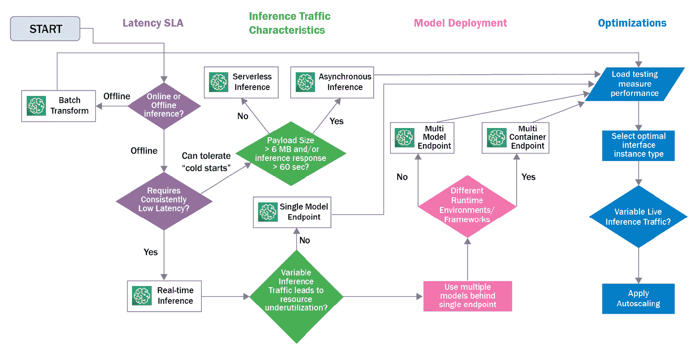

# 第十章：操作化推理工作负载

在*第八章*《考虑推理硬件》和*第九章*《实现模型服务器》中，我们讨论了如何在 Amazon SageMaker 上设计你的**深度学习**（**DL**）推理工作负载。我们还回顾了如何为推理工作负载选择适当的硬件、优化模型性能并根据特定的使用案例要求调整模型服务器。在本章中，我们将重点讨论如何在推理工作负载部署到测试和生产环境后，进行操作化。

在本章中，我们将首先回顾一些高级模型托管选项，如**多模型**、**多容器**和**无服务器推理**端点，以优化你的资源利用率和工作负载成本。接着，我们将介绍 SageMaker 的**应用自动扩展**服务，它提供了另一种提高资源利用率的机制。自动扩展使你能够动态地将推理流量需求与预置的推理资源匹配。

接下来，我们将讨论如何在不影响终端用户的情况下，持续推广模型和模型版本。我们还将介绍一些用于 A/B 测试和模型候选质量保证的高级部署模式。为此，我们将回顾 SageMaker 的**模型变体**和**部署安全边界**功能。

然后，我们将回顾如何使用 SageMaker 的**模型监控器**来监控模型和推理数据的质量。本章的最后，我们将讨论如何根据你的使用案例类型、业务需求和技术要求选择最佳的推理工作负载配置。

本章将涵盖以下内容：

+   管理推理部署

+   监控推理工作负载

+   选择工作负载配置

本章结束时，你将掌握如何操作化 SageMaker 推理工作负载的理解和实践技能。

# 技术要求

在本章中，我们将提供代码示例，帮助你开发实践技能。完整的代码示例可以在这里查看：[`github.com/PacktPublishing/Accelerate-Deep-Learning-Workloads-with-Amazon-SageMaker/blob/main/chapter10/`](https://github.com/PacktPublishing/Accelerate-Deep-Learning-Workloads-with-Amazon-SageMaker/blob/main/chapter10/)。

要跟随本代码，你需要以下条件：

+   一个 AWS 账户和具有管理 Amazon SageMaker 资源权限的 IAM 用户。

+   一个 SageMaker 笔记本、SageMaker Studio 笔记本或已建立的本地 SageMaker 兼容环境。

+   在你的 AWS 账户中访问 GPU 训练实例。本章中的每个示例将提供推荐使用的实例类型。你可能需要增加你的计算配额，以便启用 GPU 实例进行*SageMaker 训练作业*。在这种情况下，请按照[`docs.aws.amazon.com/sagemaker/latest/dg/regions-quotas.xhtml`](https://docs.aws.amazon.com/sagemaker/latest/dg/regions-quotas.xhtml)上的说明进行操作。

+   你需要通过运行`pip install -r requirements.txt`来安装所需的 Python 库。包含所需库的文件可以在`chapter10`目录中找到。

+   在本章中，我们将提供编译模型以进行推理的示例，这需要访问特定的加速器类型。请作为模型服务器示例的一部分，查看实例推荐。

# 管理推理部署

在*第一章*，*与 Amazon SageMaker 一起介绍深度学习*中，我们讨论了 SageMaker 在运行推理工作负载时提供的几种选项，这些选项取决于你的用例需求，具体如下：

+   **实时端点**设计用于具有低延迟要求的推理用例。它在有效载荷大小（最大 5MB）和响应延迟（最多 60 秒）上有一定的限制。

+   **批量转换作业**是处理大规模批量推理请求的离线选项。

+   **异步端点**允许你排队并以接近实时的方式处理推理请求。与实时端点相比，它对推理有效载荷大小有更高的限制（最大 1GB）。

到目前为止，在本书中我们已经介绍了如何为推理工作负载部署**单一模型**。所有三种推理选项都支持这一方法。

然而，对于实时端点，有可能将多个模型和模型版本（称为**生产** **变体**）打包并部署在一个单一端点后面。在本节中，我们将深入探讨这些模型部署策略，并重点介绍实施细节、其优势及某些限制。

此外，我们还将回顾最近推出的**无服务器推理**端点。与实时端点类似，无服务器端点旨在实时服务用户。然而，在无服务器端点的情况下，你可以使用计算资源，而无需选择并扩展推理实例。

## 考虑模型部署选项

在许多情况下，将单个模型托管在专用的 SageMaker 实时端点后面可能导致资源利用率低下并产生额外的费用，这些费用是可以避免的。例如，当你需要同时托管一批模型，每个模型的资源需求都很低时，将每个模型托管在单独的端点后面将是一项重大且可避免的成本。

SageMaker 提供了一系列模型部署选项，可以解决更复杂的用例。在以下小节中，我们将讨论它们的目标用例、优点和限制。

### 多模型端点

**多模型端点**（**MME**）是一种特殊类型的 SageMaker 模型端点，允许您在单个端点后同时托管数千个模型。这种类型的端点适用于模型大小相似、资源要求较低、可以从同一推理容器中提供服务的场景。

MME 及其底层模型服务器管理资源分配，例如在实例内存不足时卸载不常用的模型并加载请求的模型。这会导致当用户请求当前未加载到内存中的模型时，出现额外的推理延迟。因此，MME 可能不适用于对低延迟要求持续较低的场景。当托管大型模型且流量模式均匀分布时，这种额外的延迟可能会增加，因为这将导致频繁地卸载和加载模型。

要配置 MME，您需要将每个模型（模型工件和推理代码）打包成单独的归档文件，并将其上传到 Amazon S3。MME 实例配置完毕后，它将从 S3 位置下载到实例磁盘，将模型加载到实例内存中。默认情况下，如果 MME 的实例磁盘空间和/或实例内存不足，SageMaker 会从本地磁盘中删除最不常用的模型和/或从内存中卸载模型，以便为请求的模型腾出空间。

下图展示了 MME 架构：


图 10.1 – MME 架构

MME 支持 PyTorch 和 TensorFlow 推理容器。您还可以根据推理流量自动扩展和缩减 MME。MME 允许您直接调用模型以及由多个模型组成的推理管道。

在选择实例类型和系列时，请考虑以下几个方面：

+   实例内存定义了可以同时加载多少个模型。

+   实例磁盘大小定义了可以在本地缓存多少个模型，从而避免从 S3 进行昂贵的下载操作。

+   vCPU 的数量定义了可以同时处理多少个推理请求。

请注意，基于 GPU 的实例不支持 MME，这限制了可以在合理的服务水平协议（SLA）内使用 MME 托管的模型架构。

现在，让我们学习如何实现 MME。

#### 实现 MME

在这个代码示例中，我们将学习如何使用 MME 同时部署两个 NLP 模型。一个模型分析德语文本的情感，另一个模型分析英语文本的情感。我们将使用 HuggingFace PyTorch 容器来完成此任务。完整的代码可以在此处查看：[`github.com/PacktPublishing/Accelerate-Deep-Learning-Workloads-with-Amazon-SageMaker/blob/main/chapter10/1_Multi_Model_Endpoint.ipynb`](https://github.com/PacktPublishing/Accelerate-Deep-Learning-Workloads-with-Amazon-SageMaker/blob/main/chapter10/1_Multi_Model_Endpoint.ipynb)。

对于此任务，我们将使用两个模型，分别训练用于预测英语和德语文本的情感：`distilbert-base-uncased-finetuned-sst-2-english`和`oliverguhr/german-sentiment-bert`。请按照以下步骤进行：

1.  我们将首先从 HuggingFace 模型库中获取模型并将其保存在本地。以下代码展示了英语模型：

    ```py
    import torch
    from transformers import DistilBertTokenizer, DistilBertForSequenceClassification
    en_tokenizer = DistilBertTokenizer.from_pretrained(EN_MODEL)
    en_model = DistilBertForSequenceClassification.from_pretrained(EN_MODEL)
    en_model_path = "models/english_sentiment"
    os.makedirs(en_model_path, exist_ok=True)
    en_model.save_pretrained(save_directory=en_model_path)
    en_tokenizer.save_pretrained(save_directory=en_model_path)
    ```

结果，将下载以下工件：

```py
('models/english_sentiment/tokenizer_config.json',
 'models/english_sentiment/special_tokens_map.json',
 'models/english_sentiment/vocab.txt',
 'models/english_sentiment/added_tokens.json')
```

这些模型工件稍后将被添加到模型数据包中。但首先，我们需要开发推理脚本。

1.  MME 与单模型端点的推理脚本具有相同的要求。以下代码展示了英语模型的推理脚本，脚本实现了模型加载、推理以及数据的前后处理所需的方法：

    ```py
    def model_fn(model_dir):
        tokenizer = DistilBertTokenizer.from_pretrained(model_dir)
        model = DistilBertForSequenceClassification.from_pretrained(model_dir)
        return model, tokenizer
    def input_fn(serialized_input_data, content_type=JSON_CONTENT_TYPE):
        if content_type == JSON_CONTENT_TYPE:
            input_data = json.loads(serialized_input_data)
            return input_data
        else:
            Exception("Requested unsupported ContentType in Accept: " + content_type)
    def predict_fn(input_data, model_tokenizer_tuple):
        model, tokenizer = model_tokenizer_tuple
        inputs = tokenizer(input_data, return_tensors="pt")
        with torch.no_grad():
            logits = model(**inputs).logits
        predicted_class_id = logits.argmax().item()
        predictions = model.config.id2label[predicted_class_id]
        return predictions
    def output_fn(prediction_output, accept=JSON_CONTENT_TYPE):
        if accept == JSON_CONTENT_TYPE:
            return json.dumps(prediction_output), accept
        raise Exception("Requested unsupported ContentType in Accept: " + accept)
    ```

1.  接下来，我们需要为 MME 打包模型和推理代码。SageMaker 要求一个特定的目录结构，该结构在 PyTorch 和 TensorFlow 容器中有所不同。对于 PyTorch 容器，模型和代码应打包成一个单独的`tar.gz`压缩包，并具有以下结构：

    ```py
    model.tar.gz/
                 |- model.pth # and any other model artifacts
                 |- code/
                         |- inference.py
                         |- requirements.txt # optional
    ```

每个模型应有一个模型包。一旦包在本地准备好，我们需要将它们上传到 Amazon S3，并保存相应的 URI：

```py
en_model_data = sagemaker_session.upload_data('models/english_sentiment.tar.gz', bucket=bucket,key_prefix=prefix)
ger_model_data = sagemaker_session.upload_data('models/german_sentiment.tar.gz', bucket=bucket,key_prefix=prefix)
```

1.  一旦数据上传完成，我们需要定义相应的服务容器，并配置它以供 MME 使用。以下代码根据所需的运行时配置和任务（推理）定位 PyTorch 容器：

    ```py
    from sagemaker import image_uris
    HF_VERSION = '4.17.0'
    PT_VERSION = 'pytorch1.10.2'
    pt_container_uri = image_uris.retrieve(framework='huggingface',
                                    region=region,
                                    version=HF_VERSION,
                                    image_scope='inference',
                                    base_framework_version=PT_VERSION,
                                    instance_type='ml.c5.xlarge')
    ```

1.  然后，我们需要配置 MME 参数。具体来说，我们必须定义`MultiModel`模式。请注意，我们提供了两个特定的环境变量 – `SAGEMAKER_PROGRAM` 和 `SAGEMAKER_SUBMIT_DIRECTORY` – 以便 SageMaker 推理框架知道如何注册模型处理器：

    ```py
    container  = {
        'Image': pt_container_uri,
        'ContainerHostname': 'MultiModel',
        'Mode': 'MultiModel',
        'ModelDataUrl': mm_data_path,
        'Environment': {
        'SAGEMAKER_PROGRAM':'inference.py',
        'SAGEMAKER_SUBMIT_DIRECTORY':mm_data_path
        }
    }
    ```

1.  配置 MME 的最后一步是创建 SageMaker 模型实例、端点配置和端点本身。在创建模型时，我们必须提供前一步中启用了`MultiModel`的容器。为了简便起见，我们省略了端点配置和端点的创建：

    ```py
    unique_id = datetime.datetime.now().strftime("%Y-%m-%d%H-%M-%S")
    model_name = f"mme-sentiment-model-{unique_id}"
    create_model_response = sm_client.create_model(
        ModelName=model_name,
        PrimaryContainer=container,
        ExecutionRoleArn=role,
    )
    ```

1.  一旦端点创建完成，我们就可以运行并调用我们的模型。为此，在调用请求中，我们需要提供一个名为`TargetModel`的特殊参数，如下所示：

    ```py
    ger_response = runtime_sm_client.invoke_endpoint(
        EndpointName=endpoint_name,
        ContentType="application/json",
        Accept="application/json",
        TargetModel="german_sentiment.tar.gz",
        Body=json.dumps(ger_input),
    )
    ```

虽然 MME 功能提供了一种便捷的方式来优化运行多个相似模型时的推理成本，但它要求模型具有相同的运行时环境（换句话说，它们必须使用相同的推理容器）。为了解决需要在不同推理容器中托管多个模型的场景，SageMaker 支持**多容器端点**（**MCEs**），如下一节所示。

### 多容器端点

MCE 允许你同时托管最多 15 个推理容器。在这种情况下，每个容器将服务于自己的模型。MCE 非常适合用于需要不同运行时环境/容器的模型场景，但并非每个模型都能充分利用可用的实例资源。另一种场景是当模型在不同时间被调用时。

与 MME 不同，MCE 不会根据容器的调用模式缓存或卸载容器。因此，你需要确保推理容器总共拥有足够的资源来在端点实例上运行。如果实例资源（例如，实例内存）不足以运行所有容器，可能会在创建 MCE 时出现错误。因此，在选择实例配置时，你需要考虑所有推理容器的总资源需求。每个推理容器将为其提供按比例分配的资源。以下图显示了 MCE 架构：


图 10.2 – MCE 架构

你可以自动扩展 MCE。它支持**Direct**模式（直接调用推理容器）或**Serial**模式（按顺序调用多个容器）。

在写这本书时，MCEs 不支持基于 GPU 的实例。

现在，让我们通过一个简单的例子来学习如何创建 MCE，运行 TensorFlow 和 PyTorch 模型并行工作。这将让你获得一些实际技能，了解如何创建和使用 MCE。

#### 实现 MCE

在这个例子中，我们将使用不同运行时环境的两个 NLP 模型运行推理工作负载：TensorFlow 和 PyTorch。我们将在 TensorFlow 容器中托管问答模型，在 PyTorch 容器中托管文本摘要模型。

创建 MCE 与创建 MME 非常相似，除了几个显著的不同之处，我们将在以下步骤中进行突出说明：

1.  获取模型数据、推理脚本和模型包装的过程与我们为 MME 所做的一致。请注意，由于我们的一个端点将运行 TensorFlow 容器，因此问答模型应遵循以下目录结构：

    ```py
    model.tar.gz/
                 |--[model_version_number]/
                                           |--variables
                                           |--saved_model.pb
                code/
                    |--inference.py
                    |--requirements.txt # optional
    ```

1.  接下来，我们将配置容器并创建模型包。请注意，在创建模型包时，我们提供了两个容器和端点模式`Direct`：

    ```py
    model_name = f"mce-nlp-model-{unique_id}"
    create_model_response = sm_client.create_model(
        ModelName=model_name,
        Containers=[tensorflow_container, pytorch_container],
        InferenceExecutionConfig={"Mode": "Direct"},
        ExecutionRoleArn=role,
    )
    ```

1.  然后，我们将创建端点配置和端点。这个步骤类似于 MME，因此我们省略了代码片段以简化内容。

1.  一旦端点部署完成，我们就可以开始发送推理流量。请注意，我们提供了 `TargetContainerHostname` 头信息，以便 SageMaker 知道将推理请求路由到哪里：

    ```py
    tf_response = runtime_sm_client.invoke_endpoint(
        EndpointName=endpoint_name,
        ContentType="application/json",
        Accept="application/json",
        TargetContainerHostname="tensorflow-distilbert-qa",
        Body=json.dumps(qa_inputs),
    )
    ```

到目前为止，我们已经讨论了如何在 SageMaker 上托管多个模型。接下来，我们将讨论如何在保持端点对最终用户可用的同时，安全地推广新版本的模型（或完全不同的模型）。为此，我们将回顾 SageMaker 多变体端点。

### 多变体端点

生产变体是 SageMaker 特有的概念，它定义了模型、其容器以及运行该模型所需资源的组合。因此，这是一个极其灵活的概念，可以用于不同的使用场景，例如以下情况：

+   拥有相同运行时和资源需求的不同模型版本

+   拥有不同运行时和/或资源需求的不同模型

+   相同模型与不同的运行时和/或资源需求

此外，作为变体配置的一部分，你还需要定义其流量权重，这些权重可以在不影响端点可用性的情况下进行更新。部署后，生产变体可以直接调用（从而绕过 SageMaker 流量控制），也可以作为 SageMaker 端点调用的一部分（此时不会绕过 SageMaker 流量控制）。以下图示提供了更多细节：


图 10.3 – 使用流量控制的生产变体（左）和直接调用的生产变体（右）

在更新生产变体时，实时端点保持可用，并且不会对最终用户造成中断。这也意味着你将产生额外的费用，因为每个生产变体都会有一个关联的费用。

现在，让我们看看如何使用生产变体来测试一个新的生产变体。

#### 使用生产变体进行 A/B 测试

在这个示例中，我们将为相同的问答 NLP 任务注册两个不同的模型。然后，我们将使用生产变体权重对推理流量进行流量控制，并直接调用模型。完整代码可在此处获取：[`github.com/PacktPublishing/Accelerate-Deep-Learning-Workloads-with-Amazon-SageMaker/blob/main/chapter10/4_AB_Testing.ipynb`](https://github.com/PacktPublishing/Accelerate-Deep-Learning-Workloads-with-Amazon-SageMaker/blob/main/chapter10/4_AB_Testing.ipynb)。请按照以下步骤进行操作：

1.  我们将从使用 `HuggingFaceModel` 类创建两个 HuggingFace 模型开始。为了简洁起见，我们省略了这部分。

1.  然后，我们将创建两个不同的端点变体。我们从相等权重参数开始，这告诉 SageMaker 推理流量应该在模型变体之间均匀分配：

    ```py
    from sagemaker.session import production_variant
    variant1 = production_variant(
        model_name=model1_name,
        instance_type="ml.c5.4xlarge",
        initial_instance_count=1,
        variant_name="Variant1",
        initial_weight=1,
    )
    variant2 = production_variant(
        model_name=model2_name,
        instance_type="ml.c5.4xlarge",
        initial_instance_count=1,
        variant_name="Variant2",
        initial_weight=1,
    )
    ```

1.  之后，我们根据配置的生产变体创建端点：

    ```py
    from datetime import datetime
    endpoint_name = f"ab-testing-{datetime.now():%Y-%m-%d-%H-%M-%S}"
    sagemaker_session.endpoint_from_production_variants(
        name=endpoint_name, production_variants=[variant1, variant2]))
    ```

1.  一旦端点部署完成，我们就可以对新创建的端点进行推理。运行以下代码后，结果统计应显示每个生产变体大约服务了 ~50% 的推理流量：

    ```py
    results = {"Variant1": 0, "Variant2": 0, "total_count": 0}
    for i in range(20):
        response = sm_runtime_client.invoke_endpoint(EndpointName=endpoint_name, ContentType="application/json", Body=json.dumps(data))
        results[response['InvokedProductionVariant']] += 1
        results["total_count"] += 1
    ```

1.  接下来，我们可以更新端点变体的权重。重新运行先前的推理测试循环，现在应该显示只有 ~10% 的流量由 `"Variant1"` 服务，这与提供的变体流量权重一致：

    ```py
    sm_client.update_endpoint_weights_and_capacities(
        EndpointName=endpoint_name,
        DesiredWeightsAndCapacities=[
            {"DesiredWeight": 10, "VariantName": "Variant1"},
            {"DesiredWeight": 90, "VariantName": "Variant2"},])
    ```

1.  我们还可以绕过 SageMaker 的流量整形，直接通过使用 `TargetVariant` 参数调用特定变体，具体如下：

    ```py
    sm_runtime_client.invoke_endpoint(EndpointName=endpoint_name, TargetVariant="Variant2", ContentType="application/json", Body=json.dumps(data))
    ```

SageMaker 的生产变体为您提供了一种灵活的机制，用于在生产或类生产环境中运行推理工作负载。

### 无服务器推理端点

使用**无服务器推理端点**（**SIEs**）是 SageMaker 提供的另一种部署选项。它允许您在无需预配置和配置底层端点实例的情况下，提供实时推理端点。SageMaker 会根据推理流量自动配置和扩展底层可用计算资源。如果没有推理流量，您的 SIE 可以将其缩减为 0。

SIEs 非常适合流量模式不均匀的场景，且您可以容忍在**冷启动**期间出现短暂的延迟增加。冷启动时长指定了配置新的无服务器资源并部署模型运行时环境所需的时间。由于较大的模型通常比小模型需要更长的部署时间，因此它们的冷启动时长也会更长。无服务器推理的一个潜在用例是在测试和沙盒环境中使用它。使用 SIE，您只需为 SIE 处理推理请求所花费的时间付费。

无服务器推理在功能上类似于 SageMaker 实时推理。它支持多种推理容器类型，包括 PyTorch 和 TensorFlow 推理容器。然而， 无服务器推理也有一些限制，主要包括以下几点：

+   没有可用的 GPU 资源

+   实例磁盘大小为 5 GB

+   端点的最大并发量为 200；超出此限制的请求将被 SageMaker 限流。

+   冷启动时长取决于您的模型大小和推理容器的启动时间

在创建 SIE 资源时，您可以从可用的内存选项列表中进行选择，SageMaker 会自动分配相应数量的 vCPU。在配置内存时，您需要确保内存大小至少略大于模型大小，并且最小内存大小必须为 1,024 MB；最大内存为 6,144 MB。如果您的模型性能受 CPU 限制，您可以选择更大的内存配置，以获得更多的 vCPU 资源。

现在，让我们看看如何使用 SageMaker Python SDK 部署一个无服务器端点。

#### 部署无服务器端点

在这个示例中，我们将部署来自 HuggingFace 模型库的问答 NLP 模型。完整代码可见这里：[`github.com/PacktPublishing/Accelerate-Deep-Learning-Workloads-with-Amazon-SageMaker/blob/main/chapter10/3_Serverless_Inference.ipynb`](https://github.com/PacktPublishing/Accelerate-Deep-Learning-Workloads-with-Amazon-SageMaker/blob/main/chapter10/3_Serverless_Inference.ipynb)。按照以下步骤操作：

1.  我们将从定义要部署的 SageMaker 模型开始。为此，我们将使用内置的 `image_uris` 方法获取 HuggingFace 推理容器的 CPU 版本，如下所示：

    ```py
    From sagemaker import image_uris
    HF_VERSION = '4.17.0'
    PT_VERSION = 'pytorch1.10.2'
    hf_container_uri = image_uris.retrieve(framework='huggingface',
                              region=region,
                                    version=HF_VERSION,
                                    image_scope='inference',
                                    base_framework_version=PT_VERSION,
                                    instance_type='ml.c5.xlarge')
    ```

1.  接下来，我们将使用 `HuggingFaceModel` 实例来配置模型架构和目标 NLP 任务：

    ```py
    Hub = {
        'HF_MODEL_ID':'distilbert-base-uncased-distilled-squad',
        'HF_TASK':'question-answering'
    }
    huggingface_model = HuggingFaceModel(
       env=hub,  
       role= role, 
       transformers_version=HF_VERSION,
       pytorch_version=PT_VERSION,     
       image_uri=hf_container_uri,     
    )
    ```

1.  接下来，我们将定义无服务器配置并部署我们的第一个端点。此处，`memory_size_in_mb` 参数定义了端点背后的初始内存，`max_concurrency` 参数定义了端点在推理流量被 SageMaker 限流之前可以处理的最大并发调用数：

    ```py
    Serverless_config = ServerlessInferenceConfig(
        memory_size_in_mb=4096, max_concurrency=10,
    )
    predictor = huggingface_model.deploy(
        serverless_inference_config=serverless_config
    )
    ```

就这样！几分钟后，你的端点将被部署。之后，你可以像使用任何其他实时端点一样使用它。

使用无服务器推理时，SageMaker 会在无需太多输入的情况下自动扩展端点，除了内存大小和并发性设置。在下一节中，我们将回顾端点自动扩展功能，它为你提供了更多细粒度的扩展行为控制。

## 高级模型部署技巧

在本节中，我们将讨论一些管理 SageMaker 推理资源的高级技巧，即自动扩展和蓝绿部署。

### 自动扩展端点

SageMaker 允许你自动扩展（增加实例数量）和收缩（减少实例数量）实时端点和异步端点。当推理流量增加时，扩展可以保持端点性能稳定，同时将成本控制在最低。流量减少时，收缩可以帮助你降低推理成本。对于实时端点，最小实例大小为 1；而异步端点则可以扩展到 0 实例。下图展示了这一点：


图 10.4 – 自动扩展概念

在扩展事件期间，SageMaker 端点始终保持完全可用，对终端用户可用。在收缩端点的情况下，SageMaker 会自动将流量从实例中排空，以便可以移除这些实例。为了确保更高的可用性，SageMaker 会将实例分布在不同的 **可用区**。

要自动扩展你的端点，你需要为模型创建一个生产变体。之后，你必须在 **自动扩展策略** 中定义期望的扩展行为。SageMaker 支持四种类型的扩展策略，如下所示：

+   `TargetTrackingScaling`）允许你根据特定 Amazon CloudWatch 指标的值来扩展端点。SageMaker 默认支持多种端点指标，但你也可以使用自己的自定义指标。**CPUUtilization**、**GPUUtilization**和**SageMakerVariantInvocationsPerInstance**指标通常是一个不错的起点。

+   **阶梯扩展**是一种更高级的扩展策略，允许你根据指标值变化的大小更精细地控制实例的配置数量。此策略需要根据不同的负载配置文件值进行仔细的配置和测试。

+   **定时扩展**允许你根据预定的时间表扩展端点。例如，你可以在非工作时间缩减扩展，在工作高峰时段进行扩展。

+   **按需扩展**根据用户的明确请求来改变端点实例的数量。

在选择和配置自动扩展策略时，你可以通过分析流量模式以及它们与端点指标的相关性来开始。负载配置文件定义了选择哪种类型的扩展策略，而与端点指标的相关性使你能够选择合适的跟踪指标。建议你从一个简单的基准开始（例如，使用 CPUUtilization 跟踪指标的简单扩展）。然后，你可以随着观察到其他流量模式以及自动扩展对它们的反应，逐步进行调整。

在以下示例中，我们将学习如何将自动扩展策略应用于 SageMaker 实时端点。

#### 为推理端点实现自动扩展

在这个例子中，我们将学习如何将目标跟踪自动扩展策略应用于实时端点。完整的代码可以在这里找到：[`github.com/PacktPublishing/Accelerate-Deep-Learning-Workloads-with-Amazon-SageMaker/blob/main/chapter10/5_AutoScaling.ipynb`](https://github.com/PacktPublishing/Accelerate-Deep-Learning-Workloads-with-Amazon-SageMaker/blob/main/chapter10/5_AutoScaling.ipynb)。按照以下步骤操作：

1.  我们将首先创建一个常规的 SageMaker 实时端点。为简便起见，我们省略了此部分代码。

1.  接下来，我们将创建两个自动扩展资源：**可扩展目标**和**扩展策略**。可扩展目标定义了我们希望通过应用程序自动扩展服务进行扩展的特定 AWS 资源。

在以下代码片段中，我们实例化了应用程序自动扩展服务的客户端，并将我们的 SageMaker 端点注册为可扩展目标。请注意，`ResourceId`参数定义了对特定端点和生产变体的引用。SageMaker 资源的`ScalableDimension`参数始终引用生产变体后面的实例数量。`MinCapacity`和`MaxCapacity`定义了实例扩展的范围：

```py
import boto3 
as_client = boto3.client('application-autoscaling') 
resource_id=f"endpoint/{predictor.endpoint_name}/variant/AllTraffic"
policy_name = f'Request-ScalingPolicy-{predictor.endpoint_name}'
scalable_dimension = 'sagemaker:variant:DesiredInstanceCount'
# scaling configuration
response = as_client.register_scalable_target(
    ServiceNamespace='sagemaker', #
    ResourceId=resource_id,
    ScalableDimension='sagemaker:variant:DesiredInstance Count', 
    MinCapacity=1,
    MaxCapacity=4
)
```

1.  接下来，我们将为可扩展目标创建一个策略。在这里，我们选择使用目标跟踪策略类型，并设置以下参数：

    ```py
    response = as_client.put_scaling_policy(
        PolicyName=policy_name,
        ServiceNamespace='sagemaker',
        ResourceId=resource_id,
        ScalableDimension=scalable_dimension,
        PolicyType='TargetTrackingScaling',
        TargetTrackingScalingPolicyConfiguration={
            'TargetValue': 10.0, # Threshold
            'PredefinedMetricSpecification': {
                'PredefinedMetricType': 'SageMakerVariantInvocationsPerInstance',
            },
            'ScaleInCooldown': 300, # duration until scale in
            'ScaleOutCooldown': 60 # duration between scale out
        }
    )
    ```

1.  一旦策略就绪，我们可以进行测试。为此，我们需要生成足够的推理流量，超出目标指标值，并持续时间超过扩展冷却期。为此，我们可以使用 Locust.io 负载测试框架([`locust.io/`](https://locust.io/))，它提供了一种简单的机制来模拟各种负载模式。按照笔记本中的说明创建 Locust 配置，为您的端点提供 AWS 凭证进行授权。

1.  配置完成后，您可以启动 Locust 客户端，通过以下终端命令生成负载。它会在 5 分钟内生成最多 20 个并发用户的推理负载。这个负载配置应该会触发端点的扩展事件：

    ```py
    locust -f ../utils/load_testing/locustfile.py --headless -u 20 -r 1 --run-time 5m
    ```

1.  在负载测试期间，您可以在 Amazon CloudWatch 控制台中观察端点状态以及相关的扩展警报。首先，您可以看到已经根据提供的冷却期和目标指标值配置了扩展和收缩警报：


图 10.5 – SageMaker 端点的自动扩展警报

1.  在初始扩展冷却期结束后，扩展警报会切换到**告警中**状态，从而导致端点进行扩展。请注意，在以下截图中，红线是跟踪指标的目标值，而蓝线是每个端点实例的调用次数：


图 10.6 – 触发了扩展警报

1.  在触发扩展后，您的端点状态将从`in Service`变为`Updating`。现在，我们可以运行`describe_endpoint()`方法来确认实例数量已经增加。由于我们在短时间内生成了足够大的并发负载，SageMaker 立即将端点扩展到最大实例数。以下代码用于`describe_endpoint()`方法：

    ```py
      ...
      "ProductionVariants": [
        {
          "VariantName": "AllTraffic",
          ...
          ],
          "CurrentWeight": 1,
          "DesiredWeight": 1,
          "CurrentInstanceCount": 1,
          "DesiredInstanceCount": 4
        }
      ]
      'EndpointStatus': 'Updating'
      ...
    ```

由于我们不再运行推理流量生成器，一旦扩展收缩冷却期结束，我们应该预期端点会收缩。

在下一节中，我们将回顾如何使用 SageMaker 部署护栏安全可靠地部署模型候选。

### 使用蓝绿部署模式

到目前为止，我们已经讨论了如何通过 API 或 SDK 调用部署和更新 SageMaker 端点。然而，这种方法可能不适用于更新生产中的关键任务工作负载，因为在这种情况下，你需要额外的检查来确保生产部署的顺利进行。

SageMaker **部署保护措施**是一个完全托管的端点推广机制。保护措施遵循蓝绿部署概念，这是 DevOps 实践中常见的一种方式。在这里，蓝色舰队是旧的部署（在 SageMaker 端点中是生产变体），而绿色舰队是要部署的新版本。SageMaker 会在蓝色舰队旁边配置绿色舰队。一旦绿色舰队准备就绪且健康，SageMaker 就会按照预定义的规则将流量从蓝色舰队转移到绿色舰队。

部署保护措施支持多种流量转移模式：

+   **All at once**模式一旦绿色舰队启动并健康，就一次性将所有流量从蓝色转移到绿色。在这一点上，SageMaker 会停用蓝色舰队。

+   **Canary**模式将一小部分流量转移到绿色舰队。如果金丝雀（canaries）健康，SageMaker 将剩余的流量转移到绿色舰队。之后，SageMaker 会停用蓝色舰队。

+   **Linear**模式逐步将流量从蓝色舰队转移到绿色舰队。

请注意，在蓝绿部署期间，您将为蓝色和绿色舰队的运行同时产生费用。如果在部署过程中绿色舰队变得不健康，SageMaker 会执行自动回滚到初始部署，以避免对最终用户体验产生影响。

部署保护措施不支持以下功能：

+   市场容器

+   多容器端点

+   多模型端点

+   多变体端点

+   使用 Inferentia 基础实例的端点

+   使用 Amazon SageMaker 模型监控器（启用数据捕获）的端点

部署保护措施的设置实践超出了本书的范围，因为这些任务通常由专门的 DevOps/MLOps 团队执行。然而，重要的是要了解 SageMaker 原生支持这些功能。

# 监控推理工作负载

在本节中，我们将介绍用于监控推理工作负载的可用机制。

## 使用 Amazon CloudWatch

本书中，我们多次提到 Amazon CloudWatch。SageMaker 依赖它来满足所有的监控需求，具体包括以下内容：

+   使用 CloudWatch 日志来收集、组织和管理 SageMaker 日志（例如，您的模型服务器日志）。

+   使用 CloudWatch 指标来衡量端点特征，例如延迟、资源利用率等。

+   使用 CloudWatch 警报触发自动扩展事件。

SageMaker 推断工作负载支持多种出厂指标。根据选择的推断工作负载选项和部署模式，您的默认 SageMaker 指标可能会有所不同。例如，对于 MME，您将获得额外的默认指标以衡量一些特定特征，如模型性能和加载时间。我们建议您参考 SageMaker 文档，获取关于默认 SageMaker 指标的最新信息：[`docs.aws.amazon.com/sagemaker/latest/dg/monitoring-cloudwatch.xhtml`](https://docs.aws.amazon.com/sagemaker/latest/dg/monitoring-cloudwatch.xhtml)。

如果由于某种原因，现有的出厂指标不足以满足您的用例需求，您始终可以创建自定义指标。一些适用自定义指标的场景如下：

+   您的模型和模型服务器需要自定义指标以进行适当的扩展。

+   您需要更高分辨率的指标。请注意，SageMaker 默认指标为 1 秒分辨率。

+   您需要进行自定义指标预处理。例如，您可能需要应用 CloudWatch 不支持的滑动窗口平均值。

您还可以创建自定义 CloudWatch 警报。请注意，您可以为指标和日志创建警报。CloudWatch 警报可用于通过电子邮件或短信通知您特定事件（这将需要将您的警报与 Amazon SNS 服务集成）。

另一个 CloudWatch 警报的热门用例是在触发警报后执行操作。我们已经看到 CloudWatch 警报如何用于调整您的 SageMaker 端点的大小。但是，您可以将警报用于任何其他自定义逻辑。例如，您可以将自定义警报与 Amazon Lambda 无服务器函数集成。一旦触发警报，将执行您的功能及其自定义逻辑（例如，端点更新操作）。

## 监控推断工作质量

SageMaker 模型监控是专为衡量和持续监控推断质量而设计的能力。它允许您计算推断输入和模型输出的基线统计数据，然后实时监控模型在与基线统计数据的比较中的表现。在显著偏离预定义统计约束条件的情况下，SageMaker 模型监控将生成警报，通知您模型可能未按期望的质量指标执行。

Model Monitor 包括多个组件，用于监控推断质量的不同方面：

+   **数据质量监控** 允许您检测用于训练模型的数据与部署模型的实际推断流量之间的**数据漂移**。数据漂移通常会导致模型预测质量低于预期。为了检测数据漂移，Model Monitor 计算训练数据（基线）的统计数据，捕获推断流量，并持续比较这些统计数据与基线。

+   **模型质量监控**使你能够将模型预测与预定义的真实标签进行比较。如果模型预测违反了预定义的真实标签约束，Model Monitor 会生成警报。

+   **偏差漂移监控**使你能够检测模型预测中的偏差以及它随时间的变化。当推理流量与用于模型训练的数据不同，可能会引入模型偏差。为了检测偏差，Model Monitor 计算一个特定的偏差指标，称为**预测标签中正比例差异**（**DPPL**）。当 DPPL 指标违反预定义的数值范围时，将生成警报。

+   **模型特征归因监控**是确保在模型部署过程中不会引入新偏差的另一种方式。特征归因漂移意味着某一特定特征对推理结果的影响随着时间变化。

注意

Model Monitor 仅支持表格数据作为推理输入。这限制了其在深度学习推理中的适用性，因为在大多数情况下，深度学习模型用于对非结构化数据（例如图像或文本）进行推理。

有几种场景可以将 Model Monitor 应用于深度学习推理：

+   如果你使用深度学习模型进行分类或回归推理任务，实际上这种情况很少发生，因为经典的**机器学习**（**ML**）算法（例如 XGBoost）通常在此类任务上超越深度学习模型，并且相较于更昂贵的深度学习模型，它们在训练和推理时需要的资源也较少。

+   如果你的推理输入可以在发送到 SageMaker 推理资源之前从非结构化格式转换为结构化格式——例如，如果你将非结构化文本转换为分词输入并发送进行推理。在这种情况下，分词后的输入可以表示为一个表格数据集，从而可以与 Model Monitor 一起使用。

请注意，你仍然可以使用 Model Monitor 来确保你的深度学习工作负载在分类或回归输出场景中的模型精度。

# 选择工作负载配置

在前面三章中，我们回顾了 Amazon SageMaker 提供的不同功能，用于设计和操作推理工作负载：从选择最佳计算实例和运行时环境到配置模型服务器以及管理和监控已部署的模型。

在本节中，我们将总结在选择推理工作负载配置时可以使用的各种选择标准。接着，我们将建议一个简单的算法来指导你在选择推理配置时的决策过程。

在设计推理工作负载时，你可以考虑以下选择标准：

+   **业务应用场景**：这让你能够通过使用推理服务来了解你的商业机会和最终用户体验。分析你的应用场景能够推动一些重要的决策，比如选择合适的 SageMaker 推理选项和最终用户 SLA（服务水平协议）。

+   **推理 SLA**：本书中我们讨论了两个关键的推理 SLA：延迟和吞吐量。了解期望的 SLA 可以推动一系列决策，比如选择使用哪种实例类型、模型服务器配置等。

+   **预算和成本**：预测推理预算和设置监控预算使用的机制（推理运行成本）是非常重要的。如果预算超支，你可能需要有机制来应对此类事件（例如，发送通知、缩减端点规模等）。

+   **计算实例**：选择计算实例时，你需要考虑多个因素，如你打算使用的模型架构、你的 SLA 等。选择实例类型的过程称为合理化（rightsizing），需要进行负载测试和基准测试。

+   **输入数据和推理流量**：你需要了解你的数据大小（针对离线推理）和推理流量模式（针对在线推理）。例如，如果你的流量具有季节性模式，你可能能够利用端点自动扩展来最小化推理成本。

+   **模型运行时和部署**：根据你的模型特性、推理流量模式以及选择的计算实例，你需要选择特定的 SageMaker 容器和模型打包配置（单一模型与多个模型通过一个端点进行部署）。另一个需要探索的方面是模型推广策略和生产环境中的质量保证。例如，在本章早些时候，我们讨论了如何使用生产变体组织在 SageMaker 实时端点上的 A/B 测试。

以下表格突出显示了可用的 SageMaker 推理选项的关键特性：

|  | **实时推理** | **批量转换** | **异步推理** | **无服务器推理** |
| --- | --- | --- | --- | --- |
| 推理类型 | 在线（实时响应） | 离线 | 在线（接近实时推理，冷启动时从 0 扩展） | 在线（冷启动时从 0 扩展） |
| 资源扩展 | 单个端点下的 1 到数百个实例 | 单个推理任务中的 1 到数百个实例 | 0 到数百个实例 | 0 到 200 个并发推理请求 |
| 负载大小 | 最大 6 MB | 最大 100 MB | 最大 1 GB | 最大 4 MB |
| 推理超时 | 60 秒 | 无限制 | 最长 15 分钟 | 60 秒 |
| 多模型/多容器支持 | 是 | 否 | 否 | 否 |
| 目标使用案例 | 当您需要具有一致的实时推理延迟时。支持广泛的计算实例和模型服务器。 | 当输入数据集可预先提供时，进行离线推理或处理。 | 当您需要处理较大的负载大小和/或处理时间，并且可以接受额外的推理延迟时。在没有推理流量时，可以进行零扩展来节省成本。 | 当您需要最低的管理开销和相关成本的实时推理时。仅为服务的推理请求付费，且可以扩展至零。 |

图 10.7 – 比较 SageMaker 推理选项

在下图中，我们整理了在选择推理工作负载实现时，您需要注意的几个决策点：



图 10.8 – 推理选项的选择算法

请注意，您的工作负载配置不是静态的。以下是一些可能需要您重新考虑工作负载配置选择的非全面示例：

+   流量模式的变化可能会导致扩展策略的变化

+   用户服务水平协议（SLA）的变化可能会导致所选计算实例的变化和/或扩展策略的更新

+   新版本的模型架构和/或可用的计算实例可能需要与基准进行基准测试，以衡量潜在的准确性或性能提升

因此，您应该计划并预算用于持续监控和工作负载优化的费用，作为初始工作负载设计的一部分。

## 使用 SageMaker 推理推荐器

选择最佳的推理配置需要相当多的工程和测试工作。为简化这一过程，AWS 最近推出了 **SageMaker 推理推荐器**，它为您提供了一种简便的方式，评估不同配置下实时端点的推理性能和成本。

推理推荐器将您的模型部署到具有不同配置的实时端点，进行负载测试，然后提供延迟和吞吐量度量，以及相关成本。根据生成的度量，您可以根据您的 SLA 和成本预算选择最合适的配置。SageMaker 推理推荐器提供以下基准：

+   端到端 **模型延迟**（毫秒级）

+   **每分钟最大调用次数**

+   **每小时成本** 和 **每次推理成本**

SageMaker 推理推荐器非常适合以下使用案例：

+   寻找最佳实例类型。请注意，您可以提供自己感兴趣的实例类型列表进行基准测试，或者让 SageMaker 在所有支持的实例上对这个列表进行基准测试。

+   由 SageMaker Neo 模型编制的基准。在这里，您可以比较原始模型与编译后的模型变体的性能。

+   运行自定义负载测试。推理推荐器支持模拟不同的流量模式，以在不同条件下基准测试你的端点性能。因此，你可以使用 SageMaker 推理推荐器来基准测试和微调你的模型服务器配置、不同的模型版本等。

请注意，在撰写时，推理推荐器仅支持实时端点。因此，如果你需要基准测试不同的推理选项（例如，无服务器推理），你可能需要使用自定义基准测试和负载测试功能。此外，推理推荐器提供的基准统计信息以及支持的流量模式是有限的。

# 总结

在本章中，我们讨论了如何使推理工作负载实现和优化。我们介绍了亚马逊 SageMaker 提供的各种推理选项和模型托管选项，例如多模型、多容器和无服务器推理。然后，我们回顾了如何使用生产变体功能来推广和测试模型候选。

之后，我们提供了使用 SageMaker 部署保护措施的高级模型部署策略概述，以及使用亚马逊 CloudWatch 服务和 SageMaker 的模型监控功能进行工作负载监控。最后，我们总结了在定义推理工作负载配置时应使用的关键选择标准和算法。
