# 第十一章：在 ESP32 上编写你的第一个代码

在*第十章*中完成了开发环境、VS Code 和 PlatformIO IDE 扩展的设置，以及你的第一个项目后，现在是时候开始一个动手实践案例了。从本章开始，我们将设计一个温度和湿度监测应用程序。在本章中，我们将使用 ESP32-C3 和 DHT11 传感器构建一个硬件原型。在随后的章节中，我们将建立 Wi-Fi 连接，在 AWS 上发送和处理数据，并在 ThingsBoard Cloud 上创建一个可视化仪表板。

到本章结束时，你将能够利用 ChatGPT 完成一个操作硬件原型，并本地收集传感器数据。

本章将涵盖以下主题：

+   设计应用程序的本地逻辑

+   使用 ChatGPT 创建流程图

+   构建设备硬件原型

+   指导 ChatGPT 生成 C++代码

+   代码示例

+   使用 PlatformIO 在 ESP32 上编程代码

# 设计应用程序的本地逻辑

本节将教你如何使用你的逻辑思维来精心设计应用程序流程。这个过程包括为常规程序、不规则场景和故障情况制定计划和策略。考虑应用程序应该如何响应，设备上应该显示哪些视觉和音频指示，以及应该激活哪些功能。

想象一个场景，我们创建一个物联网项目来监控仓库内的温度和湿度。为此，我们需要开发一个具有以下功能的传感器设备：

+   定期测量温度和湿度数据

+   向云端报告传感器数据

+   如果传感器数据超出正常范围，则向客户发出警报

在本节中，我们的重点将放在设备侧的应用逻辑。为了提供最佳的用户体验，我们希望传感器设备不仅定期读取数据，而且通过 LED 和蜂鸣器为仓库工作人员提供视觉和听觉指示。考虑到这些因素，让我们设计应用程序的本地逻辑如下：

1.  ESP32 定期从 DHT11 传感器检索温度和湿度数据。

1.  ESP32 将检索到的数据与预设的正常范围进行比较。

1.  正常情况 - 如果检索到的数据在正常范围内，则绿色 LED 保持常亮，没有任何警报蜂鸣声。

1.  异常情况 - 如果检索到的数据低于正常范围，则闪烁蓝色 LED 并发出蜂鸣声表示。如果数据超过正常范围，则闪烁红色 LED 并发出蜂鸣声表示。

1.  故障处理 - 如果 DHT11 无法提供数据，系统 LED 将变为红色，并发出连续的声音表示故障状态。ESP32-C3 尝试读取数据三次。如果所有尝试都失败，它将启动重启。

这种结构化逻辑设计确保设备不仅运行高效，而且能够有效地与仓库工作人员沟通，确保对环境变化的快速和适当的响应。使用这种本地逻辑，你可以使用在 *第十章* 中提到的 AI 工具创建流程图。

# 使用 ChatGPT 创建流程图

在本节中，我们将创建一个全面且视觉上吸引人的图表，以有效地反映你的应用程序流程。这个过程有助于概念化应用程序的结构，并在下一步构建代码时作为参考。

使用上一节中设计的逻辑流程，并在 [`mermaidchart.com`](https://mermaidchart.com) 的 **AI Chat** 窗口中创建提示文本，你可以看到生成的服务流程图如下。请注意，此图在 *第九章* 中并未提及。

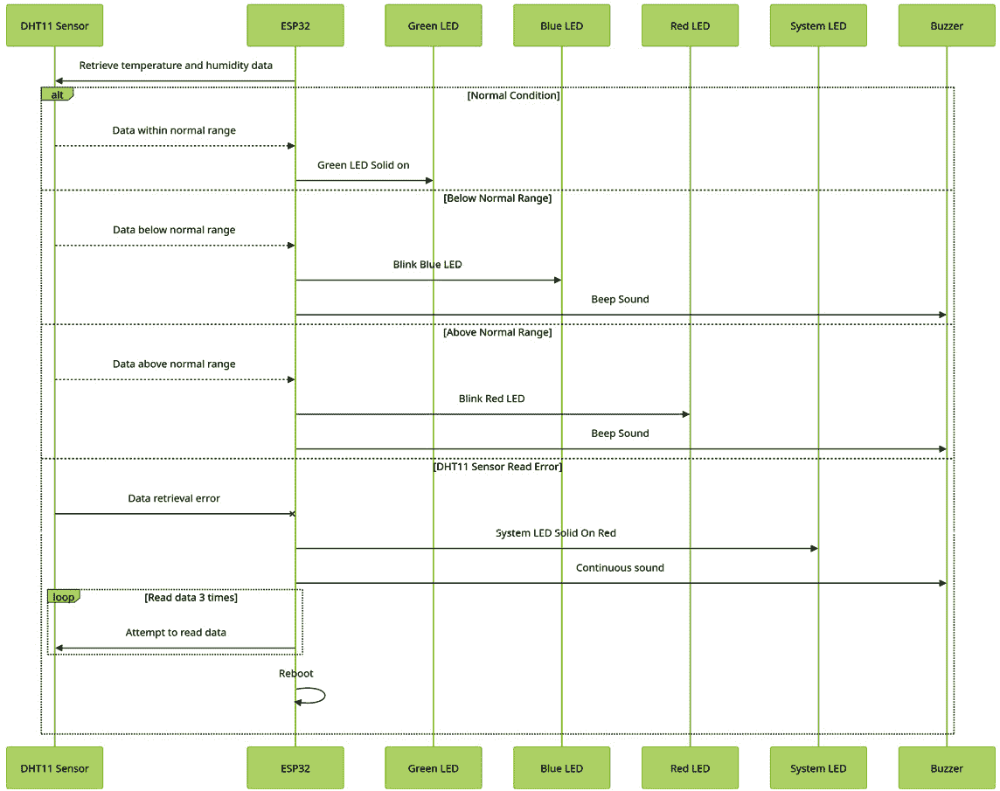

图 11.1 – 本地服务逻辑图

一个清晰简洁的图表无疑将帮助你建立全面系统设计，充分考虑正常情况和异常情况。你可以使用此图作为指南来制作硬件原型，并指导 ChatGPT 生成相应的代码。现在，让我们继续到创建硬件原型的部分。

# 构建设备硬件原型

为了确保 Arduino 兼容的温度和湿度传感器 DHT11 与 MCU ESP32 正确运行以进行数据收集，你必须了解它们之间的正确连线。此外，你还应正确匹配 ESP32、一个用于警报的蜂鸣器和用于指示数据范围的 LED 之间的连线。根据我们在上一节中创建的图，为了制作设备硬件原型，我们需要以下元素：

+   一个微控制器 – ESP32-C3

+   温湿度传感器 – DHT11

+   一个带有红色、绿色和蓝色颜色的数据范围指示 LED

+   ESP32-C3 上的系统 LED

+   一个压电蜂鸣器

让我们更详细地了解这些内容：

+   **ESP32-C3**：在 *第三章* 中，我们介绍了 ESP32-C3，包括其规格和接口，如 GPIO、SPI 和 I2C。ESP32-C3（EVB 型号：esp32-c3-devkitc-02）模块的引脚布局如下表所示。

| **引脚顺序** | **引脚名称** | **GPIO** | **ADC** | **I2C** | **SPI** | **其他功能** |
| --- | --- | --- | --- | --- | --- | --- |
| 1 | GND |  |  |  |  |  |
| 2 | IO00 | GPIO0 | ADC_0 |  |  |  |
| 3 | IO01 | GPIO1 | ADC_1 |  |  |  |
| 4 | IO12 | GPIO12 |  |  | SPI_HD | LED D4 控制 |
| 5 | IO18 | GPIO18 |  |  |  | USB_D- |
| 6 | IO19 | GPIO19 |  |  |  | USB_D+ |
| 7 | GND |  |  |  |  |  |
| 8 | UART0_RX | GPIO20 |  |  |  |  |
| 9 | UART0_TX | GPIO21 |  |  |  |  |
| 10 | IO13 | GPIO13 |  |  |  |  |
| 11 | NC. |  |  |  |  |  |
| 12 | RST |  |  |  |  | RTC |
| 13 | 3V3 |  |  |  |  |  |
| 14 | GND |  |  |  |  |  |
| 15 | PWB |  |  |  |  |  |
| 16 | 5V0 |  |  |  |  |  |
| 17 | GND |  |  |  |  |  |
| 18 | 3V3 |  |  |  |  |  |
| 19 | IO02 | GPIO2 | ADC_2 |  | SPI_CK |  |
| 20 | IO03 | GPIO3 | ADC_3 |  | SPI_MOSI |  |
| 21 | IO10 | GPIO10 |  |  | SPI_MISO |  |
| 22 | IO06 | GPIO6 |  |  |  |  |
| 23 | IO07 | GPIO7 |  |  | SPI_CS |  |
| 24 | IO11 | GPIO11 |  |  | VDD_SPI |  |
| 25 | GND |  |  |  |  |  |
| 26 | 3V3 |  |  |  |  |  |
| 27 | IO05 | GPIO5 | ADC_5 | I2C_SCL |  |  |
| 28 | IO04 | GPIO4 | ADC_4 | I2C_SDA |  |  |
| 29 | IO08 | GPIO8 |  |  |  |  |
| 30 | BOOT | GPIO9 |  |  |  |  |
| 31 | 5V0 |  |  |  |  |  |
| 32 | GND |  |  |  |  |  |

表 11.1 – ESP32-C3 引脚分配图

请注意，ESP32-C3 具有两个内置 LED：

+   由 GPIO12 控制的 LED D4

+   由 GPIO13 控制的 LED D5

在本章中，我们将使用 LED D5 作为系统 LED。在*第十二章*中，我们将配置 LED D4 作为互联网访问状态指示器。

+   **DHT11**: DHT11 温度和湿度传感器在第*第八章*中介绍，配备 GND、VCC 和一个输出数据端口。

+   **蜂鸣器**: 我们这里使用的蜂鸣器是主动型，需要 GND 和 VCC 输入。

+   **RGB LED**: 我们这里使用的 RGB LED 是一种变色 LED。它配备了 GND、VCC、红色、蓝色和绿色引脚。

+   **电线连接**: 下面的原理图将指导您如何使用 DHT11 传感器、蜂鸣器和 RGB LED 连接 ESP32-C3 模块。

+   **电源供应**: 当您通过 USB-C 线缆从 MacBook 连接时，该板的电源通过 USB-C 端口供电。

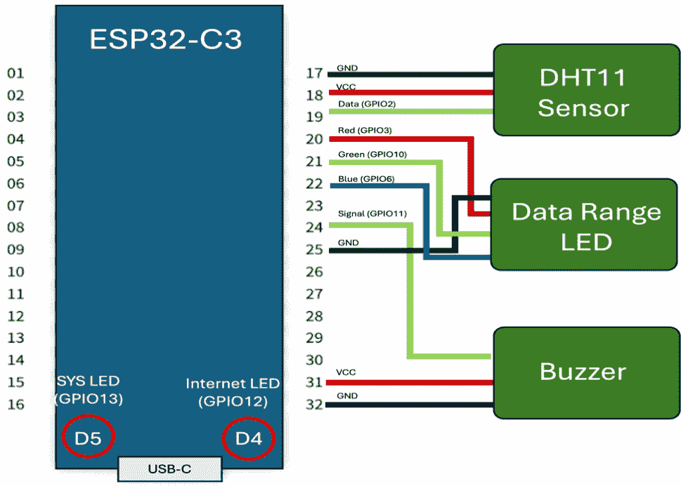

图 11.2 – 连接原理图

到目前为止，您应该能够根据*图 11.2*中的原理图正确地将 DHT11 传感器、数据范围指示 LED 和蜂鸣器连接到 ESP32。硬件原型搭建完成后，您现在可以开始对 ESP32 进行编码。

# 指导 ChatGPT 生成 C++代码

在本节中，我们将直接指导 ChatGPT 在 ESP32 上生成 C++代码，使用精心设计的应用程序逻辑图和硬件引脚连线作为有效提示。

在您仔细审查了图示、理解了应用逻辑并熟悉了在第*第六章*和*第八章*中概述的 ChatGPT 提示后，您可以创建自定义提示。这些提示将指导 ChatGPT 根据您的应用逻辑生成代码。

以下是一个提示示例，用于指导 ChatGPT 根据您的应用逻辑生成代码：

`你好，ChatGPT，`

`角色：`

`你扮演一个具有嵌入式开发专业知识的高级软件开发者，特别是使用 ESP32、Arduino 兼容传感器和` `AWS 云` `的物联网项目。`

`任务：`

`你的任务是指导一个像我这样的对 Python 有基本了解但对 C++ 新手的高中生。你需要开发一个满足以下目标、详细要求、实施指导和输出格式的综合代码片段。`

`目标：`

`根据以下要求，在 ESP32-C3 上使用 PlatformIO IDE 和 Arduino 框架以及 Espressif32 平台创建一个教育性的 C++ 代码片段。`

`要求：`

1.  `引脚连接：`

    1.  `将 DHT11 的数据引脚连接到 ESP32-C3 的 IO2。`

    1.  `将压电蜂鸣器的信号引脚连接到 ESP32-C3 的 IO11。`

    1.  `将 RGB LED 连接到 ESP32-C3 的 IO1 以控制红色，IO12 用于蓝色，IO0 用于绿色。`

    1.  `使用 IO13 控制 ESP32-C3 内置 LED D5，指定为系统 LED。`

1.  `数据检索操作：定期读取 DHT11 传感器的温度和湿度数据，并以摄氏度和华氏度在本地打印出来。`

1.  `正常条件：检索到的数据在预定义的正常范围内。`

1.  `异常条件：检索到的数据超出预定义的正常范围。`

1.  `错误条件：数据检索失败，系统将尝试读取数据三次。如果三次尝试都失败，系统将启动重启。`

1.  `视觉和声音指示：`

    1.  `正常条件：RGB LED 亮起并关闭蜂鸣器。`

    1.  `异常条件：如果数据超出正常范围，RGB LED 将闪烁红色，蜂鸣器将同步鸣叫；如果数据低于正常范围，RGB LED 将闪烁蓝色，蜂鸣器将同步鸣叫。`

    1.  `错误条件：系统 LED 亮起并触发蜂鸣器连续鸣叫。`

`必须应用：`

+   `采用 C++ 编程最佳实践。`

+   `使用 "constexpr" 声明与硬件相关的变量。`

+   `使用 millis() 函数管理时间，而不阻塞其他代码执行。`

+   `优先使用函数而不是类。`

+   `使用 ledcSetup 和 ledcAttachPin 实现系统 LED 和蜂鸣器的 PWM 控制。`

+   `在定义常量变量时避免使用魔法数字。`

+   `使用非阻塞方法独立闪烁 LED。`

+   `包含必要的依赖库。`

+   `提供逐行注释以提高清晰度。`

`输出格式：您的代码片段输出必须符合以下示例格式。`

```py
 1. // **********************************
 2. // Created by: ESP32 Coding Assistant
 3. // Creation Date: [Current Date]
 4. // **********************************
 5. // Code Explanation
 6. // **********************************
 7. // Code Purpose:
 9. // Requirement Summary:
11. // Hardware Connection:
13. // New Created Function/Class:
15. // Security Considerations:
17. // Testing and Validation Approach:
19. // **********************************
20. // Libraries Import
21. // **********************************
23. // **********************************
24. // Constants Declaration
25. // **********************************
27. // **********************************
28. // Variables Declaration
29. // **********************************
31. // **********************************
32. //  Declaration
33. // **********************************
35. // **********************************
36. // Setup Function
37. // **********************************
39. // **********************************
40. // Main loop Function
41. // **********************************
42. // **********************************
40. // Functions Definition
41. // **********************************
```

+   `创建一个平台 io.ini 文件，其中包含所需的库依赖和环境设置。`

+   `确保包含以下信息。`

```py
 1. [env:esp32-c3-devkitc-02]
 2. platform = espressif32
 3. board = esp32-c3-devkitc-02
 4. framework = arduino
 5. monitor_filters = esp32_exception_decoder, colorize
 6. monitor_speed = 115200
 7. build_src_filter = +<../../src/>  +<./>
 8. board_build.flash_mode = dio
 9. build_flags =
10.     -DARDUINO_USB_MODE=1
11.     -DARDUINO_USB_CDC_ON_BOOT=1
12.     -w
13. lib_deps =
14.     adafruit/DHT sensor library@¹.4.6
15.     adafruit/Adafruit Unified Sensor@¹.1.14
```

到目前为止，你已经学会了如何使用这些提示请求 ChatGPT 在你的 ESP32 上生成代码。接下来，让我们看看一些代码示例。

# `代码示例`

您可以在 [`github.com/PacktPublishing/Accelerating-IoT-Development-with-ChatGPT/tree/main/Chapter_11`](https://github.com/PacktPublishing/Accelerating-IoT-Development-with-ChatGPT/tree/main/Chapter_11) 找到 `ChatGPT_Prompt`、`main.cpp` 代码和 `platformio.ini` 文件的示例。

在`main.cpp`的示例中，你可以找到用户定义的`setup()`和`loop()`函数，它们实际上是在 FreeRTOS 任务中运行的。我们在*第三章*的*MCUs*部分提到了 FreeRTOS。当在 PlatformIO 上使用 Arduino 框架时，ESP32 默认支持 FreeRTOS。Arduino ESP32 平台自动包含 FreeRTOS 堆栈，并在`setup()`和`loop()`函数中调用 FreeRTOS 的 API。

在`main.cpp`示例代码中，以下七个函数是由 ChatGPT 生成的。请注意，函数名可能与 ChatGPT 的输出不同：

+   `checkSensorReadings()`: 读取传感器数据值

+   `updateLEDs(bool red, bool green, bool blue)`: 根据数据值更新 RGB LED 的颜色

+   `indicateNormalCondition()`: 当数据值落在预定义阈值范围内时，指示正常条件

+   `indicateConditionBelowRange()`: 如果数据值低于预定义阈值，指示低于范围的状况

+   `indicateConditionAboveRange()`: 如果数据值超过预定义阈值，指示超出范围的状况

+   `indicateSensorError()`: 如果数据值为空，指示传感器错误

+   `ledBlinking()`: 处理 LED 闪烁和蜂鸣器蜂鸣

此外，为了按照要求控制 LED 和蜂鸣器，ChatGPT 通过`digitalWrite()`方法创建了正确的方法，PWM 可以有效地控制 LED 的亮度。这比使用电阻来降低 LED 亮度更节能，并且可以实现亮度级别之间的更平滑过渡。此外，PWM 不仅可以用于蜂鸣器的音量控制，还可以生成不同的音调。通过改变 PWM 信号的频率，可以改变蜂鸣器发出的声音的音调，这在需要不同警报音或音符的应用中非常有用。

在本节结束时，你应该能够通过遵循你的指示和应用逻辑来提示 ChatGPT 生成代码。在下一节中，我们将通过 PlatformIO 对 ESP32 进行编译和上传代码。

# 使用 PlatformIO 在 ESP32 上编程

在本节中，我们将通过 PlatformIO IDE 在 ESP32 上构建和上传代码。然后，我们将观察在 Macbook 上本地打印的消息，并验证结果是否与我们的逻辑一致。

这里是要遵循的步骤：

1.  在 VS Code 中启动 PlatformIO IDE，转到你在*第十章*中创建的项目，在`project`文件夹下的`src`中查找`main.cpp`，从 ChatGPT 对话窗口中复制你得到的代码，并将其放入`main.cpp`中，如图所示：

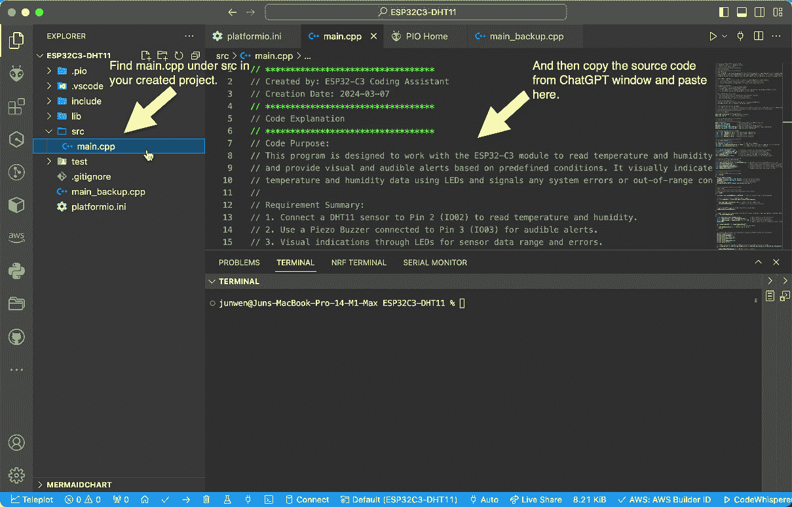

图 11.3 – 将 ChatGPT 中的 main.cpp 代码复制到 PlatformIO

1.  在您的项目文件夹中找到 `platformio.ini` 文件，然后从 ChatGPT 对话窗口复制 `platformio.ini` 内容，并将其粘贴到此处。

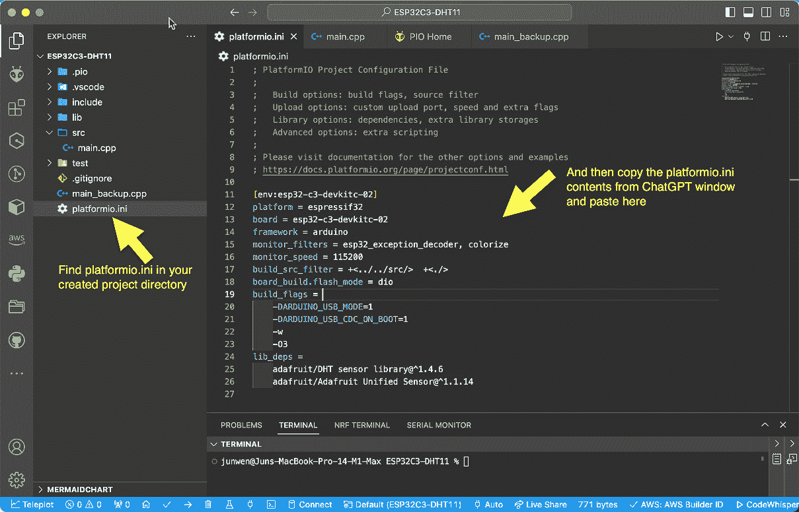

图 11.4 – 从 ChatGPT 复制 platformio.ini 代码到 PlatformIO

1.  在 `platformio.ini` 文件示例中，`lib_deps` 下有两个库：`adafruit/DHT sensor library@¹.4.6` 和 `adafruit/Adafruit Unified Sensor@¹.1.14`。您需要从 PlatformIO 的 **库** 部分手动安装它们，如图中所示截图。

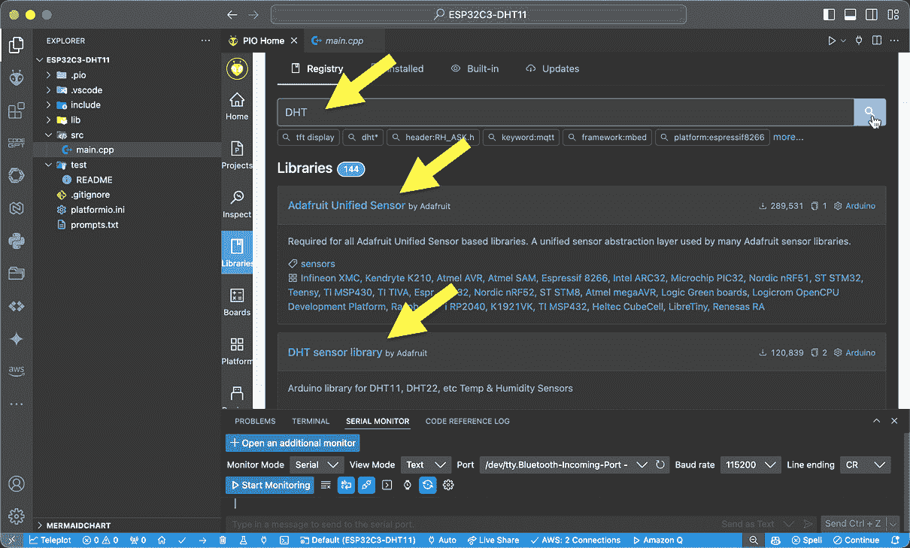

图 11.5 – 在 PlatformIO 中安装 Adafruit Unified Sensor 和 DHT 传感器库

1.  寻找如图 *图 11*.6* 所示的 *构建* 按钮，以编译从 ChatGPT 生成的代码。

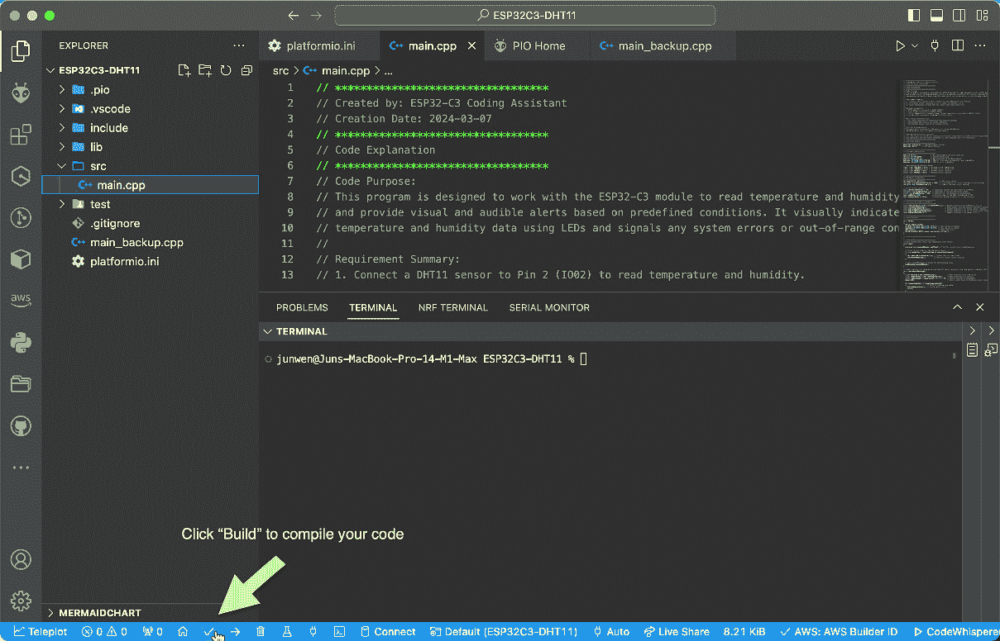

图 11.6 – 代码构建的开始

1.  在 *图 11*.7* 中显示的 `SUCCESS` 表示您的代码已成功编译并准备好上传到 ESP32。如果有任何错误报告，您可以请求 ChatGPT 帮助您纠正，直到构建成功。

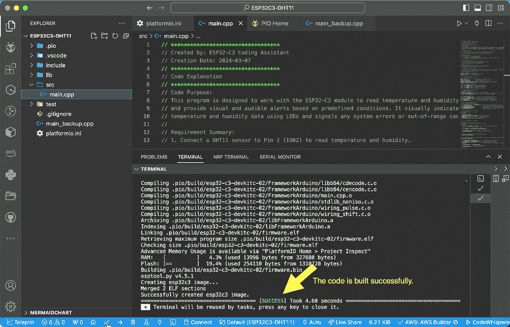

图 11.7 – 代码构建完成

1.  代码构建成功后，请确保您的 MacBook 和 ESP32 之间的控制台电缆连接正确，按照 *图 11*.8* 中显示的说明进行检查，然后再将代码上传到 ESP32。请注意，控制台电缆通常是 Type-C 到 Type-C USB 电缆。如果您的 MacBook 和 ESP32 板之间的控制台电缆连接正确，您可以点击 *自动* 检查 USB 端口是否显示如下。

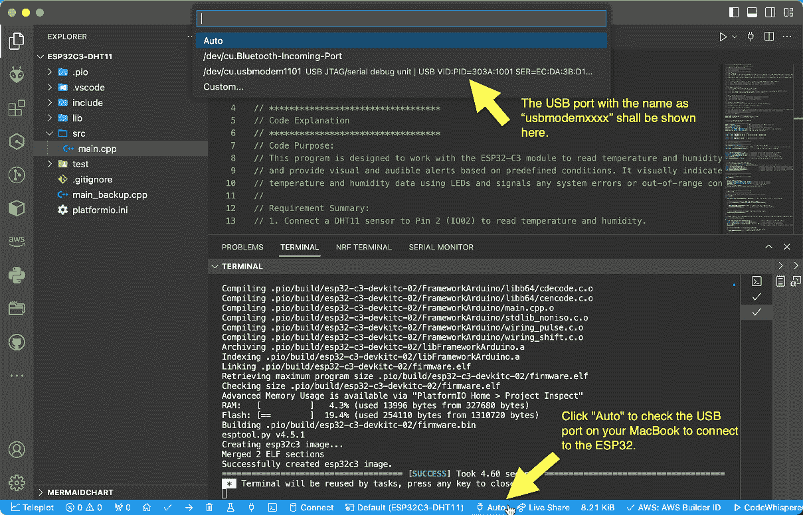

图 11.8 – 检查 MacBook 的 USB 端口是否连接到 ESP32

1.  点击 **上传** 按钮将编译后的代码上传到 ESP32。

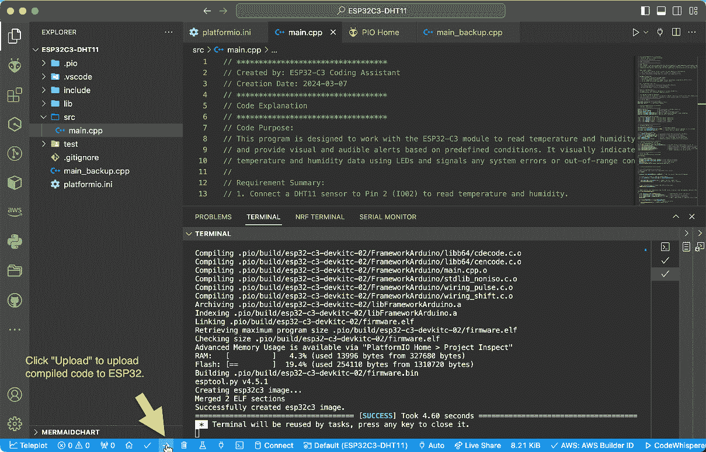

图 11.9 – 点击“上传”将代码上传到 ESP32

1.  观察写入过程，直到显示 `SUCCESS`。

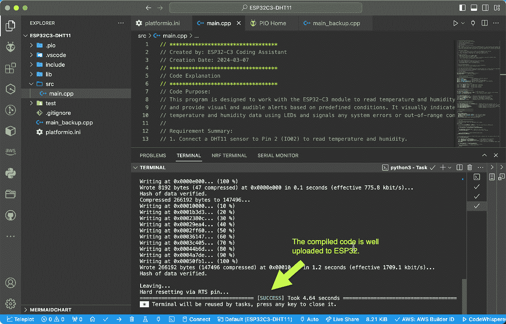

图 11.10 – 代码上传完成

1.  写入过程完成后，ESP32 将重新启动，您可以在 **串行监视器** 中找到 **Serial Monitor** 按钮，以查看打印在 MacBook 控制台端口上的消息。

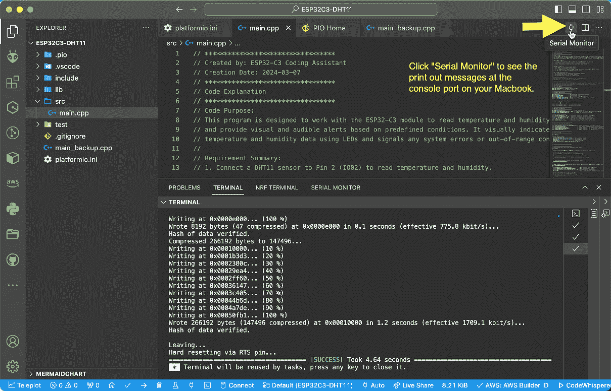

图 11.11 – 在串行监视器中打开本地控制台窗口

1.  当您的代码正确且符合您的预期，并且您已成功将其上传到 ESP32 后，您可以在 **TERMINAL** 窗口中看到打印出来的消息。

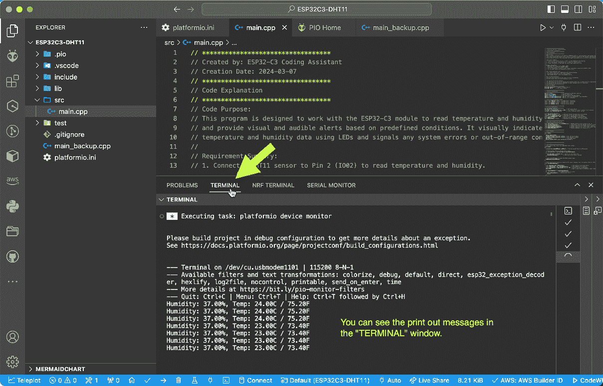

图 11.12 – 在 TERMINAL 窗口中观察输出消息

现在，你应该准备好在 ESP32 上编译和上传代码以验证结果。如*第六章*中所述，ChatGPT 在第一轮对话中可能无法提供 100%准确的代码。你可能需要通过进一步的对话不断提示 ChatGPT 来纠正和改进其输出。重复验证过程几次，直到完全符合你的期望。

# 摘要

在本章中，你将 ESP32-C3 连接到了一个 DHT11 传感器和一个压电蜂鸣器，成功完成了你的第一个物联网项目代码。你应该能够在你的本地控制台端口上验证输出，观察温度和湿度数据。LED 的颜色将改变，根据你的应用程序流程，蜂鸣器将在异常或错误情况下发出蜂鸣声。

在下一章中，我们将通过将你的 ESP32-C3 连接到你的家庭 Wi-Fi 网络来继续前进。这是在将 DHT11 数据传输到 AWS 云之前的一个关键步骤。
