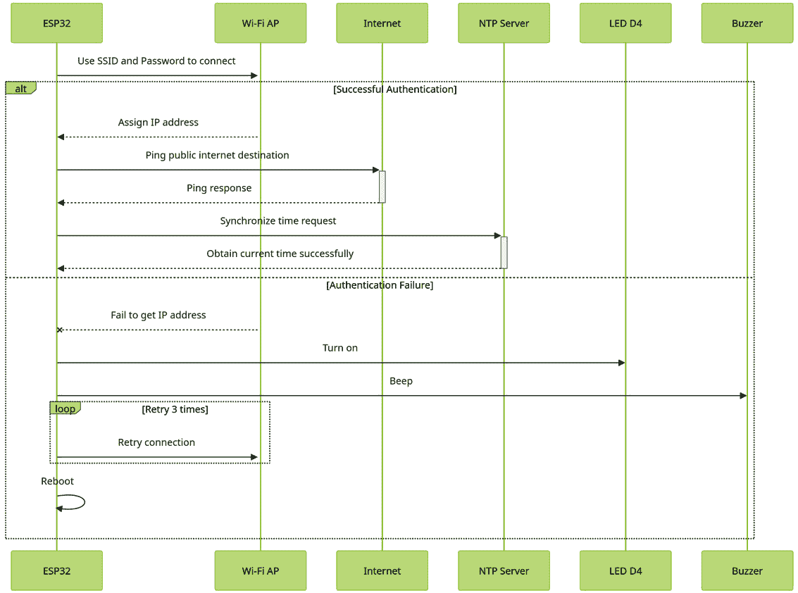
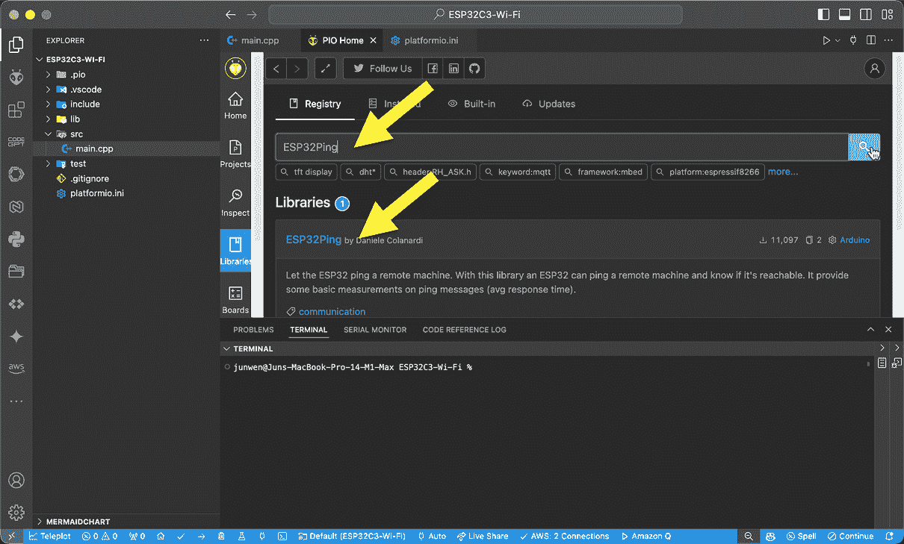
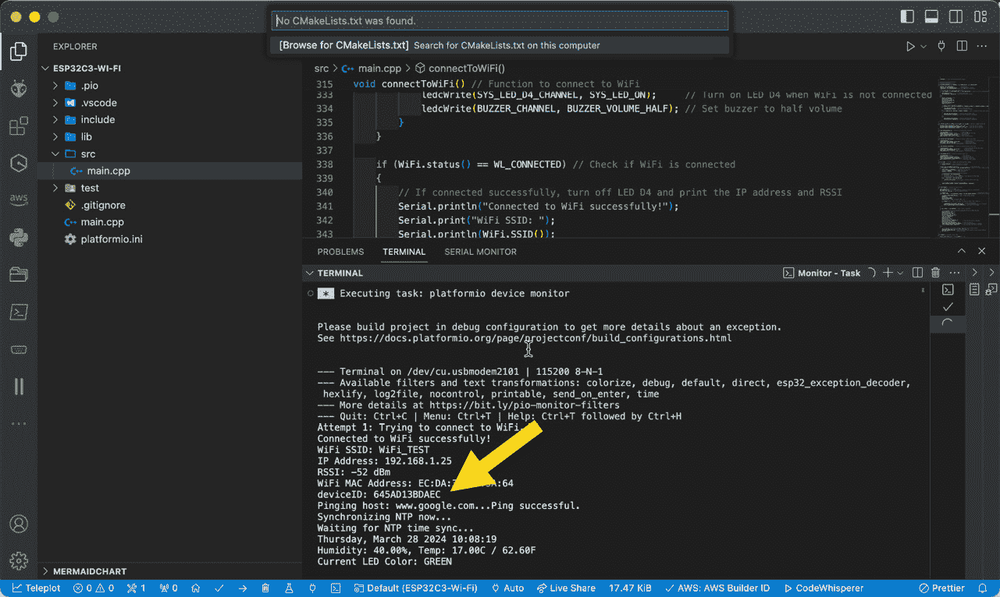

# 第十二章：建立 Wi-Fi 连接

在上一章中，我们成功构建了硬件原型并编写了第一个代码来读取 DHT11 传感器的数据。这些数据可以从 PlatformIO **终端**窗口的本地控制台端口观察到。下一步是从 ESP32 建立到您家 Wi-Fi 路由器的 Wi-Fi 连接。

将 ESP32 连接到互联网是将传感器数据发送到云端的必要步骤。在本章中，我们将继续设计 Wi-Fi 访问逻辑，使用 AI Chat 在 [`mermaidchart.com`](https://mermaidchart.com) 绘制图表，并指导 ChatGPT 生成代码以启用 ESP32 上的 Wi-Fi 访问。

本章将涵盖以下主题：

+   设计 Wi-Fi 访问逻辑

+   创建 Wi-Fi 访问流程图

+   指导 ChatGPT 生成代码

+   代码示例

+   在 ESP32 上验证互联网访问

在本章中，我们将 Wi-Fi 凭据、ping 主机地址和 NTP 服务器地址存储在 `Platformio.ini` 文件中，然后将其传递给主代码。这是一种高度适应性的方法，旨在绕过在代码主体中直接存储信息的需求。这样做使得未来的修改和改进更加容易，从而提高了代码的整体效率、功能、安全性和可读性。

# 设计 Wi-Fi 访问逻辑

想象一下将我们在上一章中创建的硬件原型带到仓库。在这里，您需要使用正确的 SSID 和密码将 ESP32 连接到本地 Wi-Fi 网络。在收到有效的 IP 地址后，您将 ping 一个公共主机以验证互联网访问，然后与 NTP 服务器同步以获取准确的时钟时间。有两种方法可以向您的设备提供 SSID 和密码：

+   通过 `main.cpp` 代码或通过存储并通过 `Platformio.ini` 文件传递。

+   **选项 2**：使用您的手机帮助 ESP32 连接到您的本地 SSID 并输入您的密码。

**选项 1** 简单直接，但缺乏安全和灵活性。**选项 2** 灵活、安全，且易于在各种地点部署，但代码设计复杂度高。

在这个项目中，我们将以 **选项 1** 为例来配置 SSID 和密码。以下是简化后的 Wi-Fi 访问逻辑：

1.  ESP32 使用 SSID 和密码访问本地的 Wi-Fi **接入点**（**AP**）或路由器。

1.  本地 Wi-Fi AP 或路由器与 ESP32 执行 WPA2-PSK 认证。

    如果认证成功，本地 Wi-Fi AP 或路由器将为 ESP32 分配一个有效的本地 IP 地址。如果密码错误，认证将失败。

1.  在正常情况下，一旦 ESP32 接收到有效的 IP 地址，它就会 ping 一个公共互联网目标并与 NTP 服务器同步以获取当前时间。

1.  在异常情况下，如果 ESP32 无法获取有效的 IP 地址，ESP32 将设置为打开 LED D4 作为互联网连接失败的指示器，蜂鸣器将发出声音，重试三次，然后重启。

在本节中，我们为 ESP32 访问 Wi-Fi 网络设计了逻辑，考虑了正常情况和异常情况。在下一节中，我们将使用这个逻辑与 AI 创建流程图。

# 创建 Wi-Fi 访问流程图

与*第十一章*一样，我们可以在[mermaidchart.com](http://mermaidchart.com)上继续生成一个服务流程图，您可能会看到如下示例中生成的一个服务流程图。



图 12.1 – 互联网访问图

在此图中，我们使用 ESP32 上的 LED D4 和蜂鸣器来指示互联网访问状态。它们提供视觉和听觉信号，以便轻松显示互联网访问是否成功。这种方法比在**终端**窗口中观察打印消息更方便。

在本节中，我们使用 AI Chat 在[mermaidchart.com](http://mermaidchart.com)创建了一个互联网访问图。通过遵循此图，我们可以开始指导 ChatGPT 更新*第十一章*中的先前代码，以支持通过 Wi-Fi 进行互联网访问。

# 指示 ChatGPT 生成代码

在本节中，我们将要求 ChatGPT 更新在*第十一章*中生成的先前代码，以实现 Wi-Fi 访问逻辑。您可以指示 ChatGPT 处理先前代码并添加互联网访问需求：

`Hi, ChatGPT`

`请参考以下代码，保持其当前的结构和风格，并支持以下` `附加要求。`

`需求：`

+   `Wi-Fi 访问：使用预配置的 SSID 和密码访问 Wi-Fi。SSID 和密码存储在` `Platformio.ini 文件中。`

+   `正常情况：ESP32 收到一个有效的 IP 地址。然后它 ping 一个公共互联网目标并与 NTP 服务器同步以获取` `当前时间。`

+   `异常情况：如果 ESP32 无法获取有效的 IP 地址，ESP32 的 LED D4（IO12）将打开作为 Wi-Fi 连接失败的指示器。蜂鸣器将发出蜂鸣声，系统将在重启前重试三次。`

`Platformio.ini 文件：`

+   `创建一个新文件，包含` `ESP32Ping 库。`

接下来，让我们看看 ChatGPT 为我们生成的代码示例。

# 代码示例

您可以在[`github.com/ai-camps/book/blob/main/Chapter_12`](https://github.com/ai-camps/book/blob/main/Chapter_12)找到完成的`main.cpp`和`Platformio.ini`片段。

在更新的`main.cpp`中，您可以看到 ChatGPT 基于先前版本创建的三个新函数：

+   `connectToWiFi()`: 通过 SSID 和密码连接 Wi-Fi 的函数

+   `pingHost()`: Ping [google.com](http://google.com)以检查公共互联网是否可访问

+   `syncNTP`：从公共互联网 NTP 服务器获取当前日期和时间

此外，在更新的 platformio.ini 中，我们还采用了一种灵活的方法来存储和传递以下关键参数，使用`build_flags`将它们传递到主代码中。在提示时，您可以要求 ChatGPT 使用 platformio.ini 中相同的名称宏。这样做可以确保 ChatGPT 的输出不使用不同的名称：

```py
build_flags =
……..
-D WIFI_SSID=\"WiFi_TEST\"   //replace it by your actual Wi-Fi SSID
-D WIFI_PASSWORD=\"WiFi_Password\" //replace it by your actual Wi-Fi password
-D PING_HOST=\www.google.com\   //the DNS server for ping destination
-D NTP_SERVER=\"pool.ntp.org\" //the NTP server for time synchronization
-D GMT_OFFSET_SEC=-28800 //replace it by your local time zone, i.e., -28800 seconds means Pacific time zone, You can find your local time zone information at https://en.wikipedia.org/wiki/List_of_UTC_offsets.
-D DST_OFFSET_SEC=3600 // Day saving time is on
……..
```

在此上下文中使用`build_flags`提供了几个好处。它封装了您的凭证参数，将它们与您的代码和配置文件分开，通过降低凭证泄露的风险来增强安全性。这种做法也提高了可移植性，允许您轻松地将项目转移到另一台机器或开发环境中，而不会泄露敏感信息。更新也变得更加容易，因为您只需修改 platformio.ini 文件中的`build_flags`部分来更改这些参数，从而无需修改您的代码。重要的是，`build_flags`是一个构建时构造，使其与平台无关，可以在不同的平台上使用而无需修改。

在`platformio.ini`文件示例中，`lib_deps`下有一个新的库，即`marian-craciunescu/ESP32Ping@¹.7`。在编译代码之前，您需要从 PlatformIO 库中手动安装它，如下面的截图所示。



图 12.2 – 从 PlatformIO 安装 ESP32Ping 库

在本节中，我们要求 ChatGPT 通过添加对 Wi-Fi 访问的要求来修改之前的代码。接下来，让我们编译并上传新版本到 ESP32 以验证结果。

# 验证 ESP32 上的互联网访问

在本节中，我们将观察 PlatformIO **终端**窗口中的`Ping`命令响应和 NTP 同步结果。您可以使用 PlatformIO 按照上一章中的步骤编译和上传此代码到您的 ESP32。

*图 12*.*3*显示了在 PlatformIO 控制台**终端**窗口中打印的成功消息截图。



图 12.3 – 观察终端窗口中的打印信息

记下您屏幕截图上显示的设备 ID。设备 ID 是通过使用`ESP.getEfuseMac()`函数从 eFuse Mac 地址读取的唯一值派生出来的。在下一章中配置此设备在 AWS IoT Core 时，我们将使用设备 ID 作为*THING*的名称。重要的是要知道，一旦硬件模块制造完成，eFuse Mac 地址就不能更改。

在本节中，您已经学习了如何使用 Platformio 验证 ChatGPT 生成的更新代码。与*第十一章*一样，您可能需要调整对 ChatGPT 的提示，使其更加具体。这种迭代对话将有助于微调其代码生成。调整后，您应该重新验证新版本，直到结果完全符合您的服务流程图。

# 摘要

在本章中，您将 ESP32 连接到您的本地 Wi-Fi 网络。您应该能够在 PlatformIO 控制台 **TERMINAL** 窗口中验证前面的输出，观察 Wi-Fi 访问、互联网 ping 和 NTP 同步信息，以及温度和湿度数据。

在下一章中，我们将开始将 ESP32 连接到 AWS 云的旅程，首先关注 IoT Core。为此，我们将在 AWS IoT Core 中创建一个设备，生成访问凭证文件，将这些文件编程到 ESP32 上的代码中，并在 ESP32 和 AWS 之间设置基于 **TLS**（**传输层安全性**）的 **MQTT**（**消息队列遥测传输**）连接。
