# 第十三章：将 ESP32 连接到 AWS IoT Core

在上一章中，我们成功指导 ChatGPT 在 ESP32 上生成代码，以连接到你的 Wi-Fi 网络，获取 IP 地址，ping 一个互联网主机，并与**NTP**（**网络时间协议**）服务器同步以获取本地时间。现在，我们正在进入最关键的一步：通过**传输层安全性**（**TLS**）连接，使用 MQTT 协议将 ESP32 连接到**AWS IoT Core**。

到本章结束时，你将能够掌握将 ESP32 配置为 AWS IoT Core 中新的**THING**所需的技术和知识。不仅如此，你还将能够通过安全的 TLS/MQTT 连接将 ESP32 连接到 AWS IoT Core。

本章将涵盖以下主题：

+   *了解将 ESP32 连接到 AWS IoT Core 的方法*：了解 AWS IoT Core 实施的基于 X.509 证书的 TLS 安全访问机制

+   *在 AWS IoT Core 中创建一个 THING*：在 AWS IoT Core 控制台中配置 ESP32 作为新的 THING，生成设备证书和私钥，并附加连接策略

+   *在 ESP32 上创建 AWS 凭证头文件*：生成一个头文件以存储 TLS 设置中 AWS 根**证书颁发机构**（**CA**）证书、设备证书和私钥的内容

+   *指导 ChatGPT 在 ESP32 上生成 TLS 和 MQTT 代码*：请求 ChatGPT 通过在 ESP32 上导入 MQTT 和 TLS 库以及头文件来生成代码

+   *在 ESP32 上验证访问状态*：在 ESP32 本地终端窗口中监控连接状态

# 技术要求

在本章中，我们将继续使用`Platformio.ini`文件来存储和传递 AWS IoT Core 访问信息到 ESP32 的代码中。除了创建证书头文件外，我们还将创建一个硬件信息头文件，以识别 ESP32 的模块信息并将其包含在主代码中以进行设备识别。

# 理解将 ESP32 连接到 AWS IoT Core 的方法

如同在*第五章*（[B22002_05.xhtml#_idTextAnchor170]）*中*AWS for IoT*部分所讨论的，AWS 云提供的物联网设备访问服务是 AWS IoT Core。正如该部分所强调的，截至 2023 年 12 月，以下四种通信协议得到支持：

+   **MQTT**

+   **通过 WebSocket 安全传输** **MQTT**（**WSS**）

+   **超文本传输协议 –** **安全**（**HTTPS**）

+   **LoRaWAN**

在这些协议中，MQTT 因其广泛的应用而脱颖而出。它通过允许发布和订阅消息来满足客户端的需求。MQTT 的机制在第五章的*物联网设备与云之间的通信协议*部分中进行了解释。

在物联网设备与 AWS IoT Core 之间建立 MQTT 通信之前，必须使用 TLS 创建一个安全的低层连接。TLS 是一种加密协议，旨在在网络中提供安全的通信，支持服务器和客户端的身份验证。

在 ESP32 上实现 TLS 功能需要三个凭证文件来建立基于 X.509 证书的 TLS 连接与 AWS IoT Core：AWS 根 CA 文件、您的 ESP32 设备证书`.pem`文件和私钥`.pem`文件。以下是对它们的解释、功能以及获取方法：

+   `iot:Data`和`iot:Data-ATS`。`iot:Data`端点展示由 VeriSign Class 3 Public Primary G5 根 CA 证书签名的证书。`iot:Data-ATS`端点展示由 Amazon Trust Services CA 签名的服务器证书。您可以在[`docs.aws.amazon.com/iot/latest/developerguide/server-authentication.html`](https://docs.aws.amazon.com/iot/latest/developerguide/server-authentication.html)中找到详细信息。

    请注意，Arduino TLS 库仅支持`iot:Data`类型的端点。我们将选择支持`iot:Data`类型端点的 AWS IoT Core 区域，例如`us-west-2-amazonaws.com`。您可以在[`docs.aws.amazon.com/general/latest/gr/iot-core.html`](https://docs.aws.amazon.com/general/latest/gr/iot-core.html)中找到这些区域的详细信息，在*AWS IoT* *Core*部分的*第五章*。

    您可以从[`cacerts.digicert.com/pca3-g5.crt.pem`](https://cacerts.digicert.com/pca3-g5.crt.pem)下载 AWS 根 CA 证书、VeriSign Class 3 Public Primary G5 根 CA 证书，用于`iot:Data`类型端点。

+   `----``BEGIN CERTIFICATE-----`

+   base64 编码的`----``END CERTIFICATE-----`

此证书包含设备的公钥，并由 CA 签名。它在 TLS 握手过程中用于向另一方证明设备的身份。

+   `----BEGIN` `PRIVATE KEY-----`*   base64 编码的密钥*   `----END` `PRIVATE KEY-----`

在 TLS 握手过程中，设备不会传输其私钥。相反，它使用该密钥创建数字签名或解密用其公钥加密发送给它的信息，从而证明它持有相应的私钥，而不泄露它。

当您在 AWS IoT Core 控制台中创建一个设备时，系统会提示您下载设备证书 PEM 文件和设备私钥文件。您需要将它们保存，并将内容复制粘贴到凭证文件中，我们将在本章的练习中创建该文件，然后将它们编程到 ESP32 中。我们将向您展示如何创建凭证文件并在本章的主代码中调用它。

在 ESP32 代码实现中，我们将使用两个标准的 Arduino 库：`WiFiClientSecure.h`用于建立 TLS 连接，以及`PubSubClient.h`用于执行 MQTT 通信。这两个库通常一起使用，以确保通过 TLS 进行安全的 MQTT 通信：

+   `WiFiClientSecure.h`：Arduino Wi-Fi 盾库的一部分，这个库支持 TLS/SSL 连接。它是为处理加密连接而设计的`WiFiClient`的变体，这对于在互联网上安全地传输敏感数据至关重要。

+   `PubSubClient.h`：这个库提供了一个与 MQTT 服务器进行简单发布/订阅消息的客户端。

以下是在 ESP32 和 AWS IoT Core 之间设置 TLS 连接的步骤：

1.  登录 AWS 控制台。

1.  选择**AWS IoT Core**服务

1.  创建一个*东西*。

1.  生成并下载证书（设备证书 PEM 和私钥）。

1.  生成策略并将其附加到证书。

1.  使用 AWS 根 CA 证书和下载的证书在 PlatformIO 中创建`SecureCredentials.h`。

1.  通过调用`WiFiClientSecure.h`和`PubSubClient.h`来设置 TLS/MQTT 连接，在 ESP32 上编写程序代码。

1.  观察 ESP32 本地终端窗口中的打印消息。

在本节中，我们走过了整个流程，从在 AWS IoT Core 中配置设备到建立 TLS 连接。在下一节中，我们将逐步完成此流程。

# 在 AWS IoT Core 中配置 ESP32

在 AWS IoT Core 中开始配置 ESP32 之前，您必须完成以下任务作为先决条件：

+   在您的区域创建 AWS 账户

+   拥有一个具有**管理员访问权限**策略的管理员角色

假设您已经完成了前面的任务，让我们按照以下步骤在 AWS IoT Core 中配置您的 ESP32：

1.  以管理员角色作为**IAM**（**身份和访问管理**）用户从 AWS 控制台登录您的 AWS 账户：


图 13.1 – AWS 登录页面

1.  查找并点击**IAM**服务：

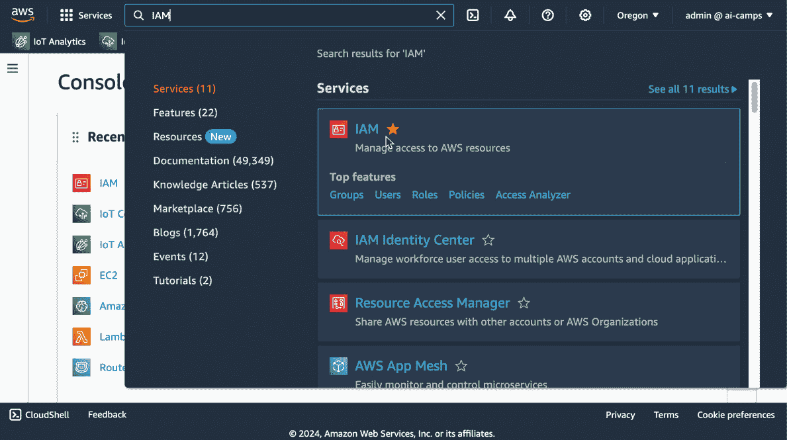

图 13.2 – 定位并启动 IAM 控制台

1.  查找并点击左侧的**用户**：

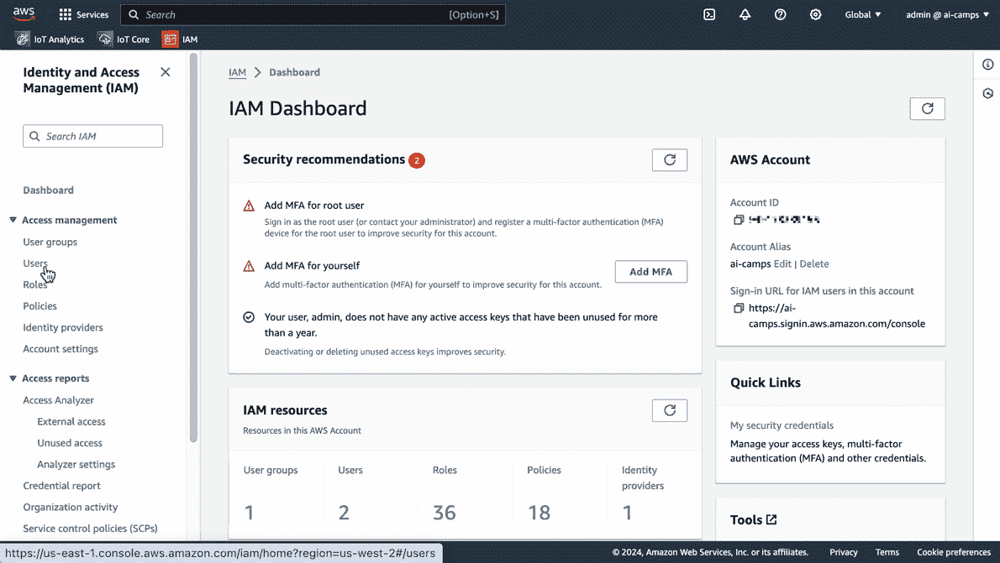

图 13.3 – 在 IAM 控制台中定位用户

1.  找到用于访问 AWS IoT Core 服务的常规 IAM 用户，例如以下截图中的 `jun.wen`。如果您没有这样的常规 IAM 用户，您可以在以下截图中的 **创建用户** 上单击以设置一个。此操作遵循 AWS 的 *最小权限* 原则，这是一种基本的安全实践，涉及授予用户和系统完成任务所需的最小访问级别。在 AWS 中实施此原则对于最小化潜在的安全风险和确保您的 AWS 环境的安全性至关重要。在此步骤中，我们将创建一个常规用户并授予他们足够的访问权限以访问合格的 AWS 资源。一旦我们完成此操作，我们将使用此常规 IAM 用户执行其余步骤的配置。

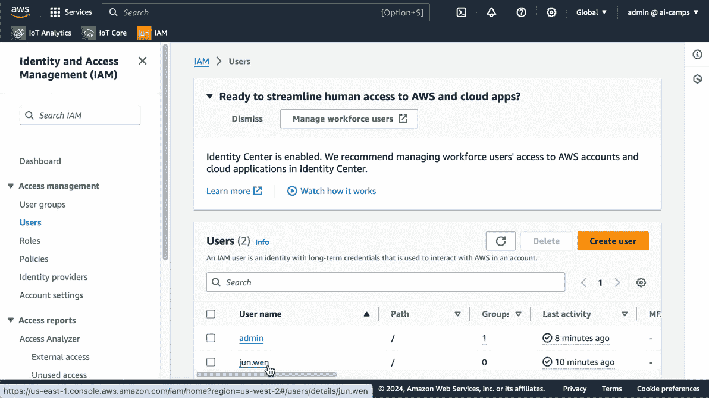

图 13.4 – 定位常规 IAM 用户

1.  单击常规 IAM 用户名称，并确保它已附加到以下截图中的这五个权限策略，因为我们将在后续步骤中使用所有这些服务：

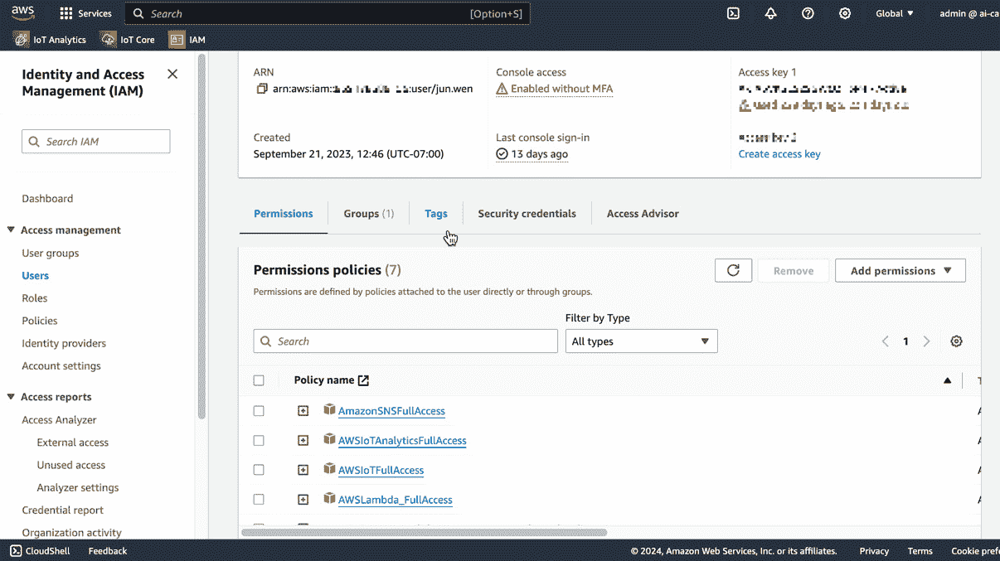

图 13.5 – 检查此常规 IAM 用户的权限策略

在此步骤中，我们将将此常规 IAM 用户附加到本章和*第十五章*所需的以下权限策略：

+   `AWSIoTFullAccess`：这提供了对 IoT 全部服务的访问权限，将在本章中使用。

+   `AmazonSNSFullAccess`：这提供了对 **SNS**（**简单通知服务**）服务的访问权限，将在*第十五章*中使用。

+   `AWSIoTAnalyticsFullAccess`：这提供了对 IoT 分析服务的访问权限，将在*第十五章*中使用。

+   `AWSLambda_FullAccess`：这提供了对 Lambda 服务的访问权限，将在*第十五章*中使用。

1.  如果您没有找到这些权限策略附加到此常规 IAM 用户，请单击前一个截图中的 **添加权限**。搜索并直接附加策略，如以下截图所示：

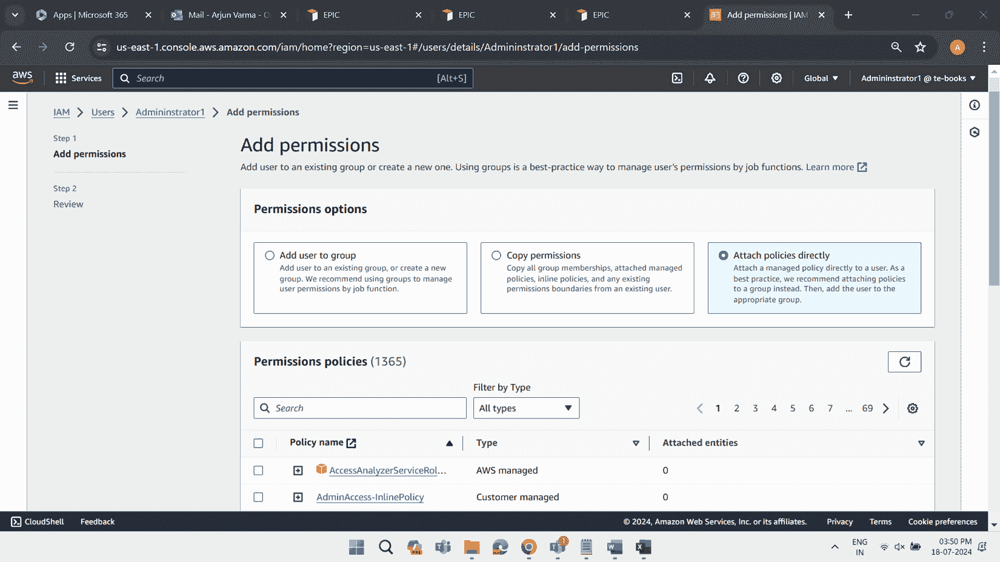

图 13.6 – 将必要的权限附加到此常规 IAM 用户

1.  现在，您已准备好以此常规 IAM 用户登录 AWS 控制台，如下所示：

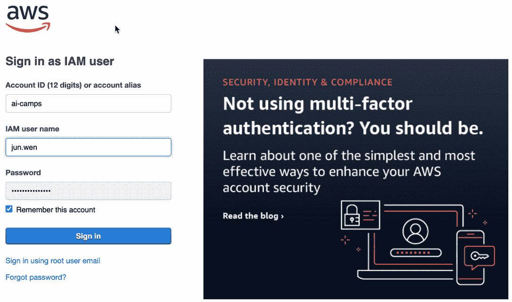

图 13.7 – 使用此常规 IAM 用户登录 AWS 控制台

登录后，选择靠近您位置的区域并支持 `iot:Data` 的端点类型，例如 `us-west-2` ([iot.us-west-2.amazonaws.com](http://iot.us-west-2.amazonaws.com))；您可以在 [`docs.aws.amazon.com/general/latest/gr/iot-core.html`](https://docs.aws.amazon.com/general/latest/gr/iot-core.html) 的 **AWS IoT Core - 控制平面端点** 中找到它：

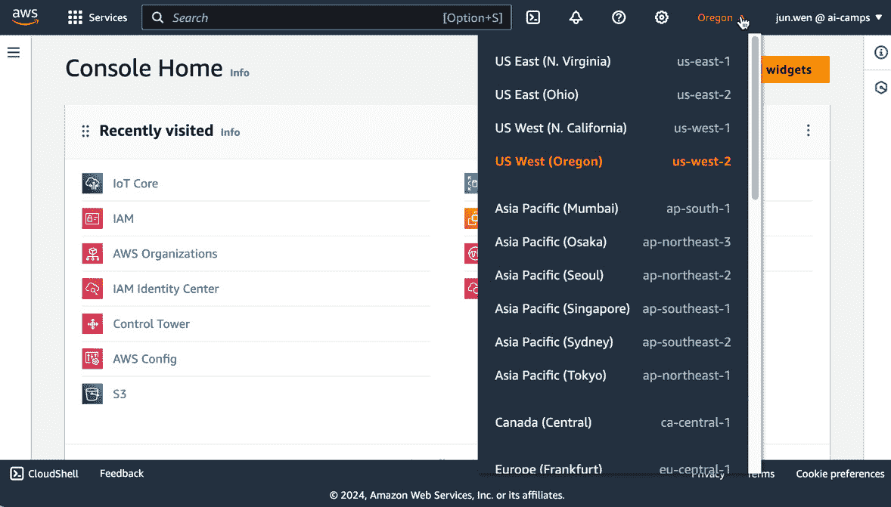

图 13.8 – 使用 AWS IoT Core 服务选择您的区域

1.  在左侧找到并点击**IoT Core**服务：

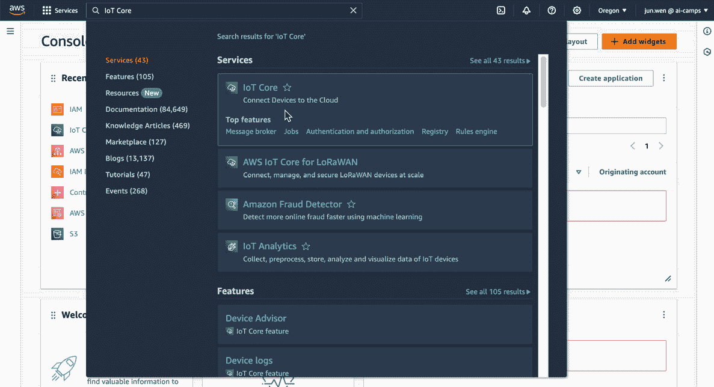

图 13.9 – 定位并移动到 IoT Core 控制台

1.  您将看到如下截图所示的**AWS IoT**服务：

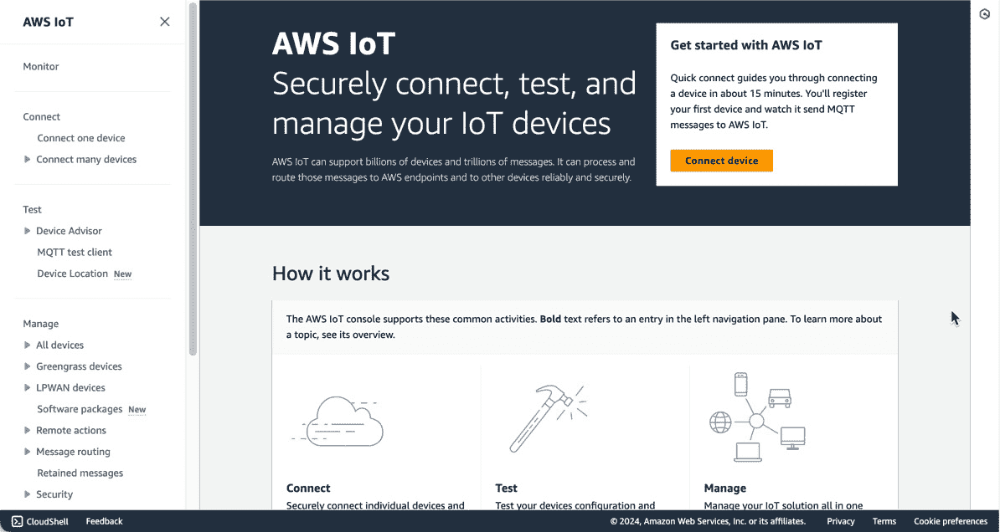

图 13.10 – IoT Core 欢迎页面

1.  在左侧找到并点击**事物**，然后点击**创建事物**：

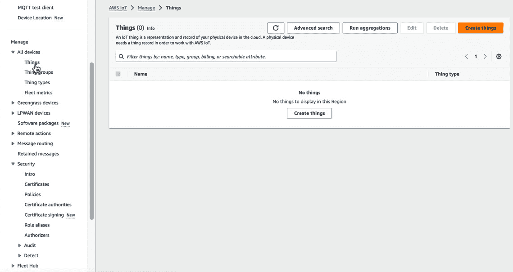

图 13.11 – 开始创建事物

1.  点击**创建单个事物**并点击**下一步**：

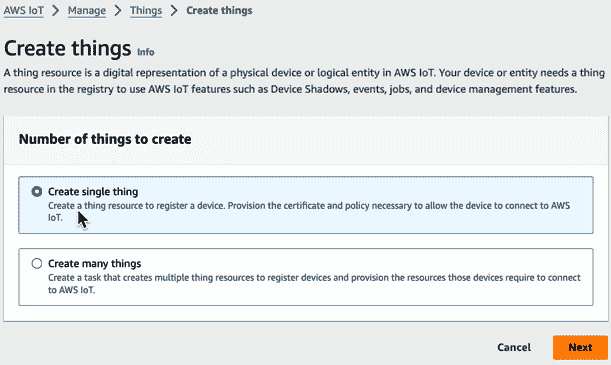

图 13.12 – 选择创建单个事物

1.  给事物一个 `deviceID` 名称，您从上一章运行代码中获得的 eFuse MAC。

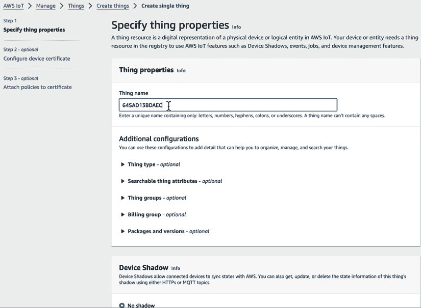

图 13.13 – 将 deviceID 分配给事物名称

1.  生成设备证书。请注意，证书文件可以与其他设备共享。在创建第一个设备之后，您可以选择**跳过创建证书**，然后将相同的证书附加到这些设备：

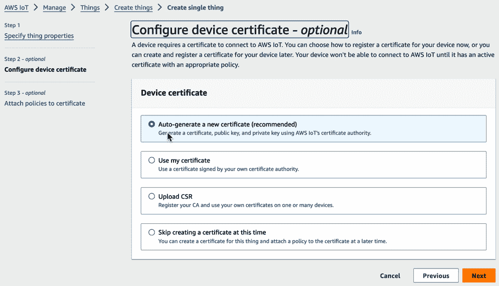

图 13.14 – 生成设备证书

1.  现在，您可以下载所有这些文件以供将来使用，或者只需下载如下截图所示的**设备证书**和**私钥文件**。将这些文件保存在您的计算机上，我们将复制并粘贴其内容到凭证头文件中，以便在 ESP32 上编程。

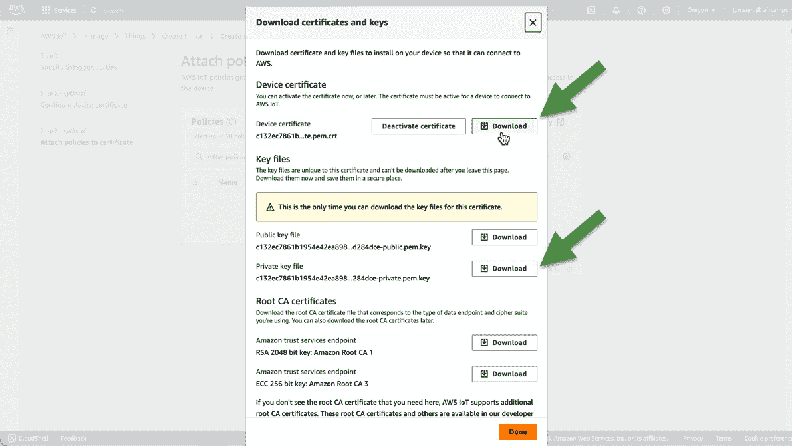

图 13.15 – 下载设备证书和私钥文件

1.  点击**创建事物**以完成第一个设备创建过程。

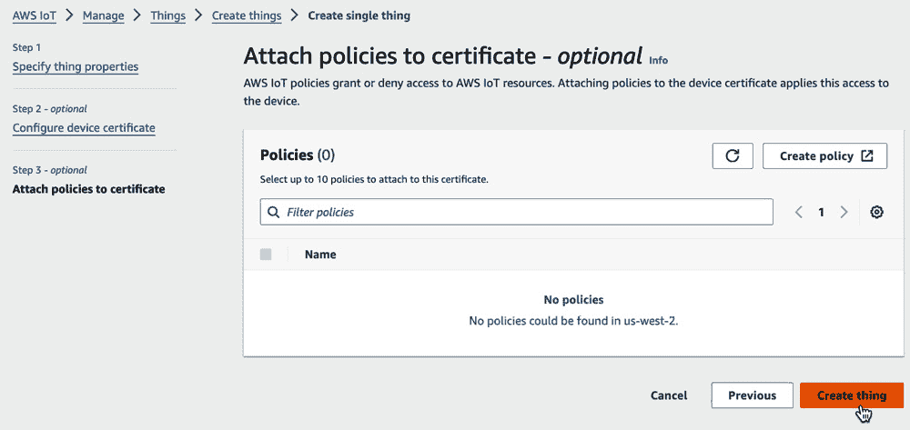

图 13.16 – 完成新设备创建

1.  您将看到之前分配的 `deviceID`。

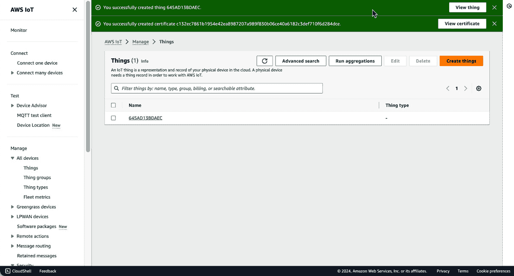

图 13.17 – 成功页面

1.  在左侧，找到并点击**策略**以创建策略：

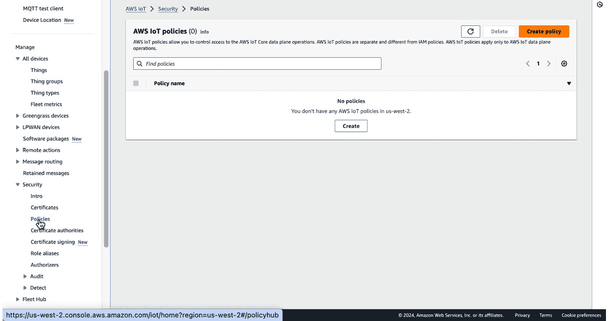

图 13.18 – 创建 IoT Core 访问策略

1.  您可以在此处输入策略名称，例如，`AWS_IOT_Core_Access`，如下截图所示。然后，点击 `us-west-2`) 和您的账户 ID。您可以通过点击右上角的账户名称来获取您的账户 ID 信息：

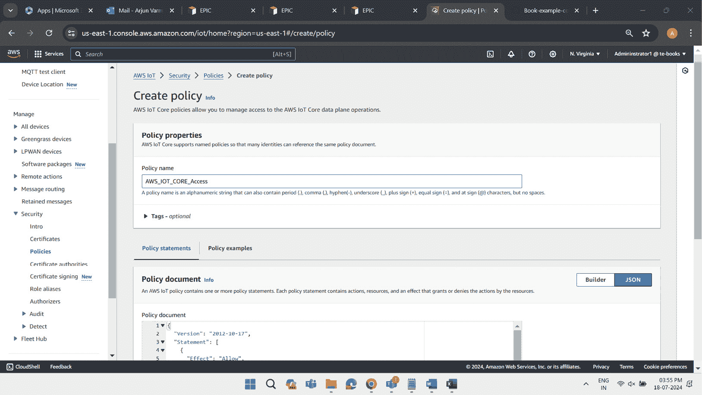

图 13.19 – 编辑策略文档

这里是策略文档内容的更详细查看（您可以在[`github.com/PacktPublishing/Accelerating-IoT-Development-with-ChatGPT/blob/main/Chapter_13/AWS_IOT_Core_Access`](https://github.com/PacktPublishing/Accelerating-IoT-Development-with-ChatGPT/blob/main/Chapter_13/AWS_IOT_Core_Access)找到示例）：

```py
 1\. {
 2.   "Version": "2012-10-17",
 3.   "Statement": [
 4.     {
 5.       "Effect": "Allow",
 6.       "Action": "iot:Connect",
 7.       "Resource": "arn:aws:iot:your_region:your_account_id:client/*"
 8.     },
 9.     {
10.       "Effect": "Allow",
11.       "Action": "iot:Publish",
12.       "Resource": "arn:aws:iot:your_region:your_account_id:topic/*"
13.     },
14.     {
15.       "Effect": "Allow",
16.       "Action": "iot:Subscribe",
17.       "Resource": "arn:aws:iot:your_region:your_account_id:topicfilter/*"
18.     },
19.     {
20.       "Effect": "Allow",
21.       "Action": "iot:Receive",
22.       "Resource": "arn:aws:iot:your_region:your_account_id:topic/*"
23.     }
24.   ]
25\. }
26.
```

1.  现在，您将创建一个名为 `AWS_IOT_Core_Access` 的策略，如图所示：

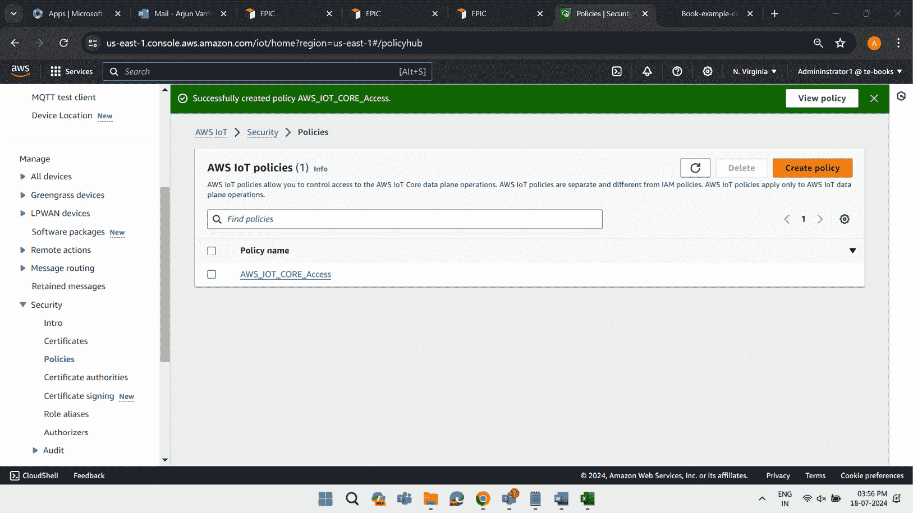

图 13.20 – 完成 AWS IoT Core 访问策略创建

1.  在左侧，点击 **证书**，您将看到已创建的证书 ID。点击此 **证书 ID**：

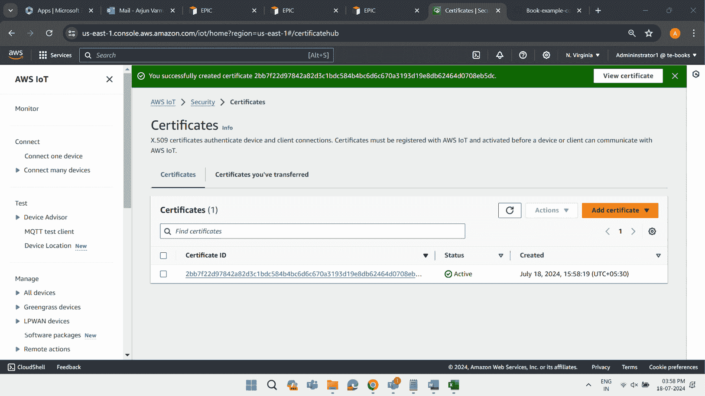

图 13.21 – 定位之前创建的证书

1.  现在，点击 **附加策略**：

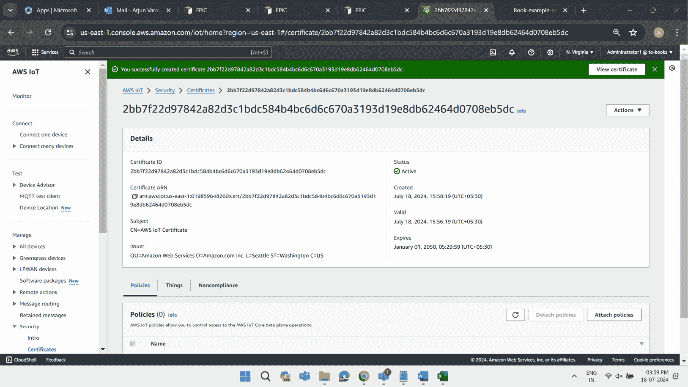

图 13.22 – 开始将策略附加到证书

1.  在提示窗口中，选择之前创建的策略。

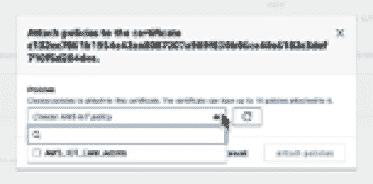

图 13.23 – 定位之前创建的策略

1.  现在，您可以看到附加到此证书 ID 的策略。

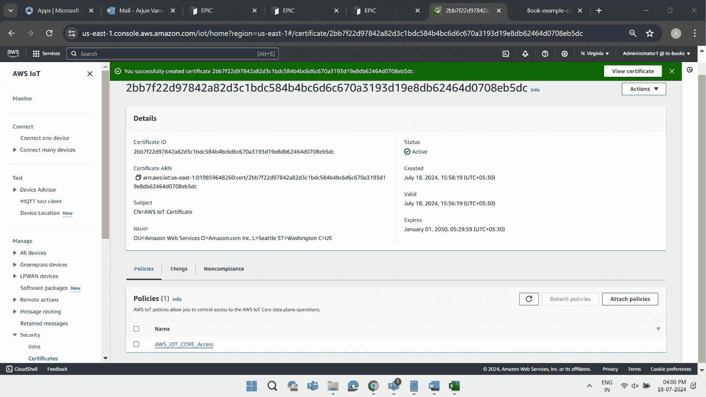

图 13.24 – 策略附加成功页面

现在，您已在 AWS IoT Core 中完成了设备配置过程，包括以下步骤：

+   您已创建了一个具有设备 ID 的设备名称（您的 ESP32 的设备 eFuse MAC 地址）

+   您已生成设备证书和私钥

+   您已在您的 PC 上下载了设备证书和私钥

+   您已创建连接策略并将其附加到证书 ID

您可以使用为未来其他设备创建的相同的证书、私钥和连接策略。这意味着当您添加更多设备时，您不需要创建新的证书、密钥和策略。在本步骤中，您已完成了在 AWS IoT Core 中的 ESP32 配置，生成了设备证书和私钥，并创建了一个访问 AWS IoT Core 的权限策略。在本章中，配置任务已在 AWS 端完成；现在，让我们继续编程 AWS 以支持 TLS 和 MQTT。

# 在 ESP32 上创建 AWS 凭证头文件

如所述，我们将创建一个包含 AWS 根 CA 证书、设备证书和私钥的凭证头文件，这是 TLS 设置所请求的。此头文件将被导入并在 ESP32 的主代码中调用。

你可以在[`github.com/PacktPublishing/Accelerating-IoT-Development-with-ChatGPT/tree/main/Chapter_13`](https://github.com/PacktPublishing/Accelerating-IoT-Development-with-ChatGPT/tree/main/Chapter_13)找到`SecureCredential.h`头文件的示例。此头文件将在`main.cpp`中调用。你的`SecureCredential.h`内容应类似于以下截图。


图 13.25 – `SecureCredential.h`文件格式示例

除了凭证头文件外，我们还需要创建一个硬件头文件来读取 ESP32 芯片组硬件信息，包括用于`deviceID`的 eFuse MAC 地址。你可以在相同链接文件夹中找到`HardwareInfo.h`头文件的示例。

只要创建了这两个头文件，`SecureCredential.h`和`HardwareInfo.h`，在下一步中，我们将继续提示 ChatGPT 更新上一章的代码，以调用这些新头文件，`SecureCredential.h`、`HardwareInfo.h`、`WiFiClientSecure.h`和`PubSubClient.h`，在`main.cpp`代码中，并与 AWS IoT Core 建立 TLS/MQTT 连接。

# 指导 ChatGPT 在 ESP32 上生成 TLS 代码

现在，让我们列出 ESP32 主代码中访问 AWS IoT Core 所需的必要信息：

+   TLS 证书，将存储在`SecureCredentials.h`头文件中

+   MQTT 服务器地址和端口，将存储在`Platformio.ini`文件中，例如，`AWS_IOT_MQTT_SERVER=\"xxxxxxxxxxxxxx.iot.your_aws_region.amazonaws.com\", AWS_IOT_MQTT_PORT=8883`

+   `deviceID`，将从`HardwareInfo.h`头文件中填充

注意，`AWS_IOT_MQTT_SERVER`是以下图中显示的端点地址；它在 AWS IoT 的设置下。请记住从端点地址中删除`-ats`，因为我们使用的是`iot:Data`端点类型，而不是`iot:Data-ATS`。

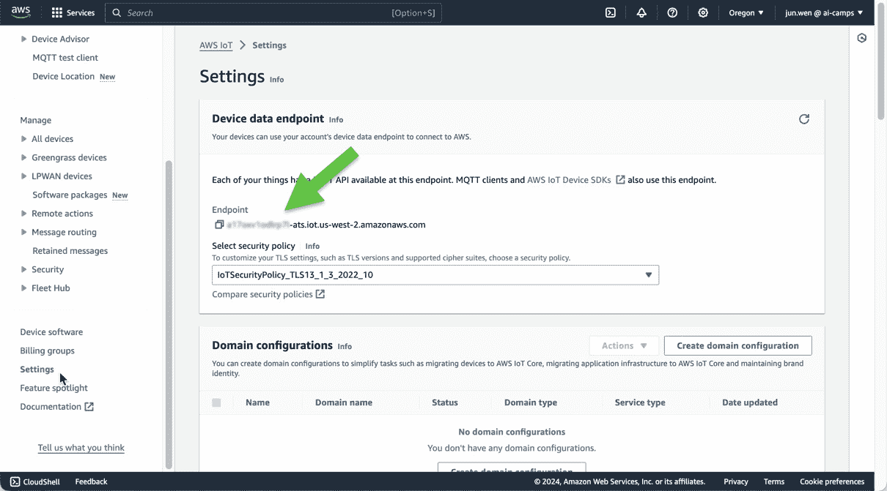

图 13.26 – 定位你的端点信息

你现在可以继续使用上一章创建的代码，并添加以下提示的 TLS MQTT 要求：

`Hi, ChatGPT。`

`请更新之前的代码，保持其当前的结构、风格和输出格式，并支持以下`附加要求：`

1.  `导入并使用 ESP32 标准库 WiFiClientSecure.h 进行 TLS 和 PubSubClient.h 进行 MQTT 堆栈。`

1.  `导入 SecureCredentials.h，该文件存储 AWS 证书，并在主代码中调用它。`

1.  `导入 HardwareInfo.h 以读取 eFuse MAC 地址作为` `deviceID`。`

1.  `在 Platformio.ini 文件中存储 AWS_IOT_MQTT_SERVER 和 AWS_IOT_MQTT_PORT 信息。`

1.  `在主代码中创建一个名为 connectAWS 的专用函数，用于 AWS IoT Core 访问。`

1.  `正常情况：如果 ESP32 成功访问 AWS IoT Core，打印出` `成功消息。`

1.  `异常情况：如果 ESP32 无法访问 AWS IoT Core，则打印出接收到的错误消息。`

# 代码示例

`main.cpp`代码的示例位于[`github.com/PacktPublishing/Accelerating-IoT-Development-with-ChatGPT/tree/main/Chapter_13`](https://github.com/PacktPublishing/Accelerating-IoT-Development-with-ChatGPT/tree/main/Chapter_13)。

在 `main.cpp` 代码中，您将找到一个由 ChatGPT 创建的新函数 `connectAWS()`，该函数位于 `setup()` 部分，负责初始化 TLS 连接。在此过程中，它调用根 CA、设备证书和私钥内容：

```py
void connectAWS() // Function to connect to AWS IoT Core
{
    // Configure WiFiClientSecure to use the AWS IoT device credentials
    net.setCACert(AWS_ROOT_CA);         // Set the AWS Root CA certificate
    net.setCertificate(AWS_CERT_CRT);   // Set the device certificate
    net.setPrivateKey(AWS_PRIVATE_KEY); // Set the private key
    // Set the AWS IoT endpoint and port
    mqttClient.setServer(AWS_IOT_MQTT_SERVER, AWS_IOT_MQTT_PORT);
    Serial.println("Connecting to AWS IOT Core");
    while (!mqttClient.connect(deviceID.c_str())) // Connect to AWS IoT Core
    {
        Serial.print(".");
        delay(MQTT_RECONNECT_DELAY_MS);
    }
    if (!mqttClient.connected()) // Check if the client is connected
    {
        Serial.println("AWS IoT Core connection is failed!");
        return;
    }
    Serial.println("AWS IoT Core is connected successfully!");
}
```

在编译和上传新代码之前，您需要从 PlatformIO **库**中搜索并安装 `PubSubClient.h`；请参考以下屏幕截图来执行它。

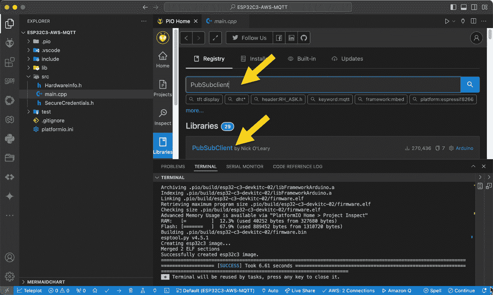

图 13.27 – 安装 PubSubClient 库

现在，您将 `SecureCredentials.h` 和 `HardwareInfo.h` 文件保存在 PlatformIO 中与 `main.cpp` 代码相同的文件夹中，如下面的屏幕截图所示：

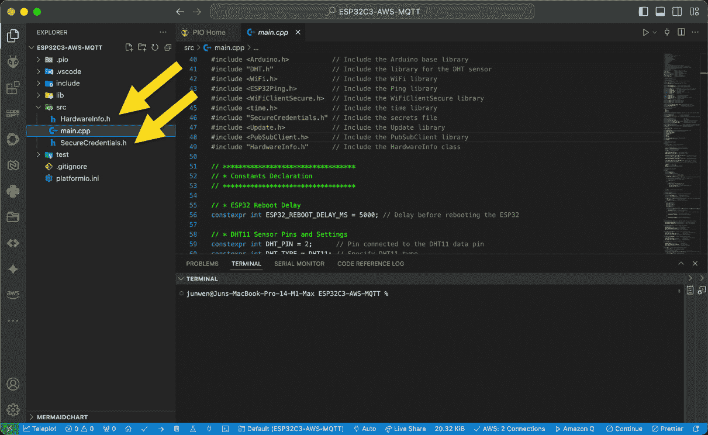

图 13.28 – 将 SecureCredential.h 和 HardwareInfo.h 复制到与 main.cpp 同一文件夹中

到本节结束时，您将能够请求 ChatGPT 更新代码以支持 TLS/MQTT 连接。在下一节中，我们将编译和上传代码，并在 ESP32 的终端窗口中验证访问状态。

# 在 ESP32 上验证访问状态

现在，您可以复制并粘贴 ChatGPT 中更新的主代码，编译并将其传输到 ESP32，然后在本地终端窗口中检查访问状态，如下面的屏幕截图所示。

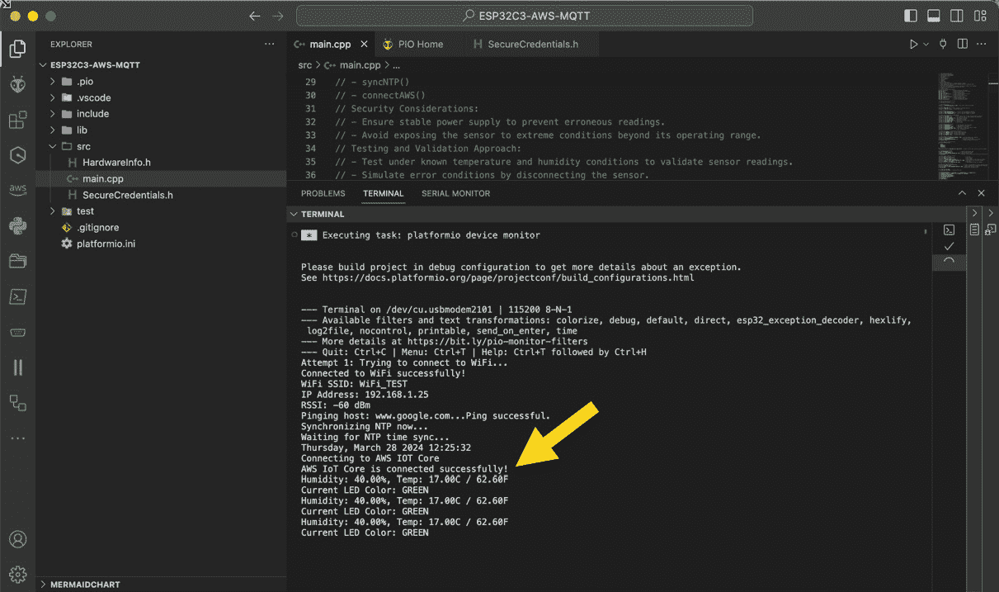

图 13.29 – 验证 AWS IoT Core 连接状态

在本节中，您已将 `main.cpp` 代码的修订版上传到 ESP32。之后，您将检查有关 ESP32 和 AWS IoT Core 之间连接状态的打印消息。如果您的 `SecureCredential.h` 头文件和 AWS MQTT 服务器配置正确，您的 ESP32 应该能够成功连接到 AWS IoT Core。

# 概述

在本章中，您使 ESP32 通过 TLS 连接通过 MQTT 访问 AWS 云。这是将传感器数据发送到 AWS 云的基本步骤。

在下一章中，在成功连接到 AWS IoT Core 之后，我们将使用 ESP32 上的 Arduino JSON 库发布 DHT11 温湿度和湿度数据到 AWS，并将在 AWS IoT Core 上观察接收到的 MQTT 消息。我们将继续使用 ChatGPT 在 ESP32 上构建代码以发布 MQTT 主题并创建 JSON 有效负载。
