# 第十五章：在 AWS 云上处理、存储和查询传感器数据

在上一章中，我们成功指导 ChatGPT 在 ESP32 中创建了一个 MQTT 发布主题和 JSON 格式的有效载荷，然后这些序列化数据被发送到 AWS IoT Core。从本章开始，我们将使用额外的 AWS 服务。这些服务将使我们能够处理异常事件、触发相应的电子邮件警报，以及存储、转换、排序和查询所有接收到的传感器数据。

到本章结束时，您将掌握配置各种其他 AWS 服务以处理、存储和查询收集到的传感器数据所需的技能。这将使您能够执行在商业部署环境中常规使用的各种关键任务。

在本章中，我们将介绍以下主要主题：

+   创建客户管理的策略

+   任务 1 – 异常事件处理

+   任务 2 – 数据存储和查询

# 创建客户管理的策略

在 *第十三章* 中，我们利用 AWS 中的 *最小权限原则* 创建了一个常规 IAM 用户，并将其以下权限策略附加到该用户上：

+   `AWSIoTFullAccess`

+   `AmazonSNSFullAccess`

+   `AWSIoTAnalyticsFullAccess`

+   `AWSLambda_FullAccess`

这些权限在 AWS IAM 控制台中标记为 **AWS Managed** 策略，由 AWS 创建和管理。它们旨在简化为常用 AWS 服务和任务授予权限的过程。AWS-managed policies 确保您的 IAM 角色遵循最佳安全实践，与 AWS 指南保持一致。然而，对于更具体的用例或要获得更细粒度的控制，通常您需要创建一些 *客户管理的* 策略。

与 AWS 预定义的、适用于多个账户的 *AWS-managed policies* 不同，客户管理的策略是您在您的 AWS 账户内管理的 IAM 策略。这使您能够完全控制您设置的权限，从而允许更详细地管理您的 AWS 资源。

由于我们将使用必要的 AWS 资源——IoT Core、Lambda、SNS 和 IoT Analytics——来完成以下两个任务，因此这些服务必须获得适当的角色和权限，以便根据我们的请求执行操作。

这里是这两个任务策略设置的配置步骤：

1.  使用您的管理员角色登录 AWS IAM 控制台。

1.  在 **访问管理** | **策略** 下，点击 **创建策略**。

1.  在 **策略编辑器** 中，通过点击 **JSON** 创建策略声明。

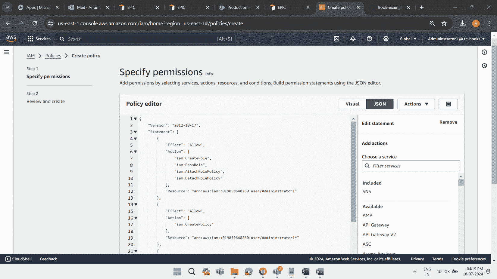

图 15.1 – 创建策略声明

您可以在 [`github.com/PacktPublishing/Accelerating-IoT-Development-with-ChatGPT/blob/main/Chapter_15/aws_customer_managed_policy`](https://github.com/PacktPublishing/Accelerating-IoT-Development-with-ChatGPT/blob/main/Chapter_15/aws_customer_managed_policy) 找到示例策略声明文件。

此客户管理的策略示例授予足够的权限来设置本章中我们将完成的两个任务。以下是每个部分的分解和解释：

+   **IAM 角色管理**：它允许读取、列出、创建和传递 IAM 角色，限于您自己的 AWS 账户内的服务角色

+   **IAM 策略管理**：它允许通过服务角色而不是基于身份的策略，在同一 AWS 账户下列出、创建、附加和解除对资源的 IAM 策略

+   **IAM 用户管理**：它提供列出和获取用户、角色、策略及其附件的权限

+   **KMS 密钥描述**：当 IAM 用户创建 SNS 主题时是必需的

+   **SNS 发布**：它授予向您所在区域的任何 SNS 主题发布消息的权限

+   **访问分析器**：最后的语句允许列出策略生成并使用 AWS IAM 访问分析器验证所有资源中的策略

请注意，您需要在此策略语句示例中将`<your_region>`和`<your_account_id>`替换为您自己的信息。您可以在管理账户右上角找到`<your_account_id>`的值。

1.  您现在可以为此策略命名并创建它。例如，您可能称之为`Service_Role_Policy_For_IoT`。然而，请随意选择一个符合您偏好的名称。

1.  在`Service_Role_Policy_For_IoT`中，并将其附加到此 IAM 用户。您应该在**策略名称**下看到它。

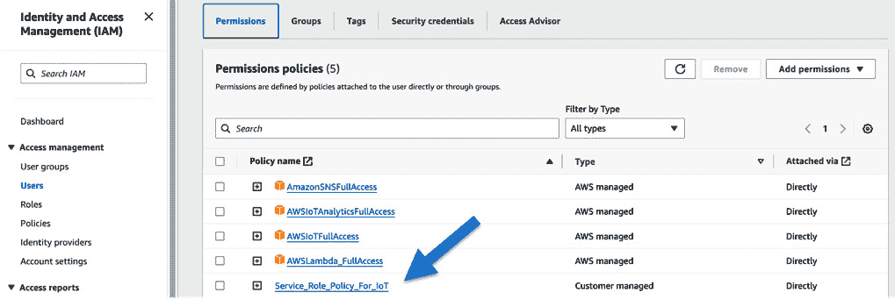

图 15.2 – 新附加的策略

现在，作为 IAM 管理员，我们已经授予 IAM 用户执行以下两个任务设置程序的必要权限。

在商业物联网应用的领域，数据到达云中总是触发两个必须立即执行的基本任务：

+   数据处理

+   数据存储和查询

数据处理操作的主要目标是通常分析来自物联网设备报告的任何异常事件。如果检测到任何异常，需要根据事件的严重性采取适当的行动。这些措施可能包括发送短信警报到启动电子邮件通知，确保对任何潜在问题的及时响应。

数据的存储和随后的查询是物联网设备数据收集的基础。这些操作不仅仅是基本程序，而且在整体操作中起着至关重要的作用。收集的数据通常用于维护操作状态的历史记录，并为未来的预测提供基础。此外，它还有助于创建提供系统状态清晰简洁概述的视觉表示。

现在您已经准备好继续配置以下两个任务。

# 任务 1 – 异常事件处理

如前一章所述，主 ESP32 代码中的传感器数据以 JSON 格式封装。您可以在以下输出中查看序列化的数据流，如图所示：

```py
Publishing message: {"timeStamp":1713218277,"deviceModel":"DHT11","deviceID":"645ad13bdaec","status":"Normal","date":"04-15-2024","time":"14:57:57","timeZone":"-08:00","DST":"Yes","data":{"temp_C":17,"temp_F":63,"humidity":40}}
```

在 AWS IoT Core MQTT 测试客户端中，接收到的 MQTT 消息负载将显示如下截图。

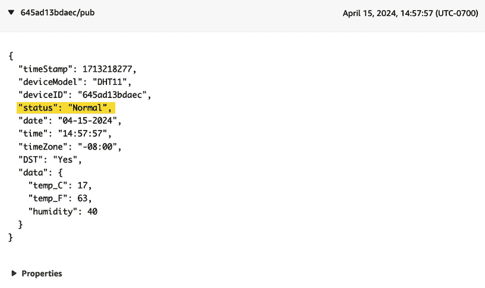

图 15.3 – 在 AWS IoT Core 中显示的 MQTT 消息

您可能会在前两条消息中注意到一个名为`status`的变量。此变量表示传感器的状态，指示温度和湿度值是否在正常范围内，以下或以上。`null`值表示传感器错误。此状态是通过将实际值与主代码中预定义的值范围进行比较来确定的。

在此任务中，我们将指导 AWS IoT Core 在变量`status`未设置为`Normal`时将有效负载数据转发到 Lambda。

要理解这个服务流程，我们将使用[`mermaidchart.com`](https://mermaidchart.com)，如*第九章*中提到的，创建一个图表，按照以下说明进行：

`创建一个流程图来反映以下` `AWS 服务`之间的交互。`

`ESP32 以序列化的 JSON 格式将传感器数据发送到 AWS` `IoT Core。`

`AWS IoT Core 使用消息路由规则通过 SQL 语句过滤传感器数据状态。`

`如果"status"对象设置为"Normal"，AWS IoT Core 不会将此事件` `转发到 Lambda。`

`如果"status"对象未设置为"Normal"，AWS IoT Core 将此事件` `转发到 Lambda。`

`在接收到非"Normal"状态事件后，Lambda 生成包含传感器数据的电子邮件内容并将其发送到 SNS（亚马逊简单` `通知服务）。`

`SNS 按顺序向预先订阅用户的` `电子邮件地址`发送电子邮件通知。`

根据前面的说明生成的服务流程如下。

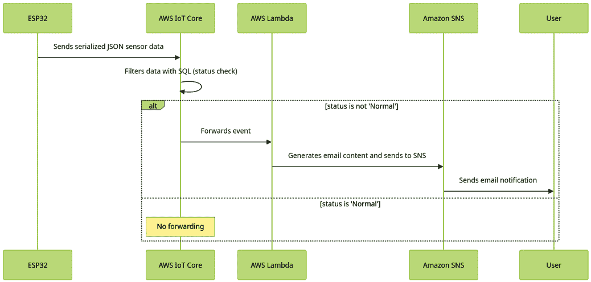

图 15.4 – 任务 1 服务交互流程

此图表明确描述了任务配置流程，从 AWS IoT Core 开始，过滤接收到的数据，创建转发规则到 Lambda，并触发发送到 SNS 的电子邮件通知。

## 配置步骤

本任务的配置步骤，如图 15**.4**所示，包括以下阶段：

+   **步骤 1 至 13；步骤 15 至 18**：在 AWS IoT Core 上创建一个消息路由规则（通过 SQL 语句触发异常传感器数据），指向一个新的 Lambda 函数

+   **步骤 14**：生成一个新的 Lambda 函数以链接到此规则

+   **步骤 19 至 23**：建立 SNS 主题和订阅

+   **步骤 24 至 31**：为 Lambda 函数提供适当的角色以访问 SNS

+   **步骤 32**：在此 Lambda 函数上创建 Python 代码以从 AWS IoT Core 获取数据，生成电子邮件内容并将其发送到 SNS 以向收件人的地址发送电子邮件通知

让我们详细看看这些步骤。

## 创建消息路由规则

1.  使用我们在上一步骤中创建的常规 IAM 用户**jun.wen**登录 AWS 控制台。

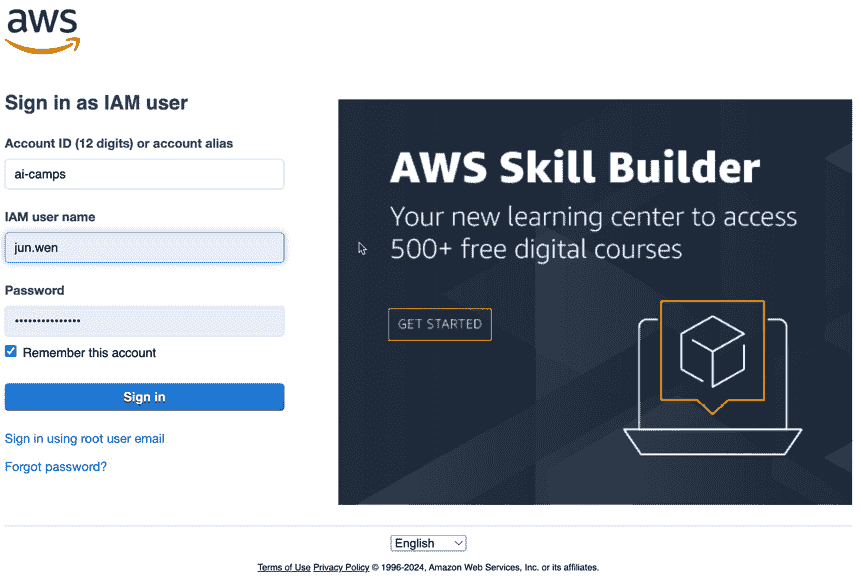

图 15.5 – 以常规 IAM 用户登录

1.  搜索并点击**IoT Core**服务。

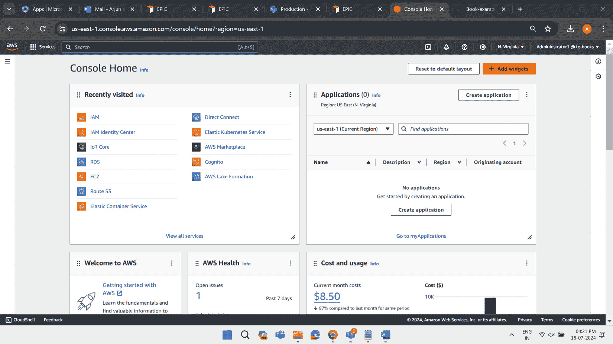

图 15.6 – 打开 IoT Core 控制台

1.  点击左侧导航菜单中的**消息路由**下的**规则**。

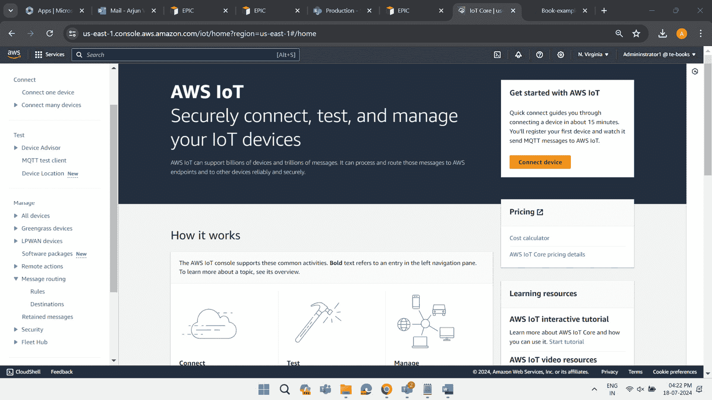

图 15.7 – 定位规则

1.  点击**创建规则**以从 AWS IoT Core 创建规则，向 Lambda 报告异常事件。

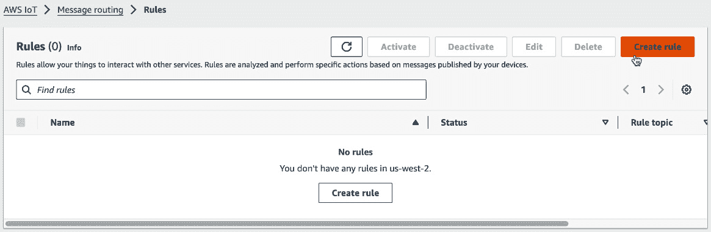

图 15.8 – 开始创建规则

1.  在此处为规则命名，例如，`Report_Abnormal_Event_to_Lambda`。

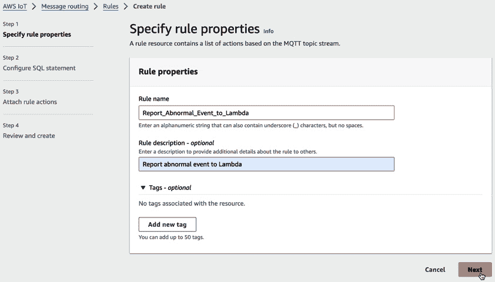

图 15.9 – 为此新规则命名

1.  在此处创建一个 SQL 语句以向 Lambda 报告异常事件。

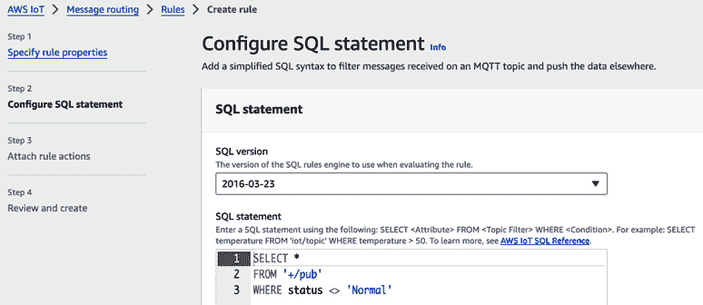

图 15.10 – 创建 SQL 语句

以下是我们将要使用的 SQL 语句：

```py
1\. SELECT *
2\. FROM "+/pub"
3\. WHERE status <> 'Normal'
```

`SELECT *`和`FROM '+/pub'`语句表示从 JSON 有效负载中选择所有对象，并引用来自任何带有`/pub`后缀的 ESP32 设备的传入 MQTT 发布主题，其中状态不是`正常`。

你可能还记得，在 ESP32 代码中，我们创建的发布主题为`AWS_IOT_PUBLISH_TOPIC = deviceID + /pub`，这意味着任何带有`/pub`后缀的 ESP32 设备。

您也可以在[`docs.aws.amazon.com/iot/latest/developerguide/iot-sql-reference.html?icmpid=docs_iot_hp_act`](https://docs.aws.amazon.com/iot/latest/developerguide/iot-sql-reference.html?icmpid=docs_iot_hp_act)找到 AWS IoT SQL 参考。

1.  在输入 SQL 语句后，导航到**规则操作**，并在**操作 1**下点击**选择一个操作**。

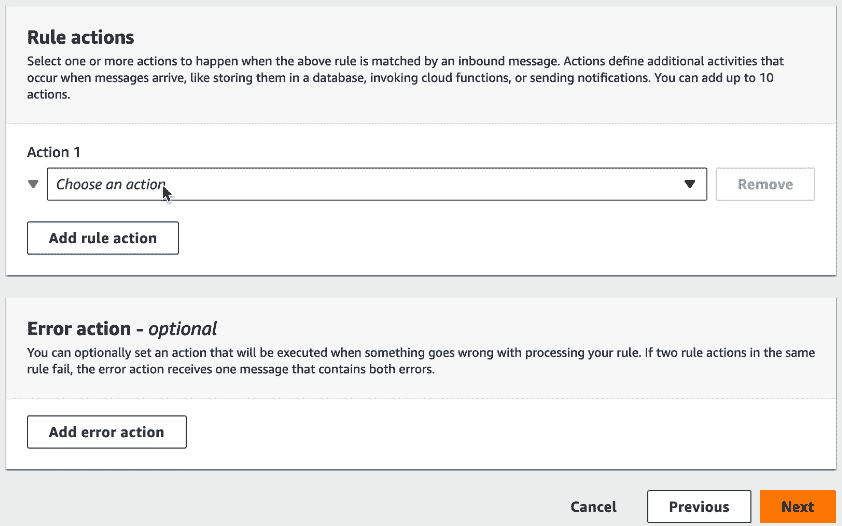

图 15.11 – 创建由此规则触发的操作

1.  搜索并选择**Lambda**。

w

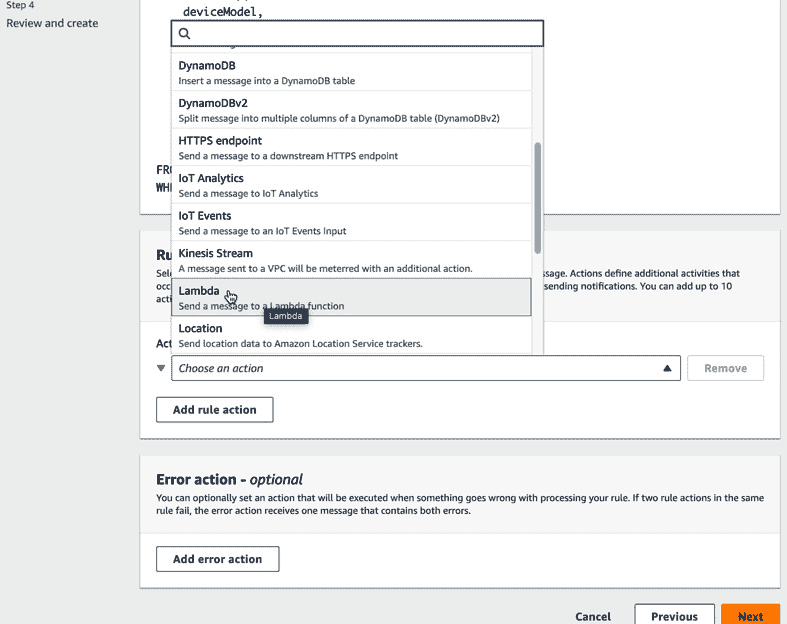

图 15.12 – 选择 Lambda 作为操作

1.  点击**创建 Lambda 函数**，您将被重定向到 Lambda 控制台。

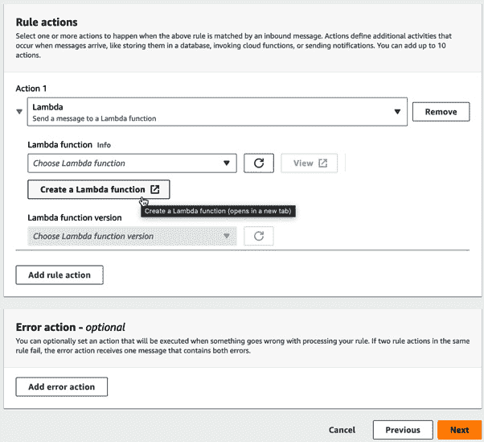

图 15.13 – 开始创建 Lambda 函数

1.  在 Lambda 控制台中创建一个 Lambda 函数。为函数分配一个名称，例如`Process_Abnormal_Event_from_IoT_Core`，并选择**运行时**。AWS Lambda 支持多种语言编写函数，例如 Python、Java、Dot NET、Ruby 和 Node.js。在这个任务中，我们将使用 Python。AWS Lambda 函数支持从 3.8 到 3.12 的 Python 版本，但 AWS 强烈建议使用版本 3.12。选择**Python 3.12**，然后点击**创建函数**。

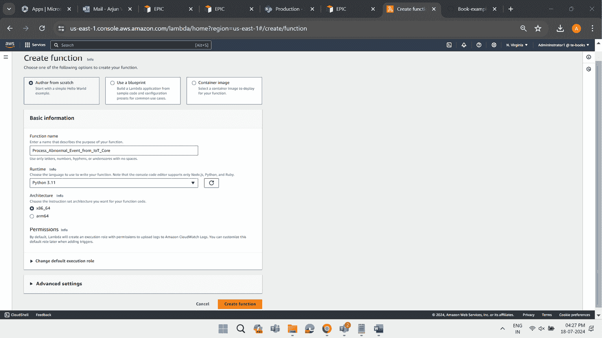

图 15.14 – 使用 Python 运行时创建 Lambda 函数

## 创建 Lambda 函数

成功创建了一个名为`Process_Abnormal_Event_from_IoT_Core`的 Lambda 函数。在这个阶段，我们不会在上面部署任何实际代码——这将在最后一步完成。由于我们尚未完成 SNS 的设置，我们将返回到之前的 IoT Core 控制台以继续创建消息路由规则。

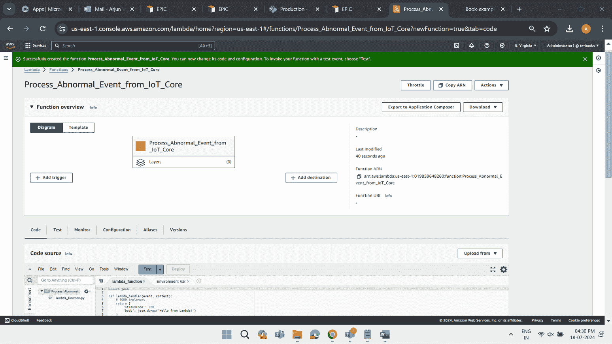

图 15.15 – 创建的 Lambda 函数（实际代码尚未部署）

让我们开始吧！

1.  在之前的 IoT Core 控制台中，点击**动作 1**下的**刷新**，然后点击**Lambda 函数**以加载我们刚刚创建的新 Lambda 函数。

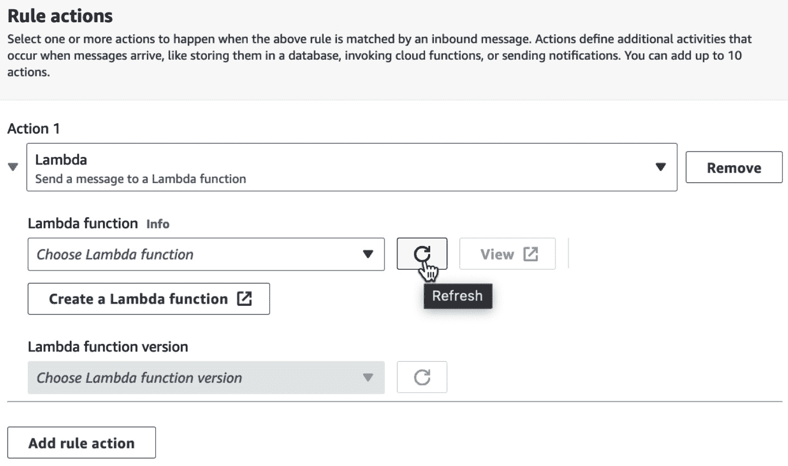

图 15.16 – 刷新 Lambda 函数

1.  选择我们刚刚创建的新 Lambda 函数，然后点击**下一步**。

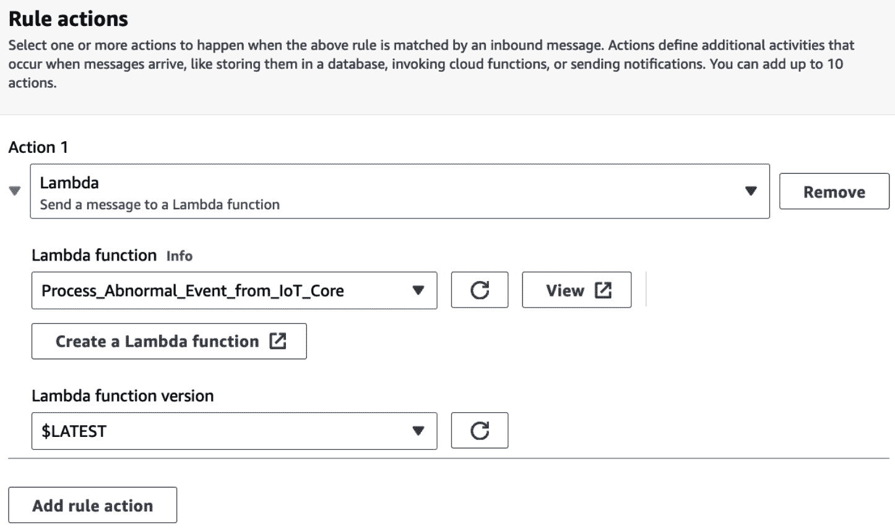

图 15.17 – 选择刚刚创建的 Lambda 函数

1.  查看规则创建的配置信息，然后点击**创建**。

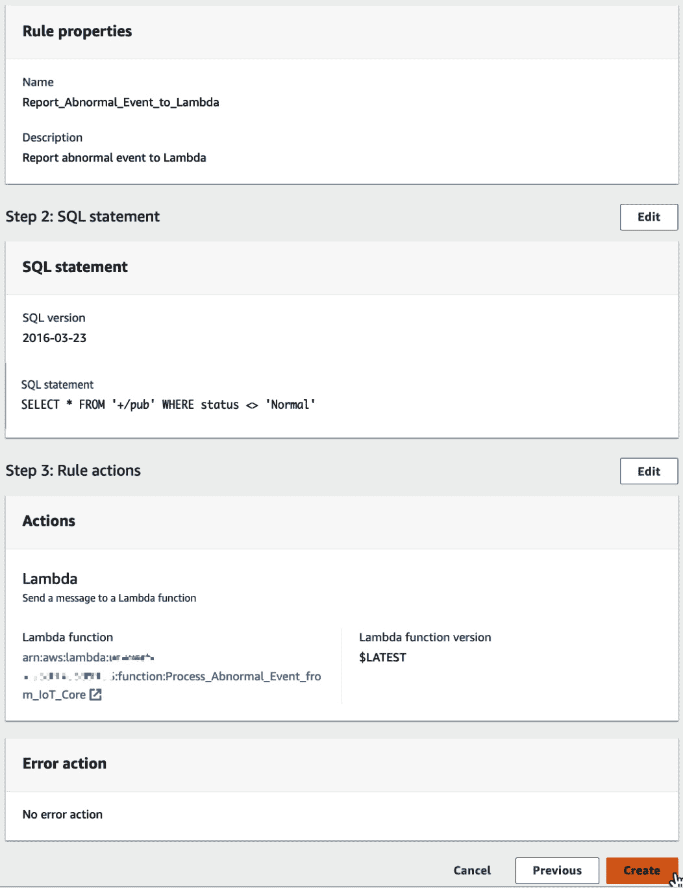

图 15.18 – 完成规则创建

1.  现在，你可以看到规则已成功创建。

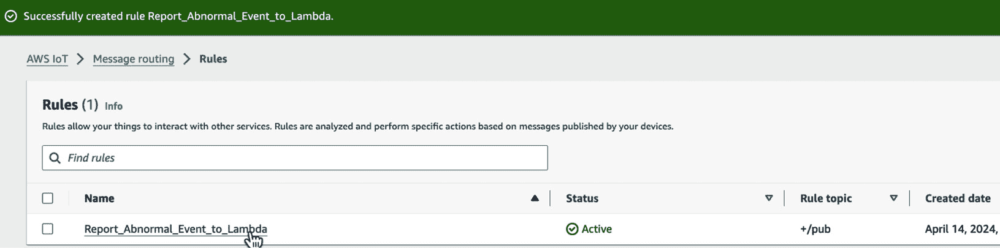

图 15.19 – 在规则下显示新规则

到目前为止，我们已经成功完成了以下操作：

+   创建了一个消息路由规则，允许 IoT Core 向 Lambda 函数报告异常状态

+   创建了一个 Lambda 函数，通过消息路由规则将 IoT Core 连接起来

接下来，我们将在执行任务之前完成剩余的配置：

+   创建一个 SNS 主题并订阅一个电子邮件地址

+   在 Lambda 函数上编写 Python 代码以在主题下生成警报电子邮件内容，该内容被发送到 SNS 以转发到订阅的电子邮件地址。

## 创建 SNS 主题

1.  搜索`SNS`并导航到 SNS 控制台。

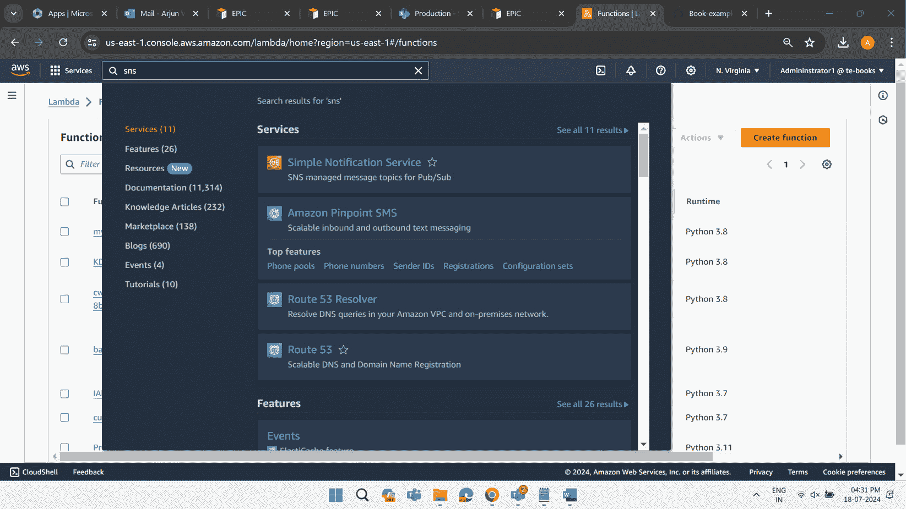

图 15.20 – 登录 SNS 控制台

1.  点击左侧导航菜单中的**主题**，然后点击**创建主题**。

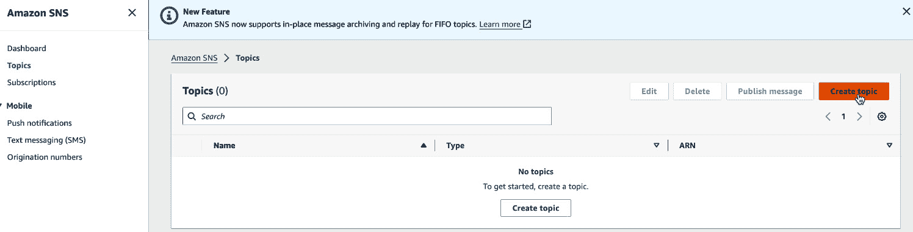

图 15.21 – 开始创建 SNS 主题

1.  在`DHT11_Abnormal_Event`下。**FIFO**类型对于需要消息排序和去重的用例是一个更好的选择。然而，在我们的案例中，温度和湿度异常事件是独立的，没有任何顺序或关联，所以我们在这里选择**标准**类型。

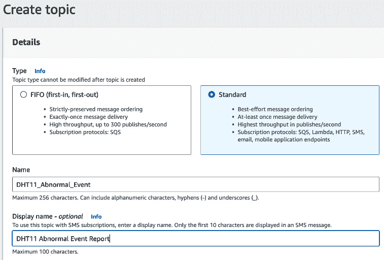

图 15.22 – 选择标准类型

1.  在成功创建主题后，点击此主题下的**创建订阅**。

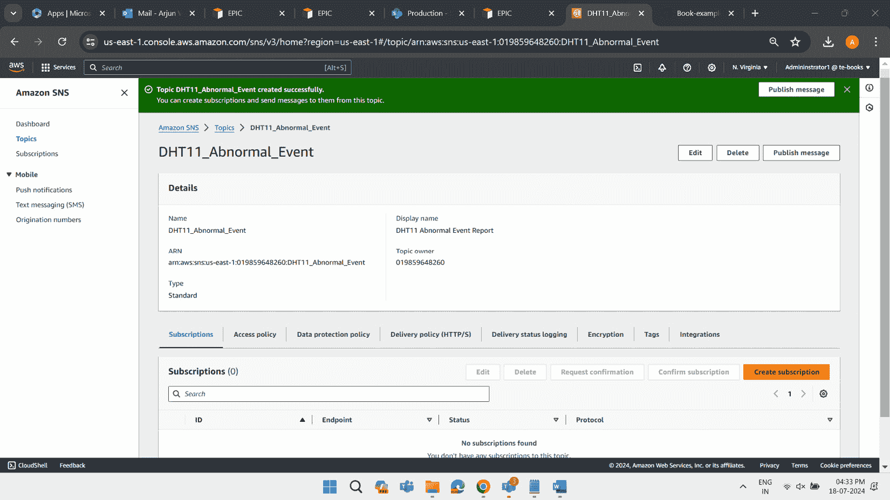

图 15.23 – 创建订阅

1.  将**协议**设置为**电子邮件**。

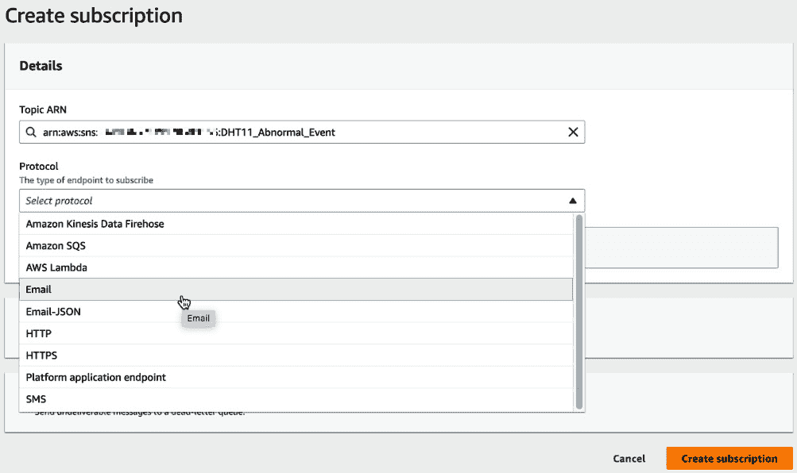

图 15.24 – 选择电子邮件协议

1.  在**端点**部分，输入一个用于接收 SNS 关于任何异常事件的电子邮件通知的电子邮件地址。创建订阅后，将向该收件人地址发送确认电子邮件。收件人必须确认才能开始接收通知电子邮件。

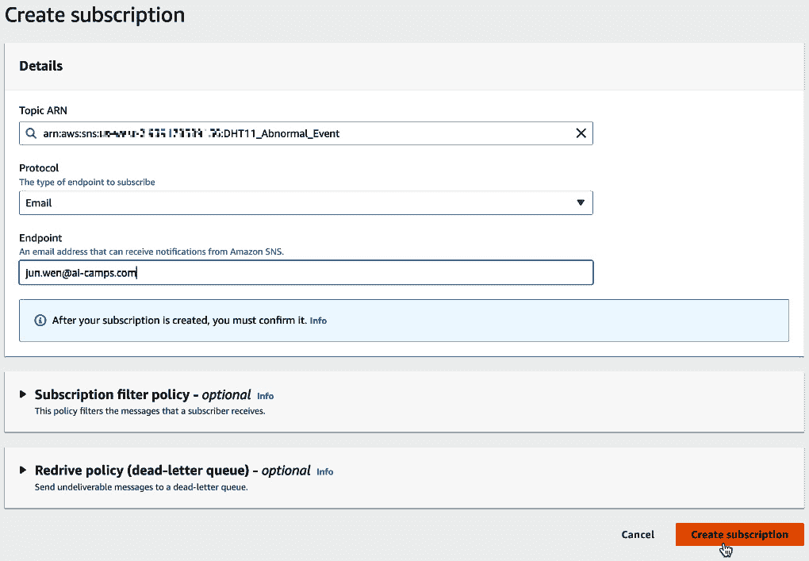

图 15.25 – 创建订阅

1.  到目前为止，SNS 电子邮件通知已正确设置。

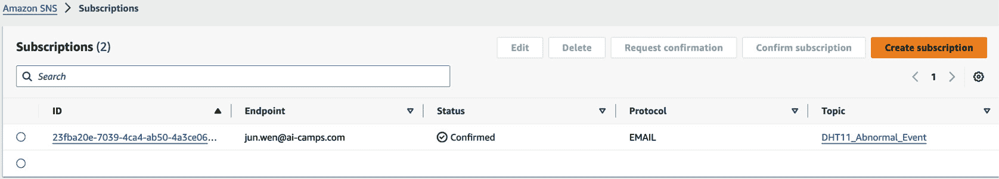

图 15.26 – 订阅已确认

现在，我们已经完成了 SNS 主题的设置，并将电子邮件地址添加到订阅列表中。当 Lambda 向 SNS 发送匹配主题的通知时，此通知的内容将被转发到该电子邮件地址。

现在，我们已经到达了在 Lambda 函数上创建 Python 代码以触发通知的最终阶段。

## 编程 Lambda 函数

1.  在这一最后步骤中，我们需要编程 Lambda 函数，使用之前定义的 SNS 主题向 SNS 发送异常事件电子邮件通知。

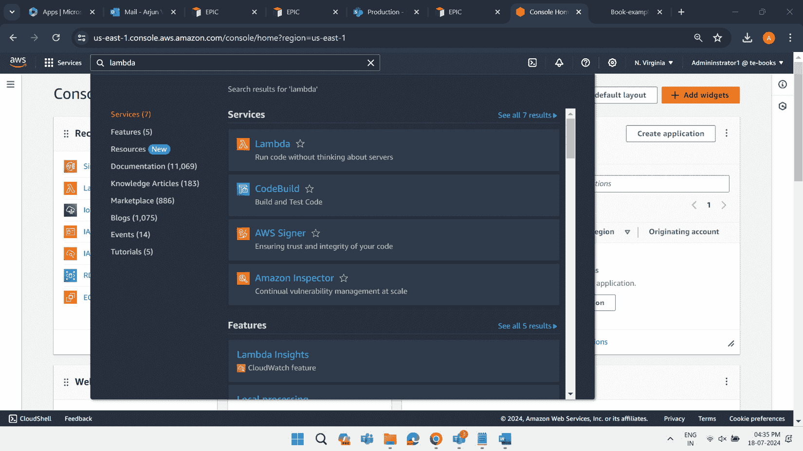

图 15.27 – 登录 Lambda 控制台

1.  你将看到之前创建的 Lambda 函数。点击其名称以编辑它。

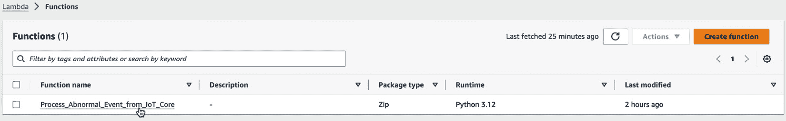

图 15.28 – 编辑 Lambda 函数

1.  在 Lambda 函数上编写代码之前，我们需要授予此函数与 SNS 通信的权限。点击**配置**，然后**权限**，再点击**角色**名称。

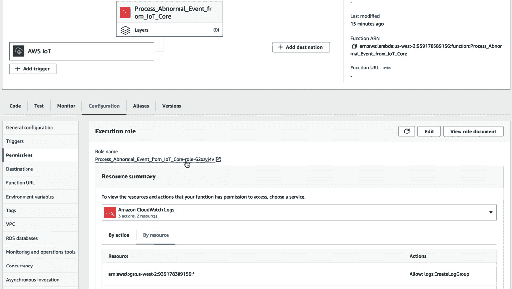

图 15.29 – 点击执行角色名称

1.  在此角色中，点击**添加权限**。

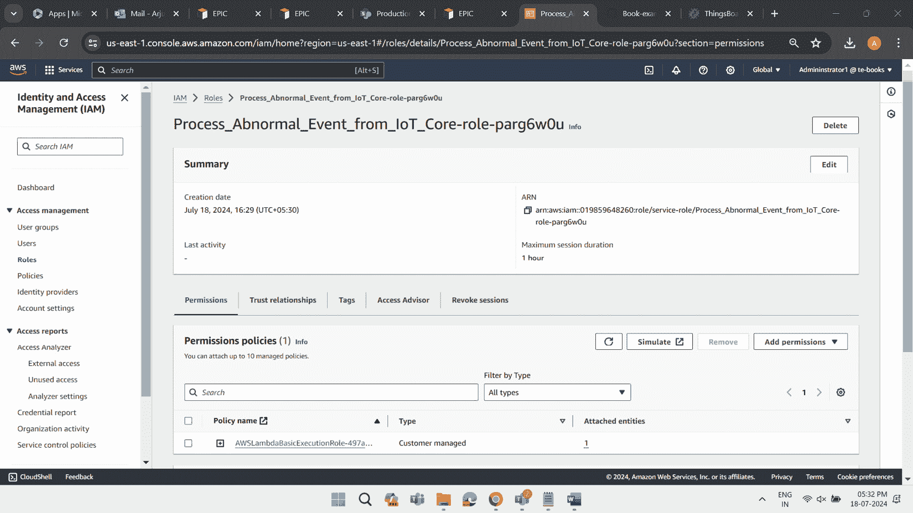

图 15.30 – 添加权限

1.  搜索并选择**AmazonSNSFullAccess**，然后点击**添加权限**。

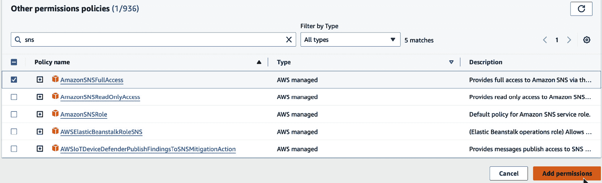

图 15.31 – 添加 AmazonSNSFullAccess 权限

1.  现在，在**资源摘要**下，你应该能看到**Amazon SNS**。

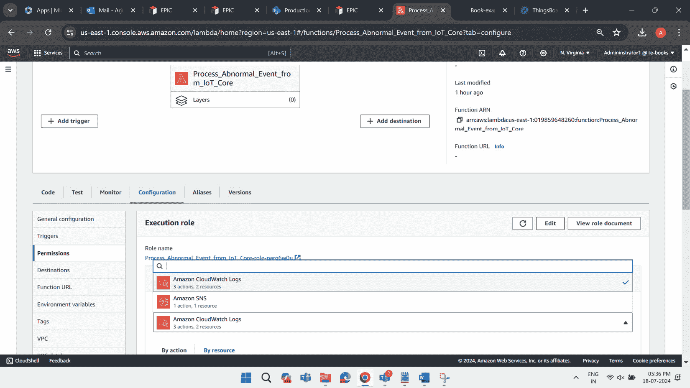

图 15.32 – 检查是否已添加 Amazon SNS 权限

1.  现在，点击**代码**。我们已经到达了最后一步：在之前创建的 Lambda 函数上编程 Python 代码。

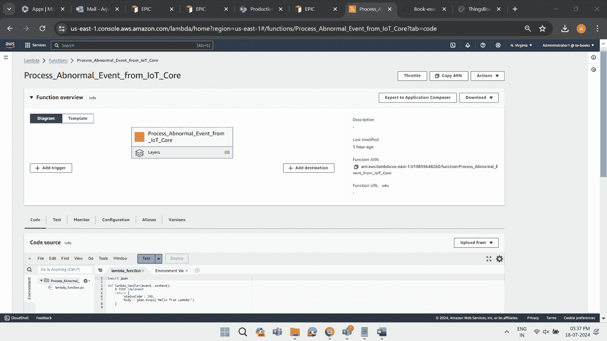

图 15.33 – 代码选项卡

1.  由于我们选择了 Python 3.12 作为运行时语言，我们可以继续指导 ChatGPT 根据我们的服务逻辑设计生成代码：

    `Hi, ChatGPT,`

    `请开发一个符合以下要求的 Python 3.12 代码，在 AWS Lambda 函数上：`

    +   `AWS IoT Core 将任何异常事件（对象“状态”的值不是“正常”）转发到 Lambda 函数。`

    +   `Lambda 函数从 IoT Core 接收 JSON 格式的数据，以下是一个` `示例结构：`

        ```py
         1\. example:
         2\. {
         3.   "timeStamp": 1713302072,
         4.   "deviceModel": "DHT11",
         5.   "deviceID": "645ad13bdaec",
         6.   "status": "Above Normal",
         7.   "date": "04-16-2024",
         8.   "time": "14:14:32",
         9.   "timeZone": "-08:00",
        10.   "DST": "Yes",
        11.   "data": {
        12.     "temp_C": 19,
        13.     "temp_F": 66,
        14.     "humidity": 99
        15.   }
        16\. }
        17.
        ```

    `在接收到数据后，Lambda 函数应生成以下格式的电子邮件内容，并通过“arn:aws:sns:my_region:my_account_id:DHT11_Abnormal_Event”主题发送到 SNS。`

    ```py
     1\. example:
     2.
     3\. Alert: DHT11 Abnormal Event Detected!
     4\. Details:
     5\. - Status: [value from "status"]
     6\. - Device ID: [value from "deviceID"]
     7\. - Device Model: [value from "deviceModel"]
     8\. - Timestamp: [value from "timeStamp"]
     9\. - Date: [value from "date"]
    10\. - Time: [value from "time"]
    11\. - TimeZone: [value from "timeZone"]
    12\. - DST: [value from "DST"]
    13\. - Temperature (C): [value from "data.temp_C"]
    14\. - Temperature (F): [value from "data.temp_F"]
    15\. - Humidity: [value from "data.humidity"]
    16.
    17\. Please take the necessary actions!
    18.
    ```

    +   `您必须创建两个独立的函数：format_email_content(received_event)用于生成包含事件详情的电子邮件内容，以及 lambda_handler(received_event, context)用于将格式化的电子邮件内容发送到` `SNS 主题。`

    +   `从` `环境变量中检索 SNS 主题 ARN。`

    您可以在[`github.com/PacktPublishing/Accelerating-IoT-Development-with-ChatGPT/tree/main/Chapter_15`](https://github.com/PacktPublishing/Accelerating-IoT-Development-with-ChatGPT/tree/main/Chapter_15)找到此提示文件和 Lambda 函数 Python 代码示例。

1.  从 ChatGPT 获取 Python 代码后，将其复制并粘贴到**代码**部分。要激活代码，请点击**部署**。

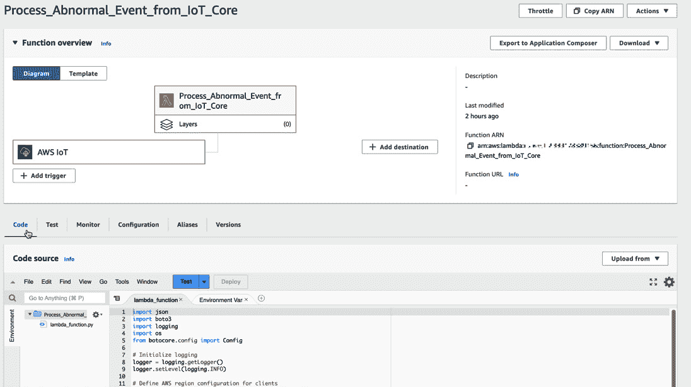

图 15.34 – 部署 Python 代码

1.  让我们通过从 ESP32 上移除 DHT11 的数据线连接器来进行现场测试。如果所有设置都正确，您应该会收到电子邮件通知，如下面的截图所示。

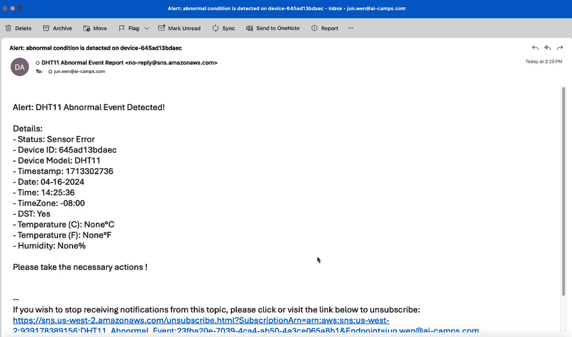

图 15.35 – 异常事件的电子邮件通知

1.  如果收件人没有收到电子邮件通知，您可以在 CloudWatch 控制台下的规则名称下检查日志，例如`Process_Abnormal_Event_from_IoT_Core`。点击最新的日志流名称。

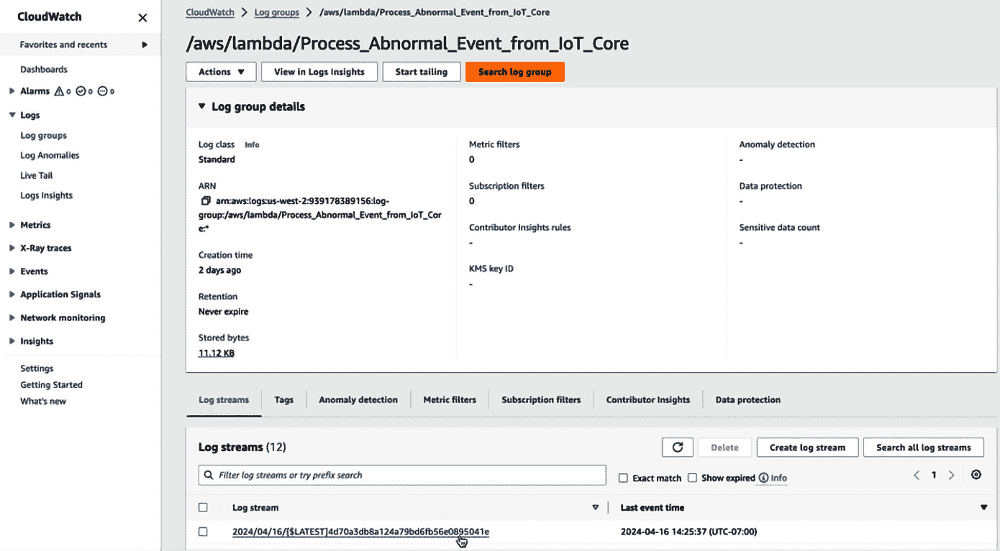

图 15.36 – 在 CloudWatch 控制台中打开日志

1.  下面的截图显示，一个异常事件“传感器错误”已成功作为 SNS 通知发送。

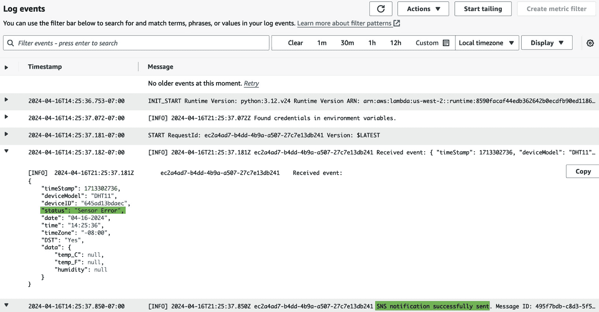

图 15.37 – 日志记录

现在，我们已经成功使用 AWS IoT Core、Lambda 和 SNS 设置了异常事件处理任务。当传感器报告其状态为“传感器错误”、“低于正常”或“高于正常”时，将向收件人发送警报电子邮件通知。

还可以创建一个 IoT 规则，将异常数据直接从 IoT Core 发送到 SNS 主题，其中原始 JSON 格式数据，而 Lambda 可以创建带有自定义电子邮件主题和内容的更易读的格式。

接下来，我们将处理在 IoT Analytics 上的数据存储和查询任务，这相当直接。

# 任务 2 – 数据存储和查询

与异常事件处理相比，在这个任务中，无论状态是否为“正常”，AWS IoT Core 都将将所有接收到的数据转发到 AWS IoT Analytics。

如在 *第五章* 中所述，AWS IoT Analytics 集成了多个子服务。这些包括通道、管道、数据存储和数据集。它们的功能在此简要描述：

+   **通道**：利用您的通道收集来自其他 AWS 服务的原始和未处理过的 IoT 设备数据

+   **管道**：通过使用活动来过滤、丰富和转换您的原始 IoT 设备数据，将您的通道中的原始数据转换为有价值的信息

+   **数据存储**：存储您的处理过的 IoT 设备数据以供未来的数据分析

+   **数据集**：处理来自 IoT 设备的查询数据，以提供关于您的设备的自动、频繁和最新的洞察

我们将继续使用 [`mermaidchart.com`](https://mermaidchart.com) 根据以下说明创建图表：

`请创建一个流程图，以反映以下 AWS 服务之间的交互。`

+   `ESP32 以序列化的 JSON 格式将传感器数据发送到 AWS IoT Core。`

+   `AWS IoT Core 使用消息路由规则将所有接收到的数据转发到 AWS` `IoT Analytics。`

+   `原始数据将首先到达数据` `通道。`

+   `然后在数据管道中转换数据。`

+   `然后将丰富后的数据存储在` `数据存储中。`

+   `然后将查询提供给` `数据集。`

下面的服务流程是根据指示生成的。

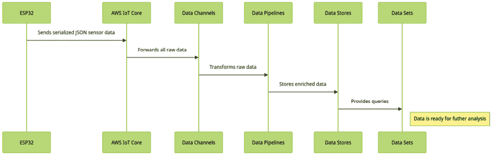

图 15.38 – 数据存储和查询流程

流程图展示了数据存储流程，其中 ESP32 设备将序列化的 JSON 传感器数据发送到 AWS IoT Core，然后 AWS IoT Core 将原始数据转发到数据通道。这些通道将数据传输到数据管道进行转换。转换后的数据随后存储在数据存储中，通过查询访问以创建准备进一步分析的数据集。

此任务的配置步骤，如 *图 15**.38* 所示，包括以下操作：

+   **步骤 1 到 9**：创建 IoT Analytics 资源

+   **步骤 10 到 14**：在 AWS IoT Core 上创建第二个消息路由规则，将所有传感器数据转发到 IoT Analytics

+   **步骤 15 到 18**：在 IoT Analytics 运行数据查询

## 创建 IoT Analytics 资源

让我们详细地过一遍这些步骤：

1.  在服务控制台中搜索并点击 **IoT Analytics**。

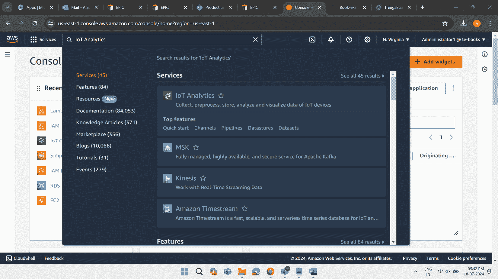

图 15.39 – 登录 IoT Analytics 控制台

1.  在 `dht11` 中输入前缀。

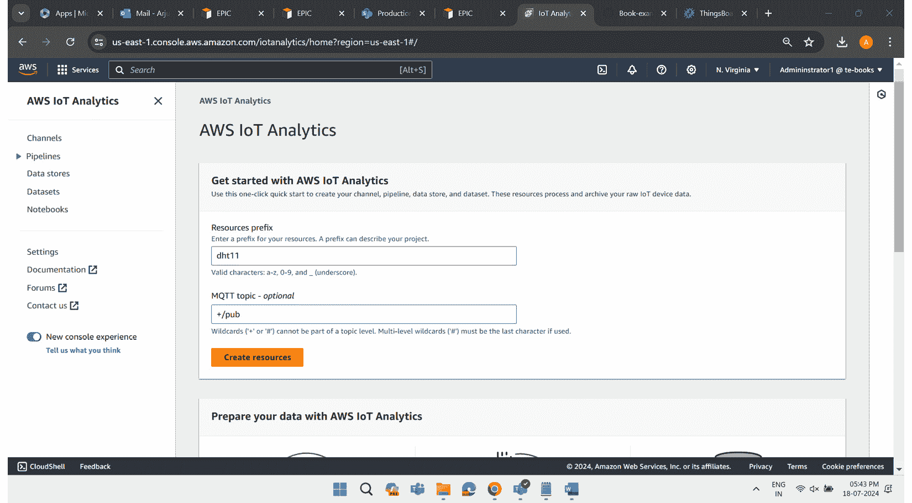

图 15.40 – 开始使用 IoT Analytics

1.  所有 IoT Analytics 资源都将开始创建。这里无需等待。

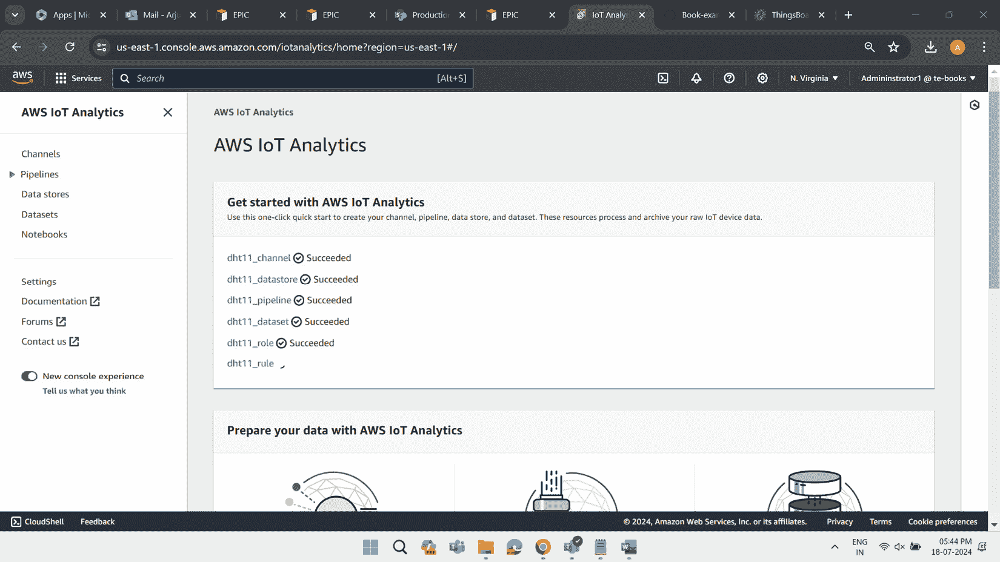

图 15.41 – 创建中

1.  在左侧导航菜单中点击 **通道**。您将看到一个名为 **dht11_channel** 的通道，它已经被创建。

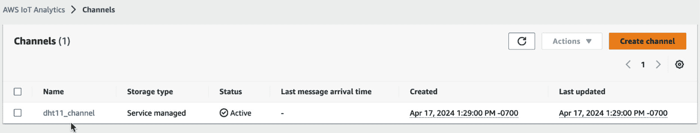

图 15.42 – 检查数据通道的状态

1.  在左侧导航菜单中点击**管道**。您会注意到已经创建了一个名为**dht11_pipeline**的管道。

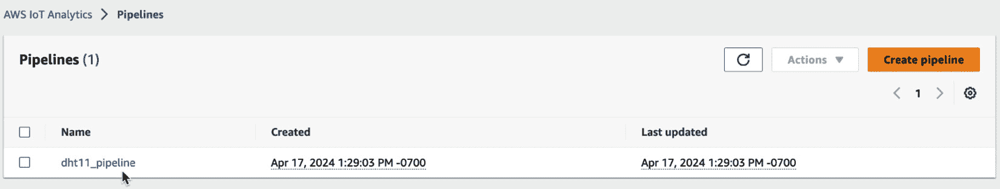

图 15.43 – 检查数据管道的状态

1.  在左侧导航菜单中点击**数据存储**。您会发现已经创建了一个名为**dht11_datastore**的数据存储。

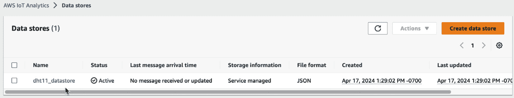

图 15.44 – 检查数据存储的状态

1.  点击**dht11_datastore**，然后点击**存储设置**，接着点击**编辑**。

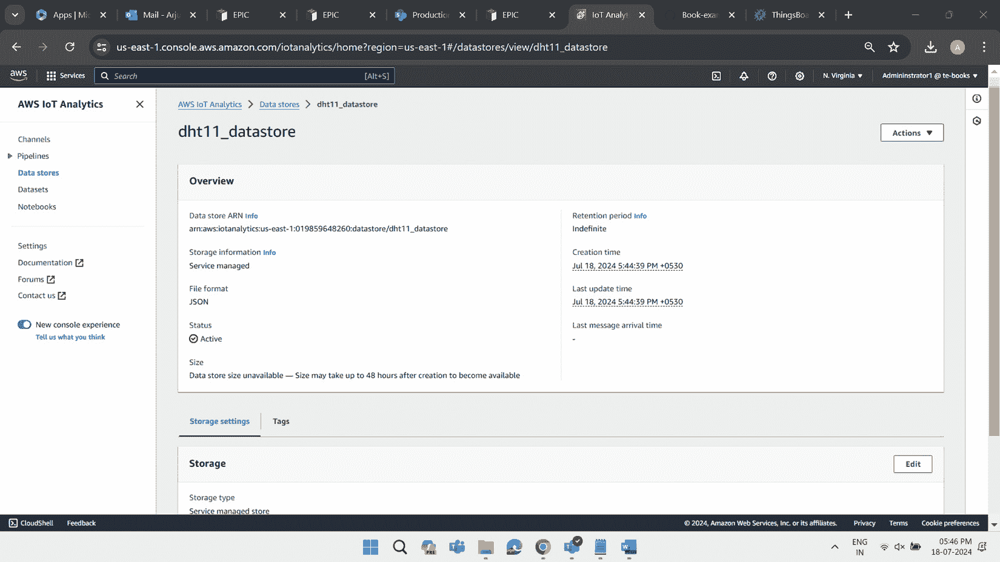

图 15.45 – 编辑存储设置

1.  您现在可以设置您处理数据的保留期，例如`7`天。

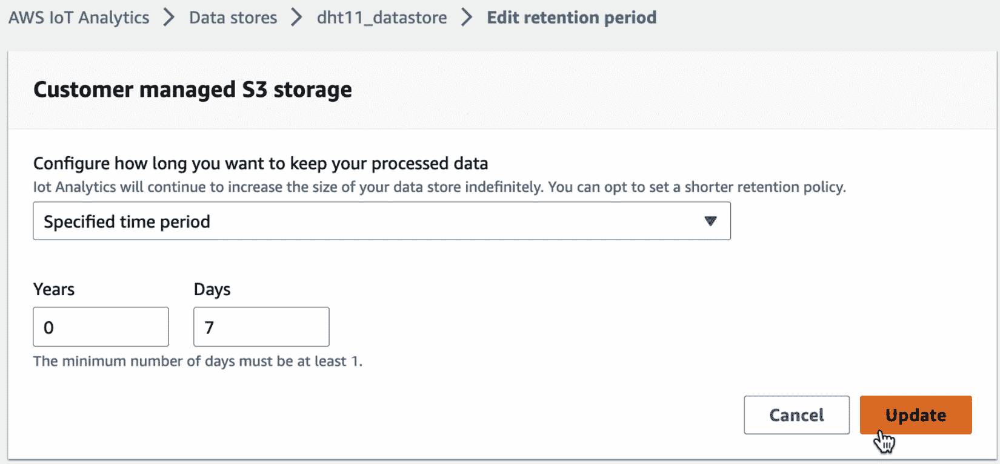

图 15.46 – 修改存储时间

1.  在左侧导航菜单中点击**数据集**。您会发现已经创建了一个名为**dht11_dataset**的数据集。

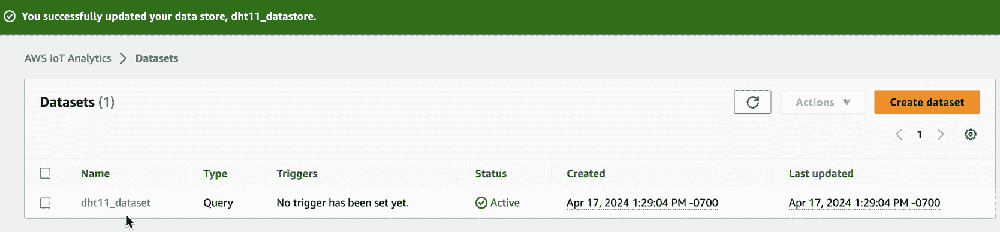

图 15.47 – 检查数据集的状态

现在，我们已经完成了 IoT Analytics 的设置，包括数据通道、数据管道、数据存储和数据集。接下来的步骤是在 IoT Core 中创建另一条消息路由规则，类似于我们之前的任务。然后，这条新规则应该与之前创建的 IoT Analytics 资源相关联。

## 创建第二条消息路由规则

1.  导航到 AWS IoT Core 控制台。在**消息路由**下，您将找到之前任务中创建的第一个规则。现在，我们将通过点击**创建规则**来创建第二个规则。

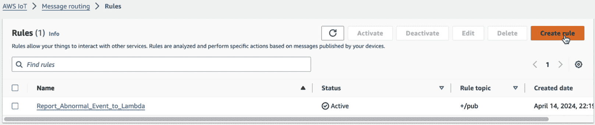

图 15.48 – 在 IoT Core 中创建新规则

1.  在这里输入规则名称，例如`Store_All_Events_to_IoT_Analytics`，然后点击**下一步**。

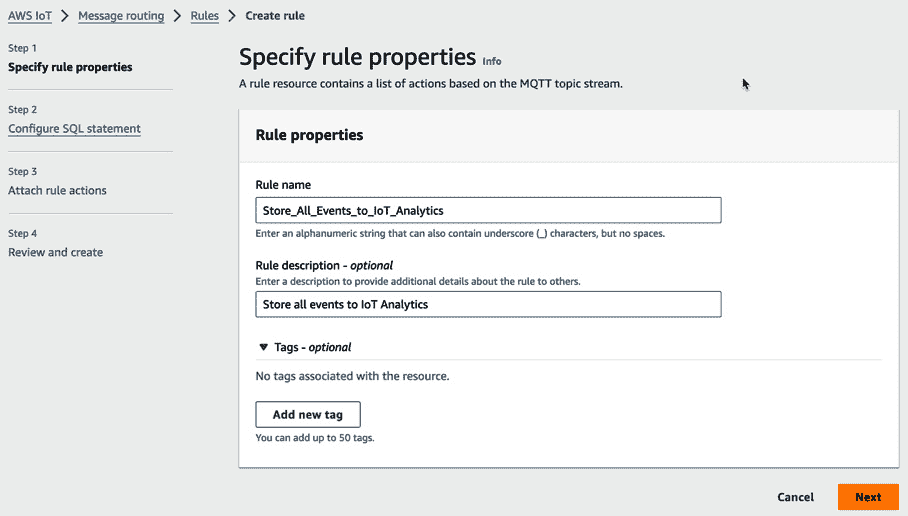

图 15.49 – 为这条新规则命名

1.  在**SQL 语句**部分，添加以下语句以将所有传感器数据转发到 IoT Analytics，无论其状态如何。

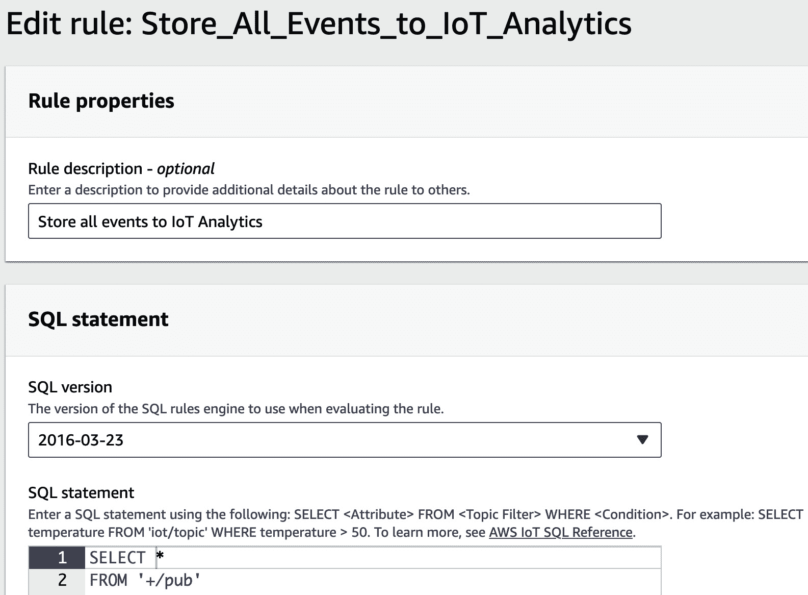

图 15.50 – 为此新规则创建 SQL 语句

1.  在**规则操作**部分，点击**操作 1**。搜索并选择**IoT Analytics**。在**通道名称**下，点击刷新图标，然后点击**查看**按钮。在弹出窗口中，您将找到在*步骤 2*中创建的**dht11_channel**。在**IAM 角色**下，点击刷新图标，然后点击**查看**按钮。在弹出窗口中，您将找到也在*步骤 2*中创建的**dht11_role**。

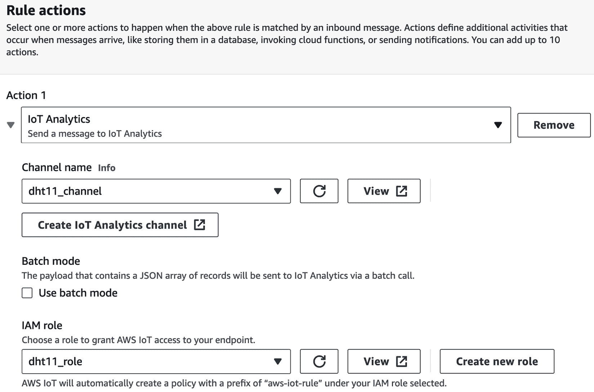

图 15.51 – 为此规则选择操作、通道和角色

1.  现在通过点击**创建**来审查并创建此规则。

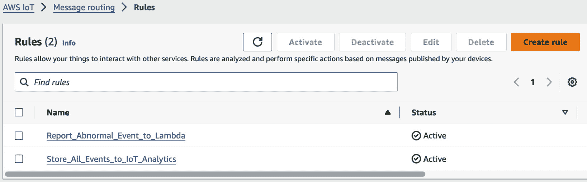

图 15.52 – 两个规则均显示在消息路由下，并且现在处于活动状态

## 运行数据查询

在此阶段，当传感器数据通过第二个消息路由规则触发进入 IoT Core 时，所有传感器数据，无论其是否正常或异常，都将准备好转发到 IoT Analytics 进行存储和查询。

让我们按照以下步骤进行一次数据查询练习：

1.  点击数据集名称。在 **详细信息** 下，点击 **编辑**。在此步骤中，我们将编辑 SQL 查询规则，以定义我们希望从数据集中查看的对象。

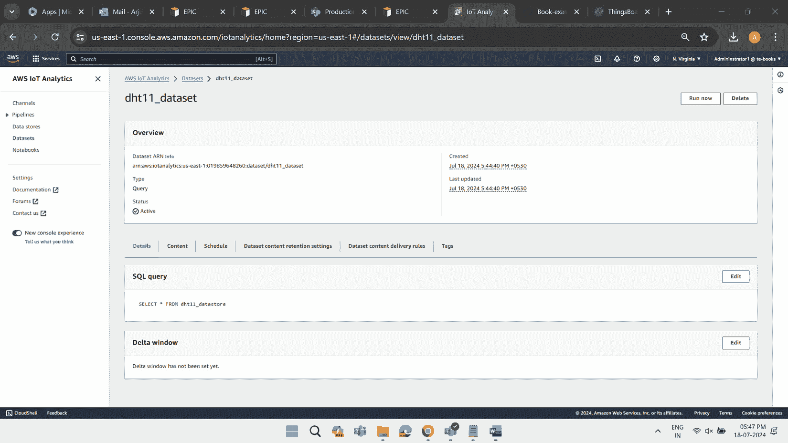

图 15.53 – 编辑 SQL 查询语句

例如，如果你想查询记录中的所有对象数据，并且所有记录都按时间戳降序显示（最新记录显示在顶部），你可以编辑当前的 SQL 查询，如下截图所示（[`github.com/PacktPublishing/Accelerating-IoT-Development-with-ChatGPT/blob/main/Chapter_15/dataset_sql_statement`](https://github.com/PacktPublishing/Accelerating-IoT-Development-with-ChatGPT/blob/main/Chapter_15/dataset_sql_statement) 也提供了一个示例）。

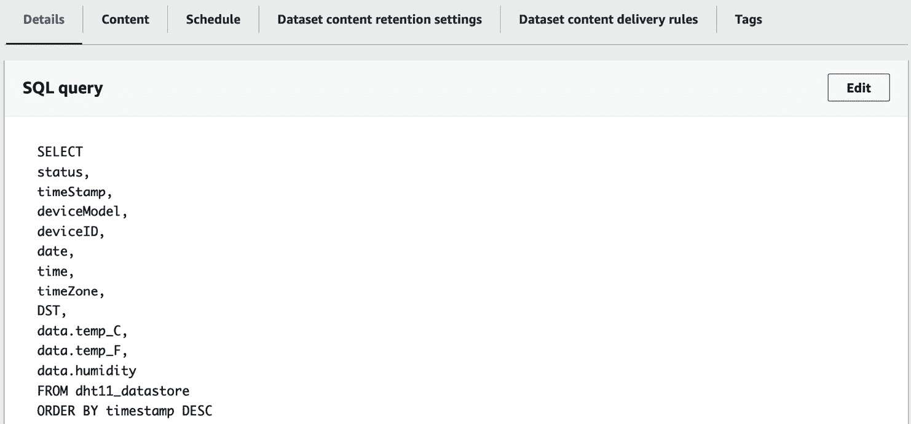

图 15.54 – 更新语句以按时间戳降序显示记录

1.  确保你的 ESP32 正在运行并且成功连接到 AWS IoT Core。然后，转到 **IoT Analytics** 控制台。在 **数据集** 下，点击 **立即运行** 以执行数据查询。随后，在 **内容** 下，点击查询记录名称，如下截图所示。

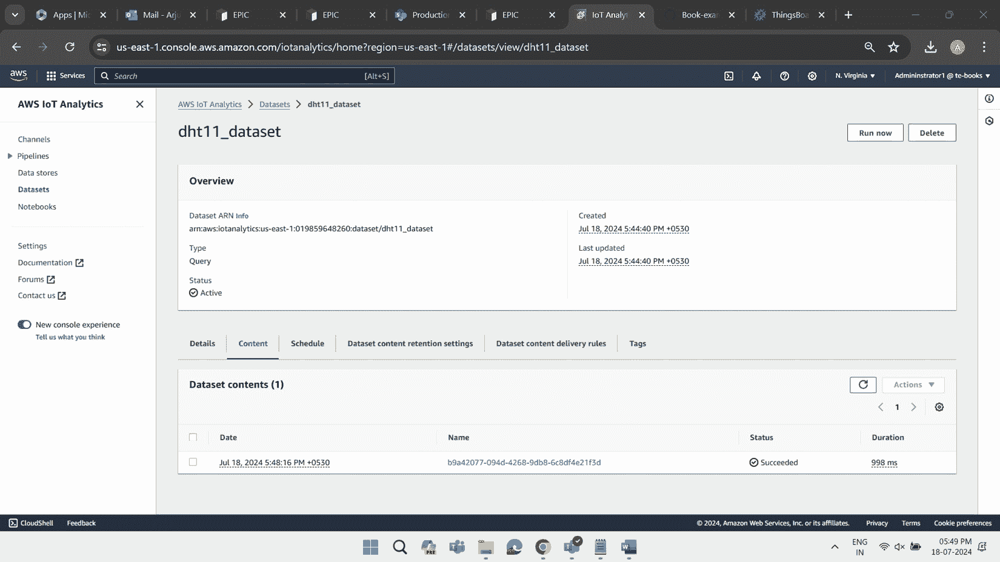

图 15.55 – 运行数据查询

1.  最后，你将看到存储在数据集中的所有传感器数据，无论其状态如何。

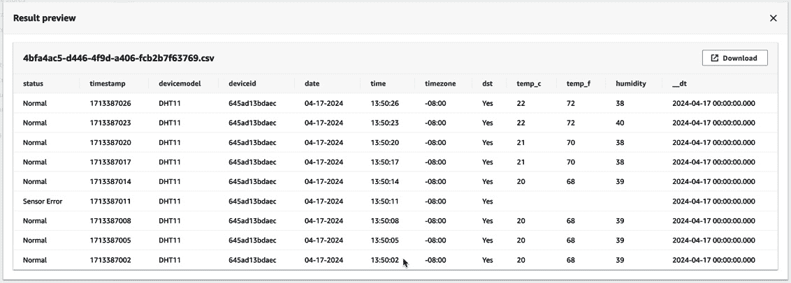

图 15.56 – 数据查询结果

在此阶段，我们已经成功使用 AWS IoT Core 和 IoT Analytics 设置了数据存储和查询任务。所有传感器数据都将被存储并准备好进行分析查询。

# 摘要

在本章中，你学习了完成商业物联网应用中两个基本任务的配置步骤。第一个任务是数据处理，这涉及到使用 AWS Lambda 触发通知到 SNS，以发送关于异常事件的警报电子邮件。第二个任务是使用 AWS IoT Analytics 进行数据存储和查询，这是物联网应用的关键方面，确保大量数据的有效处理和检索。这些任务构成了物联网应用的基础，掌握它们对于任何商业物联网项目的成功实施至关重要。

接下来，我们将探索最后一步：执行数据分析与可视化。在下一章中，我们将使用 ThingsBoard 云平台从 AWS IoT Core 摄取实时传感器数据，以创建一个动态仪表板。
