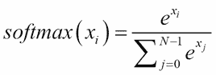
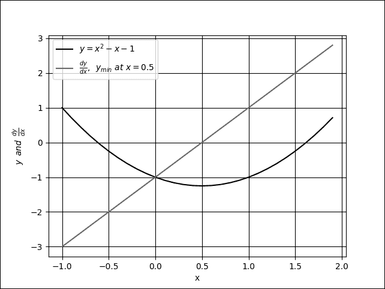

# 第一章。介绍使用 Keras 的高级深度学习

在本章中，我们将介绍本书中将使用的三种深度学习人工神经网络。这些深度学习模型是 MLP、CNN 和 RNN，它们是本书中所涵盖的高级深度学习主题（如自编码器和 GANs）的构建模块。

在本章中，我们将一起使用 Keras 库实现这些深度学习模型。我们将首先了解为什么 Keras 是我们使用的优秀工具。接下来，我们将深入探讨三种深度学习模型的安装和实现细节。

本章内容将包括：

+   解释为什么 Keras 库是用于高级深度学习的绝佳选择。

+   介绍 MLP、CNN 和 RNN —— 这是大多数高级深度学习模型的核心构建模块，我们将在本书中使用它们。

+   提供如何使用 Keras 和 TensorFlow 实现 MLP、CNN 和 RNN 的示例。

+   在过程中，我们将开始介绍一些重要的深度学习概念，包括优化、正则化和损失函数。

到本章结束时，我们将使用 Keras 实现基本的深度学习模型。在下一章中，我们将探讨基于这些基础的高级深度学习主题，如深度网络、自编码器和生成对抗网络（GANs）。

# 为什么 Keras 是完美的深度学习库？

Keras [*Chollet, François. "Keras (2015)." (2017)*] 是一个流行的深度学习库，写作时已有超过 250,000 名开发者使用，每年这个数字翻倍。超过 600 名贡献者积极维护它。本书中使用的一些示例已贡献至官方 Keras GitHub 仓库。谷歌的**TensorFlow**，一个流行的开源深度学习库，将 Keras 作为其高层 API。在工业界，Keras 被谷歌、Netflix、Uber 和 NVIDIA 等大公司广泛使用。本章中，我们将介绍如何使用 **Keras Sequential API**。

我们选择 Keras 作为本书中的工具，因为 Keras 是一个致力于加速深度学习模型实现的库。这使得 Keras 成为我们在实践和动手操作时的理想选择，尤其是在探索本书中的高级深度学习概念时。由于 Keras 与深度学习紧密相连，在最大化使用 Keras 库之前，了解深度学习的关键概念是至关重要的。

### 注意

本书中的所有示例都可以在 GitHub 上找到，链接如下：[`github.com/PacktPublishing/Advanced-Deep-Learning-with-Keras`](https://github.com/PacktPublishing/Advanced-Deep-Learning-with-Keras)。

Keras 是一个深度学习库，使我们能够高效地构建和训练模型。在该库中，层像乐高积木一样相互连接，生成的模型简洁且易于理解。模型训练非常直接，只需要数据、若干训练周期和用于监控的指标。最终结果是，大多数深度学习模型都可以通过显著更少的代码行数来实现。通过使用 Keras，我们能够提高生产力，通过节省在代码实现上的时间，将其投入到更重要的任务中，例如制定更好的深度学习算法。我们将 Keras 与深度学习结合使用，因为在引入本章接下来部分的三种深度学习网络时，它能提供更高的效率。

同样，Keras 非常适合快速实现深度学习模型，就像我们将在本书中使用的模型一样。典型的模型可以通过少量的代码行使用 **Sequential Model API** 构建。然而，不要被它的简洁性误导。Keras 也可以通过其 API 和 `Model` 和 `Layer` 类构建更先进和复杂的模型，这些模型可以定制以满足独特的需求。功能性 API 支持构建图形化的模型、层的重用以及表现像 Python 函数的模型。同时，`Model` 和 `Layer` 类提供了一个框架，用于实现不常见或实验性的深度学习模型和层。

## 安装 Keras 和 TensorFlow

Keras 不是一个独立的深度学习库。如 *图 1.1.1* 所示，它建立在其他深度学习库或后端之上。可以是 Google 的 **TensorFlow**，MILA 的 **Theano** 或 Microsoft 的 **CNTK**。对 Apache 的 **MXNet** 的支持几乎已经完成。我们将在本书中使用 **TensorFlow 后端和 Python 3** 进行测试。之所以选择 TensorFlow，是因为它的流行，使其成为一个常见的后端。

我们可以通过编辑 Linux 或 macOS 中的 Keras 配置文件 `.keras/keras.json`，轻松地在不同的后端之间切换。由于底层算法实现方式的不同，网络在不同的后端上可能会有不同的速度。

在硬件上，Keras 可以运行在 CPU、GPU 和 Google 的 TPU 上。在本书中，我们将使用 CPU 和 NVIDIA GPU（特别是 GTX 1060 和 GTX 1080Ti 型号）进行测试。


图 1.1.1：Keras 是一个高级库，建立在其他深度学习模型之上。Keras 支持在 CPU、GPU 和 TPU 上运行。

在继续阅读本书的其余内容之前，我们需要确保 Keras 和 TensorFlow 已正确安装。有多种方法可以进行安装；其中一种示例是使用 `pip3` 安装：

```py
$ sudo pip3 install tensorflow

```

如果我们拥有支持的 NVIDIA GPU，并且已正确安装驱动程序，以及 NVIDIA 的 **CUDA** 工具包和 **cuDNN 深度神经网络库**，建议安装支持 GPU 的版本，因为它可以加速训练和预测：

```py
$ sudo pip3 install tensorflow-gpu

```

我们接下来的步骤是安装 Keras：

```py
$ sudo pip3 install keras

```

本书中的示例需要额外的包，如 `pydot`、`pydot_ng`、`vizgraph`、`python3-tk` 和 `matplotlib`。在继续进行本章后，请先安装这些包。

如果已安装 TensorFlow 和 Keras 及其依赖项，则以下内容不应产生任何错误：

```py
$ python3
>>> import tensorflow as tf
>>> message = tf.constant('Hello world!')
>>> session = tf.Session()
>>> session.run(message)
b'Hello world!'
>>> import keras.backend as K
Using TensorFlow backend.
>>> print(K.epsilon())
1e-07

```

关于 `SSE4.2 AVX AVX2 FMA` 的警告信息（如下所示）可以安全忽略。要去除警告信息，你需要从 [`github.com/tensorflow/tensorflow`](https://github.com/tensorflow/tensorflow) 重新编译并安装 TensorFlow 源代码。

```py
tensorflow/core/platform/cpu_feature_guard.cc:137] Your CPU supports instructions that this TensorFlow binary was not compiled to use: SSE4.2 AVX AVX2 FMA

```

本书不覆盖完整的 Keras API。我们只会介绍解释本书中高级深度学习主题所需的材料。如需更多信息，请参考官方 Keras 文档，网址为 [`keras.io`](https://keras.io)。

# 实现核心深度学习模型 - MLPs、CNNs 和 RNNs

我们已经提到过，我们将使用三种高级深度学习模型，它们是：

+   **MLPs**：多层感知机

+   **RNNs**：递归神经网络

+   **CNNs**：卷积神经网络

这是我们在本书中将使用的三种网络。尽管这三种网络是独立的，但你会发现它们常常会结合在一起，以便充分利用每种模型的优势。

在本章的接下来的部分中，我们将逐一详细讨论这些构建模块。在随后的部分中，MLPs 将与其他重要主题一起讨论，如损失函数、优化器和正则化器。之后，我们将覆盖 CNNs 和 RNNs。

## MLPs、CNNs 和 RNNs 之间的区别

多层感知机（MLPs）是一个全连接网络。在一些文献中，你常常会看到它们被称为深度前馈网络或前馈神经网络。从已知的目标应用角度理解这些网络将帮助我们深入理解设计高级深度学习模型的基本原因。MLPs 在简单的逻辑回归和线性回归问题中很常见。然而，MLPs 并不适合处理序列数据和多维数据模式。由于设计上的原因，MLPs 很难记住序列数据中的模式，并且需要大量的参数来处理多维数据。

对于顺序数据输入，RNNs 因其内部设计允许网络发现对预测有用的历史数据依赖关系，因此非常受欢迎。对于多维数据，如图像和视频，CNN 在提取特征图以进行分类、分割、生成等方面表现出色。在某些情况下，CNN 也以一维卷积的形式用于具有顺序输入数据的网络。然而，在大多数深度学习模型中，MLPs、RNNs 和 CNNs 会结合使用，以充分发挥每个网络的优势。

MLPs、RNNs 和 CNNs 并没有完整展示深度网络的全貌。我们还需要识别一个*目标*或*损失函数*，*优化器*，以及一个*正则化器*。目标是在训练过程中减少损失函数的值，因为这可以作为模型正在学习的良好指引。为了最小化这个值，模型使用优化器。这是一个算法，用于确定每个训练步骤中权重和偏差应该如何调整。一个训练好的模型不仅要在训练数据上工作，还要在测试数据甚至是未曾预见的输入数据上有效。正则化器的作用是确保训练好的模型能够泛化到新数据。

# 多层感知机（MLPs）

我们将要查看的三种网络中的第一种被称为**多层感知机（MLPs）**。假设目标是创建一个神经网络，用于基于手写数字来识别数字。例如，当网络的输入是手写数字 8 的图像时，相应的预测也必须是数字 8。这是分类器网络的经典任务，可以通过逻辑回归进行训练。为了训练和验证一个分类器网络，必须有一个足够大的手写数字数据集。修改版国家标准与技术研究院数据集（简称 MNIST）通常被认为是深度学习的*Hello World!*，并且是一个适合手写数字分类的数据集。

在我们讨论多层感知机模型之前，必须先理解 MNIST 数据集。书中大量的示例使用了 MNIST 数据集。MNIST 被用来解释和验证深度学习理论，因为它包含的 70,000 个样本虽然不大，却包含了足够丰富的信息：


图 1.3.1：MNIST 数据集中的示例图像。每张图像为 28 × 28 像素的灰度图。

## MNIST 数据集

MNIST 是一个包含从 0 到 9 的手写数字集合。它有一个包含 60,000 张图像的训练集和 10,000 张测试图像，这些图像被分类到相应的类别或标签中。在一些文献中，**目标**或**真实标签**一词也用来指代**标签**。

在前面的图中可以看到 MNIST 数字的样本图像，每个图像的大小为 28×28 像素的灰度图。要在 Keras 中使用 MNIST 数据集，提供了一个 API 来自动下载和提取图像与标签。*Listing 1.3.1*展示了如何用一行代码加载 MNIST 数据集，使我们能够计算训练集和测试集的标签数量，并随机绘制数字图像。

Listing 1.3.1，`mnist-sampler-1.3.1.py`。Keras 代码展示了如何访问 MNIST 数据集，绘制 25 个随机样本，并计算训练集和测试集标签的数量：

```py
import numpy as np
from keras.datasets import mnist
import matplotlib.pyplot as plt

# load dataset
(x_train, y_train), (x_test, y_test) = mnist.load_data()

# count the number of unique train labels
unique, counts = np.unique(y_train, return_counts=True)
print("Train labels: ", dict(zip(unique, counts)))

# count the number of unique test labels
unique, counts = np.unique(y_test, return_counts=True)
print("Test labels: ", dict(zip(unique, counts)))

# sample 25 mnist digits from train dataset
indexes = np.random.randint(0, x_train.shape[0], size=25)
images = x_train[indexes]
labels = y_train[indexes]

# plot the 25 mnist digits
plt.figure(figsize=(5,5))
for i in range(len(indexes)):
    plt.subplot(5, 5, i + 1)
    image = images[i]
    plt.imshow(image, cmap='gray')
    plt.axis('off')

plt.show()
plt.savefig("mnist-samples.png")
plt.close('all')
```

`mnist.load_data()`方法非常方便，因为不需要单独加载所有 70,000 张图像和标签并将其存储在数组中。在命令行中执行`python3 mnist-sampler-1.3.1.py`会打印出训练集和测试集标签的分布：

```py
Train labels:  {0: 5923, 1: 6742, 2: 5958, 3: 6131, 4: 5842, 5: 5421, 6: 5918, 7: 6265, 8: 5851, 9: 5949}
Test labels:  {0: 980, 1: 1135, 2: 1032, 3: 1010, 4: 982, 5: 892, 6: 958, 7: 1028, 8: 974, 9: 1009}

```

然后，代码将绘制 25 个随机数字，如前面的图*图 1.3.1*所示。

在讨论多层感知机分类器模型之前，必须记住，虽然 MNIST 数据是二维张量，但应根据输入层的类型进行相应的重塑。下图展示了如何将一个 3×3 的灰度图像重塑为 MLP、CNN 和 RNN 的输入层：


图 1.3.2：一个类似于 MNIST 数据的输入图像，根据输入层的类型进行重塑。为简化起见，展示了如何将一个 3×3 的灰度图像进行重塑。

## MNIST 数字分类器模型

如*图 1.3.3*所示，提出的 MLP 模型可用于 MNIST 数字分类。当单元或感知机被展示时，MLP 模型是一个完全连接的网络，如*图 1.3.4*所示。接下来还会展示如何根据输入计算感知机的输出，作为权重*w*[i]和偏置*b*[n]（n 为第 n 个单元）的函数。相应的 Keras 实现请参见*Listing 1.3.2*。


图 1.3.3：MLP MNIST 数字分类器模型


图 1.3.4：图 1.3.3 中的 MLP MNIST 数字分类器由全连接层组成。为简化起见，激活函数和 dropout 未显示。同时也展示了一个单元或感知机。

Listing 1.3.2，`mlp-mnist-1.3.2.py`展示了使用 MLP 的 MNIST 数字分类器模型的 Keras 实现：

```py
import numpy as np
from keras.models import Sequential
from keras.layers import Dense, Activation, Dropout
from keras.utils import to_categorical, plot_model
from keras.datasets import mnist

# load mnist dataset
(x_train, y_train), (x_test, y_test) = mnist.load_data()

# compute the number of labels
num_labels = len(np.unique(y_train))

# convert to one-hot vector
y_train = to_categorical(y_train)
y_test = to_categorical(y_test)

# image dimensions (assumed square)
image_size = x_train.shape[1]
input_size = image_size * image_size

# resize and normalize
x_train = np.reshape(x_train, [-1, input_size])
x_train = x_train.astype('float32') / 255
x_test = np.reshape(x_test, [-1, input_size])
x_test = x_test.astype('float32') / 255

# network parameters
batch_size = 128
hidden_units = 256
dropout = 0.45

# model is a 3-layer MLP with ReLU and dropout after each layer
model = Sequential()
model.add(Dense(hidden_units, input_dim=input_size))
model.add(Activation('relu'))
model.add(Dropout(dropout))
model.add(Dense(hidden_units))
model.add(Activation('relu'))
model.add(Dropout(dropout))
model.add(Dense(num_labels))
# this is the output for one-hot vector
model.add(Activation('softmax'))
model.summary()
plot_model(model, to_file='mlp-mnist.png', show_shapes=True)

# loss function for one-hot vector
# use of adam optimizer
# accuracy is a good metric for classification tasks
model.compile(loss='categorical_crossentropy',
              optimizer='adam',
              metrics=['accuracy'])
# train the network
model.fit(x_train, y_train, epochs=20, batch_size=batch_size)

# validate the model on test dataset to determine generalization
loss, acc = model.evaluate(x_test, y_test, batch_size=batch_size)
print("\nTest accuracy: %.1f%%" % (100.0 * acc))
```

在讨论模型实现之前，数据必须是正确的形状和格式。加载 MNIST 数据集后，标签数量的计算方式如下：

```py
# compute the number of labels
num_labels = len(np.unique(y_train))
```

硬编码`num_labels = 10`也是一种选择。但是，最好让计算机完成其工作。代码假设`y_train`包含标签 0 到 9。

此时，标签为数字格式，范围从 0 到 9。标签的稀疏标量表示法不适用于输出每类概率的神经网络预测层。更合适的格式是称为**one-hot 向量**的格式，这是一个 10 维向量，所有元素为 0，除了数字类的索引。例如，如果标签是 2，则等效的 one-hot 向量为`[0,0,1,0,0,0,0,0,0,0]`。第一个标签的索引为`0`。

以下几行将每个标签转换为 one-hot 向量：

```py
# convert to one-hot vector
y_train = to_categorical(y_train)
y_test = to_categorical(y_test)
```

在深度学习中，数据存储在**张量**中。张量一词适用于标量（0D 张量）、向量（1D 张量）、矩阵（2D 张量）和多维张量。从现在开始，除非标量、向量或矩阵能使解释更清晰，否则将使用张量一词。

剩余部分计算图像尺寸，第一层`Dense`的`input_size`，并将每个像素值从 0 到 255 的范围缩放到 0.0 到 1.0 之间。虽然可以直接使用原始像素值，但最好对输入数据进行归一化，以避免大梯度值，这可能会使训练变得困难。网络的输出也会进行归一化。训练完成后，有一个选项可以通过将输出张量乘以 255，将所有值恢复为整数像素值。

提出的模型基于 MLP 层。因此，输入预计为 1D 张量。因此，`x_train`和`x_test`分别被重塑为[60000, 28 * 28]和[10000, 28 * 28]。

```py
# image dimensions (assumed square)
image_size = x_train.shape[1]
input_size = image_size * image_size

# resize and normalize
x_train = np.reshape(x_train, [-1, input_size])
x_train = x_train.astype('float32') / 255
x_test = np.reshape(x_test, [-1, input_size])
x_test = x_test.astype('float32') / 255
```

### 使用 MLP 和 Keras 构建模型

数据准备好后，接下来是构建模型。提议的模型由三层 MLP 构成。在 Keras 中，MLP 层被称为**Dense**，即密集连接层。第一层和第二层 MLP 在结构上完全相同，每层有 256 个单元，后跟`relu`激活和`dropout`。选择 256 个单元是因为 128、512 和 1,024 个单元的性能指标较低。在 128 个单元时，网络收敛较快，但测试准确率较低。增加 512 或 1,024 个单元并未显著提高测试准确率。

单元数是一个**超参数**。它控制网络的*容量*。容量是网络能够逼近的函数复杂度的度量。例如，对于多项式，次数就是超参数。随着次数的增加，函数的容量也随之增加。

如下所示的模型，分类器模型是使用 Keras 的顺序模型 API 实现的。如果模型只需要一个输入和一个输出，并通过一系列层进行处理，这种方法已经足够简单。为了简单起见，我们暂时使用这个方法，但在第二章《深度神经网络》中，将介绍 Keras 的函数式 API 来实现更复杂的深度学习模型。

```py
# model is a 3-layer MLP with ReLU and dropout after each layer
model = Sequential()
model.add(Dense(hidden_units, input_dim=input_size))
model.add(Activation('relu'))
model.add(Dropout(dropout))
model.add(Dense(hidden_units))
model.add(Activation('relu'))
model.add(Dropout(dropout))
model.add(Dense(num_labels))
# this is the output for one-hot vector
model.add(Activation('softmax'))
```

由于 `Dense` 层是线性操作，若仅有一系列 `Dense` 层，它们只能逼近线性函数。问题在于，MNIST 手写数字分类本质上是一个非线性过程。在 `Dense` 层之间插入 `relu` 激活函数将使得多层感知机（MLP）能够建模非线性映射。`relu` 或 **修正线性单元** (**ReLU**) 是一个简单的非线性函数。它就像一个过滤器，允许正输入保持不变，而将其它输入压制为零。数学上，`relu` 可以通过以下公式表示，并在 *图 1.3.5* 中绘制：

*relu*(x) = *max*(0,*x*)


图 1.3.5：ReLU 函数的图像。ReLU 函数在神经网络中引入了非线性。

还有其他非线性函数可以使用，如 `elu`、`selu`、`softplus`、`sigmoid` 和 `tanh`。然而，`relu` 是行业中最常用的，并且由于其简单性，在计算上非常高效。`sigmoid` 和 `tanh` 被用作输出层的激活函数，后文将详细描述。*表 1.3.1* 展示了这些激活函数的方程：

| `relu` | *relu*(x) = *max*(0,*x*) | 1.3.1 |
| --- | --- | --- |
| `softplus` | *softplus*(*x*) = log(1 + *e* *x*) | 1.3.2 |
| `elu` | ，其中 ，并且是一个可调超参数 | 1.3.3 |
| `selu` | *selu*(*x*) = *k* × *elu*(*x,a*)，其中 *k* = 1.0507009873554804934193349852946 和 *a* = 1.6732632423543772848170429916717 | 1.3.4 |

> 表 1.3.1：常见非线性激活函数的定义

## 正则化

神经网络有记忆训练数据的倾向，特别是当它的容量足够大时。在这种情况下，网络在面对测试数据时会发生灾难性的失败。这是网络无法泛化的经典案例。为了避免这种倾向，模型使用了正则化层或正则化函数。一个常见的正则化层被称为 **dropout**。

dropout 的思想很简单。给定一个 dropout 率（这里设为 `dropout=0.45`），`Dropout` 层会随机移除该比例的神经元，使其不参与下一层的计算。例如，如果第一层有 256 个神经元，应用 `dropout=0.45` 后，只有 *(1 - 0.45) * 256 = 140* 个神经元会参与第二层的计算。`Dropout` 层使得神经网络能够应对不可预见的输入数据，因为网络经过训练后，即使部分神经元缺失，依然能够正确预测。值得注意的是，dropout 不会用于输出层，并且它只在训练过程中起作用，预测时不会使用 dropout。

除了 dropout 外，还有其他正则化器可以使用，如`l1`或`l2`。在 Keras 中，可以对每个层的偏置、权重和激活输出进行正则化。`l1`和`l2`通过添加惩罚函数来偏向较小的参数值。`l1`和`l2`通过参数值的绝对值和平方的和的分数来强制实施惩罚。换句话说，惩罚函数强迫优化器找到较小的参数值。具有较小参数值的神经网络对输入数据中的噪声更不敏感。

例如，`l2`权重正则化器与`fraction=0.001`可以实现为：

```py
from keras.regularizers import l2
model.add(Dense(hidden_units,
          kernel_regularizer=l2(0.001),
          input_dim=input_size))
```

如果使用了`l1`或`l2`正则化，则不会添加额外的层。正则化会在`Dense`层内部强制执行。对于所提出的模型，dropout 仍然比`l2`正则化表现更好。

## 输出激活和损失函数

输出层有 10 个单元，并采用`softmax`激活函数。10 个单元对应着 10 个可能的标签、类别或分类。`softmax`激活函数可以通过以下方程表示：



（方程 1.3.5）

该方程适用于所有*N* = 10 个输出，*x* *i* *for i* = 0, 1 … 9 的最终预测。`softmax`的概念出奇地简单。它通过标准化预测，将输出压缩为概率。在这里，每个预测的输出是给定输入图像的正确标签的概率。所有输出的概率总和为 1.0。例如，当`softmax`层生成预测时，它将是一个 10 维的 1D 张量，输出可能类似于以下内容：

```py
[  3.57351579e-11   7.08998016e-08   2.30154569e-07   6.35787558e-07
   5.57471187e-11   4.15353840e-09   3.55973775e-16   9.99995947e-01
   1.29531730e-09   3.06023480e-06]

```

预测输出张量表明，输入图像的标签应该是 7，因为其索引具有最高的概率。可以使用`numpy.argmax()`方法来确定具有最大值的元素的索引。

还有其他可以选择的输出激活层，例如`linear`、`sigmoid`和`tanh`。`linear`激活函数是一个恒等函数，它将输入直接复制到输出。`sigmoid`函数更具体地被称为**逻辑 sigmoid**。当预测张量的元素需要独立地映射到 0.0 到 1.0 之间时，将使用`sigmoid`。与`softmax`不同，预测张量中所有元素的总和不被限制为 1.0。例如，在情感预测（0.0 表示坏，1.0 表示好）或图像生成（0.0 表示 0，1.0 表示 255 像素值）中，`sigmoid`被用作最后一层。

`tanh`函数将其输入映射到-1.0 到 1.0 的范围。这在输出可以正负波动时非常重要。`tanh`函数更常用于循环神经网络的内部层，但也曾作为输出层激活函数使用。如果`tanh`替代`sigmoid`作为输出激活函数，所使用的数据必须进行适当的缩放。例如，代替在[0.0, 1.0]范围内缩放每个灰度像素


它被指定在范围[-1.0, 1.0]内


.

下图展示了`sigmoid`和`tanh`函数。从数学上讲，`sigmoid`可以通过以下方程式表示：


（方程式 1.3.6）


图 1.3.6：`sigmoid`与`tanh`函数图

预测张量与独热编码真实标签向量的差异被称为损失。一种损失函数是`mean_squared_error`（**均方误差**），即目标值与预测值之间差异的平方的平均值。在当前示例中，我们使用的是`categorical_crossentropy`。它是目标与预测值的乘积与预测值对数的总和的负值。Keras 中还提供了其他损失函数，如`mean_absolute_error`和`binary_crossentropy`。损失函数的选择并非随意，而应该是模型正在学习的标准。对于分类问题，`categorical_crossentropy`或`mean_squared_error`是`softmax`激活层之后的一个不错的选择。而`binary_crossentropy`损失函数通常在`sigmoid`激活层之后使用，`mean_squared_error`则是`tanh`输出的一个选择。

## 优化

在优化过程中，目标是最小化损失函数。其思想是，如果损失减少到可接受的水平，模型就间接地学习了将输入映射到输出的函数。性能指标用于确定模型是否学习到了潜在的数据分布。Keras 中的默认指标是**损失**。在训练、验证和测试过程中，还可以包括其他指标，如**准确率**。准确率是基于真实标签的正确预测的百分比或分数。在深度学习中，还有许多其他的性能指标。然而，这取决于模型的目标应用。在文献中，通常会报告训练模型在测试数据集上的性能指标，以便与其他深度学习模型进行比较。

在 Keras 中，有几种优化器可供选择。最常用的优化器包括；**随机梯度下降**（**SGD**）、**自适应矩估计**（**Adam**）和**均方根传播**（**RMSprop**）。每个优化器都有可调参数，如学习率、动量和衰减。Adam 和 RMSprop 是 SGD 的变种，具有自适应学习率。在所提出的分类器网络中，使用了 Adam，因为它具有最高的测试准确率。

SGD 被认为是最基本的优化器。它是微积分中梯度下降的简化版本。在**梯度下降**（**GD**）中，沿着函数曲线向下追踪找到最小值，就像在山谷中或沿着梯度的反方向走，直到到达底部。

GD 算法如*图 1.3.7*所示。假设 *x* 是正在调节的参数（例如，权重），目的是找到 *y*（例如，损失函数）的最小值。从 *x* = -0.5 的任意位置开始，梯度为


GD 算法要求 *x* 随后更新为


新的 *x* 值等于旧的值，加上梯度的相反方向并按比例缩放。


。这个小数字


指的是学习率。如果


，新值的 *x* = -0.48。

GD 通过迭代执行。在每一步中，*y* 将越来越接近其最小值。在 *x* = 0.5 时，


，GD 已经找到了 *y* = -1.25 的绝对最小值。梯度建议 *x* 不再改变。

学习率的选择至关重要。一个较大的值


可能无法找到最小值，因为搜索可能会在最小值附近来回摆动。另一方面，过小的值


可能需要进行大量的迭代才能找到最小值。在多重极小值的情况下，搜索可能会陷入局部最小值。



图 1.3.7：梯度下降类似于沿着函数曲线走下坡，直到到达最低点。在这个图中，全局最小值位于 *x* = 0.5。

多重极小值的例子可以在*图 1.3.8*中看到。如果出于某种原因搜索从图的左侧开始，且学习率非常小，则 GD 有很高的概率将 *x* = -1.51 作为 *y* 的最小值，而不会找到 *x* = 1.66 的全局最小值。一个足够的学习率将使梯度下降能够越过 *x* = 0.0 处的小山。在深度学习实践中，通常建议从较大的学习率（例如 0.1 到 0.001）开始，并随着损失接近最小值逐渐减小学习率。


图 1.3.8：具有两个最小值的函数图，x = -1.51 和 x = 1.66。图中还显示了该函数的导数。

梯度下降在深度神经网络中通常不使用，因为你经常会遇到需要训练的数百万个参数。执行完全的梯度下降在计算上效率低下。相反，使用了 SGD（随机梯度下降）。在 SGD 中，选择一个小批量样本来计算下降的近似值。参数（例如权重和偏置）通过以下公式进行调整：


（公式 1.3.7）

在这个公式中，


和


分别是损失函数的参数和梯度张量。**g** 是通过损失函数的偏导数计算得到的。为了优化 GPU 性能，建议将小批量大小设置为 2 的幂。在所提议的网络中，`batch_size=128`。

*公式 1.3.7* 计算了最后一层的参数更新。那么，如何调整前面层的参数呢？对于这种情况，应用微分的链式法则将导数传播到更低的层，并相应地计算梯度。这个算法在深度学习中被称为**反向传播**。反向传播的细节超出了本书的范围。不过，可以在[`neuralnetworksanddeeplearning.com`](http://neuralnetworksanddeeplearning.com)找到一个很好的在线参考。

由于优化是基于微分的，因此损失函数的一个重要标准是它必须是平滑的或可微分的。当引入新的损失函数时，这个约束是非常重要的。

给定训练数据集、损失函数、优化器和正则化器的选择，现在可以通过调用 `fit()` 函数来训练模型：

```py
# loss function for one-hot vector
# use of adam optimizer
# accuracy is a good metric for classification tasks
model.compile(loss='categorical_crossentropy',
              optimizer='adam',
              metrics=['accuracy'])
# train the network
model.fit(x_train, y_train, epochs=20, batch_size=batch_size)
```

这是 Keras 另一个有用的功能。只需提供 *x* 和 *y* 数据、训练的 epoch 数量和批量大小，`fit()` 就会处理剩下的部分。在其他深度学习框架中，这需要执行多个任务，比如将输入和输出数据转换为正确的格式、加载、监控等。所有这些都必须在 `for` 循环内完成！在 Keras 中，所有工作都在一行代码中完成。

在 `fit()` 函数中，epoch 是对整个训练数据集的完整采样。`batch_size` 参数是每次训练步骤处理的输入样本数量。要完成一个 epoch，`fit()` 需要用训练数据集的大小除以批量大小，再加 1 以补偿任何小数部分。

## 性能评估

到目前为止，**MNIST** 数字分类器的模型已经完成。性能评估将是下一个关键步骤，以确定所提出的模型是否提供了令人满意的解决方案。训练模型 20 个 epoch 足以获得可比的性能指标。

以下表格 *表 1.3.2* 显示了不同网络配置和相应的性能指标。在 *Layers* 列中，展示了第 1 到第 3 层的单元数。对于每个优化器，使用了 Keras 中的默认参数。可以观察到改变正则化器、优化器和每层单元数的效果。在 *表 1.3.2* 中的另一个重要观察结果是，较大的网络不一定会带来更好的性能。

增加网络深度对于训练和测试数据集的准确性没有带来额外的好处。另一方面，像 128 这样的较小单元数也可能会降低测试和训练的准确率。当去除正则化器并使用每层 256 个单元时，获得了 99.93%的最佳训练准确率。然而，由于网络过拟合，测试准确率要低得多，为 98.0%。

最高的测试准确率是在使用 Adam 优化器和 `Dropout(0.45)` 时达到 98.5%。从技术上讲，仍然存在一定程度的过拟合，因为其训练准确率为 99.39%。对于 256-512-256、`Dropout(0.45)` 和 SGD，训练和测试准确率都是 98.2%。去除 *Regularizer* 和 *ReLU* 层会导致最差的性能。通常，我们会发现 `Dropout` 层的性能优于 `l2`。

以下表格展示了在调优过程中典型的深度神经网络性能。该示例表明，网络架构需要改进。在接下来的部分中，另一个使用 CNN 的模型显示了测试准确率的显著提高：

| 层数 | 正则化器 | 优化器 | ReLU | 训练准确率，% | 测试准确率，% |
| --- | --- | --- | --- | --- | --- |
| 256-256-256 | 无 | SGD | 否 | 93.65 | 92.5 |
| 256-256-256 | L2(0.001) | SGD | 是 | 99.35 | 98.0 |
| 256-256-256 | L2(0.01) | SGD | 是 | 96.90 | 96.7 |
| 256-256-256 | 无 | SGD | 是 | 99.93 | 98.0 |
| 256-256-256 | Dropout(0.4) | SGD | 是 | 98.23 | 98.1 |
| 256-256-256 | Dropout(0.45) | SGD | 是 | 98.07 | 98.1 |
| 256-256-256 | Dropout(0.5) | SGD | 是 | 97.68 | 98.1 |
| 256-256-256 | Dropout(0.6) | SGD | 是 | 97.11 | 97.9 |
| 256-512-256 | Dropout(0.45) | SGD | 是 | 98.21 | 98.2 |
| 512-512-512 | Dropout(0.2) | SGD | 是 | 99.45 | 98.3 |
| 512-512-512 | Dropout(0.4) | SGD | 是 | 98.95 | 98.3 |
| 512-1024-512 | Dropout(0.45) | SGD | 是 | 98.90 | 98.2 |
| 1024-1024-1024 | Dropout(0.4) | SGD | 是 | 99.37 | 98.3 |
| 256-256-256 | Dropout(0.6) | Adam | 是 | 98.64 | 98.2 |
| 256-256-256 | Dropout(0.55) | Adam | 是 | 99.02 | 98.3 |
| 256-256-256 | Dropout(0.45) | Adam | 是 | 99.39 | 98.5 |
| 256-256-256 | Dropout(0.45) | RMSprop | 是 | 98.75 | 98.1 |
| 128-128-128 | Dropout(0.45) | Adam | 是 | 98.70 | 97.7 |

## 模型总结

使用 Keras 库可以通过调用以下方法快速验证模型描述：

```py
model.summary()
```

*清单* *1.3.2*展示了提出的网络模型的总结。该模型需要总计 269,322 个参数。考虑到我们只是一个简单的 MNIST 数字分类任务，这个参数数量相当可观。MLP 模型并不高效。参数的数量可以通过*图 1.3.4*来计算，重点关注感知机如何计算输出。从输入到 Dense 层：784 × 256 + 256 = 200,960。第一个 Dense 到第二个 Dense：256 × 256 + 256 = 65,792。从第二个 Dense 到输出层：10 × 256 + 10 = 2,570。总数为 269,322。

清单 1.3.2 展示了 MLP MNIST 数字分类器模型的总结：

```py
_________________________________________________________________
Layer (type)                 Output Shape              Param #   
=================================================================
dense_1 (Dense)              (None, 256)               200960    
_________________________________________________________________
activation_1 (Activation)    (None, 256)               0         
_________________________________________________________________
dropout_1 (Dropout)          (None, 256)               0         
_________________________________________________________________
dense_2 (Dense)              (None, 256)               65792     
_________________________________________________________________
activation_2 (Activation)    (None, 256)               0         
_________________________________________________________________
dropout_2 (Dropout)          (None, 256)               0         
_________________________________________________________________
dense_3 (Dense)              (None, 10)                2570      
_________________________________________________________________
activation_3 (Activation)    (None, 10)                0         
=================================================================
Total params: 269,322
Trainable params: 269,322
Non-trainable params: 0

```

另一种验证网络的方法是调用：

```py
plot_model(model, to_file='mlp-mnist.png', show_shapes=True)

```

*图 1.3.9*展示了该图形结果。你会发现，这与`summary()`的结果类似，但以图形化的方式显示了每一层的相互连接和输入输出。


图 1.3.9：MLP MNIST 数字分类器的图形描述

# 卷积神经网络（CNNs）

现在我们将进入第二种人工神经网络——**卷积神经网络**（**CNNs**）。在本节中，我们将解决相同的 MNIST 数字分类问题，不过这次我们将使用 CNN。

*图 1.4.1*展示了我们将用于 MNIST 数字分类的 CNN 模型，模型的实现细节则在*清单* *1.4.1*中进行了说明。为了实现 CNN 模型，之前模型的一些部分需要做出调整。输入向量不再是原来的形式，而是新的维度（高度、宽度、通道数），对于灰度的 MNIST 图像来说，输入形状是（image_size, image_size, 1） = (28, 28, 1)。因此，训练和测试图像需要重新调整大小以符合这一输入形状要求。


图 1.4.1：用于 MNIST 数字分类的 CNN 模型

清单 1.4.1，`cnn-mnist-1.4.1.py`展示了使用 CNN 进行 MNIST 数字分类的 Keras 代码：

```py
import numpy as np
from keras.models import Sequential
from keras.layers import Activation, Dense, Dropout
from keras.layers import Conv2D, MaxPooling2D, Flatten
from keras.utils import to_categorical, plot_model
from keras.datasets import mnist

# load mnist dataset
(x_train, y_train), (x_test, y_test) = mnist.load_data()

# compute the number of labels
num_labels = len(np.unique(y_train))

# convert to one-hot vector
y_train = to_categorical(y_train)
y_test = to_categorical(y_test)

# input image dimensions
image_size = x_train.shape[1]
# resize and normalize
x_train = np.reshape(x_train,[-1, image_size, image_size, 1])
x_test = np.reshape(x_test,[-1, image_size, image_size, 1])
x_train = x_train.astype('float32') / 255
x_test = x_test.astype('float32') / 255

# network parameters
# image is processed as is (square grayscale)
input_shape = (image_size, image_size, 1)
batch_size = 128
kernel_size = 3
pool_size = 2
filters = 64
dropout = 0.2

# model is a stack of CNN-ReLU-MaxPooling
model = Sequential()
model.add(Conv2D(filters=filters,
                 kernel_size=kernel_size,
                 activation='relu',
                 input_shape=input_shape))
model.add(MaxPooling2D(pool_size))
model.add(Conv2D(filters=filters,
                 kernel_size=kernel_size,
                 activation='relu'))
model.add(MaxPooling2D(pool_size))
model.add(Conv2D(filters=filters,
                 kernel_size=kernel_size,
                 activation='relu'))
model.add(Flatten())
# dropout added as regularizer
model.add(Dropout(dropout))
# output layer is 10-dim one-hot vector
model.add(Dense(num_labels))
model.add(Activation('softmax'))
model.summary()
plot_model(model, to_file='cnn-mnist.png', show_shapes=True)

# loss function for one-hot vector
# use of adam optimizer
# accuracy is good metric for classification tasks
model.compile(loss='categorical_crossentropy',
              optimizer='adam',
              metrics=['accuracy'])
# train the network
model.fit(x_train, y_train, epochs=10, batch_size=batch_size)

loss, acc = model.evaluate(x_test, y_test, batch_size=batch_size)
print("\nTest accuracy: %.1f%%" % (100.0 * acc))
```

这里的主要变化是使用了`Conv2D`层。`relu`激活函数已经是`Conv2D`的一个参数。使用**批量归一化**层时，`relu`函数可以作为一个`Activation`层单独使用。批量归一化在深度 CNN 中非常常见，可以使得在训练过程中使用较大的学习率，而不会引起不稳定。

## 卷积

如果在 MLP 模型中，单元的数量表示`Dense`层的特点，那么卷积核则代表 CNN 操作的特点。如*图 1.4.2*所示，卷积核可以视为一个矩形的图像块或窗口，它从左到右、从上到下滑过整个图像。这一操作被称为**卷积**。它将输入图像转化为**特征图**，特征图代表了卷积核从输入图像中*学习*到的内容。特征图随后会被转化为下一层的特征图，依此类推。每个`Conv2D`生成的特征图的数量由`filters`参数控制。


图 1.4.2：一个 3 × 3 的卷积核与 MNIST 数字图像进行卷积。卷积过程通过步骤 t[n]和 t[n+1]展示，其中卷积核向右移动了 1 个像素的步幅。

卷积过程中涉及的计算如*图 1.4.3*所示。为了简便起见，假设输入图像（或输入特征图）是一个 5 × 5 的矩阵，应用了一个 3 × 3 的卷积核。卷积后的特征图也在图中展示。图中特征图中的一个元素已被阴影标出。你会注意到，卷积后的特征图比原始输入图像要小，这是因为卷积只在有效元素上进行，卷积核不能越过图像的边界。如果希望输入和输出特征图的尺寸保持一致，可以将`Conv2D`的参数设置为`padding='same'`。输入图像的边界会被零填充，从而在卷积后保持尺寸不变：


图 1.4.3：卷积操作展示了特征图中一个元素是如何被计算出来的

## 池化操作

最后的变化是添加了一个`MaxPooling2D`层，参数为`pool_size=2`。`MaxPooling2D`会压缩每个特征图。每个大小为`pool_size` × `pool_size`的区域都会被缩减为一个像素，值等于该区域内的最大像素值。以下图展示了两个区域的`MaxPooling2D`操作：


图 1.4.4：MaxPooling2D 操作。为了简便起见，输入特征图为 4 × 4，得到一个 2 × 2 的特征图。

`MaxPooling2D`的意义在于特征图大小的减少，从而实现了卷积核覆盖范围的增加。例如，在`MaxPooling2D(2)`之后，2 × 2 的卷积核大约是与一个 4 × 4 的区域进行卷积。CNN 学习到了新的特征图集，涵盖了不同的区域。

还有其他池化和压缩方式。例如，为了实现与`MaxPooling2D(2)`相同的 50%尺寸缩小，`AveragePooling2D(2)`通过取一个区域的平均值来代替找到最大值。步幅卷积`Conv2D(strides=2,…)`会在卷积过程中跳过每两个像素，仍然能达到相同的 50%尺寸缩小效果。不同的缩减技术在效果上有细微差别。

在`Conv2D`和`MaxPooling2D`中，`pool_size`和`kernel`都可以是非方形的。在这种情况下，必须同时指定行和列的大小。例如，`pool_size=(1, 2)`和`kernel=(3, 5)`。

最后一个`MaxPooling2D`层的输出是一个堆叠的特征图。`Flatten`的作用是将这些堆叠的特征图转换为适合`Dropout`或`Dense`层的向量格式，类似于 MLP 模型的输出层。

## 性能评估和模型总结

如*列表* *1.4.2*所示，与使用 MLP 层时的 269,322 相比，*列表* *1.4.1* 中的 CNN 模型所需参数较少，为 80,226。`conv2d_1` 层有 640 个参数，因为每个卷积核有 3 × 3 = 9 个参数，且每个 64 个特征图都有一个卷积核和一个偏置参数。其他卷积层的参数数量可以通过类似的方式计算。*图 1.4.5* 显示了 CNN MNIST 数字分类器的图形表示。

*表 1.4.1* 显示了使用 Adam 优化器和 `dropout=0.2` 的 3 层网络，每层 64 个特征图时，最大测试准确率为 99.4%。CNN 在参数效率上更高，并且具有比 MLP 更高的准确性。同样，CNN 也适合用于从顺序数据、图像和视频中学习表示。

列表 1.4.2 显示了 CNN MNIST 数字分类器的总结：

```py
_________________________________________________________________
Layer (type)                 Output Shape              Param #   
=================================================================
conv2d_1 (Conv2D)            (None, 26, 26, 64)        640       
_________________________________________________________________
max_pooling2d_1 (MaxPooling2 (None, 13, 13, 64)        0         
_________________________________________________________________
conv2d_2 (Conv2D)            (None, 11, 11, 64)        36928     
_________________________________________________________________
max_pooling2d_2 (MaxPooling2 (None, 5, 5, 64)          0         
_________________________________________________________________
conv2d_3 (Conv2D)            (None, 3, 3, 64)          36928     
_________________________________________________________________
flatten_1 (Flatten)          (None, 576)               0         
_________________________________________________________________
dropout_1 (Dropout)          (None, 576)               0         
_________________________________________________________________
dense_1 (Dense)              (None, 10)                5770      
_________________________________________________________________
activation_1 (Activation)    (None, 10)                0         
=================================================================
Total params: 80,266
Trainable params: 80,266
Non-trainable params: 0

```


图 1.4.5：CNN MNIST 数字分类器的图形描述

| 层数 | 优化器 | 正则化器 | 训练准确率，% | 测试准确率，% |
| --- | --- | --- | --- | --- |
| 64-64-64 | SGD | Dropout(0.2) | 97.76 | 98.50 |
| 64-64-64 | RMSprop | Dropout(0.2) | 99.11 | 99.00 |
| 64-64-64 | Adam | Dropout(0.2) | 99.75 | 99.40 |
| 64-64-64 | Adam | Dropout(0.4) | 99.64 | 99.30 |

# 递归神经网络（RNNs）

现在我们将看看我们三个人工神经网络中的最后一个——递归神经网络（RNNs）。

RNNs 是一类适用于学习顺序数据表示的网络，例如**自然语言处理**（**NLP**）中的文本或仪器中的传感器数据流。虽然每个 MNIST 数据样本本身并非顺序数据，但不难想象，每个图像都可以被解释为一系列像素行或列的顺序。因此，基于 RNN 的模型可以将每个 MNIST 图像处理为 28 元素输入向量的序列，**时间步**等于 28。以下列表显示了*图 1.5.1*中 RNN 模型的代码：


图 1.5.1：用于 MNIST 数字分类的 RNN 模型

在以下列表中，*列表 1.5.1*，`rnn-mnist-1.5.1.py` 显示了使用 RNNs 进行 MNIST 数字分类的 Keras 代码：

```py
import numpy as np
from keras.models import Sequential
from keras.layers import Dense, Activation, SimpleRNN
from keras.utils import to_categorical, plot_model
from keras.datasets import mnist

# load mnist dataset
(x_train, y_train), (x_test, y_test) = mnist.load_data()

# compute the number of labels
num_labels = len(np.unique(y_train))

# convert to one-hot vector
y_train = to_categorical(y_train)
y_test = to_categorical(y_test)

# resize and normalize
image_size = x_train.shape[1]
x_train = np.reshape(x_train,[-1, image_size, image_size])
x_test = np.reshape(x_test,[-1, image_size, image_size])
x_train = x_train.astype('float32') / 255
x_test = x_test.astype('float32') / 255

# network parameters
input_shape = (image_size, image_size)
batch_size = 128
units = 256
dropout = 0.2 

# model is RNN with 256 units, input is 28-dim vector 28 timesteps
model = Sequential()
model.add(SimpleRNN(units=units,
                    dropout=dropout,
                    input_shape=input_shape))
model.add(Dense(num_labels))
model.add(Activation('softmax'))
model.summary()
plot_model(model, to_file='rnn-mnist.png', show_shapes=True)

# loss function for one-hot vector
# use of sgd optimizer
# accuracy is good metric for classification tasks
model.compile(loss='categorical_crossentropy',
              optimizer='sgd',
              metrics=['accuracy'])
# train the network
model.fit(x_train, y_train, epochs=20, batch_size=batch_size)

loss, acc = model.evaluate(x_test, y_test, batch_size=batch_size)
print("\nTest accuracy: %.1f%%" % (100.0 * acc))
```

RNN 与前两种模型之间有两个主要区别。首先是`input_shape = (image_size, image_size)`，实际上是`input_shape = (timesteps, input_dim)`，即一个长度为`timesteps`的`input_dim`维度向量序列。其次是使用`SimpleRNN`层来表示一个具有`units=256`的 RNN 单元。`units`变量表示输出单元的数量。如果 CNN 的特点是卷积核在输入特征图上进行卷积，那么 RNN 的输出不仅是当前输入的函数，还与上一输出或隐藏状态有关。由于上一输出也是上一输入的函数，因此当前输出也是上一输出和输入的函数，依此类推。Keras 中的`SimpleRNN`层是 RNN 的简化版本。以下方程描述了 SimpleRNN 的输出：

**h**t = tanh(**b** + W**h**t-1 + U**x**t) (1.5.1)

在此方程中，**b**是偏置项，**W**和**U**分别被称为递归核（上一输出的权重）和核（当前输入的权重）。下标*t*用于表示序列中的位置。对于`SimpleRNN`层，`units=256`时，总参数数量为 256 + 256 × 256 + 256 × 28 = 72,960，分别对应**b**、**W**和**U**的贡献。

以下图展示了在 MNIST 数字分类中使用的 SimpleRNN 和 RNN 的示意图。`SimpleRNN`比 RNN 更简单的原因是缺少在 softmax 计算之前的输出值**O**t = V**h**t + **c**：


图 1.5.2：SimpleRNN 和 RNN 的示意图

与 MLP 或 CNN 相比，RNN 在初始阶段可能更难理解。在 MLP 中，感知机是基本单元。一旦理解了感知机的概念，MLP 就只是感知机的网络。在 CNN 中，卷积核是一个滑过特征图以生成另一个特征图的窗口。在 RNN 中，最重要的是自循环的概念。实际上，只有一个单元。

多个单元的错觉出现是因为每个时间步长都有一个单元，但实际上，除非网络被展开，否则它只是相同的单元被重复使用。RNN 的底层神经网络在单元之间是共享的。

*列表* *1.5.2*中的总结指出，使用`SimpleRNN`需要较少的参数。*图 1.5.3*展示了 RNN MNIST 数字分类器的图形描述。该模型非常简洁。*表 1.5.1*显示，`SimpleRNN`在所展示的网络中具有最低的准确率。

列表 1.5.2，RNN MNIST 数字分类器总结：

```py
_________________________________________________________________
Layer (type)                 Output Shape              Param #   
=================================================================
simple_rnn_1 (SimpleRNN)     (None, 256)               72960     
_________________________________________________________________
dense_1 (Dense)              (None, 10)                2570      
_________________________________________________________________
activation_1 (Activation)    (None, 10)                0         
=================================================================
Total params: 75,530
Trainable params: 75,530
Non-trainable params: 0

```


图 1.5.3：RNN MNIST 数字分类器的图形描述

| 层数 | 优化器 | 正则化器 | 训练准确率，% | 测试准确率，% |
| --- | --- | --- | --- | --- |
| 256 | SGD | Dropout(0.2) | 97.26 | 98.00 |
| 256 | RMSprop | Dropout(0.2) | 96.72 | 97.60 |
| 256 | Adam | Dropout(0.2) | 96.79 | 97.40 |
| 512 | SGD | Dropout(0.2) | 97.88 | 98.30 |

> 表 1.5.1：不同的 SimpleRNN 网络配置和性能测量

在许多深度神经网络中，RNN 家族的其他成员更常被使用。例如，**长短期记忆**（**LSTM**）网络已广泛应用于机器翻译和问答问题。LSTM 网络解决了长期依赖问题，即将相关的过去信息记忆到当前输出。

与 RNN 或 SimpleRNN 不同，LSTM 单元的内部结构更为复杂。*图 1.5.4*展示了在 MNIST 数字分类上下文中的 LSTM 示意图。LSTM 不仅使用当前输入和过去的输出或隐藏状态，还引入了一个单元状态，**s**t，用于将信息从一个单元传递到另一个单元。单元状态之间的信息流由三个门控控制，分别是**f**t、**i**t 和**q**t。这三个门控的作用是决定哪些信息应被保留或替换，以及过去和当前输入中的哪些信息应对当前单元状态或输出做出贡献。本书中不讨论 LSTM 单元的内部结构的详细内容。但是，关于 LSTM 的直观指南可以参考：[`colah.github.io/posts/2015-08-Understanding-LSTMs`](http://colah.github.io/posts/2015-08-Understanding-LSTMs)。

`LSTM()`层可以作为`SimpleRNN()`的直接替代。如果 LSTM 对当前任务而言过于复杂，可以使用一个更简单的版本，称为**门控循环单元**（**GRU**）。GRU 通过将单元状态和隐藏状态结合来简化 LSTM。GRU 还通过减少一个门控来降低复杂度。`GRU()`函数也可以作为`SimpleRNN()`的直接替代。


图 1.5.4：LSTM 的示意图。为了清晰起见，参数未显示。

配置 RNN 的方式有很多种。一种方式是创建一个双向的 RNN 模型。默认情况下，RNN 是单向的，即当前输出仅受过去状态和当前输入的影响。而在双向 RNN 中，未来状态也可以通过允许信息反向流动来影响当前状态和过去状态。过去的输出会根据接收到的新信息进行更新。可以通过调用包装函数将 RNN 转为双向。例如，双向 LSTM 的实现是`Bidirectional(LSTM())`。

对于所有类型的 RNN，增加单元数也会增加模型的容量。然而，增加容量的另一种方式是通过堆叠 RNN 层。不过，作为一般经验法则，只有在必要时才应增加模型容量。过多的容量可能导致过拟合，从而导致训练时间延长并在预测时出现较慢的性能。

# 结论

本章概述了三种深度学习模型——MLP、RNN 和 CNN——并介绍了 Keras，这是一个用于快速开发、训练和测试这些深度学习模型的库。本章还讨论了 Keras 的顺序 API。在下一章中，将介绍功能性 API，它将使我们能够构建更复杂的模型，特别是针对高级深度神经网络。

本章还回顾了深度学习中的重要概念，如优化、正则化和损失函数。为了便于理解，这些概念是在 MNIST 数字分类的背景下呈现的。我们还讨论了使用人工神经网络（特别是 MLP、CNN 和 RNN）解决 MNIST 数字分类的不同方法，并讨论了它们的性能评估。MLP、CNN 和 RNN 是深度神经网络的重要构建块。

通过对深度学习概念的理解，以及如何将 Keras 用作这些概念的工具，我们现在已经准备好分析高级深度学习模型。在下一章讨论功能性 API 后，我们将进入流行深度学习模型的实现。后续章节将讨论一些高级主题，如自编码器、GAN、VAE 和强化学习。配套的 Keras 代码实现将对理解这些主题起到重要作用。

# 参考文献

1.  LeCun, Yann, Corinna Cortes, 和 C. J. Burges. MNIST 手写数字数据库。AT&T 实验室 [在线]. 可用链接：[`yann. lecun. com/exdb/mnist 2 (2010)`](http://yann.%20lecun.%20com/exdb/mnist%202%20(2010))。
