# 第二章：深度神经网络

在本章中，我们将研究深度神经网络。这些网络在像 ImageNet、CIFAR10 和 CIFAR100 等更具挑战性和高级的数据集上的分类准确度表现优秀。为了简洁起见，我们将重点关注两个网络：**ResNet** [2][4] 和 **DenseNet** [5]。虽然我们会进行更详细的讲解，但在深入之前，有必要简要介绍这两个网络：

ResNet 引入了残差学习的概念，通过解决深度卷积网络中的梯度消失问题，使得它能够构建非常深的网络。

DenseNet 通过允许每个卷积层直接访问输入和较低层的特征图，进一步改进了 ResNet 技术。它还通过利用 **瓶颈** 层和 **过渡** 层，在深度网络中成功地保持了较低的参数数量。

为什么选择这两个模型，而不是其他模型？自从它们问世以来，已有无数模型（如 **ResNeXt** [6] 和 **FractalNet** [7]）受到了这两个网络使用的技术的启发。同样，通过理解 ResNet 和 DenseNet，我们能够利用它们的设计指南构建自己的模型。通过迁移学习，这也将使我们能够利用预训练的 ResNet 和 DenseNet 模型来为我们自己的目标服务。这些原因，加上它们与 Keras 的兼容性，使得这两个模型非常适合本书中探讨的高级深度学习内容。

虽然本章的重点是深度神经网络；我们将从讨论 Keras 中一个重要特性 **功能性 API** 开始。这个 API 作为构建网络的替代方法，可以帮助我们构建比顺序模型更复杂的网络。我们之所以如此关注这个 API，是因为它将在构建深度网络时变得非常有用，尤其是本章所聚焦的两个网络。建议在继续阅读本章之前，先完成第一章，*介绍 Keras 高级深度学习*，因为我们将在本章中使用该章的入门级代码和概念，并将其提升到更高级的水平。

本章的目标是介绍：

+   Keras 中的功能性 API，并探索运行此 API 的网络实例

+   深度残差网络（ResNet 版本 1 和 2）在 Keras 中的实现

+   将密集连接卷积网络（DenseNet）实现到 Keras 中

+   探索两个流行的深度学习模型：**ResNet** 和 **DenseNet**

# 功能性 API

在我们在第一章中首先介绍的顺序模型中，*《深入了解 Keras 中的高级深度学习》*，层是堆叠在另一个层之上的。通常，模型将通过其输入层和输出层进行访问。我们还了解到，如果我们想在网络中间添加一个辅助输入，或者在倒数第二层之前提取一个辅助输出，就没有简单的机制。

那个模型也有其不足之处，例如，它不支持图形化模型或像 Python 函数一样行为的模型。此外，也很难在两个模型之间共享层。函数式 API 解决了这些限制，这也是它成为任何想从事深度学习模型工作的人不可或缺的工具的原因。

函数式 API 遵循以下两个概念：

+   层是一个接受张量作为参数的实例。层的输出是另一个张量。为了构建模型，层实例是通过输入和输出张量相互链接的对象。这将产生与在顺序模型中堆叠多个层相似的最终结果。然而，使用层实例使得模型更容易具有辅助输入或多个输入输出，因为每个层的输入/输出都可以直接访问。

+   模型是一个在一个或多个输入张量和输出张量之间的函数。在模型的输入和输出之间，张量是通过层输入和输出张量相互链接的层实例。因此，模型是一个或多个输入层和一个或多个输出层的函数。模型实例规范了计算图，描述了数据如何从输入流向输出。

完成函数式 API 模型构建后，训练和评估是通过与顺序模型相同的函数来执行的。举个例子，在函数式 API 中，具有 32 个滤波器的 2D 卷积层`Conv2D`，以`x`作为层的输入张量，以`y`作为层的输出张量，可以写成：

```py
y = Conv2D(32)(x)
```

我们还能够堆叠多个层来构建我们的模型。例如，我们可以像下面的代码示例那样，重写在上章创建的 CNN on MNIST 代码：

你将会看到以下列表 2.1.1，`cnn-functional-2.1.1.py`，它展示了我们如何使用函数式 API 转换`cnn-mnist-1.4.1.py`代码：

```py
import numpy as np
from keras.layers import Dense, Dropout, Input
from keras.layers import Conv2D, MaxPooling2D, Flatten
from keras.models import Model
from keras.datasets import mnist
from keras.utils import to_categorical

# compute the number of labels
num_labels = len(np.unique(y_train))

# convert to one-hot vector
y_train = to_categorical(y_train)
y_test = to_categorical(y_test)

# reshape and normalize input images
image_size = x_train.shape[1]
x_train = np.reshape(x_train,[-1, image_size, image_size, 1])
x_test = np.reshape(x_test,[-1, image_size, image_size, 1])
x_train = x_train.astype('float32') / 255
x_test = x_test.astype('float32') / 255

# network parameters
# image is processed as is (square grayscale)
input_shape = (image_size, image_size, 1)
batch_size = 128
kernel_size = 3
filters = 64 
dropout = 0.3 

# use functional API to build cnn layers
inputs = Input(shape=input_shape)
y = Conv2D(filters=filters,
           kernel_size=kernel_size,
           activation='relu')(inputs)
y = MaxPooling2D()(y)
y = Conv2D(filters=filters,
           kernel_size=kernel_size,
           activation='relu')(y)
y = MaxPooling2D()(y)
y = Conv2D(filters=filters,
           kernel_size=kernel_size,
           activation='relu')(y)
# image to vector before connecting to dense layer
y = Flatten()(y)
# dropout regularization
y = Dropout(dropout)(y)
outputs = Dense(num_labels, activation='softmax')(y)

# build the model by supplying inputs/outputs
model = Model(inputs=inputs, outputs=outputs)
# network model in text
model.summary()

# classifier loss, Adam optimizer, classifier accuracy
model.compile(loss='categorical_crossentropy',
              optimizer='adam',
              metrics=['accuracy'])

# train the model with input images and labels
model.fit(x_train,
          y_train,
          validation_data=(x_test, y_test),
          epochs=20,
          batch_size=batch_size)

# model accuracy on test dataset
score = model.evaluate(x_test, y_test, batch_size=batch_size)
print("\nTest accuracy: %.1f%%" % (100.0 * score[1]))
```

默认情况下，`MaxPooling2D`使用`pool_size=2`，因此该参数已被移除。

在前面的代码中，每个层都是张量的函数。它们每个都会生成一个张量作为输出，这个输出会成为下一个层的输入。为了创建这个模型，我们可以调用`Model()`并提供`inputs`和`outputs`张量，或者提供张量的列表。其他部分保持不变。

相同的列表也可以使用 `fit()` 和 `evaluate()` 函数进行训练和评估，与顺序模型类似。`sequential` 类实际上是 `Model` 类的子类。我们需要记住在 `fit()` 函数中插入了 `validation_data` 参数以查看训练过程中验证准确度的进展。准确度在 20 个 epoch 中的范围从 99.3% 到 99.4%。

## 创建一个两输入一输出的模型

现在我们将要做一些非常激动人心的事情，创建一个具有两个输入和一个输出的高级模型。在我们开始之前，重要的是要知道，这对于顺序模型来说并不是一件简单的事情。

假设有一个新的 MNIST 数字分类模型被发明了，它被称为**Y-Network**，如 *图 2.1.1* 所示。Y-Network 使用相同的输入两次，分别在左右 CNN 分支上。网络使用 `concatenate` 层合并结果。合并操作 `concatenate` 类似于沿着连接轴堆叠两个形状相同的张量以形成一个张量。例如，沿着最后一个轴连接两个形状为 (3, 3, 16) 的张量将得到一个形状为 (3, 3, 32) 的张量。

`concatenate` 层之后的其他内容与之前的 CNN 模型保持不变，即 `Flatten-Dropout-Dense`：

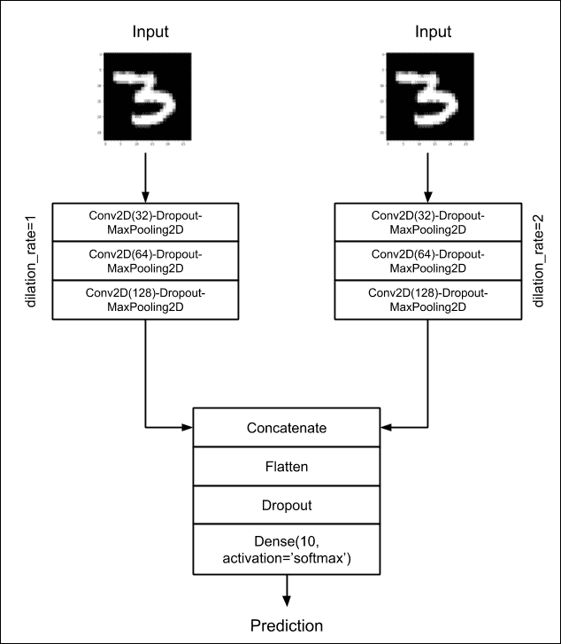

图 2.1.1: Y-Network 接受相同的输入两次，但在两个卷积网络分支中处理输入。分支的输出通过 concatenate 层组合。最后一层的预测将与之前的 CNN 示例类似。

要改进 *列表* *2.1.1* 中模型的性能，我们可以提出几个改变。首先，Y-Network 的分支正在将滤波器数量加倍，以补偿 `MaxPooling2D()` 后特征映射大小的减半。例如，如果第一个卷积的输出为 (28, 28, 32)，经过最大池化后新形状为 (14, 14, 32)。接下来的卷积将有 64 个滤波器大小，并且输出尺寸为 (14, 14, 64)。

其次，尽管两个分支的卷积核尺寸都为 3，右分支使用了扩张率为 2。*图 2.1.2* 展示了在大小为 3 的卷积核上不同扩张率的效果。这个想法是通过增加扩张率增加卷积核的覆盖范围，CNN 将使右分支能够学习不同的特征映射。我们将使用 `padding='same'` 选项确保在使用扩张 CNN 时不会出现负张量维度。通过使用 `padding='same'`，我们将保持输入的尺寸与输出特征映射的尺寸相同。这是通过填充输入以确保输出具有*相同*大小来完成的：

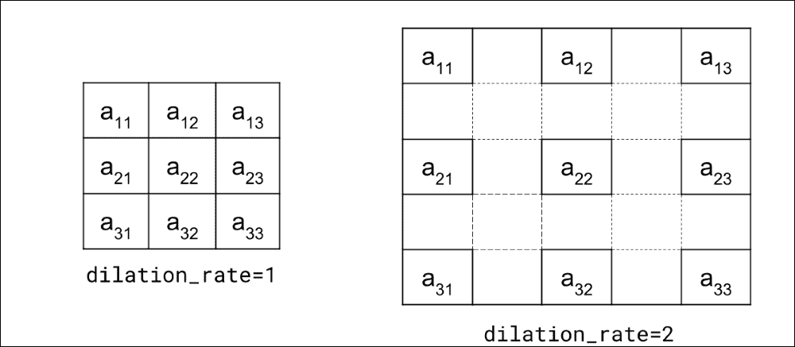

图 2.1.2: 通过增加扩张率从 1 开始，有效卷积核覆盖范围也会增加。

以下清单展示了 Y-网络的实现。两个分支是通过两个 `for` 循环创建的。两个分支期望相同的输入形状。这两个 `for` 循环将创建两个 3 层堆叠的 `Conv2D-Dropout-MaxPooling2D`。尽管我们使用了 `concatenate` 层来组合左右分支的输出，但我们也可以使用 Keras 的其他合并函数，例如 `add`、`dot`、`multiply`。合并函数的选择并非完全任意，而是必须基于合理的模型设计决策。

在 Y-网络中，`concatenate` 不会丢弃特征图的任何部分。相反，我们会让 `Dense` 层来处理拼接后的特征图。清单 2.1.2，`cnn-y-network-2.1.2.py` 展示了使用功能性 API 实现的 Y-网络：

```py
import numpy as np

from keras.layers import Dense, Dropout, Input
from keras.layers import Conv2D, MaxPooling2D, Flatten
from keras.models import Model
from keras.layers.merge import concatenate
from keras.datasets import mnist
from keras.utils import to_categorical
from keras.utils import plot_model

# load MNIST dataset
(x_train, y_train), (x_test, y_test) = mnist.load_data()

   # compute the number of labels
   num_labels = len(np.unique(y_train))

   # convert to one-hot vector
   y_train = to_categorical(y_train)
y_test = to_categorical(y_test)

# reshape and normalize input images
image_size = x_train.shape[1]
x_train = np.reshape(x_train,[-1, image_size, image_size, 1])
x_test = np.reshape(x_test,[-1, image_size, image_size, 1])
x_train = x_train.astype('float32') / 255
x_test = x_test.astype('float32') / 255

# network parameters
input_shape = (image_size, image_size, 1)
batch_size = 32
kernel_size = 3
dropout = 0.4
n_filters = 32

# left branch of Y network
left_inputs = Input(shape=input_shape)
x = left_inputs
filters = n_filters
# 3 layers of Conv2D-Dropout-MaxPooling2D
# number of filters doubles after each layer (32-64-128)
for i in range(3):
    x = Conv2D(filters=filters,
               kernel_size=kernel_size,
               padding='same',
               activation='relu')(x)
    x = Dropout(dropout)(x)
    x = MaxPooling2D()(x)
    filters *= 2

# right branch of Y network
right_inputs = Input(shape=input_shape)
y = right_inputs
filters = n_filters
# 3 layers of Conv2D-Dropout-MaxPooling2D
# number of filters doubles after each layer (32-64-128)
for i in range(3):
    y = Conv2D(filters=filters,
               kernel_size=kernel_size,
               padding='same',
               activation='relu',
               dilation_rate=2)(y)
    y = Dropout(dropout)(y)
    y = MaxPooling2D()(y)
    filters *= 2

# merge left and right branches outputs
y = concatenate([x, y])
# feature maps to vector before connecting to Dense layer
y = Flatten()(y)
y = Dropout(dropout)(y)
outputs = Dense(num_labels, activation='softmax')(y)

# build the model in functional API
model = Model([left_inputs, right_inputs], outputs)
# verify the model using graph
plot_model(model, to_file='cnn-y-network.png', show_shapes=True)
# verify the model using layer text description
model.summary()

# classifier loss, Adam optimizer, classifier accuracy
model.compile(loss='categorical_crossentropy',
              optimizer='adam',
              metrics=['accuracy'])

# train the model with input images and labels
model.fit([x_train, x_train],
          y_train,
          validation_data=([x_test, x_test], y_test),
          epochs=20,
          batch_size=batch_size)

# model accuracy on test dataset
score = model.evaluate([x_test, x_test], y_test, batch_size=batch_size)
print("\nTest accuracy: %.1f%%" % (100.0 * score[1]))
```

值得注意的是，Y-网络需要两个输入进行训练和验证。这两个输入是相同的，因此提供了`[x_train, x_train]`。

在 20 个周期中，Y-网络的准确率从 99.4% 上升到 99.5%。这相比于 3 层堆叠的 CNN（其准确率范围为 99.3% 至 99.4%）略有提高。然而，这也带来了更高的复杂性以及超过一倍的参数数量。以下图表，*图 2.1.3*，展示了 Keras 理解并通过 `plot_model()` 函数生成的 Y-网络架构：

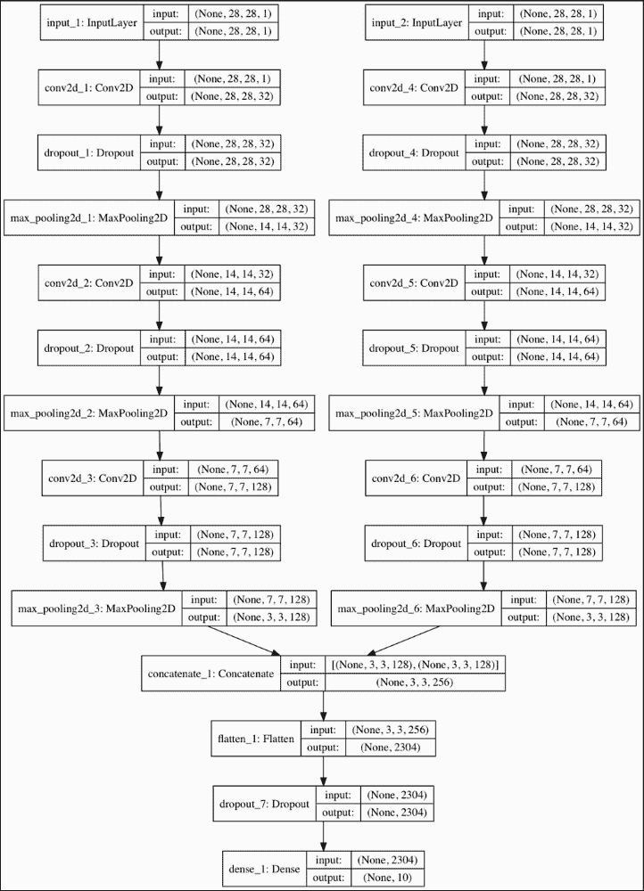

图 2.1.3：在清单 2.1.2 中实现的 CNN Y-网络

这就结束了我们对功能性 API 的介绍。我们应该记住，本章的重点是构建深度神经网络，特别是 ResNet 和 DenseNet。因此，我们仅覆盖了构建它们所需的功能性 API 内容，因为覆盖整个 API 会超出本书的范围。

### 注意

读者可以访问[`keras.io/`](https://keras.io/)以获取有关功能性 API 的更多信息。

# 深度残差网络（ResNet）

深度网络的一个关键优势是它们能够从输入和特征图中学习不同层次的表示。在分类、分割、检测以及许多其他计算机视觉问题中，学习不同层次的特征通常能带来更好的性能。

然而，您会发现训练深度网络并不容易，因为在反向传播过程中，浅层的梯度会随着深度的增加而消失（或爆炸）。*图 2.2.1* 说明了梯度消失的问题。网络参数通过从输出层到所有前一层的反向传播进行更新。由于反向传播是基于链式法则的，因此梯度在到达浅层时会逐渐减小。这是因为小数的乘积，特别是当误差和参数的绝对值很小时。

乘法操作的次数将与网络的深度成正比。还值得注意的是，如果梯度退化，参数将无法得到适当的更新。

因此，网络将无法提升其性能：

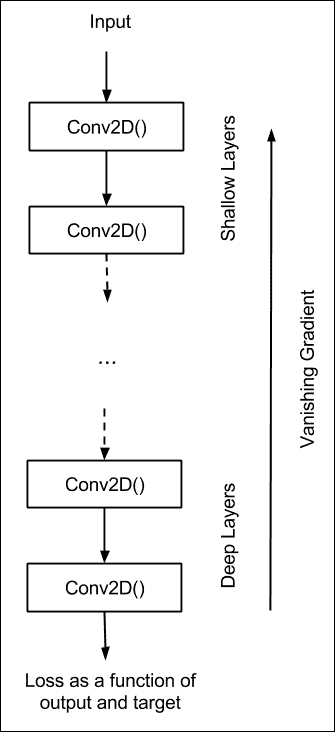

图 2.2.1：深度网络中的一个常见问题是梯度在反向传播过程中传递到浅层时会消失。

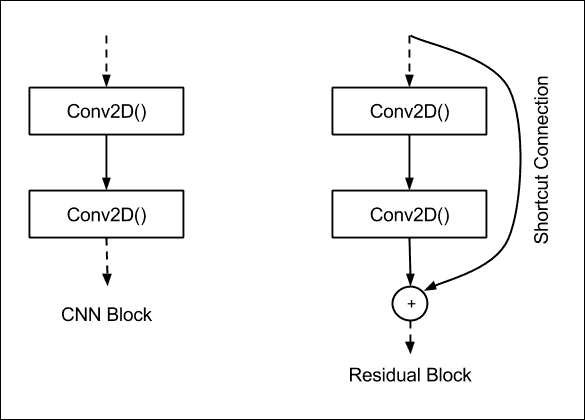

图 2.2.2：典型 CNN 中的一个块与 ResNet 中的一个块的对比。为了防止反向传播过程中梯度退化，引入了快捷连接。

为了缓解深度网络中梯度的退化问题，ResNet 引入了深度残差学习框架的概念。让我们分析一下一个块，一个深度网络的小段。

上图显示了典型 CNN 块与 ResNet 残差块之间的对比。ResNet 的理念是，为了防止梯度退化，我们将让信息通过快捷连接流向浅层。

接下来，我们将进一步探讨这两个块之间差异的更多细节。*图 2.2.3* 显示了另一种常用深度网络 VGG[3] 和 ResNet 的 CNN 块的更多细节。我们将层特征图表示为 **x**。层 *l* 的特征图是

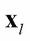

CNN 层中的操作是**Conv2D-批量归一化**（**BN**）-**ReLU**。

假设我们将这一组操作表示为 *H*() = Conv2D-批量归一化（BN）-ReLU，这将意味着：

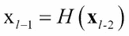

（方程 2.2.1）

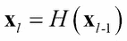

（方程 2.2.2）

换句话说，*l* - 2 层的特征图被转换为

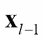

由 *H*() = Conv2D-批量归一化（BN）-ReLU。相同的一组操作应用于转换


到


换句话说，如果我们有一个 18 层的 VGG，那么在输入图像转化为第 18 层特征图之前，会进行 18 次 *H*() 操作。

一般来说，我们可以观察到，层 *l* 输出的特征图仅受前一层特征图的直接影响。同时，对于 ResNet：

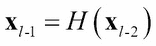

（方程 2.2.3）

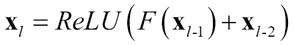

（方程 2.2.4）

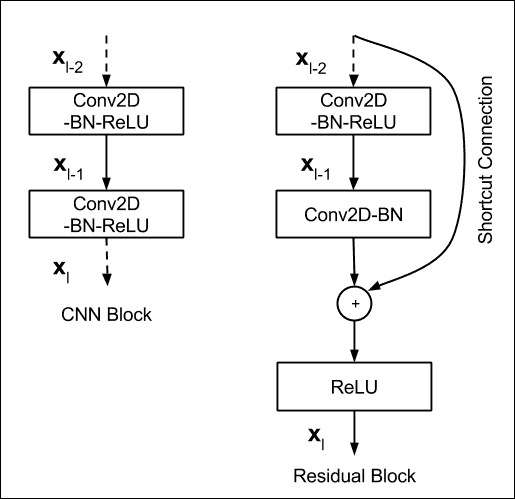

图 2.2.3：普通 CNN 块和残差块的详细层操作

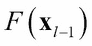

由`Conv2D-BN`构成，这也被称为残差映射。**+**符号表示快捷连接与输出的张量元素逐一相加


快捷连接不会增加额外的参数或计算复杂度。

在 Keras 中，add 操作可以通过`add()`合并函数来实现。然而，两者


方程式和**x**应该具有相同的维度。如果维度不同，例如在更改特征图大小时，我们应该对**x**进行线性投影，以匹配


在原始论文中，当特征图大小减半时，线性投影是通过一个 1 × 1 卷积核和`strides=2`的`Conv2D`来实现的。

回到第一章，在介绍*高级深度学习与 Keras*时，我们讨论了`stride > 1`等价于在卷积过程中跳过像素。例如，如果`strides=2`，则在滑动卷积核时，每跳过一个像素。

前述的*方程式* *2.2.3*和*2.2.4*都表示 ResNet 残差块的操作。它们暗示，如果更深层的网络可以训练得错误较少，那么浅层网络不应该有更多的错误。

了解了 ResNet 的基本构建块后，我们可以设计一个用于图像分类的深度残差网络。然而，这次我们将处理一个更具挑战性和高级的数据集。

在我们的示例中，我们将考虑 CIFAR10 数据集，这是原始论文验证过的其中一个数据集。在此示例中，Keras 提供了一个 API，可以方便地访问 CIFAR10 数据集，如下所示：

```py
from keras.datasets import cifar10
(x_train, y_train), (x_test, y_test) = cifar10.load_data()
```

与 MNIST 类似，CIFAR10 数据集包含 10 个类别。该数据集由小型（32 × 32）RGB 真实世界图像组成，包含飞机、汽车、鸟、猫、鹿、狗、青蛙、马、船和卡车，每个类别对应一个图像。*图 2.2.4*显示了 CIFAR10 的示例图像。

在该数据集中，有 50,000 个标记的训练图像和 10,000 个标记的测试图像用于验证：

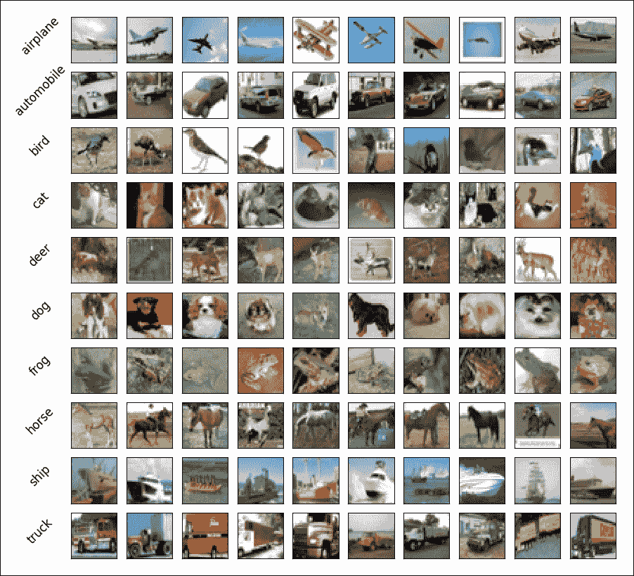

图 2.2.4：CIFAR10 数据集的示例图像。完整数据集包含 50,000 个标记的训练图像和 10,000 个标记的测试图像用于验证。

对于 CIFAR10 数据集，ResNet 可以使用不同的网络架构来构建，如*表 2.2.1*所示。*n*的值和 ResNet 的相应架构已在*表 2.2.2*中验证过。*表 2.2.1*表示我们有三组残差块。每组有*2n*层，对应于*n*个残差块。在 32 × 32 的输入图像中，额外的层是第一层。

卷积核大小为 3，除了两个不同大小特征图之间的过渡层，它实现了线性映射。例如，`Conv2D` 的卷积核大小为 1，`strides=2`。为了与 DenseNet 保持一致，我们将在连接两个不同大小的残差块时使用过渡层（Transition Layer）一词。

ResNet 使用 `kernel_initializer='he_normal'` 来帮助反向传播时的收敛[1]。最后一层由 `AveragePooling2D-Flatten-Dense` 组成。值得注意的是，ResNet 不使用 dropout。并且看起来 add 合并操作和 1 × 1 卷积具有自我正则化效果。*图 2.2.4* 展示了 CIFAR10 数据集的 ResNet 模型架构，如 *表 2.2.1* 中所述。

以下代码片段展示了 Keras 中的部分 ResNet 实现。该代码已被贡献到 Keras GitHub 仓库。从 *表 2.2.2* 我们还可以看到，通过修改 `n` 的值，我们能够增加网络的深度。例如，对于 `n = 18`，我们已经得到了 ResNet110，这是一种拥有 110 层的深度网络。为了构建 ResNet20，我们使用 `n = 3`：

```py
n = 3

# model version
# orig paper: version = 1 (ResNet v1), 
# Improved ResNet: version = 2 (ResNet v2)
version = 1

# computed depth from supplied model parameter n
if version == 1:
    depth = n * 6 + 2
elif version == 2:
    depth = n * 9 + 2
…
if version == 2:
    model = resnet_v2(input_shape=input_shape, depth=depth)
else:
    model = resnet_v1(input_shape=input_shape, depth=depth)
```

`resnet_v1()` 方法是 ResNet 的模型构建器。它使用一个工具函数 `resnet_layer()` 来帮助构建 `Conv2D-BN-ReLU` 堆栈。

它被称为版本 1，正如我们在下一节中将看到的那样，提出了改进版的 ResNet，并称之为 ResNet 版本 2，或 v2。与 ResNet 相比，ResNet v2 在残差模块设计上有所改进，从而提高了性能。

| 层数 | 输出大小 | 卷积核大小 | 操作 |
| --- | --- | --- | --- |
| 卷积 | 32 × 32 | 16 | 3×3 Conv2D |
| 残差模块(1) | 32 × 32 |   | 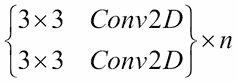 |
| 过渡层(1) | 32 × 32 |   |  |
| 16 × 16 |   |
| 残差模块(2) | 16 × 16 | 32 | 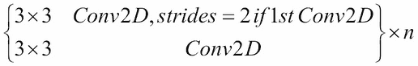 |
| 过渡层(2) | 16 × 16 |   | 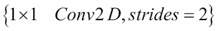 |
| 8 × 8 |   |
| 残差模块(3) | 8 × 8 | 64 |  |
| 平均池化 | 1 × 1 |   | 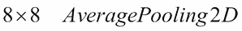 |

> 表 2.2.1：ResNet 网络架构配置

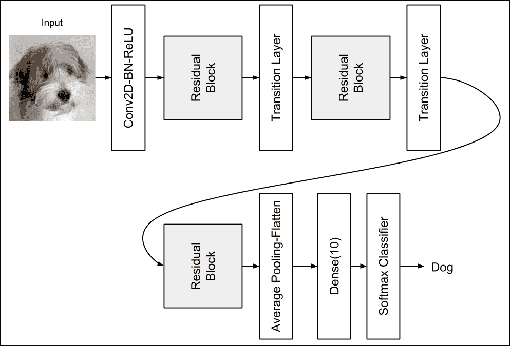

图 2.2.4：用于 CIFAR10 数据集分类的 ResNet 模型架构

| # 层数 | n | CIFAR10 精度（原论文） | CIFAR10 精度（本书） |
| --- | --- | --- | --- |
| ResNet20 | 3 | 91.25 | 92.16 |
| ResNet32 | 5 | 92.49 | 92.46 |
| ResNet44 | 7 | 92.83 | 92.50 |
| ResNet56 | 9 | 93.03 | 92.71 |
| ResNet110 | 18 | 93.57 | 92.65 |

> 表 2.2.2：用 CIFAR10 验证的 ResNet 架构

以下代码片段展示了 `resnet-cifar10-2.2.1.py` 的部分代码，这是 ResNet v1 的 Keras 实现：

```py
def resnet_v1(input_shape, depth, num_classes=10):
    if (depth - 2) % 6 != 0:
        raise ValueError('depth should be 6n+2 (eg 20, 32, 44 in [a])')
    # Start model definition.
    num_filters = 16
    num_res_blocks = int((depth - 2) / 6)

    inputs = Input(shape=input_shape)
    x = resnet_layer(inputs=inputs)
    # Instantiate the stack of residual units
    for stack in range(3):
        for res_block in range(num_res_blocks):
            strides = 1
            if stack > 0 and res_block == 0:
                strides = 2  # downsample
            y = resnet_layer(inputs=x,
                             num_filters=num_filters,
                             strides=strides)
            y = resnet_layer(inputs=y,
                             num_filters=num_filters,
                             activation=None)
            if stack > 0 and res_block == 0
                # linear projection residual shortcut connection 
                # to match changed dims
                x = resnet_layer(inputs=x,
                                 num_filters=num_filters,
                                 kernel_size=1,
                                 strides=strides,
                                 activation=None,
                                 batch_normalization=False)
            x = add([x, y])
            x = Activation('relu')(x)
        num_filters *= 2

    # Add classifier on top.
    # v1 does not use BN after last shortcut connection-ReLU
    x = AveragePooling2D(pool_size=8)(x)
    y = Flatten()(x)
    outputs = Dense(num_classes,
                    activation='softmax',
                    kernel_initializer='he_normal')(y)

    # Instantiate model.
    model = Model(inputs=inputs, outputs=outputs)
    return model
```

与原始的 ResNet 实现相比，有一些小的差异。特别是，我们不使用 SGD，而是使用 Adam。这是因为使用 Adam 时，ResNet 更容易收敛。我们还将使用学习率（`lr`）调度器`lr_schedule()`，在 80、120、160 和 180 个 epoch 时从默认的 1e-3 开始逐步减少`lr`。`lr_schedule()`函数将在训练的每个 epoch 后作为`callbacks`变量的一部分被调用。

另一个回调函数会在验证精度有进展时每次保存检查点。在训练深度网络时，保存模型或权重检查点是一个好习惯。因为训练深度网络需要大量时间。当你想使用你的网络时，只需要重新加载检查点，训练好的模型就会被恢复。这可以通过调用 Keras 的`load_model()`来实现。`lr_reducer()`函数也被包含在内。如果在调度减少学习率之前，验证损失没有改善，该回调函数将在`patience=5`个 epoch 后通过某个因子减少学习率。

当调用`model.fit()`方法时，会提供`callbacks`变量。与原始论文相似，Keras 实现使用数据增强`ImageDataGenerator()`来提供额外的训练数据，作为正则化方案的一部分。随着训练数据量的增加，泛化能力会有所提升。

例如，一个简单的数据增强是翻转狗的照片，如下图所示（`horizontal_flip=True`）。如果原图是狗的照片，那么翻转后的图像仍然是狗的照片。你也可以进行其他变换，如缩放、旋转、白化等，标签依然保持不变：

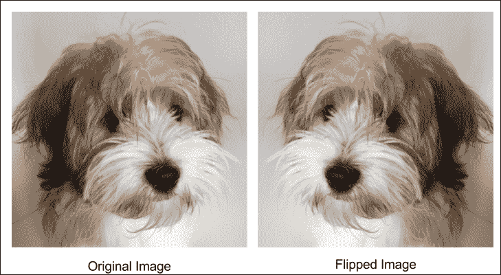

图 2.2.5：一个简单的数据增强是翻转原始图像

精确复制原始论文中的实现通常是困难的，特别是在使用的优化器和数据增强方面，因为本书中 Keras 实现的 ResNet 模型与原始论文中的模型在性能上存在轻微差异。

# ResNet v2

在发布了关于 ResNet 的第二篇论文[4]之后，前一部分中介绍的原始模型被称为 ResNet v1。改进版的 ResNet 通常称为 ResNet v2。该改进主要体现在残差块中层的排列，如下图所示。

ResNet v2 的显著变化包括：

+   使用 1 × 1 - 3 × 3 - 1 × 1 `BN-ReLU-Conv2D`堆叠

+   批量归一化和 ReLU 激活在 2D 卷积之前

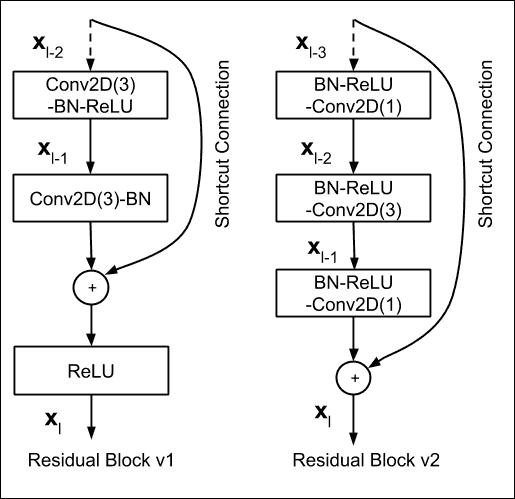

图 2.3.1：ResNet v1 与 ResNet v2 之间残差块的对比

ResNet v2 也在与`resnet-cifar10-2.2.1.py`相同的代码中实现：

```py
def resnet_v2(input_shape, depth, num_classes=10):
    if (depth - 2) % 9 != 0:
        raise ValueError('depth should be 9n+2 (eg 56 or 110 in [b])')
    # Start model definition.
    num_filters_in = 16
    num_res_blocks = int((depth - 2) / 9)

    inputs = Input(shape=input_shape)
    # v2 performs Conv2D with BN-ReLU on input 
    # before splitting into 2 paths
    x = resnet_layer(inputs=inputs,
                     num_filters=num_filters_in,
                     conv_first=True)

    # Instantiate the stack of residual units
    for stage in range(3):
        for res_block in range(num_res_blocks):
            activation = 'relu'
            batch_normalization = True
            strides = 1
            if stage == 0:
                num_filters_out = num_filters_in * 4
                if res_block == 0:  # first layer and first stage
                    activation = None
                    batch_normalization = False
            else:
                num_filters_out = num_filters_in * 2
                if res_block == 0:  # 1st layer but not 1st stage
                    strides = 2    # downsample

            # bottleneck residual unit
            y = resnet_layer(inputs=x,
                             num_filters=num_filters_in,
                             kernel_size=1,
                             strides=strides,
                             activation=activation,
                             batch_normalization=batch_normalization,
                             conv_first=False)
            y = resnet_layer(inputs=y,
                             num_filters=num_filters_in,
                             conv_first=False)
            y = resnet_layer(inputs=y,
                             num_filters=num_filters_out,
                             kernel_size=1,
                             conv_first=False)
            if res_block == 0:
                # linear projection residual shortcut connection 
                # to match changed dims
                x = resnet_layer(inputs=x,
                                 num_filters=num_filters_out,
                                 kernel_size=1,
                                 strides=strides,
                                 activation=None,
                                 batch_normalization=False)
            x = add([x, y])

        num_filters_in = num_filters_out

    # add classifier on top.
    # v2 has BN-ReLU before Pooling
    x = BatchNormalization()(x)
    x = Activation('relu')(x)
    x = AveragePooling2D(pool_size=8)(x)
    y = Flatten()(x)
    outputs = Dense(num_classes,
                    activation='softmax',
                    kernel_initializer='he_normal')(y)

    # instantiate model.
    model = Model(inputs=inputs, outputs=outputs)
    return model
```

ResNet v2 的模型构建器在以下代码中展示。例如，为了构建 ResNet110 v2，我们将使用 `n = 12`：

```py
n = 12

# model version
# orig paper: version = 1 (ResNet v1), Improved ResNet: version = 2 (ResNet v2)
version = 2

# computed depth from supplied model parameter n
if version == 1:
    depth = n * 6 + 2
elif version == 2:
    depth = n * 9 + 2
…
if version == 2:
    model = resnet_v2(input_shape=input_shape, depth=depth)
else:
    model = resnet_v1(input_shape=input_shape, depth=depth)
```

ResNet v2 的准确度在以下表格中展示：

| # 层数 | n | CIFAR10 精度（原文） | CIFAR10 精度（本书） |
| --- | --- | --- | --- |
| ResNet56 | 9 | 无 | 93.01 |
| ResNet110 | 18 | 93.63 | 93.15 |

在 Keras 应用包中，ResNet50 也已经实现，并配有相应的检查点以便重用。这是一种替代实现，但绑定于 50 层 ResNet v1。

# 密集连接卷积网络 (DenseNet)

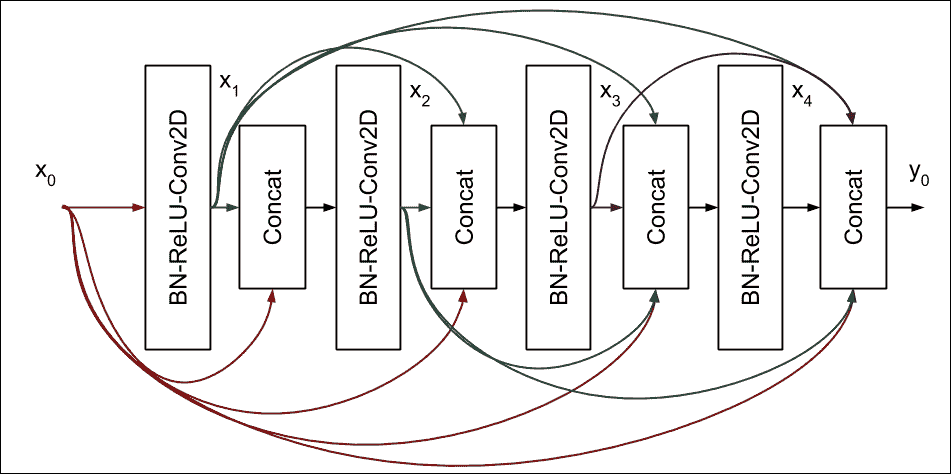

图 2.4.1：DenseNet 中的 4 层 Dense 块。每一层的输入由所有前面生成的特征图组成。

DenseNet 通过一种不同的方法解决了梯度消失问题。与使用快捷连接不同，所有之前的特征图将作为下一层的输入。前面的图展示了 Dense 块中的密集互连示例。

为简便起见，在此图中我们只显示了四层。请注意，第 *l* 层的输入是所有先前特征图的拼接。如果我们将 `BN-ReLU-Conv2D` 视为操作 *H*(x)，则第 *l* 层的输出为：

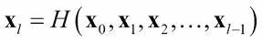

(方程 2.4.1)

`Conv2D` 使用 3×3 的卷积核。每层生成的特征图数量称为增长率，*k*。通常，*k* = 12，但在论文《Densely Connected Convolutional Networks》中，*Huang* 等人（2017）也使用 *k* = 24 [5]。因此，如果特征图数量为

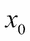

是

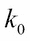

，那么在 *图 2.4.1* 的 4 层 Dense 块结束时，特征图的总数将是

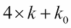

。

DenseNet 还建议 Dense 块前面应使用 `BN-ReLU-Conv2D`，并且特征图的数量应为增长率的两倍，

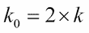

。因此，在 Dense 块结束时，特征图的总数将是 72。我们还将使用相同的卷积核大小，即 3。在输出层，DenseNet 建议我们在 `Dense()` 和 `softmax` 分类器之前执行一次平均池化。如果未使用数据增强，必须在 Dense 块的 `Conv2D` 后添加一个 dropout 层：

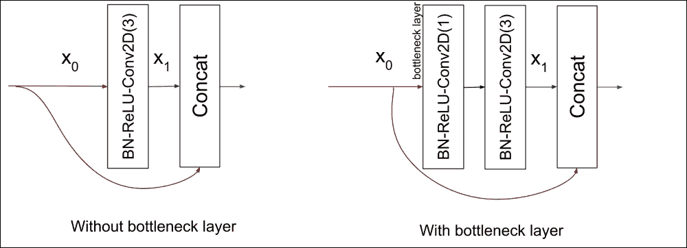

图 2.4.2：DenseNet 中一个 Dense 块的层，包含和不包含瓶颈层 BN-ReLU-Conv2D(1)。为清晰起见，我们将卷积核大小作为 Conv2D 的一个参数。

随着网络加深，两个新问题将出现。首先，由于每一层都贡献*k*个特征图，因此在层*l*的输入数量为

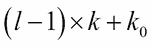

。因此，特征图在深层中会迅速增长，导致计算变得缓慢。例如，对于一个 101 层的网络，当*k* = 12 时，这个数值为 1200 + 24 = 1224。

其次，与 ResNet 类似，随着网络深度的增加，特征图的尺寸会被缩小，以增加卷积核的覆盖范围。如果 DenseNet 在合并操作中使用了拼接，它必须解决尺寸不匹配的问题。

为了防止特征图数量增加到计算效率低下的程度，DenseNet 引入了瓶颈层，如*图 2.4.2*所示。其思路是，每次拼接后，应用一个大小为 4*k*的 1 × 1 卷积。这种维度减少技术可以防止由`Conv2D(3)`处理的特征图数量迅速增加。

然后，瓶颈层将 DenseNet 层修改为`BN-ReLU-Conv2D(1)-BN-ReLU-Conv2D(3)`，而不仅仅是`BN-ReLU-Conv2D(3)`。为了清晰起见，我们在`Conv2D`中包含了卷积核大小作为参数。使用瓶颈层后，每个`Conv2D(3)`只处理 4*k*个特征图，而不是


对于层*l*。例如，对于 101 层的网络，最后一个`Conv2D(3)`的输入仍然是 48 个特征图，当*k* = 12 时，而不是之前计算的 1224：

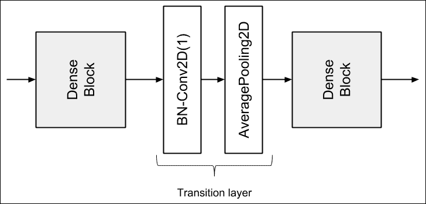

图 2.4.3：两个 Dense 块之间的过渡层

为了解决特征图尺寸不匹配的问题，DenseNet 将深度网络划分为多个密集块，这些密集块通过过渡层连接，如前图所示。在每个密集块内，特征图的尺寸（即宽度和高度）保持不变。

过渡层的作用是*过渡*从一个特征图尺寸到另一个较小的特征图尺寸，位于两个密集块之间。尺寸的减小通常是原来的一半。这个过程是通过平均池化层完成的。例如，默认`pool_size=2`的`AveragePooling2D`将尺寸从(64, 64, 256)减少到(32, 32, 256)。过渡层的输入是上一个密集块中最后一个拼接层的输出。

然而，在将特征图传递给平均池化之前，它们的数量将通过一定的压缩因子减少，

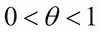

，使用`Conv2D(1)`。DenseNet 使用

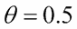

在他们的实验中。例如，如果上一个密集块的最后一次连接的输出是（64, 64, 512），那么在`Conv2D(1)`后，特征图的新维度将是（64, 64, 256）。当压缩和维度降低结合在一起时，过渡层由`BN-Conv2D(1)-AveragePooling2D`层组成。在实际中，批量归一化位于卷积层之前。

## 构建一个 100 层 DenseNet-BC 用于 CIFAR10

我们现在将构建一个用于 CIFAR10 数据集的**DenseNet-BC**（**瓶颈压缩**）模型，具有 100 层，使用我们之前讨论的设计原则。

下表展示了模型配置，*图 2.4.3*展示了模型架构。*列表* *2.4.1*展示了 100 层 DenseNet-BC 的部分 Keras 实现。我们需要注意的是，我们使用`RMSprop`，因为它在使用 DenseNet 时比 SGD 或 Adam 收敛得更好。

| 层 | 输出大小 | DenseNet-100 BC |
| --- | --- | --- |
| 卷积 | 32 x 32 | 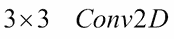 |
| 密集块(1) | 32 x 32 |  |
| 过渡层(1) | 32 x 32 | 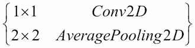 |
| 16 x 16 |
| 密集块(2) | 16 x 16 |  |
| 过渡层(2) | 16 x 16 |  |
| 8 x 8 |
| 密集块(3) | 8 x 8 | 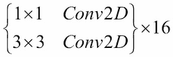 |
| 平均池化 | 1 x 1 |  |
| 分类层 |   | `Flatten-Dense(10)-softmax` |

> 表 2.4.1：用于 CIFAR10 分类的 100 层 DenseNet-BC

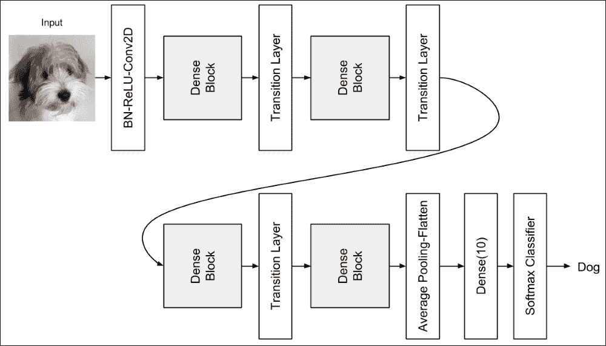

图 2.4.3：用于 CIFAR10 分类的 100 层 DenseNet-BC 模型架构

列表 2.4.1，`densenet-cifar10-2.4.1.py`：如*表 2.4.1*所示，100 层 DenseNet-BC 的部分 Keras 实现：

```py
# start model definition
# densenet CNNs (composite function) are made of BN-ReLU-Conv2D
inputs = Input(shape=input_shape)
x = BatchNormalization()(inputs)
x = Activation('relu')(x)
x = Conv2D(num_filters_bef_dense_block,
           kernel_size=3,
           padding='same',
           kernel_initializer='he_normal')(x)
x = concatenate([inputs, x])

# stack of dense blocks bridged by transition layers
for i in range(num_dense_blocks):
    # a dense block is a stack of bottleneck layers
    for j in range(num_bottleneck_layers):
        y = BatchNormalization()(x)
        y = Activation('relu')(y)
        y = Conv2D(4 * growth_rate,
                   kernel_size=1,
                   padding='same',
                   kernel_initializer='he_normal')(y)
        if not data_augmentation:
            y = Dropout(0.2)(y)
        y = BatchNormalization()(y)
        y = Activation('relu')(y)
        y = Conv2D(growth_rate,
                   kernel_size=3,
                   padding='same',
                   kernel_initializer='he_normal')(y)
        if not data_augmentation:
            y = Dropout(0.2)(y)
        x = concatenate([x, y])

    # no transition layer after the last dense block
    if i == num_dense_blocks - 1:
        continue

    # transition layer compresses num of feature maps and 
    # reduces the size by 2
    num_filters_bef_dense_block += num_bottleneck_layers * growth_rate
    num_filters_bef_dense_block = int(num_filters_bef_dense_block * compression_factor)
    y = BatchNormalization()(x)
    y = Conv2D(num_filters_bef_dense_block,
               kernel_size=1,
               padding='same',
               kernel_initializer='he_normal')(y)
    if not data_augmentation:
        y = Dropout(0.2)(y)
    x = AveragePooling2D()(y)

# add classifier on top
# after average pooling, size of feature map is 1 x 1
x = AveragePooling2D(pool_size=8)(x)
y = Flatten()(x)
outputs = Dense(num_classes,
                kernel_initializer='he_normal',
                activation='softmax')(y)

# instantiate and compile model
# orig paper uses SGD but RMSprop works better for DenseNet
model = Model(inputs=inputs, outputs=outputs)
model.compile(loss='categorical_crossentropy',
              optimizer=RMSprop(1e-3),
              metrics=['accuracy'])
model.summary()
```

在*列表* *2.4.1*中的 Keras 实现训练 200 个 epochs 后，准确率为 93.74%，而论文中报告的是 95.49%。使用了数据增强。我们在 DenseNet 中使用了与 ResNet v1/v2 相同的回调函数。

对于更深的层，需要使用 Python 代码中的表格更改`growth_rate`和`depth`变量。然而，训练一个深度为 250 或 190 的网络将需要相当长的时间，正如论文中所做的那样。为了给我们一个训练时间的概念，每个 epoch 大约需要在 1060Ti GPU 上运行一个小时。尽管 Keras 应用程序模块中也有 DenseNet 的实现，但它是在 ImageNet 上训练的。

# 结论

在本章中，我们介绍了作为构建复杂深度神经网络模型的高级方法——功能性 API，并展示了如何使用功能性 API 构建多输入单输出的 Y 型网络。与单一分支 CNN 网络相比，该网络的精度更高。接下来，本书中的其他章节，我们将发现功能性 API 在构建更复杂和高级模型时是不可或缺的。例如，在下一章，功能性 API 将帮助我们构建模块化的编码器、解码器和自编码器。

我们还花费了大量时间探索两个重要的深度网络——ResNet 和 DenseNet。这两个网络不仅在分类中应用广泛，还应用于其他领域，如分割、检测、跟踪、生成以及视觉/语义理解。我们需要记住，理解 ResNet 和 DenseNet 中的模型设计决策，比单纯跟随原始实现更为重要。通过这种方式，我们能够将 ResNet 和 DenseNet 的关键概念应用于我们的实际需求。

# 参考文献

1.  Kaiming He 和其他人. *深入探讨整流器：超越人类级别的 ImageNet 分类性能*。IEEE 国际计算机视觉会议论文集，2015（[`www.cv-foundation.org/openaccess/content_iccv_2015/papers/He_Delving_Deep_into_ICCV_2015_paper.pdf?spm=5176.100239.blogcont55892.28.pm8zm1&file=He_Delving_Deep_into_ICCV_2015_paper.pdf`](https://www.cv-foundation.org/openaccess/content_iccv_2015/papers/He_Delving_Deep_into_ICCV_2015_paper.pdf?spm=5176.100239.blogcont55892.28.pm8zm1&file=He_Delving_Deep_into_ICCV_2015_paper.pdf)）。

1.  Kaiming He 和其他人. *用于图像识别的深度残差学习*。IEEE 计算机视觉与模式识别会议论文集，2016a（[`openaccess.thecvf.com/content_cvpr_2016/papers/He_Deep_Residual_Learning_CVPR_2016_paper.pdf`](http://openaccess.thecvf.com/content_cvpr_2016/papers/He_Deep_Residual_Learning_CVPR_2016_paper.pdf)）。

1.  Karen Simonyan 和 Andrew Zisserman. *用于大规模图像识别的非常深的卷积网络*。ICLR，2015（[`arxiv.org/pdf/1409.1556/`](https://arxiv.org/pdf/1409.15)）。

1.  Kaiming He 和其他人. *深度残差网络中的身份映射*。欧洲计算机视觉会议。Springer 国际出版，2016b（[`arxiv.org/pdf/1603.05027.pdf`](https://arxiv.org/pdf/1603.05027.pdf)）。

1.  Gao Huang 和其他人. *密集连接卷积网络*。IEEE 计算机视觉与模式识别会议论文集，2017（[`openaccess.thecvf.com/content_cvpr_2017/papers/Huang_Densely_Connected_Convolutional_CVPR_2017_paper.pdf`](http://openaccess.thecvf.com/content_cvpr_2017/papers/Huang_Densely_Connected_Convolutional_CVPR_2017_paper.pdf)）。

1.  谢赛宁（Saining Xie）等人。*深度神经网络的聚合残差变换*。计算机视觉与模式识别（CVPR），2017 年 IEEE 会议。IEEE，2017（[`openaccess.thecvf.com/content_cvpr_2017/papers/Xie_Aggregated_Residual_Transformations_CVPR_2017_paper.pdf`](http://openaccess.thecvf.com/content_cvpr_2017/papers/Xie_Aggregated_Residual_Transformations_CVPR_2017_paper.pdf)）。

1.  古斯塔夫·拉尔松（Gustav Larsson）、迈克尔·梅尔（Michael Maire）和格雷戈里·沙赫纳罗维奇（Gregory Shakhnarovich）。*Fractalnet: 无残差的超深神经网络*。arXiv 预印本 arXiv:1605.07648，2016 年（[`arxiv.org/pdf/1605.07648.pdf`](https://arxiv.org/pdf/1605.07648.pdf)）。
