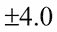

# 第三章：自编码器

在上一章，第二章，*深度神经网络*中，您已介绍了深度神经网络的概念。现在我们将继续研究自编码器，这是一种神经网络架构，旨在找到给定输入数据的压缩表示。

与前几章类似，输入数据可以是多种形式，包括语音、文本、图像或视频。自编码器将尝试找到一种表示或编码，以便对输入数据执行有用的变换。例如，在去噪自编码器中，神经网络将尝试找到一个可以将噪声数据转换为干净数据的编码。噪声数据可能是带有静态噪音的音频录音，然后将其转换为清晰的声音。自编码器将自动从数据中学习编码，无需人工标注。因此，自编码器可以归类为**无监督**学习算法。

在本书的后续章节中，我们将介绍**生成对抗网络**（**GANs**）和**变分自编码器**（**VAEs**），它们也是无监督学习算法的代表形式。这与我们在前几章讨论的监督学习算法不同，后者需要人工标注。

在最简单的形式中，自编码器将通过尝试将输入复制到输出的方式来学习表示或编码。然而，使用自编码器并不是简单地将输入复制到输出。否则，神经网络将无法揭示输入分布中的隐藏结构。

自编码器将输入分布编码成低维张量，通常表现为一个向量。这将近似于通常称为潜在表示、编码或向量的隐藏结构。这个过程构成了编码部分。然后，潜在向量将通过解码器部分被解码，以恢复原始输入。

由于潜在向量是输入分布的低维压缩表示，因此应当预期通过解码器恢复的输出只能近似输入。输入和输出之间的不相似度可以通过损失函数来度量。

那么，为什么我们要使用自编码器呢？简单来说，自编码器在其原始形式或作为更复杂神经网络的一部分都有实际应用。它们是理解深度学习高级主题的关键工具，因为它们提供了一个低维的潜在向量。此外，它可以高效处理，用于对输入数据执行结构性操作。常见的操作包括去噪、着色、特征级运算、检测、跟踪和分割，仅举几例。

总结来说，本章的目标是呈现：

+   自编码器的原理

+   如何将自编码器实现到 Keras 神经网络库中

+   去噪和颜色化自编码器的主要特征

# 自编码器原理

在本节中，我们将介绍自编码器的原理。在本节中，我们将查看使用 MNIST 数据集的自编码器，这是我们在前几章中首次介绍的。

首先，我们需要意识到自编码器有两个操作符，它们是：

+   **编码器**：它将输入 `x` 转换为低维潜在向量 *z = f(x)*。由于潜在向量维度较低，编码器被迫仅学习输入数据的最重要特征。例如，在 MNIST 数字的情况下，重要的特征可能包括书写风格、倾斜角度、笔画圆度、粗细等。本质上，这些是表示数字零到九所需的最重要信息。

+   **解码器**：它尝试从潜在向量恢复输入，`g(z) = ~x`。尽管潜在向量维度较低，但它具有足够的大小，使解码器能够恢复输入数据。

解码器的目标是使


尽可能接近 `x`。通常，编码器和解码器都是非线性函数。`z` 的维度是它能表示的显著特征数量的度量。为了提高效率并限制潜在编码仅学习输入分布的最显著特性，维度通常远小于输入维度[1]。

当潜在编码的维度明显大于 `x` 时，自编码器倾向于记住输入。

适当的损失函数，


，是输入 `x` 和输出（即恢复的输入）之间不相似度的度量，


如下方的方程所示，**均方误差**（**MSE**）是这种损失函数的一个例子：


(方程 3.1.1)

在此示例中，`m` 是输出维度（例如，在 MNIST 中 *m = 宽度 × 高度 × 通道 = 28 × 28 × 1 = 784*）。


和


是 `x` 的元素，并且


分别。由于损失函数是输入和输出之间不相似度的度量，我们可以使用其他重建损失函数，如二元交叉熵或**结构相似性指数**（**SSIM**）。


图 3.1.1：自编码器的框图


图 3.1.2：带有 MNIST 数字输入和输出的自编码器。潜在向量是 16 维的。

为了使自编码器具有上下文，`x` 可以是一个 MNIST 数字，其维度为 28 × 28 × 1 = 784。编码器将输入转换为一个低维度的 `z`，它可以是一个 16 维的潜在向量。解码器将尝试以以下形式恢复输入


从 `z` 中获取。直观地看，每个 MNIST 数字 `x` 将与


. *图 3.1.2* 向我们展示了这个自编码过程。我们可以观察到，解码后的数字 7，虽然不是完全相同，但足够接近。

由于编码器和解码器都是非线性函数，我们可以使用神经网络来实现它们。例如，在 MNIST 数据集中，可以通过 MLP 或 CNN 来实现自编码器。自编码器可以通过最小化损失函数并通过反向传播进行训练。与其他神经网络类似，唯一的要求是损失函数必须是可微的。

如果我们将输入视为一个分布，我们可以将编码器解释为分布的编码器，


编码器和解码器作为分布的解码器，


. 自编码器的损失函数表示如下：


(公式 3.1.2)

损失函数简单地意味着我们希望在给定潜在向量分布的情况下，最大化恢复输入分布的机会。如果假设解码器输出分布是高斯分布，那么损失函数就简化为 MSE，因为：


(公式 3.1.3)

在这个例子中，


表示均值为的高斯分布


和方差为


. 假设常数方差。解码器输出


假设是独立的。`m` 是输出维度。

# 使用 Keras 构建自编码器

接下来我们将进行一个非常激动人心的内容，使用 Keras 库构建一个自编码器。为了简化起见，我们将使用 MNIST 数据集作为第一组示例。自编码器将从输入数据中生成一个潜在向量，并通过解码器恢复输入。第一个示例中的潜在向量是 16 维的。

首先，我们将通过构建编码器来实现自动编码器。*清单* 3.2.1 显示了编码器，它将 MNIST 数字压缩为一个 16 维的潜在向量。编码器是由两层 `Conv2D` 堆叠而成。最后一个阶段是一个有 16 个单元的 `Dense` 层，用于生成潜在向量。*图 3.2.1* 显示了 `plot_model()` 生成的架构模型图，它与 `encoder.summary()` 生成的文本版本相同。最后一个 `Conv2D` 层输出的形状被保存下来，用于计算解码器输入层的维度，以便轻松重建 MNIST 图像。

以下的代码清单 3.2.1 显示了 `autoencoder-mnist-3.2.1.py`。这是一个使用 Keras 实现的自动编码器。潜在向量是 16 维的：

```py
from keras.layers import Dense, Input
from keras.layers import Conv2D, Flatten
from keras.layers import Reshape, Conv2DTranspose
from keras.models import Model
from keras.datasets import mnist
from keras.utils import plot_model
from keras import backend as K

import numpy as np
import matplotlib.pyplot as plt

# load MNIST dataset
(x_train, _), (x_test, _) = mnist.load_data()

# reshape to (28, 28, 1) and normalize input images
image_size = x_train.shape[1]
x_train = np.reshape(x_train, [-1, image_size, image_size, 1])
x_test = np.reshape(x_test, [-1, image_size, image_size, 1])
x_train = x_train.astype('float32') / 255
x_test = x_test.astype('float32') / 255

# network parameters
input_shape = (image_size, image_size, 1)
batch_size = 32
kernel_size = 3
latent_dim = 16
# encoder/decoder number of filters per CNN layer
layer_filters = [32, 64]

# build the autoencoder model
# first build the encoder model
inputs = Input(shape=input_shape, name='encoder_input')
x = inputs
# stack of Conv2D(32)-Conv2D(64)
for filters in layer_filters:
    x = Conv2D(filters=filters,
               kernel_size=kernel_size,
               activation='relu',
               strides=2,
               padding='same')(x)

# shape info needed to build decoder model 
# so we don't do hand computation
# the input to the decoder's first Conv2DTranspose 
# will have this shape
# shape is (7, 7, 64) which is processed by 
# the decoder back to (28, 28, 1)
shape = K.int_shape(x)

# generate latent vector
x = Flatten()(x)
latent = Dense(latent_dim, name='latent_vector')(x)

# instantiate encoder model
encoder = Model(inputs, latent, name='encoder')
encoder.summary()
plot_model(encoder, to_file='encoder.png', show_shapes=True)

# build the decoder model
latent_inputs = Input(shape=(latent_dim,), name='decoder_input')
# use the shape (7, 7, 64) that was earlier saved
x = Dense(shape[1] * shape[2] * shape[3])(latent_inputs)
# from vector to suitable shape for transposed conv
x = Reshape((shape[1], shape[2], shape[3]))(x)

# stack of Conv2DTranspose(64)-Conv2DTranspose(32)
for filters in layer_filters[::-1]:
    x = Conv2DTranspose(filters=filters,
                        kernel_size=kernel_size,
                        activation='relu',
                        strides=2,
                        padding='same')(x)

# reconstruct the input
outputs = Conv2DTranspose(filters=1,
                          kernel_size=kernel_size,
                          activation='sigmoid',
                          padding='same',
                          name='decoder_output')(x)

# instantiate decoder model
decoder = Model(latent_inputs, outputs, name='decoder')
decoder.summary()
plot_model(decoder, to_file='decoder.png', show_shapes=True)

# autoencoder = encoder + decoder
# instantiate autoencoder model
   autoencoder = Model(inputs,
                       decoder(encoder(inputs)),
                       name='autoencoder')
   autoencoder.summary()
   plot_model(autoencoder,
              to_file='autoencoder.png',
           show_shapes=True)

# Mean Square Error (MSE) loss funtion, Adam optimizer
autoencoder.compile(loss='mse', optimizer='adam')

# train the autoencoder
autoencoder.fit(x_train,
                x_train,
                validation_data=(x_test, x_test),
                epochs=1,
                batch_size=batch_size)

# predict the autoencoder output from test data
x_decoded = autoencoder.predict(x_test)

# display the 1st 8 test input and decoded images
imgs = np.concatenate([x_test[:8], x_decoded[:8]])
imgs = imgs.reshape((4, 4, image_size, image_size))
imgs = np.vstack([np.hstack(i) for i in imgs])
plt.figure()
plt.axis('off')
plt.title('Input: 1st 2 rows, Decoded: last 2 rows')
plt.imshow(imgs, interpolation='none', cmap='gray')
plt.savefig('input_and_decoded.png')
plt.show()
```


图 3.2.1：编码器模型由 Conv2D(32)-Conv2D(64)-Dense(16) 组成，用于生成低维潜在向量。

*清单* 3.2.1 中的解码器将潜在向量解压缩，以恢复 MNIST 数字。解码器的输入阶段是一个 `Dense` 层，用于接受潜在向量。单元的数量等于编码器中 `Conv2D` 输出维度的乘积。这样做是为了方便将 `Dense` 层的输出调整为 `Conv2DTranspose` 的输入，最终恢复原始的 MNIST 图像维度。

解码器由三层 `Conv2DTranspose` 堆叠而成。在我们的例子中，我们将使用 **反向卷积神经网络**（有时称为反卷积），这种结构在解码器中更为常见。我们可以把反向卷积神经网络（`Conv2DTranspose`）想象成卷积神经网络的反向过程。在一个简单的例子中，如果卷积神经网络将图像转换为特征图，反向卷积神经网络则会根据特征图生成图像。*图 3.2.2* 显示了解码器模型。


图 3.2.2：解码器模型由 Dense(16)-Conv2DTranspose(64)-Conv2DTranspose(32)-Conv2DTranspose(1) 组成。输入是潜在向量，被解码以恢复原始输入。

通过将编码器和解码器结合在一起，我们可以构建自动编码器。*图 3.2.3* 说明了自动编码器的模型图。编码器的张量输出也是解码器的输入，解码器生成自动编码器的输出。在这个示例中，我们将使用 MSE 损失函数和 Adam 优化器。在训练过程中，输入和输出相同，即 `x_train`。我们应该注意，在这个示例中，只有少数几层就足够使验证损失在一轮训练中降到 0.01。对于更复杂的数据集，可能需要更深的编码器、解码器以及更多的训练轮次。


图 3.2.3：自动编码器模型是通过将编码器模型和解码器模型结合在一起构建的。这个自动编码器有 178k 个参数。

在对自编码器训练一个周期后，验证损失为 0.01，我们能够验证它是否可以编码和解码之前未见过的 MNIST 数据。*图 3.2.4*展示了来自测试数据的八个样本及其对应的解码图像。除了图像中的轻微模糊外，我们可以轻松识别出自编码器能够以良好的质量恢复输入数据。随着训练轮数的增加，结果将会得到改善。


图 3.2.4：从测试数据中预测的自编码器输出。前两行是原始输入的测试数据，后两行是预测的数据。

此时，我们可能会想，如何可视化潜在向量空间呢？一种简单的可视化方法是强迫自编码器通过使用 2 维潜在向量来学习 MNIST 数字的特征。这样，我们就能够将这个潜在向量投影到 2D 空间中，从而看到 MNIST 编码的分布情况。通过在 `autoencoder-mnist-3.2.1.py` 代码中设置 `latent_dim = 2`，并使用 `plot_results()` 绘制 MNIST 数字与 2 维潜在向量的关系，*图 3.2.5* 和 *图 3.2.6* 展示了 MNIST 数字在潜在编码上的分布情况。这些图形是在训练 20 个周期后生成的。为了方便起见，程序已保存为 `autoencoder-2dim-mnist-3.2.2.py`，其部分代码在*代码清单 3.2.2*中显示。

以下是代码清单 3.2.2，`autoencoder-2dim-mnist-3.2.2.py`，它展示了用于可视化 MNIST 数字在 2 维潜在编码上的分布的函数。其余代码实际上与*代码清单 3.2.1*类似，这里不再展示。

```py
def plot_results(models,
                 data,
                 batch_size=32,
                 model_name="autoencoder_2dim"):
    """Plots 2-dim latent values as color gradient
        then, plot MNIST digits as function of 2-dim latent vector

    Arguments:
        models (list): encoder and decoder models
        data (list): test data and label
        batch_size (int): prediction batch size
        model_name (string): which model is using this function
    """

    encoder, decoder = models
    x_test, y_test = data
    os.makedirs(model_name, exist_ok=True)

    filename = os.path.join(model_name, "latent_2dim.png")
    # display a 2D plot of the digit classes in the latent space
    z = encoder.predict(x_test,
                        batch_size=batch_size)
    plt.figure(figsize=(12, 10))
    plt.scatter(z[:, 0], z[:, 1], c=y_test)
    plt.colorbar()
    plt.xlabel("z[0]")
    plt.ylabel("z[1]")
    plt.savefig(filename)
    plt.show()

    filename = os.path.join(model_name, "digits_over_latent.png")
    # display a 30x30 2D manifold of the digits
    n = 30
    digit_size = 28
    figure = np.zeros((digit_size * n, digit_size * n))
    # linearly spaced coordinates corresponding to the 2D plot
    # of digit classes in the latent space
    grid_x = np.linspace(-4, 4, n)
    grid_y = np.linspace(-4, 4, n)[::-1]

    for i, yi in enumerate(grid_y):
        for j, xi in enumerate(grid_x):
            z = np.array([[xi, yi]])
            x_decoded = decoder.predict(z)
            digit = x_decoded[0].reshape(digit_size, digit_size)
            figure[i * digit_size: (i + 1) * digit_size,
                   j * digit_size: (j + 1) * digit_size] = digit

    plt.figure(figsize=(10, 10))
    start_range = digit_size // 2
    end_range = n * digit_size + start_range + 1
    pixel_range = np.arange(start_range, end_range, digit_size)
    sample_range_x = np.round(grid_x, 1)
    sample_range_y = np.round(grid_y, 1)
    plt.xticks(pixel_range, sample_range_x)
    plt.yticks(pixel_range, sample_range_y)
    plt.xlabel("z[0]")
    plt.ylabel("z[1]")
    plt.imshow(figure, cmap='Greys_r')
    plt.savefig(filename)
    plt.show()
```


图 3.2.5：MNIST 数字分布与潜在编码维度 `z₀` 和 `z₁` 的关系。原始彩色照片可在书籍的 GitHub 仓库中找到，https://github.com/PacktPublishing/Advanced-Deep-Learning-with-Keras/blob/master/chapter3-autoencoders/README.md。


图 3.2.6：当导航 2 维潜在向量空间时生成的数字

在*图 3.2.5*中，我们能够看到特定数字的潜在编码在空间中的某个区域聚集。例如，数字 0 位于左下象限，而数字 1 位于右上象限。这种聚集在*图 3.2.6*中得到了呈现。事实上，同一图形展示了从潜在空间中导航或生成新数字的结果，正如在*图 3.2.5*中所示。

例如，从中心开始，并改变一个二维潜在向量的值朝向左下象限，显示出数字从 2 变为 0。这是可以预期的，因为从*图 3.2.5*，我们可以看到数字 2 的代码簇接近中心，而数字 0 的代码簇则位于左下象限。如*图 3.2.6*所示，我们只探索了每个潜在维度在-4.0 到+4.0 之间的区域。

如在*图 3.2.5*所示，潜在代码分布是不连续的，并且超出了



。理想情况下，它应该像一个圆形，那里每个地方都有有效的值。由于这种不连续性，存在一些区域，如果我们解码潜在向量，可能会生成几乎无法识别的数字。

# 去噪自编码器（DAE）

我们现在要构建一个具有实际应用的自编码器。首先，让我们画个图，假设 MNIST 数字图像被噪声污染，这样人类阅读起来会更困难。我们可以构建一个**去噪自编码器**（**DAE**）来去除这些图像中的噪声。*图 3.3.1*展示了三组 MNIST 数字。每组的顶部行（例如，MNIST 数字 7、2、1、9、0、6、3、4、9）是原始图像。中间行显示了 DAE 的输入，即被噪声污染的原始图像。底部行显示了 DAE 的输出：


图 3.3.1：原始 MNIST 数字（顶部行），被污染的原始图像（中间行）和去噪图像（底部行）


图 3.3.2：去噪自编码器的输入是被污染的图像，输出是干净的或去噪的图像。假设潜在向量为 16 维。

如*图 3.3.2*所示，去噪自编码器的结构实际上与我们在前一部分中介绍的 MNIST 自编码器相同。输入定义为：


（方程式 3.3.1）

在这个公式中，


表示被*噪声*污染的原始 MNIST 图像。

编码器的目标是发现如何生成潜在向量`z`，使得解码器能够恢复


通过最小化失真损失函数（如均方误差 MSE），如图所示：


（方程式 3.3.2）

在这个例子中，`m` 是输出维度（例如，在 MNIST 中，*m = 宽度 × 高度 × 通道 = 28 × 28 × 1 = 784*）。


和


是…的元素


和


，分别。

为了实现 DAE，我们需要对上一节中的自编码器做一些修改。首先，训练输入数据应该是损坏的 MNIST 数字。训练输出数据与原始清晰的 MNIST 数字相同。这就像是告诉自编码器正确的图像应该是什么，或者要求它在给定损坏图像的情况下找出如何去除噪声。最后，我们必须在损坏的 MNIST 测试数据上验证自编码器。

*图 3.3.2*左侧展示的 MNIST 数字 7 是一个实际的损坏图像输入。右侧的是经过训练的去噪自编码器输出的清晰图像。

*清单 3.3.1*展示了已贡献至 Keras GitHub 仓库的去噪自编码器。使用相同的 MNIST 数据集，我们能够通过添加随机噪声来模拟损坏的图像。添加的噪声是一个高斯分布，均值为，


和标准差


。由于添加随机噪声可能会将像素数据推向无效值（小于 0 或大于 1），因此像素值会被裁剪到[0.1, 1.0]范围内。

其他部分将与上一节中的自编码器几乎相同。我们将使用相同的 MSE 损失函数和 Adam 优化器。然而，训练的 epoch 数增加到了 10。这是为了允许足够的参数优化。

*图 3.3.1*展示了实际的验证数据，包含损坏和去噪后的 MNIST 测试数字。我们甚至能够看到，人类会发现很难读取损坏的 MNIST 数字。*图 3.3.3*展示了 DAE 在噪声水平提高时的某种鲁棒性。


到


和


。在


，DAE 仍然能够恢复原始图像。然而，在


，在第二组和第三组中，像数字 4 和 5 这样的几个数字已经无法正确恢复。


图 3.3.3：去噪自编码器在噪声水平增加时的表现

如清单 3.3.1 所示，`denoising-autoencoder-mnist-3.3.1.py`向我们展示了一个去噪自编码器：

```py
from keras.layers import Dense, Input
from keras.layers import Conv2D, Flatten
from keras.layers import Reshape, Conv2DTranspose
from keras.models import Model
from keras import backend as K
from keras.datasets import mnist
import numpy as np
import matplotlib.pyplot as plt
from PIL import Image

np.random.seed(1337)

# load MNIST dataset
(x_train, _), (x_test, _) = mnist.load_data()

# reshape to (28, 28, 1) and normalize input images
image_size = x_train.shape[1]
x_train = np.reshape(x_train, [-1, image_size, image_size, 1])
x_test = np.reshape(x_test, [-1, image_size, image_size, 1])
x_train = x_train.astype('float32') / 255
x_test = x_test.astype('float32') / 255

# generate corrupted MNIST images by adding noise with normal dist
# centered at 0.5 and std=0.5
noise = np.random.normal(loc=0.5, scale=0.5, size=x_train.shape)
x_train_noisy = x_train + noise
noise = np.random.normal(loc=0.5, scale=0.5, size=x_test.shape)
x_test_noisy = x_test + noise

# adding noise may exceed normalized pixel values>1.0 or <0.0
# clip pixel values >1.0 to 1.0 and <0.0 to 0.0
x_train_noisy = np.clip(x_train_noisy, 0., 1.)
x_test_noisy = np.clip(x_test_noisy, 0., 1.)

# network parameters
input_shape = (image_size, image_size, 1)
batch_size = 32
kernel_size = 3
latent_dim = 16
# encoder/decoder number of CNN layers and filters per layer
layer_filters = [32, 64]

# build the autoencoder model
# first build the encoder model
inputs = Input(shape=input_shape, name='encoder_input')
x = inputs

# stack of Conv2D(32)-Conv2D(64)
for filters in layer_filters:
    x = Conv2D(filters=filters,
               kernel_size=kernel_size,
               strides=2,
               activation='relu',
               padding='same')(x)

# shape info needed to build decoder model 
# so we don't do hand computation
# the input to the decoder's first Conv2DTranspose 
# will have this shape
# shape is (7, 7, 64) which can be processed by 
# the decoder back to (28, 28, 1)
shape = K.int_shape(x)

# generate the latent vector
x = Flatten()(x)
latent = Dense(latent_dim, name='latent_vector')(x)

# instantiate encoder model
encoder = Model(inputs, latent, name='encoder')
encoder.summary()

# build the decoder model
latent_inputs = Input(shape=(latent_dim,), name='decoder_input')
# use the shape (7, 7, 64) that was earlier saved
x = Dense(shape[1] * shape[2] * shape[3])(latent_inputs)
# from vector to suitable shape for transposed conv
x = Reshape((shape[1], shape[2], shape[3]))(x)

# stack of Conv2DTranspose(64)-Conv2DTranspose(32)
for filters in layer_filters[::-1]:
    x = Conv2DTranspose(filters=filters,
                        kernel_size=kernel_size,
                        strides=2,
                        activation='relu',
                        padding='same')(x)

# reconstruct the denoised input
outputs = Conv2DTranspose(filters=1,
                          kernel_size=kernel_size,
                          padding='same',
                          activation='sigmoid',
                          name='decoder_output')(x)

# instantiate decoder model
decoder = Model(latent_inputs, outputs, name='decoder')
decoder.summary()

# autoencoder = encoder + decoder
# instantiate autoencoder model
autoencoder = Model(inputs, decoder(encoder(inputs)), name='autoencoder')
autoencoder.summary()

# Mean Square Error (MSE) loss function, Adam optimizer
autoencoder.compile(loss='mse', optimizer='adam')

# train the autoencoder
autoencoder.fit(x_train_noisy,
                x_train,
                validation_data=(x_test_noisy, x_test),
                epochs=10,
                batch_size=batch_size)

# predict the autoencoder output from corrupted test images
x_decoded = autoencoder.predict(x_test_noisy)

# 3 sets of images with 9 MNIST digits
# 1st rows - original images
# 2nd rows - images corrupted by noise
# 3rd rows - denoised images
rows, cols = 3, 9
num = rows * cols
imgs = np.concatenate([x_test[:num], x_test_noisy[:num], x_decoded[:num]])
imgs = imgs.reshape((rows * 3, cols, image_size, image_size))
imgs = np.vstack(np.split(imgs, rows, axis=1))
imgs = imgs.reshape((rows * 3, -1, image_size, image_size))
imgs = np.vstack([np.hstack(i) for i in imgs])
imgs = (imgs * 255).astype(np.uint8)
plt.figure()
plt.axis('off')
plt.title('Original images: top rows, '
          'Corrupted Input: middle rows, '
          'Denoised Input:  third rows')
plt.imshow(imgs, interpolation='none', cmap='gray')
Image.fromarray(imgs).save('corrupted_and_denoised.png')
plt.show()
```

# 自动着色自编码器

我们现在要进行自编码器的另一个实际应用。在这个案例中，我们假设有一张灰度照片，我们希望构建一个能够自动为其添加颜色的工具。我们希望模拟人类的能力，能够识别出大海和天空是蓝色的，草地和树木是绿色的，而云是白色的，等等。

如*图 3.4.1*所示，如果我们得到一张前景为稻田、背景为火山、顶部为天空的灰度照片，我们能够为其添加适当的颜色。


图 3.4.1：为梅雁火山的灰度照片添加颜色。颜色化网络应该模仿人类的能力，通过给灰度照片添加颜色。左图是灰度图，右图是彩色图。原始的彩色照片可以在本书的 GitHub 仓库中找到，链接为 https://github.com/PacktPublishing/Advanced-Deep-Learning-with-Keras/blob/master/chapter3-autoencoders/README.md。

一个简单的自动颜色化算法似乎是自编码器的合适问题。如果我们可以用足够多的灰度照片作为输入，并将对应的彩色照片作为输出进行训练，它可能会发现隐藏的结构并正确地应用颜色。大致来说，它是去噪的反向过程。问题是，自编码器能否为原始灰度图像添加颜色（良好的噪声）？

*列表* *3.4.1* 显示了颜色化自编码器网络。该颜色化自编码器网络是我们之前用于 MNIST 数据集的去噪自编码器的修改版。首先，我们需要一个灰度到彩色照片的数据集。我们之前使用过的 CIFAR10 数据库包含 50,000 张训练照片和 10,000 张 32 × 32 的 RGB 测试照片，可以转换为灰度图像。如下所示，我们可以使用`rgb2gray()`函数，通过对 R、G 和 B 分量加权，将彩色图像转换为灰度图像。

列表 3.4.1，`colorization-autoencoder-cifar10-3.4.1.py`，展示了一个使用 CIFAR10 数据集的颜色化自编码器：

```py
from keras.layers import Dense, Input
from keras.layers import Conv2D, Flatten
from keras.layers import Reshape, Conv2DTranspose
from keras.models import Model
from keras.callbacks import ReduceLROnPlateau, ModelCheckpoint
from keras.datasets import cifar10
from keras.utils import plot_model
from keras import backend as K

import numpy as np
import matplotlib.pyplot as plt
import os

# convert from color image (RGB) to grayscale
# source: opencv.org
# grayscale = 0.299*red + 0.587*green + 0.114*blue
def rgb2gray(rgb):
    return np.dot(rgb[...,:3], [0.299, 0.587, 0.114])

# load the CIFAR10 data
(x_train, _), (x_test, _) = cifar10.load_data()

# input image dimensions
# we assume data format "channels_last"
img_rows = x_train.shape[1]
img_cols = x_train.shape[2]
channels = x_train.shape[3]

# create saved_images folder
imgs_dir = 'saved_images'
save_dir = os.path.join(os.getcwd(), imgs_dir)
if not os.path.isdir(save_dir):
        os.makedirs(save_dir)

# display the 1st 100 input images (color and gray)
imgs = x_test[:100]
imgs = imgs.reshape((10, 10, img_rows, img_cols, channels))
imgs = np.vstack([np.hstack(i) for i in imgs])
plt.figure()
plt.axis('off')
plt.title('Test color images (Ground Truth)')
plt.imshow(imgs, interpolation='none')
plt.savefig('%s/test_color.png' % imgs_dir)
plt.show()

# convert color train and test images to gray
x_train_gray = rgb2gray(x_train)
x_test_gray = rgb2gray(x_test)

# display grayscale version of test images
imgs = x_test_gray[:100]
imgs = imgs.reshape((10, 10, img_rows, img_cols))
imgs = np.vstack([np.hstack(i) for i in imgs])
plt.figure()
plt.axis('off')
plt.title('Test gray images (Input)')
plt.imshow(imgs, interpolation='none', cmap='gray')
plt.savefig('%s/test_gray.png' % imgs_dir)
plt.show()

# normalize output train and test color images
x_train = x_train.astype('float32') / 255
x_test = x_test.astype('float32') / 255

# normalize input train and test grayscale images
x_train_gray = x_train_gray.astype('float32') / 255
x_test_gray = x_test_gray.astype('float32') / 255

# reshape images to row x col x channel for CNN output/validation
x_train = x_train.reshape(x_train.shape[0], img_rows, img_cols, channels)
x_test = x_test.reshape(x_test.shape[0], img_rows, img_cols, channels)

# reshape images to row x col x channel for CNN input
x_train_gray = x_train_gray.reshape(x_train_gray.shape[0], img_rows, img_cols, 1)
x_test_gray = x_test_gray.reshape(x_test_gray.shape[0], img_rows, img_cols, 1)

# network parameters
input_shape = (img_rows, img_cols, 1)
batch_size = 32
kernel_size = 3
latent_dim = 256
# encoder/decoder number of CNN layers and filters per layer
layer_filters = [64, 128, 256]

# build the autoencoder model
# first build the encoder model
inputs = Input(shape=input_shape, name='encoder_input')
x = inputs
# stack of Conv2D(64)-Conv2D(128)-Conv2D(256)
for filters in layer_filters:
    x = Conv2D(filters=filters,
               kernel_size=kernel_size,
               strides=2,
               activation='relu',
               padding='same')(x)

# shape info needed to build decoder model 
# so we don't do hand computation
# the input to the decoder's first Conv2DTranspose 
# will have this shape
# shape is (4, 4, 256) which is processed 
# by the decoder to (32, 32, 3)
shape = K.int_shape(x)

# generate a latent vector
x = Flatten()(x)
latent = Dense(latent_dim, name='latent_vector')(x)

# instantiate encoder model
encoder = Model(inputs, latent, name='encoder')
encoder.summary()

# build the decoder model
latent_inputs = Input(shape=(latent_dim,), name='decoder_input')
x = Dense(shape[1]*shape[2]*shape[3])(latent_inputs)
x = Reshape((shape[1], shape[2], shape[3]))(x)

# stack of Conv2DTranspose(256)-Conv2DTranspose(128)-
# Conv2DTranspose(64)
for filters in layer_filters[::-1]:
    x = Conv2DTranspose(filters=filters,
                        kernel_size=kernel_size,
                        strides=2,
                        activation='relu',
                        padding='same')(x)

outputs = Conv2DTranspose(filters=channels,
                          kernel_size=kernel_size,
                          activation='sigmoid',
                          padding='same',
                          name='decoder_output')(x)

# instantiate decoder model
decoder = Model(latent_inputs, outputs, name='decoder')
decoder.summary()

# autoencoder = encoder + decoder
# instantiate autoencoder model
autoencoder = Model(inputs, decoder(encoder(inputs)), name='autoencoder')
autoencoder.summary()

# prepare model saving directory.
save_dir = os.path.join(os.getcwd(), 'saved_models')
model_name = 'colorized_ae_model.{epoch:03d}.h5'
if not os.path.isdir(save_dir):
        os.makedirs(save_dir)
filepath = os.path.join(save_dir, model_name)

# reduce learning rate by sqrt(0.1) if the loss does not improve in 5 epochs
lr_reducer = ReduceLROnPlateau(factor=np.sqrt(0.1),
                               cooldown=0,
                               patience=5,
                               verbose=1,
                               min_lr=0.5e-6)

# save weights for future use 
# (e.g. reload parameters w/o training)
checkpoint = ModelCheckpoint(filepath=filepath,
                             monitor='val_loss',
                             verbose=1,
                             save_best_only=True)

# Mean Square Error (MSE) loss function, Adam optimizer
autoencoder.compile(loss='mse', optimizer='adam')

# called every epoch
callbacks = clr_reducer, checkpoint]

# train the autoencoder
autoencoder.fit(x_train_gray,
                x_train,
                validation_data=(x_test_gray, x_test),
                epochs=30,
                batch_size=batch_size,
                callbacks=callbacks)

# predict the autoencoder output from test data
x_decoded = autoencoder.predict(x_test_gray)

# display the 1st 100 colorized images
imgs = x_decoded[:100]
imgs = imgs.reshape((10, 10, img_rows, img_cols, channels))
imgs = np.vstack([np.hstack(i) for i in imgs])
plt.figure()
plt.axis('off')
plt.title('Colorized test images (Predicted)')
plt.imshow(imgs, interpolation='none')
plt.savefig('%s/colorized.png' % imgs_dir)
plt.show()
```

我们通过增加一个卷积和转置卷积块来增加自编码器的容量。我们还在每个 CNN 块中加倍了滤波器的数量。潜在向量现在是 256 维，以便增加它可以表示的显著属性的数量，如自编码器部分所讨论的那样。最后，输出滤波器的大小增加到 3，即与期望的彩色输出中的 RGB 通道数相等。

颜色化自编码器现在使用灰度图像作为输入，原始 RGB 图像作为输出进行训练。训练将需要更多的 epoch，并使用学习率调整器，在验证损失没有改善时缩小学习率。这可以通过在 Keras 的`fit()`函数中告诉`callbacks`参数调用`lr_reducer()`函数来轻松实现。

*图 3.4.2* 演示了 CIFAR10 测试数据集中的灰度图像颜色化。*图 3.4.3* 比较了地面真实值与颜色化自编码器的预测。自编码器完成了一个可接受的颜色化任务。海洋或天空被预测为蓝色，动物具有不同的棕色阴影，云是白色的，等等。

有一些明显的错误预测，比如红色车辆变成了蓝色，或者蓝色车辆变成了红色，偶尔绿色的田野被误判为蓝天，暗色或金色的天空被转换成了蓝色天空。


图 3.4.2：使用自编码器进行自动灰度到彩色图像转换。CIFAR10 测试灰度输入图像（左）和预测的彩色图像（右）。原始彩色照片可以在书籍的 GitHub 仓库中找到，https://github.com/PacktPublishing/Advanced-Deep-Learning-with-Keras/blob/master/chapter3-autoencoders/README.md。


图 3.4.3：实地对比真实的彩色图像和预测的上色图像。原始彩色照片可以在书籍的 GitHub 仓库中找到，https://github.com/PacktPublishing/Advanced-Deep-Learning-with-Keras/blob/master/chapter3-autoencoders/README.md。

# 结论

在本章中，我们介绍了自编码器，它是一种神经网络，将输入数据压缩成低维度的编码，以便高效地执行结构性转换，如去噪和上色。我们为更高级的话题——生成对抗网络（GANs）和变分自编码器（VAEs）奠定了基础，这些将在后续章节中介绍，同时仍然探讨自编码器如何利用 Keras。我们展示了如何从两个基本模型（编码器和解码器）实现自编码器。我们还学会了如何提取输入分布的隐藏结构，这是 AI 中的常见任务之一。

一旦潜在编码被揭示出来，就可以对原始输入分布执行许多结构性操作。为了更好地理解输入分布，可以通过低级嵌入方式（类似于我们在本章中所做的）或通过更复杂的降维技术，如 t-SNE 或 PCA，来可视化潜在向量形式的隐藏结构。

除了去噪和上色外，自编码器还用于将输入分布转换为低维度潜在编码，这些编码可以进一步处理用于其他任务，如分割、检测、跟踪、重建、视觉理解等。在第八章")，*变分自编码器（VAEs）*中，我们将讨论与自编码器结构相同，但通过具有可解释的潜在编码来区分的 VAEs，这些编码能够生成连续的潜在编码投影。在下一章，我们将介绍 AI 领域最近最重要的突破之一——生成对抗网络（GANs），在其中我们将学习 GANs 的核心优势及其合成看似真实的数据或信号的能力。

# 参考文献

1.  Ian Goodfellow 等人。*深度学习*。第 1 卷。剑桥：MIT 出版社，2016 年 ([`www.deeplearningbook.org/`](http://www.deeplearningbook.org/))。
