# 第四章 生成对抗网络（GANs）

在本章中，我们将研究**生成对抗网络**（**GAN**s）[1]，这是我们将要研究的三种人工智能算法中的第一个。GAN 属于生成模型的范畴。然而，与自编码器不同，生成模型能够根据任意编码生成新的、有意义的输出。

本章将讨论 GAN 的工作原理。我们还将回顾 Keras 中几个早期 GAN 的实现。稍后，我们将展示实现稳定训练所需的技术。本章的范围涵盖了两种流行的 GAN 实现示例，**深度卷积生成对抗网络**（**DCGAN**）[2]和**条件生成对抗网络**（**CGAN**）[3]。

总结一下，本章的目标是：

+   介绍生成对抗网络（GAN）的原理

+   如何在 Keras 中实现 GAN，如 DCGAN 和 CGAN

# GAN 概述

在深入研究 GAN 的更高级概念之前，我们先来回顾一下 GAN，并介绍它们的基本概念。GAN 非常强大；这一简单的说法通过它们能够生成虚拟名人面孔来证明这一点，这些面孔并非真实人物，而是通过进行潜空间插值生成的。

GAN 的高级特性[4]的一个绝佳示例可以通过这个 YouTube 视频（[`youtu.be/G06dEcZ-QTg`](https://youtu.be/G06dEcZ-QTg)）看到。视频展示了如何利用 GAN 生成逼真的面孔，这显示了它们的强大功能。这个话题比我们在本书中之前讨论的任何内容都要复杂。例如，上述视频是自编码器无法轻易实现的，正如我们在第三章中讨论的，*自编码器*。

GAN 能够通过训练两个竞争（又互相合作）的网络来学习如何建模输入分布，这两个网络被称为**生成器**和**判别器**（有时也称为**评论器**）。生成器的角色是不断探索如何生成能够欺骗判别器的虚假数据或信号（这包括音频和图像）。与此同时，判别器被训练用来区分真假信号。随着训练的进行，判别器将无法再分辨合成数据与真实数据之间的差异。从这里开始，判别器可以被丢弃，而生成器可以用来创造前所未见的全新、逼真的信号。

GAN 的基本概念很简单。然而，我们会发现最具挑战性的问题是如何实现生成器-判别器网络的稳定训练？生成器和判别器必须进行健康的竞争，以便两个网络能够同时学习。由于损失函数是从判别器的输出计算的，其参数更新速度很快。当判别器收敛得更快时，生成器不再接收到足够的梯度更新以便其参数收敛。除了难以训练外，GAN 还可能遭受部分或完全的模态崩溃，即生成器对不同的潜在编码几乎产生相似的输出。

# GAN 的原理

如*图 4.1.1*所示，GAN 类似于一个赝品制造者（生成器）和警察（判别器）的场景。在学院里，警察被教导如何判断一张美元是真是假。从银行得到的真钞样本和赝品制造者的假钱用来训练警察。然而，赝品制造者偶尔会试图假装他印了真钞。起初，警察不会上当，会告诉赝品制造者这些钱为什么是假的。考虑到这些反馈，赝品制造者再次磨练技能，试图制造新的假美元。预计警察将能够识破这些假币，并且证明为何这些美元是假的。

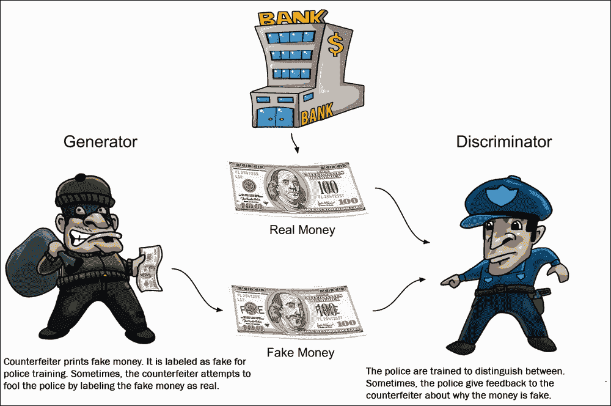

图 4.1.1：GAN 的生成器和判别器类似于赝品制造者和警察。赝品制造者的目标是欺骗警察认为这些美元是真的。

这种情况将无限期地继续下去，但最终会有一个时机，赝品制造者掌握了制作与真钞无法区分的假美元的技能。赝品制造者随后可以无限制地印刷美元，而不会被警察逮捕，因为这些假币已经无法被定义为伪造品。

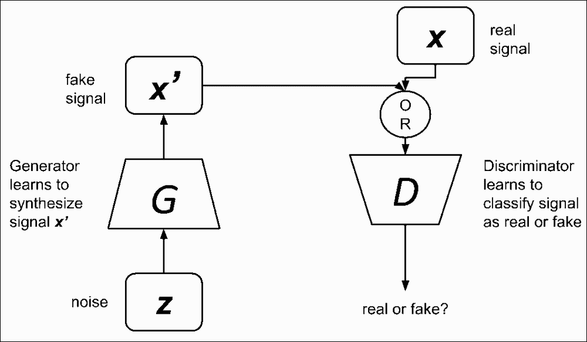

图 4.1.2：GAN 由两个网络组成，生成器和判别器。判别器被训练来区分真实和假的信号或数据。生成器的任务是生成能最终愚弄判别器的假信号或数据。

如*图 4.1.2*所示，GAN 由两个网络组成，一个生成器和一个鉴别器。生成器的输入是噪声，输出是合成信号。与此同时，鉴别器的输入将是一个真实信号或合成信号。真实信号来自真实的采样数据，而伪造信号来自生成器。所有有效信号被标记为 1.0（即 100% 真实的概率），而所有合成信号被标记为 0.0（即 0% 真实的概率）。由于标记过程是自动化的，GAN 仍然被认为是深度学习中无监督学习方法的一部分。

鉴别器的目标是从提供的数据集中学习如何区分真实信号和伪造信号。在 GAN 训练的这一部分，只有鉴别器的参数会被更新。像典型的二元分类器一样，鉴别器被训练以预测输入信号与真实信号之间的相似度，输出值在 0.0 到 1.0 的范围内表示其信心值。然而，这只是故事的一半。

在规律的间隔下，生成器将假装它的输出是一个真实信号，并要求 GAN 将其标记为 1.0。当伪造信号呈现给鉴别器时，它自然会被分类为伪造，并被标记为接近 0.0。优化器根据所呈现的标签（即 1.0）计算生成器参数的更新。它还会在训练这个新数据时考虑自身的预测。换句话说，鉴别器对其预测有一定的怀疑，因此，GAN 会考虑到这一点。这时，GAN 会让梯度从鉴别器的最后一层反向传播到生成器的第一层。然而，在大多数实践中，在这个训练阶段，鉴别器的参数通常是冻结的。生成器将使用这些梯度来更新其参数，并提高其合成伪造信号的能力。

总体而言，这个过程类似于两个网络彼此竞争，同时又在某种程度上相互合作。当 GAN 训练收敛时，最终结果是一个可以合成信号的生成器。鉴别器认为这些合成的信号是真的，或者它们的标签接近 1.0，这意味着鉴别器可以被丢弃。生成器部分将在从任意噪声输入中产生有意义的输出时发挥作用。

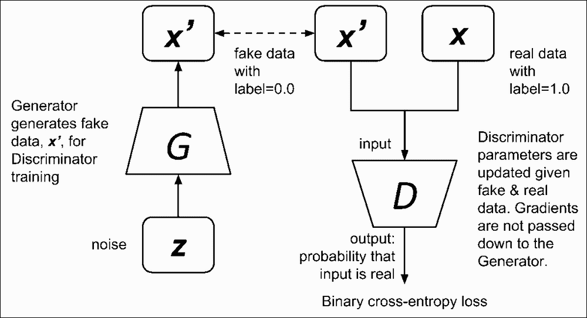

图 4.1.3：训练鉴别器类似于使用二元交叉熵损失训练一个二分类网络。伪造数据由生成器提供，真实数据来自真实样本。

如前图所示，鉴别器可以通过最小化以下方程中的损失函数来进行训练：

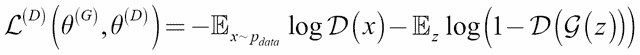 （方程 4.1.1）

该方程就是标准的二元交叉熵损失函数。损失是正确识别真实数据的期望值的负和，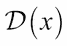，以及正确识别合成数据的 1.0 减去期望值，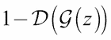。对数不会改变局部最小值的位置。训练时，判别器会提供两小批次数据：

1.  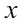，来自采样数据的真实数据（即，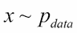），标签为 1.0

1.  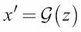，来自生成器的假数据，标签为 0.0

为了最小化损失函数，判别器的参数，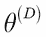，将通过反向传播来更新，通过正确识别真实数据，，以及合成数据，。正确识别真实数据等同于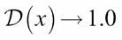，而正确分类假数据则等同于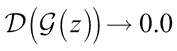 或者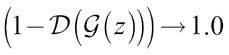。在这个方程中，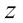 是生成器用来合成新信号的任意编码或噪声向量。两者共同作用于最小化损失函数。

为了训练生成器，GAN 将判别器和生成器的损失视为零和博弈。生成器的损失函数只是判别器损失函数的负值：

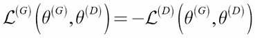

（公式 4.1.2）

这可以更恰当地重新写成一个价值函数：

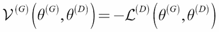

（公式 4.1.3）

从生成器的角度来看，*公式 4.1.3* 应该被最小化。从判别器的角度来看，价值函数应该被最大化。因此，生成器的训练准则可以写成一个最小最大问题：

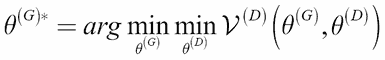

（公式 4.1.4）

有时，我们会通过伪装合成数据为真实数据（标签为 1.0）来试图欺骗判别器。通过相对于的最大化，优化器向判别器参数发送梯度更新，使其将该合成数据视为真实数据。与此同时，通过相对于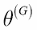的最小化，优化器将训练生成器的参数，教其如何欺骗判别器。然而，实际上，判别器在将合成数据分类为假数据时非常自信，因此不会更新其参数。此外，梯度更新很小，并且在传播到生成器层时已经大大减弱。因此，生成器未能收敛：

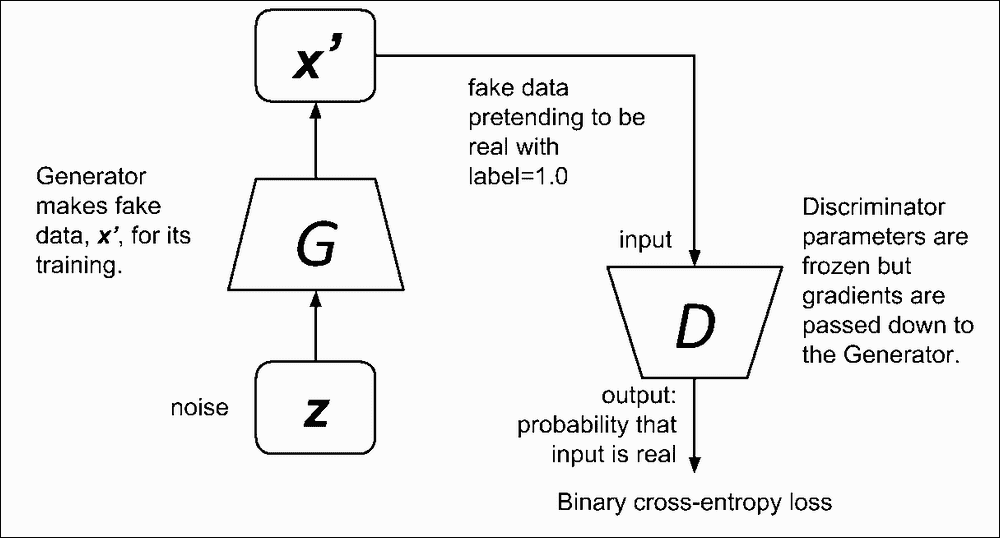

图 4.1.4：训练生成器就像使用二元交叉熵损失函数训练一个网络。生成器产生的假数据被当作真实数据展示。

解决方案是将生成器的损失函数重新构建为以下形式：

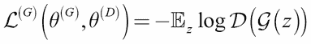

（方程式 4.1.5）

损失函数的作用是通过训练生成器来最大化判别器将合成数据认为是现实数据的可能性。新的公式不再是零和的，而是纯粹基于启发式的驱动。*图 4.1.4* 展示了训练中的生成器。在这个图中，生成器的参数仅在整个对抗网络训练时更新。这是因为梯度从判别器传递给生成器。然而，实际上，在对抗训练过程中，判别器的权重只是暂时被冻结。

在深度学习中，生成器和判别器都可以使用合适的神经网络架构来实现。如果数据或信号是图像，生成器和判别器网络将使用 CNN。对于像自然语言处理（NLP）中的一维序列，两个网络通常是递归网络（RNN、LSTM 或 GRU）。

# Keras 中的 GAN 实现

在前一部分中，我们了解到 GAN 的原理是直观的。我们还学会了如何通过熟悉的网络层，如 CNN 和 RNN，来实现 GAN。使 GAN 与其他网络不同的是，它们通常很难训练。即便是简单的层变化，也可能导致网络训练的不稳定。

在这一部分中，我们将研究使用深度 CNN 实现的早期成功的 GAN 实现之一。它被称为 DCGAN [3]。

*图 4.2.1* 显示了用于生成假 MNIST 图像的 DCGAN。DCGAN 推荐以下设计原则：

+   使用*步幅* > 1 的卷积，而不是`MaxPooling2D`或`UpSampling2D`。通过*步幅* > 1，卷积神经网络（CNN）学会了如何调整特征图的大小。

+   避免使用`Dense`层。在所有层中使用 CNN。`Dense`层仅用作生成器的第一层，用于接受*z*向量。`Dense`层的输出经过调整大小后，成为后续 CNN 层的输入。

+   使用**批量归一化**（**BN**）来通过标准化每一层的输入，使其均值为零，方差为单位，从而稳定学习。在生成器的输出层和判别器的输入层中不使用 BN。在这里展示的实现示例中，判别器中不使用批量归一化。

+   **修正线性单元**（**ReLU**）在生成器的所有层中使用，除了输出层，输出层使用*tanh*激活函数。在这里展示的实现示例中，输出层使用*sigmoid*而不是*tanh*，因为它通常能使 MNIST 数字的训练更加稳定。

+   在鉴别器的所有层中使用 **Leaky ReLU**。与 ReLU 不同，当输入小于零时，Leaky ReLU 不会将所有输出置为零，而是生成一个小的梯度，等于 *alpha* × *input*。在以下示例中，*alpha* = 0.2。

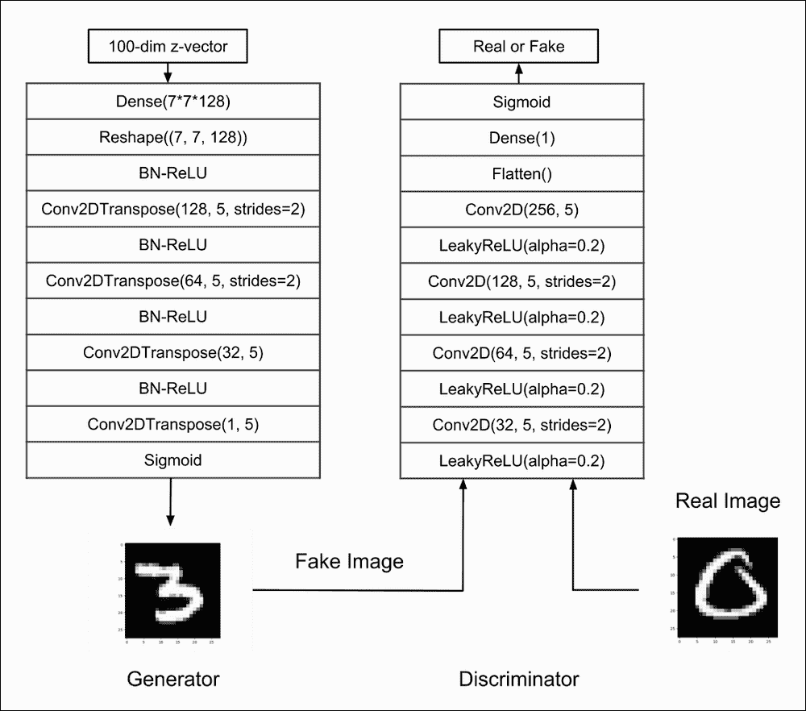

图 4.2.1：一个 DCGAN 模型

生成器学习从 100 维输入向量生成假图像（[-1.0, 1.0] 范围的 100 维均匀分布随机噪声）。鉴别器将真实图像与假图像区分开，但在对抗网络训练过程中，无意中指导生成器如何生成真实图像。我们在 DCGAN 实现中使用的卷积核大小为 5，目的是增加卷积的覆盖范围和表达能力。

生成器接受由均匀分布生成的 100 维 *z* 向量，范围为 -1.0 到 1.0。生成器的第一层是一个 7 × 7 × 128 = 6,272 个 *单元* 的 `Dense` 层。单元的数量是根据输出图像的最终尺寸（28 × 28 × 1，28 是 7 的倍数）以及第一层 `Conv2DTranspose` 的滤波器数量（等于 128）来计算的。我们可以将反卷积神经网络（`Conv2DTranspose`）看作是卷积神经网络（CNN）过程的反向过程。简单地说，如果 CNN 将图像转化为特征图，则反卷积 CNN 会根据特征图生成图像。因此，反卷积 CNN 在上一章的解码器和本章的生成器中都得到了应用。

在经过两次 `Conv2DTranspose`（`strides = 2`）处理后，特征图的大小将为 28 × 28 × *滤波器数量*。每个 `Conv2DTranspose` 前都进行批归一化和 ReLU 激活。最终层使用 *sigmoid* 激活函数，生成 28 × 28 × 1 的假 MNIST 图像。每个像素被归一化到 [0.0, 1.0]，对应于 [0, 255] 的灰度级别。以下列表显示了在 Keras 中实现生成器网络的代码。我们定义了一个函数来构建生成器模型。由于整个代码较长，我们将仅列出与讨论相关的部分。

### 注意

完整代码可在 GitHub 上获取：[`github.com/PacktPublishing/Advanced-Deep-`](https://github.com/PacktPublishing/Advanced-Deep-) [Learning-with-Keras](http://Learning-with-Keras)。

列表 4.2.1，`dcgan-mnist-4.2.1.py` 向我们展示了 DCGAN 的生成器网络构建函数：

```py
def build_generator(inputs, image_size):
    """Build a Generator Model

    Stack of BN-ReLU-Conv2DTranpose to generate fake images.
    Output activation is sigmoid instead of tanh in [1].
    Sigmoid converges easily.

    # Arguments
        inputs (Layer): Input layer of the generator (the z-vector)
        image_size: Target size of one side (assuming square image)

    # Returns
        Model: Generator Model
    """

    image_resize = image_size // 4
    # network parameters 
    kernel_size = 5
    layer_filters = [128, 64, 32, 1]

    x = Dense(image_resize * image_resize * layer_filters[0])(inputs)
    x = Reshape((image_resize, image_resize, layer_filters[0]))(x)

    for filters in layer_filters:
        # first two convolution layers use strides = 2
        # the last two use strides = 1
        if filters > layer_filters[-2]:
            strides = 2
        else:
            strides = 1
        x = BatchNormalization()(x)
        x = Activation('relu')(x)
        x = Conv2DTranspose(filters=filters,
                            kernel_size=kernel_size,
                            strides=strides,
                            padding='same')(x)

    x = Activation('sigmoid')(x)
    generator = Model(inputs, x, name='generator')
    return generator
```

判别器与许多基于 CNN 的分类器类似。输入是一个 28 × 28 × 1 的 MNIST 图像，分类为真实（1.0）或虚假（0.0）。共有四个 CNN 层。除了最后一个卷积层外，每个`Conv2D`都使用`strides = 2`来对特征图进行下采样。每个`Conv2D`层后面都接一个 Leaky ReLU 层。最终的滤波器大小是 256，而初始滤波器大小是 32，并且每个卷积层的滤波器大小都会翻倍。最终的滤波器大小为 128 也能工作，但我们会发现，使用 256 时生成的图像效果更好。最终输出层会将特征图展平，并通过一个单元的`Dense`层在经过 sigmoid 激活层缩放后输出介于 0.0 到 1.0 之间的预测值。输出被建模为伯努利分布。因此，使用二元交叉熵损失函数。

在构建生成器和判别器模型后，通过连接生成器和判别器网络来构建对抗模型。判别器和对抗网络都使用 RMSprop 优化器。判别器的学习率为 2e-4，而对抗网络的学习率为 1e-4。应用 RMSprop 衰减率，判别器为 6e-8，对抗网络为 3e-8。将对抗网络的学习率设置为判别器的一半将使训练更加稳定。我们从*图 4.1.3*和*4.1.4*中回忆到，GAN 训练有两个部分：判别器训练和生成器训练，这是对抗训练，期间冻结判别器权重。

*清单* *4.2.2*展示了在 Keras 中实现判别器的代码。定义了一个函数来构建判别器模型。在*清单* *4.2.3*中，我们将展示如何构建 GAN 模型。首先构建判别器模型，然后是生成器模型的实例化。对抗模型只是将生成器和判别器组合在一起。许多 GAN 模型中，批处理大小 64 似乎是最常见的。网络参数显示在*清单* *4.2.3*中。

如*清单* *4.2.1*和*4.2.2*所示，DCGAN 模型是直观的。构建它的难点在于网络设计中的微小变化会轻易导致训练无法收敛。例如，如果在判别器中使用了批归一化，或者将生成器中的`strides = 2`转移到后面的 CNN 层，DCGAN 将无法收敛。

清单 4.2.2，`dcgan-mnist-4.2.1.py`展示了我们 DCGAN 判别器网络构建函数：

```py
def build_discriminator(inputs):
    """Build a Discriminator Model

    Stack of LeakyReLU-Conv2D to discriminate real from fake.
    The network does not converge with BN so it is not used here
    unlike in [1] or original paper.

    # Arguments
        inputs (Layer): Input layer of the discriminator (the image)

    # Returns
        Model: Discriminator Model
    """
    kernel_size = 5
    layer_filters = [32, 64, 128, 256]

    x = inputs
    for filters in layer_filters:
        # first 3 convolution layers use strides = 2
        # last one uses strides = 1
        if filters == layer_filters[-1]:
            strides = 1
        else:
            strides = 2
        x = LeakyReLU(alpha=0.2)(x)
        x = Conv2D(filters=filters,
                   kernel_size=kernel_size,
                   strides=strides,
                   padding='same')(x)

    x = Flatten()(x)
    x = Dense(1)(x)
    x = Activation('sigmoid')(x)
    discriminator = Model(inputs, x, name='discriminator')
    return discriminator
```

清单 4.2.3，`dcgan-mnist-4.2.1.py`：构建 DCGAN 模型并调用训练程序的函数：

```py
def build_and_train_models():
    # load MNIST dataset
    (x_train, _), (_, _) = mnist.load_data()

    # reshape data for CNN as (28, 28, 1) and normalize
    image_size = x_train.shape[1]
    x_train = np.reshape(x_train, [-1, image_size, image_size, 1])
    x_train = x_train.astype('float32') / 255

    model_name = "dcgan_mnist"
    # network parameters
    # the latent or z vector is 100-dim
    latent_size = 100
    batch_size = 64
    train_steps = 40000
    lr = 2e-4
    decay = 6e-8
    input_shape = (image_size, image_size, 1)

    # build discriminator model
    inputs = Input(shape=input_shape, name='discriminator_input')
    discriminator = build_discriminator(inputs)
    # [1] or original paper uses Adam, 
    # but discriminator converges easily with RMSprop
    optimizer = RMSprop(lr=lr, decay=decay)
    discriminator.compile(loss='binary_crossentropy',
                          optimizer=optimizer,
                          metrics=['accuracy'])
    discriminator.summary()

    # build generator model
    input_shape = (latent_size, )
    inputs = Input(shape=input_shape, name='z_input')
    generator = build_generator(inputs, image_size)
    generator.summary()

    # build adversarial model
    optimizer = RMSprop(lr=lr * 0.5, decay=decay * 0.5)
    # freeze the weights of discriminator 
    # during adversarial training
    discriminator.trainable = False
    # adversarial = generator + discriminator
    adversarial = Model(inputs,
                        discriminator(generator(inputs)),
                        name=model_name)
    adversarial.compile(loss='binary_crossentropy',
                        optimizer=optimizer,
                        metrics=['accuracy'])
    adversarial.summary()

    # train discriminator and adversarial networks
    models = (generator, discriminator, adversarial)
    params = (batch_size, latent_size, train_steps, model_name)
    train(models, x_train, params)
```

*清单* *4.2.4* 显示了专门用于训练判别器和对抗网络的函数。由于自定义训练，通常的 `fit()` 函数不会被使用。相反，调用 `train_on_batch()` 来对给定的数据批次进行单次梯度更新。接着，通过对抗网络来训练生成器。训练过程首先从数据集中随机选择一批真实图像，并将其标记为真实（1.0）。然后，生成器生成一批假图像，并将其标记为假（0.0）。这两批图像被连接在一起，用于训练判别器。

完成此步骤后，生成器将生成新的假图像，并标记为真实（1.0）。这一批图像将用于训练对抗网络。两个网络会交替训练约 40,000 步。在规律的间隔中，基于某个噪声向量生成的 MNIST 数字会保存在文件系统中。在最后的训练步骤中，网络已经收敛。生成器模型也会保存在文件中，以便我们可以轻松地重用已训练的模型来生成未来的 MNIST 数字。然而，只有生成器模型会被保存，因为它才是 GAN 在生成新 MNIST 数字时的有用部分。例如，我们可以通过执行以下操作生成新的随机 MNIST 数字：

```py
python3 dcgan-mnist-4.2.1.py --generator=dcgan_mnist.h5

```

清单 4.2.4，`dcgan-mnist-4.2.1.py` 显示了用于训练判别器和对抗网络的函数：

```py
def train(models, x_train, params):
    """Train the Discriminator and Adversarial Networks

    Alternately train Discriminaor and Adversarial networks by batch.
    Discriminator is trained first with properly real and fake images.
    Adversarial is trained next with fake images pretending to be real
    Generate sample images per save_interval.

    # Arguments
        models (list): Generator, Discriminator, Adversarial models
        x_train (tensor): Train images
        params (list) : Networks parameters

    """
    # the GAN models
    generator, discriminator, adversarial = models
    # network parameters
    batch_size, latent_size, train_steps, model_name = params
    # the generator image is saved every 500 steps
    save_interval = 500
    # noise vector to see how the generator output evolves 
    # during training
    noise_input = np.random.uniform(-1.0, 1.0, size=[16, latent_size])
    # number of elements in train dataset
    train_size = x_train.shape[0]
    for i in range(train_steps):
        # train the discriminator for 1 batch
        # 1 batch of real (label=1.0) and fake images (label=0.0)
        # randomly pick real images from dataset
        rand_indexes = np.random.randint(0, train_size, size=batch_size)
        real_images = x_train[rand_indexes]
        # generate fake images from noise using generator 
        # generate noise using uniform distribution
        noise = np.random.uniform(-1.0, 1.0, size=[batch_size, latent_size])
        # generate fake images
        fake_images = generator.predict(noise)
        # real + fake images = 1 batch of train data
        x = np.concatenate((real_images, fake_images))
        # label real and fake images
        # real images label is 1.0
        y = np.ones([2 * batch_size, 1])
        # fake images label is 0.0
        y[batch_size:, :] = 0.0
        # train discriminator network, log the loss and accuracy
        loss, acc = discriminator.train_on_batch(x, y)
        log = "%d: [discriminator loss: %f, acc: %f]" % (i, loss, acc)

        # train the adversarial network for 1 batch
        # 1 batch of fake images with label=1.0
        # since the discriminator weights are frozen in adversarial network
        # only the generator is trained
        # generate noise using uniform distribution
        noise = np.random.uniform(-1.0, 1.0, size=[batch_size, latent_size])
        # label fake images as real or 1.0
        y = np.ones([batch_size, 1])
        # train the adversarial network 
        # note that unlike in discriminator training, 
        # we do not save the fake images in a variable
        # the fake images go to the discriminator input of the adversarial
        # for classification
        # log the loss and accuracy
        loss, acc = adversarial.train_on_batch(noise, y)
        log = "%s [adversarial loss: %f, acc: %f]" % (log, loss, acc)
        print(log)
        if (i + 1) % save_interval == 0:
            if (i + 1) == train_steps:
                show = True
            else:
                show = False

            # plot generator images on a periodic basis
            plot_images(generator,
                        noise_input=noise_input,
                        show=show,
                        step=(i + 1),
                        model_name=model_name)

    # save the model after training the generator
    # the trained generator can be reloaded for future MNIST digit generation
    generator.save(model_name + ".h5")
```

*图 4.2.1* 展示了生成器生成的假图像随着训练步骤的变化而演化的过程。在 5000 步时，生成器已经开始生成可识别的图像。这就像拥有一个能够画数字的代理一样。值得注意的是，一些数字会从一种可识别的形式（例如，最后一行第二列的 8）变换成另一种形式（例如，0）。当训练收敛时，判别器损失接近 0.5，而对抗损失接近 1.0，如下所示：

```py
39997: [discriminator loss: 0.423329, acc: 0.796875] [adversarial loss: 0.819355, acc: 0.484375]
39998: [discriminator loss: 0.471747, acc: 0.773438] [adversarial loss: 1.570030, acc: 0.203125]
39999: [discriminator loss: 0.532917, acc: 0.742188] [adversarial loss: 0.824350, acc: 0.453125]
```

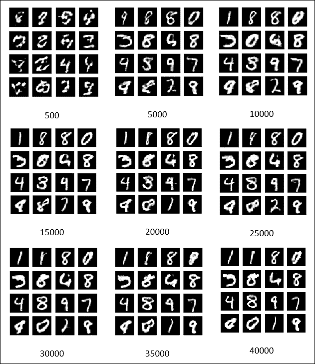

图 4.2.2：不同训练步骤下 DCGAN 生成器生成的假图像

# 条件生成对抗网络

在上一节中，DCGAN 生成的假图像是随机的。生成器无法控制生成哪些特定的数字，也没有机制可以从生成器中请求某个特定的数字。这个问题可以通过一种叫做**条件生成对抗网络**（**CGAN**）的 GAN 变种来解决[4]。

使用相同的 GAN，对生成器和判别器的输入都施加一个条件。这个条件是数字的 one-hot 向量形式。这与要生成的图像（生成器）或是否被分类为真实或假（判别器）相关联。CGAN 模型如*图 4.3.1*所示。

CGAN 类似于 DCGAN，唯一的区别是添加了独热向量输入。对于生成器，独热标签在进入 `Dense` 层之前与潜在向量连接。对于判别器，添加了一个新的 `Dense` 层。这个新层用于处理独热向量并将其重塑，以便它能够与后续 CNN 层的其他输入进行拼接：

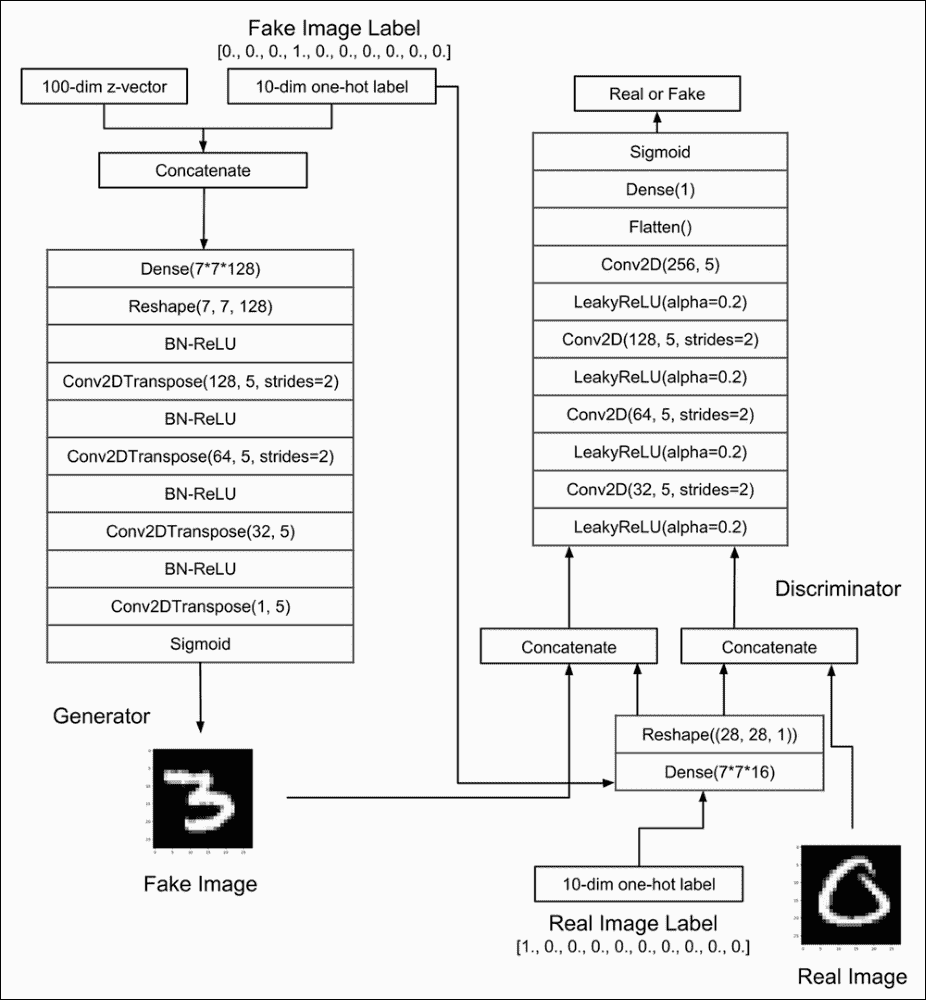

图 4.3.1：CGAN 模型与 DCGAN 类似，唯一不同的是使用独热向量来对生成器和判别器的输出进行条件化。

生成器学会从一个 100 维的输入向量和一个指定的数字生成假图像。判别器根据真实和假图像及其相应的标签来分类真假图像。

CGAN 的基础仍然与原始 GAN 原理相同，唯一的区别是判别器和生成器的输入是以独热标签 *y* 为条件的。通过将此条件结合到 *方程式* *4.1.1* 和 *4.1.5* 中，判别器和生成器的损失函数分别如 *方程式* *4.3.1* 和 *4.3.2* 所示。

根据 *图 4.3.2*，更合适的写法是将损失函数写作：

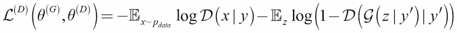

和

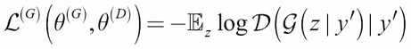

.

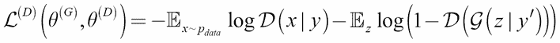

(方程式 4.3.1)

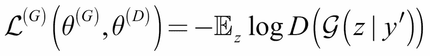

(方程式 4.3.2)

判别器的新损失函数旨在最小化预测来自数据集的真实图像与来自生成器的假图像的错误，给定它们的独热标签。*图 4.3.2* 显示了如何训练判别器。

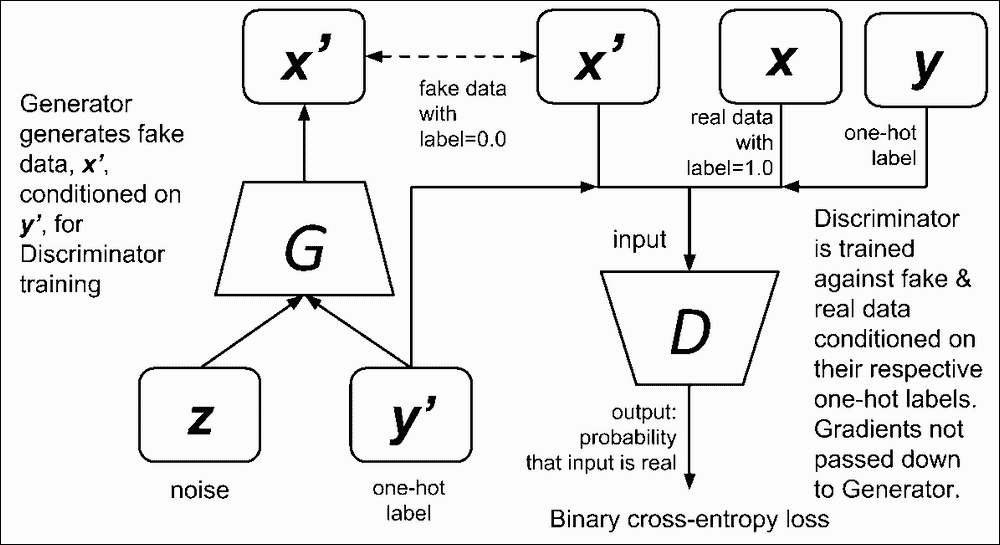

图 4.3.2：训练 CGAN 判别器与训练 GAN 判别器类似。唯一的区别是生成的假图像和数据集的真实图像都使用它们相应的独热标签进行条件化。

生成器的新损失函数最小化判别器对根据指定的独热标签条件化的假图像的正确预测。生成器学会生成特定的 MNIST 数字，给定其独热向量，可以欺骗判别器。以下图像展示了如何训练生成器：

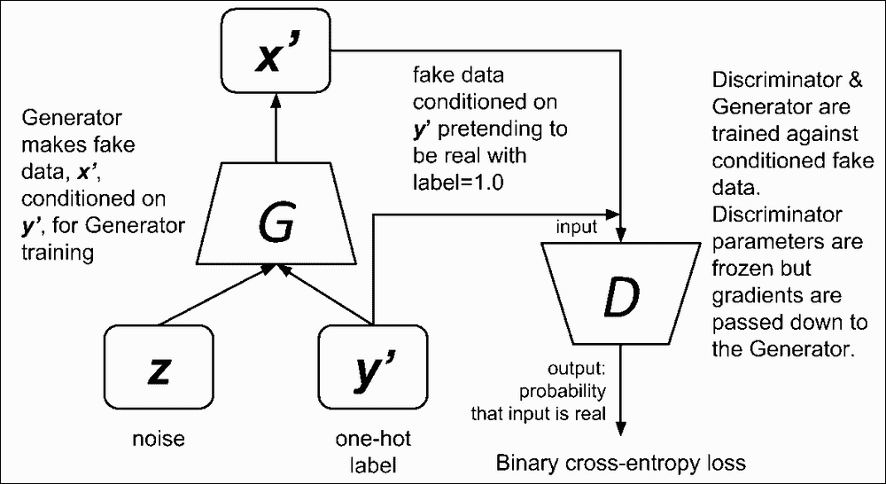

图 4.3.3：通过对抗网络训练 CGAN 生成器与训练 GAN 生成器类似。唯一的区别是生成的假图像是通过独热标签进行条件化的。

以下清单突出显示了判别器模型中所需的小修改。代码使用 `Dense` 层处理独热向量，并将其与图像输入连接。`Model` 实例被修改以适应图像和独热向量输入。

清单 4.3.1，`cgan-mnist-4.3.1.py` 向我们展示了 CGAN 判别器。高亮部分显示了 DCGAN 中做出的更改。

```py
def build_discriminator(inputs, y_labels, image_size):
    """Build a Discriminator Model

    Inputs are concatenated after Dense layer.
    Stack of LeakyReLU-Conv2D to discriminate real from fake.
    The network does not converge with BN so it is not used here
    unlike in DCGAN paper.

    # Arguments
        inputs (Layer): Input layer of the discriminator (the image)
        y_labels (Layer): Input layer for one-hot vector to condition
            the inputs
        image_size: Target size of one side (assuming square image)

    # Returns
        Model: Discriminator Model
    """
    kernel_size = 5
    layer_filters = [32, 64, 128, 256]

    x = inputs

    y = Dense(image_size * image_size)(y_labels)
    y = Reshape((image_size, image_size, 1))(y)
    x = concatenate([x, y])

    for filters in layer_filters:
        # first 3 convolution layers use strides = 2
        # last one uses strides = 1
        if filters == layer_filters[-1]:
            strides = 1
        else:
            strides = 2
        x = LeakyReLU(alpha=0.2)(x)
        x = Conv2D(filters=filters,
                   kernel_size=kernel_size,
                   strides=strides,
                   padding='same')(x)

    x = Flatten()(x)
    x = Dense(1)(x)
    x = Activation('sigmoid')(x)

# input is conditioned by y_labels
 discriminator = Model([inputs, y_labels], 
 x,
 name='discriminator')
    return discriminator
```

以下列表突出显示了为了在生成器构建函数中加入条件化 one-hot 标签而做的代码更改。`Model`实例已针对*z*-向量和 one-hot 向量输入进行了修改。

列表 4.3.2，`cgan-mnist-4.3.1.py` 显示了 CGAN 生成器。突出显示了 DCGAN 中所做的更改：

```py
def build_generator(inputs, y_labels, image_size):
    """Build a Generator Model

    Inputs are concatenated before Dense layer.
    Stack of BN-ReLU-Conv2DTranpose to generate fake images.
    Output activation is sigmoid instead of tanh in orig DCGAN.
    Sigmoid converges easily.

    # Arguments
        inputs (Layer): Input layer of the generator (the z-vector)
        y_labels (Layer): Input layer for one-hot vector to condition
            the inputs
        image_size: Target size of one side (assuming square image)

    # Returns
        Model: Generator Model
    """
    image_resize = image_size // 4
    # network parameters
    kernel_size = 5
    layer_filters = [128, 64, 32, 1]

 x = concatenate([inputs, y_labels], axis=1)
    x = Dense(image_resize * image_resize * layer_filters[0])(x)
    x = Reshape((image_resize, image_resize, layer_filters[0]))(x)

    for filters in layer_filters:
        # first two convolution layers use strides = 2
        # the last two use strides = 1
        if filters > layer_filters[-2]:
            strides = 2
        else:
            strides = 1
        x = BatchNormalization()(x)
        x = Activation('relu')(x)
        x = Conv2DTranspose(filters=filters,
                            kernel_size=kernel_size,
                            strides=strides,
                            padding='same')(x)

    x = Activation('sigmoid')(x)
 # input is conditioned by y_labels
 generator = Model([inputs, y_labels], x, name='generator')
    return generator
```

*列表* *4.3.3* 突出显示了为适应判别器和生成器的条件化 one-hot 向量而对`train()`函数所做的更改。首先，CGAN 判别器使用一批真实数据和假数据进行训练，数据根据它们各自的 one-hot 标签进行条件化。然后，通过训练对抗网络，更新生成器的参数，给定条件化的假数据，假数据伪装成真实数据。与 DCGAN 类似，在对抗训练过程中，判别器的权重被冻结。

列表 4.3.3，`cgan-mnist-4.3.1.py` 显示了 CGAN 训练过程。突出显示了 DCGAN 中所做的更改：

```py
def train(models, data, params):
    """Train the Discriminator and Adversarial Networks

    Alternately train Discriminator and Adversarial networks by batch.
    Discriminator is trained first with properly labelled real and fake images.
    Adversarial is trained next with fake images pretending to be real.
    Discriminator inputs are conditioned by train labels for real images,
    and random labels for fake images.
    Adversarial inputs are conditioned by random labels.
    Generate sample images per save_interval.

    # Arguments
        models (list): Generator, Discriminator, Adversarial models
        data (list): x_train, y_train data
        params (list): Network parameters

    """
    # the GAN models
    generator, discriminator, adversarial = models
    # images and labels
    x_train, y_train = data
    # network parameters
    batch_size, latent_size, train_steps, num_labels, model_name = params
    # the generator image is saved every 500 steps
    save_interval = 500
    # noise vector to see how the generator output evolves during training
    noise_input = np.random.uniform(-1.0, 1.0, size=[16, latent_size])
 # one-hot label the noise will be conditioned to
 noise_class = np.eye(num_labels)[np.arange(0, 16) % num_labels]
    # number of elements in train dataset
    train_size = x_train.shape[0]

    print(model_name,
          "Labels for generated images: ",
          np.argmax(noise_class, axis=1))

    for i in range(train_steps):
        # train the discriminator for 1 batch
        # 1 batch of real (label=1.0) and fake images (label=0.0)
        # randomly pick real images from dataset
        rand_indexes = np.random.randint(0, train_size, size=batch_size)
        real_images = x_train[rand_indexes]

# corresponding one-hot labels of real images
 real_labels = y_train[rand_indexes]
        # generate fake images from noise using generator
        # generate noise using uniform distribution
        noise = np.random.uniform(-1.0, 1.0, size=[batch_size, latent_size])
 # assign random one-hot labels
 fake_labels = np.eye(num_labels)[np.random.choice(num_labels,
 batch_size)]

 # generate fake images conditioned on fake labels
 fake_images = generator.predict([noise, fake_labels])
        # real + fake images = 1 batch of train data
        x = np.concatenate((real_images, fake_images))
        # real + fake one-hot labels = 1 batch of train one-hot labels
 y_labels = np.concatenate((real_labels, fake_labels))

        # label real and fake images
        # real images label is 1.0
        y = np.ones([2 * batch_size, 1])
        # fake images label is 0.0
        y[batch_size:, :] = 0.0
        # train discriminator network, log the loss and accuracy

loss, acc = discriminator.train_on_batch([x, y_labels], y)
        log = "%d: [discriminator loss: %f, acc: %f]" % (i, loss, acc)

        # train the adversarial network for 1 batch
 # 1 batch of fake images conditioned on fake 1-hot labels w/ label=1.0
        # since the discriminator weights are frozen in adversarial network
        # only the generator is trained
        # generate noise using uniform distribution        
        noise = np.random.uniform(-1.0, 1.0, size=[batch_size, latent_size])
 # assign random one-hot labels
 fake_labels = np.eye(num_labels)[np.random.choice(num_labels,batch_size)]
        # label fake images as real or 1.0
        y = np.ones([batch_size, 1])
        # train the adversarial network 
        # note that unlike in discriminator training, 
        # we do not save the fake images in a variable
        # the fake images go to the discriminator input of the adversarial
        # for classification
        # log the loss and accuracy
 loss, acc = adversarial.train_on_batch([noise, fake_labels], y)
        log = "%s [adversarial loss: %f, acc: %f]" % (log, loss, acc)
        print(log)
        if (i + 1) % save_interval == 0:
            if (i + 1) == train_steps:
                show = True
            else:
                show = False

            # plot generator images on a periodic basis
 plot_images(generator,
 noise_input=noise_input,
 noise_class=noise_class,
 show=show,
 step=(i + 1),
 model_name=model_name)

    # save the model after training the generator
    # the trained generator can be reloaded for 
    # future MNIST digit generation
    generator.save(model_name + ".h5")
```

*图 4.3.4* 显示了当生成器被设置为生成带有以下标签的数字时，生成的 MNIST 数字的演变：

[0 1 2 3

4 5 6 7

8 9 0 1

2 3 4 5]

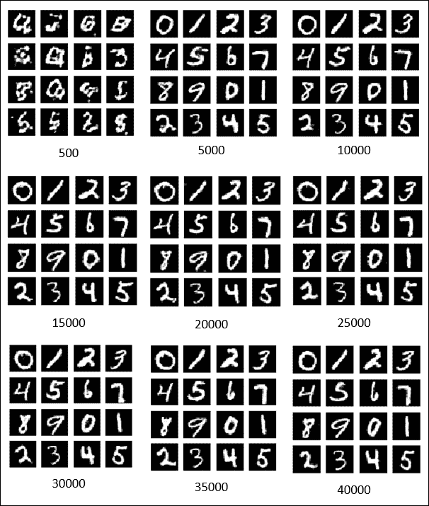

图 4.3.4：在不同训练步骤中，当使用标签[0 1 2 3 4 5 6 7 8 9 0 1 2 3 4 5]作为条件时，CGAN 生成的假图像

鼓励你运行训练好的生成器模型，以查看新的合成 MNIST 数字图像：

```py
python3 cgan-mnist-4.3.1.py --generator=cgan_mnist.h5

```

或者，也可以请求生成一个特定的数字（例如，8）：

```py
cgan-mnist-4.3.1.py --generator=cgan_mnist.h5 --digit=8

```

使用 CGAN 就像拥有一个代理，我们可以要求它绘制类似人类书写的数字。CGAN 相较于 DCGAN 的主要优势在于，我们可以指定代理绘制哪个数字。

# 结论

本章讨论了生成对抗网络（GANs）背后的基本原理，为我们接下来的更高级话题奠定了基础，这些话题包括改进型 GAN、解耦表示 GAN 和跨域 GAN。我们从了解 GAN 是由两个网络组成——生成器和判别器开始。判别器的作用是区分真实信号和假信号。生成器的目标是欺骗判别器。生成器通常与判别器结合形成一个对抗网络。通过训练对抗网络，生成器学会如何生成能够欺骗判别器的假信号。

我们还了解到，虽然 GANs 很容易构建，但训练起来极为困难。文中展示了两个 Keras 中的示例实现。DCGAN 展示了如何训练 GAN 生成假图像，这些假图像是 MNIST 数字。然而，DCGAN 生成器无法控制应生成哪个具体数字。CGAN 通过将生成器条件化为绘制特定数字来解决这个问题。条件是以 one-hot 标签的形式出现的。如果我们想构建一个能够生成特定类别数据的代理，CGAN 是非常有用的。

在下一章中，将介绍 DCGAN 和 CGAN 的改进。特别关注如何稳定 DCGAN 的训练以及如何提高 CGAN 的感知质量。这将通过引入新的损失函数和稍微不同的模型架构来实现。

# 参考文献

1.  Ian Goodfellow。*NIPS 2016 教程：生成对抗网络*。arXiv 预印本 arXiv:1701.00160，2016 ([`arxiv.org/pdf/1701.00160.pdf`](https://arxiv.org/pdf/1701.00160.pdf)).

1.  Alec Radford、Luke Metz 和 Soumith Chintala。*深度卷积生成对抗网络的无监督表示学习*。arXiv 预印本 arXiv:1511.06434，2015 ([`arxiv.org/pdf/1511.06434.pdf`](https://arxiv.org/pdf/1511.06434.pdf)).

1.  Mehdi Mirza 和 Simon Osindero。*条件生成对抗网络*。arXiv 预印本 arXiv:1411.1784，2014 ([`arxiv.org/pdf/1411.1784.pdf`](https://arxiv.org/pdf/1411.1784.pdf)).

1.  Tero Karras 等人。*渐进增长的生成对抗网络：提高质量、稳定性和变化性*。ICLR，2018 ([`arxiv.org/pdf/1710.10196.pdf`](https://arxiv.org/pdf/1710.10196.pdf)).
