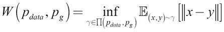
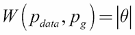
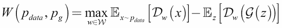
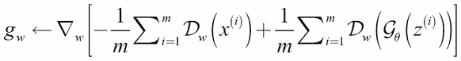
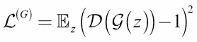

# 第五章：改进的 GAN

自从 2014 年**生成对抗网络**（**GAN**）[1]被提出以来，它的普及速度迅速增加。GAN 已被证明是一种有效的生成模型，能够合成看起来真实的新数据。随后的许多深度学习研究论文都提出了应对原始 GAN 困难和局限性的措施。

如我们在前几章所讨论的那样，GAN 训练 notoriously 难以进行，并且容易发生模式崩塌。模式崩塌是指生成器即使在损失函数已优化的情况下，也会生成看起来相同的输出。在 MNIST 数字的情境中，若发生模式崩塌，生成器可能只会生成数字 4 和 9，因为它们看起来相似。**瓦瑟斯坦 GAN**（**WGAN**）[2]通过认为可以通过简单地替换基于 Wasserstein 1 或**地球搬运距离**（**EMD**）的 GAN 损失函数来避免稳定性训练和模式崩塌，解决了这些问题。

然而，稳定性问题并不是 GAN 唯一的难题。还有一个日益迫切的需求是提升生成图像的感知质量。**最小二乘 GAN**（**LSGAN**）[3]提出了同时解决这两个问题的方法。基本前提是 sigmoid 交叉熵损失在训练过程中会导致梯度消失，这会导致图像质量差。最小二乘损失不会引发梯度消失。与传统的 GAN 生成图像相比，采用最小二乘损失生成的图像在感知质量上有显著提高。

在上一章中，CGAN 介绍了一种对生成器输出进行条件控制的方法。例如，如果我们想要得到数字 8，我们会在输入生成器时加入条件标签。受 CGAN 启发，**辅助分类器 GAN**（**ACGAN**）[4]提出了一种改进的条件算法，从而使得输出的感知质量和多样性得到了更好的提升。

总结来说，本章的目标是介绍这些改进的 GAN 并展示：

+   WGAN 的理论公式

+   理解 LSGAN 的原理

+   理解 ACGAN 的原理

+   知道如何使用 Keras 实现改进的 GAN——WGAN、LSGAN 和 ACGAN

# 瓦瑟斯坦 GAN

如我们之前提到的，GAN 的训练是非常困难的。两个网络——判别器和生成器的对立目标很容易导致训练不稳定。判别器试图正确区分真假数据，而生成器则尽力欺骗判别器。如果判别器学习得比生成器快，生成器的参数就无法得到优化。另一方面，如果判别器学习得较慢，那么梯度可能在到达生成器之前就消失了。在最糟糕的情况下，如果判别器无法收敛，生成器将无法获得任何有用的反馈。

## 距离函数

训练 GAN 的稳定性可以通过检查其损失函数来理解。为了更好地理解 GAN 的损失函数，我们将回顾两个概率分布之间的常见距离或散度函数。我们关心的是 `p[data]`（真实数据分布）与 `p[g]`（生成器数据分布）之间的距离。GAN 的目标是使 `p[g]` → `p[data]`。*表 5.1.1* 显示了这些散度函数。

在大多数最大似然任务中，我们将使用 **Kullback-Leibler** (**KL**) 散度或`D[KL]`作为损失函数中的度量，来衡量我们神经网络模型预测与真实分布函数之间的差距。如 *方程* *5.1.1* 所示，`D[KL]`是不对称的，因为`D[KL](p[data]|p[g] ≠ D[KL](p[g]|p[data])`。

**Jensen-Shannon** (**JS**) 或 `D[JS]` 是基于 `D[KL]` 的散度。然而，与 `D[KL]` 不同，`D[JS]` 是对称的，并且是有限的。在这一部分，我们将展示优化 GAN 损失函数等价于优化 `D[JS]`。

| 散度 | 表达式 |
| --- | --- |
| Kullback-Leibler (KL) 5.1.1 |  | 
| |  |
| Jensen-Shannon (JS) 5.1.2 |  |
| Earth-Mover Distance (EMD) 或 Wasserstein 15.1.3 |  |
| | `PI(p[data] | p[g])` 是所有联合分布`y(x,y)`的集合，其边际分布为`p[data]`和`p[g]`。 |

表 5.1.1：两个概率分布函数`p[data]`和`p[g]` 之间的散度函数


图 5.1.1：EMD 是从 `x` 到目标分布 `y` 所需运输的质量的加权量

EMD（地球搬运距离）的直觉是，它衡量了概率分布`p[data]`在与概率分布 `p[g]` 匹配时，需要通过 `d = ||x - y||` 运输的质量量！距离函数。`γ(x, y)`是所有可能的联合分布空间中的一个联合分布！距离函数。`γ(x, y)` 也称为运输计划，用于反映将质量运输到以匹配两个概率分布的策略。给定这两个概率分布，有许多可能的运输计划。粗略来说，`inf`表示具有最小成本的运输计划。

例如，*图 5.1.1*展示了两个简单的离散分布`x`和`y`。`x`在位置 `x` `i`（i = 1, 2, 3 和 4）上有质量 `m` `i`，同时`y`在位置 `y` `i`（i = 1 和 2）上有质量 `m` `i`。为了匹配分布`y`，箭头展示了将每个质量 `x` `i` 移动 `d` `i` 的最小运输方案。EMD 计算公式为：


（方程 5.1.4）

在*图 5.1.1*中，EMD 可以被解释为将土堆`x`移到填满孔洞`y`所需的最少工作量。虽然在这个例子中，*inf*也可以从图中推导出来，但在大多数情况下，特别是对于连续分布，穷举所有可能的运输方案是不可行的。我们将在本章稍后回到这个问题。与此同时，我们将展示 GAN 损失函数实际上是在最小化**詹森-香农**(**JS**)散度。

## GAN 中的距离函数

我们现在将根据上一章中的损失函数，计算给定任何生成器的最优判别器。我们将回顾以下方程：

（方程 4.1.1）

除了从噪声分布进行采样，前述方程还可以表示为从生成器分布进行采样：

（方程 5.1.5）

为了找到最小值`L⁽ᵈ⁾`：

（方程 5.1.6）

（方程 5.1.7）

积分内部的项呈 `y → a log y + b log(1 - y)` 形式，该式在`a/(a+b)`处达到已知的最大值，对于任何`y ∈ [0,1]`，不包括 `{0,0}` 的`a, b ∈ R`都成立。由于积分不会改变该表达式的最大值位置（或`L⁽ᵈ⁾`的最小值），因此最优判别器为：

（方程 5.1.8）

因此，损失函数给出了最优判别器：

（方程 5.1.9）

（方程 5.1.10）

（方程 5.1.11）

（方程 5.1.12）

我们可以从*方程 5.1.12*中观察到，最优判别器的损失函数是一个常数减去真实分布``p[data]``与任何生成器分布`p[g]`之间的两倍 Jensen-Shannon 散度。最小化`L⁽ᵈ*⁾`意味着最大化`D[JS](p[data]||p[g])`，或者判别器必须正确区分假数据和真实数据。

与此同时，我们可以合理地认为，最优生成器是当生成器分布等于真实数据分布时：

（方程 5.1.13）

这是有道理的，因为生成器的目标是通过学习真实数据分布来欺骗判别器。实际上，我们可以通过最小化`D[JS]`*，*，或者通过使`p[g]` → `p[data]`来得到最优生成器。给定最优生成器，最优判别器是`D*(x) = 1/2`，`L⁽ᵈ*⁾ = 2log2 = 0.6`。


图 5.1.2：没有重叠的两个分布示例。 `θ = 0.5`适用于`p[g]`

问题是，当两个分布没有重叠时，没有平滑的函数可以帮助缩小它们之间的差距。通过梯度下降训练 GAN 将无法收敛。例如，假设：

`p[data] = (x, y)` 其中`x = 0, y ~ U(0,1)`（方程 5.1.14）

`p[g] = (x, y)` 其中`x = θ, y ~ U(0,1)`（方程 5.1.15）

如*图 5.1.2*所示，`U(0,1)`是均匀分布。每个距离函数的散度如下：

+   

+   

+   

+   

由于`D[JS]`是一个常数，GAN 将没有足够的梯度来驱动`p[g]` → `p[data]`。我们还会发现`D[KL]`或反向`D[KL]`也无济于事。然而，通过`W`（`p[data]`，`p[g]`）我们可以得到一个平滑的函数，以便通过梯度下降使`p[g]` → `p[data]`。EMD 或 Wasserstein 1 似乎是优化 GAN 的更合适的损失函数，因为`D[JS]`在两个分布几乎没有重叠的情况下无法发挥作用。

为了进一步理解，关于距离函数的精彩讨论可以在[`lilianweng.github.io/lil-log/2017/08/20/from-GAN-to-W`](https://lilianweng.github.io/lil-log/2017/08/20/from-GAN-to-W) [GAN.html](http://GAN.html)找到。

## Wasserstein 损失的使用

在使用 EMD 或 Wasserstein 1 之前，还需要克服一个问题。穷举`PI(p[data], p[g])`空间以找到`γ ∈ PI(p[data], p[g])ⁱⁿᶠ`是不可行的。提出的解决方案是使用其 Kantorovich-Rubinstein 对偶：


（方程 5.1.16）

等价地，EMD，`sup |f|L ≤ 1`，是所有 K-Lipschitz 函数的上确界（大致为最大值）：`f -> x ∈ R`。K-Lipschitz 函数满足以下约束：

 （方程 5.1.17）

对于所有`x₁, x₂ ∈ R`，K-Lipschitz 函数具有有界导数，且几乎总是连续可微（例如，`f(x) = |x|`具有有界导数且连续，但在`x = 0` 处不可微）。

*方程 5.1.16*可以通过找到一系列 K-Lipschitz 函数来求解：

 （方程 5.1.18）

在 GAN 的上下文中，*方程* *5.1.18* 可以通过从`z`噪声分布采样并将`f[w]`替换为判别器函数`D[w]`来重写：

 （方程 5.1.19）

我们使用粗体字母来突出显示多维样本的通用性。我们面临的最终问题是如何找到函数系列。我们将要讨论的提议解决方案是，在每次梯度更新时，判别器的权重`w`在下界和上界之间裁剪（例如，-0.0, 1 和 0.01）：

 （方程 5.1.20）

`w`的较小值限制了判别器在紧凑的参数空间中，从而确保了 Lipschitz 连续性。

我们可以使用*方程 5.1.19*作为我们新 GAN 损失函数的基础。EMD 或 Wasserstein 1 是生成器试图最小化的损失函数，而判别器试图最大化（或最小化`-W(p[数据], p[生成])`）：


（方程 5.1.21）


（方程 5.1.22）

在生成器损失函数中，第一个项会消失，因为它并没有直接与真实数据进行优化。

以下表格展示了 GAN 和 WGAN 的损失函数之间的差异。为简洁起见，我们简化了`L⁽ᵈ⁾` 和`L⁽ᵍ⁾`的符号。这些损失函数用于训练 WGAN，如*算法* *5.1.1*所示。*图 5.1.3*展示了 WGAN 模型实际上与 DCGAN 模型相同，唯一的区别在于假数据/真实数据标签和损失函数：

| 网络 | 损失函数 | 方程 |
| --- | --- | --- |
| GAN |  | |
| |  | 4.1.14.1.5 |
| WGAN |  | |
| |  | |
| |  | 5.1.215.1.225.1.20 |

> 表 5.1.1：GAN 与 WGAN 的损失函数比较

**算法 5.1.1 WGAN**

参数的值是`α = 0.00005`，`c = 0.01`，`m = 64`，`n[critic] = 5`。

*需要*：`α`，学习率。`c`，裁剪参数。`m`，批量大小。`n[critic]`，每个生成器迭代中的判别器（鉴别器）迭代次数。

*需要*：`w₀`，初始判别器（鉴别器）参数。`θ[0]`，初始生成器参数

1.  `while θ`尚未收敛`do`

1.  `for t = 1, …, n[critic] do`

1.  从均匀噪声分布中采样一个批次

    

    来自真实数据

1.  从均匀噪声分布中采样一个批次\

    

    来自均匀噪声分布

1.  

    ，计算鉴别器梯度

1.  

    ，更新鉴别器参数

1.  

    ，裁剪鉴别器权重

1.  `end for`

1.  从均匀噪声分布中采样一个批次

    

    来自均匀噪声分布

1.  

    ，计算生成器梯度

1.  

    ，更新生成器参数

1.  `end while`


图 5.1.3：上图：训练 WGAN 鉴别器需要来自生成器的假数据和来自真实分布的真实数据。下图：训练 WGAN 生成器需要来自生成器的假数据，这些数据假装是来自真实分布。

类似于 GAN，WGAN 交替训练鉴别器和生成器（通过对抗）。然而，在 WGAN 中，鉴别器（也称为评论员）训练`n[critic]`次迭代（第 2 到第 8 行），然后再训练生成器一次迭代（第 9 到第 11 行）。与 GAN 相比，WGAN 在训练过程中对鉴别器和生成器的训练次数不同。训练鉴别器意味着学习鉴别器的参数（权重和偏置）。这需要从真实数据中采样一个批次（第 3 行）和从假数据中采样一个批次（第 4 行），然后在将采样的数据传入鉴别器网络后计算鉴别器参数的梯度（第 5 行）。鉴别器参数使用 RMSProp 进行优化（第 6 行）。第 5 行和第 6 行是对*方程 5.1.21*的优化。研究表明，在 WGAN 中，Adam 优化器表现不稳定。

最后，EM 距离优化中的 Lipschitz 约束通过裁剪判别器参数（第 7 行）来施加。第 7 行实现了*方程 5.1.20*。经过`n[批评者]`迭代的判别器训练后，判别器参数被冻结。生成器训练从采样一批假数据开始（第 9 行）。采样的数据被标记为真实（1.0），试图欺骗判别器网络。生成器的梯度在第 10 行计算，并在第 11 行使用 RMSProp 进行优化。第 10 行和第 11 行执行梯度更新，以优化*方程 5.1.22*。

在训练完生成器后，判别器参数会被解冻，开始另一轮`n[批评者]`判别器训练迭代。需要注意的是，在判别器训练期间无需冻结生成器参数，因为生成器仅参与数据的生成。与 GAN 类似，判别器可以作为一个独立的网络进行训练。然而，训练生成器始终需要判别器的参与，因为损失是从生成器网络的输出计算的。

与 GAN 不同，在 WGAN 中，真实数据标记为 1.0，而假数据标记为-1.0，这是为了在第 5 行计算梯度时作为一种解决方法。第 5-6 行和第 10-11 行执行梯度更新，分别优化*方程* *5.1.21*和*5.1.22*。第 5 行和第 10 行中的每一项都被建模为：


（方程 5.1.23）

其中，`y[标签] = 1.0` 表示真实数据，`y[标签] = -1.0` 表示假数据。为了简化符号，我们移除了上标(i)。对于判别器，WGAN 增加了，以在使用真实数据进行训练时最小化损失函数。当使用假数据进行训练时，WGAN 减少了，以最小化损失函数。对于生成器，当假数据在训练过程中被标记为真实时，WGAN 增加了，以最小化损失函数。请注意，`y[标签]`在损失函数中的直接贡献仅限于它的符号。在 Keras 中，*方程 5.1.23*实现为：

```py
def wasserstein_loss(y_label, y_pred):
    return -K.mean(y_label * y_pred)
```

## 使用 Keras 实现 WGAN

要在 Keras 中实现 WGAN，我们可以重用前一章中介绍的 GAN 的 DCGAN 实现。DCGAN 构建器和工具函数作为模块在`lib`文件夹中的`gan.py`中实现。

函数包括：

+   `generator()`: 生成器模型构建器

+   `discriminator()`: 判别器模型构建器

+   `train()`: DCGAN 训练器

+   `plot_images()`: 通用生成器输出绘图工具

+   `test_generator()`: 通用生成器测试工具

如*列表* *5.1.1*所示，我们可以通过简单调用来构建判别器：

```py
discriminator = gan.discriminator(inputs, activation='linear')
```

WGAN 使用线性输出激活。对于生成器，我们执行：

```py
generator = gan.generator(inputs, image_size)
```

Keras 中的整体网络模型类似于*图 4.2.1*中显示的 DCGAN。

*列表* *5.1.1* 强调了使用 RMSprop 优化器和 Wasserstein 损失函数。*算法* *5.1.1* 中的超参数在训练中使用。*列表* *5.1.2* 是紧密跟随该 *算法* 的训练函数。然而，在训练判别器时有一个小的调整。我们不再在一个包含真实和虚假数据的单一批次中训练权重，而是先使用一批真实数据进行训练，然后再使用一批虚假数据进行训练。这种调整将防止由于真实和虚假数据标签的符号相反以及由于裁剪导致的权重幅度较小而导致梯度消失。

### 注意

完整代码可在 GitHub 上找到：

[`github.com/PacktPublishing/Advanced-Deep-Learning-with-Keras`](https://github.com/PacktPublishing/Advanced-Deep-Learning-with-Keras)

*图 5.1.4* 展示了 WGAN 在 MNIST 数据集上的输出演变。

列表 5.1.1，`wgan-mnist-5.1.2.py`。WGAN 模型实例化和训练。判别器和生成器都使用 Wasserstein 1 损失，`wasserstein_loss()`：

```py
def build_and_train_models():
    # load MNIST dataset
    (x_train, _), (_, _) = mnist.load_data()

    # reshape data for CNN as (28, 28, 1) and normalize
    image_size = x_train.shape[1]
    x_train = np.reshape(x_train, [-1, image_size, image_size, 1])
    x_train = x_train.astype('float32') / 255

    model_name = "wgan_mnist"
    # network parameters
    # the latent or z vector is 100-dim
    latent_size = 100
 # hyper parameters from WGAN paper [2]
 n_critic = 5
 clip_value = 0.01
    batch_size = 64
    lr = 5e-5
    train_steps = 40000
    input_shape = (image_size, image_size, 1)

    # build discriminator model
    inputs = Input(shape=input_shape, name='discriminator_input')
 # WGAN uses linear activation in paper [2]
 discriminator = gan.discriminator(inputs, activation='linear')
 optimizer = RMSprop(lr=lr)
 # WGAN discriminator uses wassertein loss
 discriminator.compile(loss=wasserstein_loss,
 optimizer=optimizer,
 metrics=['accuracy'])
    discriminator.summary()

    # build generator model
    input_shape = (latent_size, )
    inputs = Input(shape=input_shape, name='z_input')
    generator = gan.generator(inputs, image_size)
    generator.summary()

    # build adversarial model = generator + discriminator
    # freeze the weights of discriminator 
    # during adversarial training
    discriminator.trainable = False
    adversarial = Model(inputs,
                        discriminator(generator(inputs)),
                        name=model_name)
 adversarial.compile(loss=wasserstein_loss,
 optimizer=optimizer,
 metrics=['accuracy'])
    adversarial.summary()

    # train discriminator and adversarial networks
    models = (generator, discriminator, adversarial)
    params = (batch_size,
              latent_size,
              n_critic,
              clip_value,
              train_steps,
              model_name)
    train(models, x_train, params)
```

列表 5.1.2，`wgan-mnist-5.1.2.py`。WGAN 的训练过程严格遵循 *算法* *5.1.1*。判别器每训练一次生成器，需要进行 `n` [批判] 次迭代：

```py
def train(models, x_train, params):
    """Train the Discriminator and Adversarial Networks

    Alternately train Discriminator and Adversarial networks by batch.
    Discriminator is trained first with properly labeled real and fake images
    for n_critic times.
    Discriminator weights are clipped as a requirement of Lipschitz constraint.
    Generator is trained next (via Adversarial) with fake images
    pretending to be real.
    Generate sample images per save_interval

    # Arguments
        models (list): Generator, Discriminator, Adversarial models
        x_train (tensor): Train images
        params (list) : Networks parameters

    """
    # the GAN models
    generator, discriminator, adversarial = models
    # network parameters
    (batch_size, latent_size, n_critic,
            clip_value, train_steps, model_name) = params
    # the generator image is saved every 500 steps
    save_interval = 500
    # noise vector to see how the generator output 
    # evolves during training
    noise_input = np.random.uniform(-1.0, 1.0, size=[16,    
                                    latent_size])
    # number of elements in train dataset
    train_size = x_train.shape[0]
    # labels for real data
    real_labels = np.ones((batch_size, 1))
    for i in range(train_steps):
        # train discriminator n_critic times
        loss = 0
        acc = 0
        for _ in range(n_critic):
            # train the discriminator for 1 batch
            # 1 batch of real (label=1.0) and 
            # fake images (label=-1.0)
            # randomly pick real images from dataset
            rand_indexes = np.random.randint(0,
                                             train_size,         
                                             size=batch_size)
            real_images = x_train[rand_indexes]
            # generate fake images from noise using generator
            # generate noise using uniform distribution
            noise = np.random.uniform(-1.0,
                                      1.0,
                                      size=[batch_size,                    
                                      latent_size])
            fake_images = generator.predict(noise)

            # train the discriminator network
            # real data label=1, fake data label=-1
            # instead of 1 combined batch of real and fake images,
            # train with 1 batch of real data first, then 1 batch
            # of fake images.
            # this tweak prevents the gradient from vanishing 
            # due to opposite signs of real and
            # fake data labels (i.e. +1 and -1) and
            # small magnitude of weights due to clipping.
            real_loss, real_acc =                      
                         discriminator.train_on_batch(real_images,                                   
                                                      real_labels)
            fake_loss, fake_acc = 
                         discriminator.train_on_batch(fake_images,
                                                      real_labels)
            # accumulate average loss and accuracy
            loss += 0.5 * (real_loss + fake_loss)
            acc += 0.5 * (real_acc + fake_acc)

            # clip discriminator weights to satisfy 
            # Lipschitz constraint
            for layer in discriminator.layers:
                weights = layer.get_weights()
                weights = [np.clip(weight,
                                   -clip_value,
                                   clip_value) for weight in weights]
                layer.set_weights(weights)

        # average loss and accuracy per n_critic 
        # training iterations
        loss /= n_critic
        acc /= n_critic
        log = "%d: [discriminator loss: %f, acc: %f]" % (i, loss, acc)

        # train the adversarial network for 1 batch
        # 1 batch of fake images with label=1.0
        # since the discriminator weights are 
        # frozen in adversarial network
        # only the generator is trained
        # generate noise using uniform distribution
        noise = np.random.uniform(-1.0, 1.0, 
                                  size=[batch_size, latent_size])
        # train the adversarial network
        # note that unlike in discriminator training,
        # we do not save the fake images in a variable
        # the fake images go to the discriminator input 
        # of the adversarial for classification
        # fake images are labelled as real
        # log the loss and accuracy
        loss, acc = adversarial.train_on_batch(noise, real_labels)
        log = "%s [adversarial loss: %f, acc: %f]" % (log, loss, acc)
        print(log)
        if (i + 1) % save_interval == 0:
            if (i + 1) == train_steps:
                show = True
            else:
                show = False

            # plot generator images on a periodic basis
            gan.plot_images(generator,
                            noise_input=noise_input,
                            show=show,
                            step=(i + 1),
                            model_name=model_name)

    # save the model after training the generator
    # the trained generator can be reloaded for future 
    # MNIST digit generation
    generator.save(model_name + ".h5")
```


图 5.1.4：WGAN 的样本输出与训练步骤的对比。WGAN 在训练和测试过程中没有遭遇模式崩溃。

即使在网络配置发生变化时，WGAN 也依然稳定。例如，众所周知，当批量归一化插入到判别器网络中的 ReLU 激活之前时，DCGAN 会变得不稳定。而相同的配置在 WGAN 中是稳定的。

下图展示了在判别器网络上应用批量归一化时，DCGAN 和 WGAN 的输出：


图 5.1.5：在判别器网络中，将批量归一化插入到 ReLU 激活之前时，DCGAN（左）和 WGAN（右）输出的对比

类似于上一章中的 GAN 训练，训练好的模型会在 40,000 次训练步骤后保存到文件中。我鼓励你运行训练好的生成器模型，查看生成的新 MNIST 数字图像：

```py
python3 wgan-mnist-5.1.2.py --generator=wgan_mnist.h5

```

# 最小二乘 GAN（LSGAN）

正如上一节所讨论的，原始 GAN 很难训练。当 GAN 优化其损失函数时，实际上是在优化 *Jensen-Shannon* 散度，`D[JS]`。当两个分布函数之间几乎没有重叠时，优化 `D[JS]` 是非常困难的。

WGAN 提出了使用 EMD 或 Wasserstein 1 损失函数来解决这个问题，即使在两个分布几乎没有重叠的情况下，它也具有平滑的可微函数。然而，WGAN 并不关注生成图像的质量。除了稳定性问题外，原始 GAN 生成的图像在感知质量方面仍有提升空间。LSGAN 理论认为，这两个问题可以同时得到解决。

LSGAN 提出了最小二乘损失。*图 5.2.1* 说明了为何在 GAN 中使用 sigmoid 交叉熵损失会导致生成的数据质量较差。理想情况下，假样本的分布应尽可能接近真实样本的分布。然而，对于 GAN，一旦假样本已经处于正确的决策边界一侧，梯度就会消失。

这防止了生成器有足够的动力来提升生成假数据的质量。远离决策边界的假样本将不再尝试接近真实样本的分布。使用最小二乘损失函数时，只要假样本分布远离真实样本分布，梯度就不会消失。即使假样本已经处于正确的决策边界一侧，生成器也会努力提高其对真实密度分布的估计：


图 5.2.1：真实样本和假样本的分布被各自的决策边界划分：Sigmoid 和最小二乘

| 网络 | 损失函数 | 方程 |
| --- | --- | --- |
| GAN |  | 4.1.14.1.5 |
| LSGAN |  | 5.2.15.2.2 |

表 5.2.1：GAN 和 LSGAN 的损失函数比较

上表展示了 GAN 和 LSGAN 之间损失函数的比较。最小化*方程 5.2.1*或判别器损失函数意味着真实数据分类与真实标签 1.0 之间的 MSE 应接近零。此外，假数据分类与真实标签 0.0 之间的 MSE 也应接近零。

类似于 GAN，LSGAN 的判别器被训练来区分真实数据和假数据样本。最小化*方程 5.2.2*意味着欺骗判别器，使其认为生成的假样本数据是标签为 1.0 的真实数据。

使用上一章中的 DCGAN 代码作为基础来实现 LSGAN 只需少量更改。如*列表 5.2.1*所示，移除了判别器的 sigmoid 激活函数。判别器通过以下方式构建：

```py
discriminator = gan.discriminator(inputs, activation=None)
```

生成器类似于原始的 DCGAN：

```py
generator = gan.generator(inputs, image_size)
```

判别器和对抗损失函数都被替换为 `mse`。所有网络参数与 DCGAN 中相同。LSGAN 在 Keras 中的网络模型与*图 4.2.1* 类似，唯一不同的是没有线性或输出激活。训练过程与 DCGAN 中看到的相似，并由实用函数提供：

```py
gan.train(models, x_train, params)
```

清单 5.2.1，`lsgan-mnist-5.2.1.py` 显示了判别器和生成器在 DCGAN 中是相同的，除了判别器输出激活和使用了 MSE 损失函数：

```py
def build_and_train_models():
    # MNIST dataset
    (x_train, _), (_, _) = mnist.load_data()

    # reshape data for CNN as (28, 28, 1) and normalize
    image_size = x_train.shape[1]
    x_train = np.reshape(x_train, [-1, image_size, image_size, 1])
    x_train = x_train.astype('float32') / 255

    model_name = "lsgan_mnist"
    # network parameters
    # the latent or z vector is 100-dim
    latent_size = 100
    input_shape = (image_size, image_size, 1)
    batch_size = 64
    lr = 2e-4
    decay = 6e-8
    train_steps = 40000

    # build discriminator model
    inputs = Input(shape=input_shape, name='discriminator_input')
 discriminator = gan.discriminator(inputs, activation=None)
    # [1] uses Adam, but discriminator converges 
    # easily with RMSprop
    optimizer = RMSprop(lr=lr, decay=decay)
 # LSGAN uses MSE loss [2]
 discriminator.compile(loss='mse',
 optimizer=optimizer,
 metrics=['accuracy'])
    discriminator.summary()

    # build generator model
    input_shape = (latent_size, )
    inputs = Input(shape=input_shape, name='z_input')
    generator = gan.generator(inputs, image_size)
    generator.summary()

    # build adversarial model = generator + discriminator
    optimizer = RMSprop(lr=lr*0.5, decay=decay*0.5)
    # freeze the weights of discriminator 
    # during adversarial training
    discriminator.trainable = False
    adversarial = Model(inputs,
                        discriminator(generator(inputs)),
                        name=model_name)
 # LSGAN uses MSE loss [2]
 adversarial.compile(loss='mse',
 optimizer=optimizer,
 metrics=['accuracy'])
    adversarial.summary()

    # train discriminator and adversarial networks
    models = (generator, discriminator, adversarial)
    params = (batch_size, latent_size, train_steps, model_name)
 gan.train(models, x_train, params)

```

接下来的图展示了使用 MNIST 数据集进行 40,000 步训练后，LSGAN 生成的样本。与 DCGAN 中的*图 4.2.1*相比，输出图像具有更好的感知质量：


图 5.2.2：LSGAN 与训练步数的样本输出

我鼓励你运行训练好的生成器模型，查看新合成的 MNIST 数字图像：

```py
python3 lsgan-mnist-5.2.1.py --generator=lsgan_mnist.h5

```

# 辅助分类器 GAN (ACGAN)

ACGAN 在原理上与我们在上一章讨论的 **条件 GAN** (**CGAN**) 相似。我们将比较 CGAN 和 ACGAN。对于 CGAN 和 ACGAN，生成器的输入是噪声和标签。输出是属于输入类标签的假图像。对于 CGAN，判别器的输入是图像（假图像或真实图像）及其标签。输出是图像为真实的概率。对于 ACGAN，判别器的输入是图像，而输出是图像为真实的概率及其类别标签。接下来的图突出显示了 CGAN 和 ACGAN 在生成器训练中的区别：


图 5.3.1：CGAN 与 ACGAN 生成器训练。主要区别在于判别器的输入和输出。

本质上，在 CGAN 中，我们为网络提供边信息（标签）。在 ACGAN 中，我们尝试使用辅助类解码器网络来重建边信息。ACGAN 认为，强迫网络执行额外任务已被证明能提高原始任务的性能。在这种情况下，额外的任务是图像分类。原始任务是生成假图像。

| 网络 | 损失函数 | 数量 |
| --- | --- | --- |
| CGAN |  | 4.3.14.3.2 |

| ACGAN | 

表 5.3.1：CGAN 与 ACGAN 损失函数的比较

| 5.3.15.3.2 |
| --- |

上表展示了与 CGAN 相比的 ACGAN 损失函数。ACGAN 的损失函数与 CGAN 相同，唯一不同的是额外的分类器损失函数。除了原本识别真假图像的任务 ()，判别器的*Equation 5.3.1*还有一个额外任务，即正确分类真假图像 ()。生成器的*Equation* *5.3.2*意味着除了通过假图像来欺骗判别器 ()，它还要求判别器正确分类这些假图像 ()。

从 CGAN 代码开始，只需要修改判别器和训练函数以实现 ACGAN。判别器和生成器构建函数也由`gan.py`提供。为了查看在判别器上做出的修改，以下*listing*展示了构建函数，其中突出了执行图像分类的辅助解码器网络和双输出。

*Listing 5.3.1*，`gan.py`展示了判别器模型构建与 DCGAN 相同，用于预测图像是否为真实，作为第一个输出。添加了一个辅助解码器网络来执行图像分类并产生第二个输出：

```py
def discriminator(inputs,
                  activation='sigmoid',
                  num_labels=None,
                  num_codes=None):
    """Build a Discriminator Model

    Stack of LeakyReLU-Conv2D to discriminate real from fake
    The network does not converge with BN  so it is not used here
    unlike in [1]

    # Arguments
        inputs (Layer): Input layer of the discriminator (the image)
        activation (string): Name of output activation layer
        num_labels (int): Dimension of one-hot labels for ACGAN & InfoGAN
        num_codes (int): num_codes-dim Q network as output 
                    if StackedGAN or 2 Q networks if InfoGAN

    # Returns
        Model: Discriminator Model
    """
    kernel_size = 5
    layer_filters = [32, 64, 128, 256]

    x = inputs
    for filters in layer_filters:
        # first 3 convolution layers use strides = 2
        # last one uses strides = 1
        if filters == layer_filters[-1]:
            strides = 1
        else:
            strides = 2
        x = LeakyReLU(alpha=0.2)(x)
        x = Conv2D(filters=filters,
                   kernel_size=kernel_size,
                   strides=strides,
                   padding='same')(x)

    x = Flatten()(x)
    # default output is probability that the image is real
    outputs = Dense(1)(x)
    if activation is not None:
        print(activation)
        outputs = Activation(activation)(outputs)

 if num_labels:
 # ACGAN and InfoGAN have 2nd output
 # 2nd output is 10-dim one-hot vector of label
 layer = Dense(layer_filters[-2])(x)
 labels = Dense(num_labels)(layer)
 labels = Activation('softmax', name='label')(labels)
 if num_codes is None:
 outputs = [outputs, labels]
        else:
            # InfoGAN have 3rd and 4th outputs
            # 3rd output is 1-dim continous Q of 1st c given x
            code1 = Dense(1)(layer)
            code1 = Activation('sigmoid', name='code1')(code1)

            # 4th output is 1-dim continuous Q of 2nd c given x
            code2 = Dense(1)(layer)
            code2 = Activation('sigmoid', name='code2')(code2)

            outputs = [outputs, labels, code1, code2]
    elif num_codes is not None:
        # z0_recon is reconstruction of z0 normal distribution
        z0_recon =  Dense(num_codes)(x)
        z0_recon = Activation('tanh', name='z0')(z0_recon)
        outputs = [outputs, z0_recon]

    return Model(inputs, outputs, name='discriminator')
```

然后通过调用以下代码构建判别器：

```py
discriminator = gan.discriminator(inputs, num_labels=num_labels)
```

生成器与 ACGAN 中的生成器相同。回顾一下，生成器构建函数在以下*listing*中展示。我们需要注意的是，*Listings* *5.3.1*和*5.3.2*是 WGAN 和 LSGAN 在前面章节中使用的相同构建函数。

*Listing 5.3.2*，`gan.py`展示了生成器模型构建与 CGAN 中的相同：

```py
def generator(inputs,
              image_size,
              activation='sigmoid',
              labels=None,
              codes=None):
    """Build a Generator Model

    Stack of BN-ReLU-Conv2DTranpose to generate fake images.
    Output activation is sigmoid instead of tanh in [1].
    Sigmoid converges easily.

    # Arguments
        inputs (Layer): Input layer of the generator (the z-vector)
        image_size (int): Target size of one side (assuming square image)
        activation (string): Name of output activation layer
        labels (tensor): Input labels
        codes (list): 2-dim disentangled codes for InfoGAN

    # Returns
        Model: Generator Model
    """
    image_resize = image_size // 4
    # network parameters
    kernel_size = 5
    layer_filters = [128, 64, 32, 1]

 if labels is not None:
 if codes is None:
 # ACGAN labels
 # concatenate z noise vector and one-hot labels
 inputs = [inputs, labels]
        else:
            # infoGAN codes
            # concatenate z noise vector, one-hot labels 
            # and codes 1 & 2
            inputs = [inputs, labels] + codes
        x = concatenate(inputs, axis=1)
    elif codes is not None:
        # generator 0 of StackedGAN
        inputs = [inputs, codes]
        x = concatenate(inputs, axis=1)
    else:
        # default input is just 100-dim noise (z-code)
        x = inputs

    x = Dense(image_resize * image_resize * layer_filters[0])(x)
    x = Reshape((image_resize, image_resize, layer_filters[0]))(x)

    for filters in layer_filters:
        # first two convolution layers use strides = 2
        # the last two use strides = 1
        if filters > layer_filters[-2]:
            strides = 2
        else:
            strides = 1
        x = BatchNormalization()(x)
        x = Activation('relu')(x)
        x = Conv2DTranspose(filters=filters,
                            kernel_size=kernel_size,
                            strides=strides,
                            padding='same')(x)

    if activation is not None:
        x = Activation(activation)(x)

    # generator output is the synthesized image x
    return Model(inputs, x, name='generator')
```

在 ACGAN 中，生成器被实例化为：

```py
generator = gan.generator(inputs, image_size, labels=labels)
```

以下图展示了 Keras 中 ACGAN 的网络模型：


图 5.3.2：ACGAN 的 Keras 模型

如*Listing* *5.3.3*所示，判别器和对抗模型已被修改以适应判别器网络中的变化。现在我们有了两个损失函数。第一个是原始的二元交叉熵，用于训练判别器估计输入图像是否真实。第二个是图像分类器，预测类别标签。输出是一个 10 维的独热向量。

参考*Listing 5.3.3*，`acgan-mnist-5.3.1.py`，其中突出了为适应判别器网络的图像分类器，在判别器和对抗模型中实施的变化。两个损失函数分别对应判别器的两个输出：

```py
def build_and_train_models():
    # load MNIST dataset
    (x_train, y_train), (_, _) = mnist.load_data()

    # reshape data for CNN as (28, 28, 1) and normalize
    image_size = x_train.shape[1]
    x_train = np.reshape(x_train, [-1, image_size, image_size, 1])
    x_train = x_train.astype('float32') / 255

    # train labels
    num_labels = len(np.unique(y_train))
    y_train = to_categorical(y_train)

    model_name = "acgan_mnist"
    # network parameters
    latent_size = 100
    batch_size = 64
    train_steps = 40000
    lr = 2e-4
    decay = 6e-8
    input_shape = (image_size, image_size, 1)
    label_shape = (num_labels, )

    # build discriminator Model
    inputs = Input(shape=input_shape, name='discriminator_input')
    # call discriminator builder with 2 outputs, 
    # pred source and labels
 discriminator = gan.discriminator(inputs, num_labels=num_labels)
 # [1] uses Adam, but discriminator converges easily with RMSprop
 optimizer = RMSprop(lr=lr, decay=decay)
 # 2 loss fuctions: 1) probability image is real
 # 2) class label of the image
 loss = ['binary_crossentropy', 'categorical_crossentropy']
 discriminator.compile(loss=loss,
 optimizer=optimizer,
 metrics=['accuracy'])
    discriminator.summary()

    # build generator model
    input_shape = (latent_size, )
    inputs = Input(shape=input_shape, name='z_input')
    labels = Input(shape=label_shape, name='labels')
    # call generator builder with input labels
    generator = gan.generator(inputs, image_size, labels=labels)
    generator.summary()

    # build adversarial model = generator + discriminator
    optimizer = RMSprop(lr=lr*0.5, decay=decay*0.5)
    # freeze the weights of discriminator 
    # during adversarial training
    discriminator.trainable = False
 adversarial = Model([inputs, labels],
 discriminator(generator([inputs, labels])),
 name=model_name)
 # same 2 loss fuctions: 1) probability image is real
 # 2) class label of the image
 adversarial.compile(loss=loss,
 optimizer=optimizer,
 metrics=['accuracy'])
    adversarial.summary()

    # train discriminator and adversarial networks
    models = (generator, discriminator, adversarial)
    data = (x_train, y_train)
    params = (batch_size, latent_size, train_steps, num_labels, model_name)
    train(models, data, params)
```

在*Listing* *5.3.4*中，我们突出了训练过程中实现的变化。与 CGAN 代码相比，主要的区别在于输出标签必须在判别器和对抗训练期间提供。

如*Listing 5.3.4*中所示，`acgan-mnist-5.3.1.py`，train 函数中实现的更改已突出显示：

```py
def train(models, data, params):
    """Train the discriminator and adversarial Networks

    Alternately train discriminator and adversarial networks by batch.
    Discriminator is trained first with real and fake images and
    corresponding one-hot labels.
    Adversarial is trained next with fake images pretending to be real and 
    corresponding one-hot labels.
    Generate sample images per save_interval.

    # Arguments
        models (list): Generator, Discriminator, Adversarial models
        data (list): x_train, y_train data
        params (list): Network parameters

    """
    # the GAN models
    generator, discriminator, adversarial = models
    # images and their one-hot labels
    x_train, y_train = data
    # network parameters
    batch_size, latent_size, train_steps, num_labels, model_name = params
    # the generator image is saved every 500 steps
    save_interval = 500
    # noise vector to see how the generator output 
    # evolves during training
    noise_input = np.random.uniform(-1.0, 
                                    1.0,
                                    size=[16, latent_size])
 # class labels are 0, 1, 2, 3, 4, 5, 6, 7, 8, 9, 0, 1, 2, 3, 4, 5
 # the generator must produce these MNIST digits
 noise_label = np.eye(num_labels)[np.arange(0, 16) % num_labels]
    # number of elements in train dataset
    train_size = x_train.shape[0]
    print(model_name,
          "Labels for generated images: ",
          np.argmax(noise_label, axis=1))

    for i in range(train_steps):
        # train the discriminator for 1 batch
        # 1 batch of real (label=1.0) and fake images (label=0.0)
        # randomly pick real images and corresponding labels 
        # from dataset 
        rand_indexes = np.random.randint(0, 
                                         train_size, 
                                         size=batch_size)
        real_images = x_train[rand_indexes]
 real_labels = y_train[rand_indexes]
        # generate fake images from noise using generator
        # generate noise using uniform distribution
        noise = np.random.uniform(-1.0,
                                  1.0,
                                  size=[batch_size, latent_size])
 # randomly pick one-hot labels
 fake_labels = np.eye(num_labels)[np.random.choice(num_labels,
 batch_size)]
        # generate fake images
        fake_images = generator.predict([noise, fake_labels])
        # real + fake images = 1 batch of train data
        x = np.concatenate((real_images, fake_images))
 # real + fake labels = 1 batch of train data labels
 labels = np.concatenate((real_labels, fake_labels))
        # label real and fake images
        # real images label is 1.0
        y = np.ones([2 * batch_size, 1])
        # fake images label is 0.0
        y[batch_size:, :] = 0
        # train discriminator network, log the loss and accuracy
        # ['loss', 'activation_1_loss', 'label_loss', 
        # 'activation_1_acc', 'label_acc']
 metrics  = discriminator.train_on_batch(x, [y, labels])
 fmt = "%d: [disc loss: %f, srcloss: %f, lblloss: %f, srcacc: %f, lblacc: %f]"
 log = fmt % (i, metrics[0], metrics[1], metrics[2], metrics[3], metrics[4])

        # train the adversarial network for 1 batch
        # 1 batch of fake images with label=1.0 and
        # corresponding one-hot label or class 
        # since the discriminator weights are frozen 
        # in adversarial network
        # only the generator is trained
        # generate noise using uniform distribution
        noise = np.random.uniform(-1.0,
                                  1.0,
                                  size=[batch_size, latent_size])
 # randomly pick one-hot labels
 fake_labels = np.eye(num_labels)[np.random.choice(num_labels,
 batch_size)]
        # label fake images as real
        y = np.ones([batch_size, 1])
        # train the adversarial network 
        # note that unlike in discriminator training, 
        # we do not save the fake images in a variable
        # the fake images go to the discriminator input 
        # of the adversarial
        # for classification
        # log the loss and accuracy
 metrics  = adversarial.train_on_batch([noise, fake_labels],
 [y, fake_labels])
 fmt = "%s [advr loss: %f, srcloss: %f, lblloss: %f, srcacc: %f, lblacc: %f]"
 log = fmt % (log, metrics[0], metrics[1], metrics[2], metrics[3], metrics[4])
        print(log)
        if (i + 1) % save_interval == 0:
            if (i + 1) == train_steps:
                show = True
            else:
                show = False

            # plot generator images on a periodic basis
            gan.plot_images(generator,
                        noise_input=noise_input,
                        noise_label=noise_label,
                        show=show,
                        step=(i + 1),
                        model_name=model_name)

    # save the model after training the generator
    # the trained generator can be reloaded for 
    # future MNIST digit generation
    generator.save(model_name + ".h5")
```

结果发现，增加了这个额外任务后，ACGAN 相比我们之前讨论过的所有 GAN，性能有了显著提升。ACGAN 的训练稳定性如*图 5.3.3*所示，展示了 ACGAN 生成的以下标签的样本输出：

```py
[0 1 2 3 
 4 5 6 7 
 8 9 0 1 
 2 3 4 5]

```

与 CGAN 不同，样本输出的外观在训练过程中不会大幅变化。MNIST 数字图像的感知质量也更好。*图 5.3.4* 展示了由 CGAN 和 ACGAN 分别生成的每个 MNIST 数字的并排比较。数字 2 到 6 在 ACGAN 中的质量优于 CGAN。

我鼓励你运行训练好的生成器模型，以查看新的合成 MNIST 数字图像：

```py
python3 acgan-mnist-5.3.1.py --generator=acgan_mnist.h5

```

另外，还可以请求生成特定的数字（例如，3）：

```py
python3 acgan-mnist-5.3.1.py --generator=acgan_mnist.h5 --digit=3

```


图 5.3.3：ACGAN 在训练步骤下生成的样本输出，标签为[0 1 2 3 4 5 6 7 8 9 0 1 2 3 4 5]


图 5.3.4：由 CGAN 和 ACGAN 生成的 0 至 9 数字输出并排比较

# 结论

在本章中，我们展示了对 GAN 原始算法的多种改进，这些算法在上一章中首次介绍。WGAN 提出了一种算法，通过使用 EMD 或 Wasserstein 1 损失来提高训练的稳定性。LSGAN 认为 GAN 原始的交叉熵函数容易导致梯度消失，而最小二乘损失则不同。LSGAN 提出了一种算法，实现了稳定的训练和高质量的输出。ACGAN 通过要求判别器除了判断输入图像是否为假图像或真实图像外，还需要执行分类任务，从而显著提高了 MNIST 数字条件生成的质量。

在下一章，我们将学习如何控制生成器输出的属性。尽管 CGAN 和 ACGAN 能够指示所需的数字进行生成，但我们尚未分析能够指定输出属性的 GAN。例如，我们可能希望控制 MNIST 数字的书写风格，如圆度、倾斜角度和粗细。因此，本章的目标是介绍具有解耦表示的 GAN，以控制生成器输出的特定属性。

# 参考文献

1.  Ian Goodfellow 等人，*生成对抗网络*。神经信息处理系统进展，2014（[`papers.nips.cc/paper/5423-generative-adversarial-nets.pdf`](http://papers.nips.cc/paper/5423-generative-adversarial-nets.pdf)）。

1.  Martin Arjovsky、Soumith Chintala 和 Léon Bottou，*Wasserstein GAN*。arXiv 预印本，2017（[`arxiv.org/pdf/1701.07875.pdf`](https://arxiv.org/pdf/1701.07875.pdf)）。

1.  Xudong Mao 等人。*最小二乘生成对抗网络*。2017 年 IEEE 计算机视觉国际会议（ICCV）。IEEE 2017 ([`openaccess.thecvf.com/content_ICCV_2017/papers/Mao_Least_Squares_Generative_ICCV_2017_paper.pdf`](http://openaccess.thecvf.com/content_ICCV_2017/papers/Mao_Least_Squares_Generative_ICCV_2017_paper.pdf))。

1.  Augustus Odena、Christopher Olah 和 Jonathon Shlens。*带有辅助分类器 GAN 的条件图像合成*。ICML，2017 ([`proceedings.mlr.press/v70/odena17a/odena17a.pdf`](http://proceedings.mlr.press/v70/odena17a/odena17a.pdf))。
