# 第六章：解耦表示的 GANs

正如我们所探讨的，GAN 通过学习数据分布可以生成有意义的输出。然而，对于生成的输出属性并没有控制。一些 GAN 的变体，如**条件 GAN**（**CGAN**）和**辅助分类器 GAN**（**ACGAN**），如前一章所讨论的，能够训练一个受条件限制的生成器来合成特定的输出。例如，CGAN 和 ACGAN 都能引导生成器生成特定的 MNIST 数字。这是通过使用一个 100 维的噪声代码和相应的独热标签作为输入来实现的。然而，除了独热标签之外，我们没有其他方法来控制生成输出的属性。

### 注意

关于 CGAN 和 ACGAN 的回顾，请参见第四章，*生成对抗网络（GANs）*，以及第五章，*改进的 GANs*。

在本章中，我们将介绍一些能够修改生成器输出的 GAN 变体。在 MNIST 数据集的背景下，除了生成哪个数字，我们可能还希望控制书写风格。这可能涉及到所需数字的倾斜度或宽度。换句话说，GAN 也可以学习解耦的潜在代码或表示，我们可以使用这些代码或表示来改变生成器输出的属性。解耦的代码或表示是一个张量，它可以改变输出数据的特定特征或属性，而不会影响其他属性。

本章的第一部分，我们将讨论**InfoGAN**：*通过信息最大化生成对抗网络进行可解释表示学习* [1]，这是一种 GAN 的扩展。InfoGAN 通过最大化输入代码和输出观察之间的互信息，以无监督的方式学习解耦的表示。在 MNIST 数据集上，InfoGAN 将书写风格与数字数据集解耦。

在本章的后续部分，我们还将讨论**堆叠生成对抗网络**（**StackedGAN**）[2]，这是 GAN 的另一种扩展。StackedGAN 使用预训练的编码器或分类器来帮助解耦潜在代码。StackedGAN 可以视为一堆模型，每个模型由一个编码器和一个 GAN 组成。每个 GAN 通过使用相应编码器的输入和输出数据，以对抗的方式进行训练。

总结来说，本章的目标是展示：

+   解耦表示的概念

+   InfoGAN 和 StackedGAN 的原理

+   使用 Keras 实现 InfoGAN 和 StackedGAN

# 解耦表示

原始的 GAN 能够生成有意义的输出，但其缺点是无法进行控制。例如，如果我们训练一个 GAN 来学习名人面孔的分布，生成器会生成新的名人样貌的人物图像。然而，无法控制生成器生成我们想要的面孔的特定特征。例如，我们无法要求生成器生成一张女性名人面孔，长黑发，皮肤白皙，棕色眼睛，正在微笑。根本原因是我们使用的 100 维噪声代码将生成器输出的所有显著特征都缠结在一起。我们可以回忆起在 Keras 中，100 维代码是通过从均匀噪声分布中随机抽样生成的：

```py
# generate 64 fake images from 64 x 100-dim uniform noise
noise = np.random.uniform(-1.0, 1.0, size=[64, 100])
fake_images = generator.predict(noise)
```

如果我们能够修改原始 GAN，使其能够将代码或表示分离为缠结和解耦的可解释潜在代码，我们将能够告诉生成器生成我们所需的内容。

接下来的图像展示了一个具有缠结代码的 GAN 及其结合缠结和解耦表示的变化。在假设的名人面孔生成背景下，使用解耦代码，我们可以指定我们希望生成的面孔的性别、发型、面部表情、肤色和眼睛颜色。*n–dim* 的缠结代码仍然用于表示我们尚未解耦的所有其他面部特征，例如面部形状、面部毛发、眼镜，仅举三个例子。缠结和解耦代码的拼接作为生成器的新输入。拼接代码的总维度不一定是 100：

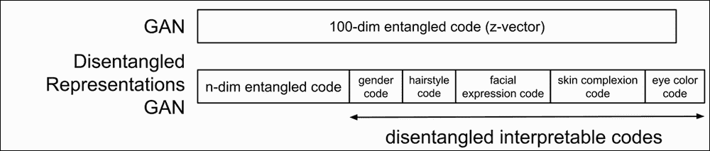

图 6.1.1：具有缠结代码的 GAN 以及其结合缠结和解耦代码的变化。此示例展示了名人面孔生成的背景。

从前面的图像来看，具有解耦表示的 GAN 也可以像普通的 GAN 一样进行优化。这是因为生成器的输出可以表示为：

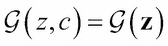

（方程式 6.1.1）

代码

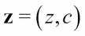

由两个元素组成：

1.  类似于 GAN 的不可压缩缠结噪声代码 `z` 或噪声向量。

1.  潜在代码，`c``1`,`c``2`,…,`c``L`，表示数据分布的可解释解耦代码。所有潜在代码统一表示为 `c`。

为了简化起见，假设所有潜在代码都是独立的：

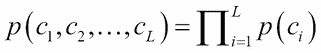

（方程式 6.1.2）

生成器函数

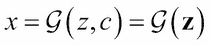

提供了不可压缩的噪声代码和潜在代码。从生成器的角度来看，优化


之间的互信息与优化 `z` 相同。生成器网络在得出解决方案时会忽略由解耦代码施加的约束。生成器学习分布

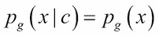

。这将实际破坏解耦表示的目标。

# InfoGAN

为了加强代码的解耦，InfoGAN 向原始损失函数中提出了一个正则化项，该项最大化潜在代码 `c` 和


：

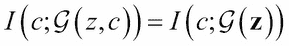

（方程 6.1.3）

该正则化项迫使生成器在构建合成假图像的函数时考虑潜在代码。在信息论领域，潜在代码 `c` 和

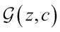

定义为：

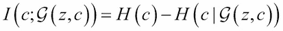

（方程 6.1.4）

其中 `H`(`c`) 是潜在代码 `c` 的熵，和


是观察到生成器输出后的 `c` 的条件熵，


。熵是衡量随机变量或事件不确定性的一个度量。例如，像 *太阳从东方升起* 这样的信息熵较低。而 *中彩票中大奖* 的熵则较高。

在 *方程 6.1.4* 中，最大化互信息意味着最小化

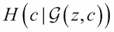

或者通过观察生成的输出减少潜在代码的不确定性。这是有道理的，例如，在 MNIST 数据集中，如果 GAN 看到它观察到数字 8，生成器会对合成数字 8 更有信心。

然而，估计它是很难的


因为它需要了解后验知识

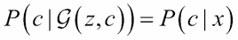

，而这是我们无法访问的。解决方法是通过估计辅助分布 `Q`(*c|x*) 来估算互信息的下界。InfoGAN 通过以下方式估算互信息的下界：

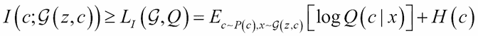

（方程 6.1.5）

在 InfoGAN 中，`H`(`c`)被假定为常数。因此，最大化互信息就是最大化期望值。生成器必须确信它已经生成了具有特定属性的输出。我们应该注意到，这个期望值的最大值是零。因此，互信息下界的最大值是 `H`(`c`)。在 InfoGAN 中，离散潜在代码的 `Q`(`c`|`x`) 可以通过 *softmax* 非线性表示。期望值是 Keras 中负的 `categorical_crossentropy` 损失。

对于单维连续代码，期望是对 `c` 和 `x` 的双重积分。这是因为期望从解缠代码分布和生成器分布中采样。估计期望的一种方法是假设样本是连续数据的良好度量。因此，损失被估计为 `c` log `Q`(`c`|`x`)。

为了完成 InfoGAN 网络，我们应该有一个 `Q`(`c`|`x`) 的实现。为了简单起见，网络 `Q` 是附加在判别器倒数第二层的辅助网络。因此，这对原始 GAN 的训练影响最小。下图展示了 InfoGAN 的网络图：

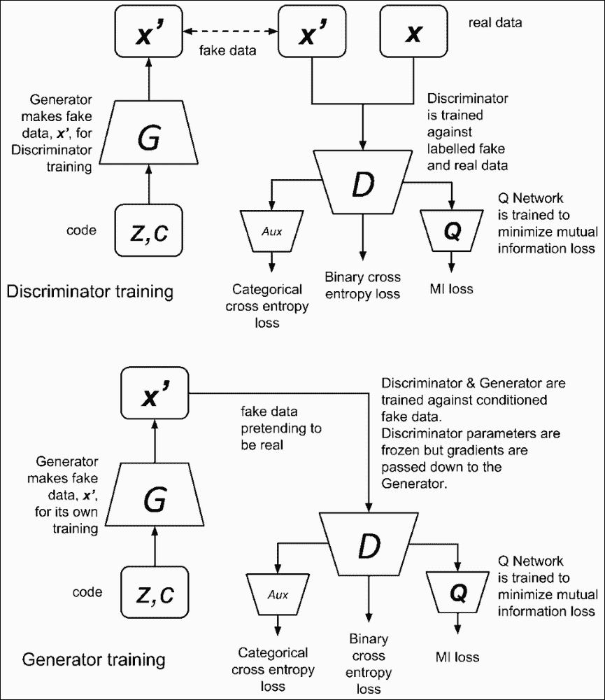

图 6.1.2：展示 InfoGAN 中判别器和生成器训练的网络图

下表展示了 InfoGAN 相对于原始 GAN 的损失函数。InfoGAN 的损失函数相比原始 GAN 多了一个额外的项

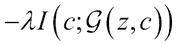

其中

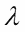

是一个小的正常数。最小化 InfoGAN 的损失函数意味着最小化原始 GAN 的损失并最大化互信息

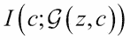

.

| 网络 | 损失函数 | 数字 |
| --- | --- | --- |
| GAN | 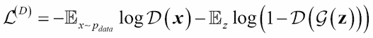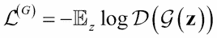 | 4.1.14.1.5 |

| InfoGAN | 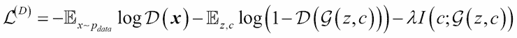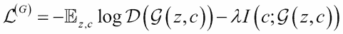对于连续代码，InfoGAN 推荐一个值为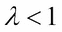。在我们的示例中，我们设置为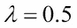。对于离散代码，InfoGAN 推荐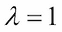

表 6.1.1：GAN 和 InfoGAN 损失函数的比较

. | 6.1.16.1.2 |

如果应用于 MNIST 数据集，InfoGAN 可以学习解缠的离散和连续代码，从而修改生成器的输出属性。例如，像 CGAN 和 ACGAN 一样，离散代码以 10 维独热标签的形式用于指定要生成的数字。然而，我们可以添加两个连续代码，一个用于控制书写风格的角度，另一个用于调整笔画宽度。下图展示了 InfoGAN 中 MNIST 数字的代码。我们保留较小维度的纠缠代码来表示所有其他属性：

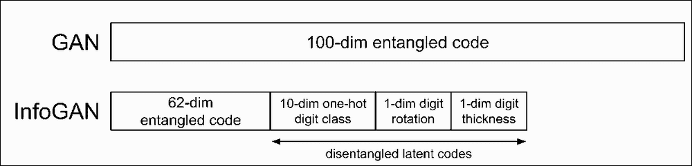

图 6.1.3：在 MNIST 数据集背景下 GAN 和 InfoGAN 的代码

# InfoGAN 在 Keras 中的实现

为了在 MNIST 数据集上实现 InfoGAN，需要对 ACGAN 的基础代码进行一些修改。如以下列表所示，生成器将纠缠的（`z` 噪声代码）和解缠的代码（独热标签和连续代码）拼接起来作为输入。生成器和判别器的构建函数也在 `lib` 文件夹中的 `gan.py` 中实现。

### 注意

完整的代码可以在 GitHub 上找到：

[`github.com/PacktPublishing/Advanced-Deep-Learning-with-Keras`](https://github.com/PacktPublishing/Advanced-Deep-Learning-with-Keras)

列表 6.1.1，`infogan-mnist-6.1.1.py`展示了 InfoGAN 生成器如何将纠缠的和解耦的代码连接在一起作为输入：

```py
def generator(inputs,
              image_size,
              activation='sigmoid',
              labels=None,
              codes=None):
    """Build a Generator Model

    Stack of BN-ReLU-Conv2DTranpose to generate fake images.
    Output activation is sigmoid instead of tanh in [1].
    Sigmoid converges easily.

    # Arguments
        inputs (Layer): Input layer of the generator (the z-vector)
        image_size (int): Target size of one side (assuming square image)
        activation (string): Name of output activation layer
        labels (tensor): Input labels
        codes (list): 2-dim disentangled codes for InfoGAN

    # Returns
        Model: Generator Model
    """
    image_resize = image_size // 4
    # network parameters
    kernel_size = 5
    layer_filters = [128, 64, 32, 1]

    if labels is not None:
        if codes is None:
            # ACGAN labels
            # concatenate z noise vector and one-hot labels
            inputs = [inputs, labels]
        else:
 # infoGAN codes
 # concatenate z noise vector, one-hot labels, 
 # and codes 1 & 2
 inputs = [inputs, labels] + codes
        x = concatenate(inputs, axis=1)
    elif codes is not None:
        # generator 0 of StackedGAN
        inputs = [inputs, codes]
        x = concatenate(inputs, axis=1)
    else:
        # default input is just 100-dim noise (z-code)
        x = inputs

    x = Dense(image_resize * image_resize * layer_filters[0])(x)
    x = Reshape((image_resize, image_resize, layer_filters[0]))(x)

    for filters in layer_filters:
        # first two convolution layers use strides = 2
        # the last two use strides = 1
        if filters > layer_filters[-2]:
            strides = 2
        else:
            strides = 1
        x = BatchNormalization()(x)
        x = Activation('relu')(x)
        x = Conv2DTranspose(filters=filters,
                            kernel_size=kernel_size,
                            strides=strides,
                            padding='same')(x)

    if activation is not None:
        x = Activation(activation)(x)

    # generator output is the synthesized image x
    return Model(inputs, x, name='generator')
```

上面的列表展示了带有原始默认 GAN 输出的判别器和`Q`网络。突出了与离散代码（用于一热标签）`softmax`预测和给定输入 MNIST 数字图像的连续代码概率相对应的三个辅助输出。

列表 6.1.2，`infogan-mnist-6.1.1.py`。InfoGAN 判别器和`Q`网络：

```py
def discriminator(inputs,
                  activation='sigmoid',
                  num_labels=None,
                  num_codes=None):
    """Build a Discriminator Model

    Stack of LeakyReLU-Conv2D to discriminate real from fake
    The network does not converge with BN so it is not used here
    unlike in [1]

    # Arguments
        inputs (Layer): Input layer of the discriminator (the image)
        activation (string): Name of output activation layer
        num_labels (int): Dimension of one-hot labels for ACGAN & InfoGAN
        num_codes (int): num_codes-dim Q network as output 
                    if StackedGAN or 2 Q networks if InfoGAN

    # Returns
        Model: Discriminator Model
    """
    kernel_size = 5
    layer_filters = [32, 64, 128, 256]

    x = inputs
    for filters in layer_filters:
        # first 3 convolution layers use strides = 2
        # last one uses strides = 1
        if filters == layer_filters[-1]:
            strides = 1
        else:
            strides = 2
        x = LeakyReLU(alpha=0.2)(x)
        x = Conv2D(filters=filters,
                   kernel_size=kernel_size,
                   strides=strides,
                   padding='same')(x)

    x = Flatten()(x)
    # default output is probability that the image is real
    outputs = Dense(1)(x)
    if activation is not None:
        print(activation)
        outputs = Activation(activation)(outputs)

    if num_labels:
 # ACGAN and InfoGAN have 2nd output
 # 2nd output is 10-dim one-hot vector of label
 layer = Dense(layer_filters[-2])(x)
 labels = Dense(num_labels)(layer)
 labels = Activation('softmax', name='label')(labels)
 if num_codes is None:
 outputs = [outputs, labels]
 else:
 # InfoGAN have 3rd and 4th outputs
 # 3rd output is 1-dim continous Q of 1st c given x
 code1 = Dense(1)(layer)
 code1 = Activation('sigmoid', name='code1')(code1)

 # 4th output is 1-dim continuous Q of 2nd c given x
 code2 = Dense(1)(layer)
 code2 = Activation('sigmoid', name='code2')(code2)

 outputs = [outputs, labels, code1, code2]
    elif num_codes is not None:
	   # StackedGAN Q0 output
        # z0_recon is reconstruction of z0 normal distribution
        z0_recon =  Dense(num_codes)(x)
        z0_recon = Activation('tanh', name='z0')(z0_recon)
        outputs = [outputs, z0_recon]

 return Model(inputs, outputs, name='discriminator')
```

*图 6.1.4*展示了 Keras 中的 InfoGAN 模型。构建判别器和对抗模型还需要一些更改。更改主要体现在所使用的损失函数上。原始的判别器损失函数是`binary_crossentropy`，用于离散代码的`categorical_crossentropy`，以及针对每个连续代码的`mi_loss`函数，构成了整体损失函数。每个损失函数的权重为 1.0，除了`mi_loss`函数，其权重为 0.5，适用于连续代码。

*列表 6.1.3*突出了所做的更改。然而，我们应该注意到，通过使用构建器函数，判别器的实例化方式如下：

```py
# call discriminator builder with 4 outputs: source, label, 
# and 2 codes
discriminator = gan.discriminator(inputs, num_labels=num_labels, with_codes=True)
```

生成器是通过以下方式创建的：

```py
# call generator with inputs, labels and codes as total inputs 
# to generator
generator = gan.generator(inputs, image_size, labels=labels, codes=[code1, code2])
```

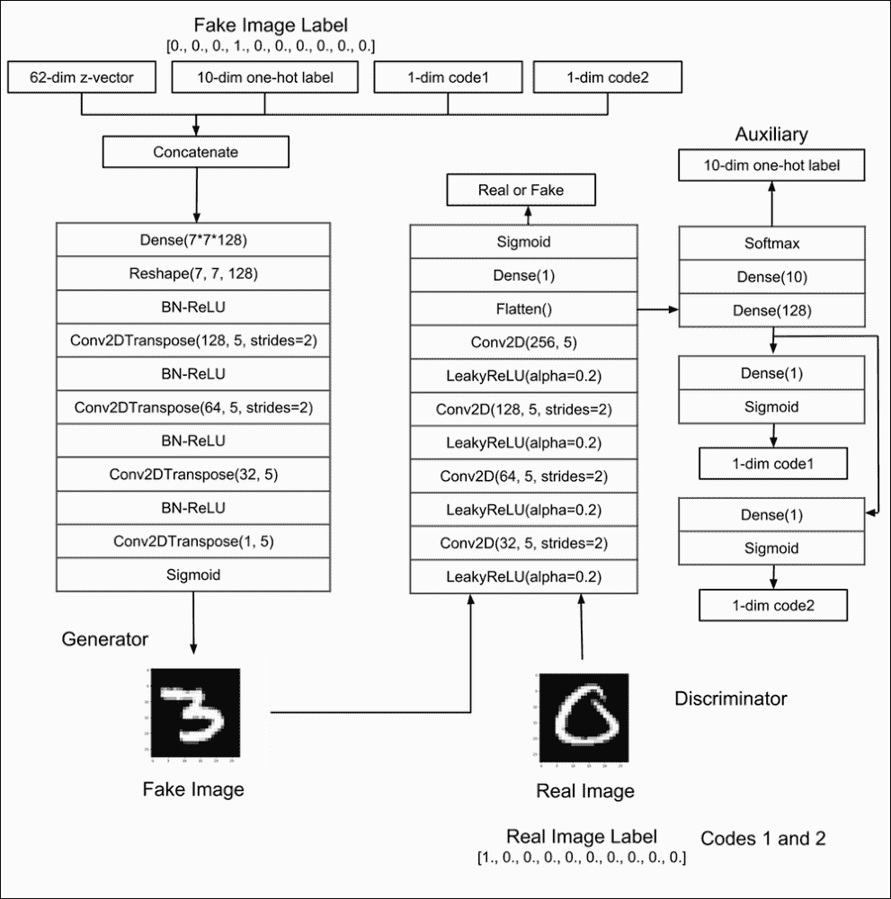

图 6.1.4：InfoGAN Keras 模型

列表 6.1.3，`infogan-mnist-6.1.1.py`展示了在构建 InfoGAN 判别器和对抗网络时使用的互信息损失函数：

```py
def mi_loss(c, q_of_c_given_x):
 """ Mutual information, Equation 5 in [2], assuming H(c) is constant"""
 # mi_loss = -c * log(Q(c|x))
 return K.mean(-K.sum(K.log(q_of_c_given_x + K.epsilon()) * c, axis=1))

def build_and_train_models(latent_size=100):
    # load MNIST dataset
    (x_train, y_train), (_, _) = mnist.load_data()

    # reshape data for CNN as (28, 28, 1) and normalize
    image_size = x_train.shape[1]
    x_train = np.reshape(x_train, [-1, image_size, image_size, 1])
    x_train = x_train.astype('float32') / 255

    # train labels
    num_labels = len(np.unique(y_train))
    y_train = to_categorical(y_train)

    model_name = "infogan_mnist"
    # network parameters
    batch_size = 64
    train_steps = 40000
    lr = 2e-4
    decay = 6e-8
    input_shape = (image_size, image_size, 1)
 label_shape = (num_labels, )
 code_shape = (1, )

    # build discriminator model
    inputs = Input(shape=input_shape, name='discriminator_input')
 # call discriminator builder with 4 outputs: 
 # source, label, and 2 codes
 discriminator = gan.discriminator(inputs,
 num_labels=num_labels,
 num_codes=2)
 # [1] uses Adam, but discriminator converges easily with RMSprop
 optimizer = RMSprop(lr=lr, decay=decay)
 # loss functions: 1) probability image is real (binary crossentropy)
 # 2) categorical cross entropy image label,
 # 3) and 4) mutual information loss
 loss = ['binary_crossentropy', 'categorical_crossentropy', mi_loss, mi_loss]
 # lamda or mi_loss weight is 0.5
 loss_weights = [1.0, 1.0, 0.5, 0.5]
 discriminator.compile(loss=loss,
 loss_weights=loss_weights,
 optimizer=optimizer,
 metrics=['accuracy'])
    discriminator.summary()
    # build generator model
    input_shape = (latent_size, )
 inputs = Input(shape=input_shape, name='z_input')
 labels = Input(shape=label_shape, name='labels')
 code1 = Input(shape=code_shape, name="code1")
 code2 = Input(shape=code_shape, name="code2")
 # call generator with inputs, 
 # labels and codes as total inputs to generator
 generator = gan.generator(inputs,
 image_size,
 labels=labels,
 codes=[code1, code2])
    generator.summary()

    # build adversarial model = generator + discriminator
    optimizer = RMSprop(lr=lr*0.5, decay=decay*0.5)
    discriminator.trainable = False
 # total inputs = noise code, labels, and codes
 inputs = [inputs, labels, code1, code2]
 adversarial = Model(inputs,
 discriminator(generator(inputs)),
 name=model_name)
 # same loss as discriminator
 adversarial.compile(loss=loss,
 loss_weights=loss_weights,
 optimizer=optimizer,
 metrics=['accuracy'])
    adversarial.summary()

    # train discriminator and adversarial networks
    models = (generator, discriminator, adversarial)
    data = (x_train, y_train)
    params = (batch_size, latent_size, train_steps, num_labels, model_name)
    train(models, data, params)
```

就训练而言，我们可以看到 InfoGAN 与 ACGAN 类似，唯一的区别是我们需要为连续代码提供`c`。`c`来自标准差为 0.5、均值为 0.0 的正态分布。对于假数据，我们将使用随机采样的标签，而对于真实数据，我们将使用数据集类标签来表示离散潜在代码。以下列表突出了在训练函数中所做的更改。与之前的所有 GAN 类似，判别器和生成器（通过对抗）交替训练。在对抗训练期间，判别器的权重被冻结。每 500 步间隔使用`gan.py plot_images()`函数保存生成器输出的样本图像。

列表 6.1.4，`infogan-mnist-6.1.1.py`展示了 InfoGAN 的训练函数如何类似于 ACGAN。唯一的区别是我们提供从正态分布中采样的连续代码：

```py
def train(models, data, params):
    """Train the Discriminator and Adversarial networks

    Alternately train discriminator and adversarial networks by batch.
    Discriminator is trained first with real and fake images,
    corresponding one-hot labels and continuous codes.
    Adversarial is trained next with fake images pretending to be real,
    corresponding one-hot labels and continous codes.
    Generate sample images per save_interval.

    # Arguments
        models (Models): Generator, Discriminator, Adversarial models
        data (tuple): x_train, y_train data
        params (tuple): Network parameters
    """
    # the GAN models
    generator, discriminator, adversarial = models
    # images and their one-hot labels
    x_train, y_train = data
    # network parameters
    batch_size, latent_size, train_steps, num_labels, model_name = params
    # the generator image is saved every 500 steps
    save_interval = 500
    # noise vector to see how the generator output evolves 
    # during training
    noise_input = np.random.uniform(-1.0, 1.0, size=[16, latent_size])
    # random class labels and codes
    noise_label = np.eye(num_labels)[np.arange(0, 16) % num_labels]
 noise_code1 = np.random.normal(scale=0.5, size=[16, 1])
 noise_code2 = np.random.normal(scale=0.5, size=[16, 1])
    # number of elements in train dataset
    train_size = x_train.shape[0]
    print(model_name,
          "Labels for generated images: ",
          np.argmax(noise_label, axis=1))

    for i in range(train_steps):
        # train the discriminator for 1 batch
        # 1 batch of real (label=1.0) and fake images (label=0.0)
        # randomly pick real images and corresponding labels from dataset 
        rand_indexes = np.random.randint(0, train_size, size=batch_size)
        real_images = x_train[rand_indexes]
        real_labels = y_train[rand_indexes]
 # random codes for real images
 real_code1 = np.random.normal(scale=0.5, size=[batch_size, 1])
 real_code2 = np.random.normal(scale=0.5, size=[batch_size, 1])
        # generate fake images, labels and codes
        noise = np.random.uniform(-1.0, 1.0, size=[batch_size, latent_size])
        fake_labels = np.eye(num_labels)[np.random.choice(num_labels,
                                                          batch_size)]
 fake_code1 = np.random.normal(scale=0.5, size=[batch_size, 1])
 fake_code2 = np.random.normal(scale=0.5, size=[batch_size, 1])
 inputs = [noise, fake_labels, fake_code1, fake_code2]
        fake_images = generator.predict(inputs)

        # real + fake images = 1 batch of train data
        x = np.concatenate((real_images, fake_images))
        labels = np.concatenate((real_labels, fake_labels))
 codes1 = np.concatenate((real_code1, fake_code1))
 codes2 = np.concatenate((real_code2, fake_code2))

        # label real and fake images
        # real images label is 1.0
        y = np.ones([2 * batch_size, 1])
        # fake images label is 0.0
        y[batch_size:, :] = 0

 # train discriminator network, log the loss and label accuracy
 outputs = [y, labels, codes1, codes2]
 # metrics = ['loss', 'activation_1_loss', 'label_loss',
 # 'code1_loss', 'code2_loss', 'activation_1_acc',
 # 'label_acc', 'code1_acc', 'code2_acc']
 # from discriminator.metrics_names
 metrics = discriminator.train_on_batch(x, outputs)
 fmt = "%d: [discriminator loss: %f, label_acc: %f]"
 log = fmt % (i, metrics[0], metrics[6])

        # train the adversarial network for 1 batch
        # 1 batch of fake images with label=1.0 and
        # corresponding one-hot label or class + random codes
        # since the discriminator weights are frozen in 
        # adversarial network only the generator is trained
        # generate fake images, labels and codes
        noise = np.random.uniform(-1.0, 1.0, size=[batch_size, latent_size])
        fake_labels = np.eye(num_labels)[np.random.choice(num_labels,
                                                          batch_size)]
 fake_code1 = np.random.normal(scale=0.5, size=[batch_size, 1])
 fake_code2 = np.random.normal(scale=0.5, size=[batch_size, 1])
        # label fake images as real
        y = np.ones([batch_size, 1])

        # note that unlike in discriminator training, 
        # we do not save the fake images in a variable
        # the fake images go to the discriminator input of the 
        # adversarial for classification
        # log the loss and label accuracy
 inputs = [noise, fake_labels, fake_code1, fake_code2]
 outputs = [y, fake_labels, fake_code1, fake_code2]
 metrics  = adversarial.train_on_batch(inputs, outputs)
 fmt = "%s [adversarial loss: %f, label_acc: %f]"
 log = fmt % (log, metrics[0], metrics[6])

        print(log)
        if (i + 1) % save_interval == 0:
            if (i + 1) == train_steps:
                show = True
            else:
                show = False

            # plot generator images on a periodic basis
            gan.plot_images(generator,
                            noise_input=noise_input,
                            noise_label=noise_label,
                            noise_codes=[noise_code1, noise_code2],
                            show=show,
                            step=(i + 1),
                            model_name=model_name)

    # save the model after training the generator
    # the trained generator can be reloaded for
    # future MNIST digit generation
    generator.save(model_name + ".h5")
```

# InfoGAN 的生成器输出

类似于我们之前介绍的所有 GAN，我们已将 InfoGAN 训练了 40,000 步。训练完成后，我们可以运行 InfoGAN 生成器，利用保存在`infogan_mnist.h5`文件中的模型生成新的输出。以下是进行的验证：

1.  通过将离散标签从 0 到 9 变化，生成数字 0 到 9\. 两个连续编码都设置为零。结果如 *图 6.1.5* 所示。我们可以看到，InfoGAN 的离散编码能够控制生成器生成的数字：

    ```py
    python3 infogan-mnist-6.1.1.py --generator=infogan_mnist.h5 --digit=0 --code1=0 --code2=0
    ```

    到

    ```py
    python3 infogan-mnist-6.1.1.py --generator=infogan_mnist.h5 --digit=9 --code1=0 --code2=0

    ```

1.  检查第一个连续编码的效果，了解哪个属性受到了影响。我们将第一个连续编码从 -2.0 变化到 2.0，数字从 0 到 9\. 第二个连续编码设置为 0.0\. *图 6.1.6* 显示第一个连续编码控制数字的粗细：

    ```py
    python3 infogan-mnist-6.1.1.py --generator=infogan_mnist.h5 --digit=0 --code1=0 --code2=0 --p1

    ```

1.  与前一步骤类似，但重点更多放在第二个连续编码上。*图 6.1.7* 显示第二个连续编码控制书写风格的旋转角度（倾斜）：

    ```py
    python3 infogan-mnist-6.1.1.py --generator=infogan_mnist.h5 --digit=0 --code1=0 --code2=0 --p2

    ```

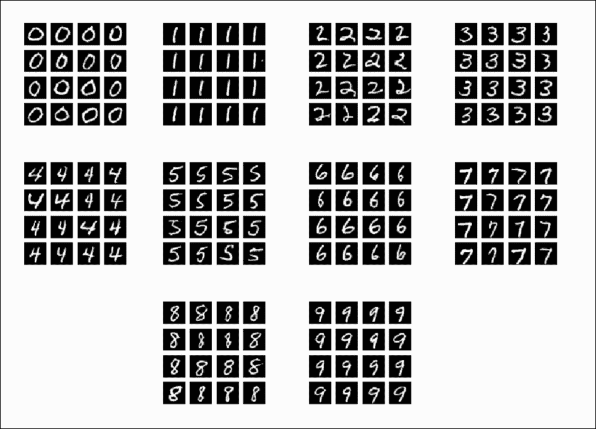

图 6.1.5：InfoGAN 生成的图像，当离散编码从 0 变化到 9 时。两个连续编码都设置为零。

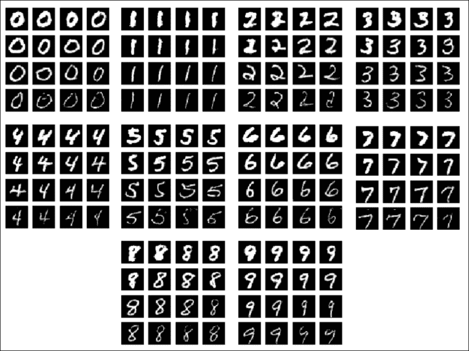

图 6.1.6：InfoGAN 生成的图像，当第一个连续编码从 -2.0 变化到 2.0 时，数字从 0 到 9\. 第二个连续编码设置为零。第一个连续编码控制数字的粗细。

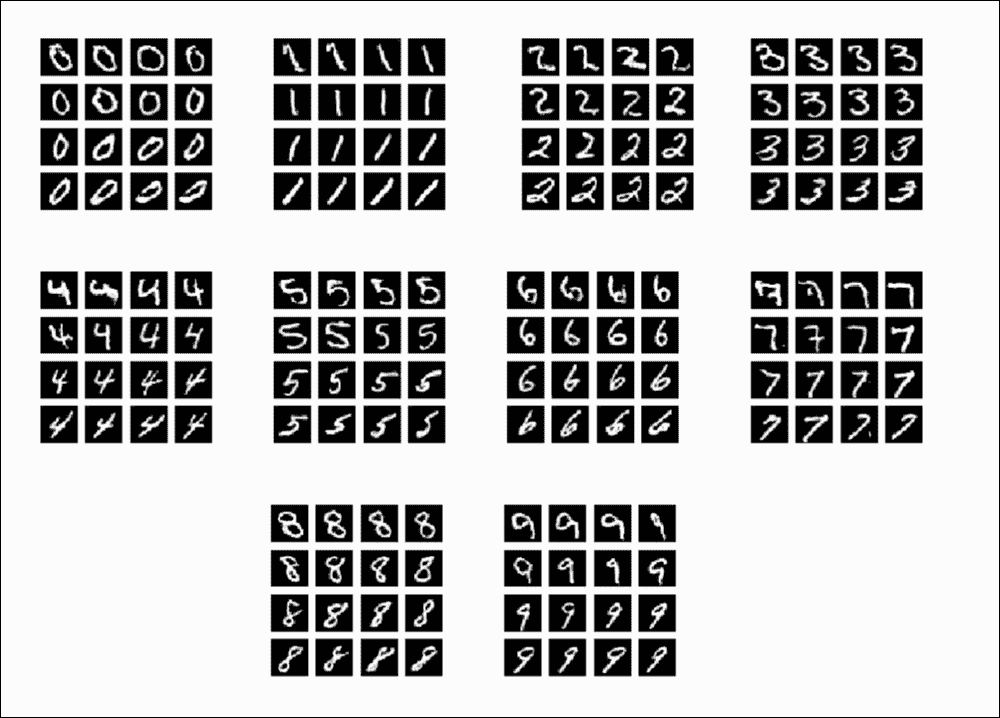

图 6.1.7：InfoGAN 生成的图像，当第二个连续编码从 -2.0 变化到 2.0 时，数字从 0 到 9\. 第一个连续编码设置为零。第二个连续编码控制书写风格的旋转角度（倾斜）。

从这些验证结果中，我们可以看到，除了能够生成类似 MNIST 的数字外，InfoGAN 扩展了条件 GAN（如 CGAN 和 ACGAN）的能力。网络自动学习了两个任意编码，可以控制生成器输出的特定属性。如果我们将连续编码的数量增加到超过 2 个，看看还能控制哪些其他属性，将会很有趣。

# StackedGAN

与 InfoGAN 同样的理念，StackedGAN 提出了通过分解潜在表示来调整生成器输出条件的方法。然而，StackedGAN 采用了不同的方式来解决这一问题。StackedGAN 并非学习如何调整噪声以产生所需的输出，而是将 GAN 拆解成一堆 GAN。每个 GAN 都以通常的鉴别器对抗方式独立训练，并拥有自己的潜在编码。

*图 6.2.1* 向我们展示了 StackedGAN 如何在假设的名人面部生成背景下工作。假设 *编码器* 网络经过训练，能够分类名人面孔。

*编码器* 网络由一堆简单的编码器组成，*编码器* `i` *其中 i = 0 … n - 1* 对应于 `n` 个特征。每个编码器提取某些面部特征。例如，*编码器*[0] 可能是用于发型特征的编码器，*特征*1。所有简单的编码器共同作用，使得整个 *编码器* 能正确预测。

StackedGAN 背后的思想是，如果我们想要构建一个生成虚假名人面孔的 GAN，我们应该简单地反转*编码器*。StackedGAN 由一堆简单的 GAN 组成，GAN[i]，其中 i = 0 … `n` - 1 对应`n`个特征。每个 GAN[i]学习反转其对应编码器*编码器*[i]的过程。例如，*GAN*[0]从虚假的发型特征生成虚假的名人面孔，这是*编码器*[0]过程的反转。

每个*GAN*[i]使用一个潜在代码`zᵢ`，它决定生成器的输出。例如，潜在代码`z₀`可以将发型从卷发改变为波浪发型。GAN 堆叠也可以作为一个整体，用来合成虚假的名人面孔，完成整个*编码器*的反向过程。每个*GAN*[i]的潜在代码`zᵢ`可用于改变虚假名人面孔的特定属性：

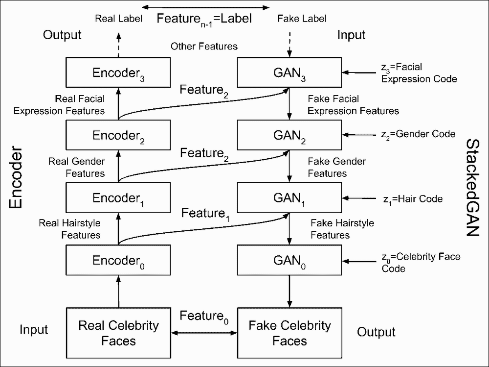

图 6.2.1：在生成名人面孔的背景下，StackedGAN 的基本思想。假设存在一个假设的深度编码器网络，能够对名人面孔进行分类，StackedGAN 只是反转编码器的过程。

# 在 Keras 中实现 StackedGAN

StackedGAN 的详细网络模型可以在下图中看到。为了简洁起见，每个堆叠中仅显示了两个编码器-GAN。图看起来可能很复杂，但它只是编码器-GAN 的重复。换句话说，如果我们理解了如何训练一个编码器-GAN，那么其他的也遵循相同的概念。在接下来的部分中，我们假设 StackedGAN 是为 MNIST 数字生成设计的：

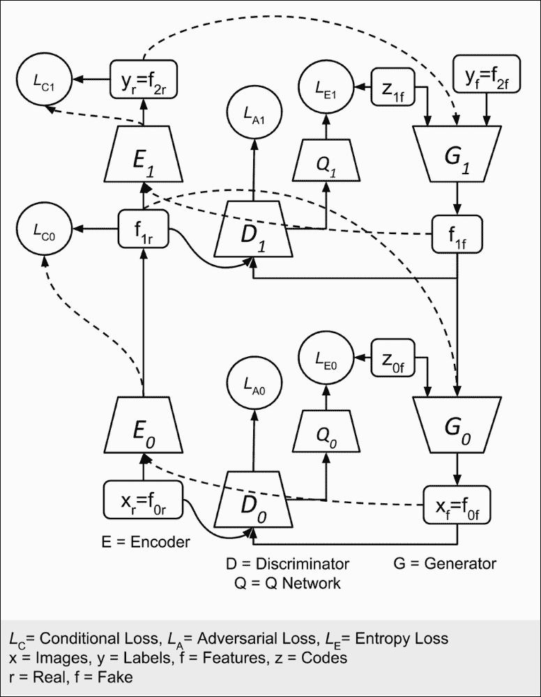

图 6.2.2：StackedGAN 由编码器和 GAN 的堆叠组成。编码器经过预训练，用于执行分类任务。*生成器*[1]，`G₁`，学习基于虚假标签`y[f]`和潜在代码`z₁`[f]合成`f₁`[f]特征。*生成器*[0]，`G₀`，使用虚假特征`f₁`[f]和潜在代码`z₀`[f]生成虚假图像。

StackedGAN 以*编码器*开始。它可以是一个经过训练的分类器，用于预测正确的标签。中间特征向量`f₁`[r]可用于 GAN 训练。对于 MNIST，我们可以使用类似于第一章中讨论的基于 CNN 的分类器，*使用 Keras 介绍深度学习*。下图显示了*编码器*及其在 Keras 中的网络模型实现：

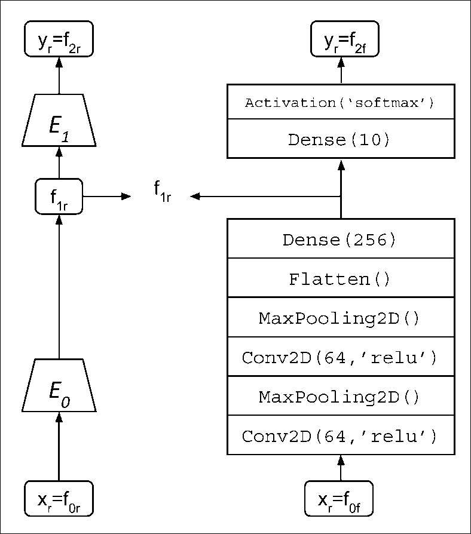

图 6.2.3：StackedGAN 中的编码器是一个简单的基于 CNN 的分类器

*列表* *6.2.1*展示了前图的 Keras 代码。它类似于第一章中的基于 CNN 的分类器，*Keras 的高级深度学习介绍*，除了我们使用`Dense`层提取 256 维特征。这里有两个输出模型，*Encoder*[0]和*Encoder*[1]。两者都将用于训练 StackedGAN。

*Encoder*[0]的输出，`f₀`[r]，是我们希望*Generator*[1]学习合成的 256 维特征向量。它作为*Encoder*[0]的辅助输出，`E₀`。整体的*Encoder*被训练用于分类 MNIST 数字，`x` [r]。正确的标签，`y` [r]，由*Encoder*[1]，`E₁`预测。在此过程中，中间特征集，`f₁``r`，被学习并可用于*Generator*[0]的训练。在训练 GAN 时，子脚本`r`用于强调并区分真实数据与假数据。

列表 6.2.1，`stackedgan-mnist-6.2.1.py`展示了在 Keras 中实现的编码器：

```py
def build_encoder(inputs, num_labels=10, feature1_dim=256):
    """ Build the Classifier (Encoder) Model sub networks

    Two sub networks: 
    1) Encoder0: Image to feature1 (intermediate latent feature)
    2) Encoder1: feature1 to labels

    # Arguments
        inputs (Layers): x - images, feature1 - feature1 layer output
        num_labels (int): number of class labels
        feature1_dim (int): feature1 dimensionality

    # Returns
        enc0, enc1 (Models): Description below 
    """
    kernel_size = 3
    filters = 64

    x, feature1 = inputs
    # Encoder0 or enc0
    y = Conv2D(filters=filters,
               kernel_size=kernel_size,
               padding='same',
               activation='relu')(x)
    y = MaxPooling2D()(y)
    y = Conv2D(filters=filters,
               kernel_size=kernel_size,
               padding='same',
               activation='relu')(y)
    y = MaxPooling2D()(y)
    y = Flatten()(y)
    feature1_output = Dense(feature1_dim, activation='relu')(y)
    # Encoder0 or enc0: image to feature1 
    enc0 = Model(inputs=x, outputs=feature1_output, name="encoder0")

    # Encoder1 or enc1
    y = Dense(num_labels)(feature1)
    labels = Activation('softmax')(y)
    # Encoder1 or enc1: feature1 to class labels
    enc1 = Model(inputs=feature1, outputs=labels, name="encoder1")

    # return both enc0 and enc1
    return enc0, enc1
```

| 网络 | 损失函数 | 编号 |
| --- | --- | --- |
| GAN | 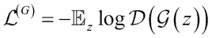 | 4.1.14.1.5 |
| StackedGAN | 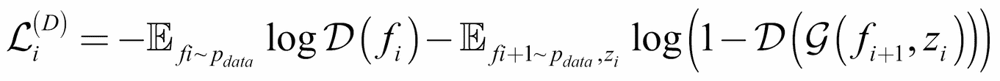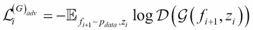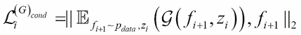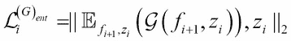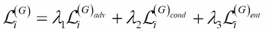其中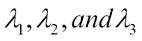是权重，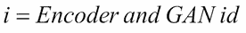 | 6.2.16.2.26.2.36.2.46.2.5 |

> 表 6.2.1：GAN 与 StackedGAN 损失函数的比较。~`p` [data]表示从相应的编码器数据（输入、特征或输出）中采样。

给定*Encoder*输入（`x[r]`）中间特征（`f`1`r`）和标签（`y` `r`），每个 GAN 按照常规的鉴别器—对抗性方式进行训练。损失函数由*方程* *6.2.1*至*6.2.5*在*表 6.2.1*中给出。方程*6.2.1*和*6.2.2*是通用 GAN 的常规损失函数。StackedGAN 有两个额外的损失函数，**条件**和**熵**。

条件损失函数，

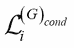

在*方程 6.2.3*中，确保生成器在合成输出`fᵢ`时不会忽略输入`f[i+1]`，即使在输入噪声代码`zᵢ`的情况下。编码器，*编码器*[i]，必须能够通过逆转生成器*生成器*[i]的过程来恢复生成器输入。生成器输入与通过编码器恢复的输入之间的差异由*L2*或欧几里得距离**均方误差**（**MSE**）衡量。*图 6.2.4*展示了参与计算的网络元素！StackedGAN 在 Keras 中的实现:

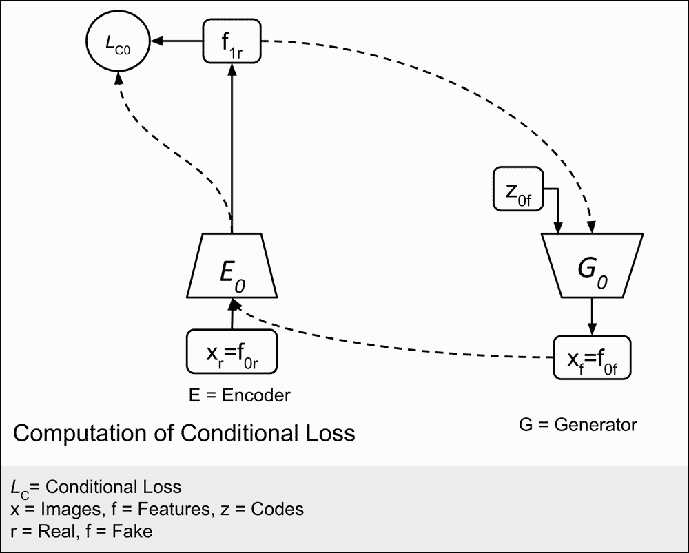

图 6.2.4：图 6.2.3 的简化版本，仅显示参与计算的网络元素！StackedGAN 在 Keras 中的实现

然而，条件损失函数引入了一个新问题。生成器忽略输入的噪声代码，`z` `i`，并仅依赖于`f` [i+1]。熵损失函数，

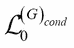

在*方程* *6.2.4*中，确保生成器不忽略噪声代码，`z` `i`。`Q`网络从生成器的输出中恢复噪声代码。恢复的噪声与输入噪声之间的差异也通过*L2*或均方误差（MSE）进行测量。下图展示了参与计算的网络元素

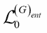

:

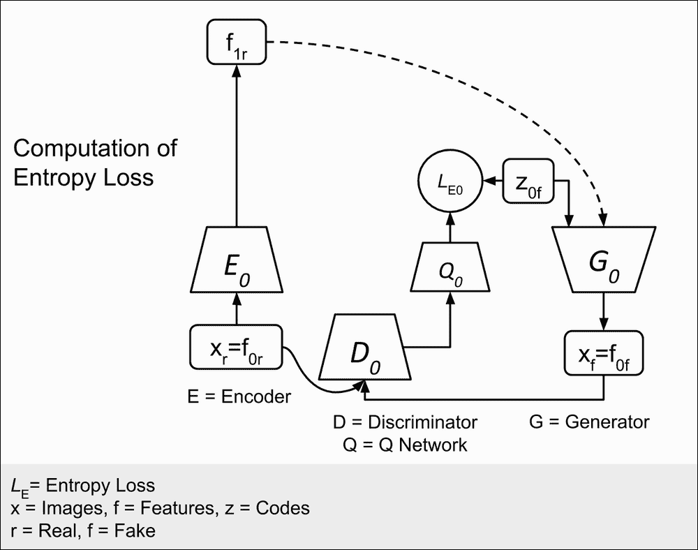

图 6.2.5：图 6.2.3 的简化版本，仅展示了参与计算的网络元素


最后一个损失函数与通常的 GAN 损失相似。它由一个判别器损失组成

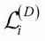

以及一个生成器（通过对抗）损失

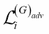

下图展示了我们 GAN 损失中涉及的元素：

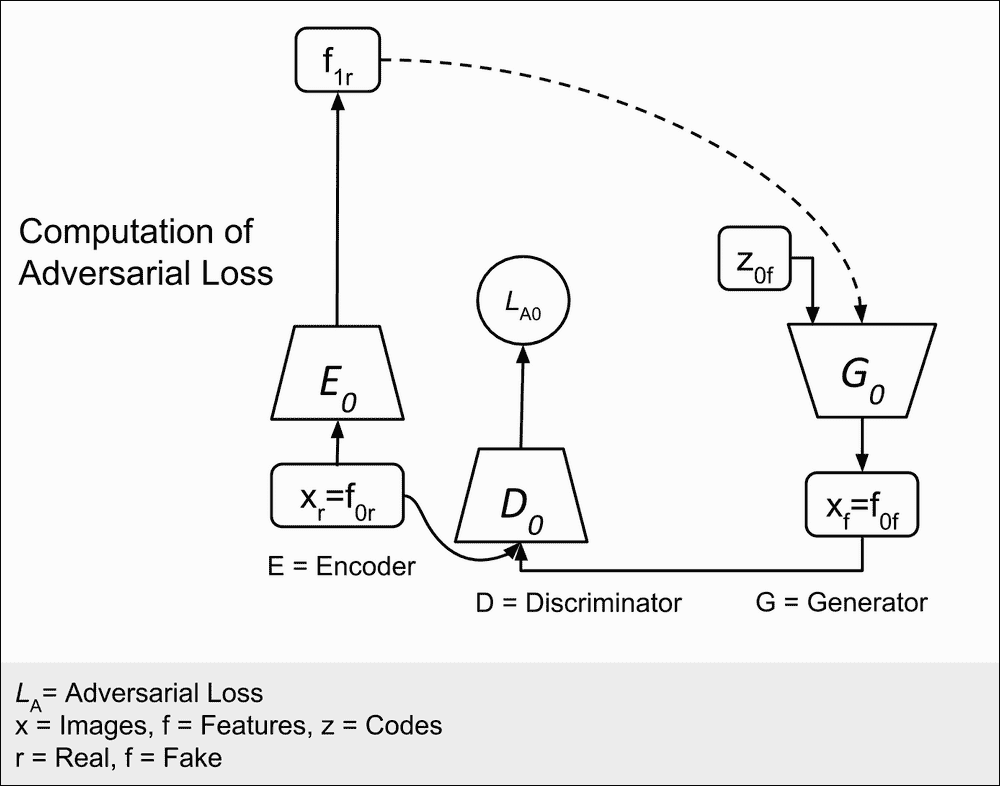

图 6.2.6：图 6.2.3 的简化版本，仅展示了参与计算的网络元素


和


在*方程* *6.2.5*中，三个生成器损失函数的加权和是最终的生成器损失函数。在我们将要展示的 Keras 代码中，所有权重都设置为 1.0，除了熵损失设置为 10.0。*方程 6.2.1*至*方程 6.2.5*中，`i`表示编码器和 GAN 组 ID 或层级。在原始论文中，网络首先独立训练，然后进行联合训练。在独立训练期间，先训练编码器。在联合训练期间，使用真实数据和伪造数据。

StackedGAN 的生成器和判别器的实现仅需对 Keras 作少量修改，以便提供辅助点以访问中间特征。*图 6.2.7*展示了生成器 Keras 模型。*列表 6.2.2*阐明了构建两个生成器的函数（`gen0` 和 `gen1`），它们分别对应 *生成器*0 和 *生成器*1。`gen1`生成器由三个`Dense`层组成，标签和噪声编码 `z`1`f` 作为输入。第三层生成伪造的 `f₁``f` 特征。`gen0`生成器与我们之前介绍的其他 GAN 生成器相似，可以通过`gan.py`中的生成器构建器进行实例化：

```py
# gen0: feature1 + z0 to feature0 (image)
gen0 = gan.generator(feature1, image_size, codes=z0)
```

`gen0` 输入是 `f` 特征和噪声编码 `z`。[0] 输出是生成的伪造图像，`x[`f`]`：

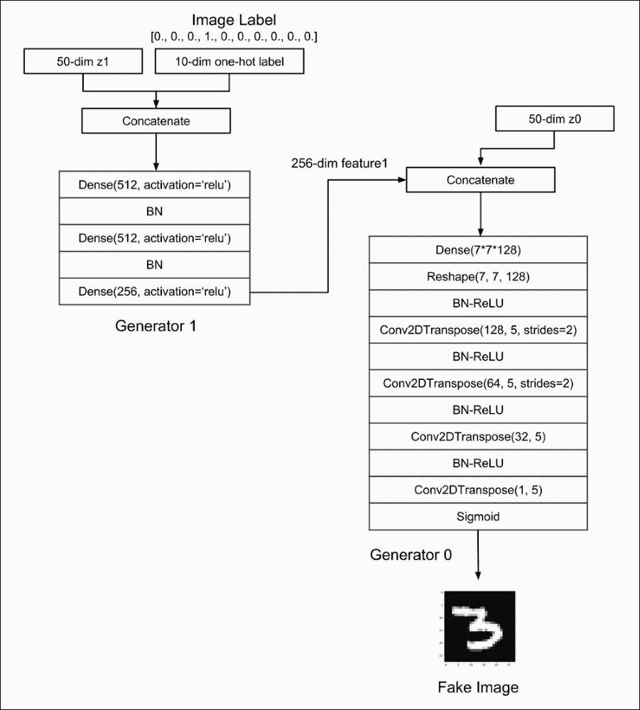

图 6.2.7：Keras 中的 StackedGAN 生成器模型

列表 6.2.2，`stackedgan-mnist-6.2.1.py`展示了我们在 Keras 中实现生成器的代码：

```py
def build_generator(latent_codes, image_size, feature1_dim=256):
    """Build Generator Model sub networks

    Two sub networks: 1) Class and noise to feature1 (intermediate feature)
    2) feature1 to image

    # Arguments
        latent_codes (Layers): discrete code (labels), noise and feature1 features
        image_size (int): Target size of one side (assuming square image)
        feature1_dim (int): feature1 dimensionality

    # Returns
        gen0, gen1 (Models): Description below
    """

    # Latent codes and network parameters
    labels, z0, z1, feature1 = latent_codes
    # image_resize = image_size // 4
    # kernel_size = 5
    # layer_filters = [128, 64, 32, 1]

    # gen1 inputs
    inputs = [labels, z1]      # 10 + 50 = 62-dim
    x = concatenate(inputs, axis=1)
    x = Dense(512, activation='relu')(x)
    x = BatchNormalization()(x)
    x = Dense(512, activation='relu')(x)
    x = BatchNormalization()(x)
    fake_feature1 = Dense(feature1_dim, activation='relu')(x)
    # gen1: classes and noise (feature2 + z1) to feature1
    gen1 = Model(inputs, fake_feature1, name='gen1')

    # gen0: feature1 + z0 to feature0 (image)
    gen0 = gan.generator(feature1, image_size, codes=z0)

    return gen0, gen1
```

*图 6.2.8*展示了判别器 Keras 模型。我们提供了构建 *判别器*[0] 和 *判别器*[1] (`dis0` 和 `dis1`) 的函数。`dis0` 判别器与 GAN 判别器相似，只是输入是特征向量，并且有辅助网络 `Q₀` 来恢复 `z₀`。`gan.py` 中的构建器函数用于创建 `dis0`：

```py
dis0 = gan.discriminator(inputs, num_codes=z_dim)
```

`dis1`判别器由三层 MLP 组成，如*列表* *6.2.3*所示。最后一层用于区分真实与伪造的 `f₁`。`Q₁` 网络共享 `dis1` 的前两层。其第三层恢复 `z₁`：

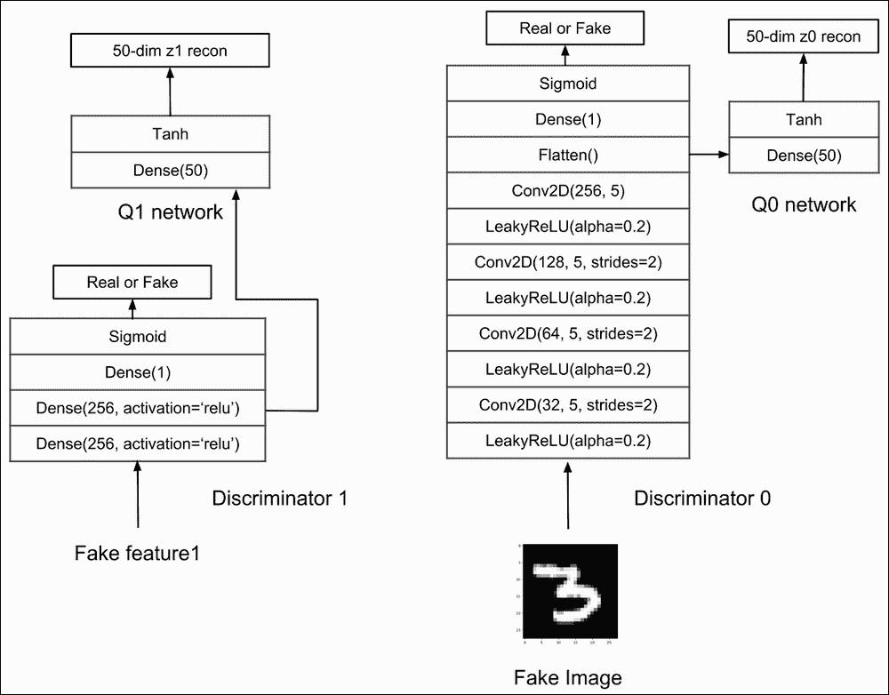

图 6.2.8：Keras 中的 StackedGAN 判别器模型

列表 6.2.3，`stackedgan-mnist-6.2.1.py`展示了*判别器*[1]在 Keras 中的实现：

```py
def build_discriminator(inputs, z_dim=50):
    """Build Discriminator 1 Model

    Classifies feature1 (features) as real/fake image and recovers
    the input noise or latent code (by minimizing entropy loss)

    # Arguments
        inputs (Layer): feature1
        z_dim (int): noise dimensionality

    # Returns
        dis1 (Model): feature1 as real/fake and recovered latent code
    """

    # input is 256-dim feature1
    x = Dense(256, activation='relu')(inputs)
    x = Dense(256, activation='relu')(x)

    # first output is probability that feature1 is real
    f1_source = Dense(1)(x)
    f1_source = Activation('sigmoid', name='feature1_source')(f1_source)

    # z1 reonstruction (Q1 network)
    z1_recon = Dense(z_dim)(x)
    z1_recon = Activation('tanh', name='z1')(z1_recon)

    discriminator_outputs = [f1_source, z1_recon]
    dis1 = Model(inputs, discriminator_outputs, name='dis1')
    return dis1 
```

所有构建器函数可用后，StackedGAN 在*列表* *6.2.4* 中组装完成。在训练 StackedGAN 之前，需要先预训练编码器。注意，我们已经将三个生成器损失函数（对抗性、条件性和熵）融入到对抗模型训练中。`Q`-Network 与判别器模型共享一些公共层。因此，它的损失函数也会在判别器模型训练中包含。

列表 6.2.4，`stackedgan-mnist-6.2.1.py`。在 Keras 中构建 StackedGAN：

```py
def build_and_train_models():
    # load MNIST dataset
    (x_train, y_train), (x_test, y_test) = mnist.load_data()

    # reshape and normalize images
    image_size = x_train.shape[1]
    x_train = np.reshape(x_train, [-1, image_size, image_size, 1])
    x_train = x_train.astype('float32') / 255

    x_test = np.reshape(x_test, [-1, image_size, image_size, 1])
    x_test = x_test.astype('float32') / 255

    # number of labels
    num_labels = len(np.unique(y_train))
    # to one-hot vector
    y_train = to_categorical(y_train)
    y_test = to_categorical(y_test)

    model_name = "stackedgan_mnist"
    # network parameters
    batch_size = 64
    train_steps = 40000
    lr = 2e-4
    decay = 6e-8
    input_shape = (image_size, image_size, 1)
    label_shape = (num_labels, )
    z_dim = 50
    z_shape = (z_dim, )
    feature1_dim = 256
    feature1_shape = (feature1_dim, )

    # build discriminator 0 and Q network 0 models
    inputs = Input(shape=input_shape, name='discriminator0_input')
    dis0 = gan.discriminator(inputs, num_codes=z_dim)
    # [1] uses Adam, but discriminator converges easily with RMSprop
    optimizer = RMSprop(lr=lr, decay=decay)
    # loss fuctions: 1) probability image is real (adversarial0 loss)
    # 2) MSE z0 recon loss (Q0 network loss or entropy0 loss)
    loss = ['binary_crossentropy', 'mse']
    loss_weights = [1.0, 10.0]
    dis0.compile(loss=loss,
                 loss_weights=loss_weights,
                 optimizer=optimizer,
                 metrics=['accuracy'])
    dis0.summary() # image discriminator, z0 estimator 

    # build discriminator 1 and Q network 1 models
    input_shape = (feature1_dim, )
    inputs = Input(shape=input_shape, name='discriminator1_input')
    dis1 = build_discriminator(inputs, z_dim=z_dim )
    # loss fuctions: 1) probability feature1 is real (adversarial1 loss)
    # 2) MSE z1 recon loss (Q1 network loss or entropy1 loss)
    loss = ['binary_crossentropy', 'mse']
    loss_weights = [1.0, 1.0]
    dis1.compile(loss=loss,
                 loss_weights=loss_weights,
                 optimizer=optimizer,
                 metrics=['accuracy'])
    dis1.summary() # feature1 discriminator, z1 estimator

    # build generator models
    feature1 = Input(shape=feature1_shape, name='feature1_input')
    labels = Input(shape=label_shape, name='labels')
    z1 = Input(shape=z_shape, name="z1_input")
    z0 = Input(shape=z_shape, name="z0_input")
    latent_codes = (labels, z0, z1, feature1)
    gen0, gen1 = build_generator(latent_codes, image_size)
    gen0.summary() # image generator 
    gen1.summary() # feature1 generator

    # build encoder models
    input_shape = (image_size, image_size, 1)
    inputs = Input(shape=input_shape, name='encoder_input')
    enc0, enc1 = build_encoder((inputs, feature1), num_labels)
    enc0.summary() # image to feature1 encoder
    enc1.summary() # feature1 to labels encoder (classifier)
    encoder = Model(inputs, enc1(enc0(inputs)))
    encoder.summary() # image to labels encoder (classifier)

    data = (x_train, y_train), (x_test, y_test)
    train_encoder(encoder, data, model_name=model_name)

    # build adversarial0 model =
    # generator0 + discriminator0 + encoder0
    optimizer = RMSprop(lr=lr*0.5, decay=decay*0.5)
    # encoder0 weights frozen
    enc0.trainable = False
    # discriminator0 weights frozen
    dis0.trainable = False
    gen0_inputs = [feature1, z0]
    gen0_outputs = gen0(gen0_inputs)
    adv0_outputs = dis0(gen0_outputs) + [enc0(gen0_outputs)]
    # feature1 + z0 to prob feature1 is 
    # real + z0 recon + feature0/image recon
    adv0 = Model(gen0_inputs, adv0_outputs, name="adv0")
    # loss functions: 1) prob feature1 is real (adversarial0 loss)
    # 2) Q network 0 loss (entropy0 loss)
    # 3) conditional0 loss
    loss = ['binary_crossentropy', 'mse', 'mse']
    loss_weights = [1.0, 10.0, 1.0]
    adv0.compile(loss=loss,
                 loss_weights=loss_weights,
                 optimizer=optimizer,
                 metrics=['accuracy'])
    adv0.summary()

    # build adversarial1 model = 
    # generator1 + discriminator1 + encoder1
    # encoder1 weights frozen
    enc1.trainable = False
    # discriminator1 weights frozen
    dis1.trainable = False
    gen1_inputs = [labels, z1]
    gen1_outputs = gen1(gen1_inputs)
    adv1_outputs = dis1(gen1_outputs) + [enc1(gen1_outputs)]
    # labels + z1 to prob labels are real + z1 recon + feature1 recon
    adv1 = Model(gen1_inputs, adv1_outputs, name="adv1")
    # loss functions: 1) prob labels are real (adversarial1 loss)
    # 2) Q network 1 loss (entropy1 loss)
    # 3) conditional1 loss (classifier error)
    loss_weights = [1.0, 1.0, 1.0]
    loss = ['binary_crossentropy', 'mse', 'categorical_crossentropy']
    adv1.compile(loss=loss,
                 loss_weights=loss_weights,
                 optimizer=optimizer,
                 metrics=['accuracy'])
    adv1.summary()

    # train discriminator and adversarial networks
    models = (enc0, enc1, gen0, gen1, dis0, dis1, adv0, adv1)
    params = (batch_size, train_steps, num_labels, z_dim, model_name)
    train(models, data, params)
```

最后，训练函数与典型的 GAN 训练相似，只是我们一次只训练一个 GAN（即 *GAN*[1] 然后是 *GAN*[0]）。代码显示在*列表* *6.2.5*中。值得注意的是，训练顺序是：

1.  *判别器*[1] 和 `Q₁` 网络通过最小化判别器和熵损失

1.  *判别器*[0] 和 `Q₀` 网络通过最小化判别器和熵损失

1.  *对抗性*网络通过最小化对抗性、熵和条件损失

1.  *对抗性*网络通过最小化对抗性、熵和条件损失

列表 6.2.5，`stackedgan-mnist-6.2.1.py`展示了我们在 Keras 中训练 StackedGAN 的代码：

```py
def train(models, data, params):
    """Train the discriminator and adversarial Networks

    Alternately train discriminator and adversarial networks by batch.
    Discriminator is trained first with real and fake images,
    corresponding one-hot labels and latent codes.
    Adversarial is trained next with fake images pretending to be real,
    corresponding one-hot labels and latent codes.
    Generate sample images per save_interval.

    # Arguments
        models (Models): Encoder, Generator, Discriminator, Adversarial models
        data (tuple): x_train, y_train data
        params (tuple): Network parameters

    """
    # the StackedGAN and Encoder models
    enc0, enc1, gen0, gen1, dis0, dis1, adv0, adv1 = models
    # network parameters
    batch_size, train_steps, num_labels, z_dim, model_name = params
    # train dataset
    (x_train, y_train), (_, _) = data
    # the generator image is saved every 500 steps
    save_interval = 500

    # label and noise codes for generator testing
    z0 = np.random.normal(scale=0.5, size=[16, z_dim])
    z1 = np.random.normal(scale=0.5, size=[16, z_dim])
    noise_class = np.eye(num_labels)[np.arange(0, 16) % num_labels]
    noise_params = [noise_class, z0, z1]
    # number of elements in train dataset
    train_size = x_train.shape[0]
    print(model_name,
          "Labels for generated images: ",
          np.argmax(noise_class, axis=1))

    for i in range(train_steps):
        # train the discriminator1 for 1 batch
        # 1 batch of real (label=1.0) and fake feature1 (label=0.0)
        # randomly pick real images from dataset
        rand_indexes = np.random.randint(0, train_size, size=batch_size)
        real_images = x_train[rand_indexes]
        # real feature1 from encoder0 output
        real_feature1 = enc0.predict(real_images)
        # generate random 50-dim z1 latent code
        real_z1 = np.random.normal(scale=0.5, size=[batch_size, z_dim])
        # real labels from dataset
        real_labels = y_train[rand_indexes]

        # generate fake feature1 using generator1 from
        # real labels and 50-dim z1 latent code
        fake_z1 = np.random.normal(scale=0.5, size=[batch_size, z_dim])
        fake_feature1 = gen1.predict([real_labels, fake_z1])

        # real + fake data
        feature1 = np.concatenate((real_feature1, fake_feature1))
        z1 = np.concatenate((fake_z1, fake_z1))

        # label 1st half as real and 2nd half as fake
        y = np.ones([2 * batch_size, 1])
        y[batch_size:, :] = 0

        # train discriminator1 to classify feature1 
        # as real/fake and recover
        # latent code (z1). real = from encoder1, 
        # fake = from genenerator1 
        # joint training using discriminator part of advserial1 loss
        # and entropy1 loss
        metrics = dis1.train_on_batch(feature1, [y, z1])
        # log the overall loss only (fr dis1.metrics_names)
        log = "%d: [dis1_loss: %f]" % (i, metrics[0])

        # train the discriminator0 for 1 batch
        # 1 batch of real (label=1.0) and fake images (label=0.0)
        # generate random 50-dim z0 latent code
        fake_z0 = np.random.normal(scale=0.5, size=[batch_size, z_dim])
        # generate fake images from real feature1 and fake z0
        fake_images = gen0.predict([real_feature1, fake_z0])

        # real + fake data
        x = np.concatenate((real_images, fake_images))
        z0 = np.concatenate((fake_z0, fake_z0))

        # train discriminator0 to classify image as real/fake and recover
        # latent code (z0)
        # joint training using discriminator part of advserial0 loss
        # and entropy0 loss
        metrics = dis0.train_on_batch(x, [y, z0])
        # log the overall loss only (fr dis0.metrics_names)
        log = "%s [dis0_loss: %f]" % (log, metrics[0])

        # adversarial training 
        # generate fake z1, labels
        fake_z1 = np.random.normal(scale=0.5, size=[batch_size, z_dim])
        # input to generator1 is sampling fr real labels and
        # 50-dim z1 latent code
        gen1_inputs = [real_labels, fake_z1]

        # label fake feature1 as real
        y = np.ones([batch_size, 1])

        # train generator1 (thru adversarial) by 
        # fooling the discriminator
        # and approximating encoder1 feature1 generator
        # joint training: adversarial1, entropy1, conditional1
        metrics = adv1.train_on_batch(gen1_inputs, [y, fake_z1, real_labels])
        fmt = "%s [adv1_loss: %f, enc1_acc: %f]"
        # log the overall loss and classification accuracy
        log = fmt % (log, metrics[0], metrics[6])

        # input to generator0 is real feature1 and 
        # 50-dim z0 latent code
        fake_z0 = np.random.normal(scale=0.5, size=[batch_size, z_dim])
        gen0_inputs = [real_feature1, fake_z0]

        # train generator0 (thru adversarial) by 
        # fooling the discriminator
        # and approximating encoder1 image source generator
        # joint training: adversarial0, entropy0, conditional0
        metrics = adv0.train_on_batch(gen0_inputs, [y, fake_z0, real_feature1])
        # log the overall loss only
        log = "%s [adv0_loss: %f]" % (log, metrics[0])

        print(log)
        if (i + 1) % save_interval == 0:
            if (i + 1) == train_steps:
                show = True
            else:
                show = False
            generators = (gen0, gen1)
            plot_images(generators,
                        noise_params=noise_params,
                        show=show,
                        step=(i + 1),
                        model_name=model_name)

    # save the modelis after training generator0 & 1
    # the trained generator can be reloaded for
    # future MNIST digit generation
    gen1.save(model_name + "-gen1.h5")
    gen0.save(model_name + "-gen0.h5")
```

# StackedGAN 的生成器输出

经过 10,000 步的训练后，StackedGAN 的*Generator*[0]和*Generator*[1]模型被保存到文件中。将*Generator*[0]和*Generator*[1]堆叠在一起，可以基于标签和噪声代码`z₀`和`z₁`合成虚假图像。

可以通过以下方式定性验证 StackedGAN 生成器：

1.  让离散标签从 0 到 9 变化，同时两个噪声代码，`z₀`和`z₁`，从均值为 0.5，标准差为 1.0 的正态分布中抽取样本。结果如*图 6.2.9*所示。我们可以看到，StackedGAN 的离散代码能够控制生成器生成的数字：

    ```py
    python3 stackedgan-mnist-6.2.1.py 
    --generator0=stackedgan_mnist-gen0.h5 
    --generator1=stackedgan_mnist-gen1.h5 --digit=0
    python3 stackedgan-mnist-6.2.1.py 
    --generator0=stackedgan_mnist-gen0.h5 
    --generator1=stackedgan_mnist-gen1.h5 --digit=9

    ```

    到

1.  让第一个噪声代码，`z₀`，作为常量向量从-4.0 变化到 4.0，用于数字 0 到 9，如下所示。第二个噪声代码，`z₀`，设置为零向量。*图 6.2.10*显示第一个噪声代码控制数字的厚度。例如，数字 8：

    ```py
    python3 stackedgan-mnist-6.2.1.py 
    --generator0=stackedgan_mnist-gen0.h5 
    --generator1=stackedgan_mnist-gen1.h5 --z0=0 --z1=0 –p0 
    --digit=8

    ```

1.  让第二个噪声代码，`z₁`，作为常量向量从-1.0 变化到 1.0，用于数字 0 到 9，如下所示。第一个噪声代码，`z₀`，设置为零向量。*图 6.2.11*显示第二个噪声代码控制数字的旋转（倾斜）以及在一定程度上数字的厚度。例如，数字 8：

    ```py
    python3 stackedgan-mnist-6.2.1.py 
    --generator0=stackedgan_mnist-gen0.h5 
    --generator1=stackedgan_mnist-gen1.h5 --z0=0 --z1=0 –p1 
    --digit=8

    ```

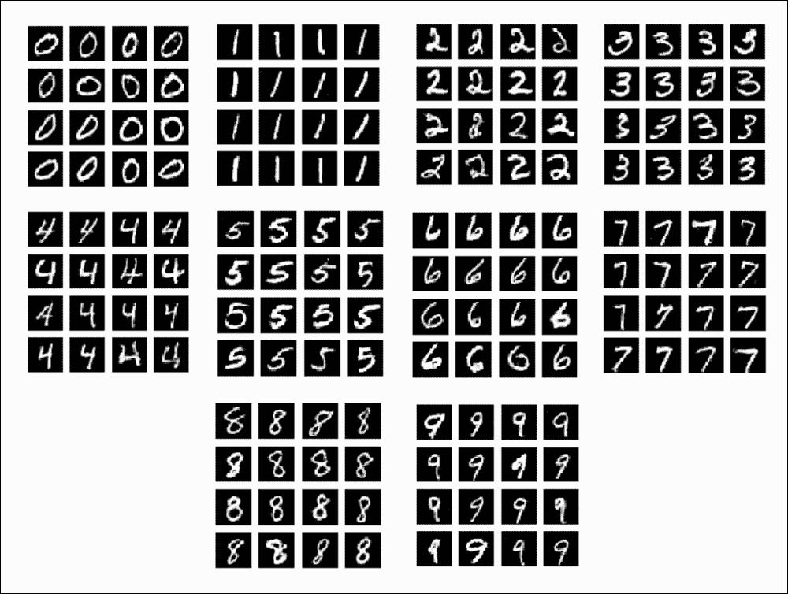

图 6.2.9：当离散代码从 0 变动到 9 时，由 StackedGAN 生成的图像。两个图像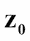和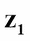都来自于一个均值为 0，标准差为 0.5 的正态分布。

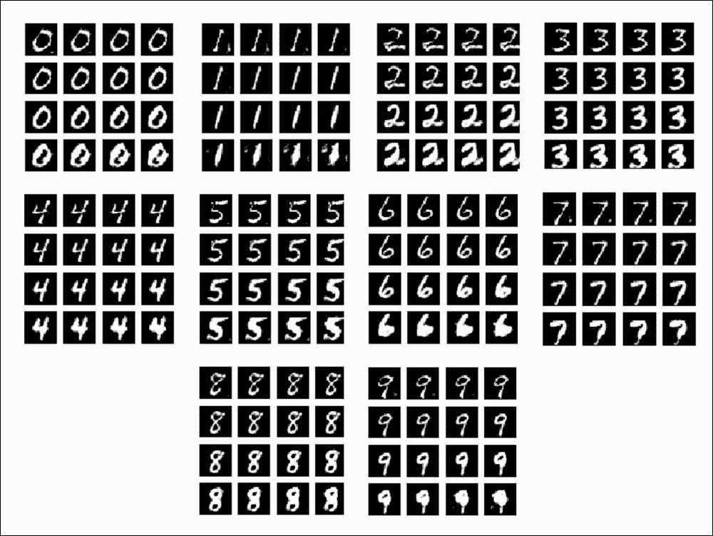

图 6.2.10：使用 StackedGAN 生成的图像，当第一个噪声代码，`z₀`，从常量向量-4.0 变化到 4.0 时，适用于数字 0 到 9。`z₀`似乎控制每个数字的厚度。

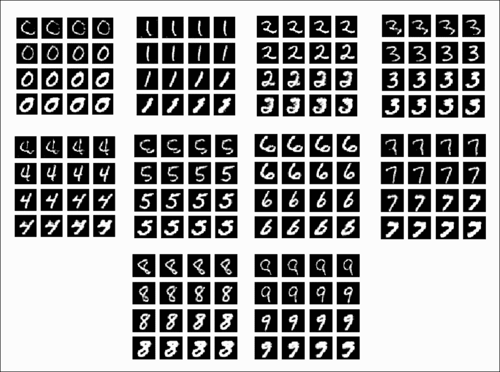

图 6.2.11：当第二个噪声代码，`z₁`，从常量向量-1.0 到 1.0 变化时，由 StackedGAN 生成的图像。`z₁`似乎控制每个数字的旋转（倾斜）和笔画厚度。

*图 6.2.9*到*图 6.2.11*展示了 StackedGAN 提供了更多的控制，可以控制生成器输出的属性。控制和属性包括（标签，数字类型），(`z`0，数字厚度），和(`z`1，数字倾斜度)。从这个例子来看，我们还可以控制其他可能的实验，例如：

+   增加堆叠元素的数量，从当前的 2 开始

+   降低代码`z`0 和`z`1 的维度，像在 InfoGAN 中一样

接下来的图展示了 InfoGAN 和 StackedGAN 的潜在代码差异。解耦代码的基本思想是对损失函数施加约束，使得只有特定的属性会被一个代码所影响。从结构上来看，InfoGAN 比 StackedGAN 更容易实现。InfoGAN 的训练速度也更快：

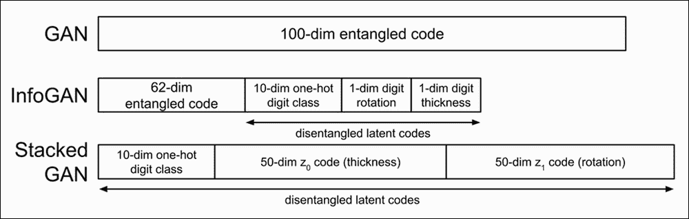

图 6.2.12：不同 GAN 的潜在表示

# 结论

在本章中，我们讨论了如何解开 GAN 的潜在表示。我们在本章的早期讨论了 InfoGAN 如何通过最大化互信息来迫使生成器学习解耦的潜在向量。在 MNIST 数据集的例子中，InfoGAN 使用了三个表示和一个噪声编码作为输入。噪声表示其余的属性，以纠缠表示的形式出现。StackedGAN 以不同的方式处理这个问题。它使用一堆编码器 GAN 来学习如何合成虚假的特征和图像。首先训练编码器以提供一个特征数据集。然后，编码器 GANs 被联合训练，学习如何利用噪声编码来控制生成器输出的属性。

在下一章中，我们将介绍一种新的 GAN 类型，它能够在另一个领域生成新数据。例如，给定一张马的图片，该 GAN 可以自动转换为斑马的图片。这种类型的 GAN 的有趣之处在于，它可以在无监督的情况下进行训练。

# 参考文献

1.  Xi Chen 等人。*InfoGAN：通过信息最大化生成对抗网络进行可解释的表示学习*。《神经信息处理系统进展》，2016（[`papers.nips.cc/paper/6399-infogan-interpretable-representation-learning-by-information-maximizing-generative-adversarial-nets.pdf`](http://papers.nips.cc/paper/6399-infogan-interpretable-representation-learning-by-information-maximizing-generative-adversarial-nets.pdf)）。

1.  Xun Huang 等人。*堆叠生成对抗网络*。IEEE 计算机视觉与模式识别会议（CVPR）。第 2 卷，2017（[`openaccess.thecvf.com/content_cvpr_2017/papers/Huang_Stacked_Generative_Adversarial_CVPR_2017_paper.pdf`](http://openaccess.thecvf.com/content_cvpr_2017/papers/Huang_Stacked_Generative_Adversarial_CVPR_2017_paper.pdf)）。
