# 第七章 跨领域 GAN

在计算机视觉、计算机图形学和图像处理领域，许多任务涉及将图像从一种形式转换为另一种形式。例如，灰度图像的上色、将卫星图像转换为地图、将一位艺术家的作品风格转换为另一位艺术家的风格、将夜间图像转换为白天图像、将夏季照片转换为冬季照片，这些都是例子。这些任务被称为**跨领域转换，将是本章的重点**。源领域中的图像被转换到目标领域，从而生成一个新的转换图像。

跨领域转换在现实世界中有许多实际应用。例如，在自动驾驶研究中，收集道路场景驾驶数据既费时又昂贵。为了尽可能覆盖多种场景变化，在这个例子中，车辆将会在不同的天气条件、季节和时间下行驶，获取大量多样的数据。利用跨领域转换，能够通过转换现有图像生成看起来逼真的新合成场景。例如，我们可能只需要从一个地区收集夏季的道路场景，从另一个地方收集冬季的道路场景。然后，我们可以将夏季图像转换为冬季图像，将冬季图像转换为夏季图像。这样，可以将需要完成的任务数量减少一半。

生成逼真合成图像是生成对抗网络（GANs）擅长的领域。因此，跨领域转换是 GAN 的一种应用。在本章中，我们将重点介绍一种流行的跨领域 GAN 算法——**CycleGAN** [2]。与其他跨领域转换算法（如**pix2pix** [3]）不同，CycleGAN 不需要对齐的训练图像就能工作。在对齐图像中，训练数据应由一对图像组成，即源图像及其对应的目标图像。例如，一张卫星图像及其相应的地图。CycleGAN 只需要卫星数据图像和地图。地图可能来自其他卫星数据，并不一定是之前从训练数据生成的。

在本章中，我们将探讨以下内容：

+   CycleGAN 的原理，包括其在 Keras 中的实现

+   CycleGAN 的示例应用，包括使用 CIFAR10 数据集进行灰度图像上色和在 MNIST 数字及**街景房屋号码**（**SVHN**）[1]数据集上进行风格转换

# CycleGAN 的原理

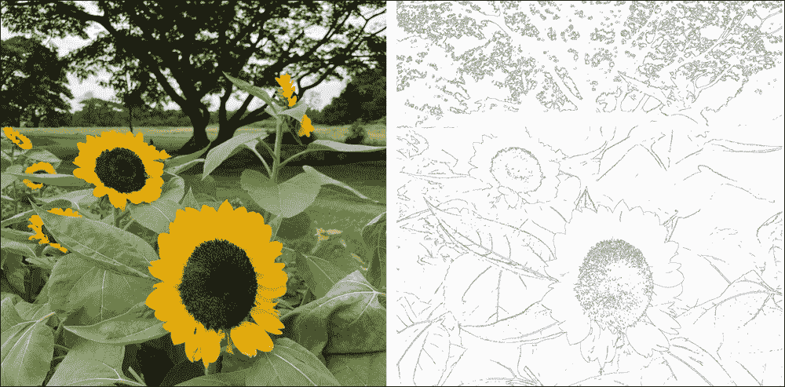

图 7.1.1：对齐图像对的示例：左侧为原始图像，右侧为使用 Canny 边缘检测器转换后的图像。原始照片由作者拍摄。

从一个领域到另一个领域的图像转换是计算机视觉、计算机图形学和图像处理中的常见任务。前面的图示了边缘检测，这是一个常见的图像转换任务。在这个例子中，我们可以将左侧的真实照片视为源域中的一张图像，而右侧的边缘检测图像视为目标域中的一个样本。还有许多其他跨领域转换过程具有实际应用，例如：

+   卫星图像转换为地图

+   面部图像转换为表情符号、漫画或动漫

+   身体图像转换为头像

+   灰度照片的着色

+   医学扫描图像转换为真实照片

+   真实照片转换为艺术家画作

在不同领域中有许多类似的例子。例如，在计算机视觉和图像处理领域，我们可以通过发明一个提取源图像特征并将其转换为目标图像的算法来执行转换。Canny 边缘检测算子就是这样一个算法的例子。然而，在许多情况下，转换过程非常复杂，手动设计几乎不可能找到合适的算法。源域和目标域的分布都是高维且复杂的：

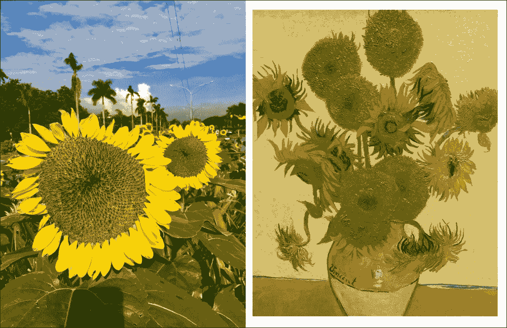

图 7.1.2：未对齐的图像对示例：左侧是菲律宾大学大学大道上的真实向日葵照片，右侧是伦敦国家美术馆的文森特·梵高的《向日葵》。原始照片由作者拍摄。

解决图像转换问题的一种方法是使用深度学习技术。如果我们拥有来自源域和目标域的足够大的数据集，我们可以训练神经网络来建模转换。由于目标域中的图像必须根据源图像自动生成，因此它们必须看起来像目标域中的真实样本。GANs 是适合此类跨领域任务的网络。pix2pix [3]算法就是一个跨领域算法的例子。

pix2pix 类似于我们在第四章")中讨论的**条件 GAN**（**CGAN**）[4]，*生成对抗网络 (GANs)*。我们可以回顾一下，在条件 GAN 中，除了噪声输入 *z* 外，一个条件（如一-hot 向量）会限制生成器的输出。例如，在 MNIST 数字中，如果我们希望生成器输出数字 8，则条件是一-hot 向量[0, 0, 0, 0, 0, 0, 0, 0, 1, 0]。在 pix2pix 中，条件是待转换的图像。生成器的输出是转换后的图像。pix2pix 通过优化条件 GAN 损失进行训练。为了最小化生成图像中的模糊，还包括了*L1*损失。

类似于 pix2pix 的神经网络的主要缺点是训练输入和输出图像必须对齐。*图 7.1.1* 是一个对齐图像对的示例。样本目标图像是从源图像生成的。在大多数情况下，对齐的图像对无法获得，或者从源图像生成对齐图像的成本较高，或者我们不知道如何从给定的源图像生成目标图像。我们拥有的是来自源领域和目标领域的样本数据。*图 7.1.2* 是一个示例，展示了同一向日葵主题的源领域（真实照片）和目标领域（梵高艺术风格）的数据。源图像和目标图像不一定对齐。

与 pix2pix 不同，CycleGAN 只要有足够的源数据和目标数据的变换和多样性，就能学习图像翻译。无需对齐。CycleGAN 学习源分布和目标分布，并从给定的样本数据中学习如何从源分布翻译到目标分布。不需要监督。在 *图 7.1.2* 的背景下，我们只需要成千上万的真实向日葵照片和成千上万的梵高向日葵画作照片。训练完 CycleGAN 后，我们就能将一张向日葵照片翻译成一幅梵高的画作：

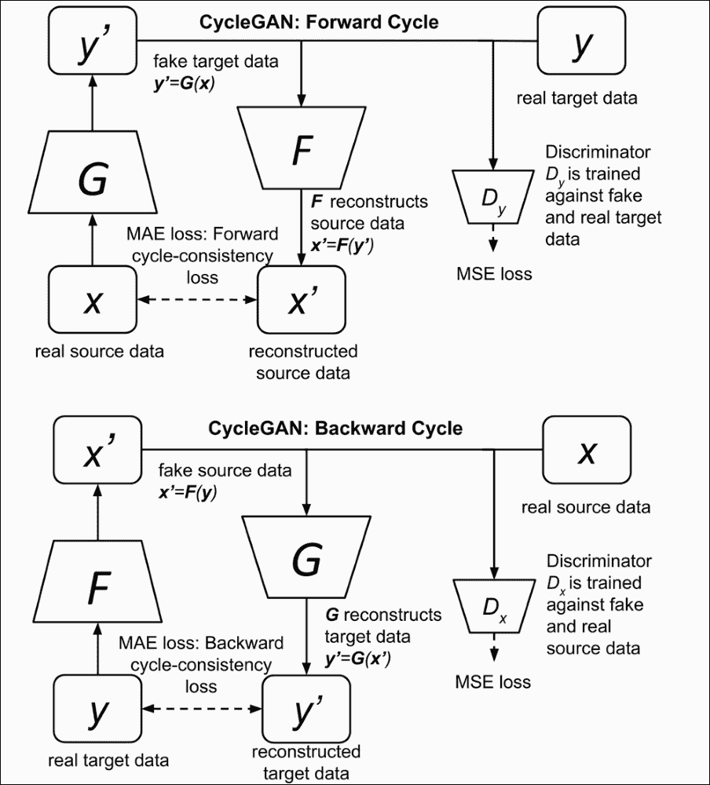

图 7.1.3：CycleGAN 模型由四个网络组成：生成器 G、生成器 F、判别器 D[y] 和判别器 D[x]

# CycleGAN 模型

*图 7.1.3* 显示了 CycleGAN 的网络模型。CycleGAN 的目标是学习以下函数：

*y'* = *G*(*x*) （公式 7.1.1）

这会生成目标领域的虚假图像，*y* *'*, 作为真实源图像 *x* 的函数。学习是无监督的，仅利用源领域和目标领域中可用的真实图像 *x* 和 *y* 进行学习。

与常规的 GAN 不同，CycleGAN 强加了循环一致性约束。正向循环一致性网络确保能够从虚假的目标数据中重建真实的源数据：

*x'* = *F*(*G*(*x*)) （公式 7.1.2）

通过最小化正向循环一致性 *L1* 损失来实现这一目标：

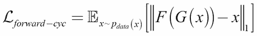

（公式 7.1.3）

网络是对称的。反向循环一致性网络也试图从虚假的源数据中重建真实的目标数据：

*y* *'* = *G*(*F*(*y*)) （公式 7.1.4）

通过最小化反向循环一致性 *L1* 损失来实现这一目标：

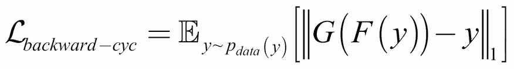

（公式 7.1.5）

这两个损失的和被称为循环一致性损失：

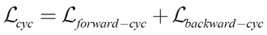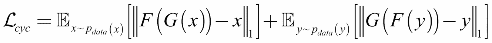

（公式 7.1.6）

循环一致性损失使用 *L1* 或 **均值绝对误差** (**MAE**)，因为与 *L2* 或 **均方误差** (**MSE**) 相比，它通常能得到更少模糊的图像重建。

与其他 GAN 类似，CycleGAN 的最终目标是让生成器*G*学习如何合成能够欺骗正向循环判别器*D*[y]的伪造目标数据*y* *'*。由于网络是对称的，CycleGAN 还希望生成器*F*学习如何合成能够欺骗反向循环判别器*D*[x]的伪造源数据*x* *'*。受**最小二乘 GAN**（**LSGAN**）[5]的更好感知质量启发，如第五章中所述，*改进的 GAN*，CycleGAN 也使用 MSE 作为判别器和生成器的损失。回想一下 LSGAN 与原始 GAN 的不同之处在于，LSGAN 使用 MSE 损失而不是二元交叉熵损失。CycleGAN 将生成器-判别器损失函数表示为：

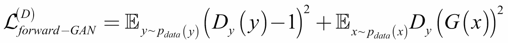

(方程式 7.1.7)

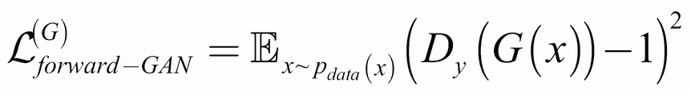

(方程式 7.1.8)

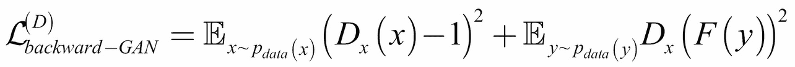

(方程式 7.1.9)

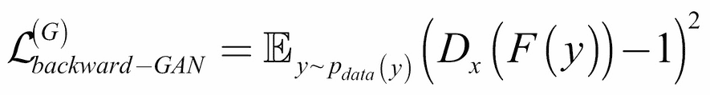

(方程式 7.1.10)

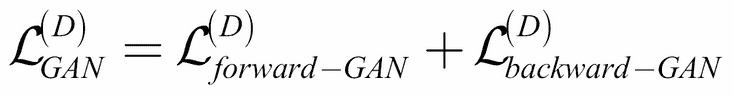

(方程式 7.1.11)


(方程式 7.1.12)

CycleGAN 的总损失如下所示：

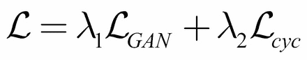

(方程式 7.1.13)

CycleGAN 推荐以下权重值：

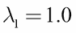

和

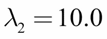

以便更重视循环一致性检查。

训练策略类似于原始 GAN。*算法* *7.1.1* 总结了 CycleGAN 的训练过程。

重复进行*n*次训练步骤：

1.  最小化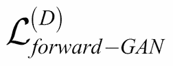

    通过使用真实的源数据和目标数据训练正向循环判别器。一个真实目标数据的小批量，*y*，被标记为 1.0。一个伪造目标数据的小批量，*y* *'* = *G*(*x*)，被标记为 0.0。

1.  最小化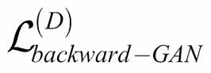

    通过使用真实的源数据和目标数据训练反向循环判别器。一个真实源数据的小批量，*x*，被标记为 1.0。一个伪造源数据的小批量，*x* *'* = *F*(*y*)，被标记为 0.0。

1.  最小化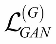

    和

    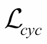

    通过在对抗网络中训练正向循环和反向循环生成器。一个伪造目标数据的小批量，*y* *'* = *G*(*x*)，被标记为 1.0。一个伪造源数据的小批量，*x* *'* = *F*(*y*)，被标记为 1.0。判别器的权重被冻结。

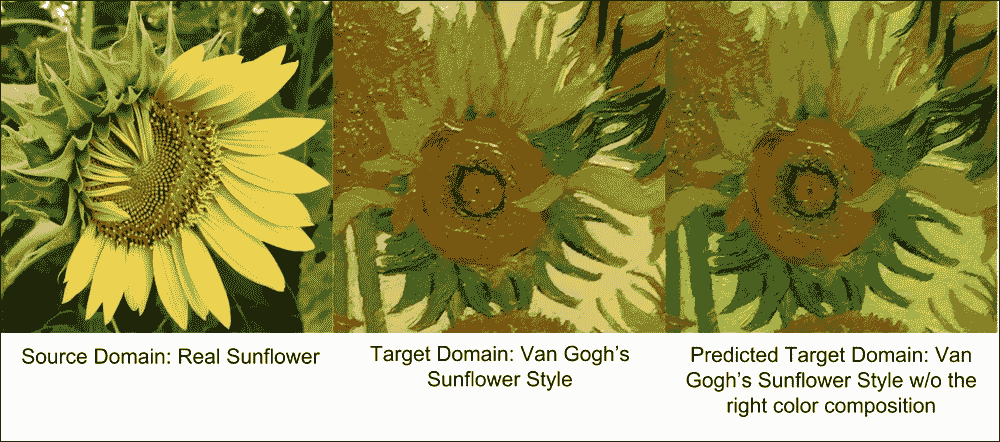

图 7.1.4：在风格迁移过程中，颜色组成可能无法成功迁移。为了解决这个问题，加入了身份损失到总损失函数中。

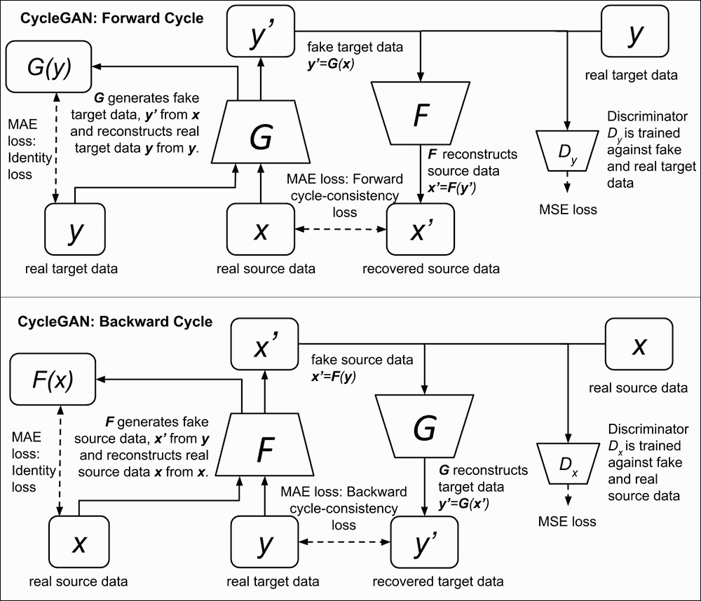

图 7.1.5：包含身份损失的 CycleGAN 模型，如图像左侧所示

在神经风格迁移问题中，颜色组成可能无法从源图像成功传递到假目标图像中。这个问题如*图 7.1.4*所示。为了解决这个问题，CycleGAN 提出了包含前向和反向循环身份损失函数的方案：

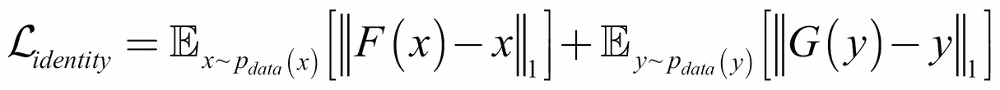

（方程 7.1.14）

CycleGAN 的总损失为：

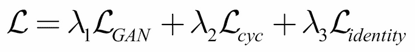

（方程 7.1.15）

与

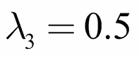

身份损失也会在对抗训练过程中得到优化。*图 7.1.5*展示了带有身份损失的 CycleGAN。

# 使用 Keras 实现 CycleGAN

让我们解决一个 CycleGAN 可以处理的简单问题。在第三章中，*自动编码器*，我们使用一个自动编码器对 CIFAR10 数据集中的灰度图像进行上色。我们可以回想起，CIFAR10 数据集由 50,000 个训练数据和 10,000 个测试数据样本组成，所有图像都是 32 × 32 的 RGB 图像，属于十个类别。我们可以使用 `rgb2gray(RGB)` 将所有彩色图像转换为灰度图像，如第三章中讨论的*自动编码器*。

继承之前，我们可以使用灰度训练图像作为源领域图像，原始彩色图像作为目标领域图像。值得注意的是，尽管数据集是对齐的，但我们输入到 CycleGAN 中的是一组随机的彩色图像样本和一组随机的灰度图像样本。因此，我们的 CycleGAN 不会将训练数据视为对齐的。训练完成后，我们将使用测试灰度图像来观察 CycleGAN 的性能：

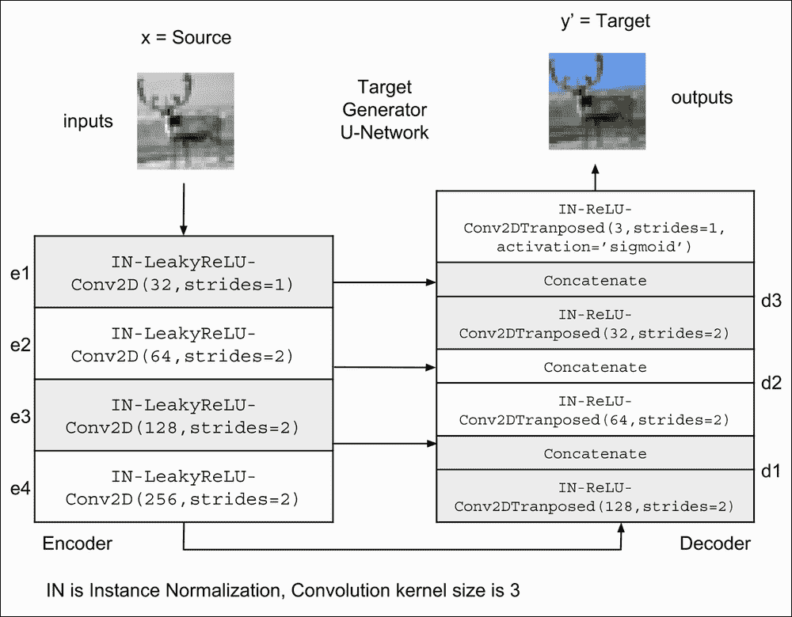

图 7.1.6：前向循环生成器 G，Keras 中的实现。该生成器是一个由编码器和解码器构成的 U-Net 网络。

正如上一节所讨论的，要实现 CycleGAN，我们需要构建两个生成器和两个判别器。CycleGAN 的生成器学习源输入分布的潜在表示，并将该表示转换为目标输出分布。这正是自动编码器所做的。然而，类似于第三章中讨论的典型自动编码器，*自动编码器*，使用一个编码器，该编码器将输入下采样直到瓶颈层，在该层之后的过程在解码器中被反转。这种结构在某些图像翻译问题中并不适用，因为编码器和解码器层之间共享了许多低级特征。例如，在上色问题中，灰度图像的形状、结构和边缘与彩色图像中的相同。为了解决这个问题，CycleGAN 生成器采用了**U-Net** [7]结构，如*图 7.1.6*所示。

在 U-Net 结构中，编码器层 *e* *n-i* 的输出与解码器层 *d* *i* 的输出进行拼接，其中 *n* = 4 是编码器/解码器层的数量，*i* = 1, 2 和 3 是共享信息的层编号。

我们应该注意到，尽管示例中使用了*n* = 4，但具有更高输入/输出维度的问题可能需要更深的编码器/解码器。U-Net 结构允许编码器和解码器之间自由流动特征级别的信息。编码器层由 `Instance Normalization(IN)-LeakyReLU-Conv2D` 组成，而解码器层由 `IN-ReLU-Conv2D` 组成。编码器/解码器层的实现见 *Listing* *7.1.1*，生成器的实现见 *Listing* *7.1.2*。

### 注意

完整的代码可以在 GitHub 上找到：

[`github.com/PacktPublishing/Advanced-Deep-Learning-with-Keras`](https://github.com/PacktPublishing/Advanced-Deep-Learning-with-Keras)

**实例归一化**（**IN**）是每个数据样本的 **批归一化**（**BN**）（即 IN 是每个图像或每个特征的 BN）。在风格迁移中，归一化对比度是按每个样本进行的，而不是按批次进行。实例归一化等同于对比度归一化。同时，批归一化会破坏对比度归一化。

### 注意

在使用实例归一化之前，请记得安装 `keras-contrib`：

```py
$ sudo pip3 install git+https://www.github.com/keras-team/keras-contrib.git

```

*Listing 7.1.1*，`cyclegan-7.1.1.py` 展示了 Keras 中编码器和解码器层的实现：

```py
def encoder_layer(inputs,
                  filters=16,
                  kernel_size=3,
                  strides=2,
                  activation='relu',
                  instance_norm=True):
    """Builds a generic encoder layer made of Conv2D-IN-LeakyReLU
    IN is optional, LeakyReLU may be replaced by ReLU

    """

    conv = Conv2D(filters=filters,
                  kernel_size=kernel_size,
                  strides=strides,
                  padding='same')

    x = inputs
    if instance_norm:
        x = InstanceNormalization()(x)
    if activation == 'relu':
        x = Activation('relu')(x)
    else:
        x = LeakyReLU(alpha=0.2)(x)
    x = conv(x)
    return x

def decoder_layer(inputs,
                  paired_inputs,
                  filters=16,
                  kernel_size=3,
                  strides=2,
                  activation='relu',
                  instance_norm=True):
    """Builds a generic decoder layer made of Conv2D-IN-LeakyReLU
    IN is optional, LeakyReLU may be replaced by ReLU
    Arguments: (partial)
    inputs (tensor): the decoder layer input
    paired_inputs (tensor): the encoder layer output 
          provided by U-Net skip connection &
          concatenated to inputs.
    """

    conv = Conv2DTranspose(filters=filters,
                           kernel_size=kernel_size,
                           strides=strides,
                           padding='same')

    x = inputs
    if instance_norm:
        x = InstanceNormalization()(x)
    if activation == 'relu':
        x = Activation('relu')(x)
    else:
        x = LeakyReLU(alpha=0.2)(x)
    x = conv(x)
    x = concatenate([x, paired_inputs])
    return x
```

*Listing 7.1.2*，`cyclegan-7.1.1.py`。Keras 中的生成器实现：

```py
def build_generator(input_shape,
                    output_shape=None,
                    kernel_size=3,
                    name=None):
    """The generator is a U-Network made of a 4-layer encoder
    and a 4-layer decoder. Layer n-i is connected to layer i.

    Arguments:
    input_shape (tuple): input shape
    output_shape (tuple): output shape
    kernel_size (int): kernel size of encoder & decoder layers
    name (string): name assigned to generator model

    Returns:
    generator (Model):

    """

    inputs = Input(shape=input_shape)
    channels = int(output_shape[-1])
    e1 = encoder_layer(inputs,
                       32,
                       kernel_size=kernel_size,
                       activation='leaky_relu',
                       strides=1)
    e2 = encoder_layer(e1,
                       64,
                       activation='leaky_relu',
                       kernel_size=kernel_size)
    e3 = encoder_layer(e2,
                       128,
                       activation='leaky_relu',
                       kernel_size=kernel_size)
    e4 = encoder_layer(e3,
                       256,
                       activation='leaky_relu',
                       kernel_size=kernel_size)

    d1 = decoder_layer(e4,
                       e3,
                       128,
                       kernel_size=kernel_size)
    d2 = decoder_layer(d1,
                       e2,
                       64,
                       kernel_size=kernel_size)
    d3 = decoder_layer(d2,
                       e1,
                       32,
                       kernel_size=kernel_size)
    outputs = Conv2DTranspose(channels,
                              kernel_size=kernel_size,
                              strides=1,
                              activation='sigmoid',
                              padding='same')(d3)

    generator = Model(inputs, outputs, name=name)

    return generator
```

CycleGAN 的判别器类似于普通的 GAN 判别器。输入图像被下采样多次（在本示例中，下采样了三次）。最后一层是一个 `Dense(1)` 层，用来预测输入图像是真实的概率。每一层与生成器的编码器层相似，只是没有使用 IN。然而，在处理大图像时，使用单一的数值来判断图像是“真实”还是“假”在参数上效率较低，且会导致生成器生成的图像质量较差。

解决方案是使用 PatchGAN [6]，它将图像划分为一个补丁网格，并使用标量值网格来预测这些补丁是否真实。普通 GAN 判别器与 2 × 2 PatchGAN 判别器的比较见 *图 7.1.7*。在本示例中，补丁之间没有重叠，且在边界处相接。然而，通常情况下，补丁可能会有重叠。

我们应该注意到，PatchGAN 在 CycleGAN 中并没有引入一种新的 GAN 类型。为了提高生成图像的质量，若使用 2 × 2 PatchGAN，我们不再只有一个输出去进行判别，而是有四个输出进行判别。损失函数没有变化。直观来说，这是有道理的，因为如果图像的每个补丁或部分看起来都是真实的，那么整张图像看起来也会更真实。

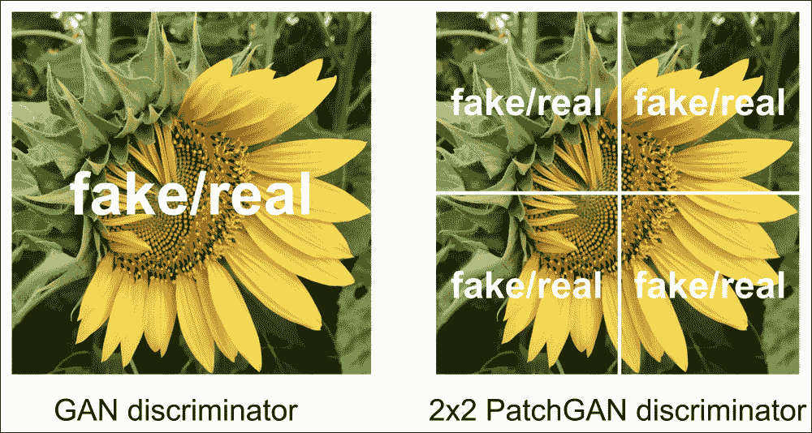

图 7.1.7：GAN 和 PatchGAN 判别器的比较

以下图示展示了在 Keras 中实现的判别器网络。图示展示了判别器判断输入图像或图像块是否为彩色 CIFAR10 图像的概率。由于输出图像仅为 32×32 RGB 的小图像，使用一个标量表示图像是否真实就足够了。然而，我们也评估了使用 PatchGAN 时的结果。*清单* *7.1.3*展示了判别器的函数构建器：

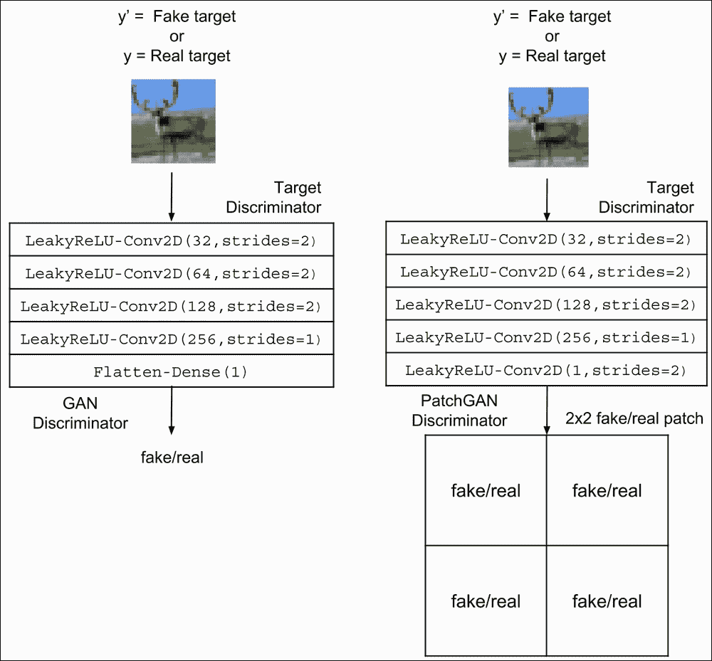

图 7.1.8：目标判别器*D*[y]在 Keras 中的实现。PatchGAN 判别器显示在右侧。

清单 7.1.3，`cyclegan-7.1.1.py`展示了在 Keras 中实现的判别器：

```py
def build_discriminator(input_shape,
                        kernel_size=3,
                        patchgan=True,
                        name=None):
    """The discriminator is a 4-layer encoder that outputs either
    a 1-dim or a n x n-dim patch of probability that input is real 

    Arguments:
    input_shape (tuple): input shape
    kernel_size (int): kernel size of decoder layers
    patchgan (bool): whether the output is a patch or just a 1-dim
    name (string): name assigned to discriminator model

    Returns:
    discriminator (Model):

    """

    inputs = Input(shape=input_shape)
    x = encoder_layer(inputs,
                      32,
                      kernel_size=kernel_size,
                      activation='leaky_relu',
                      instance_norm=False)
    x = encoder_layer(x,
                      64,
                      kernel_size=kernel_size,
                      activation='leaky_relu',
                      instance_norm=False)
    x = encoder_layer(x,
                      128,
                      kernel_size=kernel_size,
                      activation='leaky_relu',
                      instance_norm=False)
    x = encoder_layer(x,
                      256,
                      kernel_size=kernel_size,
                      strides=1,
                      activation='leaky_relu',
                      instance_norm=False)

    # if patchgan=True use nxn-dim output of probability
    # else use 1-dim output of probability
    if patchgan:
        x = LeakyReLU(alpha=0.2)(x)
        outputs = Conv2D(1,
                         kernel_size=kernel_size,
                         strides=1,
                         padding='same')(x)
    else:
        x = Flatten()(x)
        x = Dense(1)(x)
        outputs = Activation('linear')(x)

    discriminator = Model(inputs, outputs, name=name)

    return discriminator
```

使用生成器和判别器构建器，我们现在可以构建 CycleGAN。*清单* *7.1.4*展示了构建器函数。根据前一节中的讨论，实例化了两个生成器，`g_source` = *F*和`g_target` = *G*，以及两个判别器，`d_source` = *D*[x]和`d_target` = *D*[y]。正向循环为*x* *'* = *F*(*G*(*x*)) = `reco_source = g_source(g_target(source_input))`。反向循环为*y* *'* = *G*(*F*(*y*)) = `reco_target = g_target(g_source(target_input))`。

对抗模型的输入是源数据和目标数据，输出是*D*[x]和*D*[y]的输出以及重建的输入，*x'*和*y'*。由于灰度图像和彩色图像在通道数量上的不同，本例中未使用身份网络。我们使用推荐的损失权重：

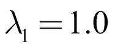

和


分别用于 GAN 和循环一致性损失。与前几章的 GAN 类似，我们使用学习率为 2e-4、衰减率为 6e-8 的 RMSprop 优化器来优化判别器。对抗网络的学习率和衰减率是判别器的一半。

清单 7.1.4，`cyclegan-7.1.1.py`展示了我们在 Keras 中实现的 CycleGAN 构建器：

```py
def build_cyclegan(shapes,
                   source_name='source',
                   target_name='target',
                   kernel_size=3,
                   patchgan=False,
                   identity=False
                   ):
    """Build the CycleGAN

    1) Build target and source discriminators
    2) Build target and source generators
    3) Build the adversarial network

    Arguments:
    shapes (tuple): source and target shapes
    source_name (string): string to be appended on dis/gen models
    target_name (string): string to be appended on dis/gen models
    kernel_size (int): kernel size for the encoder/decoder or dis/gen
                       models
    patchgan (bool): whether to use patchgan on discriminator
    identity (bool): whether to use identity loss

    Returns:
    (list): 2 generator, 2 discriminator, and 1 adversarial models 

    """

    source_shape, target_shape = shapes
    lr = 2e-4
    decay = 6e-8
    gt_name = "gen_" + target_name
    gs_name = "gen_" + source_name
    dt_name = "dis_" + target_name
    ds_name = "dis_" + source_name

    # build target and source generators
    g_target = build_generator(source_shape,
                               target_shape,
                               kernel_size=kernel_size,
                               name=gt_name)
    g_source = build_generator(target_shape,
                               source_shape,
                               kernel_size=kernel_size,
                               name=gs_name)
    print('---- TARGET GENERATOR ----')
    g_target.summary()
    print('---- SOURCE GENERATOR ----')
    g_source.summary()

    # build target and source discriminators
    d_target = build_discriminator(target_shape,
                                   patchgan=patchgan,
                                   kernel_size=kernel_size,
                                   name=dt_name)
    d_source = build_discriminator(source_shape,
                                   patchgan=patchgan,
                                   kernel_size=kernel_size,
                                   name=ds_name)
    print('---- TARGET DISCRIMINATOR ----')
    d_target.summary()
    print('---- SOURCE DISCRIMINATOR ----')
    d_source.summary()

    optimizer = RMSprop(lr=lr, decay=decay)
    d_target.compile(loss='mse',
                     optimizer=optimizer,
                     metrics=['accuracy'])
    d_source.compile(loss='mse',
                     optimizer=optimizer,
                     metrics=['accuracy'])
    # freeze the discriminator weights in the adversarial model
    d_target.trainable = False
    d_source.trainable = False

    # build the computational graph for the adversarial model
    # forward cycle network and target discriminator
    source_input = Input(shape=source_shape)
    fake_target = g_target(source_input)
    preal_target = d_target(fake_target)
    reco_source = g_source(fake_target)

    # backward cycle network and source discriminator
    target_input = Input(shape=target_shape)
    fake_source = g_source(target_input)
    preal_source = d_source(fake_source)
    reco_target = g_target(fake_source)

    # if we use identity loss, add 2 extra loss terms
    # and outputs
    if identity:
        iden_source = g_source(source_input)
        iden_target = g_target(target_input)
        loss = ['mse', 'mse', 'mae', 'mae', 'mae', 'mae']
        loss_weights = [1., 1., 10., 10., 0.5, 0.5]
        inputs = [source_input, target_input]
        outputs = [preal_source,
                   preal_target,
                   reco_source,
                   reco_target,
                   iden_source,
                   iden_target]
    else:
        loss = ['mse', 'mse', 'mae', 'mae']
        loss_weights = [1., 1., 10., 10.]
        inputs = [source_input, target_input]
        outputs = [preal_source,
                   preal_target,
                   reco_source,
                   reco_target]

    # build adversarial model
    adv = Model(inputs, outputs, name='adversarial')
    optimizer = RMSprop(lr=lr*0.5, decay=decay*0.5)
    adv.compile(loss=loss,
                loss_weights=loss_weights,
                optimizer=optimizer,
                metrics=['accuracy'])
    print('---- ADVERSARIAL NETWORK ----')
    adv.summary()

    return g_source, g_target, d_source, d_target, adv
```

我们遵循前一节中的*算法* *7.1.1*的训练程序。以下清单展示了 CycleGAN 训练。这与传统 GAN 训练的细微区别在于，CycleGAN 有两个判别器需要优化。然而，只有一个对抗模型需要优化。每 2000 步，生成器保存预测的源图像和目标图像。我们使用批次大小为 32。我们也尝试过批次大小为 1，但输出质量几乎相同，只是训练时间更长（批次大小为 1 时每张图像 43 毫秒，批次大小为 32 时每张图像 3.6 毫秒，使用 NVIDIA GTX 1060）。

清单 7.1.5，`cyclegan-7.1.1.py`展示了我们在 Keras 中实现的 CycleGAN 训练例程：

```py
def train_cyclegan(models, data, params, test_params, test_generator):
    """ Trains the CycleGAN. 

    1) Train the target discriminator
    2) Train the source discriminator
    3) Train the forward and backward cyles of adversarial networks

    Arguments:
    models (Models): Source/Target Discriminator/Generator,
                     Adversarial Model
    data (tuple): source and target training data
    params (tuple): network parameters
    test_params (tuple): test parameters
    test_generator (function): used for generating predicted target
                    and source images
    """

    # the models
    g_source, g_target, d_source, d_target, adv = models
    # network parameters
    batch_size, train_steps, patch, model_name = params
    # train dataset
    source_data, target_data, test_source_data, test_target_data = data

    titles, dirs = test_params

    # the generator image is saved every 2000 steps
    save_interval = 2000
    target_size = target_data.shape[0]
    source_size = source_data.shape[0]

    # whether to use patchgan or not
    if patch > 1:
        d_patch = (patch, patch, 1)
        valid = np.ones((batch_size,) + d_patch)
        fake = np.zeros((batch_size,) + d_patch)
    else:
        valid = np.ones([batch_size, 1])
        fake = np.zeros([batch_size, 1])

    valid_fake = np.concatenate((valid, fake))
    start_time = datetime.datetime.now()

    for step in range(train_steps):
        # sample a batch of real target data
        rand_indexes = np.random.randint(0, target_size, size=batch_size)
        real_target = target_data[rand_indexes]

        # sample a batch of real source data
        rand_indexes = np.random.randint(0, source_size, size=batch_size)
        real_source = source_data[rand_indexes]
        # generate a batch of fake target data fr real source data
        fake_target = g_target.predict(real_source)

        # combine real and fake into one batch
        x = np.concatenate((real_target, fake_target))
        # train the target discriminator using fake/real data
        metrics = d_target.train_on_batch(x, valid_fake)
        log = "%d: [d_target loss: %f]" % (step, metrics[0])

        # generate a batch of fake source data fr real target data
        fake_source = g_source.predict(real_target)
        x = np.concatenate((real_source, fake_source))
        # train the source discriminator using fake/real data
        metrics = d_source.train_on_batch(x, valid_fake)
        log = "%s [d_source loss: %f]" % (log, metrics[0])

        # train the adversarial network using forward and backward
        # cycles. the generated fake source and target data attempts
        # to trick the discriminators
        x = [real_source, real_target]
        y = [valid, valid, real_source, real_target]
        metrics = adv.train_on_batch(x, y)
        elapsed_time = datetime.datetime.now() - start_time
        fmt = "%s [adv loss: %f] [time: %s]"
        log = fmt % (log, metrics[0], elapsed_time)
        print(log)
        if (step + 1) % save_interval == 0:
            if (step + 1) == train_steps:
                show = True
            else:
                show = False

            test_generator((g_source, g_target),
                           (test_source_data, test_target_data),
                           step=step+1,
                           titles=titles,
                           dirs=dirs,
                           show=show)

    # save the models after training the generators
    g_source.save(model_name + "-g_source.h5")
    g_target.save(model_name + "-g_target.h5")
```

最后，在我们可以使用 CycleGAN 来构建和训练功能之前，我们需要进行一些数据准备。`cifar10_utils.py`和`other_utils.py`模块加载 CIFAR10 的训练数据和测试数据。有关这两个文件的详细信息，请参考源代码。加载数据后，训练和测试图像将被转换为灰度图像，以生成源数据和测试源数据。

以下代码段展示了如何使用 CycleGAN 构建和训练一个生成器网络（`g_target`）来对灰度图像进行着色。由于 CycleGAN 是对称的，我们还构建并训练了第二个生成器网络（`g_source`），将彩色图像转化为灰度图像。两个 CycleGAN 着色网络已经训练完成。第一个使用类似普通 GAN 的标量输出判别器；第二个使用 2 × 2 的 PatchGAN 判别器。

列表 7.1.6 中的`cyclegan-7.1.1.py`展示了 CycleGAN 在着色问题中的应用：

```py
def graycifar10_cross_colorcifar10(g_models=None):
    """Build and train a CycleGAN that can do grayscale <--> color
       cifar10 images
    """

    model_name = 'cyclegan_cifar10'
    batch_size = 32
    train_steps = 100000
    patchgan = True
    kernel_size = 3
    postfix = ('%dp' % kernel_size) if patchgan else ('%d' % kernel_size)

    data, shapes = cifar10_utils.load_data()
    source_data, _, test_source_data, test_target_data = data
    titles = ('CIFAR10 predicted source images.',
              'CIFAR10 predicted target images.',
              'CIFAR10 reconstructed source images.',
              'CIFAR10 reconstructed target images.')
    dirs = ('cifar10_source-%s' % postfix, 'cifar10_target-%s' % postfix)

   # generate predicted target(color) and source(gray) images
    if g_models is not None:
        g_source, g_target = g_models
        other_utils.test_generator((g_source, g_target),
                                   (test_source_data, test_target_data),
                                   step=0,
                                   titles=titles,
                                   dirs=dirs,
                                   show=True)
        return

    # build the cyclegan for cifar10 colorization
    models = build_cyclegan(shapes,
                            "gray-%s" % postfix,
                            "color-%s" % postfix,
                            kernel_size=kernel_size,
                            patchgan=patchgan)
    # patch size is divided by 2^n since we downscaled the input
    # in the discriminator by 2^n (ie. we use strides=2 n times)
    patch = int(source_data.shape[1] / 2**4) if patchgan else 1
    params = (batch_size, train_steps, patch, model_name)
    test_params = (titles, dirs)
    # train the cyclegan
    train_cyclegan(models,
                   data,
                   params,
                   test_params,
                   other_utils.test_generator)
```

# CycleGAN 的生成器输出

*图 7.1.9*展示了 CycleGAN 的着色结果。源图像来自测试数据集。为了进行比较，我们展示了地面真实图像以及使用简单自动编码器（第三章，自动编码器）进行着色的结果。总体而言，所有着色图像在视觉上都是可以接受的。总体来看，每种着色技术都有其优缺点。所有着色方法在天空和车辆的真实颜色上都有不一致的地方。

例如，飞机背景中的天空（第 3 行，第 2 列）是白色的。自动编码器正确预测了这一点，但 CycleGAN 认为它是浅棕色或蓝色的。对于第 6 行，第 6 列，海上船只的灰暗天空被自动编码器着色为蓝天蓝海，而 CycleGAN（没有 PatchGAN）则预测为蓝海白天。两种预测在现实世界中都有其合理性。同时，使用 PatchGAN 的 CycleGAN 的预测接近真实值。在倒数第二行和第二列，任何方法都未能预测出汽车的红色。在动物图像上，CycleGAN 的两种变体都接近真实值的颜色。

由于 CycleGAN 是对称的，它也能根据彩色图像预测灰度图像。*图 7.1.10*展示了两种 CycleGAN 变体执行的彩色转灰度转换。目标图像来自测试数据集。除了某些图像灰度色调的细微差异外，预测结果通常是准确的：

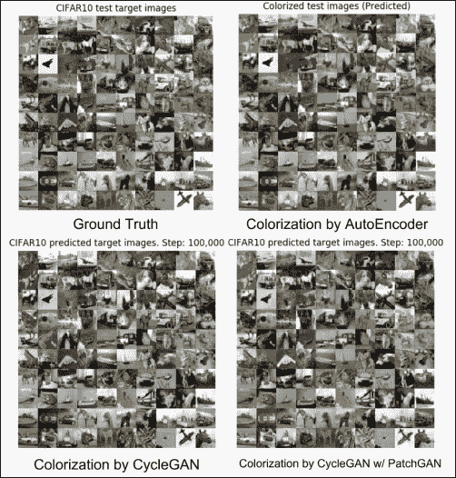

图 7.1.9：使用不同技术进行的着色。展示了地面真实图像、使用自动编码器（第三章，自动编码器）进行的着色、使用带有普通 GAN 判别器的 CycleGAN 进行的着色，以及使用 PatchGAN 判别器的 CycleGAN 进行的着色。最佳观看效果为彩色。原始彩色照片可在本书的 GitHub 库中找到，网址为：https://github.com/PacktPublishing/Advanced-Deep-Learning-with-Keras/blob/master/chapter7-cross-domain-gan/README.md。

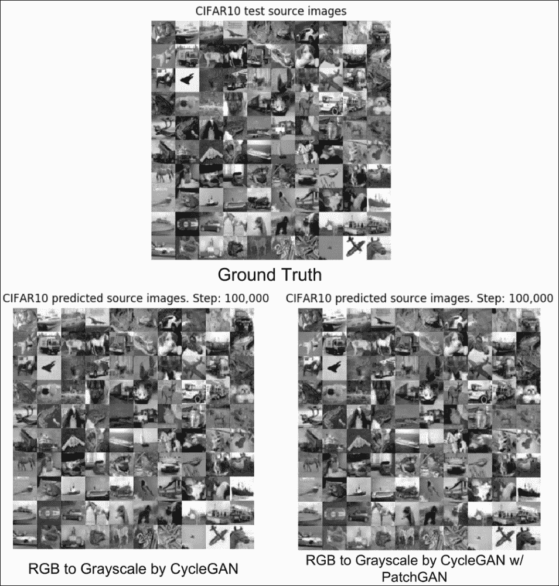

图 7.1.10：CycleGAN 的彩色（图 7.1.9 中的内容）到灰度转换

读者可以通过使用预训练的带 PatchGAN 的 CycleGAN 模型来运行图像翻译：

```py
python3 cyclegan-7.1.1.py --cifar10_g_source=cyclegan_cifar10-g_source.h5 --cifar10_g_target=cyclegan_cifar10-g_target.h5

```

## CycleGAN 在 MNIST 和 SVHN 数据集上的应用

我们现在要解决一个更具挑战性的问题。假设我们使用灰度的 MNIST 数字作为源数据，并希望借用 SVHN [1]（我们的目标数据）中的风格。每个领域的示例数据如*图 7.1.11*所示。我们可以重用上一节中讨论的所有构建和训练 CycleGAN 的函数来执行风格迁移。唯一的区别是我们需要为加载 MNIST 和 SVHN 数据添加例程。

我们引入了模块`mnist_svhn_utils.py`来帮助我们完成这项任务。*列表* *7.1.7*展示了用于跨领域迁移的 CycleGAN 的初始化和训练。CycleGAN 结构与前一节相同，只是我们使用了 5 的核大小，因为这两个领域之间有很大的差异：

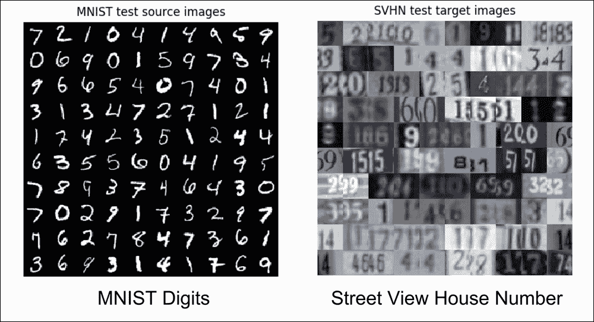

图 7.1.11：两个不同领域的数据未对齐。原始彩色照片可以在书籍的 GitHub 库中找到，网址为 https://github.com/PacktPublishing/Advanced-Deep-Learning-with-Keras/blob/master/chapter7-cross-domain-gan/README.md。

### 注意

在使用实例归一化之前，请记得安装`keras-contrib`：

```py
$ sudo pip3 install git+https://www.github.com/keras-team/keras-contrib.git

```

列表 7.1.7 中的`cyclegan-7.1.1.py`展示了 MNIST 和 SVHN 之间跨领域风格迁移的 CycleGAN：

```py
def mnist_cross_svhn(g_models=None):
    """Build and train a CycleGAN that can do mnist <--> svhn
    """

    model_name = 'cyclegan_mnist_svhn'
    batch_size = 32
    train_steps = 100000
    patchgan = True
    kernel_size = 5
    postfix = ('%dp' % kernel_size) if patchgan else ('%d' % kernel_size)

    data, shapes = mnist_svhn_utils.load_data()
    source_data, _, test_source_data, test_target_data = data
    titles = ('MNIST predicted source images.',
              'SVHN predicted target images.',
              'MNIST reconstructed source images.',
              'SVHN reconstructed target images.')
    dirs = ('mnist_source-%s' % postfix, 'svhn_target-%s' % postfix)

    # genrate predicted target(svhn) and source(mnist) images
    if g_models is not None:
        g_source, g_target = g_models
        other_utils.test_generator((g_source, g_target),
                                   (test_source_data, test_target_data),
                                   step=0,
                                   titles=titles,
                                   dirs=dirs,
                                   show=True)
        return

    # build the cyclegan for mnist cross svhn
    models = build_cyclegan(shapes,
                            "mnist-%s" % postfix,
                            "svhn-%s" % postfix,
                            kernel_size=kernel_size,
                            patchgan=patchgan)
    # patch size is divided by 2^n since we downscaled the input
    # in the discriminator by 2^n (ie. we use strides=2 n times)
    patch = int(source_data.shape[1] / 2**4) if patchgan else 1
    params = (batch_size, train_steps, patch, model_name)
    test_params = (titles, dirs)
    # train the cyclegan
    train_cyclegan(models,
                   data,
                   params,
                   test_params,
                   other_utils.test_generator)
```

从测试数据集将 MNIST 迁移到 SVHN 的结果如*图 7.1.12*所示。生成的图像具有 SVHN 的风格，但数字没有完全迁移。例如，在第 4 行中，数字 3、1 和 3 被 CycleGAN 进行了风格化。然而，在第 3 行中，数字 9、6 和 6 分别被 CycleGAN 风格化为 0、6、01、0、65 和 68，分别在没有 PatchGAN 和使用 PatchGAN 时的结果不同。

向后循环的结果如*图 7.1.13*所示。在这种情况下，目标图像来自 SVHN 测试数据集。生成的图像具有 MNIST 的风格，但数字没有正确转换。例如，在第 1 行中，数字 5、2 和 210 被 CycleGAN 分别转换为 7、7、8、3、3 和 1，其中不使用 PatchGAN 和使用 PatchGAN 时的结果不同。

对于 PatchGAN，输出 1 是可以理解的，因为预测的 MNIST 数字被限制为一个数字。在 SVHN 数字的第 2 行最后 3 列中，像 6、3 和 4 这样的数字被 CycleGAN 转换为 6、3 和 6，但没有 PatchGAN 的情况下。然而，CycleGAN 的两个版本的输出始终是单一数字并且具有可识别性。

从 MNIST 转换到 SVHN 时出现的问题，其中源域中的一个数字被转换为目标域中的另一个数字，称为 **标签翻转** [8]。尽管 CycleGAN 的预测是循环一致的，但它们不一定是语义一致的。数字的意义在转换过程中丧失。为了解决这个问题，Hoffman [8] 提出了改进版的 CycleGAN，称为 **CyCADA**（**循环一致对抗领域适配**）。其区别在于额外的语义损失项确保了预测不仅是循环一致的，而且是语义一致的：

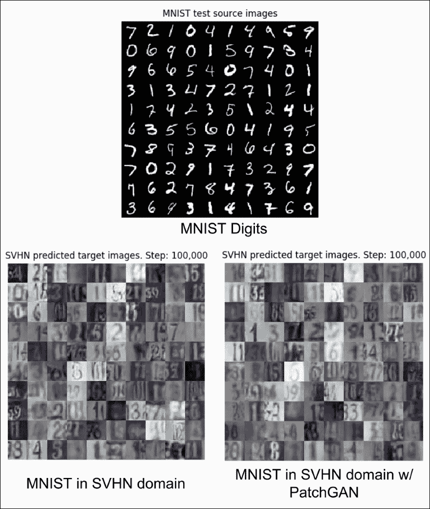

图 7.1.12：将测试数据从 MNIST 域进行风格迁移到 SVHN。原始彩色照片可以在本书的 GitHub 仓库中找到，网址为 https://github.com/PacktPublishing/Advanced-Deep-Learning-with-Keras/blob/master/chapter7-cross-domain-gan/README.md。

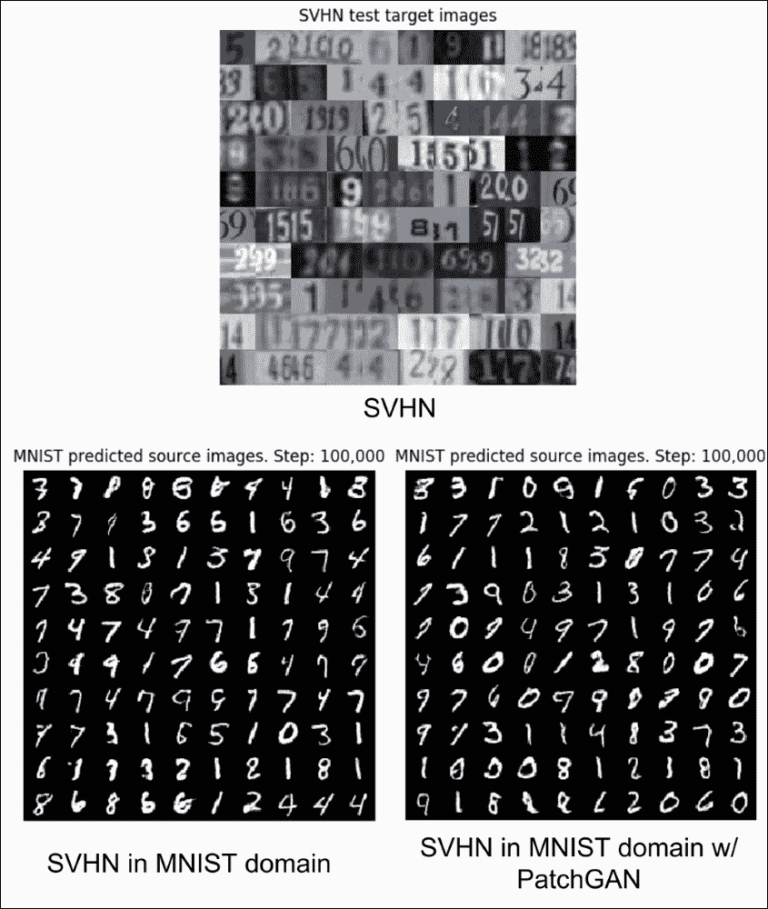

图 7.1.13：将测试数据从 SVHN 域进行风格迁移到 MNIST。原始彩色照片可以在本书的 GitHub 仓库中找到，网址为 https://github.com/PacktPublishing/Advanced-Deep-Learning-with-Keras/blob/master/chapter7-cross-domain-gan/README.md。

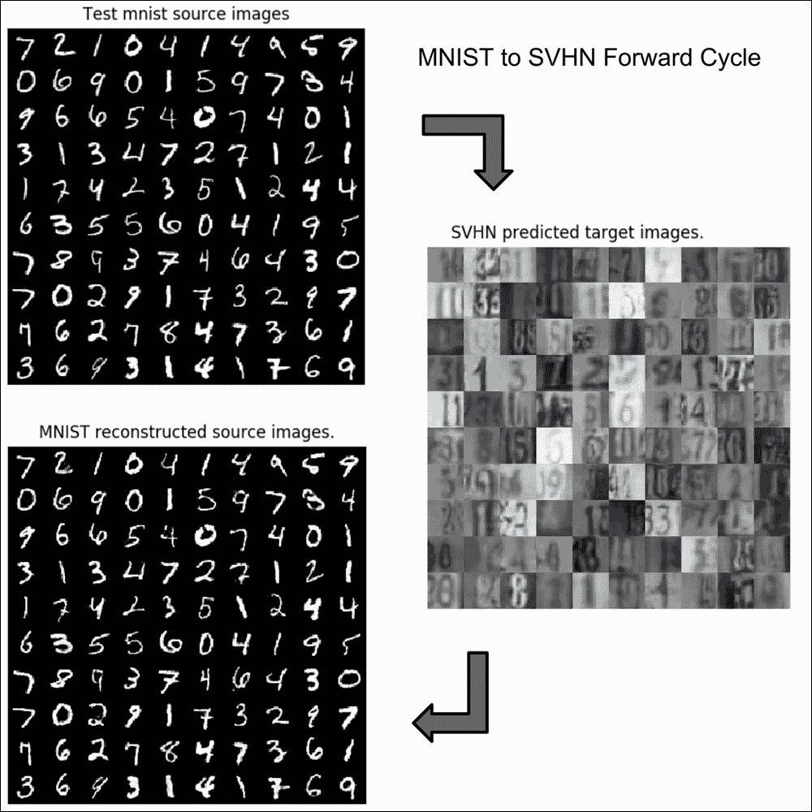

图 7.1.14：CycleGAN 与 PatchGAN 在 MNIST（源）到 SVHN（目标）的前向循环。重建后的源图像与原始源图像相似。原始彩色照片可以在本书的 GitHub 仓库中找到，网址为 https://github.com/PacktPublishing/Advanced-Deep-Learning-with-Keras/blob/master/chapter7-cross-domain-gan/README.md。

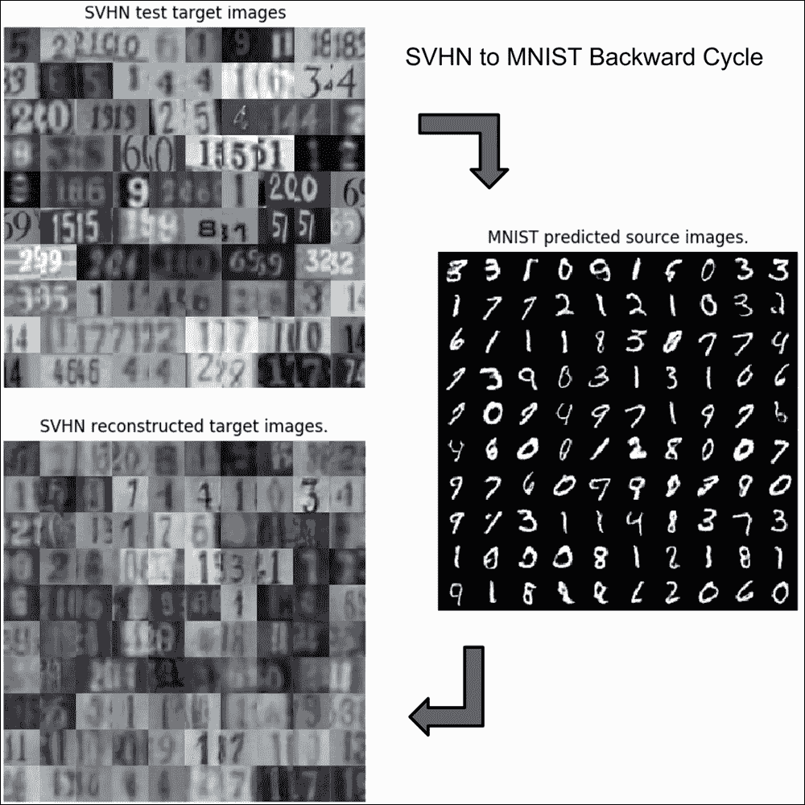

图 7.1.15：CycleGAN 与 PatchGAN 在 MNIST（源）到 SVHN（目标）的反向循环。重建后的目标图像与原始目标图像不完全相似。原始彩色照片可以在本书的 GitHub 仓库中找到，网址为 https://github.com/PacktPublishing/Advanced-Deep-Learning-with-Keras/blob/master/chapter7-cross-domain-gan/README.md。

在 *图 7.1.3* 中，CycleGAN 被描述为是循环一致的。换句话说，给定源 *x*，CycleGAN 在前向循环中重建源为 *x* *'*。此外，给定目标 *y*，CycleGAN 在反向循环中重建目标为 *y* *'*。

*图 7.1.14* 显示了 CycleGAN 在前向循环中重建 MNIST 数字。重建后的 MNIST 数字几乎与源 MNIST 数字完全相同。*图 7.1.15* 显示了 CycleGAN 在反向循环中重建 SVHN 数字。许多目标图像被重建。某些数字是完全相同的，例如第二行最后两列（3 和 4）。而有些数字相同但模糊，如第一行前两列（5 和 2）。有些数字被转换为另一个数字，尽管风格保持不变，例如第二行前两列（从 33 和 6 变为 1 和一个无法识别的数字）。

在个人层面上，我建议你使用 CycleGAN 的预训练模型与 PatchGAN 进行图像翻译：

```py
python3 cyclegan-7.1.1.py --mnist_svhn_g_source=cyclegan_mnist_svhn-g_source.h5 --mnist_svhn_g_target=cyclegan_mnist_svhn-g_target.h5

```

# 结论

在本章中，我们讨论了 CycleGAN 作为一种可以用于图像翻译的算法。在 CycleGAN 中，源数据和目标数据不一定是对齐的。我们展示了两个例子，*灰度* ↔ *彩色*，和 *MNIST* ↔ *SVHN*。虽然 CycleGAN 可以执行许多其他可能的图像翻译任务。

在下一章中，我们将探讨另一类生成模型，**变分自编码器**（**VAE**）。VAE 的目标与生成新图像（数据）相似，重点在于学习作为高斯分布建模的潜在向量。我们还将展示 GAN 所解决问题的其他相似之处，表现为条件 VAE 和 VAE 中潜在表示的解耦。

# 参考文献

1.  Yuval Netzer 等人. *使用无监督特征学习读取自然图像中的数字*. NIPS 深度学习与无监督特征学习研讨会. Vol. 2011. No. 2. 2011 ([`www-cs.stanford.edu/~twangcat/papers/nips2011_housenumbers.pdf`](https://www-cs.stanford.edu/~twangcat/papers/nips2011_housenumbers.pdf)).

1.  Zhu, Jun-Yan 等人. *使用循环一致生成对抗网络进行无配对图像到图像翻译*. 2017 IEEE 国际计算机视觉大会 (ICCV). IEEE, 2017 ([`openaccess.thecvf.com/content_ICCV_2017/papers/Zhu_Unpaired_Image-To-Image_Translation_ICCV_2017_paper.pdf`](http://openaccess.thecvf.com/content_ICCV_2017/papers/Zhu_Unpaired_Image-To-Image_Translation_ICCV_2017_paper.pdf)).

1.  Phillip Isola 等人. *使用条件生成对抗网络的图像到图像翻译*. 2017 IEEE 计算机视觉与模式识别大会 (CVPR). IEEE, 2017 ([`openaccess.thecvf.com/content_cvpr_2017/papers/Isola_Image-To-Image_Translation_With_CVPR_2017_paper.pdf`](http://openaccess.thecvf.com/content_cvpr_2017/papers/Isola_Image-To-Image_Translation_With_CVPR_2017_paper.pdf)).

1.  Mehdi Mirza 和 Simon Osindero. *条件生成对抗网络*. arXiv 预印本 arXiv:1411.1784, 2014 ([`arxiv.org/pdf/1411.1784.pdf`](https://arxiv.org/pdf/1411.1784.pdf)).

1.  Xudong Mao 等人. *最小二乘生成对抗网络*. 2017 IEEE 国际计算机视觉大会 (ICCV). IEEE, 2017 ([`openaccess.thecvf.com/content_ICCV_2017/papers/Mao_Least_Squares_Generative_ICCV_2017_paper.pdf`](http://openaccess.thecvf.com/content_ICCV_2017/papers/Mao_Least_Squares_Generative_ICCV_2017_paper.pdf)).

1.  Chuan Li 和 Michael Wand. *使用马尔可夫生成对抗网络的预计算实时纹理合成*. 欧洲计算机视觉会议. Springer, Cham, 2016 ([`arxiv.org/pdf/1604.04382.pdf`](https://arxiv.org/pdf/1604.04382.pdf)).

1.  Olaf Ronneberger, Philipp Fischer 和 Thomas Brox. *U-Net: 用于生物医学图像分割的卷积网络*. 国际医学图像计算与计算机辅助干预会议。Springer，Cham，2015 ([`arxiv.org/pdf/1505.04597.pdf`](https://arxiv.org/pdf/1505.04597.pdf))。

1.  Judy Hoffman 等人. *CyCADA: 循环一致性对抗域适应*. arXiv 预印本 arXiv:1711.03213，2017 ([`arxiv.org/pdf/1711.03213.pdf`](https://arxiv.org/pdf/1711.03213.pdf))。
