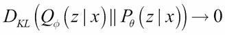
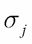
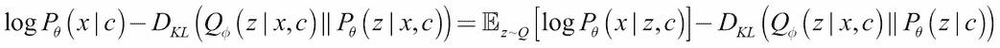

# 第八章：变分自编码器（VAE）

与我们在前几章讨论的**生成对抗网络**（**GANs**）类似，**变分自编码器**（**VAE**）[1]属于生成模型家族。VAE 的生成器能够在其连续的潜在空间中生成有意义的输出。解码器输出的可能属性通过潜在向量进行探索。

在 GAN 中，重点是如何得到一个能够逼近输入分布的模型。VAE 则试图通过可解码的连续潜在空间来建模输入分布。这是 GAN 与 VAE 生成更逼真信号的一个可能的根本原因。例如，在图像生成中，GAN 能够生成更逼真的图像，而 VAE 则生成较为模糊的图像。

在 VAE 中，重点是潜在代码的变分推断。因此，VAE 为学习和高效的贝叶斯推断提供了一个合适的框架。例如，具有解耦表示的 VAE 可以使潜在代码在迁移学习中得到重用。

从结构上看，VAE 与自编码器相似。它们也由编码器（也称为识别或推断模型）和解码器（也称为生成模型）组成。VAE 和自编码器都试图在学习潜在向量的同时重建输入数据。然而，与自编码器不同，VAE 的潜在空间是连续的，解码器本身被用作生成模型。

与前几章讨论的生成对抗网络（GANs）类似，VAE 的解码器也可以进行条件化。例如，在 MNIST 数据集中，我们可以指定给定一个 one-hot 向量时要生成的数字。这类条件 VAE 被称为 CVAE [2]。VAE 的潜在向量也可以通过在损失函数中加入正则化超参数来进行解耦。这被称为


-VAE [5]。例如，在 MNIST 中，我们可以分离出决定每个数字的厚度或倾斜角度的潜在向量。

本章的目标是介绍：

+   VAE 的原理

+   理解重新参数化技巧，帮助在 VAE 优化中使用随机梯度下降

+   条件 VAE（CVAE）的原理和

    -VAE

+   理解如何在 Keras 库中实现 VAE

# VAE 原理

在生成模型中，我们通常感兴趣的是使用神经网络来逼近输入的真实分布：


（公式 8.1.1）

在前面的公式中，


是在训练过程中确定的参数。例如，在名人面孔数据集的背景下，这相当于找到一个可以生成面孔的分布。类似地，在 MNIST 数据集中，这个分布可以生成可识别的手写数字。

在机器学习中，为了进行某种层次的推理，我们感兴趣的是找到


，是输入`x`与潜在变量`z`之间的联合分布。潜在变量不是数据集的一部分，而是编码从输入中可观察到的某些属性。在名人面孔的背景下，这些可能是面部表情、发型、发色、性别等。在 MNIST 数据集中，潜在变量可能表示数字和书写风格。


实际上是输入数据点及其属性的分布。`P` *θ*(`x`)可以从边际分布中计算出来：


（方程 8.1.2）

换句话说，考虑所有可能的属性，我们最终得到了描述输入的分布。在名人面孔的例子中，如果我们考虑所有的面部表情、发型、发色、性别，那么描述名人面孔的分布就能被恢复出来。在 MNIST 数据集中，如果我们考虑所有可能的数字、书写风格等，最终我们得到了手写数字的分布。

问题是*方程 8.1.2*是*不可解的*。这个方程没有解析形式或有效的估计器，无法对其参数进行微分。因此，使用神经网络进行优化是不可行的。

使用贝叶斯定理，我们可以为*方程 8.1.2*找到另一种表达方式：


（方程 8.1.3）

`P(z)`是`z`的先验分布。它不依赖于任何观察。如果`z`是离散的，并且


是高斯分布，那么


是高斯混合分布。如果`z`是连续的，


它是高斯分布的无限混合。

实际上，如果我们尝试构建一个神经网络来逼近


如果没有合适的损失函数，它将忽略`z`并得出一个琐碎的解


=


因此，*方程 8.1.3*不能为我们提供一个好的估计


.

另外，*方程 8.1.2*也可以表达为：


（方程 8.1.4）

然而，


也是不可解的。VAEs 的目标是找到一个可解的分布，能紧密地估计


.

## 变分推断

为了使


为了可处理性，VAE 引入了变分推断模型（编码器）：


(方程式 8.1.5)


提供了一个对的良好估计


. 它既是参数化的，又是可处理的。


可以通过深度神经网络优化参数来近似


.

通常，


被选为多元高斯分布：


(方程式 8.1.6)

两者的含义是，


，以及标准差，


，由编码器神经网络使用输入数据点计算得出。对角矩阵意味着 `z` 的元素是独立的。

## 核心方程

推断模型


从输入 `x` 生成潜在向量 `z`。


它类似于自编码器模型中的编码器。另一方面，


从潜在代码 `z` 重构输入数据。


其作用类似于自编码器模型中的解码器。为了估计


，我们必须确定它与的关系


和


.

如果


是对的估计


，**Kullback-Leibler**（**KL**）散度决定了这两个条件概率分布之间的距离：


(方程式 8.1.7)

使用贝叶斯定理，


(方程式 8.1.8)

在 *方程式 8.1.7* 中，


(方程式 8.1.9)


可以将期望值提出，因为它不依赖于


. 重新排列前面的方程并认识到


:


(方程式 8.1.10)

*方程式 8.1.10* 是变分自编码器（VAE）的核心。左边是


我们正在最大化的是由于距离造成的误差较小


来自真实


. 我们可以回忆起对数运算不会改变极大值（或极小值）的位置。给定一个能够提供良好估计的推断模型


，


近似为零。第一项，


，右侧看起来像一个解码器，它从推理模型中提取样本来重建输入。第二项是另一个距离。这一次，它是在


先验


。

*方程 8.1.10*的左侧也被称为**变分下界**或**证据下界** (**ELBO**)。由于 KL 总是正值，ELBO 是


。通过优化参数来最大化 ELBO


和


神经网络的意义是：

+    或推理模型在编码`x`的属性到`z`时变得更好

+    在*方程 8.1.10*的右侧被最大化，或者解码器模型在从潜在向量`z`重建`x`方面变得更好

## 优化

*方程 8.1.10*的右侧包含关于 VAE 损失函数的两个重要信息。解码器项


意味着生成器从推理模型的输出中获取`z`样本来重建输入。最大化这一项意味着我们最小化**重建损失**，


。如果假设图像（数据）分布是高斯分布，则可以使用 MSE。如果每个像素（数据）被视为伯努利分布，则损失函数是二元交叉熵。

第二项，


，结果证明可以直接评估。从*方程 8.1.6*，


是一个高斯分布。通常，


也是一个均值为零、标准差为 1.0 的高斯分布。KL 项简化为：


（方程 8.1.11）

其中


是`z`的维度。两者


和



是通过推理模型计算的`x`的函数。为了最大化


，


和


。选择


来源于各向同性单位高斯的属性，通过适当的函数可以将其变形成任意分布。从*方程 8.1.11*，**KL 损失**


只是


。

### 注

例如，之前[6]已证明，可以使用该函数将各向同性高斯分布变形成环形分布


。

读者可以进一步探讨 Luc Devroye 的理论，*基于样本的非均匀随机变异生成* [7]。

总结来说，VAE 损失函数被定义为：


(方程式 8.1.12)

## 重参数化技巧


图 8.1.1：带有和不带有重参数化技巧的 VAE 网络

在前图的左侧展示了 VAE 网络。编码器接受输入`x`，并估计均值，


，以及标准差，


，多元高斯分布的潜在向量`z`。解码器从潜在向量`z`中采样，重建输入为


。这看起来很简单，直到反向传播时梯度更新发生。

反向传播的梯度不会通过随机**采样**块。虽然神经网络可以有随机输入，但梯度无法通过随机层。

解决此问题的方法是将**采样**过程作为输入推送出去，如*图 8.1.1*右侧所示。然后，计算样本为：


(方程式 8.1.13)

如果


和


以向量格式表达，然后


是逐元素相乘。使用*方程式 8.1.13*，看起来就像采样直接来自原本设想的潜在空间。这个技巧被称为**重参数化技巧**。

现在*采样*发生在输入端，VAE 网络可以使用熟悉的优化算法进行训练，如 SGD、Adam 或 RMSProp。

## 解码器测试

在训练完 VAE 网络后，推理模型，包括加法和乘法操作符，可以丢弃。为了生成新的有意义的输出，从生成所使用的高斯分布中采样。


。接下来的图展示了我们如何测试解码器：


图 8.1.2：解码器测试设置

## Keras 中的 VAE

VAE 的结构与典型的自编码器相似。区别主要在于重参数化技巧中的高斯随机变量采样。*列表* *8.1.1*展示了使用 MLP 实现的编码器、解码器和 VAE。这个代码也已经贡献到官方的 Keras GitHub 库中。为了简化讨论，潜在向量`z`是二维的。

编码器只是一个两层的 MLP，第二层生成均值和对数方差。使用对数方差是为了简化*KL 损失*和重参数化技巧的计算。编码器的第三个输出是使用重参数化技巧对`z`的采样。我们需要注意，在采样函数中，


由于


给定它是高斯分布的标准差。

解码器也是一个两层的 MLP，它接受 `z` 的样本来近似输入。编码器和解码器都使用一个大小为 512 的中间维度。

VAE 网络实际上是编码器和解码器的组合。*图 8.1.3* 到 *图 8.1.5* 显示了编码器、解码器和 VAE 模型。损失函数是 *重建损失* 和 *KL 损失* 的总和。VAE 网络在默认的 Adam 优化器下表现良好。VAE 网络的总参数数目为 807,700。

Keras 中的 VAE MLP 代码已经预训练权重。要进行测试，我们需要运行：

```py
$ python3 vae-mlp-mnist-8.1.1.py --weights=vae_mlp_mnist.h5

```

### 注意

完整代码可以在以下链接中找到：[`github.com/PacktPublishing/Advanced-Deep-Learning-with-Keras`](https://github.com/PacktPublishing/Advanced-Deep-Learning-with-Keras)。

清单 8.1.1，`vae-mlp-mnist-8.1.1.py` 显示了使用 MLP 层的 VAE Keras 代码：

```py
# reparameterization trick
# instead of sampling from Q(z|X), sample eps = N(0,I)
# z = z_mean + sqrt(var)*eps
def sampling(args):
    z_mean, z_log_var = args
    batch = K.shape(z_mean)[0]
    # K is the keras backend
    dim = K.int_shape(z_mean)[1]
    # by default, random_normal has mean=0 and std=1.0
    epsilon = K.random_normal(shape=(batch, dim))
    return z_mean + K.exp(0.5 * z_log_var) * epsilon

# MNIST dataset
(x_train, y_train), (x_test, y_test) = mnist.load_data()

image_size = x_train.shape[1]
original_dim = image_size * image_size
x_train = np.reshape(x_train, [-1, original_dim])
x_test = np.reshape(x_test, [-1, original_dim])
x_train = x_train.astype('float32') / 255
x_test = x_test.astype('float32') / 255

# network parameters
input_shape = (original_dim, )
intermediate_dim = 512
batch_size = 128
latent_dim = 2
epochs = 50

# VAE model = encoder + decoder
# build encoder model
inputs = Input(shape=input_shape, name='encoder_input')
x = Dense(intermediate_dim, activation='relu')(inputs)
z_mean = Dense(latent_dim, name='z_mean')(x)
z_log_var = Dense(latent_dim, name='z_log_var')(x)

# use reparameterization trick to push the sampling out as input
z = Lambda(sampling, output_shape=(latent_dim,), name='z')([z_mean, z_log_var])
# instantiate encoder model
encoder = Model(inputs, [z_mean, z_log_var, z], name='encoder')
encoder.summary()
plot_model(encoder, to_file='vae_mlp_encoder.png', show_shapes=True)

# build decoder model
latent_inputs = Input(shape=(latent_dim,), name='z_sampling')
x = Dense(intermediate_dim, activation='relu')(latent_inputs)
outputs = Dense(original_dim, activation='sigmoid')(x)

# instantiate decoder model
decoder = Model(latent_inputs, outputs, name='decoder')
decoder.summary()
plot_model(decoder, to_file='vae_mlp_decoder.png', show_shapes=True)

# instantiate vae model
outputs = decoder(encoder(inputs)[2])
vae = Model(inputs, outputs, name='vae_mlp')

if __name__ == '__main__':
    parser = argparse.ArgumentParser()
    help_ = "Load h5 model trained weights"
    parser.add_argument("-w", "--weights", help=help_)
    help_ = "Use mse loss instead of binary cross entropy (default)"
    parser.add_argument("-m",
                        "--mse",
                        help=help_, action='store_true')
    args = parser.parse_args()
    models = (encoder, decoder)
    data = (x_test, y_test)
    # VAE loss = mse_loss or xent_loss + kl_loss
    if args.mse:
        reconstruction_loss = mse(inputs, outputs)
    else:
        reconstruction_loss = binary_crossentropy(inputs,
                                                  outputs)
    reconstruction_loss *= original_dim
    kl_loss = 1 + z_log_var - K.square(z_mean) - K.exp(z_log_var)
    kl_loss = K.sum(kl_loss, axis=-1)
    kl_loss *= -0.5
    vae_loss = K.mean(reconstruction_loss + kl_loss)
    vae.add_loss(vae_loss)
    vae.compile(optimizer='adam')
    vae.summary()
    plot_model(vae,
               to_file='vae_mlp.png',
               show_shapes=True)

    if args.weights:
        vae = vae.load_weights(args.weights)
    else:
        # train the autoencoder
        vae.fit(x_train,
                epochs=epochs,
                batch_size=batch_size,
                validation_data=(x_test, None))
        vae.save_weights('vae_mlp_mnist.h5')

    plot_results(models,
                 data,
                 batch_size=batch_size,
                 model_name="vae_mlp")
```


图 8.1.3：VAE MLP 的编码器模型


图 8.1.4：VAE MLP 的解码器模型


图 8.1.5：使用 MLP 的 VAE 模型

*图 8.1.6* 显示了使用 `plot_results()` 在 50 个 epoch 后的潜在向量连续空间。为简化起见，函数在此未显示，但可以在 `vae-mlp-mnist-8.1.1.py` 的其余代码中找到。该函数绘制了两个图像，分别是测试数据集标签（*图 8.1.6*）和生成的数字样本（*图 8.1.7*），两者均为 `z` 的函数。这两个图展示了潜在向量如何决定生成数字的特征。

在连续空间中导航总是会得到一个与 MNIST 数字相似的输出。例如，数字 9 的区域靠近数字 7 的区域。从接近中心的 9 向左移动将数字变为 7。从中心向下移动将生成的数字从 3 变为 8，最终变为 1。数字的形态变化在 *图 8.1.7* 中更为明显，这也是对 *图 8.1.6* 的另一种解释。

在 *图 8.1.7* 中，生成器输出显示了潜在空间中数字的分布，而不是色条。可以观察到所有数字都被表示出来。由于分布在中心附近较为密集，因此在中间区域的变化较快，而在均值较大的地方变化较慢。我们需要记住，*图 8.1.7* 是 *图 8.1.6* 的反映。例如，数字 0 在两个图中的右上象限，而数字 1 在右下象限。

在 *图 8.1.7* 中有一些无法识别的数字，尤其是在左上方的象限。从下面的图中可以观察到，该区域大多为空，并且远离中心：


图 8.1.6：测试数据集的潜在向量均值（VAE MLP）。颜色条显示了与 z 对应的 MNIST 数字。彩色图像可在书籍的 GitHub 仓库中找到：https://github.com/PacktPublishing/Advanced-Deep-Learning-with-Keras/tree/master/chapter8-vae。


图 8.1.7：作为潜在向量均值函数生成的数字（VAE MLP）。为了便于解释，均值的值范围与图 8.1.6 类似。

## 使用 CNNs 进行 VAE

在原始论文 *Auto-encoding Variational Bayes* [1] 中，VAE 网络是使用 MLP 实现的，这与我们在前一节中介绍的类似。在本节中，我们将展示使用 CNN 会显著提高生成的数字质量，并且将参数数量大幅减少至 134,165。

*Listing* *8.1.3* 展示了编码器、解码器和 VAE 网络。该代码也已贡献到官方的 Keras GitHub 仓库。为了简洁起见，类似 MLP 的一些代码行不再显示。编码器由两层 CNN 和两层 MLP 组成，用于生成潜在代码。编码器输出结构类似于前一节中看到的 MLP 实现。解码器由一层 MLP 和三层反向卷积 CNN 组成。*图 8.1.8* 到 *8.1.10* 展示了编码器、解码器和 VAE 模型。对于 VAE CNN，RMSprop 会比 Adam 得到更低的损失。

VAE CNN 的 Keras 代码已包含预训练权重。要进行测试，我们需要运行：

```py
$ python3 vae-cnn-mnist-8.1.2.py --weights=vae_cnn_mnist.h5

```

Listing 8.1.3, `vae-cnn-mnist-8.1.2.py` 显示了使用 CNN 层的 VAE Keras 代码：

```py
# network parameters
input_shape = (image_size, image_size, 1)
batch_size = 128
kernel_size = 3
filters = 16
latent_dim = 2
epochs = 30

# VAE mode = encoder + decoder
# build encoder model
inputs = Input(shape=input_shape, name='encoder_input')
x = inputs
for i in range(2):
    filters *= 2
    x = Conv2D(filters=filters,
               kernel_size=kernel_size,
               activation='relu',
               strides=2,
               padding='same')(x)

# shape info needed to build decoder model
shape = K.int_shape(x)

# generate latent vector Q(z|X)
x = Flatten()(x)
x = Dense(16, activation='relu')(x)
z_mean = Dense(latent_dim, name='z_mean')(x)
z_log_var = Dense(latent_dim, name='z_log_var')(x)

# use reparameterization trick to push the sampling out as input
# note that "output_shape" isn't necessary with the TensorFlow backend
z = Lambda(sampling, output_shape=(latent_dim,), name='z')([z_mean, z_log_var])

# instantiate encoder model
encoder = Model(inputs, [z_mean, z_log_var, z], name='encoder')
encoder.summary()
plot_model(encoder, to_file='vae_cnn_encoder.png', show_shapes=True)

# build decoder model
latent_inputs = Input(shape=(latent_dim,), name='z_sampling')
x = Dense(shape[1]*shape[2]*shape[3], activation='relu')(latent_inputs)
x = Reshape((shape[1], shape[2], shape[3]))(x)

for i in range(2): 
    x = Conv2DTranspose(filters=filters,
                        kernel_size=kernel_size,
                        activation='relu',
                        strides=2,
                        padding='same')(x)
    filters //= 2

outputs = Conv2DTranspose(filters=1,
                    kernel_size=kernel_size,
                    activation='sigmoid',
                    padding='same',
                    name='decoder_output')(x)

# instantiate decoder model
decoder = Model(latent_inputs, outputs, name='decoder')
decoder.summary()
plot_model(decoder, to_file='vae_cnn_decoder.png', show_shapes=True)

# instantiate vae model
outputs = decoder(encoder(inputs)[2])
vae = Model(inputs, outputs, name='vae')
```


图 8.1.8：VAE CNN 的编码器


图 8.1.9：VAE CNN 的解码器


图 8.1.10：使用 CNNs 的 VAE 模型


图 8.1.11：测试数据集的潜在向量均值（VAE CNN）。颜色条显示了与 z 对应的 MNIST 数字。彩色图像可在书籍的 GitHub 仓库中找到：https://github.com/PacktPublishing/Advanced-Deep-Learning-with-Keras/tree/master/chapter8-vae。

前述图像展示了使用 CNN 实现的 VAE 在训练 30 个 epoch 后的连续潜在空间。每个数字分配的区域可能不同，但分布大致相同。下图展示了生成模型的输出。定性上，与 *图 8.1.7* 中的 MLP 实现相比，模糊的数字较少：


图 8.1.12：作为潜在向量均值函数生成的数字（VAE CNN）。为了便于解释，均值的值范围与图 8.1.11 类似。

# 条件 VAE (CVAE)

条件变分自编码器 [2] 类似于 CGAN 的思想。在 MNIST 数据集的背景下，如果潜在空间是随机采样的，VAE 无法控制生成哪个数字。CVAE 通过包含一个条件（数字的独热标签）来解决这个问题，从而生成特定的数字。这个条件被强加到编码器和解码器的输入上。

从形式上讲，VAE 的核心方程 *方程* *8.1.10* 被修改，以包括条件 `c`：



(方程 8.2.1)

与 VAE 类似，*方程* *8.2.1* 表示，如果我们想要最大化基于 `c` 的输出，


，那么两个损失项必须最小化：

+   在给定潜在向量和条件的情况下，解码器的重建损失。

+   编码器在给定潜在向量和条件的情况下与先验分布之间的 KL 损失。与 VAE 类似，我们通常选择 

    .

列表 8.2.1，`cvae-cnn-mnist-8.2.1.py` 展示了使用 CNN 层的 CVAE 的 Keras 代码。在突出显示的代码中展示了为支持 CVAE 所做的修改：

```py
# compute the number of labels
num_labels = len(np.unique(y_train))

# network parameters
input_shape = (image_size, image_size, 1)
label_shape = (num_labels, )
batch_size = 128
kernel_size = 3
filters = 16
latent_dim = 2
epochs = 30

# VAE model = encoder + decoder
# build encoder model
inputs = Input(shape=input_shape, name='encoder_input')
y_labels = Input(shape=label_shape, name='class_labels')
x = Dense(image_size * image_size)(y_labels)
x = Reshape((image_size, image_size, 1))(x)
x = keras.layers.concatenate([inputs, x])
for i in range(2):
    filters *= 2
    x = Conv2D(filters=filters,
               kernel_size=kernel_size,
               activation='relu',
               strides=2,
               padding='same')(x)

# shape info needed to build decoder model
shape = K.int_shape(x)

# generate latent vector Q(z|X)
x = Flatten()(x)
x = Dense(16, activation='relu')(x)
z_mean = Dense(latent_dim, name='z_mean')(x)
z_log_var = Dense(latent_dim, name='z_log_var')(x)

# use reparameterization trick to push the sampling out as input
# note that "output_shape" isn't necessary with the TensorFlow backend
z = Lambda(sampling, output_shape=(latent_dim,), name='z')([z_mean, z_log_var])

# instantiate encoder model
encoder = Model([inputs, y_labels], [z_mean, z_log_var, z], name='encoder')
encoder.summary()
plot_model(encoder, to_file='cvae_cnn_encoder.png', show_shapes=True)

# build decoder model
latent_inputs = Input(shape=(latent_dim,), name='z_sampling')
x = keras.layers.concatenate([latent_inputs, y_labels])
x = Dense(shape[1]*shape[2]*shape[3], activation='relu')(x)
x = Reshape((shape[1], shape[2], shape[3]))(x)
for i in range(2):
    x = Conv2DTranspose(filters=filters,
                        kernel_size=kernel_size,
                        activation='relu',
                        strides=2,
                        padding='same')(x)
    filters //= 2

outputs = Conv2DTranspose(filters=1,
                          kernel_size=kernel_size,
                          activation='sigmoid',
                          padding='same',
                          name='decoder_output')(x)

# instantiate decoder model
decoder = Model([latent_inputs, y_labels], outputs, name='decoder')
decoder.summary()
plot_model(decoder, to_file='cvae_cnn_decoder.png', show_shapes=True)

# instantiate vae model
outputs = decoder([encoder([inputs, y_labels])[2], y_labels])
cvae = Model([inputs, y_labels], outputs, name='cvae')
if __name__ == '__main__':
    parser = argparse.ArgumentParser()
    help_ = "Load h5 model trained weights"
    parser.add_argument("-w", "--weights", help=help_)
    help_ = "Use mse loss instead of binary cross entropy (default)"
    parser.add_argument("-m", "--mse", help=help_, action='store_true')
 help_ = "Specify a specific digit to generate"
 parser.add_argument("-d", "--digit", type=int, help=help_)
 help_ = "Beta in Beta-CVAE. Beta > 1\. Default is 1.0 (CVAE)"
 parser.add_argument("-b", "--beta", type=float, help=help_)
    args = parser.parse_args()
    models = (encoder, decoder)
    data = (x_test, y_test)

 if args.beta is None or args.beta < 1.0:
 beta = 1.0
 print("CVAE")
 model_name = "cvae_cnn_mnist"
 else:
 beta = args.beta
 print("Beta-CVAE with beta=", beta)
 model_name = "beta-cvae_cnn_mnist"

    # VAE loss = mse_loss or xent_loss + kl_loss
    if args.mse:
        reconstruction_loss = mse(K.flatten(inputs), K.flatten(outputs))
    else:
        reconstruction_loss = binary_crossentropy(K.flatten(inputs),
                                                  K.flatten(outputs))

    reconstruction_loss *= image_size * image_size
    kl_loss = 1 + z_log_var - K.square(z_mean) - K.exp(z_log_var)
    kl_loss = K.sum(kl_loss, axis=-1)
 kl_loss *= -0.5 * beta
 cvae_loss = K.mean(reconstruction_loss + kl_loss)
 cvae.add_loss(cvae_loss)
 cvae.compile(optimizer='rmsprop')
 cvae.summary()
 plot_model(cvae, to_file='cvae_cnn.png', show_shapes=True)

 if args.weights:
 cvae = cvae.load_weights(args.weights)
 else:
 # train the autoencoder
 cvae.fit([x_train, to_categorical(y_train)],
 epochs=epochs,
 batch_size=batch_size,
 validation_data=([x_test, to_categorical(y_test)], None))
 cvae.save_weights(model_name + '.h5')

 if args.digit in range(0, num_labels):
 digit = np.array([args.digit])
 else:
 digit = np.random.randint(0, num_labels, 1)

 print("CVAE for digit %d" % digit)
 y_label = np.eye(num_labels)[digit]
 plot_results(models,
 data,
 y_label=y_label,
 batch_size=batch_size,
 model_name=model_name)

```


图 8.2.1：CVAE CNN 中的编码器。输入现在是 VAE 输入和条件标签的拼接。


图 8.2.2：CVAE CNN 中的解码器。输入现在是 z 采样和条件标签的拼接。


图 8.2.3：使用 CNN 的 CVAE 模型。输入现在是 VAE 输入和条件标签的拼接。

实现 CVAE 需要对 VAE 的代码进行一些修改。对于 CVAE，使用了 VAE CNN 的实现。*列表* *8.2.1* 突出显示了对 MNIST 数字的 VAE 原始代码所做的修改。编码器输入现在是原始输入图像和其独热标签的拼接。解码器输入现在是潜在空间采样和它应该生成的图像的独热标签的组合。总参数数量为 174,437。与代码相关的部分


-VAE 将在本章的下一节中讨论。

损失函数没有变化。然而，在训练、测试和绘制结果时提供了独热标签。*图 8.2.1* 到 *8.2.3* 向我们展示了编码器、解码器和 CVAE 模型。指明了条件标签作为独热向量的作用。


图 8.2.4：测试数据集的潜在向量均值（CVAE CNN）。颜色条显示了与 z 相关的对应 MNIST 数字。彩色图像可以在书籍的 GitHub 仓库找到： https://github.com/PacktPublishing/Advanced-Deep-Learning-with-Keras/tree/master/chapter8-vae。


图 8.2.5：根据潜在向量均值和独热标签（CVAE CNN）生成的数字 0 到 5。为了便于理解，均值的取值范围与图 8.2.4 相似。


图 8.2.6：根据潜在向量均值和独热标签（CVAE CNN）生成的数字 6 到 9。为了便于理解，均值的取值范围与图 8.2.4 相似。

在*图 8.2.4*中，展示了经过 30 个 epoch 后每个标签的均值分布。与前面章节中的*图 8.1.6*和*8.1.11*不同，每个标签并没有集中在某个区域，而是分布在整个图中。这是预期中的结果，因为在潜在空间中的每次采样应当生成一个特定的数字。导航潜在空间会改变该特定数字的属性。例如，如果指定的数字是 0，那么导航潜在空间仍会产生 0，但其属性（如倾斜角度、粗细以及其他书写风格特征）会有所不同。

这些变化在*图 8.2.5*和*8.2.6*中表现得更加清晰。为了便于比较，潜在向量的取值范围与*图 8.2.4*中的一致。使用预训练的权重，可以通过执行以下命令生成一个数字（例如，0）：

```py
$ python3 cvae-cnn-mnist-8.2.1.py --weights=cvae_cnn_mnist.h5 --digit=0

```

在*图 8.2.5*和*8.2.6*中，可以注意到每个数字的宽度和圆度（如果适用）随着`z₀`从左到右的变化而变化。同时，随着`z₁`从上到下的变化，每个数字的倾斜角度和圆度（如果适用）也会发生变化。当我们离分布的中心越来越远时，数字的图像开始退化。这是预期中的结果，因为潜在空间是一个圆形。

其他显著的属性变化可能是针对特定数字的。例如，数字 1 的水平笔画（臂）会出现在左上方区域。数字 7 的水平笔画（横杆）则只出现在右侧区域。

# -VAE：具有解耦潜在表示的 VAE

在第六章中，讨论了*解耦表示 GAN*的概念以及潜在编码的解耦表示的重要性。我们可以回顾一下，解耦表示指的是单一潜在单元对单个生成因子的变化敏感，同时对其他因子的变化保持相对不变[3]。改变潜在编码会导致生成输出中某一属性的变化，而其他属性保持不变。

在同一章节中，InfoGANs [4]向我们展示了在 MNIST 数据集中，可以控制生成的数字和倾斜和书写风格的厚度。观察前一节中的结果，可以注意到 VAE 在某种程度上本质上正在分离潜在向量维度。例如，查看*图 8.2.6*中的数字 8，导航`z₁`从顶部到底部减少宽度和圆度，同时将数字顺时针旋转。增加`z₀`从左到右也减少了宽度和圆度，同时将数字逆时针旋转。换句话说，`z₁`控制顺时针旋转，`z₀`影响逆时针旋转，两者都改变宽度和圆度。

在本节中，我们将展示 VAE 损失函数中的简单修改如何进一步迫使潜在代码分离。该修改是正常数加权，


，作为 KL 损失的正则化器：


（方程 8.3.1）

这种 VAE 的变体被称为


-VAE [5]。隐式效果


是更紧密的标准偏差。换句话说，


强制后验分布中的潜在代码，


独立。

实施是很直接的


-VAE。例如，对于前述的 CVAE，所需的修改是`kl_loss`中额外的**beta**因子。

```py
    kl_loss = 1 + z_log_var - K.square(z_mean) - K.exp(z_log_var)
    kl_loss = K.sum(kl_loss, axis=-1)
    kl_loss *= -0.5 * beta

```

CVAE 是的一种特例


-VAE with


。其他都相同。然而，确定 


需要一些试验和错误。必须在重建误差和潜在代码独立性的正则化之间进行仔细平衡。在约


. 当值为 


，


-VAE 被迫仅学习一个分离的表示，同时静音另一个潜在维度：


图 8.3.1：测试数据集的潜在向量均值（


-VAE with


）彩色图像可以在本书的 GitHub 仓库中找到： https://github.com/PacktPublishing/Advanced-Deep-Learning-with-Keras/tree/master/chapter8-vae。

*图 8.3.1* 和 *图 8.3.2* 展示了


-VAE 与


和


。随着


，与 CVAE 相比，该分布的标准差较小。随着


，只有学习到的潜在编码。分布实际上被缩小到 1D，第一潜在编码 `z₀` 被编码器和解码器忽略：


图 8.3.2：测试数据集的潜在向量均值（


-VAE 与


）彩色图像可以在本书的 GitHub 仓库中找到： https://github.com/PacktPublishing/Advanced-Deep-Learning-with-Keras/tree/master/chapter8-vae。

这些观察结果在 *图 8.3.3* 中有所体现。


-VAE 与


有两个潜在编码是相对独立的。`z₀` 决定书写风格的倾斜角度。同时，`z₁` 指定数字的宽度和圆润度（如果适用）。


-VAE 与


，`z₀` 被静音。增加 `z₀` 不会显著改变数字。`z₁` 决定了书写风格的倾斜角度和宽度。


图 8.3.3：数字 0 到 3 作为潜在向量均值和 one-hot 标签的函数生成（


-VAE


）为了便于理解，均值的值范围与图 8.3.1 类似。

Keras 代码


-VAE 具有预训练权重。要测试


-VAE 与


生成数字 0，我们需要运行：

```py
$ python3 cvae-cnn-mnist-8.2.1.py --beta=7 --weights=beta-cvae_cnn_mnist.h5 --digit=0

```

# 结论

在本章中，我们介绍了变分自编码器（VAE）的基本原理。正如我们在 VAE 原理中所学到的，它们与 GAN 在某些方面相似，因为它们都试图从潜在空间生成合成输出。然而，可以注意到，相较于 GAN，VAE 网络更加简单且易于训练。条件 VAE 和


-VAE 在概念上与条件 GAN 和解缠表示 GAN 相似。

VAE 具有解缠潜在向量的内在机制。因此，构建一个


-VAE 非常直观。然而，我们应该注意到，可解释的和解缠的编码在构建智能代理时是重要的。

在下一章中，我们将重点介绍强化学习。在没有任何先验数据的情况下，代理通过与环境的互动来学习。我们将讨论如何根据正确的行动奖励代理，并对错误的行动进行惩罚。

# 参考文献

1.  Diederik P. Kingma 和 Max Welling。*自编码变分贝叶斯*。arXiv 预印本 arXiv:1312.6114，2013([`arxiv.org/pdf/1312.6114.pdf`](https://arxiv.org/pdf/1312.6114.pdf))。

1.  Kihyuk Sohn、Honglak Lee 和 Xinchen Yan。*使用深度条件生成模型学习结构化输出表示*。神经信息处理系统进展，2015([`papers.nips.cc/paper/5775-learning-structured-output-representation-using-deep-conditional-generative-models.pdf`](http://papers.nips.cc/paper/5775-learning-structured-output-representation-using-deep-conditional-generative-models.pdf))。

1.  Yoshua Bengio、Aaron Courville 和 Pascal Vincent。*表示学习：综述与新视角*。IEEE 模式分析与机器智能事务 35.8，2013：1798-1828([`arxiv.org/pdf/1206.5538.pdf`](https://arxiv.org/pdf/1206.5538.pdf))。

1.  Xi Chen 等人。*Infogan: 通过信息最大化生成对抗网络进行可解释的表示学习*。神经信息处理系统进展，2016([`papers.nips.cc/paper/6399-infogan-interpretable-representation-learning-by-information-maximizing-generative-adversarial-nets.pdf`](http://papers.nips.cc/paper/6399-infogan-interpretable-representation-learning-by-information-maximizing-generative-adversarial-nets.pdf))。

1.  I. Higgins、L. Matthey、A. Pal、C. Burgess、X. Glorot、M. Botvinick、S. Mohamed 和 A. Lerchner。

    *-VAE: 使用受限变分框架学习基础视觉概念*。ICLR，2017([`openreview.net/pdf?id=Sy2fzU9gl`](https://openreview.net/pdf?id=Sy2fzU9gl))。

1.  Carl Doersch。*变分自编码器教程*。arXiv 预印本 arXiv:1606.05908，2016([`arxiv.org/pdf/1606.05908.pdf`](https://arxiv.org/pdf/1606.05908.pdf))。

1.  Luc Devroye. *基于样本的非均匀随机变量生成*. 第 18 届冬季仿真会议论文集. ACM, 1986([`www.eirene.de/Devroye.pdf`](http://www.eirene.de/Devroye.pdf)).
