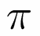
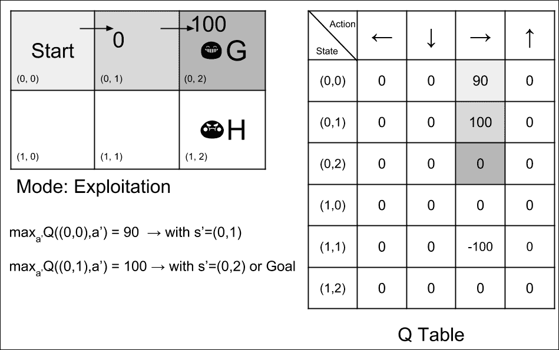
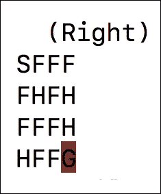
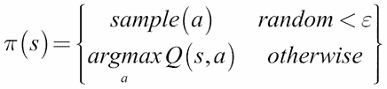
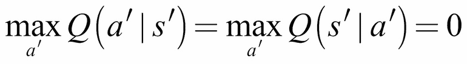

# 第九章：第 9 章：深度强化学习

**强化学习** (**RL**) 是一个框架，由代理用于决策。代理不一定是软件实体，比如在视频游戏中。相反，它可以体现在硬件中，如机器人或自动驾驶汽车。体现代理可能是充分理解和利用强化学习的最佳方式，因为物理实体与现实世界互动并接收响应。

代理位于一个**环境**中。环境具有部分或完全可观察的**状态**。代理有一组**行动**，可以用来与其环境交互。行动的结果会将环境转换到一个新的状态。执行行动后将收到相应的标量**奖励**。代理的目标是通过学习一个**策略**，在给定状态下决定采取哪个行动来最大化累积的未来奖励。

强化学习与人类心理学有很强的相似性。人类通过经验世界来学习。错误的行动会导致一定形式的惩罚，并应在未来避免，而正确的行动则受到奖励并应该鼓励。这种与人类心理学的强烈相似性已经使许多研究人员相信，强化学习可以引领我们走向**人工智能** (**AI**)。

强化学习已经存在几十年了。然而，超越简单世界模型，RL 在扩展方面一直存在困难。这就是**深度学习** (**DL**) 发挥作用的地方。它解决了这个可扩展性问题，开启了**深度强化学习** (**DRL**) 的时代，这也是本章重点讨论的内容。DRL 中的一个显著例子是 DeepMind 在能够超越不同视频游戏中最佳人类表现的代理工作。在本章中，我们讨论了 RL 和 DRL 两者。

总之，本章的目标是提供：

+   RL 的原理

+   强化学习技术 Q 学习

+   包括**深度 Q 网络** (**DQN**) 和 **双 Q 学习** (**DDQN**) 在内的高级主题

+   在 Python 上实施 RL 和在 Keras 中实现 DRL 的指南

# 强化学习（RL）的原理

*图 9.1.1* 显示了用于描述 RL 的感知-行动-学习循环。环境是一个放在地板上的苏打罐。代理是一个移动机器人，其目标是拾取苏打罐。它观察周围的环境，并通过机载摄像头跟踪苏打罐的位置。观察结果以一种状态的形式总结，机器人将使用该状态来决定采取哪些行动。它采取的行动可能涉及低级控制，如每个轮子的旋转角度/速度，每个机械臂关节的旋转角度/速度，以及夹持器是否打开或关闭。

或者，动作可能是高层次的控制动作，例如让机器人前进/后退，按照某个角度转向，抓取/释放。任何使抓手远离可乐的动作都会得到负奖励。任何缩小抓手位置与可乐之间距离的动作都会得到正奖励。当机器人臂成功拾起可乐罐时，会得到一个较大的正奖励。RL 的目标是学习最优策略，帮助机器人根据状态决定采取何种动作，以最大化累积的折扣奖励：


图 9.1.1：强化学习中的感知-行动-学习循环

正式来说，RL 问题可以描述为**马尔可夫决策过程**（**MDP**）。为简化起见，我们假设是一个*确定性*环境，其中在给定状态下的某个动作将始终导致已知的下一个状态和奖励。在本章稍后的部分，我们将探讨如何考虑随机性。在时间步`t`时：

+   环境处于状态`sₜ`，来自状态空间，状态可能是离散的或连续的。起始状态是`s[0]`，而终止状态是`sₜ`。

+   代理根据策略从动作空间中采取动作`aₜ`，。可能是离散的或连续的。

+   环境使用状态转移动态转移到新的状态`s[t+1]`。下一个状态只依赖于当前的状态和动作。对代理不可知。

+   代理使用奖励函数 r*[t+1]* = `R`(`sₜ`,`aₜ`)接收一个标量奖励，其中。奖励仅依赖于当前的状态和动作。`R`对代理不可知。

+   未来的奖励由折扣，其中，`k`是未来的时间步。

+   *Horizon*，`H`，是完成一次从`s[0]`到`sₜ`的回合所需的时间步数`T`。

环境可以是完全可观察的，也可以是部分可观察的。后者通常被称为**部分可观察的 MDP**或**POMDP**。大多数情况下，完全观察环境是不现实的。为了提高可观察性，除了当前观察之外，过去的观察也会被纳入考虑。状态包括关于环境的足够观察信息，供策略决定采取何种行动。在*图 9.1.1*中，这可以是机器人抓手与苏打罐相对的 3D 位置，由机器人摄像头估算得出。

每次环境过渡到新状态时，智能体会收到一个标量奖励，r*[t+1]*。在*图 9.1.1*中，每当机器人靠近苏打罐时，奖励为+1；每当远离时，奖励为-1；当机器人关闭抓手并成功拿起苏打罐时，奖励为+100。智能体的目标是学习最优策略，以最大化所有状态的*回报*：

（方程 9.1.1）

回报被定义为折扣累积奖励，。从*方程 9.1.1*可以观察到，未来的奖励相较于即时奖励权重较低，因为通常情况下，其中。在极端情况下，当，只有即时奖励才重要；当时，未来的奖励和即时奖励有相同的权重。

回报可以被解释为通过跟随某一任意策略，*某一状态*的*价值*，：

（方程 9.1.2）

换个角度来看强化学习（RL）问题，智能体的目标是学习最优策略，以最大化所有状态`s`的：

（方程 9.1.3）

最优策略的价值函数简单地表示为`V`*。在*图 9.1.1*中，最优策略是产生最短行动序列的策略，这个序列使得机器人越来越接近苏打罐，直到将其抓取。状态距离目标状态越近，其价值越高。

导致目标（或终止状态）事件序列可以被建模为策略的*轨迹*或*展开*：

*轨迹* = (s0a0r1s1,s1a1r2s2,...,s`T`-1a`T`-1`r` `T` `sₜ`) （方程 9.1.4）

如果 MDP 是*有终止的*，当代理到达终止状态`s[T']`时，状态会被重置为`s[0]`。如果`T`是有限的，我们就有一个有限的*视野*。否则，视野是无限的。在*图 9.1.1*中，如果 MDP 是有终止的，那么在收集完可乐罐后，机器人可能会寻找另一个可乐罐来捡起来，RL 问题就会重复。

# Q 值

一个重要的问题是，如果 RL 问题是找到，那么代理通过与环境交互是如何学习的？*方程* *9.1.3*并没有明确指出要尝试的动作和计算回报的下一个状态。在 RL 中，我们发现通过使用`Q`值来学习会更容易：

（方程 9.2.1）

其中：

（方程 9.2.2）

换句话说，*方程 9.2.1*不是寻找最大化所有状态的值的策略，而是寻找最大化所有状态的质量（`Q`）值的动作。在找到`Q`值函数之后，`V`值和因此得出的分别由*方程 9.2.2*和*9.1.3*确定。

如果对于每个动作，都能观察到奖励和下一个状态，我们可以制定以下迭代或试错算法来学习`Q`值：

（方程 9.2.3）

为了简化符号，`s` *'* 和 `a` *'* 分别表示下一个状态和动作。*方程 9.2.3*被称为**贝尔曼方程**，它是 Q 学习算法的核心。Q 学习尝试将回报或价值的一级展开（*方程 9.1.2*）近似为当前状态和动作的函数。

从对环境动态的零知识开始，代理尝试一个动作`a`，以奖励`r`和下一个状态`s` *'的形式观察发生了什么。选择下一个合乎逻辑的动作，从而为下一个状态提供最大的`Q`值。所有在*方程* *9.2.3*中已知的项，当前状态-动作对的`Q`值就被更新。通过迭代地进行更新，最终会学习到`Q`值函数。

Q 学习是一种*脱离策略*的 RL 算法。它通过不直接从该策略中采样经验来学习改进策略。换句话说，`Q`值是独立于代理使用的底层策略进行学习的。当`Q`值函数收敛时，只有通过*方程* *9.2.1*才能确定最优策略。

在给出 Q-Learning 的使用示例之前，我们需要注意，智能体必须不断探索其环境，同时逐渐利用到目前为止所学到的内容。这是强化学习中的一个问题——如何在 *探索* 和 *利用* 之间找到正确的平衡。通常，在学习初期，动作是随机的（探索）。随着学习的进行，智能体利用 `Q` 值（利用）。例如，刚开始时，90% 的动作是随机的，10% 是基于 `Q` 值函数的，而在每一轮结束时，这个比例逐渐减小。最终，动作是 10% 随机的，90% 基于 `Q` 值函数。

# Q-Learning 示例

为了说明 Q-Learning 算法，我们需要考虑一个简单的确定性环境，如下图所示。环境中有六个状态。允许转移的奖励如图所示。只有在两种情况下，奖励才为非零。转移到 **目标** (`G`) 状态时奖励 +100，而进入 **洞** (`H`) 状态时奖励为 -100。这两个状态是终止状态，构成从 **起始** 状态结束一个回合的条件：


图 9.3.1：简单确定性世界中的奖励

为了正式化每个状态的标识，我们需要使用（*行*，*列*）标识符，如下图所示。由于智能体尚未了解其环境，因此下图中显示的 Q-表的初始值为零。在此示例中，折扣因子，。回顾一下，在当前 `Q` 值的估算中，折扣因子决定了未来 `Q` 值的权重，权重是根据步数的函数，。在 *方程式* *9.2.3* 中，我们只考虑了即时的未来 `Q` 值，`k` = 1：


图 9.3.2：简单确定性环境中的状态和智能体的初始 Q-表

初始时，智能体假设采取的策略是 90% 的时间选择随机动作，10% 的时间利用 Q-表。假设第一次动作是随机选择的，并且表示朝正确方向移动。*图 9.3.3* 展示了向右移动动作中，状态 (0, 0) 的新 `Q` 值的计算。下一个状态是 (0, 1)。奖励为 0，下一个状态的所有 `Q` 值的最大值是零。因此，状态 (0, 0) 在向右移动动作中的 `Q` 值保持为 0。

为了便于追踪初始状态和下一个状态，我们在环境和 Q-表中使用不同的灰度阴影——初始状态使用较浅的灰色，下一状态使用较深的灰色。在为下一状态选择动作时，候选动作的边框较粗：


图 9.3.3：假设智能体采取的动作是向右移动，显示了状态 (0, 0) 的 Q 值更新


图 9.3.4：假设智能体选择的动作是向下移动，状态 (0, 1) 的 Q 值更新如图所示。


图 9.3.5：假设智能体选择的动作是向右移动，状态 (1, 1) 的 Q 值更新如图所示。

假设下一步随机选择的动作是向下移动。*图 9.3.4* 显示向下移动时，状态 (0, 1) 的 `Q` 值没有变化。在 *图 9.3.5* 中，智能体的第三个随机动作是向右移动。它遇到了 `H` 状态并收到了 -100 的惩罚。这次更新非零。状态 (1, 1) 向右移动的 `Q` 值为 -100。一次试验刚刚结束，智能体返回到 **Start** 状态。


图 9.3.6：假设智能体选择的动作是连续两步向右移动，状态 (0, 1) 的 Q 值更新如图所示。

假设智能体仍处于探索模式，如 *图 9.3.6* 所示。它在第二次试验的第一步选择了向右移动。正如预期的那样，更新值为 0。然而，它选择的第二个随机动作仍然是向右移动。智能体达到了 `G` 状态并获得了 +100 的奖励。状态 (0, 1) 向右移动的 `Q` 值变为 100。第二次试验完成，智能体返回到 **Start** 状态。


图 9.3.7：假设智能体选择的动作是向右移动，状态 (0, 0) 的 Q 值更新如图所示。



图 9.3.8：在此情况下，智能体的策略决定利用 Q 表来确定状态 (0, 0) 和 (0, 1) 的动作。Q 表建议两个状态都向右移动。

在第三次试验开始时，智能体随机选择的动作是向右移动。状态 (0, 0) 的 `Q` 值现在被更新为非零值，因为下一状态的可能动作的最大 `Q` 值为 100。*图 9.3.7* 展示了相关的计算过程。下一状态 (0, 1) 的 `Q` 值回传到之前的状态 (0, 0)，这就像是对帮助找到 `G` 状态的早期状态进行的奖励。

在 Q 表中的进展是显著的。事实上，在下一次试验中，如果出于某种原因，策略决定利用 Q 表而不是随机探索环境，那么根据 *图 9.3.8* 中的计算，第一步将是向右移动。在 Q 表的第一行中，导致最大 `Q` 值的动作是向右移动。对于下一状态 (0, 1)，Q 表的第二行建议下一个动作仍然是向右移动。智能体成功地达到了目标。策略引导智能体采取正确的动作集来实现其目标。

如果 Q-Learning 算法继续无限运行，Q-表格将会收敛。收敛的假设条件是 RL 问题必须是确定性 MDP，奖励有界，并且所有状态都被无限次访问。

# Python 中的 Q-Learning

环境和上一节讨论的 Q-Learning 可以在 Python 中实现。由于策略只是一个简单的表格，因此目前不需要 Keras。*列表* *9.3.1* 显示了 `q-learning-9.3.1.py`，这是使用 `QWorld` 类实现简单确定性世界（环境、智能体、动作和 Q-表格算法）的代码。为了简洁起见，处理用户界面的函数未显示。

在此示例中，环境动态通过 `self.transition_table` 表示。在每次执行动作时，`self.transition_table` 决定下一个状态。执行动作的奖励存储在 `self.reward_table` 中。每次执行动作时，这两个表格都会被查询。Q-Learning 算法通过 `update_q_table()` 函数实现。每当智能体需要决定执行哪一个动作时，它会调用 `act()` 函数。动作可以是随机选择的，也可以是通过 Q-表格的策略决定的。选择随机动作的概率存储在 `self.epsilon` 变量中，并通过 `update_epsilon()` 函数使用固定的 `epsilon_decay` 进行更新。

在执行 *列表* *9.3.1* 中的代码之前，我们需要运行：

```py
$ sudo pip3 install termcolor

```

安装 `termcolor` 包。该包有助于在终端中可视化文本输出。

### 注意

完整代码可以在 GitHub 上找到：[`github.com/PacktPublishing/Advanced-Deep-Learning-with-Keras`](https://github.com/PacktPublishing/Advanced-Deep-Learning-with-Keras)。

列表 9.3.1，`q-learning-9.3.1.py`。一个简单的确定性 MDP，包含六个状态：

```py
from collections import deque
import numpy as np
import argparse
import os
import time
from termcolor import colored

class QWorld():
    def __init__(self):
        # 4 actions
        # 0 - Left, 1 - Down, 2 - Right, 3 - Up
        self.col = 4

        # 6 states
        self.row = 6

        # setup the environment
        self.q_table = np.zeros([self.row, self.col])
        self.init_transition_table()
        self.init_reward_table()

        # discount factor
        self.gamma = 0.9

        # 90% exploration, 10% exploitation
        self.epsilon = 0.9
        # exploration decays by this factor every episode
        self.epsilon_decay = 0.9
        # in the long run, 10% exploration, 90% exploitation
        self.epsilon_min = 0.1

        # reset the environment
        self.reset()
        self.is_explore = True

    # start of episode
    def reset(self):
        self.state = 0
        return self.state

    # agent wins when the goal is reached
    def is_in_win_state(self):
        return self.state == 2

    def init_reward_table(self):
        """
        0 - Left, 1 - Down, 2 - Right, 3 - Up
        ----------------
        | 0 | 0 | 100  |
        ----------------
        | 0 | 0 | -100 |
        ----------------
        """
        self.reward_table = np.zeros([self.row, self.col])
        self.reward_table[1, 2] = 100.
        self.reward_table[4, 2] = -100.

    def init_transition_table(self):
        """
        0 - Left, 1 - Down, 2 - Right, 3 - Up
        -------------
        | 0 | 1 | 2 |
        -------------
        | 3 | 4 | 5 |
        -------------
        """
        self.transition_table = np.zeros([self.row, self.col], dtype=int)

        self.transition_table[0, 0] = 0
        self.transition_table[0, 1] = 3
        self.transition_table[0, 2] = 1
        self.transition_table[0, 3] = 0

        self.transition_table[1, 0] = 0
        self.transition_table[1, 1] = 4
        self.transition_table[1, 2] = 2
        self.transition_table[1, 3] = 1

        # terminal Goal state
        self.transition_table[2, 0] = 2
        self.transition_table[2, 1] = 2
        self.transition_table[2, 2] = 2
        self.transition_table[2, 3] = 2

        self.transition_table[3, 0] = 3
        self.transition_table[3, 1] = 3
        self.transition_table[3, 2] = 4
        self.transition_table[3, 3] = 0

        self.transition_table[4, 0] = 3
        self.transition_table[4, 1] = 4
        self.transition_table[4, 2] = 5
        self.transition_table[4, 3] = 1

        # terminal Hole state
        self.transition_table[5, 0] = 5
        self.transition_table[5, 1] = 5
        self.transition_table[5, 2] = 5
        self.transition_table[5, 3] = 5

    # execute the action on the environment
    def step(self, action):
        # determine the next_state given state and action
        next_state = self.transition_table[self.state, action]
        # done is True if next_state is Goal or Hole
        done = next_state == 2 or next_state == 5
        # reward given the state and action
        reward = self.reward_table[self.state, action]
        # the enviroment is now in new state
        self.state = next_state
        return next_state, reward, done

    # determine the next action
    def act(self):
        # 0 - Left, 1 - Down, 2 - Right, 3 - Up
        # action is from exploration
        if np.random.rand() <= self.epsilon:
            # explore - do random action
            self.is_explore = True
            return np.random.choice(4,1)[0]

        # or action is from exploitation
        # exploit - choose action with max Q-value
        self.is_explore = False
        return np.argmax(self.q_table[self.state])

    # Q-Learning - update the Q Table using Q(s, a)
    def update_q_table(self, state, action, reward, next_state):
        # Q(s, a) = reward + gamma * max_a' Q(s', a')
        q_value = self.gamma * np.amax(self.q_table[next_state])
        q_value += reward
        self.q_table[state, action] = q_value

    # UI to dump Q Table contents
    def print_q_table(self):
        print("Q-Table (Epsilon: %0.2f)" % self.epsilon)
        print(self.q_table)

    # update Exploration-Exploitation mix
    def update_epsilon(self):
        if self.epsilon > self.epsilon_min:
            self.epsilon *= self.epsilon_decay
```

列表 9.3.2，`q-learning-9.3.1.py`。主要的 Q-Learning 循环。每次状态、动作、奖励和下一个状态的迭代都会更新智能体的 Q-表格：

```py
# state, action, reward, next state iteration
for episode in range(episode_count):
    state = q_world.reset()
    done = False
    print_episode(episode, delay=delay)
    while not done:
        action = q_world.act()
        next_state, reward, done = q_world.step(action)
        q_world.update_q_table(state, action, reward, next_state)
        print_status(q_world, done, step, delay=delay)
        state = next_state
        # if episode is done, perform housekeeping
        if done:
            if q_world.is_in_win_state():
                wins += 1
                scores.append(step)
                if wins > maxwins:
                    print(scores)
                    exit(0)
            # Exploration-Exploitation is updated every episode
            q_world.update_epsilon()
            step = 1 
        else:
            step += 1

print(scores)
q_world.print_q_table()
```

感知-动作-学习循环在 *列表* *9.3.2* 中有所说明。在每一轮中，环境重置为 *开始* 状态。选择并应用要执行的动作到环境中。观察到奖励和下一个状态，并用于更新 Q-表格。当达到 *目标* 或 *洞* 状态时，回合结束（`done = True`）。对于此示例，Q-Learning 执行 100 轮或 10 次胜利，以先达到的为准。由于 `self.epsilon` 变量在每一轮中减少，智能体开始倾向于利用 Q-表格来确定给定状态下的执行动作。为了查看 Q-Learning 模拟，我们只需要运行：

```py
$ python3 q-learning-9.3.1.py

```


图 9.3.9：显示智能体经过 2000 次胜利后的 Q-表格截图

上图显示了在运行时 `maxwins = 2000`（达到 2000`x` *目标* 状态）和 `delay = 0`（仅查看最终 Q-表格）的截图：

```py
$ python3 q-learning-9.3.1.py --train

```

Q-Table 已经收敛，并显示了在给定状态下代理可以采取的逻辑行动。例如，在第一行或状态 (0, 0) 中，策略建议向右移动。第二行的状态 (0, 1) 也是如此。第二个动作到达 *目标* 状态。`scores` 变量转储显示，随着代理从策略中获得正确的动作，采取的最小步骤数逐渐减少。

从 *图 9.3.9* 中，我们可以通过 *方程式 9.2.2* 来计算每个状态的值，。例如，对于状态 (0, 0)，`V`*(`s`) = max(81.0,72.9,90.0,81.0) = 90.0。以下图显示了每个状态的值：


图 9.3.10：来自图 9.3.9 和方程式 9.2.2 的每个状态的值

# 非确定性环境

如果环境是非确定性的，那么奖励和动作都是概率性的。新系统是一个随机的 MDP。为了反映非确定性奖励，新的值函数为：

（方程式 9.4.1）

贝尔曼方程被修改为：

（方程式 9.4.2）

# 时间差学习

Q-Learning 是一种更广泛的 **时间差学习** 或 **TD-Learning** 的特例 。更具体来说，它是一步 TD-Learning *TD*(0) 的特例：

（方程式 9.5.1）

在方程式中  是学习率。我们应该注意，当  时，*方程式* *9.5.1* 类似于贝尔曼方程。为简便起见，我们将 *方程式* *9.5.1* 称为 Q-Learning 或广义 Q-Learning。

之前，我们将 Q-Learning 称为一种离策略 RL 算法，因为它在不直接使用正在优化的策略的情况下学习 Q 值函数。一种 *在策略* 的一步 TD-Learning 算法的示例是 SARSA，类似于 *方程式* *9.5.1*：

（方程式 9.5.2）

主要的区别在于使用正在优化的策略来确定 `a`*'*。术语 `s`、`a`、`r`、`s`*'* 和 `a`*'*（因此称为 SARSA）必须已知，以便在每次迭代时更新 `Q` 值函数。Q-Learning 和 SARSA 都在 `Q` 值迭代中使用现有的估计，这一过程称为 **自举法**。在自举法中，我们通过奖励和随后的 `Q` 值估计来更新当前的 `Q` 值估计。

# OpenAI gym 上的 Q-Learning

在展示另一个示例之前，似乎需要一个合适的 RL 模拟环境。否则，我们只能在非常简单的问题上运行 RL 模拟，就像前面的示例一样。幸运的是，OpenAI 创建了 **Gym**，[`gym.openai.com`](https://gym.openai.com)。

Gym 是一个开发和比较强化学习算法的工具包。它可以与大多数深度学习库（包括 Keras）一起使用。可以通过运行以下命令来安装 Gym：

```py
$ sudo pip3 install gym

```

Gym 提供了多个可以用来测试强化学习算法的环境，比如玩具文本、经典控制、算法、Atari 和 2D/3D 机器人等。例如，`FrozenLake-v0` (*图 9.5.1*) 是一个玩具文本环境，类似于 Python 示例中的简单确定性世界。`FrozenLake-v0` 有 12 个状态。标记为 `S` 的是起始状态，`F` 是冰冻的湖面，安全的区域，`H` 是应该避免的洞穴状态，`G` 是目标状态，飞盘的位置。转移到目标状态的奖励为 +1，其他所有状态的奖励为 0。

在 `FrozenLake-v0` 中，还有四个可用的动作（左、下、右、上），称为动作空间。然而，与之前的简单确定性世界不同，实际的移动方向仅部分依赖于所选的动作。`FrozenLake-v0` 环境有两种变化：滑动和非滑动。如预期，滑动模式更具挑战性。



图 9.5.1：OpenAI Gym 中的冰冻湖环境

在 `FrozenLake-v0` 上应用一个动作会返回观察（相当于下一个状态）、奖励、完成（回合是否结束）以及调试信息的字典。环境的可观察属性，称为观察空间，通过返回的观察对象来捕捉。

广义 Q 学习可以应用于 `FrozenLake-v0` 环境。*表 9.5.1* 显示了滑动和非滑动环境中性能的改进。衡量策略性能的一种方法是执行的回合中，达到目标状态的比例。这个比例越高，效果越好。从纯探索（随机动作）约 1.5% 的基线开始，策略可以在非滑动环境中达到 ~76% 的目标状态，而在滑动环境中则为 ~71%。如预期，控制滑动环境更具挑战性。

由于只需要一个 Q 表，代码仍然可以在 Python 和 NumPy 中实现。*列表* *9.5.1* 展示了 `QAgent` 类的实现，而 *列表* *9.5.2* 展示了智能体的感知-行动-学习循环。除了使用 OpenAI Gym 中的 `FrozenLake-v0` 环境外，最重要的变化是实现了由 *方程式* *9.5.1* 所定义的广义 Q 学习，该实现位于 `update_q_table()` 函数中。

`qagent` 对象可以在滑动或非滑动模式下操作。该代理经过 40,000 次迭代训练。训练后，代理可以利用 Q-表来选择执行任何策略下的动作，如 *表 9.5.1* 的测试模式所示。使用学习到的策略后，性能大幅提升，正如 *表 9.5.1* 中所示。通过使用 gym，构建环境的许多代码都被简化了。

这将帮助我们专注于构建一个有效的强化学习（RL）算法。要使代码以慢动作或每个动作延迟 1 秒运行：

```py
$ python3 q-frozenlake-9.5.1.py -d -t=1

```

| 模式 | 运行 | 目标近似百分比 |
| --- | --- | --- |
| 训练非滑动 |

```py
python3 q-frozenlake-9.5.1.py

```

| 26.0 |
| --- |
| 测试非滑动 |

```py
python3 q-frozenlake-9.5.1.py -d

```

| 76.0 |
| --- |
| 纯随机非滑动动作 |

```py
python3 q-frozenlake-9.5.1.py -e

```

| 1.5 |
| --- |
| 训练滑动 |

```py
python3 q-frozenlake-9.5.1.py -s

```

| 26 |
| --- |
| 测试滑动 |

```py
python3 q-frozenlake-9.5.1.py -s -d

```

| 71.0 |
| --- |
| 纯随机滑动 |

```py
python3 q-frozenlake-9.5.1.py -s -e

```

| 1.5 |
| --- |

> 表 9.5.1：在 `FrozenLake-v0` 环境上使用学习率 = 0.5 的广义 Q-Learning 的基准和性能

列表 9.5.1，`q-frozenlake-9.5.1.py` 显示了在 `FrozenLake-v0` 环境中实现 Q-Learning：

```py
from collections import deque
import numpy as np
import argparse
import os
import time
import gym
from gym import wrappers, logger

class QAgent():
    def __init__(self,
                 observation_space,
                 action_space,
                 demo=False,
                 slippery=False,
                 decay=0.99):

        self.action_space = action_space
        # number of columns is equal to number of actions
        col = action_space.n
        # number of rows is equal to number of states
        row = observation_space.n
        # build Q Table with row x col dims
        self.q_table = np.zeros([row, col])

        # discount factor
        self.gamma = 0.9

        # initially 90% exploration, 10% exploitation
        self.epsilon = 0.9
        # iteratively applying decay til 10% exploration/90% exploitation
        self.epsilon_decay = decay
        self.epsilon_min = 0.1

        # learning rate of Q-Learning
        self.learning_rate = 0.1

        # file where Q Table is saved on/restored fr
        if slippery:
            self.filename = 'q-frozenlake-slippery.npy'
        else:
            self.filename = 'q-frozenlake.npy'

        # demo or train mode 
        self.demo = demo
        # if demo mode, no exploration
        if demo:
            self.epsilon = 0

    # determine the next action
    # if random, choose from random action space
    # else use the Q Table
    def act(self, state, is_explore=False):
        # 0 - left, 1 - Down, 2 - Right, 3 - Up
        if is_explore or np.random.rand() < self.epsilon:
            # explore - do random action
            return self.action_space.sample()

        # exploit - choose action with max Q-value
        return np.argmax(self.q_table[state])

    # TD(0) learning (generalized Q-Learning) with learning rate
    def update_q_table(self, state, action, reward, next_state):
        # Q(s, a) += alpha * (reward + gamma * max_a' Q(s', a') - Q(s, a))
        q_value = self.gamma * np.amax(self.q_table[next_state])
        q_value += reward
        q_value -= self.q_table[state, action]
        q_value *= self.learning_rate
        q_value += self.q_table[state, action]
        self.q_table[state, action] = q_value

    # dump Q Table
    def print_q_table(self):
        print(self.q_table)
        print("Epsilon : ", self.epsilon)

    # save trained Q Table
    def save_q_table(self):
        np.save(self.filename, self.q_table)

    # load trained Q Table
    def load_q_table(self):
        self.q_table = np.load(self.filename)

    # adjust epsilon
    def update_epsilon(self):
        if self.epsilon > self.epsilon_min:
            self.epsilon *= self.epsilon_decay
```

列表 9.5.2，`q-frozenlake-9.5.1.py`。`FrozenLake-v0` 环境的主要 Q-Learning 循环：

```py
# loop for the specified number of episode
for episode in range(episodes):
    state = env.reset()
    done = False
    while not done:
        # determine the agent's action given state
        action = agent.act(state, is_explore=args.explore)
        # get observable data
        next_state, reward, done, _ = env.step(action)
        # clear the screen before rendering the environment
        os.system('clear')
        # render the environment for human debugging
        env.render()
        # training of Q Table
        if done:
            # update exploration-exploitation ratio
            # reward > 0 only when Goal is reached
            # otherwise, it is a Hole
            if reward > 0:
                wins += 1

        if not args.demo:
            agent.update_q_table(state, action, reward, next_state)
            agent.update_epsilon()

        state = next_state
        percent_wins = 100.0 * wins / (episode + 1)
        print("-------%0.2f%% Goals in %d Episodes---------"
              % (percent_wins, episode))
        if done:
            time.sleep(5 * delay)
        else:
            time.sleep(delay)
```

# 深度 Q-网络 (DQN)

在小型离散环境中，使用 Q-表来实现 Q-Learning 是可行的。然而，当环境有大量状态或像大多数情况那样是连续的时，Q-表就不再可行或实际。例如，如果我们观察的是由四个连续变量组成的状态，那么表的大小是无限的。即使我们尝试将这四个变量每个离散化为 1000 个值，表中行的总数将是令人吃惊的 1000⁴ = 1`e`¹²。即使在训练后，表仍然是稀疏的——表中的大多数单元格都是零。

解决这个问题的方法被称为 DQN [2]，它使用深度神经网络来逼近 Q-表。如 *图 9.6.1* 所示。构建 Q-网络有两种方法：

1.  输入是状态-动作对，预测是 `Q` 值

1.  输入是状态，预测是每个动作的`Q`值

第一个选项不是最优的，因为网络将根据动作的数量被调用若干次。第二个是首选方法。Q-网络仅被调用一次。

最理想的动作是拥有最大 `Q` 值的动作：


图 9.6.1：深度 Q-网络

训练 Q-网络所需的数据来自代理的经验：。每个训练样本是一个经验单元！深度 Q-网络 (DQN)。在给定的状态下，在时间步 `t`，`s` = `sₜ`，动作 `a` = a[t] 是使用 Q-Learning 算法确定的，类似于前一节所述：

（方程 9.6.1）

为了简化符号，我们省略了下标和粗体字母的使用。需要注意的是，`Q`(`s`,`a`) 是 Q 网络。严格来说，它是 `Q`(`a`|`s`)，因为动作被移到预测中，如 *图 9.6.1* 右侧所示。具有最高 `Q` 值的动作是应用于环境中的动作，以获得奖励 `r` = `r` [t+1]，下一个状态 `s` *'* = `s[t+1]`，以及一个布尔值 `done`，表示下一个状态是否为终止状态。从 *方程* *9.5.1* 中的广义 Q 学习，可以通过应用所选动作确定 MSE 损失函数：

 （方程 9.6.2）

其中所有项都来自前面的 Q 学习讨论，`Q`(`a`|`s`) → `Q`(`s`,`a`)。项 。换句话说，使用 Q 网络预测给定下一个状态下每个动作的 `Q` 值，并从中选择最大值。注意，在终止状态 *s'*，。

**算法 9.6.1，DQN 算法：**

*要求*：将回放记忆 `D` 初始化至容量 `N`

*要求*：用随机权重初始化动作值函数 `Q` 

*要求*：初始化目标动作值函数 `Q[*target*]`，并赋予权重 

*要求*：探索率， 和折扣因子，

1.  `for` *episode* = 1, …,`M` `do:`

1.  给定初始状态 `s`

1.  `for` *step* = 1,…, `T` `do`:

1.  选择动作 

1.  执行动作 `a`，观察奖励 `r` 和下一个状态 *s'*

1.  将转移 (`s`, `a`, `r`, `s`*'*) 存储在 `D` 中

1.  更新状态，`s` = `s`*'*

1.  //经验回放

1.  从 `D` 中采样一个小批量的经验（`s[`j`]`, `a[`j`]`, `r[*j+1*]`, `s[*j+1*]`）

1.  

1.  对  执行梯度下降步骤，更新参数 

1.  // 定期更新目标网络

1.  每 `C` 步 `Q[*target*]` = `Q`，即设置为 

1.  结束

然而，事实证明，训练 Q 网络是不稳定的。导致不稳定的原因有两个问题：

1.  样本之间存在高度相关性

1.  非平稳目标

高相关性是由于采样经验的顺序性。DQN 通过创建经验缓冲区解决了这个问题。训练数据从该缓冲区中随机采样。此过程称为 **经验回放**。

非平稳目标问题来源于每次训练的小批量后，目标网络 `Q`(`s` *'*,`a` *'*) 的更新。目标网络的微小变化可能会对策略、数据分布以及当前 `Q` 值与目标 `Q` 值之间的关联产生显著影响。通过在 `C` 次训练步骤内冻结目标网络的权重来解决这个问题。换句话说，创建了两个相同的 Q-网络。每 `C` 次训练步骤，目标 Q-网络的参数都会从正在训练的 Q-网络复制过来。

DQN 算法在 *算法* *9.6.1* 中做了总结。

# DQN 在 Keras 上

为了说明 DQN，使用了 OpenAI Gym 的 `CartPole-v0` 环境。`CartPole-v0` 是一个杆子平衡问题，目标是保持杆子不倒。该环境是二维的。动作空间由两个离散动作（左移和右移）组成。然而，状态空间是连续的，包含四个变量：

1.  线性位置

1.  线性速度

1.  旋转角度

1.  角速度

`CartPole-v0` 如 *图 9.6.1* 所示。

最初，杆子是竖直的。每个保持杆子竖直的时间步都会获得 +1 的奖励。当杆子偏离竖直超过 15 度或偏离中心超过 2.4 单位时，回合结束。如果在 100 次连续试验中，平均奖励为 195.0，则认为 `CartPole-v0` 问题已解决：


图 9.6.1：CartPole-v0 环境

*Listing* *9.6.1* 展示了 `CartPole-v0` 的 DQN 实现。`DQNAgent` 类表示使用 DQN 的代理。创建了两个 Q-网络：

1.  *算法* *9.6.1* 中的 Q-网络或 `Q`

1.  目标 Q-网络或 `Q[target]` 在 *算法* *9.6.1* 中

两个网络都是具有三层隐藏层，每层 256 单元的 MLP。Q-网络在经验回放期间训练，使用 `replay()` 方法。在每 `C` = 10 次训练步骤的常规间隔中，Q-网络的参数通过 `update_weights()` 复制到目标 Q-网络中。这实现了 *算法 9.6.1* 中的 *13* 行，`Q[target]` = `Q`。每个回合结束后，探索-利用比例通过 `update_epsilon()` 被降低，以利用已学习的策略。

为了在经验回放期间实现 *算法* *9.6.1* 中的 *10* 行，`replay()`，对于每个经验单元 (`sⱼ`, `aⱼ`, `r[j+1]`, `s[j+1]`)，动作 `aⱼ` 的 `Q` 值被设置为 `Q[*max*]`。所有其他动作的 `Q` 值保持不变。

下面的代码实现了这一点：

```py
# policy prediction for a given state
q_values = self.q_model.predict(state)

# get Q_max
q_value = self.get_target_q_value(next_state)

# correction on the Q value for the action used
q_values[0][action] = reward if done else q_value
```

只有动作 `aⱼ` 的损失值不为零，且等于 ，如 *算法 9.6.1* 中 *11* 行所示。请注意，经验回放是在 *Listing* *9.6.2* 中的感知-动作-学习循环调用的，在每个回合结束后，假设缓冲区中有足够的数据（即缓冲区大小大于或等于批量大小）。在经验回放期间，随机采样一批经验单元并用于训练 Q-网络。

类似于 Q 表，`act()` 实现了 -贪婪策略，*方程式* *9.6.1*。经验由 `remember()` 存储在回放缓冲区中。`Q` 的计算由 `get_target_q_value()` 函数完成。在 10 次运行的平均值中，DQN 在 822 次训练中解决了 `CartPole-v0`。需要注意的是，结果在每次训练运行时可能会有所不同。

列表 9.6.1，`dqn-cartpole-9.6.1.py` 向我们展示了 Keras 中的 DQN 实现：

```py
from keras.layers import Dense, Input
from keras.models import Model
from keras.optimizers import Adam
from collections import deque
import numpy as np
import random
import argparse
import gym
from gym import wrappers, logger

class DQNAgent():
    def __init__(self, state_space, action_space, args, episodes=1000):

        self.action_space = action_space

        # experience buffer
        self.memory = []

        # discount rate
        self.gamma = 0.9

        # initially 90% exploration, 10% exploitation
        self.epsilon = 0.9
        # iteratively applying decay til 10% exploration/90% exploitation
        self.epsilon_min = 0.1
        self.epsilon_decay = self.epsilon_min / self.epsilon
        self.epsilon_decay = self.epsilon_decay ** (1\. / float(episodes))

        # Q Network weights filename
        self.weights_file = 'dqn_cartpole.h5'
        # Q Network for training
        n_inputs = state_space.shape[0]
        n_outputs = action_space.n
        self.q_model = self.build_model(n_inputs, n_outputs)
        self.q_model.compile(loss='mse', optimizer=Adam())
        # target Q Network
        self.target_q_model = self.build_model(n_inputs, n_outputs)
        # copy Q Network params to target Q Network
        self.update_weights()

        self.replay_counter = 0
        self.ddqn = True if args.ddqn else False
        if self.ddqn:
            print("----------Double DQN--------")
        else:
            print("-------------DQN------------")

    # Q Network is 256-256-256 MLP
    def build_model(self, n_inputs, n_outputs):
        inputs = Input(shape=(n_inputs, ), name='state')
        x = Dense(256, activation='relu')(inputs)
        x = Dense(256, activation='relu')(x)
	   x = Dense(256, activation='relu')(x)
        x = Dense(n_outputs, activation='linear', name='action')(x)
        q_model = Model(inputs, x)
        q_model.summary()
        return q_model

    # save Q Network params to a file
    def save_weights(self):
        self.q_model.save_weights(self.weights_file)

    def update_weights(self):
        self.target_q_model.set_weights(self.q_model.get_weights())

    # eps-greedy policy
    def act(self, state):
        if np.random.rand() < self.epsilon:
            # explore - do random action
            return self.action_space.sample()

        # exploit
        q_values = self.q_model.predict(state)
        # select the action with max Q-value
        return np.argmax(q_values[0])

    # store experiences in the replay buffer
    def remember(self, state, action, reward, next_state, done):
        item = (state, action, reward, next_state, done)
        self.memory.append(item)

    # compute Q_max
    # use of target Q Network solves the non-stationarity problem
    def get_target_q_value(self, next_state):
        # max Q value among next state's actions
        if self.ddqn:
            # DDQN
            # current Q Network selects the action
            # a'_max = argmax_a' Q(s', a')
            action = np.argmax(self.q_model.predict(next_state)[0])
            # target Q Network evaluates the action
            # Q_max = Q_target(s', a'_max)
            q_value = self.target_q_model.predict(next_state)[0][action]
        else:
            # DQN chooses the max Q value among next actions
            # selection and evaluation of action is on the 
		  # target Q Network
            # Q_max = max_a' Q_target(s', a')
            q_value = np.amax(self.target_q_model.predict(next_state)[0])

        # Q_max = reward + gamma * Q_max
        q_value *= self.gamma
        q_value += reward
        return q_value

    # experience replay addresses the correlation issue between samples
    def replay(self, batch_size):
        # sars = state, action, reward, state' (next_state)
        sars_batch = random.sample(self.memory, batch_size)
        state_batch, q_values_batch = [], []

        # fixme: for speedup, this could be done on the tensor level
        # but easier to understand using a loop
        for state, action, reward, next_state, done in sars_batch:
            # policy prediction for a given state
            q_values = self.q_model.predict(state)

            # get Q_max
            q_value = self.get_target_q_value(next_state)

            # correction on the Q value for the action used
            q_values[0][action] = reward if done else q_value

            # collect batch state-q_value mapping
            state_batch.append(state[0])
            q_values_batch.append(q_values[0])

        # train the Q-network
        self.q_model.fit(np.array(state_batch),
                         np.array(q_values_batch),
                         batch_size=batch_size,
                         epochs=1,
                         verbose=0)

        # update exploration-exploitation probability
        self.update_epsilon()
        # copy new params on old target after every 10 training updates
        if self.replay_counter % 10 == 0:
            self.update_weights()

        self.replay_counter += 1

    # decrease the exploration, increase exploitation
    def update_epsilon(self):
        if self.epsilon > self.epsilon_min:
            self.epsilon *= self.epsilon_decay
```

列表 9.6.2，`dqn-cartpole-9.6.1.py`。Keras 中 DQN 实现的训练循环：

```py
# Q-Learning sampling and fitting
for episode in range(episode_count):
    state = env.reset()
    state = np.reshape(state, [1, state_size])
    done = False
    total_reward = 0 
    while not done:
        # in CartPole-v0, action=0 is left and action=1 is right
        action = agent.act(state)
        next_state, reward, done, _ = env.step(action)
        # in CartPole-v0:
        # state = [pos, vel, theta, angular speed]
        next_state = np.reshape(next_state, [1, state_size])
        # store every experience unit in replay buffer
        agent.remember(state, action, reward, next_state, done)
        state = next_state
        total_reward += reward

    # call experience relay
    if len(agent.memory) >= batch_size:
        agent.replay(batch_size)

    scores.append(total_reward)
    mean_score = np.mean(scores)
    if mean_score >= win_reward[args.env_id] and episode >= win_trials:
        print("Solved in episode %d: Mean survival = %0.2lf in %d episodes"
              % (episode, mean_score, win_trials))
        print("Epsilon: ", agent.epsilon)
        agent.save_weights()
        break
    if episode % win_trials == 0:
        print("Episode %d: Mean survival = %0.2lf in %d episodes" %
              (episode, mean_score, win_trials))
```

# 双重 Q 学习（DDQN）

在 DQN 中，目标 Q 网络选择并评估每个动作，导致 `Q` 值的过度估计。为了解决这个问题，DDQN [3] 提议使用 Q 网络来选择动作，并使用目标 Q 网络来评估该动作。

在 *算法 9.6.1* 总结的 DQN 中，第 *10* 行中的 `Q` 值估算为：


`Q[target]` 选择并评估动作 `a` [j+1]。

DDQN 提议将第 *10* 行更改为：


术语  让 `Q` 来选择动作。然后这个动作由 `Q[target]` 进行评估。

在列表 9.6.1 中，DQN 和 DDQN 都得到了实现。具体来说，对于 DDQN，`get_target_q_value()` 函数在计算 `Q` 值时所做的修改被突出显示：

```py
# compute Q_max
# use of target Q Network solves the non-stationarity problem
def get_target_q_value(self, next_state):
    # max Q value among next state's actions
 if self.ddqn:
 # DDQN
 # current Q Network selects the action
 # a'_max = argmax_a' Q(s', a')
 action = np.argmax(self.q_model.predict(next_state)[0])
 # target Q Network evaluates the action
 # Q_max = Q_target(s', a'_max)
 q_value = self.target_q_model.predict(next_state)[0][action]
    else:
        # DQN chooses the max Q value among next actions
        # selection and evaluation of action is on the target Q Network
        # Q_max = max_a' Q_target(s', a')
        q_value = np.amax(self.target_q_model.predict(next_state)[0])

    # Q_max = reward + gamma * Q_max
    q_value *= self.gamma
    q_value += reward
    return q_value
```

为了进行对比，在 10 次运行的平均值中，`CartPole-v0` 通过 DDQN 在 971 次训练中解决。要使用 DDQN，运行：

```py
$ python3 dqn-cartpole-9.6.1.py -d

```

# 结论

在本章中，我们介绍了深度强化学习（DRL）。许多研究人员认为这是通向人工智能最有前途的技术。我们一起回顾了强化学习（RL）的原理。强化学习能够解决许多简单问题，但 Q 表无法扩展到更复杂的实际问题。解决方案是使用深度神经网络来学习 Q 表。然而，由于样本相关性和目标 Q 网络的非平稳性，在 RL 上训练深度神经网络非常不稳定。

DQN 提出了使用经验回放和将目标网络与正在训练的 Q 网络分开的方法来解决这些问题。DDQN 建议通过将动作选择与动作评估分开，进一步改进算法，从而减少 `Q` 值的过度估计。DQN 还有其他改进建议。优先经验回放 [6] 认为，经验缓冲区不应均匀采样。相反，基于 TD 误差的重要经验应该被更加频繁地采样，以实现更高效的训练。[7] 提出了对抗性网络架构，用于估计状态值函数和优势函数。两者均用于估算 `Q` 值，从而加速学习。

本章节介绍的方法是值迭代/拟合。通过找到最优值函数来间接学习策略。下一章将直接学习最优策略，使用一类被称为策略梯度方法的算法。学习策略具有许多优势。特别是，策略梯度方法可以处理离散和连续的动作空间。

# 参考文献

1.  Sutton 和 Barto. *强化学习：一种介绍*, 2017 ([`incompleteideas.net/book/bookdraft2017nov5.pdf`](http://incompleteideas.net/book/bookdraft2017nov5.pdf)).

1.  Volodymyr Mnih 和其他人, *通过深度强化学习实现人类水平控制*. Nature 518.7540, 2015: 529 ([`www.davidqiu.com:8888/research/nature14236.pdf`](http://www.davidqiu.com:8888/research/nature14236.pdf))

1.  Hado Van Hasselt, Arthur Guez, 和 David Silver *双 Q 学习的深度强化学习*. AAAI. Vol. 16, 2016 ([`www.aaai.org/ocs/index.php/AAAI/AAAI16/paper/download/12389/11847`](http://www.aaai.org/ocs/index.php/AAAI/AAAI16/paper/download/12389/11847)).

1.  Kai Arulkumaran 和其他人 *深度强化学习简要调查*. arXiv 预印本 arXiv:1708.05866, 2017 ([`arxiv.org/pdf/1708.05866.pdf`](https://arxiv.org/pdf/1708.05866.pdf)).

1.  David Silver *强化学习讲义*, ([`www0.cs.ucl.ac.uk/staff/d.silver/web/Teaching.html`](http://www0.cs.ucl.ac.uk/staff/d.silver/web/Teaching.html)).

1.  Tom Schaul 和其他人. *优先经验重放*. arXiv 预印本 arXiv:1511.05952, 2015 ([`arxiv.org/pdf/1511.05952.pdf`](https://arxiv.org/pdf/1511.05952.pdf)).

1.  Ziyu Wang 和其他人. *深度强化学习的对抗网络架构*. arXiv 预印本 arXiv:1511.06581, 2015 ([`arxiv.org/pdf/1511.06581.pdf`](https://arxiv.org/pdf/1511.06581.pdf)).
