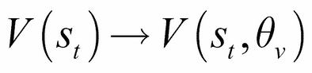
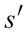
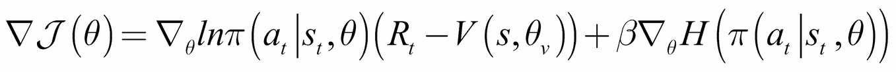
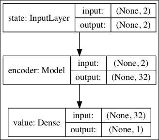
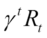
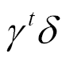
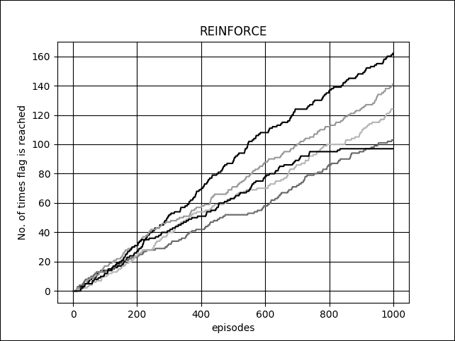
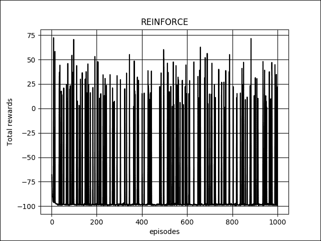

# 第十章：策略梯度方法

在本书的最后一章，我们将介绍直接优化策略网络的强化学习算法。这些算法统称为*策略梯度方法*。由于策略网络在训练过程中是直接优化的，因此策略梯度方法属于*在策略（on-policy）*强化学习算法家族。像我们在第九章讨论的基于值的方法一样，*深度强化学习*，策略梯度方法也可以作为深度强化学习算法来实现。

研究策略梯度方法的一个基本动机是解决 Q-Learning 的局限性。我们回顾一下，Q-Learning 是通过选择能够最大化状态值的动作来进行学习的。通过 Q 函数，我们能够确定一种策略，使得代理能够根据给定的状态决定采取哪种动作。所选择的动作就是给代理带来最大值的那个动作。在这方面，Q-Learning 只适用于有限数量的离散动作。它无法处理连续动作空间环境。此外，Q-Learning 并不是在直接优化策略。最终，强化学习的目标是找到那种最优策略，代理可以利用它来决定采取哪种行动以最大化回报。

相比之下，策略梯度方法适用于具有离散或连续动作空间的环境。此外，本章将介绍的四种策略梯度方法是直接优化策略网络的性能度量。这导致了一个训练好的策略网络，代理可以使用该网络在其环境中进行最优行动。

总结来说，本章的目标是呈现：

+   策略梯度定理

+   四种策略梯度方法：**REINFORCE**，**带基线的 REINFORCE**，**演员-评论家（Actor-Critic）**，以及**优势演员-评论家（Advantage Actor-Critic，A2C）**

+   关于如何在 Keras 中实现策略梯度方法的指南，适用于连续动作空间环境

# 策略梯度定理

如第九章中所讨论的，*深度强化学习*，在强化学习中，智能体位于一个处于状态*s*[t']的环境中，这是状态空间的一个元素。状态空间可以是离散的，也可以是连续的。智能体从动作空间中采取动作*a*[t]，遵循策略。可以是离散的，也可以是连续的。由于执行动作*a*[t]，智能体获得奖励*r*[t+1]，并且环境转移到一个新的状态*s*[t+1]。新状态仅依赖于当前状态和动作。智能体的目标是学习一个最优策略，以最大化所有状态的*回报*：

（方程 9.1.1）

回报，，被定义为从时间 *t* 到剧集结束或达到终止状态时的折扣累计奖励：

（方程 9.1.2）

从*方程 9.1.2*可以看出，回报也可以解释为通过遵循策略得到的给定状态的值。从*方程 9.1.1*可以观察到，与即时奖励相比，未来奖励的权重较低，因为通常，其中。

到目前为止，我们只考虑了通过优化基于值的函数*Q(s,a)*来学习策略。本章的目标是通过对进行参数化来直接学习策略。通过参数化，我们可以使用神经网络来学习策略函数。学习策略意味着我们要最大化一个特定的目标函数，该目标函数是相对于参数的性能度量。在情节强化学习中，性能度量是起始状态的值。在连续情况下，目标函数是平均奖励率。

通过执行*梯度上升*，可以最大化目标函数。在梯度上升中，梯度更新是朝着被优化函数的导数方向进行的。到目前为止，我们所有的损失函数都是通过最小化或执行*梯度下降*来优化的。稍后，在 Keras 实现中，我们可以看到梯度上升通过简单地将目标函数取负并执行梯度下降来完成。

直接学习策略的优势在于它可以应用于离散和连续的动作空间。对于离散动作空间：

 (方程 10.1.1)

在该公式中，*a*[*i*] 是第 *i* 个动作。*a*[*i*] 可以是神经网络的预测或状态-动作特征的线性函数：

 (方程 10.1.2)

 是任何将状态-动作转换为特征的函数，例如编码器。

 确定每个 *a*[*i*] 的概率。例如，在上一章中的平衡摆杆问题中，目标是通过沿二维轴向左或向右移动小车来保持摆杆竖直。在这种情况下，*a*[*0*] 和 *a*[*1*] 分别是向左和向右移动的概率。一般来说，代理选择具有最高概率的动作，。

对于连续动作空间， 会根据状态从概率分布中采样一个动作。例如，如果连续动作空间是范围 ，那么  通常是一个高斯分布，其均值和标准差由策略网络预测。预测的动作是从这个高斯分布中采样得到的。为了确保不生成无效的预测，动作会在 *-1.0* 和 *1.0* 之间截断。

正式地，对于连续动作空间，策略是从高斯分布中采样：

 (方程 10.1.3)

均值，，和标准差，，都是状态特征的函数：

 (方程 10.1.4)

 (方程 10.1.5)

 是任何将状态转换为其特征的函数。 是 *softplus* 函数，它确保标准差为正值。实现状态特征函数的一个方法是使用自编码器网络的编码器。在本章结束时，我们将训练一个自编码器，并使用编码器部分作为状态特征函数。因此，训练策略网络就是优化参数  的问题。

给定一个连续可微的策略函数，，可以计算策略梯度：

 (方程 10.1.6)

*方程 10.1.6* 也称为 *策略梯度定理*。它适用于离散和连续的动作空间。相对于参数的梯度是通过策略动作采样的自然对数并按 Q 值缩放计算得到的。*方程 10.1.6* 利用了自然对数的性质，。

策略梯度定理在直观上是合理的，因为性能梯度是从目标策略样本中估计的，并且与策略梯度成正比。策略梯度通过 Q 值进行缩放，以鼓励那些有助于状态价值提升的动作。梯度还与动作概率成反比，以惩罚那些频繁发生但对性能度量的提升没有贡献的动作。

在下一节中，我们将展示估计策略梯度的不同方法。

### 注意

关于策略梯度定理的证明，请参见[2]和 David Silver 关于强化学习的讲义，[`www0.cs.ucl.ac.uk/staff/d.silver/web/Teaching_files/pg.pdf`](http://www0.cs.ucl.ac.uk/staff/d.silver/web/Teaching_files/pg.pdf)

策略梯度方法具有一些微妙的优势。例如，在某些基于卡片的游戏中，基于价值的方法在处理随机性时没有直接的程序，而策略方法则不同。在策略方法中，随着参数的变化，动作的概率会平滑变化。与此同时，基于价值的动作可能会因参数的微小变化而遭遇剧烈的波动。最后，策略方法对参数的依赖促使我们采用不同的方式来执行性能度量上的梯度上升。这些就是接下来章节中将介绍的四种策略梯度方法。

策略方法也有其自身的缺点。它们通常更难训练，因为有趋向局部最优解的倾向，而不是全局最优解。在本章末尾将介绍的实验中，代理容易变得舒适，并选择那些不一定给出最高价值的动作。策略梯度还具有高方差的特点。

梯度更新经常被高估。此外，训练策略方法是费时的。训练通常需要成千上万的回合（即样本效率低）。每个回合只提供少量样本。在本章末尾提供的实现中，典型的训练需要在 GTX 1060 GPU 上大约一个小时来进行 1,000 回合。

在接下来的章节中，我们将讨论四种策略梯度方法。虽然讨论主要集中在连续动作空间上，但这一概念通常也适用于离散动作空间。由于四种策略梯度方法中策略网络和价值网络的实现方式相似，我们将在本章结束时演示如何将其实现到 Keras 中。

# 蒙特卡洛策略梯度（REINFORCE）方法

最简单的策略梯度方法叫做 REINFORCE [5]，它是一种蒙特卡洛策略梯度方法：

（方程 10.2.1）

其中 *R*[*t*] 是在 *方程 9.1.2* 中定义的回报。*R*[*t*] 是策略梯度定理中的无偏样本。

*算法* *10.2.1* 总结了 REINFORCE 算法 [2]。REINFORCE 是一种蒙特卡洛算法。它不需要环境动态的知识（即无模型）。只需要经验样本，，就能优化地调整策略网络的参数，。折扣因子，，考虑到奖励随着步数增加而减少的价值。梯度被折扣，。在后期步骤中计算的梯度贡献较小。学习率，，是梯度更新的缩放因子。

参数通过执行使用折扣梯度和学习率的梯度上升法进行更新。作为一种蒙特卡洛算法，REINFORCE 要求智能体完成一个回合后才会处理梯度更新。由于其蒙特卡洛性质，REINFORCE 的梯度更新具有高方差的特点。在本章结束时，我们将把 REINFORCE 算法实现到 Keras 中。

**算法 10.2.1 REINFORCE**

*需要*：一个可微分的参数化目标策略网络，。

*需要*：折扣因子， 和学习率 。例如， 和 。

*需要*：，初始策略网络参数（例如，）。

1.  重复

1.  生成一个 episode，，通过遵循 

1.  对于步骤 ，执行

1.  计算回报，

1.  计算折扣性能梯度，

1.  执行梯度上升，


图 10.2.1：策略网络

在 REINFORCE 中，参数化的策略可以通过神经网络建模，如*图 10.2.1*所示。如前一节所讨论，对于连续动作空间的情况，状态输入会被转换为特征。状态特征是策略网络的输入。表示策略函数的高斯分布具有均值和标准差，二者都是状态特征的函数。策略网络，，可以是 MLP、CNN 或 RNN，具体取决于状态输入的性质。预测的动作只是从策略函数中采样得到的。

## 带基准的 REINFORCE 方法

REINFORCE 算法可以通过从回报中减去一个基准来进行泛化，。基准函数，*B(s* *t* *)* 可以是任何函数，只要它不依赖于 *a*[t]。基准不会改变性能梯度的期望值：

（公式 10.3.1）

*公式 10.3.1* 表明，，因为 不是 的函数。

虽然引入基准不会改变期望值，但它降低了梯度更新的方差。方差的减少通常会加速学习。在大多数情况下，我们使用价值函数， 作为基准。如果回报被高估，缩放因子将按比例通过价值函数减小，从而降低方差。价值函数也是参数化的，，并与策略网络共同训练。在连续动作空间中，状态值可以是状态特征的线性函数：

（公式 10.3.2）

*算法* *10.3.1* 总结了带基线的 REINFORCE 方法[1]。这与 REINFORCE 相似，唯一的不同是返回值被替代。不同之处在于我们现在训练两个神经网络。如*图 10.3.1*所示，除了策略网络，还同时训练价值网络。策略网络参数通过性能梯度更新，而价值网络参数则通过价值梯度调整。由于 REINFORCE 是一种蒙特卡洛算法，因此可以推测，价值函数的训练也是蒙特卡洛算法。

学习率不一定相同。请注意，价值网络也在执行梯度上升。我们将在本章末尾展示如何使用 Keras 实现带基线的 REINFORCE 方法。

**算法 10.3.1 带基线的 REINFORCE**

*需要*：一个可微分的参数化目标策略网络。

*需要*：一个可微分的参数化价值网络。

*需要*：折扣因子，性能梯度的学习率和价值梯度的学习率。

*需要*：，初始策略网络参数（例如，）。，初始价值网络参数（例如，）。

1.  重复

1.  通过跟随生成一个回合

1.  对于步骤，执行

1.  计算回报

1.  减去基线

1.  计算折扣后的价值梯度

1.  执行梯度上升

1.  计算折扣后的性能梯度

1.  执行梯度上升


图 10.3.1：策略和价值网络

## 演员-评论员方法

在带基线的 REINFORCE 方法中，值被用作基线。它不是用来训练值函数的。在本节中，我们将介绍一种带基线的 REINFORCE 变种，称为**演员-评论家方法**。策略网络和值网络分别扮演演员和评论家的角色。策略网络是演员，负责在给定状态下决定采取何种行动。与此同时，值网络则评估演员或策略网络做出的决策。值网络作为评论家，量化演员所做的选择的好坏。值网络通过将当前状态值与收到的奖励的总和以及观察到的下一个状态的折现值进行比较，来评估状态值，。这种差异，，表示为：

（方程式 10.4.1）

其中为了简便起见，我们省略了和的下标。*方程式 10.4.1* 类似于第九章中讨论的 Q-Learning 中的时序差分方法，*深度强化学习*。下一个状态值被折现了。估计远期奖励是困难的。因此，我们的估计仅基于近期的未来，。这被称为*自举*技术。自举技术和在*方程式 10.4.1* 中对状态表示的依赖通常能够加速学习并减少方差。从*方程式 10.4.1*中我们可以看到，值网络评估的是当前状态，，这是由于策略网络的上一个动作，。与此同时，策略梯度是基于当前动作，。从某种意义上说，评估延迟了一个步骤。

*算法* *10.4.1* 总结了演员-评论家方法[2]。除了用于训练策略和值网络的状态值评估外，训练是在线进行的。在每一步中，两个网络都会进行训练。这与 REINFORCE 和带基线的 REINFORCE 不同，后者在训练之前需要完成一个回合。值网络被调用了两次。首先是在当前状态的值估计过程中，其次是在下一个状态的值估计过程中。两个值都用于梯度计算。*图 10.4.1*展示了演员-评论家网络。我们将在本章末尾使用 Keras 实现演员-评论家方法。

**算法 10.4.1 演员-评论家**

*要求*：一个可微分的参数化目标策略网络，。

*需要*：一个可微分的参数化价值网络，。

*需要*：折扣因子，，性能梯度的学习率，，以及价值梯度的学习率，。

*需要*：，初始策略网络参数（例如，）。，初始价值网络参数（例如，）。

1.  重复

1.  对于步骤  执行

1.  采样一个动作 

1.  执行动作并观察奖励  和下一个状态 

1.  评估状态值估计，

1.  计算折扣价值梯度，

1.  执行梯度上升，

1.  计算折扣性能梯度，

1.  执行梯度上升，

1.  


图 10.4.1：演员-评论员网络

## 优势演员-评论员 (A2C) 方法

在前一部分中的演员-评论员方法中，目标是让价值函数正确评估状态值。还有其他技术可以训练价值网络。一种显而易见的方法是使用 **均方误差** (**MSE**) 在价值函数优化中，类似于 Q-Learning 中的算法。新的价值梯度等于回报的 MSE 的偏导数，，和状态值之间：

（方程 10.5.1）

随着，价值网络的预测变得更加准确。我们将这种变种的演员-评论员算法称为 A2C。A2C 是 **异步优势演员-评论员**（**A3C**）的单线程或同步版本，[3]提出。这个量 被称为 *优势*。

*算法* *10.5.1* 概述了 A2C 方法。A2C 与行动者-评论员有一些区别。行动者-评论员是在线的，或者在每个经验样本上进行训练。A2C 类似于蒙特卡洛算法 REINFORCE 和带基线的 REINFORCE。它是在一个回合完成后进行训练的。行动者-评论员从第一个状态训练到最后一个状态，而 A2C 训练从最后一个状态开始，最终到达第一个状态。此外，A2C 的策略和价值梯度不再被折扣因子折扣。

A2C 的对应网络类似于*图 10.4.1*，因为我们只改变了梯度计算的方法。为了在训练过程中鼓励智能体探索，A3C 算法[3]建议将策略函数加权熵值的梯度添加到梯度函数中，。回忆一下，熵是事件的信息量或不确定性的度量。

**算法 10.5.1 优势行动者-评论员(A2C)**

*需要*: 一个可微的参数化目标策略网络，。

*需要*: 一个可微的参数化值网络，。

*需要*: 折扣因子，，性能梯度的学习率，，值梯度的学习率， 和熵权重，。

*需要*: ，初始策略网络参数（例如，）。，初始值网络参数（例如，）。

1.  重复

1.  通过遵循 生成一个回合 

1.  

1.  对于步骤 ，执行

1.  计算回报，

1.  计算值梯度，

1.  累积梯度，

1.  计算性能梯度，

1.  执行梯度上升，

## 使用 Keras 的策略梯度方法

前面讨论的四种策略梯度方法（*算法* *10.2.1* 到 *10.5.1*）使用相同的策略和价值网络模型。*图 10.2.1* 到 *10.4.1* 中的策略和价值网络配置相同。四种策略梯度方法的区别仅在于：

+   性能和价值梯度公式

+   训练策略

在本节中，我们将讨论在 Keras 中实现 *算法* *10.2.1* 到 *10.5.1* 的代码，因为它们共享许多共同的例程。

### 注意

完整代码可以在 [`github.com/PacktPublishing/Advanced-Deep-Learning-with-Keras`](https://github.com/PacktPublishing/Advanced-Deep-Learning-with-Keras) 找到。

但在讨论实现之前，先简要了解一下训练环境。


图 10.6.1 MountainCarContinuous-v0 OpenAI Gym 环境

与 Q-Learning 不同，策略梯度方法适用于离散和连续的动作空间。在我们的示例中，我们将在一个连续动作空间的案例中演示四种策略梯度方法，`MountainCarContinuous-v0` 环境来自 OpenAI Gym，[`gym.openai.com`](https://gym.openai.com)。如果你不熟悉 OpenAI Gym，请参考第九章，*深度强化学习*。

`MountainCarContinuous-v0` 二维环境的快照如 *图 10.6.1* 所示。在这个二维环境中，一辆引擎不太强大的汽车位于两座山之间。为了到达右侧山顶的黄色旗帜，它必须前后行驶以获得足够的动能。施加到汽车上的能量（即，动作的绝对值）越大，奖励就越小（或者说，奖励变得更负）。奖励始终为负，只有到达旗帜时才为正。在那时，汽车会获得 +100 的奖励。然而，每个动作都会受到以下代码的惩罚：

```py
reward-= math.pow(action[0],2)*0.1
```

有效动作值的连续范围是[-1.0, 1.0]。超出该范围时，动作会被截断为其最小值或最大值。因此，应用大于 1.0 或小于-1.0 的动作值是没有意义的。`MountainCarContinuous-v0` 环境的状态包含两个元素：

+   汽车位置

+   汽车速度

状态通过编码器转换为状态特征。预测的动作是策略模型在给定状态下的输出。价值函数的输出是状态的预测值：


图 10.6.2 自动编码器模型


图 10.6.3 编码器模型


图 10.6.4 解码器模型

如*图 10.2.1*到*图 10.4.1*所示，在构建策略和价值网络之前，我们必须首先创建一个将状态转换为特征的函数。这个函数是通过类似于第三章中实现的自编码器的编码器来实现的，*自编码器*。*图 10.6.2*展示了由编码器和解码器组成的自编码器。在*图 10.6.3*中，编码器是一个 MLP，由`Input(2)-Dense(256, activation='relu')-Dense(128, activation='relu')-Dense(32)`组成。每个状态都被转换为一个 32 维的特征向量。在*图 10.6.4*中，解码器也是一个 MLP，但由`Input(32)-Dense(128, activation='relu')-Dense(256, activation='relu')-Dense(2)`组成。自编码器经过 10 个 epoch 的训练，使用**MSE**损失函数和 Keras 默认的 Adam 优化器。我们为训练和测试数据集随机采样了 220,000 个状态，并应用了 200k/20k 的训练-测试集划分。训练后，编码器权重被保存以便在未来的策略和价值网络训练中使用。*列表 10.6.1*展示了构建和训练自编码器的方法。

列表 10.6.1，`policygradient-car-10.1.1.py`展示了我们构建和训练自编码器的方法：

```py
# autoencoder to convert states into features
def build_autoencoder(self):
    # first build the encoder model
    inputs = Input(shape=(self.state_dim, ), name='state')
    feature_size = 32
    x = Dense(256, activation='relu')(inputs)
    x = Dense(128, activation='relu')(x)
    feature = Dense(feature_size, name='feature_vector')(x)

    # instantiate encoder model
   self.encoder = Model(inputs, feature, name='encoder')
    self.encoder.summary()
    plot_model(self.encoder, to_file='encoder.png', show_shapes=True)

    # build the decoder model
    feature_inputs = Input(shape=(feature_size,), name='decoder_input')
    x = Dense(128, activation='relu')(feature_inputs)
    x = Dense(256, activation='relu')(x)
    outputs = Dense(self.state_dim, activation='linear')(x)

    # instantiate decoder model
    self.decoder = Model(feature_inputs, outputs, name='decoder')
    self.decoder.summary()
    plot_model(self.decoder, to_file='decoder.png', show_shapes=True)

    # autoencoder = encoder + decoder
    # instantiate autoencoder model
    self.autoencoder = Model(inputs, self.decoder(self.encoder(inputs)), name='autoencoder')
    self.autoencoder.summary()
    plot_model(self.autoencoder, to_file='autoencoder.png', show_shapes=True)

    # Mean Square Error (MSE) loss function, Adam optimizer
    self.autoencoder.compile(loss='mse', optimizer='adam')

# training the autoencoder using randomly sampled
# states from the environment
def train_autoencoder(self, x_train, x_test):
    # train the autoencoder
    batch_size = 32
    self.autoencoder.fit(x_train,
                         x_train,
                         validation_data=(x_test, x_test),
                         epochs=10,
                         batch_size=batch_size)
```


图 10.6.5：策略模型（行为者模型）

给定`MountainCarContinuous-v0`环境，策略（或行为者）模型预测必须施加在汽车上的动作。正如本章第一部分关于策略梯度方法的讨论，对于连续动作空间，策略模型从高斯分布中采样一个动作，。在 Keras 中，这是通过以下方式实现的：

```py
    # given mean and stddev, sample an action, clip and return
    # we assume Gaussian distribution of probability of selecting an
    # action given a state
    def action(self, args):
        mean, stddev = args
        dist = tf.distributions.Normal(loc=mean, scale=stddev)
        action = dist.sample(1)
        action = K.clip(action,
                        self.env.action_space.low[0],
                        self.env.action_space.high[0])
        return action
```

动作在其最小值和最大值之间被裁剪。

策略网络的作用是预测高斯分布的均值和标准差。*图 10.6.5*展示了策略网络建模的过程。值得注意的是，编码器模型具有冻结的预训练权重。只有均值和标准差的权重会接收性能梯度更新。

策略网络基本上是*公式*10.1.4 和*10.1.5*的实现，这些公式为了方便起见在此重复：

（公式 10.1.4）

（公式 10.1.5）

其中是编码器，是均值`Dense(1)`层的权重，是标准差`Dense(1)`层的权重。我们使用了修改过的*softplus*函数，，以避免标准差为零：

```py
# some implementations use a modified softplus to ensure that
# the stddev is never zero
def softplusk(x):
    return K.softplus(x) + 1e-10
```

政策模型生成器如下列表所示。此列表还包括我们接下来将讨论的对数概率、熵和值模型。

列表 10.6.2，`policygradient-car-10.1.1.py`向我们展示了从编码状态特征构建策略（演员）、`logp`、熵和值模型的方法：

```py
def build_actor_critic(self):
    inputs = Input(shape=(self.state_dim, ), name='state')
    self.encoder.trainable = False
    x = self.encoder(inputs)
    mean = Dense(1,
                 activation='linear',
                 kernel_initializer='zero',
                 name='mean')(x)
    stddev = Dense(1,
                   kernel_initializer='zero',
                   name='stddev')(x)
    # use of softplusk avoids stddev = 0
    stddev = Activation('softplusk', name='softplus')(stddev)
    action = Lambda(self.action,
                    output_shape=(1,),
                    name='action')([mean, stddev])
    self.actor_model = Model(inputs, action, name='action')
    self.actor_model.summary()
    plot_model(self.actor_model, to_file='actor_model.png', show_shapes=True)

    logp = Lambda(self.logp,
                  output_shape=(1,),
                  name='logp')([mean, stddev, action])
    self.logp_model = Model(inputs, logp, name='logp')
    self.logp_model.summary()
    plot_model(self.logp_model, to_file='logp_model.png', show_shapes=True)

    entropy = Lambda(self.entropy,
                     output_shape=(1,),
                     name='entropy')([mean, stddev])
    self.entropy_model = Model(inputs, entropy, name='entropy')
    self.entropy_model.summary()
    plot_model(self.entropy_model, to_file='entropy_model.png', show_shapes=True)
    value = Dense(1,
                  activation='linear',
                  kernel_initializer='zero',
                  name='value')(x)
    self.value_model = Model(inputs, value, name='value')
    self.value_model.summary()
```


图 10.6.6：策略的高斯对数概率模型


图 10.6.7：熵模型

除了策略网络，，我们还必须有动作对数概率(`logp`)网络，因为这实际上计算梯度。如*图 10.6.6*所示，`logp`网络只是策略网络，其中额外的`Lambda(1)`层计算给定动作、均值和标准差的高斯分布的对数概率。`logp`网络和演员（策略）模型共享相同的参数集。`Lambda`层没有任何参数。它由以下函数实现：

```py
    # given mean, stddev, and action compute
    # the log probability of the Gaussian distribution
    def logp(self, args):
        mean, stddev, action = args
        dist = tf.distributions.Normal(loc=mean, scale=stddev)
        logp = dist.log_prob(action)
        return logp
```

训练`logp`网络也训练了演员模型。在本节讨论的训练方法中，只训练了`logp`网络。

如*图 10.6.7*所示，熵模型还与策略网络共享参数。输出`Lambda(1)`层使用以下函数计算高斯分布的熵，给定均值和标准差：

```py
    # given the mean and stddev compute the Gaussian dist entropy
    def entropy(self, args):
        mean, stddev = args
        dist = tf.distributions.Normal(loc=mean, scale=stddev)
        entropy = dist.entropy()
        return entropy
```

熵模型仅由 A2C 方法使用：



图 10.6.8：值模型

前面的图显示了值模型。该模型还使用冻结权重的预训练编码器来实现以下方程，这里为了方便重复列出：

（方程 10.3.2）

是`Dense(1)`层的权重，唯一接收值梯度更新的层。*图 10.6.8*代表了在*算法 10.3.1*到*10.5.1*中。值模型可以用几行代码构建：

```py
inputs = Input(shape=(self.state_dim, ), name='state')
self.encoder.trainable = False
x = self.encoder(inputs)

value = Dense(1,
              activation='linear',
              kernel_initializer='zero',
              name='value')(x)
self.value_model = Model(inputs, value, name='value')
```

这些行也在`build_actor_critic()`方法中实现，如*列表 10.6.2*所示。

构建网络模型后，下一步是训练。在*算法* *10.2.1* 到 *10.5.1*中，我们通过梯度上升执行目标函数的最大化。在 Keras 中，我们通过梯度下降执行损失函数的最小化。损失函数简单地是要最大化的目标函数的负值。梯度下降是梯度上升的负数。*列表 10.6.3*显示了`logp`和值损失函数。

我们可以利用损失函数的共同结构，将 *算法* *10.2.1* 到 *10.5.1* 的损失函数统一起来。性能和值的梯度仅在常数因子上有所不同。所有的性能梯度都有共同项 。这在策略日志概率损失函数 `logp_loss()` 中由 `y_pred` 表示。共同项的因子  取决于所使用的算法，并通过 `y_true` 实现。*表 10.6.1* 显示了 `y_true` 的值。剩余项是熵的加权梯度 。它在 `logp_loss()` 函数中实现为 `beta` 和 `entropy` 的乘积。只有 A2C 使用此项，因此默认情况下，`beta=0.0`。对于 A2C，`beta=0.9`。

列表 10.6.3，`policygradient-car-10.1.1.py`：`logp` 和值网络的损失函数。

```py
# logp loss, the 3rd and 4th variables (entropy and beta) are needed
# by A2C so we have a different loss function structure
def logp_loss(self, entropy, beta=0.0):
    def loss(y_true, y_pred):
        return -K.mean((y_pred * y_true) + (beta * entropy), axis=-1)

    return loss

# typical loss function structure that accepts 2 arguments only
# this will be used by value loss of all methods except A2C
def value_loss(self, y_true, y_pred):
    return -K.mean(y_pred * y_true, axis=-1)
```

| 算法 | `logp_loss 的 y_true` | `value_loss 的 y_true` |
| --- | --- | --- |
| 10.2.1 REINFORCE |  | 不适用 |
| 10.3.1 带基准的 REINFORCE |  |  |
| 10.4.1 演员-评论员 |  |  |
| 10.5.1 A2C |  |  |

> 表 10.6.1：`logp_loss` 和 `value_loss` 的 `y_true` 值。

类似地，*算法* *10.3.1* 和 *10.4.1* 的值损失函数具有相同的结构。这些值损失函数在 Keras 中实现为 `value_loss()`，如 *列表 10.6.3* 所示。共同的梯度因子  由张量 `y_pred` 表示。剩余的因子由 `y_true` 表示。`y_true` 的值也显示在 *表 10.6.1* 中。REINFORCE 不使用值函数。A2C 使用 MSE 损失函数来学习值函数。在 A2C 中，`y_true` 表示目标值或真实值。

列表 10.6.4，`policygradient-car-10.1.1.py` 向我们展示了，REINFORCE、带基准的 REINFORCE 和 A2C 都是通过每个回合进行训练的。计算合适的回报后，再调用 *列表 10.6.5* 中的主要训练例程：

```py
# train by episode (REINFORCE, REINFORCE with baseline
# and A2C use this routine to prepare the dataset before
# the step by step training)
def train_by_episode(self, last_value=0):
    if self.args.actor_critic:
        print("Actor-Critic must be trained per step")
        return
    elif self.args.a2c:
        # implements A2C training from the last state
        # to the first state
        # discount factor
        gamma = 0.95
        r = last_value
        # the memory is visited in reverse as shown
        # in Algorithm 10.5.1
        for item in self.memory[::-1]:
            [step, state, next_state, reward, done] = item
            # compute the return
            r = reward + gamma*r
            item = [step, state, next_state, r, done]
            # train per step
            # a2c reward has been discounted
            self.train(item)

        return

    # only REINFORCE and REINFORCE with baseline
    # use the ff codes
    # convert the rewards to returns
    rewards = []
    gamma = 0.99
    for item in self.memory:
       [_, _, _, reward, _] = item
        rewards.append(reward)

    # compute return per step
    # return is the sum of rewards from t til end of episode
    # return replaces reward in the list
    for i in range(len(rewards)):
        reward = rewards[i:]
        horizon = len(reward)
        discount =  [math.pow(gamma, t) for t in range(horizon)]
        return_ = np.dot(reward, discount)
        self.memory[i][3] = return_

    # train every step
    for item in self.memory:
        self.train(item, gamma=gamma)
```

列表 10.6.5，`policygradient-car-10.1.1.py` 向我们展示了所有策略梯度算法使用的主要 `train` 例程。演员-评论员在每个经验样本时调用此例程，而其他算法则在每个回合的训练例程中调用此例程，见 *列表 10.6.4*：

```py
# main routine for training as used by all 4 policy gradient
# methods
def train(self, item, gamma=1.0):
    [step, state, next_state, reward, done] = item

    # must save state for entropy computation
    self.state = state

    discount_factor = gamma**step

    # reinforce-baseline: delta = return - value
    # actor-critic: delta = reward - value + discounted_next_value
    # a2c: delta = discounted_reward - value
    delta = reward - self.value(state)[0]

    # only REINFORCE does not use a critic (value network)
    critic = False
    if self.args.baseline:
        critic = True
    elif self.args.actor_critic:
        # since this function is called by Actor-Critic
        # directly, evaluate the value function here
        critic = True
        if not done:
            next_value = self.value(next_state)[0]
            # add  the discounted next value
            delta += gamma*next_value
    elif self.args.a2c:
        critic = True
    else:
        delta = reward

    # apply the discount factor as shown in Algortihms
    # 10.2.1, 10.3.1 and 10.4.1
    discounted_delta = delta * discount_factor
    discounted_delta = np.reshape(discounted_delta, [-1, 1]) 
    verbose = 1 if done else 0

    # train the logp model (implies training of actor model
    # as well) since they share exactly the same set of
    # parameters
    self.logp_model.fit(np.array(state),
                        discounted_delta,
                        batch_size=1,
                        epochs=1,
                        verbose=verbose)

    # in A2C, the target value is the return (reward
    # replaced by return in the train_by_episode function)
    if self.args.a2c:
        discounted_delta = reward
        discounted_delta = np.reshape(discounted_delta, [-1, 1])

    # train the value network (critic)
    if critic:
        self.value_model.fit(np.array(state),
                             discounted_delta,
                             batch_size=1,
                             epochs=1,
                             verbose=verbose)
```

所有网络模型和损失函数就绪后，最后一部分是训练策略，每个算法的训练策略不同。如 *列表 10.6.4* 和 *10.6.5* 中所示，使用了两个训练函数。*算法* *10.2.1*、*10.3.1* 和 *10.5.1* 在训练前等待完整剧集完成，因此同时运行 `train_by_episode()` 和 `train()`。完整的剧集保存在 `self.memory` 中。Actor-Critic *算法* *10.4.1* 每步训练，仅运行 `train()`。

每个算法处理其剧集轨迹的方式不同。

| 算法 | `y_true` 公式 | Keras 中的 `y_true` |
| --- | --- | --- |
| 10.2.1 REINFORCE |  | `reward * discount_factor` |
| 10.3.1 带基线的 REINFORCE |  | `(reward - self.value(state)[0]) * discount_factor` |
| 10.4.1 Actor-Critic |  | `(reward - self.value(state)[0] + gamma*next_value) * discount_factor` |
| 10.5.1 A2C |  和  | `(reward - self.value(state)[0])` 和 `reward` |

> 表格 10.6.2：表格 10.6.1 中的 y_true 值

对于 REINFORCE 方法和 A2C，`reward` 实际上是 `train_by_episode()` 中计算的返回值。`discount_factor = gamma**step`。

两种 REINFORCE 方法通过替换内存中的奖励值来计算返回值 ：

```py
    # only REINFORCE and REINFORCE with baseline
    # use the ff codes
    # convert the rewards to returns
    rewards = []
    gamma = 0.99
    for item in self.memory:
        [_, _, _, reward, _] = item
        rewards.append(reward)

    # compute return per step
    # return is the sum of rewards from t til end of episode
    # return replaces reward in the list
    for i in range(len(rewards)):
        reward = rewards[i:]
        horizon = len(reward)
        discount =  [math.pow(gamma, t) for t in range(horizon)]
        return_ = np.dot(reward, discount)
        self.memory[i][3] = return_
```

然后，训练策略（演员）和价值模型（仅带基线）从第一步开始，对每一步进行训练。

A2C 的训练策略不同，它从最后一步到第一步计算梯度。因此，返回值从最后一步的奖励或下一个状态值开始累积：

```py
        # the memory is visited in reverse as shown
        # in Algorithm 10.5.1
        for item in self.memory[::-1]:
            [step, state, next_state, reward, done] = item
            # compute the return
            r = reward + gamma*r
            item = [step, state, next_state, r, done]
            # train per step
            # a2c reward has been discounted
            self.train(item)
```

列表中的 `reward` 变量也被返回值替代。如果到达终止状态（即汽车触及旗帜）或非终止状态的下一个状态值，则初始化为 `reward`：

```py
v = 0 if reward > 0 else agent.value(next_state)[0]
```

在 Keras 实现中，我们提到的所有程序都作为方法在 `PolicyAgent` 类中实现。`PolicyAgent` 的作用是表示实施策略梯度方法的智能体，包括构建和训练网络模型以及预测动作、对数概率、熵和状态值。

以下列表展示了智能体执行并训练策略与价值模型时一个剧集的展开方式。`for` 循环执行 1000 个剧集。一个剧集在达到 1000 步或汽车触及旗帜时终止。智能体在每一步执行策略预测的动作。在每个剧集或步骤后，训练程序被调用。

列表 10.6.6，`policygradient-car-10.1.1.py`：智能体运行 1000 个剧集，每一步都执行策略预测的动作并进行训练：

```py
# sampling and fitting
for episode in range(episode_count):
    state = env.reset()
    # state is car [position, speed]
    state = np.reshape(state, [1, state_dim])
    # reset all variables and memory before the start of
    # every episode
    step = 0 
    total_reward = 0 
    done = False
    agent.reset_memory()
   while not done:
        # [min, max] action = [-1.0, 1.0]
        # for baseline, random choice of action will not move
        # the car pass the flag pole
        if args.random:
            action = env.action_space.sample()
        else:
            action = agent.act(state)
        env.render()
        # after executing the action, get s', r, done
        next_state, reward, done, _ = env.step(action)
        next_state = np.reshape(next_state, [1, state_dim])
        # save the experience unit in memory for training
        # Actor-Critic does not need this but we keep it anyway.
        item = [step, state, next_state, reward, done]
        agent.remember(item)

        if args.actor_critic and train:
            # only actor-critic performs online training
            # train at every step as it happens
            agent.train(item, gamma=0.99)
        elif not args.random and done and train:
            # for REINFORCE, REINFORCE with baseline, and A2C
            # we wait for the completion of the episode before 
            # training the network(s)
            # last value as used by A2C
            v = 0 if reward > 0 else agent.value(next_state)[0]
            agent.train_by_episode(last_value=v)

        # accumulate reward
        total_reward += reward
        # next state is the new state
        state = next_state
        step += 1
```

## 策略梯度方法的性能评估

这四种策略梯度方法通过训练智能体 1,000 回合来进行评估。我们将 1 次训练定义为 1,000 回合的训练。第一个性能度量标准是通过累计智能体在 1,000 回合中到达旗帜的次数来衡量的。*图 10.7.1* 到 *10.7.4* 显示了每种方法的五次训练会话。

在这个度量标准中，A2C 以最大的次数到达旗帜，其次是带基线的 REINFORCE、演员-评论家方法和 REINFORCE 方法。使用基线或评论家加速了学习。请注意，这些是智能体不断改进其性能的训练会话。在实验中，确实有一些情况，智能体的表现没有随时间提升。

第二个性能度量标准是基于以下要求：如果每个回合的总奖励至少为 90.0，那么`MountainCarContinuous-v0`被认为是已解决的。通过每种方法的五次训练，我们选择了最后 100 个回合（第 900 到 999 回合）中总奖励最高的一次训练。*图 10.7.5* 到 *10.7.8* 显示了四种策略梯度方法的结果。带基线的 REINFORCE 是唯一能够在 1,000 回合训练后持续获得约 90 总奖励的方法。A2C 表现第二好，但无法持续达到至少 90 的总奖励。



图 10.7.1：使用 REINFORCE 方法山地车到达旗帜的次数


图 10.7.2：使用带基线的 REINFORCE 方法山地车到达旗帜的次数


图 10.7.3：使用演员-评论家方法山地车到达旗帜的次数


图 10.7.4：使用 A2C 方法山地车到达旗帜的次数



图 10.7.5：使用 REINFORCE 方法每回合获得的总奖励


图 10.7.6：使用带基线的 REINFORCE 方法每回合获得的总奖励。


图 10.7.7：使用演员-评论家方法每回合获得的总奖励


图 10.7.8：使用 A2C 方法每回合获得的总奖励

在实验中，我们对对数概率和价值网络的优化使用相同的学习率`1e-3`。折扣因子设置为 0.99，除了 A2C 方法，它在 0.95 的折扣因子下更容易训练。

鼓励读者通过执行以下命令来运行训练好的网络：

```py
$ python3 policygradient-car-10.1.1.py
--encoder_weights=encoder_weights.h5 --actor_weights=actor_weights.h5

```

以下表格显示了运行 `policygradient-car-10.1.1.py` 的其他模式。权重文件（即 `*.h5`）可以用你自己的预训练权重文件替换。请参考代码查看其他潜在选项：

| 目的 | 运行 |
| --- | --- |
| 从头开始训练 REINFORCE |

```py
python3 policygradient-car-10.1.1.py
--encoder_weights=encoder_weights.h5

```

|

| 从头开始训练带基线的 REINFORCE |
| --- |

```py
python3 policygradient-car-10.1.1.py
--encoder_weights=encoder_weights.h5 -b

```

|

| 从头开始训练 Actor-Critic |
| --- |

```py
python3 policygradient-car-10.1.1.py
--encoder_weights=encoder_weights.h5 -a

```

|

| 从头开始训练 A2C |
| --- |

```py
python3 policygradient-car-10.1.1.py
--encoder_weights=encoder_weights.h5 -c

```

|

| 从之前保存的权重训练 REINFORCE |
| --- |

```py
python3 policygradient-car-10.1.1.py
--encoder_weights=encoder_weights.h5
--actor_weights=actor_weights.h5 --train

```

|

| 从之前保存的权重训练带基线的 REINFORCE |
| --- |

```py
python3 policygradient-car-10.1.1.py
--encoder_weights=encoder_weights.h5
--actor_weights=actor_weights.h5
--value_weights=value_weights.h5 -b --train

```

|

| 从之前保存的权重训练 Actor-Critic |
| --- |

```py
python3 policygradient-car-10.1.1.py
--encoder_weights=encoder_weights.h5
--actor_weights=actor_weights.h5
--value_weights=value_weights.h5 -a --train

```

|

| 从之前保存的权重训练 A2C |
| --- |

```py
python3 policygradient-car-10.1.1.py
--encoder_weights=encoder_weights.h5
--actor_weights=actor_weights.h5
--value_weights=value_weights.h5 -c --train

```

|

> 表 10.7.1：运行 policygradient-car-10.1.1.py 时的不同选项

最后需要注意的是，在 Keras 中实现策略梯度方法存在一些局限性。例如，训练 actor 模型需要重新采样动作。动作首先被采样并应用到环境中以观察奖励和下一个状态。然后，再采样一次用于训练对数概率模型。第二次采样不一定与第一次相同，但用于训练的奖励来自第一次采样的动作，这可能在梯度计算中引入随机误差。

好消息是，Keras 在 `tf.keras` 中得到了 TensorFlow 大力支持。从 Keras 过渡到更灵活、更强大的机器学习库（如 TensorFlow）变得更加容易。如果你是从 Keras 开始，并且想要构建低级自定义机器学习例程，那么 Keras 和 `tf.keras` 的 API 有很强的相似性。

在 TensorFlow 中使用 Keras 有一定的学习曲线。此外，在 `tf.keras` 中，你可以利用 TensorFlow 新的易用 Dataset 和 Estimators API。这简化了大量的代码和模型重用，最终形成一个干净的管道。随着 TensorFlow 新的急切执行模式的出现，实现和调试 Python 代码在 `tf.keras` 和 TensorFlow 中变得更加容易。急切执行允许代码在不构建计算图的情况下执行，这与本书中所做的方式不同。它还允许代码结构类似于典型的 Python 程序。

# 结论

在本章中，我们介绍了策略梯度方法。从策略梯度定理开始，我们制定了四种方法来训练策略网络。我们详细讨论了四种方法：REINFORCE、带基线的 REINFORCE、Actor-Critic 和 A2C 算法。我们探索了这四种方法如何在 Keras 中实现。接着，我们通过检查代理成功达到目标的次数以及每个回合收到的总奖励来验证这些算法。

与我们在上一章讨论的 Deep Q-Network [3] 类似，基本的策略梯度算法可以进行一些改进。例如，最显著的一种是 A3C [4]，它是 A2C 的多线程版本。这使得智能体能够同时接触到不同的经验，并异步地优化策略和值网络。然而，在 OpenAI 进行的实验中，[`blog.openai.com/baselines-acktr-a2c/`](https://blog.openai.com/baselines-acktr-a2c/)，A3C 并没有比 A2C 强大的优势，因为前者无法充分利用如今强大的 GPU。

鉴于这是本书的结尾，值得注意的是，深度学习领域非常广阔，要在一本书中涵盖所有的进展几乎是不可能的。我们所做的是精心挑选了那些我认为在广泛应用中会有用的高级话题，并且这些话题是你，读者，可以轻松构建的。本书中展示的 Keras 实现将允许你继续进行，并将这些技术应用到你自己的工作和研究中。

# 参考文献

1.  Sutton 和 Barto。*强化学习：导论*，[`incompleteideas.net/book/bookdraft2017nov5.pdf`](http://incompleteideas.net/book/bookdraft2017nov5.pdf)，（2017）。

1.  Mnih, Volodymyr，及其他人。*通过深度强化学习实现人类水平的控制*，*自然* 518.7540 (2015): 529。

1.  Mnih, Volodymyr，及其他人。*深度强化学习的异步方法*，*国际机器学习会议*，2016。

1.  Williams 和 Ronald J. *简单统计梯度跟踪算法用于连接主义强化学习*，*机器学习* 8.3-4 (1992): 229-256。
