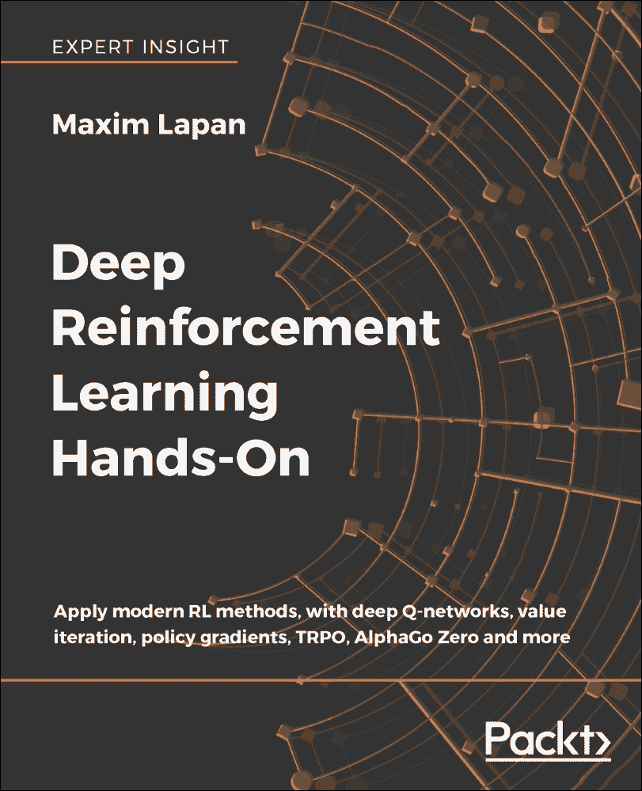
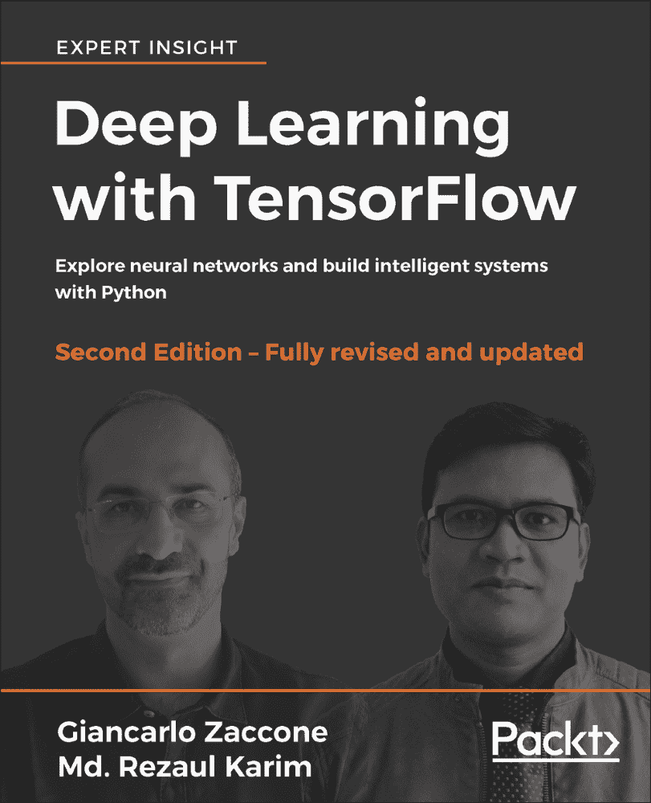

# 第十一章：你可能会喜欢的其他书籍

如果你喜欢这本书，你可能对 Packt 出版的其他书籍感兴趣：

**深度强化学习实战**

Maxim Lapan

ISBN: 978-1-78883-424-7

+   理解强化学习的深度学习背景，并实现复杂的深度学习模型

+   学习强化学习的基础：马尔可夫决策过程

+   评估包括交叉熵、DQN、Actor-Critic、TRPO、PPO、DDPG、D4PG 等强化学习方法

+   了解如何在各种环境中处理离散和连续的动作空间

+   使用价值迭代法击败 Atari 街机游戏

+   创建你自己的 OpenAI Gym 环境来训练股票交易代理

+   教你的代理使用 AlphaGo Zero 玩 Connect4

+   探索最新的深度强化学习研究，主题包括 AI 驱动的聊天机器人

**使用 TensorFlow 进行深度学习**

Giancarlo Zaccone, Md. Rezaul Karim

ISBN: 978-1-78883-110-9

+   使用 TensorFlow 应用深度机器智能和 GPU 计算

+   访问公共数据集，使用 TensorFlow 加载、处理和转换数据

+   了解如何使用高级 TensorFlow API 构建更强大的应用程序

+   使用深度学习进行可扩展的物体检测和移动计算

+   通过探索强化学习技术，快速训练机器从数据中学习

+   探索深度学习研究和应用的活跃领域

# 留下评论——让其他读者知道你的想法

请通过在你购买书籍的网站上留下评论，与他人分享你对本书的看法。如果你是从亚马逊购买的书籍，请在本书的亚马逊页面上留下真实的评论。这一点至关重要，因为其他潜在读者可以通过你的公正意见做出购买决策，我们可以了解客户对我们产品的反馈，而作者也能看到他们与 Packt 合作创作的书籍的反馈。只需要几分钟时间，但对其他潜在客户、我们的作者和 Packt 都非常有价值。谢谢！
