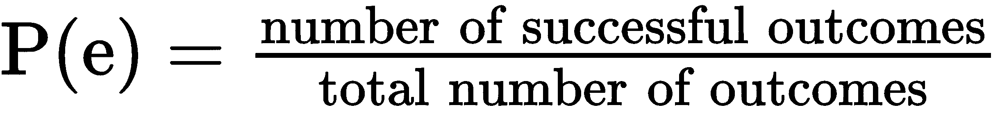
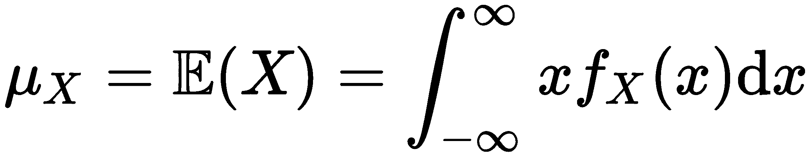
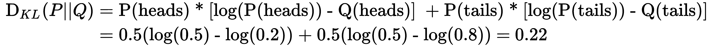
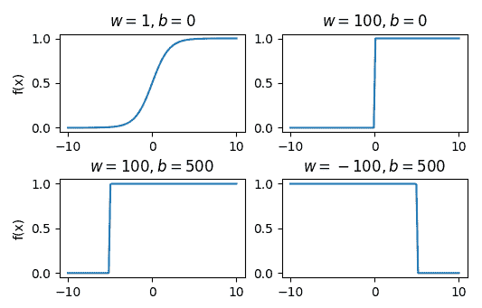

# 第一章：神经网络的基本构成

在这一章中，我们将讨论神经网络（**NNs**）的一些复杂细节——它是**深度学习**（**DL**）的基石。我们将讨论它们的数学工具、结构和训练。我们的主要目标是为你提供系统性的神经网络理解。通常，我们从计算机科学的角度来接近它们——作为一种机器学习（**ML**）算法（或甚至一个特殊的实体），由多个不同的步骤/组件组成。我们通过思考神经元、层等来获得直觉（至少当我第一次学习这个领域时，我是这样做的）。这种方式是完全有效的，我们仍然能在这个理解层次上做出令人印象深刻的事情。然而，这可能不是正确的途径。

神经网络（NNs）有着坚实的数学基础，如果我们从这一角度来接近它们，就能以更基本和优雅的方式定义和理解它们。因此，在这一章中，我们将试图强调从数学和计算机科学角度看神经网络的类比。如果你已经熟悉这些话题，你可以跳过这一章。不过，我希望你能发现一些你之前没有了解的有趣内容（我们会尽力让这一章保持有趣！）。

在这一章中，我们将讨论以下内容：

+   神经网络的数学工具

+   神经网络简介

+   训练神经网络

# 神经网络的数学工具

在接下来的几节中，我们将讨论与神经网络相关的数学分支。完成这些内容后，我们将把它们与神经网络本身联系起来。

# 线性代数

线性代数处理线性方程，如![]，以及线性变换（或线性函数）及其表示形式，如矩阵和向量。

线性代数识别以下数学对象：

+   **标量**：一个单独的数字。

+   **向量**：一个一维的数字（或分量）数组。数组的每个分量都有一个索引。在文献中，我们会看到向量要么用上标箭头表示（![]），要么用粗体（`x`）表示。以下是一个向量的示例：

在本书中，我们大部分时间将使用粗体（`x`）图形符号。但在某些情况下，我们会使用来自不同来源的公式，并尽力保留它们的原始符号。

我们可以通过一个`n`维向量来直观地表示为一个点在`n`维欧几里得空间中的坐标，![]（相当于一个坐标系）。在这种情况下，向量被称为欧几里得向量，每个向量分量表示沿着相应轴的坐标，如下图所示：

![] 空间中的向量表示

然而，欧几里得向量不仅仅是一个点，我们也可以通过以下两个特性来表示它：

+   **大小**（或**长度**）是毕达哥拉斯定理在`n`维空间中的推广：

+   **方向**是向量在向量空间中沿每个坐标轴的角度。

+   **矩阵**：这是一个二维的数字数组。每个元素由两个索引（行和列）标识。矩阵通常用加粗的大写字母表示，例如，`A`。每个矩阵元素用小写矩阵字母和下标表示，例如，*a[ij]*。让我们看一下以下公式中的矩阵表示法示例：

我们可以将一个向量表示为一个单列的*n×1*矩阵（称为列矩阵）或一个单行的*1×n*矩阵（称为行矩阵）。

+   **张量**：在我们解释张量之前，我们必须先做个声明。张量最初来源于数学和物理学，在我们开始将其应用于机器学习之前，它们早已存在于这些领域。在这些领域中的张量定义与机器学习中的定义不同。为了本书的目的，我们只考虑机器学习中的张量。在这里，张量是一个多维数组，具有以下特性：

    +   **秩**：表示数组的维数。例如，秩为 2 的张量是一个矩阵，秩为 1 的张量是一个向量，秩为 0 的张量是一个标量。然而，张量在维度数上没有限制。实际上，一些类型的神经网络使用秩为 4 的张量。

    +   **形状**：每个维度的大小。

    +   **张量元素的数据类型**。这些数据类型在不同的库中可能有所不同，但通常包括 16 位、32 位和 64 位浮动数，以及 8 位、16 位、32 位和 64 位整数。

当代深度学习库，如 TensorFlow 和 PyTorch，使用张量作为它们的主要数据结构。

你可以在这里找到关于张量性质的详细讨论：[`stats.stackexchange.com/questions/198061/why-the-sudden-fascination-with-tensors`](https://stats.stackexchange.com/questions/198061/why-the-sudden-fascination-with-tensors)。你还可以查看 TensorFlow ([`www.tensorflow.org/guide/tensors`](https://www.tensorflow.org/guide/tensors)) 和 PyTorch ([`pytorch.org/docs/stable/tensors.html`](https://pytorch.org/docs/stable/tensors.html)) 的张量定义。

现在我们已经介绍了线性代数中的对象类型，在接下来的部分，我们将讨论可以应用于它们的一些运算。

# 向量和矩阵运算

在本节中，我们将讨论与神经网络（NNs）相关的向量和矩阵运算。让我们开始吧：

+   **向量加法**是将两个或多个向量相加得到一个输出向量和的运算。输出是另一个向量，其计算公式如下：

+   **点**（**或标量**）**积**对两个向量进行运算，输出一个标量值。我们可以通过以下公式计算点积：

这里，|`a`|和|`b`|是向量的大小，θ是两个向量之间的角度。假设这两个向量是`n`维的，它们的分量分别是*a[1]*、*b[1]*、*a[2]*、*b[2]*，依此类推。此时，前面的公式等价于以下公式：

两个二维向量`a`和`b`的点积在以下图中示例：

向量的点积。上：向量分量；下：两个向量的点积

点积作为两个向量之间的一种相似性度量——如果两个向量之间的角度θ较小（即向量方向相似），那么它们的点积会较高，因为![]。

基于这一思想，我们可以定义两个向量之间的**余弦相似度**如下：

+   **叉**（**或向量**）**积**对两个向量进行运算，输出一个垂直于这两个初始向量的向量。我们可以通过以下公式计算叉积输出向量的大小：

以下图展示了两个二维向量之间的叉积示例：

两个二维向量的叉积

正如我们之前提到的，输出向量垂直于输入向量，这也意味着该向量是包含它们的平面的法向量。输出向量的大小等于以向量`a`和`b`为边的平行四边形的面积（如前图所示）。

我们还可以通过**向量空间**来定义一个向量，向量空间是由可以相加和与标量相乘的对象（在我们这里是向量）组成的集合。向量空间将允许我们定义一个**线性变换**，作为一个函数，`f`，该函数可以将向量空间*`V`*中的每个向量（点）转换为另一个向量空间*`W`*中的向量（点）：![]。`f`必须满足以下要求，对于任何两个向量，![]：

+   加法性：![]

+   齐次性：![]，其中`c`是标量

+   **矩阵转置**：这里，我们沿着矩阵的主对角线翻转矩阵（主对角线是矩阵元素 *a[ij]* 的集合，其中 *i = j*）。转置操作用上标表示，^()。为明确起见， 处的单元格等于 ![] 处的单元格，后者位于 ![] 中：

一个 *m×n* 矩阵的转置是一个 *n×m* 矩阵。以下是几个转置示例：

+   **矩阵-标量乘法**是矩阵与标量值的乘法。在以下示例中，![] 是一个标量：

+   **矩阵-矩阵加法**是两个矩阵按元素逐一相加的操作。为了使此操作有效，两个矩阵的大小必须相同。以下是一个示例：

+   **矩阵-向量乘法**是矩阵与向量的乘法。为了使这个操作有效，矩阵的列数必须等于向量的长度。*m×n* 矩阵与 `n` 维向量相乘的结果是一个 `m` 维向量。以下是一个示例：

我们可以将矩阵的每一行看作一个独立的 `n` 维向量。在这里，输出向量的每个元素是对应矩阵行与 `x` 的点积。以下是一个数值示例：

+   **矩阵乘法**是一个矩阵与另一个矩阵的乘法。为了使操作有效，第一个矩阵的列数必须等于第二个矩阵的行数（这是一个非交换操作）。我们可以将此操作视为多个矩阵-向量乘法，其中第二个矩阵的每一列都是一个向量。一个 *m×n* 矩阵与一个 *n×p* 矩阵相乘的结果是一个 *m×p* 矩阵。以下是一个示例：

如果我们将两个向量视为行矩阵，我们可以将向量的点积表示为矩阵乘法，即！。

这部分是我们对线性代数的介绍。接下来，我们将介绍概率论。

# 概率简介

在这一部分，我们将讨论一些与神经网络相关的概率和统计方面的内容。

我们首先介绍**统计实验**的概念，其具有以下特性：

+   由多个独立的试验组成。

+   每次试验的结果是非确定性的；也就是说，它是由机会决定的。

+   它有多个可能的结果，这些结果称为**事件**（我们将在接下来的部分中讨论集合中的事件）。

+   所有可能的实验结果在实验前都是已知的。

一个统计实验的例子是硬币投掷，它有两个可能的结果——正面或反面。另一个例子是投掷骰子，它有六个可能的结果：1、2、3、4、5 和 6。

我们将**概率**定义为某个事件`e`发生的可能性，并用**P(e)**表示它。概率是一个介于 [0, 1] 范围内的数字，其中 0 表示事件无法发生，1 表示事件一定会发生。如果*P(e) = 0.5*，则表示该事件有 50-50 的机会发生，依此类推。

我们可以通过两种方式来处理概率：

+   **理论**：我们关心的事件与所有可能事件的总数相比。所有事件的发生概率是相等的：

为了理解这个问题，让我们用一个硬币投掷的例子，其中有两个可能的结果。每个可能结果的理论概率是 P(正面) = P(反面) = 1/2。投掷骰子的每一面出现的理论概率是 1/6。

+   **经验**：这是我们关心的事件发生的次数与总实验次数之比：

实验的结果可能显示事件的发生概率不相等。例如，假设我们投掷硬币 100 次，观察到正面朝上 56 次。在这种情况下，正面的经验概率是 P(正面) = 56 / 100 = 0.56。实验次数越多，计算出的概率越精确（这就是大数法则）。

在接下来的部分，我们将讨论在集合上下文中的概率。

# 概率与集合

实验的所有可能结果（事件）集合叫做**样本空间**。我们可以将样本空间看作一个数学**集合**。它通常用大写字母表示，所有的集合结果可以用 {} 来列出（与 Python 集合相同）。例如，硬币投掷事件的样本空间是 S[c] = {正面, 反面}，而骰子投掷的样本空间是 S[d] = {1, 2, 3, 4, 5, 6}。集合中的单个结果（例如正面）叫做**样本点**。**事件**是样本空间中的一个结果（样本点）或一组结果（子集）。例如，骰子投掷结果为偶数的组合事件是 {2, 4, 6}。

假设我们有一个样本空间 S = {1, 2, 3, 4, 5}，以及两个子集（事件）A = {1, 2, 3} 和 B = {3, 4, 5}。在这种情况下，我们可以进行以下操作：

+   **交集**：结果是一个新集合，包含两个集合中都出现的元素：

相交为空集 {} 的集合是**不相交**的。

+   **补集：** 结果是一个新的集合，包含样本空间中所有不包含在给定集合中的元素：

+   **并集：** 结果是一个新的集合，包含可以在任一集合中找到的元素：

以下维恩图展示了这些不同的集合关系：

可能的集合关系的维恩图

我们可以将集合的性质转移到事件及其概率上。我们假设这些事件是**独立的**——一个事件的发生不会影响另一个事件发生的概率。例如，不同掷硬币的结果是相互独立的。话虽如此，接下来我们来学习如何将集合运算转化到事件领域中：

+   两个事件的交集是这两个事件共同包含的结果子集。交集的概率称为**联合概率**，通过以下公式计算：

假设我们要计算一张卡片既是红色（红心或方块）又是杰克的概率。红色的概率是 *P(red) = 26/52 = 1/2*。抽到杰克的概率是 *P(Jack) = 4/52 = 1/13*。因此，联合概率是 *P(red, Jack) = (1/2) * (1/13) = 1/26*。在这个例子中，我们假设这两个事件是独立的。然而，两个事件同时发生（我们抽了一张牌）。如果它们是依次发生的，例如抽两张卡片，其中一张是杰克，另一张是红色的，我们将进入条件概率的领域。这个联合概率也可以表示为 P(A, B) 或 P(AB)。

单一事件发生的概率 P(A) 也称为**边际概率**（与联合概率相对）。

+   两个事件是互斥的（或**互斥事件**），如果它们没有共同的结果。也就是说，它们各自的样本空间子集是互斥的。例如，奇数或偶数掷骰子的事件是互斥的。关于互斥事件的概率，以下内容是成立的：

    +   互斥事件的联合概率（这些事件同时发生的概率）是 P(A∩B) = 0。

    +   互斥事件的概率之和是![]。

+   如果多个事件的子集包含了整个样本空间，它们是**联合完全的**。前面例子中的事件 A 和 B 是联合完全的，因为它们一起填充了整个样本空间（1 到 5）。关于联合完全事件的概率，以下内容是成立的：

如果我们只有两个事件，它们同时是互斥且完全互补的，那么这两个事件是**补集**事件。例如，奇数和偶数的掷骰子事件是补集事件。

+   我们将来自 A 或 B 的结果（不一定同时）称为 A 和 B 的并集。这个并集的概率如下：

到目前为止，我们已经讨论了独立事件。接下来，我们将专注于依赖事件。

# 条件概率和贝叶斯规则

如果事件 A 的发生改变了事件 B 的发生概率，其中 A 在 B 之前发生，那么两者是依赖的。为了说明这个概念，让我们想象从牌组中依次抽取多张卡牌。当牌组完整时，抽到红心的概率为 *P(红心) = 13/52 = 0.25*。但是一旦我们抽出第一张牌，第二次抽取红心的概率就会改变。现在，我们只剩下 51 张牌和一个少了的红心。我们称第二次抽取的概率为条件概率，并用 P(B|A) 表示。这是事件 B（第二次抽取），在事件 A（第一次抽取）发生的条件下的概率。继续我们的例子，第二次抽取红心的概率变为 *P(红心[2]|红心[1]) = 12/51 = 0.235*。

接下来，我们可以扩展联合概率公式（在前一节介绍的基础上），以涉及依赖事件。公式如下：

然而，上述方程只是两个事件的特例。我们可以进一步扩展到多个事件 A[1], A[2], ..., A[n]。这个新的通用公式被称为概率的链式法则：

例如，三个事件的链式规则如下：

我们还可以推导出条件概率本身的公式：

这个公式有以下几个原因：

+   **P(A ∩ B)** 表示我们对 B 的发生感兴趣，已知 A 已经发生。换句话说，我们对事件的联合发生感兴趣，因此是联合概率。

+   **P(A)** 表示我们只关注事件 A 发生后的子集结果。我们已经知道 A 已经发生，因此我们将观察限制在这些结果上。

对于依赖事件，以下内容成立：

使用这个方程，我们可以在条件概率公式中替换 P(A∩B) 的值，得到如下结果：

上述公式使我们能够计算条件概率 P(B|A)，如果我们知道相反的条件概率 P(B|A)。这个方程被称为**贝叶斯规则**，在机器学习中经常使用。在贝叶斯统计学的背景下，P(A) 和 P(B|A) 分别称为先验概率和后验概率。

贝叶斯定理可以通过医学测试来进行说明。假设我们想要确定一个患者是否患有某种特定疾病。我们进行了一项医学测试，结果呈阳性。但这并不一定意味着患者真的患有该疾病。大多数测试都有一个可靠性值，即当对患有某种特定疾病的人进行测试时，测试结果呈阳性的概率。利用这些信息，我们将应用贝叶斯定理来计算患者在测试结果为阳性的情况下，实际患病的概率。我们得出如下结果：

这里，*P(has disease)* 是没有任何先验条件下的疾病一般概率。可以将其看作是普通人群中患病的概率。

接下来，我们假设一些关于疾病和测试准确性的条件：

+   该测试的可靠性为 98%，也就是说，如果测试结果为阳性，在 98%的情况下结果也为阳性：*P(test=positive|has disease)* = 0.98。

+   50 岁以下只有 2%的人患有这种疾病：*P(has disease)* = 0.02。

+   对 50 岁以下的人群，测试结果呈阳性的人群只占 3.9%：*P(test=positive)* = 0.039。

我们可以提出以下问题：如果一个测试对癌症的准确性为 98%，并且一个 45 岁的人进行了测试，结果为阳性，那么他患病的概率是多少？利用前述公式，我们可以计算出以下结果：

在下一节中，我们将超越概率的讨论，探讨随机变量和概率分布。

# 随机变量和概率分布

在统计学中，我们定义变量为描述某一实体的属性。该属性的值在不同实体之间可能有所不同。例如，我们可以用一个变量来描述一个人的身高，而这个值在不同的人之间会有所不同。但假设我们多次测量同一个人的身高。由于一些随机因素，如人的姿势或我们自身测量的不准确性，我们可以预期每次测量的结果会有轻微的差异。因此，尽管我们在测量相同的东西，变量“身高”的值也会有所不同。为了考虑这些变化，我们引入了随机变量。随机变量是其值由某些随机事件决定的变量。与常规变量不同，随机变量可以取多个值，并且每个值都与某个概率相关联。

随机变量有两种类型：

+   **离散型**，只能取特定的离散值。例如，足球比赛中的进球数是一个离散变量。

+   **连续型**，可以在给定区间内取任何值。例如，身高测量是一个连续变量。

随机变量用大写字母表示，某个随机变量 `X` 取值 `x` 的概率表示为 *P(X = x)* 或 *p(x)*。所有可能值的概率集合称为 **概率分布**。根据变量类型，我们有两种概率分布类型：

+   **概率质量函数** (**PMF**) 用于离散变量。以下是一个 PMF 示例。*x 轴* 显示可能的值，*y 轴* 显示每个值的概率：

PMF 示例

PMF 仅对随机变量的可能值定义。PMF 的所有值都是非负的，且它们的总和为 1。也就是说，PMF 事件是互斥且共同完备的。我们用 P(X) 表示 PMF，其中 X 是随机变量。

+   **概率密度函数** (**PDF**) 用于连续变量。与 PMF 不同，PDF 在两个值之间的区间内是连续的（定义了所有可能值），从而反映了连续变量的特性。以下是一个 PDF 示例：

PDF 示例

在 PDF 中，概率是为某个值区间计算的，并由该区间下的曲线下的面积表示（这是前面图示中标出的区域）。曲线下的总面积为 1。我们用 *f[X]* 表示 PDF，其中 X 是随机变量。

接下来，我们来关注随机变量的一些属性：

+   **均值**（或 **期望值**）是实验在多次观察中的预期结果。我们用 μ 或 ![] 表示它。对于离散变量，均值是所有可能值的加权和，每个值乘以它们的概率：

让我们使用之前的离散变量示例，其中我们定义了一个有六个可能值（0, 1, 2, 3, 4, 5）和它们各自概率（0.1, 0.2, 0.3, 0.2, 0.1, 0.1）的随机变量。在这里，均值是 *μ = 0*0.1 + 1*0.2 + 2*0.3 + 3*0.2 + 4*0.1 + 5*0.1 = 2.3*。

连续变量的均值定义如下：

对于离散变量，我们可以将 PMF 看作查找表，而 PDF 可能更复杂（是一个实际的函数或方程），这就是它们之间符号不同的原因。我们不会进一步探讨连续变量的均值。

+   **方差** 定义为一个随机变量与其均值 μ 之间的平方偏差的期望值：

换句话说，方差衡量的是随机变量的值与其均值的偏离程度。

离散随机变量的方差如下：

让我们使用前面的例子，其中我们计算得出均值为 2.3。新的方差为*Var(X)* = *(0 - 2.3)² * 0 + (1 - 2.3)² * 1 + ... + (5- 2.3)² * 5 = 2.01*。

连续变量的方差定义如下：

+   **标准差**衡量随机变量的值与期望值的差异程度。如果这个定义听起来像方差，那是因为它确实如此。事实上，标准差的公式如下：

我们还可以通过标准差定义方差：

标准差和方差的区别在于，标准差使用与均值相同的单位表示，而方差使用平方单位。

在本节中，我们定义了什么是概率分布。接下来，让我们讨论不同类型的概率分布。

# 概率分布

我们将从**二项分布**开始，适用于离散变量的二项实验。二项实验只有两个可能的结果：成功或失败。它还满足以下要求：

+   每次试验相互独立。

+   成功的概率始终相同。

一个二项实验的例子是抛硬币实验。

现在，假设实验包含`n`次试验，其中`x`次成功，每次试验的成功概率为`p`。变量 X 的二项 PMF 公式（不要与`x`混淆）如下所示：

这里是二项式系数![]。这是`x`次成功试验的组合数，我们可以从`n`次总试验中选择。如果*n=1*，那么我们有一个特殊的二项分布案例，称为**伯努利分布**。

接下来，让我们讨论适用于连续变量的正态（或高斯）分布，它 closely approximates 很多自然过程。正态分布使用以下指数 PDF 公式定义，称为正态方程（最常见的表示法之一）：

这里，`x`是随机变量的值，*μ*是均值，*σ*是标准差，*σ²*是方差。前述公式产生了一个钟形曲线，显示如下图所示：

正态分布

让我们讨论一些正态分布的性质，顺序不分先后：

+   曲线是对称的，围绕其中心，这也是最大值所在。

+   曲线的形状和位置完全由均值和标准差描述，公式如下：

    +   曲线的中心（及其最大值）等于均值。也就是说，均值决定了曲线在 `x` 轴上的位置。

    +   曲线的宽度由标准差决定。

在下图中，我们可以看到具有不同 *μ* 和 *σ* 值的正态分布示例：

具有不同 *μ* 和 *σ* 值的正态分布示例

+   正态分布在正负无穷大处趋近于 0，但永远不会变为 0。因此，服从正态分布的随机变量可以取任何值（尽管某些值的概率非常小）。

+   曲线下的面积等于 1，这由常数![]确保，它位于指数前面。

+   ![]（位于指数中）被称为标准分数（或 z 分数）。标准化的正态变量具有 0 的均值和 1 的标准差。转换后，随机变量以标准化的形式参与方程。

在下一部分，我们将介绍信息论这一跨学科领域，它将帮助我们在神经网络（NNs）的背景下使用概率论。

# 信息论

信息论试图确定一个事件所包含的信息量。信息量由以下原则指导：

+   事件的概率越高，事件的含信息量越少。相反，如果概率较低，事件则携带更多的信息量。例如，掷硬币的结果（概率为 1/2）提供的信息量少于掷骰子的结果（概率为 1/6）。

+   独立事件携带的信息是它们各自信息量的总和。例如，两个骰子掷出的相同点数（假设是 4）比单个点数的两倍信息量。

我们将事件 `x` 的信息量（或自信息）定义如下：

这里， *log* 是自然对数。例如，如果事件的概率是 *P(x) = 0.8*，那么 *I(x) = 0.22*。或者，如果 *P(x) = 0.2*，则 *I(x) = 1.61*。我们可以看到，事件的信息量与事件的概率是相反的。自信息量 *I(x)* 是以自然信息单位（**nat**）来度量的。我们也可以使用以 2 为底的对数 ![] 来计算 *I(x)*，在这种情况下我们以比特为单位度量。两者之间没有本质的区别。为了本书的目的，我们将坚持使用自然对数版本。

让我们讨论一下为什么在前面的公式中使用对数，尽管负概率也能满足自信息和概率之间的互惠关系。主要原因是对数的乘法和除法规则：

这里，*x[1]*和*x[2]*是标量值。无需过多细节，注意这些属性使得我们在网络训练过程中可以轻松地最小化误差函数。

到目前为止，我们已经定义了单一结果的信息量。那么其他结果呢？为了衡量它们，我们必须衡量整个随机变量的概率分布的信息量。我们用 I(`X`)来表示其中的量，其中`X`是一个离散的随机变量（我们这里重点讨论离散变量）。回想一下，在*随机变量和概率分布*部分，我们定义了离散随机变量的均值（或期望值）为所有可能值的加权和，乘以它们的概率。我们在这里也会做类似的事情，但我们将每个事件的信息量乘以该事件的概率。

这个度量称为香农熵（或简称熵），其定义如下：

在这里，*x[i]*表示离散变量的值。相较于低概率事件，具有较高概率的事件会有更大的权重。我们可以将熵理解为概率分布中事件（结果）信息量的期望（均值）。为了理解这一点，假设我们计算一个熟悉的抛硬币实验的熵。我们将计算两个示例：

+   首先，假设*P(正面) = P(反面) = 0.5*。在这种情况下，熵如下：

+   接下来，假设由于某些原因，事件的结果概率并不相等，且概率分布为*P(正面) = 0.2 和 P(反面) = 0.8*。熵如下：

我们可以看到，当所有结果的概率相等时，熵最大；而当某个结果变得更加常见时，熵减少。从某种意义上说，我们可以将熵视为不确定性或混乱的度量。以下图示显示了在二元事件（如抛硬币）中，熵**H(X)**相对于两个结果的概率分布的变化：

左侧：使用自然对数计算熵；右侧：使用以 2 为底的对数计算熵

接下来，假设我们有一个离散的随机变量`X`，并且它有两个不同的概率分布。通常这种情况发生在神经网络产生某个输出概率分布`Q`(`X`)，并且在训练过程中将其与目标分布`P`(`X`)进行比较时。我们可以通过**交叉熵**来衡量这两个分布之间的差异，其定义如下：

例如，假设我们计算前述投硬币场景中两个概率分布之间的交叉熵。我们有预测分布*Q(正面) = 0.2, Q(反面) = 0.8*和目标（或真实）分布*P(正面) = 0.5, P(反面) = 0.5*。交叉熵如下：

衡量两个概率分布之间差异的另一个方法是**Kullback–Leibler 散度**（**KL 散度**）：

对数的乘积法则帮助我们将第一行的公式转化为第二行的更直观形式。这样我们可以更清楚地看到，KL 散度衡量的是目标与预测对数概率之间的差异。如果我们进一步推导这个方程，还可以看到熵、交叉熵与 KL 散度之间的关系。

投硬币的例子场景的 KL 散度如下：

在下一节中，我们将讨论微积分领域，这将有助于我们训练神经网络（NN）。

# 微积分

在机器学习（ML）中，我们通常关注的是如何通过调整机器学习算法的参数来逼近某个目标函数。如果我们将机器学习算法本身视为一个数学函数（对于神经网络来说就是如此），我们就想知道当我们改变它的一些参数（权重）时，这个函数的输出如何变化。幸运的是，微积分正是研究函数相对于其所依赖的变量的变化率的工具。以下是导数的（非常）简短介绍。

假设我们有一个函数，*f(x)*，它有一个单一的参数，`x`，其图形如下：

*f(x)*的图形和斜率（红色虚线）

我们可以通过计算函数在某一点的斜率，得到*f(x)*相对于`x`在任意值处的变化情况。如果斜率为正，说明函数在增大；相反，如果斜率为负，说明函数在减小。我们可以通过以下方程计算斜率：

这里的思路很简单——我们计算`f`在`x`和*x+Δx*这两个值之间的差异：Δy = f(x + Δx) - f(x)。然后，我们计算*Δy*与*Δx*的比值来得到斜率。但如果*Δx*太大，测量结果就不太准确，因为在`x`和*x+Δx*之间包含的函数图形部分可能会发生剧烈变化。我们可以使用更小的*Δx*来最小化这个误差；这样，我们就可以关注图形的更小部分。如果*Δx*趋近于 0，我们可以假设斜率反映了图形的某一个点。在这种情况下，我们称斜率为*f(x)*的**一阶导数**。我们可以通过以下方程用数学语言来表示：

这里， *f'(x)* 和 *dy*/*dx* 分别是拉格朗日和莱布尼茨的导数表示法。![] 是极限的数学概念——我们可以将其视为 *Δx* 趋近于 0 的过程。求 `f` 的导数过程称为 **微分**。以下图展示了不同 `x` 值下的斜率：

我们可以看到，`f` 在 **局部最小值** 和 **局部最大值** 处的斜率为 0——在这些点（称为鞍点），`f` 在 `x` 变化时既不增加也不减少。

接下来，假设我们有一个多个参数的函数，![]。对于任何参数 *x[i]*，`f` 关于它的导数称为偏导数，并表示为 ![]。计算偏导数时，我们假设所有其他参数，![]，是常数。我们将用 ![] 表示向量各分量的偏导数。

最后，我们来介绍一些有用的求导规则：

+   **链式法则**：假设 `f` 和 `g` 是一些函数，且 *h(x)= f(g(x))。* 在这里，任何 `x` 的 `f` 对 `x` 的导数如下：

+   **和规则**：假设 `f` 和 `g` 是某些函数，且 *h(x) = f(x) + g(x)*。和规则表示以下内容：

+   **常见函数**：

    +   *x' = 1*

    +   *(ax)' = a*，其中 `a` 是常数

    +   *a' = 0*，其中 `a` 是常数

    +   *x² = 2x*

    +   *(e^x)' = e^x*

神经网络（NNs）及其数学工具形成了一种知识层次结构。如果我们把实现一个神经网络看作是建造一座房子，那么数学工具就像是混合混凝土。我们可以独立地学习如何混合混凝土，而不需要了解如何建造房子。事实上，我们可以将混凝土用于除建房之外的多种用途。然而，在建房之前，我们需要知道如何混合混凝土。继续我们的类比，现在我们知道如何混合混凝土（数学工具），接下来我们将专注于实际建造房子（神经网络）。

# 神经网络简介

神经网络是一个函数（我们用 `f` 表示），它试图逼近另一个目标函数 `g`。我们可以用以下方程描述这种关系：

这里，`x` 是输入数据，*θ* 是神经网络的参数（权重）。目标是找到最佳近似的 *θ* 参数，使其接近 `g`。这个通用定义适用于回归（逼近 `g` 的精确值）和分类（将输入分配到多个可能类别中的一个）任务。或者，神经网络函数可以表示为 。

我们将从神经网络最小的构建块——神经元开始讨论。

# 神经元

上述定义是神经网络（NN）的俯瞰图。现在，让我们讨论神经网络的基本构建块，即神经元（或**单元**）。单元是可以定义为以下内容的数学函数：

在这里，我们有以下内容：

+   `y`是单元的输出（单个值）。

+   `f`是非线性可微的激活函数。激活函数是神经网络中的非线性来源——如果神经网络完全是线性的，它只能近似其他线性函数。

+   激活函数的参数是所有单元输入的加权和（权重为*w[i]*），其中输入*x[i]*（总共有`n`个输入）以及偏置权重`b`。输入*x[i]*可以是数据输入值，也可以是其他单元的输出。

另外，我们可以用向量表示替代*x[i]*和*w[i]*，其中![]和![]。在这里，公式将使用两个向量的点积：

以下图（左）展示了一个单元：

左侧：一个单元及其等效公式；右侧：感知机的几何表示。

如果输入向量`x`与权重向量`w`垂直，则**x•w = 0**。因此，所有满足**x•w = 0**的向量`x`定义了向量空间中的超平面![]，其中`n`是`x`的维度。在二维输入*(x[1], x[2])*的情况下，我们可以将超平面表示为一条直线。这可以通过感知机（或二分类器）来说明——一个具有**阈值**激活函数的单元！，它将输入分类为两个类别之一。感知机的几何表示是带有两个输入*(x[1], x[2])*的直线（或决策边界），将两个类别分开（如前图所示的右侧）。这对神经元造成了一个严重的限制，因为它无法分类线性不可分的问题——甚至是像 XOR 这样的简单问题。

具有恒等激活函数（*f(x) = x*）的单元等同于多元线性回归，而具有 Sigmoid 激活函数的单元则等同于逻辑回归。

接下来，让我们学习如何将神经元组织成层。

# 层作为操作

神经网络组织结构的下一级是单元的层，其中我们将多个单元的标量输出组合成一个输出向量。层中的单元之间没有相互连接。这种组织结构有以下几方面的意义：

+   我们可以将多元回归推广到层，而不仅仅是单一单元的线性或逻辑回归。换句话说，我们可以通过一个层来逼近多个值，而不是通过单个单元来逼近一个值。这发生在分类输出的情况下，其中每个输出单元表示输入属于某个类别的概率。

+   单元能够传递的信息有限，因为其输出是一个标量。通过组合单元的输出，而不是单一的激活，我们现在可以考虑整个向量。这样，我们可以传递更多的信息，不仅因为向量有多个值，还因为它们之间的相对比例传递了额外的意义。

+   由于层中的单元之间没有相互连接，我们可以并行计算它们的输出（从而提高计算速度）。这种能力是深度学习近年来成功的主要原因之一。

在经典神经网络（即深度学习之前的神经网络，当时它们仅是众多机器学习算法之一）中，主要的层类型是 **全连接**（**FC**）层。在该层中，每个单元都从输入向量 `x` 的所有组件接收加权输入。假设输入向量的大小为 `m`，而该全连接层有 `n` 个单元，并且每个单元都有相同的激活函数 `f`。每个 `n` 个单元将有 `m` 个权重：每个输入对应一个权重。以下是我们可以用于单个全连接层单元 `j` 输出的公式。它与我们在 *神经元* 部分定义的公式相同，但这里我们包括了单元索引：

这里，*w[ij]* 是第 `j` 层单元与第 `i` 输入组件之间的权重。我们可以将连接输入向量到单元的权重表示为一个 *m×n* 的矩阵 `W`。每列矩阵表示一个层单元的所有输入的权重向量。在这种情况下，层的输出向量是矩阵-向量乘法的结果。然而，我们也可以将多个输入样本 `x`[i] 组合成一个输入矩阵（或 **batch**）`X`，它将同时通过该层。在这种情况下，我们有矩阵-矩阵乘法，层的输出也是一个矩阵。下图展示了一个全连接（FC）层的示例，以及在批处理和单个样本场景中的等效公式：

带有向量/矩阵输入和输出的全连接（FC）层及其等效公式

我们已经明确分开了偏置和输入权重矩阵，但在实际应用中，底层实现可能会使用共享的权重矩阵，并向输入数据中附加一行额外的 1。

当代深度学习（DL）不仅仅局限于全连接层（FC）。我们有许多其他类型，例如卷积层、池化层等等。某些层有可训练的权重（例如 FC、卷积层），而其他层则没有（例如池化层）。我们还可以用函数或操作来替代层这个术语。例如，在 TensorFlow 和 PyTorch 中，我们刚刚描述的全连接层实际上是两个顺序操作的组合。首先，我们执行权重和输入的加权和，然后将结果作为输入馈送到激活函数操作中。在实际应用中（即在使用深度学习库时），神经网络的基本构建块不是单元，而是一个接受一个或多个张量作为输入并输出一个或多个张量的操作：

一个具有输入和输出张量的函数

接下来，让我们讨论如何在神经网络中结合层操作。

# 神经网络（NNs）

在*神经元*一节中，我们展示了一个神经元（同样适用于一个层）只能分类线性可分的类别。为了克服这一局限性，我们需要在神经网络中组合多个层。我们将神经网络定义为一个操作（或层）有向图。图中的节点是操作，而节点之间的边决定了数据流向。如果两个操作连接在一起，那么第一个操作的输出张量将作为第二个操作的输入，这由边的方向决定。一个神经网络可以有多个输入和输出——输入节点只有输出边，而输出节点只有输入边。

基于这个定义，我们可以识别两种主要类型的神经网络：

+   **前馈网络**，它们由**非循环**图表示。

+   **递归网络**（**RNN**），它们由**循环**图表示。递归是时间上的；图中的循环连接传播操作在时刻*t-1*的输出，并将其反馈到下一个时刻`t`的网络中。RNN 维护一个内部状态，它代表所有先前网络输入的某种总结。这个总结与最新的输入一起被输入到 RNN 中。网络产生一些输出，同时更新其内部状态并等待下一个输入值。通过这种方式，RNN 可以处理具有可变长度的输入，如文本序列或时间序列。

以下是这两种网络类型的示例：

左侧：前馈网络；右侧：递归网络

假设，当一个操作接收来自多个操作的输入时，我们使用逐元素求和将多个输入张量结合起来。然后，我们可以将神经网络表示为一系列嵌套的函数/操作。我们用![]表示一个神经网络操作，其中`i`是一个帮助我们区分多个操作的索引。例如，左侧前馈网络的等效公式如下：

右边的 RNN 公式如下：

我们还将使用与操作本身相同的索引来表示操作的参数（权重）。让我们考虑一个带有索引`l`的全连接（FC）网络层，它的输入来自前一层，前一层的索引为*l-1*。以下是单个单元和向量/矩阵层表示的层公式以及层索引：

现在我们已经熟悉了完整的神经网络架构，让我们来讨论一下不同类型的激活函数。

# 激活函数

让我们从经典的激活函数开始，讨论不同类型的激活函数：

+   **Sigmoid**：它的输出被限制在 0 和 1 之间，可以通过概率的角度理解为神经元被激活的概率。由于这些特性，sigmoid 曾是最流行的激活函数。然而，它也有一些不太理想的特性（稍后会详细讨论），这导致它的流行程度下降。下图展示了 sigmoid 的公式、它的导数及其图形（导数将在我们讨论反向传播时用到）：

Sigmoid 激活函数

+   **双曲正切**（**tanh**）：名字就已经说明了一切。与 sigmoid 的主要区别在于，tanh 的输出范围是（-1，1）。下图展示了 tanh 的公式、它的导数及其图形：

双曲正切激活函数

接下来，让我们关注一下新兴的激活函数——*LU（**LU**代表**线性单元**）家族。我们将从 2011 年首次成功使用的**修正线性单元**（**ReLU**）开始（参见《深度稀疏修正神经网络》，[`proceedings.mlr.press/v15/glorot11a/glorot11a.pdf`](http://proceedings.mlr.press/v15/glorot11a/glorot11a.pdf)）。下图展示了 ReLU 的公式、它的导数及其图形：

ReLU 激活函数

如我们所见，ReLU 在**x > 0**时会重复其输入，否则保持为 0。这个激活函数相较于 sigmoid 和 tanh 有几个重要的优势：

+   它的导数有助于防止梯度消失（有关这一点，请参见*权重初始化*部分）。严格来说，ReLU 在 0 值处的导数是未定义的，这使得 ReLU 仅为半可微函数（更多信息可以参考[`en.wikipedia.org/wiki/Semi-differentiability`](https://en.wikipedia.org/wiki/Semi-differentiability)）。但在实践中，它的表现已经足够好。

+   它是幂等的——如果我们通过任意次数的 ReLU 激活传递一个值，它不会改变；例如，*ReLU(2) = 2*，*ReLU(ReLU(2)) = 2*，依此类推。这与 sigmoid 不同，后者在每次传递时会将值*压缩*：*σ(**σ(2)) = 0.707*。以下是三个连续 sigmoid 激活的例子：

连续的 sigmoid 激活会“压缩”数据

ReLU 的幂等性使得与 sigmoid 相比，它理论上可以创建更多层次的网络。

+   它创造了稀疏的激活——假设网络的权重是通过正态分布随机初始化的。在这种情况下，每个 ReLU 单元的输入有 0.5 的概率小于 0。因此，大约一半的激活输出也将为 0。这种稀疏激活具有许多优点，我们可以大致总结为神经网络中的奥卡姆剃刀原理——用更简单的数据表示来实现相同的结果，比复杂的表示更好。

+   在前向和反向传递中计算速度更快。

然而，在训练过程中，网络权重可能会被更新到某些 ReLU 单元总是接收到小于 0 的输入，这反过来会导致它们永久地输出 0。这种现象被称为**死** ReLU。为了解决这个问题，提出了许多 ReLU 的变种。以下是一个非详尽的列表：

+   **Leaky ReLU**：当输入大于 0 时，Leaky ReLU 会像普通 ReLU 一样重复其输入。然而，当 **x < 0** 时，Leaky ReLU 输出 `x` 乘以某个常数 *α (0 < α < 1)*，而不是 0。以下图展示了 Leaky ReLU 的公式、其导数及 α=0.2 时的图形：

Leaky ReLU 激活函数

+   **参数化 ReLU**（**PReLU**，*深入探讨整流函数：在 ImageNet 分类上超越人类水平的性能*， [`arxiv.org/abs/1502.01852`](https://arxiv.org/abs/1502.01852)）：该激活函数与 Leaky ReLU 相同，但参数 α 是可调的，并且在训练过程中进行调整。

+   **指数线性单元**（**ELU**，*通过指数线性单元（ELU）实现快速准确的深度网络学习*， [`arxiv.org/abs/1511.07289`](https://arxiv.org/abs/1511.07289)）：当输入大于 0 时，ELU 会像 ReLU 一样重复其输入。然而，当 *x < 0* 时，ELU 输出变为 ![]，其中 α 是一个可调参数。以下图展示了 ELU 的公式、其导数及 α=0.2 时的图形：

ELU 激活函数

+   **缩放指数线性单元**（**SELU**，*自归一化神经网络*，[`arxiv.org/abs/1706.02515`](https://arxiv.org/abs/1706.02515)）：该激活函数类似于 ELU，不同之处在于输出（无论大于还是小于 0）通过一个附加的训练参数λ进行缩放。SELU 是一个更大概念的一部分，叫做自归一化神经网络（SNNs），该概念在源论文中有所描述。以下是 SELU 的公式：

最后，我们将提到**softmax**，它是分类问题中输出层的激活函数。假设最终网络层的输出是一个向量，![]，其中每个`n`分量表示输入数据属于`n`个可能类别之一的概率。这里，每个向量分量的 softmax 输出如下：

该公式中的分母充当归一化器。softmax 输出具有一些重要性质：

+   每个值*f(z[i])*都在[0, 1]范围内。

+   `z`的总和为 1：![.]

+   一个额外的奖励（实际上，是强制性的）是该函数是可微分的。

换句话说，我们可以将 softmax 输出解释为离散随机变量的概率分布。然而，它还有一个更为微妙的性质。在我们对数据进行归一化之前，我们对每个向量分量进行指数变换，![]。假设两个向量分量分别为*z[1] = 1* 和 *z[2] = 2*。在这里，我们得到*exp(1) = 2.7* 和 *exp(2) = 7.39*。如我们所见，变换前后各分量之间的比例差异很大——0.5 和 0.36。实际上，softmax 通过增加较高分数的概率来相对于较低分数进行调整。

在下一节中，我们将从神经网络的基本构件转向其整体，具体来说，我们将展示神经网络如何逼近任何函数。

# 通用逼近定理

通用逼近定理首次在 1989 年为具有 sigmoid 激活函数的神经网络（NN）证明，1991 年则为具有任意非线性激活函数的神经网络证明。该定理指出，任何在![]的紧致子集上的连续函数，都可以通过至少有一个隐藏层的前馈神经网络逼近到任意精度，且该隐藏层包含有限数量的单元并具有非线性激活。虽然一个只有单一隐藏层的神经网络在许多任务中表现不佳，但该定理依然告诉我们，神经网络在理论上没有无法逾越的限制。定理的正式证明过于复杂，无法在此解释，但我们将尝试使用一些基本数学知识提供直观的解释。

以下示例的灵感来自 Michael A. Nielsen 的书籍*Neural Networks and **Deep Learning*（[`neuralnetworksanddeeplearning.com/`](http://neuralnetworksanddeeplearning.com/)）。

我们将实现一个 NN，来近似箱形函数（如下图右侧所示），这是一种简单的阶跃函数类型。由于一系列阶跃函数可以近似任意连续函数在`R`的紧凑子集上的表现，这将帮助我们理解为什么普适逼近定理成立：

左侧的图示描绘了使用一系列阶跃函数进行的连续函数近似，而右侧的图示则说明了单一的箱形阶跃函数。

为了理解这种近似是如何工作的，我们将从一个具有单一标量输入`x`和 Sigmoid 激活的单一单位开始。以下是该单位及其等效公式的可视化：

在以下图示中，我们可以看到不同值的`b`和`w`下，输入在[-10: 10]范围内的公式图形：

基于不同的`w`和`b`值的神经元输出。网络输入`x`在 x 轴上表示。

通过仔细检查公式和图形，我们可以看到，Sigmoid 函数的陡峭程度由权重`w`决定。同时，函数在`x`轴上的平移由公式*t = -b/w*决定。我们来讨论一下前面图示中的不同情况：

+   左上图展示了常规的 Sigmoid 函数。

+   右上图展示了一个较大的权重`w`如何将输入`x`放大到一定程度，直到单位输出类似于阈值激活。

+   左下图展示了偏置`b`如何沿`x`轴平移单位激活。

+   右下图显示了我们可以通过负权重`w`同时反转激活，并通过偏置`b`沿`x`轴平移激活。

我们可以直观地看到，前面的图形包含了箱形函数的所有组成部分。我们可以结合不同的情况，通过一个隐藏层的 NN 来实现，其中包含前述的两个单元。以下图示展示了网络架构，以及单元的权重和偏置，以及网络生成的箱形函数：

以下是其工作原理：

+   首先，顶部单元激活用于函数的上阶跃，并保持激活状态。

+   底部单位在函数的底部阶跃之后激活并保持激活状态。隐藏单元的输出因输出层中的权重而相互抵消，这些权重相同但符号相反。

+   输出层的权重决定了箱形矩形的高度。

这个网络的输出不是 0，但仅在（-5, 5）区间内。因此，我们可以通过向隐藏层添加更多单元来以类似的方式近似额外的盒子。

既然我们已经熟悉了神经网络的结构，让我们集中精力研究训练过程。

# 训练神经网络

在本节中，我们将训练神经网络定义为调整其参数（权重）*θ*的过程，目的是以最小化成本函数 *J(θ)*。成本函数是对训练集的某种性能度量，训练集由多个样本组成，并表示为向量。每个向量有一个关联标签（监督学习）。最常见的做法是，成本函数度量网络输出与标签之间的差异。

本节将以简短回顾梯度下降优化算法开始。如果你已经熟悉它，可以跳过这一部分。

# 梯度下降

在本节中，我们将使用一个具有单一回归输出和**均方误差**（**MSE**）成本函数的神经网络（NN），该函数定义如下：

在这里，我们有以下内容：

+   *f[θ]*(`x`^((`i`))) 是神经网络的输出。

+   `n` 是训练集中的样本总数。

+   `x`^((`i`)) 是训练样本的向量，其中上标 `i` 表示数据集中的第 `i` 个样本。我们使用上标是因为 `x`^((`i`)) 是一个向量，且下标通常用于表示每个向量的分量。例如， ![] 是第 `i` 个训练样本的 `j` 组件。

+   `t`^((`i`)) 是与样本 `x`^((`i`)) 关联的标签。

我们不应该将 `i`（第 `i` 个训练样本的上标）与 *(l)* 上标混淆，后者代表神经网络的层索引。在 *梯度下降* 和 *成本函数* 部分中，我们只会使用 `i` 样本索引的符号，其他地方则使用 *(l)* 符号表示层索引。

首先，梯度下降计算 *J(θ)* 关于所有网络权重的导数（梯度）。梯度为我们提供了 *J(θ)* 如何随每个权重的变化而变化的指示。然后，算法利用这些信息更新权重，以便在未来的相同输入/目标对中最小化 *J(θ)*。目标是逐渐达到成本函数的全局最小值。以下是均方误差（MSE）和具有单一权重的神经网络的梯度下降可视化：

梯度下降的均方误差（MSE）可视化

让我们一步步地回顾梯度下降的执行过程：

1.  使用随机值初始化网络权重 *θ*。

1.  重复直到成本函数降到某一阈值以下：

    1.  正向传播：使用前述公式计算所有训练集样本的均方误差（MSE）*J(θ)* 成本函数。

    1.  反向传播：使用链式法则计算 *J(θ)* 关于所有网络权重的导数：

让我们分析导数![]。`J`是*θ[j]*的函数，因为它是网络输出的函数。因此，它也是 NN 函数本身的函数，即![]。然后，通过链式法则，我们得到![]。

1.  1.  使用这些导数来更新每个网络权重：

这里，η是学习率。

梯度下降通过积累所有训练样本中的误差来更新权重。在实践中，我们会使用它的两个修改：

+   **随机**（或在线）**梯度下降**（**SGD**）在每个训练样本后更新权重。

+   **小批量梯度下降**累积每个`n`个样本（一个小批量）的误差，并执行一次权重更新。

接下来，让我们讨论与 SGD 一起使用的不同代价函数。

# 代价函数

除了 MSE 之外，在回归问题中通常还会使用其他几种损失函数。以下是非穷尽列表：

+   **平均绝对误差**（**MAE**）是网络输出与目标之间绝对差异（未平方）的均值。以下是 MAE 的图表和公式：

MAE 相对于 MSE 的一个优势是更好地处理异常样本。使用 MSE 时，如果一个样本的差异是![], 它会呈指数增长（因为是平方的）。这会导致这个样本的权重相对于其他样本过大，可能会使结果产生偏差。使用 MAE 时，差异不是指数增长，这个问题较不明显。

另一方面，MAE 的梯度在达到最小值之前将保持相同值，然后立即变为 0。这使得算法难以预测成本函数最小值的接近程度。相比之下，MSE 的斜率随着接近成本最小值而逐渐减小，这使得 MSE 更容易优化。总之，除非训练数据受到异常值的干扰，通常建议使用 MSE 而不是 MAE。

+   **Huber 损失**试图修正 MAE 和 MSE 的问题，通过结合它们的特性。简而言之，当输出与目标数据之间的绝对差小于固定参数δ时，Huber 损失的行为类似于 MSE。相反，当差值大于δ时，它类似于 MAE。这样，它对异常值（差值较大时）不太敏感，并且函数的最小值适当可微。以下是三个δ值的 Huber 损失图表及单个训练样本的公式，反映了它的二元性质：

Huber 损失

接下来，让我们专注于分类问题的代价函数。以下是一个非详尽的列表：

+   **交叉熵**损失：我们在这里有不少工作要做，因为我们已经在*信息理论*部分定义了交叉熵。这个损失通常应用于 softmax 函数的输出。两者非常配合。首先，softmax 将网络输出转换为概率分布。然后，交叉熵衡量网络输出（Q）与真实分布（P）之间的差异，后者作为训练标签提供。另一个优点是，*H(P, Q[softmax])* 的导数相当直接（尽管计算过程并不简单）：

这里，*x^((i))/t^((i))* 是第 `i` 个输入/标签训练对。

+   **KL 散度**损失：像交叉熵损失一样，我们已经在*信息理论*部分完成了繁重的工作，在那里我们推导了 KL 散度与交叉熵损失之间的关系。从它们的关系中，我们可以得出结论，如果我们使用其中一个作为损失函数，我们隐式地也在使用另一个。

有时候，我们可能会遇到“损失函数”和“代价函数”这两个术语被交替使用的情况。通常认为它们之间有些微小的区别。我们将损失函数定义为网络输出和目标数据之间的差异，针对训练集中的**单个**样本。代价函数则是同样的概念，不过它是对训练集多个样本（批次）进行平均（或求和）后的结果。

现在我们已经看过了不同的代价函数，接下来让我们专注于通过反向传播将误差梯度传播到网络中。

# 反向传播

在本节中，我们将讨论如何更新网络权重，以最小化代价函数。正如我们在*梯度下降*部分演示的那样，这意味着要找出代价函数 *J(θ)* 关于每个网络权重的导数*。*我们已经借助链式法则朝着这个方向迈出了第一步：

这里，*f(θ)* 是网络输出，而 *θ[j]* 是第 `j` 个网络权重*。*在本节中，我们将进一步扩展，我们将学习如何推导出所有网络权重的神经网络（NN）函数（提示：链式法则）。我们将通过将误差梯度反向传播通过网络来实现这一点（因此得名）。让我们从一些假设开始：

+   为了简化起见，我们将使用顺序前馈神经网络。顺序意味着每一层从前一层获取输入，并将输出传递给后一层。

+   我们定义 *w[ij]* 为层 `l` 中第 `i` 个神经元和层 *l+1* 中第 `j` 个神经元之间的权重。换句话说，我们使用下标 `i` 和 `j`，其中下标为 `i` 的元素属于前一层，即包含下标为 `j` 元素的层。在一个多层网络中，`l` 和 *l+1* 可以是任何两个连续的层，包括输入层、隐藏层和输出层。

+   我们用 ![] 来表示层 `l` 中第 `i` 个单元的输出，用 ![] 来表示层 *l+1* 中第 `j` 个单元的输出。

+   我们用 *a[j]^((l))* 来表示层 `l` 中单元 `j` 的激活函数输入（即激活前输入的加权和）。

下图显示了我们引入的所有符号：

在这里，层 `l` 代表输入，层 *l+1* 代表输出，*w[ij]* 将层 `l` 中的 *y[i]^([(l)])* 激活值与层 *l+1* 中第 `j` 个神经元的输入连接起来。

拥有了这些宝贵的知识，让我们开始实际操作：

1.  首先，我们假设 `l` 和 *l+1* 分别是倒数第二层和最后一层（输出层）。知道这一点后，J 相对于 *w[ij]* 的导数如下：

1.  让我们关注 ![]。在这里，我们计算层 `l` 输出的加权和相对于其中一个权重 *w[ij]* 的偏导数。正如我们在 *微积分* 部分讨论的那样，在偏导数中，我们会将除 *w[ij]* 之外的所有函数参数视为常数。当我们对 *a[j]^([(l+1)])* 求导时，其他部分都会变成 0，我们只剩下 ![]。因此，我们得到以下结果：

1.  第 1 点中的公式适用于网络中任何两个连续的隐藏层 `l` 和 *l+1*。我们知道 ![]，并且我们也知道 ![] 是激活函数的导数，我们可以计算出来（见 *激活函数* 部分）。我们需要做的就是计算导数 ![]（回想一下，这里 *l+1* 是某个隐藏层）。需要注意的是，这是相对于层 *l+1* 中激活函数的误差导数。现在我们可以从最后一层开始，向后计算所有的导数，因为以下情况适用：

+   我们可以计算最后一层的这个导数。

+   我们有一个公式，可以计算一个层的导数，前提是我们可以计算下一个层的导数。

1.  牢记这些点后，我们通过应用链式法则得到以下方程：

对`j`的求和反映了在网络的前馈部分，输出*  *被馈送到所有*l+1*层的神经元。因此，它们都在误差反向传播时对*y[i]^([(l)])*作出贡献。

再次，我们可以计算![]。按照我们在*步骤 3*中遵循的相同逻辑，我们可以计算出![]。因此，一旦我们知道![]，我们就可以计算出![]。由于我们可以计算出最后一层的，我们可以向后计算并计算出任何一层的![]，因此对于任何一层，计算出![]。

1.  总结一下，假设我们有一系列层，其中如下所示：

这里，我们有以下基本方程：

通过使用这两个方程，我们可以计算每一层关于成本的导数。

1.  如果我们设置，那么δ*[j]^([(l+1)])*表示相对于激活值的成本变化，我们可以将δ*[j]^([(l+1)])*视为神经元*y[j]^([(l+1)])*的误差。我们可以将这些方程改写如下：

接下来，我们可以写出以下方程：

这两个方程为我们提供了反向传播的另一种视角，因为成本相对于激活值的变化。它们为我们提供了一种方法，可以在知道下一层*l+1*的变化后，计算任何一层`l`的变化。

1.  我们可以将这些方程合并，得到以下结果：

1.  每一层的权重更新规则由以下方程给出：

现在我们已经熟悉了反向传播，让我们讨论训练过程中的另一个组件：权重初始化。

# 权重初始化

训练深度网络的一个关键组件是随机权重初始化。这很重要，因为一些激活函数，如 sigmoid 和 ReLU，当其输入在某个范围内时，能够产生有意义的输出和梯度。

一个著名的例子是梯度消失问题。为了理解它，我们来看看一个使用 sigmoid 激活的全连接层（这个例子对于 tanh 也适用）。我们已经在 *激活函数* 部分看到过 sigmoid 的图形（蓝色）和其导数（绿色）。如果输入的加权和大致超出 (-5, 5) 范围，sigmoid 激活会有效地变为 0 或 1。实质上，它会饱和。在反向传播过程中，我们通过对 sigmoid 进行求导（公式为 *σ' = **σ(1 - σ)*）可以看到这一点。我们可以看到，在同一个 (-5, 5) 输入范围内，导数大于 0。因此，无论我们试图将多少误差传播回上一层，如果激活值不在此范围内，误差将消失（因此称之为梯度消失）。

除了 sigmoid 导数的紧致有效范围外，值得注意的是，即使在最佳条件下，其最大值为 0.25。当我们通过 sigmoid 导数传播梯度时，经过传播后，其值最大也会缩小四倍。正因为如此，梯度可能在仅仅几层后就会消失，即使我们没有超出所需范围。这是 sigmoid 相对于 *LU 函数族* 的主要缺点之一，在后者中，梯度在大多数情况下为 1。

解决这个问题的一种方法是使用 *LU 激活函数*。但即便如此，使用更好的权重初始化方法仍然是有意义的，因为它可以加速训练过程。一个常见的技术是 Xavier/Glorot 初始化器（通常以以下两种名称之一出现：[`proceedings.mlr.press/v9/glorot10a/glorot10a.pdf`](http://proceedings.mlr.press/v9/glorot10a/glorot10a.pdf)）。简而言之，该技术考虑了单位的输入和输出连接数。它有两种变体：

+   **Xavier 均匀初始化器**，它从范围为[-a, a]的均匀分布中抽取样本。参数 a 定义如下：

在这里，*n[in]* 和 *n[out]* 分别是输入和输出的数量（即将输出发送到当前单元的单元数，以及当前单元将输出发送到的单元数）。

+   **Xavier 正态初始化器**，它从正态分布中抽取样本（参见 *概率分布* 部分），均值为 0，方差定义如下：

推荐在 sigmoid 或 tanh 激活函数中使用 Xavier/Glorot 初始化。论文 *深入探讨激活函数：超越 ImageNet 分类中的人类水平表现*（[`arxiv.org/abs/1502.01852`](https://arxiv.org/abs/1502.01852)）提出了一种类似的技术，更适合用于 ReLU 激活函数。同样，它也有两种变体：

+   **He 均匀初始化器**，它从范围为[-a, a]的均匀分布中抽取样本。参数 a 定义如下：

+   **He 正态初始化器**，它从一个均值为 0 的正态分布中抽取样本，方差如下：

ReLU 的输出在输入为负时始终为 0。如果我们假设 ReLU 单元的初始输入围绕 0 分布，那么其中一半的输出将是 0。He 初始化器通过将方差增加两倍来补偿这个问题，相较于 Xavier 初始化。

在接下来的部分，我们将讨论权重更新规则相较于标准 SGD 的一些改进。

# SGD 改进

我们从**动量**开始，它通过将当前权重更新与前一次权重更新的值结合来扩展基本 SGD。也就是说，如果 *t-1* 步骤的权重更新较大，它也会增加 `t` 步骤的权重更新。我们可以用一个类比来解释动量。想象一下，损失函数表面就像是一座山丘的表面。现在，假设我们把一个球放在山顶（最大值）上。如果我们把球放下，由于地球引力，它会开始向山底（最小值）滚动。它滚动的距离越长，速度就会越快。换句话说，它会获得动量（这也是优化名称的由来）。

现在，我们来看一下如何在权重更新规则中实现动量。回顾我们在*梯度下降*部分中介绍的更新规则，即 ![]。假设我们正处于训练过程的第 `t` 步：

1.  首先，我们通过考虑前一次更新的**速度** *v[t-1]*，计算当前的权重更新值 *v[t]*：

这里，μ 是一个范围在 [0:1] 之间的超参数，称为动量率。*v[t]* 在第一次迭代时初始化为 0。

1.  然后，我们执行实际的权重更新：

相较于基本动量，**Nesterov 动量**提出了一种改进。它依赖于这样一个观察：来自 *t-1* 步骤的动量可能无法反映 `t` 步骤时的条件。例如，假设在 *t-1* 时刻的梯度很陡峭，因此动量很大。然而，在 *t-1* 的权重更新后，我们实际上达到了成本函数的最小值，并且在 `t` 时刻只需要进行一次小的权重更新。尽管如此，我们仍然会得到来自 *t-1* 的大动量，这可能会导致调整后的权重跳过最小值。Nesterov 动量提出了一种新的计算权重更新速度的方法。我们将基于成本函数梯度计算 *v[t]*，该梯度是通过未来潜在的权重值 *θ[j]* 计算得出的。以下是更新后的速度公式：

如果在 *t-1* 时刻的动量与 `t` 时刻不匹配，修改后的梯度将在同一次更新步骤中弥补这个误差。

接下来，让我们讨论 Adam 自适应学习率算法（*Adam: A Method for Stochastic Optimization*，[`arxiv.org/abs/1412.6980`](https://arxiv.org/abs/1412.6980)）。它根据之前的权重更新（动量）为每个权重计算个别的自适应学习率。我们来看看它是如何工作的：

1.  首先，我们需要计算梯度的第一矩（或均值）和第二矩（或方差）：

这里，β[1]和β[2]是超参数，默认值分别为 0.9 和 0.999。*m[t]*和*v[t]*充当梯度的移动平均值，类似于动量。它们在第一次迭代时初始化为 0。

1.  由于*m[t]*和*v[t]*初始值为 0，它们在训练的初期阶段会有偏向于 0 的偏差。例如，假设在*t=1, β1=0.9*，且=10。那么，*m1 = 0.9 * 0 + (1 - 0.9) * 10 = 1*，这比实际的梯度 10 要小得多。为了补偿这个偏差，我们将计算*m[t]*和*v[t]*的偏差校正版本：

1.  最后，我们需要使用以下公式进行权重更新：

这里，η是学习率，ε是一个小值，用来防止除以 0。

# 总结

我们从本章开始时，通过一个关于神经网络（NN）基础数学工具的教程，然后回顾了神经网络及其架构。在此过程中，我们尝试明确地将数学概念与神经网络的各个组成部分连接起来。我们特别关注了各种类型的激活函数。最后，我们全面回顾了神经网络训练过程，讨论了梯度下降、代价函数、反向传播、权重初始化和 SGD 优化技术。

在下一章，我们将讨论卷积网络的复杂性及其在计算机视觉领域的应用。
