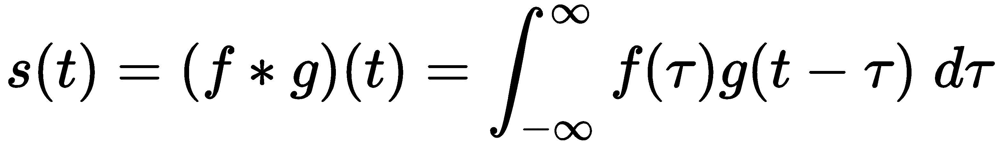
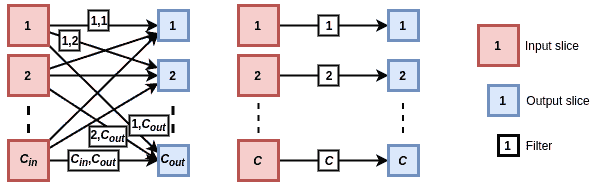
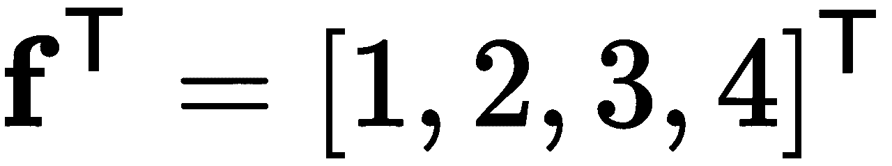
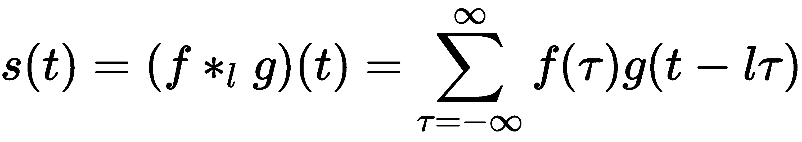
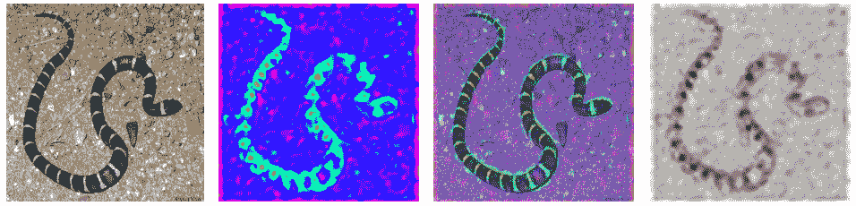
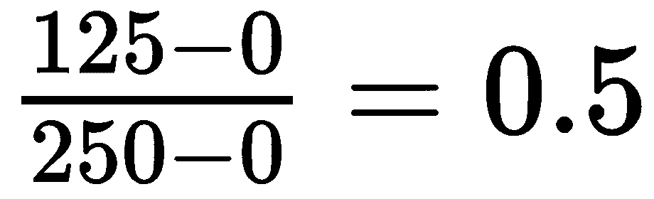

# 第二章：理解卷积网络

本章将讨论**卷积神经网络**（**CNNs**）及其在**计算机视觉**（**CV**）中的应用。CNNs 启动了现代深度学习的革命。它们是几乎所有最近 CV 进展的基础，包括**生成对抗网络**（**GANs**）、目标检测、图像分割、神经风格迁移等。因此，我们认为 CNNs 值得深入探讨，超越我们对它们的基本理解。

为此，我们将从简短回顾 CNN 的构建块开始，也就是卷积层和池化层。我们将讨论今天使用的各种类型的卷积，因为它们在大量的 CNN 应用中有所体现。我们还将学习如何可视化 CNN 的内部状态。接着，我们将重点讲解正则化技术并实现一个迁移学习的例子。

本章将涵盖以下主题：

+   理解 CNN

+   引入迁移学习

# 理解 CNN

在第一章中，*《神经网络的基础》*，我们讨论了许多 NN 操作都有坚实的数学基础，卷积也不例外。让我们从定义数学卷积开始：



在这里，我们有以下内容：

+   卷积运算用*表示。

+   `f`和`g`是具有共同参数`t`的两个函数。

+   卷积的结果是第三个函数，*s(t)*（而不仅仅是一个单一的值）。

`f`和`g`在值`t`处的卷积是*f(t)*与*g(t-τ)*的逆向（镜像）和位移后的值的乘积的积分，其中*t-τ*表示位移。也就是说，对于时间`t`上`f`的单个值，我们在范围内平移`g` ，并且由于积分的缘故，我们不断计算乘积*f(t)**g(t-τ)*。积分（因此卷积）等同于两个函数乘积曲线下的面积。

下面的图示最能说明这一点：


左：一个卷积，其中`g`被平移并反转；右：卷积运算的逐步演示

在卷积运算中，为了保持运算的交换性，`g`被平移并反转。在 CNN 的上下文中，我们可以忽略这个特性，并且我们可以在不反转`g`的情况下实现它。在这种情况下，这个运算称为互相关。这两个术语是可以互换使用的。

我们可以用以下公式为离散（整数）值`t`定义卷积（这与连续情况非常相似）：


我们还可以将其推广到具有两个共享输入参数`i`和`j`的函数卷积：


我们可以以类似的方式推导出三个参数的公式。

在卷积神经网络（CNNs）中，函数 `f` 是卷积操作的输入（也称为卷积层）。根据输入维度的数量，我们有 1D、2D 或 3D 卷积。时间序列输入是 1D 向量，图像输入是 2D 矩阵，3D 点云是 3D 张量。另一方面，函数 `g` 被称为核（或滤波器）。它的维度与输入数据相同，并由一组可学习的权重定义。例如，2D 卷积的大小为 `n` 的滤波器是一个 *n×n* 矩阵。下图展示了 2D 卷积，使用 2×2 滤波器应用于单个 3×3 切片：


2D 卷积，使用 2×2 滤波器应用于单个 3×3 切片

卷积的工作原理如下：

1.  我们将滤波器滑动通过输入张量的所有维度。

1.  在每个输入位置，我们将每个滤波器权重与给定位置对应的输入张量单元相乘。贡献到单个输出单元的输入单元称为 **感受野**。我们将所有这些值相加，得到单个输出单元的值。

与全连接层不同，在全连接层中，每个输出单元都从所有输入中收集信息，而卷积输出单元的激活是由其感受野中的输入决定的。这个原理最适用于层次结构数据，例如图像。例如，邻近的像素形成有意义的形状和物体，但图像一端的像素与另一端的像素之间不太可能有关系。使用全连接层将所有输入像素与每个输出单元连接，就像是让网络在大海捞针。它无法知道某个输入像素是否在输出单元的感受野内。

该滤波器在感受野中突出显示某些特定特征。操作的输出是一个张量（称为特征图），标记了检测到特征的位置。由于我们在整个输入张量上应用相同的滤波器，卷积是平移不变的；也就是说，它可以检测到相同的特征，无论它们在图像中的位置如何。然而，卷积既不是旋转不变的（如果特征旋转，它不保证检测到该特征），也不是尺度不变的（它不保证在不同尺度下检测到相同的特征）。

在下图中，我们可以看到 1D 和 3D 卷积的示例（我们已经介绍了 2D 卷积的一个示例）：


1D 卷积：滤波器（用多色线表示）沿单一轴滑动；3D 卷积：滤波器（用虚线表示）沿三个轴滑动

CNN 卷积可以有多个滤波器，用来突出不同的特征，这样就会生成多个输出特征图（每个滤波器一个）。它也可以从多个特征图中收集输入，例如，来自先前卷积的输出。特征图（输入或输出）的组合称为体积。在这个上下文中，我们也可以将特征图称为切片。虽然这两个术语指的是同一事物，但我们可以把切片看作是体积的一部分，而特征图则突出了它作为特征图的角色。

正如我们在本节前面提到的，每个体积（以及滤波器）都是通过张量表示的。例如，一个红、绿、蓝（RGB）图像通过一个包含三个 2D 切片（每个颜色通道一个切片）的 3D 张量表示。但是，在 CNN 的上下文中，我们为每个样本的 mini-batch 添加了一个维度。在这种情况下，1D 卷积将具有 3D 输入和输出张量。它们的轴可以是 *NCW* 或 *NWC* 顺序，其中 `N` 是 mini-batch 中样本的索引，`C` 是体积中深度切片的索引，`W` 是每个样本的向量大小。以相同的方式，2D 卷积将由 *NCHW* 或 *NHWC* 张量表示，其中 `H` 和 `W` 分别是切片的高度和宽度。3D 卷积将采用 *NCLHW* 或 *NLHWC* 顺序，其中 `L` 表示切片的深度。

我们使用 2D 卷积来处理 RGB 图像。然而，我们也可以将三种颜色视为一个额外的维度，从而将 RGB 图像视为 3D。那么为什么我们不使用 3D 卷积呢？原因是，尽管我们可以把输入看作是 3D 的，但输出仍然是一个 2D 网格。如果我们使用 3D 卷积，输出也会是 3D 的，而在 2D 图像的情况下，这没有任何意义。

假设我们有 `n` 个输入切片和 `m` 个输出切片。在这种情况下，我们会对 `n` 个输入切片应用 `m` 个滤波器。每个滤波器将生成一个独特的输出切片，突出显示该滤波器检测到的特征（`n` 到 `m` 的关系）。

根据输入和输出切片的关系，我们可以得到跨通道卷积和深度卷积，如下图所示：



左图：跨通道卷积；右图：深度卷积

让我们讨论它们的属性：

+   **跨通道卷积**：一个输出切片从所有输入切片接收输入（`n` 到一的关系）。当有多个输出切片时，关系变为 `n` 到 `m`。换句话说，每个输入切片都会对每个输出切片的输出产生贡献。每对输入/输出切片都会使用一个与该对独特的滤波器切片。我们用 `F` 来表示滤波器的大小（宽度和高度相等），用 *C[in]* 来表示输入体积的深度，用 *C[out]* 来表示输出体积的深度。有了这些，我们可以通过以下公式计算 2D 卷积的总权重数 `W`：


在这里，+1 表示每个滤波器的偏置权重。假设我们有三个切片，并且希望对它们应用四个 5*×*5 的滤波器。如果这样做，卷积滤波器将有总计 *(3`5`5 + 1) * 4 = 304* 个权重，四个输出切片（深度为 4 的输出体积），每个切片有一个偏置。每个输出切片的滤波器将对每个输入切片应用三个 5*×*5 的滤波器补丁，并有一个偏置，总共有 3`5`5 + 1 = 76 个权重。

+   **Depthwise convolutions**：每个输出切片仅接收来自单个输入切片的输入。这是之前情况的逆转。在最简单的形式中，我们对单个输入切片应用一个滤波器，生成一个单一的输出切片。在这种情况下，输入和输出的体积具有相同的深度，即 `C`。我们还可以指定一个 **通道倍增器**（一个整数，`m`），我们在单个输出切片上应用 `m` 个滤波器，从而生成 `m` 个输出切片。这是一个一对-`m` 的关系。在这种情况下，输出切片的总数是 *n * m*。我们可以用以下公式计算 2D 深度卷积中的权重 `W`：


在这里，`m` 是通道倍增器，*+C* 表示每个输出切片的偏置。

卷积操作还通过其他两个参数来描述：

+   **Stride** 是在每一步中，我们滑动滤波器在输入切片上的位置数。默认情况下，步幅为 1。如果大于 1，则称之为 **步幅卷积**。较大的步幅增加了输出神经元的感受野。步幅为 2 时，输出切片的大小大约是输入的四分之一。换句话说，步幅为 1 的卷积中，一个输出神经元的感受野是步幅为 2 时的四倍。后续层中的神经元将逐渐捕获来自输入图像较大区域的信息。

+   **Padding** 在卷积操作之前，用零填充输入切片的边缘，增加行和列。最常见的填充方式是使输出的尺寸与输入相同。新增的零将参与与切片的卷积操作，但不会影响结果。

知道输入的尺寸和滤波器的大小后，我们可以计算输出切片的尺寸。假设输入切片的大小为 `I`（高度和宽度相等），滤波器的大小为 `F`，步幅为 `S`，填充为 `P`。此时，输出切片的大小 `O` 由以下公式给出：


除了步幅卷积，我们还可以使用**池化**操作来增加深层神经元的感受野，并减少未来切片的大小。池化将输入切片划分为网格，每个网格单元代表多个神经元的感受野（就像卷积操作一样）。然后，在网格的每个单元上应用池化操作。类似于卷积，池化通过步幅，`S`，和感受野的大小，`F`，来描述。如果输入切片的大小为 `I`，则池化输出大小的公式如下：


在实践中，通常只使用两种组合。第一种是步幅为 2 的 2*×*2 感受野，第二种是步幅为 2 的 3*×*3 感受野（重叠）。最常见的池化操作如下：

+   **最大池化**: 这个操作传播感受野内输入值的最大值。

+   **平均池化**: 这个操作传播感受野内输入值的平均值。

+   **全局平均池化** (**GAP**): 这与平均池化相同，但池化区域与特征图的大小相同，*I×I*。GAP 执行一种极端的降维操作：输出是一个单一的标量，表示整个特征图的平均值。

通常，我们会交替使用一个或多个卷积层与一个池化（或步幅卷积）层。通过这种方式，卷积层可以在每个感受野大小的层次上检测特征，因为较深层的感受野大小要大于网络初始层的感受野。深层的层也比最初的层拥有更多的滤波器（因此，具有更高的体积深度）。网络初始阶段的特征检测器工作在较小的感受野上，它只能检测到有限的特征，如边缘或线条，这些特征在所有类别中都有共享。

另一方面，较深的层会检测到更复杂和更多的特征。例如，如果我们有多个类别，如汽车、树木或人，每个类别都会有一组特征，如轮胎、车门、树叶和面孔。这将需要更多的特征检测器。最终卷积（或池化）的输出通过添加一个或多个全连接层“翻译”到目标标签。

现在我们已经对卷积、池化操作和卷积神经网络（CNN）有了一个概述，在下一节中，我们将重点讨论不同类型的卷积操作。

# 卷积类型

到目前为止，我们讨论了最常见的卷积类型。在接下来的章节中，我们将讨论它的一些变体。

# 转置卷积

在我们目前讨论的卷积操作中，输出的维度要么与输入相等，要么小于输入的维度。与此相反，反卷积（最早由 Matthew D. Zeiler、Dilip Krishnan、Graham W. Taylor 和 Rob Fergus 在《*反卷积网络*》中提出：[`www.matthewzeiler.com/mattzeiler/deconvolutionalnetworks.pdf`](https://www.matthewzeiler.com/mattzeiler/deconvolutionalnetworks.pdf)）允许我们对输入数据进行上采样（其输出大于输入）。这种操作也被称为**反卷积**、**分数步幅卷积**或**子像素卷积**。这些名称有时会导致混淆。为了澄清这一点，请注意，反卷积实际上是一个常规卷积，只是对输入切片或卷积滤波器进行稍微修改。

对于更长的解释，我们将从一个 1D 常规卷积开始，考虑单个输入和输出切片：


1D 常规卷积

它使用一个大小为 4、步幅为 2、填充为 2 的滤波器（在上面的图中用灰色表示）。输入是一个大小为 6 的向量，输出是一个大小为 4 的向量。滤波器是一个向量`f` = [1, 2, 3, 4]，它始终是相同的，但我们根据应用它的位置使用不同的颜色表示。对应的输出单元也用相同的颜色表示。箭头表示哪些输入单元贡献给一个输出单元。

本节讨论的示例灵感来源于论文《*反卷积层是否与卷积层相同？*》([`arxiv.org/abs/1609.07009`](https://arxiv.org/abs/1609.07009))。

接下来，我们将讨论相同的示例（1D，单个输入和输出切片，滤波器大小为 4，填充为 2，步幅为 2），但对于反卷积。下图展示了我们可以实现它的两种方式：


左：步幅为 2 的卷积，应用了反卷积滤波器`f`。输出的开始和结束处的 2 个像素被裁剪；右：步幅为 0.5 的卷积，应用于输入数据，并通过子像素填充。输入被填充为 0 值像素（灰色）。

让我们详细讨论它们：

+   在第一个案例中，我们有一个步幅为 2 的常规卷积，滤波器表示为反转的行矩阵（等同于列矩阵），大小为 4：（如上图左所示）。请注意，步幅是应用于输出层的，而常规卷积则是应用于输入层的。通过将步幅设置为大于 1，我们可以增加输出的大小，相对于输入。在这里，输入切片的大小为`I`，滤波器的大小为`F`，步幅为`S`，输入的填充为`P`。因此，反卷积的输出切片大小`O`可以通过以下公式计算：

    

    在这种情况下，大小为 4 的输入产生的输出大小为`2`(4 - 1) + 4 - 2*2 = 6*。我们还会裁剪输出向量的开始和结束部分的两个单元，因为它们只收集来自单个输入单元的信息。

+   在第二种情况下，输入填充了存在的像素之间的虚拟 0 值子像素（如前面的图所示，右侧）。这就是“子像素卷积”这一名称的由来。可以将其视为一种填充，但它发生在图像内部，而不仅仅是在边缘上。一旦输入以这种方式被转换，就会应用常规卷积。

让我们比较两种情况中的两个输出单元，`o[1]`和`o[3]`。如前面的图所示，在这两种情况下，`o[1]`接收来自第一个和第二个输入单元的信息，`o[3]`接收来自第二个和第三个单元的信息。实际上，这两种情况之间唯一的区别是参与计算的权重索引。然而，权重是在训练过程中学习的，因此，索引并不重要。因此，这两种操作是等效的。

接下来，我们从子像素的角度来看一个 2D 转置卷积（输入在底部）。与 1D 情况类似，我们在输入切片中插入 0 值像素和填充，以实现上采样：


具有填充为 1 和步幅为 2 的 2D 转置卷积的前三个步骤：来源：[`github.com/vdumoulin/conv_arithmetic`](https://github.com/vdumoulin/conv_arithmetic)，[`arxiv.org/abs/1603.07285`](https://arxiv.org/abs/1603.07285)

常规卷积的反向传播操作是转置卷积。

# 1×1 卷积

1×1（或逐点）卷积是卷积的一种特殊情况，其中卷积滤波器的每个维度的大小为 1（2D 卷积中的 1×1 和 3D 卷积中的 1×1×1）。起初，这似乎没有意义——1×1 的滤波器并不会增加输出神经元的感受野大小。此类卷积的结果将是逐点缩放。但它在另一个方面是有用的——我们可以用它们来改变输入和输出体积之间的深度。

为了理解这一点，我们回顾一下，通常情况下，我们有一个深度为`D`切片的输入体积，以及`M`个滤波器用于生成`M`个输出切片。每个输出切片都是通过将唯一的滤波器应用于所有输入切片生成的。如果我们使用 1×1 的滤波器且*D != M*，我们会得到相同大小的输出切片，但深度不同。同时，我们不会改变输入和输出之间的感受野大小。最常见的用例是减少输出体积，或*D > M*（降维），俗称“瓶颈”层。

# 深度可分离卷积

在跨通道卷积中，一个输出切片接收来自所有输入切片的输入，使用一个滤波器。该滤波器试图在三维空间中学习特征，其中两个维度是空间维度（切片的高度和宽度），第三个维度是通道。因此，滤波器映射了空间和跨通道的相关性。

**深度可分离卷积**（**DSC**，*Xception: Deep Learning with Depthwise Separable Convolutions*，[`arxiv.org/abs/1610.02357`](https://arxiv.org/abs/1610.02357)）可以完全解耦跨通道和空间相关性。DSC 结合了两种操作：深度卷积和 1×1 卷积。在深度卷积中，一个输入切片产生一个输出切片，因此它只映射空间相关性（而不是跨通道相关性）。而在 1×1 卷积中，我们恰恰相反。以下图示表示了 DSC：


深度可分离卷积

深度可分离卷积（DSC）通常在第一次（深度）操作后没有非线性激活。

让我们比较标准卷积和深度可分离卷积。假设我们有 32 个输入和输出通道，以及一个大小为 3×3 的滤波器。在标准卷积中，一个输出切片是对 32 个输入切片中每一个应用一个滤波器的结果，总共需要*32 * 3 * 3 = 288*个权重（不包括偏置）。在一个可比的深度卷积中，滤波器只有*3 * 3 = 9*个权重，而 1×1 卷积的滤波器有*32 * 1 * 1 = 32*个权重。总权重数是*32 + 9 = 41*。因此，深度可分离卷积相对于标准卷积来说，速度更快且更节省内存。

# 空洞卷积

回顾我们在《*CNN 快速回顾*》章节开始时介绍的离散卷积公式。为了说明空洞卷积（*Multi-Scale Context Aggregation by Dilated Convolutions*，[`arxiv.org/abs/1511.07122`](https://arxiv.org/abs/1511.07122)），我们从以下公式开始：



我们用**[l]*表示空洞卷积，其中`l`是一个正整数，称为膨胀因子。关键在于我们如何在输入上应用滤波器。不同于在*n×n*感受野上应用*n×n*滤波器，我们将相同的滤波器稀疏地应用于一个大小为*(n*l-1)×(n*l-1)*的感受野。我们依然将每个滤波器权重与一个输入切片单元相乘，但这些单元之间相隔`l`的距离。常规卷积是空洞卷积的一个特例，当*l=1*时。以下图示可以最好地说明这一点：


膨胀因子 l=2 的空洞卷积：这里显示了操作的前两步。底层是输入层，而顶层是输出层。来源：[`github.com/vdumoulin/conv_arithmetic`](https://github.com/vdumoulin/conv_arithmetic)

膨胀卷积可以在不损失分辨率或覆盖范围的情况下指数级地增加感受野的大小。我们也可以通过步长卷积或池化来增加感受野，但代价是分辨率和/或覆盖范围的损失。为了理解这一点，我们假设有一个步长为*s>1*的步长卷积。在这种情况下，输出切片比输入小`s`倍（分辨率损失）。如果我们进一步增加*s>n*（`n`为池化或卷积核的大小），则会损失覆盖范围，因为输入切片的某些区域将完全不参与输出。此外，膨胀卷积不会增加计算和内存成本，因为滤波器使用的权重数量与常规卷积相同。

# 提高卷积神经网络（CNNs）的效率

最近**深度学习**（**DL**）取得进展的主要原因之一是它能够非常快速地运行**神经网络**（**NNs**）。这在很大程度上是因为神经网络算法的性质与**图形处理单元**（**GPU**）的具体特点非常契合。在第一章《神经网络的基本原理》中，我们强调了矩阵乘法在神经网络中的重要性。对此的证明是，卷积也可以转化为矩阵乘法。矩阵乘法是极其并行的（相信我，这是一个术语——你可以在 Google 上查找它！）。每个输出单元的计算与其他任何输出单元的计算无关。因此，我们可以并行计算所有输出。

并非巧合，GPU 非常适合执行像这样的高并行操作。一方面，GPU 的计算核心数量远高于**中央处理单元**（**CPU**）。尽管 GPU 核心的速度比 CPU 核心快，但我们仍然可以并行计算更多的输出单元。但更重要的是，GPU 在内存带宽方面进行了优化，而 CPU 则在延迟方面进行了优化。这意味着 CPU 可以非常快速地获取小块内存，但在获取大块内存时会变得缓慢。GPU 则相反。因此，在像神经网络（NNs）的大矩阵乘法这样的任务中，GPU 具有优势。

除了硬件方面的优化，我们也可以在算法方面优化 CNN。CNN 中的大部分计算时间都花费在卷积操作上。尽管卷积的实现本身相对简单，但实际上有更高效的算法可以实现相同的结果。尽管现代的深度学习库如 TensorFlow 或 PyTorch 能够将开发者从这些细节中抽象出来，但在本书中，我们旨在更深入（这可是双关语哦）地理解深度学习。

因此，在接下来的部分，我们将讨论两种最流行的快速卷积算法。

# 卷积作为矩阵乘法

在本节中，我们将描述将卷积转化为矩阵乘法的算法，正如它在 cuDNN 库中实现的那样（*cuDNN: 高效的深度学习原语*，[`arxiv.org/abs/1410.0759`](https://arxiv.org/abs/1410.0759)）。为了理解这一点，我们假设对 RGB 输入图像执行跨通道二维卷积。让我们查看下面的表格，了解卷积的参数：

| **参数** | **符号** | **值** |
| --- | --- | --- |
| 小批量大小 | N | 1 |
| 输入特征图（体积深度） | C | 3（每个 RGB 通道一个） |
| 输入图像高度 | H | 4 |
| 输入图像宽度 | W | 4 |
| 输出特征图（体积深度） | K | 2 |
| 滤波器高度 | R | 2 |
| 滤波器宽度 | S | 2 |
| 输出特征图高度 | P | 2（基于输入/滤波器的大小） |
| 输出特征图宽度 | Q | 2（基于输入/滤波器的大小） |

为了简化，我们假设使用零填充和步幅为 1。我们将输入张量表示为`D`，卷积滤波器张量表示为`F`。矩阵卷积按以下方式工作：

1.  我们将张量`D`和`F`分别展开为  和  矩阵。

1.  然后，我们通过矩阵相乘来得到输出矩阵， 。

我们在第一章中讨论了矩阵乘法，*神经网络的基础*。现在，让我们关注如何将张量展开成矩阵。下面的图示展示了如何做到这一点：


卷积作为矩阵乘法；灵感来源于 https://arxiv.org/abs/1410.0759

每个特征图有不同的颜色（R，G，B）。在常规卷积中，滤波器是方形的，并且我们将其应用于方形的输入区域。在变换中，我们将`D`中的每个可能的方形区域展开成`D`*[m]*的一个列。然后，我们将`F`的每个方形组件展开为`F`*[m]*的一个行。通过这种方式，每个输出单元的输入和滤波器数据都位于矩阵`D`*[m]*和`F`*[m]*的单独列/行中。这使得通过矩阵乘法计算输出值成为可能。变换后的输入/滤波器/输出的维度如下：

+   dim(`D`*[m]*) = CRS*×*NPQ = 12*×*4

+   dim(`F`*[m]*) = K*×*CRS = 2*×*12

+   dim(`O`*[m]*) = K*×*NPQ = 2*×*4

为了理解这个变换，让我们学习如何使用常规卷积算法计算第一个输出单元格：


接下来，让我们观察相同的公式，不过这次是以矩阵乘法的形式：


如果我们比较两个方程的组成部分，会发现它们完全相同。即，`D`[0,0,0,0] = `D`[m][0,0]，`F`[0,0,0,0] = `F`[m][0,0]，`D`[0,0,0,1] = `D`[m][0,1]，`F`[0,0,0,1] = `F`[m][0,1]，以此类推。我们可以对其余的输出单元进行相同的操作。因此，两种方法的输出是相同的。

矩阵卷积的一个缺点是增加了内存使用量。在前述图示中，我们可以看到一些输入元素被多次重复（最多可达 RS = 4 次，例如 D4）。

# Winograd 卷积

Winograd 算法（*卷积神经网络的快速算法*，[`arxiv.org/abs/1509.09308`](https://arxiv.org/abs/1509.09308)）可以提供相较于直接卷积 2 或 3*×* 的加速。为了解释这一点，我们将使用在 *卷积作为矩阵乘法* 部分中相同的符号，但使用 *3×3*（*R=S=3*）滤波器。我们还假设输入切片大于 *4×4*（*H>4, W>4*）。

下面是计算 Winograd 卷积的方法：

1.  将输入图像划分为 4*×*4 个重叠的块，步长为 2，如下图所示：


输入被划分为多个块

块大小可以有所变化，但为了简便起见，我们只关注 4*×*4 的块。

1.  使用以下两个矩阵乘法变换每个块：


在前面的公式中，矩阵 `D` 是输入切片（带有圆形值的那个），而 `B` 是一个特殊矩阵，它源于 Winograd 算法的特性（您可以在本节开头的论文中找到更多相关信息）。

1.  使用以下两个矩阵乘法变换滤波器：


在前面的公式中，矩阵 `F`（带有点值的那个）是一个输入和输出切片之间的 3*×*3 卷积滤波器。`G` 及其转置  是 Winograd 算法的特殊矩阵。请注意，变换后的滤波器矩阵 `F`*[t]* 与输入块 `D`*[t]* 具有相同的维度。

1.  通过对变换后的输入和滤波器进行 **元素级** 相乘（即  符号），计算变换后的输出：


1.  将输出转换回其原始形式：


`A` 是一个变换矩阵，它使得将  转换回从直接卷积得到的形式成为可能。正如前述公式和下图所示，Winograd 卷积允许我们同时计算 2*×*2 输出块（四个输出单元）：


Winograd 卷积允许我们同时计算四个输出单元。

乍一看，似乎 Winograd 算法执行的操作比直接卷积多得多。那么，它为什么更快呢？为了找出答案，让我们集中关注  转换。关键在于，我们只需要执行一次 ，然后 `D`*[t]* 可以参与所有 `K`（按照符号表示）输出切片的输出。因此， 在所有输出中进行摊销，并且它对性能的影响不大。接下来，让我们看看  转换。这一步甚至更好，因为一旦我们计算出 `F`*[t]*，我们可以将其应用于 *N×P×Q* 次（遍历输出切片的所有单元格以及批次中的所有图像）。因此，这一转换的性能损失可以忽略不计。同样，输出转换  也在输入通道数 C 上进行摊销。

最后，我们将讨论逐元素乘法，，它应用于输出切片的所有单元格，*P×Q* 次，并占据了大部分计算时间。它由 16 次标量乘法操作组成，允许我们计算 2*×*2 的输出瓦片，这意味着每个输出单元需要进行四次乘法操作。与直接卷积相比，我们需要执行 `3`3=9* 次标量乘法（每个滤波器元素与每个感受野输入单元相乘），才能得到一个输出。因此，Winograd 卷积比直接卷积减少了 *9/4 = 2.25* 次操作。

Winograd 卷积在使用较小的滤波器尺寸时（例如，3*×*3）效果最佳。使用较大的滤波器（例如，11*×*11）的卷积可以通过快速傅里叶变换（FFT）卷积高效实现，这超出了本书的讨论范围。

在下一节中，我们将尝试通过可视化 CNN 的内部状态来理解其内部工作原理。

# 可视化 CNN

神经网络（NN）的一个批评是它们的结果不可解释。通常认为神经网络是一个黑盒，其内部逻辑对我们是隐藏的。这可能是一个严重的问题。一方面，我们不太可能信任一个我们不了解其工作原理的算法；另一方面，如果我们不知道神经网络是如何工作的，就很难提高 CNN 的准确性。正因为如此，在接下来的章节中，我们将讨论两种可视化 CNN 内部层的方法，这两种方法将帮助我们深入了解它们的学习方式。

# 引导反向传播

引导反向传播（*Striving for Simplicity: The All Convolutional Net*， [`arxiv.org/abs/1412.6806`](https://arxiv.org/abs/1412.6806)）使我们能够可视化 CNN 中某一层的单个单元所学到的特征。下图展示了算法的工作原理：


引导反向传播可视化；灵感来自于 [`arxiv.org/abs/1412.6806`](https://arxiv.org/abs/1412.6806)。

下面是逐步执行的过程：

1.  首先，我们从一个常规的 CNN 开始（例如，AlexNet、VGG 等），并使用 ReLU 激活函数。

1.  然后，我们将一个单一图像 *f^((0))* 输入网络，并向前传播，直到我们到达感兴趣的层 `l`。这可以是任何网络层——隐藏层或输出层，卷积层或全连接层。

1.  将该层输出张量 *f^((l))* 的所有激活值设置为 0，除了一个。例如，如果我们对分类网络的输出层感兴趣，我们将选择激活值最大（等同于预测类别）的单元，并将其值设置为 1，其余单元设置为 0。通过这种方式，我们可以隔离出感兴趣的单元，查看哪些输入图像部分对其影响最大。

1.  最后，我们将选定单元的激活值向后传播，直到到达输入层并恢复图像 *R^((0))*。反向传播过程与常规反向传播非常相似（但并不完全相同），即我们仍然使用转置卷积作为前向卷积的反向操作。然而，在这种情况下，我们关注的是图像恢复特性，而不是误差传播。因此，我们不受限于传播一阶导数（梯度）的要求，能够以一种改善可视化的方式修改信号。

为了理解反向传播，我们将使用一个示例卷积，输入和输出都是单个 3*×*3 的切片。假设我们使用一个 1*×*1 的滤波器，并且滤波器的权重为 1（我们重复输入）。下图展示了这个卷积操作，以及实现反向传播的三种不同方式：


卷积和三种不同的图像重构方式；灵感来自于 [`arxiv.org/abs/1412.6806`](https://arxiv.org/abs/1412.6806)。

让我们详细讨论这三种不同的反向传播实现方式：

+   **常规反向传播**：反向信号依赖于输入图像，因为它也依赖于前向激活（见 第一章，*神经网络的基本原理*，在 *反向传播* 部分）。我们的网络使用 ReLU 激活函数，因此信号只会通过前向传播中激活值为正的单元。

+   **反卷积网络**（*deconvnet*，[`arxiv.org/abs/1311.2901`](https://arxiv.org/abs/1311.2901)）：层 `l` 的反向信号仅依赖于层 *l+1* 的反向信号。deconvnet 只会将 *l+1* 的正值路由到 `l`，不管正向激活如何。理论上，信号完全不依赖于输入图像。在这种情况下，deconvnet 会根据其内部知识和图像类别尝试恢复图像。然而，这并不完全正确——如果网络包含最大池化层，deconvnet 会存储每个池化层的所谓 **开关**。每个开关代表正向传播中最大激活值的单元的映射。该映射决定了如何在反向传播中路由信号（你可以在源论文中阅读更多内容）。

+   **引导反向传播**：这是 deconvnet 和常规反向传播的结合。它只会将正向激活在 `l` 层中以及正向反向激活在 *l+1* 层中的信号传递。这为常规反向传播增加了额外的引导信号（因此得名），来自更高层次的指导信号。在本质上，这一步骤防止了负梯度在反向传播中流动。其原理是，作为抑制我们起始单元的单位将被阻止，重建的图像将不再受其影响。引导反向传播表现得如此出色，以至于它不需要使用 deconvnet 开关，而是将信号传递给每个池化区域中的所有单元。

以下截图显示了使用引导反向传播和 AlexNet 生成的重建图像：


从左到右：原始图像、颜色重建、以及使用引导反向传播在 AlexNet 上的灰度重建；这些图像是通过 [`github.com/utkuozbulak/pytorch-cnn-visualizations`](https://github.com/utkuozbulak/pytorch-cnn-visualizations) 生成的。

# 梯度加权类激活映射

要理解梯度加权类激活映射（*Grad-CAM: Visual Explanations from Deep Networks via Gradient-Based Localization*，[`arxiv.org/abs/1610.02391`](https://arxiv.org/abs/1610.02391)），让我们引用源论文本身：

"Grad-CAM 使用任何目标概念（例如，‘狗’的逻辑回归值或甚至一个标题）的梯度，这些梯度流入最终的卷积层，以生成一个粗略的定位图，突出显示图像中对于预测该概念的重要区域。"

以下截图显示了 Grad-CAM 算法：


Grad-CAM 方案；来源：[`arxiv.org/abs/1610.02391`](https://arxiv.org/abs/1610.02391)

现在，让我们看看它是如何工作的：

1.  首先，你从一个分类 CNN 模型开始（例如，VGG）。

1.  然后，你将一张单一的图像输入到 CNN 中，并将其传播到输出层。

1.  如同我们在引导反向传播中所做的那样，我们选取具有最大激活的输出单元（等价于预测类别 *`c`*），将其值设为 1，并将其他所有输出设为 0。换句话说，创建一个预测的 one-hot 编码向量 *y^c*。

1.  接下来，使用反向传播计算 *y^c* 相对于最终卷积层的特征图 *A^k* 的梯度， 。其中 `i` 和 `j` 是特征图中的单元坐标。

1.  然后，计算标量权重 ，它衡量特征图 `k` 对预测类别 `c` 的“重要性”：


1.  最后，计算标量权重与最终卷积层的前向激活特征图之间的加权组合，并随后使用 ReLU：


请注意，我们将标量重要性权重  乘以张量特征图 *A^k*。结果是一个与特征图相同维度的热力图（对于 VGG 和 AlexNet，维度为 14*×*14）。它会突出显示对类别 `c` 最重要的特征图区域。ReLU 会丢弃负激活，因为我们只关心那些能增加 *y^c* 的特征。我们可以将这个热力图上采样回输入图像的大小，然后叠加在图像上，如下图所示：



从左到右：输入图像；上采样后的热力图；热力图叠加在输入图像上（RGB）；灰度热力图。图像是使用 https://github.com/utkuozbulak/pytorch-cnn-visualizations 生成的。

Grad-CAM 的一个问题是将热力图从 14*×*14 上采样到 224*×*224，因为它无法提供每个类别的重要特征的细粒度视角。为了缓解这个问题，论文的作者提出了 Grad-CAM 和引导反向传播（在本节开始的 Grad-CAM 示意图中显示）的结合。我们将上采样的热力图与引导反向传播的可视化进行逐元素相乘。输入图像包含两种物体：一只狗和一只猫。因此，我们可以对这两种类别运行 Grad-CAM（图示的两行）。这个例子展示了不同类别在同一图像中检测不同相关特征的方法。

在下一节中，我们将讨论如何借助正则化来优化 CNN。

# CNN 正则化

正如我们在第一章，*神经网络的基本原理*中讨论的那样，神经网络（NN）可以逼近任何函数。但强大的能力伴随着巨大的责任。神经网络可能会学会逼近目标函数的噪声部分，而不是有用的成分。例如，假设我们正在训练一个神经网络来分类图像是否包含汽车，但由于某种原因，训练集中的大多数汽车是红色的。结果可能是神经网络将红色与汽车关联起来，而不是它的形状。现在，如果网络在推理模式下看到一辆绿色汽车，可能会因为颜色不匹配而无法识别它。这种问题被称为过拟合，是机器学习中的核心问题（在深度网络中尤其如此）。在本节中，我们将讨论几种防止过拟合的方法。这些技术统称为**正则化**。

在神经网络的上下文中，这些正则化技术通常会对训练过程施加一些人工的限制或障碍，以防止网络过于精确地逼近目标函数。它们试图引导网络学习目标函数的通用而非特定的逼近方式，希望这种表示方法能够很好地泛化到测试数据集中之前未见过的示例。你可能已经熟悉其中的许多技术，因此我们会简要介绍：

+   **输入特征缩放**：。此操作将所有输入缩放到[0, 1]范围内。例如，一个强度为 125 的像素会有一个缩放值为。特征缩放实施起来既快速又简单。

+   **输入标准分数**：。这里，μ和σ是所有训练数据的均值和标准差。它们通常是针对每个输入维度单独计算的。例如，在 RGB 图像中，我们会为每个通道计算均值*μ*和*σ*。我们需要注意的是，*μ*和*σ*必须在训练数据上计算，然后应用到测试数据上。或者，如果不便于在整个数据集上计算，我们可以按样本计算*μ*和*σ*。

+   **数据增强**：这是通过在将训练样本输入网络之前，应用随机修改（如旋转、扭曲、缩放等）来人为地增加训练集的大小。

+   **L2 正则化**（或**权重衰减**）：在这里，我们在成本函数中添加一个特殊的正则化项。假设我们使用的是均方误差（MSE）（第一章，*神经网络的基本原理*，*梯度下降*部分）。这里，MSE + L2 正则化的公式如下：


在这里，*w[j]* 是总共 `k` 个网络权重中的一个，λ 是权重衰减系数。其基本原理是，如果网络权重 *w[j]* 较大，那么成本函数也会增加。实际上，权重衰减对大权重进行惩罚（因此得名）。这可以防止网络过于依赖与这些权重相关的少数特征。当网络被迫使用多个特征时，过拟合的可能性较小。在实际应用中，当我们计算权重衰减成本函数（前述公式）相对于每个权重的导数，并将其传播到权重本身时，权重更新规则从  变为 。

+   **Dropout（丢弃法）**：在此过程中，我们随机并定期从网络中移除一些神经元（连同它们的输入输出连接）。在训练的小批次期间，每个神经元有 `p` 的概率被随机丢弃。这是为了确保没有神经元过于依赖其他神经元，而是“学习”对网络有用的东西。

+   **批量归一化**（**BN**，*Batch Normalization: Accelerating Deep Network Training by Reducing Internal Covariate Shift*， [`arxiv.org/abs/1502.03167`](https://arxiv.org/abs/1502.03167)）：这是一种应用数据处理的方法，类似于标准分数，适用于网络的隐藏层。它对每个小批次的隐藏层输出进行归一化（因此得名），使得其均值接近 0，标准差接近 1。假设  是一个大小为 `n` 的小批次。每个 `D` 的样本是一个向量，，而 是该向量的索引为 `k` 的单元。为了清晰起见，以下公式中我们将省略 (`k`) 上标；也就是说，我们写 *x[i]*，但指代的是 。我们可以按照以下方式计算每个激活值 `k` 在整个小批次上的 BN：

    1.  ![]：这是小批次均值。我们分别为每个位置 `k` 计算 *μ*，然后对所有样本求平均。

    1.  ：这是小批次标准差。我们分别为每个位置 `k` 计算 *σ*，然后对所有样本求平均。

    1.  ：我们对每个样本进行归一化处理。*ε* 是一个常数，用于保证数值稳定性。

    1.  : *γ* 和 *β* 是可学习的参数，我们在每个位置上计算它们，`k` (*γ^((k))* 和 *β^((k))*)，在所有小批量样本中进行计算（*μ* 和 *σ* 也适用）。在卷积层中，每个样本，`x`，是一个包含多个特征图的张量。为了保持卷积特性，我们在所有样本的每个位置上计算 *μ* 和 *σ*，但在所有特征图中的匹配位置使用相同的 *μ* 和 *σ*。另一方面，我们在每个特征图上计算 *γ* 和 *β*，而不是每个位置上。

本节结束了我们对卷积神经网络（CNN）结构和内部工作原理的分析。到这时，我们通常会继续进行一些 CNN 编程示例。但是在本书中，我们想做得稍微不同一些。因此，我们不会实现一个传统的前馈 CNN，您可能之前已经做过。相反，在下一节中，您将会接触到**迁移学习**技术——一种使用预训练的 CNN 模型处理新任务的方法。但请放心，我们仍然会从零开始实现一个 CNN。我们将在第三章 *高级卷积网络* 中实现。通过这种方式，我们将能够利用该章的知识构建一个更复杂的网络架构。

# 介绍迁移学习

假设我们要在一个没有像 ImageNet 那样现成的标签训练数据的任务上训练模型。标记训练样本可能会非常昂贵、耗时且容易出错。那么，当工程师想用有限的资源解决实际的机器学习问题时，该怎么办呢？这时就有了**迁移学习**（**Transfer Learning**，简称**TL**）。

迁移学习是将一个已训练好的机器学习模型应用到一个新的但相关的问题的过程。例如，我们可以将一个在 ImageNet 上训练的网络重新用于分类超市商品。或者，我们可以使用驾驶模拟器游戏训练一个神经网络来驾驶模拟车，然后再用这个网络驾驶一辆真实的车（但不要在家尝试！）。迁移学习是一个通用的机器学习概念，适用于所有机器学习算法，但在这个上下文中，我们将讨论卷积神经网络（CNN）。它是如何工作的呢？

我们从一个已有的预训练网络开始。最常见的做法是从 ImageNet 获取一个预训练的网络，但也可以是任何数据集。TensorFlow 和 PyTorch 都有流行的 ImageNet 预训练神经网络架构供我们使用。或者，我们也可以使用自己选择的数据集训练一个网络。

CNN 末尾的全连接层充当网络语言（在训练过程中学习到的抽象特征表示）和我们语言（每个样本的类别）之间的转换器。你可以将迁移学习看作是翻译成另一种语言。我们从网络的特征开始，即最后一层卷积或池化层的输出。然后，我们将它们翻译成新任务的不同类别。我们可以通过去掉现有预训练网络的最后一层全连接层（或所有全连接层），并用另一个层替代它，后者代表新问题的类别。

看看下图所示的迁移学习（TL）场景：


在迁移学习中，我们可以替换预训练网络的全连接层，并将其重新用于新问题。

然而，我们不能机械地进行操作并期待新网络能够工作，因为我们仍然需要用与新任务相关的数据训练新层。在这里，我们有两个选项：

+   **将原网络部分作为特征提取器，只训练新层**：在这种情况下，我们将网络输入一批新的训练数据并前向传播，以查看网络的输出。这一部分就像常规训练一样工作。但是在反向传播时，我们锁定原始网络的权重，只更新新层的权重。当我们在新问题上有有限的训练数据时，推荐使用这种方法。通过锁定大部分网络权重，我们可以防止在新数据上出现过拟合。

+   **微调整个网络**：在这种情况下，我们将训练整个网络，而不仅仅是最后添加的新层。我们可以更新所有网络的权重，但也可以锁定前几层的部分权重。这里的思路是，初始层检测的是一般特征——与特定任务无关——因此重复使用这些层是有意义的。另一方面，深层可能会检测到与任务相关的特定特征，因此更新这些层会更好。当我们有更多训练数据并且不需要担心过拟合时，可以使用这种方法。

# 使用 PyTorch 实现迁移学习

现在我们知道了什么是迁移学习，让我们来看看它在实践中是否有效。在本节中，我们将使用**PyTorch 1.3.1**和`torchvision` 0.4.2 包，将一个高级的 ImageNet 预训练网络应用于 CIFAR-10 图像。我们将使用两种类型的迁移学习。最好在 GPU 上运行此示例。

这个示例部分基于[`github.com/pytorch/tutorials/blob/master/beginner_source/transfer_learning_tutorial.py`](https://github.com/pytorch/tutorials/blob/master/beginner_source/transfer_learning_tutorial.py)。

我们开始吧：

1.  进行以下导入：

```py
import torch
import torch.nn as nn
import torch.optim as optim
import torchvision
from torchvision import models, transforms
```

1.  为了方便起见，定义`batch_size`：

```py
batch_size = 50
```

1.  定义训练数据集。我们需要考虑以下几个方面：

    +   CIFAR-10 的图像大小是 32×32，而 ImageNet 网络期望输入为 224×224。由于我们使用的是基于 ImageNet 的网络，我们将 CIFAR 的 32×32 图像上采样到 224×224。

    +   使用 ImageNet 的均值和标准差对 CIFAR-10 数据进行标准化，因为网络需要这些数据格式。

    +   我们还将添加一些数据增强，形式是随机的水平或垂直翻转：

```py
# training data
train_data_transform = transforms.Compose([
    transforms.Resize(224),
    transforms.RandomHorizontalFlip(),
    transforms.RandomVerticalFlip(),
    transforms.ToTensor(),
    transforms.Normalize((0.4914, 0.4821, 0.4465), (0.2470, 
    0.2435, 0.2616))
])

train_set = torchvision.datasets.CIFAR10(root='./data',
                           train=True, download=True,
                           transform=train_data_transform)

train_loader = torch.utils.data.DataLoader(train_set,
                           batch_size=batch_size,
                           shuffle=True, num_workers=2)
```

1.  对验证/测试数据执行相同的步骤，但这次不进行数据增强：

```py
val_data_transform = transforms.Compose([
    transforms.Resize(224),
    transforms.ToTensor(),
    transforms.Normalize((0.4914, 0.4821, 0.4465), (0.2470, 0.2435, 
    0.2616))
])

val_set = torchvision.datasets.CIFAR10(root='./data',
                                  train=False, download=True,
                                  transform=val_data_transform)

val_order = torch.utils.data.DataLoader(val_set,
                                  batch_size=batch_size,
                                  shuffle=False, num_workers=2)
```

1.  选择`device`，最好选择 GPU，如果没有则使用 CPU：

```py
device = torch.device("cuda:0" if torch.cuda.is_available() else "cpu")
```

1.  定义模型的训练过程。与 TensorFlow 不同，在 PyTorch 中，我们需要手动遍历训练数据。这个方法会遍历整个训练集一次（一个 epoch），并在每次前向传播后应用优化器：

```py
def train_model(model, loss_function, optimizer, data_loader):
    # set model to training mode
    model.train()

    current_loss = 0.0
    current_acc = 0

    # iterate over the training data
    for i, (inputs, labels) in enumerate(data_loader):
        # send the input/labels to the GPU
        inputs = inputs.to(device)
        labels = labels.to(device)

        # zero the parameter gradients
        optimizer.zero_grad()

        with torch.set_grad_enabled(True):
            # forward
            outputs = model(inputs)
            _, predictions = torch.max(outputs, 1)
            loss = loss_function(outputs, labels)

            # backward
            loss.backward()
            optimizer.step()

        # statistics
        current_loss += loss.item() * inputs.size(0)
        current_acc += torch.sum(predictions == labels.data)

    total_loss = current_loss / len(data_loader.dataset)
    total_acc = current_acc.double() / len(data_loader.dataset)

    print('Train Loss: {:.4f}; Accuracy: {:.4f}'.format(total_loss, 
    total_acc))
```

1.  定义模型的测试/验证过程。这与训练阶段非常相似，但我们将跳过反向传播部分：

```py
def test_model(model, loss_function, data_loader):
    # set model in evaluation mode
    model.eval()

    current_loss = 0.0
    current_acc = 0

    # iterate over  the validation data
    for i, (inputs, labels) in enumerate(data_loader):
        # send the input/labels to the GPU
        inputs = inputs.to(device)
        labels = labels.to(device)

        # forward
        with torch.set_grad_enabled(False):
            outputs = model(inputs)
            _, predictions = torch.max(outputs, 1)
            loss = loss_function(outputs, labels)

        # statistics
        current_loss += loss.item() * inputs.size(0)
        current_acc += torch.sum(predictions == labels.data)

    total_loss = current_loss / len(data_loader.dataset)
    total_acc = current_acc.double() / len(data_loader.dataset)

    print('Test Loss: {:.4f}; Accuracy: {:.4f}'.format(total_loss, 
    total_acc))

    return total_loss, total_acc
```

1.  定义第一个 TL 场景，我们将预训练网络作为特征提取器：

    +   我们将使用一个流行的网络架构——ResNet-18。我们将在*高级网络架构*部分详细讨论这个内容。PyTorch 会自动下载预训练的权重。

    +   用具有 10 个输出的新层替换网络的最后一层（每个 CIFAR-10 类别一个输出）。

    +   排除现有的网络层的反向传播，只将新添加的全连接层传递给 Adam 优化器。

    +   训练`epochs`次数，并在每个 epoch 后评估网络的准确度。

    +   使用`plot_accuracy`函数绘制测试准确度。该函数的定义非常简单，你可以在本书的代码库中找到它。

以下是`tl_feature_extractor`函数，它实现了所有这些功能：

```py
def tl_feature_extractor(epochs=5):
    # load the pretrained model
    model = torchvision.models.resnet18(pretrained=True)

    # exclude existing parameters from backward pass
    # for performance
    for param in model.parameters():
        param.requires_grad = False

    # newly constructed layers have requires_grad=True by default
    num_features = model.fc.in_features
    model.fc = nn.Linear(num_features, 10)

    # transfer to GPU (if available)
    model = model.to(device)

    loss_function = nn.CrossEntropyLoss()

    # only parameters of the final layer are being optimized
    optimizer = optim.Adam(model.fc.parameters())

    # train
    test_acc = list()  # collect accuracy for plotting
    for epoch in range(epochs):
        print('Epoch {}/{}'.format(epoch + 1, epochs))

        train_model(model, loss_function, optimizer, train_loader)
        _, acc = test_model(model, loss_function, val_order)
        test_acc.append(acc)

    plot_accuracy(test_acc)
```

1.  实现微调方法。这个函数类似于`tl_feature_extractor`，但在这里，我们训练整个网络：

```py
def tl_fine_tuning(epochs=5):
    # load the pretrained model
    model = models.resnet18(pretrained=True)

    # replace the last layer
    num_features = model.fc.in_features
    model.fc = nn.Linear(num_features, 10)

    # transfer the model to the GPU
    model = model.to(device)

    # loss function
    loss_function = nn.CrossEntropyLoss()

    # We'll optimize all parameters
    optimizer = optim.Adam(model.parameters())

    # train
    test_acc = list()  # collect accuracy for plotting
    for epoch in range(epochs):
        print('Epoch {}/{}'.format(epoch + 1, epochs))

        train_model(model, loss_function, optimizer, train_loader)
        _, acc = test_model(model, loss_function, val_order)
        test_acc.append(acc)

    plot_accuracy(test_acc)
```

1.  最后，我们可以通过两种方式之一运行整个过程：

    +   调用`tl_fine_tuning()`来使用微调的迁移学习方法，训练五个 epochs。

    +   调用`tl_feature_extractor()`来使用特征提取方法训练网络，训练五个 epochs。

这是网络在五个 epochs 后在两种场景下的准确度：


左：特征提取 TL 准确度；右：微调 TL 准确度

由于选择的`ResNet18`预训练模型较大，在特征提取场景中，网络开始出现过拟合。

# 使用 TensorFlow 2.0 进行迁移学习

在这一节中，我们将再次实现这两种迁移学习场景，但这次使用**TensorFlow 2.0.0 (TF)**。通过这种方式，我们可以比较这两个库。我们将使用`ResNet50V2`架构（更多内容参见第三章，*高级卷积网络*）。除了 TF，示例还需要 TF Datasets 1.3.0 包（[`www.tensorflow.org/datasets`](https://www.tensorflow.org/datasets)），这是一个包含各种流行机器学习数据集的集合。

这个例子部分基于[`github.com/tensorflow/docs/blob/master/site/en/tutorials/images/transfer_learning.ipynb`](https://github.com/tensorflow/docs/blob/master/site/en/tutorials/images/transfer_learning.ipynb)。

这样，让我们开始吧：

1.  和往常一样，首先，我们需要进行导入：

```py
import matplotlib.pyplot as plt
import tensorflow as tf
import tensorflow_datasets as tfds 
```

1.  然后，我们将定义小批量和输入图像的大小（图像大小由网络架构决定）：

```py
IMG_SIZE = 224
BATCH_SIZE = 50

```

1.  接下来，我们将借助 TF 数据集加载 CIFAR-10 数据集。`repeat()`方法允许我们在多个周期中重用数据集：

```py
data, metadata = tfds.load('cifar10', with_info=True, as_supervised=True)
raw_train, raw_test = data['train'].repeat(), data['test'].repeat()
```

1.  接下来，我们将定义`train_format_sample`和`test_format_sample`函数，这些函数将把输入图像转换为适合 CNN 的输入。这些函数起着与我们在*使用 PyTorch 实现迁移学习*章节中定义的`transforms.Compose`对象相同的作用。输入经过以下转换：

    +   图像被调整为 96×96 的大小，这是期望的网络输入大小。

    +   每个图像都通过转换其值进行标准化，使其位于（-1；1）区间内。

    +   标签会转换为独热编码。

    +   训练图像会被随机水平和垂直翻转。

让我们看看实际的实现：

```py
def train_format_sample(image, label):
    """Transform data for training"""
    image = tf.cast(image, tf.float32)
    image = tf.image.resize(image, (IMG_SIZE, IMG_SIZE))
    image = (image / 127.5) - 1
    image = tf.image.random_flip_left_right(image)
    image = tf.image.random_flip_up_down(image)

    label = tf.one_hot(label, metadata.features['label'].num_classes)

    return image, label

def test_format_sample(image, label):
    """Transform data for testing"""
    image = tf.cast(image, tf.float32)
    image = tf.image.resize(image, (IMG_SIZE, IMG_SIZE))
    image = (image / 127.5) - 1

    label = tf.one_hot(label, 
    metadata.features['label'].num_classes)

    return image, label
```

1.  接下来是一些模板代码，它将这些转换器分配给训练/测试数据集，并将它们分割成小批量：

```py
# assign transformers to raw data
train_data = raw_train.map(train_format_sample)
test_data = raw_test.map(test_format_sample)

# extract batches from the training set
train_batches = train_data.shuffle(1000).batch(BATCH_SIZE)
test_batches = test_data.batch(BATCH_SIZE)
```

1.  接下来，我们需要定义特征提取模型：

    +   我们将使用 Keras 来定义预训练网络和模型，因为它是 TF 2.0 的重要组成部分。

    +   我们加载`ResNet50V2`预训练网络，排除最后的全连接层。

    +   然后，我们调用`base_model.trainable = False`，这将*冻结*所有网络权重，并防止它们参与训练。

    +   最后，我们添加一个`GlobalAveragePooling2D`操作，并在网络末尾添加一个新的可训练全连接层。

以下代码实现了这一点：

```py
def build_fe_model():
    # create the pretrained part of the network, excluding FC 
    layers
    base_model = tf.keras.applications.ResNet50V2(input_shape=(IMG_SIZE,
    IMG_SIZE, 3), include_top=False, weights='imagenet')

    # exclude all model layers from training
    base_model.trainable = False

    # create new model as a combination of the pretrained net
    # and one fully connected layer at the top
    return tf.keras.Sequential([
        base_model,
        tf.keras.layers.GlobalAveragePooling2D(),
        tf.keras.layers.Dense(
            metadata.features['label'].num_classes,
            activation='softmax')
    ])
```

1.  接下来，我们将定义微调模型。它与特征提取模型的唯一区别是，我们仅冻结一些底层的预训练网络层（而不是全部冻结）。以下是实现：

```py
def build_ft_model():
    # create the pretrained part of the network, excluding FC 
    layers
    base_model = tf.keras.applications.ResNet50V2(input_shape=(IMG_SIZE, 
    IMG_SIZE, 3), include_top=False, weights='imagenet')

    # Fine tune from this layer onwards
    fine_tune_at = 100

    # Freeze all the layers before the `fine_tune_at` layer
    for layer in base_model.layers[:fine_tune_at]:
        layer.trainable = False

    # create new model as a combination of the pretrained net
    # and one fully connected layer at the top
    return tf.keras.Sequential([
        base_model,
        tf.keras.layers.GlobalAveragePooling2D(),
        tf.keras.layers.Dense(
            metadata.features['label'].num_classes,
            activation='softmax')
    ])
```

1.  最后，我们将实现`train_model`函数，该函数训练和评估由`build_fe_model`或`build_ft_model`函数创建的模型：

```py
def train_model(model, epochs=5):
    # configure the model for training
    model.compile(optimizer=tf.keras.optimizers.Adam(lr=0.0001),
                  loss='categorical_crossentropy',
                  metrics=['accuracy'])

    # train the model
    history = model.fit(train_batches,
                        epochs=epochs,
                        steps_per_epoch=metadata.splits['train'].num_examples // BATCH_SIZE,
                        validation_data=test_batches,
                        validation_steps=metadata.splits['test'].num_examples // BATCH_SIZE,
                        workers=4)

    # plot accuracy
    test_acc = history.history['val_accuracy']

    plt.figure()
    plt.plot(test_acc)
    plt.xticks(
        [i for i in range(0, len(test_acc))],
        [i + 1 for i in range(0, len(test_acc))])
    plt.ylabel('Accuracy')
    plt.xlabel('Epoch')
    plt.show()
```

1.  我们可以使用以下代码运行特征提取或微调迁移学习（TL）：

    +   `train_model(build_ft_model())`

    +   `train_model(build_fe_model())`

如果机器有 GPU，TF 将自动使用 GPU；否则，它将回退到 CPU。下图展示了两种场景下网络在五个训练周期后的准确度：


左侧：特征提取迁移学习；右侧：微调迁移学习

# 总结

本章一开始我们快速回顾了 CNN，并讨论了转置卷积、深度可分离卷积和膨胀卷积。接着，我们介绍了通过将卷积表示为矩阵乘法或使用 Winograd 卷积算法来提高 CNN 性能。然后，我们重点讲解了如何借助引导反向传播和 Grad-CAM 可视化 CNN。接下来，我们讨论了最受欢迎的正则化技术。最后，我们学习了迁移学习，并通过 PyTorch 和 TF 实现了相同的迁移学习任务，以便比较这两个库。

在下一章中，我们将讨论一些最受欢迎的高级 CNN 架构。
