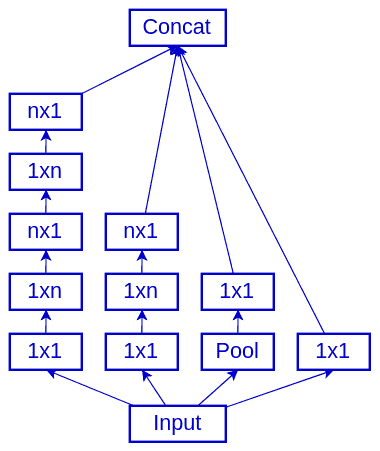
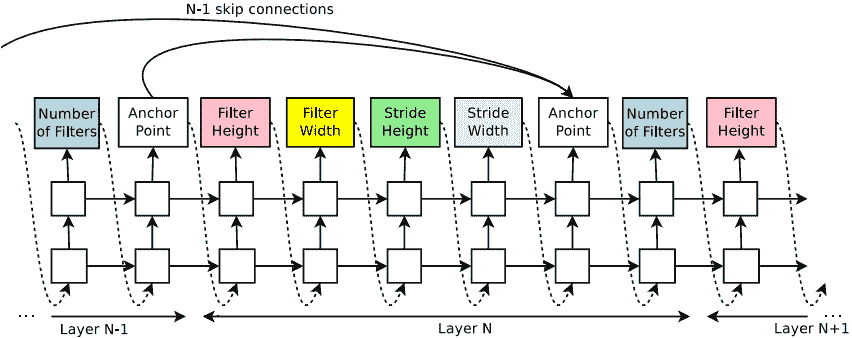

# 第三章：高级卷积网络

在第二章，《理解卷积神经网络》中，我们讨论了**卷积神经网络**（**CNN**）的基本构件及其一些特性。在本章中，我们将更进一步，讨论一些最受欢迎的 CNN 架构。这些网络通常将多个基础卷积和/或池化操作结合在一个新的构件中，作为复杂架构的基础。这使得我们能够构建非常深（有时也很宽）的网络，具有较高的表示能力，能够在复杂任务中表现良好，如 ImageNet 分类、图像分割、语音识别等。许多这些模型最初是作为 ImageNet 挑战赛的参与者发布的，并且通常获得了胜利。为了简化任务，我们将在图像分类的背景下讨论所有架构。我们仍会讨论更复杂的任务，但会在第四章，《目标检测与图像分割》中进行讨论。

本章将涵盖以下主题：

+   介绍 AlexNet

+   Visual Geometry Group 简介

+   理解残差网络

+   理解 Inception 网络

+   介绍 Xception

+   介绍 MobileNet

+   DenseNet 简介

+   神经架构搜索的工作原理

+   介绍胶囊网络

# 介绍 AlexNet

我们将讨论的第一个模型是 2012 年**ImageNet 大规模视觉识别挑战**（**ILSVRC**，简称 ImageNet）的冠军。这个模型被称为 AlexNet（*通过深度卷积神经网络进行 ImageNet 分类*，[`papers.nips.cc/paper/4824-imagenet-classification-with-deep-convolutional-neural-networks.pdf`](https://papers.nips.cc/paper/4824-imagenet-classification-with-deep-convolutional-neural-networks.pdf)），以其作者之一 Alex Krizhevsky 命名。虽然现在这个模型很少使用，但它是当代深度学习中的一个重要里程碑。

以下图表展示了网络架构：


AlexNet 架构。原始模型被拆分为两个部分，以便它可以适应两张 GPU 的内存

该模型有五层交叉相关的卷积层，三层重叠的最大池化层，三层全连接层，以及 ReLU 激活。输出是一个 1,000 维的 softmax（每个对应一个 ImageNet 类别）。第一层和第二层卷积使用局部响应归一化——这是一种归一化方法，类似于批量归一化。全连接层的 dropout 率为 0.5。为了防止过拟合，网络使用随机 227×227 的裁剪图像（来自 256×256 的输入图像）进行训练。该网络在测试集上实现了 37.5%的 top-1 误差率和 17.0%的 top-5 误差率。

在下一部分中，我们将讨论由牛津大学 Visual Geometry Group 于 2014 年提出的一个神经网络架构，该架构在当年的 ImageNet 挑战赛中获得了亚军。

# Visual Geometry Group（视觉几何组）简介

我们接下来要讨论的架构是**视觉几何组**（**VGG**）（来自牛津大学的视觉几何组，*非常深的卷积网络用于大规模图像识别*，[`arxiv.org/abs/1409.1556`](https://arxiv.org/abs/1409.1556)）。VGG 系列网络至今仍然非常流行，且常常作为新的架构的基准。VGG 之前的网络（例如，LeNet-5：[`yann.lecun.com/exdb/lenet/`](http://yann.lecun.com/exdb/lenet/)和 AlexNet）中，网络的初始卷积层使用的是大感受野的滤波器，如 11×11。此外，网络通常由交替的单一卷积层和池化层组成。论文的作者观察到，大滤波器的卷积层可以被堆叠的多个小滤波器的卷积层所替代（因式分解卷积）。例如，我们可以用两层 3×3 的卷积层代替一个 5×5 的层，或者用三层 3×3 的卷积层代替一个 7×7 的层。

这种结构有几个优点，具体如下：

+   堆叠层的最后一个神经元具有与单层大滤波器相同的感受野大小。

+   与单一大滤波器的层相比，堆叠层的权重和操作数较少。假设我们想用两个 3×3 层替代一个 5×5 层。假设所有层的输入和输出通道数（切片）相同，记为`M`。5×5 层的总权重数（不包括偏置）为`5`5`M`M = 25*M²*。另一方面，单个 3×3 层的总权重为`3`3`M`M = 9*M²*，两个层的权重总数为`2`(3`3`M*M) = 18*M²*，使得这种安排比单层大滤波器更高效 28%（18/25 = 0.72）。当滤波器更大时，效率会进一步提高。

+   堆叠多个层使得决策函数更具判别力。

VGG 网络由多个堆叠的两层、三层或四层卷积层和最大池化层组成。我们可以在下表中看到两种最流行的变体，**VGG16**和**VGG19**：


VGG16 和 VGG19 网络的架构，命名来源于每个网络中的加权层数

随着 VGG 网络深度的增加，卷积层的宽度（滤波器的数量）也增加。我们有多个交叉通道卷积对，卷积深度为 128/256/512，连接到其他相同深度的层。此外，我们还有两个 4,096 单元的完全连接层，后接一个 1,000 单元的完全连接层和一个 softmax（每个 ImageNet 类一个）。因此，VGG 网络有大量的参数（权重），这使得它们在内存使用上效率低下，且计算成本高昂。尽管如此，这仍然是一个流行且简单的网络架构，后来通过加入批归一化（batch normalization）得到了进一步的改进。

在下一节中，我们将使用 VGG 作为示例，展示如何使用 TensorFlow 和 PyTorch 加载预训练的网络模型。

# 使用 PyTorch 和 TensorFlow 的 VGG

PyTorch 和 TensorFlow 都有预训练的 VGG 模型。我们来看一下如何使用它们。

Keras 是 TensorFlow 2 的官方部分，因此我们将使用它来加载模型：

```py
import tensorflow as tf

# VGG16
vgg16 = tf.keras.applications.vgg16.VGG16(include_top=True,
                                          weights='imagenet',
                                          input_tensor=None,
                                          input_shape=None,
                                          pooling=None,
                                          classes=1000)

# VGG19 
vgg19 = tf.keras.applications.vgg19.VGG19(include_top=True,
                                          weights='imagenet',
                                          input_tensor=None,
                                          input_shape=None,
                                          pooling=None,
                                          classes=1000)
```

通过设置`weights='imagenet'`参数，网络将加载预训练的 ImageNet 权重（它们会自动下载）。你可以将`include_top`设置为`False`，以排除完全连接层，适用于迁移学习场景。在这种情况下，你还可以通过设置`input_shape`为一个元组值，来使用任意输入大小——卷积层将自动调整以匹配所需的输入形状。这之所以可行，是因为卷积滤波器在整个特征图中是共享的。因此，我们可以在具有不同大小的特征图上使用相同的滤波器。

我们将继续使用 PyTorch，你可以选择是否使用预训练模型（同样会自动下载）：

```py
import torchvision.models as models
model = models.vgg16(pretrained=True)
```

你可以尝试其他预训练模型，使用我们描述的相同流程。为了避免重复，我们不会在这一节中为其他架构提供相同的代码示例。

在下一节中，我们将讨论 VGG 发布后最流行的卷积神经网络（CNN）架构之一。

# 理解残差网络

残差网络（**ResNets**，*深度残差学习用于图像识别*， [`arxiv.org/abs/1512.03385`](https://arxiv.org/abs/1512.03385)）于 2015 年发布，并在当年赢得了 ImageNet 挑战赛的五个类别的冠军。在第一章，*神经网络的基本原理*中，我们提到神经网络的层并不受限于顺序排列，而是形成了一个图结构。这是我们将要学习的第一个架构，它利用了这种灵活性。这也是第一个成功训练了超过 100 层深度网络的网络架构。

由于更好的权重初始化、新的激活函数以及归一化层，现在可以训练深度网络了。但是，论文的作者进行了一些实验，观察到一个 56 层的网络在训练和测试误差上都高于一个 20 层的网络。他们认为这种情况不应该发生。从理论上讲，我们可以使用一个浅层网络，并在其上堆叠恒等层（这些层的输出仅重复输入），来构造一个深度网络，该网络的表现与浅层网络完全相同。然而，他们的实验未能使深度网络的表现达到浅层网络的水平。

为了解决这个问题，他们提出了由残差模块构成的网络。一个残差模块由两个或三个连续的卷积层和一个独立的并行恒等（重复器）快捷连接组成，它连接了第一个层的输入和最后一个层的输出。我们可以在以下截图中看到三种类型的残差模块：


从左到右：原始残差模块；原始瓶颈残差模块；预激活残差模块；预激活瓶颈残差模块

每个模块有两个并行路径。左侧路径与我们见过的其他网络类似，由连续的卷积层 + 批归一化组成。右侧路径包含了恒等快捷连接（也称为跳跃连接）。这两个路径通过逐元素相加的方式进行合并。也就是说，左侧和右侧的张量具有相同的形状，第一个张量的一个元素会加到第二个张量中相同位置的元素上。输出是一个形状与输入相同的单一张量。实际上，我们向前传播的是模块学习到的特征，但也包括了原始的未修改信号。通过这种方式，我们可以更接近原始场景，正如作者所描述的那样。网络可以通过跳跃连接决定跳过一些卷积层，实际上减少了它自身的深度。残差模块使用了填充技术，使得输入和输出的尺寸相同。得益于此，我们可以堆叠任意数量的模块，从而实现任意深度的网络。

现在，让我们看看图中不同模块的区别：

+   第一个模块包含两个 3×3 的卷积层。这是原始的残差模块，但如果层数较宽，堆叠多个模块会变得计算上很昂贵。

+   第二个块与第一个块相同，但它使用了所谓的瓶颈层。首先，我们使用 1×1 卷积来下采样输入体积的深度（我们在第二章，*理解卷积网络*中讨论了这一点）。然后，我们对缩小后的输入应用 3×3（瓶颈）卷积。最后，我们使用另一个 1×1 卷积将输出恢复到所需的深度。该层的计算开销比第一个要小。

+   第三个块是该思想的最新修订版，由同一作者于 2016 年发布（*深度残差网络中的身份映射*，[`arxiv.org/abs/1603.05027`](https://arxiv.org/abs/1603.05027)）。它使用了预激活，批量归一化和激活函数位于卷积层之前。这一设计起初可能显得有些奇怪，但正是由于这种设计，跳跃连接路径能够在整个网络中不间断地运行。这与其他残差块不同，后者至少有一个激活函数处于跳跃连接的路径上。堆叠的残差块组合仍然保持了正确的层级顺序。

+   第四个块是第三层的瓶颈版本。它遵循与瓶颈残差层 v1 相同的原则。

在下表中，我们可以看到论文作者提出的网络系列：


最受欢迎的残差网络系列。残差块用圆角矩形表示

它们的一些特性如下：

+   它们从一个 7×7 卷积层开始，步幅为 2，接着是 3×3 的最大池化层。该层还充当了下采样步骤——网络的其余部分以一个更小的 56×56 切片开始，相较于输入的 224×224。

+   网络其余部分的下采样是通过具有步幅 2 的修改残差块实现的。

+   平均池化在所有残差块之后、1,000 单元全连接 softmax 层之前进行下采样。

ResNet 系列网络不仅因其准确性而流行，还因为它们相对简单，并且残差块具有高度的通用性。正如我们之前提到的，残差块的输入和输出形状可以相同，这是由于填充操作。我们可以以不同的配置堆叠残差块，以解决各种问题，适应不同大小的训练集和输入维度。正因为这种通用性，我们将在下一节中实现一个 ResNet 示例。

# 实现残差块

在本节中，我们将实现一个预激活 ResNet，用于使用 PyTorch 1.3.1 和`torchvision` 0.4.2 分类 CIFAR-10 图像。让我们开始吧：

1.  像往常一样，我们从导入库开始。请注意，我们将使用 PyTorch 功能模块的简写`F`（[`pytorch.org/docs/stable/nn.html#torch-nn-functional`](https://pytorch.org/docs/stable/nn.html#torch-nn-functional)）：

```py
import matplotlib.pyplot as plt
import torch
import torch.nn as nn
import torch.nn.functional as F
import torch.optim as optim
import torchvision
from torchvision import transforms
```

1.  接下来，让我们定义预激活常规（非瓶颈）残差块。我们将其实现为`nn.Module`——所有神经网络模块的基类。我们从类定义和`__init__`方法开始：

```py
class PreActivationBlock(nn.Module):
    expansion = 1
    def __init__(self, in_slices, slices, stride=1):
        super(PreActivationBlock, self).__init__()

        self.bn_1 = nn.BatchNorm2d(in_slices)

                                out_channels=slices,kernel_size=3, 
                                stride=stride, padding=1,
                                bias=False)

        self.bn_2 = nn.BatchNorm2d(slices)
        self.conv_2 = nn.Conv2d(in_channels=slices, 
                                out_channels=slices,kernel_size=3, 
                                stride=1, padding=1,
                                bias=False)

        # if the input/output dimensions differ use convolution for 
        the shortcut
        if stride != 1 or in_slices != self.expansion * slices:
            self.shortcut = nn.Sequential(
                nn.Conv2d(in_channels=in_slices,
                          out_channels=self.expansion * slices,
                          kernel_size=1,
                          stride=stride,
                          bias=False)
            )
```

我们将在`__init__`方法中仅定义可学习的块组件——这些组件包括卷积和批量归一化操作。另外，请注意我们如何实现`shortcut`连接。如果输入维度与输出维度相同，我们可以直接使用输入张量作为捷径连接。然而，如果维度不同，我们必须借助一个 1×1 卷积进行转换，卷积的步幅和输出通道与主路径中的卷积相同。维度的不同可能来源于高度/宽度（`stride != 1`）或者深度（`in_slices != self.expansion * slices`）。`self.expansion`是一个超参数，原始 ResNet 实现中包含了该参数，它允许我们扩展残差块的输出深度。

1.  实际的数据传播在`forward`方法中实现（请注意缩进，因为它是`PreActivationBlock`的成员）：

```py
def forward(self, x):
    out = F.relu(self.bn_1(x))

    # reuse bn+relu in downsampling layers
    shortcut = self.shortcut(out) if hasattr(self, 'shortcut')
    else x

    out = self.conv_1(out)

    out = F.relu(self.bn_2(out))
    out = self.conv_2(out)

    out += shortcut

    return out
```

我们使用函数式的`F.relu`作为激活函数，因为它没有可学习的参数。然后，如果捷径连接是卷积而不是恒等（也就是说，块的输入/输出维度不同），我们会重用`F.relu(self.bn_1(x))`来为捷径连接增加非线性和批量归一化。否则，我们只需重复输入。

1.  然后，让我们实现残差块的瓶颈版本。我们将使用与非瓶颈实现相同的蓝图。我们从类定义和`__init__`方法开始：

```py
class PreActivationBottleneckBlock(nn.Module):
    expansion = 4
    def __init__(self, in_slices, slices, stride=1):
        super(PreActivationBottleneckBlock, self).__init__()

        self.bn_1 = nn.BatchNorm2d(in_slices)
        self.conv_1 = nn.Conv2d(in_channels=in_slices, 
                                out_channels=slices, kernel_size=1,
                                bias=False)

        self.bn_2 = nn.BatchNorm2d(slices)
        self.conv_2 = nn.Conv2d(in_channels=slices, 
                                out_channels=slices, kernel_size=3, 
                                stride=stride, padding=1,
                                bias=False)

        self.bn_3 = nn.BatchNorm2d(slices)
        self.conv_3 = nn.Conv2d(in_channels=slices,
                                out_channels=self.expansion * 
                                slices,
                                kernel_size=1,
                                bias=False)

        # if the input/output dimensions differ use convolution for the shortcut
        if stride != 1 or in_slices != self.expansion * slices:
            self.shortcut = nn.Sequential(
                nn.Conv2d(in_channels=in_slices,
                          out_channels=self.expansion * slices,
                          kernel_size=1, stride=stride,
                          bias=False)
            )
```

`expansion`参数在原始实现中为`4`。`self.conv_1`卷积操作表示 1×1 下采样瓶颈连接，`self.conv_2`是实际的卷积，`self.conv_3`是上采样的 1×1 卷积。捷径机制遵循与`PreActivationBlock`中相同的逻辑。

1.  接下来，让我们实现`PreActivationBottleneckBlock.forward`方法。它的逻辑与`PreActivationBlock`中的方法相同：

```py
def forward(self, x):
    out = F.relu(self.bn_1(x))

    #  reuse bn+relu in downsampling layers
    shortcut = self.shortcut(out) if hasattr(self, 'shortcut') 
    else x

    out = self.conv_1(out)

    out = F.relu(self.bn_2(out))
    out = self.conv_2(out)

    out = F.relu(self.bn_3(out))
    out = self.conv_3(out)

    out += shortcut

    return out
```

1.  接下来，让我们实现残差网络本身。我们将从类定义开始（它继承自`nn.Module`）和`__init__`方法：

```py
class PreActivationResNet(nn.Module):
    def __init__(self, block, num_blocks, num_classes=10):
        """
        :param block: type of residual block (regular or 
        bottleneck)
        :param num_blocks: a list with 4 integer values.
            Each value reflects the number of residual blocks in 
            the group
        :param num_classes: number of output classes
        """

        super(PreActivationResNet, self).__init__()

        self.in_slices = 64

        self.conv_1 = nn.Conv2d(in_channels=3, out_channels=64,
                                kernel_size=3, stride=1, padding=1,
                                bias=False)

        self.layer_1 = self._make_group(block, 64, num_blocks[0], 
        stride=1)
        self.layer_2 = self._make_group(block, 128, num_blocks[1], 
        stride=2)
        self.layer_3 = self._make_group(block, 256, num_blocks[2], 
        stride=2)
        self.layer_4 = self._make_group(block, 512, num_blocks[3], 
        stride=2)
        self.linear = nn.Linear(512 * block.expansion, num_classes)
```

网络包含四组残差块，和原始实现一样。每组中的块数由`num_blocks`参数指定。初始卷积使用 3×3 的滤波器，步幅为 1，而原始实现中使用的是 7×7，步幅为 2。这是因为 32×32 的 CIFAR-10 图像比 224×224 的 ImageNet 图像要小得多，因此不需要下采样。

1.  然后，我们将实现`PreActivationResNet._make_group`方法，该方法创建一个残差块组。组中的所有块的步幅为 1，只有第一个块的步幅由参数`stride`指定：

```py
def _make_group(self, block, slices, num_blocks, stride):
    """Create one residual group"""

    strides = [stride] + [1] * (num_blocks - 1)
    layers = []
    for stride in strides:
        layers.append(block(self.in_slices, slices, stride))
        self.in_slices = slices * block.expansion

    return nn.Sequential(*layers)
```

1.  接下来，我们将实现`PreActivationResNet.forward`方法，该方法通过网络传播数据。我们可以看到全连接层前的下采样平均池化：

```py
def forward(self, x):
    out = self.conv_1(x)
    out = self.layer_1(out)
    out = self.layer_2(out)
    out = self.layer_3(out)
    out = self.layer_4(out)
    out = F.avg_pool2d(out, 4)
    out = out.view(out.size(0), -1)
    out = self.linear(out)

    return out
```

1.  一旦我们完成了网络的构建，就可以实现多种 ResNet 配置。以下是`ResNet34`，它有 34 层卷积层，分组为`[3, 4, 6, 3]`非瓶颈残差块：

```py
def PreActivationResNet34():
    return PreActivationResNet(block=PreActivationBlock,
                               num_blocks=[3, 4, 6, 3])
```

1.  最后，我们可以训练网络。我们将首先定义训练和测试数据集。由于我们已经在第二章 *理解卷积网络*中看过类似的场景，这里不再详细讲解实现。我们将通过给样本填充四个像素来扩增训练集，然后从中随机裁剪出 32×32 的图像。以下是实现：

```py
# training data transformation
transform_train = transforms.Compose([
    transforms.RandomCrop(32, padding=4),
    transforms.RandomHorizontalFlip(),
    transforms.ToTensor(),
    transforms.Normalize((0.4914, 0.4821, 0.4465), (0.2470, 0.2435, 
    0.2616))
])

# training data loader
train_set = torchvision.datasets.CIFAR10(root='./data', train=True,
                                        download=True, 
                                        transform=transform_train)

train_loader = torch.utils.data.DataLoader(dataset=train_set, 
                                        batch_size=100,
                                        shuffle=True, 
                                        num_workers=2)

# test data transformation
transform_test = transforms.Compose([
    transforms.ToTensor(),
    transforms.Normalize((0.4914, 0.4821, 0.4465), (0.2470, 0.2435, 
    0.2616))
])

# test data loader
testset = torchvision.datasets.CIFAR10(root='./data', train=False,
                                        download=True, 
                                        transform=transform_test)

test_loader = torch.utils.data.DataLoader(dataset=testset, 
                                        batch_size=100,
                                        shuffle=False,
                                        num_workers=2)
```

1.  接下来，我们将实例化网络模型和训练参数——交叉熵损失和 Adam 优化器：

```py
# load the pretrained model
model = PreActivationResNet34()

# select gpu 0, if available
# otherwise fallback to cpu
device = torch.device("cuda:0" if torch.cuda.is_available() else "cpu")

# transfer the model to the GPU
model = model.to(device)

# loss function
loss_function = nn.CrossEntropyLoss()

# We'll optimize all parameters
optimizer = optim.Adam(model.parameters())
```

1.  现在我们可以将网络训练`EPOCHS`轮。`train_model`、`test_model`和`plot_accuracy`函数与我们在第二章 *实现 PyTorch 迁移学习*部分中定义的相同，我们不会在此重复它们的实现。以下是代码：

```py
# train
EPOCHS = 15

test_acc = list()  # collect accuracy for plotting
for epoch in range(EPOCHS):
    print('Epoch {}/{}'.format(epoch + 1, EPOCHS))

    train_model(model, loss_function, optimizer, train_loader)
    _, acc = test_model(model, loss_function, test_loader)
    test_acc.append(acc)

plot_accuracy(test_acc)
```

在下图中，我们可以看到 15 次迭代中的测试准确率（训练可能需要一些时间）：


ResNet34 CIFAR 在 15 轮训练中的准确率

本节中的代码部分基于[`github.com/kuangliu/pytorch-cifar`](https://github.com/kuangliu/pytorch-cifar)中的预激活 ResNet 实现。

本节我们讨论了不同类型的 ResNet，并用 PyTorch 实现了一个。在下一节中，我们将讨论 Inception 网络——另一类网络，它们将并行连接的使用提升到了一个新层次。

# 了解 Inception 网络

Inception 网络（*通过卷积深入*，[`arxiv.org/abs/1409.4842`](https://arxiv.org/abs/1409.4842)）是在 2014 年提出的，当时它们赢得了当年的 ImageNet 挑战（这里似乎有个规律）。从那时起，作者们发布了该架构的多个改进版本。

有趣的事实：Inception 这个名字部分来源于**我们需要更深入**的网络迷因，这与电影*盗梦空间*有关。

Inception 网络背后的思想源于一个基本前提：图像中的物体具有不同的尺度。一个远处的物体可能占据图像的一个小区域，但当同一个物体靠近时，它可能占据图像的大部分。这对于标准的 CNN 来说是一个难题，因为不同层中的神经元对输入图像的感受野大小是固定的。一个常规网络可能能很好地检测到某个尺度的物体，但在其他情况下可能会漏掉它们。为了解决这个问题，论文的作者提出了一种新型架构：由 Inception 块组成的网络。Inception 块从一个共同的输入开始，然后将其分割成不同的并行路径（或塔）。每条路径包含不同大小滤波器的卷积层，或池化层。通过这种方式，我们对相同的输入数据应用不同的感受野。在 Inception 块的末尾，不同路径的输出会被连接起来。在接下来的几个部分中，我们将讨论 Inception 网络的不同变种。

# Inception v1

下图展示了 Inception 块的第一个版本，它是 GoogLeNet 网络架构的一部分（[`arxiv.org/abs/1409.4842`](https://arxiv.org/abs/1409.4842)）。GoogLeNet 包含九个这样的 Inception 块：


Inception v1 块，灵感来自于 [`arxiv.org/abs/1409.4842`](https://arxiv.org/abs/1409.4842)

v1 块有四条路径：

+   1×1 卷积，作为输入的某种中继器

+   1×1 卷积，后接 3×3 卷积

+   1×1 卷积，后接 5×5 卷积

+   3×3 最大池化，步幅为 1

该块中的层使用填充方式，使输入和输出具有相同的形状（但深度不同）。填充也是必要的，因为每条路径会根据滤波器大小产生不同形状的输出。这对所有版本的 Inception 块都适用。

这个 Inception 块的另一个主要创新是使用下采样的 1×1 卷积。它们是必要的，因为所有路径的输出会被连接起来生成该块的最终输出。连接的结果是输出深度增加了四倍。如果接下来的 Inception 块继续跟随当前块，它的输出深度将再次增加四倍。为了避免这种指数增长，该块使用 1×1 卷积来减少每条路径的深度，从而降低该块的输出深度。这使得可以创建更深的网络，而不会耗尽资源。

GoogLeNet 还利用了辅助分类器——也就是说，它在不同的中间层有两个额外的分类输出（具有相同的真实标签）。在训练过程中，总的损失值是辅助损失和真实损失的加权和。

# Inception v2 和 v3

Inception v2 和 v3 是一起发布的，并提出了相较于原始 Inception 块的若干改进（*重新思考计算机视觉中的 Inception 架构*，[`arxiv.org/abs/1512.00567`](https://arxiv.org/abs/1512.00567)）。第一个改进是将 5×5 卷积分解为两个堆叠的 3×3 卷积。我们在*视觉几何组简介*部分讨论了这种方法的优势。

我们可以在以下图表中看到新的 Inception 块：


Inception 块 A，灵感来源于[`arxiv.org/abs/1512.00567`](https://arxiv.org/abs/1512.00567)

下一个改进是将`n`×`n`卷积分解为两个堆叠的不对称 1×`n`和`n`×1 卷积。例如，我们可以将单个 3×3 卷积分解为两个 1×3 和 3×1 卷积，其中 3×1 卷积应用于 1×3 卷积的输出。在第一种情况下，滤波器的大小为 3*3 = 9，而在第二种情况下，我们将得到（3*1）+（1*3）= 3 + 3 = 6 的组合大小，从而实现了 33%的效率，具体如图所示：


3×3 卷积的因式分解为 1×3 和 3×1 卷积。灵感来源于[`arxiv.org/abs/1512.00567`](https://arxiv.org/abs/1512.00567)

作者引入了两个新块，这些块使用了因式分解卷积。第一个新块（也是第二个块）相当于 Inception 块 A：



Inception 块 B。当 n=3 时，它相当于块 A。灵感来源于[`arxiv.org/abs/1512.00567`](https://arxiv.org/abs/1512.00567)

第二个（总共是第三个）块相似，但不对称的卷积是并行的，导致输出深度更高（更多的拼接路径）。这里的假设是，网络拥有的特征（不同的滤波器）越多，它学习得越快（我们也在第二章《理解卷积网络》中讨论了更多滤波器的需求）。另一方面，较宽的层会占用更多内存和计算时间。作为折中，这个块仅在网络的较深部分使用，在其他块之后：


Inception 块 C，灵感来源于[`arxiv.org/abs/1512.00567`](https://arxiv.org/abs/1512.00567)

使用这些新块，作者提出了两个新的 Inception 网络：v2 和 v3。此版本的另一个重大改进是采用批量归一化，由同一作者提出。

# Inception v4 和 Inception-ResNet

在最新修订版的 Inception 网络中，作者引入了三种新的精简版 Inception 块，这些块基于先前版本的思想（*Inception-v4，Inception-ResNet 以及残差连接对学习的影响*，[`arxiv.org/abs/1602.07261`](https://arxiv.org/abs/1602.07261)）。他们引入了 7×7 的非对称因式分解卷积，并用平均池化代替最大池化。更重要的是，他们创建了一个残差/Inception 混合网络，称为 Inception-ResNet，其中 Inception 块也包含了残差连接。我们可以在下面的示意图中看到这样的一个块：


带有残差跳跃连接的 Inception 块

在本节中，我们讨论了不同类型的 Inception 网络以及在不同 Inception 块中使用的不同原理。接下来，我们将讨论一种更新的 CNN 架构，它将 Inception 概念带入了一个新的深度（或者宽度，正如它应该是的那样）。

# 介绍 Xception

到目前为止，所有 Inception 块都从将输入拆分成几个并行路径开始。每个路径接着进行维度缩减的 1×1 跨通道卷积，然后是常规的跨通道卷积。一方面，1×1 连接映射跨通道相关性，但不映射空间相关性（因为 1×1 的滤波器大小）。另一方面，随后的跨通道卷积映射两种类型的相关性。让我们回忆一下在第二章，*理解卷积网络*中，我们介绍了**深度可分离卷积**（**DSC**），它结合了以下两种操作：

+   **深度卷积**：在深度卷积中，单一的输入切片产生一个单一的输出切片，因此它仅映射空间（而非跨通道）相关性。

+   **1×1 跨通道卷积**：通过 1×1 卷积，我们得到的是相反的情况，即它们仅映射跨通道相关性。

Xception 的作者（*Xception：深度学习与深度可分离卷积*，[`arxiv.org/abs/1610.02357`](https://arxiv.org/abs/1610.02357)）认为，事实上，我们可以把 DSC 看作是 Inception 块的极端版本（因此命名为 Xception），其中每个深度输入/输出切片对代表一个并行路径。我们有与输入切片数量相等的并行路径。下图展示了一个简化的 Inception 块及其转化为 Xception 块的过程：


左：简化的 Inception 模块。右：Xception 块。灵感来源于[`arxiv.org/abs/1610.02357`](https://arxiv.org/abs/1610.02357)

Xception 块和 DSC 有两个不同点：

+   在 Xception 中，1×1 卷积是首先进行的，而不是像 DSC 那样最后进行。不过，这些操作无论如何都会堆叠在一起，我们可以假设顺序并不重要。

+   Xception 块在每次卷积后使用 ReLU 激活，而 DSC 在通道间卷积后则不使用非线性激活。根据作者的实验，缺少非线性激活的深度卷积网络收敛更快且更准确。

以下图示展示了 Xception 网络的架构：


从左到右：入口流；中间流，重复八次；出口流。来源： [`arxiv.org/abs/1610.02357`](https://arxiv.org/abs/1610.02357)

它由线性堆叠的 DSC 组成，且其一些特性如下：

+   该网络包含 36 个卷积层，结构分为 14 个模块，所有模块都有线性残差连接，除了第一个和最后一个模块。模块被分成三个顺序的虚拟流——入口流、中间流和出口流。

+   在入口和出口流中使用 3×3 最大池化进行降采样；中间流不进行降采样；在全连接层之前使用全局平均池化。

+   所有卷积和 DSC 都会在后面跟上批量归一化（Batch Normalization）。

+   所有 DSC 的深度乘子为 1（没有深度扩展）。

本节结束了基于 Inception 的模型系列。在下一节中，我们将关注一个特殊的模型，它优先考虑小的模型体积和计算效率。

# 介绍 MobileNet

本节我们将讨论一种轻量级 CNN 模型，称为 MobileNet（*MobileNetV2: 倒置残差和线性瓶颈*，[`arxiv.org/abs/1801.04381`](https://arxiv.org/abs/1801.04381)）。我们将重点讨论该想法的第二个版本（MobileNetV1 在 *MobileNets: 高效的卷积神经网络用于移动视觉应用* 中首次提出，[`arxiv.org/abs/1704.04861`](https://arxiv.org/abs/1704.04861)）。

MobileNet 旨在面向内存和计算能力有限的设备，如手机（名字也透露了这一点）。为了减小网络的体积，它采用了 DSC、线性瓶颈和倒置残差结构。

我们已经熟悉了 DSC，接下来我们讨论另外两个：

+   **线性瓶颈**：为了理解这一概念，我们引用论文中的内容：

“考虑一个由`n`层*L[i]*组成的深度神经网络，每一层都有一个维度为![]的激活张量。在本节中，我们将讨论这些激活张量的基本属性，我们将其视为包含![]“像素”的容器，这些像素的维度为*d[i]*。非正式地说，对于一组真实图像输入，我们说该层激活集（对于任何一层*L[i]*）形成一个“*感兴趣的流形*”。长期以来，人们认为神经网络中的感兴趣流形可以嵌入到低维子空间中。换句话说，当我们查看深度卷积层的所有单独的`d`通道像素时，这些值编码的信息实际上位于某个流形中，可以嵌入到低维子空间。”

一种方法是使用 1×1 瓶颈卷积。但论文的作者认为，如果这个卷积后接像 ReLU 这样的非线性激活，可能会导致流形信息的丢失。如果 ReLU 输入大于 0，那么这个单元的输出相当于输入的线性变换。但如果输入较小，ReLU 会崩溃，导致该单元的信息丢失。因此，MobileNet 使用没有非线性激活的 1×1 瓶颈卷积。

+   **倒残差**：在*残差网络*部分，我们介绍了瓶颈残差块，其中非快捷路径中的数据流为**输入 -> 1×1 瓶颈卷积 -> 3×3 卷积 -> 1×1 反采样卷积**。换句话说，它遵循**宽 -> 窄 -> 宽**的数据表示。作者认为，*瓶颈实际上包含了所有必要的信息，而扩展层仅仅是一个实现细节，伴随着张量的非线性变换*。因此，他们提议在瓶颈连接之间使用快捷连接。

基于这些属性，MobileNet 模型由以下构建块组成：


上：带步幅为 1 的倒残差块。下：步幅为 2 的块。

该模型使用 ReLU6 非线性：ReLU6 = min(max(输入，0)，6)。最大激活值限制为 6——通过这种方式，非线性在低精度浮点计算中更加稳健。因为 6 最多可以占用 3 位，剩余的用于浮点数部分。

除了步幅外，这些块还通过扩展因子`t`进行描述，扩展因子决定了瓶颈卷积的扩展比。

下表显示了块的输入和输出维度之间的关系：


输入和输出维度关系。来源：https://arxiv.org/abs/1801.04381

在前表中，`h`和`w`分别是输入的高度和宽度，`s`是步幅，`k`和**k'**是输入和输出的通道数。

最后，这是完整的模型架构：


MobileNetV2 架构。来源：[`arxiv.org/abs/1801.04381`](https://arxiv.org/abs/1801.04381)

每一行描述了一组相同的块，重复`n`次。组内所有层具有相同的输出通道数，`c`。每个序列的第一层有步幅，`s`，其余层的步幅为 1。所有空间卷积使用 3×3 的卷积核。扩展因子，`t`，总是应用于输入大小，如前表所述。

我们接下来要讨论的模型是一种具有新型构建块的网络模型，其中所有层是互相连接的。

# DenseNet 简介

DenseNet（*密集连接卷积网络*，[`arxiv.org/abs/1608.06993`](https://arxiv.org/abs/1608.06993)）旨在缓解梯度消失问题，改善特征传播，同时减少网络参数的数量。我们已经看到 ResNet 如何引入残差块并通过跳跃连接来解决这个问题。DenseNet 从这个思路中汲取了一些灵感，并通过引入密集块将其进一步发展。一个密集块由连续的卷积层组成，其中每一层都与所有后续层直接连接。换句话说，一个网络层，`l`，将从所有前面的网络层接收输入，`x`[l]。


这里，是前面网络层的**拼接**输出特征图。这与 ResNet 不同，后者通过元素级加法组合不同层。*H[l]*是一个复合函数，它定义了三种类型的 DenseNet 块（这里只展示了两种）：


一个密集块：降维层（虚线部分）是 DenseNet-B 架构的一部分，而 DenseNet-A 没有这些层。DenseNet-C 未显示

让我们来定义它们：

+   **DenseNet-A**：这是基础块，其中*H[l]*包括批量归一化，接着是激活函数，然后是 3×3 卷积：


+   **DenseNet-B**：作者还引入了第二种类型的密集块 DenseNet-B，在每次拼接之后应用一个降维的 1×1 卷积：

**

+   **DenseNet-C**：进一步修改，在每个密集块之后添加一个下采样的 1×1 卷积。B 和 C 的组合被称为 DenseNet-BC。

一个密集块由其卷积层的数量和每层输出的体积深度指定，在此上下文中称为 **增长率**。假设密集块的输入体积深度为 *k[0]*，每个卷积层的输出体积深度为 `k`。然后，由于连接，`l` 层的输入体积深度将为 *k[0]+kx*。尽管密集块的后续层有较大的输入体积深度（由于许多连接），DenseNet 仍然可以使用低至 12 的增长率，这样可以减少总的参数数量。为了理解为什么这样有效，我们可以把特征图看作是网络的 **集体知识**（或全局状态）。每一层将自己的 `k` 个特征图添加到这个状态中，增长率决定了每一层对该状态的贡献量。由于密集结构，网络内的任何地方都可以访问全局状态（因此被称为全局）。换句话说，与传统网络架构不同，不需要从一层复制到下一层，这使得我们可以从较少的特征图开始。

为了使连接成为可能，密集块使用填充操作，确保所有输出切片的高度和宽度在整个块中保持一致。但由于这个原因，密集块内无法进行下采样。因此，密集网络由多个连续的密集块组成，块与块之间通过下采样池化操作分隔。

论文的作者提出了一类 DenseNet 网络，其整体架构类似于 ResNet：


DenseNet 网络族。来源：[`arxiv.org/abs/1608.06993`](https://arxiv.org/abs/1608.06993)

它们具有以下特性：

+   从 7×7 步幅为 2 的下采样卷积开始。

+   进一步下采样 3×3 最大池化，步幅为 2。

+   四组 DenseNet-B 块。该网络族的区别在于每组内密集块的数量。

+   下采样由过渡层处理，该层使用 2×2 池化操作，步幅为 2，位于密集块之间。

+   过渡层包含进一步的 1×1 瓶颈卷积，以减少特征图的数量。该卷积的压缩比由超参数 *θ* 指定，其中 `0` < *θ* ≤ `1`。如果输入特征图的数量为 `m`，那么输出特征图的数量为 *θm*。

+   密集块最终通过 7×7 全局平均池化，接着是一个包含 1,000 单元的全连接 softmax 层。

DenseNet 的作者还发布了一个改进版的 DenseNet 模型，称为 MSDNet（*多尺度密集网络用于资源高效的图像分类*，[`arxiv.org/abs/1703.09844`](https://arxiv.org/abs/1703.09844)），正如其名字所示，它使用了多尺度的密集块。

随着 DenseNet 的介绍，我们结束了对常规 CNN 架构的讨论。在下一节中，我们将讨论是否有可能自动化寻找最佳神经网络架构的过程。

# 神经网络架构搜索的工作原理

我们至今讨论的神经网络（NN）模型都是由其作者设计的。但是，如果我们能让计算机自己设计神经网络呢？这就是**神经网络架构搜索**（**NAS**）——一种自动化设计神经网络的技术。

在我们继续之前，先看看网络架构包含了什么：

+   操作图，表示网络。如我们在第一章中讨论的，*神经网络的基本原理*，操作包括（但不限于）卷积、激活函数、全连接层、归一化等。

+   每个操作的参数。例如，卷积的参数包括：类型（跨通道卷积、深度卷积等）、输入维度、输入和输出切片的数量、步幅和填充。

在本节中，我们将讨论基于梯度的 NAS 与强化学习（*使用强化学习的神经网络架构搜索*，[`arxiv.org/abs/1611.01578`](https://arxiv.org/abs/1611.01578)）。在这一部分，我们不会讨论强化学习，而是专注于算法本身。其前提是我们可以将网络定义表示为一个字符串（令牌序列）。假设我们将生成一个只包含卷积的顺序 CNN。

然后，字符串定义的部分将如下所示：


我们不必指定层类型，因为我们只使用卷积。为了简化起见，我们排除了填充操作。第一行的下标文本是为了说明，但在算法版本中不会包含。

我们可以在以下图表中看到算法概述：


NAS 概述。来源：[`arxiv.org/abs/1611.01578`](https://arxiv.org/abs/1611.01578)

我们从控制器开始。它是一个 RNN，任务是生成新的网络架构。虽然我们还没有讨论 RNN（这个话题要等到第七章，*理解循环网络*），但我们仍会尝试解释它是如何工作的。在第一章，*神经网络的基本原理*中，我们提到过 RNN 保持一个内部状态——所有先前输入的总结。基于该内部状态和最新的输入样本，网络生成新的输出，更新其内部状态，然后等待下一个输入。

在这里，控制器将生成描述网络架构的字符串序列。控制器的输出是序列中的一个标记。这可能是滤波器的高度/宽度、步幅的宽度/高度，或输出滤波器的数量。标记的类型取决于当前生成的架构的长度。一旦得到这个标记，我们将它作为输入反馈给 RNN 控制器。然后，网络生成序列中的下一个标记。

这个过程在下图中有所描述：


使用 RNN 控制器生成网络架构。输出标记被反馈给控制器作为输入，以生成下一个标记。来源： [`arxiv.org/abs/1611.01578`](https://arxiv.org/abs/1611.01578)

图中的白色垂直方块表示 RNN 控制器，包含一个两层**长短时记忆**（**LSTM**）单元（沿着`y`-轴）。尽管图中显示了多个 RNN 实例（沿着`x`-轴），但实际上它们是同一个网络；只是它在时间上被**展开**，以表示序列生成过程。也就是说，沿`x`-轴的每一步代表网络定义中的一个标记。第`t`步的标记预测是通过一个 softmax 分类器完成的，然后作为控制器输入传递到第*t+1*步。我们继续这个过程，直到生成的网络长度达到某个值。最初，这个值很小（一个短网络），但随着训练的进行，它会逐渐增加（变成一个长网络）。

为了更好地理解 NAS，我们来看一下算法的逐步执行：

1.  控制器生成一个新的架构，`A`。

1.  它构建并**训练**一个新网络，使用所述架构直到它收敛。

1.  它在保留的训练集部分上测试新网络，并测量误差`R`。

1.  它利用这个误差来更新控制器参数，*θ[c]*。由于我们的控制器是 RNN，这意味着训练网络并调整其权重。模型参数会以减少未来架构误差`R`的方式进行更新。这个过程是通过一个名为 REINFORCE 的强化学习算法实现的，超出了本节的讨论范围。

1.  它重复这些步骤，直到生成的网络的误差`R`降到某个阈值以下。

控制器可以生成有一些限制的网络架构。如我们在本节前面提到的，最严格的限制是生成的网络仅由卷积层组成。为了简化，每个卷积层自动包括批量归一化和 ReLU 激活。但理论上，控制器可以生成更复杂的架构，包含其他层，如池化层或归一化层。我们可以通过在架构序列中添加额外的控制器步骤来实现这一点，以指定层的类型。

论文的作者实现了一种技术，允许我们在生成的架构中添加残差跳跃连接。它通过一种特殊类型的控制步骤称为锚点来工作。第`N`层的锚点具有基于内容的 Sigmoid 函数。Sigmoid 函数的输出 *j (j = 1, 2, 3, ..., N-1)* 表示当前层是否与第`j`层存在残差连接的概率。

修改后的控制器如下面的图所示：



带有锚点的 RNN 控制器，用于残差连接。来源：[`arxiv.org/abs/1611.01578`](https://arxiv.org/abs/1611.01578)

如果一层有多个输入层，所有输入会沿着通道（深度）维度进行拼接。跳跃连接可能会在网络设计中产生一些问题：

+   网络的第一层隐藏层（即没有连接到任何其他输入层的层）使用输入图像作为输入层。

+   在网络的末端，所有未连接的层输出被拼接到最终的隐藏状态中，该状态被发送到分类器。

+   可能会出现待拼接的输出具有不同大小的情况。在这种情况下，较小的特征图将用零进行填充，以匹配较大特征图的大小。

在他们的实验中，作者使用了一个具有 2 层 LSTM 单元的控制器，每层包含 35 个单元。对于每次卷积，控制器必须从{1, 3, 5, 7}中选择一个滤波器的高度和宽度，并从{24, 36, 48, 64}中选择一个滤波器的数量。此外，他们进行了两组实验——一组允许控制器选择步幅为{1, 2, 3}，另一组则固定步幅为 1。

一旦控制器生成了一个架构，新的网络将在 CIFAR-10 数据集的 45,000 张图像上训练 50 个 epoch。剩余的 5,000 张图像用于验证。在训练过程中，控制器从一个 6 层的架构开始，并且每进行 1,600 次迭代后，架构的深度增加 2 层。表现最佳的模型的验证准确率为 3.65%。在使用 800 个 GPU（哇！）的 12,800 次架构后发现了这一点。这些巨大的计算需求的原因在于每一个新的网络都从头开始训练，仅仅为了生成一个准确率值，这个值可以用于训练控制器。最近，新的 ENAS 算法（*Efficient Neural Architecture Search via Parameter Sharing*，[`arxiv.org/abs/1802.03268`](https://arxiv.org/abs/1802.03268)）使得通过在生成的模型之间共享权重，显著减少了 NAS 的计算资源。

在下一节中，我们将讨论一种新型神经网络，它试图克服我们至今讨论的卷积神经网络的一些局限性。

# 引入胶囊网络

胶囊网络（*胶囊间动态路由*，[`arxiv.org/abs/1710.09829`](https://arxiv.org/abs/1710.09829)）作为一种克服标准 CNN 某些局限性的方式被提出。为了理解胶囊网络背后的理念，我们需要首先理解它们的局限性，这将在下一节中讨论。

# 卷积网络的局限性

让我们从 Hinton 教授的一句名言开始：

"卷积神经网络中使用的池化操作是一个大错误，而它之所以能如此有效，正是灾难的根源。"

正如我们在第二章《理解卷积神经网络》中提到的，CNN 是**平移不变**的。让我们假设有一张包含面孔的图片，面孔位于图片的右半部分。平移不变性意味着 CNN 非常擅长告诉我们图片中包含面孔，但它无法告诉我们面孔是在图像的左侧还是右侧。这种行为的主要原因是池化层。每一层池化都会引入一点平移不变性。例如，最大池化仅将输入神经元中的一个激活传递给下一层，但后续层并不知道是哪一个神经元被传递。

通过堆叠多个池化层，我们逐渐增大了感受野的大小。但由于没有任何池化层传递这类信息，检测到的物体可能出现在新的感受野中的任何位置。因此，我们也增加了平移不变性。最初，这似乎是件好事，因为最终的标签必须是平移不变的。但是，这也带来了问题，因为 CNN 无法识别一个物体相对于另一个物体的位置。CNN 会将下列两张图片都识别为面孔，因为它们都包含面孔的组成部分（鼻子、嘴巴和眼睛），无论它们之间的相对位置如何。

这也被称为**毕加索问题**，如下面的图示所示：


一个卷积网络会将这两张图片都识别为面孔。

但这还不是全部。即使面孔的**朝向**发生了变化，例如它被倒转了，CNN 也会感到困惑。克服这一问题的一种方式是在训练过程中进行数据增强（旋转）。但这只展示了网络的局限性。我们必须明确地展示物体在不同朝向下的样子，并告诉 CNN，这实际上是同一个物体。

到目前为止，我们已经看到，CNN 会丢弃平移信息（平移不变性），并且无法理解物体的方向。在计算机视觉中，平移和方向的结合被称为**姿势**。姿势足以在坐标系中唯一标识物体的特征。我们可以通过计算机图形学来说明这一点。一个三维物体，比如一个立方体，完全由其姿势和边长来定义。将三维物体的表示转换为屏幕上的图像的过程叫做渲染。只知道立方体的姿势和边长，我们就可以从任何我们喜欢的角度渲染它。

因此，如果我们能够以某种方式训练网络来理解这些特性，我们就不需要为同一个物体提供多个增强版本。CNN 做不到这一点，因为它的内部数据表示不包含物体姿势的信息（仅包含物体的类型）。相反，胶囊网络**保留信息**，包括物体的类型和姿势。因此，它们能够检测出可以相互转换的物体，这就是所谓的**等变性**。我们也可以把它看作是**反向图形学**，即根据物体的渲染图像重建物体的特性。

为了解决这些问题，论文的作者提出了一种新的网络构建块，叫做**胶囊**，代替传统的神经元。我们将在下一节讨论这个概念。

# 胶囊

胶囊的输出是一个向量，而神经元的输出是一个标量值。胶囊输出的向量承载以下含义：

+   向量的元素表示物体的姿势和其他特性。

+   向量的长度位于（0, 1）范围内，表示在该位置检测到特征的概率。提醒一下，向量的长度是 ![]，其中 *v[i]* 是向量元素。

假设我们有一个用于检测面部的胶囊。如果我们开始在图像中移动面部，胶囊向量的值将发生变化，以反映位置的变化。然而，向量的长度始终保持不变，因为面部的概率与位置无关。

胶囊被组织成互联的层，就像一个常规网络一样。一个层中的胶囊作为输入传递给下一个层的胶囊。而且，像 CNN 一样，浅层检测基本特征，深层则将它们组合成更抽象和复杂的特征。但现在，胶囊还传递位置相关信息，而不仅仅是检测到的对象。这使得深层胶囊不仅能够分析特征的存在，还能分析它们之间的关系。例如，一个胶囊层可能会检测到嘴巴、面部、鼻子和眼睛。随后胶囊层不仅能验证这些特征的存在，还能验证它们是否具有正确的空间关系。只有在这两个条件都满足时，后续的层才能验证面部的存在。这是胶囊网络的高级概述。现在，让我们看看胶囊到底是如何工作的。

我们可以在下图中看到一个胶囊的示意图：


一个胶囊

让我们分以下几个步骤来分析：

1.  胶囊的输入是来自上一层胶囊的输出向量，`u`*[1]*、`u`*[2]*、...、`u`*[n]*。

1.  我们将每个向量，`u`*[i]*，与其对应的权重矩阵，*W[ij]*，相乘，得到**预测向量**，![]。权重矩阵，`W`，编码了来自上一层胶囊的低层特征与当前层的高层特征之间的空间关系和其他关系。例如，假设当前层的胶囊检测的是面部，而上一层的胶囊分别检测到嘴巴（`u`*[1]*）、眼睛（`u`*[2]*）和鼻子（`u`*[3]*）。那么，![] 就是根据嘴巴的位置预测的面部位置。同样，![] 根据眼睛的位置预测面部的位置，而 ![] 则根据鼻子的位置预测面部的位置。如果三个低层胶囊向量都在相同的位置达成一致，那么当前的胶囊就可以确信面部确实存在。我们在这个例子中只使用了位置，但向量还可以编码其他特征之间的关系，如尺度和方向。权重`W`通过反向传播进行学习。

1.  接下来，我们将![]向量与标量耦合系数*c[ij]*相乘。这些系数是与权重矩阵不同的一组独立参数。它们存在于任何两个胶囊之间，并指示哪个高层胶囊将接收来自低层胶囊的输入。但与通过反向传播调整的权重矩阵不同，耦合系数是在前向传播过程中通过称为**动态路由**的过程动态计算的。我们将在下一节中描述它。

1.  然后，我们执行加权输入向量的求和。此步骤类似于神经元中的加权和，但它处理的是向量：


1.  最后，我们将通过压缩向量`s`*[j]*来计算胶囊的输出`v`*[j]*。在这个上下文中，压缩意味着以一种方式转换向量，使其长度处于（0, 1）范围内，而不改变其方向。如前所述，胶囊向量的长度表示检测到的特征的概率，将其压缩到（0, 1）范围内反映了这一点。为此，作者提出了一个新公式：


现在我们知道了胶囊的结构，在接下来的部分，我们将描述计算不同层胶囊之间耦合系数的算法。也就是说，它们如何相互传递信号的机制。

# 动态路由

让我们描述动态路由过程，以计算下图所示的耦合系数*c[ij]*：


动态路由示例。分组的点表示与彼此一致的低层胶囊

我们有一个低层胶囊`I`，它必须决定是否将其输出发送到两个高层胶囊之一，`J`和`K`。深色和浅色的点分别代表预测向量，和，这两个胶囊`J`和`K`已经从其他低层胶囊接收了这些向量。来自`I`胶囊的箭头指向`J`和`K`胶囊的和预测向量。这些聚集的预测向量（较浅的点）表示与高层特征一致的低层胶囊。例如，如果`K`胶囊描述的是面部，那么聚集的预测将表示低层特征，如嘴巴、鼻子和眼睛。相反，分散的（较暗的）点表示不一致。如果`I`胶囊预测的是车胎，它将与`K`中的聚集预测不一致。

然而，如果聚类预测中的 `J` 代表特征，如车头灯、挡风玻璃或车翼，那么 `I` 的预测会与它们一致。低层胶囊有办法确定它们是否属于每个高层胶囊的聚类组或分散组。如果它们属于聚类组，它们将增加与该胶囊的耦合系数，并将它们的向量朝该方向路由。相反，如果它们属于分散组，则系数将减少。

我们通过一个逐步的算法来形式化这些知识，算法由作者提出：

1.  对于所有在 `l` 层中的 `i` 胶囊和在 *(l + 1)* 层中的 `j` 胶囊，我们将初始化 ![]，其中 *b[ij]* 是一个临时变量，相当于 *c[ij]*。所有 *b[ij]* 的向量表示为 `b`[`i`]。在算法开始时， `i` 胶囊有相等的机会将输出路由到 *(l + 1)* 层的任一胶囊。

1.  重复进行 `r` 次迭代，其中 `r` 是一个参数：

    1.  对于所有在 `l` 层中的 `i` 胶囊：![]。一个胶囊所有外部耦合系数的总和 *c[i]* 为 1（它们具有概率性质），因此使用 softmax。

    1.  对于所有在 *(l + 1)* 层中的 `j` 胶囊：![]。也就是说，我们将计算 *(l + 1)* 层中所有未压缩的输出向量。

    1.  对于所有在 *(l + 1)* 层中的 `j` 胶囊，我们将计算压缩向量：![]。

    1.  对于所有在 `l` 层中的 `i` 胶囊和在 *(l + 1)* 层中的 `j` 胶囊：![]。这里，![]是低层 `i` 胶囊的预测向量与高层 `j` 胶囊输出向量的点积。如果点积较高，则说明 `i` 胶囊与其他低层胶囊一致，它们将输出传递给 `j` 胶囊，耦合系数增加。

作者最近发布了一个更新的动态路由算法，使用了一种名为期望最大化的聚类技术。你可以在原始论文《带有 EM 路由的矩阵胶囊》([`ai.google/research/pubs/pub46653`](https://ai.google/research/pubs/pub46653))中了解更多信息。

# 胶囊网络的结构

在这一部分中，我们将描述胶囊网络的结构，作者用它来对 MNIST 数据集进行分类。网络的输入是 28×28 的 MNIST 灰度图像，以下是步骤：

1.  我们从一个卷积层开始，包含 256 个 9×9 的过滤器，步幅为 1，激活函数为 ReLU。输出体积的形状为（256, 20, 20）。

1.  我们有另一个卷积层，包含 256 个 9×9 的过滤器，步幅为 2。输出体积的形状为（256, 6, 6）。

1.  使用该层的输出作为第一个胶囊层的基础，称为 `PrimaryCaps`。将 (256, 6, 6) 的输出体积分成 32 个独立的 (8, 6, 6) 块。也就是说，每个块包含 8 个 6×6 的切片。从每个切片中取一个具有相同坐标的激活值，并将这些值合并成一个向量。例如，我们可以取切片 1 的激活值 (3, 7)，切片 2 的 (3, 7)，依此类推，并将它们合并成一个长度为 8 的向量。我们将得到 36 个这样的向量。然后，我们将**转换**每个向量为一个胶囊，总共得到 36 个胶囊。`PrimaryCaps` 层的输出体积形状是 (32, 8, 6, 6)。

1.  第二个胶囊层称为 `DigitCaps`。它包含 10 个胶囊（每个数字一个），其输出是一个长度为 16 的向量。`DigitCaps` 层的输出体积形状是 (10, 16)。在推理过程中，我们计算每个 `DigitCaps` 胶囊向量的长度。然后，我们取长度最长的胶囊向量作为网络的预测结果。

1.  在训练过程中，网络在 `DigitCaps` 后包括三个额外的全连接层，最后一层有 784 个神经元（28×28）。在前向训练过程中，最长的胶囊向量作为这些层的输入。它们尝试从该向量开始重建原始图像。然后，重建的图像与原始图像进行比较，差异作为反向传播过程中的额外正则化损失。

胶囊网络是一种新兴且有前景的计算机视觉方法。然而，它们目前尚未被广泛采用，并且在本书中讨论的任何深度学习库中都没有官方实现，但你可以找到多个第三方实现。

# 总结

在本章中，我们讨论了一些流行的 CNN 架构：首先介绍了经典的 AlexNet 和 VGG。接着，我们特别关注了 ResNet，因为它是最著名的网络架构之一。我们还讨论了 Inception 网络的各种变种，以及与它们相关的 Xception 和 MobileNetV2 模型。我们还讲述了神经网络架构搜索这一令人兴奋的机器学习新领域。最后，我们讨论了胶囊网络——一种新的计算机视觉网络类型，它试图克服 CNN 固有的某些局限性。

我们已经在第二章中看到了如何应用这些模型，*理解卷积网络*，在该章中我们使用了 ResNet 和 MobileNet 进行迁移学习，解决分类任务。在下一章中，我们将看到如何将其中一些模型应用于更复杂的任务，如目标检测和图像分割。
