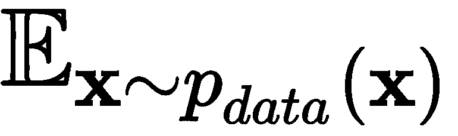
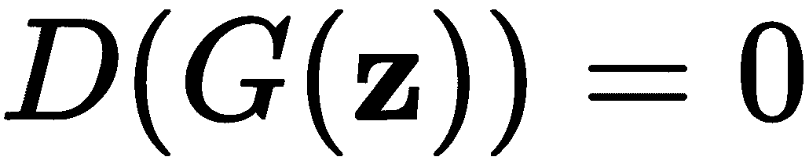
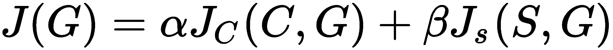

# 第五章：生成模型

在前两章（第四章，*高级卷积网络*，和第五章，*物体检测与图像分割*）中，我们专注于监督学习的计算机视觉问题，如分类和物体检测。在本章中，我们将讨论如何借助无监督神经网络来生成新图像。毕竟，知道不需要标注数据是非常有优势的。更具体地说，我们将讨论生成模型。

本章将涵盖以下主题：

+   生成模型的直觉与理论依据

+   **变分自编码器**（**VAEs**）介绍

+   **生成对抗网络**（**GANs**）介绍

+   GAN 的类型

+   艺术风格迁移介绍

# 生成模型的直觉与理论依据

到目前为止，我们已经将神经网络作为**判别模型**使用。这意味着，给定输入数据，判别模型将其映射到某个标签（换句话说，就是分类）。一个典型的例子是将 MNIST 图像分类到 10 个数字类别中，神经网络将输入数据特征（像素强度）映射到数字标签。我们也可以换一种方式来说：判别模型给我们的是![]（类别）的概率，给定![]（输入）。以 MNIST 为例，这就是给定图像的像素强度时，数字的概率。

另一方面，生成模型学习的是类别如何分布。你可以把它看作是与判别模型所做的事情相反的过程。生成模型不是预测类别概率，而是给定某些输入特征时，尝试预测在给定类别下输入特征的概率， ![]， ![] - ![]。例如，当给定数字类别时，生成模型能够生成手写数字的图像。由于我们只有 10 个类别，它将只能生成 10 张图像。然而，我们仅用这个例子来说明这一概念。实际上， ![] *类别*可以是任意值的张量，模型将能够生成具有不同特征的无限数量的图像。如果你现在不理解这点，不用担心；我们将在本章中查看许多示例。

在本章中，我们将用小写的`p`表示概率分布，而不是之前章节中使用的通常的大写`P`。这样做是为了遵循在变分自编码器（VAE）和生成对抗网络（GANs）中已建立的惯例。写这本书时，我没有找到明确的理由使用小写字母，但一个可能的解释是，`P`表示事件的概率，而`p`表示随机变量的质量（或密度）函数的概率。

使用神经网络进行生成的最流行方法之一是通过 VAE 和 GAN。接下来，我们将介绍 VAE。

# VAE 简介

要理解 VAE，我们需要谈谈常规的自编码器。自编码器是一个前馈神经网络，试图重建其输入。换句话说，自编码器的目标值（标签）等于输入数据，`y`*^i =* `x`*^i*，其中`i`是样本索引。我们可以正式地说，它试图学习一个恒等函数，![]（一个重复其输入的函数）。由于我们的标签只是输入数据，自编码器是一种无监督算法。

下图表示了一个自编码器：


自编码器

自编码器由输入层、隐藏（或瓶颈）层和输出层组成。类似于 U-Net（第四章*，目标检测和图像分割*），我们可以将自编码器视为两个组件的虚拟组合：

+   **编码器**：将输入数据映射到网络的内部表示。为了简单起见，在这个例子中，编码器是一个单一的、全连接的瓶颈隐藏层。内部状态就是它的激活向量。一般来说，编码器可以有多个隐藏层，包括卷积层。

+   **解码器**：试图从网络的内部数据表示中重建输入。解码器也可以有一个复杂的结构，通常与编码器相对称。虽然 U-Net 试图将输入图像转换为另一个领域的目标图像（例如，分割图），但自编码器只是简单地试图重建其输入。

我们可以通过最小化损失函数来训练自编码器，这个损失函数称为**重建** **误差**，![]。它衡量原始输入和其重建之间的距离。我们可以像通常那样，通过梯度下降和反向传播来最小化它。根据我们使用的方法，既可以使用**均方误差**（**MSE**），也可以使用二元交叉熵（比如交叉熵，但只有两个类别）作为重建误差。

此时，您可能会想，既然自编码器只是重复它的输入，那么它的意义何在？然而，我们并不关心网络的输出，而是它的内部数据表示（也被称为**潜在空间**中的表示）。潜在空间包含那些不是直接观察到的隐藏数据特征，而是由算法推断出来的。关键在于瓶颈层的神经元数量少于输入/输出层的神经元数量。这样做有两个主要原因：

+   因为网络尝试从较小的特征空间中重建输入数据，它学习到了数据的紧凑表示。你可以将其视为压缩（但不是无损的）。

+   通过使用更少的神经元，网络被迫仅学习数据中最重要的特征。为了说明这一概念，我们来看去噪自编码器（denoising autoencoder），在训练过程中，我们故意使用损坏的输入数据，但目标数据保持不受损坏。例如，如果我们训练一个去噪自编码器来重建 MNIST 图像，我们可以通过将最大强度（白色）设置为图像中的随机像素来引入噪声（如下图所示）。为了最小化与无噪声目标之间的损失，去噪自编码器被迫超越输入中的噪声，只学习数据的关键特征。然而，如果网络的隐藏神经元比输入神经元多，它可能会过拟合噪声。通过减少隐藏神经元的数量这一额外约束，网络只能尝试忽略噪声。训练完成后，我们可以使用去噪自编码器从真实图像中去除噪声：


去噪自编码器输入和目标

编码器将每个输入样本映射到潜在空间，在那里潜在表示的每个属性都有一个离散的值。这意味着一个输入样本只能拥有一个潜在表示。因此，解码器只能以一种可能的方式重建输入。换句话说，我们只能生成一个输入样本的单一重建。但我们并不想要这样。相反，我们希望生成与原始图像不同的新图像。变分自编码器（VAE）是实现这一任务的一个可能解决方案。

VAE 可以用概率术语描述潜在表示。也就是说，我们将为每个潜在属性生成一个概率分布，而不是离散值，从而使潜在空间变得连续。这使得随机采样和插值变得更加容易。我们通过一个例子来说明这一点。假设我们正在尝试编码一辆车辆的图像，而我们的潜在表示是一个向量`z`，它包含`n`个元素（瓶颈层中的`n`个神经元）。每个元素表示车辆的一个属性，例如长度、高度和宽度（如下图所示）。

假设平均车辆长度是四米。VAE 并不是用固定值表示，而是将这个属性解码为均值为 4 的正态分布（其他属性也适用）。然后，解码器可以选择从该分布的范围内采样一个潜在变量。例如，它可以重建一个比输入更长、更低的车辆。通过这种方式，VAE 可以生成输入的无限多个修改版本：


一个变分编码器从潜在变量的分布范围中采样不同值的示例

让我们正式化这个过程：

+   编码器的目标是近似真实的概率分布，，其中`z`是潜在空间的表示。然而，编码器通过从不同样本的条件概率分布推断间接地实现这一目标，，其中`x`是输入数据。换句话说，编码器试图学习在给定输入数据`x`的情况下，`z`的概率分布。我们将编码器对的近似表示为，其中*φ*是网络的权重。编码器的输出是一个概率分布（例如，高斯分布），表示可能由`x`生成的`z`的所有值。在训练过程中，我们不断更新权重*φ*，使更接近真实的*。

+   解码器的目标是近似真实的概率分布，。换句话说，解码器试图学习在给定潜在表示`z`的情况下，数据`x`的条件概率分布。我们将解码器对真实概率分布的近似表示为，其中*θ*是解码器的权重。这个过程从随机（或称为随机采样）地从概率分布（例如高斯分布）中采样`z`开始。然后，`z`会传递到解码器，通过解码器的输出生成可能的对应`x`值的概率分布。在训练过程中，我们不断更新权重*θ*，使更接近真实的*。

VAE 使用一种特殊类型的损失函数，该函数包含两个项：


第一个是 Kullback-Leibler 散度（第一章，*神经网络的基本原理*）在概率分布之间，，和预期的概率分布，之间的差异。在这个背景下，它衡量了当我们使用表示时丢失了多少信息（换句话说，两者分布的接近程度）。它鼓励自编码器探索不同的重建方式。第二个是重建损失，衡量原始输入和其重建之间的差异。差异越大，损失越大。因此，它鼓励自编码器以更好的方式重建数据。

为了实现这一点，瓶颈层不会直接输出潜在状态变量。相反，它将输出两个向量，这两个向量描述了每个潜在变量的分布的**均值**和**方差**：


变分编码器采样

一旦我们获得均值和方差分布，就可以从潜在变量分布中采样一个状态`z`，并将其传递通过解码器进行重建。但我们还不能庆祝，这给我们带来了另一个问题：反向传播无法应用于像我们这里这种随机过程。幸运的是，我们可以通过所谓的**重参数化技巧**来解决这个问题。首先，我们将从一个高斯分布中采样一个与`z`维度相同的随机向量**ε**（前面图中的**ε**圆）。然后，我们将其偏移潜在分布的均值**μ**，并按潜在分布的方差**σ**进行缩放：


通过这种方式，我们将能够优化均值和方差（红色箭头），并且我们将在反向传播中省略随机生成器。同时，采样数据将具有原始分布的属性。现在我们已经介绍了 VAE，接下来我们将学习如何实现一个 VAE。

# 使用 VAE 生成新的 MNIST 数字

在这一节中，我们将学习如何使用 VAE 生成 MNIST 数据集的新数字。我们将使用 TF 2.0.0 下的 Keras 来实现。我们选择 MNIST 是因为它能够很好地展示 VAE 的生成能力。

本节中的代码部分基于[`github.com/keras-team/keras/blob/master/examples/variational_autoencoder.py`](https://github.com/keras-team/keras/blob/master/examples/variational_autoencoder.py)。

让我们一步一步地走过实现过程：

1.  我们从导入开始。我们将使用集成在 TF 中的 Keras 模块：

```py
import matplotlib.pyplot as plt
from matplotlib.markers import MarkerStyle
import numpy as np
import tensorflow as tf
from tensorflow.keras import backend as K
from tensorflow.keras.layers import Lambda, Input, Dense
from tensorflow.keras.losses import binary_crossentropy
from tensorflow.keras.models import Model
```

1.  现在，我们将实例化 MNIST 数据集。回想一下，在 第二章 中的 *理解卷积网络* 部分，我们使用 TF/Keras 实现了一个迁移学习的示例，并使用 `tensorflow_datasets` 模块加载了 CIFAR-10 数据集。在这个例子中，我们将使用 `keras.datasets` 模块加载 MNIST，这同样适用：

```py
(x_train, y_train), (x_test, y_test) = tf.keras.datasets.mnist.load_data()

image_size = x_train.shape[1] * x_train.shape[1]
x_train = np.reshape(x_train, [-1, image_size])
x_test = np.reshape(x_test, [-1, image_size])
x_train = x_train.astype('float32') / 255
x_test = x_test.astype('float32') / 255

```

1.  接下来，我们将实现 `build_vae` 函数，该函数将构建 VAE：

    +   我们将分别访问编码器、解码器和完整的网络。该函数将它们作为元组返回。

    +   瓶颈层将只有 `2` 个神经元（即，我们将只有 `2` 个潜在变量）。这样，我们就能够将潜在分布显示为二维图。

    +   编码器/解码器将包含一个具有 `512` 个神经元的单个中间（隐藏）全连接层。这不是一个卷积网络。

    +   我们将使用交叉熵重建损失和 KL 散度。

以下展示了这一全球实现方式：

```py
def build_vae(intermediate_dim=512, latent_dim=2):
   # encoder first
    inputs = Input(shape=(image_size,), name='encoder_input')
    x = Dense(intermediate_dim, activation='relu')(inputs)

    # latent mean and variance
    z_mean = Dense(latent_dim, name='z_mean')(x)
    z_log_var = Dense(latent_dim, name='z_log_var')(x)

    # Reparameterization trick for random sampling
    # Note the use of the Lambda layer
    # At runtime, it will call the sampling function
    z = Lambda(sampling, output_shape=(latent_dim,), 
    name='z')([z_mean, z_log_var])

    # full encoder encoder model
    encoder = Model(inputs, [z_mean, z_log_var, z], name='encoder')
    encoder.summary()

    # decoder
    latent_inputs = Input(shape=(latent_dim,), name='z_sampling')
    x = Dense(intermediate_dim, activation='relu')(latent_inputs)
    outputs = Dense(image_size, activation='sigmoid')(x)

    # full decoder model
    decoder = Model(latent_inputs, outputs, name='decoder')
    decoder.summary()

    # VAE model
    outputs = decoder(encoder(inputs)[2])
    vae = Model(inputs, outputs, name='vae')

    # Loss function
    # we start with the reconstruction loss
    reconstruction_loss = binary_crossentropy(inputs, outputs) *
    image_size

    # next is the KL divergence
    kl_loss = 1 + z_log_var - K.square(z_mean) - K.exp(z_log_var)
    kl_loss = K.sum(kl_loss, axis=-1)
    kl_loss *= -0.5

    # we combine them in a total loss
    vae_loss = K.mean(reconstruction_loss + kl_loss)
    vae.add_loss(vae_loss)

    return encoder, decoder, vae
```

1.  与网络定义直接相关的是 `sampling` 函数，它实现了从高斯单位随机采样潜在向量 `z`（这是我们在 *VAE 简介* 部分介绍的重参数化技巧）：

```py
def sampling(args: tuple):
    """
    :param args: (tensor, tensor) mean and log of variance of 
    q(z|x)
    """

    # unpack the input tuple
    z_mean, z_log_var = args

    # mini-batch size
    mb_size = K.shape(z_mean)[0]

    # latent space size
    dim = K.int_shape(z_mean)[1]

    # random normal vector with mean=0 and std=1.0
    epsilon = K.random_normal(shape=(mb_size, dim))

    return z_mean + K.exp(0.5 * z_log_var) * epsilon
```

1.  现在，我们需要实现 `plot_latent_distribution` 函数。它收集所有测试集图像的潜在表示，并将其显示在二维图上。我们之所以能够这样做，是因为我们的网络只有两个潜在变量（对应图的两个轴）。请注意，为了实现这一点，我们只需要 `encoder`：

```py
def plot_latent_distribution(encoder, x_test, y_test, batch_size=128):
    z_mean, _, _ = encoder.predict(x_test, batch_size=batch_size)
    plt.figure(figsize=(6, 6))

    markers = ('o', 'x', '^', '<', '>', '*', 'h', 'H', 'D', 'd',
    'P', 'X', '8', 's', 'p')

    for i in np.unique(y_test):
        plt.scatter(z_mean[y_test == i, 0], z_mean[y_test == i, 1],
                                marker=MarkerStyle(markers[i], 
                                fillstyle='none'),
                                edgecolors='black')

    plt.xlabel("z[0]")
    plt.ylabel("z[1]")
    plt.show()
```

1.  接下来，我们将实现 `plot_generated_images` 函数。它将在 `[-4, 4]` 范围内为每个潜在变量 `z` 采样 `n*n` 个向量。然后，它将基于这些采样的向量生成图像，并在二维网格中显示。请注意，为了做到这一点，我们只需要 `decoder`：

```py
def plot_generated_images(decoder):
    # display a nxn 2D manifold of digits
    n = 15
    digit_size = 28

    figure = np.zeros((digit_size * n, digit_size * n))
    # linearly spaced coordinates corresponding to the 2D plot
    # of digit classes in the latent space
    grid_x = np.linspace(-4, 4, n)
    grid_y = np.linspace(-4, 4, n)[::-1]

    # start sampling z1 and z2 in the ranges grid_x and grid_y
    for i, yi in enumerate(grid_y):
        for j, xi in enumerate(grid_x):
            z_sample = np.array([[xi, yi]])
            x_decoded = decoder.predict(z_sample)
            digit = x_decoded[0].reshape(digit_size, digit_size)
            slice_i = slice(i * digit_size, (i + 1) * digit_size)
            slice_j = slice(j * digit_size, (j + 1) * digit_size)
            figure[slice_i, slice_j] = digit

    # plot the results
    plt.figure(figsize=(6, 5))
    start_range = digit_size // 2
    end_range = n * digit_size + start_range + 1
    pixel_range = np.arange(start_range, end_range, digit_size)
    sample_range_x = np.round(grid_x, 1)
    sample_range_y = np.round(grid_y, 1)
    plt.xticks(pixel_range, sample_range_x)
    plt.yticks(pixel_range, sample_range_y)
    plt.xlabel("z[0]")
    plt.ylabel("z[1]")
   plt.imshow(figure, cmap='Greys_r')
    plt.show()
```

1.  现在，运行整个代码。我们将使用 Adam 优化器（在 第一章中介绍的，*神经网络的基础*）训练网络 50 个周期：

```py
if __name__ == '__main__':
    encoder, decoder, vae = build_vae()

    vae.compile(optimizer='adam')
    vae.summary()

    vae.fit(x_train,
            epochs=50,
            batch_size=128,
            validation_data=(x_test, None))

    plot_latent_distribution(encoder, x_test, y_test,
                                      batch_size=128)

    plot_generated_images(decoder)
```

1.  如果一切顺利，训练完成后，我们将看到每个数字类别的潜在分布图，适用于所有测试图像。左轴和底轴表示 `z[1]` 和 `z[2]` 潜在变量。不同的标记形状代表不同的数字类别：


MNIST 测试图像的潜在分布

1.  接下来，我们将查看由 `plot_generated_images` 生成的图像。坐标轴代表用于每张图像的特定潜在分布 `z`：


VAE 生成的图像

这就是我们对 VAE 的描述的结束。接下来，我们将讨论 GANs——可以说是最流行的生成模型家族。

# GANs 简介

在本节中，我们将讨论今天最受欢迎的生成模型之一：GAN 框架。它首次出现在 2014 年的标志性论文《*生成对抗网络*》中([`papers.nips.cc/paper/5423-generative-adversarial-nets.pdf`](http://papers.nips.cc/paper/5423-generative-adversarial-nets.pdf))。GAN 框架可以处理任何类型的数据，但它最受欢迎的应用无疑是生成图像，我们也将在这个背景下讨论它的应用。让我们看看它是如何工作的：


一个 GAN 系统

GAN 是由两个组件（神经网络）组成的系统：

+   **生成器**：这就是生成模型本身。它以一个概率分布（随机噪声）作为输入，并尝试生成一个逼真的输出图像。它的目的类似于 VAE 的解码器部分。

+   **判别器**：它接受两个交替的输入：训练数据集中的真实图像或生成器生成的假样本。它试图判断输入图像是来自真实图像还是生成的图像。

这两个网络是作为一个系统一起训练的。一方面，判别器尝试更好地分辨真实和虚假的图像。另一方面，生成器尝试输出更逼真的图像，以便能够*欺骗*判别器，让判别器认为生成的图像是真的。用原论文中的类比，你可以将生成器想象成一群伪造货币的人，试图制造假币。相反，判别器就像一名警察，试图抓住假币，而这两者在不断地互相欺骗（因此有了“对抗”这个名字）。系统的最终目标是使生成器变得如此出色，以至于判别器无法区分真实和虚假的图像。即使判别器执行分类任务，GAN 仍然是无监督的，因为我们不需要为图像提供标签。在下一节中，我们将讨论在 GAN 框架下的训练过程。

# 训练 GAN

我们的主要目标是让生成器生成逼真的图像，GAN 框架是实现这个目标的工具。我们将分别和顺序地训练生成器和判别器（一个接一个），并多次交替进行这两个阶段。

在详细介绍之前，让我们使用以下图示来介绍一些符号：

+   我们用来表示生成器，其中是网络权重，`z`是潜在向量，它作为生成器的输入。可以把它看作是启动图像生成过程的随机种子值。它与变分自编码器（VAE）中的潜在向量相似。`z`具有一个概率分布，通常是随机正态分布或随机均匀分布。生成器输出虚假样本`x`，其概率分布为。你可以把看作是生成器根据真实数据的概率分布。

+   我们用来表示判别器，其中是网络权重。它的输入可以是真实数据，具有分布，或是生成的样本。判别器是一个二分类器，输出输入图像是否属于真实数据（网络输出 1）或生成的数据（网络输出 0）。

+   在训练过程中，我们分别用和表示判别器和生成器的损失函数。

以下是 GAN 框架的更详细的图示：


一个详细的 GAN 示例

GAN 训练与训练常规的深度神经网络（DNN）不同，因为我们有两个网络。我们可以把它看作是一个顺序的极小极大零和游戏，涉及两名玩家（生成器和判别器）：

+   **顺序**：这意味着玩家们依次进行轮流，就像象棋或井字游戏一样（与同时进行相对）。首先，判别器尝试最小化，但它只能通过调整权重来实现这一点。接下来，生成器尝试最小化，但它只能通过调整权重来实现。我们会多次重复这个过程。

+   **零和**：这意味着一个玩家的收益或损失由对方玩家的收益或损失来平衡。也就是说，生成器的损失和判别器的损失之和始终为 0：


+   **最小化最大化**：这意味着第一方（生成器）的策略是**最小化**对手（判别器）的**最大**分数（因此得名）。当我们训练判别器时，它变得更擅长区分真实样本和虚假样本（最小化！[](img/3642e1bc-6d13-438e-9b8c-a6ff3f7d5eec.png)）。接下来，当我们训练生成器时，它试图达到新改进的判别器的水平（我们最小化！[](img/b7c64658-7d82-43a6-a7b4-68478bc67d01.png)，这等同于最大化！[](img/935102ba-8da5-4087-819f-bacdebb515a6.png)）。这两个网络在不断竞争。我们用以下公式表示最小化最大化游戏，其中！[](img/909d5f59-d3b0-4185-ab8f-1aa5e7eefa6e.png)是损失函数：


假设在经过一系列训练步骤后， 和  都会达到某个局部最小值。这里，**最小化最大化**游戏的解被称为纳什均衡。纳什均衡发生在其中一个参与者的行为不再变化，无论另一个参与者如何行动。在生成对抗网络（GAN）框架中，当生成器变得足够优秀，以至于判别器无法再区分生成的样本和真实样本时，就会发生纳什均衡。也就是说，判别器的输出将始终为一半，无论输入是什么。

现在我们已经对 GAN 有了一个概览，接下来讨论如何训练它们。我们将从判别器开始，然后继续讨论生成器。

# 训练判别器

判别器是一个分类神经网络，我们可以像往常一样训练它，即使用梯度下降和反向传播。然而，训练集由真实样本和生成样本组成。让我们学习如何将这一点融入训练过程中：

1.  根据输入样本（真实或虚假），我们有两条路径：

    +   从真实数据中选择样本，，并用它来生成。

    +   生成一个虚假样本，。在这里，生成器和判别器作为一个单一网络工作。我们从一个随机向量`z`开始，利用它生成生成样本，。然后，我们将其作为输入传递给判别器，生成最终输出，。

1.  接下来，我们计算损失函数，反映了训练数据的二重性（稍后会详细介绍）。

1.  最后，我们反向传播误差梯度并更新权重。尽管两个网络是一起工作的，但生成器的权重 将被锁定，我们只会更新判别器的权重 。这样可以确保我们通过改善判别器的性能来提高其效果，而不是使生成器变得更差。

为了理解判别器损失，让我们回顾一下交叉熵损失的公式：


这里， 是输出属于第 `i` 类（在 `n` 个总类中）的估计概率， 是实际概率。为了简化起见，我们假设我们在单个训练样本上应用该公式。在二分类的情况下，公式可以简化如下：


当目标概率是![]（独热编码）时，损失项总是 `0`。

我们可以扩展该公式以适应一个包含 `m` 个样本的小批量：


了解这些之后，让我们定义判别器损失：


虽然看起来很复杂，但这实际上只是一个二分类器的交叉熵损失，并且加上了一些 GAN 特定的调整项。让我们来讨论一下：

+   损失的两个组成部分反映了两种可能的类别（真实或伪造），这两种类别在训练集中数量相等。

+    是当输入来自真实数据时的损失。理想情况下，在这种情况下，我们会有 。

+   在这种情况下，期望项  意味着 `x` 是从 中采样的。本质上，这部分损失意味着，当我们从 中采样`x`时，我们期望判别器输出 。最后，0.5 是实际数据的累积类概率 ，因为它正好占整个数据集的一半。

+    是当输入来自生成数据时的损失。在这种情况下，我们可以做出与真实数据部分相同的观察。然而，当  时，这个项是最大化的。

总结来说，当对于所有以及对于所有生成的（或）时，判别器的损失将为零。

# 训练生成器

我们将通过提高生成器欺骗判别器的能力来训练生成器。为了实现这一点，我们需要同时使用两个网络，类似于我们用假样本训练判别器的方式：

1.  我们从一个随机的潜在向量`z`开始，并将其传递给生成器和判别器，以生成输出。

1.  损失函数与判别器的损失函数相同。然而，我们在这里的目标是最大化它，而不是最小化它，因为我们希望欺骗判别器。

1.  在反向传播中，判别器的权重被锁定，我们只能调整。这迫使我们通过改善生成器来最大化判别器的损失，而不是让判别器变得更差。

你可能注意到，在这个阶段，我们只使用生成的数据。由于判别器的权重被锁定，我们可以忽略处理真实数据的损失函数部分。因此，我们可以将其简化为以下形式：


该公式的导数（梯度）是，在下图中可以看到它是连续不断的线。这对训练施加了限制。在初期，当判别器能够轻松区分真假样本（）时，梯度将接近零。这将导致权重的学习几乎没有（这是消失梯度问题的另一种表现）：


两个生成器损失函数的梯度

我们可以通过使用不同的损失函数来解决这个问题：


该函数的导数在前面的图中用虚线表示。当且梯度较大时，损失仍然会最小化；也就是说，当生成器表现不佳时。在这种损失下，博弈不再是零和博弈，但这对 GAN 框架不会产生实际影响。现在，我们拥有定义 GAN 训练算法所需的所有要素。我们将在下一节中进行定义。

# 将所有内容整合在一起

通过我们新获得的知识，我们可以完整地定义最小最大目标：


简而言之，生成器试图最小化目标，而判别器则试图最大化它。请注意，虽然判别器应该最小化其损失，但极小极大目标是判别器损失的负值，因此判别器必须最大化它。

以下逐步训练算法由 GAN 框架的作者介绍。

对此进行多次迭代：

1.  重复进行`k`步，其中`k`是一个超参数：

    +   从潜在空间中采样一个包含`m`个随机样本的小批量，

    +   从真实数据中采样一个包含`m`个样本的小批量，

    +   通过上升其成本的随机梯度来更新判别器权重，：


1.  从潜在空间中采样一个包含`m`个随机样本的小批量，。

1.  通过下降其成本的随机梯度来更新生成器：


或者，我们可以使用在*训练生成器*部分介绍的更新后的成本函数：


现在我们知道如何训练 GANs 了，让我们来讨论一些在训练过程中可能遇到的问题。

# 训练 GAN 时的问题

训练 GAN 模型时有一些主要的陷阱：

+   梯度下降算法旨在找到损失函数的最小值，而不是纳什均衡，两者并不相同。因此，有时训练可能无法收敛，反而会发生震荡。

+   记住，判别器的输出是一个 Sigmoid 函数，表示示例为真实或伪造的概率。如果判别器在这项任务上表现得太好，那么每个训练样本的概率输出将会收敛到 0 或 1。这意味着错误梯度将始终为 0，从而阻止生成器学习任何东西。另一方面，如果判别器在识别真实和伪造图像方面表现不佳，它会将错误的信息反向传播给生成器。因此，判别器不能太强也不能太弱，才能保证训练成功。实际上，这意味着我们不能在训练时让其收敛。

+   **模式崩溃**是一个问题，其中生成器无论输入的潜在向量值如何，都只能生成有限数量的图像（甚至可能只有一张）。为了理解为什么会发生这种情况，我们可以专注于一个单一的生成器训练过程，该过程试图最小化![]，同时保持判别器的权重不变。换句话说，生成器试图生成一个假图像，`x`^*，使得![]。然而，损失函数并没有强迫生成器为不同的潜在输入向量值创建独特的图像，`x`^*。也就是说，训练过程可能会改变生成器，使其完全脱离潜在向量值来生成图像，同时仍然最小化损失函数。例如，一个生成新 MNIST 图像的 GAN 可能只会生成数字 4，而不管输入是什么。一旦我们更新了判别器，之前的图像`x`^*可能不再是最优的，这将迫使生成器生成新的不同图像。然而，模式崩溃可能会在训练过程的不同阶段再次出现。

现在我们已经熟悉了 GAN 框架，接下来我们将讨论几种不同类型的 GAN。

# GAN 的类型

自从 GAN 框架首次被提出以来，已经出现了许多新的变种。事实上，现在有很多新的 GAN，为了突出特色，作者们提出了一些富有创意的 GAN 名称，例如 BicycleGAN、DiscoGAN、GANs for LIFE 和 ELEGANT。在接下来的几个部分，我们将讨论其中的一些。所有示例都已经使用 TensorFlow 2.0 和 Keras 实现。

DCGAN、CGAN、WGAN 和 CycleGAN 的代码部分灵感来自于 [`github.com/eriklindernoren/Keras-GAN`](https://github.com/eriklindernoren/Keras-GAN)。你可以在 [`github.com/PacktPublishing/Advanced-Deep-Learning-with-Python/tree/master/Chapter05`](https://github.com/PacktPublishing/Advanced-Deep-Learning-with-Python/tree/master/Chapter05) 找到本章所有示例的完整实现。

# 深度卷积生成对抗网络

在本节中，我们将实现**深度卷积生成对抗网络**（**DCGAN**，*基于深度卷积生成对抗网络的无监督表示学习*，**[`arxiv.org/abs/1511.06434`](https://arxiv.org/abs/1511.06434)**）。在原始的 GAN 框架提案中，作者仅使用了全连接网络。相比之下，在 DCGAN 中，生成器和判别器都是卷积神经网络（CNN）。它们有一些约束，有助于稳定训练过程。你可以将这些约束视为 GAN 训练的一般准则，而不仅仅是针对 DCGAN 的：

+   判别器使用步幅卷积（strided convolutions）代替池化层（pooling layers）。

+   生成器使用转置卷积（transpose convolutions）将潜在向量  上采样到生成图像的大小。

+   两个网络都使用批归一化（batch normalization）。

+   除了判别器的最后一层外，不使用全连接层。

+   对生成器和判别器的所有层使用 LeakyReLU 激活函数，除了它们的输出层。生成器的输出层使用 Tanh 激活函数（其范围为(-1, 1)），以模拟真实数据的特性。判别器的输出层只有一个 sigmoid 输出（记住，它的范围是(0, 1)），因为它衡量样本是真实的还是伪造的概率。

在以下图示中，我们可以看到 DCGAN 框架中的一个示例生成器网络：


使用反卷积的生成器网络

# 实现 DCGAN

在本节中，我们将实现 DCGAN，它生成新的 MNIST 图像。这个例子将作为后续所有 GAN 实现的模板。让我们开始吧：

1.  让我们从导入必要的模块和类开始：

```py
import matplotlib.pyplot as plt
import numpy as np
from tensorflow.keras.datasets import mnist
from tensorflow.keras.layers import \
    Conv2D, Conv2DTranspose, BatchNormalization, Dropout, Input,
    Dense, Reshape, Flatten
from tensorflow.keras.layers import LeakyReLU
from tensorflow.keras.models import Sequential, Model
from tensorflow.keras.optimizers import Adam
```

1.  实现`build_generator`函数。我们将遵循本节开头概述的指导原则——使用反卷积进行上采样、批量归一化和 LeakyReLU 激活。模型从一个全连接层开始，用于上采样 1D 潜在向量。然后，向量通过一系列`Conv2DTranspose`进行上采样。最后一个`Conv2DTranspose`使用`tanh`激活，生成的图像只有 1 个通道：

```py
def build_generator(latent_input: Input):
    model = Sequential([
        Dense(7 * 7 * 256, use_bias=False,
        input_shape=latent_input.shape[1:]),
        BatchNormalization(), LeakyReLU(),

        Reshape((7, 7, 256)),

        # expand the input with transposed convolutions
        Conv2DTranspose(filters=128, kernel_size=(5, 5), 
                        strides=(1, 1), 
                        padding='same', use_bias=False),
        BatchNormalization(), LeakyReLU(),

        # gradually reduce the volume depth
        Conv2DTranspose(filters=64, kernel_size=(5, 5),
                        strides=(2, 2),
                        padding='same', use_bias=False),
        BatchNormalization(), LeakyReLU(),

        Conv2DTranspose(filters=1, kernel_size=(5, 5), 
                        strides=(2, 2), padding='same', 
                        use_bias=False, activation='tanh'),
    ])

    # this is forward phase
    generated = model(latent_input)

    return Model(z, generated)
```

1.  构建判别器。再次说明，这是一个简单的 CNN，使用步幅卷积：

```py
def build_discriminator():
    model = Sequential([
        Conv2D(filters=64, kernel_size=(5, 5), strides=(2, 2),
               padding='same', input_shape=(28, 28, 1)),
        LeakyReLU(), Dropout(0.3),
        Conv2D(filters=128, kernel_size=(5, 5), strides=(2, 2),
               padding='same'),
        LeakyReLU(), Dropout(0.3),
        Flatten(),
        Dense(1, activation='sigmoid'),
    ])

    image = Input(shape=(28, 28, 1))
    output = model(image)

    return Model(image, output)
```

1.  实现`train`函数，进行实际的 GAN 训练。这个函数实现了在*Training GANs*部分的*Putting it all together*小节中概述的过程。我们将从函数声明和变量初始化开始：

```py
def train(generator, discriminator, combined, steps, batch_size):
    # Load the dataset
    (x_train, _), _ = mnist.load_data()

    # Rescale in [-1, 1] interval
    x_train = (x_train.astype(np.float32) - 127.5) / 127.5
    x_train = np.expand_dims(x_train, axis=-1)

    # Discriminator ground truths
    real = np.ones((batch_size, 1))
    fake = np.zeros((batch_size, 1))

    latent_dim = generator.input_shape[1]
```

我们将继续训练循环，其中我们交替进行一次判别器训练和一次生成器训练。首先，我们在一批`real_images`和一批`generated_images`上训练`discriminator`。然后，我们在同一批`generated_images`上训练生成器（其中也包括`discriminator`）。注意，我们将这些图像标记为真实图像，因为我们希望最大化`discriminator`的损失。以下是实现代码（请注意缩进，这仍然是`train`函数的一部分）：

```py
for step in range(steps):
    # Train the discriminator

    # Select a random batch of images
    real_images = x_train[np.random.randint(0, x_train.shape[0],
    batch_size)]

    # Random batch of noise
    noise = np.random.normal(0, 1, (batch_size, latent_dim))

    # Generate a batch of new images
    generated_images = generator.predict(noise)

    # Train the discriminator
    discriminator_real_loss = discriminator.train_on_batch
    (real_images, real)
    discriminator_fake_loss = discriminator.train_on_batch
    (generated_images, fake)
    discriminator_loss = 0.5 * np.add(discriminator_real_loss,
    discriminator_fake_loss)

    # Train the generator
    # random latent vector z
    noise = np.random.normal(0, 1, (batch_size, latent_dim))

    # Train the generator
    # Note that we use the "valid" labels for the generated images
    # That's because we try to maximize the discriminator loss
    generator_loss = combined.train_on_batch(noise, real)

    # Display progress
    print("%d [Discriminator loss: %.4f%%, acc.: %.2f%%] [Generator
    loss: %.4f%%]" % (step, discriminator_loss[0], 100 *
    discriminator_loss[1], generator_loss))
```

1.  实现一个模板函数`plot_generated_images`，在训练完成后显示一些生成的图像：

    1.  创建一个`nxn`网格（`figure`变量）。

    1.  创建`nxn`随机潜在向量（`noise`变量）——每个生成的图像对应一个潜在向量。

    1.  生成图像并将它们放置在网格单元中。

    1.  显示结果。

以下是实现代码：

```py
def plot_generated_images(generator):
    n = 10
    digit_size = 28

    # big array containing all images
    figure = np.zeros((digit_size * n, digit_size * n))

    latent_dim = generator.input_shape[1]

    # n*n random latent distributions
    noise = np.random.normal(0, 1, (n * n, latent_dim))

    # generate the images
    generated_images = generator.predict(noise)

    # fill the big array with images
    for i in range(n):
        for j in range(n):
            slice_i = slice(i * digit_size, (i + 1) * digit_size)
            slice_j = slice(j * digit_size, (j + 1) * digit_size)
            figure[slice_i, slice_j] = np.reshape
                          (generated_images[i * n + j], (28, 28))

    # plot the results
    plt.figure(figsize=(6, 5))
    plt.axis('off')
    plt.imshow(figure, cmap='Greys_r')
    plt.show()
```

1.  通过包含`generator`、`discriminator`和`combined`网络来构建完整的 GAN 模型。我们将使用大小为 64 的潜在向量（`latent_dim`变量），并使用 Adam 优化器运行 50,000 个批次的训练（这可能需要一段时间）。然后，我们将绘制结果：

```py
latent_dim = 64

# Build the generator
# Generator input z
z = Input(shape=(latent_dim,))

generator = build_generator(z)

generated_image = generator(z)

# we'll use Adam optimizer
optimizer = Adam(0.0002, 0.5)

# Build and compile the discriminator
discriminator = build_discriminator()
discriminator.compile(loss='binary_crossentropy',
                      optimizer=optimizer,
                      metrics=['accuracy'])

# Only train the generator for the combined model
discriminator.trainable = False

# The discriminator takes generated image as input and determines validity
real_or_fake = discriminator(generated_image)

# Stack the generator and discriminator in a combined model
# Trains the generator to deceive the discriminator
combined = Model(z, real_or_fake)
combined.compile(loss='binary_crossentropy', optimizer=optimizer)

train(generator, discriminator, combined, steps=50000, batch_size=100)

plot_generated_images(generator)
```

如果一切顺利，我们应该会看到类似以下的结果：


新生成的 MNIST 图像

这部分是我们对 DCGAN 的讨论的结束。在下一部分，我们将讨论另一种 GAN 模型，称为条件 GAN。

# 条件 GAN

条件生成对抗网络（CGAN，*Conditional Generative Adversarial Nets*， [`arxiv.org/abs/1411.1784`](https://arxiv.org/abs/1411.1784)）是 GAN 模型的扩展，其中生成器和判别器都接收一些额外的条件输入信息。这些信息可以是当前图像的类别或其他某些特征：


条件 GAN。`Y`代表生成器和判别器的条件输入。

例如，如果我们训练一个 GAN 来生成新的 MNIST 图像，我们可以添加一个额外的输入层，输入的是独热编码的图像标签。CGAN 的缺点是它们不是严格意义上的无监督学习，我们需要某种标签才能使其工作。然而，它们也有其他一些优点：

+   通过使用更结构化的信息进行训练，模型可以学习更好的数据表示，并生成更好的样本。

+   在常规 GAN 中，所有的图像信息都存储在潜在向量`z`中。这就带来了一个问题：由于  可能是复杂的，我们无法很好地控制生成图像的属性。例如，假设我们希望我们的 MNIST GAN 生成某个特定的数字，比如 7。我们必须尝试不同的潜在向量，直到达到想要的输出。但在 CGAN 中，我们只需将 7 的独热向量与一些随机的`z`结合，网络就会生成正确的数字。我们仍然可以尝试不同的`z`值，模型会生成不同版本的数字，也就是 7。简而言之，CGAN 为我们提供了一种控制（条件）生成器输出的方法。

由于条件输入，我们将修改最小最大目标函数，使其也包含条件 `y`：


# 实现 CGAN

CGAN 的实现蓝图与*实现 DCGAN*部分中的 DCGAN 示例非常相似。也就是说，我们将实现 CGAN，以生成 MNIST 数据集的新图像。为了简化（和多样化），我们将使用全连接的生成器和判别器。为了避免重复，我们将仅展示与 DCGAN 相比修改过的部分代码。完整的示例可以在本书的 GitHub 仓库中找到。

第一个显著的区别是生成器的定义：

```py
def build_generator(z_input: Input, label_input: Input):
    model = Sequential([
        Dense(128, input_dim=latent_dim),
        LeakyReLU(alpha=0.2), BatchNormalization(momentum=0.8),
        Dense(256),
        LeakyReLU(alpha=0.2), BatchNormalization(momentum=0.8),
        Dense(512),
        LeakyReLU(alpha=0.2), BatchNormalization(momentum=0.8),
        Dense(np.prod((28, 28, 1)), activation='tanh'),
        # reshape to MNIST image size
        Reshape((28, 28, 1))
    ])
    model.summary()

    # the latent input vector z
    label_embedding = Embedding(input_dim=10, 
    output_dim=latent_dim)(label_input)
    flat_embedding = Flatten()(label_embedding)

    # combine the noise and label by element-wise multiplication
    model_input = multiply([z_input, flat_embedding])
    image = model(model_input)

    return Model([z_input, label_input], image)
```

虽然这是一个全连接网络，但我们仍然遵循在*深度卷积生成对抗网络（DCGAN）*部分中定义的 GAN 网络设计准则。让我们来讨论如何将潜在向量`z_input`与条件标签`label_input`（一个值从 0 到 9 的整数）结合。我们可以看到，`label_input`通过`Embedding`层进行转换。该层执行两项操作：

+   将整数值`label_input`转换为长度为`input_dim`的独热编码表示。

+   将独热编码表示作为输入传递给大小为`output_dim`的全连接层。

嵌入层允许我们为每个可能的输入值获取独特的向量表示。在这种情况下，`label_embedding`的输出与潜在向量和`z_input`的大小相同。`label_embedding`与潜在向量`z_input`通过`model_input`变量进行逐元素相乘，后者作为网络其余部分的输入。

接下来，我们将重点讨论判别器，它也是一个全连接网络，并使用与生成器相同的嵌入机制。这次，嵌入输出的大小是`np.prod((28, 28, 1))`，等于 784（MNIST 图像的大小）：

```py
def build_discriminator():
    model = Sequential([
        Flatten(input_shape=(28, 28, 1)),
        Dense(256),
        LeakyReLU(alpha=0.2),
        Dense(128),
        LeakyReLU(alpha=0.2),
        Dense(1, activation='sigmoid'),
    ], name='discriminator')
    model.summary()

    image = Input(shape=(28, 28, 1))
    flat_img = Flatten()(image)

    label_input = Input(shape=(1,), dtype='int32')
    label_embedding = Embedding(input_dim=10, output_dim=np.prod(
    (28, 28, 1)))(label_input)
    flat_embedding = Flatten()(label_embedding)

    # combine the noise and label by element-wise multiplication
    model_input = multiply([flat_img, flat_embedding])

    validity = model(model_input)

    return Model([image, label_input], validity)
```

其余的示例代码与 DCGAN 的示例非常相似。唯一的其他区别是微不足道的——它们考虑了网络的多个输入（潜在向量和嵌入）。`plot_generated_images`函数有一个额外的参数，允许它为随机潜在向量和特定的条件标签（在本例中为数字）生成图像。以下是条件标签 3、8 和 9 的最新生成图像：


条件标签 3、8 和 9 的 CGAN

这就是我们关于 CGAN 的讨论。接下来的部分，我们将讨论另一种类型的 GAN 模型——Wasserstein GAN。

# Wasserstein GAN

为了理解 Wasserstein GAN（WGAN，[`arxiv.org/abs/1701.07875`](https://arxiv.org/abs/1701.07875)），我们回顾一下，在*训练 GANs*部分，我们将生成器的概率分布表示为，真实数据的概率分布表示为。在训练 GAN 模型的过程中，我们更新生成器的权重，从而改变。GAN 框架的目标是将收敛到（这对于其他类型的生成模型，如 VAE 也是有效的），即生成的图像的概率分布应与真实图像相同，从而得到逼真的图像。WGAN 使用一种新的方法来度量两个分布之间的距离，称为 Wasserstein 距离（或**地球搬运工距离**（**EMD**））。为了理解它，让我们从以下图表开始：


EMD 的一个示例。左：初始分布和目标分布；右：两种不同的方法将转换为

为了简化问题，我们假设和是离散分布（对于连续分布也适用相同的规则）。我们可以通过沿* x *轴将列（a、b、c、d、e）向左或向右移动，将转换为。每次移动 1 个位置的成本是 1。例如，将列`a`从其初始位置 2 移动到位置 6 的成本是 4。前面图表的右侧显示了两种不同的做法。在第一种情况下，我们的*总成本 = 成本(a:2->6) + 成本(e:6->3) + 成本(b:3->2) = 4 + 3 + 1 = 8*。在第二种情况下，我们的*总成本 = 成本(a:2->3) + 成本(b:2->1) = 1 + 1 = 2*。EMD 是将一个分布转换为另一个分布所需的最小总成本。因此，在这个例子中，我们有 EMD = 2。

我们现在对 EMD 有了基本的了解，但我们仍然不知道为什么在 GAN 模型中使用这个度量是必要的。WGAN 论文提供了一个详细但有些复杂的答案。在这一节中，我们将尝试解释它。首先，注意到生成器从一个低维的潜在向量开始， ，然后将其转换为一个高维的生成图像（例如，在 MNIST 的情况下是 784）。图像的输出大小也暗示了生成数据的高维分布， 。然而，它的内在维度（潜在向量， ）要低得多。正因为如此，  将被排除在高维特征空间的大部分区域之外。另一方面，  是实际的高维的，因为它不是从潜在向量开始的；相反，它通过其完整的丰富性表示了真实数据。因此，很可能  和  在特征空间中没有交集。

为了理解这个问题为什么重要，我们注意到可以将生成器和判别器的代价函数（见 *训练 GAN* 部分）转化为 KL 散度和 **Jensen–Shannon** (**JS**, [`en.wikipedia.org/wiki/Jensen%E2%80%93Shannon_divergence`](https://en.wikipedia.org/wiki/Jensen%E2%80%93Shannon_divergence)) 的函数。这些度量的问题在于，当两个分布不交集时，它们提供零梯度。也就是说，无论两个分布之间的距离是小还是大，如果它们没有交集，度量将无法提供关于它们实际差异的任何信息。然而，正如我们刚才解释的，很可能这些分布是不会交集的。与此相反，Wasserstein 距离无论分布是否交集都能正常工作，这使得它成为 GAN 模型的更好选择。我们可以用以下图示直观地说明这个问题：


Wasserstein 距离相较于常规 GAN 判别器的优势。来源：[`arxiv.org/abs/1701.07875`](https://arxiv.org/abs/1701.07875)

在这里，我们可以看到两个不相交的高斯分布， 和 （分别位于左侧和右侧）。常规 GAN 判别器的输出是 sigmoid 函数（范围为(0, 1)），它告诉我们输入是真还是假。在这种情况下，sigmoid 输出在非常狭窄的范围内（围绕 0 居中）有意义，并且在其他区域收敛到 0 或 1。这是我们在*GAN 训练中的问题*部分中所描述问题的表现，导致梯度消失，从而阻止了错误的反向传播到生成器。相比之下，WGAN 不会给出图像是真还是假的二元反馈，而是提供了两个分布之间的实际距离度量（也可以在前面的图中看到）。这个距离比二分类更有用，因为它能更好地指示如何更新生成器。为此，论文的作者将判别器重命名为**critic**。

以下截图展示了论文中描述的 WGAN 算法：


在这里，`f[w]` 表示 critic，`g[w]` 是 critic 权重更新，`f[w]` 是生成器权重更新。尽管 WGAN 背后的理论很复杂，但在实践中我们可以通过对常规 GAN 模型进行相对少量的修改来实现它：

+   移除判别器的输出 sigmoid 激活函数。

+   用 EMD 衍生的损失函数替换对数生成器/判别器损失函数。

+   每次处理完一个小批量后，裁剪判别器的权重，使其绝对值小于一个常数，`c`。这一要求强制执行了所谓的**Lipschitz**约束，这使得我们可以使用 Wasserstein 距离（关于这一点，论文中会有更多解释）。不深入细节，我们仅提到，权重裁剪可能会导致一些不良行为。解决这些问题的一个成功方案是梯度惩罚（WGAN-GP，*改进的 Wasserstein GAN 训练*， [`arxiv.org/abs/1704.00028`](https://arxiv.org/abs/1704.00028)），它没有出现相同的问题。

+   论文的作者报告称，未使用动量的优化方法（如 SGD，RMSProp）比带有动量的方法效果更好。

# 实现 WGAN

现在我们对 Wasserstein GAN 的基本工作原理有了初步了解，让我们来实现它。我们将再次使用 DCGAN 的框架，并省略重复的代码段，以便我们可以专注于不同之处。`build_generator`和`build_critic`函数分别实例化生成器和判别器。为了简化起见，这两个网络只包含全连接层。所有隐藏层都使用 LeakyReLU 激活函数。根据论文的指导，生成器使用 Tanh 输出激活函数，而判别器则有一个单一的标量输出（没有 sigmoid 激活）。接下来，让我们实现`train`方法，因为它包含一些 WGAN 的特定内容。我们将从方法的声明和训练过程的初始化开始：

```py
def train(generator, critic, combined, steps, batch_size, n_critic, clip_value):
    # Load the dataset
    (x_train, _), _ = mnist.load_data()

    # Rescale in [-1, 1] interval
    x_train = (x_train.astype(np.float32) - 127.5) / 127.5

    # We use FC networks, so we flatten the array
    x_train = x_train.reshape(x_train.shape[0], 28 * 28)

    # Discriminator ground truths
    real = np.ones((batch_size, 1))
    fake = -np.ones((batch_size, 1))

    latent_dim = generator.input_shape[1]
```

然后，我们将继续训练循环，按照我们在本节中前面描述的 WGAN 算法步骤进行。内循环每训练`generator`的每个训练步骤时，训练`critic`的`n_critic`步骤。事实上，这是训练`critic`和在*实现 DCGAN*部分的训练函数中训练`discriminator`的主要区别，后者在每一步都交替进行生成器和判别器的训练。此外，每个小批次后，`critic`的`weights`都会被裁剪。以下是实现（请注意缩进；这段代码是`train`函数的一部分）：

```py
    for step in range(steps):
        # Train the critic first for n_critic steps
        for _ in range(n_critic):
            # Select a random batch of images
            real_images = x_train[np.random.randint(0, x_train.shape[0], 
            batch_size)]

            # Sample noise as generator input
            noise = np.random.normal(0, 1, (batch_size, latent_dim))

            # Generate a batch of new images
            generated_images = generator.predict(noise)

            # Train the critic
            critic_real_loss = critic.train_on_batch(real_images, real)
            critic_fake_loss = critic.train_on_batch(generated_images,
            fake)
            critic_loss = 0.5 * np.add(critic_real_loss, critic_fake_loss)

            # Clip critic weights
            for l in critic.layers:
                weights = l.get_weights()
                weights = [np.clip(w, -clip_value, clip_value) for w in
                weights]
                l.set_weights(weights)

        # Train the generator
        # Note that we use the "valid" labels for the generated images
        # That's because we try to maximize the discriminator loss
        generator_loss = combined.train_on_batch(noise, real)

        # Display progress
        print("%d [Critic loss: %.4f%%] [Generator loss: %.4f%%]" %
              (step, critic_loss[0], generator_loss))
```

接下来，我们将实现 Wasserstein 损失本身的导数。这是一个 TensorFlow 操作，表示网络输出与标签（真实或伪造）乘积的均值：

```py
def wasserstein_loss(y_true, y_pred):
    """The Wasserstein loss implementation"""
    return tensorflow.keras.backend.mean(y_true * y_pred)
```

现在，我们可以构建完整的 GAN 模型。这个步骤类似于其他 GAN 模型：

```py
latent_dim = 100

# Build the generator
# Generator input z
z = Input(shape=(latent_dim,))

generator = build_generator(z)

generated_image = generator(z)

# we'll use RMSprop optimizer
optimizer = RMSprop(lr=0.00005)

# Build and compile the discriminator
critic = build_critic()
critic.compile(optimizer, wasserstein_loss,
               metrics=['accuracy'])

# The discriminator takes generated image as input and determines validity
real_or_fake = critic(generated_image)

# Only train the generator for the combined model
critic.trainable = False

# Stack the generator and discriminator in a combined model
# Trains the generator to deceive the discriminator
combined = Model(z, real_or_fake)
combined.compile(loss=wasserstein_loss, optimizer=optimizer)
```

最后，让我们开始训练和评估：

```py
# train the GAN system
train(generator, critic, combined,
      steps=40000, batch_size=100, n_critic=5, clip_value=0.01)

# display some random generated images
plot_generated_images(generator)
```

一旦运行这个示例，WGAN 将在训练 40,000 个小批次后生成以下图像（这可能需要一些时间）：


WGAN MNIST 生成器结果

这部分结束了我们对 WGAN 的讨论。在下一节中，我们将讨论如何使用 CycleGAN 实现图像到图像的转换。

# 使用 CycleGAN 进行图像到图像转换

在这一部分，我们将讨论**循环一致性对抗网络**（**CycleGAN**，*使用循环一致性对抗网络进行无配对图像到图像的转换*，[`arxiv.org/abs/1703.10593`](https://arxiv.org/abs/1703.10593)）及其在图像到图像转换中的应用。引用论文中的话，图像到图像转换是一类视觉与图形学问题，其目标是利用对齐的图像对训练集，学习输入图像和输出图像之间的映射。例如，如果我们有同一图像的灰度图和 RGB 版本，我们可以训练一个机器学习算法来为灰度图上色，或反之亦然。

另一个例子是图像分割（第三章，*物体检测与图像分割*），其中输入图像被转换成与该图像相同的分割图。在后一种情况下，我们使用图像/分割图配对训练模型（U-Net，Mask R-CNN）。然而，许多任务可能无法获得配对的训练数据。CycleGAN 为我们提供了一种方法，能够在没有配对样本的情况下，将源领域`X`中的图像转换为目标领域`Y`中的图像。下图展示了一些配对和未配对图像的例子：


左：配对的训练样本，包含相应的源图像和目标图像；右：未配对的训练样本，其中源图像和目标图像不对应。来源： https://arxiv.org/abs/1703.10593

同一个团队的*图像到图像的转换与条件对抗网络*（即 Pix2Pix，[`arxiv.org/abs/1611.07004`](https://arxiv.org/abs/1611.07004)）论文也针对配对训练数据进行图像到图像的转换。

那么，CycleGAN 是如何做到这一点的呢？首先，算法假设，尽管在这两个集合中没有直接的配对，但这两个领域之间仍然存在某种关系。例如，这些图像可能是同一场景的不同角度拍摄的照片。CycleGAN 的目标是学习这种集合级别的关系，而不是学习不同配对之间的关系。从理论上讲，GAN 模型非常适合这个任务。我们可以训练一个生成器，将 映射为生成图像，，而判别器无法将其与目标图像区分开，。更具体地说，最佳的`G`应该将领域 X 转换为一个与领域`Y`具有相同分布的领域 。在实践中，论文的作者发现，尽管如此样的转换并不能保证一个特定的输入`x`和输出`y`在有意义的方式上配对——有无数种映射`G`，可以产生相同的分布。它们还发现，这个 GAN 模型会遭遇熟悉的模式崩溃问题。

CycleGAN 尝试通过所谓的**循环一致性**来解决这些问题。为了理解这是什么意思，假设我们将一句话从英语翻译成德语。如果我们从德语翻译回英语，并且回到了我们最初的原始句子，那么这次翻译就被认为是循环一致的。在数学上下文中，如果我们有一个翻译器，，还有另一个翻译器，，这两个翻译器应该是彼此的逆。

为了说明 CycleGAN 如何实现循环一致性，让我们从下图开始：


左：整体 CycleGAN 结构图；中：前向循环一致性损失；右：后向循环一致性损失。来源：[`arxiv.org/abs/1703.10593`](https://arxiv.org/abs/1703.10593)

该模型有两个生成器，![] 和 ![]，以及两个相关的判别器，分别是 `D[x]` 和 `D[y]`（在前面的图中位于左侧）。首先让我们来看一下 `G`。它接收一张输入图像，，并生成 ，这些图像与域 `Y` 中的图像相似。`D[y]` 旨在区分真实图像，，和生成的 。这部分模型的功能类似于常规的 GAN，使用常规的极小极大 GAN 对抗损失：


第一个项表示原始图像，`y`，第二个项表示由 `G` 生成的图像。相同的公式对生成器 `F` 也有效。正如我们之前提到的，这个损失仅确保  将具有与 `Y` 中图像相同的分布，但并未创建一个有意义的 `x` 和 `y` 配对。引用论文中的话：具有足够大容量的网络可以将同一组输入图像映射到目标域中任何随机排列的图像，任何学习到的映射都能引起一个与目标分布匹配的输出分布。因此，仅靠对抗损失无法保证学习到的函数能够将单个输入 `x`[`i`] 映射到期望的输出 `y`[`i`]。

论文的作者认为，学习到的映射函数应该是循环一致的（前面的图，中）。对于每张图像，，图像翻译的循环应该能够将 `x` 恢复到原始图像（这叫做前向循环一致性）。`G` 生成一张新图像，，它作为 `F` 的输入，`F` 进一步生成一张新图像，，其中 ：。`G` 和 `F` 还应满足后向循环一致性（前面的图，右）：。

这条新路径创建了额外的循环一致性损失项：


这衡量的是原始图像（即`x`和`y`）与其生成对比图像之间的绝对差异，分别为和。请注意，这些路径可以视为联合训练两个自编码器，和。每个自编码器都有一个特殊的内部结构：它借助中间表示将图像映射到自身——即将图像转化为另一个领域。

完整的 CycleGAN 目标是循环一致性损失和`F`与`G`的对抗损失的结合：


在这里，系数λ控制两个损失之间的相对重要性。CycleGAN 旨在解决以下最小最大目标：


# 实现 CycleGAN

这个例子包含了几个源文件，位于[`github.com/PacktPublishing/Advanced-Deep-Learning-with-Python/tree/master/Chapter05/cyclegan`](https://github.com/PacktPublishing/Advanced-Deep-Learning-with-Python/tree/master/Chapter05/cyclegan)。除了 TensorFlow，代码还依赖于`tensorflow_addons`和`imageio`包。你可以使用`pip`包管理器安装它们。我们将为多个训练数据集实现 CycleGAN，这些数据集均由论文的作者提供。在运行示例之前，你需要通过`download_dataset.sh`可执行脚本下载相关数据集，该脚本使用数据集名称作为参数。可用数据集的列表已包含在文件中。下载完成后，你可以借助`DataLoader`类访问图像，该类位于`data_loader.py`模块中（我们不会在此包含其源代码）。简单来说，`DataLoader`类可以加载`numpy`数组形式的 mini-batches 和整个归一化图像数据集。我们还将省略常见的导入语句。

# 构建生成器和判别器

首先，我们将实现`build_generator`函数。到目前为止，我们看到的 GAN 模型都是从某种潜在向量开始的。但在这里，生成器的输入是来自其中一个领域的图像，输出是来自另一个领域的图像。按照论文中的指南，生成器采用 U-Net 风格的网络。它有一个下采样的编码器，一个上采样的解码器，以及在相应的编码器/解码器块之间的快捷连接。我们将从`build_generator`的定义开始：

```py
def build_generator(img: Input) -> Model:
```

U-Net 的下采样编码器由多个卷积层和 `LeakyReLU` 激活组成，后跟 `InstanceNormalization`。批量归一化和实例归一化的区别在于，批量归一化计算它的参数是跨整个小批量的，而实例归一化是单独为小批量中的每个图像计算参数。为了更清晰，我们将实现一个单独的子程序，名为 `downsampling2d`，它定义了这样一层。我们将使用此函数在构建网络编码器时构建所需数量的层（请注意这里的缩进；`downsampling2d` 是在 `build_generator` 中定义的子程序）：

```py
    def downsampling2d(layer_input, filters: int):
        """Layers used in the encoder"""
        d = Conv2D(filters=filters,
                   kernel_size=4,
                   strides=2,
                   padding='same')(layer_input)
        d = LeakyReLU(alpha=0.2)(d)
        d = InstanceNormalization()(d)
        return d
```

接下来，让我们关注解码器，它不是通过转置卷积来实现的。相反，输入数据通过 `UpSampling2D` 操作进行上采样，这只是将每个输入像素复制为一个 2×2 的块。接着是一个常规卷积操作，以平滑这些块。这个平滑后的输出会与来自相应编码器块的捷径（或 `skip_input`）连接进行拼接。解码器由多个这样的上采样块组成。为了更清晰，我们将实现一个单独的子程序，名为 `upsampling2d`，它定义了这样一个块。我们将使用它来构建网络解码器所需的多个块（请注意这里的缩进；`upsampling2d` 是在 `build_generator` 中定义的子程序）：

```py
    def upsampling2d(layer_input, skip_input, filters: int):
        """
        Layers used in the decoder
        :param layer_input: input layer
        :param skip_input: another input from the corresponding encoder block
        :param filters: number of filters
        """
        u = UpSampling2D(size=2)(layer_input)
        u = Conv2D(filters=filters,
                   kernel_size=4,
                   strides=1,
                   padding='same',
                   activation='relu')(u)
        u = InstanceNormalization()(u)
        u = Concatenate()([u, skip_input])
        return u
```

接下来，我们将使用刚刚定义的子程序实现 U-Net 的完整定义（请注意这里的缩进；代码是 `build_generator` 的一部分）：

```py
    # Encoder
    gf = 32
    d1 = downsampling2d(img, gf)
    d2 = downsampling2d(d1, gf * 2)
    d3 = downsampling2d(d2, gf * 4)
    d4 = downsampling2d(d3, gf * 8)

    # Decoder
    # Note that we concatenate each upsampling2d block with
    # its corresponding downsampling2d block, as per U-Net
    u1 = upsampling2d(d4, d3, gf * 4)
    u2 = upsampling2d(u1, d2, gf * 2)
    u3 = upsampling2d(u2, d1, gf)

    u4 = UpSampling2D(size=2)(u3)
    output_img = Conv2D(3, kernel_size=4, strides=1, padding='same',
    activation='tanh')(u4)

    model = Model(img, output_img)

    model.summary()

    return model
```

接着，我们应该实现 `build_discriminator` 函数。我们在这里省略实现，因为它是一个相当直接的 CNN，类似于前面示例中展示的（你可以在本书的 GitHub 仓库中找到此实现）。唯一的不同是，它使用实例归一化，而不是批量归一化。

# 综合起来

此时，我们通常会实现 `train` 方法，但由于 CycleGAN 有更多的组件，我们将展示如何构建整个模型。首先，我们实例化 `data_loader` 对象，你可以指定训练集的名称（可以随意尝试不同的数据集）。所有图像将被调整为 `img_res=(IMG_SIZE, IMG_SIZE)`，作为网络输入，其中 `IMG_SIZE = 256`（你也可以尝试 `128` 以加速训练过程）：

```py
# Input shape
img_shape = (IMG_SIZE, IMG_SIZE, 3)

# Configure data loader
data_loader = DataLoader(dataset_name='facades',
                         img_res=(IMG_SIZE, IMG_SIZE))
```

然后，我们将定义优化器和损失权重：

```py
lambda_cycle = 10.0  # Cycle-consistency loss
lambda_id = 0.1 * lambda_cycle  # Identity loss

optimizer = Adam(0.0002, 0.5)
```

接下来，我们将创建两个生成器，`g_XY` 和 `g_YX`，以及它们各自的判别器，`d_Y` 和 `d_X`。我们还将创建 `combined` 模型，以同时训练这两个生成器。然后，我们将创建复合损失函数，其中包含一个额外的身份映射项。你可以在相关论文中了解更多内容，但简而言之，它有助于在将图像从绘画领域转换到照片领域时，保持输入和输出之间的颜色组合：

```py
# Build and compile the discriminators
d_X = build_discriminator(Input(shape=img_shape))
d_Y = build_discriminator(Input(shape=img_shape))
d_X.compile(loss='mse', optimizer=optimizer, metrics=['accuracy'])
d_Y.compile(loss='mse', optimizer=optimizer, metrics=['accuracy'])

# Build the generators
img_X = Input(shape=img_shape)
g_XY = build_generator(img_X)

img_Y = Input(shape=img_shape)
g_YX = build_generator(img_Y)

# Translate images to the other domain
fake_Y = g_XY(img_X)
fake_X = g_YX(img_Y)

# Translate images back to original domain
reconstr_X = g_YX(fake_Y)
reconstr_Y = g_XY(fake_X)

# Identity mapping of images
img_X_id = g_YX(img_X)
img_Y_id = g_XY(img_Y)

# For the combined model we will only train the generators
d_X.trainable = False
d_Y.trainable = False

# Discriminators determines validity of translated images
valid_X = d_X(fake_X)
valid_Y = d_Y(fake_Y)

# Combined model trains both generators to fool the two discriminators
combined = Model(inputs=[img_X, img_Y],
                 outputs=[valid_X, valid_Y,
                          reconstr_X, reconstr_Y,
                          img_X_id, img_Y_id])
```

接下来，让我们配置用于训练的`combined`模型：

```py
combined.compile(loss=['mse', 'mse',
                       'mae', 'mae',
                       'mae', 'mae'],
                 loss_weights=[1, 1,
                               lambda_cycle, lambda_cycle,
                               lambda_id, lambda_id],
                 optimizer=optimizer)
```

一旦模型准备好，我们便通过`train`函数启动训练过程。根据论文的指导方针，我们将使用大小为 1 的小批量：

```py
train(epochs=200, batch_size=1, data_loader=data_loader,
      g_XY=g_XY,
      g_YX=g_YX,
      d_X=d_X,
      d_Y=d_Y,
      combined=combined,
      sample_interval=200)
```

最后，我们将实现`train`函数。它与之前的 GAN 模型有些相似，但也考虑到了两对生成器和判别器：

```py
def train(epochs: int, data_loader: DataLoader,
          g_XY: Model, g_YX: Model, d_X: Model, d_Y: Model, 
          combined:Model, batch_size=1, sample_interval=50):
    start_time = datetime.datetime.now()

    # Calculate output shape of D (PatchGAN)
    patch = int(IMG_SIZE / 2 ** 4)
    disc_patch = (patch, patch, 1)

    # GAN loss ground truths
    valid = np.ones((batch_size,) + disc_patch)
    fake = np.zeros((batch_size,) + disc_patch)

    for epoch in range(epochs):
        for batch_i, (imgs_X, imgs_Y) in
        enumerate(data_loader.load_batch(batch_size)):
            # Train the discriminators

            # Translate images to opposite domain
            fake_Y = g_XY.predict(imgs_X)
            fake_X = g_YX.predict(imgs_Y)

            # Train the discriminators (original images = real /
            translated = Fake)
            dX_loss_real = d_X.train_on_batch(imgs_X, valid)
            dX_loss_fake = d_X.train_on_batch(fake_X, fake)
            dX_loss = 0.5 * np.add(dX_loss_real, dX_loss_fake)

            dY_loss_real = d_Y.train_on_batch(imgs_Y, valid)
            dY_loss_fake = d_Y.train_on_batch(fake_Y, fake)
            dY_loss = 0.5 * np.add(dY_loss_real, dY_loss_fake)

            # Total discriminator loss
            d_loss = 0.5 * np.add(dX_loss, dY_loss)

            # Train the generators
            g_loss = combined.train_on_batch([imgs_X, imgs_Y],
                                             [valid, valid,
                                              imgs_X, imgs_Y,
                                              imgs_X, imgs_Y])

            elapsed_time = datetime.datetime.now() - start_time

            # Plot the progress
            print("[Epoch %d/%d] [Batch %d/%d] [D loss: %f, acc: %3d%%]
            [G loss: %05f, adv: %05f, recon: %05f, id: %05f] time: %s " \ 
            % (epoch, epochs, batch_i, data_loader.n_batches, d_loss[0], 
            100 * d_loss[1], g_loss[0], np.mean(g_loss[1:3]),
            np.mean(g_loss[3:5]), np.mean(g_loss[5:6]), elapsed_time))

            # If at save interval => save generated image samples
            if batch_i % sample_interval == 0:
                sample_images(epoch, batch_i, g_XY, g_YX, data_loader)
```

训练可能需要一些时间才能完成，但该过程将在每个`sample_interval`批次后生成图像。以下是通过机器感知中心外立面数据库生成的图像示例（[`cmp.felk.cvut.cz/~tylecr1/facade/`](http://cmp.felk.cvut.cz/~tylecr1/facade/)）。该数据库包含建筑物的外立面，其中每个像素都标记为与外立面相关的多个类别之一，如窗户、门、阳台等：


CycleGAN 图像到图像的转换示例

这部分内容结束了我们对 GAN 的讨论。接下来，我们将重点介绍另一种生成模型——艺术风格迁移。

# 引入艺术风格迁移

在这一最终部分，我们将讨论艺术风格迁移。类似于 CycleGAN 的一种应用，它允许我们使用一张图像的风格（或纹理）来再现另一张图像的语义内容。尽管它可以通过不同的算法来实现，但最流行的方法是在 2015 年通过论文《*艺术风格的神经算法*》中提出的（[`arxiv.org/abs/1508.06576`](https://arxiv.org/abs/1508.06576)）。它也被称为神经风格迁移，并且使用了（你猜对了！）卷积神经网络（CNN）。基本算法在过去几年中得到了改进和调整，但在本节中，我们将探讨其原始形式，因为这将为理解最新版本奠定良好的基础。

该算法接受两张图像作为输入：

+   我们想要重新绘制的内容图像（`C`）

+   我们将用来重新绘制`C`的风格图像（I），其风格（纹理）来自此图像

该算法的结果是一张新图像：*G = C + S*。以下是神经风格迁移的示例：


神经风格迁移的示例

为了理解神经风格迁移是如何工作的，让我们回顾一下 CNN 如何学习其特征的层次化表示。我们知道，初始的卷积层学习基本特征，如边缘和线条。而较深的层则学习更复杂的特征，如面孔、汽车和树木。了解这一点后，让我们来看一下算法本身：

1.  就像许多其他任务一样（例如，第三章*，物体检测与图像分割*），该算法从一个预训练的 VGG 网络开始。

1.  将内容图像`C`输入网络。提取并存储网络中间层一个或多个隐藏卷积层的输出激活（或特征图或切片）。我们用*A[c]^l*表示这些激活，其中`l`是层的索引。我们关注中间层，因为它们编码的特征抽象层次最适合这个任务。

1.  对风格图像`S`做同样的处理。这一次，用*A[s]^l*表示风格图像在`l`层的激活。我们选择的内容和风格层不一定相同。

1.  生成一张单一的随机图像（白噪声），`G`。这张随机图像将逐渐转变为算法的最终结果。我们将对其进行多次迭代：

    1.  将`G`传播通过网络。这是我们在整个过程中唯一使用的图像。像之前一样，我们将存储所有`l`层的激活（这里，`l`是我们用于内容和风格图像的所有层的组合）。我们用*A[g]^l*表示这些激活。

    1.  计算随机噪声激活*A[g]^l*与*A[c]^l*和*A[s]^l*之间的差异。这些将是我们损失函数的两个组成部分：

        +   ，称为**内容损失**：这只是所有`l`层两个激活之间逐元素差异的均方误差（MSE）。

        +   ，称为**风格损失**：这与内容损失相似，但我们不会直接比较原始激活，而是比较它们的**格拉姆矩阵**（我们不会深入讨论这一点）。

1.  1.  使用内容和风格损失计算总损失，，这只是两者的加权和。α 和 β 系数决定了哪个组件将占据更大权重。

    1.  反向传播梯度至网络的起始位置，并更新生成的图像，。通过这种方式，我们使`G`更接近内容和风格图像，因为损失函数是两者的组合。

该算法使我们能够利用卷积神经网络（CNN）强大的表达能力进行艺术风格迁移。它通过一种新颖的损失函数和智能的反向传播方法实现这一点。

如果你有兴趣实现神经风格迁移，请查看官方的 PyTorch 教程：[`pytorch.org/tutorials/advanced/neural_style_tutorial.html`](https://pytorch.org/tutorials/advanced/neural_style_tutorial.html)。或者，访问[`www.tensorflow.org/beta/tutorials/generative/style_transfer`](https://www.tensorflow.org/beta/tutorials/generative/style_transfer)查看 TF 2.0 实现。

这个算法的一个缺点是相对较慢。通常，我们需要重复几百次伪训练过程才能得到一个视觉上令人满意的结果。幸运的是，论文《*实时风格迁移与超分辨率的感知损失*》([`arxiv.org/abs/1603.08155`](https://arxiv.org/abs/1603.08155)) 基于原始算法提出了一个解决方案，使其速度提高了三个数量级。

# 摘要

在本章中，我们讨论了如何使用生成模型创建新图像，这是目前深度学习领域最令人兴奋的方向之一。我们了解了变分自编码器（VAE）的理论基础，然后实现了一个简单的 VAE 来生成新的 MNIST 数字。接着，我们介绍了 GAN 框架，并讨论并实现了多种类型的 GAN，包括 DCGAN、CGAN、WGAN 和 CycleGAN。最后，我们提到了神经风格迁移算法。本章是专门讲解计算机视觉的四章系列中的最后一章，希望你喜欢这些内容。

在接下来的几章中，我们将讨论自然语言处理和递归网络。
