# 第六章：语言建模

本章是几章中的第一章，我们将讨论不同的神经网络算法在**自然语言处理**（**NLP**）中的应用。NLP 教会计算机处理和分析自然语言数据，以执行诸如机器翻译、情感分析、自然语言生成等任务。但要成功解决这些复杂的问题，我们必须以计算机能够理解的方式表示自然语言，而这并非一项简单的任务。

为了理解原因，让我们回到图像识别。神经网络的输入相当直观——一个二维张量，包含预处理后的像素强度，保留了图像的空间特征。我们以 28 x 28 的 MNIST 图像为例，它包含 784 个像素。关于图像中数字的所有信息都包含在这些像素中，我们不需要任何外部信息来分类图像。我们还可以安全地假设每个像素（也许除了靠近图像边缘的像素）承载着相同的信息量。因此，我们将所有像素输入到网络中，让它进行处理，并让结果自己证明。

现在，让我们关注文本数据。与图像不同，我们有 1D（而非 2D）数据——一长串单词序列。一般来说，单倍行距的 A4 纸上大约有 500 个单词。为了向网络（或任何机器学习算法）输入与单个 MNIST 图像等价的信息，我们需要 1.5 页的文本。文本结构有多个层级；从字符开始，然后是单词、句子和段落，这些都可以容纳在 1.5 页文本中。图像的所有像素与一个数字相关；然而，我们无法确定所有单词是否与同一主题相关。为了避免这种复杂性，NLP 算法通常处理较短的序列。尽管一些算法使用**递归神经网络**（**RNNs**），它们考虑了所有先前的输入，但实际上，它们仍然局限于相对较短的前一个单词窗口。因此，NLP 算法必须在较少的输入信息下做更多的工作（表现得更好）。

为了帮助我们解决这个问题，我们将使用一种特殊类型的**向量**词表示（语言模型）。我们将讨论的语言模型利用一个词的上下文（即周围的词）来创建与该词相关的独特嵌入向量。与例如单热编码相比，这些向量包含了更多关于该词的信息。它们为各种 NLP 任务提供了基础。

本章将涵盖以下主题：

+   理解*n*-grams

+   引入神经语言模型：

    +   神经概率语言模型

    +   Word2Vec 和 fastText

    +   用于词表示的全局向量

+   实现语言模型

# 理解 n-grams

基于单词的语言模型定义了一个关于单词序列的概率分布。给定一个长度为*m*的单词序列（例如，一个句子），它为整个单词序列分配一个概率*P*（*w1, ... , w[m]*）。我们可以按如下方式使用这些概率：

+   用于估计不同短语在自然语言处理应用中的可能性。

+   作为一种生成模型来创建新的文本，基于单词的语言模型可以计算给定单词跟随一系列单词的概率。

对于一个长序列，如*w[1], ..., w[m]*，推断其概率通常是不可行的。我们可以通过联合概率的链式法则计算联合概率*P*（*w[1], ... , w[m]*）（第一章，*神经网络的基本原理*）：

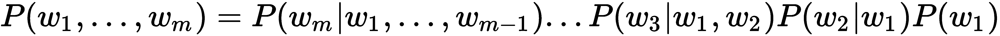

给定前面的单词，后面的单词的概率尤其难以从数据中估计。这就是为什么这个联合概率通常通过独立性假设来近似，即第*i*个单词仅依赖于前面*n-1*个单词。我们只会对*n*个连续单词的联合概率进行建模，称为*n*-gram。例如，在短语*the quick brown fox*中，我们有以下*n*-gram：

+   **1-gram**：*The*，*quick*，*brown*，和*fox*（也称为一元组）。

+   **2-gram**：*The quick*，*quick brown*，和*brown fox*（也称为二元组）。

+   **3-gram**：*The quick brown*和*quick brown fox*（也称为三元组）。

+   **4-gram**：*The quick brown fox*。

联合分布的推断通过*n*-gram 模型来近似，这些模型将联合分布拆分为多个独立部分。

*n*-gram 一词可以指其他类型的长度为*n*的序列，例如*n*个字符。

如果我们有一个大规模的文本语料库，我们可以找到所有的*n*-gram，直到某个*n*（通常是 2 到 4），并计算每个*n*-gram 在语料库中的出现次数。通过这些计数，我们可以估计给定前面*n-1*个单词时每个*n*-gram 的最后一个单词的概率：

+   **1-gram**：![]

+   **2-gram**：![]

+   **N-gram**：![]

假设第*i*个单词仅依赖于前面*n-1*个单词的独立性假设现在可以用于近似联合分布。

例如，对于一元组，我们可以使用以下公式来近似联合分布：

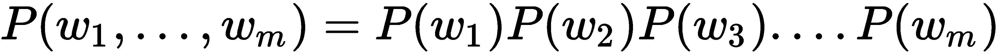

对于三元组，我们可以使用以下公式来近似联合分布：

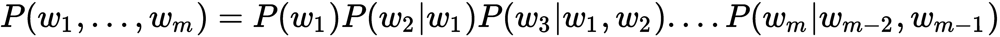

我们可以看到，基于词汇大小，*n*-gram 的数量会随着*n*的增加呈指数增长。例如，如果一个小词汇表包含 100 个单词，那么可能的 5-gram 数量将是*100⁵ = 10,000,000,000*种不同的 5-gram。相比之下，莎士比亚的所有作品包含大约 30,000 个不同的单词，这说明使用大型*n*的*n*-gram 是不可行的。我们不仅面临着存储所有概率的问题，而且还需要非常大的文本语料库来为更大值的*n*创建合理的*n*-gram 概率估计。

这个问题被称为维度灾难。当可能的输入变量（单词）数量增加时，这些输入值的不同组合数量会呈指数增长。维度灾难出现在学习算法需要至少一个示例来表示每种相关的值组合时，这正是*n*-gram 模型的情况。我们的*n*越大，就能越好地近似原始分布，同时我们需要更多的数据来对*n*-gram 概率进行良好的估计。

现在我们已经熟悉了*n*-gram 模型和维度灾难，让我们来讨论如何借助神经语言模型来解决这个问题。

# 引入神经语言模型

克服维度灾难的一种方法是通过学习单词的低维分布式表示（*A Neural Probabilistic Language Model*，[`www.jmlr.org/papers/volume3/bengio03a/bengio03a.pdf`](http://www.jmlr.org/papers/volume3/bengio03a/bengio03a.pdf)）。这种分布式表示是通过学习一个嵌入函数来创建的，该函数将单词空间转化为一个低维的单词嵌入空间，具体如下：

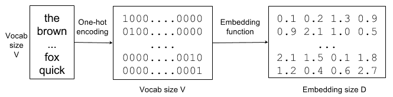

单词 -> 独热编码 -> 单词嵌入向量

来自大小为*V*的词汇表的单词被转化为大小为*V*的独热编码向量（每个单词都被唯一编码）。然后，嵌入函数将这个*V*维空间转化为一个大小为*D*的分布式表示（此处，*D*=4）。

这个思想是，嵌入函数学习关于单词的语义信息。它将词汇表中的每个单词与一个连续值的向量表示关联，也就是单词嵌入。每个单词对应于嵌入空间中的一个点，不同的维度对应于这些单词的语法或语义属性。

目标是确保在嵌入空间中相近的词语具有相似的意义。通过这种方式，语言模型可以利用一些词语在语义上的相似性。例如，它可能会学到*fox*和*cat*在语义上是相关的，并且*the quick brown fox*和*the quick brown cat*都是有效的短语。然后，一组词语可以被一组嵌入向量替换，这些嵌入向量捕捉到这些词语的特征。我们可以将这个序列作为各种自然语言处理任务的基础。例如，一个试图分类文章情感的分类器，可能会使用先前学到的词嵌入，而不是独热编码向量。通过这种方式，词语的语义信息变得易于被情感分类器使用。

词嵌入是解决自然语言处理任务时的核心范式之一。我们可以使用它们来提高在标注数据稀缺的任务中的表现。接下来，我们将讨论 2001 年引入的第一个神经语言模型（这个例子表明，深度学习中的许多概念并不新颖）。

我们通常用粗体非斜体的小写字母来表示向量，如**w**。但在神经语言模型中，约定使用斜体小写字母，如*w*。在本章中，我们将遵循这一约定。

在下一节中，我们将介绍**神经概率语言模型**（**NPLM**）。

# 神经概率语言模型

可以通过一个前馈全连接网络来学习语言模型，并隐式地学习嵌入函数。给定一个由*n-1*个词语（*w[t-n+1]*, ..., *w[t-1]*）组成的序列，它会尝试输出下一个词语*w[t]*的概率分布（以下图基于[`www.jmlr.org/papers/volume3/bengio03a/bengio03a.pdf`](http://www.jmlr.org/papers/volume3/bengio03a/bengio03a.pdf)）：

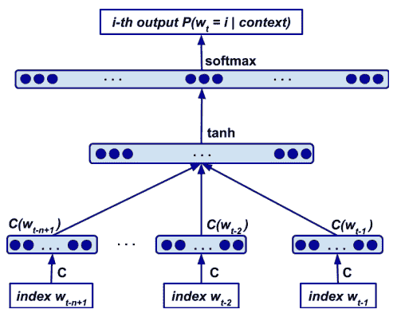

一个神经网络语言模型，根据给定的词语*w[t-n+1]* ... *w[t-1]*，输出词语*w[t]*的概率分布。**C**是嵌入矩阵。

网络层扮演着不同的角色，具体如下：

1.  嵌入层将词语*w[i]*的独热表示转换为词语的嵌入向量，通过与嵌入矩阵**C**相乘来实现。这个计算可以通过表查找高效实现。嵌入矩阵**C**在所有词语间共享，因此所有词语使用相同的嵌入函数。**C**是一个*V * D*矩阵，其中*V*是词汇表的大小，*D*是嵌入的维度。换句话说，矩阵**C**表示隐藏层*tanh*的网络权重。

1.  生成的嵌入被连接起来并作为输入传递给隐藏层，隐藏层使用*tanh*激活函数。因此，隐藏层的输出由![]函数表示，其中**H**表示嵌入到隐藏层的权重，*d*表示隐藏偏置。

1.  最后，我们有一个带有权重的输出层，**U**，偏置，*b*，以及 softmax 激活函数，将隐藏层映射到词空间概率分布：![]*。

该模型同时学习了词汇表中所有词的嵌入（嵌入层）以及词序列的概率函数模型（网络输出）。它能够将此概率函数推广到训练过程中未出现的词序列。测试集中的特定词组合可能未在训练集中出现，但具有相似嵌入特征的序列在训练过程中更可能出现。由于我们可以基于词的位置（这些位置已经存在于文本中）来构建训练数据和标签，因此训练该模型是一项无监督学习任务。接下来，我们将讨论 word2vec 语言模型，它于 2013 年推出，并在神经网络的 NLP 领域引发了广泛的关注。

# Word2Vec

许多研究致力于创建更好的词嵌入模型，特别是通过省略学习词序列的概率函数。其中一种最流行的方法是使用 word2vec（[`papers.nips.cc/paper/5021-distributed-representations-of-words-and-phrases-and-their-compositionality.pdf`](http://papers.nips.cc/paper/5021-distributed-representations-of-words-and-phrases-and-their-compositionality.pdf) 和 [`arxiv.org/abs/1301.3781`](https://arxiv.org/abs/1301.3781)， [`arxiv.org/abs/1310.4546`](https://arxiv.org/abs/1310.4546)）。类似于 NPLM，word2vec 基于词的上下文（周围的词）创建嵌入向量。它有两种形式：**连续词袋模型**（**CBOW**）和**Skip-gram**。我们将从 CBOW 开始，然后讨论 Skip-gram。

# CBOW

CBOW 根据上下文（周围的词）预测最可能的词。例如，给定序列*The quick* _____ *fox jumps*，模型将预测*brown*。上下文是指在关注的词前后*n*个词（与 NPLM 不同，NPLM 仅参与前面的词）。以下截图展示了上下文窗口在文本中滑动的过程：

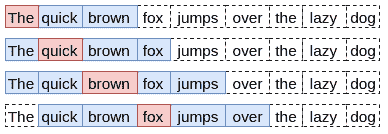

一个带有*n = 2*的 word2vec 滑动上下文窗口。相同类型的上下文窗口适用于 CBOW 和 Skip-gram。

CBOW 将上下文中的所有单词赋予相同的权重，并且不考虑它们的顺序（因此名字中有*bag*）。它与 NPLM 有些相似，但由于它只学习词嵌入向量，因此我们将通过以下简单的神经网络来训练模型：

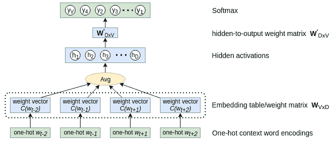

一个 CBOW 模型网络

其工作原理如下：

+   网络有输入层、隐藏层和输出层。

+   输入是通过一热编码表示的词。这些词的一热编码向量大小等于词汇表的大小，*V*。

+   嵌入向量由网络的输入到隐藏层权重**W***[V×D]*表示。它们是*V × D-*形状的矩阵，其中*D*是嵌入向量的长度（即隐藏层单元的数量）。和 NPLM 一样，我们可以将权重看作查找表，其中每一行表示一个词的嵌入向量。因为每个输入词是通过一热编码表示的，它总是激活权重的某一行。也就是说，对于每个输入样本（词），只有该词的嵌入向量会参与。

+   所有上下文词的嵌入向量被平均以生成隐藏层网络的输出（没有激活函数）。

+   隐藏层的激活值作为输入传递到输出的 softmax 层，大小为*V*（其权重向量为**W^'***[D×V]*），该层预测在输入词的上下文（邻近）中最有可能找到的词。激活值最高的索引表示一热编码的相关词。

我们将通过梯度下降和反向传播来训练网络。训练集由（上下文和标签）的一对一热编码词组成，这些词在文本中彼此靠近。例如，如果文本的一部分是序列`[the, quick, brown, fox, jumps]`，并且*n = 2*，则训练元组将包括`([quick, brown], the)`、`([the, brown, fox], quick)`、`([the, quick, fox jumps], brown)`等。由于我们只关心词嵌入**W***[V×D]*，当训练完成时，我们会丢弃网络中其余的权重**W^'***[V×D]*。

CBOW 将告诉我们在给定上下文中最有可能出现哪个词。这对于稀有词来说可能是一个问题。例如，给定上下文*The weather today is really*____，模型会预测词*beautiful*，而不是*fabulous*（嘿，这只是一个例子）。与 Skip-gram 相比，CBOW 的训练速度快几倍，并且在频繁出现的单词上略微提高了准确性。

# Skip-gram

给定一个输入词，Skip-gram 模型可以预测其上下文（与 CBOW 相反）。例如，词*brown*将预测词*The quick fox jumps*。与 CBOW 不同，输入是一个单一的 one-hot 词。但我们如何表示输出中的上下文词呢？Skip-gram 并不是尝试同时预测整个上下文（所有周围词），而是将上下文转化为多个训练对，如`(fox, the)`、`(fox, quick)`、`(fox, brown)`和`(fox, jumps)`。再次地，我们可以通过一个简单的单层网络来训练模型：

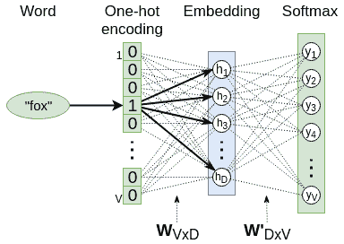

一个 Skip-gram 模型网络

与 CBOW 一样，输出是一个 softmax，它表示最可能的上下文词的 one-hot 编码。输入到隐藏层的权重**W***[V×D]*表示词嵌入查找表，隐藏到输出的权重**W^'***[D×V]*仅在训练过程中相关。隐藏层没有激活函数（也就是说，它使用线性激活）。

我们将通过反向传播训练模型（这没有惊讶）。给定一个单词序列*w[1], ..., w[M]*，Skip-gram 模型的目标是最大化平均对数概率，其中*n*是窗口大小：

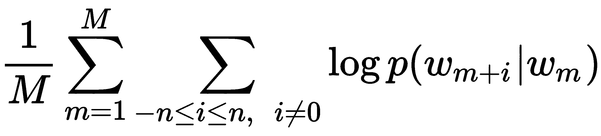

模型定义了概率![]，如下所示：

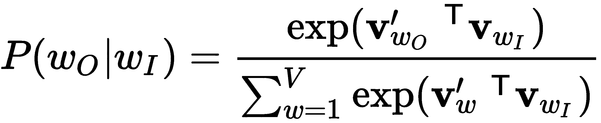

在这个例子中，*w[I]*和*w[O]*分别是输入和输出词，**v***[w]*和**v***^'[w]*分别是输入和输出权重**W***[V×D]*和**W^'***[D×V]*中的对应词向量（我们保持了论文中的原始符号）。由于网络没有隐藏激活函数，它对于一个输入/输出词对的输出值仅仅是输入词向量![]与输出词向量![]的乘积（因此需要进行转置操作）。

word2vec 论文的作者指出，词向量无法表示那些不是个别单词组合的习惯用语。例如，*New York Times*是一个报纸，而不仅仅是*New*、*York*和*Times*意思的自然组合。为了克服这个问题，可以将模型扩展为包括完整的短语。然而，这会显著增加词汇表的大小。而且，正如我们从前面的公式中可以看到的，softmax 分母需要计算词汇表中所有词的输出向量。此外，**W^'***[D×V]*矩阵的每个权重在每次训练步骤中都会更新，这会减慢训练过程。

为了解决这个问题，我们可以用所谓的**负采样**（**NEG**）来替代 softmax。对于每个训练样本，我们将使用正向训练对（例如，`(fox, brown)`），以及*k*个额外的负向对（例如，`(fox, puzzle)`），其中*k*通常在[5,20]的范围内。与其预测与输入词最匹配的词（softmax），我们干脆预测当前的词对是否真实。实际上，我们将多项式分类问题（分类为多类之一）转化为二元逻辑回归（或二元分类）问题。通过学习正向和负向词对的区别，分类器最终将像多项式分类一样学习词向量。在 word2vec 中，负向词对的词是从一个特殊的分布中抽取的，这个分布倾向于抽取不太常见的词，而不是常见的词。

一些最常见的词汇携带的信息量比稀有词汇要少。例如，定冠词和不定冠词*a*、*an*和*the*就是这样的词。模型通过观察词对*London*和*city*比观察*the*和*city*更能获益，因为几乎所有的词都与*the*频繁共现。相反的情况也是如此——频繁词汇的词向量在经过大量示例的训练后变化不大。为了应对稀有词和常见词之间的不平衡，论文的作者提出了一种下采样方法，其中训练集中的每个词*w[i]*，都有一定的概率被丢弃，该概率通过启发式公式计算，其中*f(w[i])*是词*w[i]*的频率，*t*是阈值（通常约为 10^(-5)）：

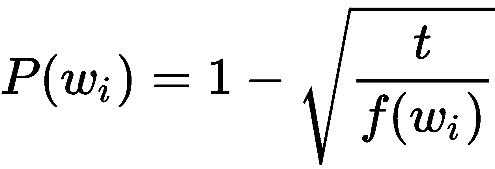

它积极地对出现频率大于*t*的词进行下采样，同时保持词频的排名。

总结来说，我们可以说，通常情况下，Skip-gram 在处理稀有词汇时比 CBOW 表现更好，但它的训练时间更长。

# fastText

fastText ([`fasttext.cc/`](https://fasttext.cc/)) 是一个由**Facebook AI Research**（**FAIR**）团队创建的用于学习词嵌入和文本分类的库。Word2Vec 将语料库中的每个词视为一个原子实体，并为每个词生成一个向量，但这种方法忽略了词的内部结构。与此相对，fastText 将每个词*w*分解为字符*n*-gram 的袋子。例如，如果*n = 3*，我们可以将词*there*分解为字符 3-gram，并为整个词生成特殊序列*<there>*：

*<th*, *the*, *her*, *ere*, *re>*

注意使用特殊字符*<*和*>*来标示词的开始和结束。这是为了避免来自不同词的*n*-grams 发生错配。例如，词*her*将被表示为*<her>*，它不会与词*there*中的*n*-gram*her*混淆。fastText 的作者建议***3 ≤ n ≤ 6***。

回顾我们在*Skip-gram*部分介绍的 softmax 公式。我们通过用通用评分函数***s***替代 word2vec 网络中的向量乘法操作来推广它，其中*w[t]*是输入词，*w[c]*是上下文词：

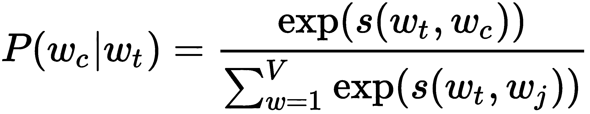

在 fastText 的情况下，我们通过将词的*n*-grams 的向量表示相加来表示一个词。我们用*G[w] = {1 ... G}*表示出现在词*w*中的*n*-grams 集合，用**v*[g]***表示*n*-gram 的向量表示，用**v***'**[c]***表示上下文词的潜在向量。那么，fastText 定义的评分函数如下：

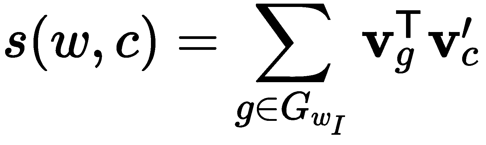

实际上，我们使用 Skip-gram 类型的词对训练 fastText 模型，但输入词通过*n*-grams 的方式表示。

使用字符*n*-grams 相比传统的 word2vec 模型有几个优点：

+   如果一个词与模型中其他熟悉的词共享*n*-grams，它可以分类未知或拼写错误的词。

+   它可以为稀有词生成更好的词向量。即使一个词很稀有，它的字符*n*-grams 仍然与其他词共享，因此词向量仍然可以很好。

现在我们已经熟悉了 word2vec，接下来我们将介绍全局词向量表示语言模型，这个模型改进了 word2vec 的一些不足之处。

# 全局词向量表示模型

word2vec 的一个缺点是它只使用词的局部上下文，而没有考虑它们的全局共现。这样，模型丧失了一个现成的、宝贵的信息来源。如其名字所示，**全局词向量表示**（**GloVe**）模型试图解决这个问题（[`nlp.stanford.edu/pubs/glove.pdf`](https://nlp.stanford.edu/pubs/glove.pdf)）。

算法从全局的词-词共现矩阵**X**开始。一个单元格，*X[ij]*，表示词*j*在词*i*的上下文中出现的频率。以下表格展示了序列*I like DL. I like NLP. I enjoy cycling*，窗口大小*n*=2 的共现矩阵：

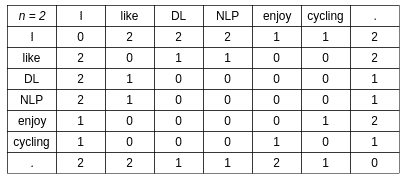

序列 I like DL. I like NLP. I enjoy cycling 的共现矩阵

我们设定任何词在词*i*上下文中出现的次数为![]，词*j*在词*i*上下文中出现的概率为![]。为了更好地理解这如何帮助我们，我们将使用一个示例，展示来自 60 亿词汇的语料库中目标词*冰*和*蒸汽*与选定上下文词的共现概率：

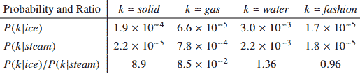

目标词冰和蒸汽与选定上下文词的共现概率（来自 60 亿词汇的语料库）：来源：[`nlp.stanford.edu/pubs/glove.pdf`](https://nlp.stanford.edu/pubs/glove.pdf)

最底行显示的是概率比率。**固体**（第一列）与**冰**相关，但与**蒸汽**的相关性较低，因此它们的概率比率较大。相反，**气体**与**蒸汽**的相关性高于**冰**，因此它们的概率比率非常小。**水**和**时尚**这两个词与这两个目标词的相关性相等，因此它们的概率比率接近 1。与原始概率相比，这一比率在区分相关词（*(**固体**和**气体**）*）和不相关词（*(**水**和**时尚**）*）时表现更好。此外，它还更能区分两个相关词之间的差异。

根据前面的论述，GloVe 的作者建议从共现概率的比率开始进行词向量学习，而不是从概率本身开始。以此为起点，并且记住比率![]依赖于三个词——*i*、*j*和*k——我们可以将 GloVe 模型的最一般形式定义如下，其中![]是词向量，![]是一个特殊的上下文向量，我们稍后会讨论(![]是*D*维实数向量空间)：

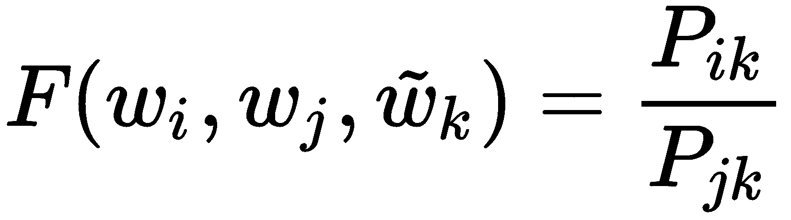

换句话说，*F*是这样一个函数，当用这三个特定的向量计算时（我们假设我们已经知道它们），将输出概率比率。此外，*F*应该编码概率比率的信息，因为我们已经识别出它的重要性。由于向量空间本质上是线性的，一种编码这些信息的方法是通过目标词的向量差异。因此，函数变成了如下形式：

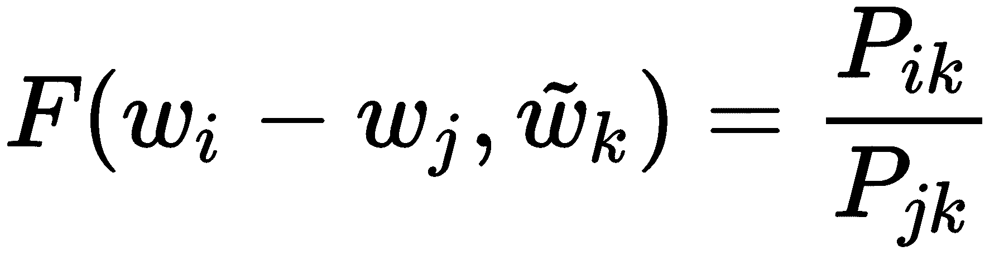

接下来，我们注意到函数的参数是向量，但概率比率是标量。为了解决这个问题，我们可以计算参数的点积：

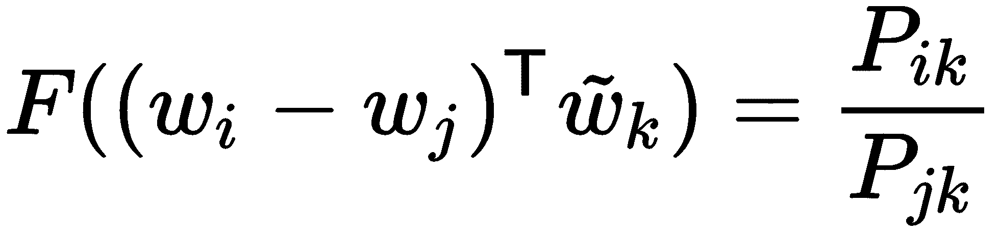

然后，我们可以观察到，单词与其上下文单词之间的区分是任意的，我们可以自由地交换这两者的角色。因此，我们应该有![]，但前面的方程并不满足这一条件。长话短说（论文中有更详细的解释），为了满足这个条件，我们需要引入另一个限制，形式如下的方程，其中，![] 和 ![] 是偏差标量值：

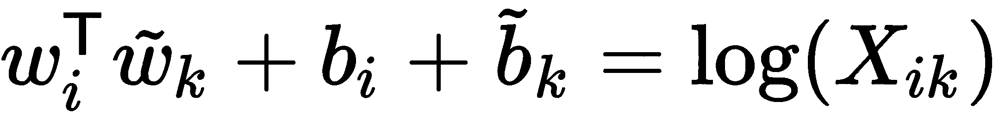

这个公式的一个问题是，*log(0)*是未定义的，但大多数的 *X[ik]* 条目将是 *0*。此外，它对所有共现赋予相同的权重，但稀有的共现通常噪声较多，所携带的信息量小于频繁的共现。为了解决这些问题，作者提出了一种最小二乘回归模型，并为每个共现引入了加权函数 *f(X[ij])*。该模型具有以下成本函数：

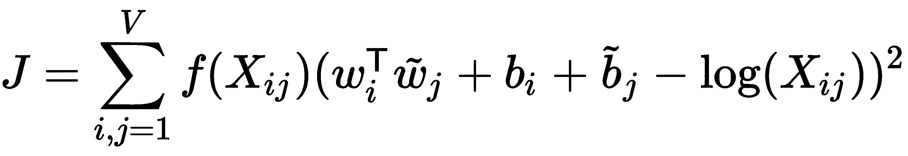

最后，加权函数 *f* 应满足几个性质。首先，*f(0) = 0*。然后，*f(x)* 应该是单调不减的，以避免稀有共现被过度加权。最后，对于较大的 *x* 值，*f(x)* 应该相对较小，以避免频繁共现被过度加权。根据这些性质和他们的实验，作者提出了以下函数：

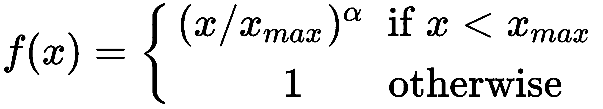

以下图表展示了 *f(x)*：

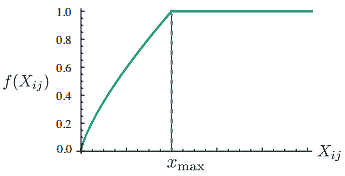

加权函数 *f(X[ij])*，其截止值为 *x[max]*= 100，且 *α = 3/4*。作者的实验表明，这些参数效果最佳；来源：[`nlp.stanford.edu/pubs/glove.pdf`](https://nlp.stanford.edu/pubs/glove.pdf)

该模型生成两组单词向量：*W* 和 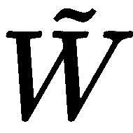。当 *X* 对称时，*W* 和  是等价的，仅由于它们的随机初始化有所不同。但作者指出，训练多个网络并对它们的结果进行平均通常有助于防止过拟合。为了模拟这种行为，他们选择使用总和![]作为最终的单词向量，并观察到性能略有提高。

这就是我们关于神经语言模型的讨论。在下一节中，我们将看到如何训练和可视化一个 word2vec 模型。

# 实现语言模型

在这一节中，我们将实现一个简短的流程，用于预处理文本序列并使用处理后的数据训练 word2vec 模型。我们还将实现另一个示例来可视化嵌入向量，并检查它们的一些有趣特性。

本节代码需要以下 Python 包：

+   **Gensim**（版本 3.80，[`radimrehurek.com/gensim/`](https://radimrehurek.com/gensim/)）是一个开源 Python 库，专注于无监督主题建模和自然语言处理。它支持我们迄今为止讨论的所有三种模型（word2vec、GloVe 和 fastText）。

+   **自然语言工具包**（**NLTK**，[`www.nltk.org/`](https://www.nltk.org/)，ver 3.4.4）是一个用于符号和统计自然语言处理的 Python 库和程序套件。

+   Scikit-learn（ver 0.19.1，[`scikit-learn.org/`](https://scikit-learn.org/)）是一个开源 Python 机器学习库，包含多种分类、回归和聚类算法。更具体地说，我们将使用 **t-分布随机邻居嵌入**（**t-SNE**，[`lvdmaaten.github.io/tsne/`](https://lvdmaaten.github.io/tsne/)）来可视化高维嵌入向量（稍后会详细介绍）。

通过这一介绍，我们继续进行语言模型的训练。

# 训练嵌入模型

在第一个示例中，我们将对列夫·托尔斯泰的经典小说 *战争与和平* 进行 word2vec 模型训练。该小说作为常规文本文件存储在代码库中。让我们开始吧：

1.  按照惯例，我们将进行导入：

```py
import logging
import pprint  # beautify prints

import gensim
import nltk
```

1.  然后，我们将设置日志级别为 `INFO`，以便跟踪训练进度：

```py
logging.basicConfig(level=logging.INFO)
```

1.  接下来，我们将实现文本标记化流水线。标记化是指将文本序列分解为若干部分（或 **tokens**），如单词、关键词、短语、符号和其他元素。tokens 可以是单个单词、短语甚至整个句子。我们将实现两级标记化；首先将文本拆分为句子，然后再将每个句子拆分为单独的单词：

```py
class TokenizedSentences:
    """Split text to sentences and tokenize them"""

    def __init__(self, filename: str):
        self.filename = filename

    def __iter__(self):
        with open(self.filename) as f:
            corpus = f.read()

        raw_sentences = nltk.tokenize.sent_tokenize(corpus)
        for sentence in raw_sentences:
            if len(sentence) > 0:
                yield gensim.utils.simple_preprocess(sentence, min_len=2, max_len=15)
```

`TokenizedSentences` 迭代器以文本文件名作为参数，文件中包含小说的内容。以下是它的工作原理：

1.  迭代从读取文件的完整内容开始，并将其存储在 `corpus` 变量中。

1.  原始文本通过 NLTK 的 `nltk.tokenize.sent_tokenize(corpus)` 函数被拆分为句子列表（`raw_sentences` 变量）。例如，对于输入列表 `'I like DL. I like NLP. I enjoy cycling.'`，它将返回 `['I like DL.', 'I like NLP.', 'I enjoy cycling.']`。

1.  接下来，每个 `sentence` 使用 `gensim.utils.simple_preprocess(sentence, min_len=2, max_len=15)` 函数进行预处理。该函数将文档转换为小写的 token 列表，并忽略过短或过长的 token。例如，`'I like DL'` 句子将被标记为 `['like', 'dl']` 列表。标点符号也会被移除。处理后的句子作为最终结果返回。

1.  然后，我们将实例化 `TokenizedSentences`：

```py
sentences = TokenizedSentences('war_and_peace.txt')
```

1.  接下来，我们将实例化 Gensim 的 word2vec 训练模型：

```py
model = gensim.models.word2vec. \
    Word2Vec(sentences=sentences,
             sg=1,  # 0 for CBOW and 1 for Skip-gram
             window=5,  # the size of the context window
             negative=5,  # negative sampling word count
             min_count=5,  # minimal word occurrences to include
             iter=5,  # number of epochs
             )
```

模型以 `sentences` 作为训练数据集。`Word2Vec` 支持我们在本章中讨论的所有参数和模型变体。例如，你可以通过 `sg` 参数在 CBOW 和 Skip-gram 之间切换。你还可以设置上下文窗口大小、负采样数量、训练轮次等参数。你可以在代码本身中探索所有参数。

或者，你可以通过将 `gensim.models.word2vec.Word2Vec` 替换为 `gensim.models.fasttext.FastText` 来使用 fastText 模型（它与相同的输入参数一起工作）。

1.  `Word2Vec` 构造函数也启动了训练。在短时间内（你不需要 GPU，因为训练数据集很小），生成的嵌入向量会存储在 `model.wv` 对象中。一方面，它像字典一样，你可以通过 `model.wv['WORD_GOES_HERE']` 访问每个词的向量，然而，它也支持一些其他有趣的功能。你可以通过 `model.wv.most_similar` 方法来衡量不同词语之间的相似性。首先，它将每个词向量转换为单位向量（长度为 1 的向量）。然后，它计算目标词的单位向量与所有其他词的单位向量之间的点积。两个向量的点积越大，它们的相似性越高。例如，`pprint.pprint(model.wv.most_similar(positive='mother', topn=5))` 将输出与词语 `'mother'` 最相似的五个词及其点积：

```py
[('sister', 0.9024157524108887),
 ('daughter', 0.8976515531539917),
 ('brother', 0.8965438008308411),
 ('father', 0.8935455679893494),
 ('husband', 0.8779271245002747)]
```

结果证明了词向量正确地编码了词语的含义。词语`'mother'` 确实在意义上与 `'sister'`、`'daughter'` 等相关联。

我们还可以找到与目标词组合最相似的词。例如，`model.wv.most_similar(positive=['woman', 'king'], topn=5)` 将计算 `'woman'` 和 `'king'` 的词向量的均值，然后找到与这个新均值最相似的词：

```py
[('heiress', 0.9176832437515259), ('admirable', 0.9104862213134766), ('honorable', 0.9047746658325195), ('creature', 0.9040032625198364), ('depraved', 0.9013445973396301)]
```

我们可以看到一些词是相关的（`'heiress'`），但大多数不是（`'creature'`、`'admirable'`）。也许我们的训练数据集太小，无法捕捉到像这样的复杂关系。

# 可视化嵌入向量

为了获得比*训练嵌入模型*部分更好的词向量，我们将训练另一个 word2vec 模型。然而，这次我们将使用一个更大的语料库——`text8` 数据集，它由维基百科的前 1 亿字节的纯文本组成。该数据集已包含在 Gensim 中，并且它被标记为一个包含单词的长列表。现在，让我们开始吧：

1.  一如既往，首先是导入。我们还将日志设置为 `INFO` 级别，以便更好地查看：

```py
import logging
import pprint  # beautify prints

import gensim.downloader as gensim_downloader
import matplotlib.pyplot as plt
import numpy as np
from gensim.models.word2vec import Word2Vec
from sklearn.manifold import TSNE

logging.basicConfig(level=logging.INFO)
```

1.  接下来，我们将训练 `Word2vec` 模型。这一次，我们将使用 CBOW 来加速训练。我们将通过 `gensim_downloader.load('text8')` 加载数据集：

```py
model = Word2Vec(
    sentences=gensim_downloader.load('text8'),  # download and load the text8 dataset
    sg=0, size=100, window=5, negative=5, min_count=5, iter=5)
```

1.  为了判断这个模型是否更好，我们可以尝试找到与`'woman'`和`'king'`最相似但与`'man'`最不相似的词。理想情况下，其中一个词应该是`'queen'`。我们可以使用表达式`pprint.pprint(model.wv.most_similar(positive=['woman', 'king'], negative=['man']))`来实现。输出结果如下：

```py
[('queen', 0.6532326936721802), ('prince', 0.6139929294586182), ('empress', 0.6126195192337036), ('princess', 0.6075714230537415), ('elizabeth', 0.588543176651001), ('throne', 0.5846244692802429), ('daughter', 0.5667101144790649), ('son', 0.5659586191177368), ('isabella', 0.5611927509307861), ('scots', 0.5606790781021118)]
```

确实，最相似的词是`'queen'`，但其余的词也相关。

1.  接下来，我们将利用 t-SNE 可视化模型，在收集到的词向量上展示这些词在 2D 图中的分布。t-SNE 将每个高维嵌入向量映射到二维或三维空间中的一个点，使得相似的对象被映射到附近的点，不相似的对象则被映射到远离的点，并且这种映射具有较高的概率。我们将从几个`target_words`开始，然后收集与每个目标词最相似的*n*个词（及其词向量）。以下是执行此操作的代码：

```py
target_words = ['mother', 'car', 'tree', 'science', 'building', 'elephant', 'green']
word_groups, embedding_groups = list(), list()

for word in target_words:
    words = [w for w, _ in model.most_similar(word, topn=5)]
    word_groups.append(words)

    embedding_groups.append([model.wv[w] for w in words])
```

1.  然后，我们将使用以下参数训练一个 t-SNE 可视化模型，基于收集到的聚类结果：

    +   `perplexity`与在匹配每个点的原始向量和降维向量时所考虑的最近邻居数量有关。换句话说，它决定了算法是否会关注数据的局部特性或全局特性。

    +   `n_components=2`指定了输出向量的维度数。

    +   `n_iter=5000`是训练迭代的次数。

    +   `init='pca'`使用**主成分分析**（**PCA**）进行初始化。

该模型以`embedding_groups`聚类为输入，输出带有 2D 嵌入向量的`embeddings_2d`数组。以下是实现代码：

```py
# Train the t-SNE algorithm
embedding_groups = np.array(embedding_groups)
m, n, vector_size = embedding_groups.shape
tsne_model = TSNE(perplexity=8, n_components=2, init='pca', n_iter=5000)

# generate 2d embeddings from the original 100d ones
embeddings_2d = tsne_model.fit_transform(embedding_groups.reshape(m * n, vector_size))
embeddings_2d = np.array(embeddings_2d).reshape(m, n, 2)
```

1.  接下来，我们将展示新的 2D 嵌入。为此，我们将初始化图表及其某些属性，以提高可视性：

```py
# Plot the results
plt.figure(figsize=(16, 9))
# Different color and marker for each group of similar words
color_map = plt.get_cmap('Dark2')(np.linspace(0, 1, len(target_words)))
markers = ['o', 'v', 's', 'x', 'D', '*', '+']
```

1.  然后，我们将遍历每个`similar_words`聚类，并将其词语作为点展示在散点图上。每个聚类使用唯一的标记。点将标注对应的词语：

```py
# Iterate over all groups
for label, similar_words, emb, color, marker in \
        zip(target_words, word_groups, embeddings_2d, color_map, markers):
    x, y = emb[:, 0], emb[:, 1]

    # Plot the points of each word group
    plt.scatter(x=x, y=y, c=color, label=label, marker=marker)

    # Annotate each point with its corresponding caption
    for word, w_x, w_y in zip(similar_words, x, y):
        plt.annotate(word, xy=(w_x, w_y), xytext=(0, 15),
                     textcoords='offset points', ha='center', va='top', size=10)
```

1.  最后，我们将展示图表：

```py
plt.legend()
plt.grid(True)
plt.show()
```

我们可以看到，每个相关词的聚类被分组在 2D 图的一个接近区域中：

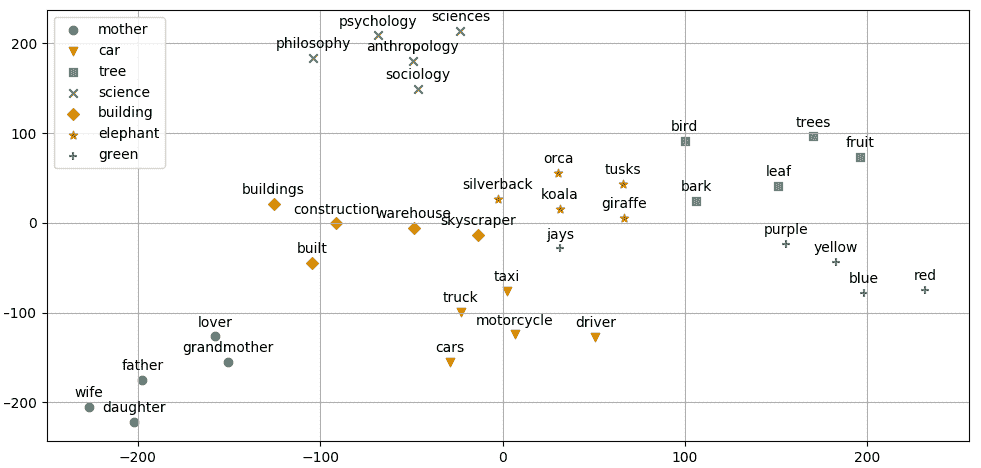

t-SNE 可视化目标词及其最相似词的聚类

该图再次证明，获得的词向量包含了词语的相关信息。随着这个示例的结束，我们也总结了本章内容。

# 总结

这是专门讨论 NLP 的第一章。恰如其分，我们从当今大多数 NLP 算法的基本构建模块——词语及其基于上下文的向量表示开始。我们从*n*-gram 和将词表示为向量的需求开始。然后，我们讨论了 word2vec、fastText 和 GloVe 模型。最后，我们实现了一个简单的管道来训练嵌入模型，并使用 t-SNE 可视化了词向量。

在下一章，我们将讨论 RNN——一种自然适用于 NLP 任务的神经网络架构。
