# 第七章：理解循环网络

在第一章《神经网络的基础》和第二章《理解卷积网络》中，我们深入探讨了普通前馈网络的特性以及其专业化形式——**卷积神经网络**（**CNNs**）。在本章中，我们将通过**循环神经网络**（**RNNs**）结束这一故事线。我们在前几章讨论的神经网络架构采用固定大小的输入并提供固定大小的输出，而 RNN 通过定义这些序列上的递归关系，突破了这一限制，从而能够处理可变长度的输入序列（因此得名）。如果你已经熟悉本章将讨论的某些主题，可以跳过它们。

在本章中，我们将覆盖以下主题：

+   RNN 简介

+   引入长短期记忆（LSTM）

+   引入门控循环单元

+   实现文本分类

# RNN 简介

RNN 是可以处理具有可变长度序列数据的神经网络。这类数据的例子包括一个句子的单词或股市在不同时间点的价格。通过使用“序列”一词，我们意味着序列中的元素是彼此相关的，并且它们的顺序是重要的。例如，如果我们把一本书的所有单词随机打乱，文本就会失去其含义，尽管我们仍然能知道各个单词的意思。自然地，我们可以使用 RNN 来解决与序列数据相关的任务。这类任务的例子包括语言翻译、语音识别、预测时间序列的下一个元素等。

RNN 得名于其对序列应用相同的函数进行递归运算。我们可以将 RNN 定义为一个递归关系：

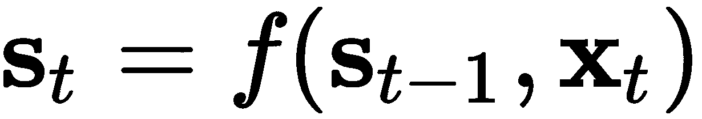

在这里， `f` 是一个可微分函数，`s[t]` 是一个值的向量，称为内部网络状态（在第`t`步），`x[t]` 是第`t`步的网络输入。与普通网络不同，普通网络中的状态仅依赖于当前输入（和网络权重），而在这里，`s[t]` 是当前输入和前一个状态`s[t-1]`的函数。你可以将`s[t-1]`看作是网络对所有先前输入的总结。这与常规的前馈网络（包括 CNN）不同，后者只将当前输入样本作为输入。递归关系定义了状态如何通过对先前状态的反馈循环，逐步在序列中演化，如下图所示：

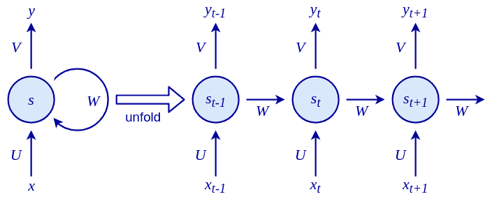

左：RNN 递归关系的可视化说明：`sₜ` =*Ws*[t-1] + *Ux*[t;]* 最终输出为 y*[t] =*Vs*[t] 。右：RNN 状态在序列 *t-1, t, t+1* 上递归展开。注意，参数 U、V 和 W 在所有步骤之间是共享的

RNN 有三组参数（或权重）：

+   `U` 将输入 `x`*[t]* 转换为状态 `s`*[t]*。

+   `W` 将前一个状态 `s`*[t-1]* 转换为当前状态 `s`*[t]*。

+   `V` 将新计算的内部状态 `s`*[t]* 转换为输出 `y`*[t]。

`U`、`V` 和 `W` 对其各自的输入进行线性变换。最基本的这种变换案例是我们熟悉的加权和。我们现在可以定义内部状态和网络输出如下：

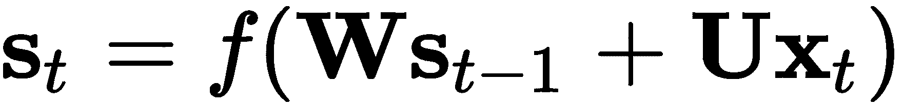

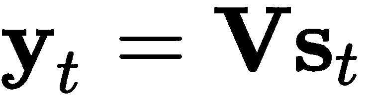

在这里，`f` 是非线性激活函数（如 tanh、sigmoid 或 ReLU）。

例如，在一个单词级别的语言模型中，输入，`x`，将是一个由输入向量（*(`x₁` ... `x[t]` ...)*）编码的单词序列。状态，`s`，将是一个状态向量序列（*(`s₁` ... `s[t]` ...)*）。最后，输出，`y`，将是一个表示下一个单词的概率向量序列（*(`y₁` ... `y[t]` ...)*）。

请注意，在 RNN 中，每个状态都依赖于通过递归关系得到的所有先前计算结果。这一点的一个重要含义是，RNN 在时间上具有记忆，因为状态 `s` 包含基于前一步骤的信息。从理论上讲，RNN 可以记住信息任意长的时间，但在实际应用中，它们只能回顾到前几步。我们将在“*消失与爆炸梯度*”一节中详细讨论这个问题。

我们在这里描述的 RNN 在某种程度上等同于一个单层的常规神经网络（并且具有额外的递归关系）。正如我们现在从第一章《神经网络的基本原理》中所知，单层网络存在一些严重的限制。别担心！像常规网络一样，我们可以堆叠多个 RNN，形成**堆叠 RNN**。在时间步`t`，位于第`l`层的 RNN 单元的细胞状态，`s`*^l[t]*，将接收来自第`l-1`层 RNN 单元的输出，`y`*[t]^(l-1)*，以及该层第`l`单元在时间步`t-1`的前一时刻的细胞状态，`s`*^l[t-1]*，作为输入：

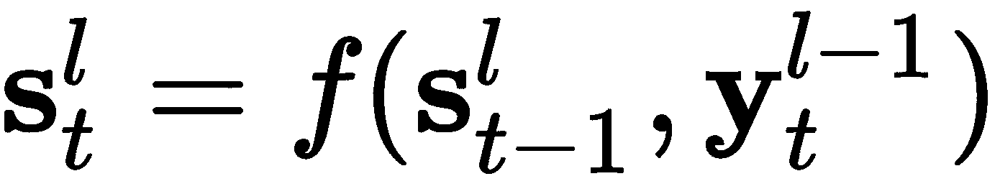

在下图中，我们可以看到一个展开的堆叠 RNN：

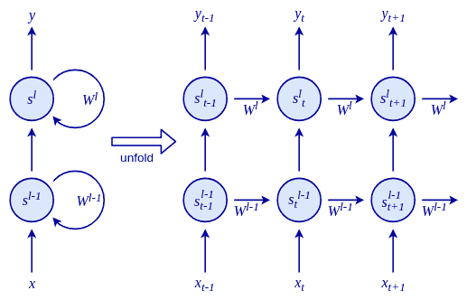

堆叠 RNN

迄今为止，我们讨论的 RNN 利用序列的前一个元素来产生输出。这对于时间序列预测等任务是有意义的，我们希望根据前面的元素预测序列中的下一个元素。但它也在其他任务上施加了不必要的限制，例如自然语言处理领域的任务。正如我们在第六章《语言建模》中所看到的，我们可以通过上下文获得关于一个词的很多信息，因此从前后词语中提取上下文是有意义的。

我们可以扩展常规的 RNN，使用所谓的**双向 RNN**来覆盖这种情况，如下图所示：

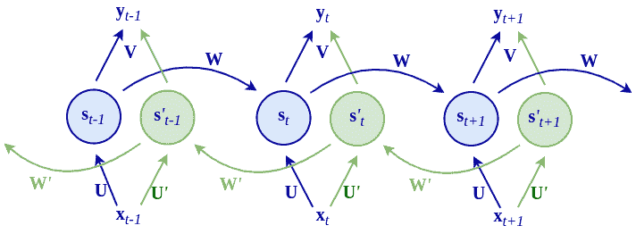

双向 RNN

该网络有两个传播循环，分别朝两个方向工作，也就是说，从步长 `t` 到 *t+1* 的从左到右传播和从步长 *t+1* 到 `t` 的从右到左传播。我们用符号‘来表示从右到左的传播（不要与导数混淆）。在每一个时间步长 `t`，网络保持两个内部状态向量：`s`*[t]*用于从左到右的传播，`s`*'[t]*用于从右到左的传播。右到左阶段有自己的输入权重集，*U'* 和 *W'*，它们对应左到右阶段的权重`U` 和 `W`。右到左隐藏状态向量的公式如下：

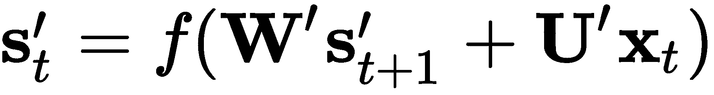

网络的输出，`y`*[t]*，是内部状态`s`*[t]*和`s`*[t+1]*的组合。一种组合它们的方式是通过连接。在这种情况下，我们将连接后的状态的权重矩阵表示为`V`。这里，输出的公式如下：

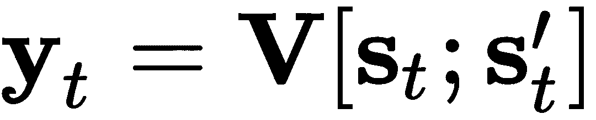

或者，我们可以简单地将两个状态向量相加：

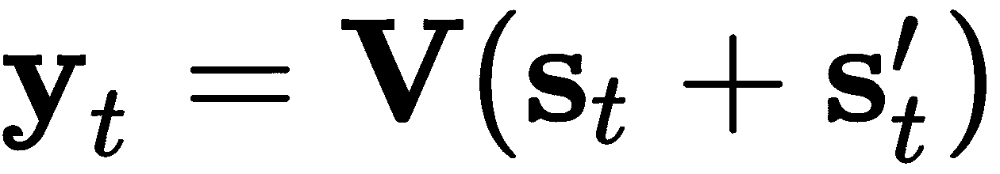

因为 RNN 不局限于处理固定大小的输入，它们真正扩展了我们使用神经网络计算的可能性，比如不同长度的序列或大小不同的图像。

让我们回顾一些不同的组合方式：

+   **一对一**：这是非顺序处理，例如前馈神经网络和卷积神经网络（CNN）。需要注意的是，前馈网络和将 RNN 应用于单一时间步长之间并没有太大区别。一对一处理的一个例子是图像分类，我们在第二章《理解卷积网络》和第三章《高级卷积网络》中有讨论。

+   **一对多**：这种处理方式基于单一输入生成一个序列，例如，从图像生成描述（*Show and Tell: A Neural Image Caption Generator*，[`arxiv.org/abs/1411.4555`](https://arxiv.org/abs/1411.4555)）。

+   **多对一**：这种处理方式基于一个序列输出单一结果，例如文本情感分类。

+   **多对多间接**：一个序列被编码成一个状态向量，之后这个状态向量被解码成一个新的序列，例如，语言翻译（*使用 RNN 编码器-解码器进行短语表示学习用于统计机器翻译，*[`arxiv.org/abs/1406.1078`](https://arxiv.org/abs/1406.1078)和*使用神经网络的序列到序列学习*，[`papers.nips.cc/paper/5346-sequence-to-sequence-learning-with-neural-networks.pdf`](http://papers.nips.cc/paper/5346-sequence-to-sequence-learning-with-neural-networks.pdf)）。

+   **多对多直接**：对于每个输入步骤，输出一个结果，例如，语音识别中的帧音素标注*。

多对多模型通常被称为**序列到序列**（**seq2seq**）模型。

以下是前述输入输出组合的图形表示：

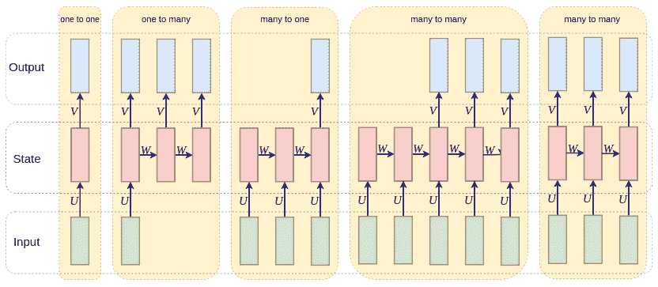

RNN 的输入输出组合：灵感来自[`karpathy.github.io/2015/05/21/rnn-effectiveness/`](http://karpathy.github.io/2015/05/21/rnn-effectiveness/)。

现在我们已经介绍了 RNN，在接下来的部分中，我们将从头开始实现一个简单的 RNN 示例，以加深我们的理解。

# RNN 的实现和训练

在前面的一节中，我们简要讨论了什么是 RNN 以及它们能解决哪些问题。接下来我们将深入探讨 RNN 的细节以及如何通过一个非常简单的玩具示例来训练它：计算序列中的 1 的数量。

在这个问题中，我们将教一个基本的 RNN 如何计算输入中 1 的数量，然后在序列的最后输出结果。这是一个多对一关系的示例，我们在前一部分中已经定义过。

我们将用 Python（不使用深度学习库）和 NumPy 来实现这个示例。输入和输出的示例如下：

```py
In: (0, 0, 0, 0, 1, 0, 1, 0, 1, 0) 
Out: 3
```

我们将使用的 RNN 在下图中有所示例：

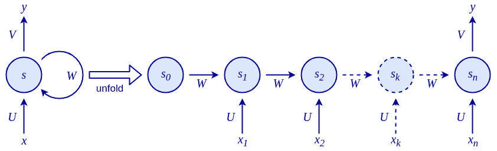

用于计算输入中 1 的基本 RNN

网络将只有两个参数：一个输入权重，`U`，和一个递归权重，`W`。输出权重，`V`，被设置为 1，以便我们只读取最后一个状态作为输出，`y`。

由于`sₜ`、`xₜ`、`U`和`W`是标量值，我们在*RNN 实现和训练*部分及其子部分中将不使用矩阵符号（粗体大写字母）。然而，请注意，这些公式的通用版本使用矩阵和向量参数。

在我们继续之前，先添加一些代码以使我们的示例能够执行。我们将导入`numpy`并定义我们的训练数据`x`和标签`y`。`x`是二维的，因为第一维表示小批量中的样本。为了简化起见，我们将使用一个只包含一个样本的小批量：

```py
import numpy as np

# The first dimension represents the mini-batch
x = np.array([[0, 0, 0, 0, 1, 0, 1, 0, 1, 0]])

y = np.array([3])
```

由此网络定义的递归关系是![]。请注意，这是一个线性模型，因为我们在这个公式中没有应用非线性函数。我们可以按如下方式实现递归关系：

```py
def step(s, x, U, W):
   return x * U + s * W
```

状态 `sₜ` 和权重 `W` 以及 `U` 是单一的标量值。一个好的解决方案是直接对序列中的输入进行求和。如果我们设置 *U=1*，那么每当输入被接收时，我们将获得其完整的值。如果我们设置 *W=1*，那么我们累积的值将永远不会衰减。因此，对于这个示例，我们将得到期望的输出：3。

然而，让我们用这个简单的示例来训练和实现这个神经网络。这将非常有趣，因为我们将在本节的其余部分看到。首先，让我们看看如何通过反向传播得到这个结果。

# 时间反向传播

时间反向传播是我们用来训练递归网络的典型算法（*Backpropagation Through Time: What It Does and How to Do It*，[`axon.cs.byu.edu/~martinez/classes/678/Papers/Werbos_BPTT.pdf`](http://axon.cs.byu.edu/~martinez/classes/678/Papers/Werbos_BPTT.pdf)）。顾名思义，它基于我们在第一章中讨论的反向传播算法，*神经网络的基础与核心*。

正常的反向传播和时间反向传播的主要区别在于，递归网络是通过时间展开的，展开的时间步数是有限的（如前面的图示所示）。一旦展开完成，我们将得到一个与常规多层前馈网络非常相似的模型，即该网络的一个隐藏层代表了一个时间步。唯一的区别是，每一层都有多个输入：前一个状态 *s[t-1]* 和当前输入 `xₜ`。参数 `U` 和 `W` 在所有隐藏层之间共享。

前向传播解开了 RNN 在序列中的展开，并为每个步骤构建了状态栈。在以下的代码块中，我们可以看到一个前向传播的实现，它返回每个递归步骤和批次中每个样本的激活值 `s`：

```py
def forward(x, U, W):
    # Number of samples in the mini-batch
    number_of_samples = len(x)

    # Length of each sample
    sequence_length = len(x[0])

    # Initialize the state activation for each sample along the sequence
    s = np.zeros((number_of_samples, sequence_length + 1))

    # Update the states over the sequence
    for t in range(0, sequence_length):
        s[:, t + 1] = step(s[:, t], x[:, t], U, W)  # step function

    return s
```

现在我们有了前向步骤和损失函数，我们可以定义如何反向传播梯度。由于展开后的 RNN 等同于常规的前馈网络，我们可以使用在第一章中介绍的反向传播链式法则，*神经网络的基础与核心*。

因为权重 `W` 和 `U` 在各层之间共享，我们将为每个递归步骤累积误差导数，最后，我们将使用累积的值来更新权重。

首先，我们需要获取输出 `s`*[t]* 关于损失函数的梯度（*∂J/∂s*）。一旦我们得到它，我们将通过在前向步骤中构建的活动栈向后传播它。这个反向传播过程将从栈中弹出活动，以在每个时间步骤累积它们的误差导数。通过网络传播这个梯度的递归关系可以写成如下（链式法则）：

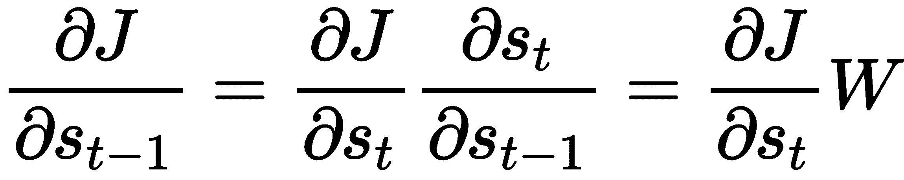

这里，`J` 是损失函数。

权重的梯度，`U` 和 `W`，是通过以下方式累积的：

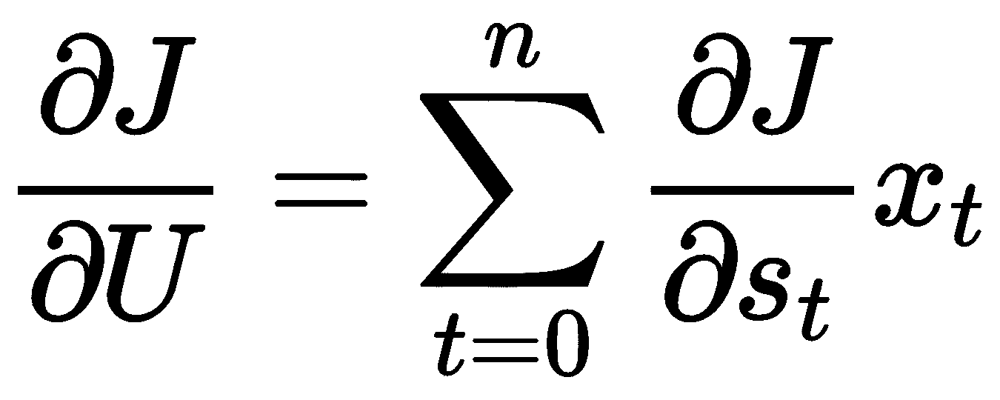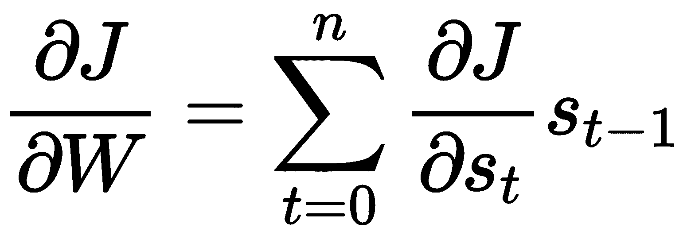

以下是反向传播的实现：

1.  `U` 和 `W` 的梯度分别在 `gU` 和 `gW` 中累积：

```py
def backward(x, s, y, W):
    sequence_length = len(x[0])

    # The network output is just the last activation of sequence
    s_t = s[:, -1]

    # Compute the gradient of the output w.r.t. MSE loss function 
      at final state
    gS = 2 * (s_t - y)

    # Set the gradient accumulations to 0
    gU, gW = 0, 0

    # Accumulate gradients backwards
    for k in range(sequence_length, 0, -1):
        # Compute the parameter gradients and accumulate the
          results
        gU += np.sum(gS * x[:, k - 1])
        gW += np.sum(gS * s[:, k - 1])

        # Compute the gradient at the output of the previous layer
        gS = gS * W

    return gU, gW
```

1.  我们现在可以尝试使用梯度下降来优化我们的网络。我们通过`backward`函数计算`gradients`（使用均方误差），并利用它们来更新`weights`值：

```py
def train(x, y, epochs, learning_rate=0.0005):
    """Train the network"""

    # Set initial parameters
    weights = (-2, 0) # (U, W)

    # Accumulate the losses and their respective weights
    losses = list()
    gradients_u = list()
    gradients_w = list()

    # Perform iterative gradient descent
    for i in range(epochs):
        # Perform forward and backward pass to get the gradients
        s = forward(x, weights[0], weights[1])

        # Compute the loss
        loss = (y[0] - s[-1, -1]) ** 2

        # Store the loss and weights values for later display
        losses.append(loss)

        gradients = backward(x, s, y, weights[1])
        gradients_u.append(gradients[0])
        gradients_w.append(gradients[1])

        # Update each parameter `p` by p = p - (gradient *
          learning_rate).
        # `gp` is the gradient of parameter `p`
        weights = tuple((p - gp * learning_rate) for p, gp in
        zip(weights, gradients))

    print(weights)

    return np.array(losses), np.array(gradients_u),
    np.array(gradients_w)
```

1.  接下来，我们将实现相关的`plot_training`函数，该函数在每个周期显示`loss`函数和每个权重的梯度：

```py
def plot_training(losses, gradients_u, gradients_w):
    import matplotlib.pyplot as plt

    # remove nan and inf values
    losses = losses[~np.isnan(losses)][:-1]
    gradients_u = gradients_u[~np.isnan(gradients_u)][:-1]
    gradients_w = gradients_w[~np.isnan(gradients_w)][:-1]

    # plot the weights U and W
    fig, ax1 = plt.subplots(figsize=(5, 3.4))

    ax1.set_ylim(-3, 20)
    ax1.set_xlabel('epochs')
    ax1.plot(gradients_u, label='grad U', color='blue',
    linestyle=':')
    ax1.plot(gradients_w, label='grad W', color='red', linestyle='--
    ')
    ax1.legend(loc='upper left')

    # instantiate a second axis that shares the same x-axis
    # plot the loss on the second axis
    ax2 = ax1.twinx()

    # uncomment to plot exploding gradients
    ax2.set_ylim(-3, 10)
    ax2.plot(losses, label='Loss', color='green')
    ax2.tick_params(axis='y', labelcolor='green')
    ax2.legend(loc='upper right')

    fig.tight_layout()

    plt.show()
```

1.  最后，我们可以运行以下代码：

```py
losses, gradients_u, gradients_w = train(x, y, epochs=150)
plot_training(losses, gradients_u, gradients_w)
```

上述代码将生成以下图示：

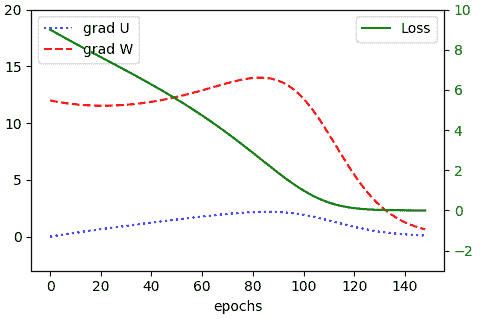

RNN 的损失：不中断的线表示损失，其中虚线表示训练过程中的权重梯度。

现在我们已经学习了时间反向传播，接下来我们讨论一下熟悉的梯度消失和梯度爆炸问题是如何影响它的。

# 梯度消失与梯度爆炸

然而，前面的示例存在一个问题。让我们使用更长的序列运行训练过程：

```py
x = np.array([[0, 0, 0, 0, 1, 0, 1, 0, 1, 0, 0, 0, 0, 0, 1, 0, 1, 0, 1, 0, 0, 0, 0, 0, 1, 0, 1, 0, 1, 0, 0, 0, 0, 0, 1, 0, 1, 0, 1, 0]])

y = np.array([12])

losses, gradients_u, gradients_w = train(x, y, epochs=150)
plot_training(losses, gradients_u, gradients_w)
```

输出如下：

```py
Sum of ones RNN from scratch
chapter07-rnn/simple_rnn.py:5: RuntimeWarning: overflow encountered in multiply
  return x * U + s * W
chapter07-rnn/simple_rnn.py:40: RuntimeWarning: invalid value encountered in multiply
  gU += np.sum(gS * x[:, k - 1])
chapter07-rnn/simple_rnn.py:41: RuntimeWarning: invalid value encountered in multiply
  gW += np.sum(gS * s[:, k - 1])
(nan, nan)
```

这些警告的原因是，最终的参数，`U` 和 `W`，变成了**不是一个数字**（**NaN**）。为了正确显示梯度，我们需要在`plot_training`函数中将梯度轴的尺度从`ax1.set_ylim(-3, 20)`改为`ax1.set_ylim(-3, 600)`，并将损失轴的尺度从`ax2.set_ylim(-3, 10)`改为`ax2.set_ylim(-3, 200)`。

现在，程序将生成以下新损失和梯度的图示：

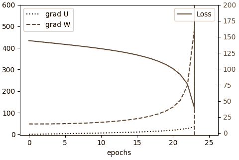

梯度爆炸场景中的参数和损失函数

在初始的训练周期中，梯度逐渐增大，类似于它们在较短序列中增加的方式。然而，当达到第 23 个周期时（确切的周期并不重要），梯度变得非常大，以至于超出了`float`变量的范围并变成了 NaN（如图中的跳跃所示）。这个问题称为梯度爆炸。我们可能会在常规的前馈神经网络（NN）中遇到梯度爆炸问题，但在循环神经网络（RNN）中尤为明显。为了理解为什么会这样，我们回顾一下在*时间反向传播*部分中定义的两个连续序列步骤的循环梯度传播链规则：

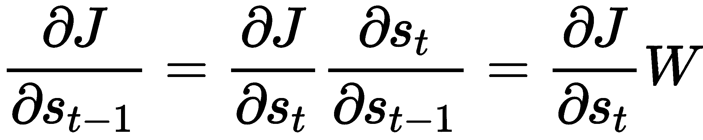

根据序列的长度，展开的 RNN 比常规网络可能更深。同时，RNN 的权重`W`在所有步骤中是共享的。因此，我们可以将这个公式推广到计算序列中两个非连续步骤之间的梯度。由于`W`是共享的，方程形成了几何级数：

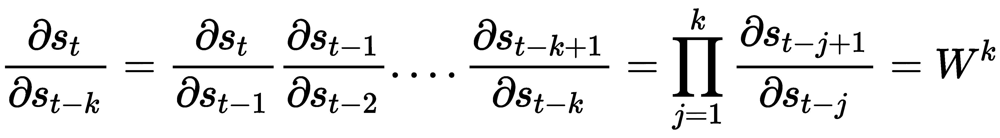

在我们简单的线性 RNN 中，如果*|W|* > `1`（梯度爆炸），梯度会呈指数增长，其中`W`是一个单一的标量权重，例如，50 个时间步长时，W=1.5 时，*W⁵⁰ ≈ 637621500*。如果*|W| <1*（梯度消失），梯度会呈指数衰减，例如，10 个时间步长时，W=0.6 时，*W²⁰ = 0.00097*。如果权重参数`W`是一个矩阵而非标量，那么这种梯度爆炸或梯度消失与`W`的最大特征值（*ρ*）（也称为谱半径）相关。如果*ρ* < `1`，则梯度会消失，而如果*ρ* > `1`，则梯度会爆炸。

梯度消失问题，我们在第一章《神经网络的基本原理》中首次提到，在 RNN 中有另一种更加微妙的影响。梯度会随着步数的增加呈指数衰减，直到变得极其微小，特别是在较早的状态中。实际上，它们会被来自更近期时间步的较大梯度所掩盖，导致网络无法保持这些较早状态的历史信息。这个问题更难以检测，因为训练仍然可以进行，网络也会产生有效的输出（不同于梯度爆炸）。它只是无法学习长期的依赖关系。

现在，我们已经熟悉了 RNN 的一些问题。这些知识对我们非常有用，因为在下一节中，我们将讨论如何借助一种特殊类型的 RNN 来解决这些问题。

# 引入长短期记忆

Hochreiter 和 Schmidhuber 广泛研究了梯度消失和梯度爆炸问题，并提出了一个叫做**长短期记忆**（**LSTM**， [`www.bioinf.jku.at/publications/older/2604.pdf`](https://www.bioinf.jku.at/publications/older/2604.pdf)）的解决方案。LSTM 可以通过特别设计的记忆单元处理长期依赖关系。事实上，它们工作得非常好，以至于目前大多数 RNN 在各种问题上的成功都归功于 LSTM 的使用。在本节中，我们将探索这个记忆单元是如何工作的，以及它是如何解决梯度消失问题的。

LSTM 的关键思想是单元状态 `c`*[t]*（除了隐藏的 RNN 状态 `h`*[t]*），在没有外部干扰时，只能明确写入或移除信息，使状态保持恒定。 单元状态只能通过特定的门进行修改，这些门是信息传递的一种方式。 这些门由 Sigmoid 函数和逐元素乘法组成。 由于 Sigmoid 仅输出介于 0 和 1 之间的值，乘法只能减少通过门传递的值。 典型的 LSTM 由三个门组成：遗忘门、输入门和输出门。 单元状态、输入和输出都是向量，因此 LSTM 可以在每个时间步骤中保存不同信息块的组合。

以下是 LSTM 单元的图示：

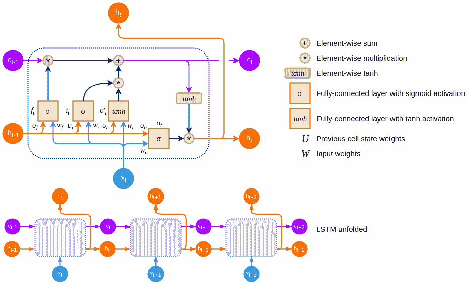

顶部：LSTM 单元；底部：展开的 LSTM 单元：灵感源于 [`colah.github.io/posts/2015-08-Understanding-LSTMs/`](http://colah.github.io/posts/2015-08-Understanding-LSTMs/)。

在我们继续之前，让我们介绍一些符号。 `x`*[t]*，`c`*[t]* 和 `h`*[t]* 是 LSTM 在时刻 `t` 的输入、单元记忆状态和输出（或隐藏状态）向量。 `c`*'[t]* 是候选单元状态向量（稍后详细介绍）。输入 `x`*[t]* 和上一个单元输出 `h`*[t-]* 通过完全连接的权重集 `W` 和 `U` 分别连接到每个门和候选单元向量。 `f`*[t]*，`i`*[t]* 和 `o`*[t]* 是 LSTM 单元的遗忘、输入和输出门。 这些门是具有 Sigmoid 激活的全连接层。

让我们从遗忘门 `f`*[t]* 开始。 正如其名称所示，它决定我们是否要擦除现有单元状态的部分内容。 它基于上一个单元的加权向量之和输出，`h`*[t-1]*，以及当前输入，`x`*[t]*：

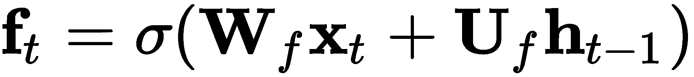

从前面的图表中，我们可以看到遗忘门在上一个状态向量 `c`*[t-1]* 的每个元素上应用元素级 Sigmoid 激活：`f`*[t]* `c`*[t-1]*。 再次注意，因为操作是元素级的，因此该向量的值被压缩到 [0, 1] 范围内。 输出为 0 将完全擦除特定 `c`*[t-1]* 单元块，输出为 1 则允许该单元块中的信息通过。 这意味着 LSTM 可以在其单元状态向量中去除不相关的信息。

遗忘门不是由 Hochreiter 最初提出的 LSTM 中的一部分。 相反，它是在*Learning to Forget: Continual Prediction with LSTM* ([`citeseerx.ist.psu.edu/viewdoc/download?doi=10.1.1.55.5709&rep=rep1&type=pdf`](http://citeseerx.ist.psu.edu/viewdoc/download?doi=10.1.1.55.5709&rep=rep1&type=pdf)) 中提出的。

输入门`i`*[t]*决定要将什么新信息添加到记忆单元中，这是一个多步过程。第一步决定是否添加任何信息。像遗忘门一样，它基于`h`*[t-1]*和`x`*[t]*来做决策：它通过 sigmoid 函数输出 0 或 1，表示候选状态向量的每个单元。输出为 0 意味着不会向该单元块的记忆中添加任何信息。因此，LSTM 可以在其单元状态向量中存储特定的信息：

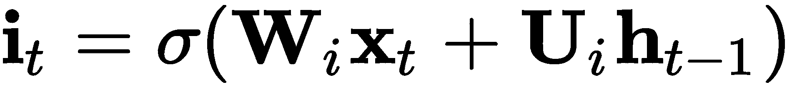

在下一步中，我们计算新的候选单元状态，`c`*'[t]*。它基于前一个输出`h`*[t-1]*和当前输入`x`*[t]*，并通过`tanh`函数进行转换：

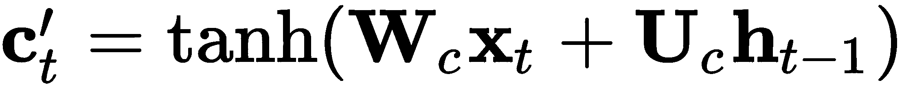

接下来，**c'[t]**与输入门的 sigmoid 输出通过逐元素相乘进行组合，![]。

总结一下，遗忘门和输入门分别决定了从先前和候选单元状态中忘记和包含哪些信息。新的单元状态*`cₜ`*的最终版本只是这两个组件的逐元素相加：

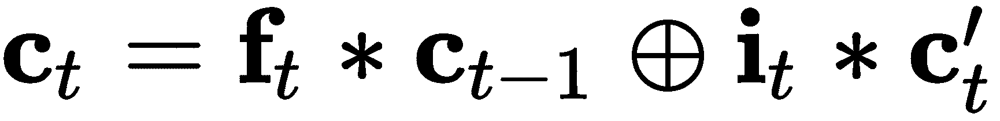

接下来，我们关注输出门，它决定总的单元输出是什么。它以`h`*[t-1]*和`x`*[t]*作为输入，并输出 0 或 1（通过 sigmoid 函数），用于每个单元记忆块。如之前所述，0 意味着该块不会输出任何信息，1 意味着该块可以作为单元的输出。因此，LSTM 可以从其单元状态向量中输出特定的块信息：

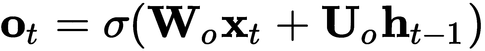

最后，LSTM 单元的输出通过`tanh`函数进行转换：

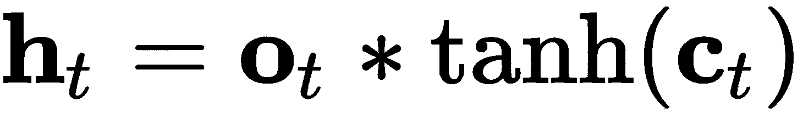

因为所有这些公式是可导的，我们可以将 LSTM 单元链在一起，就像我们将简单的 RNN 状态链在一起并通过时间反向传播训练网络一样。

那么，LSTM 是如何保护我们免受梯度消失的呢？我们从前向传播阶段开始。请注意，如果遗忘门为 1 且输入门为 0，则单元状态会在每一步中完全复制：![]。只有遗忘门才能完全擦除单元的记忆。因此，记忆可以在长时间内保持不变。另外，注意输入是一个`tanh`激活函数，它被添加到当前单元的记忆中。这意味着单元的记忆不会爆炸，并且相当稳定。

让我们通过一个例子来演示 LSTM 单元是如何展开的。为了简化问题，我们假设它具有一维（单标量值）输入、状态和输出向量。由于值是标量，我们在这个例子中不会使用向量符号：

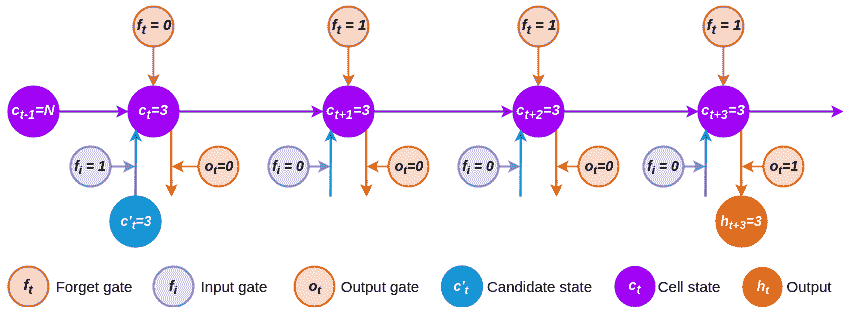

随时间展开 LSTM：灵感来自于 [`nikhilbuduma.com/2015/01/11/a-deep-dive-into-recurrent-neural-networks/`](http://nikhilbuduma.com/2015/01/11/a-deep-dive-into-recurrent-neural-networks/)。

过程如下：

1.  首先，我们有一个 3 的值作为候选状态。输入门设置为 *f[i] = 1*，而忘记门设置为 *f[t] = 0*。这意味着先前的状态 *c[t-1] = N* 被擦除，并被新的状态 ![] 替代。

1.  对于接下来的两个时间步骤，忘记门设置为 1，而输入门设置为 0。这样，所有信息在这两个步骤中都保持不变，因为输入门被设置为 0：![]。

1.  最后，输出门设置为 *o[t] = 1*，输出 3 并保持不变。我们已经成功演示了如何在多个步骤中存储内部状态。

接下来，让我们关注反向传播阶段。通过忘记门（`fₜ`）的帮助，单元状态 `cₜ` 可以减轻梯度消失/爆炸的问题。与常规的 RNN 一样，我们可以使用链式法则计算两个连续步骤的偏导数，![]。根据公式 ![]，不展开细节，其偏导数如下：

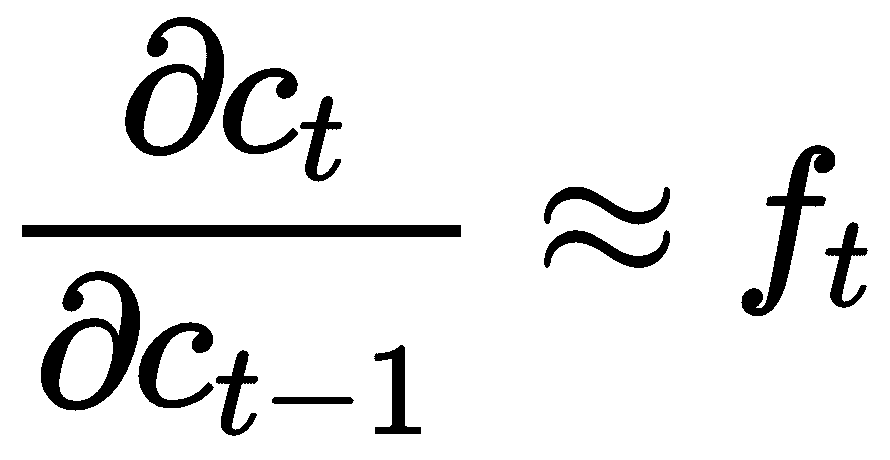

我们也可以将其推广到非连续步骤：

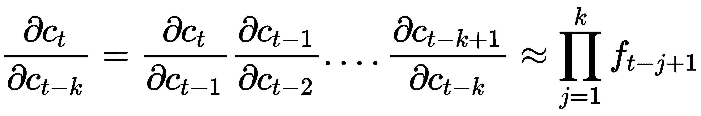

如果忘记门的值接近 1，梯度信息几乎可以不变地通过网络状态反向传播。这是因为 `fₜ` 使用了 sigmoid 激活，信息流仍然受到特定于 sigmoid 激活的梯度消失问题的影响（第一章，*神经网络的基本构件*）。但与常规 RNN 中的梯度不同，`fₜ` 在每个时间步都有不同的值。因此，这不是几何级数，梯度消失效应不那么明显。

我们可以像堆叠常规 RNN 一样堆叠 LSTM 单元，唯一的不同是步长 `t` 的单元状态在一个层级上作为该层级在步长 *t+1* 的单元状态的输入。以下图示展示了展开的堆叠 LSTM：

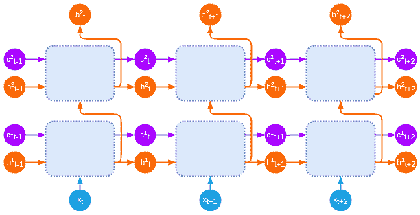

堆叠 LSTM

现在我们已经介绍了 LSTM，接下来让我们通过实现它来巩固我们的知识。

# 实现 LSTM

在这一部分，我们将使用 PyTorch 1.3.1 实现一个 LSTM 单元。首先，我们要注意，PyTorch 已经有一个 LSTM 实现，位于`torch.nn.LSTM`。但是，我们的目标是理解 LSTM 单元的工作原理，所以我们将从头开始实现自己的版本。该单元将是`torch.nn.Module`的子类，我们将把它作为更大模型的构建模块。本示例的源代码可以在[`github.com/PacktPublishing/Advanced-Deep-Learning-with-Python/tree/master/Chapter07/lstm_cell.py`](https://github.com/PacktPublishing/Advanced-Deep-Learning-with-Python/tree/master/Chapter07/lstm_cell.py)找到。让我们开始吧：

1.  首先，我们进行导入：

```py
import math
import typing

import torch
```

1.  接下来，我们将实现类和`__init__`方法：

```py
class LSTMCell(torch.nn.Module):

    def __init__(self, input_size: int, hidden_size: int):
        """
        :param input_size: input vector size
        :param hidden_size: cell state vector size
        """

        super(LSTMCell, self).__init__()
        self.input_size = input_size
        self.hidden_size = hidden_size

        # combine all gates in a single matrix multiplication
        self.x_fc = torch.nn.Linear(input_size, 4 * hidden_size)
        self.h_fc = torch.nn.Linear(hidden_size, 4 * hidden_size)

        self.reset_parameters()
```

为了理解全连接层`self.x_fc`和`self.h_fc`的作用，让我们回顾一下，候选细胞状态以及输入、遗忘和输出门都依赖于输入`x[`t`]`和前一个细胞输出`h[*t-1*]`的加权向量和。因此，我们不需要为每个细胞执行八个独立的![]和![]操作，而是可以将它们合并，做成两个大的全连接层`self.x_fc`和`self.h_fc`，每个层的输出大小为`4 * hidden_size`。当我们需要某个特定门的输出时，我们可以从这两个全连接层的任意一个张量输出中提取必要的切片（我们将在`forward`方法的实现中看到如何做到这一点）。

1.  让我们继续讨论`reset_parameters`方法，该方法使用 LSTM 特定的 Xavier 初始化器初始化网络的所有权重（如果你直接复制并粘贴此代码，可能需要检查缩进）：

```py
def reset_parameters(self):
    """Xavier initialization """
    size = math.sqrt(3.0 / self.hidden_size)
    for weight in self.parameters():
        weight.data.uniform_(-size, size)
```

1.  接下来，我们将开始实现`forward`方法，该方法包含我们在*介绍长短期记忆*部分中描述的所有 LSTM 执行逻辑。它接收当前时间步`t`的 mini-batch，以及一个包含时间步*t-1*时刻的细胞输出和细胞状态的元组作为输入：

```py
def forward(self,
            x_t: torch.Tensor,
            hidden: typing.Tuple[torch.Tensor, torch.Tensor] =      (None, None)) \
        -> typing.Tuple[torch.Tensor, torch.Tensor]:
    h_t_1, c_t_1 = hidden # t_1 is equivalent to t-1

    # in case of more than 2-dimensional input
    # flatten the tensor (similar to numpy.reshape)
    x_t = x_t.view(-1, x_t.size(1))
    h_t_1 = h_t_1.view(-1, h_t_1.size(1))
    c_t_1 = c_t_1.view(-1, c_t_1.size(1))
```

1.  我们将继续同时计算三个门和候选状态的激活。做法很简单，像这样：

```py
gates = self.x_fc(x_t) + self.h_fc(h_t_1)
```

1.  接下来，我们将为每个门分离输出：

```py
i_t, f_t, candidate_c_t, o_t = gates.chunk(4, 1)
```

1.  然后，我们将对它们应用`activation`函数：

```py
i_t, f_t, candidate_c_t, o_t = \
    i_t.sigmoid(), f_t.sigmoid(), candidate_c_t.tanh(), o_t.sigmoid()
```

1.  接下来，我们将计算新的细胞状态，`c[`t`]`：

```py
c_t = torch.mul(f_t, c_t_1) + torch.mul(i_t, candidate_c_t)
```

1.  最后，我们将计算细胞输出`ht`，并将其与新的细胞状态`cₜ`一起返回：

```py
h_t = torch.mul(o_t, torch.tanh(c_t))
return h_t, c_t
```

一旦我们有了 LSTM 单元，就可以将其应用于与常规 RNN 相同的任务——计算序列中 1 的数量。我们只会包含源代码中最相关的部分，但完整的示例可以在[`github.com/PacktPublishing/Advanced-Deep-Learning-with-Python/tree/master/Chapter07/lstm_gru_count_1s.py`](https://github.com/PacktPublishing/Advanced-Deep-Learning-with-Python/tree/master/Chapter07/lstm_gru_count_1s.py)中找到。这次，我们将使用一个包含 10,000 个二进制序列的完整训练集，每个序列的长度为 20（这些是随意设定的数字）。实现的前提与 RNN 示例类似：我们以递归的方式将二进制序列输入到 LSTM 中，单元输出作为单一标量值的预测 1 的数量（回归任务）。然而，我们的`LSTMCell`实现有两个限制：

+   它仅涵盖序列的单个步骤。

+   它输出单元状态和网络输出向量。这是一个回归任务，我们有一个单一的输出值，但单元状态和网络输出有更多维度。

为了解决这些问题，我们将实现一个自定义的`LSTMModel`类，它扩展了`LSTMCell`。它将整个序列的所有元素输入给`LSTMCell`实例，并处理单元状态和网络输出从序列的一个元素过渡到下一个元素的过程。

一旦最终输出产生，它将被传递给一个全连接层，转换为一个单一的标量值，表示网络预测的 1 的数量。以下是其实现：

```py
class LSTMModel(torch.nn.Module):
    def __init__(self, input_dim, hidden_size, output_dim):
        super(LSTMModel, self).__init__()
        self.hidden_size = hidden_size

        # Our own LSTM implementation
        self.lstm = LSTMCell(input_dim, hidden_size)

        # Fully connected output layer
        self.fc = torch.nn.Linear(hidden_size, output_dim)

    def forward(self, x):
        # Start with empty network output and cell state to initialize the sequence
        c_t = torch.zeros((x.size(0), self.hidden_size)).to(x.device)
        h_t = torch.zeros((x.size(0), self.hidden_size)).to(x.device)

        # Iterate over all sequence elements across all sequences of the mini-batch
        for seq in range(x.size(1)):
            h_t, c_t = self.lstm(x[:, seq, :], (h_t, c_t))

        # Final output layer
        return self.fc(h_t)
```

现在，我们将直接跳到训练/测试设置阶段（请记住，这只是完整源代码的一部分）：

1.  首先，我们将生成训练和测试数据集。`generate_dataset`函数返回一个`torch.utils.data.TensorDataset`实例。它包含`TRAINING_SAMPLES = 10000`个长度为`SEQUENCE_LENGTH = 20`的二进制序列的二维张量，以及每个序列中 1 的数量的标量值标签：

```py
train = generate_dataset(SEQUENCE_LENGTH, TRAINING_SAMPLES)
train_loader = torch.utils.data.DataLoader(train, batch_size=BATCH_SIZE, shuffle=True)

test = generate_dataset(SEQUENCE_LENGTH, TEST_SAMPLES)
test_loader = torch.utils.data.DataLoader(test, batch_size=BATCH_SIZE, shuffle=True)
```

1.  我们将使用`HIDDEN_UNITS = 20`来实例化模型。模型接受一个输入（每个序列元素），并输出一个值（1 的数量）：

```py
model = LSTMModel(input_size=1, hidden_size=HIDDEN_UNITS, output_size=1)
```

1.  接下来，我们将实例化`MSELoss`函数（因为这是回归问题）和 Adam 优化器：

```py
loss_function = torch.nn.MSELoss()
optimizer = torch.optim.Adam(model.parameters())
```

1.  最后，我们可以运行`EPOCHS = 10`的训练/测试周期。`train_model`和`test_model`函数与我们在第二章《理解卷积网络》节中实现的函数相同：

```py
for epoch in range(EPOCHS):
    print('Epoch {}/{}'.format(epoch + 1, EPOCHS))

    train_model(model, loss_function, optimizer, train_loader)
    test_model(model, loss_function, test_loader)
```

如果我们运行这个示例，网络将在 5 到 6 个 epoch 内达到 100%的测试准确率。

既然我们已经学习了 LSTM，现在让我们将注意力转向门控循环单元（GRU）。这是一种尝试复制 LSTM 特性但结构更简化的另一种循环块。

# 介绍门控循环单元

**门控循环单元（GRU）**是一种递归单元块，首次提出于 2014 年（*使用 RNN 编码器-解码器进行统计机器翻译的学习短语表示*，[`arxiv.org/abs/1406.1078`](https://arxiv.org/abs/1406.1078) 和 *门控递归神经网络在序列建模中的经验评估*，[`arxiv.org/abs/1412.3555`](https://arxiv.org/abs/1412.3555)），它是对 LSTM 的改进。GRU 单元通常具有与 LSTM 相似或更好的性能，但它以更少的参数和操作实现：

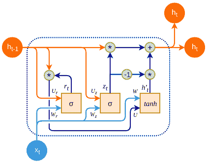

一个 GRU 单元

类似于 *经典* RNN，GRU 单元有一个隐藏状态，`h[t]`。你可以将其视为 LSTM 的隐藏状态和单元状态的组合。GRU 单元有两个门：

+   一个更新门，`z[t]`，它结合了输入门和忘记门。它根据网络输入 `x[t]` 和前一个单元隐藏状态 `h[t-1]` 来决定丢弃哪些信息，以及替换哪些新信息。通过结合这两个门，我们可以确保单元忘记信息，但只有在我们打算用新信息替代时：

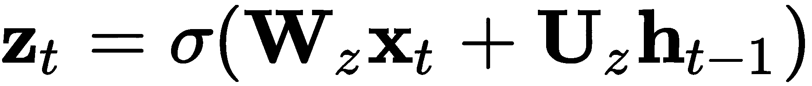

+   一个重置门，`r[t]`，它利用前一个单元状态 `h[t-1]` 和网络输入 `x[t]` 来决定通过多少前一状态：

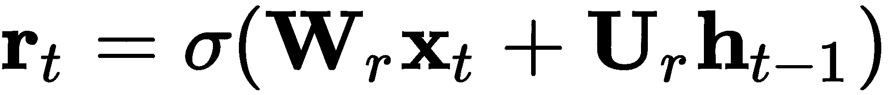

接下来，我们有候选状态，`h`'[t]：

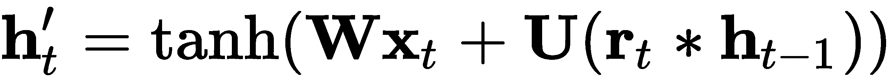

最后，GRU 在时间 `t` 的输出，`h[t]`，是前一输出 `h`[t−1] 和候选输出 `h`'[t] 之间的逐元素和：

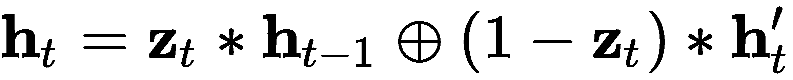

由于更新门允许我们同时忘记和存储数据，因此它直接作用于先前的输出，*`hₜ`*[−1]，并作用于候选输出，`h`'[t]。

# 实现 GRU

在本节中，我们将通过遵循 *实现 LSTM* 部分的蓝图，使用 PyTorch 1.3.1 实现 GRU 单元。让我们开始吧：

1.  首先，我们将进行导入：

```py
import math
import torch
```

1.  接下来，我们将编写类定义和 `init` 方法。在 LSTM 中，我们能够为所有门创建共享的全连接层，因为每个门都需要相同的输入组合：`x[`t`]` 和 `h[*t-1*]`。GRU 的门使用不同的输入，因此我们将为每个 GRU 门创建单独的全连接操作：

```py
class GRUCell(torch.nn.Module):

    def __init__(self, input_size: int, hidden_size: int):
        """
        :param input_size: input vector size
        :param hidden_size: cell state vector size
        """

        super(GRUCell, self).__init__()
        self.input_size = input_size
        self.hidden_size = hidden_size

        # x to reset gate r
        self.x_r_fc = torch.nn.Linear(input_size, hidden_size)

        # x to update gate z
        self.x_z_fc = torch.nn.Linear(input_size, hidden_size)

        # x to candidate state h'(t)
        self.x_h_fc = torch.nn.Linear(input_size, hidden_size)

        # network output/state h(t-1) to reset gate r
        self.h_r_fc = torch.nn.Linear(hidden_size, hidden_size)

        # network output/state h(t-1) to update gate z
        self.h_z_fc = torch.nn.Linear(hidden_size, hidden_size)

        # network state h(t-1) passed through the reset gate r towards candidate state h(t)
        self.hr_h_fc = torch.nn.Linear(hidden_size, hidden_size)
```

我们将省略 `reset_parameters` 的定义，因为它与 `LSTMCell` 中相同。

1.  然后，我们将按照 *门控循环单元* 部分中描述的步骤，使用单元实现 `forward` 方法。该方法将当前输入向量，`x[t]`，和先前的单元状态/输出，`h[t-1]`，作为输入。首先，我们将计算忘记门和更新门，类似于我们在 LSTM 单元中计算门的方式：

```py
def forward(self,
            x_t: torch.Tensor,
            h_t_1: torch.Tensor = None) \
        -> torch.Tensor:

    # compute update gate vector
    z_t = torch.sigmoid(self.x_z_fc(x_t) + self.h_z_fc(h_t_1))

    # compute reset gate vector
    r_t = torch.sigmoid(self.x_r_fc(x_t) + self.h_r_fc(h_t_1))
```

1.  接下来，我们将计算新的候选状态/输出，它使用重置门：

```py
candidate_h_t = torch.tanh(self.x_h_fc(x_t) + self.hr_h_fc(torch.mul(r_t, h_t_1)))
```

1.  最后，我们将根据候选状态和更新门计算新的输出：

```py
h_t = torch.mul(z_t, h_t_1) + torch.mul(1 - z_t, candidate_h_t)
```

我们可以像实现 LSTM 一样，使用 GRU 单元来实现计数任务。为了避免重复，我们在此不包括实现，但可以在[`github.com/PacktPublishing/Advanced-Deep-Learning-with-Python/tree/master/Chapter07/lstm_gru_count_1s.py`](https://github.com/PacktPublishing/Advanced-Deep-Learning-with-Python/tree/master/Chapter07/lstm_gru_count_1s.py)找到相应的代码。

这也结束了我们关于各种 RNN 类型的讨论。接下来，我们将通过实现一个文本情感分析的例子来运用这些知识。

# 实现文本分类

让我们回顾一下目前为止的内容。我们首先使用`numpy`实现了一个 RNN。接着，我们继续使用原始的 PyTorch 操作实现了一个 LSTM。我们将通过训练默认的 PyTorch 1.3.1 LSTM 实现来解决文本分类问题，从而结束这一部分的内容。这个例子还需要`torchtext` 0.4.0 包。文本分类（或标记）是指根据内容为文本分配类别（或标签）的任务。文本分类任务包括垃圾邮件检测、主题标签和情感分析。这类问题是一个*多对一*关系的例子，我们在*RNN 简介*部分有过定义。

在本节中，我们将在大型电影评论数据集上实现情感分析示例（[`ai.stanford.edu/~amaas/data/sentiment/`](http://ai.stanford.edu/~amaas/data/sentiment/)），该数据集包含 25,000 个训练评论和 25,000 个测试评论，均来自流行电影。每个评论都有一个二进制标签，指示其是正面还是负面。除了 PyTorch，我们还将使用`torchtext`包（[`torchtext.readthedocs.io/`](https://torchtext.readthedocs.io/)）。它包含数据处理工具和自然语言处理的流行数据集。你还需要安装`spacy`开源软件库（[`spacy.io`](https://spacy.io)）以进行高级 NLP 处理，我们将使用它来对数据集进行分词。

情感分析算法如下图所示：

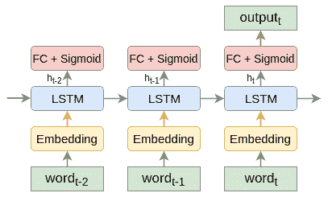

使用词嵌入和 LSTM 进行情感分析

让我们描述算法的步骤（这些步骤适用于任何文本分类算法）：

1.  序列中的每个单词都用其嵌入向量进行替换（第六章，*语言建模*）。这些嵌入可以通过 word2vec、fastText、GloVe 等方法生成。

1.  词嵌入作为输入提供给 LSTM 单元。

1.  单元格输出，`h`*[t]*，作为输入传递给一个具有单一输出单元的全连接层。该单元使用 sigmoid 激活函数，表示评论为正面（1）或负面（0）的概率。如果问题是多项式的（而非二分类问题），我们可以用 softmax 替换 sigmoid。

1.  序列的最后一个元素的网络输出被视为整个序列的结果。

现在我们已经概述了算法，让我们开始实现它。我们只会包括代码中的有趣部分，完整的实现可以在 [`github.com/PacktPublishing/Advanced-Deep-Learning-with-Python/tree/master/Chapter07/sentiment_analysis.py`](https://github.com/PacktPublishing/Advanced-Deep-Learning-with-Python/tree/master/Chapter07/sentiment_analysis.py)[. ](https://github.com/PacktPublishing/Advanced-Deep-Learning-with-Python/tree/master/Chapter07/sentiment_analysis.py)

这个示例部分基于 [`github.com/bentrevett/pytorch-sentiment-analysis`](https://github.com/bentrevett/pytorch-sentiment-analysis)。

让我们开始吧：

1.  首先，我们将添加导入：

```py
import torch
import torchtext
```

1.  接下来，我们将实例化一个 `torchtext.data.Field` 对象：

```py
TEXT = torchtext.data.Field(
    tokenize='spacy',  # use SpaCy tokenizer
    lower=True,  # convert all letters to lower case
    include_lengths=True,  # include the length of the movie review
)
```

该对象声明了一个文本处理流水线，从原始文本开始，输出文本的张量表示。更具体地说，它使用 `spacy` 分词器，将所有字母转换为小写，并包括每个电影评论的单词数（长度）。

1.  然后，我们将对标签（正面或负面）做同样的处理：

```py
LABEL = torchtext.data.LabelField(dtype=torch.float)
```

1.  接下来，我们将实例化训练和测试数据集的拆分：

```py
train, test = torchtext.datasets.IMDB.splits(TEXT, LABEL)
```

电影评论数据集已包含在 `torchtext` 中，我们无需做任何额外的工作。`splits` 方法将 `TEXT` 和 `LABEL` 字段作为参数。这样，指定的流水线将应用于选定的数据集。

1.  接着，我们将实例化词汇表：

```py
TEXT.build_vocab(train, vectors=torchtext.vocab.GloVe(name='6B', dim=100))
LABEL.build_vocab(train)
```

词汇表提供了一个将单词转换为数字表示的机制。在此情况下，`TEXT` 字段的数字表示为预训练的 100d GloVe 向量。另一方面，数据集中的标签具有 `pos` 或 `neg` 的字符串值。词汇表在这里的作用是为这两个标签分配数字（0 和 1）。

1.  接下来，我们将为训练和测试数据集定义迭代器，其中 `device` 代表 GPU 或 CPU。每次调用时，迭代器将返回一个小批次：

```py
train_iter, test_iter = torchtext.data.BucketIterator.splits(
    (train, test), sort_within_batch=True, batch_size=64, device=device)
```

1.  接下来，我们将实现并实例化 `LSTMModel` 类。这是程序的核心，执行我们在本节开头的图表中定义的算法步骤：

```py
class LSTMModel(torch.nn.Module):
    def __init__(self, vocab_size, embedding_size, hidden_size, output_size, pad_idx):
        super().__init__()

        # Embedding field
        self.embedding=torch.nn.Embedding(num_embeddings=vocab_size,
        embedding_dim=embedding_size,padding_idx=pad_idx)

        # LSTM cell
        self.rnn = torch.nn.LSTM(input_size=embedding_size,
        hidden_size=hidden_size)

        # Fully connected output
        self.fc = torch.nn.Linear(hidden_size, output_size)

    def forward(self, text_sequence, text_lengths):
        # Extract embedding vectors
        embeddings = self.embedding(text_sequence)

        # Pad the sequences to equal length
        packed_sequence =torch.nn.utils.rnn.pack_padded_sequence
        (embeddings, text_lengths)

        packed_output, (hidden, cell) = self.rnn(packed_sequence)

        return self.fc(hidden)

model = LSTMModel(vocab_size=len(TEXT.vocab),
                  embedding_size=EMBEDDING_SIZE,
                  hidden_size=HIDDEN_SIZE,
                  output_size=1,
                  pad_idx=TEXT.vocab.stoi[TEXT.pad_token])
```

`LSTMModel` 处理一个具有不同长度的序列小批量（在这个例子中是电影评论）。然而，mini-batch 是一个张量，它为每个序列分配了等长的切片。因此，所有序列都会预先使用特殊符号进行填充，以达到批次中最长序列的长度。`torch.nn.Embedding` 构造函数中的 `padding_idx` 参数表示词汇表中填充符号的索引。但是，使用填充序列会导致对填充部分进行不必要的计算。为了避免这一点，模型的前向传播接受 `text` mini-batch 和每个序列的 `text_lengths` 作为参数。它们会被传递给 `pack_padded_sequence` 函数，该函数将它们转换为 `packed_sequence` 对象。我们之所以这样做，是因为 `self.rnn` 对象（即 `torch.nn.LSTM` 的实例）有一个专门处理打包序列的例程，从而优化了填充部分的计算。

1.  接下来，我们将 GloVe 词嵌入向量复制到模型的嵌入层：

```py
model.embedding.weight.data.copy_(TEXT.vocab.vectors)
```

1.  然后，我们将把填充和未知标记的嵌入项设置为零，以避免它们对传播产生影响：

```py
model.embedding.weight.data[TEXT.vocab.stoi[TEXT.unk_token]] = torch.zeros(EMBEDDING_SIZE)
model.embedding.weight.data[TEXT.vocab.stoi[TEXT.pad_token]] = torch.zeros(EMBEDDING_SIZE)
```

1.  最后，我们可以运行以下代码来执行整个过程（`train_model` 和 `test_model` 函数与之前相同）：

```py
optimizer = torch.optim.Adam(model.parameters())
loss_function = torch.nn.BCEWithLogitsLoss().to(device)

model = model.to(device)

for epoch in range(5):
    print(f"Epoch {epoch + 1}/5")
    train_model(model, loss_function, optimizer, train_iter)
    test_model(model, loss_function, test_iter)
```

如果一切按预期工作，模型将达到大约 88% 的测试准确率。

# 总结

在本章中，我们讨论了 RNN。首先，我们从 RNN 和时间反向传播理论开始。然后，我们从头实现了一个 RNN，以巩固我们对该主题的知识。接下来，我们使用相同的模式，逐步深入到更复杂的 LSTM 和 GRU 单元：先进行理论解释，再进行 PyTorch 实现。最后，我们将第六章《语言建模》中的知识与本章的新内容结合，完成了一个功能齐全的情感分析任务实现。

在下一章中，我们将讨论 seq2seq 模型及其变种——序列处理中的一个令人兴奋的新发展。
