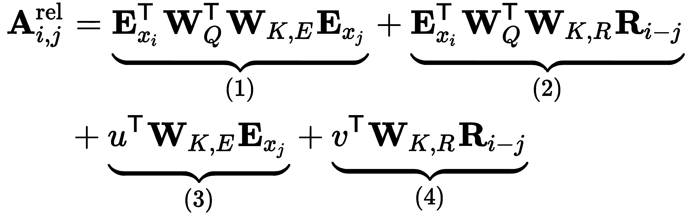
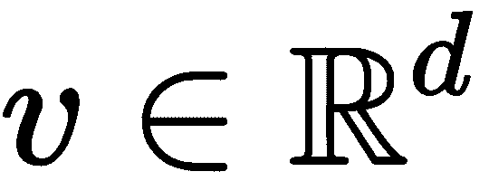
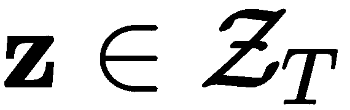
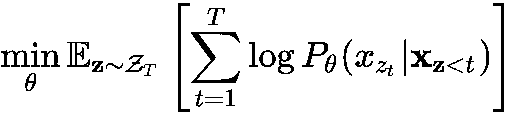
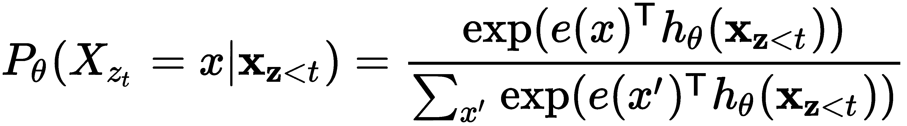

# 第八章：序列到序列模型与注意力机制

在第七章，*理解递归网络*中，我们概述了几种类型的递归模型，取决于输入输出的组合方式。其中之一是**间接多对多**或**序列到序列**（**seq2seq**），其中输入序列被转化为另一个不同的输出序列，输出序列不一定与输入序列的长度相同。机器翻译是最常见的 seq2seq 任务类型。输入序列是一个语言中的句子单词，输出序列是相同句子的翻译，转换为另一种语言。例如，我们可以将英语序列**tourist attraction**翻译为德语**touristenattraktion**。输出句子不仅长度不同，而且输入和输出序列的元素之间没有直接对应关系。特别地，一个输出元素可能对应输入元素的两个组合。

使用单一神经网络实现的机器翻译称为**神经机器翻译**（**NMT**）。其他类型的间接多对多任务包括语音识别，其中我们将音频输入的不同时间帧转化为文本转录；问答聊天机器人，其中输入序列是文本问题的单词，输出序列是该问题的答案；以及文本摘要，其中输入是文本文档，输出是该文档内容的简短总结。

在本章中，我们将介绍注意力机制——一种用于 seq2seq 任务的新型算法。它允许直接访问输入序列中的任何元素。这不同于**递归神经网络**（**RNN**），后者将整个序列总结为一个隐藏状态向量，并优先处理最近的序列元素，而忽略较早的元素。

本章将涵盖以下主题：

+   介绍 seq2seq 模型

+   带注意力机制的 Seq2seq

+   理解变换器（transformers）

+   变换器语言模型：

    +   来自变换器的双向编码器表示

    +   Transformer-XL

    +   XLNet

# 介绍 seq2seq 模型

Seq2seq，或称编码器-解码器（参见*神经网络的序列到序列学习*，[`arxiv.org/abs/1409.3215`](https://arxiv.org/abs/1409.3215)），模型使用 RNN 的方式，特别适合解决输入和输出之间存在间接多对多关系的任务。类似的模型也在另一篇开创性论文中提出，*使用 RNN 编码器-解码器学习短语表示用于统计机器翻译*（更多信息请访问[`arxiv.org/abs/1406.1078`](https://arxiv.org/abs/1406.1078)）。以下是 seq2seq 模型的示意图。输入序列[`A`, `B`, `C`, **<EOS>**]被解码为输出序列[`W`, `X`, `Y`, `Z`, **<EOS>**]：


一个由[`arxiv.org/abs/1409.3215`](https://arxiv.org/abs/1409.3215)提供的 seq2seq 模型案例

该模型由两部分组成：编码器和解码器。下面是推理部分的工作方式：

+   编码器是一个 RNN。原始论文使用的是 LSTM，但 GRU 或其他类型的 RNN 也可以使用。单独来看，编码器按常规方式工作——它逐步读取输入序列，并在每步后更新其内部状态。当编码器读取到一个特殊的**<EOS>**（序列结束）符号时，它就停止读取输入序列。如果我们假设使用的是文本序列，则在每一步时我们会使用词嵌入向量作为编码器的输入，而**<EOS>**符号表示句子的结束。编码器的输出被丢弃，在 seq2seq 模型中没有作用，因为我们只关注隐藏的编码器状态。

+   一旦编码器完成，我们会向解码器发送信号，让它通过特殊的**<GO>**输入信号开始生成输出序列。编码器同样是一个 RNN（LSTM 或 GRU）。编码器和解码器之间的联系是最新的编码器内部状态向量`h[`t`]`（也称为**思维向量**），它作为递归关系在第一个解码器步骤中被送入。解码器在第*t+1*步的输出*y[t+1]*是输出序列中的一个元素。我们会将其作为第*t+2*步的输入，然后生成新的输出，依此类推（这种类型的模型被称为**自回归**）。对于文本序列，解码器输出是对词汇表中所有词的 softmax。在每一步中，我们会选择概率最高的词，并将其作为输入送入下一步。一旦**<EOS>**成为最可能的符号，解码过程就结束了。

模型的训练是有监督的，模型需要知道输入序列及其对应的目标输出序列（例如，同一文本的多种语言）。我们将输入序列送入解码器，生成思维向量`h[`t`]`，并用它来启动解码器的输出序列生成。然而，解码器采用一种叫做**教师强制**（teacher forcing）的方法——在第`t`步时，解码器的输入不是第*t-1*步的解码器输出。而是第`t`步的输入始终是目标序列第*t-1*步的正确字符。例如，假设目标序列在第`t`步时的正确内容为[`W`，`X`，`Y`]，但当前解码器生成的输出序列为[`W`，`X`，`Z`]。使用教师强制时，第*t+1*步的解码器输入将是`Y`，而不是`Z`。换句话说，解码器学会根据目标值[...，t]来生成目标值[t+1，...]。我们可以这样理解：解码器的输入是目标序列，而它的输出（目标值）是相同的序列，只不过右移了一个位置。

总结来说，seq2seq 模型通过将输入序列编码为固定长度的状态向量，然后利用该向量作为基础生成输出序列，解决了输入/输出序列长度变化的问题。我们可以将其形式化为，模型尝试最大化以下概率：


这等价于以下内容：


让我们更详细地看一下这个公式的各个元素：

+   是条件概率，其中是长度为`T`的输入序列，是长度为*T'*的输出序列。

+   元素`v`是输入序列的固定长度编码（思想向量）。

+   是给定前置单词`y`和向量`v`时，输出词汇*y[T']*的概率。

原始的 seq2seq 论文介绍了一些*技巧*来增强模型的训练和性能：

+   编码器和解码器是两个独立的 LSTM。在 NMT 的情况下，这使得可以使用相同的编码器训练不同的解码器。

+   论文作者的实验表明，堆叠的 LSTM 比单层 LSTM 效果更好。

+   输入序列反向馈送给解码器。例如，**ABC** -> **WXYZ**会变成**CBA** -> **WXYZ**。目前没有明确的解释说明为什么这种方法有效，但作者分享了他们的直觉：由于这是一个逐步生成的模型，如果序列是正常顺序，那么源句子中的每个单词都会远离输出句子中相应的单词。如果我们反转输入序列，输入/输出单词之间的平均距离不会改变，但第一个输入单词将非常接近第一个输出单词。这将帮助模型在输入和输出序列之间建立更好的*沟通*。

+   除了**<EOS>**和**<GO>**，模型还使用以下两个特殊符号（我们已经在第七章的*实现文本分类*部分中遇到过它们，*理解递归网络*）：

    +   **<UNK>**—**未知**：用于替换稀有词汇，以避免词汇表过大。

    +   **<PAD>**：出于性能考虑，我们必须使用固定长度的序列来训练模型。然而，这与实际训练数据相矛盾，因为这些序列可能有任意长度。为了解决这个问题，较短的序列会用特殊的< PAD >符号填充。

现在我们已经介绍了基本的 seq2seq 模型架构，接下来我们将学习如何用注意力机制扩展它。

# 带注意力机制的 Seq2seq

解码器必须仅基于思维向量生成整个输出序列。为了实现这一点，思维向量必须编码输入序列的所有信息；然而，编码器是一个 RNN，我们可以预期它的隐藏状态会比最早的序列元素携带更多关于最新序列元素的信息。使用 LSTM 单元并反转输入有一定帮助，但不能完全防止这种情况。因此，思维向量成为了某种瓶颈。结果，seq2seq 模型在短句子上表现良好，但对于更长的句子性能会下降。

# 巴赫达瑙注意力机制

我们可以通过借助**注意力机制**（详见《[神经机器翻译：通过联合学习对齐与翻译](https://arxiv.org/abs/1409.0473)》），这是 seq2seq 模型的一个扩展，来解决这个问题，它提供了一种方式，让解码器不仅能使用最后一个编码器隐藏状态，而是能与所有编码器隐藏状态一起工作。

本节中的注意力机制称为巴赫达瑙注意力机制（Bahdanau attention），以原始论文的作者命名。

除了能够解决瓶颈问题，注意力机制还有一些其他的优势。首先，立即访问所有之前的状态有助于防止梯度消失问题。它还允许结果的某些可解释性，因为我们可以看到解码器在处理输入时集中注意的部分。

以下图示展示了注意力机制是如何工作的：


注意力机制

不用担心——它看起来比实际复杂。我们将从上到下逐步解释这个图示：注意力机制通过在编码器和解码器之间插入一个额外的**上下文向量** `c`*[t]* 来工作。在时间 `t` 时，隐藏的解码器状态 `s`*[t]* 不仅是步骤 *t-1* 的隐藏状态和解码器输出的函数，还包括上下文向量 `c`*[t]*。


每个解码器步骤都有一个独特的上下文向量，而一个解码器步骤的上下文向量仅仅是所有编码器隐藏状态的**加权和**。通过这种方式，编码器可以在每个输出步骤 `t` 访问所有输入序列的状态，这就不再需要像常规的 seq2seq 模型那样将源序列的所有信息编码成一个固定长度的向量。


让我们更详细地讨论这个公式：

+   `c`*[t]* 是解码器输出步骤 `t`（从 *T'* 总输出中）的上下文向量。

+   `h`*[i]* 是编码器步骤 `i`（从 `T` 个总输入步骤中）的隐藏状态。

+   *α[t,i]* 是与 `hᵢ` 相关的标量权重，在当前解码器步骤 `t` 的上下文中。

请注意，*α[t,i]* 对于编码器和解码器步骤是唯一的——也就是说，输入序列的状态将在不同的输出步骤中具有不同的权重。例如，如果输入和输出序列的长度为 10，则权重将由一个 10 × 10 的矩阵表示，总共有 100 个权重。这意味着注意力机制将根据当前输出序列的状态，将解码器的注意力集中在输入序列的不同部分。如果 *α**[t,i]* 较大，则解码器会在步骤 `t` 时非常关注 `h`*[i]*。

但我们如何计算权重 *α**[t,i]* 呢？首先，我们应该提到，解码器在步骤 `t` 时，所有 *α**[t,i]* 的总和为 1。我们可以通过在注意力机制上应用 softmax 操作来实现这一点：


这里，*e[t,k]* 是一个对齐模型，表示输入序列中位置 `k` 附近的元素与输出序列中位置 `t` 的匹配（或对齐）程度。这个得分（由权重 *α**[t,i]* 表示）基于先前的解码器状态 `s`*[t-1]*（我们使用 `s`*[t-1]*，因为我们还没有计算 `s`*[t]*），以及编码器状态 `h`*[i]*：


这里，`a`（而不是 alpha）是一个可微分的函数，经过反向传播训练，和系统的其他部分一起学习。满足这些要求的函数有很多，但论文的作者选择了所谓的 **加性注意力**，它通过加法将 `s`*[t-1]* 和 `h`*[i]* 结合起来。它有两种变体：


在第一个公式中，`W` 是一个权重矩阵，应用于拼接后的向量 `s`*[t-1]* 和 `h[`i`]`，而 `v` 是一个权重向量。第二个公式类似，但这一次我们有了独立的全连接层（权重矩阵 `W`*[1]* 和 `W`*[2]*），并且我们对 `s`*[t-1]* 和 `h`*[i]* 进行了求和。在这两种情况下，对齐模型可以表示为一个简单的前馈网络，包含一个隐藏层。

现在我们知道了 `c`*[t]* 和 *α**[t,i]* 的公式，让我们将后者代入前者：


总结一下，下面是按步骤列出的注意力算法：

1.  将输入序列传给编码器，并计算隐藏状态集 ![]。

1.  计算对齐分数 ![]，该分数使用来自前一步的解码器状态 `s`*[t-1]*。如果 *t = 1*，我们将使用最后的编码器状态 `h`*[T]* 作为初始隐藏状态。

1.  计算权重 ![]。

1.  计算上下文向量 ![]。

1.  基于拼接后的向量`s`*[t-1]*和`c`*[t]*以及前一时刻的解码器输出*y[t-1]*，计算隐藏状态![]。此时，我们可以计算最终输出`yₜ`。在需要分类下一个词的情况下，我们将使用 softmax 输出![]，其中`W`*[y]*是一个权重矩阵。

1.  重复步骤 2 到 6 直到序列结束。

接下来，我们将介绍一个稍微改进的注意力机制，称为 Luong 注意力。

# Luong 注意力

**Luong 注意力**（参见[《基于注意力的神经机器翻译的有效方法》](https://arxiv.org/abs/1508.04025)）在 Bahdanau 注意力上引入了几个改进。最显著的变化是对齐分数`eₜ`依赖于解码器隐藏状态`sₜ`，而不是 Bahdanau 注意力中的*s[t-1]*。为了更好地理解这一点，我们来比较这两种算法：


左侧：Bahdanau 注意力；右侧：Luong 注意力

让我们逐步执行 Luong 注意力的过程：

1.  将输入序列输入到编码器，并计算编码器隐藏状态集![]。

1.  基于前一时刻的解码器隐藏状态`s`*[t-1]*和前一时刻的解码器输出*y[t-1]*（但不是上下文向量），计算解码器隐藏状态![]。

1.  计算对齐分数![]，它使用当前步骤的解码器状态`s`*[t]*。除了加法注意力，Luong 注意力的论文还提出了两种**乘法注意力**：

    +   ![]: 基本的点积没有任何参数。在这种情况下，向量`s`和`h`需要具有相同的大小。

    +   ![]: 这里，`W`*[m]*是注意力层的可训练权重矩阵。

向量的乘积作为对齐分数度量具有直观的解释——正如我们在第一章《神经网络基础》一节中提到的，点积作为向量间相似度的度量。因此，如果向量相似（即对齐），乘积的结果将是一个大值，注意力将集中在当前的*t,i*关系上。

1.  计算权重 。

1.  计算上下文向量 。

1.  基于拼接后的向量`c`*[t]*和`s`*[t]*，计算向量 。此时，我们可以计算最终输出`yₜ`。在分类的情况下，我们将使用 softmax ，其中`W`*[y]*是一个权重矩阵。

1.  重复步骤 2-7 直到序列结束。

接下来，让我们讨论一些更多的注意力变体。我们将从**硬注意力**和**软注意力**开始，这与我们计算上下文向量 *`cₜ`* 的方式有关。到目前为止，我们描述了软注意力，其中 *`cₜ`* 是输入序列所有隐藏状态的加权和。在硬注意力中，我们仍然计算权重 *α*[t,i]*，但只选择具有最大相关权重 *α*[t,imax]* 的隐藏状态 *`h[imax]`*。然后，选定的状态 *`h[imax]`* 作为上下文向量。起初，硬注意力似乎有点违反直觉——毕竟为了使解码器能够访问所有输入状态，为什么再次限制到单个状态？然而，硬注意力最初是在图像识别任务的背景下引入的，在这些任务中，输入序列表示同一图像的不同区域。在这种情况下，选择多个区域或单个区域更有意义。与软注意力不同，硬注意力是一个随机过程，是不可微分的。因此，反向阶段使用一些技巧来工作（这超出了本书的范围）。

**本地注意力**代表了软注意力和硬注意力之间的一种折衷。而这些机制要么考虑所有输入隐藏向量（全局），要么只考虑单个输入向量，本地注意力则会取一个窗口向量，包围给定的输入序列位置，然后只在此窗口上应用软注意力。但是我们如何确定窗口的中心 `pₜ`（称为**对齐位置**），基于当前输出步骤 `t`？最简单的方式是假设源序列和目标序列大致单调对齐，即设定 *p[t] = t*，这是因为输入和输出序列位置相关联的逻辑。

接下来，我们将通过介绍注意力机制的一般形式来总结我们到目前为止所学到的内容。

# 一般注意力

尽管我们在 NMT 的背景下讨论了注意力机制，但它是一种通用的深度学习技术，可应用于任何序列到序列的任务。让我们假设我们正在使用硬注意力。在这种情况下，我们可以将向量 *`s[t-1]`* 视为针对键-值对数据库执行的**查询**，其中**键**是向量，隐藏状态 *`hᵢ`* 是 **值**。这些通常缩写为 `Q`、`K` 和 `V`，您可以将它们视为向量矩阵。Luong 和 Bahdanau 注意力的键 `Q` 和值 `V` 是相同的向量——也就是说，这些注意力模型更像是 `Q`/`V`，而不是 `Q`/`K`/`V`。一般的注意力机制使用了所有三个组件。

下图说明了这种新的一般注意力：


一般注意力

当我们对数据库执行查询（`q` *=* `s`*[t-1]*）时，我们将收到一个单一的匹配项——具有最大权重*α**[t,imax]*的键`k`*[imax]*。隐藏在这个键背后的是向量`v`*[imax] = *`h`*[imax]*，它是我们真正感兴趣的实际值。那么，什么是软注意力，所有值都参与其中呢？我们可以用相同的查询/键/值的方式思考，但不同的是，查询结果是所有值，且它们具有不同的权重。我们可以使用新的符号写出一个广义的注意力公式（基于上下文向量`c`*[t]*公式）：


在这个通用的注意力机制中，查询、键和数据库中的向量不一定按顺序相关。换句话说，数据库不必由不同步骤中的隐藏 RNN 状态组成，而可以包含任何类型的信息。这就结束了我们对 seq2seq 模型背后理论的介绍。我们将在接下来的部分中应用这些知识，那里我们将实现一个简单的 seq2seq NMT 示例。

# 实现带有注意力机制的 seq2seq

在本节中，我们将使用 PyTorch 1.3.1，借助 seq2seq 注意力模型实现一个简单的 NMT 示例。为澄清起见，我们将实现一个 seq2seq 注意力模型，就像我们在*引入* *seq2seq 模型*部分中介绍的那样，并将其扩展为 Luong 注意力。模型的编码器将作为输入处理一个语言中的文本序列（句子），而解码器将输出翻译成另一种语言的相应序列。

我们只展示代码中最相关的部分，但完整示例可以在[`github.com/PacktPublishing/Advanced-Deep-Learning-with-Python/tree/master/Chapter08/nmt_rnn_attention`](https://github.com/PacktPublishing/Advanced-Deep-Learning-with-Python/tree/master/Chapter08/nmt_rnn_attention)找到。这个示例部分基于 PyTorch 教程[`github.com/pytorch/tutorials/blob/master/intermediate_source/seq2seq_translation_tutorial.py`](https://github.com/pytorch/tutorials/blob/master/intermediate_source/seq2seq_translation_tutorial.py)。

我们从训练集开始。它包含一大批法语和英语的句子，存储在文本文件中。`NMTDataset`类（是`torch.utils.data.Dataset`的子类）实现了必要的数据预处理。它创建了一个包含数据集中所有可能单词的整数索引的词汇表。为了简化，我们不使用嵌入向量，而是将单词的数字表示形式输入到网络中。此外，我们不会将数据集拆分为训练集和测试集，因为我们的目标是展示 seq2seq 模型的工作原理。`NMTDataset`类输出源-目标句子的元组，其中每个句子由该句子中单词索引的 1D 张量表示。

# 实现编码器

接下来，我们继续实现编码器。

我们将从构造函数开始：

```py
class EncoderRNN(torch.nn.Module):
    def __init__(self, input_size, hidden_size):
        super(EncoderRNN, self).__init__()
        self.input_size = input_size
        self.hidden_size = hidden_size

        # Embedding for the input words
        self.embedding = torch.nn.Embedding(input_size, hidden_size)

        # The actual rnn sell
        self.rnn_cell = torch.nn.GRU(hidden_size, hidden_size)
```

入口点是`self.embedding`模块。它将获取每个单词的索引，并返回其对应的嵌入向量。我们不会使用预训练的词向量（如 GloVe），但嵌入向量的概念是相同的——只是我们将使用随机值初始化它们，并在训练过程中与模型的其余部分一起训练。然后，我们使用`torch.nn.GRU` RNN 单元。

接下来，让我们实现`EncoderRNN.forward`方法（请注意缩进）：

```py
def forward(self, input, hidden):
    # Pass through the embedding
    embedded = self.embedding(input).view(1, 1, -1)
    output = embedded

    # Pass through the RNN
    output, hidden = self.rnn_cell(output, hidden)
    return output, hidden
```

它表示序列元素的处理。首先，我们获得`embedded`单词向量，然后将其输入到 RNN 单元中。

我们还将实现`EncoderRNN.init_hidden`方法，该方法创建一个与隐藏 RNN 状态大小相同的空张量。这个张量作为序列开始时的第一个 RNN 隐藏状态（请注意缩进）：

```py
def init_hidden(self):
    return torch.zeros(1, 1, self.hidden_size, device=device)
```

现在我们已经实现了编码器，接下来继续实现解码器。

# 实现解码器

让我们实现`DecoderRNN`类——一个没有注意力的基础解码器。同样，我们从构造函数开始：

```py
class DecoderRNN(torch.nn.Module):

    def __init__(self, hidden_size, output_size):
        super(DecoderRNN, self).__init__()
        self.hidden_size = hidden_size
        self.output_size = output_size

        # Embedding for the current input word
        self.embedding = torch.nn.Embedding(output_size, hidden_size)

        # decoder cell
        self.gru = torch.nn.GRU(hidden_size, hidden_size)

        # Current output word
        self.out = torch.nn.Linear(hidden_size, output_size)
        self.log_softmax = torch.nn.LogSoftmax(dim=1)
```

它与编码器类似——我们有初始的`self.embedding`词嵌入和`self.gru` GRU 单元。我们还有全连接的`self.out`层，配合`self.log_softmax`激活函数，将输出序列中预测的单词。

我们将继续实现`DecoderRNN.forward`方法（请注意缩进）：

```py
    def forward(self, input, hidden, _):
        # Pass through the embedding
        embedded = self.embedding(input).view(1, 1, -1)
        embedded = torch.nn.functional.relu(embedded)

        # Pass through the RNN cell
        output, hidden = self.rnn_cell(embedded, hidden)

        # Produce output word
        output = self.log_softmax(self.out(output[0]))
        return output, hidden, _
```

它从`embedded`向量开始，作为 RNN 单元的输入。该模块返回它的新`hidden`状态和`output`张量，后者表示预测的单词。该方法接受空参数`_`，以便与我们将在下一节中实现的注意力解码器接口匹配。

# 实现带注意力的解码器

接下来，我们将实现带 Luong 注意力的`AttnDecoderRNN`解码器。它也可以与`EncoderRNN`一起使用。

我们从`AttnDecoderRNN.__init__`方法开始：

```py
class AttnDecoderRNN(torch.nn.Module):
    def __init__(self, hidden_size, output_size, max_length=MAX_LENGTH,
    dropout=0.1):
        super(AttnDecoderRNN, self).__init__()
        self.hidden_size = hidden_size
        self.output_size = output_size
        self.max_length = max_length

        # Embedding for the input word
        self.embedding = torch.nn.Embedding(self.output_size,
        self.hidden_size)

        self.dropout = torch.nn.Dropout(dropout)

        # Attention portion
        self.attn = torch.nn.Linear(in_features=self.hidden_size,
                                    out_features=self.hidden_size)

        self.w_c = torch.nn.Linear(in_features=self.hidden_size * 2,
                                   out_features=self.hidden_size)

        # RNN
        self.rnn_cell = torch.nn.GRU(input_size=self.hidden_size,
                                     hidden_size=self.hidden_size)

        # Output word
        self.w_y = torch.nn.Linear(in_features=self.hidden_size,
                                   out_features=self.output_size)
```

像往常一样，我们有`self.embedding`，但这次我们还将添加`self.dropout`来防止过拟合。全连接层`self.attn`和`self.w_c`与注意力机制相关，接下来我们将在查看`AttnDecoderRNN.forward`方法时学习如何使用它们。`AttnDecoderRNN.forward`实现了我们在*带注意力机制的 Seq2seq*部分中描述的 Luong 注意力算法。我们从方法声明和参数预处理开始：

```py
def forward(self, input, hidden, encoder_outputs):
    embedded = self.embedding(input).view(1, 1, -1)
    embedded = self.dropout(embedded)
```

接下来，我们将计算当前的隐藏状态（`hidden` = `s`*[t]*）。请注意缩进，因为这段代码仍然是`AttnDecoderRNN.forward`方法的一部分：

```py
    rnn_out, hidden = self.rnn_cell(embedded, hidden)
```

然后，我们将计算对齐分数（`alignment_scores` = *e[t,i]*），遵循乘法注意力公式。在这里，`torch.mm`是矩阵乘法，`encoder_outputs`是编码器的输出（惊讶吧！）：

```py
    alignment_scores = torch.mm(self.attn(hidden)[0], encoder_outputs.t())
```

接下来，我们将对分数计算 softmax 以产生注意力权重（`attn_weights` = *a[t,i]*）：

```py
    attn_weights = torch.nn.functional.softmax(alignment_scores, dim=1)
```

然后，我们将根据注意力公式计算上下文向量（`c_t` = `c`*[t]*）：

```py
    c_t = torch.mm(attn_weights, encoder_outputs)
```

接下来，我们将通过连接当前的隐藏状态和上下文向量来计算修改后的状态向量（`hidden_s_t` = ）：

```py
    hidden_s_t = torch.cat([hidden[0], c_t], dim=1)
    hidden_s_t = torch.tanh(self.w_c(hidden_s_t))
```

最后，我们将计算下一个预测词：

```py
    output = torch.nn.functional.log_softmax(self.w_y(hidden_s_t), dim=1)
```

我们应该注意到，`torch.nn.functional.log_softmax`在常规 softmax 之后应用对数。这个激活函数与负对数似然损失函数`torch.nn.NLLLoss`配合使用。

最后，方法返回`output`、`hidden`和`attn_weights`。稍后，我们将使用`attn_weights`来可视化输入和输出句子之间的注意力（方法`AttnDecoderRNN.forward`在此结束）：

```py
    return output, hidden, attn_weights
```

接下来，让我们看看训练过程。

# 训练和评估

接下来，让我们实现`train`函数。它类似于我们在前几章中实现的其他函数；然而，它考虑了输入的顺序性和我们在*Seq2eq with attention*部分描述的教师强制原则。为了简化，我们将一次只训练一个序列（大小为 1 的小批量）。

首先，我们将启动训练集的迭代，设置初始序列张量，并重置梯度：

```py
def train(encoder, decoder, loss_function, encoder_optimizer, decoder_optimizer, data_loader, max_length=MAX_LENGTH):
    print_loss_total = 0

    # Iterate over the dataset
    for i, (input_tensor, target_tensor) in enumerate(data_loader):
        input_tensor = input_tensor.to(device).squeeze(0)
        target_tensor = target_tensor.to(device).squeeze(0)

        encoder_hidden = encoder.init_hidden()

        encoder_optimizer.zero_grad()
        decoder_optimizer.zero_grad()

        input_length = input_tensor.size(0)
        target_length = target_tensor.size(0)

        encoder_outputs = torch.zeros(max_length, encoder.hidden_size, device=device)

        loss = torch.Tensor([0]).squeeze().to(device)
```

编码器和解码器的参数是`EncoderRNN`和`AttnDecoderRNN`（或`DecoderRNN`）的实例，`loss_function`表示损失（在我们这里是`torch.nn.NLLLoss`），`encoder_optimizer`和`decoder_optimizer`（名称不言自明）是`torch.optim.Adam`的实例，而`data_loader`是一个`torch.utils.data.DataLoader`，它包装了一个`NMTDataset`实例。

接下来，我们将进行实际的训练：

```py
with torch.set_grad_enabled(True):
    # Pass the sequence through the encoder and store the hidden states
    at each step
    for ei in range(input_length):
        encoder_output, encoder_hidden = encoder(
            input_tensor[ei], encoder_hidden)
        encoder_outputs[ei] = encoder_output[0, 0]

    # Initiate decoder with the GO_token
    decoder_input = torch.tensor([[GO_token]], device=device)

    # Initiate the decoder with the last encoder hidden state
    decoder_hidden = encoder_hidden

    # Teacher forcing: Feed the target as the next input
    for di in range(target_length):
        decoder_output, decoder_hidden, decoder_attention = decoder(
            decoder_input, decoder_hidden, encoder_outputs)
        loss += loss_function(decoder_output, target_tensor[di])
        decoder_input = target_tensor[di]  # Teacher forcing

    loss.backward()

    encoder_optimizer.step()
    decoder_optimizer.step()
```

让我们更详细地讨论一下：

+   我们将完整的序列输入给编码器，并将隐藏状态保存在`encoder_outputs`列表中。

+   我们通过`GO_token`作为输入启动解码器序列。

+   我们使用解码器生成序列的新元素。遵循教师强制原则，`decoder`在每个步骤的输入来自实际的目标序列`decoder_input = target_tensor[di]`。

+   我们分别使用`encoder_optimizer.step()`和`decoder_optimizer.step()`训练编码器和解码器。

类似于`train`，我们有一个`evaluate`函数，它接受一个输入序列并返回其翻译结果和相应的注意力分数。我们不会在这里包括完整的实现，而是关注编码器/解码器部分。不同于教师强制，`decoder`在每个步骤的输入是前一步的输出词：

```py
# Initiate the decoder with the last encoder hidden state
decoder_input = torch.tensor([[GO_token]], device=device)  # GO

# Initiate the decoder with the last encoder hidden state
decoder_hidden = encoder_hidden

decoded_words = []
decoder_attentions = torch.zeros(max_length, max_length)

# Generate the output sequence (opposite to teacher forcing)
for di in range(max_length):
    decoder_output, decoder_hidden, decoder_attention = decoder(
        decoder_input, decoder_hidden, encoder_outputs)
    decoder_attentions[di] = decoder_attention.data

    # Obtain the output word index with the highest probability
    _, topi = decoder_output.data.topk(1)
    if topi.item() != EOS_token:
        decoded_words.append(dataset.output_lang.index2word[topi.item()])
    else:
        break

    # Use the latest output word as the next input
    decoder_input = topi.squeeze().detach()
```

当我们运行完整的程序时，它将显示几个示例翻译。它还会显示输入和输出序列之间元素的注意力分数图，像下面这样：


翻译注意力分数

例如，我们可以看到输出单词 **she** 将注意力集中在输入单词 **elle** 上（*she* 在法语中是“她”）。如果没有注意力机制，仅依赖最后的编码器隐藏状态来发起翻译，输出可能也会是 **She's five years younger than me**。由于单词 **elle** 离句子的末尾最远，单靠最后一个编码器隐藏状态很难编码它。

在接下来的章节中，我们将告别 RNN，并引入 Transformer——一个完全基于注意力机制的 seq2seq 模型。

# 理解 Transformer

在本章的大部分时间里，我们强调了注意力机制的优势。但我们依然在 RNN 的背景下使用注意力——从这个意义上讲，注意力机制是对这些模型核心递归特性的补充。既然注意力机制这么强大，是否可以单独使用它，而不需要 RNN 部分呢？事实证明，答案是肯定的。论文 *Attention is all you need*（[`arxiv.org/abs/1706.03762`](https://arxiv.org/abs/1706.03762)）介绍了一种全新的架构——**Transformer**，它依赖于仅有的注意力机制，包含编码器和解码器。首先，我们将重点关注 Transformer 注意力机制（此处有双关意味）。

# Transformer 注意力机制

在专注于整个模型之前，先来看看 Transformer 注意力是如何实现的：


左图：缩放点积（乘法）注意力；右图：多头注意力；来源：[`arxiv.org/abs/1706.03762`](https://arxiv.org/abs/1706.03762)

Transformer 使用点积注意力（前面图示的左侧图），遵循我们在 *带有注意力机制的 Seq2seq* 章节中介绍的通用注意力过程（正如我们已经提到的，这并不限于 RNN 模型）。我们可以通过以下公式定义它：


实际上，我们将同时对一组查询进行注意力计算，并将它们打包成一个矩阵 `Q`。在这种情况下，键 `K`、值 `V` 和结果也都是矩阵。让我们更详细地讨论公式中的步骤：

1.  通过矩阵乘法将查询 `Q` 与数据库（键 `K`）匹配，生成对齐得分 。假设我们要将 `m` 个不同的查询与包含 `n` 个值的数据库进行匹配，并且查询-键向量的长度是 `d[k]`。那么，我们得到矩阵 ，其中每行包含一个 `d[k]` 维的查询，共 `m` 行。类似地，我们得到矩阵 ，每行包含一个 `d[k]` 维的键，共 `n` 行。然后，输出矩阵将是 ，其中每行包含一个查询在所有数据库键上的对齐得分。


换句话说，我们可以通过一次矩阵-矩阵乘法将多个查询与多个数据库键匹配。在 NMT 的背景下，我们可以用相同的方式计算目标句子所有词与源句子所有词之间的对齐分数。

1.  使用来缩放对齐分数，其中`d[k]`是矩阵`K`中键向量的向量大小，它也等于`Q`中查询向量的大小（类似地，`d[v]`是键向量`V`的向量大小）。论文的作者怀疑，对于较大的`d[k]`值，点积的幅度会增大，导致 softmax 在极小梯度的区域内，这就引发了著名的梯度消失问题，因此需要对结果进行缩放。

1.  使用 softmax 操作计算注意力分数（稍后我们会讨论掩码操作）：


1.  通过将注意力分数与值`V`相乘来计算最终的注意力向量`V`*:*


我们可以调整这一机制，使其同时适用于硬注意力和软注意力。

作者还提出了**多头注意力**（见前面图示的右侧图）。我们不是使用单一的注意力函数和`d[model]`维度的键，而是将键、查询和值线性投影`h`次，产生`h`个不同的`d[k]`、`d[k]`和`d[v]`维度的这些值的投影。然后，我们对新创建的向量应用独立的并行注意力函数（或头部），每个头部产生一个`d[v]`维度的输出。最后，我们将头部输出拼接在一起，产生最终的注意力结果。多头注意力使每个头部可以关注序列的不同元素，同时，模型将头部的输出结合成一个单一的、统一的表示。更准确地说，我们可以用以下公式定义它：


让我们更详细地看一下这个过程，从头部开始：

1.  每个头部接收初始`Q`、`K`和`V`的线性投影版本。投影是通过可学习的权重矩阵`W` *[i]^Q*、`W` *[i]^K*和`W` *[i]^V*分别计算的。注意，我们为每个组件（`Q`、`K`、`V`）和每个头部`i`都有一组独立的权重。为了满足从`d[model]`到`d[k]`和`d[v]`的转换，这些矩阵的维度是、和。

1.  一旦`Q`、`K`和`V`被转换，我们就可以使用我们在本节开头描述的常规注意力模型来计算每个头部的注意力。

1.  最终的注意力结果是对连接的头输出 head[i] 进行线性投影（可学习权重的权重矩阵 `W`*^O*）。

到目前为止，我们已经展示了不同输入和输出序列的注意力。例如，我们已经看到，在神经机器翻译（NMT）中，翻译句子的每个词与源句子的词相关。Transformer 模型也依赖于**自注意力**（或内部注意力），其中查询 `Q` 来自与键 `K` 和查询数据库的向量 `V` 相同的数据集。换句话说，在自注意力中，源和目标是相同的序列（在我们的例子中，是同一句话）。自注意力的好处并不立即显现，因为没有直接的任务可以应用它。从直观层面上看，它让我们能够看到同一序列中词与词之间的关系。例如，以下图示展示了动词 *making* 的多头自注意力（不同颜色代表不同的头）。许多注意力头关注到 *making* 的远程依赖，完成了短语 *making ... more difficult*：


多头自注意力的示例。来源： [`arxiv.org/abs/1706.03762`](https://arxiv.org/abs/1706.03762)

Transformer 模型使用自注意力来替代编码器/解码器 RNNs，但更多内容将在下一节中介绍。

# Transformer 模型

现在我们已经熟悉了多头注意力，让我们集中关注完整的 Transformer 模型，从以下图示开始：


Transformer 模型架构。左侧显示编码器，右侧显示解码器；来源：[`arxiv.org/abs/1706.03762`](https://arxiv.org/abs/1706.03762)

它看起来很复杂，但别担心——它比看起来要简单。我们从编码器（前图的左侧组件）开始：

+   它从一个经过独热编码的词序列开始，这些词被转化为`d[model]`维的嵌入向量。嵌入向量进一步与相乘。

+   Transformer 不使用 RNNs，因此它必须以其他方式传递每个序列元素的位置信息。我们可以通过显式地将每个嵌入向量与位置编码相结合来做到这一点。简而言之，位置编码是一个与嵌入向量具有相同长度`d[model]`的向量。位置向量与嵌入向量按元素相加，结果在编码器中进一步传播。论文的作者为位置向量的每个元素 `i` 引入了以下函数，当当前词在序列中的位置为 *pos* 时：


位置编码的每个维度对应一个正弦波。波长从 2π 到 10000 · 2π 形成一个几何级数。作者假设这个函数可以让模型轻松地学会按相对位置进行注意力操作，因为对于任何固定的偏移量 `k`，*PE[pos+k]* 可以表示为 *PE[pos]* 的线性函数。

+   编码器的其余部分由一堆 *N = 6* 个相同的块组成。每个块有两个子层：

    +   一个多头自注意力机制，类似我们在《*Transformer 注意力*》一节中描述的。由于自注意力机制跨整个输入序列工作，因此编码器是**双向**的设计。一些算法仅使用编码器部分，并被称为**Transformer 编码器**。

    +   一个简单的全连接前馈网络，其定义公式如下：


网络应用于每个序列元素 `x`，并独立处理。它在不同位置使用相同的参数集（`W`*[1]*，`W`*[2]*，`b₁`，和 `b₂`），但在不同的编码器块中使用不同的参数。

每个子层（无论是多头注意力还是前馈网络）都有一个围绕其自身的残差连接，并以归一化结束，归一化的对象是该连接及其自身输出与残差连接的和。因此，每个子层的输出如下：


归一化技术在论文《*层归一化*》中有详细描述（[`arxiv.org/abs/1607.06450`](https://arxiv.org/abs/1607.06450)）。

接下来，让我们看看解码器，它与编码器有些相似：

+   步骤 `t` 的输入是解码器在步骤 *t-1* 的预测输出词。输入词使用与编码器相同的嵌入向量和位置编码。

+   解码器继续使用一堆 *N = 6* 个相同的块，这些块与编码器块有些相似。每个块由三个子层组成，且每个子层都采用残差连接和归一化。子层包括：

    +   一个多头自注意力机制。编码器的自注意力可以关注序列中的所有元素，无论它们是出现在目标元素之前还是之后。但解码器只有部分生成的目标序列。因此，这里的自注意力只能关注前面的序列元素。这通过**屏蔽**（将输入中的非法连接设置为 −∞）实现，屏蔽的是 softmax 输入中所有非法连接对应的值：


屏蔽操作使解码器变为**单向**（与双向编码器不同）。与解码器相关的算法被称为**Transformer 解码器算法**。

+   +   一个常规的注意力机制，其中查询来自前一个解码器层，键和值来自前一个子层，表示在步骤*t-1*时处理过的解码器输出。这使得解码器中的每个位置都能关注输入序列中的所有位置。这模拟了典型的编码器-解码器注意力机制，我们在*Seq2seq with attention*部分中讨论过。

    +   一个前馈网络，类似于编码器中的网络。

+   解码器以一个全连接层结束，接着是一个 softmax 层，用于生成最有可能的下一个词。

Transformer 使用 dropout 作为正则化技术。在每个子层的输出添加 dropout 之前，它会先将 dropout 添加到子层输入，并进行归一化。它还会对编码器和解码器堆栈中嵌入向量和位置编码的和应用 dropout。

最后，让我们总结一下自注意力相较于我们在*Seq2seq with attention*部分讨论的 RNN 注意力模型的优势。自注意力机制的关键优点是可以直接访问输入序列的所有元素，而不像 RNN 模型那样有瓶颈的思维向量。此外——以下是来自论文的直接引用——自注意力层通过恒定数量的顺序执行操作连接所有位置，而递归层则需要*O(n)*次顺序操作。

从计算复杂度上来看，当序列长度`n`小于表示维度`d`时，自注意力层比递归层更快，这在机器翻译中，像 word-piece（见*Google's Neural Machine Translation System: Bridging the Gap between Human and Machine Translation*，[`arxiv.org/abs/1609.08144`](https://arxiv.org/abs/1609.08144)）和 byte-pair（见*Neural Machine Translation of Rare Words with Subword Units*，[`arxiv.org/abs/1508.07909`](https://arxiv.org/abs/1508.07909)）表示法的句子表示中最为常见。为了提高处理非常长序列的计算性能，自注意力机制可以限制只考虑输入序列中围绕各自输出位置的大小为`r`的邻域。

这就结束了我们对 transformer 的理论描述。在下一部分，我们将从头实现一个 transformer。

# 实现 transformers

在本节中，我们将借助 PyTorch 1.3.1 实现 transformer 模型。由于示例相对复杂，我们将通过使用一个基本的训练数据集来简化它：我们将训练模型复制一个随机生成的整数值序列——也就是说，源序列和目标序列是相同的，transformer 将学习将输入序列复制为输出序列。我们不会包括完整的源代码，但你可以在 [`github.com/PacktPublishing/Advanced-Deep-Learning-with-Python/tree/master/Chapter08/transformer.py`](https://github.com/PacktPublishing/Advanced-Deep-Learning-with-Python/tree/master/Chapter08/transformer.py) 找到它。

本示例基于 [`github.com/harvardnlp/annotated-transformer`](https://github.com/harvardnlp/annotated-transformer)。还需要注意的是，PyTorch 1.2 已经引入了原生的 transformer 模块（文档可以在 [`pytorch.org/docs/master/nn.html#transformer-layers`](https://pytorch.org/docs/master/nn.html#transformer-layers) 中找到）。尽管如此，在本节中，我们将从头开始实现 transformer 以便更好地理解它。

首先，我们从实用函数`clone`开始，该函数接受`torch.nn.Module`的实例并生成`n`个相同的深拷贝（不包括原始源实例）：

```py
def clones(module: torch.nn.Module, n: int):
    return torch.nn.ModuleList([copy.deepcopy(module) for _ in range(n)])
```

通过这简短的介绍，让我们继续实现多头注意力。

# 多头注意力

在本节中，我们将按照*Transformer Attention*部分的定义实现多头注意力。我们将从实现常规的缩放点积注意力开始：

```py
def attention(query, key, value, mask=None, dropout=None):
    """Scaled Dot Product Attention"""
    d_k = query.size(-1)

    # 1) and 2) Compute the alignment scores with scaling
    scores = torch.matmul(query, key.transpose(-2, -1)) / math.sqrt(d_k)
    if mask is not None:
        scores = scores.masked_fill(mask == 0, -1e9)

    # 3) Compute the attention scores (softmax)
    p_attn = torch.nn.functional.softmax(scores, dim=-1)

    if dropout is not None:
        p_attn = dropout(p_attn)

    # 4) Apply the attention scores over the values
    return torch.matmul(p_attn, value), p_attn
```

作为提醒，这个函数实现了公式 ![]，其中 `Q` = `query`，`K` = `key`，`V` = `value`。如果有 `mask`，它也会被应用。

接下来，我们将作为 `torch.nn.Module` 实现多头注意力机制。作为提醒，实现遵循以下公式：


我们将从 `__init__` 方法开始：

```py
class MultiHeadedAttention(torch.nn.Module):
    def __init__(self, h, d_model, dropout=0.1):
        """
        :param h: number of heads
        :param d_model: query/key/value vector length
        """
        super(MultiHeadedAttention, self).__init__()
        assert d_model % h == 0
        # We assume d_v always equals d_k
        self.d_k = d_model // h
        self.h = h

        # Create 4 fully connected layers
        # 3 for the query/key/value projections
        # 1 to concatenate the outputs of all heads
        self.fc_layers = clones(torch.nn.Linear(d_model, d_model), 4)
        self.attn = None
        self.dropout = torch.nn.Dropout(p=dropout)
```

请注意，我们使用 `clones` 函数来创建四个相同的全连接 `self.fc_layers`。我们将使用其中三个进行 `Q`/`K`/`V` 的线性投影——![]。第四个全连接层用于合并不同头的输出结果的拼接 `W`*^O*。我们将当前的注意力结果存储在 `self.attn` 属性中。

接下来，我们实现`MultiHeadedAttention.forward`方法（请注意缩进）：

```py
def forward(self, query, key, value, mask=None):
    if mask is not None:
        # Same mask applied to all h heads.
        mask = mask.unsqueeze(1)

    batch_samples = query.size(0)

    # 1) Do all the linear projections in batch from d_model => h x d_k
    projections = list()
    for l, x in zip(self.fc_layers, (query, key, value)):
        projections.append(
            l(x).view(batch_samples, -1, self.h, self.d_k).transpose(1, 2)
        )

    query, key, value = projections

    # 2) Apply attention on all the projected vectors in batch.
    x, self.attn = attention(query, key, value,
                             mask=mask,
                             dropout=self.dropout)

    # 3) "Concat" using a view and apply a final linear.
    x = x.transpose(1, 2).contiguous() \
        .view(batch_samples, -1, self.h * self.d_k)

    return self.fc_layers-1
```

我们遍历 `Q`/`K`/`V` 向量及其参考投影 `self.fc_layers`，并使用以下代码片段生成 `Q`/`K`/`V` 的 `projections`：

```py
l(x).view(batch_samples, -1, self.h, self.d_k).transpose(1, 2)
```

然后，我们使用我们首次定义的 `attention` 函数对投影应用常规注意力，最后，我们将多个头的输出拼接并返回结果。现在我们已经实现了多头注意力，让我们继续实现编码器。

# 编码器

在这一部分，我们将实现编码器，编码器由多个不同的子组件组成。我们先从主要定义开始，然后深入更多的细节：

```py
class Encoder(torch.nn.Module):
    def __init__(self, block: EncoderBlock, N: int):
        super(Encoder, self).__init__()
        self.blocks = clones(block, N)
        self.norm = LayerNorm(block.size)

    def forward(self, x, mask):
        """Iterate over all blocks and normalize"""
        for layer in self.blocks:
            x = layer(x, mask)

        return self.norm(x)
```

这相当简单：编码器由 `self.blocks` 组成：`N` 个堆叠的 `EncoderBlock` 实例，每个实例作为下一个的输入。它们后面跟着 `LayerNorm` 归一化 `self.norm`（我们在 *Transformer 模型* 部分讨论过这些概念）。`forward` 方法的输入是数据张量 `x` 和 `mask` 的实例，后者会屏蔽掉一些输入序列元素。正如我们在 *Transformer 模型* 部分讨论的那样，mask 仅与模型的解码器部分相关，其中序列的未来元素尚不可用。在编码器中，mask 仅作为占位符存在。

我们将省略 `LayerNorm` 的定义（只需知道它是编码器末尾的归一化），我们将专注于 `EncoderBlock`：

```py
class EncoderBlock(torch.nn.Module):
    def __init__(self,
                 size: int,
                 self_attn: MultiHeadedAttention,
                 ffn: PositionwiseFFN,
                 dropout=0.1):
        super(EncoderBlock, self).__init__()
        self.self_attn = self_attn
        self.ffn = ffn

        # Create 2 sub-layer connections
        # 1 for the self-attention
        # 1 for the FFN
        self.sublayers = clones(SublayerConnection(size, dropout), 2)
        self.size = size

    def forward(self, x, mask):
        x = self.sublayers0)
        return self.sublayers1
```

提醒一下，每个编码器块由两个子层组成（`self.sublayers` 使用熟悉的 `clones` 函数实例化）：一个多头自注意力 `self_attn`（`MultiHeadedAttention` 的实例），后跟一个简单的全连接网络 `ffn`（`PositionwiseFFN` 的实例）。每个子层都被它的残差连接包装，残差连接是通过 `SublayerConnection` 类实现的：

```py
class SublayerConnection(torch.nn.Module):
    def __init__(self, size, dropout):
        super(SublayerConnection, self).__init__()
        self.norm = LayerNorm(size)
        self.dropout = torch.nn.Dropout(dropout)

    def forward(self, x, sublayer):
        return x + self.dropout(sublayer(self.norm(x)))
```

残差连接还包括归一化和丢弃（根据定义）。作为提醒，它遵循公式 ![]，但为了代码简洁，`self.norm` 放在前面而不是最后。`SublayerConnection.forward` 函数的输入是数据张量 `x` 和 `sublayer`，后者是 `MultiHeadedAttention` 或 `PositionwiseFFN` 的实例。我们可以在 `EncoderBlock.forward` 方法中看到这个动态。

唯一尚未定义的组件是 `PositionwiseFFN`，它实现了公式 ![]。让我们添加这个缺失的部分：

```py
class PositionwiseFFN(torch.nn.Module):
    def __init__(self, d_model: int, d_ff: int, dropout=0.1):
        super(PositionwiseFFN, self).__init__()
        self.w_1 = torch.nn.Linear(d_model, d_ff)
        self.w_2 = torch.nn.Linear(d_ff, d_model)
        self.dropout = torch.nn.Dropout(dropout)

    def forward(self, x):
        return self.w_2(self.dropout(torch.nn.functional.relu(self.w_1(x))))
```

现在我们已经实现了编码器及其所有构建块。在下一部分，我们将继续解码器的定义。

# 解码器

在这一部分，我们将实现解码器。它遵循与编码器非常相似的模式：

```py
class Decoder(torch.nn.Module):
    def __init__(self, block: DecoderBlock, N: int, vocab_size: int):
        super(Decoder, self).__init__()
        self.blocks = clones(block, N)
        self.norm = LayerNorm(block.size)
        self.projection = torch.nn.Linear(block.size, vocab_size)

    def forward(self, x, encoder_states, source_mask, target_mask):
        for layer in self.blocks:
            x = layer(x, encoder_states, source_mask, target_mask)

        x = self.norm(x)

        return torch.nn.functional.log_softmax(self.projection(x), dim=-1)
```

它由`self.blocks`组成：`N`个`DecoderBlock`实例，每个块的输出作为下一个块的输入。这些后面是`self.norm`归一化（`LayerNorm`的一个实例）。最后，为了生成最可能的单词，解码器有一个额外的全连接层，并使用 softmax 激活。注意，`Decoder.forward`方法接受一个额外的参数`encoder_states`，它表示编码器的注意力向量。然后，`encoder_states`会传递给`DecoderBlock`实例。

接下来，让我们实现`DecoderBlock`：

```py
class DecoderBlock(torch.nn.Module):
    def __init__(self,
                 size: int,
                 self_attn: MultiHeadedAttention,
                 encoder_attn: MultiHeadedAttention,
                 ffn: PositionwiseFFN,
                 dropout=0.1):
        super(DecoderBlock, self).__init__()
        self.size = size
        self.self_attn = self_attn
        self.encoder_attn = encoder_attn
        self.ffn = ffn

        # Create 3 sub-layer connections
        # 1 for the self-attention
        # 1 for the encoder attention
        # 1 for the FFN
        self.sublayers = clones(SublayerConnection(size, dropout), 3)

    def forward(self, x, encoder_states, source_mask, target_mask):
        x = self.sublayers0)
        x = self.sublayers1)
        return self.sublayers2
```

这与`EncoderBlock`类似，但有一个显著的区别：`EncoderBlock`仅依赖于自注意力机制，而这里我们将自注意力与来自编码器的常规注意力结合在一起。这体现在`encoder_attn`模块中，以及之后`forward`方法中的`encoder_states`参数，和用于编码器注意力值的额外`SublayerConnection`。我们可以在`DecoderBlock.forward`方法中看到多个注意力机制的结合。注意，`self.self_attn`将`x`用作查询/键/值，而`self.encoder_attn`将`x`作为查询，`encoder_states`作为键和值。通过这种方式，常规注意力机制在编码器和解码器之间建立了联系。

这就完成了解码器的实现。接下来，我们将在下一节构建完整的 transformer 模型。

# 将所有内容结合在一起

我们将继续实现主`EncoderDecoder`类：

```py
class EncoderDecoder(torch.nn.Module):
    def __init__(self,
                 encoder: Encoder,
                 decoder: Decoder,
                 source_embeddings: torch.nn.Sequential,
                 target_embeddings: torch.nn.Sequential):
        super(EncoderDecoder, self).__init__()
        self.encoder = encoder
        self.decoder = decoder
        self.source_embeddings = source_embeddings
        self.target_embeddings = target_embeddings

    def forward(self, source, target, source_mask, target_mask):
        encoder_output = self.encoder(
            x=self.source_embeddings(source),
            mask=source_mask)

        return self.decoder(
            x=self.target_embeddings(target),
            encoder_states=encoder_output,
            source_mask=source_mask,
            target_mask=target_mask)
```

它结合了`Encoder`、`Decoder`和`source_embeddings/target_embeddings`（我们稍后会专注于嵌入层）。`EncoderDecoder.forward`方法接受源序列并将其传递给`self.encoder`。然后，`self.decoder`从前一步输出`x=self.target_embeddings(target)`获取输入，使用编码器状态`encoder_states=encoder_output`以及源和目标的掩码。使用这些输入，它生成序列中下一个最可能的元素（单词），即`forward`方法的返回值。

接下来，我们将实现`build_model`函数，它将我们迄今为止实现的所有内容结合成一个连贯的模型：

```py
def build_model(source_vocabulary: int,
                target_vocabulary: int,
                N=6, d_model=512, d_ff=2048, h=8, dropout=0.1):
    """Build the full transformer model"""
    c = copy.deepcopy
    attn = MultiHeadedAttention(h, d_model)
    ff = PositionwiseFFN(d_model, d_ff, dropout)
    position = PositionalEncoding(d_model, dropout)

    model = EncoderDecoder(
        encoder=Encoder(EncoderBlock(d_model, c(attn), c(ff), dropout), N),
        decoder=Decoder(DecoderBlock(d_model, c(attn), c(attn),c(ff),
                                    dropout), N, target_vocabulary),
        source_embeddings=torch.nn.Sequential(
            Embeddings(d_model, source_vocabulary), c(position)),
        target_embeddings=torch.nn.Sequential(
            Embeddings(d_model, target_vocabulary), c(position)))

    # This was important from their code.
    # Initialize parameters with Glorot / fan_avg.
    for p in model.parameters():
        if p.dim() > 1:
            torch.nn.init.xavier_uniform_(p)

    return model
```

除了熟悉的`MultiHeadedAttention`和`PositionwiseFFN`，我们还创建了`position`变量（`PositionalEncoding`类的一个实例）。该类实现了我们在*Transformer 模型*部分描述的正弦位置编码（这里不包括完整实现）。现在让我们聚焦于`EncoderDecoder`的实例化：我们已经熟悉了编码器和解码器，所以在这方面没有什么意外。但嵌入层稍微有些不同。以下代码实例化了源嵌入（但对于目标嵌入也是有效的）：

```py
source_embeddings=torch.nn.Sequential(Embeddings(d_model, source_vocabulary), c(position))
```

我们可以看到它们是由两个组件按顺序排列的列表：

+   `Embeddings` 类的一个实例，它只是 `torch.nn.Embedding` 的组合，并进一步与 ![] 相乘（这里省略了类的定义）

+   位置编码 `c(position)`，它将位置的正弦波数据添加到嵌入向量中

一旦我们以这种方式预处理了输入数据，它就可以作为编码器/解码器核心部分的输入。

这就结束了我们对 Transformer 的实现。我们通过这个示例的目的是为了补充 *Transformer 注意力* 和 *Transformer 模型* 这两个章节的理论基础。因此，我们专注于代码中最相关的部分，省略了一些 *普通* 的代码部分，主要是 `RandomDataset` 随机数列生成器和实现训练的 `train_model` 函数。然而，我鼓励读者一步一步地执行完整示例，以便更好地理解 Transformer 的工作原理。

在下一节中，我们将讨论一些基于我们迄今为止介绍的注意力机制的最先进的语言模型。

# Transformer 语言模型

在第六章，*语言模型*中，我们介绍了几种不同的语言模型（word2vec、GloVe 和 fastText），它们使用词语的上下文（周围的词语）来创建词向量（嵌入）。这些模型具有一些共同的特性：

+   它们是无上下文的（我知道这与之前的说法相矛盾），因为它们根据词在训练文本中出现的所有情况创建每个词的单一全局词向量。例如，*lead* 在短语 *lead the way* 和 *lead atom* 中可能有完全不同的含义，但模型会尝试将这两种含义嵌入到同一个词向量中。

+   它们是无位置的，因为它们在训练嵌入向量时没有考虑上下文词语的顺序。

相比之下，基于 Transformer 的语言模型可以同时依赖上下文和位置。这些模型会根据每个词的独特上下文生成不同的词向量，同时考虑当前上下文中的词和它们的位置。这就导致了经典模型与基于 Transformer 的模型之间的概念性差异。由于像 word2vec 这样的模型创建的是静态、与上下文和位置无关的嵌入向量，我们可以抛弃该模型，仅在后续的下游任务中使用这些向量。但 Transformer 模型会根据上下文生成动态向量，因此我们必须将其作为任务管道的一部分。

在接下来的章节中，我们将讨论一些最新的基于 Transformer 的模型。

# 双向编码器表示来自 Transformer

**双向编码器表示的变换器**（**BERT**）（参见 *BERT：用于语言理解的深度双向变换器预训练*，[`arxiv.org/abs/1810.04805`](https://arxiv.org/abs/1810.04805)）模型有一个非常描述性的名称。让我们来看一下文中提到的一些元素：

+   编码器表示：该模型只使用我们在 *变换器模型* 部分描述的变换器架构中的多层编码器部分的输出。

+   双向：编码器具有固有的双向特性。

为了更好地理解，我们可以用 `L` 表示变换器块的数量，用 `H` 表示隐藏层大小（之前表示为 `d[model]`），用 `A` 表示自注意力头的数量。论文的作者尝试了两种 BERT 配置：BERT[BASE]（`L` = 12，`H` = 768，`A` = 12，总参数量 = 110M）和 BERT[LARGE]（`L` = 24，`H` = 1024，`A` = 16，总参数量 = 340M）。

为了更好地理解 BERT 框架，我们将从训练开始，训练分为两个步骤：

1.  **预训练**：该模型在不同的预训练任务上对未标记数据进行训练。

1.  **微调**：该模型使用预训练参数初始化，然后在特定下游任务的标注数据集上对所有参数进行微调。

我们可以在以下图表中看到这些步骤：


左：预训练；右：微调 来源：[`arxiv.org/abs/1810.04805`](https://arxiv.org/abs/1810.04805)

这些图表将作为接下来章节的参考，所以请继续关注更多细节。现在，我们只需要知道 **Tok N** 代表经过一热编码的输入标记，`E` 代表标记嵌入，`T` 代表模型输出向量。

现在我们对 BERT 有了一个概览，让我们来看一下它的组成部分。

# 输入数据表示

在深入讨论每个训练步骤之前，让我们先讨论输入和输出数据表示，这些表示是两个步骤共有的。与 fastText（参见第六章，*语言建模*）有些相似，BERT 使用一种数据驱动的分词算法叫做 WordPiece（[`arxiv.org/abs/1609.08144`](https://arxiv.org/abs/1609.08144)）。这意味着，BERT 并不是使用完整单词的词汇表，而是通过迭代过程创建一个子词标记的词汇表，直到该词汇表达到预定的大小（在 BERT 中，大小为 30,000 个标记）。这种方法有两个主要优点：

+   它使我们能够控制词典的大小。

+   它通过将未知单词分配给最接近的现有字典子词标记来处理未知词汇。

BERT 可以处理多种下游任务。为此，作者引入了一种特殊的输入数据表示，可以明确无误地将以下内容表示为一个单一输入标记序列：

+   单个句子（例如，在分类任务中，如情感分析）

+   一对句子（例如，在问答问题中）

这里，*句子*不仅指语言学上的句子，还可以指任何长度的连续文本。

模型使用两个特殊词元：

+   每个序列的第一个词元总是一个特殊的分类词元（`[CLS]`）。与该词元对应的隐藏状态被用作分类任务的序列总表示。例如，如果我们想对序列应用情感分析，则对应于`[CLS]`输入词元的输出将表示模型的情感（正面/负面）输出。

+   句子对被组合成一个单一的序列。第二个特殊词元(`[SEP]`)标记了两个输入句子之间的边界（如果我们有两个句子）。我们还通过为每个词元引入一个额外的学习过的分割嵌入来区分句子，指示该词元属于句子 A 还是句子 B。因此，输入嵌入是词元嵌入、分割嵌入和位置嵌入的总和。在这里，词元和位置嵌入的作用与常规变换器中的作用相同。

下图显示了特殊词元以及输入嵌入：


BERT 输入表示；输入的嵌入是词元嵌入、分割嵌入和位置嵌入的总和。来源：[`arxiv.org/abs/1810.04805`](https://arxiv.org/abs/1810.04805)

现在我们知道了输入是如何处理的，让我们来看看预训练步骤。

# 预训练

预训练步骤在图表左侧的*基于变换器的双向编码器表示*部分进行了说明。论文的作者使用了两个无监督训练任务来训练 BERT 模型：**掩码语言模型**（**MLM**）和**下一句预测**（**NSP**）。

我们从 MLM 开始，模型会接收一个输入序列，其目标是预测该序列中缺失的词。在这种情况下，BERT 充当**去噪自编码器**，意思是它试图重建其故意损坏的输入。MLM 本质上类似于 word2vec 模型的 CBOW 目标（见第六章，*语言建模*）。为了解决这个任务，BERT 编码器的输出通过一个带有 softmax 激活的全连接层进行扩展，以根据输入序列产生最可能的词。每个输入序列通过随机掩码 15%的 WordPiece 词元进行修改（根据论文）。为了更好地理解这一点，我们将使用论文中的一个例子：假设未标记的句子是*my dog is hairy*，并且在随机掩码过程中，我们选择了第四个词元（即`hairy`），我们的掩码过程可以通过以下几点进一步说明：

+   **80% 的时间**：将单词替换为 `[MASK]` 标记，例如，*我的狗毛茸茸的* → *我的狗是* `[MASK]`。

+   **10% 的时间**：将单词替换为随机单词，例如，*我的狗毛茸茸的* → *我的狗是苹果*。

+   **10% 的时间**：保持单词不变，例如，*我的狗毛茸茸的* → *我的狗毛茸茸的*。这样做的目的是使表示向实际观察到的词偏置。

因为模型是双向的，`[MASK]` 标记可以出现在输入序列的任何位置。同时，模型将使用完整序列来预测缺失的单词。这与单向自回归模型相反（我们将在接下来的部分讨论），后者总是试图从所有前面的单词中预测下一个单词，从而避免使用 `[MASK]` 标记。

我们需要这种 80/10/10 的分布有两个主要原因：

+   `[MASK]` 标记在预训练和微调之间创建了不匹配（我们将在下一节讨论这一点），因为它仅出现在前者中而不出现在后者中——即，微调任务将向模型呈现不带 `[MASK]` 标记的输入序列。然而，模型被预训练为期望带有 `[MASK]` 标记的序列，这可能导致未定义的行为。

+   BERT 假设预测的标记彼此独立。为了理解这一点，让我们想象模型试图重构输入序列 *I went* `[MASK]` *with my* `[MASK]`。BERT 可以预测句子 *I went cycling with my bicycle*，这是一个有效的句子。但是因为模型不关联两个被掩盖的单词，它也可以预测 *I went swimming with my bicycle*，这是无效的。

在 80/10/10 的分布下，`transformer` 编码器不知道它将被要求预测哪些单词或者哪些单词已被替换为随机单词，因此它被迫保持每个输入标记的分布上下文表示。此外，由于随机替换仅在所有标记的 1.5% 中发生（即 15% 的 10%），这似乎并不会损害模型的语言理解能力。

MLM 的一个缺点是，因为模型仅预测每批次中 15% 的单词，它可能比使用所有单词的预训练模型收敛速度更慢。

接下来，让我们继续进行 NSP。作者认为许多重要的下游任务，如**问答** (**QA**) 和**自然语言推理** (**NLI**)，基于对两个句子关系的理解，而这不是语言建模直接捕捉到的。

自然语言推理确定一句话（表示一个**假设**）在给定另一句话（称为**前提**）时是真实的（蕴含），错误的（矛盾）还是未确定的（中性）。以下表格展示了一些例子：

| **前提** | **假设** | **标签** |
| --- | --- | --- |
| 我在跑步 | 我在睡觉 | 矛盾 |
| 我在跑步 | 我在听音乐 | 中性 |
| 我正在跑步 | 我正在训练 | 推理 |

为了训练一个能够理解句子关系的模型，我们预训练了一个下一个句子预测任务，这个任务可以从任何单语语料库中轻松生成。具体来说，每个输入序列由一个起始的`[CLS]`标记，后跟两个连接在一起的句子 A 和 B，句子之间用`[SEP]`标记分隔（请参见*基于变换器的双向编码器表示*部分的图示）。在为每个预训练示例选择句子 A 和 B 时，50%的时间，B 是实际跟随 A 的下一个句子（标记为`IsNext`），而 50%的时间，它是来自语料库的随机句子（标记为`NotNext`）。如前所述，模型会在与`[CLS]`对应的输入上输出`IsNext`/`NotNext`标签。

NSP 任务使用以下示例进行说明：

+   `[CLS]` *那个人去了* `[MASK]` *商店* `[SEP]` *他买了一加仑* `[MASK]` *牛奶 [SEP]*，标签为`IsNext`。

+   `[CLS]` *那个人* `[MASK]` *去了商店* `[SEP]` *企鹅* `[MASK]` *是不会飞的鸟* `[SEP]`，标签为`NotNext`。请注意`##less`标记的使用，这是 WordPiece 分词算法的结果。

接下来，让我们看一下微调步骤。

# 微调

微调任务是在预训练任务的基础上进行的，除了输入预处理，两个步骤非常相似。与创建掩码序列不同，我们只是将任务特定的未修改输入和输出直接输入到 BERT 模型中，并以端到端的方式微调所有参数。因此，在微调阶段使用的模型与我们在实际生产环境中使用的模型是相同的。

以下图示展示了如何使用 BERT 解决几种不同类型的任务：


BERT 在不同任务中的应用；来源：[`arxiv.org/abs/1810.04805`](https://arxiv.org/abs/1810.04805)

让我们来讨论一下：

+   左上角的场景说明了如何使用**BERT**进行句对分类任务，如自然语言推理（NLI）。简而言之，我们将两个连接在一起的句子输入模型，并只查看`[CLS]`标记输出的分类结果，该输出将给出模型的结果。例如，在 NLI 任务中，目标是预测第二个句子相对于第一个句子是蕴含、矛盾还是中立。

+   右上角的场景说明了如何使用**BERT**进行单句分类任务，如情感分析。这与句对分类非常相似。

+   左下方的场景展示了如何在 **斯坦福问答数据集**（**SQuAD** v1.1，[`rajpurkar.github.io/SQuAD-explorer/explore/1.1/dev/`](https://rajpurkar.github.io/SQuAD-explorer/explore/1.1/dev/)）上使用 **BERT**。假设序列 A 是一个问题，序列 B 是来自维基百科的段落，包含答案，目标是预测答案在该段落中的文本范围（起始位置和结束位置）。我们引入两个新的向量：一个起始向量  和一个结束向量 ，其中 `H` 是模型的隐藏层大小。每个单词 `i` 作为答案范围的起始（或结束）位置的概率通过其输出向量 `Tᵢ` 与 `S`（或 `E`）的点积计算，然后对序列 `B` 中所有单词进行 softmax 操作：。从位置 `i` 开始并延伸到位置 `j` 的候选范围的得分计算为 。输出候选范围是具有最高得分的那个，其中 。

+   右下方的场景展示了如何在 **BERT** 中进行 **命名实体识别**（**NER**），其中每个输入标记都会被分类为某种类型的实体。

这部分内容就介绍完了 BERT 模型。作为提醒，它是基于变换器编码器的。下一部分我们将讨论变换器解码器模型。

# Transformer-XL

在本节中，我们将讨论一个对传统变换器的改进，叫做 transformer-XL，其中 XL 代表额外的长（见 *Transformer-X**L: 超越固定长度上下文的注意力语言模型*，[`arxiv.org/abs/1901.02860`](https://arxiv.org/abs/1901.02860)）。为了理解为什么需要改进常规的变换器，我们先来讨论一下它的一些局限性，其中之一来源于变换器本身的特点。基于 RNN 的模型具有（至少在理论上）传递任意长度序列信息的能力，因为其内部的 RNN 状态会根据所有先前的输入进行调整。但变换器的自注意力机制没有这样的递归组件，它完全限制在当前输入序列的范围内。如果我们有无限的内存和计算能力，一个简单的解决方案是处理整个上下文序列。但在实践中，我们的资源是有限的，因此我们将整个文本划分为更小的片段，并且只在每个片段内训练模型，如下图中的**（a）**所示：


普通变换器训练（a）和评估（b）的示意图，输入序列长度为 4；注意使用的是单向变换器解码器。来源：https://arxiv.org/abs/1901.02860

横坐标表示输入序列[*x[1], ..., x[4]*]，纵坐标表示堆叠的解码器块。请注意，元素`xᵢ`只能关注元素 。这是因为 transformer-XL 基于变压器解码器（不包括编码器），而与 BERT 不同，BERT 基于编码器。因此，transformer-XL 的解码器与*全*编码器-解码器变压器中的解码器不同，因为它无法访问编码器状态，而常规解码器是可以访问的。从这个意义上讲，transformer-XL 的解码器非常类似于一般的变压器编码器，唯一的区别是它是单向的，因为输入序列掩码的存在。Transformer-XL 是一个**自回归模型**的例子。

如前面的图示所示，最大的依赖长度是由片段长度上限的，尽管注意力机制通过允许立即访问序列中的所有元素帮助防止梯度消失，但由于输入片段的限制，变压器（transformer）无法充分利用这一优势。此外，文本通常通过选择连续的符号块来拆分，而不考虑句子或任何其他语义边界，论文的作者将其称为**上下文碎片化**。引用论文中的话，模型缺乏正确预测前几个符号所需的上下文信息，导致优化效率低下和性能不佳。

传统变压器的另一个问题出现在评估过程中，如前面图示的右侧所示。在每一步，模型将完整序列作为输入，但只做出一个预测。为了预测下一个输出，变压器右移一个位置，但新的片段（与最后一个片段相同，唯一不同的是最后的值）必须从头开始在整个输入序列上处理。

现在我们已经识别出变压器模型中的一些问题，接下来让我们看看如何解决这些问题。

# 片段级别的递归与状态重用

Transformer-XL 在变压器模型中引入了递归关系。在训练过程中，模型会缓存当前片段的状态，当处理下一个片段时，它可以访问该缓存（但固定）值，正如我们在以下图示中看到的那样：


训练（a）和评估（b）变压器-XL 的示意图，输入序列长度为 4。来源：https://arxiv.org/abs/1901.02860

在训练过程中，梯度不会通过缓存的片段传播。我们来正式化这个概念（我们将使用论文中的符号，可能与本章之前的符号稍有不同）。我们用表示两个连续片段的长度为`L`，用表示另一个片段，用表示第*τ*个片段的第`n`层隐藏状态，其中`d`是隐藏维度（等同于`d[model]`）。为了更清楚，是一个具有`L`行的矩阵，其中每一行包含输入序列中每个元素的`d`维自注意力向量。然后，*τ+1*个片段的第`n`层隐藏状态是通过以下步骤生成的：


在这里，表示停止梯度，**W[*]**表示模型参数（之前用**W^***表示），而表示沿长度维度拼接的两个隐藏序列。为了澄清，拼接后的隐藏序列是一个具有*2L*行的矩阵，其中每一行包含一个组合输入序列τ和τ+1 的元素的`d`维自注意力向量。论文很好地解释了前面公式的复杂性，因此以下的解释包含一些直接引用。与标准的 transformer 相比，关键的不同之处在于键和值是基于扩展上下文来条件化的，因此是从前一个片段缓存的（如前面图中的绿色路径所示）。通过将这种递归机制应用于语料库中的每两个连续片段，它实际上在隐藏状态中创建了一个片段级递归。因此，所使用的有效上下文可以远远超出仅仅两个片段。然而，需要注意的是，与之间的递归依赖关系在每个片段中都会向下偏移一层。因此，最大的依赖长度会随着层数和片段长度的增加而线性增长——也就是说，`O`(`N` × `L`)，如前面图中的阴影区域所示。

除了实现超长上下文和解决碎片化问题之外，递归机制的另一个好处是显著加快了评估速度。具体来说，在评估过程中，之前片段的表示可以被重复使用，而不是像传统模型那样从头开始计算。

最后，注意到递归方案不需要仅限于前一个片段。从理论上讲，我们可以根据 GPU 内存的大小缓存尽可能多的先前片段，并在处理当前片段时将它们作为额外的上下文进行重用。

递归方案将需要一种新的方法来编码序列元素的位置。接下来，我们将讨论这个话题。

# 相对位置编码

普通 Transformer 输入会加上正弦位置编码（参见*Transformer 模型*部分），这些编码仅在当前片段内有效。以下公式展示了如何通过当前的位置信息编码来简要计算状态  和 ：


这里，是`$1`的词嵌入序列，`f`是转换函数。我们可以看到，我们对  和 使用了相同的位置信息编码 。正因为如此，模型无法区分两个相同位置的元素在不同序列中的位置  和 。为了解决这个问题，论文的作者提出了一种新的**相对**位置编码方案。他们观察到，当查询向量（或查询矩阵）  注意到键向量 时，查询向量不需要知道每个键向量的绝对位置来识别片段的时间顺序。相反，知道每个键向量  与其自身 之间的相对距离，即*i−j*，就足够了。

提议的解决方案是创建一组相对位置编码 ，其中第`i`行的每个单元格表示第`i`个元素与序列中其他元素之间的相对距离。`R`使用与之前相同的正弦公式，但这次使用的是相对位置而非绝对位置。这个相对距离是动态注入的（与输入预处理部分不同），这使得查询向量能够区分  和 的位置信息。为了理解这一点，让我们从*Transformer 注意力*部分的绝对位置注意力公式开始，这个公式可以分解如下：


让我们讨论一下这个公式的组成部分：

1.  表示词汇`i`在多大程度上关注词汇`j`，不考虑它们当前的位置（基于内容的寻址）——例如，词汇*tire*与词汇*car*的关系。

1.  反映了词汇`i`在多大程度上关注位置`j`的词，无论那个词是什么（基于内容的定位偏置）——例如，如果词汇`i`是*cream*，我们可能希望检查词汇*j = i - 1*是否是*ice*。

1.  这一步是步骤 2 的反向操作。

1.  表示位置`i`的词应多大程度上关注位置`j`的词，无论这两个词是什么（全局定位偏置）——例如，对于相距较远的位置，这个值可能较低。

在 transformer-XL 中，这个公式被修改为包含相对位置嵌入：



让我们概述一下相对于绝对位置公式的变化：

+   将公式（2）和（4）中用于计算关键向量的绝对位置嵌入`Uⱼ`替换为其相对位置嵌入*R[i−j]*。

+   在公式（3）中，将查询替换为一个可训练的参数。这样做的原因是查询向量对于所有查询位置都是相同的；因此，对不同词汇的注意力偏置应保持一致，无论查询位置如何。类似地，可训练参数替代了公式（4）中的。

+   将`W`*[K]*分为两个权重矩阵`W`*[K,E]*和`W`*[K,R]*，以生成分别基于内容和位置的关键向量。

总结一下，segment-level 的循环和相对位置编码是 transformer-XL 相较于普通 transformer 的主要改进。在接下来的部分中，我们将探讨 transformer-XL 的另一个改进。

# XLNet

作者指出，具有去噪自编码预训练（如 BERT）的双向模型，相较于单向自回归模型（如 transformer-XL），表现更好。但正如我们在*双向编码器表示来自 transformers*部分的*预训练*小节中提到的，`[MASK]`标记在预训练和微调步骤之间引入了差异。为了解决这些问题，transformer-XL 的作者提出了 XLNet（参见*XLNet: 用于语言理解的广义自回归预训练*，详见[`arxiv.org/abs/1906.08237`](https://arxiv.org/abs/1906.08237)）：一种广义的**自回归**预训练机制，通过最大化所有因式分解顺序的排列期望似然，来实现双向上下文学习。为澄清，XLNet 建立在 transformer-XL 的 transformer 解码器模型之上，并引入了一种基于排列的智能机制，用于在自回归预训练步骤中实现双向上下文流动。

下图展示了模型如何使用不同的因式分解顺序处理相同的输入序列。具体来说，它展示了一个具有两个堆叠块和分段级别递归（**mem** 字段）的变压器解码器：


在相同的输入序列上，预测不同因式分解顺序下的 `x₃`。来源: [`arxiv.org/abs/1906.08237`](https://arxiv.org/abs/1906.08237)

对于一个长度为 `T` 的序列，存在 `T`! 种有效的自回归因式分解顺序。假设我们有一个长度为 4 的输入序列 [*x[1], x[2], x[3], x[4]*]。图中展示了该序列的四种可能的 4! = 24 种因式分解顺序（从左上角顺时针开始）：[*x[3], x[2], x[4], x[1]*]，[*x[2], x[4], x[3], x[1]*]，[*x[4], x[3], x[1], x[2]*]，以及 [*x[1], x[4], x[2], x[3]*]。记住，自回归模型允许当前元素只关注序列中的前一个元素。因此，在正常情况下，`x₃` 只能关注 `x₁` 和 `x₂`。但 XLNet 算法不仅用常规的序列训练模型，还用该序列的不同因式分解顺序进行训练。因此，模型将“看到”所有四种因式分解顺序以及原始输入。例如，在 [*x[3], x[2], x[4], x[1]*] 中，`x₃` 将无法关注其他任何元素，因为它是第一个元素。或者，在 [*x[2], x[4], x[3], x[1]*] 中，`x₃` 将能够关注 `x₂` 和 `x₄`。在之前的情况下，`x₄` 是无法访问的。图中的黑色箭头指示了 `x₃` 根据因式分解顺序可以关注的元素（不可用的元素没有箭头）。

但是，这怎么可能有效？当序列如果不按自然顺序排列会失去意义时，训练的意义又何在呢？为了回答这个问题，我们需要记住，变压器没有隐式的递归机制，而是通过显式的位置信息编码来传递元素的位置。还要记住，在常规的变压器解码器中，我们使用自注意力掩码来限制对当前序列元素后续元素的访问。当我们输入一个具有其他因式分解顺序的序列，例如 [*x[2], x[4], x[3], x[1]*]，序列的元素将保持其原始的位置编码，变压器不会丢失它们的正确顺序。事实上，输入仍然是原始序列 [*x[1], x[2], x[3], x[4]*]，但有一个**修改过的注意力掩码**，只允许访问元素 `x₂` 和 `x₄`。

为了形式化这个概念，我们引入一些符号：是长度为`T`的索引序列[1, 2, . . . , `T`]的所有可能排列的集合；是的一个排列；是该排列的第`t`个元素；是该排列的前*t-1*个元素，而是给定当前排列下，下一单词的概率分布（自回归任务，即模型的输出），其中θ是模型参数。然后，排列语言建模目标如下：



它一次性采样输入序列的不同因式分解顺序，并试图最大化概率—也就是说，增加模型预测正确单词的概率。参数θ在所有因式分解顺序中是共享的；因此，模型能够看到每一个可能的元素，从而模拟双向上下文。同时，这仍然是一个自回归函数，不需要`[MASK]`标记。

为了充分利用基于排列的预训练，我们还需要一个组成部分。我们首先定义给定当前排列（自回归任务，即模型的输出）下，下一单词的概率分布，这简单来说就是模型的 softmax 输出：



这里，作为查询，是经过适当掩蔽处理后由变换器生成的隐藏表示，充当键值数据库。

接下来，假设我们有两种因式分解顺序  和 ，其中前两个元素相同，后两个元素交换。我们还假设 *t = 3* ——也就是说，模型需要预测序列中的第三个元素。由于 ，我们可以看到  在两种情况下是相同的。因此， 。但是这是一个无效的结果，因为在第一种情况下，模型应该预测 `x₄`，而在第二种情况下，应该预测 `x₁`。让我们记住，尽管我们在位置 3 预测了 `x₁` 和 `x₄`，但它们仍然保持其原始的位置编码。因此，我们可以修改当前的公式，加入预测元素的位置相关信息（对于 `x₁` 和 `x₄`，这个信息是不同的），但排除实际单词。换句话说，我们可以将模型的任务从 *预测下一个单词* 修改为 *预测下一个单词，前提是我们知道它的位置*。这样，两种样本因式分解顺序的公式将不同。修改后的公式如下：


在这里，  是新的变换器函数，它还包括位置相关信息 。论文的作者提出了一种名为“两流自注意力”的特殊机制来解决这个问题。顾名思义，它由两种结合的注意力机制组成：

+   内容表示 ![]，这就是我们已经熟悉的注意力机制。该表示既编码上下文，也编码内容本身 ![]。

+   查询表示 ，它只访问上下文信息  和位置 ，但无法访问内容 ![]，正如我们之前提到的。

我建议你查阅原文以了解更多详细信息。在下一节中，我们将实现一个变换器语言模型的基本示例。

# 使用变换器语言模型生成文本

在这一节中，我们将借助`transformers` 2.1.1 库（[`huggingface.co/transformers/`](https://huggingface.co/transformers/)），由 Hugging Face 发布，实现一个基本的文本生成示例。这个库是一个维护良好的流行开源包，包含了不同的 Transformer 语言模型，如 BERT、transformer-XL、XLNet、OpenAI GPT、GPT-2 等。我们将使用一个预训练的 transformer-XL 模型，根据初始输入序列生成新的文本。目标是让你简要了解这个库：

1.  我们从导入开始：

```py
import torch
from transformers import TransfoXLLMHeadModel, TransfoXLTokenizer
```

`TransfoXLLMHeadModel`和`TransfoXLTokenizer`是 transformer-XL 语言模型及其相应分词器的实现。

1.  接下来，我们将初始化设备并实例化`model`和`tokenizer`。请注意，我们将使用库中可用的`transfo-xl-wt103`预训练参数集：

```py
device = torch.device("cuda:0" if torch.cuda.is_available() else "cpu")

# Instantiate pre-trained model-specific tokenizer and the model itself
tokenizer = TransfoXLTokenizer.from_pretrained('transfo-xl-wt103')
model = TransfoXLLMHeadModel.from_pretrained('transfo-xl-wt103').to(device)
```

1.  然后，我们将指定初始序列，对其进行分词，并将其转化为一个与模型兼容的输入`tokens_tensor`，该输入包含一个 token 列表：

```py
text = "The company was founded in"
tokens_tensor = \
    torch.tensor(tokenizer.encode(text)) \
        .unsqueeze(0) \
        .to(device)
```

1.  接下来，我们将使用这个 token 来启动一个循环，在这个循环中，模型将生成序列的新 token：

```py
mems = None  # recurrence mechanism

predicted_tokens = list()
for i in range(50):  # stop at 50 predicted tokens
    # Generate predictions
    predictions, mems = model(tokens_tensor, mems=mems)

    # Get most probable word index
    predicted_index = torch.topk(predictions[0, -1, :], 1)[1]

    # Extract the word from the index
    predicted_token = tokenizer.decode(predicted_index)

    # break if [EOS] reached
    if predicted_token == tokenizer.eos_token:
        break

    # Store the current token
    predicted_tokens.append(predicted_token)

    # Append new token to the existing sequence
    tokens_tensor = torch.cat((tokens_tensor, predicted_index.unsqueeze(1)), dim=1)
```

我们从初始的 token 序列`tokens_tensor`开始循环。模型利用它生成`predictions`（对词汇表中所有 token 的 softmax）和`mems`（存储先前隐藏解码器状态的变量，用于递归关系）。我们提取出最可能的词的索引`predicted_index`，并将其转换为一个词汇表 token`predicted_token`。然后，我们将其附加到现有的`tokens_tensor`中，并使用新序列重新启动循环。循环将在生成 50 个 token 后结束，或者当遇到特殊的`[EOS]` token 时结束。

1.  最后，我们将展示结果：

```py
print('Initial sequence: ' + text)
print('Predicted output: ' + " ".join(predicted_tokens))
```

程序的输出如下：

```py
Initial sequence: The company was founded in
Predicted output: the United States .
```

通过这个示例，我们结束了关于注意力模型的长篇讨论。

# 摘要

在本章中，我们重点讨论了 seq2seq 模型和注意力机制。首先，我们讨论并实现了一个常规的循环编码器-解码器 seq2seq 模型，并学习了如何用注意力机制来补充它。接着，我们讨论并实现了一种纯粹基于注意力机制的模型，叫做**Transformer**。我们还在其背景下定义了多头注意力。然后，我们讨论了 transformer 语言模型（如 BERT、transformerXL 和 XLNet）。最后，我们实现了一个简单的文本生成示例，使用`transformers`库。

本章结束了我们关于自然语言处理的系列章节。在下一章中，我们将讨论一些尚未完全成熟，但对未来充满巨大潜力的深度学习新趋势。
