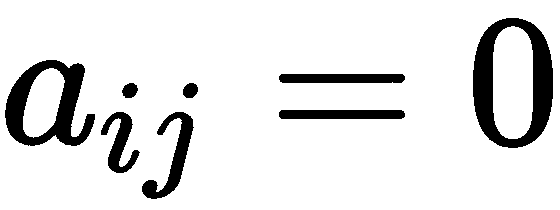
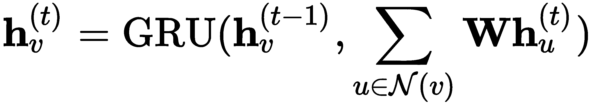
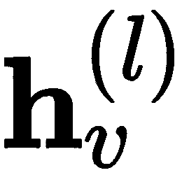
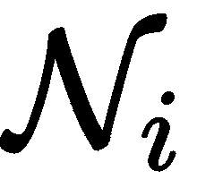
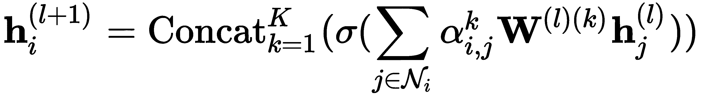
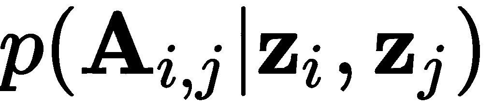
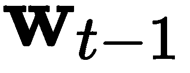

# 第九章：新兴的神经网络设计

本章将介绍一些新兴的**神经网络**（**NN**）设计。这些设计尚未成熟，但由于它们尝试解决现有深度学习算法中的基本局限性，因此具有未来潜力。如果这些技术在某一天能够证明在实际应用中是成功且有用的，我们可能会更接近人工通用智能。

我们需要牢记的一点是结构化数据的性质。到目前为止，在本书中，我们专注于处理图像或文本——换句话说，就是非结构化数据。这并非巧合，因为神经网络擅长于从像素或文本序列的组合中找到结构，而这一任务看似复杂。另一方面，机器学习算法，如梯度提升树或随机森林，在处理结构化数据（如社交网络图或大脑连接）时，表现似乎与神经网络相当，甚至更好。在本章中，我们将介绍图神经网络，用以处理任意结构化的图。

另一个神经网络的局限性在于**递归神经网络**（**RNN**）。理论上，它们是最强大的神经网络模型之一，因为它们是图灵完备的，这意味着 RNN 理论上可以解决任何计算问题。然而，实际中往往并非如此。RNN（即使是**长短期记忆网络**（**LSTM**））在长时间跨度上保持信息的能力往往较弱。一个可能的解决方案是通过外部可寻址内存扩展 RNN。本章将介绍如何做到这一点。

本章中的主题与本书其他部分的内容是紧密相关的。事实上，我们将看到，接下来要探讨的新的网络架构是基于我们之前已经讨论过的许多算法。这些算法包括卷积、RNN 和注意力模型等。

本章将涵盖以下主题：

+   引入图神经网络

+   引入内存增强神经网络

# 引入图神经网络

在学习**图神经网络**（**GNN**）之前，让我们先了解一下我们为什么需要图网络。我们从定义图开始，图是由一组对象（也称为**节点**或**顶点**）组成的，其中一些对象之间存在连接（或**边**）。

在本节中，我们将使用几篇调查论文作为参考资料，最著名的是《图神经网络的综合调查》（[`arxiv.org/abs/1901.00596`](https://arxiv.org/abs/1901.00596)），其中包含了一些引用和图片。

一个图具有以下属性：

+   我们将图表示为 ，其中 `V` 是节点集合，`E` 是边集合。

+   表达式  描述了两个节点之间的边， 。

+   邻接矩阵，，其中 `n` 是图的节点数。如果存在边 ，则写作 ；如果没有，则写作 。

+   图可以是**循环的**或**非循环的**。顾名思义，循环图包含至少一个环路，即一个非空的节点路径，其中只有第一个节点和最后一个节点是相同的。非循环图不包含环路。

+   图可以是**有向的**或**无向的**。顾名思义，有向图的边是有方向的，而无向图的边没有方向。无向图的邻接矩阵是对称的——即 。有向图的邻接矩阵是非对称的——即 。

+   图的边和节点都可以有相关联的属性，称为特征向量。我们用  来表示节点 `v` 的 `d` 维特征向量。如果图有 `n` 个节点，我们可以将它们表示为一个矩阵 。类似地，每条边的属性是一个 `c` 维的特征向量，表示为 ，其中 `v` 和 `u` 是节点。我们可以将图的所有边的属性表示为一个矩阵 。

以下图示显示了一个有五个节点的有向图及其对应的邻接矩阵：


一个有五个节点的有向图及其对应的邻接矩阵 

图是一种多功能的数据结构，非常适合现实世界中数据的组织方式。以下是一些非详尽的示例：

+   我们可以使用图来表示社交网络中的用户（节点）及其朋友关系（边）。事实上，这正是 Facebook 用其社交图谱（*The Anatomy of the Facebook Social Graph*，[`arxiv.org/abs/1111.4503`](https://arxiv.org/abs/1111.4503)）所做的。

+   我们可以将分子表示为图，其中节点是原子，边是它们之间的化学键。

+   我们可以将街道网络（一个经典例子）表示为图，其中街道是边，交叉口是节点。

+   在在线商业中，我们可以将用户和商品表示为节点，它们之间的关系则表示为边。

接下来，让我们讨论一下可以用图形解决的任务类型。它们大致分为三类：

+   **节点聚焦**：对单个节点进行分类和回归。例如，在著名的扎卡里武术俱乐部问题中（[`en.wikipedia.org/wiki/Zachary%27s_karate_club`](https://en.wikipedia.org/wiki/Zachary%27s_karate_club)），我们有多个武术俱乐部成员（节点）以及他们之间的友谊（边）。最初，俱乐部只有一名教练，所有成员都在该教练的带领下作为一个小组进行训练。后来，俱乐部分裂成两个小组，每个小组有一名教练。假设除了最后一名成员外，所有人都选择加入这两个小组中的一个，目标是根据该成员与其他成员的友谊来确定他会选择加入哪个小组（分类任务）。

+   **边聚焦**：对图的单个边进行分类和回归。例如，我们可以预测社交网络中两个人彼此认识的可能性。换句话说，任务是确定两个图节点之间是否存在边。

+   **图聚焦**：对整个图进行分类和回归。例如，给定一个表示分子结构的图，我们可以预测这个分子是否有毒。

接下来，让我们概述 GNN 的主要训练框架：

+   **监督学习**：所有训练数据都有标签。我们可以在节点、边和图级别应用监督学习。

+   **无监督学习**：目标是学习某种形式的图嵌入——例如，使用自编码器（我们将在本章稍后讨论这种情况）。我们可以在节点、边和图级别应用无监督学习。

+   **半监督学习**：这通常应用于节点级别，其中一些图节点是已标注的，而另一些则不是。半监督学习特别适用于图，因为我们可以做一个简单（但往往正确）的假设：相邻的节点很可能具有相同的标签。例如，假设我们有两个相邻的连接节点，其中一个包含一辆汽车的图片，另一个包含一辆卡车的图片。假设卡车节点被标记为“车辆”，而汽车节点没有标注。我们可以安全地假设汽车节点也是“车辆”，因为它靠近另一个车辆节点（卡车）。我们可以在图神经网络（GNNs）中利用这一图特性有多种方法。我们将概述其中的两种方法（它们并非相互排斥）：

    +   隐式地利用这一特性，通过将图的邻接矩阵作为输入提供给网络。网络将发挥其魔力，并希望推断出相邻节点很可能具有相同的标签，从而利用附加信息提高预测的准确性。我们将在本章讨论的大多数 GNN 都使用这一机制。

    +   **标签传播**，我们可以使用已标注的节点作为种子，基于它们与已标注节点的接近关系为未标注节点分配标签。我们可以通过以下步骤以迭代方式执行，直到收敛：

        1.  从种子标签开始。

        1.  对所有图节点（除了种子节点），根据其邻居节点的标签分配标签。此步骤会为整个图创建一个新的标签配置，其中某些节点可能需要根据修改后的邻居标签重新分配标签。

        1.  如果满足收敛准则，则停止标签传播；否则，重复步骤 2。

我们将利用这段简短的图介绍作为基础，进入接下来的几节内容，我们将讨论各种类型的图集中神经网络模型。GNN 领域相对较新，目前尚未出现与计算机视觉中的**卷积网络**（**CNNs**）类似的完美模型。相反，我们有不同的模型，它们具有各种不同的属性。大多数模型可归为几类，并且有人尝试创建一个足够通用的框架来将它们结合在一起。本书的目的是介绍一些现有的模型，而非发明新的模型或模型分类法。

# 循环图神经网络（Recurrent GNNs）

我们将通过介绍**图神经网络**（**GraphNNs**；参见*图神经网络模型*，**[`ieeexplore.ieee.org/document/4700287`](https://ieeexplore.ieee.org/document/4700287)**）来开始本节内容。尽管论文的作者将该模型缩写为 GNN，但为了避免与 GNN 这一通用图网络类别的缩写发生冲突，我们将使用 GraphNN 这一缩写。该模型是最早提出的 GNN 模型之一，它将现有的神经网络扩展到图结构数据的处理。就像我们利用单词的上下文（即它的周围词）来创建词嵌入向量（第六章*，语言建模*）一样，我们也可以利用一个节点的邻居图节点来做到这一点。GraphNNs 旨在基于节点的邻居创建一个`s`维的节点状态向量 。类似于语言建模，向量状态可以作为其他任务的输入，例如节点分类。

节点的状态通过递归交换邻居信息来更新，直到达到稳定的平衡状态。我们用  表示邻居节点的集合，用`u`表示该邻居集合中的一个单独节点。节点的隐状态通过以下公式递归更新：


这里，`f` 是一个参数化函数（例如，**前馈神经网络**（**FFNN**）），每个状态  是随机初始化的。参数化函数 `f` 以 `v` 的特征向量  为输入，`u` 的邻居特征向量 ，连接 `u` 和 `v` 的边特征向量 ，以及 `u` 在第 *t-1* 步的状态向量 。换句话说，`f` 使用所有关于 `v` 邻域的已知信息。表达式  是对所有邻近节点应用 `f` 的总和，这使得 GraphNN 不依赖于邻居的数量和顺序。`f` 函数在整个过程的每个步骤中都是相同的（即具有相同的权重）。

注意，我们有一个迭代（或递归）过程，其中第 `t` 步的状态基于直到 *t-1* 步的步骤数，如下所示：


特征向量状态更新的递归过程；**Grec** 递归层在所有步骤中都是相同的（即具有相同的权重）；来源：https://arxiv.org/abs/1901.00596

该过程将继续，直到达到稳定平衡。为了使其有效，函数 `f` 必须是一个收缩映射。让我们澄清一下：当应用于任意两个点（或值）A 和 B 时，收缩映射函数 `f` 满足条件 ，其中 γ 是一个标量值，且 。换句话说，收缩映射在映射后缩小两个点之间的距离。这确保了系统会（以指数速度）收敛到平衡状态向量 ，对于任何初始值 。我们可以修改一个神经网络成为一个收缩函数，但这超出了本书的范围。

现在我们有了隐藏状态，可以将其用于节点分类等任务。我们可以用以下公式表示：


在这个方程中， 是达到平衡时的状态，而 `g` 是一个参数化函数——例如，一个带有 softmax 激活的全连接层，用于分类任务。

接下来，让我们看一下如何训练 GraphNN，给定一些或所有图节点的训练标签 *t[i]* 以及大小为 `m` 的小批量。训练 GraphNN 的步骤如下：

1.  计算  和 *o[v]* 对所有 `m` 个节点，遵循我们刚刚描述的递归过程。

1.  计算代价函数（*t[i]* 是节点 `i` 的标签）：


1.  反向传播代价。请注意，通过将第 1 步的节点状态更新与当前步骤的梯度传播交替，可以让 GraphNN 处理循环图。

1.  更新组合网络的权重*g(f)*。

GraphNN 有几个局限性，其中之一是计算平衡状态向量效率不高。此外，正如我们在本节之前提到的，GraphNN 在所有步骤`t`中使用相同的参数（权重）来更新。相比之下，其他 NN 模型可以使用多个堆叠的层，每一层都有不同的权重集合，这使我们能够捕捉数据的层次结构。它还允许我们在单次前向传播中计算。最后，值得一提的是，尽管计算是一个递归过程，但 GraphNN 并不是一个递归网络。

**门控图神经网络**（**GGNN**，[`arxiv.org/abs/1511.05493`](https://arxiv.org/abs/1511.05493)）试图通过**门控递归单元**（**GRU**；更多信息请参见第七章，*理解递归网络*）单元来克服这些局限性，作为递归函数。我们可以将 GGNN 定义为以下形式：



在前面的公式中，。为澄清，GGNN 基于同一步骤`t`的邻接状态和前一个隐藏状态更新状态。

从历史的角度来看，GraphNN 是最早的 GNN 模型之一。但正如我们之前提到的，它们存在一些局限性。在下一节中，我们将讨论卷积图神经网络，它是更近期的发展。

# 卷积图神经网络

**卷积图神经网络**（**ConvGNN**）使用一组特殊的图卷积层（Gconv*）在更新状态向量时对图的节点进行卷积。与 GraphNN 类似，图卷积通过节点的邻居生成其向量表示。但与 GraphNN 在计算的所有步骤`t`中使用相同的层（即相同的权重集合）不同，ConvGNN 在每个步骤中使用不同的层。两者方法的区别在下面的图中进行了说明：


上图：GraphNN 在所有步骤 t 上使用相同的 Grec 递归层；下图：GCN 为每个步骤使用不同的 Gconv[*]层；来源：[`arxiv.org/abs/1901.00596`](https://arxiv.org/abs/1901.00596)

使用 ConvGNN，步骤数 `t` 由网络的深度定义。尽管我们将从略有不同的角度讨论这个问题，ConvGNN 行为上与常规的 FFNN 类似，但进行了图卷积。通过堆叠多个层，每个节点的最终隐藏表示从更远的邻域接收信息，就像下图所示：


上图：节点级分类 GraphCN；下图：图级分类 GraphCN。来源：[`arxiv.org/abs/1901.00596`](https://arxiv.org/abs/1901.00596)

图示展示了两种场景：

+   节点级（上图），每个卷积层（包括最后一个）的输出是图中每个节点的一个向量。我们可以对这些向量执行节点级操作。

+   图级（下图），交替进行图卷积和池化操作，并以读取层结束，之后是几个全连接层，这些层汇总整个图形并产生单一输出。

现在我们已经对 ConvGNN 有了高层次的了解，在接下来的部分中，我们将讨论图卷积（之后会讨论读取和池化层）。

# 基于谱的卷积

图卷积有多种类型（可以查看 *图神经网络的综合调查*），但在本节中，我们将讨论来自 *半监督分类与图卷积网络* 的算法（[`arxiv.org/abs/1609.02907`](https://arxiv.org/abs/1609.02907)）。为了避免与一般的 ConvGNN 表示法混淆，我们将此卷积称为 GCN。GCN 是所谓的 **基于谱的** ConvGNN 类别的代表。这些算法通过从图信号处理的角度引入滤波器来定义图卷积，其中图卷积操作被解释为从图信号中去除噪声。

在 *图神经网络* 部分，我们定义了隐藏节点状态 ，并注意到在 GGNN 的情况下 。我们通过将图中所有节点的隐藏向量状态堆叠成一个矩阵 ，其中 `n` 是图中节点的总数，`d` 是特征向量的大小。矩阵的每一行表示单个节点的隐藏状态。然后，我们可以为单个 GCN 层在步骤 *l+1* 定义通用公式如下：


这里，`A` 是邻接矩阵，`f` 是一个非线性激活函数，例如 ReLU，（特征向量矩阵）。由于  和  的大小相同， 具有与节点特征矩阵 `X` 相同的维度（见 *图神经网络* 部分）。然而，，其中 `z` 是隐状态向量  的大小，并不一定与初始的 `d` 相同。

让我们继续用一个简化但具体的 GCN 版本。


这里， 是权重矩阵，σ 是 sigmoid 函数。由于邻接矩阵 `A` 以矩阵形式表示图形，我们可以通过一次运算计算该层的输出。 运算允许每个节点接收来自其邻居节点的输入（这也使得 GCN 可以处理有向图和无向图）。让我们通过一个例子来看看它是如何工作的。我们将使用在 *图神经网络* 部分介绍的五节点图。为了易于阅读，我们为每个节点分配一个一维向量隐状态 ，其值等于节点编号 。然后，我们可以用以下公式计算该例子：


我们可以看到 ，因为它接收来自节点 2、3 和 5 的输入。如果  有更多维度，那么输出向量的每个单元格将是输入节点的状态向量对应单元格的总和：


这里， 是邻接矩阵的单元格。

尽管这个解决方案很优雅，但它有两个限制：

+   并非所有节点都接收来自自身前一状态的输入。在前面的例子中，只有节点 2 从自身接收输入，因为它有一个环路边（这是将节点与自身连接的边）。解决这个问题的方法是通过将邻接矩阵主对角线上的所有值设置为 1，来人为地为所有节点创建环路边：。在这个方程中，`I` 是单位矩阵，它的主对角线为 1，其它单元格为 0。

+   由于`A`没有归一化，邻居数量较多的节点的状态向量会与邻居数量较少的节点发生不同的尺度变化。在之前的例子中，我们可以看到，相对于其他节点来说较大，因为节点 4 的邻域有 3 个节点。解决这个问题的方法是对邻接矩阵进行归一化，使得一行中所有元素的和为 1：。我们可以通过将`A`与逆度矩阵`D`^(-1)相乘来实现这一点。度矩阵`D`是一个对角矩阵（即，除了主对角线外，所有其他元素均为零），其中包含每个节点的度数信息。我们将节点的邻居数量称为该节点的度数。例如，我们示例图的度矩阵如下所示：


因此，`D`^(-1)`A`变为以下形式：


这个机制给每个邻居节点分配相同的权重。实际上，论文的作者发现，使用对称归一化的效果更好。

在我们结合了这两个改进后，GCN 公式的最终形式可以写成如下：


请注意，我们刚刚描述的 GCN 仅包括节点的直接邻域作为上下文。每一层堆叠都有效地将节点的感受野扩展到其直接邻居以外的区域 1 层。ConvGNN 第二层的感受野包括直接邻居，第二层的感受野包括当前节点两跳远的节点，依此类推。

在下一节中，我们将讨论图卷积操作的第二大类，即基于空间的卷积。

# 带注意力的基于空间的卷积

第二类 ConvGNN 是基于空间的方法，它们的灵感来源于计算机视觉中的卷积（第二章，*理解卷积神经网络*）。我们可以把图像看作一个图，其中每个像素都是一个节点，直接连接到其相邻的像素（下图中的左侧图像）。例如，如果我们使用 3 × 3 作为滤波器，每个像素的邻域由八个像素组成。在图像卷积中，这个 3 × 3 的加权滤波器被应用到 3 × 3 的区域，结果是所有九个像素强度的加权和。同样，基于空间的图卷积将中心节点的表示与其邻居的表示进行卷积，从而得到中心节点的更新表示，如下图右侧所示：


左图：在像素网格上的二维卷积；右图：空间图卷积。来源：[`arxiv.org/abs/1901.00596`](https://arxiv.org/abs/1901.00596)

通用的基于空间的卷积在某种程度上类似于 GCN，因为这两种操作都依赖于图的邻居。GCN 使用逆度矩阵为每个邻居分配权重，而空间卷积则使用卷积滤波器来完成同样的任务。两者的主要区别在于，GCN 的权重是固定的并且已经归一化，而空间卷积的滤波器权重是可学习的，并且没有归一化。从某种意义上说，我们也可以将 GCN 视为一种基于空间的方法。

我们将在本节继续讨论一种特定类型的基于空间的模型，称为**图注意力网络**（**GAT**）（更多信息，请访问 [`arxiv.org/abs/1710.10903`](https://arxiv.org/abs/1710.10903)），它通过一个特殊的图自注意力层实现图卷积。与学习卷积滤波器或使用平均邻接矩阵作为 GCN 不同，GAT 使用自注意力机制的注意力得分为每个邻近节点分配权重。GAT 层是图注意力网络的主要构建模块，图注意力网络由多个堆叠的 GAT 层组成。与 GCN 一样，每增加一层，目标节点的感受野也会增加。

类似于 GCN，GAT 层输入一组节点特征向量 ，并输出一组不同的特征向量 ，这些输出特征向量的个数不一定与输入的相同。按照我们在第八章《序列到序列模型与注意力》一节中概述的过程，操作开始时会计算特征向量之间的对齐得分  和 ，这些向量对应着每两个节点的邻域关系：


在这里， 是一个权重矩阵，它将输入向量转换为输出向量的个数，并提供必要的可学习参数。表达式 *f[a]* 是一个简单的前馈神经网络（FFN），具有单层和 LeakyReLU 激活函数，它由权重向量  参数化，并实现加性注意力机制：


这里，表示拼接。如果我们不施加任何限制，每个节点将能够关注图中所有其他节点，无论它们与目标节点的距离如何；然而，我们只对邻居节点感兴趣。GAT 的作者建议通过使用掩蔽注意力来解决这个问题，其中掩蔽覆盖了所有不是目标节点直接邻居的节点。我们将节点`i`的直接邻居表示为。

接下来，我们通过使用 softmax 计算注意力得分。以下是通用公式和带有*f[a]*的公式（仅应用于直接邻居）：


一旦我们得到注意力得分，就可以使用它们来计算每个节点的最终输出特征向量（我们在第八章，*序列到序列模型与注意力*中称之为上下文向量），它是所有邻居输入特征向量的加权组合：


这里，σ是 sigmoid 函数。论文的作者还发现多头注意力有利于模型的性能：



这里，`k`是每个头的索引（总共有`K`个头），是每个注意力头的注意力得分，是每个注意力头的权重矩阵。由于是拼接的结果，它的基数将是*k × z[l+1]*。因此，在网络的最终注意力层中无法进行拼接。为了解决这个问题，论文的作者建议在最后一层中平均注意力头的输出（用索引`L`表示）：


下图展示了在 GAT 上下文中常规注意力和多头注意力的比较。在左侧的图像中，我们可以看到应用于两个节点`i`和`j`之间的常规注意力机制。在右侧的图像中，我们可以看到节点`1`与其邻域之间的多头注意力，*k = 3*表示有 3 个头。聚合后的特征可以是拼接（对于所有隐藏的 GAT 层）或者平均（对于最终的 GAT 层）：


左：两个节点之间的常规注意力；右：节点 1 与其邻域之间的多头注意力。来源：https://arxiv.org/abs/1710.10903

一旦我们得到最终 GAT 层的输出，就可以将其作为输入传递到下一个特定任务的层。例如，这可能是一个带有 softmax 激活的全连接层，用于节点分类。

在我们总结这一节关于 ConvGNN 的内容之前，让我们讨论一下两个我们尚未涉及的最后组成部分。第一个是我们在*卷积* *图* *网络*部分开头的图级分类示例中介绍的读出层。它的输入是最后一层图卷积层的所有节点状态`H`^((`L`))，并输出一个总结整个图的单一向量。我们可以将其正式定义如下：


在这里，`G`表示图的节点集合，`R`是读出函数。实现它的方法有很多种，但最简单的方法是对所有节点状态进行逐元素求和或求平均。

我们将要看待的下一个（也是最后一个）ConvGNN 组件是池化操作。再次强调，有多种方法可以使用池化操作，但最简单的一种是像我们在计算机视觉卷积中使用的最大池化/平均池化操作：


在这里，`p`表示池化窗口的大小。如果池化窗口包含整个图，则池化操作变得类似于读出操作。

这就结束了我们关于 ConvGNN 的讨论。在下一节中，我们将讨论图自编码器，它提供了一种生成新图的方法。

# 图自编码器

让我们快速回顾一下自编码器，我们在第五章的*生成模型*中首次介绍过。**自编码器**是一个前馈神经网络（FFN），它试图重建其输入（更准确地说，它试图学习一个恒等函数，）。我们可以将自编码器看作是两个组件的虚拟组合——**编码器**，它将输入数据映射到网络的内部潜在特征空间（表示为向量`z`），以及**解码器**，它试图从网络的内部数据表示中重建输入。我们可以通过最小化一个损失函数（称为**重建误差**）以无监督的方式训练自编码器，该损失函数衡量原始输入与其重建之间的距离。

**图自编码器**（**GAE**）类似于自编码器，区别在于编码器将图节点映射到自编码器的潜在特征空间，然后解码器尝试从中重建特定的图特征。在这一节中，我们将讨论一种 GAE 的变体，该变体在《变分图自编码器》([`arxiv.org/abs/1611.07308`](https://arxiv.org/abs/1611.07308))中介绍，同时也概述了 GAE 的变分版本（**VGAE**）。下图展示了一个 GAE 的示例：


图自编码器的示例。来源：[`arxiv.org/abs/1901.00596`](https://arxiv.org/abs/1901.00596)

编码器是我们在 *基于谱的卷积* 部分定义的 GCN 模型，用来计算图节点的网络嵌入！[](img/e799be66-a517-4c9e-b202-62de22c1ae57.png)，其中每个 `n` 个节点的嵌入是一个 `d` 维向量 `z`。它以邻接矩阵 `A` 和节点特征向量集合 `X` 作为输入（像本章讨论的其他 GNN 模型一样）。编码器由以下公式表示：


在这里，**W[1]** 和 **W[2]** 是两个 GCN 图卷积层的可学习参数（权重），`f` 是一个非线性激活函数，如 ReLU。论文的作者使用了两个图卷积层，尽管所提出的算法可以适用于任何数量的层。

解码器试图重建图的邻接矩阵 ：


在这里，σ 是 sigmoid 函数。它首先计算 `Z` 和其转置之间的点积（或内积）：。为了明确，这个操作计算了图中每个节点 `i` 的向量嵌入 *z[i]* 与所有其他节点 `j` 的向量嵌入 *z[j]* 之间的点积，如下例所示：


正如我们在 第一章 *《神经网络的基础》* 中提到的，我们可以将点积看作是向量之间的相似度度量。因此， 测量了每对节点之间的距离。这些距离为重建过程提供了基础。之后，解码器应用一个非线性激活函数，继续重建图的邻接矩阵。我们可以通过最小化实际重建邻接矩阵之间的差异来训练 GAE。

接下来，让我们关注 **变分图自编码器**（**VGAE**）。与我们在 第五章 *《生成模型》* 中讨论的 **变分自编码器**（**VAE**）类似，VGAE 是一种生成模型，可以生成新的图（更具体地说，是新的邻接矩阵）。为了理解这一点，我们先回顾一下 VAE。与常规自编码器不同，VAE 的瓶颈层不会直接输出潜在状态向量。而是会输出两个向量，描述潜在向量 `z` 的分布的 **均值** μ 和 **方差** σ。我们将使用它们从高斯分布中采样一个与 `z` 相同维度的随机向量 ε。更具体地说，我们将通过潜在分布的均值 μ 来偏移 ε，并通过潜在分布的方差 σ 来缩放它：


这项技术被称为**重参数化**技巧，它使得随机向量具有与原始数据集相同的均值和方差。

我们可以将 VGAE 看作 GAE 和 VAE 的结合体，因为它处理图输入（类似于 GAE），并遵循相同的原理生成新数据（像 VAE 一样）。首先，让我们关注编码器，它被分成两个路径：


这里，权重**W[0]**在各路径之间共享，**是对称归一化的邻接矩阵，***μ***是均值向量***μ**[i]*的矩阵，***σ***是每个图节点的方差矩阵***σ**[i]*。然后，完整图的编码器推理步骤被定义为所有图节点`i`的潜在表示的内积：


在这个公式中，`n`是图中的节点数，表示解码器对真实概率分布的近似，其中*φ*是网络参数（在这里，我们保留了第五章《生成模型》中的符号表示）。该近似是一个高斯分布，节点特定的均值为*μ[i]*，对角协方差值为：


接下来，我们定义生成步骤，生成新的邻接矩阵。它是随机潜在向量的内积：


这里，表示节点`i`和节点`j`之间是否存在边，表示解码器对真实概率的近似。我们可以使用已经熟悉的 VAE 代价来训练 VGAE：


这里，第一项是 Kullback–Leibler 散度，第二项是重构代价。

这就是我们对 GAE 和 VGAE 的描述。在接下来的章节中，我们将讨论另一种图学习范式，它使得可以将结构化和非结构化数据作为网络输入进行混合。

# 神经图学习

在本节中，我们将描述**神经图学习**范式（**NGL**）（更多信息请参见*Neural Graph Learning: Training Neural Networks Using Graphs*，链接：[`storage.googleapis.com/pub-tools-public-publication-data/pdf/bbd774a3c6f13f05bf754e09aa45e7aa6faa08a8.pdf`](https://storage.googleapis.com/pub-tools-public-publication-data/pdf/bbd774a3c6f13f05bf754e09aa45e7aa6faa08a8.pdf)），它使得基于非结构化数据的训练能够与结构化信号相结合。更具体地说，我们将讨论基于 TensorFlow 2.0 的**神经结构化学习**框架（**NSL**）（更多信息，请访问[`www.tensorflow.org/neural_structured_learning/`](https://www.tensorflow.org/neural_structured_learning/)），该框架实现了这些原理。

为了理解 NGL 是如何工作的，我们将使用 CORA 数据集（[`relational.fit.cvut.cz/dataset/CORA`](https://relational.fit.cvut.cz/dataset/CORA)），该数据集由 2,708 篇科学出版物组成，分为 7 个类别之一（这是数据集的非结构化部分）。数据集中所有出版物中的唯一词汇量（即词汇表）为 1,433 个。每篇出版物都被描述为一个**multihot**编码的向量。这个向量的大小为 1,433（与词汇表大小相同），其中单元格的值为 0 或 1。如果某篇出版物包含词汇表中的第`i`个单词，那么该出版物的 one-hot 编码向量的第`i`个单元格被设为 1。如果该词汇不出现在该出版物中，则单元格为 0。此机制保留了文章中存在的单词信息，但不保留单词的顺序信息。数据集还包含一个有向图，表示 5,429 个引用关系，其中节点是出版物，节点之间的边表示出版物`v`是否引用出版物`u`（这是数据集的结构化部分）。

接下来，让我们聚焦于 NGL 本身，从以下图表开始：


NGL 框架：绿色实线表示非结构化输入数据流；黄色虚线表示结构化信号数据流；灵感来源：[`www.tensorflow.org/neural_structured_learning/framework`](https://www.tensorflow.org/neural_structured_learning/framework)

它作为常规神经网络训练框架的一种封装，可以应用于任何类型的网络，包括 FFN 和 RNN。例如，我们可以使用常规的 FFN，它将**multihot**编码的出版物向量作为输入，尝试将其分类为 7 个类别之一，使用 softmax 输出，正如前面图表中绿色实线所示。NGL 使我们能够通过引用提供的结构化数据来扩展这个网络，如黄色虚线所示。

让我们看看这个是如何工作的。我们从假设图中的相邻节点是有些相似的开始。我们可以将这个假设转移到神经网络领域，假设样本 `i` 通过神经网络生成的嵌入向量（嵌入是最后一层隐藏层的输出）应该与样本 `j` 的嵌入向量相似，前提是这两个样本在关联图中是邻居。在我们的例子中，我们可以假设，如果出版物 `i` 引用了出版物 `j`（即它们在引用图中是邻居），那么出版物 `i` 的嵌入向量应该与出版物 `j` 的嵌入向量相似。实际上，我们可以通过以下步骤来实现这一点：

1.  从一个包含非结构化数据（多热编码出版物）和结构化数据（引用图）的数据集开始。

1.  构建特殊类型的复合训练样本（按批组织），其中每个复合样本由单一常规输入样本（一个多热编码出版物）和 `K` 个邻居样本（引用或被引用的多热编码出版物）组成。

1.  将复合样本输入到神经网络中，生成初始样本及其邻居的嵌入向量。尽管前面的图示显示这两条路径是并行运行的，但实际情况并非如此。该图旨在说明网络处理了中央样本及其邻居，但实际的神经网络并不清楚这种安排——它只是将所有多热编码的输入作为单个批次的一部分进行处理。相反，位于常规神经网络上方的 NSL 部分区分了这两个组件。

1.  计算一种特殊类型的复合损失函数，由两部分组成：常规监督损失和正则化邻居损失，使用度量来衡量初始样本嵌入与其邻居嵌入之间的距离。邻居损失是我们用结构化信号增强非结构化训练数据的机制。复合损失定义如下：


该公式具有以下特点：

+   `n` 是小批量中的复合样本数量。

+    是监督损失函数。

+   *f[θ]* 是具有权重 *θ* 的神经网络函数。

+   *α* 是一个标量参数，确定两种损失组件之间的相对权重。

+    是样本 *x[i]* 的图邻居集合。请注意，邻居损失遍历图中所有节点的所有邻居（两个求和）。

+    是样本 `i` 和 `j` 之间图边的权重。如果任务没有权重的概念，我们可以假设所有权重都为 1。

+    是样本 `i` 和 `j` 之间嵌入向量的距离度量。

由于邻居损失的正则化特性，NGL 也被称为 **图正则化**。

1.  反向传播误差并更新网络权重 *θ*。

现在我们已经对图正则化有了一个概览，让我们开始实现它。

# 实现图正则化

在本节中，我们将在 NSL 框架的帮助下实现对 Cora 数据集的图正则化。这个示例基于[`www.tensorflow.org/neural_structured_learning/tutorials/graph_keras_mlp_cora`](https://www.tensorflow.org/neural_structured_learning/tutorials/graph_keras_mlp_cora)中的教程。在开始实现之前，我们需要满足一些前提条件。首先，我们需要 TensorFlow 2.0 和 `neural-structured-learning` 1.1.0 包（可以通过 `pip` 安装）。

一旦满足这些要求，我们就可以继续实现：

1.  我们将首先进行包的导入：

```py
import neural_structured_learning as nsl
import tensorflow as tf
```

1.  我们将继续定义程序中的一些常量参数（希望常量名称和注释能够自解释）：

```py
# Cora dataset path
TRAIN_DATA_PATH = 'data/train_merged_examples.tfr'
TEST_DATA_PATH = 'data/test_examples.tfr'
# Constants used to identify neighbor features in the input.
NBR_FEATURE_PREFIX = 'NL_nbr_'
NBR_WEIGHT_SUFFIX = '_weight'
# Dataset parameters
NUM_CLASSES = 7
MAX_SEQ_LENGTH = 1433
# Number of neighbors to consider in the composite loss function
NUM_NEIGHBORS = 1
# Training parameters
BATCH_SIZE = 128

```

位于 `TRAIN_DATA_PATH` 和 `TEST_DATA_PATH` 下的文件包含经过 TensorFlow 友好格式处理的 Cora 数据集和标签。

1.  接下来，让我们加载数据集。这个过程通过两个函数实现：`make_dataset`，它构建整个数据集，以及 `parse_example`，它解析单个复合样本（`make_dataset` 内部使用 `parse_example`）。我们将从 `make_dataset` 开始：

```py
def make_dataset(file_path: str, training=False) -> tf.data.TFRecordDataset:
    dataset = tf.data.TFRecordDataset([file_path])
    if training:
        dataset = dataset.shuffle(10000)
    dataset = dataset.map(parse_example).batch(BATCH_SIZE)

    return dataset
```

请注意，`dataset.map(parse_example)` 内部会对数据集中的所有样本应用 `parse_example`。我们将继续定义 `parse_example`，从声明开始：

```py
def parse_example(example_proto: tf.train.Example) -> tuple:
```

该函数创建了 `feature_spec` 字典，表示单个复合样本的模板，稍后将用来自数据集的实际数据填充。首先，我们用 `tf.io.FixedLenFeature` 的占位符实例填充 `feature_spec`，`'words'` 代表一个多热编码的出版物，`'label'` 代表出版物的类别（请注意缩进，因为这段代码仍然是 `parse_example` 的一部分）：

```py
    feature_spec = {
        'words':
            tf.io.FixedLenFeature(shape=[MAX_SEQ_LENGTH],
                                  dtype=tf.int64,
                                  default_value=tf.constant(
                                      value=0,
                                      dtype=tf.int64,
                                      shape=[MAX_SEQ_LENGTH])),
        'label':
            tf.io.FixedLenFeature((), tf.int64, default_value=-1),
    }
```

然后，我们迭代前 `NUM_NEIGHBORS` 个邻居，并将它们的多热向量和边权重分别添加到 `feature_spec` 中的 `nbr_feature_key` 和 `nbr_weight_key` 键下：

```py
    for i in range(NUM_NEIGHBORS):
        nbr_feature_key = '{}{}_{}'.format(NBR_FEATURE_PREFIX, i, 'words')
        nbr_weight_key = '{}{}{}'.format(NBR_FEATURE_PREFIX, i, NBR_WEIGHT_SUFFIX)
        feature_spec[nbr_feature_key] = tf.io.FixedLenFeature(
            shape=[MAX_SEQ_LENGTH],
            dtype=tf.int64,
            default_value=tf.constant(
                value=0, dtype=tf.int64, shape=[MAX_SEQ_LENGTH]))

        feature_spec[nbr_weight_key] = tf.io.FixedLenFeature(
            shape=[1], dtype=tf.float32, default_value=tf.constant([0.0]))

    features = tf.io.parse_single_example(example_proto, feature_spec)

    labels = features.pop('label')
    return features, labels
```

请注意，我们使用以下代码片段将模板填充为来自数据集的真实样本：

```py
    features = tf.io.parse_single_example(example_proto, feature_spec)
```

1.  现在，我们可以实例化训练和测试数据集：

```py
train_dataset = make_dataset(TRAIN_DATA_PATH, training=True)
test_dataset = make_dataset(TEST_DATA_PATH)
```

1.  接下来，让我们实现模型，它是一个简单的 FFN，具有两个隐藏层和 softmax 输出。该模型将多热编码的出版物向量作为输入，并输出出版物的类别。它独立于 NSL，可以以简单的监督方式作为分类进行训练：

```py
def build_model(dropout_rate):
    """Creates a sequential multi-layer perceptron model."""
    return tf.keras.Sequential([
        # one-hot encoded input.
        tf.keras.layers.InputLayer(
            input_shape=(MAX_SEQ_LENGTH,), name='words'),

        # 2 fully connected layers + dropout
        tf.keras.layers.Dense(64, activation='relu'),
        tf.keras.layers.Dropout(dropout_rate),
        tf.keras.layers.Dense(64, activation='relu'),
        tf.keras.layers.Dropout(dropout_rate),

        # Softmax output
        tf.keras.layers.Dense(NUM_CLASSES, activation='softmax')
    ])
```

1.  接下来，让我们实例化模型：

```py
model = build_model(dropout_rate=0.5)
```

1.  我们已经准备好了进行图正则化所需的所有要素。我们将首先使用 NSL 包装器包装 `model`：

```py
graph_reg_config = nsl.configs.make_graph_reg_config(
    max_neighbors=NUM_NEIGHBORS,
    multiplier=0.1,
    distance_type=nsl.configs.DistanceType.L2,
    sum_over_axis=-1)
graph_reg_model = nsl.keras.GraphRegularization(model,
                                                graph_reg_config)
```

我们实例化`graph_reg_config`对象（`nsl.configs.GraphRegConfig`的实例），并配置图正则化参数：`max_neighbors=NUM_NEIGHBORS`是使用的邻居数，`multiplier=0.1`相当于我们在*神经结构学习*章节中介绍的复合损失的参数α，`distance_type=nsl.configs.DistanceType.L2`是邻居节点嵌入之间的距离度量。

1.  接下来，我们可以构建一个训练框架，并开始进行 100 个 epoch 的训练：

```py
graph_reg_model.compile(
    optimizer='adam',
    loss='sparse_categorical_crossentropy',
    metrics=['accuracy'])

# run eagerly to prevent epoch warnings
graph_reg_model.run_eagerly = True

graph_reg_model.fit(train_dataset, epochs=100, verbose=1)
```

1.  一旦训练完成，我们可以在测试数据集上运行已训练的模型：

```py
eval_results = dict(
    zip(graph_reg_model.metrics_names,
        graph_reg_model.evaluate(test_dataset)))
print('Evaluation accuracy: {}'.format(eval_results['accuracy']))
print('Evaluation loss: {}'.format(eval_results['loss']))
```

如果一切顺利，程序的输出应为：

```py
Evaluation accuracy: 0.8137432336807251
Evaluation loss: 1.1235489577054978
```

这就结束了我们对 GNN 的讨论。如我们所提到的，GNN 有多种类型，而我们这里只包含了一个小的集合。如果你有兴趣了解更多，我建议你参考我们在本节开头提到的综述论文，或者查看以下整理好的 GNN 相关论文列表：[`github.com/thunlp/GNNPapers`](https://github.com/thunlp/GNNPapers)。

在下一节中，我们将讨论一种新型的神经网络（NN），它使用外部存储来保存信息。

# 介绍记忆增强神经网络

我们已经在神经网络中看到过记忆的概念（尽管以一种奇特的形式存在）——例如，LSTM 单元可以借助输入门和遗忘门在其隐藏单元状态中添加或删除信息。另一个例子是注意力机制，其中代表编码源序列的向量集合可以视为外部记忆，编码器写入其中，解码器从中读取。但是这种能力也有一些局限性。例如，编码器只能写入一个单一的记忆位置，即当前序列元素，也无法更新先前写入的向量。另一方面，解码器只能从数据库中读取，无法写入。

在本节中，我们将进一步探讨记忆的概念，介绍**记忆增强神经网络**（**MANNs**），它解决了这些局限性。这是一类新的算法，仍处于早期阶段，不像更为主流的神经网络类型（如卷积神经网络和 RNN），这些类型已经存在了几十年。我们将讨论的第一个 MANN 网络是神经图灵机。

# 神经图灵机

MANN 的概念首次通过**神经图灵机**（**NTM**）引入（更多信息，请访问[`arxiv.org/abs/1410.5401`](https://arxiv.org/abs/1410.5401)）。NTM 有两个组件：

+   一个神经网络控制器。

+   一个外部记忆，表示为一个矩阵！[](img/3a804a65-9cd9-4d40-ba70-790164f5d22b.png)。该矩阵包含`n`行`d`维向量。

下图提供了 NTM 架构的概述：


NTM 来源：[`arxiv.org/abs/1410.5401`](https://arxiv.org/abs/1410.5401)

NTM 以顺序方式工作（像 RNN 一样），控制器接受输入向量并产生响应的输出向量。它还通过多个并行的读/写头帮助读取和写入记忆。

让我们集中讨论读取操作，它与我们在第八章中讨论的注意力机制非常相似，*序列到序列模型与注意力*。读取头总是读取完整的记忆矩阵，但它通过以不同的强度关注不同的记忆向量来实现这一点。为此，读取头发出一个 `n` 维向量 （在步骤 `t` 处），并满足以下约束：


该实现了一个注意力机制，其中向量的每个单元 `i` 表示形成输出时第 `i` 个记忆向量（即矩阵 `M` 的第 `i` 行）的权重。在步骤 `t` 处的读取操作的输出是一个 `d` 维向量 `r`[`t`]，定义为所有记忆向量的加权和：


这一操作类似于我们在第八章中讨论的软注意力机制，*序列到序列模型与注意力*。与硬注意力不同，软注意力是可微的，这个操作也具有相同的特性。通过这种方式，整个 NTM（控制器和记忆）是一个可微分的系统，这使得我们可以通过梯度下降和反向传播对其进行训练。

接下来，让我们集中讨论写入操作，它由两个步骤组成：**擦除**操作，接着是**加法**操作。写头发出与读取头相同类型的注意力向量 。它还发出另一个**擦除**向量 ，其值都在 (0, 1) 范围内。我们可以将步骤 `t` 上的擦除操作定义为这两个向量和步骤 *t-1* 时的记忆状态 *！[](img/1615bdc5-cb7e-4add-9413-819093aa8950.png)* 的函数：


在这里，`1` 是一个 `d` 维的全为 1 的向量， 和擦除组件的乘法是逐元素相乘。根据这个公式，只有当权重  和 `e`[`t`] 都不为零时，才能擦除一个记忆位置。这个机制可以与多个注意力头一起工作，按任意顺序进行写入，因为乘法是可交换的。

擦除操作之后是加法操作。写头生成一个**加法**向量 ，它在擦除之后被加到记忆中，生成步骤 `t` 的最终记忆状态：


我们现在已经熟悉了读写操作，但我们仍然不知道如何生成注意力向量 （我们将省略上标索引，因为以下描述适用于读头和写头）。NTM 使用两种互补的寻址机制来完成这一点：基于内容的和基于位置的。

我们从内容基础的寻址开始，其中每个头（包括读取和写入）都会发出一个键向量 。这个向量与每个记忆向量  使用相似度度量 进行比较。NTM 的作者建议使用余弦相似度，定义如下：


然后，我们将内容基础的寻址向量的单个单元定义为所有记忆向量相似度结果的 softmax：


这里，  是一个标量值键强度，它决定了焦点的范围。对于小值的 ，注意力会扩展到所有记忆向量，而对于大值的 ，注意力则会聚焦于最相似的记忆向量。

NTM 的作者认为，在一些问题中，内容基础的注意力是不够的，因为一个变量的内容可以是任意的，但其地址必须是可识别的。他们以算术问题为例：两个变量，`x`和`y`，可以取任何两个值，但过程 *f(x, y) = x × y* 仍然应该被定义。这个任务的控制器可以获取变量 `x` 和 `y` 的值，将它们存储在不同的地址中，然后检索它们并执行乘法算法。在这种情况下，变量是按位置寻址的，而不是按内容寻址的，这就引出了基于位置的寻址机制。它既可以与随机访问内存跳跃一起工作，也可以在位置之间进行简单的迭代。它通过将注意力权重向前或向后移动一步来实现这一点。

例如，如果当前的加权完全集中在一个位置，那么旋转 1 将把焦点移到下一个位置。负向旋转会将加权移动到相反方向。

内容和位置寻址是结合工作的，如下图所示：


寻址机制的流程图。来源：[`arxiv.org/abs/1410.5401`](https://arxiv.org/abs/1410.5401)

让我们一步一步看看它是如何工作的：

1.  内容寻址生成内容寻址向量 ，基于记忆 ，键向量 ，以及键强度 。

1.  **插值**是定位寻址机制中的三个步骤之一，它发生在实际的权重平移之前。每个头（读取或写入）会发出一个标量**插值门** *g[t]*，其值范围在（0，1）之间。*g[t]* 决定是保留在步骤 *t-1* 中由头部生成的权重 ，还是用当前步骤 `t` 的基于内容的权重  来替换它。插值定义如下：


如果 *g[t] = 0*，那么我们将完全保留先前的寻址向量。或者，如果 *g[t] = 1*，我们将只使用基于内容的寻址向量。

1.  下一步是**卷积平移**，它将插值注意力  用于确定如何进行平移。假设头部注意力可以前移（+1）、后移（-1）或保持不变（0）。每个头部会发出一个平移加权 *s[t]*，它定义了允许平移的归一化分布。在这种情况下，*s[t]* 将有三个元素，表示执行 -1、0 和 1 移动的程度。如果假设内存向量索引是从 0 开始的（从 0 到 *n-1*），那么我们可以通过 *s[t]* 定义  的旋转为循环卷积：


请注意，尽管我们遍历了所有内存索引，*s[t]* 只有在允许的位置才会有非零值。

1.  最后的寻址步骤是**锐化**步骤。一个副作用是，能够同时在多个方向上以不同的程度进行平移可能导致注意力模糊。例如，假设我们以 0.6 的概率向前平移（+1），以 0.2 的概率向后平移（-1），并以 0.2 的概率不平移（0）。当我们应用平移时，原始聚焦的注意力将在这三个位置之间模糊。为了解决这个问题，NTM 的作者建议修改每个头部，使其发出另一个标量 ，通过以下公式来锐化最终结果：


现在我们知道了寻址的工作原理，接下来我们来关注控制器，在控制器中我们可以使用 RNN（例如，LSTM）或 FFN。NTM 的作者认为 LSTM 控制器具有内存，这与外部内存是互补的，并且还允许控制器混合来自多个时间步骤的信息。然而，在 NTM 的背景下，FFN 控制器可以通过在每个步骤读取和写入相同的内存位置来模拟 RNN 控制器。此外，FFN 更具透明性，因为它的读写模式比内部的 RNN 状态更容易解释。

论文的作者通过多个任务展示了 NTM 的工作原理，其中一个任务是复制操作，NTM 必须将输入序列复制为输出。该任务展示了模型在长时间内存储和访问信息的能力。输入序列的长度在 1 到 20 之间随机变化。序列中的每个元素是一个包含八个二进制元素的向量（表示一个字节）。首先，模型逐步处理输入序列，直到遇到特殊的分隔符。然后，它开始生成输出序列。在生成阶段，不会提供额外的输入，以确保模型能够在没有中间辅助的情况下生成整个序列。作者将 NTM 和 LSTM 模型的性能进行了比较，指出 NTM 在训练期间收敛得更快，并且能够复制比 LSTM 更长的序列。基于这些结果，并在检查控制器与记忆之间的交互后，作者得出结论，NTM 不仅仅是记忆输入序列；相反，它学习了一种复制算法。我们可以用以下伪代码描述该算法的操作顺序：


NTM 模型学习了一种复制算法：来源：[`arxiv.org/abs/1410.5401`](https://arxiv.org/abs/1410.5401)

接下来，我们从控制器与记忆之间的交互角度关注复制算法，正如下图所示：


复制算法中的控制器/记忆交互；来源：[`arxiv.org/abs/1410.5401`](https://arxiv.org/abs/1410.5401)

左列显示了输入阶段。左上方的图像表示 8 位二进制向量的输入序列，左中方的图像表示添加到记忆中的向量，左下方的图像表示每一步的记忆写入注意力权重。右列显示了输出阶段。右上方的图像表示生成的 8 位二进制向量输出序列，右中方的图像表示从记忆中读取的向量，右下方的图像表示每一步的记忆读取注意力权重。底部的图像展示了写入和读取操作期间头位置的逐步变化。请注意，注意力权重显著集中在单一的记忆位置。同时，输入和输出序列在每个时间步读取相同的位置，读取的向量与写入的向量相等。这表明输入序列的每个元素都存储在单一的记忆位置中。

在我们结束这一部分之前，值得提到的是，NTM 的作者发布了一种改进的记忆网络架构，称为 **差分神经计算机** (**DNC**)（有关更多信息，请参阅 *Hybrid computing using a neural network with dynamic external memory*，在 [`www.nature.com/articles/nature20101`](https://www.nature.com/articles/nature20101)）。DNC 相较于 NTM 引入了若干改进：

+   该模型只使用基于内容的寻址（与 NTM 中的内容和位置寻址不同）。

+   该模型通过维持可用记忆位置的列表，动态分配记忆空间，向链表中添加或移除位置（这仍然是可微的）。这一机制使得模型只在标记为空闲的位置写入新数据。

+   该模型通过维持控制器写入的记忆位置的顺序信息，使用时间记忆链接，这使得它可以在不同的记忆位置存储顺序数据。

这就结束了我们对 NTM 架构的描述。在下一部分，我们将讨论在 *One-shot Learning with Memory-Augmented Neural Networks* 论文中介绍的 NTM 改进（[`arxiv.org/abs/1605.06065`](https://arxiv.org/abs/1605.06065)）。为了避免与代表一般记忆网络类的 MANN 缩写混淆，我们将改进后的架构称为 MANN*。

# MANN*

MANN* 的读取操作与 NTM 的读取操作非常相似，唯一的不同是它不包括键强度参数 。另一方面，MANN* 引入了一种基于内容的写入寻址机制，称为 **最近最少使用访问** (**LRUA**)，以替代 NT 的内容/位置结合寻址机制。LRUA 写入操作要么写入最少使用的记忆位置，要么写入最近使用的记忆位置。实现这一机制有两个原因：一是通过将新记忆写入最少使用的记忆位置来保存最近存储的信息；二是通过将新数据写入最后使用的位置，使新信息作为对之前写入状态的更新。那么模型如何知道使用哪种方式呢？MANN* 的寻址机制通过引入一个使用权重向量  在这两种选项之间进行插值。每个时间步，使用权重  会与当前的读写注意力权重结合，从而更新这些权重。


在这里，标量 γ 是一个衰减参数，用于决定方程中两个分量之间的平衡。MANN* 还引入了最近最少使用的权重向量 ，其中向量的每个元素定义如下：


在这里， 是向量  的 `n` 第小元素，`n` 等于读取的内存数量。此时，我们可以计算写入权重，它是读取权重与步骤 *t-1* 时最近未使用权重之间的插值：


在这里，σ 是 sigmoid 函数，α 是一个可学习的标量参数，表示如何在两个输入权重之间进行平衡。现在，我们可以将新数据写入内存，这可以分为两步：第一步是计算最近最少使用的位置，使用权重 。第二步是实际写入：


在这里， 是我们在讨论 NTM 时定义的关键向量。

MANN* 论文比原始的 NTM 论文更详细地讨论了控制器如何与输入数据和读写头交互。论文的作者指出，他们表现最好的模型使用了 LSTM 控制器（参见 第七章，*理解递归神经网络*）。因此，以下是 LSTM 控制器如何接入 MANN* 系统：

+   控制器在步骤 `t` 的输入是连接起来的向量 ，其中  是输入数据， 是步骤 *t-1* 时系统的输出。在分类任务中，输出  是经过 one-hot 编码的类别表示。

+   控制器在步骤 `t` 的输出是连接起来的 ，其中  是 LSTM 单元的隐藏状态， 是读取操作的结果。对于分类任务，我们可以使用  作为全连接层的输入，带有 softmax 输出，从而得到表达式 ，其中  是全连接层的权重。

+   关键向量 ，作为读取/写入操作的注意力权重的基础，是 LSTM 单元状态 。

这结束了我们对 MANN 的讨论，实际上也结束了这一章。

# 摘要

在本章中，我们介绍了两类新兴的神经网络模型——图神经网络（GNNs）和记忆增强神经网络（MANNs）。我们首先简要介绍了图结构，然后探讨了几种不同类型的图神经网络，包括 GraphNN、图卷积网络、图注意力网络和图自编码器。我们通过研究 NGL 并使用基于 TensorFlow 的 NSL 框架实现了一个 NGL 示例，结束了图部分的内容。接着，我们专注于记忆增强网络，探讨了 NTM 和 MANN*架构。

在下一章中，我们将探讨新兴的元学习领域，它涉及到使机器学习算法学会如何学习。
