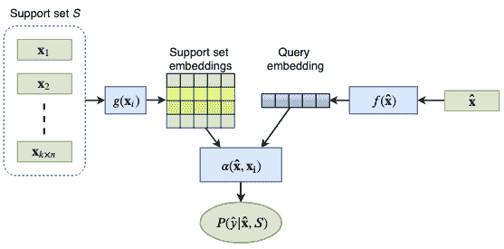
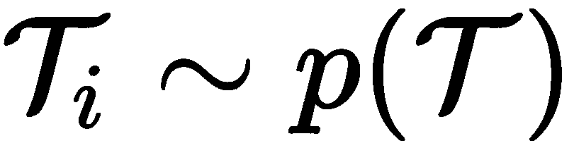
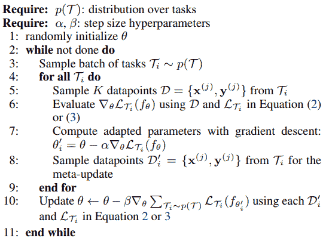
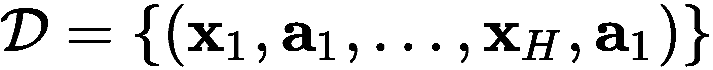

# 第十章：元学习

在第九章，《*新兴神经网络设计*》中，我们介绍了新的**神经网络**（**NN**）架构，以解决现有**深度学习**（**DL**）算法的一些局限性。我们讨论了用于处理结构化数据的图神经网络，这些数据表示为图形。我们还介绍了增强记忆的神经网络，允许网络使用外部记忆。在本章中，我们将探讨如何通过赋予 DL 算法更多的学习能力，以便在使用更少的训练样本的情况下学习更多的信息。

让我们通过一个例子来说明这个问题。假设一个人从未见过某种类型的物体，比如一辆车（我知道——这不太可能）。他们只需要看到一辆车一次，就能够识别其他的车。但是，这对于深度学习（DL）算法并非如此。一个深度神经网络（DNN）需要大量的训练样本（有时还需要数据增强），才能识别某一类物体。即便是相对较小的 CIFAR-10 ([`www.cs.toronto.edu/~kriz/cifar.html`](https://www.cs.toronto.edu/~kriz/cifar.html)) 数据集，也包含了 50,000 张用于 10 类物体的训练图片，相当于每类 5,000 张图片。

元学习，也称为“学习如何学习”，使得**机器学习**（**ML**）算法能够利用并传递在多个训练任务中获得的知识，从而提高其在新任务上的训练效率。希望通过这种方式，算法在学习新任务时所需的训练样本更少。用更少的样本进行训练有两个优势：缩短训练时间和在训练数据不足时仍能取得良好的性能。在这方面，元学习的目标与我们在第二章《*理解卷积网络*》中介绍的迁移学习机制类似。实际上，我们可以将迁移学习视为一种元学习算法。但元学习有多种方法。在本章中，我们将讨论其中的一些方法。

本章将涵盖以下主题：

+   元学习简介

+   基于度量的元学习

+   基于优化的元学习

# 元学习简介

正如我们在介绍中提到的，元学习的目标是让机器学习算法（在我们的例子中是神经网络）相较于标准的监督学习，通过较少的训练样本进行学习。一些元学习算法通过在已知任务领域的现有知识与新任务领域之间找到映射来实现这一目标。其他算法则是从零开始设计，旨在通过较少的训练样本进行学习。还有一些算法引入了新的优化训练技术，专门为元学习设计。但在我们讨论这些主题之前，先介绍一些基本的元学习范式。在标准的机器学习监督学习任务中，我们的目标是通过更新模型参数*θ*（在神经网络中是网络权重），在训练数据集`D`上最小化成本函数*J(θ)*。正如我们在介绍中提到的，在元学习中，我们通常会处理多个数据集。因此，在元学习情景下，我们可以通过以下方式扩展这个定义：我们旨在通过这些数据集的分布*P(D)*最小化*J(θ)*：


在这里，是最优模型参数，是成本函数，现在它依赖于当前数据集和模型参数。换句话说，目标是找到模型参数，使得成本在所有数据集上的期望值（如在第一章中所描述，*神经网络的基础*部分，*随机变量和概率分布*章节）被最小化。我们可以将这种情景看作是在单个数据集上进行训练，而这个数据集的训练样本本身也是数据集。

接下来，让我们继续扩展我们在介绍中使用的表达式*较少的训练样本*。在监督训练中，我们可以将这种稀缺训练数据的情景称为**`k`-shot 学习**，其中`k`可以是 0、1、2，依此类推。假设我们的训练数据集包含分布在`n`个类别中的标记样本。在`k`-shot 学习中，我们为每个`n`个类别提供`k`个标记训练样本（总的标记样本数为*n × k*）。我们将这个数据集称为**支持集**，用`S`表示。我们还有一个**查询集** `Q`，其中包含属于`n`个类别之一的未标记样本。我们的目标是正确分类查询集中的样本。有三种类型的`k`-shot 学习：零-shot、one-shot 和 few-shot。让我们从零-shot 学习开始。

# 零-shot 学习

我们将从零-shot 学习（`k` = 0）开始，在这种情况下，我们知道某个特定类别存在，但我们没有该类别的任何标记样本（即没有支持集）。一开始，这听起来不可能——我们如何分类我们从未见过的东西？但在元学习中，情况并非完全如此。回想一下，我们通过以前学过的任务的知识（我们用`a`表示它们）来处理当前任务（`b`）。从这个角度来看，零-shot 学习是一种迁移学习。为了理解它是如何工作的，假设一个人从未见过大象（另一个极不可能的例子），但他们必须在看到大象的图片时进行识别（新任务`b`）。然而，这个人在书中读到大象是很大、灰色的，四条腿、大耳朵，还有一个象鼻（先前任务`a`）。根据这个描述，当他们看到大象时，他们会很容易识别出来。在这个例子中，这个人将他们在以前学到的任务领域（读书）中的知识应用到新任务（图像分类）领域。

在机器学习的背景下，这些特征可以编码为非人类可读的嵌入向量。我们可以通过使用语言建模技术（如 word2vec 或 transformers）来编码单词*elephant*的基于上下文的嵌入向量，从而在神经网络领域复制象识别的示例。我们还可以使用卷积神经网络（CNN）来生成一张象的图像的嵌入向量`h`[`b`]。让我们一步步来看如何实现：

1.  对标记和未标记样本`a`和`b`应用编码器`f`和 g（神经网络），分别生成嵌入`h`[`a`]和`h`[`b`]。

1.  使用映射函数将`h`[`b`]转换到已知样本的嵌入`h`[`a`]的向量空间。映射函数也可以是一个神经网络。此外，编码器和映射函数可以结合在一个模型中并联合学习。

1.  一旦我们得到了查询样本的转化表示，我们可以将其与所有表示`h`[`a`]*进行比较，使用相似度度量（例如余弦相似度）。然后，我们假设查询样本的类别与与查询最相关的支持样本的类别相同。下图说明了这一场景：


零-shot 学习之所以可能，是因为迁移学习。灵感来源于《深度学习》第十五章，网址为 [`www.deeplearningbook.org/`](http://www.deeplearningbook.org/)

让我们正式化零次学习场景。在传统的分类任务中，使用单一数据集，神经网络表示条件概率 ，其中`y`是输入样本`x`的标签，*θ*是模型参数。在元学习中，`x`和`y`属于传统数据集，但我们引入了一个随机变量`T`，它描述了我们感兴趣的新任务。在我们的例子中，`x`将是词语*elephant*的上下文（周围的词），而标签`y`是类别 elephant 的独热编码。另一方面，`T`将是我们感兴趣的一张图片；因此，元学习模型表示一个新的条件概率 。我们刚才描述的零次学习场景是所谓的基于度量的元学习的一部分（稍后我们将在本章中看到更多示例）。现在，让我们继续讨论单次学习。

# 单次学习

在本节中，我们将讨论**单次学习**（*k = 1*）及其推广的**少量学习**（*k > 1*）。在这种情况下，支持集不是空的，我们有每个类别的一或多个标记样本。这相比于零次学习场景是一种优势，因为我们可以依赖来自同一领域的标记样本，而不是使用来自另一个领域的标记样本映射。因此，我们只需要一个编码器`f`，无需额外的映射。

一种典型的单次学习任务是公司的面部识别系统。该系统应该能够基于单张照片识别员工的身份。同样，也应该能够通过单张照片添加新员工。值得注意的是，在这种情况下，添加新员工相当于添加一个已经见过的新类别（照片本身），但其他方面是未知的。这与零次学习相对，后者是我们有未见过的但已知的类别。解决这个任务的一种简单方法是使用分类**前馈神经网络**（**FFN**），该网络将照片作为输入，并通过一个 softmax 输出，其中每个类别代表一个员工。这个系统将有两个主要缺点。首先，每次添加新员工时，我们都必须使用所有员工的完整数据集重新训练整个模型。其次，我们需要每个员工的多张图片来训练模型。

以下描述基于在*Matching Networks for One Shot Learning*（[`arxiv.org/abs/1606.04080`](https://arxiv.org/abs/1606.04080)）中提出的方法。该论文有两个主要贡献：一种新的单次训练过程和一种特殊的网络架构。在本节中，我们将讨论训练过程，并在*Matching networks*部分描述网络架构。

我们也可以在一-shot 学习框架内解决这个任务。我们首先需要的是一个经过预训练的网络，该网络能够生成员工图像的嵌入向量。我们假设预训练使得网络可以为每张照片生成一个足够独特的嵌入 `h`。我们还将所有员工的照片存储在某个外部数据库中。为了提高性能，我们可以将网络应用于所有照片，然后将每张图像的嵌入也存储下来。我们将重点关注这样一种使用场景：系统必须识别一个现有员工，当他或她尝试用一张新照片进行身份验证时。我们将使用网络生成该照片的嵌入，然后将其与数据库中的嵌入进行比较。通过将数据库中的嵌入与当前照片的嵌入进行最匹配的比较，我们就能识别出该员工。

接下来，让我们看一下在系统中添加新员工时的使用案例。在这里，我们只需要拍一张该员工的照片并将其存储在数据库中。这样，每次员工尝试进行身份验证时，系统都会将他们当前的照片与初始照片进行对比（以及所有其他照片）。通过这种方式，我们在不改变网络的情况下添加了一个新类别（员工）。我们可以将员工照片/身份数据库视为一个支持集 。任务的目标是将这个支持集映射到一个分类器 ，该分类器会根据之前未见过的查询样本  输出一个标签的概率分布 。在我们的例子中，  配对表示之前不在系统中的新员工（即新的查询样本和新类别）。

换句话说，我们希望能够在现有支持集的帮助下预测以前从未见过的类别。我们将映射  定义为一个条件概率 ，由一个具有权重 *θ* 的神经网络实现。此外，我们还可以将一个新的支持集  输入到同一个网络中，这将导致一个新的概率分布 。通过这种方式，我们可以在不改变网络权重 *θ* 的情况下对输出进行条件化，以适应新的训练数据。

现在我们已经熟悉了 `k`-shot 学习，让我们来看一下如何在少量样本的数据集上训练一个算法。

# 元训练和元测试

我们在*零-shot 学习*和*单-shot 学习*部分描述的场景被称为**元测试****阶段**。在这个阶段，我们利用预训练网络的知识，并通过仅使用少量支持集（或者根本不使用支持集）来预测以前未见过的标签。我们还有一个**元训练阶段**，在这个阶段我们在少-shot 环境下从头开始训练一个网络。《*匹配网络用于单-shot 学习*》的作者们介绍了一种与元测试密切匹配的元训练算法。这是必要的，因为我们需要在期望的测试阶段条件下训练模型。由于我们从头开始训练网络，训练集（记作*`D`*）不是一个少-shot 数据集，而是包含每个类别的足够多的标注样本。尽管如此，训练过程仍然模拟了一个少-shot 数据集。

以下是其工作原理：

1.  从标签集中采样一个标签集 ，其中`T`是`D`中所有标签的集合。为了澄清，`L`仅包含`T`中部分标签。这样，训练过程在模型仅看到少量样本时就能模拟测试。例如，向人脸识别系统中添加一名新员工只需要一张图片和一个标签。

1.  从支持集采样 ，其中所有样本的标签来自于，并且只包含 L 的一部分 。支持集包含每个标签的`k`个样本。

1.  从训练批次采样 ，其中 （与支持集相同）。和的组合表示一次训练**回合**。我们可以将回合视为一个独立的学习**任务**，并对应一个数据集。或者，在监督学习中，一次回合仅是一个训练样本。

1.  在回合中优化网络权重。网络表示概率 ，并使用和作为输入。为了澄清，集合由元组组成，这些元组以支持集为条件。这是训练过程中的“元”部分，因为模型学会了从支持集学习，以最小化整个批次的损失。模型使用以下交叉熵目标：


在这里， 和  分别反映了标签和示例的采样。我们将其与经典的监督学习场景中的相同任务进行比较。在这种情况下，我们从数据集`D`中采样小批量`B`，并且没有支持集。采样是随机的，不依赖于标签。然后，前面的公式将转化为以下形式：


元学习算法可以分为三大类：基于度量的、基于模型的和基于优化的。在本章中，我们将专注于基于度量和基于优化的方法（不包括基于模型的）。基于模型的元学习算法对实现概率 的机器学习算法类型没有任何限制。也就是说，不要求编码器和映射函数。相反，它们依赖于专门适配的小样本标注的网络架构。你可能还记得在第九章，《*新兴神经网络设计*》中，我们讨论了当时我们在分析*使用记忆增强神经网络进行单次学习*论文时引入的一个模型（[`arxiv.org/abs/1605.06065`](https://arxiv.org/abs/1605.06065)）。正如其名所示，这篇论文展示了在单次学习框架中使用记忆增强神经网络的应用。由于我们已经讨论过网络架构，而且训练过程与本节描述的相似，因此我们不会在本章中再提供一个基于模型的示例。

既然我们已经介绍了元学习的基本概念，接下来的部分将专注于基于度量的学习算法。

# 基于度量的元学习

在我们讨论*元学习简介*章节中的单次学习场景时提到了基于度量的方法，但这种方法通常适用于`k`-次学习。其思想是衡量无标签查询样本  与支持集中的所有其他样本  之间的相似度。利用这些相似度得分，我们可以计算概率分布 。以下公式反映了这一机制：


在这里，*α* 是查询样本与  之间的相似度度量，表示带有 `n` 类别和每个类别 `k` 个样本的支持集的大小。为了明确，查询样本的标签仅仅是支持集所有样本的线性组合。与查询样本相似度更高的样本类别会对查询样本标签的分布产生更大的贡献。我们可以将 *α* 实现为聚类算法（例如 `k`-最近邻）或注意力模型（正如我们在接下来的部分中将看到的）。在零-shot 学习的情况下，这个过程有两个正式步骤：计算样本的嵌入表示，然后计算嵌入表示之间的相似度。但前面的公式是这两个步骤的广义组合，它直接从查询样本中计算相似度（尽管在内部，这些步骤可能仍然是分开的）。两步度量基础学习（包括编码器 `f` 和 `g`）在下图中进行了说明：



通用度量基础学习算法

在接下来的几部分中，我们将讨论一些更受欢迎的度量元学习算法。

# 一次性学习的匹配网络

我们已经讨论了在《元学习介绍》部分中与匹配网络一起引入的训练过程。现在，让我们关注实际的模型，从我们在*度量基础元学习*部分概述的相似度度量开始。*实现这一点的一种方法是使用余弦相似度（记作 `c`），然后是 softmax：*


这里，`f` 和 `g` 分别是新任务样本和支持集样本的编码器（正如我们讨论的，`f` 和 `g` 可能是相同的函数）。这些编码器可以是用于图像输入的卷积神经网络（CNN）或在自然语言处理任务中使用的词嵌入，例如 word2vec。这个公式与我们在第八章《序列到序列模型与注意力机制》中介绍的注意力机制非常相似。

按照当前定义，编码器 `g` 每次仅对一个支持样本进行编码，独立于支持集中的其他样本。然而，`i` 和 `j` 两个样本的嵌入  和  可能在嵌入特征空间中非常接近，但这两个样本可能具有不同的标签。论文的作者建议修改 `g`，使其将整个支持集 `S` 作为额外输入：。通过这种方式，编码器可以基于 `S` 条件化  的嵌入向量，避免这个问题。我们也可以对编码器 `f` 应用类似的逻辑。论文将这种新的嵌入函数称为 **完整上下文嵌入**。

让我们看看如何在 `f` 上实现完整的上下文嵌入。首先，我们将引入一个新函数 ，它类似于旧的编码器（在包括 `S` 作为输入之前）——也就是说，*f'* 可以是 CNN 或词嵌入模型，它独立于支持集创建样本嵌入。 的结果将作为完整嵌入函数  的输入。我们将支持集视为一个序列，这使我们可以使用长短期记忆（LSTM）对其进行嵌入。因此，计算嵌入向量是一个多步骤的顺序过程。

然而，`S` 是一个集合，这意味着序列中样本的顺序并不重要。为了反映这一点，算法还使用了一个特殊的注意力机制来处理支持集中的元素。通过这种方式，嵌入函数可以关注序列中所有先前的元素，而不管它们的顺序如何。

让我们看看编码器的一个步骤是如何工作的：

1.  ，其中 `t` 是输入序列的当前元素， 是一个中间隐藏状态， 是步骤 *t-1* 时的隐藏状态， 是细胞状态。注意力机制通过一个向量  实现，它与隐藏状态  连接。

1.  ，其中  是步骤 `t` 时的最终隐藏状态。

1.  ，其中  是支持集的大小，`g` 是支持集的嵌入函数，α 是一个相似性度量，定义为乘法注意力，随后进行 softmax：


这个过程持续进行`T`步（`T`是一个参数）。我们可以用以下公式总结：


接下来，让我们关注`g`的完整上下文嵌入。像`f`一样，我们将引入一个新函数，，它类似于旧的编码器（在包括`S`作为输入之前）。作者建议使用双向 LSTM 编码器，定义如下：


这里，和是两个方向上的单元隐藏状态。我们可以按如下方式定义它们：


在下一节中，我们将讨论另一种基于度量的学习方法——孪生网络。

# 孪生网络

在本节中，我们将讨论*孪生神经网络用于一次性图像识别*论文（[`www.cs.cmu.edu/~rsalakhu/papers/oneshot1.pdf`](https://www.cs.cmu.edu/~rsalakhu/papers/oneshot1.pdf)）。孪生网络是由两个相同的基础网络组成的系统，如下图所示：


孪生网络

这两个网络在共享相同架构和相同参数（权重）方面是相同的。每个网络接收一个输入样本，最后一个隐藏层生成该样本的嵌入向量。这两个嵌入向量被输入到一个距离度量中。这个距离经过进一步处理，产生系统的最终输出，该输出为二进制值，表示两个样本是否来自同一类。该距离度量本身是可微的，这使我们能够将这两个网络作为一个整体进行训练。论文的作者建议使用*L1*距离：


这里，是基础网络。在一次性学习场景中使用孪生网络遵循我们在*元训练和元测试*部分中描述的相同基本思路，但在这种情况下，任务被简化，因为我们始终只有两个类别（相同或不同），无论数据集中的实际类别数是多少。在元训练阶段，我们使用一个大型标注数据集来训练系统。我们通过生成图像对和二进制标签样本来完成这一点，标签可以是相同的或不同的类别。在元测试阶段，我们有一个查询样本和一个支持集。然后，我们创建多个图像对，每对图像包含查询样本和支持集中的一个样本。图像对的数量与支持集的大小相同。接着，我们将所有图像对输入到孪生系统中，并选择距离最小的那一对。查询图像的类别由该对的支持样本的类别决定。

# 实现孪生网络

在这一部分，我们将使用 Keras 实现一个简单的孪生网络示例，验证两张 MNIST 图像是否属于同一类别。它部分基于 [`github.com/keras-team/keras/blob/master/examples/mnist_siamese.py`](https://github.com/keras-team/keras/blob/master/examples/mnist_siamese.py)。

让我们一步步来看如何实现：

1.  我们将从导入语句开始：

```py
import random

import numpy as np
import tensorflow as tf
```

1.  接下来，我们将实现 `create_pairs` 函数来创建训练/测试数据集（用于训练和测试）：

```py
def create_pairs(inputs: np.ndarray, labels: np.ndarray):
    num_classes = 10

    digit_indices = [np.where(labels == i)[0] for i in range(num_classes)]
    pairs = list()
    labels = list()
    n = min([len(digit_indices[d]) for d in range(num_classes)]) - 1
    for d in range(num_classes):
        for i in range(n):
            z1, z2 = digit_indices[d][i], digit_indices[d][i + 1]
            pairs += [[inputs[z1], inputs[z2]]]
            inc = random.randrange(1, num_classes)
            dn = (d + inc) % num_classes
            z1, z2 = digit_indices[d][i], digit_indices[dn][i]
            pairs += [[inputs[z1], inputs[z2]]]
            labels += [1, 0]

    return np.array(pairs), np.array(labels, dtype=np.float32)
```

每个数据集样本由一对 MNIST 图像和一个二进制标签组成，标签表示它们是否来自同一类别。该函数创建了一个在所有类别（数字）中分布的相等数量的真/假样本。

1.  接下来，让我们实现 `create_base_network` 函数，它定义了孪生网络的一个分支：

```py
def create_base_network():
    return tf.keras.models.Sequential([
        tf.keras.layers.Flatten(),
        tf.keras.layers.Dense(128, activation='relu'),
        tf.keras.layers.Dropout(0.1),
        tf.keras.layers.Dense(128, activation='relu'),
        tf.keras.layers.Dropout(0.1),
        tf.keras.layers.Dense(64, activation='relu'),
    ])
```

该分支表示从输入到最后一个隐藏层的基础网络，然后进行距离度量。我们将使用一个由三个全连接层组成的简单神经网络。

1.  接下来，让我们从 MNIST 数据集开始，构建整个训练系统：

```py
(x_train, y_train), (x_test, y_test) = tf.keras.datasets.mnist.load_data()
x_train = x_train.astype(np.float32)
x_test = x_test.astype(np.float32)
x_train /= 255
x_test /= 255
input_shape = x_train.shape[1:]
```

1.  我们将使用原始数据集来创建实际的训练和测试验证数据集：

```py
train_pairs, tr_labels = create_pairs(x_train, y_train)
test_pairs, test_labels = create_pairs(x_test, y_test)
```

1.  然后，我们将构建孪生网络的基础部分：

```py
base_network = create_base_network()
```

`base_network` 对象在孪生系统的两个分支之间共享。通过这种方式，我们确保两个分支中的权重是相同的。

1.  接下来，让我们创建两个分支：

```py
# Create first half of the siamese system
input_a = tf.keras.layers.Input(shape=input_shape)

# Note how we reuse the base_network in both halfs
encoder_a = base_network(input_a)

# Create the second half of the siamese system
input_b = tf.keras.layers.Input(shape=input_shape)
encoder_b = base_network(input_b)
```

1.  接下来，我们将创建 L1 距离，它使用 `encoder_a` 和 `encoder_b` 的输出。它作为 `tf.keras.layers.Lambda` 层实现：

```py
l1_dist = tf.keras.layers.Lambda(
    lambda embeddings: tf.keras.backend.abs(embeddings[0] - embeddings[1])) \
    ([encoder_a, encoder_b])
```

1.  然后，我们将创建最终的全连接层，该层接受距离的输出并将其压缩为一个单一的 sigmoid 输出：

```py
flattened_weighted_distance = tf.keras.layers.Dense(1, activation='sigmoid') \
    (l1_dist)
```

1.  最后，我们可以构建模型并开始训练 20 个周期：

```py
# Build the model
model = tf.keras.models.Model([input_a, input_b], flattened_weighted_distance)

# Train
model.compile(loss='binary_crossentropy',
              optimizer=tf.keras.optimizers.Adam(),
              metrics=['accuracy'])

model.fit([train_pairs[:, 0], train_pairs[:, 1]], tr_labels,
          batch_size=128,
          epochs=20,
          validation_data=([test_pairs[:, 0], test_pairs[:, 1]], test_labels))
```

如果一切顺利，模型将达到大约 98% 的准确率。

接下来，我们将讨论另一种称为原型网络的度量学习方法。

# 原型网络

在少-shot 学习场景中，高容量模型（具有许多层和参数的神经网络）很容易发生过拟合。原型网络（如在 *Prototypical Networks for Few-shot Learning* 论文中讨论的，[`arxiv.org/abs/1703.05175`](https://arxiv.org/abs/1703.05175)）通过计算每个标签的特殊原型向量来解决这个问题，该向量是基于该标签的所有样本的。相同的原型网络还计算查询样本的嵌入。然后，我们测量查询嵌入与原型之间的距离，并根据此距离分配查询类别（有关更多细节，请参见本节后面）。

原型网络适用于零-shot 和少-shot 学习，如下图所示：


左图：少-shot 学习；右图：零-shot 学习。来源：[`arxiv.org/abs/1703.05175`](https://arxiv.org/abs/1703.05175)

让我们从少样本学习场景开始，其中每个类`k`的原型向量是该类所有样本的逐元素均值：


这里，是类`k`在支持集中的样本数量，是带有参数*θ*的原型网络。在零-shot 学习场景下，原型的计算方式如下：


这里，是元数据向量，它提供了标签的高层描述，是该向量的嵌入函数（编码器）。元数据向量可以提前给定或计算得出。

每个新的查询样本都通过样本嵌入与所有原型之间的距离进行 softmax 分类：


这里，`d`是距离度量（例如，线性欧氏距离）。

现在我们已经了解了原型网络背后的主要思想，接下来让我们聚焦于如何训练它们（这个过程类似于我们在*元学习简介*部分中概述的训练方法）。

在开始之前，我们先介绍一些符号：

+   `D`是少样本训练集。

+   `D[k]`是类`k`在`D`中的训练样本。

+   `T`是数据集中的类总数。

+   是每个训练轮次中选定的标签子集。

+   `N[S]`是每一轮每个类的支持样本数量。

+   `N[Q]`是每一轮查询样本的数量。

算法从训练集`D`开始，并输出代价函数`J`的结果。让我们逐步看看它是如何工作的：

1.  从标签集中采样！[](img/aeebc6f9-55ef-4356-a4c8-aa68957472ca.png)。

1.  对于`L`中的每个类`k`，执行以下操作：

    1.  采样支持集，其中。

    1.  采样查询集，其中。

    1.  从支持集计算类原型：


1.  初始化代价函数。

1.  对于`L`中的每个类`k`，执行以下操作：

    1.  对于每个查询样本，更新代价函数如下：


直观上，第一个组成部分（方括号中的部分）最小化查询样本与其对应类的原型之间的距离。第二项则最大化查询样本与其他类原型之间距离的和。

论文的作者们在 Omniglot 数据集上展示了他们的工作（[`github.com/brendenlake/omniglot`](https://github.com/brendenlake/omniglot)），该数据集包含 1,623 张手写字符的图像，收集自 50 种字母表。每个字符有 20 个示例，其中每个示例由不同的人类主试绘制。目标是将一个新的字符分类为 1,623 个类别中的一个。他们使用欧几里得距离训练原型网络，采用一次性学习和五次性学习的场景，并使用 60 个类别和每个类别 5 个查询点的训练集。以下截图展示了由原型网络学习的同一字母表的一个相似（但不相同）字符子集的`t`-SNE 可视化（[`lvdmaaten.github.io/tsne/`](https://lvdmaaten.github.io/tsne/)）。

即使这些可视化的字符只是彼此的微小变化，网络仍能将手绘字符紧密地聚类到类别原型周围。几个被误分类的字符已被用矩形框出，并且箭头指向正确的原型：


由网络学习到的相似字符子集的`t`-SNE 可视化；来源： [`arxiv.org/abs/1703.05175`](https://arxiv.org/abs/1703.05175)

这也结束了我们对原型网络和基于度量的元学习的描述。接下来，我们将重点讨论基于模型的方法。

# 基于优化的学习

到目前为止，我们讨论了基于度量的学习方法，它使用一种特殊的相似度度量（这种度量难以过拟合）来调整神经网络的表示能力，并且能够从少量训练样本的数据集中学习。另一种方法是基于模型的方式，依靠改进的网络架构（例如，增强记忆网络）来解决相同的问题。在这一部分，我们将讨论基于优化的方法，它通过调整训练框架以适应少样本学习的需求。更具体地说，我们将重点介绍一种叫做**模型无关元学习**（MAML；*Model-Agnostic Meta-Learning for Fast Adaptation of Deep Networks*，[`arxiv.org/abs/1703.03400`](https://arxiv.org/abs/1703.03400))的算法。顾名思义，MAML 可以应用于任何通过梯度下降训练的学习问题和模型。

引用原文：

我们方法的核心思想是训练模型的初始参数，使得在通过少量数据从新任务中进行一次或多次梯度更新后，模型能够在新任务上实现最佳性能。

...

训练模型参数的过程，使得通过少量的梯度更新，甚至单次梯度更新，就能在新任务上取得良好结果，可以从特征学习的角度看作是构建一个对多任务广泛适用的内部表示。如果这个内部表示适用于多任务，那么仅通过微调参数（例如，主要修改前馈模型中的顶层权重）就能得到良好的结果。实际上，我们的过程是优化那些容易且快速微调的模型，允许在适合快速学习的空间内发生适应。从动态系统的角度来看，我们的学习过程可以被视为最大化新任务的损失函数对参数的敏感度：当敏感度高时，对参数的小的局部变化可以导致任务损失的大幅改善。

本工作的主要贡献是一个简单的、与任务无关的元学习算法，它训练模型的参数，使得少量的梯度更新就能在新任务上快速学习。我们在不同的模型类型（包括全连接网络和卷积网络）以及多个不同领域（包括少样本回归、图像分类和强化学习）中展示了该算法。我们的评估表明，尽管使用较少的参数，我们的元学习算法与专门为监督分类设计的一次学习方法相比较具有优势，并且还可以轻松应用于回归，并在任务变异性存在时加速强化学习，显著超越作为初始化的直接预训练。

为了理解 MAML，我们将介绍一些特定于论文的符号（其中一些与前面章节中的符号重叠，但我更倾向于保留论文中的原始符号）：

+   我们用*,*表示模型（神经网络），它将输入`x`映射到输出`a`。

+   我们用表示完整的训练集（等同于数据集`D`）。与*元训练和元测试*部分的元训练类似，我们在训练过程中从中采样任务（等同于回合）。该过程被定义为一个关于任务的分布。

+   我们用表示一个任务（一个回合）。它通过损失函数（等同于损失`J`）、初始观察分布、转移分布和长度`H`来定义。

为了理解 MAML 任务定义的一些组成部分，我们需要注意，除了监督学习问题外，MAML 也可以应用于**强化学习**（**RL**）任务。在强化学习框架中，我们有一个环境和一个代理，它们不断相互作用。在每个步骤中，代理采取一个动作（从多个可能的动作中选择），环境则提供反馈。反馈包括奖励（可能是负奖励）以及代理动作后的新环境状态。然后，代理再采取新的动作，以此类推，如下图所示：


强化学习框架

许多现实世界的任务可以表示为强化学习（RL）问题，包括游戏，其中代理是玩家，环境是游戏宇宙。

我们可以在监督学习和强化学习的背景下看待任务！[](img/56d99c2b-8167-4080-9483-ed465ed1f3d3.png)。在监督学习任务中，我们有标注的训练样本！[](img/df638237-5175-4d54-bbda-b4eafb34a6a5.png)，这些样本的顺序没有特定要求。但在强化学习的背景下，我们可以将输入`x`视为环境状态，将输出`a`视为代理的动作。在这种情况下，任务是顺序的——状态`x`[`1`]导致动作`a`[`1`]，进而导致状态`x`[`2`]，依此类推。环境的初始状态表示为！[](img/ad65abcb-0d83-4ffe-aae4-b8e50ef72d3d.png)。这意味着！[](img/1aaba41c-f1ed-4a83-9010-848ce3f9438e.png)是给定前一个状态`x`[`t`]和代理的动作`a`[`t`]时，新环境状态`x`[*t+1*]的概率。损失函数！[](img/aded729e-1ffc-4689-9b56-719691cfaa4b.png)在这两种情况下也可以这样理解：在监督学习场景中是误分类损失，而在强化学习场景中则是成本函数（即提供奖励的函数）。

现在我们已经熟悉了符号表示，让我们聚焦于 MAML 算法。为了理解它是如何工作的，我们将看一下原始论文中的另一个引用：

我们提出了一种方法，通过元学习可以学习任何标准模型的参数，以便为该模型的快速适应做准备。该方法背后的直觉是，一些内部表示比其他表示更具可迁移性。例如，神经网络可能会学习到一些广泛适用于所有任务的内部特征，而不仅仅是针对某个特定任务。我们如何鼓励此类通用表示的出现？我们采取了一种明确的方法来解决这个问题：由于模型将使用基于梯度的学习规则在新任务上进行微调，我们的目标是以这样的方式学习模型，使得该基于梯度的学习规则能够在从  中抽取的新任务上迅速取得进展，而不至于过拟合。实际上，我们的目标是找到对任务变化敏感的模型参数，使得当参数朝着该损失函数的梯度方向变化时，任何从  中抽取的任务的损失函数都会大幅改进。

经过这些悬念后，让我们看看 MAML 算法，其伪代码如下所示：


MAML 算法：来源：[`arxiv.org/abs/1703.03400`](https://arxiv.org/abs/1703.03400)

该算法有一个外部循环（第 2 行）和一个内部循环（第 4 行）。我们将从内部循环开始，它遍历一系列任务，这些任务是从任务分布中抽样得到的 。让我们关注单次循环迭代，它处理一个单独的任务 ，该任务有  训练样本，其中  是该任务的支持集。训练样本将在以下步骤中作为批处理进行处理（参见前面的截图第 4 行至第 7 行）：

1.  将样本通过模型传播并计算损失 。

1.  计算相对于初始参数 *θ* 的误差梯度 。

1.  向后传播梯度并计算更新后的模型参数 ，其中 α 是学习率。请注意，参数  是辅助参数，特定于每个任务。为了澄清，每当内部循环为一个新任务  开始一个新迭代时，模型总是从相同的初始参数 *θ** 开始。与此同时，每个任务会将其更新的权重存储为一个附加变量 ，而不会实际修改初始参数 *θ*（我们将在外部循环中更新原始模型）。

1.  我们可以对同一任务执行多次这样的梯度更新。可以把它当作在多个批次上训练，只不过在内部循环中额外嵌套了一个循环。在这种情况下，算法在每次迭代 `i` 时，使用的是上一次迭代的权重 ，而不是初始参数 *θ*，如下公式所示：


在多次迭代的情况下，仅保留最新的权重 。

只有在内部循环完成后，我们才能基于所有任务的反馈  来更新原始模型的初始参数 *θ*。为了理解为什么这是必要的，下面是一个图示：


MAML 优化能够快速适应新任务的参数 *θ*：来源: [`arxiv.org/abs/1703.03400`](https://arxiv.org/abs/1703.03400)

这显示了三个任务  沿全局误差梯度的误差梯度。假设我们不使用内部/外部循环机制，而是按顺序遍历每个任务，并在每个小批次后简单更新原始模型参数 *θ*。我们可以看到，不同损失函数的梯度会将模型推向完全不同的方向；例如，任务 2 的误差梯度与任务 1 的梯度会相互对立。MAML 通过汇总（但不应用）来自内部循环的每个任务的更新权重（辅助参数 ）来解决这个问题。然后，我们可以计算外部循环的代价函数（称为元目标），结合所有任务的更新权重一次性进行优化（这是跨任务的元优化）：


我们使用以下公式来更新主模型参数的权重：


这里，β 是学习率。外部循环任务 （MAML 伪代码程序的第 8 行）与内部循环任务（第 3 行）不同。我们可以将内部循环任务看作训练集，外部循环任务看作验证集。需要注意的是，我们使用特定任务的参数  来计算损失，但我们计算的损失梯度是相对于初始参数 *θ* 的。为了澄清，这意味着我们需要通过外部循环和内部循环进行反向传播。这被称为二阶梯度，因为我们计算的是梯度的梯度（二阶导数）。这使得即使经过多次更新，模型仍然可以学习到能够泛化到任务的参数。

MAML 的一个缺点是通过完整计算图（外循环和内循环）进行反向传播是计算密集型的。此外，由于反向传播步骤众多，它可能会遭遇梯度消失或爆炸的问题。为了更好地理解这一点，我们假设有一个单一任务（我们将在公式中省略它）；我们对该任务执行一次梯度步骤（一次内循环迭代），内循环更新后的参数是。即，我们将损失函数的符号从改为。然后，外循环的参数更新规则变为：


我们可以借助链式法则计算损失相对于初始参数*θ*的梯度（见第一章，*神经网络的基础*）：


我们可以看到公式中包含了二阶导数。MAML 的作者提出了所谓的**一阶 MAML**（**FOMAML**），即简单地忽略项。这样，我们得到，FOMAML 的梯度变为：


这个简化的公式排除了计算量大的二阶梯度。

到目前为止，我们已经了解了通用的 MAML 算法，它适用于监督学习和强化学习环境。接下来，让我们专注于监督学习版本。我们可以回顾一下，在监督学习的情况下，每个任务都是一组不相关的输入/标签对，且每个任务的回合长度`H`为`1`。我们可以在以下伪代码中看到少样本监督学习的 MAML 算法（它与通用算法相似）：



MAML 用于少样本监督学习：来源：[`arxiv.org/abs/1703.03400`](https://arxiv.org/abs/1703.03400)

在之前的代码中，方程式 2 和 3 都指的是分类任务的交叉熵损失或回归任务的均方误差，表示内部循环训练集，表示外部循环的验证集。

最后，让我们讨论一下强化学习场景，如下伪代码所示：


MAML 用于少样本强化学习：来源：[`arxiv.org/abs/1703.03400`](https://arxiv.org/abs/1703.03400)

每个样本  代表一场游戏回合的轨迹，其中环境在步骤 `t` 处展示了代理的当前状态 。然后，代理（NN）使用 **策略**  将状态  映射到一个动作的分布 。该模型使用一种特殊类型的损失函数，旨在训练网络以最大化整个回合步骤中的奖励。

# 摘要

本章中，我们研究了元学习领域，这可以描述为学习如何学习。我们从元学习的介绍开始。更具体地，我们讨论了零-shot 学习和少-shot 学习，以及元训练和元测试。然后，我们重点介绍了几种基于度量的学习方法。我们研究了匹配网络，实施了一个孪生网络的示例，并介绍了原型网络。接下来，我们集中讨论了基于优化的学习方法，并介绍了 MAML 算法。

在下一章中，我们将学习一个激动人心的主题：自动驾驶车辆。
