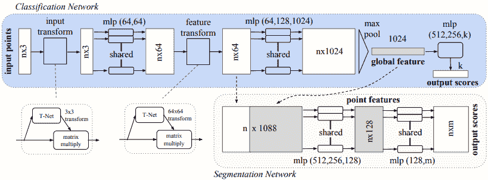
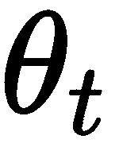

# 第十一章：自动驾驶车辆的深度学习

让我们思考一下**自动驾驶汽车**（**AVs**）将如何影响我们的生活。首先，除了集中精力开车，我们可以在旅行过程中做些其他事情。迎合这种旅行者的需求可能会催生一个全新的产业。但这只是附加的好处。如果我们能在旅途中提高生产力或仅仅放松身心，旅行可能会变得更加频繁，更不用说对那些无法自己驾驶的人群的好处。使交通这一基本而重要的商品变得更加可及，具有改变我们生活的潜力。而这只是对个人的影响——自动驾驶汽车对经济的影响也可能深远，从送货服务到即时制造。简而言之，自动驾驶汽车的成功实施是一场高风险的游戏。难怪近年来该领域的研究已经从学术界转向了现实经济。Waymo、Uber、NVIDIA 以及几乎所有主要的汽车制造商都在争相开发自动驾驶汽车。

然而，我们还没有到达目标。原因之一是自动驾驶是一项复杂的任务，由多个子问题组成，每个子问题本身都是一项重大任务。为了成功导航，车辆的程序需要准确的环境 3D 模型。构建该模型的方法是将来自多个传感器的信号结合起来。一旦我们拥有模型，仍然需要解决实际的驾驶任务。想想司机必须克服的许多意外和独特的情况，而不发生碰撞。但即使我们创建了一个驾驶策略，它几乎需要每次都做到 100%的准确度。假设我们的自动驾驶汽车能够成功地在 100 个红灯中停下 99 次。99%的准确率对于任何其他**机器学习**（**ML**）任务来说都是一个巨大成功；但对于自动驾驶而言，即使是一次错误也可能导致事故。

在本章中，我们将探讨深度学习在自动驾驶汽车中的应用。我们将了解如何利用深度网络帮助车辆理解周围的环境。我们还将看到它们如何实际应用于控制车辆。

本章将涉及以下主题：

+   自动驾驶汽车简介

+   自动驾驶汽车系统的组成部分

+   3D 数据处理简介

+   模仿驾驶策略

+   使用 ChauffeurNet 的驾驶策略

# 自动驾驶汽车简介

本部分将从自动驾驶汽车研究的简史开始（令人惊讶的是，这一研究始于很久以前）。我们还将尝试根据**汽车工程师协会**（**SAE**）定义自动驾驶汽车的不同自动化等级。

# 自动驾驶汽车研究的简史

第一次认真尝试实现自动驾驶汽车始于 1980 年代的欧洲和美国。从 2000 年代中期起，进展迅速加速。该领域的第一次重大努力是 Eureka Prometheus 项目 ([`en.wikipedia.org/wiki/Eureka_Prometheus_Project`](https://en.wikipedia.org/wiki/Eureka_Prometheus_Project))，该项目从 1987 年持续到 1995 年。1995 年，该项目达到了高潮，一辆自动驾驶的奔驰 S 级车完成了从慕尼黑到哥本哈根及其返回的 1,600 公里旅程，使用的是计算机视觉。在某些时段，该车在德国的高速公路上以最高时速达 175 公里/小时行驶（有趣的是：德国的某些高速公路没有限速）。这辆车能够自主超车。人类干预的平均距离为 9 公里，在某个时刻，它驾驶了 158 公里没有任何干预。

1989 年，卡内基梅隆大学的 Dean Pomerleau 发表了*ALVINN: 一种神经网络中的自主陆地车辆* ([`papers.nips.cc/paper/95-alvinn-an-autonomous-land-vehicle-in-a-neural-network.pdf`](https://papers.nips.cc/paper/95-alvinn-an-autonomous-land-vehicle-in-a-neural-network.pdf))，这是一篇关于神经网络在自动驾驶车辆（AV）中应用的开创性论文。这项工作尤其有趣，因为它在 30 年前就将本书中讨论的许多主题应用到了自动驾驶车辆中。让我们来看看 ALVINN 的最重要特性：

+   它使用一个简单的神经网络来决定车辆的转向角度（它不控制加速和刹车）。

+   网络完全连接，包含一个输入层、一个隐藏层和一个输出层。

+   输入包含以下内容：

    +   来自车载前视相机的一个 30×32 的单色图像（他们使用了 RGB 图像中的蓝色通道）。

    +   来自激光测距仪的一个 8×32 的图像。这只是一个网格，其中每个单元包含到该单元视场内最近障碍物的距离。

    +   一个标量输入，表示道路强度——即，路面是否比图像中来自相机的非路面区域更亮或更暗。这个值是递归地从网络输出中获得的。

+   一个包含 29 个神经元的单一全连接隐藏层。

+   一个包含 46 个神经元的全连接输出层。道路的曲率由 45 个神经元表示，方式类似于独热编码——也就是说，如果中间的神经元激活度最高，则表示道路是直的。相反，左侧和右侧的神经元表示增加的道路曲率。最终的输出单元表示道路强度。

+   网络在一个包含 1,200 张图像的数据集上进行了 40 轮训练：


ALVINN 的网络架构。来源：ALVINN 论文

接下来，我们来看一下（主要是）商业自动驾驶车辆进展的更近期时间线：

+   DARPA 大挑战 ([`en.wikipedia.org/wiki/DARPA_Grand_Challenge`](https://en.wikipedia.org/wiki/DARPA_Grand_Challenge)) 于 2004 年、2005 年和 2007 年举办。在第一年，参赛队伍的自动驾驶车辆（AVs）需要在莫哈维沙漠中完成 240 公里的路线。表现最好的自动驾驶车辆仅行驶了 11.78 公里，最终因卡在一块岩石上而停下。2005 年，队伍们需要在加利福尼亚州和内华达州克服 212 公里的越野路线。这一次，有五辆车成功完成了整个路线。2007 年的挑战是在一个模拟城市环境中导航，该环境建在一个空军基地内。总路线长度为 89 公里，参赛者需要遵守交通规则。六辆车完成了整个赛程。

+   2009 年，谷歌开始开发自动驾驶技术。这项工作最终促成了谷歌母公司字母表（Alphabet）旗下子公司 Waymo 的成立 ([`waymo.com/`](https://waymo.com/))。2018 年 12 月，他们在亚利桑那州凤凰城启动了首个商业化按需自动驾驶打车服务。2019 年 10 月，Waymo 宣布启动首个真正的无人驾驶汽车服务，这是他们机器人出租车服务的一部分（之前，始终有一名安全司机在场）。

+   Mobileye ([`www.mobileye.com/`](https://www.mobileye.com/)) 使用深度神经网络提供驾驶辅助系统（例如车道保持辅助）。该公司开发了一系列专门优化低能耗运行神经网络的**系统级芯片**（**SOC**）设备，满足汽车应用的需求。其产品已被许多主要汽车制造商使用。2017 年，Mobileye 被英特尔以 153 亿美元收购。从那时起，宝马、英特尔、菲亚特-克莱斯勒、上汽、大众、蔚来和汽车供应商德尔福（现为 Aptiv）开始在自动驾驶技术的联合开发上进行合作。2019 年前三个季度，Mobileye 的总销售额为 8.22 亿美元，而 2016 年四个季度的总销售额为 3.58 亿美元。

+   2016 年，通用汽车收购了自动驾驶技术开发公司 Cruise Automation ([`getcruise.com/`](https://getcruise.com/))，交易金额超过 5 亿美元（具体数字未知）。自那时以来，Cruise Automation 已经测试并展示了多个自动驾驶原型车，并在旧金山进行了测试。2018 年 10 月，宣布本田将通过投资 7.5 亿美元获得 5.7%的股权，加入这一合作项目。2019 年 5 月，Cruise 获得了一笔来自新老投资者的 11.5 亿美元追加投资。

+   2017 年，福特汽车公司收购了自动驾驶初创公司 Argo AI 的多数股权。2019 年，大众宣布将投资 26 亿美元于 Argo AI，作为与福特达成的更大交易的一部分。大众将提供 10 亿美元的资金，并将其拥有的价值 16 亿美元、位于慕尼黑、拥有超过 150 名员工的自动智能驾驶子公司贡献给该项目。

# 自动化等级

当我们谈论自动驾驶汽车时，通常会想象完全无人驾驶的车辆。但实际上，我们也有一些车辆虽然仍需驾驶员，但也提供某些自动化功能。

SAE 制定了六个级别的自动化等级：

+   **Level 0**：驾驶员负责车辆的转向、加速和制动。该级别的功能只能提供对驾驶员行为的警告和即时帮助。此级别的功能包括以下几种：

    +   车道偏离警告仅在车辆越过车道标线时提醒驾驶员。

    +   盲点警告在车辆的盲区区域（车辆后端的左侧或右侧区域）有其他车辆时提醒驾驶员。

+   **Level 1**：提供转向或加速/制动辅助功能的系统。当前车辆中最常见的这种功能包括：

    +   **车道保持辅助**（**LKA**）：车辆能够检测车道标线，并通过转向使自己保持在车道中央。

    +   **自适应巡航控制**（**ACC**）：车辆可以检测其他车辆，并通过制动和加速来保持预设的速度，或根据情况降低速度。

    +   **自动紧急制动**（**AEB**）：如果车辆检测到障碍物且驾驶员没有反应，车辆可以自动停止。

+   **Level 2**：为驾驶员提供转向和制动/加速辅助的功能。一个典型的例子是车道保持辅助（LKA）与自适应巡航控制的结合。在这个级别，车辆可以随时将控制权交还给驾驶员，而无需提前警告。因此，驾驶员必须始终保持对道路情况的关注。例如，如果车道标线突然消失，LKA 系统会提示驾驶员立即接管转向。

+   **Level 3**：这是我们可以讨论真正自动驾驶的第一个级别。它与 Level 2 的相似之处在于，车辆在某些有限的条件下可以自动驾驶，并且可以提示驾驶员接管控制；然而，这一过程会提前并给予足够时间，以便注意力不集中的人能及时熟悉道路状况。例如，假设车辆在高速公路上自动驾驶，但云连接的导航系统获取了前方道路施工的信息。驾驶员会在到达施工区域之前提前收到提示，提醒其接管驾驶。

+   **Level 4**：Level 4 的车辆在更多的情况下具有完全的自动化能力，相较于 Level 3。例如，本地限区域的出租车服务可能是 Level 4。此时不需要驾驶员接管控制。如果车辆驶出该区域，它应能够安全地中止行程。

+   **Level 5**：在所有情况下的完全自动驾驶。此时，方向盘是可选的。

今天所有市面上销售的车辆最多只有 2 级功能（即使是特斯拉的自动驾驶）。唯一的例外（根据制造商的说法）是 2018 款奥迪 A8，它拥有一个名为 AI 交通堵塞驾驶员的 3 级功能。该系统在车速最高达到 60 km/h 时，能够在有物理隔离带的多车道道路上自动驾驶。驾驶员会在 10 秒前收到提示，要求其接管控制。这项功能在该车型发布时曾展示过，但截至本章撰写时，奥迪因受限于法规，未在所有市场提供此功能。我没有相关信息显示该功能是否或在哪里可用。

在下一节中，我们将研究构成自动驾驶系统的各个组件。

# 自动驾驶系统的组件

本节将从软件架构的角度概述两种自动驾驶系统。第一种类型采用顺序架构，包含多个组件，如下图所示：


自动驾驶系统的组件

该系统类似于我们在第十章《元学习》中简要讨论过的强化学习框架。我们有一个反馈循环，其中环境（无论是物理世界还是仿真）提供给代理（车辆）其当前状态。代理则决定其新的行驶轨迹，环境对此作出反应，依此类推。让我们从环境感知子系统开始，它包含以下模块（我们将在接下来的章节中详细讨论）：

+   **传感器：**物理设备，如摄像头和雷达。

+   **定位：**确定车辆在高清地图中的精确位置（精确到厘米级）。

+   **移动物体检测与跟踪：**检测并跟踪其他交通参与者，如车辆和行人。

感知系统的输出将来自不同模块的数据进行合成，生成一个**中级**的周围环境虚拟表示。这种表示通常是一个从上方（鸟瞰）看的 2D 环境视图，称为**占用图**。以下截图展示了 ChauffeurNet 系统的一个占用图示例，我们将在本章后面详细讨论。它包括路面（白色和黄色线条）、交通信号灯（红色线条）以及其他车辆（白色矩形）。图片最好使用彩色显示：


ChauffeurNet 的占用图。来源： https://arxiv.org/abs/1812.03079

占用图作为**路径规划**模块的输入，后者利用它来确定车辆的未来行驶轨迹。**控制**模块将期望的轨迹转化为对车辆的低级控制指令。

中级表示方法有几个优点。首先，它非常适合路径规划和控制模块的功能。此外，除了使用传感器数据来创建自上而下的图像，我们还可以使用模拟器来生成图像。这样，我们可以更容易地收集训练数据，因为我们不必驾驶真实的汽车。更重要的是，我们将能够模拟现实世界中很少发生的情况。例如，我们的自动驾驶系统必须避免任何形式的碰撞，但现实世界中的训练数据几乎没有或根本没有碰撞。如果我们仅使用真实的传感器数据，最重要的驾驶情况将被严重低估。

第二种类型的自动驾驶系统使用单一的端到端组件，该组件将原始传感器数据作为输入，并以转向控制的形式生成驾驶策略，如下图所示：


端到端自动驾驶系统

事实上，当我们在*自动驾驶研究简史*章节讨论 ALVINN 时，已经提到过端到端系统。接下来，我们将重点讨论顺序系统的不同模块。稍后我们将在本章中更详细地介绍端到端系统。

# 环境感知

为了使任何自动化功能正常工作，车辆需要对周围环境有良好的感知。环境感知系统必须识别移动物体的确切位置、距离和方向，如行人、自行车骑行者和其他车辆。此外，它还需要创建路面和车辆在该路面以及整个环境中的确切位置的精确映射。接下来，我们将讨论帮助自动驾驶系统创建这种虚拟环境模型的硬件和软件组件。

# 感知

构建良好环境模型的关键是车辆传感器。以下是最重要的传感器列表：

+   **摄像头**：它的图像用于检测路面、车道标线、行人、自行车骑行者、其他车辆等。在汽车领域中，摄像头的一个重要特性（除了分辨率）是视场角。视场角测量摄像头在任何给定时刻可以看到多少可观察到的世界。例如，具有 180^o 视场角的摄像头可以看到它前方的所有内容，但看不见后方。具有 360^o 视场角的摄像头则可以看到它前方和后方的所有内容（全方位观察）。以下是几种不同类型的摄像头系统：

    +   **单目摄像头**：使用一个朝前的单一摄像头，通常安装在挡风玻璃的顶部。大多数自动化功能都依赖这种类型的摄像头来工作。单目摄像头的典型视场角为 125^o。

    +   **立体相机**：由两个略微分开安装的前向摄像头组成。两个相机之间的距离使得它们可以从略有不同的角度捕捉到同一幅画面，并将其合成成 3D 图像（与我们使用眼睛的方式相同）。立体系统可以测量图像中某些物体的距离，而单目相机只能依靠启发式方法来完成这一任务。

    +   **360^o 环视系统**：一些车辆配备了由四个相机（前、后、左、右）组成的系统。

    +   **夜视相机**：一种系统，车辆配备了一种特殊类型的前照灯，除了常规功能外，还能发射红外光谱中的光。这些光会被红外相机记录，并能向驾驶员显示增强的图像，帮助其在夜间识别障碍物。

+   **雷达**：一种系统，通过发射器向不同方向发射电磁波（在无线电或微波谱中）。当这些波到达物体时，通常会被反射，其中一部分波会朝向雷达本身的方向反射回来。雷达可以通过特殊的接收天线探测到这些反射波。因为我们知道无线电波以光速传播，所以通过测量发射和接收信号之间的时间差，我们可以计算出到反射物体的距离。我们还可以通过测量发射波和接收波的频率差（多普勒效应），来计算物体的速度（例如，另一辆车）。与相机图像相比，雷达的“图像”噪声更多，范围更窄，分辨率较低。例如，长距离雷达可以检测到 160 米远的物体，但视野仅为 12^o。雷达可以探测其他车辆和行人，但无法检测到路面或车道标线。雷达通常用于 ACC（自适应巡航控制）和 AEB（自动紧急制动），而 LKA 系统则使用相机。大多数车辆配备一个或两个前向雷达，偶尔也会配备后向雷达。

+   **激光雷达**（**光学探测与测距**）：这个传感器有点类似于雷达，但它不是使用无线电波，而是发射近红外光谱中的激光束。因此，一次发射的脉冲可以精确测量到一个单独点的距离。激光雷达非常快速地以一种模式发射多个信号，这样就能创建一个环境的 3D 点云（该传感器可以非常快速地旋转）。下面是一个车辆如何通过激光雷达看到世界的示意图：


车辆如何通过激光雷达看到世界的示意图

+   **声呐**（**声波导航与测距**）：这种传感器发射超声波脉冲，通过听取波在周围物体上反射回来的回声来绘制环境地图。与雷达相比，声呐成本较低，但其有效探测范围有限。因此，它们通常用于停车辅助功能。

多个传感器的数据可以通过一种叫做**传感器融合**的过程合并成一个统一的环境模型。传感器融合通常通过使用卡尔曼滤波器（[`en.wikipedia.org/wiki/Kalman_filter`](https://en.wikipedia.org/wiki/Kalman_filter)）来实现。

# 定位

**定位**是确定车辆在地图上精确位置的过程。为什么这很重要？像 HERE（[`www.here.com/`](https://www.here.com/)）这样的公司专注于创建极为精确的道路地图，这些地图中的道路表面区域的精度可达几厘米。这些地图还可能包括关于静态物体的信息，如车道标记、交通标志、交通信号灯、限速、斑马线、减速带等。因此，如果我们知道车辆在道路上的精确位置，那么计算最优轨迹就不再困难。

一个显而易见的解决方案是使用 GPS；然而，在完美条件下，GPS 的精度通常只能达到 1-2 米。在高楼大厦或山区等区域，GPS 的精度可能会受到影响，因为 GPS 接收器无法从足够数量的卫星接收到信号。解决这个问题的一种方法是使用**同步定位与地图构建**（**SLAM**）算法。这些算法超出了本书的范围，但我鼓励你自行研究这个话题。

# 移动物体检测与跟踪

现在我们已经了解了车辆使用的传感器，并且简要提到过了解其在地图上精确位置的重要性。通过这些知识，车辆理论上可以通过简单地跟随一系列细粒度的点来导航到目的地。然而，自动驾驶的任务并没有那么简单，因为环境是动态的，包括移动的物体，如车辆、行人、自行车和其他物体。自动驾驶车辆必须时刻了解这些移动物体的位置，并在规划其轨迹时进行跟踪。这是我们可以将深度学习算法应用于原始传感器数据的一个领域。首先，我们将针对摄像头进行这一应用。在第五章，*物体检测与图像分割*中，我们讨论了如何使用**卷积网络**（**CNNs**）进行两项先进的视觉任务——物体检测和语义分割。

总结一下，物体检测会在图像中不同类别的物体周围创建一个边界框。语义分割会为图像的每个像素分配一个类别标签。我们可以使用分割来检测路面和车道标记的确切形状。我们可以使用物体检测来分类和定位环境中感兴趣的移动物体；不过，我们已经在第五章中介绍了这些话题，*物体检测与图像分割*。本章将重点讨论激光雷达传感器，并讨论如何在该传感器生成的 3D 点云上应用 CNN。

现在我们已经概述了感知子系统的组成部分，在下一节中，我们将介绍路径规划子系统。

# 路径规划

路径规划（或驾驶策略）是计算车辆轨迹和速度的过程。尽管我们可能拥有准确的地图和车辆的精确位置，但我们仍然需要牢记环境的动态变化。汽车周围是其他移动的车辆、行人、交通信号灯等等。如果前方的车辆突然停下来会怎样？或者如果它行驶得太慢呢？我们的自动驾驶汽车必须做出超车的决策，并执行这一操作。这是机器学习和深度学习尤其能够发挥作用的领域，我们将在本章讨论两种实现方法。更具体地说，我们将讨论在端到端学习系统中使用模仿驾驶策略，以及 Waymo 开发的名为 ChauffeurNet 的驾驶策略算法。

自动驾驶研究中的一个障碍是，构建一个自动驾驶汽车并获得必要的测试许可非常昂贵且耗时。幸运的是，我们仍然可以借助自动驾驶模拟器来训练我们的算法。

以下是一些最受欢迎的模拟器：

+   Microsoft AirSim，基于虚幻引擎构建（[`github.com/Microsoft/AirSim/`](https://github.com/Microsoft/AirSim/)）

+   CARLA，基于虚幻引擎构建（[`github.com/carla-simulator/carla`](https://github.com/carla-simulator/carla)）

+   Udacity 的自动驾驶汽车模拟器，使用 Unity 构建（[`github.com/udacity/self-driving-car-sim`](https://github.com/udacity/self-driving-car-sim)）

+   OpenAI Gym 的`CarRacing-v0`环境（我们将在*模仿驾驶策略*部分看到一个例子）

这就是我们对自动驾驶系统各个组成部分的描述。接下来，我们将讨论如何处理 3D 空间数据。

# 3D 数据处理介绍

激光雷达（LiDAR）生成点云——一个三维空间中的数据点集。请记住，激光雷达发射激光束。激光束从一个表面反射并返回接收器时，会生成点云的一个数据点。如果我们假设激光雷达设备是坐标系的中心，并且每个激光束是一个向量，那么一个点由向量的方向和大小来定义。因此，点云是一个**无序集合**的向量。或者，我们可以通过它们在空间中的笛卡尔坐标来定义这些点，如下图左侧所示。在这种情况下，点云是一个向量集，每个向量包含该点的三个坐标。为了清晰起见，每个点被表示为一个立方体：


左图：3D 空间中的点（表示为立方体）；右图：体素的 3D 网格

接下来，让我们关注神经网络的输入数据格式，特别是卷积神经网络（CNN）。一张 2D 彩色图像表示为一个张量，具有三个切片（每个通道一个），每个切片是一个由像素组成的矩阵（2D 网格）。CNN 使用 2D 卷积（参见第二章，*理解卷积网络*）。直观上，我们可能会认为可以使用类似的 3D 网格体素（体素是 3D 像素）来处理 3D 点云，如前述图示的右侧所示。假设点云的点没有颜色，我们可以将网格表示为一个 3D 张量，并将其作为输入传递给具有 3D 卷积的 CNN。

然而，如果我们仔细观察这个 3D 网格，就会发现它是稀疏的。例如，在前面的图示中，我们有一个包含 8 个点的点云，但网格包含 4 x 4 x 4 = 64 个单元。在这个简单的例子中，我们将数据的内存占用增加了 8 倍，但在现实世界中，情况可能更糟。 在这一部分，我们将介绍 PointNet（参见*PointNet: 深度学习在点集上的 3D 分类与分割*，[`arxiv.org/abs/1612.00593`](https://arxiv.org/abs/1612.00593)），它提供了解决此问题的方案。

PointNet 的输入是点云向量集`p`*[i]*，而不是它们的 3D 网格表示。为了理解其架构，我们将从导致网络设计的点云向量集的特性开始（以下要点摘自原始论文）：

+   **无序**：与图像中的像素数组或 3D 网格中的体素数组不同，点云是一个没有特定顺序的点集。因此，消耗`N` 3D 点集的网络需要对输入集在数据馈送顺序中的`N`!排列不变。

+   **点之间的交互**：类似于图像的像素，3D 点之间的距离可以表示它们之间的关系水平——即，附近的点更可能属于同一物体，而远离的点则可能不属于同一物体。因此，模型需要能够捕捉来自附近点的局部结构及其局部结构之间的组合交互。

+   **变换下的不变性**：作为一个几何对象，点集的学习表示应该对某些变换具有不变性。例如，旋转和移动所有点不应改变全局点云类别，也不应改变点的分割。

现在我们已经了解了这些前提条件，让我们来看看 PointNet 如何解决这些问题。我们将从网络架构开始，然后更详细地讨论其组件：



PointNet 架构。来源：https://arxiv.org/abs/1612.00593

PointNet 是一个**多层感知器**（**MLP**）。这是一个前馈网络，仅由全连接层组成（还有最大池化层，但稍后会详细介绍）。正如我们所提到的，输入点云向量集合 `p`*[i]* 被表示为 `n` × 3 张量。需要注意的是，网络（直到最大池化层）是**共享的**，应用于集合中所有点。也就是说，尽管输入大小是 `n` × 3，我们可以认为 PointNet 是对大小为 1 × 3 的 `n` 个输入向量应用相同的网络 `n` 次。换句话说，网络权重在所有点云点之间是共享的。这种顺序安排还允许输入点的数量是任意的。

输入经过输入变换（稍后会详细介绍），输出另一个 `n` × 3 张量，其中每个 `n` 点由三个分量定义（类似于输入张量）。这个张量被输入到一个上采样全连接层，该层将每个点编码为一个 64 维向量，输出为 `n` × 64。网络继续进行另一次变换，类似于输入变换。然后，结果通过 64、128 和最终 1,024 个全连接层逐渐上采样，产生最终的 `n` × 1024 输出。这个张量作为输入传递到一个最大池化层，该层从所有 `n` 点中相同位置的元素中取最大值，并生成一个 1,024 维的输出向量。这个向量是整个点集的聚合表示。

但为什么一开始就使用最大池化呢？请记住，最大池化是一个对称操作——也就是说，无论输入的顺序如何，它都会产生相同的输出。同时，点的集合本身也是无序的。使用最大池化可以确保网络无论点的顺序如何，都会产生相同的结果。论文的作者选择最大池化而非其他对称函数（如平均池化和求和），是因为在基准数据集中，最大池化表现出了最高的准确率。

在最大池化后，网络根据任务类型分成两条网络（见前面的图示）：

+   **分类**：1024 维的聚合向量作为输入进入多个全连接层，最终输出`k`类的 softmax，其中`k`是类别的数量。这是一个标准的分类流程。

+   **分割**：该任务为集合中的每个点分配一个类别。作为分类网络的扩展，这个任务需要结合局部和全局知识。如图所示，我们将每个`n`个 64 维的中间点表示与全局 1024 维向量进行拼接，形成一个`n` × 1088 的张量。与网络的初始部分一样，这条路径也在所有点之间共享。每个点的向量通过一系列全连接层（从 1088 到 512，再到 256，最终到 128）被下采样到 128 维。最后的全连接层有`m`个单元（每个类别一个）并使用 softmax 激活函数。

到目前为止，我们已经通过最大池化操作明确处理了输入数据的无序性，但我们仍然需要解决点与点之间的变换不变性和相互作用。这就是输入和特征变换发挥作用的地方。我们先从输入变换开始（在前面的图示中，这是 T-net）。T-net 是一个多层感知机（MLP），与完整的 PointNet 类似（它被称为迷你 PointNet），如下图所示：


输入（和特征）变换 T-net

输入变换 T-net 将`n` × 3 点集（与全网络相同的输入）作为输入。与完整的 PointNet 一样，T-net 在所有点上共享。首先，输入通过 64 单元、128 单元和最终 1024 单元的全连接层上采样到`n` × 1024。上采样后的输出送入最大池化操作，输出 1 × 1024 向量。然后，该向量通过两个 512 单元和 256 单元的全连接层下采样为 1 × 256。该 1 × 256 向量与 256 × 9 的全局（共享）可学习权重矩阵相乘，结果被重新调整为 3 × 3 矩阵，再与原始输入点`p`*[i]*逐点相乘，最终生成`n` × 3 的输出张量。中间的 3 × 3 矩阵充当点集上的可学习仿射变换矩阵。通过这种方式，点相对于网络进行规范化——也就是说，网络在变换下保持不变。第二个 T-net（特征变换）与第一个几乎相同，唯一不同的是输入张量为`n` × 64，输出为 64 × 64 矩阵。

尽管全局最大池化层确保网络不受数据顺序的影响，但它也有另一个缺点，因为它创建了整个输入点集的单一表示；然而，这些点可能属于不同的物体（例如，车辆和行人）。在这种情况下，全局聚合可能会带来问题。为了解决这个问题，PointNet 的作者提出了 PointNet++（详见*PointNet++: Deep Hierarchical Feature Learning on Point Sets in a Metric Space*，可访问[`arxiv.org/abs/1706.02413`](https://arxiv.org/abs/1706.02413)），这是一种分层神经网络，通过对输入点集的嵌套划分递归应用 PointNet。

在本节中，我们探讨了在自动驾驶环境感知系统中处理 3D 数据的内容。在下一节中，我们将把注意力转向模仿驾驶策略的路径规划系统。

# 模仿驾驶策略

在*自动驾驶系统的组件*部分，我们概述了构建自动驾驶系统所必需的几个模块。在本节中，我们将介绍如何通过深度学习实现其中之一——驾驶策略。实现这种方法的一种方式是使用强化学习（RL），其中汽车是智能体，环境就是环境。另一种流行的方法是**模仿学习**，其中模型（网络）学习模仿专家（人类）的行为。我们来看一下在自动驾驶场景中模仿学习的特性：

+   我们将使用一种模仿学习方法，称为**行为克隆**。这意味着我们将以监督的方式训练我们的网络。另一种选择是，在强化学习（RL）场景中使用模仿学习，这种方法被称为逆强化学习（inverse RL）。

+   网络的输出是驾驶策略，表示为期望的转向角度和/或加速度或刹车。例如，我们可以为转向角度设置一个回归输出神经元，为加速度或刹车设置一个神经元（因为不能同时控制两者）。

+   网络输入可以是以下任意一种：

    +   端到端系统的原始传感器数据——例如来自前向摄像头的图像。AV 系统中，单一模型使用原始传感器输入并输出驾驶策略，称为**端到端**。

    +   用于顺序复合系统的中级环境表示。

+   我们将借助专家创建训练数据集。我们让专家手动驾驶车辆，无论是在真实世界还是模拟器中。在每一步旅程中，我们将记录以下内容：

    +   当前的环境状态。这可以是原始传感器数据或自上而下的视图表示。我们将使用当前状态作为模型的输入。

    +   在当前环境状态下专家的行为（转向角度和刹车/加速度）。这将是网络的目标数据。在训练过程中，我们只需通过常见的梯度下降方法最小化网络预测与驾驶员行为之间的误差。通过这种方式，我们将教会网络模仿驾驶员。

行为克隆场景如以下图所示：


行为克隆场景

如我们之前提到的，ALVINN（来自*自动驾驶研究简史*章节）是一个行为克隆的端到端系统。最近，论文*端到端自驾车学习*([`arxiv.org/abs/1604.07316`](https://arxiv.org/abs/1604.07316))介绍了一个类似的系统，使用具有五个卷积层的 CNN，取代了完全连接的网络。在他们的实验中，车载前向摄像头的图像被输入到 CNN 中。CNN 的输出是一个标量值，表示汽车的期望转向角度。网络不控制加速和刹车。为了构建训练数据集，论文的作者收集了大约 72 小时的真实世界驾驶视频。在评估过程中，车辆能够在郊区区域自行驾驶 98%的时间（不包括变道和从一条路转到另一条路）。此外，它还成功地在一条多车道的高速公路上行驶了 16 公里而没有干预。在接下来的章节中，我们将实现一些有趣的内容——一个使用 PyTorch 的行为克隆示例。

# 使用 PyTorch 进行行为克隆

在本节中，我们将实现一个基于 PyTorch 1.3.1 的行为克隆示例。为了帮助我们完成这一任务，我们将使用 OpenAI Gym（[`gym.openai.com/`](https://gym.openai.com/)），这是一个开源工具包，用于强化学习算法的开发和比较。它允许我们训练**智能体**完成各种任务，如走路或玩 Pong、Pinball 等 Atari 游戏，甚至 Doom。

我们可以通过 `pip` 安装它：

```py
pip install gym[box2d]
```

在这个示例中，我们将使用 `CarRacing-v0` OpenAI Gym 环境，如下图所示：


在 CarRacing-v0 环境中，智能体是一个赛车；始终使用俯视图。

这个示例包含多个 Python 文件。在本节中，我们将提及最重要的部分。完整的源代码可以在 [`github.com/PacktPublishing/Advanced-Deep-Learning-with-Python/tree/master/Chapter11/imitation_learning`](https://github.com/PacktPublishing/Advanced-Deep-Learning-with-Python/tree/master/Chapter11/imitation_learning) 找到。

目标是让红色赛车（称为**智能体**）尽可能快速地绕过赛道，同时避免滑出路面。我们可以通过四个动作来控制赛车：加速、刹车、左转和右转。每个动作的输入是连续的——例如，我们可以用 1.0 表示全油门，用 0.5 表示半油门（其他控制也是如此）。

为了简化问题，我们假设只能指定两个离散的动作值：0 表示不做任何动作，1 表示完全动作。由于最初这是一个强化学习环境，智能体会在每一步进行奖励，但我们不使用奖励，因为智能体将直接从我们的动作中学习。我们将执行以下步骤：

1.  创建一个训练数据集，通过自己驾驶汽车绕赛道（我们将使用键盘箭头控制）。换句话说，我们将成为代理试图模仿的专家。在每一集的每一步中，我们将记录当前游戏帧（状态）和当前按下的键，并将它们存储在一个文件中。这一步的完整代码可在 [`github.com/PacktPublishing/Advanced-Deep-Learning-with-Python/blob/master/Chapter11/imitation_learning/keyboard_agent.py`](https://github.com/PacktPublishing/Advanced-Deep-Learning-with-Python/blob/master/Chapter11/imitation_learning/keyboard_agent.py) 找到。你只需运行该文件，游戏即将开始。在你玩耍的过程中，每隔五集，就会在 `imitation_learning/data/data.gzip` 文件中记录一集。如果你想重新开始，只需简单地删除它。你可以通过按 *Escape* 退出游戏，按 *Spacebar* 暂停游戏。你还可以通过按 *Enter* 开始新一集。在这种情况下，当前集将被丢弃，其序列不会被存储。我们建议你至少玩 20 集，以获得足够大的训练数据集。建议经常使用制动，因为否则数据集会变得不平衡。在正常游戏中，加速度比制动或转向频繁使用得多。或者，如果你不想玩，仓库中已经包含了现有的数据文件。

1.  代理由 CNN 表示。我们将使用刚刚生成的数据集以监督方式对其进行训练。输入将是单个游戏帧，输出将是方向盘转向和制动/加速的组合。目标（标签）将是人类操作者记录的动作。如果你想跳过这一步骤，[`github.com/PacktPublishing/Advanced-Deep-Learning-with-Python/tree/master/Chapter11/imitation_learning/data/model.pt`](https://github.com/PacktPublishing/Advanced-Deep-Learning-with-Python/tree/master/Chapter11/imitation_learning/data/model.pt) 仓库中已经有一个训练好的 PyTorch 网络。

1.  让 CNN 代理通过使用网络输出来决定发送到环境的下一步动作来进行游戏。你可以通过简单运行 [`github.com/PacktPublishing/Advanced-Deep-Learning-with-Python/blob/master/Chapter11/imitation_learning/nn_agent.py`](https://github.com/PacktPublishing/Advanced-Deep-Learning-with-Python/blob/master/Chapter11/imitation_learning/nn_agent.py) 文件来实现这一点。如果之前两个步骤你都没有执行过，这个文件将使用现有的代理。

介绍完毕，让我们继续准备训练数据集。

# 生成训练数据集

在本节中，我们将介绍如何生成训练数据集并将其加载为 PyTorch 的 `torch.utils.data.DataLoader` 类的实例。我们会重点讲解代码中最相关的部分，但完整的源代码位于 [`github.com/PacktPublishing/Advanced-Deep-Learning-with-Python/blob/master/Chapter11/imitation_learning/train.py`](https://github.com/PacktPublishing/Advanced-Deep-Learning-with-Python/blob/master/Chapter11/imitation_learning/train.py)。

我们将分几步创建训练数据集：

1.  `read_data` 函数读取 `imitation_learning/data/data.gzip` 中的两个 `numpy` 数组：一个用于游戏帧，另一个用于与之相关的键盘组合。

1.  环境接受由三元素数组组成的动作，满足以下条件：

    +   第一个元素的值范围在 `[-1, 1]` 之间，表示转向角度（`-1` 表示右转，`1` 表示左转）。

    +   第二个元素的值在 `[0, 1]` 范围内，表示油门。

    +   第三个元素的值在 `[0, 1]` 范围内，表示刹车力度。

1.  我们将使用七种最常见的键位组合：`[0, 0, 0]` 表示没有操作（汽车滑行），`[0, 1, 0]` 表示加速，`[0, 0, 1]` 表示刹车，`[-1, 0, 0]` 表示左转，`[-1, 0, 1]` 表示左转和刹车的组合，`[1, 0, 0]` 表示右转，以及 `[1, 0, 1]` 表示右转和刹车的组合。我们故意避免了同时使用加速和左转或右转，因为那样会导致汽车非常不稳定。其他的组合是不可能的。`read_data` 函数会将这些数组转换为一个从 `0` 到 `6` 的单一类别标签。这样，我们就简单地解决了一个具有七个类别的分类问题。

1.  `read_data` 函数还将平衡数据集。如我们所提到的，加速是最常见的键位组合，而其他一些，比如刹车，则是最少见的。因此，我们将移除一些加速样本，并且会对一些刹车（以及左/右+刹车）样本进行倍增。然而，作者是通过尝试多种删除/倍增比例的组合，并选择表现最佳的方式来进行操作的。如果你记录自己的数据集，你的驾驶风格可能会有所不同，你可能需要调整这些比例。

一旦我们得到了训练样本的 `numpy` 数组，我们将使用 `create_datasets` 函数将它们转换为 `torch.utils.data.DataLoader` 实例。这些类简单地让我们能够以小批量的方式提取数据并应用数据增强。

但首先，让我们实现`data_transform`转换列表，这些转换会在将图像输入网络之前修改图像。完整实现请参见[`github.com/PacktPublishing/Advanced-Deep-Learning-with-Python/blob/master/Chapter11/imitation_learning/util.py`](https://github.com/PacktPublishing/Advanced-Deep-Learning-with-Python/blob/master/Chapter11/imitation_learning/util.py)。我们将把图像转换为灰度图，规范化颜色值到`[0, 1]`范围，并裁剪图像的底部（黑色矩形框，显示奖励和其他信息）。实现如下：

```py
data_transform = torchvision.transforms.Compose([
   torchvision.transforms.ToPILImage(),
    torchvision.transforms.Grayscale(1),
    torchvision.transforms.Pad((12, 12, 12, 0)),
    torchvision.transforms.CenterCrop(84),
    torchvision.transforms.ToTensor(),
    torchvision.transforms.Normalize((0,), (1,)),
])
```

接下来，让我们将注意力转回到`create_datasets`函数。我们将从声明开始：

```py
def create_datasets():
```

然后，我们将实现`TensorDatasetTransforms`辅助类，以便对输入图像应用`data_transform`转换。实现如下（请注意缩进，因为这段代码仍然是`create_datasets`函数的一部分）：

```py
    class TensorDatasetTransforms(torch.utils.data.TensorDataset):
        def __init__(self, x, y):
            super().__init__(x, y)

        def __getitem__(self, index):
            tensor = data_transform(self.tensors[0][index])
            return (tensor,) + tuple(t[index] for t in self.tensors[1:])
```

接下来，我们将完全读取之前生成的数据集：

```py
    x, y = read_data()
    x = np.moveaxis(x, 3, 1)  # channel first (torch requirement)
```

然后，我们将创建训练和验证数据加载器（`train_loader`和`val_loader`）。最后，我们将它们作为`create_datasets`函数的结果返回：

```py
    # train dataset
    x_train = x[:int(len(x) * TRAIN_VAL_SPLIT)]
    y_train = y[:int(len(y) * TRAIN_VAL_SPLIT)]

    train_set = TensorDatasetTransforms(torch.tensor(x_train), torch.tensor(y_train))

    train_loader = torch.utils.data.DataLoader(train_set, batch_size=BATCH_SIZE,
                                               shuffle=True, num_workers=2)

    # test dataset
    x_val, y_val = x[int(len(x_train)):], y[int(len(y_train)):]

    val_set = TensorDatasetTransforms(torch.tensor(x_val), torch.tensor(y_val))

    val_loader = torch.utils.data.DataLoader(val_set, batch_size=BATCH_SIZE,
                                             shuffle=False, num_workers=2)

    return train_loader, val_loader
```

接下来，让我们关注代理的神经网络架构。

# 实现代理神经网络

代理由一个 CNN 表示，具有以下属性：

+   一个单输入的 84 × 84 切片。

+   三个卷积层，带有步幅用于下采样。

+   ELU 激活函数。

+   两个全连接层。

+   七个输出神经元（每个神经元一个）。

+   批量归一化和丢弃法（dropout），应用于每一层之后（即使是卷积层），以防止过拟合。在这个任务中，过拟合尤为严重，因为我们无法使用任何有意义的数据增强技术。例如，假设我们随机水平翻转了图像。在这种情况下，我们还需要修改标签，*反转*方向盘值。因此，我们将尽可能依赖正则化。

以下代码块展示了网络实现：

```py
def build_network():
    return torch.nn.Sequential(
        torch.nn.Conv2d(1, 32, 8, 4),
        torch.nn.BatchNorm2d(32),
        torch.nn.ELU(),
        torch.nn.Dropout2d(0.5),
        torch.nn.Conv2d(32, 64, 4, 2),
        torch.nn.BatchNorm2d(64),
        torch.nn.ELU(),
        torch.nn.Dropout2d(0.5),
        torch.nn.Conv2d(64, 64, 3, 1),
        torch.nn.ELU(),
        torch.nn.Flatten(),
        torch.nn.BatchNorm1d(64 * 7 * 7),
        torch.nn.Dropout(),
        torch.nn.Linear(64 * 7 * 7, 120),
        torch.nn.ELU(),
        torch.nn.BatchNorm1d(120),
        torch.nn.Dropout(),
        torch.nn.Linear(120, len(available_actions)),
    )
```

在实现了训练数据集和代理之后，我们可以继续进行训练。

# 训练

我们将通过`train`函数实现训练，该函数接受网络和`cuda`设备作为参数。我们将使用交叉熵损失函数和 Adam 优化器（这是分类任务的常用组合）。该函数简单地迭代`EPOCHS`次数，并对每个周期调用`train_epoch`和`test`函数。以下是实现：

```py
def train(model: torch.nn.Module, device: torch.device):
    loss_function = torch.nn.CrossEntropyLoss()

    optimizer = torch.optim.Adam(model.parameters())

    train_loader, val_order = create_datasets()  # read datasets

    # train
    for epoch in range(EPOCHS):
        print('Epoch {}/{}'.format(epoch + 1, EPOCHS))

        train_epoch(model, device, loss_function, optimizer, train_loader)

        test(model, device, loss_function, val_order)

        # save model
        model_path = os.path.join(DATA_DIR, MODEL_FILE)
        torch.save(model.state_dict(), model_path)
```

然后，我们将实现`train_epoch`函数进行单轮训练。该函数遍历所有的小批量并对每个小批量执行前向和反向传播。以下是实现：

```py
def train_epoch(model, device, loss_function, optimizer, data_loader):
    model.train() # set model to training mode
    current_loss, current_acc = 0.0, 0.0

    for i, (inputs, labels) in enumerate(data_loader):
        inputs, labels = inputs.to(device), labels.to(device) # send to device

        optimizer.zero_grad() # zero the parameter gradients
        with torch.set_grad_enabled(True):
            outputs = model(inputs) # forward
            _, predictions = torch.max(outputs, 1)
            loss = loss_function(outputs, labels)

            loss.backward() # backward
            optimizer.step()

        current_loss += loss.item() * inputs.size(0) # statistics
        current_acc += torch.sum(predictions == labels.data)

    total_loss = current_loss / len(data_loader.dataset)
    total_acc = current_acc / len(data_loader.dataset)

    print('Train Loss: {:.4f}; Accuracy: {:.4f}'.format(total_loss, total_acc))

```

`train_epoch`和`test`函数类似于我们在第二章中为迁移学习代码示例实现的函数，*理解卷积网络*。为了避免重复，我们在此不实现`test`函数，尽管它可以在 GitHub 仓库中找到。

我们将训练大约 100 个 epoch，但你可以将其缩短为 20 或 30 个 epoch 以进行快速实验。使用默认训练集时，一个 epoch 通常少于一分钟。既然我们已经熟悉了训练过程，让我们看看如何使用智能体神经网络在模拟环境中驾驶赛车。

# 让智能体驾驶

我们将从实现`nn_agent_drive`函数开始，该函数允许智能体玩游戏（定义在[`github.com/PacktPublishing/Advanced-Deep-Learning-with-Python/blob/master/Chapter11/imitation_learning/nn_agent.py`](https://github.com/PacktPublishing/Advanced-Deep-Learning-with-Python/blob/master/Chapter11/imitation_learning/nn_agent.py)）中。该函数将以初始状态（游戏帧）启动`env`环境，并将其作为输入传递给网络。然后，我们将把 softmax 网络输出从 one-hot 编码转换为基于数组的动作，并将其发送到环境中以执行下一步。我们将重复这些步骤，直到一集结束。`nn_agent_drive`函数还允许用户通过按*Escape*键退出。请注意，我们仍然使用与训练时相同的`data_transform`变换。

首先，我们将实现初始化部分，将*Esc*键与环境初始化绑定：

```py
def nn_agent_drive(model: torch.nn.Module, device: torch.device):
    env = gym.make('CarRacing-v0')

    global human_wants_exit  # use ESC to exit
    human_wants_exit = False

    def key_press(key, mod):
        """Capture ESC key"""
        global human_wants_exit
        if key == 0xff1b:  # escape
            human_wants_exit = True

    state = env.reset()  # initialize environment
    env.unwrapped.viewer.window.on_key_press = key_press
```

接下来，我们将实现主循环，其中智能体（车辆）采取`action`，环境返回新的`state`，以此类推。这个动态反映在无限`while`循环中（请注意缩进，因为这段代码仍然是`nn_agent_play`的一部分）：

```py
    while 1:
        env.render()

        state = np.moveaxis(state, 2, 0) # channel first image
        state = torch.from_numpy(np.flip(state, axis=0).copy()) # np to tensor
        state = data_transform(state).unsqueeze(0) # apply transformations
        state = state.to(device) # add additional dimension

        with torch.set_grad_enabled(False): # forward
            outputs = model(state)

        normalized = torch.nn.functional.softmax(outputs, dim=1)

        # translate from net output to env action
        max_action = np.argmax(normalized.cpu().numpy()[0])
        action = available_actions[max_action]
        action[2] = 0.3 if action[2] != 0 else 0 # adjust brake power

        state, _, terminal, _ = env.step(action) # one step

        if terminal:
            state = env.reset()

        if human_wants_exit:
            env.close()
            return

```

现在我们有了运行程序的所有必要成分，接下来我们将在下一部分中运行它。

# 将所有内容整合在一起

最后，我们可以运行整个程序。完整代码可以在[`github.com/PacktPublishing/Advanced-Deep-Learning-with-Python/blob/master/Chapter11/imitation_learning/main.py`](https://github.com/PacktPublishing/Advanced-Deep-Learning-with-Python/blob/master/Chapter11/imitation_learning/main.py)找到。

以下代码片段构建并恢复（如果可用）网络，运行训练并评估网络：

```py
# create cuda device
dev = torch.device("cuda:0" if torch.cuda.is_available() else "cpu")

# create the network
model = build_network()

# if true, try to restore the network from the data file
restore = False
if restore:
    model_path = os.path.join(DATA_DIR, MODEL_FILE)
    model.load_state_dict(torch.load(model_path))

# set the model to evaluation (and not training) mode
model.eval()

# transfer to the gpu
model = model.to(dev)

# train
train(model, dev)

# agent play
nn_agent_drive(model, dev)
```

虽然我们不能在这里展示代理的实际操作，但你可以通过本节中的说明轻松看到它的操作。不过，我们可以说它学习得很好，并且能够定期完成赛车赛道的全程（但并非总是如此）。有趣的是，网络的驾驶风格与生成数据集的操作员的风格非常相似。这个例子也表明，我们不应低估监督学习。我们能够利用一个小数据集，在相对较短的训练时间内创建出一个表现相当不错的代理。

至此，我们完成了模仿学习的示例。接下来，我们将讨论一个更加复杂的驾驶策略算法——ChauffeurNet。

# 使用 ChauffeurNet 的驾驶策略

在本节中，我们将讨论一篇名为*ChauffeurNet: Learning to Drive by Imitating the Best and Synthesizing the Worst*的最新论文（[`arxiv.org/abs/1812.03079`](https://arxiv.org/abs/1812.03079)）。该论文于 2018 年 12 月由 Waymo 发布，Waymo 是自动驾驶领域的领军企业之一。让我们来看看 ChauffeurNet 模型的一些特性：

+   它是两个相互连接的网络的组合。第一个是称为 FeatureNet 的卷积神经网络（CNN），用于从环境中提取特征。这些特征作为输入提供给第二个递归网络 AgentRNN，后者决定驾驶策略。

+   它以类似于我们在*模仿驾驶策略*章节中描述的算法的方式使用模仿监督学习。训练集是基于真实世界驾驶记录生成的。ChauffeurNet 能够处理复杂的驾驶场景，如变道、交通信号灯、交通标志、从一条街道变到另一条街道等。

本文由 Waymo 发布在 arxiv.org，仅用于参考目的。Waymo 与 arxiv.org 并无隶属关系，且不对本书或其作者表示支持。

我们将从输入和输出数据表示开始讨论 ChauffeurNet。

# 输入和输出表示

端到端方法将原始传感器数据（例如，摄像头图像）输入到机器学习算法（神经网络，NN）中，后者生成驾驶策略（转向角度和加速度）。相比之下，ChauffeurNet 使用我们在*自动驾驶系统组成部分*章节中介绍的中间层输入和输出。让我们先来看一下机器学习算法的输入。这是一系列从上到下（鸟瞰视角）400 × 400 的图像，类似于`CarRacing-v0`环境中的图像，但要复杂得多。时刻`t`由多张图像表示，每张图像包含环境中的不同元素。

我们可以在下图中看到 ChauffeurNet 输入/输出组合的一个例子：


ChauffeurNet 输入。来源：https://arxiv.org/abs/1812.03079

让我们按字母顺序依次查看输入元素（从(a)到(g)）：

+   (a) 是道路地图的精确表示。它是一张 RGB 图像，使用不同的颜色来表示各种道路特征，如车道、人行道、交通标志和路缘。

+   (b) 是交通信号灯的灰度图像时间序列。与 (a) 的特征不同，交通信号灯是动态的——也就是说，它们可以在不同的时间是绿灯、红灯或黄灯。为了正确地表达它们的动态，算法使用一系列图像，显示过去 *T[scene]* 秒内每个车道的交通信号灯状态，直到当前时刻。每个图像中线条的颜色表示每个交通信号灯的状态，其中最亮的颜色是红色，居中的颜色是黄色，最暗的颜色是绿色或未知。

+   (c) 是一张灰度图像，表示每个车道的已知限速。不同的颜色强度表示不同的限速。

+   (d) 是起点和终点之间的预定路线。可以将其视为 Google Maps 生成的路线指引。

+   (e) 是一张灰度图像，表示代理的当前位置（显示为白色方框）。

+   (f) 是一系列灰度图像，表示环境的动态元素（显示为方框）。这些可能是其他车辆、行人或骑行者。随着这些物体的位置随时间变化，算法通过一系列快照图像来传达它们的轨迹，表示它们在过去 *T[scene]* 秒内的位置。这与交通信号灯 (b) 的表现方式相同。

+   (g) 是一张灰度图像，表示过去 *T[pose]* 秒内代理的轨迹，直到当前时刻。代理的位置显示为图像中的一系列点。请注意，我们将它们显示在一张单独的图像中，而不是像其他动态元素那样以时间序列的形式显示。时刻 `t` 处的代理以相同的俯视图环境表示，属性为 ，其中  是坐标， 是方向（或航向），而  是速度。

+   (h) 是算法的中间输出：代理的未来轨迹，表示为一系列的点。这些点与过去的轨迹 (g) 具有相同的含义。时间 *t+1* 处的未来位置是通过使用从过去轨迹 (g) 到当前时刻 `t` 的信息生成的。我们将 ChauffeurNet 表示为：


这里，`I`是所有前面的输入图像，`p`[t]*是时间`t`时代理的位置，*δt*是 0.2 秒的时间差。*δt*的值是任意的，由论文的作者选择。一旦我们得到了*t+δt*，我们可以将其添加到过去的轨迹（g）中，并且可以通过递归方式生成步骤*t+2δt*时的下一个位置。新生成的轨迹会被输入到车辆的控制模块中，控制模块尽力通过车辆控制（转向、加速和刹车）来执行它。

正如我们在*自动驾驶系统的组成部分*部分中提到的，这种中级输入表示使我们能够轻松地使用不同来源的训练数据。它可以通过将真实世界的驾驶数据与车辆传感器输入（如摄像头和激光雷达）和地图数据（如街道、交通灯、交通标志等）融合生成。但我们也可以通过模拟环境生成相同格式的图像。中级输出同样适用，控制模块可以连接到各种类型的物理车辆或模拟车辆。使用模拟使得我们可以从现实世界中少见的情况中学习，比如紧急刹车甚至碰撞。为了帮助代理学习这些情况，论文的作者明确地通过模拟合成了多种罕见的场景。

现在我们已经熟悉了数据表示，接下来我们将重点关注模型的核心组件。

# 模型架构

以下图示说明了 ChauffeurNet 模型架构：


（a）ChauffeurNet 架构和（b）迭代过程中的记忆更新 来源：[`arxiv.org/abs/1812.03079`](https://arxiv.org/abs/1812.03079)

首先，我们有 FeatureNet（在前面的图中，这由（a）标示）。这是一个带有残差连接的卷积神经网络（CNN），其输入是我们在*输入和输出表示*部分看到的自上而下的图像。FeatureNet 的输出是一个特征向量`F`，它表示合成网络对当前环境的理解。这个向量作为递归网络 AgentRNN 的输入之一，AgentRNN 会迭代地预测驾驶轨迹的后续点。假设我们想预测代理在步骤`k`时的下一个轨迹点。在这种情况下，AgentRNN 有以下输出：

+   `p`[k]* 是在该步骤中预测的驾驶轨迹的下一个点。从图中可以看到，AgentRNN 的输出实际上是与输入图像具有相同维度的热图。它表示空间坐标上的概率分布*Pk*，指示每个热图单元（像素）上下一个路径点的概率。我们使用`arg-max`操作从这个热图中获得粗略的姿态预测`p`[k]*。

+   *B[k]* 是步骤 `k` 时代理的预测边界框。像航点输出一样，*B[k]* 也是一个热图，但这里每个单元格使用 sigmoid 激活，表示代理占据该特定像素的概率。

+   还有两个额外的输出未在图中显示：*θ[k]* 代表代理的朝向（或方向），*s[k]* 代表期望的速度。

ChauffeurNet 还包括一个加性记忆，记作 `M`（在前述图中，这由 (b) 标记）。`M` 是我们在 *输入与输出表示* 部分定义的单通道输入图像（g）。它表示过去步骤 `k` 的航点预测（**p[k], p[k-1], ...., p[0]**）。当前航点 **p[k]** 会在每一步加入记忆，如前述图所示。

输出 **p[k]** 和 *B[k]* 会作为输入递归地反馈给 AgentRNN，用于下一步 *k+1*。AgentRNN 输出的公式如下：


接下来，让我们看看 ChauffeurNet 如何在顺序的自动驾驶管道中进行集成：


ChauffeurNet 在完整的端到端驾驶管道中的应用。来源：https://arxiv.org/abs/1812.03079

该系统类似于我们在 *自动驾驶系统的组成部分* 部分介绍的反馈回路。我们来看看它的组成部分：

+   **数据渲染器**：接收来自环境和动态路由器的输入。其作用是将这些信号转换为我们在 *输入与输出表示* 部分定义的自上而下的输入图像。

+   **动态路由器**：提供预期的路线，并根据代理是否能够到达前一个目标坐标动态更新。可以把它想象成一个导航系统，你输入一个目的地，它就会提供一条到目标的路线。你开始沿着这条路线导航，如果偏离路线，系统会根据你当前的位置和目标动态计算出新的路线。

+   **神经网络**：ChauffeurNet 模块，输出期望的未来轨迹。

+   **控制优化**：接收未来轨迹，并将其转换为驱动车辆的低级控制信号。

ChauffeurNet 是一个相当复杂的系统，所以现在我们来看看如何训练它。

# 训练

ChauffeurNet 使用 3000 万个专家驾驶示例进行模仿监督学习训练。模型输入是我们在 *输入与输出表示* 部分定义的自上而下的图像，如下图所示的扁平化（聚合）输入图像：


图像最好以彩色查看。来源：https://arxiv.org/abs/1812.03079

接下来，让我们看看 ChauffeurNet 训练过程的组成部分：


ChauffeurNet 训练组件：（a）模型本身，（b）附加网络，和（c）损失函数。来源： https://arxiv.org/abs/1812.03079

我们已经熟悉了 ChauffeurNet 模型本身（在前图中标记为(a)）。现在让我们关注过程中涉及的另外两个网络（在前图中标记为(b)）：

+   **道路掩码** Net：输出当前输入图像上道路表面确切区域的分割掩码。为了更好地理解这一点，以下图片展示了目标道路掩码（左）和网络预测的道路掩码（右）：


来源: https://arxiv.org/abs/1812.03079

+   **PerceptionRNN**：输出一个分割掩码，包含环境中每个其他动态物体的预测未来位置（例如，车辆、骑行者、行人等）。PerceptionRNN 的输出在下图中进行了说明，展示了其他车辆的预测位置（浅色矩形）：


来源: https://arxiv.org/abs/1812.03079

这些网络不参与最终的车辆控制，仅在训练过程中使用。使用它们的目标是，FeatureNet 网络在接收来自三个任务（AgentRNN、道路掩码网和 PerceptionRNN）的反馈时，将比单独从 AgentRNN 接收反馈时学到更好的表示。

现在，让我们关注各种损失函数（ChauffeurNet 架构的底部部分(c)）。我们从模仿损失开始，这反映了模型预测的未来代理位置与人类专家地面真值之间的差异。以下列表显示了 AgentRNN 的输出及其相应的损失函数：

+   一个关于预测路径点`p`[k]*的空间坐标的概率分布*Pk*。我们将使用以下损失函数来训练这个组件：


在这里，是交叉熵损失，是预测的分布，是地面真值分布。

+   代理边界框*B[k]*的热图。我们可以使用以下损失（应用于热图的各个单元）来训练它：


这里，`W`和`H`是输入图像的尺寸，是预测的热图，是地面真值热图。

+   代理的朝向（方向）*θ[k]*，其损失如下：


在这里，*θ[k]*是预测的方向，是地面真值方向。

论文的作者还介绍了过去运动的丢弃。我们可以通过引用论文来最好地解释这一点：

在训练过程中，模型会将过去的运动历史作为输入之一（图像(g)在“*输入和输出表示*”一节中的示意图）。由于训练过程中使用的过去运动历史来源于专家演示，因此网络可以通过仅仅从过去外推来“作弊”，而不是去寻找行为的潜在原因。在闭环推理过程中，这种方法会失败，因为过去的历史来自于网络自身的过去预测。例如，这样训练出来的网络可能只会在看到过去历史中的减速时才为停车标志停车，因此在闭环推理中将永远不会为停车标志停车。为了解决这个问题，我们在过去的姿态历史上引入了一个丢弃机制，对于 50%的样本，我们只保留智能体在过去姿态通道中的当前位置*(u[0], v[0])*，这样迫使网络通过环境中的其他线索来解释训练样本中的未来运动轮廓。

他们还观察到，当驾驶情境与专家驾驶训练数据没有显著差异时，模仿学习方法效果良好。然而，智能体必须为许多训练数据中没有的驾驶情境做好准备，比如碰撞。如果智能体仅依赖于训练数据，它将不得不隐性地学习碰撞知识，这并不容易。为了解决这个问题，论文提出了针对最重要情境的显式损失函数。这些情境包括：

+   **航点损失**：地面真实值与预测的智能体未来位置*p[k]*之间的误差。

+   **速度损失**：地面真实值与预测的智能体未来速度*s[k]*之间的误差。

+   **目标损失**：地面真实值与预测的智能体未来方向*θ[k]*之间的误差。

+   **智能体边框损失**：地面真实值与预测的智能体边界框*B[k]*之间的误差。

+   **几何损失**：强制智能体明确地遵循目标轨迹，与速度轮廓无关。

+   **道路损失**：强制智能体仅在道路表面区域导航，避免进入环境中的非道路区域。如果智能体的预测边界框与由道路掩码网络预测的非道路区域重叠，该损失将增大。

+   **碰撞损失**：明确地强制智能体避免碰撞。如果智能体预测的边界框与环境中任何其他动态物体的边界框重叠，则该损失将增大。

ChauffeurNet 在各种真实世界的驾驶情况中表现良好。你可以在[`medium.com/waymo/learning-to-drive-beyond-pure-imitation-465499f8bcb2`](https://medium.com/waymo/learning-to-drive-beyond-pure-imitation-465499f8bcb2)查看一些结果。

# 摘要

本章我们探讨了深度学习在自动驾驶汽车（AVs）中的应用。我们从自动驾驶研究的简要历史回顾开始，并讨论了不同的自主性等级。接着，我们描述了自动驾驶系统的各个组件，并确定了何时使用深度学习技术。然后，我们研究了 3D 数据处理和 PointNet。接着，我们介绍了使用行为克隆实现驾驶策略的主题，并用 PyTorch 实现了一个模仿学习的示例。最后，我们看了 Waymo 的 ChauffeurNet 系统。

本章结束了我们的书籍。希望你喜欢这次阅读！
