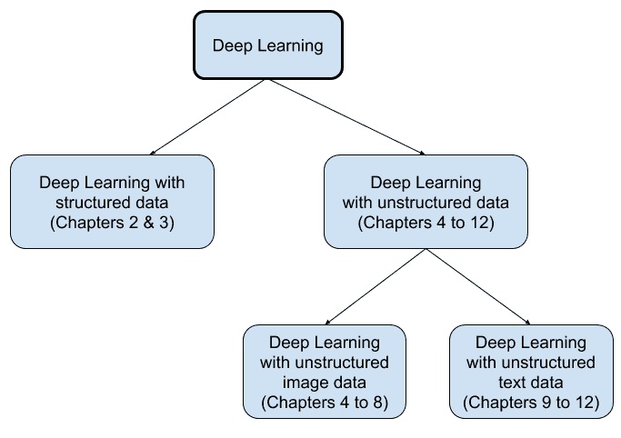

# 第一章：重新审视深度学习架构和技术

深度学习是机器学习和人工智能领域的一个分支，使用人工神经网络。深度学习方法的主要优势之一是能够捕捉数据中复杂的关系和模式。当关系和模式不那么复杂时，传统的机器学习方法可能会表现良好。然而，随着帮助生成和处理越来越多非结构化数据（如图像、文本和视频）的技术的出现，深度学习方法变得越来越流行，几乎成为处理这些数据的默认选择。计算机视觉和**自然语言处理**（**NLP**）是两个领域，正在广泛应用于许多不同的领域，如无人驾驶汽车、语言翻译、计算机游戏，甚至是创造新的艺术作品。

在深度学习工具包中，我们现在拥有越来越多可以应用于特定任务的神经网络技术。例如，在开发图像分类模型时，一种被称为**卷积神经网络**（**CNN**）的特殊深度网络已被证明在捕捉图像相关数据中的独特模式方面非常有效。类似地，另一种流行的深度学习网络叫做**递归神经网络**（**RNNs**）及其变种，在处理包含词语或整数序列的数据时被发现非常有用。还有一种非常有趣的深度学习网络叫做**生成对抗网络**（**GAN**），它具备生成新图像、语音、音乐或艺术作品的能力。

在本书中，我们将使用这些以及其他流行的深度学习网络，使用 R 软件。每一章都展示了一个完整的示例，专门开发用于在普通的笔记本电脑或计算机上运行。主要的理念是避免在应用深度学习方法的初始阶段被大量需要高级计算资源的数据所困扰。你将能够通过书中展示的示例逐步理解所有步骤。所用示例还包括每个主题的最佳实践，你会发现它们非常有用。你还会发现，动手操作和应用方法有助于在面对新问题时，快速看到全貌并复现这些深度学习方法。

本章概述了本书中涵盖的 R 深度学习方法。我们将在本章中讨论以下主题：

+   《深度学习与 R》

+   开发深度网络模型的过程

+   使用 R 和 RStudio 的流行深度学习技术

# 《深度学习与 R》

我们将从探讨深度学习网络的流行程度开始，并且了解一些本书中使用的重要 R 包的版本。

# 深度学习趋势

深度学习技术使用基于神经网络的模型，近年来受到了越来越多的关注。Google 趋势网站关于**深度学习**搜索词的图表如下所示：


上面的图表显示了一个搜索词的流行度最高为 100，其他数字是相对于这一最高点的。可以观察到，自 2014 年左右以来，**深度学习**这个术语的兴趣逐渐上升，且在过去的两年中达到了流行的顶峰。深度学习网络流行的原因之一是开源免费库 TensorFlow 和 Keras 的可用性。

# 主要 R 包版本

本书将使用 Keras R 包，利用 TensorFlow 作为后端构建深度学习网络。下面的代码展示了一个典型的 R 会话输出，提供了与版本相关的各种信息，这些信息用于书中的示例：

```py
# Information from a Keras R session
sessionInfo()

R version 3.6.0 (2019-04-26)
Platform: x86_64-apple-darwin15.6.0 (64-bit)
Running under: macOS 10.15

Matrix products: default
BLAS: /System/Library/Frameworks/Accelerate.framework/Versions/A/Frameworks/vecLib.framework/Versions/A/libBLAS.dylib
LAPACK: /Library/Frameworks/R.framework/Versions/3.6/Resources/lib/libRlapack.dylib

Random number generation:
 RNG: Mersenne-Twister 
 Normal: Inversion 
 Sample: Rounding 

locale:
[1] en_US.UTF-8/en_US.UTF-8/en_US.UTF-8/C/en_US.UTF-8/en_US.UTF-8

attached base packages:
[1] stats graphics grDevices utils datasets methods base

other attached packages:
[1] keras_2.2.4.1

loaded via a namespace (and not attached):
 [1] Rcpp_1.0.2 lattice_0.20-38 lubridate_1.7.4 zeallot_0.1.0 
 [5] grid_3.6.0 R6_2.4.0 jsonlite_1.6 magrittr_1.5 
 [9] tfruns_1.4 stringi_1.4.3 whisker_0.4 Matrix_1.2-17 
[13] reticulate_1.13 generics_0.0.2 tools_3.6.0 stringr_1.4.0 
[17] compiler_3.6.0 base64enc_0.1-3 tensorflow_1.14.0
```

如前所述，本书使用的是 2019 年 4 月发布的 R 语言 3.6 版本，其别名为“Planting of a Tree”。用于 Keras 包的版本是 2.2.4.1。此外，本书中所有应用示例均是在配备 8GB 内存的 Mac 计算机上运行的。使用此配置的主要原因是，它能让读者在不需要高级计算资源的情况下，顺利完成书中涉及的任何深度学习网络示例。

在下一节中，我们将详细讲解开发深度网络模型的过程，该过程分为五个一般步骤。

# 深度网络模型开发过程

开发深度学习网络模型可以分为五个关键步骤，如下图所示：


上述流程图中提到的每个步骤，其要求可能会根据所使用的数据类型、开发的深度学习网络类型以及模型开发的主要目标而有所不同。我们将逐一讲解每个步骤，以帮助读者对所涉及的内容有一个总体的了解。

# 准备深度网络模型的数据

开发深度学习神经网络模型要求变量具有一定的格式。自变量可能具有不同的尺度，有的变量值是小数，有的则是以千为单位。使用这种尺度不同的变量在训练网络时效率不高。在开发深度学习网络之前，我们会进行一些调整，使得变量具有相似的尺度。实现这一目标的过程称为**标准化**。

两种常用的标准化方法是 z-score 标准化和 min-max 标准化。在 z-score 标准化中，我们从每个值中减去均值，然后除以标准差。这种转换结果是数据值位于-3 到+3 之间，均值为 0，标准差为 1。而对于 min-max 标准化，我们从每个数据点中减去最小值，然后除以范围。这种转换将数据转换为 0 到 1 之间的值。

作为示例，请看以下图表，我们从一个均值为 35，标准差为 5 的正态分布中随机获取了 10,000 个数据点：


从前面的图表中，我们可以观察到，经过 z-score 标准化后，数据点大多数位于-3 到+3 之间。同样，经过 min-max 标准化后，值的范围变为 0 到 1 之间。然而，两种标准化方法后，原始数据的整体模式得以保留。

使用分类响应变量时，数据准备的另一个重要步骤是进行一热编码（one-hot encoding）。一热编码将分类变量转换为新的二进制格式，其中值为 0 或 1。可以通过使用 Keras 中提供的`to_categorical()`函数轻松实现这一转换。

通常，处理非结构化数据（如图像或文本）的数据处理步骤比处理结构化数据时更为复杂。此外，数据准备步骤的性质可能因数据类型而异。例如，为开发深度学习分类模型而准备图像数据的方式，很可能与为开发电影评论情感分类模型而准备文本数据的方式大不相同。然而，值得注意的一点是，在我们能够从非结构化数据开发深度学习模型之前，必须先将其转换为结构化格式。以下截图展示了如何将非结构化图像数据转换为结构化格式，使用的是手写数字*五*的图片：


从前面的截图中可以观察到，当我们在 R 中读取一个包含手写数字*五*的黑白图像文件，尺寸为 28 x 28 时，它会被转换为行列中的数字，形成结构化格式。截图的右侧显示了具有 28 行和 28 列的数据。表格中的数字是像素值，范围从 0 到 255，其中 0 表示黑色，255 表示白色。在开发深度学习模型时，我们会使用一些从图像数据中派生的此类结构化数据。

一旦为开发模型准备好的数据符合所需格式，我们就可以开发模型架构。

# 开发深度学习模型架构

开发模型的架构涉及定义各种项目，如网络的层类型和数量、激活函数的类型、网络中使用的单元或神经元数量，以及提供与数据相关的输入/输出值。以下代码展示了如何在 R 中使用 Keras 指定一个简单的顺序模型架构：

```py
# Model architecture
model <- keras_model_sequential()
 model %>% 
 layer_dense(units = 8, activation = 'relu', input_shape = c(21)) %>% 
 layer_dense(units = 3, activation = 'softmax')
```

请注意，顺序模型允许我们逐层开发模型。正如前面的代码所示，两个密集连接的网络层已被添加为顺序模型的一部分。选择模型架构时有两个重要决策，涉及层数和层的类型，以及激活函数的类型。使用多少层以及选择什么类型的层由数据的性质和复杂性决定。对于完全连接的网络（也称为多层感知器），我们可以使用 Keras 中的`layer_dense`函数来创建密集层。

另一方面，在处理图像数据时，我们很可能会在网络中使用卷积层，利用`layer_conv_2d`函数。我们将在每一章中通过示例讨论更多关于特定模型架构的细节。

在深度学习网络中使用了不同类型的激活函数。修正线性单元（`relu`）是一个流行的激活函数，通常用于隐藏层，并且它采用非常简单的计算方法。如果输入值为负数，则返回零；对于其他情况，则不改变原始值。举个例子，看看以下代码：

```py
# RELU function and related plot
x <- rnorm(10000, 2, 10)
y <- ifelse(x<0, 0, x)
par(mfrow = c(1,2))
hist(x)
plot(x,y)
```

前面的代码生成了 10,000 个来自均值为 2、标准差为 10 的正态分布的随机数，并将结果存储在`x`中。然后将负值更改为零并存储在 y 中。以下图表展示了 x 的直方图和 x 与 y 的散点图：


从前面的直方图中可以观察到，x 的值既有正数也有负数。基于原始的 x 值和通过将负值转换为零后得到的修改后的 y 值，散点图可视化了`relu`激活函数的影响。在散点图中，x = 0 左侧的数据点是平坦的，具有零斜率。x = 0 右侧的数据点呈现完美的线性模式，斜率为 1。

使用`relu`激活函数的主要优势之一是其简单的计算方式。对于开发深度学习网络模型来说，这一点非常重要，因为它有助于减少计算成本。对于许多深度学习网络，修正线性单元（rectified linear unit）作为默认激活函数被广泛使用。

另一种用于开发深度网络的流行激活函数是`softmax`，通常用于网络的外层。让我们看一下以下代码，以更好地理解它：

```py
# Softmax function and related plot
x <- runif(1000, 1, 5)
y <- exp(x)/sum(exp(x))
par(mfrow=c(1,2))
hist(x)
plot(x,y)
```

在前面的代码中，我们从一个均匀分布中随机抽取了 1,000 个值，这些值介于 1 和 5 之间。为了使用 `softmax` 函数，我们可以将每个输入值 x 的指数值除以所有 x 值指数的总和。根据 x 值生成的直方图以及 x 和 y 值的散点图如下所示：


我们可以观察到前面的直方图为 x 值提供了一个大致均匀的模式。可以从散点图中看到 `softmax` 函数的影响，此时输出值介于 0 和 1 之间。这种转换对于将结果以概率的形式进行解释非常有用，因为值现在如下所示：

+   介于 0 和 1 之间

+   这些概率的总和为 1

`softmax` 激活函数的这一方面，使得结果可以用概率的方式进行解释，因此在开发深度学习分类模型时，它成为了一个受欢迎的选择。无论是用于图像分类还是文本分类问题，它都表现良好。

除了这两个激活函数，我们还使用其他可能更适合特定深度学习模型的激活函数。

一旦指定了要使用的模型架构，下一步就是编译模型。

# 编译模型

编译模型通常涉及指定损失函数、选择优化器以及指定要使用的评估指标。然而，这些选择取决于所解决问题的类型。以下代码是一个使用 R 编译深度学习二元分类模型的示例：

```py
model %>% 
   compile(loss = 'binary_crossentropy', 
   optimizer = 'adam',
   metrics = 'accuracy')
```

前面指定的损失函数是 `binary_crossentropy`，当响应变量具有两个类别时使用该函数。二元交叉熵可以使用以下公式计算：


在上述公式中，y 代表实际类别，`yhat` 代表预测概率。我们来看两个使用以下代码的示例：

```py
# Example-1
y <- c(0, 0, 0, 1, 1, 1)
yhat <- c(0.2, 0.3, 0.1, 0.8, 0.9, 0.7)
(loss <- - y*log(yhat) - (1-y)*log(1-yhat))

[1] 0.2231436 0.3566749 0.1053605 0.2231436 0.1053605 0.3566749

mean(loss)

[1] 0.228393

# Example-2
yhat <- c(0.2, 0.9, 0.1, 0.8, 0.9, 0.2)
(loss <- - y*log(yhat) - (1-y)*log(1-yhat))

[1] 0.2231436 2.3025851 0.1053605 0.2231436 0.1053605 1.6094379

mean(loss)

[1] 0.761505
```

如 `Example-1` 所示，y 共有六种情况，其中前三种情况的实际类别为 0，接下来的三种情况的实际类别为 1。`yhat` 捕获的预测概率是某个案例属于类别 1 的概率。在 `Example-1` 中，`yhat` 的值正确地分类了所有六个案例，所有损失值的平均值大约为 0.228。在 `Example-2` 中，`yhat` 只正确分类了四个案例，所有损失值的平均值现在增加到大约 0.762。以这种方式，二元交叉熵损失函数有助于评估模型的分类性能。损失值越低，分类性能越好；损失值越高，模型的分类性能越差。

根据深度学习网络开发的具体问题类型，还有各种其他损失函数。对于响应变量有多个类别的分类模型，我们使用`categorical_crossentropy`损失函数。对于具有数值型响应变量的回归问题，均方误差（`mse`）可能是一个合适的损失函数。

在指定模型使用的优化器时，`adam`是深度学习网络中常用的优化器，能够在各种场景中取得良好的效果。其他常用的优化器还包括`rmsprop`和`adagrad`。当训练深度学习网络时，网络的参数会根据从损失函数得到的反馈进行调整。如何修改这些参数是基于所使用的优化器。因此，选择一个合适的优化器对于得到合适的模型至关重要。

在编译模型时，我们还指定一个合适的度量标准，用于监控训练过程。对于分类问题，`accuracy`是最常用的度量标准之一。对于回归问题，均方误差是常用的度量标准。

一旦我们编译好模型，就可以开始拟合它了。

# 拟合模型

模型的拟合或训练是通过数据来进行的。下面是一个用于拟合分类模型的代码示例：

```py
model %>%   
 fit(training, 
   trainLabels, 
   epochs = 200,
   batch_size = 32, 
   validation_split = 0.2)
```

在前面的代码中，拟合模型包括`training`，它是自变量的数据，以及`trainLabels`，它包含响应变量的标签。迭代次数通过指定 epoch 数来表明，在训练过程中将使用所有训练数据样本的迭代次数。批量大小指的是从训练数据中选取的样本数量，模型参数将在这些样本处理后被更新。此外，我们还可以指定验证集拆分，0.2 或 20%的拆分意味着将训练数据的最后 20%样本与训练过程分开，用于评估模型的表现。

在拟合模型时，网络中的不同层有随机初始化的权重。由于网络权重的随机初始化，如果我们用相同的数据、相同的架构和相同的设置重新拟合模型，我们将会得到略有不同的结果。这不仅会在不同的 R 会话中发生，甚至在同一会话中重新训练模型时也会发生。

在许多情况下，获取可重复的结果非常重要。例如，在向同行评审的国际期刊发布与深度学习相关的文章时，你可能需要根据审稿人的反馈从同一个模型生成更多的图表。另一个情况是，团队中的成员可能希望共享一个模型以及相关的结果。获得相同结果的最简单方法是通过以下代码保存并重新加载模型：

```py
# Save/reload model
save_model_hdf5(model, 
 filepath, 
 overwrite = TRUE,
 include_optimizer = TRUE)
model_x <- load_model_hdf5(filepath, 
 custom_objects = NULL, 
 compile = TRUE)
```

我们可以通过指定`filepath`来保存模型，并在需要时重新加载。保存模型使我们在再次使用该模型时能够获得可重复的结果。它还使我们能够与他人共享相同的模型，以便他们获得完全相同的结果，并且在每次运行耗时较长的情况下尤为有用。保存并重新加载模型还可以让你在再次训练模型时恢复训练过程。

一旦模型拟合完成，可以使用训练数据和测试数据来评估其性能。

# 评估模型性能

评估深度学习分类模型的性能需要构建一个混淆矩阵，用以总结实际类别与预测类别之间的关系。假设有一个分类模型用于将研究生申请者分类为两个类别，其中类别 0 表示未被接受的申请，类别 1 表示被接受的申请。以下是该情况的混淆矩阵示例，用来解释关键概念：


在前面的混淆矩阵中，有 208 名实际上未被接受的申请者，模型也正确地预测了他们不应被接受。该单元格在混淆矩阵中被称为**真负**。类似地，有 29 名实际上被接受的申请者，模型也正确地预测了他们应该被接受。该单元格在混淆矩阵中被称为**真正**。我们还可以看到一些单元格，其中包含模型对申请者错误分类的数字。有 15 名实际上未被接受的申请者，但模型错误地预测他们应该被接受，这个单元格称为**假负**。

错误地将类别 0 误分类为类别 1 被称为类型 1 错误。最后，有 73 名实际上被接受的申请者，但模型错误地将他们预测为未接受类别，这个单元格被称为**假正**。这种错误分类的另一种说法是类型 2 错误。

从混淆矩阵中，我们可以通过将对角线上的数字相加并将其除以总数来计算分类性能的准确性。因此，基于前述矩阵的准确性为 (208+29)/(208+29+73+15)，即 72.92%。除了准确性之外，我们还可以找出模型在正确分类每一类别上的表现。我们可以计算正确分类类别 1（也称为灵敏度）的准确性为 29/(29+73)，即 28.4%。类似地，我们可以计算正确分类类别 0（也称为特异性）的准确性为 208/(208+15)，即 93.3%。

请注意，混淆矩阵可用于开发分类模型。然而，其他情况可能需要其他合适的方法来评估深度学习网络。

现在，我们可以简要回顾一下本书中涵盖的深度学习技术。

# 使用 R 和 RStudio 的深度学习技术

深度学习中的“**深度**”一词指的是神经网络模型具有多个层次，并且学习过程依赖于数据的帮助。根据所使用的数据类型，深度学习可以分为两大类，如下图所示：



如前图所示，用于开发深度神经网络模型的数据类型可以是结构化数据或非结构化数据。在第二章《用于多类分类的深度神经网络》中，我们展示了使用结构化数据（响应变量为类别类型）来解决分类问题的深度学习网络。在第三章《用于回归的深度神经网络》中，我们展示了使用结构化数据（响应变量为连续类型）来解决回归问题的深度学习网络。第四章至第十二章展示了深度学习网络在处理主要涉及图像和文本的两种非结构化数据类型中的应用。在第四章至第八章中，我们提供了一些使用图像数据的流行深度学习网络的应用示例，图像数据被视为一种非结构化数据类型。最后，在第九章至第十二章中，我们介绍了一些适用于文本数据的流行深度学习网络，文本数据是非结构化数据中的另一大类别。

现在，让我们简要回顾一下第二章至第十二章中涉及的示例和技术。

# 多类分类

许多问题的主要目标是开发一个分类模型，使用数据将观察结果分类为两类或多类。例如，患者可以根据多个变量的数据被分类为正常、可疑或病理性。在这种情况下，深度学习网络将使用多个患者的数据（结果已知），并学习将患者分类为这三类之一。

另一个分类问题的例子可能是学生向研究生院提交申请。学生的申请可能基于 GPA、GRE 成绩和本科学校排名等变量被接受或拒绝。另一个有趣的例子是，使用学生相关数据来开发一个模型，帮助将第一年学生分类为那些可能留在当前学校的学生和那些可能转学的学生。类似的模型也可以用来分类那些可能继续与某个企业合作或转向竞争对手的客户。

开发分类模型时面临的挑战之一是类别不平衡。例如，在处理医疗数据时，被分类为正常的患者数量可能远大于被分类为病态的患者数量。类似地，在申请顶尖大学的研究生项目时，数据中很可能包含大量未被录取的申请者。深度网络模型在解决此类问题时非常有效。书中使用的 Keras 库提供了一个用户友好的界面，不仅可以轻松解决此类问题，还可以通过快速实验帮助获得合适的分类模型。

在第二章，*多类分类的深度神经网络*中，我们通过使用 R 语言展示了一个多类深度学习分类模型。

# 回归问题

包含数字响应变量的结构化数据被归类为回归问题。例如，一座城市中房屋的价格可能依赖于房屋的年龄、城市的犯罪率、房间数以及房产税率等变量。尽管统计方法，如多元线性回归和弹性网回归，在这些情况下也很有用，但深度学习网络具有一些优势。使用神经网络的主要优势之一是它们能够捕捉非线性。与需要满足特定假设条件才能使用的统计方法不同，基于神经网络的模型更加灵活，不需要满足太多假设条件即可使用。

许多涉及回归问题的应用程序也需要识别对响应变量有显著影响的变量或特征。然而，在深度学习网络中，这种特征工程是内建的，不需要额外的努力来提取重要特征。关于深度学习网络需要注意的一点是，所使用的数据集越大，最终的预测模型将会越有效。在第三章，*回归问题的深度神经网络*中，我们通过使用 R 语言展示了一个深度学习回归模型。

# 图像分类

图像数据被分类为非结构化数据类型。深度学习网络的一个流行应用是开发图像分类和识别模型。图像分类有许多应用，如智能手机或社交媒体网络上的面部识别、医学图像数据分类、手写数字分类以及自动驾驶汽车等。需要注意的是，无法直接从非结构化数据中开发分类模型。非结构化数据需要先转换为结构化形式，才能开发深度学习网络。例如，一张黑白图像的尺寸可能是 21 x 21，因此包含 441（21 x 21）个像素的数据。一旦我们将图像转换为表示所有像素的数字，就可以开发图像分类模型。尽管人类可以非常容易地分类一种衣服、一个人或某个物体，即使图像的大小或方向不同，但训练计算机做同样的事情仍然是一个具有挑战性的任务。

Keras 库提供了多个易于使用的功能，用于处理图像数据，帮助开发深度学习图像分类网络。在涉及图像识别和分类问题时，拥有多层的深度网络或神经网络的有效性尤为突出。在第四章，*图像分类与识别*中，我们提供了一个应用深度学习图像分类模型的示例，使用 R 语言进行演示。

# 卷积神经网络

当类别数量增加且同一类别内的图像表现出显著变化时，图像分类任务变得具有挑战性。此类情况还需要更多的样本，以便分类模型能够更准确地捕捉到每个类别中的固有特征。例如，一家时尚零售商可能拥有大量种类的时尚商品，并且可能希望根据这些时尚商品的图像数据开发分类模型。一种特殊类型的深度网络，被称为**卷积神经网络**（**CNN**），已被证明在需要大规模图像分类和识别任务的情况下非常有效。CNN 是这种应用中最流行的网络，并被认为是大规模图像分类问题的黄金标准。这些网络能够通过网络中的不同类型的层捕捉图像中的各种细节。在第五章，*使用卷积神经网络进行图像分类*中，我们提供了一个应用 CNN 进行图像分类的示例，使用 R 语言进行演示。

# 自编码器

涉及使用具有响应变量或因变量的数据进行分类和预测模型的深度学习方法属于监督式深度学习方法。当处理结构化或非结构化数据时，有些情况下响应变量可能不可用或未被使用。那些不使用响应变量的深度学习网络应用被归类为无监督深度学习方法。例如，深度学习的一个应用可能是图像数据，我们希望从中提取重要特征以实现降维。另一个例子是包含不需要噪声的手写图像，深度网络用于去噪。在这种情况下，自编码网络被发现非常有用，能够执行无监督深度学习任务。

自编码神经网络使用编码器和解码器网络。当图像数据通过编码器传递，并且得到的维度低于原始图像时，网络就被迫从输入数据中提取最重要的特征。然后，网络的解码器部分根据编码器输出的内容重建原始数据。在第六章，《使用 Keras 应用自编码神经网络》中，我们通过 R 语言展示了如何应用自编码神经网络进行降维、去噪和图像修正。

# 迁移学习

当图像数据具有多个类别时，开发深度学习分类模型是一项具有挑战性的任务。当可用图像数量有限时，任务变得更加困难。在这种情况下，可以利用一个已使用大量数据集开发的现有模型，并通过定制它来处理另一个分类任务，从而重用它所学到的模式。这种将预训练深度网络模型用于新分类任务的方式称为迁移学习。

Keras 库提供了用于图像分类任务的各种预训练模型，这些模型是通过超过百万张图像训练得到的，能够捕捉可重用的特征，这些特征可以应用于类似但全新的数据。将一个预训练模型从大量样本中学到的知识转移到一个使用较小样本量构建的模型上，有助于节省计算资源。此外，使用迁移学习方法还可以帮助超越从零开始使用较小数据集构建的模型。在第七章，《使用迁移学习进行小数据图像分类》中，我们介绍了迁移学习，并通过 R 语言展示了如何利用预训练的深度学习图像分类模型。

# 生成对抗网络

《The Verge》的一篇文章（参考：[`www.theverge.com/2018/10/25/18023266/ai-art-portrait-christies-obvious-sold`](https://www.theverge.com/2018/10/25/18023266/ai-art-portrait-christies-obvious-sold)）报道了一件名为*Portrait of Edmond Belamy*的艺术作品，这幅作品是使用人工智能算法创作的，最终以 432,500 美元的价格售出。该作品的预计售价大约为 7,000 到 10,000 美元。用于创作这幅作品的深度学习算法被称为**生成对抗网络**（**GAN**）。生成对抗网络的独特属性在于，它通过让两个深度网络相互竞争，生成有意义的东西。这两个相互竞争并试图超过对方的网络被称为生成器网络和判别器网络。

假设我们想生成新的手写数字*五*的图像。在这种情况下，生成对抗网络将涉及一个生成器网络，它从随机噪声中创建伪造的手写数字*五*图像，并将其发送给判别器网络。伪造的图像与真实图像混合，判别器网络会尽力区分手写数字*五*的真实和伪造图像。这两个网络将相互竞争，直到生成器网络开始生成看起来非常真实的伪造图像，而判别器网络逐渐变得难以区分真实和伪造图像。除了图像数据，生成对抗网络的应用还可以扩展到生成新的文本甚至新的音乐。在第八章中，我们将演示生成对抗网络在生成新图像中的应用，*使用生成对抗网络创建新图像*。

# 用于文本分类的深度网络

文本数据具有一些独特的特点，使其成为与图像数据相比非常不同类型的非结构化数据。正如之前提到的，非结构化数据需要额外的处理步骤才能转化为可以用于开发深度学习分类网络的结构化格式。深度学习在文本数据中的应用之一是开发深度神经网络情感分类模型。

为了开发情感分类模型，需要捕捉与文本数据相关的情感标签。例如，我们可以使用电影评论的文本数据和相关的情感标签（正面评论或负面评论）来开发一个可以自动化处理的模型。另一个例子是使用推文文本数据开发情感分类模型。这样的模型可以用于比较成千上万条推文中的情感，特别是在重大事件发生前后。例如，在公司发布新智能手机前后，或者总统候选人在现场辩论中的表现前后，推文中的情感分类模型都可以发挥重要作用。使用文本数据的情感分类模型的深度网络示例可以参考第九章，*用于文本分类的深度网络*。

# 循环神经网络

文本数据的一个独特特点是，文本序列中单词的排列具有一定的意义。**循环神经网络**（**RNN**）非常适合处理涉及此类序列的数据。循环网络允许将前一步的输出作为输入传递到下一步。通过在每个步骤中传递先前的信息，循环网络可以具有记忆功能，这对于处理涉及序列的数据非常有用。RNN 中的**循环**一词也来自于此，即每一步的输出依赖于前一步的信息。

RNN 可以用来开发情感分类模型，其中文本数据可能是电影评论、推文、产品评论等。开发这样的情感分类模型还需要用于训练网络的标签。我们将在第十章中讲解如何使用 R 开发一个情感分类的循环神经网络模型，*使用循环神经网络进行文本分类*。

# 长短期记忆网络

**长短期记忆**（**LSTM**）网络是一种特殊类型的循环神经网络。当数据涉及单词或整数序列且具有长期依赖性时，LSTM 网络非常有用。例如，在一篇电影评论中，两个对于正确分类情感非常重要的单词可能被长句子中的许多单词所分隔。使用常规 RNN 的情感分类模型将很难捕捉到单词之间的这种长期依赖关系。而常规 RNN 在单词或整数之间的依赖关系是即时的，或者两个重要的单词彼此相邻时，RNN 很有用。

除了情感分类外，LSTM 网络的应用还可以用于语音识别、语言翻译、异常检测、时间序列预测、问答等多个领域。在第十一章中，介绍了一种用于电影评论情感分类的 LSTM 网络应用，*使用长短期记忆网络进行文本分类*。

# 卷积递归网络

**卷积神经网络**（**CNNs**）用于从图像或文本数据中捕获高级局部特征，而 LSTM 网络则可以捕获涉及序列的长期依赖性数据。当我们在同一模型架构中同时使用 CNN 和递归网络时，称为**卷积递归神经网络**（**CRNN**）。例如，如果我们考虑文章及其作者的数据，我们可能希望开发一个作者分类模型，该模型可以训练一个网络以接受包含文章的文本数据作为输入，然后帮助预测关于作者的正确性的概率。为此，我们可以首先使用一维卷积层从数据中提取重要特征。然后，这些提取的特征可以传递到 LSTM 递归层以获取隐藏的长期依赖关系，这些依赖关系又传递到一个全连接的密集层。然后，这个密集层可以获得正确作者的概率。CRNN 也可以应用于与自然语言处理、语音和视频相关的问题。在第十二章中，*使用卷积递归网络进行文本分类*，我们说明了使用 CRNN 开发模型的示例，该模型可以根据作者撰写的文章对作者进行分类。

# 技巧、诀窍和最佳实践

在本书中，我们展示了如何使用 R 语言应用几种流行的深度学习方法。在处理需要深度学习网络的更复杂问题时，使用特定的支持工具有时非常有帮助。TensorFlow 提供了一个这样的工具；它称为**TensorBoard**，对于可视化深度网络训练性能特别有用，特别是在需要实验的情况下。类似地，有一个称为**局部可解释模型无关解释**（**LIME**）的包，可以帮助可视化和解释特定预测。在开发深度网络模型时，我们还会获得许多输出，例如摘要和图表。有一个叫做**tfruns**的包可以帮助将所有内容整理到一个地方方便参考。Keras 包中还有一个回调功能，可以帮助在适当的时候停止网络训练。我们将在第十三章中讨论所有这些技巧、诀窍和最佳实践，*技巧、诀窍和前路*。

# 摘要

近年来，利用人工神经网络的深度学习方法越来越受欢迎。深度学习方法的应用领域包括无人驾驶汽车、图像分类、自然语言处理和新图像生成等多个领域。我们在第一章开始时，通过查看来自谷歌趋势网站的深度学习相关热度数据，介绍了深度学习这一术语的流行程度。我们描述了应用深度学习方法的一般五步过程，并阐述了每一步骤中的一些基本概念。接着，我们简要介绍了每一章中所涉及的深度学习技术、它们的应用场景以及一些最佳实践。

在下一章中，我们将通过一个应用示例开始，展示为多类别分类问题开发深度网络模型的步骤。
