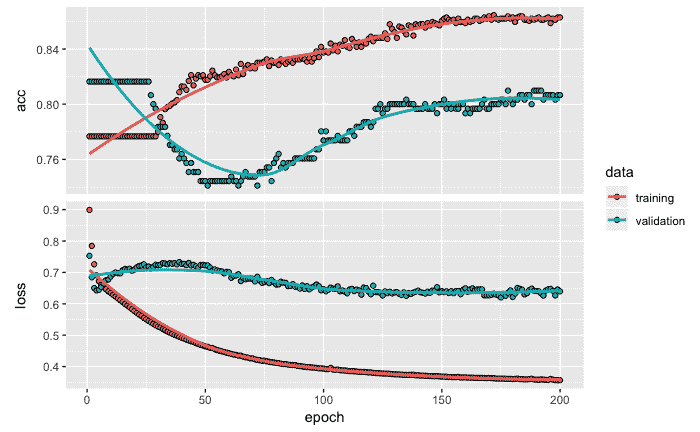
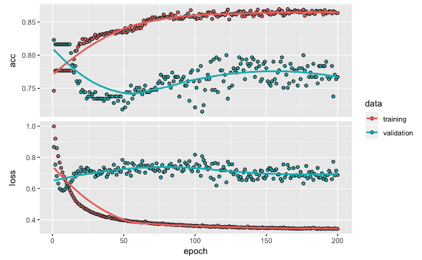
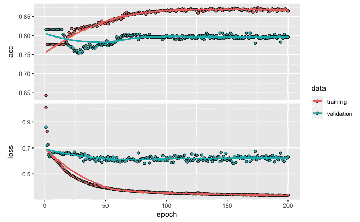
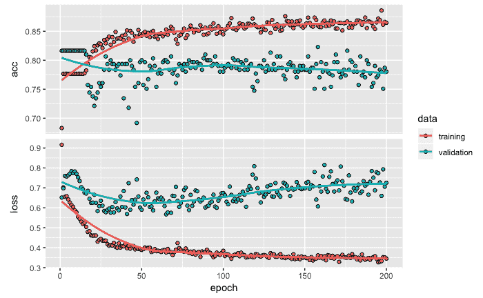
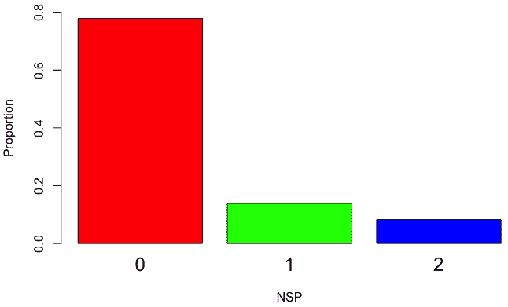
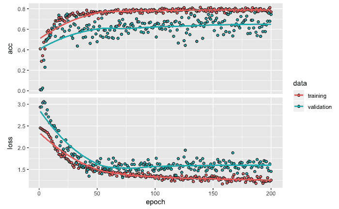

# 第二章：用于多类分类的深度神经网络

在开发预测和分类模型时，根据响应或目标变量的类型，我们会遇到两种潜在类型的问题：目标变量是类别型（这是一个分类问题）或目标变量是数值型（这是一个回归问题）。有研究表明，大约 70% 的数据属于分类类别问题，剩下的 30% 是回归问题（参考文献：[`www.topcoder.com/role-of-statistics-in-data-science/`](https://www.topcoder.com/role-of-statistics-in-data-science/)）。在本章中，我们将提供使用深度学习神经网络解决分类问题的步骤。步骤将使用胎儿心电图（CTG）进行说明。

在本章中，我们将涵盖以下主题：

+   对胎儿心电图（或 CTG）数据集的简要理解

+   数据准备的步骤，包括归一化、数据分区和独热编码

+   为分类问题创建并拟合深度神经网络模型

+   评估分类模型性能并使用模型进行预测

+   对模型进行微调，以优化性能并采用最佳实践

# 胎儿心电图数据集

在本节中，我们将提供有关用于开发多类分类模型的数据的相关信息。我们将仅使用一个库，即 Keras。

# 数据集（医学）

本章使用的数据集可以在由加利福尼亚大学信息与计算机科学学院维护的 UCI 机器学习库中公开访问。你可以通过[`archive.ics.uci.edu/ml/datasets/cardiotocography`](https://archive.ics.uci.edu/ml/datasets/cardiotocography)访问该数据集。

需要注意的是，该 URL 允许你下载 Excel 数据文件。你可以通过将文件另存为 `.csv` 文件，轻松将其转换为 `.csv` 格式。

对于数据，我们应使用 `.csv` 格式的格式化方式，如以下代码所示：

```py
# Read data
library(keras)
data <- read.csv('~/Desktop/data/CTG.csv', header=T)
str(data)

OUTPUT
 ## 'data.frame': 2126 obs. of 22 variables:
 ## $ LB : int 120 132 133 134 132 134 134 122 122 122 ...
 ## $ AC : num 0 0.00638 0.00332 0.00256 0.00651 ...
 ## $ FM : num 0 0 0 0 0 0 0 0 0 0 ...
 ##  $ UC      : num  0 0.00638 0.00831 0.00768 0.00814 ...
 ##  $ DL      : num  0 0.00319 0.00332 0.00256 0 ...
 ##  $ DS      : num  0 0 0 0 0 0 0 0 0 0 ...
 ##  $ DP      : num  0 0 0 0 0 ...
 ##  $ ASTV    : int  73 17 16 16 16 26 29 83 84 86 ...
 ##  $ MSTV    : num  0.5 2.1 2.1 2.4 2.4 5.9 6.3 0.5 0.5 0.3 ...
 ##  $ ALTV    : int  43 0 0 0 0 0 0 6 5 6 ...
 ##  $ MLTV    : num  2.4 10.4 13.4 23 19.9 0 0 15.6 13.6 10.6 ...
 ##  $ Width   : int  64 130 130 117 117 150 150 68 68 68 ...
 ##  $ Min     : int  62 68 68 53 53 50 50 62 62 62 ...
 ##  $ Max     : int  126 198 198 170 170 200 200 130 130 130 ...
 ##  $ Nmax    : int  2 6 5 11 9 5 6 0 0 1 ...
 ##  $ Nzeros  : int  0 1 1 0 0 3 3 0 0 0 ...
 ##  $ Mode    : int  120 141 141 137 137 76 71 122 122 122 ...
 ##  $ Mean    : int  137 136 135 134 136 107 107 122 122 122 ...
 ##  $ Median  : int  121 140 138 137 138 107 106 123 123 123 ...
 ##  $ Variance: int  73 12 13 13 11 170 215 3 3 1 ...
 ##  $ Tendency: int  1 0 0 1 1 0 0 1 1 1 ...
 ##  $ NSP     : int  2 1 1 1 1 3 3 3 3 3 ...
```

该数据包含胎儿的心电图（CTG），目标变量将患者分类为三类之一：正常、可疑和病理。该数据集共有 2,126 行数据。CTG 由三位专家产科医生分类，并为每个 CTG 分配一致的分类标签：正常（N）（用 1 表示）、可疑（S）（用 2 表示）和病理（P）（用 3 表示）。数据集共有 21 个独立变量，主要目标是开发一个分类模型，将每个患者正确分类为 N、S 和 P 之一。

# 为模型构建准备数据

在本节中，我们将准备数据以构建分类模型。数据准备将涉及数据的归一化、将数据划分为训练数据和测试数据，以及对响应变量进行独热编码。

# 数值变量标准化

在开发深度网络模型时，我们对数值变量进行标准化，使其达到统一的尺度。在处理多个变量时，不同变量可能具有不同的尺度——例如，某个变量可能表示公司赚取的收入，数值可能是以百万美元为单位的。在另一个例子中，某个变量可能表示产品的尺寸，以厘米为单位。如此极端的尺度差异在训练网络时会造成困难，而标准化有助于解决这个问题。对于标准化，我们将使用以下代码：

```py
# Normalize data 
data <- as.matrix(data)
 dimnames(data) <- NULL  
 data[,1:21] <- normalize(data[,1:21])
 data[,22] <- as.numeric(data[,22]) -1
```

如前面的代码所示，我们首先将数据转换为矩阵格式，然后通过将`NULL`赋值给维度名称来去除默认的名称。在这一步中，22 个变量的名称将被更改为`V1`、`V2`、`V3`，一直到`V22`。如果你在此阶段运行`str(data)`，你会注意到原始数据的格式已经发生了变化。我们使用`normalize`函数对 21 个独立变量进行标准化，该函数是 Keras 包的一部分。当你运行这一行代码时，你会注意到它使用了 TensorFlow 作为后端。我们还将目标变量 NSP 从默认的整数类型更改为数值型。此外，在同一行代码中，我们还将`1`、`2`和`3`的值分别更改为`0`、`1`和`2`。

# 数据划分

接下来，我们将把这些数据划分为训练集和测试集。为了进行数据划分，我们使用以下代码：

```py
# Data partition 
set.seed(1234)
 ind <- sample(2, nrow(data), replace = T, prob=c(.7, .3))
 training <- data[ind==1, 1:21]
 test <- data[ind==2, 1:21]
 trainingtarget <- data[ind==1, 22]
 testtarget <- data[ind==2, 22]
```

如前面的代码所示，为了获得相同的训练集和测试集样本以保证可重复性，我们使用`set.seed`并指定一个特定的数字，在此案例中是`1234`。这将确保读者也能获得相同的训练数据和测试数据样本。在数据划分时，这里使用了 70:30 的比例，但也可以使用其他比例。在机器学习应用中，这是一个常用的步骤，旨在确保预测模型能够在未见过的数据（即测试数据）上表现良好。训练数据用于开发模型，而测试数据则用于评估模型的性能。有时，预测模型可能在训练数据上表现得非常好，甚至完美；然而，当用模型未见过的测试数据进行评估时，模型的表现可能会非常令人失望。在机器学习中，这个问题被称为模型的过拟合。测试数据有助于评估并确保预测模型能够可靠地用于做出正确的决策。

我们使用`training`和`test`名称来存储自变量，使用`trainingtarget`和`testtarget`名称来存储目标变量，这些目标变量存储在数据集的第 22 列中。数据划分后，我们将在训练数据中获得 1,523 个观察值，剩余的 603 个观察值将位于测试数据中。请注意，尽管我们在这里使用 70:30 的划分比例，但实际的数据划分比例可能并不完全是 70:30。

# One-hot 编码

在数据划分后，我们将对响应变量进行一-hot 编码。One-hot 编码有助于将分类变量表示为零和一。One-hot 编码的代码和输出如下所示：

```py
# One-hot encoding
 trainLabels <- to_categorical(trainingtarget)
 testLabels <- to_categorical(testtarget)
 print(testLabels[1:10,])

OUTPUT
 ##        [,1] [,2] [,3]
 ##   [1,]    1    0    0
 ##   [2,]    1    0    0
 ##   [3,]    1    0    0
 ##   [4,]    0    0    1
 ##   [5,]    0    0    1
 ##   [6,]    0    1    0
 ##   [7,]    1    0    0
 ##   [8,]    1    0    0
 ##   [9,]    1    0    0
 ##  [10,]    1    0    0

```

如前面的代码所示，在 Keras 包中借助`to_categorical`函数，我们将目标变量转换为二进制类别矩阵，其中类别的存在与否分别由 1 或 0 表示。在这个示例中，我们有三个目标变量类别，这三个类别被转换为三个虚拟变量。这个过程也叫做**one-hot 编码**。首先，打印了`testLabels`中的 10 行数据。第一行表示患者的正常类别，标记为（1,0,0）；第六行表示患者的可疑类别，标记为（0,1,0）；第四行则提供了一个患者病理类别的示例，标记为（0,0,1）。

完成数据准备步骤后，我们进入下一步，在这一阶段我们创建分类模型，将患者分类为正常、可疑或病理。

# 创建并拟合深度神经网络模型

在这一部分，我们将开发模型架构、编译模型，然后拟合模型。

# 开发模型架构

用于开发模型的代码如下：

```py
# Initializing the model
 model <- keras_model_sequential()

# Model architecture
 model %>% 
 layer_dense(units = 8, activation = 'relu', input_shape = c(21)) %>% 
 layer_dense(units = 3, activation = 'softmax')
```

如前面的代码所示，我们首先使用`keras_model_sequential()`函数创建一个顺序模型，它允许将层按线性堆叠的方式添加。接下来，我们使用管道操作符`%>%`向模型中添加层。这个管道操作符将左侧的输出信息作为输入，传递给右侧的操作。我们使用`layer_dense`函数构建一个全连接的神经网络，并指定各种输入。在这个数据集中，我们有 21 个独立变量，因此，`input_shape`函数被指定为 21 个神经元或单元。该层也被称为网络中的输入层。第一个隐藏层包含 8 个单元，我们在此使用的激活函数是修正线性单元`relu`，它是这种情况下最常用的激活函数。第一个隐藏层通过管道操作符与包含 3 个单元的输出层相连接。我们使用 3 个单元是因为我们的目标变量有 3 个类别。输出层使用的激活函数是`'softmax'`，它有助于将输出值的范围保持在 0 到 1 之间。将输出值的范围控制在 0 到 1 之间有助于我们将结果解释为熟悉的概率值。

在 RStudio 中输入管道操作符`%>%`时，对于 Mac，可以使用*Shift* + *Command* + `M`快捷键，对于 Windows，则可以使用*Shift* + *Ctrl* + `M`。

为了获取我们创建的模型架构的摘要，我们可以运行`summary`函数，如下代码所示：

```py
# Model summary
 summary(model)

 OUTPUT
 ## ___________________________________________________________________________
 ## Layer    (type) Output Shape Param #
 ## ===========================================================================
 ## dense_1 (Dense) (None, 8)      176
 ## ___________________________________________________________________________
 ## dense_2 (Dense) (None, 3)       27
 ## ===========================================================================
 ## Total params: 203
 ## Trainable params: 203
 ## Non-trainable params: 0
 ## ___________________________________________________________________________
```

由于输入层有 21 个单元，每个单元与第一个隐藏层的 8 个单元相连接，因此我们得到了 168 个权重（21 x 8）。我们还为隐藏层中的每个单元获得一个偏置项，总共有 8 个这样的项。因此，在第一个也是唯一的隐藏层阶段，我们总共有 176 个参数（168 + 8）。类似地，隐藏层中的 8 个单元与输出层的 3 个单元相连接，得到 24 个权重（8 x 3）。这样，输出层就有 24 个权重和 3 个偏置项，总共有 27 个参数。最后，这个神经网络架构的参数总数为 203。

# 编译模型

为了配置神经网络的学习过程，我们通过指定损失函数、优化器和评估指标来编译模型，如下代码所示：

```py
# Compile model 
model %>% 
   compile(loss = 'categorical_crossentropy', 
   optimizer = 'adam',
   metrics = 'accuracy')
```

我们使用`loss`来指定我们希望优化的目标函数。如前面的代码所示，对于损失函数，我们使用`'categorical_crossentropy'`，因为我们的目标变量有三个类别。对于目标变量有两个类别的情况，我们使用`binary_crossentropy`。对于优化器，我们使用`'adam'`优化算法，这是一个流行的深度学习优化算法。它之所以受欢迎，主要是因为它比其他随机优化方法（如**自适应梯度算法**（**AdaGrad**）和**均方根传播**（**RMSProp**））能够更快地得到好的结果。我们指定了用于评估模型训练和测试性能的度量标准。对于`metrics`，我们使用`accuracy`来评估模型的分类性能。

现在我们准备好拟合模型，接下来我们将在下一节中进行此操作。

# 拟合模型

为了拟合模型，我们使用以下代码：

```py
# Fit model
model_one <- model %>%   
 fit(training, 
   trainLabels, 
   epochs = 200,
   batch_size = 32, 
   validation_split = 0.2)

OUTPUT (last 3 epochs)
Epoch 198/200
1218/1218 [==============================] - 0s 43us/step - loss: 0.3662 - acc: 0.8555 - val_loss: 0.5777 - val_acc: 0.8000
Epoch 199/200
1218/1218 [==============================] - 0s 41us/step - loss: 0.3654 - acc: 0.8530 - val_loss: 0.5763 - val_acc: 0.8000
Epoch 200/200
1218/1218 [==============================] - 0s 40us/step - loss: 0.3654 - acc: 0.8571 - val_loss: 0.5744 - val_acc: 0.8000
```

从前面的代码中可以看出，我们得到了以下观察结果：

+   为了拟合模型，我们提供了包含 21 个自变量数据的训练数据，以及包含目标变量数据的`trainLabels`。

+   迭代次数或轮数设置为 200。一个轮次是指训练数据的一次完整传递，随后使用验证数据进行模型评估。

+   为了避免过拟合，我们指定了验证数据的拆分比例为 0.2，这意味着 20%的训练数据将在训练过程中用于评估模型性能。

+   请注意，这 20%的数据是训练数据中底部 20%的数据点。我们将训练过程中生成的训练数据和验证数据的损失和准确度值存储在`model_one`中，供以后使用。

+   对于`batch_size`，我们使用默认值 32，这表示每次梯度更新时所使用的样本数量。

+   随着模型的训练进行，我们会在每个轮次后基于训练和验证数据展示损失和准确度的可视化图表。

+   对于准确率，我们希望模型的值越高越好，因为准确率是`越高越好`类型的指标，而对于损失，它是`越低越好`类型的指标，我们希望模型的值越低越好。

+   此外，我们还获得了基于最后 3 个轮次的损失输出的数值摘要，如前面的代码输出所示。对于每个轮次，我们看到从 1,523 个训练数据样本中使用了 1,218 个样本（约 80%）进行模型拟合。剩余的 20%的数据用于计算验证数据的准确度和损失值。

需要注意的是，当使用`validation_split`时，请注意验证数据并不是从训练数据中随机选择的——例如，当`validation_split = 0.2`时，训练数据的最后 20%被用作验证，前 80%用于训练。因此，如果目标变量的值不是随机的，那么`validation_split`可能会在分类模型中引入偏差。

在训练过程完成 200 个纪元后，我们可以使用`plot`函数绘制训练和验证数据的损失和准确率进展，如下代码所示：

```py
 plot(model_one)
```

以下图表提供了一个图形，其中顶部窗口显示准确率，底部窗口显示损失：



训练数据和验证数据的准确率与损失

从前面的损失和准确率图表中，我们可以做出以下观察：

+   从顶部图表中准确率的图形可以看到，准确率值在大约 25 个纪元后显著增加，并随后持续逐渐增加，尤其是对于训练数据。

+   对于验证数据，进展更加不均衡，在第 25^(th)和第 50^(th)个纪元之间，准确率出现下降。

+   在损失值的反向方向上观察到一个类似的模式。

+   请注意，如果训练数据的准确率随着纪元数的增加而提高，但验证数据的准确率下降，这可能表明模型出现了过拟合。从这个图表中我们没有看到任何主要的模式表明模型过拟合。

# 模型评估与预测

在本节中，我们将使用测试数据来评估模型的性能。当然，我们可以使用训练数据来计算损失和准确率值；然而，分类模型的真正考验是它在未见过的数据上进行测试。由于测试数据与模型构建过程是分开的，因此我们现在可以使用它来进行模型评估。我们将首先使用测试数据计算损失和准确率值，然后构建混淆矩阵。

# 损失和准确率计算

以下是使用测试数据获取损失和准确率值的代码及输出：

```py
# Model evaluation
 model %>% 
 evaluate(test, testLabels) 

OUTPUT
 ## $loss
 ## [1] 0.4439415
 ##
 ## $acc
 ## [1] 0.8424544
```

正如前面的代码所示，使用`evaluate`函数，我们可以得到损失值和准确率值分别为`0.4439`和`0.8424`。通过使用`colSums(testLabels)`，我们可以发现测试数据中正常、可疑和病理类别的患者分别有 460、94 和 49 例。将这些数字转换为百分比，基于 603 个样本的总数，我们得到分别为 76.3%、15.6%和 8.1%的比例。样本数量最多的是正常类别的患者，我们可以将 76.3%作为模型表现的基准。如果我们不使用任何模型，而是简单地将测试数据中的所有病例分类为正常患者类别，那么我们仍然能在 76.3%的情况下正确分类，因为我们会正确分类所有正常患者，而其他两类则会被分类错误。

换句话说，我们的预测准确率将达到 76.3%；因此，我们在这里开发的模型至少应该表现得比这个基准值更好。如果其表现低于这个值，那么它不太可能在实际应用中有太大用处。由于我们在测试数据上的准确率为 84.2%，我们显然已经超过了基准值，但显然我们还必须进一步改进模型，以便取得更好的表现。为了做到这一点，我们需要深入了解每个响应变量类别的模型表现，借助混淆矩阵来分析。

# 混淆矩阵

为了获得混淆矩阵，首先让我们为测试数据做一个预测，并将其保存在`pred`中。我们使用`predict_classes`进行预测，然后使用`table`函数创建一个预测值与实际值的汇总，以此生成混淆矩阵，如下所示的代码：

```py
# Prediction and confusion matrix
 pred <- model %>%
   predict_classes(test)
 table(Predicted=pred, Actual=testtarget)

OUTPUT
          Actual
 ## Predicted   0   1   2
 ##         0 435  41  11
 ##         1  24  51  16
 ##         2   1   2  22
```

在前面的混淆矩阵中，输出中显示的值`0`、`1`和`2`分别代表正常、可疑和病理类别。从混淆矩阵中，我们可以做出以下观察：

+   测试数据中有`435`名患者实际上是正常的，且模型也预测他们为正常。

+   同样，`51`个可疑组的正确预测和`22`个病理组的正确预测也被记录在案。

+   如果我们将混淆矩阵对角线上的所有数字相加（即正确分类的数量），我们得到 508（435 + 51 + 22），即准确率为 84.2%（（508 ÷ 603）× 100）。

+   在混淆矩阵中，非对角线上的数字表示被错误分类的患者数量。最高的错误分类数为 41，表示这些患者实际上属于可疑组，但模型错误地将其分类为正常患者。

+   错误分类数量最少的一项涉及一名患者，他实际上属于正常类别，但模型错误地将这名患者分类为病理类别。

让我们也看一下基于概率的预测，而不是仅仅查看类别，这是我们之前使用的方法。要预测概率，我们可以使用`predict_prob`函数。然后，我们可以使用`cbind`函数查看测试数据中的前七行进行比较，如下所示的代码：

```py
# Prediction probabilities
prob <- model %>%
    predict_proba(test)
cbind(prob, pred, testtarget)[1:7,]

OUTPUT
                                         pred testtarget
[1,] 0.993281245 0.006415705 0.000302993    0          0
[2,] 0.979825318 0.018759586 0.001415106    0          0
[3,] 0.982333243 0.014519051 0.003147765    0          0
[4,] 0.009040437 0.271216542 0.719743013    2          2
[5,] 0.008850170 0.267527819 0.723622024    2          2
[6,] 0.946622312 0.030137880 0.0232398603   0          1
[7,] 0.986279726 0.012411724 0.0013086179   0          0
```

在前面的输出中，我们有基于模型的三个类别的概率值，同时我们还拥有测试数据中由`pred`表示的预测类别和由`testtarget`表示的实际类别。从前面的输出中，我们可以得出以下观察结果：

+   对于第一个样本，最高的概率是`0.993`，对应的是正常类别的患者，这就是预测类别被识别为`0`的原因。由于这个预测与测试数据中的实际结果一致，我们认为这是正确的分类。

+   同样，由于第四个样本对于第三类的最高概率为`0.7197`，因此预测类别被标记为`2`，这证明是一个正确的预测。

+   然而，第六个样本对于第一类（由`0`表示）有最高的概率`0.9466`，而实际类别是`1`。在这种情况下，我们的模型将样本分类错误。

接下来，我们将探索提高模型分类性能以获得更好准确率的选项。我们可以遵循的两项关键策略是增加隐藏层的数量以构建更深的神经网络，以及改变隐藏层中单元的数量。我们将在下一节中探索这些选项。

# 性能优化技巧和最佳实践

在本节中，我们对之前的分类模型进行了微调，以探索其功能并查看其性能是否能够进一步提高。

# 添加额外隐藏层的实验

在这个实验中，我们将在之前的模型中添加一个额外的隐藏层。模型的代码和输出摘要如下：

```py
# Model architecture
model <- keras_model_sequential()
model %>% 
   layer_dense(units = 8, activation = 'relu', input_shape = c(21)) %>%   
   layer_dense(units = 5, activation = 'relu') %>% 
   layer_dense(units = 3, activation = 'softmax')

summary(model)

OUTPUT
___________________________________________________________________________
Layer (type)                   Output Shape                Param #     
===========================================================================
dense_1 (Dense)                (None, 8)                    176          
___________________________________________________________________________
dense_2 (Dense)                (None, 5)                    45           
___________________________________________________________________________
dense_3 (Dense)                (None, 3)                    18           
===========================================================================
Total params: 239
Trainable params: 239
Non-trainable params: 0
___________________________________________________________________________
```

如前面的代码和输出所示，我们添加了一个具有 5 个单元的第二个隐藏层。在这个隐藏层中，我们同样使用`relu`作为激活函数。请注意，由于这个改变，我们将总参数数量从之前模型的 203 个增加到了这个模型的 239 个。

接下来，我们将使用以下代码编译并拟合模型：

```py
# Compile and fit model
model %>% 
 compile(loss = 'categorical_crossentropy', 
 optimizer = 'adam',
 metrics = 'accuracy')
model_two <- model %>%   
   fit(training, 
       trainLabels, 
       epochs = 200,
       batch_size = 32,  
       validation_split = 0.2)
 plot(model_two)
```

如前面的代码所示，我们已使用与之前相同的设置编译模型。我们还保持了`fit`函数的设置与之前一致。与模型输出相关的信息存储在`model_two`中。下图展示了`model_two`的准确率和损失图：



训练数据和验证数据的准确率与损失

从前面的图表中，我们可以得出以下观察结果：

+   基于训练数据和验证数据的准确率在前几个周期内保持相对稳定。

+   在大约 20 个 epoch 后，训练数据的准确率开始上升，并在剩余的 epoch 中持续上升。然而，在大约 100 个 epoch 后，增长速度放缓。

+   另一方面，基于验证数据的准确率在大约 50 个 epoch 后下降，然后开始上升，并在大约 125 个 epoch 后变得或多或少保持恒定。

+   同样，训练数据的损失值最初大幅下降，但在大约 50 个 epoch 后，下降的速度放缓。

+   验证数据的损失值在最初的几个 epoch 中下降，然后在大约 25 个 epoch 后增加并稳定。

使用基于测试数据的类别预测，我们还可以获得一个混淆矩阵来评估这个分类模型的性能。以下代码用于获取混淆矩阵：

```py
# Prediction and confusion matrix
pred <- model %>% 
    predict_classes(test)
table(Predicted=pred, Actual=testtarget)

OUTPUT
          Actual
 ## Predicted   0   1   2
 ##         0 429  38   4
 ##         1  29  54  33
 ##         2   2   2  12
```

从前面的混淆矩阵中，我们可以得出以下观察结果：

+   通过将`0`、`1`和`2`类别的正确分类与之前的模型进行比较，我们注意到只有类别`1`有所改进，而类别`0`和`2`的正确分类实际上有所减少。

+   这个模型的整体准确率为 82.1%，低于我们之前获得的 84.2%的准确率。因此，在这种情况下，我们尝试使模型稍微更深并没有提高准确率。

# 尝试在隐藏层中使用更多的单元

现在，让我们通过使用以下代码调整第一个模型的隐藏层中单元的数量来微调第一个模型：

```py
# Model architecture
 model <- keras_model_sequential()
 model %>% 
   layer_dense(units = 30, activation = 'relu', input_shape = c(21)) %>% 
   layer_dense(units = 3, activation = 'softmax') 

summary(model)
OUTPUT
__________________________________________________________________________
Layer (type)                   Output Shape               Param #      
==========================================================================
dense_1 (Dense)                (None, 30)                  660          
__________________________________________________________________________
dense_2 (Dense)                (None, 3)                   93           
==========================================================================
Total params: 753
Trainable params: 753
Non-trainable params: 0
__________________________________________________________________________

# Compile model
 model %>% 
   compile(loss = 'categorical_crossentropy', 
           optimizer = 'adam',
           metrics = 'accuracy')

# Fit model
model_three <- model %>%
   fit(training, 
       trainLabels, 
       epochs = 200,
       batch_size = 32,
       validation_split = 0.2)
 plot(model_three )
```

如前面的代码和输出所示，我们将第一个且唯一的隐藏层中的单元数从`8`增加到`30`。该模型的总参数数量为`753`。我们使用之前相同的设置编译并拟合模型。在拟合模型时，我们将准确率和损失值存储在`model_three`中。

以下截图展示了基于新分类模型，训练和验证数据的准确率和损失的图表，如下图所示：



训练和验证数据的准确率和损失

从前面的图表中，我们可以得出以下观察结果：

+   没有发现过拟合的证据。

+   在大约 75 个 epoch 后，我们没有看到模型性能的任何重大改进。

使用测试数据和混淆矩阵预测类别，可以通过以下代码获得：

```py
# Prediction and confusion matrix
 pred <- model %>%
    predict_classes(test)
 table(Predicted=pred, Actual=testtarget)

OUTPUT
          Actual
 ## Predicted   0   1   2
 ##         0 424  35   5
 ##         1  28  55   5
 ##         2   8   4  39
```

从前面的混淆矩阵中，我们可以得出以下观察结果：

+   与第一个模型相比，我们在 1 类嫌疑人和 2 类病理类别的分类上看到了一些改进。

+   `0`、`1` 和 `2` 类别的正确分类分别为 `424`、`55` 和 `39`。

+   使用测试数据的整体准确率为 85.9%，比前两个模型更好。

我们还可以通过将每列中正确分类的数量除以该列的总数，获得展示该模型每个类别正确分类次数的百分比。我们发现该分类模型对于正常、可疑和病理病例的正确分类率分别约为 92.2%、58.5% 和 79.6%。因此，模型在正确分类正常患者时表现最好；然而，当正确分类可疑类别的患者时，模型准确率下降至仅 58.5%。从混淆矩阵中，我们可以看到误分类的样本数量最高的是 35。也就是说，有 35 名实际上属于可疑类别的患者被分类模型错误地归为正常类别。

# 使用更深层且具有更多单元的网络进行实验

在构建了三个参数分别为 203、239 和 753 的不同神经网络模型之后，我们现在将构建一个更深的神经网络模型，其中隐藏层包含更多的单元。用于该实验的代码如下：

```py
# Model architecture
model <- keras_model_sequential()
model %>%
         layer_dense(units = 40, activation = 'relu', input_shape = c(21)) %>%
         layer_dropout(rate = 0.4) %>%
         layer_dense(units = 30, activation = 'relu') %>%
         layer_dropout(rate = 0.3) %>%
         layer_dense(units = 20, activation = 'relu') %>%
         layer_dropout(rate = 0.2) %>%
         layer_dense(units = 3, activation = 'softmax')
summary(model)

OUTPUT
__________________________________________________________________________
Layer (type)                  Output Shape                 Param #     
==========================================================================
dense_1 (Dense)                (None, 40)                   880          
__________________________________________________________________________
dropout_1 (Dropout)            (None, 40)                    0            
__________________________________________________________________________
dense_2 (Dense)                (None, 30)                   1230         
__________________________________________________________________________
dropout_2 (Dropout)            (None, 30)                    0            
__________________________________________________________________________
dense_3 (Dense)                (None, 20)                   620          
__________________________________________________________________________
dropout_3 (Dropout)            (None, 20)                    0            
__________________________________________________________________________
dense_4 (Dense)                (None, 3)                     63           
==========================================================================
Total params: 2,793
Trainable params: 2,793
Non-trainable params: 0
___________________________________________________________________________

# Compile model
 model %>% 
   compile(loss = 'categorical_crossentropy', 
           optimizer = 'adam',
           metrics = 'accuracy')

# Fit model
model_four <- model %>% 
 fit(training, 
 trainLabels, 
 epochs = 200,
 batch_size = 32, 
 validation_split = 0.2)
plot(model_four)
```

从前面的代码和输出中可以看出，为了尝试提高分类性能，该模型共有 2,793 个参数。该模型包含三个隐藏层，分别有 40、30 和 20 个单元。每个隐藏层后，我们还添加了一个 dropout 层，dropout 率分别为 40%、30% 和 20%，以避免过拟合——例如，在第一个隐藏层后，dropout 率为 0.4（或 40%），这意味着在训练时，第一隐藏层中的 40% 的单元会被随机置零。这有助于避免由于隐藏层中单元数过多而可能导致的过拟合问题。我们编译该模型并使用之前相同的设置运行模型。我们还在每次训练周期后将损失值和准确率存储在 `model_four` 中。

以下图表显示了训练数据和验证数据的准确率和损失值：



训练和验证数据的准确率与损失

从前面的图表中，我们可以得出以下结论：

+   训练的损失值和准确率在大约 150 次训练周期后保持大致不变。

+   验证数据的准确率在大约 75 次训练周期后基本保持平稳。

+   然而，对于损失值，我们看到在大约 75 次训练周期后，训练数据和验证数据之间出现了一些分歧，验证数据的损失逐渐增加。这表明大约在 75 次训练周期后出现了过拟合现象。

现在让我们使用测试数据进行预测，并查看结果的混淆矩阵，以评估模型性能，代码如下所示：

```py
# Predictions and confusion matrix
pred <- model %>% 
         predict_classes(test)
table(Predicted=pred, Actual=testtarget)

OUTPUT
         Actual
Predicted   0   1   2
        0 431  34   7
        1  20  53   2
        2   9   7  40
```

从前面的混淆矩阵中，我们可以得出以下结论：

+   对于`0`、`1` 和 `2` 类别，正确分类的数量分别为 `431`、`53` 和 `40`。

+   总体准确率为 86.9%，优于前三个模型。

+   我们还可以发现，这个分类模型能够正确分类正常、可疑和病理病例，分别为 93.7%、56.4%和 81.6%。

# 通过解决类别不平衡问题进行实验

在此数据集中，正常、可疑和病理类别的患者数量并不相同。在原始数据集中，正常、可疑和病理患者的数量分别为 1,655、295 和 176。

我们将使用以下代码来绘制条形图：

```py
# Bar plot
barplot(prop.table(table(data$NSP)),
        col = rainbow(3),
        ylim = c(0, 0.8),
        ylab = 'Proportion',
        xlab = 'NSP',
        cex.names = 1.5)
```

运行上述代码后，我们得到以下的条形图：



每个类别中样本的比例

在前述的条形图中，正常、可疑和病理患者的比例分别约为 78%、14%和 8%。当我们比较这些类别时，可以观察到正常患者的数量大约是可疑患者的 5.6 倍（1,655/295），也是病理患者的 9.4 倍。该数据集表现出类别不平衡的模式，其中每个类别的病例数差异显著，这种情况被称为类别不平衡问题。具有显著更多病例的类别在训练模型时可能会受益，但也会以牺牲其他类别为代价。

因此，一个分类模型可能会对拥有显著更多样本的类别产生偏倚，并为该类别提供比其他类别更高的分类准确度。当数据受到此类类别不平衡的影响时，必须解决该问题，以避免最终分类模型的偏倚。在这种情况下，我们可以利用类别权重来处理数据集中的类别不平衡问题。

很多用于开发分类模型的数据集在每个类别中的样本数量是不均等的。这样的类别不平衡问题可以通过使用`class_weight`函数轻松处理。

包含`class_weight`以引入类别不平衡信息的代码如下所示：

```py
# Fit model
model_five <- model %>% 
  fit(training, 
      trainLabels,
      epochs = 200,
      batch_size = 32,
      validation_split = 0.2,
      class_weight = list("0"=1,"1"=5.6, "2" = 9.4))
plot(model_five)
```

如前述代码所示，我们为`normal`类别指定了权重`1`，为可疑类别指定了权重`5.6`，为病理类别指定了权重`9.4`。分配这些权重为所有三个类别创造了一个公平的竞争环境。我们保持了其他设置与之前的模型一致。训练完网络后，每个周期的损失和准确率值存储在`model_five`中。

本次实验的损失和准确率图如下所示：



根据训练和验证数据的准确度和损失图表，我们没有看到任何明显表明过拟合的模式。大约在 100 个 epochs 之后，我们没有看到模型性能在损失和准确度值方面有任何重大改善。

来自模型预测和生成的混淆矩阵的代码如下：

```py
# Prediction and confusion matrix
pred <- model %>% 
  predict_classes(test)
table(Predicted=pred, Actual=testtarget)

OUTPUT
         Actual
Predicted   0   1   2
        0 358  12   3
        1  79  74   5
        2  23   8  41
```

根据上述混淆矩阵，我们可以得出以下观察结果：

+   对于`0`、`1`和`2`类别的正确分类分别为`358`、`74`和`41`。

+   总体准确度现在降至 78.4%，这主要是由于正常类的准确率下降，因为我们增加了其他两类的权重。

+   我们还可以发现，这个分类模型正确分类了正常、嫌疑和病理情况，准确率分别约为 77.8%、78.7%和 83.7%。

+   显然，最大的收益是对于嫌疑类别，现在的正确分类率为 78.7%，而之前只有 56.4%。

+   在病理类中，我们并未看到准确度值有任何重大的增益或损失。

+   这些结果清楚地表明了使用权重来解决类别不平衡问题的影响，因为现在三个类别的分类性能更加一致。

# 模型的保存和加载

我们知道，在 Keras 中每次运行模型时，由于随机的初始权重，模型都会从不同的起点开始*。一旦我们得到了性能水平可接受的模型，并希望将来重复使用相同的模型，我们可以使用`save_model_hdf5`函数保存模型。然后，我们可以使用`load_model_hdf5`函数加载相同的模型：

```py
# Save and reload model
save_model_hdf5(model, 
 filepath, 
 overwrite = TRUE,
 include_optimizer = TRUE)
model_x <- load_model_hdf5(filepath, 
 custom_objects = NULL, 
 compile = TRUE)
```

上述代码将允许我们保存模型的架构和模型的权重，并且如果需要的话，将允许我们从先前的训练会话中恢复模型的训练。

# 摘要

在本章中，我们展示了如何开发一个神经网络模型来帮助解决分类问题。我们从一个简单的分类模型开始，并探讨了如何更改隐藏层的数量和隐藏层中单元的数量。探索和调整分类模型的背后理念是为了说明如何探索和提升分类模型的性能。我们还展示了如何借助混淆矩阵深入理解分类模型的表现。我们有意在本章开始时使用了一个相对较小的神经网络模型，并以一个较深的神经网络模型作为例子来结束。本章介绍的更深层的网络包含多个隐藏层，这也可能导致过拟合问题，其中一个分类模型在训练数据上可能表现优异，但在测试数据上表现不佳。为避免这种情况，我们可以在每个全连接层后使用丢弃层（dropout layer），如前所示。我们还展示了在类别不平衡的情况下，如何使用类别权重，以避免分类模型偏向某个特定类别。最后，我们还介绍了如何保存模型的详细信息，以便未来使用，避免重新训练模型。

在本章使用的模型中，我们在各种实验中保持了某些参数恒定——例如，在编译模型时，我们始终使用`adam`作为优化器。`adam`之所以广受欢迎，部分原因在于它不需要太多的调优，并且能在较短的时间内提供良好的结果；然而，建议读者尝试其他优化器，如`adagrad`、`adadelta`和`rmsprop`，并观察这些优化器对模型分类性能的影响。另一个我们在本章中保持恒定的设置是训练网络时的批量大小（batch size）为 32。读者也可以尝试更大的批量（如 64）或更小的批量（如 16），并观察这些变化对分类性能的影响。

随着我们进入后续章节，我们将逐渐开发更复杂、更深入的神经网络模型。在本章中，我们已经介绍了一个分类模型，其中响应变量是类别型的。在下一章中，我们将讲解如何开发和改进回归类型问题的预测模型，其中目标变量是数值型的。
