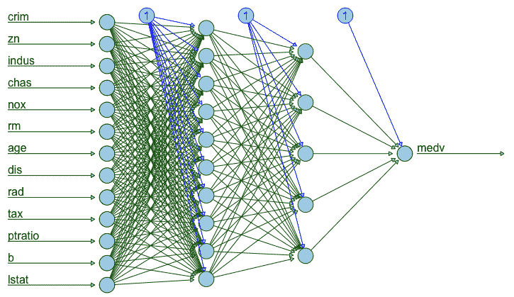
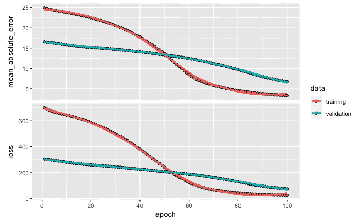
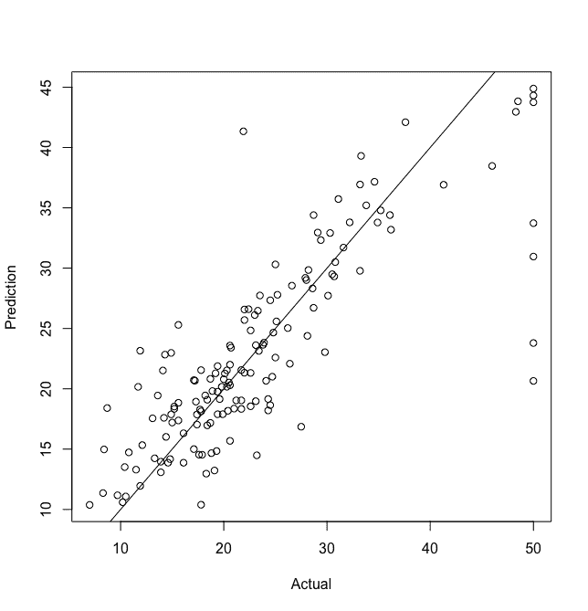
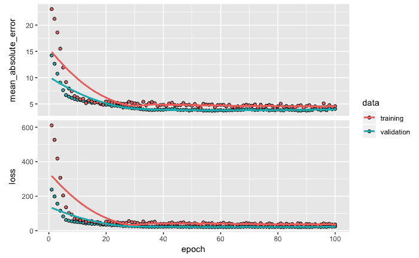
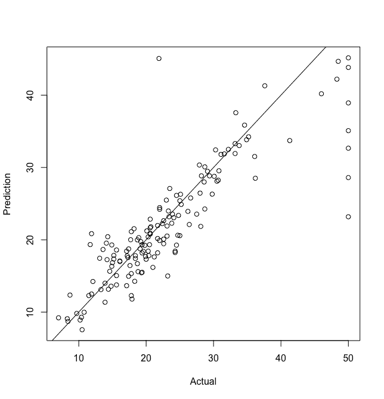
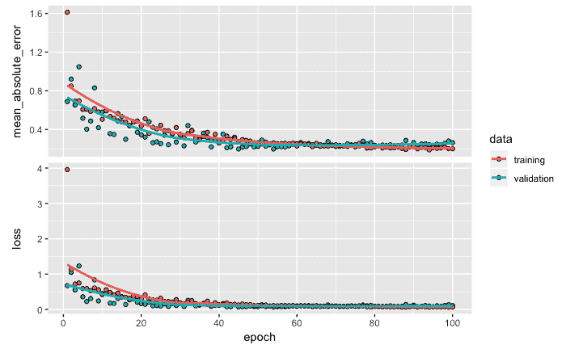
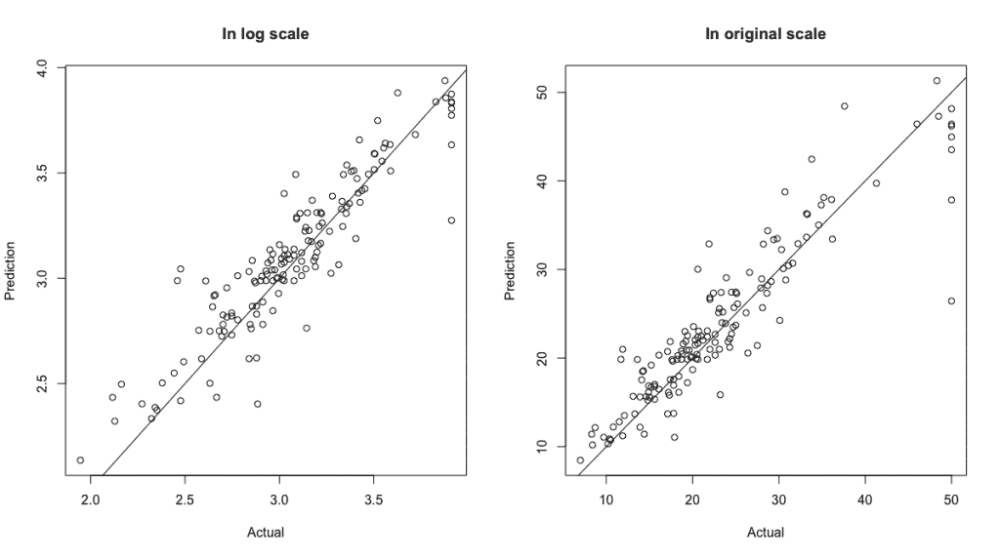

# 第三章：用于回归的深度神经网络

在上一章中，我们处理了一个具有分类目标变量的数据集，并讲解了如何使用 Keras 开发分类模型。在响应变量是数值型的情况下，监督学习问题被归类为回归问题。本章将开发一个用于数值响应变量的预测模型。为了说明开发预测模型的过程，我们将使用波士顿住房数据集，该数据集可以在`mlbench`包中找到。

本章内容将涵盖以下主题：

+   了解波士顿住房数据集

+   准备数据

+   创建并拟合一个深度神经网络回归模型

+   模型评估与预测

+   性能优化技巧和最佳实践

# 了解波士顿住房数据集

本章中我们将使用六个库，具体库列表见以下代码：

```py
# Libraries
library(keras)
library(mlbench)
library(psych)
library(dplyr)
library(magrittr)
library(neuralnet)
```

`BostonHousing`数据集的结构如下：

```py
# Data structure
data(BostonHousing)
str(BostonHousing)

OUTPUT
'data.frame':        506 obs. of  14 variables:
 $ crim   : num  0.00632 0.02731 0.02729 0.03237 0.06905 ...
 $ zn     : num  18 0 0 0 0 0 12.5 12.5 12.5 12.5 ...
 $ indus  : num  2.31 7.07 7.07 2.18 2.18 2.18 7.87 7.87 7.87 7.87 ...
 $ chas   : Factor w/ 2 levels "0","1": 1 1 1 1 1 1 1 1 1 1 ...
 $ nox    : num  0.538 0.469 0.469 0.458 0.458 0.458 0.524 0.524 0.524 0.524 ...
 $ rm     : num  6.58 6.42 7.18 7 7.15 ...
 $ age    : num  65.2 78.9 61.1 45.8 54.2 58.7 66.6 96.1 100 85.9 ...
 $ dis    : num  4.09 4.97 4.97 6.06 6.06 ...
 $ rad    : num  1 2 2 3 3 3 5 5 5 5 ...
 $ tax    : num  296 242 242 222 222 222 311 311 311 311 ...
 $ ptratio: num  15.3 17.8 17.8 18.7 18.7 18.7 15.2 15.2 15.2 15.2 ...
 $ b      : num  397 397 393 395 397 ...
 $ lstat  : num  4.98 9.14 4.03 2.94 5.33 ...
 $ medv   : num  24 21.6 34.7 33.4 36.2 28.7 22.9 27.1 16.5 18.9 ...
```

从上面的输出可以看到，该数据集共有`506`个观测值和`14`个变量。在这 14 个变量中，13 个是数值型变量，1 个变量（`chas`）是因子类型。最后一个变量，`medv`（以千美元为单位的业主自住住房中位数价值），是因变量或目标变量，其余 13 个变量是自变量。以下是所有变量的简要描述，以便参考：

| **变量** | **描述** |
| --- | --- |
| `crim` | 按城镇计算的人均犯罪率 |
| `zn` | 25,000 平方英尺以上的住宅用地比例 |
| `indus` | 每个城镇的非零售商业用地比例 |
| `chas` | 查尔斯河虚拟变量（若地块与河流相邻则为 1，否则为 0） |
| `nox` | 氮氧化物浓度（每 10 百万分之一） |
| `rm` | 每个住宅的平均房间数 |
| `age` | 1940 年之前建成的自有住宅比例 |
| `dis` | 到波士顿五个就业中心的加权距离 |
| `rad` | 进入放射性高速公路的可达性指数 |
| `tax` | 每 10,000 美元的全额财产税税率 |
| `ptratio` | 每个城镇的师生比 |
| `lstat` | 低收入群体在总人口中的百分比 |
| `medv` | 业主自住住房的中位数价值（千美元单位） |

该数据基于 1970 年的人口普查。使用这些数据的详细统计研究由 Harrison 和 Rubinfeld 于 1978 年发布（参考文献：[`citeseerx.ist.psu.edu/viewdoc/download?doi=10.1.1.926.5532&rep=rep1&type=pdf`](http://citeseerx.ist.psu.edu/viewdoc/download?doi=10.1.1.926.5532&rep=rep1&type=pdf)）。

# 准备数据

我们首先将`BostonHousing`数据集的名称更改为简化的`data`，以便使用。然后，通过`lapply`函数将因子类型的自变量转换为数值类型。

请注意，对于该数据集，唯一的因子变量是`chas`；然而，对于任何其他包含更多因子变量的数据集，该代码也能正常工作。

请查看以下代码：

```py
# Converting factor variables to numeric
data <- BostonHousing
data %>% lapply(function(x) as.numeric(as.character(x)))
data <- data.frame(data)
```

在前面的代码中，将因子变量转换为`numeric`类型后，我们还将`data`的格式更改为`data.frame`。

# 可视化神经网络

为了可视化一个具有隐藏层的神经网络，我们将使用`neuralnet`函数。为了说明，示例中将使用两个隐藏层，分别有 10 个和 5 个节点。输入层有 13 个节点，基于 13 个自变量。输出层只有一个节点，用于目标变量`medv`。使用的代码如下：

```py
# Neural network
n <- neuralnet(medv~crim+zn+indus+chas+nox+rm+age+dis+rad+tax+ptratio+b+lstat,
                data = data,
                hidden = c(10,5),
                linear.output = F,
                lifesign = 'full',
                rep=1)

# Plot
plot(n, col.hidden = "darkgreen", 
      col.hidden.synapse = 'darkgreen',
      show.weights = F, 
      information = F, 
      fill = "lightblue")
```

如前面的代码所示，结果被保存在`n`中，然后它将用于绘制神经网络的架构，如下图所示：



如前图所示，输入层有 13 个节点，表示 13 个自变量。共有两个隐藏层：第一个隐藏层有 10 个节点，第二个隐藏层有 5 个节点。每个隐藏层的节点都与前一层和后一层的所有节点相连接。输出层有一个节点，用于响应变量`medv`。

# 数据分割

接下来，我们将数据转换为矩阵格式。我们还将维度名称设置为`NULL`，这会将变量的名称更改为默认名称，`V1`、`V2`、`V3`、...、`V14`：

```py
data <- as.matrix(data)
dimnames(data) <- NULL 
```

然后，我们使用以下代码将数据分割为训练集和测试集：

```py
# Data partitioning
set.seed(1234)
ind <- sample(2, nrow(data), replace = T, prob=c(.7, .3))
training <- data[ind==1, 1:13]
test <- data[ind==2, 1:13]
trainingtarget <- data[ind==1, 14]
testtarget <- data[ind==2, 14]
```

在本示例中，数据分割的比例为 70:30。为了保持数据分割的可重复性，我们使用了`1234`的随机种子。这样，每次在任何计算机上执行数据分割时，训练数据和测试数据中都会包含相同的样本。自变量的数据存储在`training`中用于训练数据，在`test`中用于测试数据。同样，响应变量`medv`的数据，基于相应的分割数据，存储在`trainingtarget`和`testtarget`中。

# 归一化

为了对数据进行归一化，我们首先计算训练数据中所有自变量的均值和标准差。然后，使用`scale`函数进行归一化处理：

对于训练数据和测试数据，均值和标准差是基于所使用的训练数据计算的。

```py
# Normalization
m <- colMeans(training)
sd <- apply(training, 2, sd)
training <- scale(training, center = m, scale = sd)
test <- scale(test, center = m, scale = sd)
```

这标志着数据准备步骤的完成。需要注意的是，不同的数据集可能需要额外的步骤，这些步骤对于每个数据集是独特的——例如，许多大型数据集可能存在大量缺失数据值，这可能需要额外的数据准备步骤，如制定处理缺失值的策略，并在必要时输入缺失值。

在下一部分，我们将创建一个深度神经网络架构，然后拟合一个模型，用于准确预测数值型目标变量。

# 创建并拟合一个用于回归的深度神经网络模型

为了创建并拟合一个用于回归问题的深度神经网络模型，我们将使用 Keras。模型架构使用的代码如下：

注意，输入层有 13 个单元，输出层有 1 个单元，这是根据数据固定的；然而，要确定适合的隐藏层数量和每个层的单元数量，您需要进行实验。

```py
# Model architecture
model <- keras_model_sequential()
model %>%
   layer_dense(units = 10, activation = 'relu', input_shape = c(13)) %>%  
   layer_dense(units = 5, activation = 'relu') %>%
   layer_dense(units = 1) 
summary(model)

OUTPUT
___________________________________________________________________________
Layer (type)                     Output Shape                Param #      
===========================================================================
dense_1 (Dense)                   (None, 10)                   140          
___________________________________________________________________________
dense_2 (Dense)                   (None, 5)                    55           
___________________________________________________________________________
dense_3 (Dense)                   (None, 1)                     6            
===========================================================================
Total params: 201
Trainable params: 201
Non-trainable params: 0
___________________________________________________________________________
```

如前面的代码所示，我们使用`keras_model_sequential`函数来创建一个顺序模型。神经网络的结构通过`layer_dense`函数定义。由于有 13 个自变量，`input_shape`用于指定 13 个单元。第一个隐藏层有`10`个单元，激活函数使用的是修正线性单元（`relu`）。第二个隐藏层有`5`个单元，激活函数同样使用`relu`。最后，`layer_dense`有`1`个单元，表示一个因变量`medv`。通过使用`summary`函数，可以打印出模型总结，显示总共 201 个参数。

# 计算总参数数量

现在让我们看看如何得到模型的总计 201 个参数。`dense_1`层显示有`140`个参数。这些参数是基于输入层有 13 个单元，每个单元与第一隐藏层中的 10 个单元连接，因此共有 130 个参数（13 x 10）。其余 10 个参数来自于第一隐藏层中每个 10 个单元的偏置项。同样，50 个参数（10 x 5）来自于两个隐藏层之间的连接，剩下的 5 个参数来自于第二隐藏层中每个 5 个单元的偏置项。最后，`dense_3`有`6`个参数（（5 x 1）+ 1）。因此，总共有 201 个参数，基于此示例中选择的神经网络架构。

# 编译模型

在定义模型架构之后，可以使用以下代码编译模型并配置学习过程：

```py
# Compile model
model %>% compile(loss = 'mse', 
   optimizer = 'rmsprop', 
   metrics = 'mae')
```

如前面的代码所示，我们将损失函数定义为均方误差（`mse`）。在此步骤中，`rmsprop`优化器和平均绝对误差（`mae`）度量也被定义。我们选择这些是因为我们的响应变量是数值型的。

# 拟合模型

接下来，模型使用`fit`函数进行训练。请注意，在训练过程中，我们会在每个 epoch 后得到可视化图像和数值摘要。以下代码展示了最后三个 epoch 的输出。我们可以获得训练和验证数据的平均绝对误差和损失值。请注意，正如第一章《重访深度学习架构与技术》中所指出的，*每次训练网络时，由于网络权重的随机初始化，训练和验证误差可能会有所不同*。即使数据使用相同的随机种子进行划分，这种结果也是预期中的。为了获得可重复的结果，最好使用`save_model_hdf5`函数保存模型，并在需要时重新加载它。

用于训练网络的代码如下：

```py
# Fit model
model_one <- model %>%  
   fit(training,
   trainingtarget,
   epochs = 100,
   batch_size = 32,
   validation_split = 0.2)

OUTPUT from last 3 epochs
Epoch 98/100
284/284 [==============================] - 0s 74us/step - loss: 24.9585 - mean_absolute_error: 3.6937 - val_loss: 86.0545 - val_mean_absolute_error: 8.2678
Epoch 99/100
284/284 [==============================] - 0s 78us/step - loss: 24.6357 - mean_absolute_error: 3.6735 - val_loss: 85.4038 - val_mean_absolute_error: 8.2327
Epoch 100/100
284/284 [==============================] - 0s 92us/step - loss: 24.3293 - mean_absolute_error: 3.6471 - val_loss: 84.8307 - val_mean_absolute_error: 8.2015
```

如你从上面的代码中所见，模型在小批量大小为`32`的情况下进行训练，20%的数据用于验证，以避免过拟合。这里，运行了`100`个 epoch 或迭代来训练网络。训练过程完成后，相关信息将保存在`model_one`中，随后可以用来根据所有 epoch 的训练和验证数据绘制损失和平均绝对误差图：

```py
plot(model_one)
```

上述代码将返回以下输出。让我们来看看训练和验证数据（`model_one`）的损失和平均绝对误差图：



从上述图中，我们可以做出以下观察：

+   随着训练的进行，`mae`和`loss`值在训练数据和验证数据中都逐渐降低。

+   训练数据的错误下降速度在大约 60 个 epoch 后减缓。

在开发预测模型后，我们可以通过评估模型的预测质量来评估其性能，我们将在下一节中讨论这一点。

# 模型评估和预测

模型评估是获得合适预测模型过程中的一个重要步骤。一个模型可能在用于开发模型的训练数据上表现良好；然而，模型的真正考验是它在尚未见过的数据上的表现。让我们来看看基于测试数据的模型性能。

# 评估

模型的性能通过`evaluate`函数进行评估，使用下面代码所示的测试数据：

```py
# Model evaluation
model %>%  evaluate(test, testtarget) 

OUTPUT
 ## $loss
 ## [1] 31.14591 
 ##
 ## $mean_absolute_error
 ## [1] 3.614594
```

从上述输出可以看到，测试数据的损失和平均绝对误差分别为`31.15`和`3.61`。稍后我们将使用这些数字来比较和评估我们对当前模型所做的改进是否有助于提高预测性能。

# 预测

我们将使用以下代码预测`test`数据的`medv`值，并将结果存储在`pred`中：

```py
# Prediction
pred <- model %>%  predict(test)
cbind(pred[1:10], testtarget[1:10])

OUTPUT
 [,1] [,2]
 [1,] 33.18942 36.2
 [2,] 18.17827 20.4
 [3,] 17.89587 19.9
 [4,] 13.07977 13.9
 [5,] 14.17268 14.8
 [6,] 19.09264 18.4
 [7,] 19.81316 18.9
 [8,] 21.00356 24.7
 [9,] 30.50263 30.8
[10,] 19.75816 19.4
```

我们可以使用`cbind`函数查看前 10 个预测值与实际值。输出的第一列显示基于模型的预测值，第二列显示实际值。我们可以从输出中做出以下观察：

+   测试数据中第一个样本的预测值约为`33.19`，实际值为`36.2`。模型低估了响应值，约偏差`3`个点。

+   对于第二个样本，模型的预测值低估了响应值，偏差超过了`2`个点。

+   对于第十个样本，预测值与实际值非常接近。

+   对于第六个样本，模型高估了响应值。

为了全面了解预测性能，我们可以绘制预测值与实际值的散点图。我们将使用以下代码：

```py
plot(testtarget, pred,
      xlab = 'Actual',
      ylab = 'Prediction')
 abline(a=0,b=1)
```

散点图显示了基于测试数据的预测值与实际响应值：



从前面的图中，我们可以看到预测模型的整体性能。实际值与预测值之间呈正相关，且大致线性。虽然我们可以看到模型表现良好，但显然还有进一步改进的空间，使得数据点更接近理想线，该理想线的截距为零，斜率为 1。接下来，我们将通过开发一个更深的神经网络模型来进一步探索模型改进。

# 改进

在修改后的新模型中，我们将通过添加更多层来构建一个更深的网络。新增的层预计能够展示出之前较小网络无法捕捉到的数据模式。

# 更深的网络架构

进行此实验所使用的代码如下：

```py
# Model Architecture
model <- keras_model_sequential()
model %>%
 layer_dense(units = 100, activation = 'relu', input_shape = c(13)) %>% 
 layer_dropout(rate = 0.4) %>%
 layer_dense(units = 50, activation = 'relu') %>%
 layer_dropout(rate = 0.3) %>%
 layer_dense(units = 20, activation = 'relu') %>%
 layer_dropout(rate = 0.2) %>%
 layer_dense(units = 1)  
summary(model)

OUTPUT
 ## ___________________________________________________________________________
 ## Layer (type)                     Output Shape                  Param # 
 ## ===========================================================================
 ## dense_4 (Dense)                  (None, 100)                   1400 
 ## ___________________________________________________________________________
 ## dropout_1 (Dropout)              (None, 100)                   0 
 ## ___________________________________________________________________________
 ## dense_5 (Dense)                  (None, 50)                    5050 
 ## ___________________________________________________________________________
 ## dropout_2 (Dropout)              (None, 50)                    0 
 ## ___________________________________________________________________________
 ## dense_6 (Dense)                  (None, 20)                    1020 
 ## ___________________________________________________________________________
 ## dropout_3 (Dropout)              (None, 20)                    0 
 ## ___________________________________________________________________________
 ## dense_7 (Dense)                  (None, 1)                     21 
 ## ===========================================================================
 ## Total params: 7,491
 ## Trainable params: 7,491
 ## Non-trainable params: 0
 ## _________________________________________________________________________

# Compile model
model %>% compile(loss = 'mse', 
                   optimizer = 'rmsprop', 
                   metrics = 'mae')

# Fit model
model_two <- model %>%  
   fit(training,
       trainingtarget,
       epochs = 100,
       batch_size = 32, 
       validation_split = 0.2)
plot(model_two)
```

从前面的代码中，我们可以观察到，现在我们有三个隐藏层，分别包含`100`、`50`和`20`个单元。我们还在每个隐藏层后添加了一个丢弃层，丢弃率分别为`0.4`、`0.3`和`0.2`。例如，丢弃层的丢弃率意味着，在训练时，丢弃率为 0.4 表示第一隐藏层中 40%的单元被丢弃为零，这有助于避免过拟合。此模型的总参数数目已增加至`7,491`。注意，在之前的模型中，参数总数为`201`，显然我们正在构建一个更大的神经网络。接下来，我们使用之前相同的设置编译模型，随后将拟合模型并将结果存储在`model_two`中。

# 结果

以下图显示了`model_two`在 100 个周期中的损失和平均绝对误差：



从前面的图中，我们可以做出以下观察：

+   训练数据和验证数据的平均绝对误差和损失值迅速下降到较低值，在约 30 个周期后，我们未见到任何显著改进。

+   由于训练误差和验证误差似乎相互接近，因此没有过拟合的证据。

我们可以使用以下代码获得测试数据的损失值和平均绝对误差值：

```py
# Model evaluation
model %>%  evaluate(test, testtarget) 

OUTPUT
 ## $loss
 ## [1] 24.70368 
 ##
 ## $mean_absolute_error
 ## [1] 3.02175 

pred <- model %>%  predict(test)
plot(testtarget, pred,
     xlab = 'Actual', 
     ylab = 'Prediction')
abline(a=0,b=1)
```

使用`test`数据和`model_two`得到的损失值和平均绝对误差值分别为`24.70`和`3.02`。与我们从`model_one`获得的结果相比，这是一个显著的改进。

我们可以通过以下图中的散点图直观地看到这一改进，图中展示了预测值与实际响应值的关系：



从前面的图中，我们可以看到，实际值与预测值的散点图分布明显比之前的散点图更集中。这表明与之前的模型相比，预测性能有所提高。尽管`model_two`比之前的模型表现更好，但在较高值处，我们仍能看到目标值的显著低估。因此，尽管我们已经开发了一个更好的模型，但我们仍可以进一步探索该预测模型进一步改进的潜力。

# 性能优化技巧和最佳实践

改进模型性能可能涉及不同的策略。在这里，我们将讨论两种主要策略。一种策略是对模型架构进行修改，并观察结果，以获取任何有用的见解或改进的指示。另一种策略可能涉及探索目标变量的转换。在本节中，我们将尝试这两种策略的结合。

# 对输出变量进行对数转换

为了克服在较高值处显著低估目标变量的问题，我们尝试对目标变量进行对数转换，看看是否能进一步改进模型。我们的下一个模型在架构上也做了一些小的调整。在`model_two`中，我们没有发现任何主要问题或与过拟合相关的证据，因此我们可以稍微增加单元的数量，并且稍微减少 dropout 的百分比。以下是这个实验的代码：

```py
# log transformation and model architecture 
trainingtarget <- log(trainingtarget)
 testtarget <- log(testtarget)
 model <- keras_model_sequential()
 model %>%
   layer_dense(units = 100, activation = 'relu', input_shape = c(13)) %>%  
   layer_dropout(rate = 0.4) %>% 
   layer_dense(units = 50, activation = 'relu') %>%
   layer_dropout(rate = 0.2) %>%
   layer_dense(units = 25, activation = 'relu') %>%
   layer_dropout(rate = 0.1) %>%
   layer_dense(units = 1)
 summary(model)

OUTPUT
## ___________________________________________________________________________
 ## Layer (type)                     Output Shape                  Param # 
 ## ===========================================================================
 ## dense_8 (Dense)                  (None, 100)                   1400 
 ## ___________________________________________________________________________
 ## dropout_4 (Dropout)              (None, 100)                   0 
 ## ___________________________________________________________________________
 ## dense_9 (Dense)                  (None, 50)                    5050 
 ## ___________________________________________________________________________
 ## dropout_5 (Dropout)              (None, 50)                    0 
 ## ___________________________________________________________________________
 ## dense_10 (Dense)                 (None, 25)                    1275 
 ## ___________________________________________________________________________
 ## dropout_6 (Dropout)              (None, 25)                    0 
 ## ___________________________________________________________________________
 ## dense_11 (Dense)                 (None, 1)                     26 
 ## ===========================================================================
 ## Total params: 7,751
 ## Trainable params: 7,751
 ## Non-trainable params: 0
 ## ___________________________________________________________________________
```

我们将第三个隐藏层的单元数从`20`增加到`25`。第二个和第三个隐藏层的 dropout 率分别减少到`0.2`和`0.1`。请注意，整体参数的数量现在已增加到`7751`。

接下来，我们编译模型并拟合模型。模型结果存储在`model_three`中，我们使用它来绘制图表，如下所示的代码所示：

```py
# Compile model
model %>% compile(loss = 'mse', 
                   optimizer = optimizer_rmsprop(lr = 0.005),
                   metrics = 'mae')

# Fit model
 model_three <- model %>%  
   fit(training,
       trainingtarget,
       epochs = 100,
       batch_size = 32, 
       validation_split = 0.2)
plot(model_three)
```

以下显示了训练和验证数据的损失值和平均绝对误差的输出（`model_three`）：



从前面的图中我们可以看到，尽管图中的数值由于对数转换与早期数据不完全可比，但我们可以看到，无论是平均绝对误差还是损失值，整体误差在大约 50 个 epoch 后都减少并趋于稳定。

# 模型性能

我们还获得了这个新模型的`loss`和`mae`值，但同样，由于对数尺度的关系，得到的数值与之前两个模型不可直接比较：

```py
# Model evaluation
model %>%  evaluate(test, testtarget) 

OUTPUT
## $loss
 ## [1] 0.02701566
 ##
 ## $mean_absolute_error
 ## [1] 0.1194756 

pred <- model %>%  predict(test)
 plot(testtarget, pred)
```

我们获得了基于测试数据的实际值（对数转换后）与预测值的散点图。我们还获得了实际值与预测值在原始尺度上的散点图，并与早期的图进行比较。预测值与实际响应值的散点图（`model_three`）如下所示：



从前面的图表中，我们可以看到，早期模型中观察到的显著低估模式在对数尺度和原始尺度上都有所改善。在原始尺度中，较高数值的数据点相对更接近对角线，这表明模型的预测性能有所提高。

# 总结

本章中，我们介绍了当响应变量为数值型时开发预测模型的步骤。我们从一个具有 201 个参数的神经网络模型开始，然后开发了具有超过 7000 个参数的深度神经网络模型。你可能已经注意到，在本章中，我们使用了比上一章更深且更复杂的神经网络模型，而上一章中我们开发的是针对类别型目标变量的分类模型。在第二章，*用于多类分类的深度神经网络*和第三章，*用于回归的深度神经网络*中，我们开发的模型基于结构化数据。在下一章中，我们将转向数据类型为非结构化的问题。更具体地说，我们将处理图像数据类型，并介绍如何使用深度神经网络模型解决图像分类和识别问题。

在下一章中，我们将介绍使用深度神经网络开发图像识别和预测模型所需的步骤。
