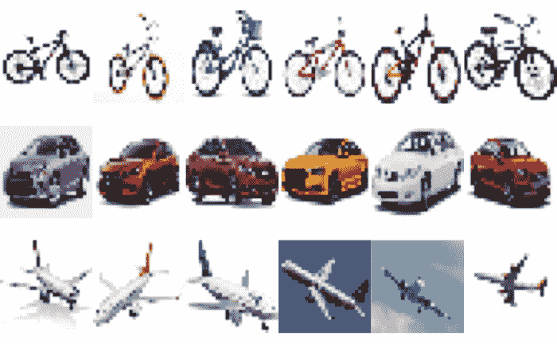
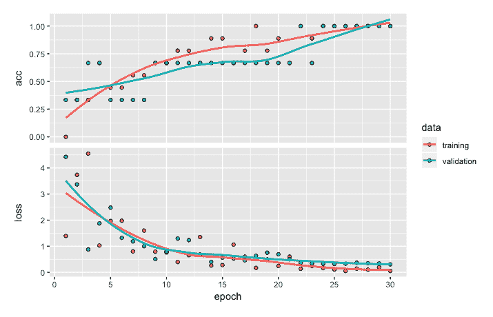

# 第五章：图像分类和识别

在前几章中，我们讨论了为分类和回归问题开发深度神经网络模型的过程。在这两种情况下，我们处理的是结构化数据，且模型属于监督学习类型，目标变量是已知的。图像或照片属于非结构化数据类别。在本章中，我们将演示如何使用 Keras 包，通过一个易于跟随的示例，使用深度学习神经网络进行图像分类和识别。我们将从一个小样本开始，说明开发图像分类模型的步骤。我们将把这个模型应用于一个涉及图像或照片标注的监督学习情境。

Keras 包含几个内置的数据集，用于图像分类，例如 CIFAR10、CIFAR100、MNIST 和 fashion-MNIST。CIFAR10 包含 50,000 张 32 x 32 彩色训练图像和 10,000 张测试图像，包含 10 个标签类别。CIFAR100 包含 50,000 张 32 x 32 彩色训练图像和 10,000 张测试图像，包含多达 100 个标签类别。MNIST 数据集包含 60,000 张 28 x 28 灰度图像用于训练，10,000 张图像用于测试，涵盖 10 个不同的数字。fashion-MNIST 数据集包含 60,000 张 28 x 28 灰度图像用于训练，10,000 张图像用于测试，包含 10 个时尚类别。这些数据集已经是可以直接用于开发深度神经网络模型的格式，几乎不需要数据准备步骤。然而，为了更好地处理图像数据，我们将从将原始图像从计算机读取到 RStudio 开始，并逐步介绍准备图像数据以构建分类模型的所有步骤。

相关步骤包括探索图像数据、调整图像大小和形状、进行独热编码、开发顺序模型、编译模型、拟合模型、评估模型、进行预测，并使用混淆矩阵评估模型性能。

更具体地说，在本章中，我们将覆盖以下主题：

+   处理图像数据

+   数据准备

+   创建和拟合模型

+   模型评估与预测

+   性能优化建议和最佳实践

# 处理图像数据

在本节中，我们将把图像数据读取到 R 中，并进一步探索以了解图像数据的各种特性。读取和显示图像的代码如下：

```py
# Libraries
library(keras)
library(EBImage)

# Reading and plotting images
setwd("~/Desktop/image18")
temp = list.files(pattern="*.jpg")
mypic <- list()
for (i in 1:length(temp)) {mypic[[i]] <- readImage(temp[i])}
par(mfrow = c(3,6))
for (i in 1:length(temp)) plot(mypic[[i]])
par(mfrow = c(1,1))
```

正如前面的代码所示，我们将使用 `keras` 和 `EBImage` 库。`EBImage` 库对于处理和探索图像数据非常有用。我们将从读取保存在我计算机的 `image18` 文件夹中的 18 张 JPEG 图像文件开始。这些图像每个包含 6 张来自互联网的自行车、汽车和飞机照片。我们将使用 `readImage` 函数读取这些图像文件，并将其存储在 `mypic` 中。

以下截图展示了所有 18 张图片：


从前面的截图中，我们可以看到六张关于自行车、汽车和飞机的图片。你可能注意到，并不是所有图片的大小都相同。例如，第五和第六张自行车的尺寸明显不同。同样，第四和第五张飞机的尺寸也明显不同。让我们通过以下代码详细查看第五张自行车的数据：

```py
# Exploring 5th image data
print(mypic[[5]])

OUTPUT
Image 
 colorMode    : Color 
 storage.mode : double 
 dim          : 299 169 3 
 frames.total : 3 
 frames.render: 1 

imageData(object)[1:5,1:6,1]
 [,1] [,2] [,3] [,4] [,5] [,6]
[1,]    1    1    1    1    1    1
[2,]    1    1    1    1    1    1
[3,]    1    1    1    1    1    1
[4,]    1    1    1    1    1    1
[5,]    1    1    1    1    1    1

hist(mypic[[5]])
```

使用`print`函数，我们可以查看自行车的图像（非结构化数据）是如何转化为数字（结构化数据）的。第五张自行车的尺寸为 299 x 169 x 3，总共有 151,593 个数据点或像素，这是通过将这三个数字相乘得到的。第一个数字 299 表示图像的宽度（以像素为单位），第二个数字 169 表示图像的高度（以像素为单位）。请注意，彩色图像由三个通道组成，分别代表红色、蓝色和绿色。从数据中提取的小表格显示了*x*维度的前五行数据，*y*维度的前六行数据，而*z*维度的值为 1。尽管表格中的所有值都是`1`，但它们应该在`0`和`1`之间变化。

彩色图像具有红色、绿色和蓝色通道。而灰度图像只有一个通道。

以下截图展示了用于创建直方图的第五张自行车的数据：


前面的直方图显示了第五张图片数据的强度值分布。可以看出，大多数数据点的强度值较高。

现在，我们来看一下基于第 16 张图片（飞机）的数据直方图进行对比：


从前面的直方图可以看出，这张图片的红色、绿色和蓝色通道有不同的强度值。一般来说，强度值介于零和一之间。接近零的数据点代表图像中较暗的颜色，而接近一的数据点表示图像中的较亮颜色。

让我们通过以下代码查看与第 16 张图片（飞机）相关的数据：

```py
# Exploring 16th image data
print(mypic[[16]])

OUTPUT

Image 
 colorMode : Color 
 storage.mode : double 
 dim : 318 159 3 
 frames.total : 3 
 frames.render: 1 

imageData(object)[1:5,1:6,1]
 [,1] [,2] [,3] [,4] [,5] [,6]
[1,] 0.2549020 0.2549020 0.2549020 0.2549020 0.2549020 0.2549020
[2,] 0.2549020 0.2549020 0.2549020 0.2549020 0.2549020 0.2549020
[3,] 0.2549020 0.2549020 0.2549020 0.2549020 0.2549020 0.2549020
[4,] 0.2588235 0.2588235 0.2588235 0.2588235 0.2588235 0.2588235
[5,] 0.2588235 0.2588235 0.2588235 0.2588235 0.2588235 0.2588235
```

从前面代码的输出结果来看，我们可以看到这两张图片的尺寸不同。第 16 张图片的尺寸为 318 x 159 x 3，总共有 151,686 个数据点或像素。

为了准备这些数据以开发图像分类模型，我们将从调整所有图片的大小到相同尺寸开始。

# 数据准备

在本节中，我们将介绍使图像数据准备好用于开发图像分类模型的步骤。这些步骤将涉及调整图像大小以确保所有图像具有相同的尺寸，然后进行重塑、数据划分和响应变量的热编码。

# 调整大小和重塑

为了准备数据以开发分类模型，我们首先使用以下代码将所有 18 张图像的维度调整为相同的大小：

```py
# Resizing
for (i in 1:length(temp)) {mypic[[i]] <- resize(mypic[[i]], 28, 28)}
```

从前面的代码可以看到，所有图像现在的大小已调整为 28 x 28 x 3。我们可以使用以下代码再次绘制所有图像，看看调整大小的影响：

```py
# Plot images
par(mfrow = c(3,6))
for (i in 1:length(temp)) plot(mypic[[i]])
par(mfrow = c(1,1)
```

当我们减少图像的维度时，它将导致像素数减少，从而导致图像质量降低，正如以下截图所示：



接下来，我们将使用以下代码将 28 x 28 x 3 的维度重塑为 28 x 28 x 3 的单维度（或 2,352 个向量）：

```py
# Reshape
for (i in 1:length(temp)) {mypic[[i]] <- array_reshape(mypic[[i]], c(28, 28,3))}
str(mypic)

OUTPUT

List of 18
 $ : num [1:28, 1:28, 1:3] 1 1 1 1 1 1 1 1 1 1 ...
 $ : num [1:28, 1:28, 1:3] 1 1 1 1 1 ...
 $ : num [1:28, 1:28, 1:3] 1 1 1 1 1 1 1 1 1 1 ...
 $ : num [1:28, 1:28, 1:3] 1 1 1 1 1 1 1 1 1 1 ...
 $ : num [1:28, 1:28, 1:3] 1 1 1 1 1 1 1 1 1 1 ...
 $ : num [1:28, 1:28, 1:3] 1 1 1 1 1 1 1 1 1 1 ...
 $ : num [1:28, 1:28, 1:3] 0.953 0.953 0.953 0.953 0.953 ...
 $ : num [1:28, 1:28, 1:3] 1 1 1 1 1 1 1 1 1 1 ...
 $ : num [1:28, 1:28, 1:3] 1 1 1 1 1 1 1 1 1 1 ...
 $ : num [1:28, 1:28, 1:3] 1 1 1 1 1 1 1 1 1 1 ...
 $ : num [1:28, 1:28, 1:3] 1 1 1 1 1 1 1 1 1 1 ...
 $ : num [1:28, 1:28, 1:3] 1 1 1 1 1 1 1 1 1 1 ...
 $ : num [1:28, 1:28, 1:3] 1 1 1 1 1 1 1 1 1 1 ...
 $ : num [1:28, 1:28, 1:3] 1 1 1 1 1 1 1 1 1 1 ...
 $ : num [1:28, 1:28, 1:3] 1 1 1 1 0.328 ...
 $ : num [1:28, 1:28, 1:3] 0.26 0.294 0.312 0.309 0.289 ...
 $ : num [1:28, 1:28, 1:3] 0.49 0.49 0.49 0.502 0.502 ...
 $ : num [1:28, 1:28, 1:3] 1 1 1 1 1 1 1 1 1 1 ..
```

通过使用`str(mypic)`观察前面数据的结构，我们可以看到列表中有 18 个不同的项，分别对应我们开始时的 18 张图像。

接下来，我们将创建训练、验证和测试数据。

# 训练、验证和测试数据

我们将分别使用自行车、汽车和飞机的前三张图像进行训练，每种类型的第四张图像用于验证，剩下的每种类型的两张图像用于测试。因此，训练数据将包含九张图像，验证数据将包含三张图像，测试数据将包含六张图像。以下是实现此操作的代码：

```py
# Training Data
a <- c(1:3, 7:9, 13:15)
trainx <- NULL
for (i in a) {trainx <- rbind(trainx, mypic[[i]]) }
str(trainx)

OUTPUT

num [1:9, 1:2352] 1 1 1 1 0.953 ...

# Validation data
b <- c(4, 10, 16)
validx <- NULL
for (i in b) {validx <- rbind(validx, mypic[[i]]) }
str(validx)

OUTPUT

num [1:3, 1:2352] 1 1 0.26 1 1 ...

# Test Data
c <- c(5:6, 11:12, 17:18)
testx <- NULL
for (i in c) {testx <- rbind(testx, mypic[[i]])}
str(testx)

OUTPUT

num [1:6, 1:2352] 1 1 1 1 0.49 ...
```

从前面的代码可以看到，我们将使用`rbind`函数将我们为每个图像创建的训练、验证和`test`数据的行进行合并。将九个图像的数据行合并后，`trainx`的结构表明共有 9 行和 2,352 列。类似地，对于验证数据，我们有 3 行和 2,352 列，对于测试数据，我们有 6 行和 2,352 列。

# 热编码

对响应变量进行热编码时，我们使用以下代码：

```py
# Labels
trainy <- c(0,0,0,1,1,1,2,2,2)
validy <- c(0,1,2)
testy <- c(0,0,1,1,2,2)

# One-hot encoding
trainLabels <- to_categorical(trainy)
validLabels <- to_categorical(validy)
testLabels <- to_categorical(testy)
trainLabels

OUTPUT
 [,1] [,2] [,3]
 [1,]    1    0    0
 [2,]    1    0    0
 [3,]    1    0    0
 [4,]    0    1    0
 [5,]    0    1    0
 [6,]    0    1    0
 [7,]    0    0    1
 [8,]    0    0    1
 [9,]    0    0    1
```

从前面的代码可以看到以下内容：

+   我们已经将每个图像的目标值存储在`trainy`、`validy`和`testy`中，其中`0`、`1`和`2`分别表示自行车、汽车和飞机图像。

+   我们通过使用`to_categorical`函数对`trainy`、`validy`和`testy`进行了一次热编码。此处的热编码有助于将因子变量转换为零和一的组合。

现在我们已经将数据转换为可以用于开发深度神经网络分类模型的格式，这也是我们在下一节中将要做的事情。

# 创建并拟合模型

在本节中，我们将开发一个图像分类模型，用于分类自行车、汽车和飞机的图像。我们将首先指定模型架构，然后编译模型，再使用训练数据和验证数据拟合模型。

# 开发模型架构

在开发模型架构时，我们从创建一个顺序模型开始，然后添加各种层。以下是代码：

```py
# Model architecture
model <- keras_model_sequential() 
model %>% 
  layer_dense(units = 256, activation = 'relu', input_shape = c(2352)) %>% 
  layer_dense(units = 128, activation = 'relu') %>% 
  layer_dense(units = 3, activation = 'softmax')
summary(model)

OUTPUT
______________________________________________________________________
Layer (type)                   Output Shape              Param # 
======================================================================
dense_1 (Dense)                (None, 256)               602368 
______________________________________________________________________
dense_2 (Dense)                (None, 128)               32896 
_____________________________________________________________________
dense_3 (Dense)                (None, 3)                  387 
======================================================================
Total params: 635,651
Trainable params: 635,651
Non-trainable params: 0
_______________________________________________________________________
```

如前面的代码所示，输入层有 `2352` 个单元（28 x 28 x 3）。对于初始模型，我们使用两个隐藏层，分别具有 256 和 128 个单元。对于这两个隐藏层，我们将使用 `relu` 激活函数。对于输出层，我们将使用 3 个单元，因为目标变量有 3 个类别，分别表示自行车、汽车和飞机。该模型的总参数数量为 635,651。

# 编译模型

在开发完模型架构之后，我们可以使用以下代码编译模型：

```py
# Compile model
model %>% compile(loss = 'categorical_crossentropy',
  optimizer = 'adam',
  metrics = 'accuracy')
```

我们使用 `categorical_crossentropy` 作为损失函数编译模型，因为我们正在进行多类分类。我们分别指定 `adam` 作为优化器和 `accuracy` 作为度量标准。

# 拟合模型

现在我们准备好训练模型了。以下是实现这一点的代码：

```py
# Fit model
model_one <- model %>% fit(trainx, 
                         trainLabels, 
                         epochs = 30, 
                         batch_size = 32, 
                         validation_data =  list(validx, validLabels))
plot(model_one)
```

从前面的代码中，我们可以得出以下结论：

+   我们可以使用存储在 `trainx` 中的 `independent` 变量和存储在 `trainLabels` 中的 `target` 变量来拟合模型。为了防止过拟合，我们将使用 `validation_data`。

请注意，在前几章中，我们使用了 `validation_split` 并指定了一个百分比，例如 20%；然而，如果我们使用 20% 的 `validation_split`，它将使用训练数据的最后 20%（所有飞机图像）作为验证数据。

+   这将导致一种情况，即训练数据中没有来自飞机图像的样本，而分类模型将仅基于自行车和汽车图像。

+   因此，得到的图像分类模型会有偏差，并且仅对自行车和汽车图像表现良好。因此，在这种情况下，我们不使用`validation_split`函数，而是使用`validation_data`，并确保训练数据和验证数据中每种类型的样本都得到了充分代表。

以下图表分别展示了训练数据和验证数据在 30 个 epoch 中的损失和准确度：


我们可以从前面的图表中得出以下观察结果：

+   从与准确度相关的图表部分，我们可以看到，从第十八个 epoch 开始，训练数据的准确度值达到了最高值 1。

+   另一方面，基于验证数据的准确度主要保持在三分之二左右，即 66.7%。由于我们有来自三张图像的数据用于验证，如果这三张验证数据的图像都被正确分类，那么报告的准确度将为 1。在这种情况下，三张图像中有两张被正确分类，导致准确度为 66.7%。

+   从处理损失的图表部分，我们可以看到，对于训练数据，损失值从大约 3 下降到 1 以下，经过 8 个周期后下降显著。之后，它们继续下降；然而，损失值的下降速度放缓。

+   基于验证数据，也可以看到一个大致相似的模式。

+   此外，由于损失在计算中使用了概率值，我们观察到与准确度相关的图表相比，损失相关图表呈现出更加明显的趋势。

接下来，我们将更详细地评估模型的图像分类性能，以便了解其行为。

# 模型评估与预测

在本节中，我们将进行模型评估，并借助预测结果创建训练数据和测试数据的混淆矩阵。我们从使用训练数据评估图像分类性能开始。

# 训练数据的损失、准确度和混淆矩阵

我们将首先获取训练数据的损失和准确度值，然后使用以下代码创建混淆矩阵：

```py
# Model evaluation
model %>% evaluate(trainx, trainLabels)

OUTPUT
12/12 [==============================] - 0s 87us/step
$loss
[1] 0.055556579307

$acc
[1] 1

# Confusion matrix
pred <- model %>%   predict_classes(trainx)
table(Predicted=pred, Actual=trainy)

OUTPUT
 Actual
Predicted 0 1 2
 0 3 0 0
 1 0 3 0
 2 0 0 3
```

如前面的输出所示，损失值和准确度值分别为`0.056`和`1`。基于训练数据的混淆矩阵显示，所有九张图像都已正确分类到三个类别中，因此 resulting 的准确度为 1。

# 训练数据的预测概率

我们现在可以查看该模型为训练数据中所有九张图像提供的三个类别的概率。以下是代码：

```py
# Prediction probabilities
prob <- model %>%   predict_proba(trainx) 
cbind(prob, Predicted_class = pred, Actual = trainy)

OUTPUT                                                
                                                    Predicted_class Actual
 [1,] 0.9431666135788 0.007227868307 0.049605518579          0        0
 [2,] 0.8056846261024 0.005127847660 0.189187481999          0        0
 [3,] 0.9556384682655 0.001881886506 0.042479615659          0        0
 [4,] 0.0018005876336 0.988727569580 0.009471773170          1        1
 [5,] 0.0002136278927 0.998095452785 0.001690962003          1        1
 [6,] 0.0008950306219 0.994426369667 0.004678600468          1        1
 [7,] 0.0367377623916 0.010597365908 0.952664911747          2        2
 [8,] 0.0568452328444 0.011656147428 0.931498587132          2        2
 [9,] 0.0295505002141 0.011442330666 0.959007143974          2        2
```

在前面的输出中，前三列显示了图像属于自行车、汽车或飞机的概率，这三者的总和为 1。我们可以从输出中做出以下观察：

+   训练数据中第一张图像的分类概率分别为：自行车`0.943`，汽车`0.007`，飞机`0.049`。由于最高概率对应于第一个类别，因此模型预测的类别是`0`（自行车），这也是该图像的实际类别。

+   尽管所有 9 张图像都已正确分类，但正确分类的概率从`0.806`（图像 2）到`0.998`（图像 5）不等。

+   对于汽车图像（第 4 行到第 6 行），正确分类的概率从`0.989`到`0.998`，并且所有三张图像的概率都 consistently 很高。因此，当分类汽车图像时，该分类模型表现最佳。

+   对于自行车图像（第 1 到第 3 行），正确分类的概率范围从`0.806`到`0.956`，这表明正确分类自行车图像存在一定难度。

+   对于第二个样本，它代表了一张自行车图像，其第二高的概率为`0.189`，即被判定为飞机图像。显然，当模型决定这张图像是自行车还是飞机时，它有些困惑。

+   对于飞机图像（第 7 到第 9 行），正确分类的概率范围从`0.931`到`0.959`，并且所有三张图像的概率都保持在较高水平。

观察预测概率让我们能更深入地分析模型的分类性能，这些是仅通过查看准确率值无法获得的。然而，尽管在训练数据上表现良好是必要的，但它不足以构建一个可靠的图像分类模型。当分类模型出现过拟合问题时，我们很难在测试数据上复制基于训练数据获得的好结果。 因此，检验一个优秀分类模型的真正标准是它在测试数据上的表现。现在让我们回顾一下该模型在测试数据上的图像分类性能。

# 测试数据的损失、准确率和混淆矩阵

我们现在可以获取测试数据的损失和准确率值，然后使用以下代码创建混淆矩阵：

```py
# Loss and accuracy
model %>% evaluate(testx, testLabels)

OUTPUT
6/6 [==============================] - 0s 194us/step
$loss
[1] 0.5517520905

$acc
[1] 0.8333333

# Confusion matrix
pred <- model %>%   predict_classes(testx)
table(Predicted=pred, Actual=testy)

OUTPUT
 Actual
Predicted 0 1 2
 0 2 0 0
 1 0 1 0
 2 0 1 2
```

从前面的输出中可以看到，测试数据中图像的损失值和准确率值分别为`0.552`和`0.833`。这些结果略逊色于训练数据的数值；然而，当模型在未见过的数据上进行评估时，性能出现一些下降是可以预期的。混淆矩阵显示有一张图像被错误分类，其中一张汽车图像被误判为飞机图像。因此，基于测试数据的模型准确率为 83.3%，正确分类了六张中的五张。现在我们通过研究基于测试数据图像的概率值，进一步分析模型的预测性能。

# 测试数据的预测概率

我们现在可以回顾测试数据中所有六张图像的三种类别的概率。以下是代码：

```py
# Prediction probabilities
prob <- model %>%   predict_proba(testx) 
cbind(prob, Predicted_class = pred, Actual = testy)

OUTPUT                                         

 Predicted_class Actual
[1,] 0.587377548218 0.02450981364 0.38811263442           0      0
[2,] 0.532718658447 0.04708640277 0.42019486427           0      0
[3,] 0.115497209132 0.18486714363 0.69963568449           2      1
[4,] 0.001700860681 0.98481327295 0.01348586939           1      1
[5,] 0.230999588966 0.03030913882 0.73869132996           2      2
[6,] 0.112148292363 0.02054920420 0.86730253696           2      2
```

通过查看这些预测概率，我们可以得出以下观察结果：

+   自行车图像的预测是正确的，如前两个样本所示。然而，预测概率相对较低，分别为`0.587`和`0.533`。

+   汽车图像（第 3 和第 4 行）的结果混合，第 4 个样本被正确预测，并具有`0.985`的高概率，而第 3 张汽车图像则被误分类为飞机，概率约为`0.7`。

+   飞机图像由第五和第六个样本表示。这两张图像的预测概率分别为`0.739`和`0.867`。

+   尽管六张图像中有五张被正确分类，但与模型在训练数据上的表现相比，许多预测概率相对较低。

因此，总体而言，我们可以说模型的性能确实还有进一步提升的空间。在下一节中，我们将探讨如何提高模型的性能。

# 性能优化技巧和最佳实践

在本节中，我们将探讨一个更深的网络，以提高图像分类模型的性能。我们将查看结果进行对比。

# 更深的网络

在本节中，用于实验更深网络的代码如下：

```py
# Model architecture
model <- keras_model_sequential() 
model %>% 
  layer_dense(units = 512, activation = 'relu', input_shape = c(2352)) %>% 
  layer_dropout(rate = 0.1) %>%
  layer_dense(units = 256, activation = 'relu') %>%
  layer_dropout(rate = 0.1) %>%
  layer_dense(units = 3, activation = 'softmax')
summary(model)

OUTPUT
_______________________________________________________________________
Layer (type)                    Output Shape             Param # 
=======================================================================
dense_1 (Dense)                  (None, 512)               1204736 
_______________________________________________________________________
dropout_1 (Dropout)              (None, 512)               0 
_______________________________________________________________________
dense_2 (Dense)                  (None, 256)              131328 
_______________________________________________________________________
dropout_2 (Dropout)              (None, 256)               0 
_______________________________________________________________________
dense_3 (Dense)                  (None, 3)                 771 
=======================================================================
Total params: 1,336,835
Trainable params: 1,336,835
Non-trainable params: 0
_______________________________________________________________________

# Compile model
model %>% compile(loss = 'categorical_crossentropy',
  optimizer = 'adam',
  metrics = 'accuracy')

# Fit model
model_two <- model %>% fit(trainx, 
 trainLabels, 
 epochs = 30, 
 batch_size = 32, 
 validation_data = list(validx, validLabels))
plot(model_two)
```

从前述代码中，我们可以看到以下内容：

+   我们将第一层和第二层隐藏层的单元数分别增加到`512`和`256`。

+   我们还在每个隐藏层后添加了丢弃层，丢弃率为 10%。

+   进行此更改后，参数总数已增加到`1336835`。

+   这次，我们还将运行模型进行 50 个周期。我们不会对模型做其他更改。

以下图表提供了 50 个周期内训练数据和验证数据的准确度和损失值：



从前述图表中，我们可以看到以下内容：

+   与之前的模型相比，我们观察到准确度和损失值有一些显著变化。

+   经过 50 个周期后，训练数据和验证数据的准确度均达到了 100%。

+   此外，训练数据和验证数据的损失与准确度曲线的接近度表明，这个图像分类模型不太可能遭遇过拟合问题。

# 结果

为了进一步探索模型在图像分类性能方面的变化，尤其是那些图形摘要中不容易发现的变化，我们来查看一些数值摘要：

1.  我们将首先查看基于训练数据的结果，并将使用以下代码：

```py
# Loos and accuracy
model %>% evaluate(trainx, trainLabels)
OUTPUT
12/12 [==============================] - 0s 198us/step
$loss
[1] 0.03438224643

$acc
[1] 1

# Confusion matrix
pred <- model %>%   predict_classes(trainx)
table(Predicted=pred, Actual=trainy)

OUTPUT
 Actual
Predicted 0 1 2
 0 3 0 0
 1 0 3 0
 2 0 0 3
```

从前述输出中，我们可以看到损失值现在已降至`0.034`，且准确度保持在`1.0`。我们得到了与之前相同的混淆矩阵结果，因为模型正确分类了所有九张图像，准确度为 100%。

1.  为了更深入地了解模型的分类性能，我们使用以下代码和输出：

```py
# Prediction probabilities
prob <- model %>%   predict_proba(trainx) 
cbind(prob, Predicted_class = pred, Actual = trainy)

OUTPUT        
 Predicted_class Actual
 [1,] 0.97638195753098 0.0071088117547 0.01650915294886     0         0
 [2,] 0.89875286817551 0.0019298568368 0.09931717067957     0         0
 [3,] 0.98671281337738 0.0004396488657 0.01284754090011     0         0
 [4,] 0.00058794603683 0.9992876648903 0.00012432398216     1         1
 [5,] 0.00005639552546 0.9999316930771 0.00001191849515     1         1
 [6,] 0.00020669832884 0.9997472167015 0.00004611289114     1         1
 [7,] 0.03771930187941 0.0022936603054 0.95998704433441     2         2
 [8,] 0.08463590592146 0.0022607713472 0.91310334205627     2         2
 [9,] 0.03016609139740 0.0019471622072 0.96788680553436     2         2
```

根据我们从训练数据输出中获得的前述预测概率，我们可以做出以下观察：

+   正确分类现在比之前的模型具有更高的概率值。

+   根据第二行，最低的正确分类概率为`0.899`。

+   因此，与前一个模型相比，这个模型在正确分类图像时似乎更加确信。

1.  现在，让我们看看这种改进是否也出现在测试数据上。我们将使用以下代码和输出：

```py
# Loss and accuracy
model %>% evaluate(testx, testLabels)

OUTPUT

6/6 [==============================] - 0s 345us/step
$loss
[1] 0.40148338683

$acc
[1] 0.8333333

# Confusion matrix
pred <- model %>%   predict_classes(testx)
table(Predicted=pred, Actual=testy)

OUTPUT
 Actual
Predicted 0 1 2
 0 2 0 0
 1 0 1 0
 2 0 1 2
```

如前述输出所示，测试数据的损失值和准确率分别为 `0.401` 和 `0.833`。我们确实看到损失值有所改善；然而，准确率值仍与之前相同。通过查看混淆矩阵，我们可以看到这一次，一张汽车的图像被错误分类为飞机。因此，我们没有看到基于混淆矩阵的任何重大差异。

1.  接下来，让我们通过以下代码及其输出回顾预测概率：

```py
# Prediction probabilities
prob <- model %>%   predict_proba(testx) 
cbind(prob, Predicted_class = pred, Actual = testy)

OUTPUT
 Predicted_class Actual
[1,] 0.7411330938339 0.015922509134 0.242944419384           0      0
[2,] 0.7733710408211 0.021422179416 0.205206796527           0      0
[3,] 0.3322730064392 0.237866103649 0.429860889912           2      1
[4,] 0.0005808877177 0.999227762222 0.000191345287           1      1
[5,] 0.2163420319557 0.009395645000 0.774262309074           2      2
[6,] 0.1447975188494 0.002772571286 0.852429926395           2      2
```

使用测试数据的预测概率，我们可以做出以下两点观察：

+   我们看到的模式与在训练数据结果中观察到的模式一致。该模型正确地将测试数据中的图像分类为具有比早期模型（`0.53` 到 `0.98`）更高的概率（`0.74` 到 `0.99`）。

+   对于测试数据中的第四个样本，模型似乎在自行车和飞机的图像之间感到困惑，而实际上，这张图像是汽车的图像。

因此，总的来说，我们观察到，通过开发更深的神经网络，我们能够提高模型的性能。虽然从准确度计算中无法明显看到性能提升；然而，预测概率的计算使我们能够获得更好的洞察力，并比较模型的表现。

# 总结

在本章中，我们探索了图像数据和深度神经网络图像分类模型。我们使用了来自 18 张自行车、汽车和飞机图像的数据，并进行了适当的数据处理，使数据能够与 Keras 库兼容。我们将图像数据划分为训练数据、验证数据和测试数据，并随后使用训练数据开发了一个深度神经网络模型，并通过查看训练数据和测试数据的损失、准确率、混淆矩阵和概率值来评估其性能。我们还对模型进行了修改，以提高其分类性能。此外，我们观察到，当混淆矩阵提供相同水平的性能时，预测概率可能有助于提取两个模型之间的细微差异。

在下一章中，我们将介绍使用**卷积神经网络**（**CNNs**）开发深度神经网络图像分类模型的步骤，卷积神经网络在图像分类应用中越来越受欢迎。CNN 被认为是图像分类问题的金标准，并且在大规模图像分类应用中非常有效。
