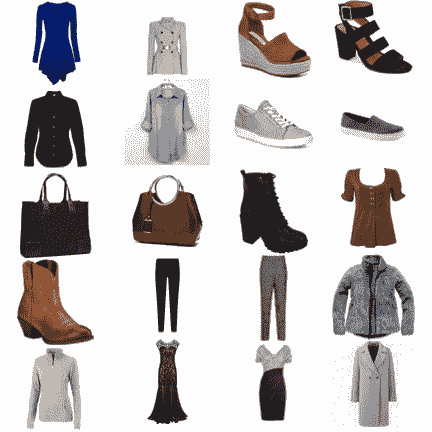
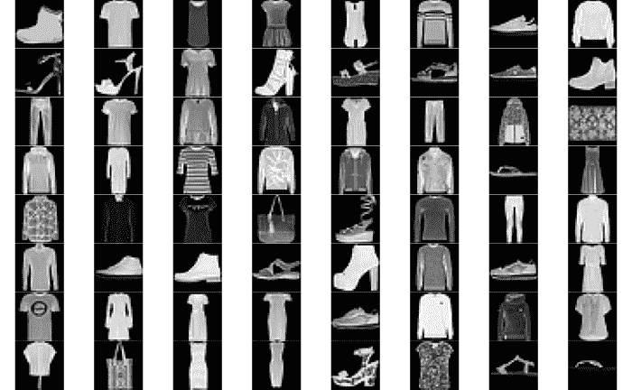
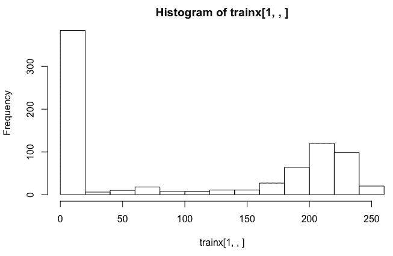
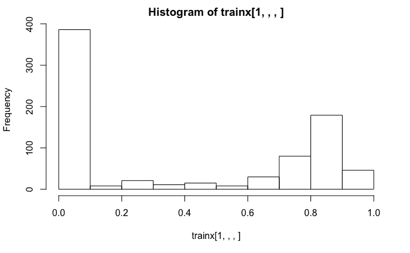
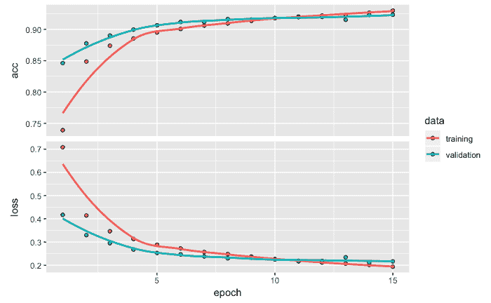
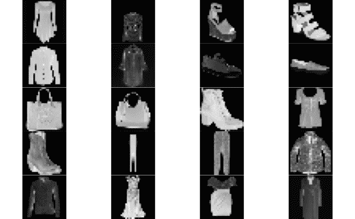
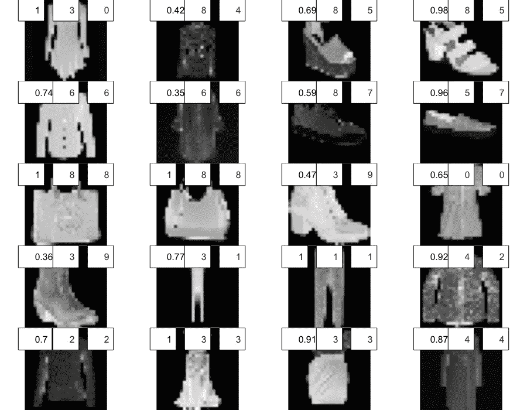
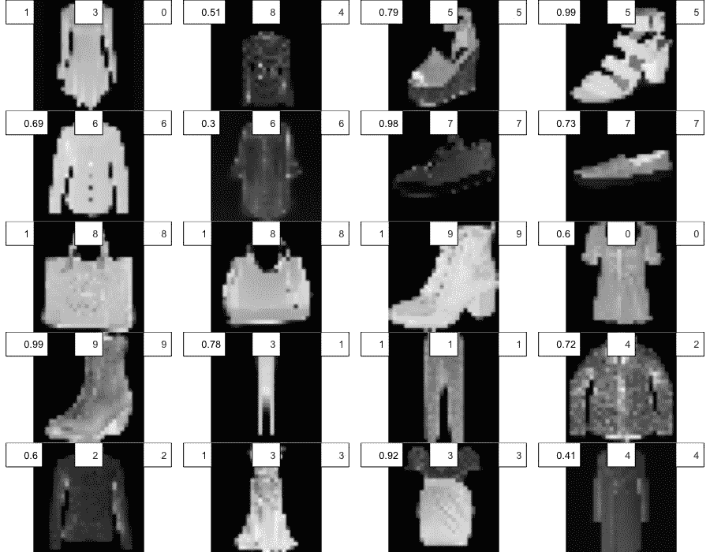
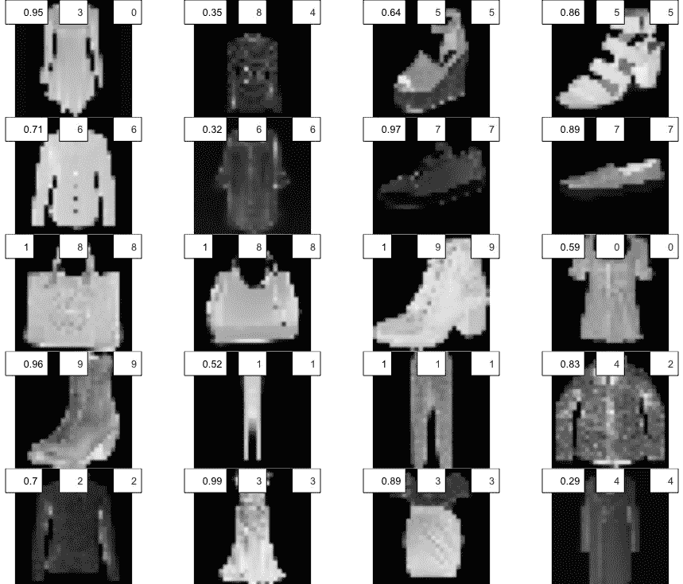

# 第六章：使用卷积神经网络进行图像分类

**卷积神经网络**（**CNNs**）是流行的深度神经网络，并且被认为是大规模图像分类任务的金标准。涉及 CNN 的应用包括图像识别与分类、自然语言处理、医学图像分类等。本章我们将继续讨论有响应变量的监督学习情境。本章提供了使用卷积神经网络进行图像分类与识别的步骤，并通过一个易于跟随的实践示例，利用与时尚相关的**修改版国家标准与技术研究所**（**MNIST**）数据进行讲解。我们还利用从互联网上下载的时尚物品图像，探讨我们开发的分类模型的泛化潜力。

本章中，我们将更具体地涵盖以下主题：

+   数据准备

+   卷积神经网络中的层

+   拟合模型

+   模型评估与预测

+   性能优化技巧与最佳实践

+   总结

# 数据准备

在本章中，我们将使用 Keras 和 EBImage 库：

```py
# Libraries
library(keras)
library(EBImage)
```

让我们开始看一些从互联网上下载的图像。这里有 20 张图像，包括衬衫、包、凉鞋、连衣裙等时尚物品。这些图像是通过 Google 搜索获得的。我们将尝试开发一个图像识别与分类模型，识别这些图像并将其分类到适当的类别中。为了开发这样的模型，我们将使用 fashion-MNIST 时尚物品数据库：

```py
# Read data
setwd("~/Desktop/image20")
temp = list.files(pattern = "*.jpg")
mypic <- list()
for (i in 1:length(temp))  {mypic[[i]] <- readImage(temp[[i]])}
par(mfrow = c(5,4))
for (i in 1:length(temp)) plot(mypic[[i]])
```

从互联网上下载的 20 张时尚物品图像如下所示：



接下来，让我们看一下包含大量此类时尚物品图像的 fashion-MNIST 数据。

# Fashion-MNIST 数据

我们可以使用`dataset_fashion_mnist`函数从 Keras 获取 fashion-MNIST 数据。看看以下代码及其输出：

```py
# MNIST data
mnist <- dataset_fashion_mnist()
str(mnist)

OUTPUT
List of 2
 $ train:List of 2
  ..$ x: int [1:60000, 1:28, 1:28] 0 0 0 0 0 0 0 0 0 0 ...
  ..$ y: int [1:60000(1d)] 9 0 0 3 0 2 7 2 5 5 ...
 $ test :List of 2
  ..$ x: int [1:10000, 1:28, 1:28] 0 0 0 0 0 0 0 0 0 0 ...
  ..$ y: int [1:10000(1d)] 9 2 1 1 6 1 4 6 5 7 ...
```

从前面的数据结构来看，我们看到它包含 60,000 张训练图像和 10,000 张测试图像。所有这些图像都是 28 x 28 的灰度图像。我们从上一章了解到，图像可以基于颜色和强度表示为数字数据。自变量 x 包含强度值，因变量 y 包含从 0 到 9 的标签。

fashion-MNIST 数据集中的 10 个不同时尚物品被标记为从 0 到 9，如下表所示：

| 标签 | 描述 |
| --- | --- |
| 0 | T 恤/上衣 |
| 1 | 长裤 |
| 2 | 套头衫 |
| 3 | 连衣裙 |
| 4 | 外套 |
| 5 | 凉鞋 |
| 6 | 衬衫 |
| 7 | 运动鞋 |
| 8 | 包 |
| 9 | 脚踝靴 |

从前面的表格中，我们可以观察到，为这些图像开发分类模型将具有挑战性，因为某些类别将很难区分。

# 训练与测试数据

我们提取训练图像数据，将其存储在`trainx`中，并将相应的标签存储在`trainy`中。同样，我们从测试数据中创建`testx`和`testy`。基于`trainy`的表格显示，训练数据中每种时尚物品恰好有 6,000 张图片，而测试数据中每种时尚物品恰好有 1,000 张图片：

```py
#train and test data
trainx <- mnist$train$x
trainy <- mnist$train$y
testx <- mnist$test$x
testy <- mnist$test$y
table(mnist$train$y, mnist$train$y)

       0    1    2    3    4    5    6    7    8    9
  0 6000    0    0    0    0    0    0    0    0    0
  1    0 6000    0    0    0    0    0    0    0    0
  2    0    0 6000    0    0    0    0    0    0    0
  3    0    0    0 6000    0    0    0    0    0    0
  4    0    0    0    0 6000    0    0    0    0    0
  5    0    0    0    0    0 6000    0    0    0    0
  6    0    0    0    0    0    0 6000    0    0    0
  7    0    0    0    0    0    0    0 6000    0    0
  8    0    0    0    0    0    0    0    0 6000    0
  9    0    0    0    0    0    0    0    0    0 6000

table(mnist$test$y,mnist$test$y)      
       0    1    2    3    4    5    6    7    8    9
  0 1000    0    0    0    0    0    0    0    0    0
  1    0 1000    0    0    0    0    0    0    0    0
  2    0    0 1000    0    0    0    0    0    0    0
  3    0    0    0 1000    0    0    0    0    0    0
  4    0    0    0    0 1000    0    0    0    0    0
  5    0    0    0    0    0 1000    0    0    0    0
  6    0    0    0    0    0    0 1000    0    0    0
  7    0    0    0    0    0    0    0 1000    0    0
  8    0    0    0    0    0    0    0    0 1000    0
  9    0    0    0    0    0    0    0    0    0 1000
```

接下来，我们绘制训练数据中的前 64 张图像。请注意，这些是灰度图像数据，每张图像都有黑色背景。由于我们的图像分类模型将基于这些数据，因此我们最初的彩色图像也需要转换为灰度图像。此外，衬衫、外套和连衣裙等图像比较难以区分，这可能会影响我们模型的准确性。我们来看看以下代码：

```py
# Display images
par(mfrow = c(8,8), mar = rep(0, 4))
for (i in 1:84) plot(as.raster(trainx[i,,], max = 255))
par(mfrow = c(1,1))
```

我们得到训练数据中前 64 张图像的输出，如下所示：



基于训练数据中第一张图片（踝靴）的直方图如下图所示：



左侧的最高柱状条来自低强度数据点，这些数据点捕捉到了图像中的黑色背景。代表踝靴较浅颜色的高强度值在右侧的更高柱状条中有所体现。这些强度值的范围从 0 到 255。

# 重塑和调整大小

接下来，我们重塑、训练并测试数据。我们还将训练数据和测试数据除以 255，将数值范围从 0-255 变为 0-1。所使用的代码如下：

```py
# Reshape and resize
trainx <- array_reshape(trainx, c(nrow(trainx), 784))
testx <- array_reshape(testx, c(nrow(testx), 784))
trainx <- trainx / 255
testx <- testx / 255
str(trainx)

OUTPUT

num [1:60000, 1:784] 0 0 0 0 0 0 0 0 0 0 ...

```

前面的`trainx`结构表明，在对训练数据进行重塑后，我们现在得到了包含 60,000 行和 784 列（28 x 28）的数据。

在将数据除以 255 之后，我们获得了基于训练数据中第一张图像（踝靴）的直方图输出，如下截图所示：



前面的直方图显示，数据点的范围现在已变为 0 到 1 之间。然而，在前一个直方图中观察到的形状没有变化。

# 独热编码

接下来，我们对存储在`trainy`和`testy`中的标签进行独热编码，使用的代码如下：

```py
# One-hot encoding
trainy <- to_categorical(trainy, 10)
testy <- to_categorical(testy, 10)
head(trainy)
     [,1] [,2] [,3] [,4] [,5] [,6] [,7] [,8] [,9] [,10]
[1,]    0    0    0    0    0    0    0    0    0     1
[2,]    1    0    0    0    0    0    0    0    0     0
[3,]    1    0    0    0    0    0    0    0    0     0
[4,]    0    0    0    1    0    0    0    0    0     0
[5,]    1    0    0    0    0    0    0    0    0     0
[6,]    0    0    1    0    0    0    0    0    0     0
```

经独热编码后，训练数据的第一行表示第十类（踝靴）的值为 1。类似地，训练数据的第二行表示第一类（T 恤/上衣）的值为 1。完成前述更改后，时尚-MNIST 数据现在已经准备好用于开发图像识别和分类模型。

# 卷积神经网络中的层

在这一部分，我们将开发模型架构，然后编译模型。我们还将进行计算，以将卷积网络与全连接网络进行比较。让我们从指定模型架构开始。

# 模型架构及相关计算

我们首先通过 `keras_model_sequential` 函数创建模型。模型架构所使用的代码如下：

```py
# Model architecture
model <- keras_model_sequential() 
model %>% 
         layer_conv_2d(filters = 32, 
                        kernel_size = c(3,3), 
                        activation = 'relu', 
                        input_shape = c(28,28,1)) %>%   
         layer_conv_2d(filters = 64, 
                        kernel_size = c(3,3), 
                        activation = 'relu') %>%  
         layer_max_pooling_2d(pool_size = c(2,2)) %>% 
         layer_dropout(rate = 0.25) %>%   
         layer_flatten() %>% 
         layer_dense(units = 64, activation = 'relu') %>%  
         layer_dropout(rate = 0.25) %>% 
         layer_dense(units = 10, activation = 'softmax')
```

如前面的代码所示，我们添加了不同的层来开发 CNN 模型。该网络中的输入层基于图像的高度和宽度为 28 x 28 x 1，其中每个维度都是 28。由于我们使用的是灰度图像，颜色通道为 1。由于我们正在构建一个使用灰度图像的深度学习模型，因此这里使用的是二维卷积层。

请注意，在使用灰度图像数据开发图像识别和分类模型时，我们使用的是 2D 卷积层；而对于彩色图像，我们使用的是 3D 卷积层。

让我们来看一下与网络的第一个卷积层相关的一些计算，这将帮助我们理解与全连接层相比，使用卷积层的优势。在 CNN 中，一层的神经元并不是与下一层的所有神经元相连接的。

这里，输入层的图像尺寸为 28 x 28 x 1。为了获得输出形状，我们从 28（输入图像的高度）中减去 3（来自 `kernel_size`），然后再加 1。这给我们得到 26。最终的输出形状为 26 x 26 x 32，其中 32 是输出滤波器的数量。因此，输出形状的高度和宽度减小，但深度增大。为了计算参数数量，我们使用 3 x 3 x 1 x 32 + 32 = 320，其中 3 x 3 是 `kernel_size`，1 是图像的通道数，32 是输出滤波器的数量，并且我们还加上了 32 个偏置项。

如果将其与全连接神经网络进行比较，我们会得到一个更大的参数数量。在全连接网络中，28 x 28 x 1 = 784 个神经元将与 26 x 26 x 32 = 21,632 个神经元连接。因此，总参数数量为 784 x 21,632 + 21,632 = 16,981,120。这比卷积层的参数数量大了超过 53,000 倍。反过来，这有助于显著减少处理时间，从而降低处理成本。

每一层的参数数量在以下代码中给出：

```py
# Model summary
summary(model)
__________________________________________________________________
Layer (type                   Output Shape             Param #        
==================================================================
conv2d_1 (Conv2D)          (None, 26, 26, 32)            320            
__________________________________________________________________
conv2d_2 (Conv2D)          (None, 24, 24, 64)            18496          
__________________________________________________________________
max_pooling2d_1 (MaxPooling2D) (None, 12, 12, 64)         0              
__________________________________________________________________
dropout_1 (Dropout)        (None, 12, 12, 64)             0              
__________________________________________________________________
flatten_1 (Flatten)        (None, 9216)                   0              
__________________________________________________________________
dense_1 (Dense)            (None, 64)                    589888         
__________________________________________________________________
dropout_2 (Dropout)        (None, 64)                     0              
__________________________________________________________________
dense_2 (Dense)            (None, 10)                     650            
==================================================================
Total params: 609,354
Trainable params: 609,354
Non-trainable params: 0
___________________________________________________________________
```

第二个卷积网络的输出形状为 24 x 24 x 64，其中 64 是输出滤波器的数量。在这里，输出形状的高度和宽度有所减少，但深度增大。为了计算参数数量，我们使用 3 x 3 x 32 x 64 + 64 = 18,496，其中 3 x 3 是 `kernel_size`，32 是前一层的滤波器数量，64 是输出滤波器的数量，我们还需要加上 64 个偏置项。

下一层是池化层，通常放置在卷积层之后，执行下采样操作。这有助于减少处理时间，也有助于减少过拟合。为了获得输出形状，我们可以将 24 除以 2，其中 2 是我们指定的池化大小。这里的输出形状是 12 x 12 x 64，并且没有添加新的参数。池化层后是一个 dropout 层，具有相同的输出形状，再次没有添加新的参数。

在展平层中，我们通过将三个数字相乘（12 x 12 x 64）来将三维数据转换为一维，得到 9,216。接下来是一个具有 64 个单元的全连接层。这里的参数数量可以通过计算 9216 x 64 + 64 = 589,888 来获得。接下来是另一个 dropout 层，以避免过拟合问题，这里没有添加任何参数。最后，我们有最后一层，这是一个全连接层，具有 10 个单元，表示 10 种时尚单品。这里的参数数量是 64 x 10 + 10 = 650。因此，参数的总数为 609,354。在我们使用的 CNN 架构中，隐藏层使用 relu 激活函数，输出层使用 softmax 激活函数。

# 编译模型

接下来，我们使用以下代码来编译模型：

```py
# Compile model
model %>% compile(loss = 'categorical_crossentropy',
                  optimizer = optimizer_adadelta(),
                  metrics = 'accuracy')
```

在前面的代码中，损失函数被指定为`categorical_crossentropy`，因为有 10 个时尚单品类别。对于优化器，我们使用`optimizer_adadelta`，并使用其推荐的默认设置。Adadelta 是一种自适应学习率的梯度下降方法，正如其名所示，它会随着时间的推移动态调整，并且不需要手动调节学习率。我们还指定了`accuracy`作为度量指标。

在接下来的部分，我们将为图像识别和分类拟合模型。

# 拟合模型

为了拟合模型，我们将继续使用之前章节中的格式。以下代码用于拟合模型：

```py
# Fit model
model_one <- model %>% fit(trainx, 
                         trainy, 
                         epochs = 15, 
                         batch_size = 128, 
                         validation_split = 0.2)
plot(model_one)
```

这里我们使用 20 个 epoch，批量大小为 128，且 20%的训练数据被保留用于验证。由于这里使用的神经网络比前几章中的更复杂，因此每次运行可能需要相对更多的时间。

# 准确率和损失

拟合模型后，15 个 epoch 的准确率和损失值如下图所示：



我们可以从上面的图中看到，训练准确率持续增加，而验证准确率在最后几个 epoch 基本保持平稳。相反的模式也出现在损失值上。然而，我们没有观察到任何显著的过拟合问题。

现在，让我们评估这个模型，看看使用该模型的预测效果如何。

# 模型评估与预测

在拟合模型后，我们将根据损失和准确率评估其表现。我们还将创建一个混淆矩阵，以评估所有 10 种时尚物品的分类表现。我们将对训练数据和测试数据进行模型评估和预测。同时，我们还将获取不属于 MNIST 时尚数据集的时尚物品图像，并探讨该模型在新图像上的泛化能力。

# 训练数据

基于训练数据的损失和准确率分别为 0.115 和 0.960，如下方代码所示：

```py
# Model evaluation
model %>% evaluate(trainx, trainy)

$loss  0.1151372
$acc  0.9603167
```

接下来，我们将根据预测值和实际值创建一个混淆矩阵：

```py
# Prediction and confusion matrix
pred <- model %>%   predict_classes(trainx)
table(Predicted=pred, Actual=mnist$train$y)

OUTPUT

 Actual
Predicted    0    1    2    3    4    5    6    7    8    9
        0 5655    1   53   48    1    0  359    0    2    0
        1    1 5969    2    8    1    0    3    0    0    0
        2   50    0 5642   23  219    0  197    0    2    0
        3   42   23   20 5745   50    0   50    0    3    0
        4    7    1  156  106 5566    0  122    0    4    0
        5    0    0    0    0    0 5971    0    6    1   12
        6  230    3  121   68  159    0 5263    0   11    0
        7    0    0    0    0    0   22    0 5958    3  112
        8   15    3    6    2    4    4    6    0 5974    0
        9    0    0    0    0    0    3    0   36    0 5876
```

从前面的混淆矩阵中，我们可以得出以下观察结果：

+   所有 10 个类别在对角线上的正确分类都有较大的值，最低的是第 6 项（衬衫）的 5,263/6,000。

+   最佳的分类表现出现在第 8 项（包），该模型正确分类了 6,000 张包的图像中的 5,974 张。

+   在代表模型误分类的非对角线数字中，最高值为 359，其中第 6 项（衬衫）被错误地分类为第 0 项（T 恤/上衣）。还有 230 次情况，第 0 项（T 恤/上衣）被误分类为第 6 项（衬衫）。因此，该模型确实在区分第 0 项和第 6 项时存在一些困难。

让我们通过计算前五个物品的预测概率来深入分析，如下方代码所示：

```py
# Prediction probabilities
prob <- model %>%   predict_proba(trainx) 
prob <- round(prob, 3)
cbind(prob, Predicted_class = pred, Actual = mnist$train$y)[1:5,]

OUTPUT
                                                  Predicted_class Actual
[1,] 0.000 0.000 0.000 0.000 0 0 0.000 0.001 0 0.999         9      9
[2,] 1.000 0.000 0.000 0.000 0 0 0.000 0.000 0 0.000         0      0
[3,] 0.969 0.000 0.005 0.003 0 0 0.023 0.000 0 0.000         0      0
[4,] 0.023 0.000 0.000 0.968 0 0 0.009 0.000 0 0.000         3      3
[5,] 0.656 0.001 0.000 0.007 0 0 0.336 0.000 0 0.000         0      0
```

从前面的输出可以看出，所有五个时尚物品都已正确分类。正确的分类概率从 0.656（第五行的第 0 项）到 1.000（第二行的第 0 项）不等。这些概率非常高，能够确保没有混淆地进行正确分类。

现在，让我们看看这种表现是否在测试数据中得以复制。

# 测试数据

我们从查看基于测试数据的损失和准确率值开始：

```py
# Model evaluation
model %>% evaluate(testx, testy)

$loss  0.240465
$acc   0.9226
```

我们观察到，与训练数据相比，损失值较高，准确率较低。这与我们之前在验证数据中观察到的类似情况一致。

测试数据的混淆矩阵如下所示：

```py
# Prediction and confusion matrix
pred <- model %>% predict_classes(testx)
table(Predicted=pred, Actual=mnist$test$y)

OUTPUT
         Actual
Predicted   0   1   2   3   4   5   6   7   8   9
        0 878   0  14  15   0   0  91   0   0   0
        1   1 977   0   2   1   0   1   0   2   0
        2  22   1 899   9  55   0  65   0   2   0
        3  12  14   6 921  14   0  20   0   3   0
        4   2   5  34  26 885   0  57   0   0   0
        5   1   0   0   0   0 988   0   8   1   6
        6  74   1  43  23  43   0 755   0   2   0
        7   0   0   0   0   0   6   0 969   3  26
        8  10   2   4   4   2   0  11   0 987   1
        9   0   0   0   0   0   6   0  23   0 967
```

从前面的混淆矩阵中，我们可以得出以下观察结果：

+   该模型在第 6 项（衬衫）上最为混淆，存在 91 个实例，其中将时尚物品错误分类为第 0 项（T 恤/上衣）。

+   最佳的图像识别和分类表现是第 5 项（凉鞋），其在 1,000 个预测中正确分类了 988 个。

+   总体而言，混淆矩阵表现出与我们在训练数据中观察到的类似模式。

查看测试数据中前五个物品的预测概率时，我们观察到所有五个预测都是正确的。所有五个物品的预测概率都相当高：

```py
# Prediction probabilities
prob <- model %>% predict_proba(testx) 
prob <- round(prob, 3)
cbind(prob, Predicted_class = pred, Actual = mnist$test$y)[1:5,]

OUTPUT
 Predicted_class Actual 
[1,] 0.000 0 0.000 0 0.000 0 0.000 0 0 1     9         9 
[2,] 0.000 0 1.000 0 0.000 0 0.000 0 0 0     2         2 
[3,] 0.000 1 0.000 0 0.000 0 0.000 0 0 0     1         1 
[4,] 0.000 1 0.000 0 0.000 0 0.000 0 0 0     1         1 
[5,] 0.003 0 0.001 0 0.004 0 0.992 0 0 0     6         6
```

现在，在训练和测试数据的准确度方面都有足够高的分类性能，让我们看看是否可以对这 20 张时尚物品图像做到同样的事情，这些图像是我们在本章开始时所用的。

# 来自互联网的 20 个时尚物品

我们从桌面读取了 20 张彩色图像，并将其转换为灰度图，以保持与我们迄今为止使用的数据和模型的兼容性。看看以下代码：

```py
setwd("~/Desktop/image20")
temp = list.files(pattern = "*.jpg")
mypic <- list()
for (i in 1:length(temp))  {mypic[[i]] <- readImage(temp[[i]])}
for (i in 1:length(temp))  {mypic[[i]] <- channel(mypic[[i]], "gray")}
for (i in 1:length(temp)) {mypic[[i]] <- 1-mypic[[i]]}
for (i in 1:length(temp)) {mypic[[i]] <- resize(mypic[[i]], 28, 28)}
par(mfrow = c(5,4), mar = rep(0, 4))
for (i in 1:length(temp)) plot(mypic[[i]])
```

如前所示，我们还将所有 20 张图像调整为 28 x 28，并且最终要分类的 20 张图像如下：



从前面的图表中可以观察到，每一类时尚-MNIST 数据的 10 个类别中都有两个时尚物品：

```py
# Reshape and row-bind
for (i in 1:length(temp)) {mypic[[i]] <- array_reshape(mypic[[i]], c(1,28,28,1))}
new <- NULL
for (i in 1:length(temp)) {new <- rbind(new, mypic[[i]])}
str(new)

OUTPUT

num [1:20, 1:784] 0.0458 0.0131 0 0 0 ...
```

我们将图像调整为所需的尺寸，然后按行将它们绑定。观察`new`的结构，我们看到一个 20 x 784 的矩阵。然而，为了得到适当的结构，我们将其进一步调整为 20 x 28 x 28 x 1，如以下代码所示：

```py
# Reshape
newx <- array_reshape(new, c(nrow(new),28,28,1))
newy <- c(0,4,5,5,6,6,7,7,8,8,9,0,9,1,1,2,2,3,3,4)
```

我们将`new`重新调整为合适的格式，并将结果保存在`newx`中。我们使用`newy`来存储 20 个时尚物品的实际标签。

现在，我们已经准备好使用预测模型，并创建一个混淆矩阵，如以下代码所示：

```py
# Confusion matrix for 20 images
pred <- model %>%   predict_classes(newx)
table(Predicted=pred, Actual=newy)

OUTPUT
 Actual
Predicted 0 1 2 3 4 5 6 7 8 9
        0 1 0 0 0 0 0 0 0 0 0
        1 0 1 0 0 0 0 0 0 0 0
        2 0 0 1 0 0 0 0 0 0 0
        3 1 1 0 2 0 0 0 0 0 2
        4 0 0 1 0 1 0 0 0 0 0
        5 0 0 0 0 0 0 0 1 0 0
        6 0 0 0 0 0 0 2 0 0 0
        8 0 0 0 0 1 2 0 1 2 0
```

从对角线上的数字可以看出，在 20 个物品中只有 10 个被正确分类。这意味着准确率为 50%，与训练数据和测试数据中观察到的 90%以上的准确率相比，这个准确率较低。

接下来，我们使用以下代码以图表的形式总结这些预测，图表包括预测概率、预测类别和实际类别：

```py
# Images with prediction probabilities, predicted class, and actual class 
setwd("~/Desktop/image20")
temp = list.files(pattern = "*.jpg")
mypic <- list()
for (i in 1:length(temp))  {mypic[[i]] <- readImage(temp[[i]])}
for (i in 1:length(temp))  {mypic[[i]] <- channel(mypic[[i]], "gray")}
for (i in 1:length(temp)) {mypic[[i]] <- 1-mypic[[i]]}
for (i in 1:length(temp)) {mypic[[i]] <- resize(mypic[[i]], 28, 28)}
predictions <-  predict_classes(model, newx)
probabilities <- predict_proba(model, newx)
probs <- round(probabilities, 2)
par(mfrow = c(5, 4), mar = rep(0, 4))
for(i in 1:length(temp)) {plot(mypic[[i]])
         legend("topleft", legend = max(probs[i,]),  
                bty = "n",text.col = "white",cex = 2)
         legend("top", legend = predictions[i],  
                bty = "n",text.col = "yellow", cex = 2) 
         legend("topright", legend = newy[i],  
                bty = "",text.col = "darkgreen", cex = 2) }
```

前面的图表总结了分类模型的性能，结合了预测概率、预测类别和实际类别（`model-one`）：



在前面的图表中，左上角的第一个数字是预测概率，顶部中间的第二个数字是预测类别，顶部右侧的第三个数字是实际类别。观察一些错误分类的情况，值得注意的是，令人惊讶的是，所有凉鞋（物品 5）、运动鞋（物品 7）和短靴（物品 9）的图像都被错误分类了。这些类别的图像在训练数据和测试数据中的分类准确率都很高。这六个错误分类导致了显著较低的准确率。

到目前为止，我们所做的两大关键方面可以总结如下：

+   第一个结果是我们通常会预期的——模型在测试数据上的表现通常比在训练数据上的表现差。

+   第二个结果是一个稍微出乎意料的结果。来自互联网的 20 张时尚物品图像，在使用相同模型时准确率显著降低。

让我们看看是否能制定一种策略或对模型进行更改，以获得更好的性能。我们计划更仔细地查看数据，并找到一种方法，如果可能的话，将我们在训练和测试数据中看到的性能转化为这 20 张新图片的表现。

# 性能优化建议与最佳实践

在任何数据分析任务中，了解数据是如何收集的都非常重要。通过我们在前一节中开发的模型，测试数据的准确度从 90%以上下降到从互联网上下载的 20 张时尚商品图片的 50%。如果不解决这种差异，该模型将很难对任何未包含在训练或测试数据中的时尚商品进行良好的泛化，因此在实际应用中不会有太大帮助。在这一节中，我们将探索如何改进模型的分类性能。

# 图像修改

看一下本章开头的 64 张图片，能为我们揭示一些线索。我们注意到，凉鞋、运动鞋和踝靴的图片似乎有一个特定的模式。在所有涉及这些时尚商品的图片中，鞋头总是指向左侧。另一方面，在从互联网上下载的三种鞋类时尚商品的图片中，我们注意到鞋头是指向右侧的。为了解决这个问题，让我们用`flop`函数修改这 20 张时尚商品图片，使鞋头指向左侧，然后我们可以再次评估模型的分类性能：

```py
# Images with prediction probabilities, predicted class, and actual class setwd("~/Desktop/image20")
temp = list.files(pattern = "*.jpg")
mypic <- list()
for (i in 1:length(temp)) {mypic[[i]] <- readImage(temp[[i]])}
for (i in 1:length(temp)) {mypic[[i]] <- flop(mypic[[i]])}
for (i in 1:length(temp)) {mypic[[i]] <- channel(mypic[[i]], "gray")}
for (i in 1:length(temp)) {mypic[[i]] <- 1-mypic[[i]]}
for (i in 1:length(temp)) {mypic[[i]] <- resize(mypic[[i]], 28, 28)}
predictions <- predict_classes(model, newx)
probabilities <- predict_proba(model, newx)
probs <- round(probabilities, 2)
par(mfrow = c(5, 4), mar = rep(0, 4))
for(i in 1:length(temp)) {plot(mypic[[i]])
 legend("topleft", legend = max(probs[i,]), 
 bty = "",text.col = "black",cex = 1.2)
 legend("top", legend = predictions[i], 
 bty = "",text.col = "darkred", cex = 1.2) 
 legend("topright", legend = newy[i], 
 bty = "",text.col = "darkgreen", cex = 1.2) }
```

以下截图展示了在应用`flop`（`model-one`）函数后，预测概率、预测类别和实际类别：



从前面的图表中可以观察到，在改变了时尚商品图片的方向后，我们现在可以正确分类凉鞋、运动鞋和踝靴。在 20 张图片中有 16 张分类正确，准确度提高到 80%，相比之下之前只有 50%的准确度。请注意，这一准确度的提升来自于相同的模型。我们所做的唯一事情就是观察原始数据是如何收集的，并且在新图像数据的使用中保持一致性。接下来，让我们着手修改深度网络架构，看看能否进一步改进结果。

在将预测模型用于将结果推广到新数据之前，回顾数据最初是如何收集的，然后在新数据的格式上保持一致性是一个好主意。

我们鼓励你进一步实验，探索如果将时尚-MNIST 数据中的某些图片更改为其镜像图像，会发生什么。这样是否能帮助更好地泛化，而不需要对新数据做出更改？

# 对架构的更改

我们通过增加更多的卷积层来修改 CNN 的架构，目的是说明如何添加这样的层。请看下面的代码：

```py
# Model architecture
model <- keras_model_sequential() 
model %>% 
         layer_conv_2d(filters = 32, kernel_size = c(3,3), 
                        activation = 'relu', input_shape = c(28,28,1)) %>%   
         layer_conv_2d(filters = 32, kernel_size = c(3,3), 
                        activation = 'relu') %>%  
         layer_max_pooling_2d(pool_size = c(2,2)) %>% 
         layer_dropout(rate = 0.25) %>%   
         layer_conv_2d(filters = 64, kernel_size = c(3,3), 
                        activation = 'relu') %>% 
         layer_conv_2d(filters = 64, kernel_size = c(3,3), 
                        activation = 'relu') %>%  
         layer_max_pooling_2d(pool_size = c(2,2)) %>% 
         layer_dropout(rate = 0.25) %>%   
         layer_flatten() %>% 
         layer_dense(units = 512, activation = 'relu') %>%  
         layer_dropout(rate = 0.5) %>% 
         layer_dense(units = 10, activation = 'softmax')

# Compile model
model %>% compile(loss = 'categorical_crossentropy',
                  optimizer = optimizer_adadelta(),
                  metrics = 'accuracy')

# Fit model
model_two <- model %>% fit(trainx, 
                         trainy, 
                         epochs = 15, 
                         batch_size = 128, 
                         validation_split = 0.2)
plot(model_two)
```

在前面的代码中，对于前两层卷积层，我们使用了 32 个滤波器，每个卷积层；而对于接下来的卷积层，我们使用了 64 个滤波器。每对卷积层后，如前所示，我们添加了池化层和丢弃层。这里的另一个变化是使用了 512 个单元的全连接层。其他设置与之前的网络相似。

以下截图显示了`model_two`在训练数据和验证数据上的准确率和损失：


基于`model_two`的图表显示，与`model_one`相比，训练数据和验证数据在损失和准确度方面的表现更加接近。此外，随着第十五个周期后曲线的平滑，也表明增加周期数不太可能进一步改善分类性能。

训练数据的损失和准确度值如下：

```py
# Loss and accuracy
model %>% evaluate(trainx, trainy)

$loss 0.1587473
$acc 0.94285
```

基于该模型的损失和准确度值没有显著改善，损失值稍高，而准确度值略低。

以下混淆矩阵总结了预测类别和实际类别：

```py
# Confusion matrix for training data
pred <- model %>%   predict_classes(trainx)
table(Predicted=pred, Actual=mnist$train$y)

OUTPUT
 Actual
Predicted    0    1    2    3    4    5    6    7    8    9
        0 5499    0   58   63    3    0  456    0    4    0
        1    2 5936    1    5    3    0    4    0    1    0
        2   83    0 5669   13  258    0  438    0    7    0
        3   69   52   48 5798  197    0  103    0    6    0
        4    3    3  136   49 5348    0  265    0    5    0
        5    0    0    0    0    0 5879    0    3    0    4
        6  309    6   73   67  181    0 4700    0    2    0
        7    0    0    0    0    0   75    0 5943    1  169
        8   35    3   15    5   10    3   34    0 5974    2
        9    0    0    0    0    0   43    0   54    0 5825
```

从混淆矩阵中，我们可以得出以下观察结论：

+   它显示模型在项目 6（衬衫）和项目 0（T 恤/上衣）之间存在最大混淆（456 次错误分类）。这种混淆是双向的，既有项目 6 被误分类为项目 0，也有项目 0 被误分类为项目 6。

+   项目 8（包）被分类为最准确的，6,000 个实例中有 5,974 个被正确分类（约 99.6%的准确率）。

+   项目 6（衬衫）在 10 个类别中被分类为准确度最低的，6,000 个实例中有 4,700 个被误分类（约 78.3%的准确率）。

对于测试数据的损失，我们提供了以下的准确率和混淆矩阵：

```py
# Loss and accuracy for the test data
model %>% evaluate(testx, testy)

$loss 0.2233179
$acc 0.9211

# Confusion matrix for test data
pred <- model %>% predict_classes(testx)
table(Predicted=pred, Actual=mnist$test$y)

OUTPUT
 Actual
Predicted   0   1   2   3   4   5   6   7   8   9
        0 875   1  18   8   0   0 104   0   3   0
        1   0 979   0   2   0   0   0   0   0   0
        2  19   0 926   9  50   0  78   0   1   0
        3  10  14   9 936  35   0  19   0   3   0
        4   2   0  30  12 869   0  66   0   0   0
        5   0   0   0   0   0 971   0   2   1   2
        6  78   3  16  29  45   0 720   0   1   0
        7   0   0   0   0   0  18   0 988   1  39
        8  16   3   1   4   1   0  13   0 989   1
        9   0   0   0   0   0  11   0  10   1 958
```

从前面的输出中，我们观察到损失低于我们之前模型的结果，而准确度略低于之前的表现。从混淆矩阵中，我们可以得出以下观察结论：

+   它显示模型在项目 6（衬衫）和项目 0（T 恤/上衣）之间存在最大混淆（104 次错误分类）。

+   项目 8（包）被分类为最准确的，1,000 个实例中有 989 个被正确分类（约 98.9%的准确率）。

+   项目 6（衬衫）在 10 个类别中被分类为准确度最低的，1,000 个实例中有 720 个被误分类（约 72.0%的准确率）。

因此，总体上，我们观察到与训练数据时相似的表现。

对于从互联网下载的 20 张时尚商品图片，以下截图总结了模型的表现：



从前面的图表可以看出，这次我们成功地正确分类了 20 张图像中的 17 张。虽然这表现稍好一些，但仍然略低于测试数据中 92%准确率的水平。另外，由于样本量较小，准确率的波动可能会比较大。

在本节中，我们对 20 张新图像进行了修改，并对 CNN 模型架构进行了一些调整，以获得更好的分类性能。

# 总结

本章中，我们展示了如何使用**卷积神经网络**（**CNN**）深度学习模型进行图像识别和分类。我们使用了流行的 fashion-MNIST 数据集进行图像分类模型的训练和测试。我们还讨论了涉及多个参数的计算，并将其与密集连接神经网络所需的参数数量进行了对比。CNN 模型大大减少了所需的参数数量，从而显著节省了计算时间和资源。我们还使用了从互联网上下载的时尚商品图像，测试了基于 fashion-MNIST 数据的分类模型是否能推广到类似的物品上。我们确实注意到，保持训练数据中图像布局的一致性非常重要。此外，我们还展示了如何在模型架构中添加更多的卷积层，以开发更深的 CNN 模型。

到目前为止，我们逐渐从不太深的神经网络模型过渡到更复杂、更深的神经网络模型。我们也主要讨论了属于监督学习方法的应用。在下一章中，我们将介绍另一类有趣的深度神经网络模型——自编码器。我们将介绍涉及自编码器网络的应用，这些应用可以归类为无监督学习方法。
