# 第七章：使用 Keras 应用自编码器神经网络

自编码器网络属于无监督学习方法的范畴，其中没有可用的标注目标值。然而，由于自编码器通常使用某种形式的输入数据作为目标，它们也可以称为自监督学习方法。在本章中，我们将学习如何使用 Keras 应用自编码器神经网络。我们将涵盖自编码器的三种应用：降维、图像去噪和图像修复。本章中的示例将使用时尚物品图像、数字图像以及包含人物的图片。

更具体地说，在本章中，我们将涵盖以下主题：

+   自编码器的类型

+   降维自编码器

+   去噪自编码器

+   图像修复自编码器

# 自编码器的类型

自编码器神经网络由两大部分组成：

+   第一部分被称为编码器，它将输入数据的维度降低。通常，这是一张图像。当输入图像的数据通过一个将其降维的网络时，网络被迫只提取输入数据中最重要的特征。

+   自编码器的第二部分被称为解码器，它尝试从编码器的输出中重建原始数据。通过指定该网络应尝试匹配的输出，训练自编码器网络。

让我们考虑一些使用图像数据的示例。如果指定的输出是与输入图像相同的图像，那么在训练后，自编码器网络应该提供一张低分辨率的图像，这张图像保留了输入图像的关键特征，但遗漏了一些原始输入图像的细节。此类型的自编码器可用于降维应用。由于自编码器基于能够捕捉数据非线性的神经网络，它们的表现优于仅使用线性函数的方法。下图展示了自编码器网络的编码器和解码器部分：

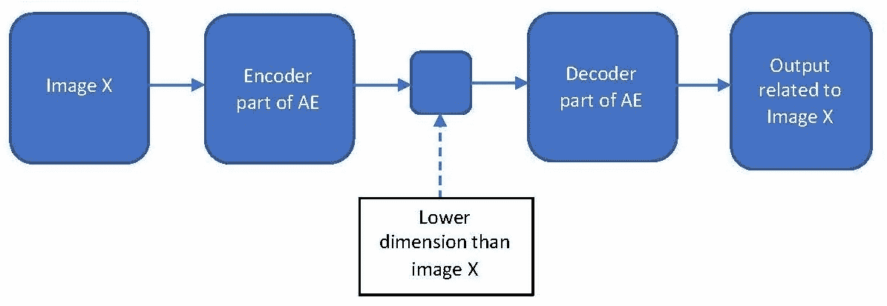

如果我们训练自编码器，使得输入图像包含噪声或不清晰的内容，而输出则是去除噪声后的相同图像，那么我们就可以创建去噪自编码器。类似地，如果我们使用带有眼镜和不带眼镜的图像，或者带有胡子和不带胡子的图像等输入/输出图像来训练自编码器，那么我们就可以创建有助于图像修复/修改的网络。

接下来，我们将分别通过三个示例来看如何使用自编码器：用于降维、图像去噪和图像修复。我们将从使用自编码器进行降维开始。

# 降维自编码器

在本节中，我们将使用时尚-MNIST 数据集，指定自编码器模型的架构，编译模型，拟合模型，然后重建图像。请注意，时尚-MNIST 是 Keras 库的一部分。

# MNIST 时尚数据集

我们将继续使用 Keras 和 EBImage 库。读取时尚-MNIST 数据的代码如下：

```py
# Libraries
library(keras)
library(EBImage)

# Fashion-MNIST data
mnist <- dataset_fashion_mnist() 
str(mnist)
List of 2
 $ train:List of 2
  ..$ x: int [1:60000, 1:28, 1:28] 0 0 0 0 0 0 0 0 0 0 ...
  ..$ y: int [1:60000(1d)] 9 0 0 3 0 2 7 2 5 5 ...
 $ test :List of 2
  ..$ x: int [1:10000, 1:28, 1:28] 0 0 0 0 0 0 0 0 0 0 ...
  ..$ y: int [1:10000(1d)] 9 2 1 1 6 1 4 6 5 7 ...
```

在这里，训练数据有 60,000 张图片，测试数据有 10,000 张时尚商品图片。由于我们将在此示例中使用无监督学习方法，因此我们不会使用训练和测试数据中的标签。

我们将训练图像数据存储在`trainx`中，将测试图像数据存储在`testx`中，如下所示：

```py
# Train and test data
trainx <- mnist$train$x
testx <- mnist$test$x

# Plot of 64 images
par(mfrow = c(8,8), mar = rep(0, 4))
for (i in 1:64) plot(as.raster(trainx[i,,], max = 255))
```

以下是前 64 张时尚商品图片：

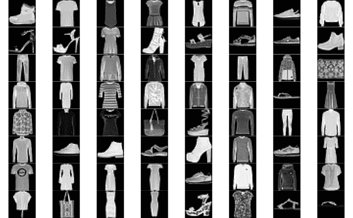

接下来，我们将图像数据重塑为合适的格式，如下所示：

```py
# Reshape images
trainx <- array_reshape(trainx, c(nrow(trainx), 28, 28, 1))
testx <- array_reshape(testx, c(nrow(testx), 28, 28, 1))
trainx <- trainx / 255
testx <- testx / 255
```

在这里，我们还将`trainx`和`testx`除以 255，将原本介于 0 到 255 之间的值的范围转换为介于 0 和 1 之间的范围。

# 编码器模型

为了指定编码器模型的架构，我们将使用以下代码：

```py
# Encoder
input_layer <- 
         layer_input(shape = c(28,28,1)) 
encoder <-  input_layer %>% 
         layer_conv_2d(filters = 8, 
                       kernel_size = c(3,3), 
                       activation = 'relu', 
                       padding = 'same') %>%   
         layer_max_pooling_2d(pool_size = c(2,2),
                              padding = 'same') %>% 
         layer_conv_2d(filters = 4, 
                       kernel_size = c(3,3), 
                       activation = 'relu', 
                       padding = 'same') %>%  
         layer_max_pooling_2d(pool_size = c(2,2), 
                              padding = 'same')  
summary(encoder)
Output
Tensor("max_pooling2d_10/MaxPool:0", shape=(?, 7, 7, 4), dtype=float32)
```

在这里，对于编码器的输入，我们指定了输入层，使其大小为 28 x 28 x 1。使用了两个卷积层，一个具有 8 个过滤器，另一个具有 4 个过滤器。这两个层的激活函数都使用**修正线性单元**（**relu**）。卷积层包括`padding = 'same'`，这保持了输入在输出时的高度和宽度。例如，在第一个卷积层之后，输出的高度和宽度为 28 x 28。每个卷积层后面都有池化层。在第一个池化层之后，高度和宽度变为 14 x 14，而在第二个池化层之后，变为 7 x 7。此示例中编码器网络的输出为 7 x 7 x 4。

# 解码器模型

为了指定解码器模型的架构，我们将使用以下代码：

```py
# Decoder
decoder <- encoder %>% 
         layer_conv_2d(filters = 4, 
                       kernel_size = c(3,3), 
                       activation = 'relu',
                       padding = 'same') %>%   
         layer_upsampling_2d(c(2,2)) %>% 
         layer_conv_2d(filters = 8, 
                       kernel_size = c(3,3), 
                       activation = 'relu',
                       padding = 'same') %>%  
         layer_upsampling_2d(c(2,2)) %>% 
         layer_conv_2d(filters = 1, 
                       kernel_size = c(3,3), 
                       activation = 'sigmoid',
                       padding = 'same')
summary(decoder)
Output
Tensor("conv2d_25/Sigmoid:0", shape=(?, 28, 28, 1), dtype=float32)
```

在这里，编码器模型已经成为解码器模型的输入。对于解码器网络，我们使用了一个类似的结构，第一层卷积层有 4 个过滤器，第二层卷积层有 8 个过滤器。此外，我们现在使用的是上采样层，而不是池化层。第一个上采样层将高度和宽度变为 14 x 14，第二个上采样层将其恢复到原始的高度和宽度 28 x 28。在最后一层，我们使用了 sigmoid 激活函数，确保输出值保持在 0 到 1 之间。

# 自编码器模型

自编码器模型及其模型摘要，显示每层的输出形状和参数数量如下：

```py
# Autoencoder
ae_model <- keras_model(inputs = input_layer, outputs = decoder)
summary(ae_model)
__________________________________________________________________________
Layer (type)                      Output Shape               Param #       
==========================================================================
input_5 (InputLayer)              (None, 28, 28, 1)            0             
__________________________________________________________________________
conv2d_21 (Conv2D)                (None, 28, 28, 8)            80            
__________________________________________________________________________
max_pooling2d_9 (MaxPooling2D)    (None, 14, 14, 8)             0             
__________________________________________________________________________
conv2d_22 (Conv2D)                (None, 14, 14, 4)            292           
__________________________________________________________________________
max_pooling2d_10 (MaxPooling2D)   (None, 7, 7, 4)               0             
__________________________________________________________________________
conv2d_23 (Conv2D)                (None, 7, 7, 4)              148           
___________________________________________________________________________
up_sampling2d_9 (UpSampling2D)    (None, 14, 14, 4)             0             
___________________________________________________________________________
conv2d_24 (Conv2D)                (None, 14, 14, 8)            296           
___________________________________________________________________________
up_sampling2d_10 (UpSampling2D)   (None, 28, 28, 8)             0             
___________________________________________________________________________
conv2d_25 (Conv2D)                (None, 28, 28, 1)             73           
===========================================================================
Total params: 889
Trainable params: 889
Non-trainable params: 0
____________________________________________________________________________________
```

在这里，自编码器模型有五个卷积层、两个最大池化层和两个上采样层，除了输入层。此自编码器模型的总参数数量为 889。

# 编译和拟合模型

接下来，我们将使用以下代码编译并拟合模型：

```py
# Compile model
ae_model %>% compile( loss='mean_squared_error',
         optimizer='adam')

# Fit model
model_one <- ae_model %>% fit(trainx, 
                         trainx, 
                         epochs = 20, 
                         shuffle=TRUE,
                         batch_size = 32, 
                         validation_data = list(testx,testx))
```

在这里，我们使用均方误差作为损失函数编译模型，并指定`adam`作为优化器。为了训练模型，我们将使用`trainx`作为输入和输出。我们将使用`textx`作为验证集。我们使用 32 的批次大小，并进行 20 次训练。

以下输出显示了训练数据和验证数据的损失值图表：

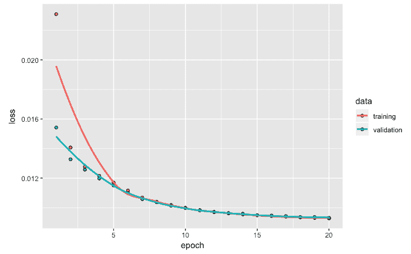

上面的图表显示了良好的收敛性，并且没有出现过拟合的迹象。

# 重建图像

为了获得重建图像，我们使用`predict_on_batch`来使用自编码器模型预测输出。我们使用以下代码来完成这一操作：

```py
# Reconstruct and plot images - train data
rc <-   ae_model %>%    keras::predict_on_batch(x = trainx)
par(mfrow = c(2,5), mar = rep(0, 4))
for (i in 1:5) plot(as.raster(trainx[i,,,]))
for (i in 1:5) plot(as.raster(rc[i,,,]))
```

来自训练数据的前五张时尚图像（第一行）和对应的重建图像（第二行）如下：

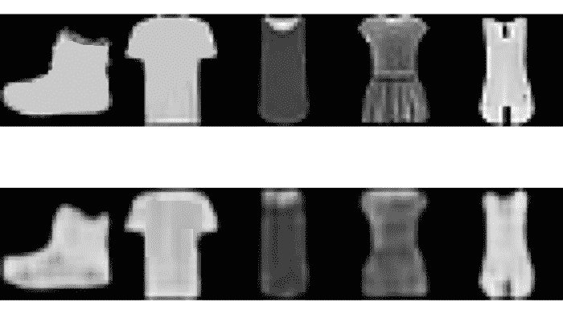

在这里，正如预期的那样，重建的图像捕捉到了训练图像的关键特征。然而，它忽略了一些更细致的细节。例如，原始训练图像中更清晰可见的徽标在重建图像中变得模糊。

我们还可以查看使用测试数据中的图像绘制的原始图像和重建图像的图表。为此，我们可以使用以下代码：

```py
# Reconstruct and plot images - train data
rc <- ae_model %>% keras::predict_on_batch(x = testx) 
par(mfrow = c(2,5), mar = rep(0, 4)) 
for (i in 1:5) plot(as.raster(testx[i,,,])) 
for (i in 1:5) plot(as.raster(rc[i,,,]))
```

以下图像显示了使用测试数据的原始图像（第一行）和重建图像（第二行）：

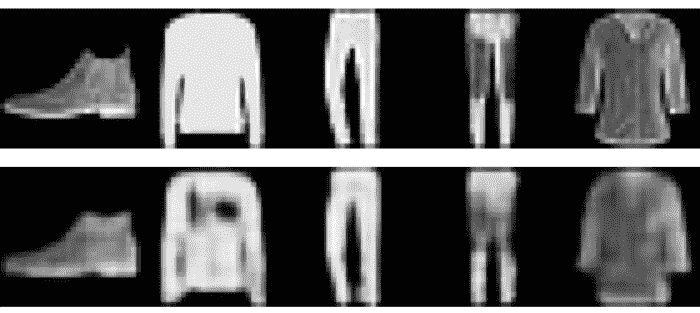

在这里，重建的图像与训练数据的表现相同。

在这个示例中，我们使用了 MNIST 时尚数据构建了一个自编码器网络，通过保留主要特征并去除涉及细节的特征，帮助降低图像的维度。接下来，我们将探讨自编码器模型的另一个变种，它有助于去除图像中的噪声。

# 去噪自编码器

在输入图像包含不必要的噪声的情况下，可以训练自编码器网络来去除这些噪声。这是通过将含有噪声的图像作为输入，并提供相同图像的干净版本作为输出来实现的。自编码器网络被训练，使得自编码器的输出尽可能接近目标图像。

# MNIST 数据

我们将利用 Keras 包中提供的 MNIST 数据来演示创建去噪自编码器网络的步骤。可以使用以下代码读取 MNIST 数据：

```py
# MNIST data
mnist <- dataset_mnist()
str(mnist)
List of 2
 $ train:List of 2
  ..$ x: int [1:60000, 1:28, 1:28] 0 0 0 0 0 0 0 0 0 0 ...
  ..$ y: int [1:60000(1d)] 5 0 4 1 9 2 1 3 1 4 ...
 $ test :List of 2
  ..$ x: int [1:10000, 1:28, 1:28] 0 0 0 0 0 0 0 0 0 0 ...
  ..$ y: int [1:10000(1d)] 7 2 1 0 4 1 4 9 5 9 ...
```

MNIST 数据的结构表明它包含训练数据和测试数据，以及相应的标签。训练数据包含 60,000 张 0 到 9 的数字图像。类似地，测试数据包含 10,000 张 0 到 9 的数字图像。尽管每张图像都有一个相应的标签来标识该图像，但在这个示例中，标签数据不需要，因此我们将忽略这部分信息。

我们将把训练图像存储在`trainx`中，把测试图像存储在`testx`中。为此，我们将使用以下代码：

```py
# Train and test data
trainx <- mnist$train$x
testx <- mnist$test$x

# Plot
par(mfrow = c(8,8), mar = rep(0, 4))
for (i in 1:64) plot(as.raster(trainx[i,,], max = 255))
```

下图显示了基于 MNIST 中 0 到 9 之间数字图像的 64 张图像，排列成 8 行 8 列：

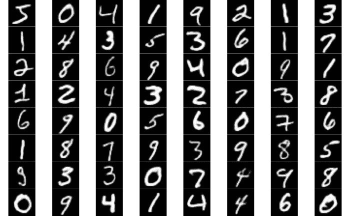

上述图展示了各种书写风格的手写数字。我们将把这些图像数据重新调整为所需格式，并向其添加随机噪声。

# 数据准备

接下来，我们将使用以下代码按要求的格式重新调整图像：

```py
# Reshape
trainx <- array_reshape(trainx, c(nrow(trainx),28,28,1))
testx <- array_reshape(testx, c(nrow(testx),28,28,1))
trainx <- trainx / 255
testx <- testx / 255
```

在这里，我们已将训练数据重新调整为 60,000 x 28 x 28 x 1 的大小，并将测试数据调整为 10,000 x 28 x 28 x 1 的大小。我们还将介于 0 到 255 之间的像素值除以 255，从而得到一个新的范围，介于 0 和 1 之间。

# 添加噪声

要向训练图像添加噪声，我们需要使用以下代码生成 60,000 × 28 × 28 的随机数，这些随机数介于 0 和 1 之间，采用均匀分布：

```py
# Random numbers from uniform distribution
n <- runif(60000*28*28,0,1)
n <- array_reshape(n, c(60000,28,28,1))

# Plot
par(mfrow = c(8,8), mar = rep(0, 4))
for (i in 1:64) plot(as.raster(n[i,,,]))
```

在这里，我们将使用均匀分布生成的随机数重新调整大小，以匹配我们训练图像矩阵的维度。结果将以图像的形式呈现，展示添加噪声后的图像。

下图展示了包含噪声的图像：

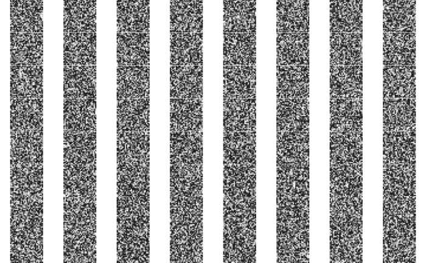

噪声图像被添加到存储在`trainx`中的图像中。我们需要将其除以 2，以保持结果`trainn`的值在 0 和 1 之间。我们可以使用以下代码来实现这一点：

```py
# Adding noise to handwritten images - train data
trainn <- (trainx + n)/2
par(mfrow = c(8,8), mar = rep(0, 4))
for (i in 1:64) plot(as.raster(trainn[i,,,]))
```

以下图显示了前 64 个训练图像及其噪声：

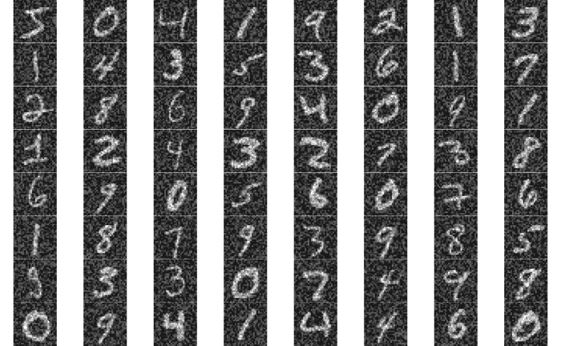

尽管噪声已被添加到原始手写数字中，但这些数字依然可以辨认。使用去噪自编码器的主要目的是训练一个网络，能够保留手写数字并去除图像中的噪声。

我们将使用以下代码对测试数据重复相同的步骤：

```py
# Adding noise to handwritten images - test data
n1 <- runif(10000*28*28,0,1) 
n1 <- array_reshape(n1, c(10000,28,28,1)) 
testn <- (testx +n1)/2
```

在这里，我们已向测试图像添加噪声，并将它们存储在`testn`中。现在，我们可以指定编码器架构。

# 编码器模型

用于编码器网络的代码如下：

```py
# Encoder
input_layer <- 
         layer_input(shape = c(28,28,1)) 
encoder <-  input_layer %>% 
         layer_conv_2d(filters = 32, 
                       kernel_size = c(3,3), 
                       activation = 'relu', 
                       padding = 'same') %>%   
         layer_max_pooling_2d(pool_size = c(2,2),
                              padding = 'same') %>% 
         layer_conv_2d(filters = 32, 
                       kernel_size = c(3,3), 
                       activation = 'relu', 
                       padding = 'same') %>%  
         layer_max_pooling_2d(pool_size = c(2,2), 
                              padding = 'same') 
summary(encoder)
OutputTensor("max_pooling2d_6/MaxPool:0", shape=(?, 7, 7, 32), dtype=float32)
```

在这里，输入层的大小被指定为 28 x 28 x 1。我们使用了两个每个有 32 个滤波器的卷积层，并且使用了修正线性单元作为激活函数。每个卷积层后都接着池化层。第一次池化层后，高度和宽度变为 14 x 14，第二次池化层后，变为 7 x 7。本例中，编码器网络的输出具有 7 x 7 x 32 的维度。

# 解码器模型

对于解码器网络，我们保持相同的结构，不同之处在于，我们使用上采样层，而不是池化层。我们可以使用以下代码来实现这一点：

```py
# Decoder
decoder <- encoder %>% 
         layer_conv_2d(filters = 32, 
                       kernel_size = c(3,3), 
                       activation = 'relu',
                       padding = 'same') %>%   
         layer_upsampling_2d(c(2,2)) %>% 
         layer_conv_2d(filters = 32, 
                       kernel_size = c(3,3), 
                       activation = 'relu',
                       padding = 'same') %>%  
         layer_upsampling_2d(c(2,2)) %>% 
         layer_conv_2d(filters = 1, 
                       kernel_size = c(3,3), 
                       activation = 'sigmoid',
                       padding = 'same')
summary(decoder)
Output
Tensor("conv2d_15/Sigmoid:0", shape=(?, 28, 28, 1), dtype=float32)
```

在前面的代码中，第一个上采样层将高度和宽度改变为 14 x 14，第二个上采样层将其恢复到原始的 28 x 28 高度和宽度。在最后一层，我们使用了 sigmoid 激活函数，确保输出值保持在 0 和 1 之间。

# 自编码器模型

现在，我们可以指定自编码器网络。自编码器的模型和摘要如下所示：

```py
# Autoencoder
ae_model <- keras_model(inputs = input_layer, outputs = decoder)
summary(ae_model)

______________________________________________________________________
Layer (type)                    Output Shape             Param #       
======================================================================
input_3 (InputLayer)           (None, 28, 28, 1)           0             
______________________________________________________________________
conv2d_11 (Conv2D)             (None, 28, 28, 32)         320           
______________________________________________________________________
max_pooling2d_5 (MaxPooling2D) (None, 14, 14, 32)          0             
_______________________________________________________________________
conv2d_12 (Conv2D)             (None, 14, 14, 32)         9248          
_______________________________________________________________________
max_pooling2d_6 (MaxPooling2D) (None, 7, 7, 32)            0             
_______________________________________________________________________
conv2d_13 (Conv2D)             (None, 7, 7, 32)           9248          
_______________________________________________________________________
up_sampling2d_5 (UpSampling2D) (None, 14, 14, 32)          0             
_______________________________________________________________________
conv2d_14 (Conv2D)             (None, 14, 14, 32)         9248          
_______________________________________________________________________
up_sampling2d_6 (UpSampling2D) (None, 28, 28, 32)          0             
________________________________________________________________________
conv2d_15 (Conv2D)             (None, 28, 28, 1)           289           
========================================================================
Total params: 28,353
Trainable params: 28,353
Non-trainable params: 0
________________________________________________________________________
```

从前面自编码器网络的摘要中，我们可以看到总共有 28,353 个参数。接下来，我们将使用以下代码编译此模型：

```py
# Compile model
ae_model %>% compile( loss='binary_crossentropy', optimizer='adam')
```

对于去噪自编码器，`binary_crossentropy`损失函数比其他选项表现更好。

在编译自编码器模型时，我们将使用`binary_crossentropy`作为损失函数，因为输入值介于 0 和 1 之间。对于优化器，我们将使用`adam`。编译模型后，我们准备好进行拟合。

# 拟合模型

为了训练模型，我们使用存储在`trainn`中的带噪声图像作为输入，使用存储在`trainx`中的无噪声图像作为输出。用于拟合模型的代码如下：

```py
# Fit model
model_two <- ae_model %>% fit(trainn, 
                         trainx, 
                         epochs = 100, 
                         shuffle = TRUE,
                         batch_size = 128,  
                        validation_data = list(testn,testx))
```

在这里，我们还使用`testn`和`testx`来监控验证误差。我们将运行 100 个 epoch，每个批次的大小为 128。网络训练完成后，我们可以使用以下代码获取训练数据和测试数据的损失值：

```py
# Loss for train data
ae_model %>% evaluate(trainn, trainx)
      loss 
0.07431865

# Loss for test data
ae_model %>% evaluate(testn, testx)
      loss 
0.07391542
```

训练数据和测试数据的损失分别为 0.0743 和 0.0739。这两个数字的接近度表明没有过拟合问题。

# 图像重建

在拟合模型后，我们可以使用以下代码重建图像：

```py
# Reconstructing images - train data
rc <- ae_model %>%   keras::predict_on_batch(x = trainn)

# Plot
par(mfrow = c(8,8), mar = rep(0, 4))
for (i in 1:64) plot(as.raster(rc[i,,,]))
```

在前面的代码中，我们使用`ae_model`通过提供包含噪声的`trainn`图像来重建图像。如以下图片所示，我们绘制了前 64 张重建图像，以查看噪声图像是否变得更清晰：

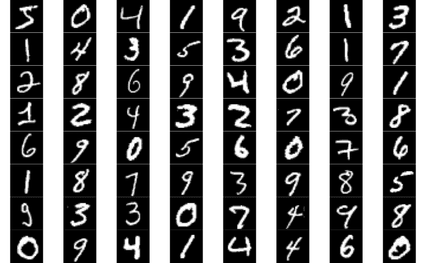

从前面的图表中，我们可以观察到自编码器网络已经成功去除噪声。我们还可以借助`ae_model`使用以下代码重建测试数据的图像：

```py
# Reconstructing images - test data
rc <- ae_model %>% keras::predict_on_batch(x = testn) 
par(mfrow = c(8,8), mar = rep(0, 4)) 
for (i in 1:64) plot(as.raster(rc[i,,,]))
```

测试数据中前 64 个手写数字的重建图像如下所示：

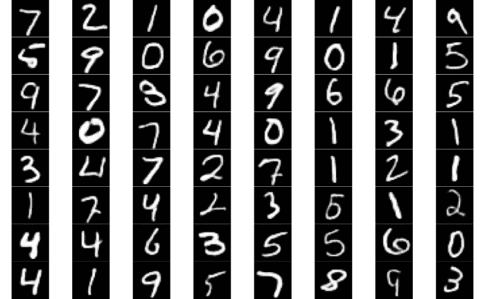

在这里，我们可以观察到去噪自编码器在去除 0 到 9 数字图像的噪声方面表现得相当不错。为了更仔细地观察模型的性能，我们可以绘制测试数据中的第一张图片、带噪声的相应图像以及去噪后重建的图像，如下所示：

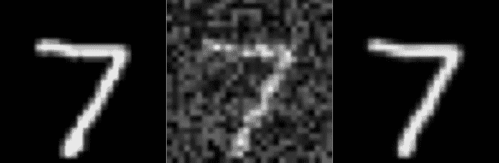

在前面的截图中，第一张图像是原始图像，而第二张图像是在添加噪声之后得到的图像。自编码器将第二张图像作为输入，并且从模型获得的结果（第三张图像）被调整与第一张图像相匹配。在这里，我们可以看到去噪自编码器网络帮助去除了噪声。请注意，第三张图像无法保留原始图像中的一些细节，而这些细节在第一张图像中是可见的。例如，在原始图像中，数字七在开始和下部看起来比第三张图像中的七稍微粗一些。然而，它成功地从含有噪声的数字七图像中提取出了整体模式。

# 图像校正

在这个第三个应用中，我们将展示一个例子，在这个例子中我们将开发一个自编码器模型，用于去除图像上某些人工创建的标记。我们将使用 25 张包含横跨图像的黑色线条的图像。读取图像文件并进行相关处理的代码如下：

```py
# Reading images and image processing
setwd("~/Desktop/peoplex")
temp = list.files(pattern="*.jpeg")
mypic <- list()
for (i in 1:length(temp)) {mypic[[i]] <- readImage(temp[i])}
for (i in 1:length(temp)) {mypic[[i]] <- resize(mypic[[i]], 128, 128)}
for (i in 1:length(temp)) {dim(mypic[[i]]) <- c(128, 128,3)}
```

在前面的代码中，我们从`peoplex`文件夹读取`.jpeg`扩展名的图像，并调整这些图像的尺寸，使其高度和宽度为 128 x 128。我们还将尺寸更新为 128 x 128 x 3，因为所有图像都是彩色图像。

# 需要校正的图像

我们将使用以下代码合并这 25 张图像，然后绘制它们：

```py
# Combine and plot images
trainx <- combine(mypic)
str(trainx)
Formal class 'Image' [package "EBImage"] with 2 slots
  ..@ .Data    : num [1:128, 1:128, 1:3, 1:16] 0.04435 0 0.00357 0.05779 0.05815 ...
  ..@ colormode: int 2
trainx <- aperm(trainx, c(4,1,2,3)
par(mfrow = c(4,4), mar = rep(0, 4))
for (i in 1:16) plot(as.raster(trainx[i,,,]))
```

在这里，我们将所有 25 张图像合并后的数据保存到`trainx`中。通过查看`tranix`的结构，我们可以看到，在合并图像数据后，尺寸现在变为 128 x 128 x 3 x 16。为了将其更改为所需的格式 16 x 128 x 128 x 3，我们使用`aperm`函数。然后，我们绘制所有 25 张图像。请注意，如果图像被旋转绘制，它们可以很容易地在任何计算机上调整到正确的方向。以下是带有黑色线条的 25 张图像：


在这个应用中的自编码器模型将使用带有黑色线条的图像作为输入，并且会经过训练以去除黑色线条。

# 干净的图像

我们还将读取没有黑色线条的相同 25 张图像，并将它们保存在`trainy`中，如下代码所示：

```py
# Read image files without black line
setwd("~/Desktop/people")
temp = list.files(pattern="*.jpg")
mypic <- list()
for (i in 1:length(temp)) {mypic[[i]] <- readImage(temp[i])}
for (i in 1:length(temp)) {mypic[[i]] <- resize(mypic[[i]], 128, 128)}
for (i in 1:length(temp)) {dim(mypic[[i]]) <- c(128, 128,3)}
trainy <- combine(mypic)
trainy <- aperm(trainy, c(4,1,2,3))
par(mfrow = c(4,4), mar = rep(0, 4))
for (i in 1:16) plot(as.raster(trainy[i,,,]))
par(mfrow = c(1,1))
```

这里，在调整大小和更改尺寸后，我们像之前一样合并这些图像。我们还需要对尺寸进行一些调整，以获得所需的格式。接下来，我们将绘制所有 25 张干净的图像，如下所示：


在训练自编码器网络时，我们将使用这些干净的图像作为输出。接下来，我们将指定编码器模型架构。

# 编码器模型

对于编码器模型，我们将使用三个卷积层，分别具有 512、512 和 256 个滤波器，如下所示的代码所示：

```py
# Encoder network
input_layer <- layer_input(shape = c(128,128,3)) 
encoder <-  input_layer %>% 
         layer_conv_2d(filters = 512, kernel_size = c(3,3), activation = 'relu', padding = 'same') %>%   
         layer_max_pooling_2d(pool_size = c(2,2),padding = 'same') %>% 
         layer_conv_2d(filters = 512, kernel_size = c(3,3), activation = 'relu', padding = 'same') %>%   
         layer_max_pooling_2d(pool_size = c(2,2),padding = 'same') %>% 
         layer_conv_2d(filters = 256, kernel_size = c(3,3), activation = 'relu', padding = 'same') %>%  
         layer_max_pooling_2d(pool_size = c(2,2), padding = 'same')  
summary(encoder)
Output
Tensor("max_pooling2d_22/MaxPool:0", shape=(?, 16, 16, 256), dtype=float32)
```

这里，编码器网络的尺寸是 16 x 16 x 256。我们将保持其他特性与之前两个示例中的编码器模型相似。现在，我们将指定自动编码器网络的解码器架构。

# 解码器模型

对于解码器模型，前 3 个卷积层的滤波器数量分别为 256、512 和 512，如下所示：

```py
# Decoder network
decoder <- encoder %>% 
         layer_conv_2d(filters = 256, kernel_size = c(3,3), activation = 'relu',padding = 'same') %>%   
         layer_upsampling_2d(c(2,2)) %>% 
         layer_conv_2d(filters = 512, kernel_size = c(3,3), activation = 'relu',padding = 'same') %>%   
         layer_upsampling_2d(c(2,2)) %>% 
         layer_conv_2d(filters = 512, kernel_size = c(3,3), activation = 'relu',padding = 'same') %>%  
         layer_upsampling_2d(c(2,2)) %>% 
         layer_conv_2d(filters = 3, kernel_size = c(3,3), activation = 'sigmoid',padding = 'same')
summary(decoder)
Output
Tensor("conv2d_46/Sigmoid:0", shape=(?, 128, 128, 3), dtype=float32)
```

在这里，我们使用了上采样层。在最后一个卷积层中，我们使用了 sigmoid 激活函数。在最后一个卷积层中，我们使用了三个滤波器，因为我们处理的是彩色图像。最后，解码器模型的输出维度为 128 x 128 x 3。

# 编译和拟合模型

现在，我们可以使用以下代码编译和拟合模型：

```py
# Compile and fit model
ae_model <- keras_model(inputs = input_layer, outputs = decoder)
ae_model %>% compile( loss='mse',
         optimizer='adam')
model_three <- ae_model %>% fit(trainx, 
                         trainy, 
                         epochs = 100, 
                         batch_size = 128, 
                         validation_split = 0.2)
plot(model_three)
```

在前面的代码中，我们使用均方误差作为损失函数编译自动编码器模型，并指定`adam`作为优化器。我们使用包含黑线的图像`trainx`作为模型输入，使用包含干净图像的`trainy`作为模型尝试匹配的输出。我们将 epoch 数指定为 100，批次大小为 128。使用 0.2 或 20%的验证拆分，我们将从 25 张图像中选择 20 张用于训练，5 张用于计算验证误差。

以下图表显示了`model_three`在 100 个 epoch 中训练和验证图像的均方误差：

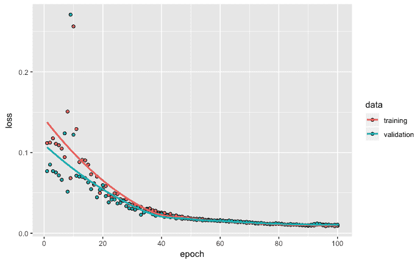

均方误差的图示显示，随着模型训练的进行，基于训练和验证数据，模型性能有了提升。我们还可以看到，在约 80 到 100 个 epoch 之间，模型的性能趋于平稳。此外，建议增加 epoch 的数量不太可能进一步提升模型性能。

# 从训练数据重建图像

现在，我们可以使用获得的模型从训练数据中重建图像。为此，我们可以使用以下代码：

```py
# Reconstructing images - training
rc <- ae_model %>%  keras::predict_on_batch(x = trainx)
par(mfrow = c(5,5), mar = rep(0, 4))
for (i in 1:25) plot(as.raster(rc[i,,,]))
```

在前面的代码中，我们使用了`predict_on_batch`来重建图像，输入的是包含黑线的`trainx`。所有 25 张重建图像可以在这里看到：

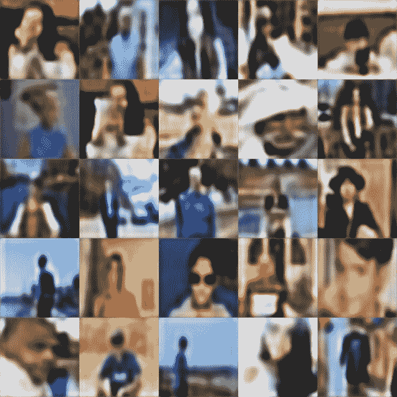

从前面的图示中可以看出，自动编码器模型已经学会了去除输入图像中的黑线。由于自动编码器模型尝试仅输出图像的主要特征，并忽略了某些细节，因此图像会显得有些模糊。

# 从新数据重建图像

为了使用新数据和未见过的数据测试自动编码器模型，我们将使用 25 张新图像，这些图像上有黑线。为此，我们将使用以下代码：

```py
# 25 new images
setwd("~/Desktop/newx")
temp = list.files(pattern="*.jpg")
mypic <- list()
for (i in 1:length(temp)) {mypic[[i]] <- readImage(temp[i])}
for (i in 1:length(temp)) {mypic[[i]] <- resize(mypic[[i]], 128, 128)}
for (i in 1:length(temp)) {dim(mypic[[i]]) <- c(128, 128,3)}
newx <- combine(mypic)
newx <- aperm(newx, c(4,1,2,3))
par(mfrow = c(4,4), mar = rep(0, 4))
for (i in 1:16) plot(as.raster(newx[i,,,]))
```

如前面的代码所示，我们读取了新的图像数据，并将所有图像格式化，像之前一样。所有带有黑线的 25 张新图像展示在下图中：


在这里，所有 25 张图片上都有一条黑线。我们将使用这些新图片的数据，并利用我们开发的自动编码器模型来重建图片，去除黑线。用于重建和绘制图片的代码如下：

```py
# Reconstructing images - new images
rc <- ae_model %>% keras::predict_on_batch(x = newx)
par(mfrow = c(5,5), mar = rep(0, 4))
for (i in 1:25) plot(as.raster(rc[i,,,]))
```

以下截图显示了基于这 25 张带有黑线的新图片，使用自动编码器模型后重建的图像：

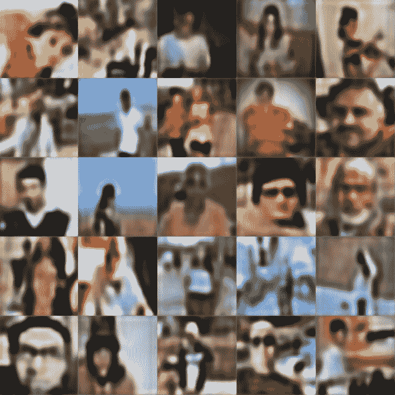

上面的截图再次显示，自动编码器模型成功地去除了所有图像中的黑线。然而，正如我们之前观察到的，图像质量较低。这个例子提供了有希望的结果。如果得到的结果也能提供更高质量的图像输出，那么我们可以在多种不同的场景中使用这一方法。例如，我们可以将带眼镜的图像重建为不带眼镜的图像，反之亦然，或者我们可以将一个没有笑容的人的图像重建为带笑容的图像。这样的思路有许多变种，可能具有显著的商业价值。

# 总结

在本章中，我们介绍了自动编码器网络的三个应用示例。第一种类型的自动编码器涉及一个降维应用。在这里，我们使用了一种自动编码器网络架构，只允许我们学习输入图像的关键特征。第二种类型的自动编码器使用包含数字图像的 MNIST 数据进行说明。我们人为地为数字图像添加噪声，并以这样的方式训练网络，使其学会去除输入图像中的噪声。第三种类型的自动编码器网络涉及图像修复应用。在此应用中，自动编码器网络被训练来去除输入图像中的黑线。

在下一章，我们将介绍另一类深度网络，称为**迁移学习**，并将其用于图像分类。
