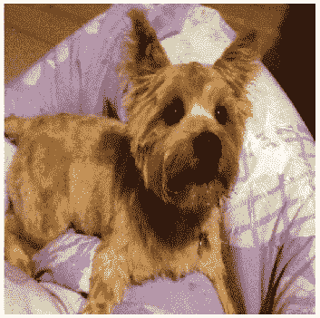
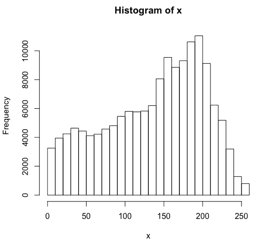
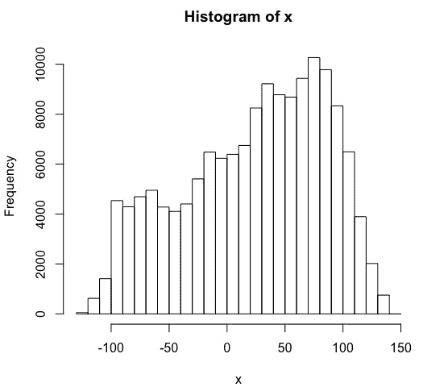
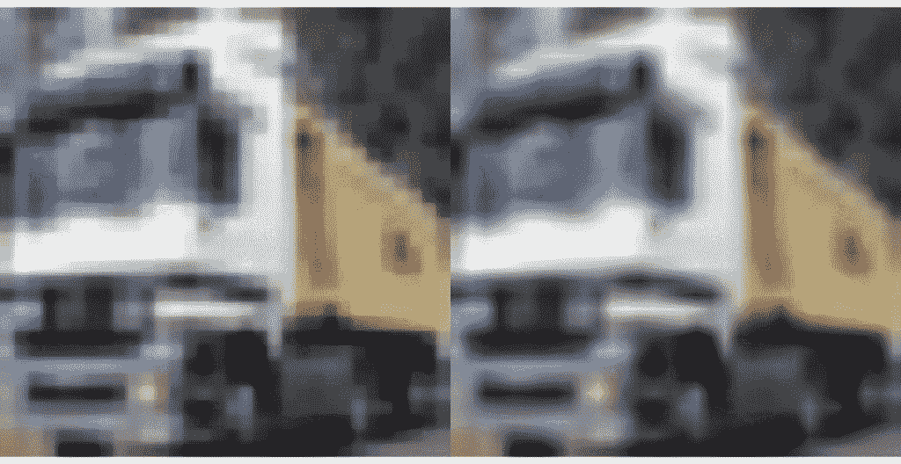
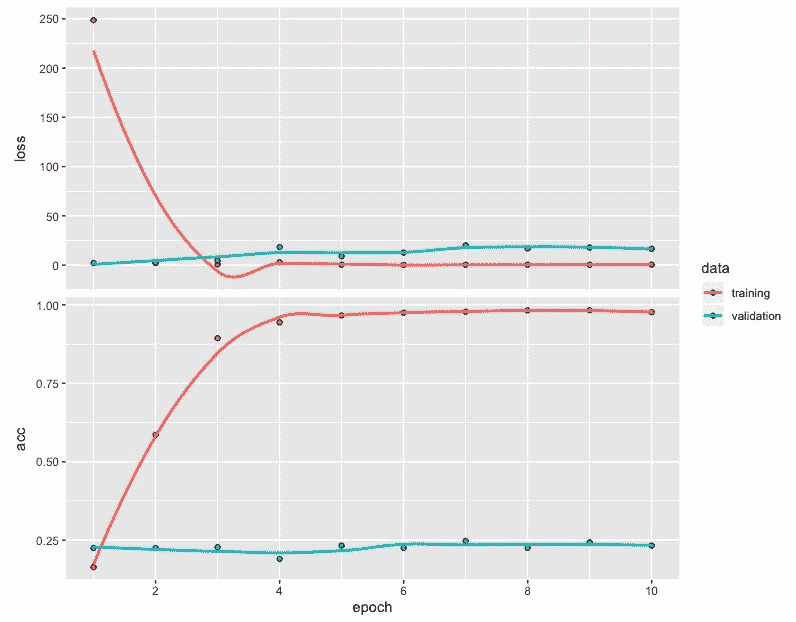
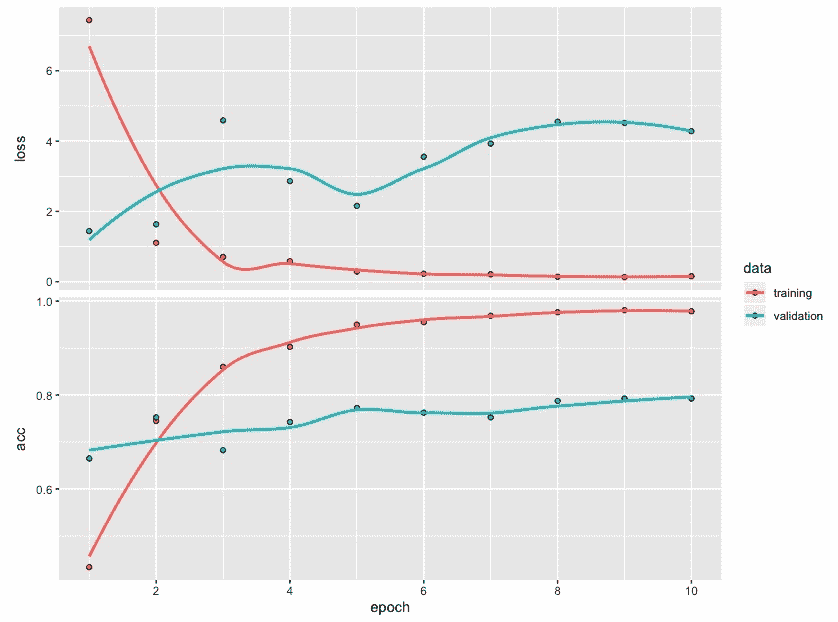
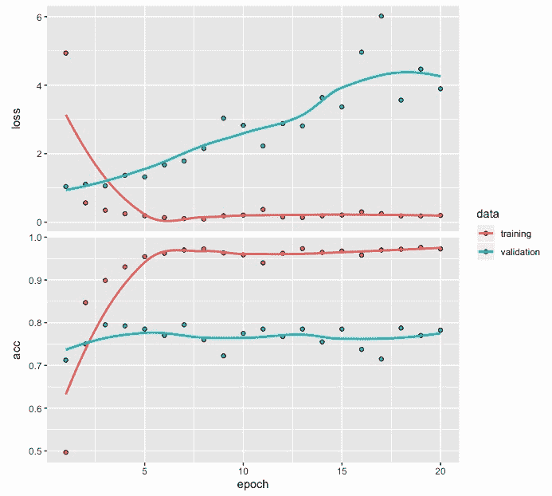
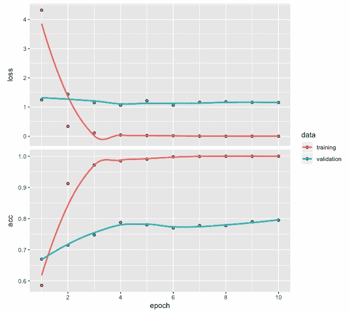

# 第八章：使用迁移学习进行小数据集的图像分类

在前几章中，我们开发了深度学习网络，并探索了与图像数据相关的各种应用示例。与本章讨论的内容相比，前几章的一个主要区别是，我们在前几章中是从零开始开发模型的。

迁移学习可以定义为一种方法，我们重新利用一个已训练的深度网络所学到的知识来解决一个新的但相关的问题。例如，我们可能能够重新利用一个用于分类成千上万种时尚单品的深度学习网络，来开发一个用于分类三种不同款式裙子的深度网络。这种方法类似于我们在现实生活中观察到的情况，教师将多年来获得的知识传授给学生，或教练将经验传授给新球员。另一个例子是，学会骑自行车的经验可以转移到学会骑摩托车，而这又可以用于学习如何开车。

在本章中，我们将在开发图像分类模型时使用预训练的深度网络。预训练模型使我们能够将从更大数据集中学到的有用特征转移到我们感兴趣的模型中，这些模型可能使用一个相似但全新的较小数据集进行开发。使用预训练模型不仅能帮助我们克服由于数据集较小而产生的问题，还能减少开发模型的时间和成本。

为了说明预训练图像分类模型的使用，本章将涵盖以下主题：

+   使用预训练模型进行图像识别

+   使用 CIFAR10 数据集

+   使用 CNN 进行图像分类

+   使用预训练的 RESNET50 模型进行图像分类

+   模型评估与预测

+   性能优化技巧和最佳实践

# 使用预训练模型进行图像识别

在继续之前，让我们加载三个我们在本节中需要的包：

```py
# Libraries used
library(keras)
library(EBImage)
library(tensorflow)
```

本章将使用 Keras 和 TensorFlow 库来开发预训练的图像分类模型，而 EBImage 库将用于处理和可视化图像数据。

在 Keras 中，以下预训练的图像分类模型是可用的：

+   Xception

+   VGG16

+   VGG19

+   ResNet50

+   InceptionV3

+   InceptionResNetV2

+   MobileNet

+   MobileNetV2

+   DenseNet

+   NASNet

这些预训练模型是在 ImageNet 数据集上训练的（[`www.image-net.org/`](http://www.image-net.org/)）。ImageNet 是一个庞大的图像数据库，包含了数百万张图像。

我们将首先使用一个名为`resnet50`的预训练模型来识别图像。以下是我们可以用来利用这个预训练模型的代码：

```py
# Pretrained model
pretrained <- application_resnet50(weights = "imagenet")
summary(pretrained)
```

在这里，我们将`weights`指定为`"imagenet"`，这允许我们重用 RESNET50 网络的预训练权重。RESNET50 是一个深度残差网络，具有 50 层深度，包括卷积神经网络层。需要注意的是，如果我们只想使用模型架构而不使用预训练权重，且希望从头开始训练，我们可以将`weights`指定为`null`。通过使用`summary`，我们可以获得 RESNET50 网络的架构。不过，为了节省空间，我们不提供 summary 的输出。该网络的总参数数量为 25,636,712。RESNET50 网络在超过百万张来自 ImageNet 的图片上进行了训练，具备将图像分类到 1,000 个不同类别的能力。

# 读取图像

让我们从 RStudio 中读取一张狗的图片。以下代码加载一张图像文件，然后获得相应的输出：

使用 RESNET50 网络时，允许的最大目标大小为 224 x 224，允许的最小目标大小为 32 x 32。

```py
# Read image data
setwd("~/Desktop")
img <- image_load("dog.jpg", target_size = c(224,224))
x <- image_to_array(img)
str(x)
OUTPUT
num [1:224, 1:224, 1:3] 70 69 68 73 88 79 18 22 21 20 ...

# Image plot
plot(as.raster(x, max = 255))  

# Summary and histogram
summary(x)
OUTPUT
 Min. 1st Qu. Median Mean 3rd Qu. Max. 
 0.0 89.0 150.0 137.7 190.0 255.0 
hist(x)
```

在上面的代码中，我们可以观察到以下内容：

+   使用 Keras 中的`image_load()`函数从计算机桌面加载一张大小为 224 x 224 的诺里奇梗犬图片。

+   请注意，原始图像可能不是 224 x 224 大小。然而，在加载图像时指定此尺寸可以让我们轻松调整原始图像的大小，使其具有新的维度。

+   这张图片通过`image_to_array()`函数被转换成数字数组。该数组的结构显示其维度为 224 x 224 x 3。

+   数组的摘要显示它包含从零到 255 之间的数字。

以下是 224 x 224 大小的诺里奇梗犬的彩色图片。可以使用 plot 命令来获得该图片：



上面的图片是一只坐着并面向前方的诺里奇梗犬。我们将利用这张图片，检查 RESNET50 模型是否能准确预测图片中的狗的种类。

下面是从数组值生成的直方图：



上面的数组值的直方图显示，强度值从零到 255，大部分值集中在 200 左右。接下来，我们将对图像数据进行预处理。这个直方图可以用来比较图像数据的变化。

# 对输入进行预处理

我们现在可以对输入数据进行预处理，以便与预训练的 RESNET50 模型一起使用。预处理数据的代码如下：

```py
# Preprocessing of input data
x <- array_reshape(x, c(1, dim(x))) 
x <- imagenet_preprocess_input(x)
hist(x)
```

在上面的代码中，我们可以观察到以下内容：

+   应用`array_reshape()`函数后，数组的维度将变为 1 x 224 x 224 x 3。

+   我们使用了`imagenet_preprocess_input()`函数来使用预训练模型准备所需格式的数据。

预处理后数据的直方图如下所示：



预处理后的值的直方图显示了位置的变化。大多数值现在集中在 50 到 100 之间。然而，直方图的整体模式没有发生重大变化。

# 前五个类别

现在，我们可以使用预训练模型通过提供预处理后的图片数据作为输入来进行预测。实现这一目标的代码如下：

```py
# Predictions for top 5 categories
preds <- pretrained %>% predict(x)
imagenet_decode_predictions(preds, top = 5)[[1]]
Output
  class_name  class_description       score
1  n02094258    Norwich_terrier 0.769952953
2  n02094114    Norfolk_terrier 0.126662806
3  n02096294 Australian_terrier 0.046003290
4  n02096177              cairn 0.040896162
5  n02093991      Irish_terrier 0.005021056
```

在前面的代码中，我们可以观察到以下内容：

+   预测是使用 `predict` 函数进行的，结果包含了 1,000 个不同类别的概率，最高的五个类别及其概率可以使用 `imagenet_decode_predictions()` 函数获取。

+   约 0.7699 的最高分数正确识别出图片是诺里奇梗犬。

+   第二高的分数是诺福克梗犬，它与诺里奇梗犬非常相似。

+   预测结果还表明，图片可能是另一种类型的梗犬；然而，这些概率相对较小或可以忽略不计。

在接下来的部分，我们将研究一个更大的图片数据集，而不是单张图片，并使用预训练的网络来开发图像分类模型。

# 使用 CIFAR10 数据集

为了展示如何使用预训练模型处理新数据，我们将使用 CIFAR10 数据集。CIFAR 代表 *加拿大高级研究院*，而 10 指的是数据中包含的 10 类图片。CIFAR10 数据集是 Keras 库的一部分，获取它的代码如下：

```py
# CIFAR10 data
data <- dataset_cifar10()
str(data)
OUTPUT
List of 2
 $ train:List of 2
  ..$ x: int [1:50000, 1:32, 1:32, 1:3] 59 154 255 28 170 159 164 28 134 125 ...
  ..$ y: int [1:50000, 1] 6 9 9 4 1 1 2 7 8 3 ...
 $ test :List of 2
  ..$ x: int [1:10000, 1:32, 1:32, 1:3] 158 235 158 155 65 179 160 83 23 217 ...
  ..$ y: num [1:10000, 1] 3 8 8 0 6 6 1 6 3 1 ...
```

在前面的代码中，我们可以观察到以下内容：

+   我们可以使用 `dataset_cifar10()` 函数读取数据集。

+   数据结构显示有 50,000 张带标签的训练图片。

+   它还包含 10,000 张带标签的测试图片。

接下来，我们将使用以下代码从 CIFAR10 中提取训练和测试数据：

```py
# Partitioning the data into train and test
trainx <- data$train$x       
testx <- data$test$x
trainy <- to_categorical(data$train$y, num_classes = 10)
testy <- to_categorical(data$test$y, num_classes = 10)

table(data$train$y)
OUTPUT
   0    1    2    3    4    5    6    7    8    9 
5000 5000 5000 5000 5000 5000 5000 5000 5000 5000 

table(data$test$y)
OUTPUT
   0    1    2    3    4    5    6    7    8    9 
1000 1000 1000 1000 1000 1000 1000 1000 1000 1000 

```

从前面的代码中，我们可以观察到以下内容：

+   我们将训练图片数据保存在 `trainx` 中，测试图片数据保存在 `testx` 中。

+   我们还使用 `to_categorical()` 函数对训练集和测试集的标签进行独热编码，并将结果分别保存在 `trainy` 和 `testy` 中。

+   训练数据表明，这些图片被分类为 10 个不同的类别，每个类别包含 5,000 张图片。

+   同样，测试数据也包含了每个类别 1,000 张图片，共 10 个类别。

作为示例，可以使用以下代码获取训练数据中前 64 张图片的标签：

```py
# Category Labels
data$train$y[1:64,]
 [1] 6 9 9 4 1 1 2 7 8 3 4 7 7 2 9 9 9 3 2 6 4 3 6 6 2 6 3 5 4 0 0 9 1
[34] 3 4 0 3 7 3 3 5 2 2 7 1 1 1 2 2 0 9 5 7 9 2 2 5 2 4 3 1 1 8 2
```

如我们所见，每张图片都使用 0 到 9 之间的数字进行标签。下表展示了 10 种不同类别图片的描述：

| 标签 | 描述 |
| --- | --- |
| 0 | 飞机 |
| 1 | 汽车 |
| 2 | 鸟类 |
| 3 | 猫 |
| 4 | 鹿 |
| 5 | 狗 |
| 6 | 青蛙 |
| 7 | 马 |
| 8 | Ship |
| 9 | Truck |

请注意，这 10 个类别之间没有重叠。例如，汽车类别指的是轿车和 SUV，而卡车类别仅指大型卡车。

# 示例图像

我们可以使用以下代码绘制 CIFAR10 训练数据中的前 64 张图像。通过这样做，我们可以初步了解数据集中包含的图像类型：

```py
# Plot of first 64 pictures
par(mfrow = c(8,8), mar = rep(0, 4))
for (i in 1:64) plot(as.raster(trainx[i,,,], max = 255))
par(mfrow = c(1,1))
```

CIFAR10 数据集中的所有图像都是 32 x 32 的彩色图像。下图展示了一个 8 x 8 网格中的 64 张图像：


从前面的图像中，我们可以看到这些图像有各种背景，并且分辨率较低。此外，有时这些图像并不完全可见，这使得图像分类变得具有挑战性。

# 预处理与预测

我们可以使用预训练的 RESNET50 模型来识别训练数据中的第二张图像。请注意，由于训练数据中的第二张图像大小为 32 x 32，而 RESNET50 模型是在 224 x 224 的图像上训练的，因此我们需要在应用之前使用的代码前对图像进行调整大小。以下代码用于识别该图像：

```py
# Pre-processing and prediction
x <- resize(trainx[2,,,], w = 224, h = 224)
x <- array_reshape(x, c(1, dim(x)))
x <- imagenet_preprocess_input(x)
preds <- pretrained %>% predict(x)
imagenet_decode_predictions(preds, top = 5)[[1]]
OUTPUT
  class_name class_description        score
1  n03796401        moving_van 9.988740e-01
2  n04467665     trailer_truck 7.548324e-04
3  n03895866     passenger_car 2.044246e-04
4  n04612504              yawl 2.441246e-05
5  n04483307          trimaran 1.862814e-05
```

从前面的代码中，我们可以看到，得分最高的类别是 0.9988 的搬家车。其他四个类别的得分相对较低。

# 使用 CNN 进行图像分类

在本节中，我们将使用 CIFAR10 数据集的一个子集来开发一个基于卷积神经网络的图像分类模型，并评估其分类性能。

# 数据准备

我们将通过仅使用 CIFAR10 训练和测试数据中的前 2,000 张图像来保持数据大小较小。这将使得图像分类模型能够在普通计算机或笔记本上运行。我们还将把训练和测试图像从 32 x 32 的尺寸调整到 224 x 224 的尺寸，以便能够与预训练模型比较分类性能。以下代码包括了我们在本章之前讲解的必要预处理：

```py
# Selecting first 2000 images
trainx <- data$train$x[1:2000,,,] 
testx <- data$test$x[1:2000,,,] 

# One-hot encoding
trainy <- to_categorical(data$train$y[1:2000,], num_classes = 10)
testy <- to_categorical(data$test$y[1:2000,] , num_classes = 10)

# Resizing train images to 224x224
x <- array(rep(0, 2000 * 224 * 224 * 3), dim = c(2000, 224, 224, 3))
for (i in 1:2000) { x[i,,,] <- resize(trainx[i,,,], 224, 224) }

# Plot of before/after resized image
par(mfrow = c(1,2), mar = rep(0, 4))  
plot(as.raster(trainx[2,,,], max = 255))
plot(as.raster(x[2,,,], max = 255))
par(mfrow = c(1,1))

trainx <- imagenet_preprocess_input(x)

# Resizing test images to 224x224
x <- array(rep(0, 2000 * 224 * 224 * 3), dim = c(2000, 224, 224, 3))
for (i in 1:2000) { x[i,,,] <- resize(testx[i,,,], 224, 224) }
testx <- imagenet_preprocess_input(x)
```

在前面的代码中，在将图像尺寸从 32 x 32 调整到 224 x 224 时，我们使用了双线性插值，这是 EBImage 包的一部分。双线性插值是将线性插值扩展到两个变量，在本例中是图像的高度和宽度。双线性插值的效果可以通过下图中显示的卡车的前后图像来观察：



在这里，我们可以看到，第二张图像（后图）看起来更加平滑，因为它包含的像素更多，相较于原始图像（第一张图像）。

# CNN 模型

我们将从使用一个不那么深的卷积神经网络开始，开发一个图像分类模型。我们将使用以下代码：

```py
# Model architecture
model <- keras_model_sequential()
model %>% 
  layer_conv_2d(filters = 32, kernel_size = c(3,3), activation = 'relu', 
                input_shape = c(224,224,3)) %>%   
  layer_conv_2d(filters = 32, kernel_size = c(3,3), activation = 'relu') %>%  
  layer_max_pooling_2d(pool_size = c(2,2)) %>% 
  layer_dropout(rate = 0.25) %>%   
  layer_flatten() %>% 
  layer_dense(units = 256, activation = 'relu') %>%  
  layer_dropout(rate = 0.25) %>% 
  layer_dense(units = 10, activation = 'softmax') 
summary(model)
_________________________________________________________________________
Layer (type)                    Output Shape                Param # 
=========================================================================
conv2d_6 (Conv2D)               (None, 222, 222, 32)         896 
_________________________________________________________________________
conv2d_7 (Conv2D)               (None, 220, 220, 32)         9248 
_________________________________________________________________________
max_pooling2d_22 (MaxPooling2D) (None, 110, 110, 32)          0 
_________________________________________________________________________
dropout_6 (Dropout)             (None, 110, 110, 32)          0 
_________________________________________________________________________
flatten_18 (Flatten)            (None, 387200)                0 
__________________________________________________________________________
dense_35 (Dense)                (None, 256)                99123456 
__________________________________________________________________________
dropout_7 (Dropout)             (None, 256)                   0 
__________________________________________________________________________
dense_36 (Dense)                (None, 10)                   2570 
==========================================================================
Total params: 99,136,170
Trainable params: 99,136,170
Non-trainable params: 0
___________________________________________________________________________________________

# Compile
model %>% compile(loss = 'categorical_crossentropy',
 optimizer = 'rmsprop', 
 metrics = 'accuracy')

# Fit
model_one <- model %>% fit(trainx, 
                         trainy, 
                         epochs = 10, 
                         batch_size = 10, 
                         validation_split = 0.2)
```

从前面的代码中，我们可以观察到以下内容：

+   该网络的总参数数为 99,136,170。

+   在编译模型时，我们使用`categorical_crossentropy`作为损失函数，因为响应有 10 个类别。

+   对于优化器，我们指定了`rmsprop`，这是一种基于梯度的优化方法，是一种广泛使用的选择，能够提供相当不错的性能。

+   我们用 10 个周期和批次大小为 10 来训练模型。

+   在 2,000 张训练数据图像中，20%（即 400 张图像）用于评估验证错误，剩余 80%（即 1,600 张图像）用于训练。

对`model_one`训练后准确率和损失值的图表如下：



从之前的图表中，可以得出以下观察结果：

+   准确率和损失值的图表显示，在大约 4 个周期后，训练数据和验证数据的损失和准确率值保持相对稳定。

+   尽管训练数据的准确率接近 100%的高值，但验证数据中的图像似乎对准确率没有影响。

+   此外，训练数据和验证数据的准确率差距似乎较大，表明存在过拟合问题。在评估模型性能时，我们预计图像分类的准确率较低。

请注意，使用 CNN 开发一个合适的图像分类模型需要大量的图像进行训练，因此需要更多的时间和资源。在本章后面，我们将学习如何使用预训练网络来帮助我们克服这个问题。不过，现在我们先继续评估图像分类模型的性能。

# 模型性能

为了评估模型的性能，我们将对训练数据和测试数据的损失、准确率和混淆矩阵进行计算。

# 使用训练数据进行性能评估

获取基于训练数据的损失、准确率和混淆矩阵的代码如下：

```py
# Loss and accuracy
model %>% evaluate(trainx, trainy)
$loss
[1] 3.335224
$acc
[1] 0.8455

# Confusion matrix
pred <- model %>%   predict_classes(trainx)
table(Predicted=pred, Actual=data$train$y[1:2000,])
         Actual
Predicted   0   1   2   3   4   5   6   7   8   9
        0 182   2   8   2   9   4   1   2  10   5
        1   1 176   3   5   6   5   2   3   4   7
        2   1   0 167   4   3   4   3   2   0   1
        3   0   0   0 157   2   1   1   2   1   0
        4   2   1   5   6 167   4   2   1   0   0
        5   2   0   4   4   3 149   3   4   4   3
        6   1   1   3   6   5   2 173   5   0   0
        7   3   2   4   2   4   3   9 166   0   1
        8  10   1   7   1   6   4   2   2 173   5
        9   0   8   2   8   9   7  11  12  11 181
```

在这里，我们可以看到训练数据的损失和准确率值分别为 3.335 和 0.846。混淆矩阵显示出基于训练数据的不错结果。然而，对于某些类型的图像，误分类率较高。例如，来自类别 7（马）的 12 张图像被误分类为类别 9（卡车）。类似地，11 张分别属于类别 6（青蛙）和类别 8（船）的图像，也被误分类为类别 9（卡车）。

# 使用测试数据进行性能评估

获取基于测试数据的损失、准确率和混淆矩阵的代码如下：

```py
# Loss and accuracy
model %>% evaluate(testx, testy)
$loss
[1] 16.4562
$acc
[1] 0.2325

# Confusion matrix
pred <- model %>% predict_classes(testx)
table(Predicted = pred, Actual = data$test$y[1:2000,])
         Actual
Predicted  0  1  2  3  4  5  6  7  8  9
        0 82 24 29 17 16 10 17 19 67 19
        1 16 65 20 26 18 21 26 26 33 53
        2 10  0 26 20 20 18 14  5  1  2
        3  6  5  8 21 12 22  9 12  9  3
        4  4  8 22 11 22 16 25  9  6  4
        5  5  7 12 29 17 29  9 19  4  9
        6  6  6 20 17 23 15 51 25  6 13
        7  3 10 10 15 21 16 11 37  3  5
        8 34 22 20 12 22  2  7  7 61 24
        9 30 51 28 31 27 36 47 34 27 71
```

从之前的输出中，可以得出以下观察结果：

+   测试数据的损失和准确率值分别为 16.456 和 0.232。

+   由于过拟合问题，这些结果没有训练数据中那么令人印象深刻。

尽管我们可以尝试开发一个更深的网络，以改善图像分类结果，或尝试增加训练数据以提供更多的样本进行学习，但在这里，我们将利用预训练网络来获得更好的结果。

# 使用预训练的 RESNET50 模型进行图像分类

在本节中，我们将使用预训练的 RESNET50 模型来开发一个图像分类模型。我们将使用与前一节相同的训练和测试数据，这样便于比较分类性能。

# 模型架构

我们将上传不包含顶层的 RESNET50 模型。这将帮助我们定制预训练模型，以便与 CIFAR10 数据一起使用。由于 RESNET50 模型是通过超过 100 万张图像训练得到的，它捕捉到了有用的特征和图像表示，可以与新的但相似且较小的数据一起重用。预训练模型的这种可重用性不仅有助于减少从头开始开发图像分类模型的时间和成本，而且在训练数据相对较小时尤其有用。

用于开发模型的代码如下：

```py
# RESNET50 network without the top layer
pretrained <- application_resnet50(weights = "imagenet",
                                   include_top = FALSE,
                                   input_shape = c(224, 224, 3))

model <- keras_model_sequential() %>% 
         pretrained %>% 
         layer_flatten() %>% 
         layer_dense(units = 256, activation = "relu") %>% 
         layer_dense(units = 10, activation = "softmax")
summary(model)
_______________________________________________________________________
Layer (type)                   Output Shape              Param # 
=======================================================================
resnet50 (Model)               (None, 7, 7, 2048)        23587712 
________________________________________________________________________
flatten_6 (Flatten)            (None, 100352)               0 
________________________________________________________________________
dense_12 (Dense)               (None, 256)               25690368 
________________________________________________________________________
dense_13 (Dense)               (None, 10)                  2570 
========================================================================
Total params: 49,280,650
Trainable params: 49,227,530
Non-trainable params: 53,120
_________________________________________________________________________
```

上传 RESNET50 模型时，基于彩色图像的数据输入维度指定为 224 x 224 x 3。尽管较小的维度也能工作，但图像维度不能小于 32 x 32 x 3。CIFAR10 数据集中的图像维度是 32 x 32 x 3，但我们已经将它们调整为 224 x 224 x 3，因为这样可以提高图像分类的准确性。

从前面的总结中，我们可以观察到以下几点：

+   RESNET50 网络的输出维度是 7 x 7 x 2,048。

+   我们使用一个扁平层将输出形状更改为一个单列，其中 7 x 7 x 2,048 = 100,352 个元素。

+   添加了一个具有 256 个单元的密集层，并使用`relu`激活函数。

+   这个密集层导致了（100,353 x 256）+ 256 = 25,690,368 个参数。

+   最后一个密集层具有 10 个单元，用于 10 个类别的图像，并使用`softmax`激活函数。该网络共有 49,280,650 个参数。

+   网络中总参数中，有 49,227,530 个是可训练的参数。

尽管我们可以使用这些所有参数来训练网络，但这并不建议。训练和更新与 RESNET50 网络相关的参数会使我们失去从超过 100 万张图像中学习到的特征带来的好处。我们只使用了 2,000 张图像的数据进行训练，并且有 10 个不同的类别。因此，每个类别只有大约 200 张图像。因此，冻结 RESNET50 网络中的权重非常重要，这将使我们能够获得使用预训练网络的好处。

# 冻结预训练网络的权重

冻结 RESNET50 网络权重并编译模型的代码如下：

```py
# Freeze weights of resnet50 network
freeze_weights(pretrained)

# Compile
model %>% compile(loss = 'categorical_crossentropy',
 optimizer = 'rmsprop', 
 metrics = 'accuracy')

summary(model)
______________________________________________________
Layer (type) Output Shape Param # 
======================================================
resnet50 (Model) (None, 7, 7, 2048) 23587712 
______________________________________________________
flatten_6 (Flatten) (None, 100352) 0 
______________________________________________________
dense_12 (Dense) (None, 256) 25690368 
______________________________________________________
dense_13 (Dense) (None, 10) 2570 
======================================================
Total params: 49,280,650
Trainable params: 25,692,938
Non-trainable params: 23,587,712
______________________________________________________
```

在前面的代码中，我们可以观察到以下几点：

+   为了冻结 RESNET50 网络中的权重，我们使用`freeze_weights()`函数。

+   请注意，在冻结预训练网络权重之后，模型需要重新编译。

+   在冻结了 RESNET50 网络的权重后，我们观察到可训练的参数数量从 49,227,530 下降到较低的 25,692,938。

+   这些参数属于我们添加的两个全连接层，将帮助我们定制来自 RESNET50 网络的结果，以便我们能够将其应用于我们正在使用的 CIFAR10 数据的图像。

# 拟合模型

拟合模型的代码如下：

```py
# Fit model
model_two <- model %>% fit(trainx, 
                        trainy, 
                        epochs = 10, 
                        batch_size = 10, 
                        validation_split = 0.2)
```

从之前的代码中，我们可以观察到以下情况：

+   我们用 10 个 epoch 和 10 的批次大小训练网络。

+   我们指定 20%（或 400 张图像）用于评估验证损失和验证准确率，剩余的 80%（或 1,600 张图像）用于训练。

训练模型后的准确率和损失值图表如下所示：



从损失和准确率值的图表中，我们可以得出以下观察结果：

+   与之前没有使用预训练模型的图表相比，这里有一个重要的区别。这个图表显示，在第二个 epoch 时，模型的准确率超过了 60%，而在之前的图表中，它的准确率一直低于 25%。由此我们可以看到，使用预训练模型对图像分类有直接影响。

+   基于验证数据的改进相比于训练数据来说较为缓慢。

+   尽管基于验证数据的准确率值逐渐提高，但验证数据的损失值显示出更多的波动。

在接下来的部分，我们将评估模型并评估其预测性能。

# 模型评估与预测

现在，我们将评估该模型在训练数据和测试数据上的表现。将进行关于损失、准确率和混淆矩阵的计算，以便我们评估模型在图像分类方面的表现。我们还将获取 10 个类别中每个类别的准确率。

# 使用训练数据的损失、准确率和混淆矩阵

获取训练数据的损失、准确率和混淆矩阵的代码如下：

```py
# Loss and accuracy
model %>% evaluate(trainx, trainy)
$loss
[1] 1.954347
$acc
[1] 0.8785

# Confusion matrix
pred <- model %>%   predict_classes(trainx)
table(Predicted=pred, Actual=data$train$y[1:2000,])
         Actual
Predicted   0   1   2   3   4   5   6   7   8   9
        0 182   0   5   2   3   0   2   0  10   1
        1   1 156   1   1   1   0   2   0   4   0
        2   2   0 172   3   4   0   4   0   1   0
        3   0   0   1 133   2  12   2   1   0   0
        4   1   0   8   4 188   3   4   2   0   0
        5   1   0   4  22   3 162   1   3   0   0
        6   0   0   3   9   3   0 192   1   1   0
        7   3   0   5  10  10   5   0 188   0   0
        8   5   0   3   3   0   1   0   1 182   0
        9   7  35   1   8   0   0   0   3   5 202

# Accuracy for each category
100*diag(tab)/colSums(tab)
       0        1        2        3        4 
90.09901 81.67539 84.72906 68.20513 87.85047 
       5        6        7        8        9 
88.52459 92.75362 94.47236 89.65517 99.50739 
```

从之前的输出中，我们可以得出以下观察结果：

+   基于训练数据的损失和准确率分别为 1.954 和 0.879。

+   这两个数值都优于之前模型中对应的结果。

+   混淆矩阵显示了相当不错的图像分类表现。

+   在第 9 类（卡车）中，图像分类表现最好，只有一张图像被错误分类为第 0 类（飞机），并且提供了 99.5%的准确率。

+   该模型在第 3 类（猫）上表现最差，这类图像通常被错误分类为第 5 类（狗）或第 7 类（马），并且该类别的准确率仅为 68.2%。

+   在错误分类中，最多的是类别-1（汽车）被错误分类为类别-9（卡车），共有 35 张图片。

接下来，我们将使用测试数据评估模型的性能。

# 基于测试数据的损失、准确率和混淆矩阵

获取测试数据的损失、准确率和混淆矩阵的代码如下：

```py
# Loss and accuracy
model %>% evaluate(testx, testy)
$loss
[1] 4.437256
$acc
[1] 0.768

# Confusion matrix
pred <- model %>% predict_classes(testx)
table(Predicted = pred, Actual = data$test$y[1:2000,])
         Actual
Predicted   0   1   2   3   4   5   6   7   8   9
        0 158   1  12   0   5   1   6   2  15   0
        1   3 142   0   2   0   2   3   1   9   2
        2   2   0 139   8   6   3   6   0   0   0
        3   0   0   3  86   5  13   6   1   0   0
        4   4   0  14   6 138   5  10   4   1   0
        5   0   0  15  47   6 148   2  12   0   0
        6   0   0   4  12   9   3 178   0   0   0
        7   2   0   4  23  27   9   3 169   0   0
        8  13   1   1   5   1   0   0   0 179   2
        9  14  54   3  10   1   1   2   4  13 199

# Accuracy for each category
100*diag(tab)/colSums(tab)
       0        1        2        3        4 
80.61224 71.71717 71.28205 43.21608 69.69697 
       5        6        7        8        9 
80.00000 82.40741 87.56477 82.48848 98.02956 
```

从上述输出中，我们可以得出以下观察结果：

+   基于测试数据的损失和准确率分别为 4.437 和 0.768。

+   尽管基于测试数据的性能不如基于训练数据的结果，但相比于第一个模型的结果，这已是一个显著的改进。

+   混淆矩阵提供了对模型性能的进一步见解。最佳性能出现在类别 9（卡车），共有 199 个正确分类，准确率为 98%。

+   对于测试数据，模型在类别-3（猫）上最容易混淆，这一类别的误分类最多，准确率低至 43.2%。

+   单一类别的最大误分类情况（54 张图片）出现在类别-1（汽车），它被错误分类为类别-9（卡车）。

以 76.8%的准确率来看，可以说这次图像分类的性能还算不错。使用预训练模型让我们得以将训练过的包含超过 100 万张图像的数据模型的学习迁移到包含 2000 张 CIFAR10 数据集图像的新数据上。这相比于从零开始构建图像分类模型要有很大优势，后者需要更多的时间和计算成本。现在我们已经取得了不错的性能，接下来我们可以探讨如何进一步提升它。

# 性能优化技巧和最佳实践

为了进一步探索图像分类的提升，在这一部分，我们将进行三个实验。第一个实验中，我们将主要使用`adam`优化器来编译模型。在第二个实验中，我们将通过调整密集层单元数、丢弃层的丢弃率以及拟合模型时的批量大小来进行超参数调优。最后，在第三个实验中，我们将使用另一种预训练网络——VGG16。

# 使用 adam 优化器进行实验

在这个第一个实验中，我们将使用`adam`优化器来编译模型。在训练模型时，我们还将把训练轮数增加到 20。

训练模型后的准确率和损失值图如下：



上述模型的损失和准确率图显示，训练数据的相关值在大约六个训练轮后趋于平稳。而对于验证数据，损失值呈逐渐上升趋势，而准确率在第三个训练轮后趋于平稳。

获取测试数据的损失、准确率和混淆矩阵的代码如下：

```py
# Loss and accuracy
model %>% evaluate(testx, testy)
$loss
[1] 4.005393
$acc
[1] 0.7715

# Confusion matrix
pred <- model %>% predict_classes(testx)
table(Predicted = pred, Actual = data$test$y[1:2000,])
         Actual
Predicted   0   1   2   3   4   5   6   7   8   9
        0 136   0  20   4   2   0   1   5   2   4
        1   3 177   1   1   0   0   0   0   2  26
        2   7   0 124   2   3   1   3   0   1   0
        3   2   0   4  80   7   6   7   2   1   0
        4   3   1  18   9 151   4   8   9   0   0
        5   2   0   3  58   3 152   4   5   0   3
        6   3   2   8  22   8   8 190   0   6   2
        7   1   0  14  18  22  14   2 172   0   0
        8  36  11   3   5   2   0   1   0 205  12
        9   3   7   0   0   0   0   0   0   0 156

# Accuracy for each category
100*diag(tab)/colSums(tab)
       0        1        2        3        4 
69.38776 89.39394 63.58974 40.20101 76.26263 
       5        6        7        8        9 
82.16216 87.96296 89.11917 94.47005 76.84729 
```

从上述输出中，我们可以做出以下观察：

+   测试数据的损失和准确率分别为 4.005 和 0.772。

+   这些结果相比于`model_two`略有改善。

+   混淆矩阵显示了与前一个模型相比，稍有不同的图像分类模式。

+   最好的分类结果出现在类别 8（船）上，在 217 张图像中正确分类了 205 张（准确率 94.5%）。

+   分类性能最差的是类别 3（猫），在 199 张图像中正确预测了 80 张（准确率 40.2%）。

+   最严重的误分类是 58 张来自类别 3（猫）的图片，它们被误分类为类别 5（狗）。

接下来，我们将进行超参数调优实验。

# 超参数调优

在本实验中，我们将改变密集层中的单元数、dropout 率和批次大小，以获得能够提高分类性能的值。这也展示了一种通过实验获取适当参数值的高效方式。我们将从使用以下代码创建`TransferLearning.R`文件开始：

```py
# Model with RESNET50
pretrained <- application_resnet50(weights = 'imagenet',
                                   include_top = FALSE,
                                   input_shape = c(224, 224, 3))
# Flags for hyperparameter tuning
FLAGS <- flags(flag_integer("dense_units", 256),
               flag_numeric("dropout", 0.1),
               flag_integer("batch_size", 10))

# Model architecture
model <- keras_model_sequential() %>% 
         pretrained %>% 
         layer_flatten() %>% 
         layer_dense(units = FLAGS$dense_units, activation = 'relu') %>% 
         layer_dropout(rate = FLAGS$dropout) %>%
         layer_dense(units = 10, activation = 'softmax')
freeze_weights(pretrained)

# Compile
model %>% compile(loss = "categorical_crossentropy",
                  optimizer = 'adam',
                  metrics = 'accuracy')

# Fit model
history <- model %>% fit(trainx,
                         trainy,
                         epochs = 5,
                         batch_size = FLAGS$batch_size,
                         validation_split = 0.2)
```

在上述代码中，读取预训练模型后，我们声明了三个用于实验的参数标志。现在，我们可以在模型架构（密集单元和 dropout 率）中使用这些标志，并在拟合模型的代码中使用（批次大小）。我们已将训练周期减少为 5，并且在编译模型时保留了`adam`优化器。我们将把这个 R 文件保存为`TransferLearning.R`，并保存在计算机桌面上。

运行此实验的代码如下：

```py
# Set working directory
setwd('~/Desktop')

# Hyperparameter tuning
library(tfruns)
runs <- tuning_run("TransferLearning.R", 
                   flags = list(dense_units = c(256, 512),
                                dropout = c(0.1,0.3),
                                batch_size = c(10, 30)))
```

在上述代码中，我们可以看到工作目录已设置为`TransferLearning.R`文件所在的位置。请注意，本实验的输出也将保存在此目录中。为了运行超参数调优实验，我们将使用`tfruns`库。对于密集层中的单元数，我们将尝试 256 和 512 作为值。对于 dropout 率，我们将尝试 0.1 和 0.3。最后，对于批次大小，我们将尝试 10 和 30。考虑到有三个参数，每个参数有两个可能的值，总的实验运行次数为 2³ = 8。

从本次实验获得的结果摘录如下：

```py
# Results
runs[,c(6:10)]
Data frame: 8 x 5 

  metric_val_loss metric_val_acc flag_dense_units flag_dropout flag_batch_size
1          1.1935         0.7525              512          0.3              30
2          0.9521         0.7725              256          0.3              30
3          1.1260         0.8200              512          0.1              30
4          1.3276         0.7950              256          0.1              30
5          1.1435         0.7700              512          0.3              10
6          1.3096         0.7275              256          0.3              10
7          1.3458         0.7850              512          0.1              10
8          1.0248         0.7950              256          0.1              10
```

上述输出显示了基于验证数据的损失和准确率值，适用于所有 8 次实验运行。为了方便参考，输出还包括了参数值。我们可以从上述输出中做出以下观察：

+   当密集单元数量为 512，dropout 率为 0.1，批次大小为 30 时，获得了最高的准确率值（第 3 行）。

+   另一方面，当密集单元数量为 256，dropout 率为 0.3，批次大小为 10 时，获得了最低的准确率值（第 6 行）。

获取损失、准确率和混淆矩阵的代码如下，适用于实验第 3 行的测试数据：

```py
# Loss and accuracy
model %>% evaluate(testx, testy)
$loss
[1] 1.095251
$acc
[1] 0.7975

# Confusion matrix
pred <- model %>% predict_classes(testx)
(tab <- table(Predicted = pred, Actual = data$test$y[1:2000,]))
         Actual
Predicted   0   1   2   3   4   5   6   7   8   9
        0 167   5  20   4   5   4   4  15  10   8
        1   1 176   0   3   0   0   1   1   2  15
        2   3   0 139   9   2   4   8   1   1   0
        3   0   0   3  92   6   6   5   0   0   0
        4   4   0  20  16 177  12  17  23   0   1
        5   0   0   7  50   1 149   1   9   0   0
        6   1   0   2  11   2   5 177   1   0   1
        7   0   0   0   5   3   4   1 143   0   0
        8  16   3   3   5   2   0   1   0 203   6
        9   4  14   1   4   0   1   1   0   1 172

# Accuracy for each category
100*diag(tab)/colSums(tab)
       0        1        2        3        4        5        6        7 
85.20408 88.88889 71.28205 46.23116 89.39394 80.54054 81.94444 74.09326 
       8        9 
93.54839 84.72906 
```

从前面的结果中，我们可以得出以下观察结论：

+   测试数据的损失和准确率均优于我们迄今为止获得的结果。

+   最好的分类结果来自类别 8（船），在 217 张图像中正确分类了 203 张（准确率 93.5%）。

+   分类性能最低的是类别 3（猫），在 199 张图像中正确预测了 92 张（准确率 46.2%）。

+   最严重的误分类是将 50 张类别 3（猫）图像误分类为类别 5（狗）。

在下一次实验中，我们将使用另一个预训练网络：VGG16。

# 使用 VGG16 作为预训练网络进行实验

在这次实验中，我们将使用一个名为 VGG16 的预训练网络。VGG16 是一个 16 层深的卷积神经网络，可以将图像分类到成千上万的类别。这个网络还使用来自 ImageNet 数据库的超过 100 万张图像进行了训练。模型架构、编译代码及训练代码如下：

```py
# Pretrained model
pretrained <- application_vgg16(weights = 'imagenet', 
                           include_top = FALSE,
                           input_shape = c(224, 224, 3))

# Model architecture
model <- keras_model_sequential() %>% 
  pretrained %>% 
  layer_flatten() %>% 
  layer_dense(units = 256, activation = "relu") %>% 
  layer_dense(units = 10, activation = "softmax")
summary(model)

freeze_weights(pretrained)
summary(model)
_________________________________________________________________________
Layer (type)                    Output Shape            Param # 
=========================================================================
vgg16 (Model)                  (None, 7, 7, 512)        14714688 
__________________________________________________________________________
flatten (Flatten)              (None, 25088)              0 
__________________________________________________________________________
dense (Dense)                  (None, 256)              6422784 
__________________________________________________________________________
dense_1 (Dense)                (None, 10)                2570 
==========================================================================
Total params: 21,140,042
Trainable params: 6,425,354
Non-trainable params: 14,714,688
___________________________________________________________________________

# Compile model
model %>% compile(loss = 'categorical_crossentropy',
                  optimizer = 'adam',    
                  metrics = 'accuracy')

# Fit model
model_four <- model %>% fit(trainx, 
                         trainy, 
                         epochs = 10, 
                         batch_size = 10, 
                         validation_split = 0.2)
```

从前面的总结中，我们可以观察到以下几点：

+   该模型有 21,140,042 个参数，在冻结 VGG16 的权重后，训练参数总数降至 6,425,354 个。

+   在编译模型时，我们保留了使用`adam`优化器。

+   此外，我们运行了 10 个 epoch 来训练模型。所有其他设置与我们之前使用的模型相同。

训练模型后的准确率和损失值的图表如下：



前面的训练和验证数据的损失与准确率图表表明，在大约四个 epoch 后，模型的表现趋于平稳。与之前的模型相比，验证数据的损失值呈现逐渐上升的趋势。

获取测试数据的损失、准确率和混淆矩阵的代码如下：

```py
# Loss and accuracy
model %>% evaluate(testx, testy)
$loss
 [1] 1.673867
$acc
 [1] 0.7565

# Confusion matrix
pred <- model %>% predict_classes(testx)
(tab <- table(Predicted = pred, Actual = data$test$y[1:2000,]))
         Actual
Predicted   0   1   2   3   4   5   6   7   8   9
        0 137   2  12   0   6   0   0   1  11   6
        1   9 172   1   0   0   0   0   1   9  21
        2   7   0 123  11  11   3   3   5   3   0
        3   3   0  11 130  10  35   7   7   0   0
        4   7   0  13   5 118   7  10   5   1   0
        5   1   0  11  27   3 125   2   7   0   0
        6   2   5  20  18  21   8 192   3   4   1
        7   6   0   4   6  25   7   2 163   2   1
        8  18   6   0   2   4   0   0   1 182   3
        9   6  13   0   0   0   0   0   0   5 171

# Accuracy for each category
100*diag(tab)/colSums(tab)
       0        1        2        3        4 
69.89796 86.86869 63.07692 65.32663 59.59596 
       5        6        7        8        9 
67.56757 88.88889 84.45596 83.87097 84.23645 
```

从前面的输出中，我们可以得出以下观察结论：

+   测试数据的损失和准确率分别为 1.674 和 0.757。

+   混淆矩阵提供了更多的洞察。这款模型在分类类别 6（青蛙）时具有最佳分类准确率 88.9%。

+   另一方面，分类类别 4（鹿）图像时的准确率仅为约 59.6%。

在本节中，我们进行了三种情况的实验：

+   使用`adam`优化器稍微改善了结果，并提供了约 77.2%的测试数据准确率。

+   在第二次实验中，超参数调优提供了最佳结果，512 个密集单元、0.1 的 dropout 率和 30 的批量大小。这组参数帮助我们获得了大约 79.8%的测试数据准确率。

+   第三次实验，我们使用了 VGG16 预训练网络，同样获得了不错的结果。然而，测试数据准确率略低于 75.7%。

处理较小数据集的另一种方法是使用数据增强。在这种方法中，通过翻转、旋转、平移等方式修改现有图像，从而创建新的样本。由于图像数据集中的图像并不总是居中的，这种人工创建的新样本有助于我们学习到有用的特征，从而提高图像分类性能。

# 概述

本章中，我们展示了如何使用预训练的深度神经网络来开发图像分类模型。这些预训练网络经过超过 100 万张图像的训练，捕获了可重复使用的特征，可以应用于类似但新的数据。当使用相对较小的数据集开发图像分类模型时，这一特性尤为重要。此外，预训练网络还节省了计算资源和时间。我们首先使用了 RESNET50 预训练网络来识别一只诺里奇梗犬的图像。随后，我们利用来自 CIFAR10 数据集的 2,000 张图像，展示了将预训练网络应用于相对较小数据集的有效性。我们从头开始构建的初始卷积神经网络模型由于过拟合未能产生有用的结果。

接下来，我们使用了预训练的 RESNET50 网络，并通过在预训练网络上添加两个密集层来定制它以满足我们的需求。我们取得了不错的结果，测试数据的准确率约为 76.8%。尽管预训练模型可以提供更快的结果，并且需要较少的训练轮次，但我们需要探索通过一些实验来提高模型性能。为了探索更好的结果，我们尝试了`adam`优化器，得到了约 77.2%的测试数据准确率。我们还进行了超参数调优，得到了最佳的超参数设置，其中密集层的单元数为 512，dropout 层的丢弃率为 0.1，模型训练时的批量大小为 30。使用这种组合的图像分类准确率达到了约 79.8%的测试数据准确率。最后，我们实验了预训练的 VGG16 网络，得到了约 75.6%的测试数据准确率。这些实验展示了我们如何探索和提高模型性能。

在下一章中，我们将探讨另一类有趣且流行的深度网络，称为**生成对抗网络**（**GANs**）。我们将利用 GANs 来创建新图像。
