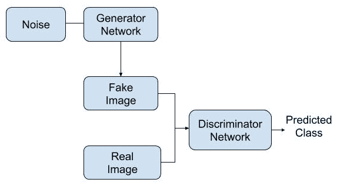
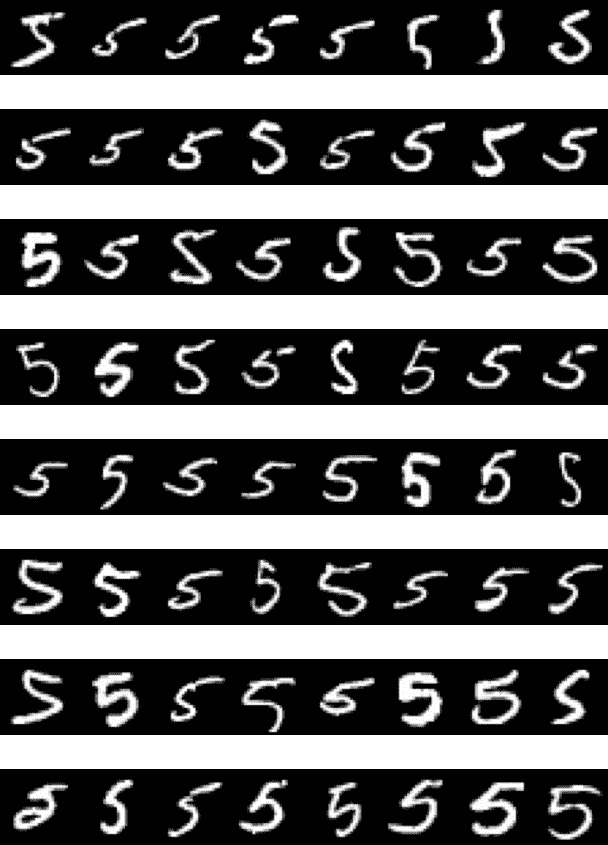
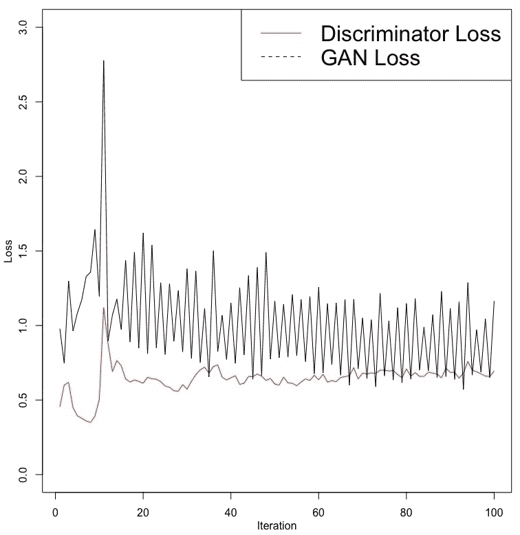
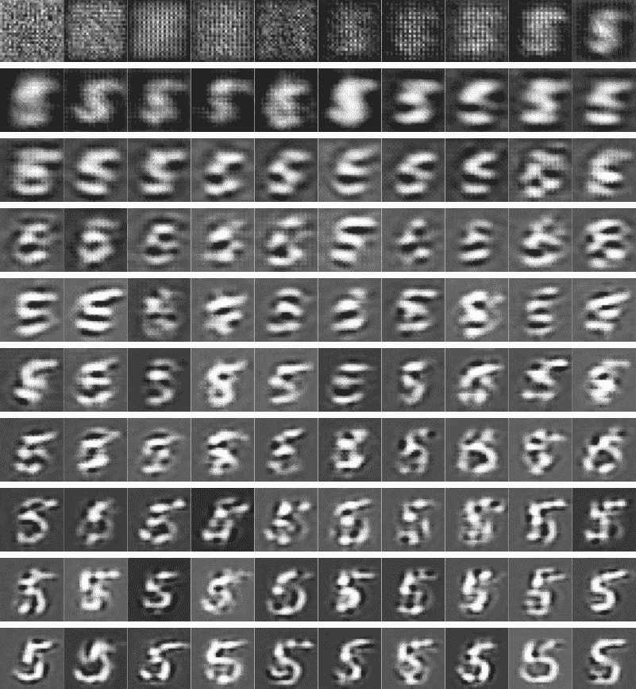
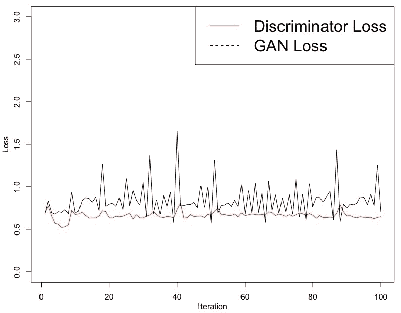
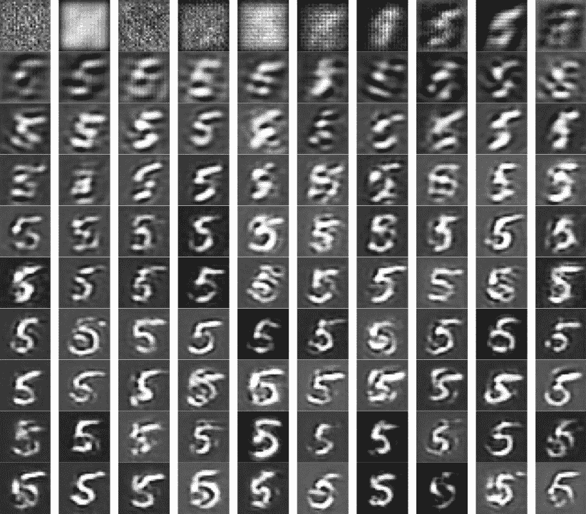
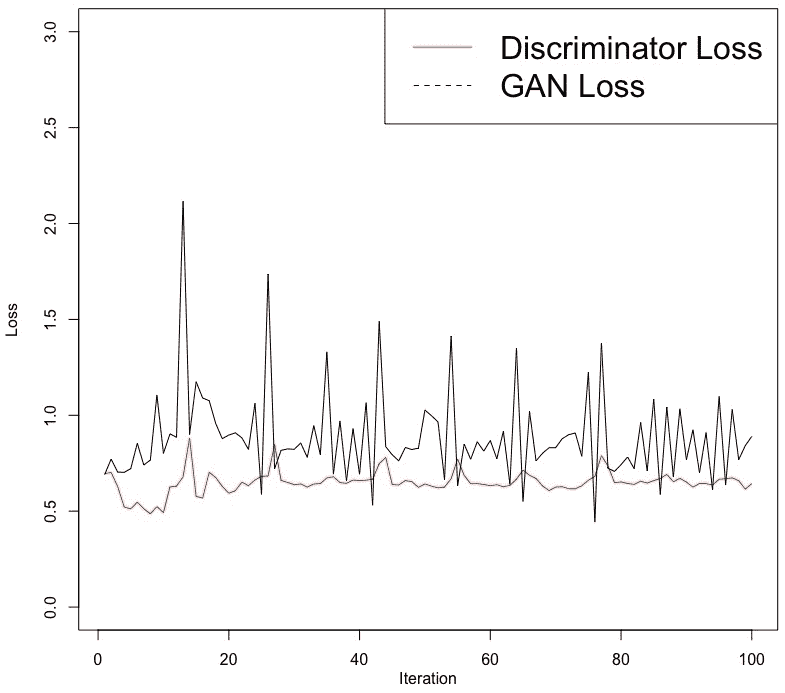
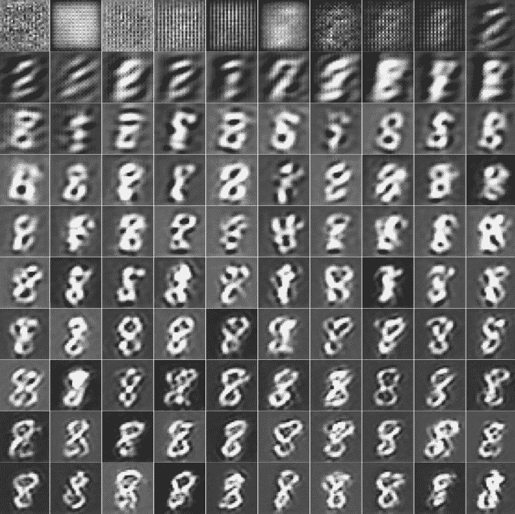

# 第九章：使用生成对抗网络创建新图像

本章通过一个实际示例说明了**生成对抗网络**（**GANs**）在生成新图像中的应用。到目前为止，本书通过图像数据展示了深度网络在图像分类任务中的应用。然而，在本章中，我们将探索一种有趣且流行的方法，帮助我们创造新图像。生成对抗网络已被应用于生成新图像、改善图像质量、生成新文本和新音乐。GAN 的另一个有趣应用是在异常检测领域。在这种情况下，训练一个 GAN 以生成被认为是正常的数据。当这个网络被用于重建被认为不正常或异常的数据时，结果中的差异可以帮助我们检测到异常的存在。本章将通过生成新图像的示例来探讨这一应用。

更具体地说，本章将涵盖以下主题：

+   生成对抗网络概述

+   处理 MNIST 图像数据

+   开发生成器网络

+   开发判别器网络

+   训练网络

+   评估结果

+   性能优化提示和最佳实践

# 生成对抗网络概述

GAN 利用两种网络：

+   生成器网络

+   判别器网络

对于生成器网络，输入的是噪声数据，这通常是从标准正态分布中生成的随机数。下面是展示生成对抗网络概述的流程图：



如前面的流程图所示，生成器网络使用噪声数据作为输入，并试图创建我们可以标记为假的图像。这些假图像及其标记为假的标签将作为输入提供给判别器网络。除了带标签的假图像，我们还可以提供带标签的真实图像作为输入给判别器网络。

在训练过程中，判别器网络尝试区分生成器网络创建的假图像和真实图像。在开发生成对抗网络的过程中，这一过程会持续进行，使得生成器网络尽最大努力生成判别器网络无法判断为假的图像。同时，判别器网络也会越来越擅长正确区分真假图像。

当生成器网络学会一致地产生训练数据中没有的图像，而判别器网络无法将其分类为假图像时，就算成功。在本章的真实图像中，我们将使用包含手写数字图像的 MNIST 训练数据。

在接下来的章节中，我们将阐明开发生成对抗网络的步骤，目标是生成手写数字五，数据来自于 MNIST 数据集。

# 处理 MNIST 图像数据

在本节中，我们将使用 Keras 库，Keras 库中也包括了 MNIST 数据。我们还将使用 EBImage 库，它对于处理图像数据非常有用。MNIST 数据包含了从 0 到 9 的手写图像。让我们来看一下以下代码，以便更好地理解这些数据：

```py
# Libraries and MNIST data
library(keras)
library(EBImage)
mnist <- dataset_mnist()
str(mnist)
List of 2
 $ train:List of 2
 ..$ x: int [1:60000, 1:28, 1:28] 0 0 0 0 0 0 0 0 0 0 ...
 ..$ y: int [1:60000(1d)] 5 0 4 1 9 2 1 3 1 4 ...
 $ test :List of 2
 ..$ x: int [1:10000, 1:28, 1:28] 0 0 0 0 0 0 0 0 0 0 ...
 ..$ y: int [1:10000(1d)] 7 2 1 0 4 1 4 9 5 9 ...
```

从前面的代码中，我们可以做出以下观察：

+   从这些数据的结构来看，我们可以看到训练数据中有 60,000 张图像，测试数据中有 10,000 张图像。

+   这些手写图像的尺寸是 28 x 28，且是黑白图像。这意味着它们只有一个通道。

在本章中，我们只会使用训练数据中的数字五来训练生成对抗网络，并生成新的数字五图像。

# 训练数据中的数字五

虽然可以开发一个生成对抗网络来生成所有 10 个数字，但对于刚开始的人来说，建议先从一个数字开始。让我们来看一下以下代码：

```py
# Data on digit five
c(c(trainx, trainy), c(testx, testy)) %<-% mnist
trainx <- trainx[trainy==5,,]
str(trainx)
 int [1:5421, 1:28, 1:28] 0 0 0 0 0 0 0 0 0 0 ...
summary(trainx)
   Min. 1st Qu.  Median    Mean 3rd Qu.    Max. 
   0.00    0.00    0.00   33.32    0.00  255.00 

par(mfrow = c(8,8), mar = rep(0, 4))
for (i in 1:64) plot(as.raster(trainx[i,,], max = 255))
par(mfrow = c(1,1))

```

如前面的代码所示，我们选择了包含数字五的图像，并将它们保存在`trainx`中。`trainx`的结构告诉我们，那里有 5,421 张这样的图像，且它们的尺寸为 28 x 28。总结函数显示，`trainx`中的值范围从 0 到 255。以下图像展示了训练数据中手写数字五的前 64 张图像：



这些手写图像显示出高度的变化性。这种变化性是预期中的，因为不同的人有不同的书写风格。虽然大多数数字书写清晰，易于识别，但也有一些不太清楚。

# 数据处理

为了准备接下来的步骤，我们将重塑`trainx`，使其维度变为 5,421 x 28 x 28 x 1，代码如下所示：

```py
# Reshaping data
trainx <- array_reshape(trainx, c(nrow(trainx), 28, 28, 1))
trainx <- trainx / 255
```

在这里，我们还将`trainx`中的值除以 255，得到一个值范围在 0 到 1 之间的数据。数据处理成所需格式后，我们可以继续开发生成器网络的架构。

# 开发生成器网络

生成器网络将用于从噪声形式提供的数据中生成假图像。在这一部分，我们将开发生成器网络的架构，并通过总结网络来看相关参数。

# 网络架构

让我们来看一下开发生成器网络架构的代码：

```py
# Generator network
h <- 28; w <- 28; c <- 1; l <- 28  
gi <- layer_input(shape = l)
go <- gi %>% layer_dense(units = 32 * 14 * 14) %>%
         layer_activation_leaky_relu() %>% 
         layer_reshape(target_shape = c(14, 14, 32)) %>% 
         layer_conv_2d(filters = 32, 
                       kernel_size = 5,
                       padding = "same") %>% 
         layer_activation_leaky_relu() %>% 
         layer_conv_2d_transpose(filters = 32, 
                                 kernel_size = 4,
                                 strides = 2,
                                 padding = "same") %>% 
         layer_activation_leaky_relu() %>% 
         layer_conv_2d(filters = 1, 
                       kernel_size = 5,
                       activation = "tanh", 
                       padding = "same")
g <- keras_model(gi, go)
```

在前面的代码中，我们可以观察到以下内容：

+   我们已指定高度（h）、宽度（w）、通道数（c）和潜在维度（l）分别为 28、28、1 和 28。

+   我们已经为生成器输入（gi）指定了输入形状为 28。在训练时，生成器网络将提供一个包含 28 个从标准正态分布中获得的随机数的输入，这些数值仅仅是噪声。

+   接下来，我们已经为生成器网络的输出（go）指定了架构。

+   最后一层是一个卷积 2D 层，激活函数为 `tanh`。在最后一层，我们将滤波器设置为 1，因为我们不使用彩色图像。

+   请注意，`layer_conv_2d_transpose` 的大小要求为 28 x 28。

+   生成器输出的维度将是 28 x 28 x 1。

+   其他使用的值，比如滤波器数量、`kernel_size` 或步幅等，可以稍后进行实验，如果你愿意探索改进结果。

+   `gi` 和 `go` 用于生成器网络（g）。

现在，让我们来看一下这个网络的总结。

# 生成器网络的总结

生成器网络的总结如下：

```py
# Summary of generator network model 
summary(g)
____________________________________________________________________________
Layer (type)                      Output Shape                 Param # 
============================================================================
input_7 (InputLayer)              [(None, 28)]                   0 
____________________________________________________________________________
dense_4 (Dense)                   (None, 6272)                181888 
____________________________________________________________________________
leaky_re_lu_8 (LeakyReLU)         (None, 6272)                   0 
____________________________________________________________________________
reshape_2 (Reshape)               (None, 14, 14, 32)             0 
____________________________________________________________________________
conv2d_6 (Conv2D)                 (None, 14, 14, 32)            25632 
____________________________________________________________________________
leaky_re_lu_9 (LeakyReLU)          (None, 14, 14, 32)             0 
____________________________________________________________________________
conv2d_transpose_2 (Conv2DTranspose) (None, 28, 28, 32)         16416 
____________________________________________________________________________
leaky_re_lu_10 (LeakyReLU)          (None, 28, 28, 32)            0 
____________________________________________________________________________
conv2d_7 (Conv2D)                    (None, 28, 28, 1)           801 
============================================================================
Total params: 224,737
Trainable params: 224,737
Non-trainable params: 0
_______________________________________________________________________________________
```

生成器网络的总结显示了输出的形状和每一层的参数数量。请注意，最终的输出形状是 28 x 28 x 1。生成的假图像将具有这些维度。总体而言，该网络有 224,737 个参数。

现在我们已经指定了生成器网络的结构，接下来可以开发鉴别器网络的架构。

# 开发鉴别器网络

鉴别器网络将用于分类真假图像。本节将讨论该网络的架构和总结。

# 架构

开发鉴别器网络架构所用的代码如下：

```py
# Discriminator network
di <- layer_input(shape = c(h, w, c))
do <- di %>% 
         layer_conv_2d(filters = 64, kernel_size = 4) %>% 
         layer_activation_leaky_relu() %>% 
         layer_flatten() %>%
         layer_dropout(rate = 0.3) %>%  
         layer_dense(units = 1, activation = "sigmoid")
d <- keras_model(di, do)
```

从前面的代码中，我们可以观察到以下几点：

+   我们为输入形状（di）提供了 h = 28，w = 28 和 c = 1。这是训练网络时使用的假图像和真实图像的维度。

+   在鉴别器输出的最后一层（do）中，我们将激活函数指定为 `sigmoid`，单位数设置为 1，因为图像要么被判定为真实，要么被判定为假。

+   `di` 和 `do` 用于鉴别器网络模型（d）。

# 鉴别器网络的总结

鉴别器网络的总结显示了每一层的输出形状和参数数量：

```py
# Summary of discriminator network model 
summary(d)
___________________________________________________
Layer (type) Output Shape Param # 
===================================================
input_10 (InputLayer) [(None, 28, 28, 1)] 0 
___________________________________________________
conv2d_12 (Conv2D) (None, 25, 25, 64) 1088 
____________________________________________________
leaky_re_lu_17 (LeakyReLU) (None, 25, 25, 64) 0 
____________________________________________________
flatten_2 (Flatten) (None, 40000) 0 
____________________________________________________
dropout_2 (Dropout) (None, 40000) 0 
____________________________________________________
dense_7 (Dense) (None, 1) 40001 
====================================================
Total params: 41,089
Trainable params: 41,089
Non-trainable params: 0
_____________________________________________________
```

这里，第一层的输出是 28 x 28 x 1 的大小，这与假图像和真实图像的维度相匹配。总参数量为 41,089。

现在，我们可以使用以下代码编译鉴别器网络模型：

```py
# Compile discriminator network
d %>% compile(optimizer = 'rmsprop',
         loss = "binary_crossentropy")
```

这里，我们已经使用 `rmsprop` 优化器编译了鉴别器网络。对于损失，我们指定了 `binary_crossentropy`。

接下来，我们冻结鉴别器网络的权重。请注意，我们在编译鉴别器网络后冻结这些权重，以便它们仅应用于 `gan` 模型：

```py
# Freeze weights and compile
freeze_weights(d) 
gani <- layer_input(shape = l)
gano <- gani %>% g %>% d
gan <- keras_model(gani, gano)
gan %>% compile(optimizer = 'rmsprop', 
                loss = "binary_crossentropy")
```

在这里，生成对抗网络的输出（gano）使用了生成器网络和权重被冻结的判别器网络。生成对抗网络（gan）是基于`gani`和`gano`的。然后，使用`rmsprop`优化器编译网络，并将损失函数指定为`binary_crossentropy`。

现在，我们准备好训练网络了。

# 网络训练

在这一部分，我们将进行网络训练。在训练过程中，我们将保存假图像并存储损失值，以便回顾训练进展。它们将帮助我们评估网络在生成逼真假图像时的效果。

# 用于保存假图像和损失值的初始设置

我们将从指定一些训练过程所需的内容开始。让我们看一下以下代码：

```py
# Initial settings
b <- 50  
setwd("~/Desktop/")
dir <- "FakeImages"
dir.create(dir)
start <- 1; dloss <- NULL; gloss <- NULL
```

从前面的代码中，我们可以观察到以下几点：

+   我们将使用 50 的批量大小（b）。

+   我们将在桌面上创建的`FakeImages`目录中保存假图像。

+   我们还将使用判别器损失值（dloss）和 GAN 损失值（gloss），这两个值都初始化为`NULL`。

# 训练过程

接下来，我们将训练模型。这里，我们将使用 100 次迭代。让我们来看一下这段代码，它已经总结成五个要点：

```py
# 1\. Generate 50 fake images from noise
for (i in 1:100) {noise <- matrix(rnorm(b*l), nrow = b, ncol= l)}
fake <- g %>% predict(noise)

# 2\. Combine real & fake images
stop <- start + b - 1 
real <- trainx[start:stop,,,]
real <- array_reshape(real, c(nrow(real), 28, 28, 1))
rows <- nrow(real)
both <- array(0, dim = c(rows * 2, dim(real)[-1]))
both[1:rows,,,] <- fake
both[(rows+1):(rows*2),,,] <- real
labels <- rbind(matrix(runif(b, 0.9,1), nrow = b, ncol = 1),
 matrix(runif(b, 0, 0.1), nrow = b, ncol = 1))
start <- start + b

# 3\. Train discriminator
dloss[i] <- d %>% train_on_batch(both, labels) 

# 4\. Train generator using gan 
fakeAsReal <- array(runif(b, 0, 0.1), dim = c(b, 1))
gloss[i] <- gan %>% train_on_batch(noise, fakeAsReal) 

# 5\. Save fake image
f <- fake[1,,,] 
dim(f) <- c(28,28,1)
image_array_save(f, path = file.path(dir, paste0("f", i, ".png")))}
```

在前面的代码中，我们可以观察到以下几点：

1.  我们首先模拟来自标准正态分布的随机数据点，并将结果保存为噪声。然后，我们使用生成器网络`g`从包含随机噪声的数据中生成假图像。注意，`noise`的尺寸为 50 x 28，而`fake`的尺寸为 50 x 28 x 28 x 1，并且在每次迭代中包含 50 张假图像。

1.  我们根据批量大小更新 start 和 stop 的值。在第一次迭代中，start 和 stop 的值分别为 1 和 50；在第二次迭代中，start 和 stop 的值分别为 51 和 100。同样，在第 100 次迭代中，start 和 stop 的值分别为 4,951 和 5,000。由于包含手写数字 5 的`trainx`包含超过 5,000 张图像，因此在这 100 次迭代中没有任何图像会被重复。因此，在每次迭代中，都会选择 50 张真实图像并存储在`real`中，`real`的尺寸为 50 x 28 x 28。我们使用 reshape 来改变其尺寸为 50 x 28 x 28 x 1，以便与假图像的尺寸匹配。

1.  然后，我们创建了一个名为`both`的空数组，大小为 100 x 28 x 28 x 1，用于存储真实和伪造的图像数据。`both`中的前 50 张图像包含伪造数据，而接下来的 50 张图像包含真实图像。我们还生成了 50 个介于 0.9 和 1 之间的随机数，使用均匀分布来作为伪造图像的标签，并生成 50 个介于 0 和 0.1 之间的随机数，作为真实图像的标签。请注意，我们没有使用 0 代表真实图像，1 代表伪造图像，而是引入了一些随机性或噪声。在训练网络时，人工引入标签值中的噪声有助于提升效果。

1.  我们使用`both`中包含的图像数据和`labels`中包含的正确类别信息来训练判别器网络。我们还将判别器的损失值保存在`dloss`中，记录所有 100 次迭代的结果。如果判别器网络能够很好地分类伪造图像和真实图像，那么这个损失值将会较低。

1.  我们尝试通过将包含介于 0 和 0.1 之间的随机值的噪声标记为真实图像来欺骗网络。这些产生的损失值会保存在`gloss`中，记录所有 100 次迭代的结果。如果网络能够很好地展示伪造图像并将其分类为真实图像，那么这个损失值将会较低。

1.  我们保存了每 100 次迭代中的第一张伪造图像，以便我们可以回顾并观察训练过程的影响。

请注意，通常生成对抗网络的训练过程需要大量的计算资源。然而，我们这里使用的示例旨在快速展示这个过程是如何工作的，并在合理的时间内完成训练过程。在 100 次迭代和 8 GB RAM 的计算机上，运行所有代码应该不到一分钟。

# 审查结果

在本节中，我们将回顾从 100 次迭代中获得的网络损失值。我们还将查看从第一次到第 100 次迭代中使用伪造图像的进展。

# 判别器和 GAN 损失

我们从 100 次迭代中获得的判别器和 GAN 损失值可以绘制如下图。判别器损失基于伪造图像和真实图像的损失值：



从前面的图表中，我们可以做出以下观察：

+   判别器网络和 GAN 的损失值在前 20 次迭代中显示出较大的波动。这种波动是学习过程的结果。

+   判别器和生成器网络相互竞争，并努力做得比对方更好。当一个网络表现更好时，往往是以另一个网络的代价为前提。这也是为什么，如果将`dloss`和`gloss`绘制在散点图上，我们会期望看到它们之间有一定的负相关关系。虽然这种相关性不一定是完全负相关，但整体模式应该显示出负相关的关系。从长远来看，两个损失值预计会趋于收敛。

+   从 GAN 获得的损失值波动比从判别器网络获得的损失值更大。

+   在约 50 次迭代后，我们注意到判别器的损失值出现了小幅但逐渐增加的趋势。这表明，判别器网络在区分由生成器网络生成的真实与假图像时变得越来越困难。

+   请注意，损失值的增加不一定是负面结果。在这种情况下，这是积极反馈，表明将生成器网络与判别器网络对抗的方式正在产生效果。这意味着生成器网络能够生成越来越像真实图像的假图像，并帮助我们实现主要目标。

# 假图像

我们将使用以下代码读取假图像并进行绘制：

```py
# Fake image data
library(EBImage)
setwd("~/Desktop/FakeImages")
temp = list.files(pattern = "*.png")
mypic <- list()
for (i in 1:length(temp)) {mypic[[i]] <- readImage(temp[[i]])}
par(mfrow = c(10,10))
for (i in 1:length(temp)) plot(mypic[[i]])
```

在前面的代码中，我们利用 EBImage 库来处理假图像数据。我们读取了保存在`FakeImages`目录中的所有 100 张图像。现在，我们可以将所有图像绘制成一个 10 x 10 的网格，如下图所示：



在前面的图像中，展示了每次 100 次迭代中的第一张假图像。从中我们可以做出以下观察：

+   第一行的前十张图像代表了前 10 次迭代。

+   第一张图像仅仅反映了随机噪声。当迭代达到第 10 次时，图像开始捕捉到手写数字“5”的本质。

+   当网络训练经过第 91 到第 100 次迭代时，数字“5”变得更加清晰可见。

在接下来的部分，我们将通过在网络中进行一些更改并观察其对网络训练过程的影响来进行实验。

# 性能优化技巧和最佳实践

在这一部分，我们将通过在生成器网络和判别器网络中插入额外的卷积层来进行实验。通过这个实验，我们将传达性能优化技巧和最佳实践。

# 生成器和判别器网络的变化

生成器网络中的变化如下代码所示：

```py
# Generator network
gi <- layer_input(shape = l)
go <- gi %>% layer_dense(units = 32 * 14 * 14) %>%
         layer_activation_leaky_relu() %>% 
         layer_reshape(target_shape = c(14, 14, 32)) %>% 
         layer_conv_2d(filters = 32, 
                       kernel_size = 5,
                       padding = "same") %>% 
         layer_activation_leaky_relu() %>% 
         layer_conv_2d_transpose(filters = 32, 
                                 kernel_size = 4,
                                 strides = 2, 
                                 padding = "same") %>% 
         layer_activation_leaky_relu() %>%      
         layer_conv_2d(filters = 64, 
                      kernel_size = 5, 
                      padding = "same") %>% 
         layer_activation_leaky_relu() %>% 
         layer_conv_2d(filters = 1, 
                       kernel_size = 5,
                       activation = "tanh", 
                       padding = "same")
g <- keras_model(gi, go)
```

在这里，我们可以看到，在生成器网络中，我们在倒数第二层之前添加了`layer_conv_2d`和`layer_activation_leaky_relu`层。生成器网络的参数总数已增加到 276,801。

判别器网络的变化如下代码所示：

```py
# Discriminator network
di <- layer_input(shape = c(h, w, c))
do <- di %>% 
         layer_conv_2d(filters = 64, kernel_size = 4) %>% 
         layer_activation_leaky_relu() %>% 
         layer_conv_2d(filters = 64, kernel_size = 4, strides = 2) %>% 
         layer_activation_leaky_relu() %>% 
         layer_flatten() %>%
         layer_dropout(rate = 0.3) %>%  
         layer_dense(units = 1, activation = "sigmoid")
d <- keras_model(di, do)
```

在这里，我们在判别器网络的展平层之前添加了`layer_conv_2d`和`layer_activation_leaky_relu`层。判别器网络中的参数数量已增加到 148,866 个。我们保持其他一切不变，然后再次训练该网络 100 次迭代。

现在，我们可以评估这些变化的影响。

# 这些变化对结果的影响

判别器和 GAN 的损失值可以绘制成如下图表：



从前面的图表中，我们可以观察到以下几点：

+   通过增加层数，判别器和 GAN 网络的损失值波动比我们之前获得的结果减少了。

+   在某些迭代中观察到的峰值或高损失值表明，相应的网络在与另一个网络对抗时遇到困难。

+   与判别器网络相关的损失相比，GAN 损失值的波动性仍然较高。

以下图表展示了每 100 次迭代中的第一张假图像：



从前面的图像中，我们可以观察到以下几点：

+   在生成器和判别器网络中增加了卷积层后，网络开始更早生成出类似手写数字五的图像。

+   在之前的网络中，直到大约 70-80 次迭代时，才会出现始终看起来像手写数字五的假图像。

+   由于使用了额外的层，我们可以看到数字五在大约 20-30 次迭代后开始一致地形成，这表明有所改进。

接下来，我们将尝试使用该网络生成另一张手写数字。

# 生成手写数字八的图像

在本实验中，我们将使用与之前相同的网络架构。然而，我们将使用它来生成手写数字八的图像。该实验中 100 次迭代的判别器和 GAN 损失值可以绘制如下图表：



从前面的图表中，我们可以得出以下观察：

+   判别器和 GAN 的损失值显示出波动性，并且这种波动性随着迭代次数从 1 到 100 的增加而逐渐减小。

+   随着网络训练的进行，GAN 损失值在某些间隔中的高峰逐渐减少。

每次迭代中的第一张假图像的图表如下：



与数字五相比，数字八在开始形成可识别的模式之前需要更多的迭代次数。

在本节中，我们在生成器和判别器网络中实验了额外的卷积层。因此，我们可以得出以下观察：

+   额外的卷积层似乎对更快生成类似手写数字五的假图像有积极影响。

+   尽管本章参考的数据结果还算不错，但对于其他数据，我们可能需要对模型架构进行其他更改。

+   我们还使用了相同架构的网络来生成看起来逼真的手写数字八的假图片。观察到，对于数字八，需要更多的训练迭代才能开始出现可识别的模式。

+   注意，一次生成所有 10 个手写数字的网络可能会更复杂，可能需要更多的迭代次数。

+   类似地，如果我们有颜色图像的尺寸显著大于我们在本章中使用的 28 x 28，我们将需要更多的计算资源，任务也将更具挑战性。

# 概要

在本章中，我们使用生成对抗网络演示了如何生成单个手写数字的图像。生成对抗网络利用两个网络：生成器和鉴别器网络。生成器网络从包含随机噪声的数据中创建假图像，而鉴别器网络则训练用于区分假图像和真实图像。这两个网络相互竞争，以便创建逼真的假图像。尽管本章提供了使用生成对抗网络生成新图像的示例，但这些网络也被知道在生成新文本或新音乐以及异常检测方面有应用。

在本节中，我们讨论了用于处理图像数据的各种深度学习网络。在下一节中，我们将介绍用于自然语言处理的深度学习网络。
